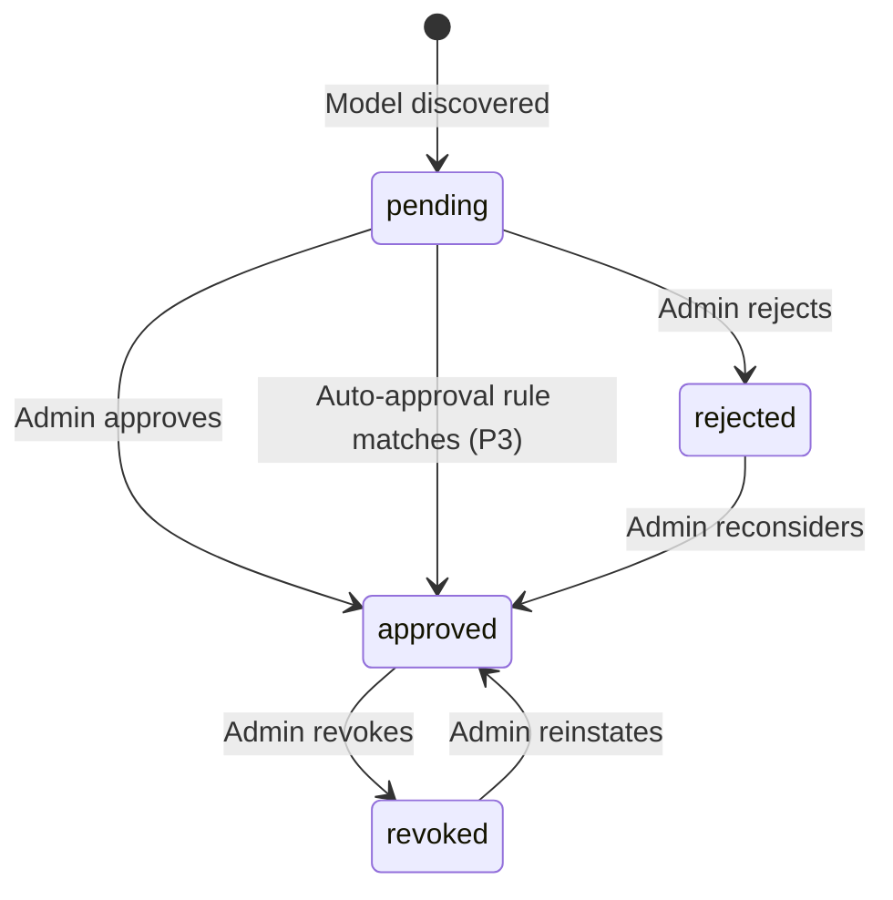

# PRD: Model Registry

<!-- toc -->

- [1. Overview](#1-overview)
  - [Purpose](#purpose)
  - [Background / Problem Statement](#background--problem-statement)
  - [Goals (Business Outcomes)](#goals-business-outcomes)
  - [Glossary](#glossary)
- [2. Actors](#2-actors)
  - [Human Actors](#human-actors)
  - [System Actors](#system-actors)
- [3. Operational Concept & Environment](#3-operational-concept--environment)
- [4. Scope](#4-scope)
  - [In Scope](#in-scope)
  - [Out of Scope](#out-of-scope)
- [5. Domain Model](#5-domain-model)
  - [Core Entities](#core-entities)
- [6. Functional Requirements](#6-functional-requirements)
  - [P1 — Core (MVP) — Manual Model Management](#p1--core-mvp--manual-model-management)
  - [P2 — Discovery & Approval Service Integration](#p2--discovery--approval-service-integration)
  - [P3 — Enhanced Features](#p3--enhanced-features)
  - [P4 — Fine-Grained Access Control](#p4--fine-grained-access-control)
- [7. Auditable Operations](#7-auditable-operations)
- [8. Non-Functional Requirements](#8-non-functional-requirements)
  - [Performance](#performance)
  - [Availability](#availability)
  - [Scale](#scale)
  - [Discovery Plugin Isolation](#discovery-plugin-isolation)
  - [Discovery Plugin Extensibility](#discovery-plugin-extensibility)
- [9. Error Codes](#9-error-codes)
- [10. Security Considerations](#10-security-considerations)
- [11. Consumers](#11-consumers)
- [12. Public Library Interfaces](#12-public-library-interfaces)
  - [External Integration Contracts](#external-integration-contracts)
- [13. Use Cases](#13-use-cases)
  - [UC-001: Get Tenant Model](#uc-001-get-tenant-model)
  - [UC-002: List Tenant Models](#uc-002-list-tenant-models)
  - [UC-003: Model Discovery](#uc-003-model-discovery)
  - [UC-004: Model Approval](#uc-004-model-approval)
  - [UC-005: Model Revocation](#uc-005-model-revocation)
  - [UC-006: Register Provider](#uc-006-register-provider)
  - [UC-007: Disable Provider](#uc-007-disable-provider)
  - [UC-008: Re-enable Provider](#uc-008-re-enable-provider)
  - [UC-009: Get Model Provider Cost](#uc-009-get-model-provider-cost)
  - [UC-010: Configure Auto-Approval Rule](#uc-010-configure-auto-approval-rule)
  - [UC-011: Get Provider Discovery Health](#uc-011-get-provider-discovery-health)
  - [UC-012: Create Alias](#uc-012-create-alias)
  - [UC-013: Resolve Alias](#uc-013-resolve-alias)
  - [UC-014: Handle Database Unavailability](#uc-014-handle-database-unavailability)
  - [UC-015: Handle Tenant Re-parenting](#uc-015-handle-tenant-re-parenting)
  - [UC-016: Bulk Approve Models](#uc-016-bulk-approve-models)
  - [UC-017: Trigger Discovery](#uc-017-trigger-discovery)
  - [UC-025: Add a New Provider Discovery Plugin](#uc-025-add-a-new-provider-discovery-plugin)
  - [UC-026: Auto-Discover Models via Plugin](#uc-026-auto-discover-models-via-plugin)
  - [UC-018: Approve Model for User Group](#uc-018-approve-model-for-user-group)
  - [UC-019: Override User Access](#uc-019-override-user-access)
  - [UC-020: Manually Manage Model Catalog](#uc-020-manually-manage-model-catalog)
  - [UC-027: List All Tenant Models (Management)](#uc-027-list-all-tenant-models-management)
  - [UC-021: Create Tag](#uc-021-create-tag)
  - [UC-022: Delete Tag](#uc-022-delete-tag)
  - [UC-023: Assign / Remove Tags on Model](#uc-023-assign--remove-tags-on-model)
  - [UC-024: List Tags](#uc-024-list-tags)
- [14. Acceptance Criteria](#14-acceptance-criteria)
- [15. Dependencies](#15-dependencies)
- [16. Assumptions](#16-assumptions)
- [17. Risks](#17-risks)
- [18. Open Questions](#18-open-questions)
- [19. Migration & Rollback](#19-migration--rollback)
- [20. Traceability](#20-traceability)

<!-- /toc -->

## 1. Overview

### Purpose

**Purpose**: Model Registry provides a centralized catalog of AI models with tenant-level availability and approval workflows.

Model Registry is the authoritative source for model metadata, capabilities, provider cost data, and tenant access control. It tracks which models are available from which providers and manages approval workflows. LLM Gateway queries the registry to resolve model identifiers to provider endpoints and verify tenant access.

**Key Concepts**:

- **Canonical Model ID**: Deterministic identifier in format `{provider_slug}::{provider_model_id}` (e.g., `openai-prod::gpt-4o`, `ollama-us-west::mistral`). Parsing rule: split on **first** `::` occurrence. It is a **lookup key for the eval read only**, not an addressing key: because provider slugs shadow down the hierarchy, one canonical ID names different models for different tenants.
- **Provider Slug**: Human-readable unique identifier for a specific provider configuration (instance). Different instances of the same provider type have different slugs (e.g., `azure-corp-global`, `azure-rnd-team`, `ollama-us-west`, `ollama-us-east`). Each slug represents a separate provider with its own credentials and configuration. Unique within a tenant, not across the hierarchy.
- **Identifier split**: the eval read (`get_tenant_model`) takes a canonical model ID, because an inference caller holds nothing else. Every management operation — read, create, update, soft-delete, on both models and providers — takes the entity's **UUID `id`**. Slugs and canonical IDs appear in management requests only where a name is being *assigned* (a provider's `slug` on create), and in responses.
- **Tenant Hierarchy**: Tree structure with root tenant at top; providers and approvals inherit down the tree (additive only)
- **Provider Plugins**: Each provider type has its own plugin; all requests route through Outbound API Gateway

**Provider Slug Examples**:

| Provider Type | Slug | Tenant | Description |
|---------------|------|--------|-------------|
| `azure` | `azure-prod` | root | Platform-wide Azure production |
| `azure` | `azure-prod` | tenant-A | Tenant A's own Azure (shadows root) |
| `openai` | `openai` | root | Platform OpenAI account |
| `ollama` | `ollama-local` | tenant-B | Tenant B's self-hosted Ollama |

**Provider Slug Resolution**: When resolving `{provider_slug}::{model_id}`, the system searches tenant → parent → ... → root (same as alias resolution). Child tenant's provider with same slug **shadows** parent's provider — and, because a model always belongs to exactly one provider owned by the same tenant (see Domain Model → Model), shadowing also replaces the parent's entire model set for that provider slug within the child's subtree.

**Shadowing Example**:
- Root tenant configures `azure-prod` pointing to platform Azure subscription, with model `azure-prod::gpt-4o` discovered under it
- Tenant A configures its own `azure-prod` provider (same slug, its own corporate Azure subscription) — a distinct provider row, owned by Tenant A
- Root's `azure-prod::gpt-4o` is no longer visible anywhere in Tenant A's subtree; Tenant A sees no models under `azure-prod` until it creates or discovers its own (manually or via auto-discovery, always under Tenant A's own provider row)
- If Tenant A later discovers or manually creates `azure-prod::gpt-4o` itself, that is a new, independent model row — approval, capabilities, and cost are Tenant A's own, unrelated to root's
- When Tenant B (no override) requests `azure-prod::gpt-4o`, it still resolves to root's provider and model

**Implication**: The same canonical ID string can resolve to entirely different provider+model rows depending on tenant context, but never to a mix of one tenant's provider and another tenant's model — a model is only ever created in the same tenant as its provider (manually by a tenant admin, or by the auto-discovery plugin running for that tenant/provider pair). A child tenant cannot attach, override, or independently approve a single model on an ancestor's provider; the only lever it has over an inherited provider's models is to shadow the whole provider (see Domain Model → Provider → Inheritance & Shadowing).

**Target Users**:

- **LLM Gateway** — Primary consumer for model resolution and availability checks
- **Tenant Administrators** — Approve/reject models, manage tenant-specific providers
- **Platform Administrators** — Configure root tenant providers

**Key Problems Solved**:

- **Model discovery**: Automatic polling of provider APIs to discover available models
- **Unified identification**: Canonical IDs abstract provider-specific naming
- **Access control**: Tenant-level approval workflow with hierarchical inheritance
- **Provider cost data**: AICredits-denominated cost carried on model info in the provider's own cost structure — used as input for billing calculations, not user-facing pricing

**Success Criteria**:

- Model resolution latency < 10ms P99
- 99.9% availability

### Background / Problem Statement

LLM Gateway requires a centralized source of truth for model availability, capabilities, and provider cost. Without Model Registry, each consumer would need to maintain its own model catalog, leading to inconsistency and duplicated approval workflows.

### Goals (Business Outcomes)

1. Single source of truth for AI model metadata across the platform — including both unmanaged models (cloud, frontier) and managed models (local, self-hosted)
2. Tenant-controlled model availability with inheritance from parent tenants
3. Streamlined approval process

### Glossary

| Term | Definition |
|------|------------|
| AICredits | Internal platform currency for model usage cost/pricing |
| Provider Cost | Raw cost data from providers in AICredits, stored as part of model info in the provider's own cost structure; NOT user-facing pricing |
| OAGW | Outbound API Gateway - handles provider authentication and circuit breaking |
| GTS | Global Type System - platform-wide type definitions and contracts |
| GTS Type (Provider) | Versioned provider type identifier (e.g., `gts.cf.genai.model.provider.v1~msft.azure._.ai_studio.v1~`) |
| Root Tenant | Top-level tenant from which all other tenants inherit |
| Canonical ID | Unique model identifier in format `{provider_slug}::{provider_model_id}` |
| Provider Slug | Human-readable unique identifier for a provider instance (e.g., `azure-corp-global`) |
| Provider Plugin | Module responsible for communication with specific LLM provider |
| Discovery Plugin | A per-provider-type plugin implementing the discovery plugin contract (`cpt-cf-model-registry-contract-discovery-plugin`); it accepts a GTS-typed discovery-settings payload, queries the provider for available models via OAGW, and returns model definitions to the registry. A specialization of the general Provider Plugin concept, scoped to model-catalog discovery. |
| Model Definition | The structured record produced by a discovery plugin for a single discovered model; contains at minimum the provider-assigned model identifier, display name, and capability flags required for catalog ingestion (see `cpt-cf-model-registry-fr-discovery-model-output`). |
| Tag | Free-form label associated with a model (e.g., `best for reasoning`, `lightweight`); managed independently of models and used for discovery/filtering |

## 2. Actors

### Human Actors

#### Tenant Administrator

**ID**: `cpt-cf-model-registry-actor-tenant-admin`

**Role**: Approves or rejects models created under their own tenant's providers. Manages tenant-specific providers, including shadowing or disabling an inherited provider to restrict what its subtree sees. Can only restrict access compared to parent tenant, not expand — and cannot approve, reject, or otherwise override an individual model owned by an ancestor tenant; the only lever is shadowing the ancestor's provider.

#### Platform Administrator

**ID**: `cpt-cf-model-registry-actor-platform-admin`

**Role**: Manages root tenant configuration. Configures global providers. Sets baseline that all tenants inherit.

### System Actors

#### LLM Gateway

**ID**: `cpt-cf-model-registry-actor-llm-gateway`

**Role**: Queries registry to resolve model identifiers (canonical ID) to provider details. Checks tenant availability. Retrieves model capabilities and provider cost.

## 3. Operational Concept & Environment

Project-wide runtime, OS, architecture, lifecycle policy, and integration patterns are defined in the root PRD. Model Registry has no module-specific deviations from those defaults.

## 4. Scope

### In Scope

- Model catalog CRUD (models, providers)
- Tenant-level model availability configuration
- Approval workflows (request → approve/reject)
- Provider cost metadata as part of model info (provider-specific cost structure, AICredits) — raw cost from providers, not user-facing pricing
- Model capabilities metadata
- Cache management with TTL-based invalidation

### Out of Scope

| Item | Reason / Owner |
|------|----------------|
| LLM inference execution | LLM Gateway |
| Provider credential management | OAGW |
| User-facing pricing (promos, discounts, tiered, regional) | License Manager |
| Usage metering & billing | License Manager |
| Tenant hierarchy management | Tenant Resolver |
| Rate limiting (limit definition and enforcement) | Infrastructure / OAGW |
| Discovery concurrency limits & staggering across providers | Caller / external scheduler (the module exposes a per-provider trigger and embeds no scheduler) |
| Inference/routing health monitoring | OAGW (per-route, per-tenant-key availability) |
| Approval workflow engine | Generic Approval Service (Model Registry integrates with it) |
| Audit log storage & retention | Core platform (§16 Assumption 7) |
| Model fine-tuning / training | Not in scope for v1 |
| Provider API contracts | Each provider plugin |
| Provider plugin architecture | DESIGN.md |
| Notifications | Separate notification system |

## 5. Domain Model

### Core Entities

#### Provider

Represents a configured AI provider instance for a tenant.

**Fields**:
- `id`: Internal unique identifier (UUID)
- `slug`: Human-readable unique identifier (e.g., `azure-corp-global`, `ollama-us-west`). Used in canonical model IDs. Immutable after creation.
- `tenant_id`: Owner tenant
- `name`: Display name
- `gts_type`: GTS type identifier for provider (e.g., `gts.cf.genai.model.provider.v1~msft.azure._.ai_studio.v1~`)
- `status`: `active` | `disabled`
- `discovery`: Discovery config (enabled, interval)
- `timestamps`: created_at, updated_at

**Connection details**: There is no generic `base_url` (or equivalent endpoint) field on Provider. Routing and connection parameters are provider-type-specific and live in the GTS-typed provider settings, present only for the provider types that need them — locally hosted providers, for example, need none.

**GTS Type Benefits**:
- Versioned metadata schema per provider type (settings, UI configurations)
- Vendor and service encoded (distinguish `deepseek` as vendor vs `deepseek` hosted by nvidia)
- Native access control (grant/revoke access to specific provider types)
- Artifact lifecycle management (see all per-vendor artifacts in one place)

**Slug constraints**:
- 1-64 chars, lowercase alphanumeric + hyphen
- Unique within tenant (same slug can exist in different tenants)
- Immutable after creation — changing slug would invalidate all model references

**Inheritance & Shadowing**:
- Providers inherit down tenant hierarchy (additive)
- Child tenant sees parent's providers + own
- Child tenant CAN shadow an inherited provider by creating a provider with the same slug (regardless of the shadow's `status`)
- Shadowing completely replaces the parent's provider **and every model attached to it** for that tenant and its descendants — those inherited models become unavailable in the child's subtree; the shadowing provider starts with no models of its own until the child creates them (manually) or discovers them (auto-discovery)
- Resolution order: tenant → parent → ... → root (first match wins)

**A model belongs to its provider's tenant**: A model always belongs to exactly one provider, and a model's `tenant_id` MUST equal its provider's `tenant_id`. Creation names its provider by `id`, resolves it within the caller's access scope, and writes the model into that provider's tenant — so a tenant admin holding an own-tenant-only grant cannot create a model against another tenant's provider, whether or not that provider is shadowed. The only way a child tenant changes what it sees from an ancestor's provider is by shadowing the provider itself (above); there is no per-model shadowing.

**Inheritance applies to the eval reads only**: additive visibility and provider shadowing govern `GET /v1/models` and `GET /v1/models/{canonical_id}`. The admin endpoints operate on the tenants the PDP grants and never walk the hierarchy (see §6 Authorization).

**Disabling a provider**: Disabling a provider — whether it is the tenant's own provider or a shadow of an inherited one — makes **every model attached to it unavailable for eval** in that tenant's subtree, in addition to suspending auto-discovery and refusing creation of new models against it. Disabled providers and their models remain visible via management/admin listing (see `cpt-cf-model-registry-fr-list-tenant-models-management`) so admins can audit and re-enable them. Re-enabling restores eval availability for its models (each still subject to its own approval status).

Example: Root has `azure-prod` (active) with model `azure-prod::gpt-4o` (approved). Tenant A shadows with its own `azure-prod`:
- Whether Tenant A's shadow is `active` or `disabled`, root's `azure-prod::gpt-4o` is no longer available for eval anywhere in Tenant A's subtree.
- If Tenant A's shadow is `active`, Tenant A can create or discover its own models under it.
- If Tenant A later disables its own `azure-prod`, every model Tenant A created under it also becomes unavailable for eval, without deleting them.

**Health**: ProviderHealth stored at provider's owner tenant only. Child tenants inherit health status from parent.

#### Model

Represents an AI model in the catalog.

**Ownership**: A model belongs to exactly one provider (`provider_id`). `tenant_id` always equals that provider's owning tenant — a model can only be created (manually or via auto-discovery) in the same tenant that owns its provider; see Provider → Inheritance & Shadowing → "Model creation is same-tenant only".

**Fields**:
- **Identification**: canonical_id (`{provider_slug}::{provider_model_id}`), provider_id, tenant_id, provider_model_id
- **Display**: name, description
- **Lifecycle**: lifecycle_status (GTS type for access control)
- **Infrastructure** (for local/managed LLMs):
  - `managed`: boolean — whether Gears can load/unload this model
  - `architecture`: string — model architecture (e.g., `qwen`, `llama`, `mistral`, `gpt`)
  - `size_bytes`: integer — model size in bytes (for capacity planning)
  - `format`: string — model format (e.g., `gguf`, `mlx`, `safetensors`, `api-only`)
- **Capabilities (Tier 1)**: vision (image input), image generation, audio input, audio output, document/file input, tools, structured_output, streaming, code interpreter, web search, and the reasoning controls. Media capabilities carry their accepted media types alongside the on/off flag. Which API surfaces a model exposes (completion, embedding, batch) is carried by `supported_api`, not by a capability flag
- **Limits (Tier 2)**: context window — max_input_tokens, max_output_tokens, and output_vector_size for embedding models
- **Provider Cost**: Part of the model's provider-specific settings; the field set follows the provider's own cost structure, denominated in AICredits — raw provider cost data, not user-facing pricing
- **Status**: active, deprecated (soft-delete with deprecated_at timestamp)
- **Version**: Provider's model version, stored as-is
- **Tags (P3)**: Associated set of tenant-scoped Tag labels (many-to-many). Managed independently of the model via tag management (see Tag entity below), not part of provider-supplied metadata.

**Lifecycle Status** (GTS types for native access control):
| Status | GTS Type | Description |
|--------|----------|-------------|
| `production` | `gts.cf.genai.model.lifecycle.v1~production~` | Stable, fully supported |
| `preview` | `gts.cf.genai.model.lifecycle.v1~preview~` | Feature-complete but limited support |
| `experimental` | `gts.cf.genai.model.lifecycle.v1~experimental~` | Early access, may change |
| `deprecated` | `gts.cf.genai.model.lifecycle.v1~deprecated~` | Scheduled for removal |
| `sunset` | `gts.cf.genai.model.lifecycle.v1~sunset~` | End of life, read-only |

**Infrastructure Fields Rationale**: For local/self-hosted LLMs, these fields enable:
- Capacity planning (size_bytes)
- Hardware compatibility checks (format, architecture)
- Dynamic model loading/unloading (managed)

**Approval Status**: `pending` | `approved` | `rejected` | `revoked`. Only `approved` makes a model
available for eval (see `cpt-cf-model-registry-fr-get-tenant-model`); the other three are equivalent
in that respect and differ only in what they tell an operator. The flow an admin typically drives:

This diagram is **illustrative, not a normative state machine.** Model Registry does not validate
approval-transition legality in any phase: an authorized admin may set any of the four values
directly, in any order (`cpt-cf-model-registry-fr-manual-model-management`). Owning a transition
state machine belongs to the Approval Service, which takes over the workflow from P2 along with
whatever legality rules it chooses to apply (§4 Out of Scope).
The one change the registry does refuse is structural rather than a transition rule: a model whose
`lifecycle_status` is `deprecated` or `sunset` accepts no approval change at all.

#### AutoApprovalRule (P3)

Defines rules for automatic model approval. Managed by **Approval Service** with model-specific criteria defined by Model Registry.

**Note**: Auto-approval rules are a feature of the generic Approval Service. Model Registry provides model-specific criteria schema; Approval Service handles rule evaluation and execution.

**Fields** (in Approval Service): id, resource_type (`model`), tenant_id (root = platform-wide), criteria, action (allow/block), priority, created_at, created_by.

**Model-specific criteria schema** (provided by Model Registry):
- `provider_gts_type`: GTS type pattern | "*" (required, "*" = any, supports wildcards for version matching)
- `provider_slug`: string | "*" (required, "*" = any)
- `capabilities`: string[] (optional, empty = any)

**Matching**: ALL criteria must match (AND). Model must have ALL listed capabilities (subset matching).

**Rule evaluation** (by Approval Service):
- Platform (root tenant) rules set the ceiling
- Tenant rules can only restrict further, not expand
- `block` from platform = blocked for all descendants
- Tenant cannot `allow` what platform blocked

**Authorization**: Read/list visible to tenant admins only.

#### ProviderHealth (P3)

Stores provider **discovery health** status — NOT routing/inference health.

**Scope limitation**: This is discovery-level health only (can we reach the provider's models endpoint?). It does NOT reflect:
- Inference endpoint availability (OAGW responsibility)
- Per-route or per-tenant-API-key availability (OAGW responsibility)
- SLA metrics for actual model calls (OAGW responsibility)

**Rationale**: Same provider can have different availability depending on route or per-tenant API key. Routing health is OAGW's responsibility. Model Registry only tracks whether discovery can reach the provider.

**Fields**: provider_id, tenant_id, status (healthy/degraded/unhealthy), metrics (latency p50/p99, consecutive failures/successes), last_check, last_success, last_error, last_error_message.

**Status derivation** (from discovery call results):
- `unhealthy`: 3+ consecutive discovery failures
- `degraded`: discovery response latency > 2000ms
- `healthy`: 2+ consecutive successes, latency OK

**Authorization**: `status` field visible to all authenticated users within tenant hierarchy. Error details (`last_error_message`, `last_error`) visible to tenant admins only.

#### Alias (P3)

Maps human-friendly names to canonical model IDs.

**Fields**: name (1-64 chars, alphanumeric + hyphen/underscore), tenant_id, canonical_id (must be canonical ID, not another alias), created_at, created_by.

**Resolution order**: Tenant alias → Parent tenant alias → ... → Root tenant alias → Canonical ID

**Shadowing**: Child tenant aliases can shadow parent aliases. Child tenant controls their namespace.

#### Tag (P3)

Free-form label associated with one or more models, used for discovery and filtering (e.g., `best for reasoning`, `lightweight`, `vision`). Tags are managed independently of models — created, updated, and deleted on their own, then assigned to or removed from models separately.

**Fields**: name (1-64 chars, free-form text including spaces; case-insensitive uniqueness within tenant), description (optional), tenant_id, created_at, created_by.

**Model association**: Many-to-many — a model can have multiple tags and a tag can apply to multiple models. Assignments are scoped to the tenant that owns the tag (a tag and its assignments are visible within that tenant's hierarchy).

**Inheritance & Shadowing** (same model as Alias):
- Tags inherit down the tenant hierarchy (additive)
- Child tenant sees parent's tags + own
- Child tenant can add tenant-specific tags and shadow an inherited tag by creating a tag with the same name
- Resolution order for a tag name: tenant → parent → ... → root

**Deletion**: Deleting a tag cascades — its assignments to models are removed within the tenant scope; models themselves are unaffected.

## 6. Functional Requirements

### P1 — Core (MVP) — Manual Model Management

#### Tenant Isolation

- [ ] `p1` - **ID**: `cpt-cf-model-registry-fr-tenant-isolation`

The system must enforce tenant isolation for all operations.

- All API operations MUST include tenant context
- Model/Approval queries MUST filter by tenant hierarchy (current tenant + ancestors)
- Write operations MUST validate tenant ownership
- Admin operations (approve/reject) MUST verify actor has admin role for target tenant

#### Authorization

- [ ] `p1` - **ID**: `cpt-cf-model-registry-fr-authorization`

The system must enforce role-based and GTS-based authorization. Every operation is decided by the `authz-resolver` PDP, which returns the tenant scope the operation runs under; the system applies that scope to every query and adds no reach of its own.

**Role-based access** (operations):
| Operation | Endpoint zone | Required Role | Tenant reach |
|-----------|---------------|---------------|--------------|
| List/Get models for eval (`list`, `get`) | eval | Any authenticated user | own tenant + ancestors, by additive inheritance |
| List all tenant models with management flags (`list_management`) | admin | Tenant admin | as granted by the PDP |
| Get one model without eval gates (`get_management`) | admin | Tenant admin | as granted by the PDP |
| Manage models — create / update / delete (incl. approve / reject / revoke) | admin | Tenant admin | as granted by the PDP |
| List/Get providers (`list`, `get`) | admin | Tenant admin | as granted by the PDP |
| Manage providers — create / update / delete | admin | Platform admin (root tenant providers) or tenant admin (own tenant's providers, including shadowing) | as granted by the PDP |

The management actions (`list_management`, `get_management`) are separate from the eval `list` / `get` so that a grant to read `pending`, `rejected`, `deprecated`, or disabled-provider rows can be given independently of the open eval-read grant. Point operations supply the resource `id` to the PDP, so a policy may return `id`-scoped constraints.

Additive inheritance (see §5 Domain Model) applies to the eval reads alone. The admin zone returns and mutates exactly the rows the PDP scope covers, so a tenant admin holding an own-tenant-only grant sees an ancestor's models through `GET /v1/models` and not through any `/v1/admin/…` endpoint.

**GTS-based access** (model/provider access control):
| Access Type | GTS Claim Required | Example |
|-------------|-------------------|---------|
| Provider access | Provider GTS type | `gts.cf.genai.model.provider.v1~msft.azure.*` grants access to all Azure models |
| Lifecycle access | Lifecycle GTS type | `gts.cf.genai.model.lifecycle.v1~experimental~` grants access to experimental models |

**Benefits of GTS-based access control**:
- Cheap generic rules — no custom development needed
- Native platform integration — use existing GTS claim infrastructure
- Flexible — grant/revoke access by provider type or model category at token level

**Actors**: `cpt-cf-model-registry-actor-tenant-admin`, `cpt-cf-model-registry-actor-platform-admin`

#### Input Validation

- [ ] `p1` - **ID**: `cpt-cf-model-registry-fr-input-validation`

The system must validate all input data.

| Field | Validation |
|-------|------------|
| Canonical ID | Must match pattern `{provider_slug}::{model_id}`, provider with slug must exist. Parse on first `::`. Supplied by a caller only on the eval read; on create it is derived server-side from the resolved provider. |
| Provider slug | 1-64 chars, lowercase alphanumeric + hyphen. Unique within tenant. Immutable. Supplied only when creating a provider. |
| Provider ID (on model create) | Must be a UUID naming a provider within the caller's access scope (`provider_not_found` when no in-scope provider carries the id). The created model takes that provider's tenant. |
| Provider name | 1-255 chars of free-form display text (bound matches the stored column) |
| Cost values | Non-negative (AICredits); the field set is provider-specific and validated against the provider settings schema |

#### Cache Isolation

- [ ] `p1` - **ID**: `cpt-cf-model-registry-fr-cache-isolation`

The system must isolate cached data by tenant.

Every cached entry MUST be scoped to exactly one tenant: data cached for one tenant must never be served to another.

**Freshness**: Cached data MUST expire after a configurable TTL.

**Cache invalidation on tenant re-parenting**: On `tenant.reparented` event, invalidate ALL cache entries for that tenant.

**Cache unavailable**: Fall back to resolving from the authoritative source on every request (latency SLOs may be violated); the cache MUST never be load-bearing. The cache backend is pluggable.

#### Get Tenant Model

- [ ] `p1` - **ID**: `cpt-cf-model-registry-fr-get-tenant-model`

The system must resolve a canonical model ID for a tenant, returning model info and provider details only if the model is approved for the tenant AND its provider is active.

Resolution:
1. Look up model in catalog by canonical ID
2. Check the model's provider status — if `disabled`, fail with `provider_disabled`
3. Check tenant approval status (direct or inherited)
4. Return model info + provider details

Response structure defined in GTS contract.

**Actors**: `cpt-cf-model-registry-actor-llm-gateway`

#### List Tenant Models

- [ ] `p1` - **ID**: `cpt-cf-model-registry-fr-list-tenant-models`

The system must return all models available for a tenant **for eval** — i.e. approved and attached to an active provider.

Includes:
- Models from tenant's own providers (if approved and the provider is active)
- Models inherited from parent tenant hierarchy (if approved at any level and the owning provider is active)

Excludes models whose provider is disabled, and models hidden by provider shadowing (see Domain Model → Provider → Inheritance & Shadowing).

Follows OData pagination standard. Supports OData `$filter` for filtering by capability, provider GTS type, approval_status, and tag (P3). Filtering only ever narrows the set this operation already grants — the exclusions above are unconditional and no `$filter` clause switches one off.

Capability filtering uses subset matching: model must have AT LEAST requested capabilities.

This is the **eval-facing (user) API**. For the management/admin view — including unapproved models, models on disabled providers, and (optionally) deprecated models — see `cpt-cf-model-registry-fr-list-tenant-models-management`.

**Actors**: `cpt-cf-model-registry-actor-llm-gateway`

#### Management Model Listing

- [ ] `p1` - **ID**: `cpt-cf-model-registry-fr-list-tenant-models-management`

The system must provide a management (admin) view of a tenant's model catalog, distinct from the eval-facing `list_tenant_models`.

Includes, in addition to everything `list_tenant_models` returns:
- Models pending approval, rejected, or revoked (not just `approved`)
- Models attached to a disabled provider (the tenant's own, or inherited)
- Models on a disabled provider, marked `provider_disabled`, for audit purposes
- Deprecated models, when the caller opts in via an explicit request flag (excluded by default). The eval view excludes them unconditionally and offers no such flag.

The view covers exactly the tenants the caller's access scope names; it neither widens to ancestors nor narrows within the scope. Reported availability (`available_for_eval`) does not account for provider shadowing, which is defined relative to a requester's ancestor chain — `GET /v1/models` is the authority on what a given tenant sees.

This is a **separate operation from `list_tenant_models`, not a wider mode of it.** The two differ in required role, in which rows are candidates at all (the management view keeps rows hidden by provider shadowing), and in what each row reports. An admin must still be able to call `list_tenant_models` and see exactly what an ordinary tenant member sees, so the eval view MUST NOT widen its result set for admin callers. Filter parameters on either operation only ever narrow a result set; they never expand visibility beyond what the operation grants.

**Authorization**: Tenant admin (or platform admin) only — not any authenticated user, unlike `list_tenant_models`.

**Actors**: `cpt-cf-model-registry-actor-tenant-admin`, `cpt-cf-model-registry-actor-platform-admin`

#### Manual Model Management

- [ ] `p1` - **ID**: `cpt-cf-model-registry-fr-manual-model-management`

The system must allow admins to manually create, update, and remove model catalog entries without auto-discovery or an external workflow service.

**Operations** (all addressed by the model's UUID `id`, never by `canonical_id` — see Key Concepts):
- **Create model** — admin supplies `provider_id` + `provider_model_id` (registry derives `canonical_id` from the resolved provider's slug), display fields, capabilities, limits, provider cost, and lifecycle status. `provider_id` is resolved within the caller's access scope (`provider_not_found` otherwise) and the created model belongs to that provider's tenant.
- **Get model** — admin reads one model by `id` with no eval gates: a `pending`, `rejected`, `deprecated`, or disabled-provider row is returned, because an admin has to see a row before acting on it. Resolves within the caller's access scope.
- **Update model** — admin edits any mutable field on a model owned by their own tenant; `canonical_id` and `provider_id` remain immutable after creation.
- **Soft-delete model** — admin marks model as `deprecated`; record retained, hidden from default `list_tenant_models`.

**Approval status (P1)**:
- Approval status is managed directly by the tenant admin of the model's own tenant (which always equals its provider's tenant) via the Model Registry API — no Approval Service in P1. A descendant tenant that merely inherits the model has no approval authority over it; its only lever is shadowing the model's provider (see Domain Model → Provider → Inheritance & Shadowing).
- Admin can set any of the four statuses, `pending` included. Default for newly created models is `pending` (admin must explicitly approve), unless created with `status=approved` in a single call (admin convenience).
- Approval transitions are **not validated**: any of the four values may be set directly, in any
  order, by an admin authorized for the model's tenant. P1 has no workflow engine, and transition
  legality is not this module's concern in any phase — from P2 the Approval Service owns the
  workflow (§4 Out of Scope). The §5 diagram shows the intended operational flow, not an enforced
  contract.
- The one approval change the registry refuses is structural: a model whose `lifecycle_status` is
  `deprecated` or `sunset` accepts no approval change (`invalid_transition`), because terminal
  lifecycle states are read-only.
- Approval granularity in P1: tenant-level — approval grants eval access to all users in tenant (and, by inheritance, descendant tenants, unless shadowed).
- A model that is not `approved` (i.e. `pending`, `rejected`, or `revoked`) is not available for eval — see `cpt-cf-model-registry-fr-get-tenant-model` / `cpt-cf-model-registry-fr-list-tenant-models`.

**Authorization**:
- Platform admin: manage models for any provider (root or tenant-owned) — always within that provider's own owning tenant; platform admin never creates a model whose tenant differs from its provider's tenant.
- Tenant admin: manage models for own providers only; manage approval status for own tenant's models.

**Out of scope for P1**:
- Auto-discovery from provider endpoints (P2)
- Approval Service workflow integration (P2)
- Auto-approval rules (P3)

**Actors**: `cpt-cf-model-registry-actor-platform-admin`, `cpt-cf-model-registry-actor-tenant-admin`

#### Provider Management

- [ ] `p1` - **ID**: `cpt-cf-model-registry-fr-provider-management`

The system must support tenant-scoped provider configuration.

Provider inheritance:
- Providers inherit down tenant hierarchy (additive only)
- Child tenant sees parent's providers + own providers
- Child CAN shadow inherited provider by creating provider with same slug (overrides for that tenant and descendants), regardless of the shadow's `status` — shadowing hides every model attached to the inherited provider, not just the provider record itself
- Model creation always requires the model's tenant to match its provider's tenant; the provider is resolved within the caller's access scope and the model is written into that provider's tenant
- Disabling a provider (own, or a shadow of an inherited one) makes every model attached to it unavailable for eval, in addition to suspending auto-discovery and refusing new model creation against it

Provider config:
- ID, slug, name, gts_type, status (active/disabled)
- Discovery enabled/interval
- Provider-type-specific connection settings (GTS-typed), only where the provider type requires them — there is no generic `base_url` field

Provider deletion:
- Deleting a provider that still owns models is refused (`provider_has_models`); soft-deleted (`deprecated`) models still count as owned. Deletion is unrelated to disabling — disabling retains every catalog entry (see UC-007)

Credentials handled by OAGW — not stored in Model Registry.

**Actors**: `cpt-cf-model-registry-actor-platform-admin` (root tenant providers), `cpt-cf-model-registry-actor-tenant-admin` (own tenant's providers, including shadowing an inherited provider)

#### Model Provider Cost

- [ ] `p1` - **ID**: `cpt-cf-model-registry-fr-model-pricing`

The system must store model provider cost data as part of model info and return it whenever model info is returned.

**Important**: This is raw provider cost data obtained from providers, NOT user-facing pricing. User-facing pricing (including promos, volume discounts, tiered pricing, regional pricing) is the responsibility of License Manager.

Cost structure:
- Unit: AICredits (internal platform currency)
- Cost is part of the model's provider-specific settings, so its **shape follows the provider's own cost structure** — rate dimensions, tiers, and units differ per provider (e.g. cached-input rates, long-context rates, cache-write tiers, per-tool-call rates). There is no cross-provider normalized cost schema.
- Consumers read the cost fields of the provider they are calling, after narrowing the provider settings by GTS type

Cost is returned **together with model info** (`get_tenant_model` / `list_tenant_models`); there is no separate cost operation.

Model Registry returns **provider cost only**. Caller (LLM Gateway) fetches tenant pricing from License Manager and computes final user-facing price.

**Actors**: `cpt-cf-model-registry-actor-llm-gateway`

### P2 — Discovery & Approval Service Integration

P2 layers automated discovery and an external Approval Service workflow on top of the manual P1 catalog. Approval status continues to live on `models.approval_status`; the actor that drives transitions changes.

#### Model Discovery

- [ ] `p2` - **ID**: `cpt-cf-model-registry-fr-model-discovery`

The system must support discovery of available models from providers via Outbound API Gateway.

**Trigger mechanism**:
- **Default**: Manual action triggered by admin (via API or UI)
- **Optional**: Can be automated via external scheduled workflow (e.g., platform scheduler, Kubernetes CronJob)

Model Registry provides discovery API endpoint; scheduling is NOT built into Model Registry.

Per (tenant, provider) pair where discovery is enabled, a discovery plugin is selected and executed for that provider's GTS type, producing model definitions that are reconciled with the catalog (newly appearing models added as `pending`, existing models updated, absent models deprecated). The per-provider plugin boundary, GTS-typed discovery settings, and catalog reconciliation outcome are fully specified in the following sub-requirements:
- `cpt-cf-model-registry-fr-discovery-plugins` — plugin selection and extensibility
- `cpt-cf-model-registry-fr-discovery-settings` — GTS-typed discovery-settings contract
- `cpt-cf-model-registry-fr-discovery-model-output` — plugin output and catalog reconciliation

**Dependencies**: OAGW (executes provider API calls), Provider API (returns raw model list consumed by discovery plugin)

#### Model Approval Integration

- [ ] `p2` - **ID**: `cpt-cf-model-registry-fr-model-approval`

The system must integrate with the generic Approval Service for tenant-level model approval workflow, replacing P1's direct admin-managed approvals.

**Model Registry responsibilities**:
- Register discovered models as approvable resources with Approval Service
- React to approval status change events, updating `approval_status` on the model row
- Resolve models against that local status — model resolution does not call the Approval Service

**Approval Service responsibilities** (out of Model Registry scope):
- Approval workflow engine (state machine, concurrency control)
- Approval UI and notifications
- Audit trail for approval decisions

**Authority by phase**: In P1 there is no Approval Service — `approval_status` on the model row is the system of record, and an admin decision takes effect on the next read. From P2 the Approval Service is the system of record and the model row is its local projection, so a decision takes effect once the corresponding status-change event is applied. Reads are always served from the row in both phases, so an Approval Service outage cannot block model resolution.

Approval granularity (P2): Tenant-level — approval grants access to all users in tenant. (Same as P1; finer granularity arrives in P4.)

**Migration from P1**: Existing `models.approval_status` values are registered as approvable resources with the Approval Service on rollout. P1 admin-direct status updates are replaced by Approval Service workflow calls; the Model Registry API surface continues to accept admin approve/reject calls but routes them through the Approval Service.

**Actors**: `cpt-cf-model-registry-actor-tenant-admin`

#### Bulk Operations

- [ ] `p2` - **ID**: `cpt-cf-model-registry-fr-bulk-operations`

The system must support batch approval operations: `approve_models(model_ids[])`, `reject_models(model_ids[])`. Bulk operations route through the Approval Service introduced in this phase.

#### Manual Discovery Trigger

- [ ] `p2` - **ID**: `cpt-cf-model-registry-fr-manual-trigger`

The system must allow platform and tenant admins to manually trigger discovery for a configured provider. (Health probe triggers arrive in P3 alongside provider health monitoring.)

#### Discovery Plugin Architecture

- [ ] `p2` - **ID**: `cpt-cf-model-registry-fr-discovery-plugins`

The system must support an extensible, per-provider model-discovery plugin capability so that new AI providers can be added to the discovery mechanism without modifying the core registry.

Each provider type MUST be served by exactly one discovery plugin. The registry MUST select and execute the discovery capability corresponding to the provider's GTS type for each (tenant, provider) pair. A missing or failed plugin for one provider MUST NOT prevent discovery from running for other providers.

A discovery request targeting a provider whose GTS type has no available discovery plugin MUST be rejected with a validation error and MUST NOT invoke any plugin or make any provider network call.

The registry MUST be extensible to new provider types without modifying existing components; adding a new provider type MUST NOT require changes to any other provider's discovery capability.

- **Rationale**: A closed, monolithic discovery implementation cannot scale to the growing number of AI providers. A per-provider plugin boundary isolates provider-specific protocol details, limits the blast radius of provider-side changes, and allows the platform to onboard new providers independently of the registry release cycle.
- **Actors**: `cpt-cf-model-registry-actor-platform-admin`

#### GTS-Typed Discovery Settings per Plugin

- [ ] `p2` - **ID**: `cpt-cf-model-registry-fr-discovery-settings`

Each discovery plugin MUST accept a discovery-settings payload whose schema is declared by that plugin and identified by a GTS type specific to that plugin.

The registry MUST validate that the discovery-settings payload presented for a provider conforms to the GTS type declared by the corresponding discovery plugin; a payload whose GTS type does not match MUST be rejected with a validation error.

Discovery-settings payloads for different provider plugins MUST be schema-independent — a change to one plugin's settings schema MUST NOT require changes to any other plugin's settings or to the registry's core discovery path.

- **Rationale**: Provider discovery parameters differ structurally across providers (endpoint URL shape, pagination style, authentication hints visible to the plugin, filter criteria, etc.). Typed, per-plugin settings — identified by GTS type — ensure that each plugin receives only well-formed, provider-appropriate input, and that the registry can detect schema mismatches before network calls are made. This follows the same GTS-typed settings pattern already established for provider settings in this registry.
- **Actors**: `cpt-cf-model-registry-actor-platform-admin`

#### Plugin Model-Definition Output and Catalog Ingestion

- [ ] `p2` - **ID**: `cpt-cf-model-registry-fr-discovery-model-output`

Each discovery plugin MUST produce a set of **model definitions** as its output — one definition per model discovered from the provider. The registry MUST reconcile the definitions produced by the plugin with the current catalog so that: newly appearing models are added with `pending` approval status; existing models have their mutable metadata updated (approval status is not changed by discovery); and models no longer reported by the plugin are soft-deleted (marked `deprecated`). The reconciliation MUST be idempotent: running discovery for the same (tenant, provider) pair multiple times without intervening provider changes MUST produce the same catalog state. See DESIGN.md §3.5 for the reconciliation mechanism.

Each model definition MUST contain at minimum: (1) the provider-assigned model identifier, which is the field required to construct the canonical model ID (combined with provider context per Domain Model §5); (2) a display name and the capability flags required to produce a complete catalog entry (see Domain Model §5 for model field definitions).

- **Rationale**: Decoupling the plugin's output contract from the registry's storage model allows plugins to evolve independently while ensuring the registry always ingests consistent, well-defined model information. The `pending → approved → deprecated` lifecycle ensures that newly discovered models do not become available to tenants without an explicit approval step, preserving the approval workflow established in `cpt-cf-model-registry-fr-model-approval`. Plugin invocation outcomes feed provider discovery health; see `cpt-cf-model-registry-fr-health-monitoring` (P3).
- **Actors**: `cpt-cf-model-registry-actor-platform-admin`

### P3 — Enhanced Features

#### Auto-Approval Rules

- [ ] `p3` - **ID**: `cpt-cf-model-registry-fr-auto-approval`

The system must integrate with Approval Service for automatic model approval based on configurable rules.

**Model Registry responsibilities**:
- Provide model-specific criteria schema to Approval Service
- Supply model metadata for rule evaluation when model is discovered

**Approval Service responsibilities**:
- Rule storage and management
- Rule evaluation and execution
- Hierarchy enforcement (platform ceiling, tenant restrictions)

Rule hierarchy (enforced by Approval Service):
- Platform (root tenant) rules set the ceiling (max allowed)
- Tenant rules can only restrict further
- Tenant cannot auto-approve what platform blocked

Model-specific rule matching criteria:
- Provider GTS type, provider slug, required capabilities (all must match)
- Action: `allow` or `block`
- Priority ordering for conflict resolution

Auto-approved models store reference to the triggering rule (`auto_approval_rule_id`).

**Actors**: `cpt-cf-model-registry-actor-tenant-admin`, `cpt-cf-model-registry-actor-platform-admin`

#### Provider Discovery Health Storage

- [ ] `p3` - **ID**: `cpt-cf-model-registry-fr-health-monitoring`

The system must store provider **discovery health** status derived from discovery calls.

**Scope**: Discovery health only — can we reach the provider's models endpoint? This is NOT routing/inference health (which is OAGW responsibility).

**Implementation**: Health status is a byproduct of model discovery — no separate health probing infrastructure. When discovery runs, the response (success/failure, latency) updates health status.

Health derivation:
- `healthy`: discovery responding normally, latency acceptable
- `degraded`: discovery responding but latency > threshold
- `unhealthy`: consecutive discovery failures exceed threshold

Health stored at provider owner tenant only. Child tenants inherit parent's health status.

Manual health probe trigger is added in this phase (extends `fr-manual-trigger`).

**Out of scope** (OAGW responsibility):
- Inference endpoint health
- Per-route availability
- Per-tenant-API-key availability

**Dependencies**: OAGW (executes provider API calls), Provider API (returns response for health derivation)

- **Covers**: `cpt-cf-model-registry-upreq-provider-health`

#### Alias Management

- [ ] `p3` - **ID**: `cpt-cf-model-registry-fr-alias-management`

The system must support model aliases with hierarchical scoping.

Alias scope:
- Root tenant: global aliases visible to all tenants
- Child tenant: can override global aliases, add tenant-specific aliases

Resolution order: tenant → parent → ... → root → canonical ID

Constraint: Alias target MUST be a canonical ID, not another alias (prevents circular references).

**Actors**: `cpt-cf-model-registry-actor-tenant-admin`, `cpt-cf-model-registry-actor-platform-admin`

#### Tag Management

- [ ] `p3` - **ID**: `cpt-cf-model-registry-fr-tag-management`

The system must support managing tags independently of models, so administrators can curate a tag vocabulary without touching the model catalog.

**Operations**:
- **Create tag** — admin supplies a name (free-form, 1-64 chars, may include spaces) and an optional description.
- **Update tag** — admin edits the description; the name is the tag's identity and changing it is treated as create + delete.
- **List tags** — return tags available to the tenant (own + inherited).
- **Delete tag** — remove the tag; its assignments to models are cascaded (removed) within the tenant scope. Models are unaffected.

Tag scope (same model as aliases):
- Tags are tenant-scoped and inherit down the tenant hierarchy (additive)
- Child tenant sees parent's tags + own tags
- Child tenant can add tenant-specific tags and shadow an inherited tag by creating one with the same name

Constraints:
- Name MUST be unique within the tenant (case-insensitive)
- Name validation: 1-64 chars, free-form text

**Authorization** (working default — see Open Question #4): tenant admin manages tags for own tenant; platform admin manages root/global tags. Final create/delete access rights are an open question.

**Actors**: `cpt-cf-model-registry-actor-tenant-admin`, `cpt-cf-model-registry-actor-platform-admin`

#### Model Tagging

- [ ] `p3` - **ID**: `cpt-cf-model-registry-fr-model-tagging`

The system must support assigning and removing tags on models, and filtering models by tag.

- A model MAY have multiple tags; a tag MAY be assigned to multiple models (many-to-many).
- **Assign tags** — admin attaches one or more existing tags to a model.
- **Remove tags** — admin detaches one or more tags from a model.
- Assignments are scoped to the tenant that owns the tag and are visible within that tenant's hierarchy.
- Only tags that exist (own or inherited) may be assigned; assigning a non-existent tag returns `tag_not_found`.
- `list_tenant_models` supports filtering by tag (subset matching: a model matches if it carries all requested tags).

**Authorization** (working default — see Open Question #4): tenant admin manages tag assignments for own tenant; platform admin for any tenant.

**Actors**: `cpt-cf-model-registry-actor-tenant-admin`, `cpt-cf-model-registry-actor-platform-admin`

#### Database Unavailability

- [ ] `p3` - **ID**: `cpt-cf-model-registry-fr-degraded-mode`

The system must fail closed when the database is unavailable: every read and every write fails, with no partial availability tier.

Only tenant-hierarchy resolution is cached (see §8 Performance); provider and model rows are read per request, so no catalog metadata can be served without the database.

P1 and P2 surface the failure as a generic internal error. This requirement owes the explicit `service_unavailable` (503) contract, which lands in P3.

#### Tenant Re-parenting

- [ ] `p3` - **ID**: `cpt-cf-model-registry-fr-tenant-reparenting`

The system must handle tenant hierarchy changes.

When tenant moves to different parent:
- Tenant Resolver owns re-parenting logic
- Model Registry invalidates all cache entries for affected tenant on `tenant.reparented` event
- Re-evaluation of approvals happens on next access

### P4 — Fine-Grained Access Control

#### User Group Approval

- [ ] `p4` - **ID**: `cpt-cf-model-registry-fr-user-group-approval`

The system must support model approval scoped to user groups within a tenant.

**Actors**: `cpt-cf-model-registry-actor-tenant-admin`

#### User-Level Override

- [ ] `p4` - **ID**: `cpt-cf-model-registry-fr-user-level-override`

The system must support individual user restrictions/allowances for model access.

**Actors**: `cpt-cf-model-registry-actor-tenant-admin`

## 7. Auditable Operations

The following operations MUST be logged for audit compliance:

| Operation | Audit Fields |
|-----------|--------------|
| Model approved | model_id, tenant_id, actor_id, timestamp |
| Model rejected | model_id, tenant_id, actor_id, timestamp |
| Model revoked | model_id, tenant_id, actor_id, timestamp |
| Provider registered | provider_id, tenant_id, actor_id, timestamp |
| Provider disabled | provider_id, tenant_id, actor_id, timestamp |
| Provider enabled | provider_id, tenant_id, actor_id, timestamp |
| Alias created (P3) | alias_name, target, tenant_id, actor_id, timestamp |
| Alias updated (P3) | alias_name, old_target, new_target, tenant_id, actor_id, timestamp |
| Alias deleted (P3) | alias_name, tenant_id, actor_id, timestamp |
| Auto-approval rule created (P3) | rule_id, criteria, tenant_id, actor_id, timestamp |
| Auto-approval rule updated (P3) | rule_id, tenant_id, actor_id, timestamp |
| Auto-approval rule deleted (P3) | rule_id, tenant_id, actor_id, timestamp |
| Tag created (P3) | tag_name, tenant_id, actor_id, timestamp |
| Tag updated (P3) | tag_name, tenant_id, actor_id, timestamp |
| Tag deleted (P3) | tag_name, tenant_id, actor_id, timestamp |
| Tag assigned to model (P3) | tag_name, model_id, tenant_id, actor_id, timestamp |
| Tag removed from model (P3) | tag_name, model_id, tenant_id, actor_id, timestamp |
| Discovery plugin invoked (P2) | provider_id, plugin_gts_type, tenant_id, actor_id, timestamp, outcome (success/failure) |
| Discovery settings validation failed (P2) | provider_id, plugin_gts_type, tenant_id, actor_id, timestamp, reason |

Read operations are not audited (high volume, low value).

**Phase**: `p2`. Emission lands with the Approval Service integration, which owns the approval workflow's own audit trail. P1 emits structured logs only and operates no audit-sink integration.

**Responsibility split**: Model Registry MUST emit these records; the sink that stores them — along with retention, tamper-proofing, and SIEM integration — is the platform's, per §4 Out of Scope ("Audit log storage & retention") and §16 Assumption 7. The MUST above is therefore a requirement to emit, not to operate an audit store.

## 8. Non-Functional Requirements

### Performance

- [ ] `p1` - **ID**: `cpt-cf-model-registry-nfr-performance`

| Operation | P50 | P99 |
|-----------|-----|-----|
| `get_tenant_model` | 2ms | 10ms |
| `list_tenant_models` | 10ms | 50ms |
| `approve_model` | - | 100ms |
| Discovery call (per provider) | - | 30s |

Caching: only tenant-hierarchy resolution is cached, under a configurable TTL; provider and model rows are read per request, so the latency targets rest on indexed lookups rather than on cache hits. The cache backend is pluggable.

### Availability

- [ ] `p1` - **ID**: `cpt-cf-model-registry-nfr-availability`

Target: 99.9% availability.

DB unavailable = fail-closed in every phase — every read fails, since none can be answered from cache alone. P3 adds the explicit `service_unavailable` (503) contract (`cpt-cf-model-registry-fr-degraded-mode`).

Cache unavailable: fall back to resolving from the authoritative source per request (higher latency, unchanged results).

### Scale

- [ ] `p1` - **ID**: `cpt-cf-model-registry-nfr-scale`

| Dimension | Target |
|-----------|--------|
| Models per provider (ceiling) | 100 |
| Providers per tenant (ceiling) | 20 |
| Tenants | 10,000 |
| Models per tenant (planning basis) | ~200 |
| Total models (worst case) | ~2,000,000 |

The two ceilings are per-entity maxima, not simultaneous ones: a tenant sitting at both at once would hold 2,000 models, which is an outlier to be reviewed with the operator rather than the capacity basis. The planning basis is ~200 models per tenant, which is where the ~2,000,000 total comes from.
| Read:Write ratio | 1000:1 |

### Discovery Plugin Isolation

- [ ] `p2` - **ID**: `cpt-cf-model-registry-nfr-discovery-plugin-isolation`

Discovery is invoked per (tenant, provider) pair, and each invocation executes exactly one plugin. A runtime failure (panic, timeout, or unrecoverable error) in one discovery plugin MUST be returned to the caller and MUST leave the affected provider's catalog unchanged; it MUST NOT terminate or corrupt discovery for any other provider. Persisting the failure against provider discovery health arrives with `cpt-cf-model-registry-fr-health-monitoring` (P3).

- **Rationale**: Providers are independently operated; a defect or outage at one provider's endpoint must not cascade to halt discovery for other providers. Sequencing across providers belongs to the caller — an admin or the external scheduler (§4 Out of Scope). This property is measurable: when discovery is triggered for N providers and one plugin fails, the other N−1 providers' catalog entries MUST still be updated (or confirmed unchanged).

### Discovery Plugin Extensibility

- [ ] `p2` - **ID**: `cpt-cf-model-registry-nfr-discovery-plugin-extensibility`

The registry MUST support adding a new provider's discovery capability without modifying core discovery behavior or any other provider's configuration. Adding a new provider type MUST be achievable solely by providing a new discovery plugin; no changes to any existing plugin or to the registry's core discovery path are permitted.

- **Rationale**: The AI provider landscape changes frequently. Operators must be able to onboard new providers at their own pace without gating on a core registry release.
- **Verification method — inspection at P2 completion**: demonstrate that a new provider's discovery capability was added by providing only a new discovery plugin, with no changes to existing plugins or the core discovery path; the inspection is performed during the P2 release review and recorded there.

## 9. Error Codes

| Code | HTTP Status | Description |
|------|-------------|-------------|
| `model_not_found` | 404 | Model identifier does not exist in catalog. The problem's `resource` carries whichever identifier the caller supplied — a `canonical_id` on the eval read, a UUID on the management read and on the CRUD operations |
| `model_not_approved` | 403 | Model exists but not approved for tenant |
| `model_deprecated` | 404 | Model was soft-deleted — removed by the provider, or deprecated by an admin. 404 and not 410: the platform's canonical error categories have no gone-resource category, so the deprecation is carried in the problem detail rather than the status |
| `provider_not_found` | 404 | Provider identifier does not exist |
| `tag_not_found` | 404 | Tag does not exist for tenant (own or inherited) |
| `tag_already_exists` | 409 | Tag with the same name already exists in tenant |
| `provider_disabled` | 403 | Provider exists but is disabled — the requested operation (e.g. creating a model against it, running discovery) is refused. `get_tenant_model` also returns it for a model whose winning provider is disabled, since disabling makes all of that provider's models unavailable for eval. `list_tenant_models` returns no such error: it silently omits those models from the page, the same way it omits non-approved ones |
| `invalid_transition` | 400 | Transition refused: a `lifecycle_status` change out of a terminal state (`deprecated` / `sunset`), or an approval change on a model already in one. A state precondition, not a resource collision — hence 400 `failed_precondition`, not 409 |
| `provider_has_models` | 400 | Provider still has models attached; they must be removed before the provider can be deleted. Soft-deleted (deprecated) models still count |
| `validation_error` | 400 | Input validation failed |
| `unauthorized` | 403 | Actor lacks required role for operation |
| `discovery_failed` | 503 | Discovery trigger failed because the provider was unreachable through OAGW (P2, with the discovery surface) |
| `service_unavailable` | 503 | Database unavailable |

Error responses follow RFC 9457 Problem Details standard. Each status above is fixed by the canonical error category the platform assigns (`toolkit-canonical-errors`) rather than chosen per endpoint — the per-variant mapping, and the reason a state-precondition refusal is 400 rather than 409, are in DESIGN.md §4 Error Handling.

## 10. Security Considerations

| Threat | Mitigation |
|--------|------------|
| Tenant data leakage | Cache entries scoped per tenant; query filters enforce tenant scope |
| Unauthorized approval | Role-based authorization checks on all admin operations |
| Cache poisoning | TTL-based expiry; cached entries are never keyed by user-controlled input |
| Provider credential exposure | Credentials handled by OAGW, not stored in Model Registry |
| Privilege escalation via hierarchy | Child tenants can only restrict, not expand parent permissions |
| Stale approval served | Approval status is enforced fail-closed on every read, from the model row that read fetches. It is never cached, so there is no TTL window and nothing to invalidate. P1: the row is the system of record, so a decision takes effect on the next read on every replica. P2+: the Approval Service is the system of record and the row is its projection, so a revocation takes effect once the status-change event is applied — bounded by event delivery, not by a cache TTL |

## 11. Consumers

| Module | Usage |
|--------|-------|
| LLM Gateway | Model resolution, availability checks, provider cost |
| Chat Engine | Model selection for conversations |
| Tenant Admin UI | Approval management, provider configuration |

## 12. Public Library Interfaces

To be defined in DESIGN.md.

Key interfaces:
- `ModelRegistryClient` — the single SDK client used by every consumer (LLM Gateway, Chat Engine, Tenant Admin UI). There is no separate admin client: read and admin operations are methods on the same trait, differentiated by authorization rather than by client type. Two method groups:
  - **Eval-facing (user) methods** — `get_tenant_model`, `list_tenant_models`. Resolve/list only models that are approved AND attached to an active provider. Callable by any authenticated user in the tenant hierarchy. This is the "resolve model name / list available models for tenant" surface, and the only one keyed by canonical model ID.
  - **Management methods** — `get_model` and `list_tenant_models_management` (full visibility within the caller's access scope: any approval status, disabled-provider models, optionally deprecated) plus the catalog- and provider-mutation calls (create/update/soft-delete model, register/disable/enable/shadow provider, approve/reject/revoke), and the provider reads (`get_provider`, `list_providers`). Tenant admin or platform admin only. All keyed by UUID.

### External Integration Contracts

#### Discovery Plugin Contract

- [ ] `p2` - **ID**: `cpt-cf-model-registry-contract-discovery-plugin`

- **Direction**: Required from each discovery plugin; provided to the registry by each plugin.
- **Protocol/Format**: The contract defines: (1) the GTS type identifier for the plugin's discovery-settings schema, (2) the input — a GTS-typed discovery-settings payload plus provider context (tenant, provider slug, OAGW routing alias), and (3) the output — a list of model definitions whose structure satisfies `cpt-cf-model-registry-fr-discovery-model-output`.
- **Stability**: unstable — the contract may evolve as the plugin mechanism matures; breaking changes increment the contract version.
- **Compatibility**: Each plugin MUST declare the exact GTS type it accepts for discovery settings. The registry treats a settings-GTS-type mismatch as a validation error rather than a contract breach, so existing plugins are unaffected when new plugins are added.
- **Rationale**: A published, versioned plugin contract is the mechanism that makes the plugin architecture (`cpt-cf-model-registry-fr-discovery-plugins`) implementable by independent teams. Without an explicit contract boundary, each plugin would implicitly depend on registry internals.

## 13. Use Cases

> **Note on use-case numbering**: UC-025 and UC-026 are P2 use cases appended after the existing P2 use case UC-017. They appear in the table of contents ahead of the P3/P4 use cases UC-018–UC-024. UC-027 is a P1 use case appended after UC-026 for the same reason — new stable ID, but placed in the table of contents after its thematic predecessor UC-020. This ordering is intentional to preserve stable, existing UC IDs; UC-018–UC-024 are not renumbered.

### UC-001: Get Tenant Model

- [ ] `p1` - **ID**: `cpt-cf-model-registry-usecase-get-tenant-model`

**Actor**: `cpt-cf-model-registry-actor-llm-gateway`

**Preconditions**: Tenant context available.

**Flow**:
1. LLM Gateway sends `get_tenant_model(ctx, canonical_id)`
2. Registry looks up model in catalog
3. Registry checks the model's provider status
4. Registry checks tenant approval (direct or inherited from parent)
5. Registry returns model info + provider details

**Postconditions**: Model info returned or error.

**Acceptance criteria**:
- Returns `model_not_found` (404) if model not in catalog
- Returns `provider_disabled` (403) if the model's provider is disabled
- Returns `model_not_approved` (403) if not approved for tenant (or any ancestor)
- Returns `model_deprecated` (404) if model was soft-deleted

### UC-002: List Tenant Models

- [ ] `p1` - **ID**: `cpt-cf-model-registry-usecase-list-tenant-models`

**Actor**: `cpt-cf-model-registry-actor-llm-gateway`

**Preconditions**: Tenant context available.

**Flow**:
1. LLM Gateway sends `list_tenant_models(ctx)` with OData query params
2. Registry collects models for tenant (direct + inherited) that are approved and attached to an active provider
3. Registry applies OData filters
4. Registry returns paginated models list

**Postconditions**: Filtered models list returned.

**Acceptance criteria**:
- Follows OData pagination standard
- Supports `$filter` by capability flags, provider GTS type, approval_status, lifecycle_status, managed, architecture, format, tag (P3). Filtering by provider **slug** is not offered: provider identity lives on the `providers` side, and a caller that needs a single provider's models narrows on `canonical_id`, which is prefixed with the slug
- Tag filtering uses subset matching: model must carry AT LEAST the requested tags
- Returns only approved models, unconditionally — `$filter` narrows within that set but never widens it (`$filter=approval_status eq 'pending'` returns an empty page, not pending models)
- Excludes models whose provider is disabled, unconditionally
- Excludes deprecated models, unconditionally — there is no opt-in flag and no `$filter` clause that re-admits them
- Does not widen its result set for admin callers: an admin sees exactly what an ordinary tenant member sees, and uses UC-027 for the full catalog

### UC-003: Model Discovery

- [ ] `p2` - **ID**: `cpt-cf-model-registry-usecase-model-discovery`

**Actor**: `cpt-cf-model-registry-actor-platform-admin` (manual) or External Scheduler (automated)

**Preconditions**: Provider configured with `discovery.enabled = true`.

**Trigger**:
- Manual: Admin calls discovery API endpoint
- Automated: External scheduled workflow calls discovery API endpoint

**Flow**:
1. Discovery triggered for (tenant, provider) pair
2. Registry sends GET to provider's models endpoint via OAGW
3. Provider returns a raw model list; the discovery plugin translates this into model definitions
4. Registry compares model definitions with current catalog:
   - New model → register with Approval Service as `pending`
   - Existing model → update metadata
   - Missing model → mark as `deprecated` (soft-delete)

**Postconditions**: Catalog updated.

**Acceptance criteria**:
- Discovery runs per (tenant, provider) pair
- Deprecated models are soft-deleted (hidden, not purged)
- Discovery API is idempotent (safe to call multiple times)

### UC-004: Model Approval

- [ ] `p2` - **ID**: `cpt-cf-model-registry-usecase-model-approval`

**Actor**: `cpt-cf-model-registry-actor-tenant-admin`

**Preconditions**: Model in `pending` status for tenant in Approval Service.

**Flow**:
1. Tenant admin reviews pending models via Approval Service (or Model Registry API proxying to Approval Service)
2. Admin approves or rejects via Approval Service
3. Approval Service updates status and emits event
4. Model Registry applies the event to the model row and serves the new status on subsequent reads — no cached approval state exists to invalidate

**Postconditions**: Model approval status updated in Approval Service.

**Acceptance criteria**:
- State transitions managed by Approval Service
- Approval is tenant-scoped (P2; P1 manual flow uses the same granularity)
- Approval recorded with actor and timestamp (by Approval Service)
- Model Registry correctly reflects approval status from Approval Service

### UC-005: Model Revocation

- [ ] `p2` - **ID**: `cpt-cf-model-registry-usecase-model-revocation`

**Actor**: `cpt-cf-model-registry-actor-tenant-admin`

**Preconditions**: Model in `approved` status for tenant in Approval Service.

**Flow**:
1. Tenant admin selects approved model
2. Admin initiates revocation via Approval Service
3. Approval Service updates status to `revoked` and emits event
4. Model Registry applies the event to the model row and serves the new status on subsequent reads — no cached approval state exists to invalidate

**Postconditions**: Model access revoked.

**Acceptance criteria**:
- Revoked models return `model_not_approved` on access attempts
- In-flight requests complete, new requests rejected
- Revocation recorded with actor and timestamp (by Approval Service)
- Model can be reinstated: `revoked` → `approved`

### UC-006: Register Provider

- [ ] `p1` - **ID**: `cpt-cf-model-registry-usecase-register-provider`

**Actor**: `cpt-cf-model-registry-actor-platform-admin` (root tenant), `cpt-cf-model-registry-actor-tenant-admin` (own tenant, including shadowing)

**Preconditions**: Provider plugin exists for the specified type.

**Flow**:
1. Admin provides provider config (slug, name, gts_type, discovery config, plus provider-type-specific settings where the provider type requires them)
2. Registry validates slug is unique within tenant
3. Registry validates GTS type is supported (plugin exists)
4. Registry validates config against plugin requirements
5. Registry creates provider record with status `active`

**Postconditions**: Provider available for model sync. If slug matches parent's provider, this provider shadows the inherited one — the inherited provider and every model attached to it become unavailable within this tenant's subtree; the new provider starts with no models until this tenant creates or discovers them.

**Acceptance criteria**:
- Provider slug must be unique within tenant (can shadow parent's provider with same slug)
- Slug is immutable after creation
- GTS type must be valid and supported (plugin exists for this GTS type)
- Shadowing an inherited provider hides all of that provider's models in this tenant's subtree, regardless of the new provider's `status`

### UC-007: Disable Provider

- [ ] `p1` - **ID**: `cpt-cf-model-registry-usecase-disable-provider`

**Actor**: `cpt-cf-model-registry-actor-platform-admin` (root tenant), `cpt-cf-model-registry-actor-tenant-admin` (own tenant)

**Preconditions**: Provider is active.

**Flow**:
1. Admin requests provider disable
2. Registry marks provider status as `disabled`
3. Registry suspends auto-discovery for this provider
4. Every model attached to this provider becomes unavailable for eval

**Postconditions**: Provider disabled, auto-discovery suspended, and all of its models unavailable for eval. Catalog entries are retained (not deleted) and remain visible via the management listing.

**Acceptance criteria**:
- Auto-discovery is suspended for the provider; a discovery trigger against it returns `provider_disabled`
- `get_tenant_model` returns `provider_disabled` for a model attached to this provider, even if previously approved; `list_tenant_models` returns no error and silently omits those models from the page
- Models already in the catalog for this provider remain visible via `cpt-cf-model-registry-fr-list-tenant-models-management`, marked as unavailable
- Operations that extend the provider (e.g. creating a new model against it) are refused with `provider_disabled`
- Disabling does not delete or change the approval status of any model — re-enabling restores eval availability without re-approval

### UC-008: Re-enable Provider

- [ ] `p1` - **ID**: `cpt-cf-model-registry-usecase-reenable-provider`

**Actor**: `cpt-cf-model-registry-actor-platform-admin` (root tenant), `cpt-cf-model-registry-actor-tenant-admin` (own tenant)

**Preconditions**: Provider is disabled.

**Flow**:
1. Admin requests provider re-enable
2. Registry marks provider status as `active`
3. Auto-discovery resumes on the next trigger or scheduled run
4. Every model attached to this provider becomes available for eval again (subject to its own approval status)

**Postconditions**: Provider active; auto-discovery and provider-extending operations are permitted again; its models are eval-available again without re-approval.

### UC-009: Get Model Provider Cost

- [ ] `p1` - **ID**: `cpt-cf-model-registry-usecase-get-pricing`

**Actor**: `cpt-cf-model-registry-actor-llm-gateway`

**Preconditions**: Model exists.

**Flow**:
1. Gateway resolves the model (UC-001 `get_tenant_model`, or UC-002 for a list)
2. Registry returns model info, which carries the provider-specific cost block
3. Gateway narrows the provider settings by GTS type and reads the cost fields for the provider it is calling

**Postconditions**: Provider cost returned as part of model info.

**Acceptance criteria**:
- Cost travels with model info — there is no separate cost operation to call
- Cost fields follow the provider's own cost structure, denominated in AICredits
- A model with no cost data supplied returns model info without a cost block rather than an error
- Caller computes the final user-facing price via License Manager

### UC-010: Configure Auto-Approval Rule

- [ ] `p3` - **ID**: `cpt-cf-model-registry-usecase-auto-approval-rule`

**Actor**: `cpt-cf-model-registry-actor-tenant-admin`, `cpt-cf-model-registry-actor-platform-admin`

**Preconditions**: Actor has admin role for target tenant.

**Flow**:
1. Admin defines rule criteria (provider GTS type, provider slug, capabilities)
2. Admin sets action (`allow` or `block`) and priority
3. Model Registry forwards rule to Approval Service with model-specific criteria schema
4. Approval Service validates rule does not expand beyond platform ceiling
5. Approval Service creates rule

**Postconditions**: Rule active for future model discoveries.

**Acceptance criteria**:
- Tenant rules cannot allow what platform blocked (enforced by Approval Service)
- Rules evaluated in priority order (by Approval Service)
- Auto-approved models reference the triggering rule

### UC-011: Get Provider Discovery Health

- [ ] `p3` - **ID**: `cpt-cf-model-registry-usecase-provider-health`

**Actor**: `cpt-cf-model-registry-actor-llm-gateway`

**Preconditions**: Provider exists and discovery is enabled (health derived from discovery).

**Flow**:
1. Gateway queries provider discovery health status
2. Registry returns stored health status (healthy/degraded/unhealthy)
3. Gateway MAY use status as one input for routing decisions (not the only signal)

**Postconditions**: Stored discovery health status returned.

**Note**: This is discovery health only. For routing decisions, Gateway should also consult OAGW for inference-level health.

**Acceptance criteria**:
- Status field visible to all authenticated users within tenant hierarchy
- Error details visible only to tenant admins
- Child tenants inherit parent's provider health
- Health status reflects latest discovery results

### UC-012: Create Alias

- [ ] `p3` - **ID**: `cpt-cf-model-registry-usecase-create-alias`

**Actor**: `cpt-cf-model-registry-actor-tenant-admin`, `cpt-cf-model-registry-actor-platform-admin`

**Preconditions**: Target canonical ID exists.

**Flow**:
1. Admin provides alias name and target canonical ID
2. Registry validates alias name format (1-64 chars, alphanumeric + hyphen/underscore)
3. Registry validates target is canonical ID (not another alias)
4. Registry creates alias scoped to tenant

**Postconditions**: Alias resolvable for tenant and descendants.

**Acceptance criteria**:
- Alias name must be unique within tenant
- Target must be canonical ID, not alias (prevents cycles)
- Child tenant aliases can shadow parent aliases

### UC-013: Resolve Alias

- [ ] `p3` - **ID**: `cpt-cf-model-registry-usecase-resolve-alias`

**Actor**: `cpt-cf-model-registry-actor-llm-gateway`

**Preconditions**: Alias or canonical ID provided.

**Flow**:
1. Gateway sends model identifier (alias or canonical ID)
2. Registry checks tenant aliases → parent aliases → ... → root aliases
3. Registry returns resolved canonical ID

**Postconditions**: Canonical ID returned.

**Acceptance criteria**:
- Resolution order: tenant → parent → ... → root → canonical ID
- Non-existent alias falls through to canonical ID lookup

### UC-014: Handle Database Unavailability

- [ ] `p3` - **ID**: `cpt-cf-model-registry-usecase-degraded-mode`

**Actor**: `cpt-cf-model-registry-actor-llm-gateway`

**Preconditions**: Database unavailable.

**Flow**:
1. Gateway requests model info
2. Registry detects DB unavailable
3. Registry returns `service_unavailable` — no provider or model metadata is cached, so nothing can be served

**Postconditions**: Error returned; no partial response.

**Acceptance criteria**:
- Every read and write fails while the database is unavailable
- No provider or model metadata is served from cache
- Error clearly indicates the database is unreachable

### UC-015: Handle Tenant Re-parenting

- [ ] `p3` - **ID**: `cpt-cf-model-registry-usecase-tenant-reparenting`

**Actor**: Internal (event handler)

**Preconditions**: Tenant Resolver emits `tenant.reparented` event.

**Flow**:
1. Registry receives `tenant.reparented` event
2. Registry invalidates ALL cache entries for affected tenant
3. Next access triggers fresh resolution with new hierarchy

**Postconditions**: Cache invalidated, approvals re-evaluated on access.

**Acceptance criteria**:
- All cache entries for the affected tenant invalidated
- No stale inherited data served after re-parenting

### UC-016: Bulk Approve Models

- [ ] `p2` - **ID**: `cpt-cf-model-registry-usecase-bulk-approve`

**Actor**: `cpt-cf-model-registry-actor-tenant-admin`

**Preconditions**: Models in `pending` status for tenant in Approval Service.

**Flow**:
1. Admin provides list of model IDs to approve
2. Model Registry forwards bulk approval request to Approval Service
3. Approval Service approves all models in single transaction

**Postconditions**: All models approved or none (atomic).

**Acceptance criteria**:
- Atomic operation (all succeed or all fail) — handled by Approval Service
- Returns list of results per model
- Maximum batch size enforced (configurable)

### UC-017: Trigger Discovery

- [ ] `p2` - **ID**: `cpt-cf-model-registry-usecase-manual-discovery`

**Actor**: `cpt-cf-model-registry-actor-platform-admin`, `cpt-cf-model-registry-actor-tenant-admin`

**Preconditions**: Provider configured with discovery enabled. Actor has admin access to provider's tenant.

**Flow**:
1. Admin (or external scheduler) calls discovery API for provider
2. Registry runs discovery for that provider and reconciles the result into the catalog
3. Registry returns the outcome to the caller

**Postconditions**: Provider catalog updated.

**Acceptance criteria**:
- The call is synchronous: it returns the discovery outcome for that provider (models added / updated / deprecated, or the failure reason). There is no job entity and no separate status endpoint — the registry owns no work queue
- Tenant admin can trigger discovery for own providers; Platform admin can trigger for any provider

### UC-025: Add a New Provider Discovery Plugin

- [ ] `p2` - **ID**: `cpt-cf-model-registry-usecase-add-discovery-plugin`

**Actor**: `cpt-cf-model-registry-actor-platform-admin`

**Preconditions**: A new AI provider type is to be onboarded. A discovery plugin capability exists for the new provider type.

**Flow**:
1. Platform admin registers the new provider in the registry (UC-006), specifying the provider's GTS type and discovery-settings payload conforming to the plugin's expected discovery-settings type.
2. Registry validates that a discovery plugin capability exists for the given provider GTS type.
3. Registry validates the discovery-settings payload against the plugin's expected discovery-settings type.
4. Admin triggers discovery for the new provider (UC-017).
5. Registry selects and executes the new provider's discovery plugin, passing the validated discovery-settings payload.
6. Plugin returns model definitions; registry ingests them per `cpt-cf-model-registry-fr-discovery-model-output`.

**Postconditions**: Newly discovered models appear in the catalog with `pending` approval status; no other provider's catalog is affected.

**Acceptance criteria**:
- Discovery for an unrecognized provider GTS type (no plugin registered) returns a `validation_error` (400) and does not invoke any plugin.
- A discovery-settings payload whose GTS type does not match the plugin's declared schema returns a `validation_error` (400) before any network call.
- Successfully completing the flow for the new provider does not alter catalog entries belonging to any other provider.
- Discovery run for the new provider is idempotent: triggering it twice with no intervening provider changes produces the same catalog state.

### UC-026: Auto-Discover Models via Plugin

- [ ] `p2` - **ID**: `cpt-cf-model-registry-usecase-auto-discover-via-plugin`

**Actor**: `cpt-cf-model-registry-actor-platform-admin` (manual trigger) or External Scheduler (automated)

**Preconditions**: Provider configured with `discovery.enabled = true`. A discovery plugin exists for the provider's GTS type. Discovery-settings payload is valid.

**Flow**:
1. Discovery is triggered for a (tenant, provider) pair — manually (UC-017) or via external scheduler.
2. Registry selects the discovery plugin matching the provider's GTS type.
3. Registry passes the provider's GTS-typed discovery-settings payload and OAGW routing context to the plugin.
4. Plugin calls the provider's model-list endpoint via OAGW and returns model definitions.
5. Registry reconciles definitions against the current catalog:
   - New model → create with `pending` approval status.
   - Existing model → update mutable metadata.
   - Missing model → mark as `deprecated`.
6. The plugin invocation outcome (success/failure, latency) is recorded. When provider health monitoring is available (P3, `cpt-cf-model-registry-fr-health-monitoring`), this outcome updates provider discovery health storage.

**Postconditions**: Catalog reflects the provider's current model set. Provider discovery health is updated if health monitoring (P3) is active.

**Note**: P2 discovery does not persist health metrics. Health storage is a P3 capability (`cpt-cf-model-registry-fr-health-monitoring`).

**Acceptance criteria**:
- Each model definition produced by the plugin results in at most one catalog create, update, or deprecation; a definition matching the stored row is a no-op.
- Approval status is not changed by discovery for models already in the catalog.
- A plugin failure (timeout, provider error) leaves the catalog unchanged for the affected provider.
- A plugin failure for one provider does not prevent discovery for other providers in the same scheduler tick (per `cpt-cf-model-registry-nfr-discovery-plugin-isolation`).
- Discovery run is idempotent: consecutive runs with identical plugin output produce no catalog mutations.

### UC-018: Approve Model for User Group

- [ ] `p4` - **ID**: `cpt-cf-model-registry-usecase-user-group-approval`

**Actor**: `cpt-cf-model-registry-actor-tenant-admin`

**Preconditions**: Model approved at tenant level, user groups defined.

**Flow**:
1. Admin selects approved model
2. Admin restricts access to specific user groups
3. Registry creates group-scoped approval

**Postconditions**: Model accessible only to specified groups.

**Acceptance criteria**:
- Group approval is restriction (not expansion) of tenant approval
- Users in multiple groups get union of permissions

### UC-019: Override User Access

- [ ] `p4` - **ID**: `cpt-cf-model-registry-usecase-user-override`

**Actor**: `cpt-cf-model-registry-actor-tenant-admin`

**Preconditions**: Model has tenant or group approval.

**Flow**:
1. Admin selects user and model
2. Admin grants or revokes access for specific user
3. Registry creates user-level override

**Postconditions**: User access modified independent of group/tenant.

**Acceptance criteria**:
- User override takes precedence over group and tenant approvals
- Can both grant (if tenant allows) and revoke access

### UC-020: Manually Manage Model Catalog

- [ ] `p1` - **ID**: `cpt-cf-model-registry-usecase-manual-model-management`

**Actor**: `cpt-cf-model-registry-actor-platform-admin`, `cpt-cf-model-registry-actor-tenant-admin`

**Preconditions**: Provider exists for the model (registered via UC-006).

**Flow**:
1. Admin submits a create request with model fields (`provider_id`, `provider_model_id`, capabilities, limits, provider cost, lifecycle status), or an update / soft-delete request addressed by the model's `id`
2. Registry resolves `provider_id` within the admin's own tenant, derives `canonical_id` as `{provider.slug}::{provider_model_id}`, and validates the remaining input (GTS lifecycle type, immutability of `canonical_id`)
3. Registry persists model entry
4. For create: admin sets initial approval status — defaults to `pending`; admin may pass `status=approved` to approve in the same call
5. For update of an existing model: admin may directly set status to `approved`, `rejected`, or `revoked` (P1 has no workflow engine)
6. For soft-delete: admin marks model as `deprecated`; record retained, hidden from default `list_tenant_models`

**Postconditions**: Model present in catalog with admin-defined approval status; or removed (soft-deleted).

**Acceptance criteria**:
- Manual creation does NOT call out to an Approval Service in P1
- `canonical_id` is immutable after creation; rename requires delete + recreate. It is derived by the registry, never supplied by the admin
- Update and soft-delete address the model by `id`; a canonical ID is not accepted, because it does not identify one row independently of the caller's tenant chain
- Any approval status may be set directly; the registry validates no transition order (§5, and
  `cpt-cf-model-registry-fr-manual-model-management`)
- An approval change on a model already in a terminal lifecycle state (`deprecated` / `sunset`) is
  refused with `invalid_transition`
- Soft-delete sets status to `deprecated` without purging the record; resurrection allowed by re-creating with same `canonical_id` only if previous record purged
- Tenant admin can manage models for own providers only; platform admin can manage any, always within that provider's owning tenant
- A `provider_id` that names no provider in the caller's access scope returns `provider_not_found` (404), regardless of actor role
- When a tenant and its ancestor both own a provider under one slug, `provider_id` selects unambiguously which of the two the model attaches to
- In P2, the same admin endpoints route through the Approval Service; the API surface remains backward-compatible

### UC-027: List All Tenant Models (Management)

- [ ] `p1` - **ID**: `cpt-cf-model-registry-usecase-list-all-tenant-models-management`

**Actor**: `cpt-cf-model-registry-actor-tenant-admin`, `cpt-cf-model-registry-actor-platform-admin`

**Preconditions**: Actor has admin role for target tenant.

**Flow**:
1. Admin sends `list_tenant_models_management(ctx)` with OData query params, optionally setting the `include_deprecated` flag
2. Registry collects all models for the tenant (direct + inherited), regardless of approval_status or provider status
3. Registry collects every model row the caller's access scope covers, applying no eval gates
4. Registry applies OData filters and pagination
5. Registry returns the full list, with each model's approval_status, provider status, and `available_for_eval` visible

**Postconditions**: Full tenant model catalog view returned, unfiltered by approval or provider-active status.

**Acceptance criteria**:
- Returns models in every approval_status (`pending`, `approved`, `rejected`, `revoked`), not just `approved`
- Returns models attached to disabled providers, marked accordingly
- Returns models on disabled providers, marked `provider_disabled` and unavailable for eval
- Excludes deprecated models unless the caller sets `include_deprecated` — an explicit request flag, not a side effect of an OData `$filter` clause
- Returns `unauthorized` (403) for a caller without tenant-admin (or platform-admin) role
- Follows OData pagination standard
- `$filter` narrows only: no filter value returns rows this operation would otherwise withhold, and none disables the `include_deprecated` default

### UC-021: Create Tag

- [ ] `p3` - **ID**: `cpt-cf-model-registry-usecase-create-tag`

**Actor**: `cpt-cf-model-registry-actor-tenant-admin`, `cpt-cf-model-registry-actor-platform-admin`

**Preconditions**: Actor has admin role for target tenant.

**Flow**:
1. Admin provides a tag name (free-form, e.g., `best for reasoning`) and optional description
2. Registry validates name format (1-64 chars) and case-insensitive uniqueness within tenant
3. Registry creates the tag scoped to the tenant

**Postconditions**: Tag available for assignment within tenant and descendants.

**Acceptance criteria**:
- Tag name must be unique within tenant (case-insensitive)
- Returns `tag_already_exists` (409) on duplicate name
- Child tenant tags can shadow parent tags with the same name

### UC-022: Delete Tag

- [ ] `p3` - **ID**: `cpt-cf-model-registry-usecase-delete-tag`

**Actor**: `cpt-cf-model-registry-actor-tenant-admin`, `cpt-cf-model-registry-actor-platform-admin`

**Preconditions**: Tag exists for the tenant (own, not inherited).

**Flow**:
1. Admin selects a tag to delete
2. Registry removes the tag and cascades removal of its assignments to models within the tenant scope

**Postconditions**: Tag removed; affected models lose that tag but are otherwise unaffected.

**Acceptance criteria**:
- Returns `tag_not_found` (404) if the tag does not exist for the tenant
- Inherited tags cannot be deleted by a child tenant (only the owning tenant can delete)
- Deletion cascades to model assignments; models themselves are retained

### UC-023: Assign / Remove Tags on Model

- [ ] `p3` - **ID**: `cpt-cf-model-registry-usecase-assign-tag`

**Actor**: `cpt-cf-model-registry-actor-tenant-admin`, `cpt-cf-model-registry-actor-platform-admin`

**Preconditions**: Model exists; the tags being assigned exist for the tenant (own or inherited).

**Flow**:
1. Admin selects a model and a set of tags to assign or remove
2. Registry validates each tag exists for the tenant
3. Registry attaches or detaches the tags on the model within the tenant scope

**Postconditions**: Model's tag set updated within tenant scope.

**Acceptance criteria**:
- A model may carry multiple tags
- Returns `tag_not_found` (404) if any tag does not exist for the tenant
- Assignments are tenant-scoped (visible within the tenant's hierarchy)
- Re-assigning an already-assigned tag is idempotent

### UC-024: List Tags

- [ ] `p3` - **ID**: `cpt-cf-model-registry-usecase-list-tags`

**Actor**: `cpt-cf-model-registry-actor-tenant-admin`, `cpt-cf-model-registry-actor-platform-admin`

**Preconditions**: Tenant context available.

**Flow**:
1. Admin requests the tag list for the tenant
2. Registry returns tenant's own tags plus inherited tags (with shadowing applied)

**Postconditions**: Available tag vocabulary returned.

**Acceptance criteria**:
- Returns own + inherited tags
- Shadowed parent tags are represented by the child tenant's version
- Follows OData pagination standard

## 14. Acceptance Criteria

| Category | Criteria | Priority |
|----------|----------|----------|
| Functional | All P1 Use Cases pass acceptance tests | P1 |
| Performance | `get_tenant_model` < 10ms P99 | P1 |
| Performance | `list_tenant_models` < 50ms P99 | P1 |
| Availability | 99.9% uptime | P1 |
| Security | Tenant isolation enforced for all operations | P1 |
| Security | Authorization checks pass for all protected endpoints | P1 |
| Integration | LLM Gateway can resolve models and check availability | P1 |
| Integration | Tenant Admin UI can manage approvals | P1 |
| Integration | Tenant Admin UI can list the full model catalog in its access scope (including unapproved and disabled-provider models) via the management API | P1 |
| Discovery | Discovery for an unrecognized provider GTS type (no plugin capability available) returns a `validation_error` (400) and invokes no plugin | P2 |
| Discovery | A plugin failure for one provider does not prevent discovery from completing for any other provider in the same run | P2 |
| Discovery | A discovery run for the same (tenant, provider) pair is idempotent: consecutive runs with identical plugin output produce no catalog mutations | P2 |
| Discovery | Adding a new provider type requires only a new discovery plugin; no existing plugin or core discovery component requires modification | P2 |

## 15. Dependencies

| Module | Role |
|--------|------|
| Outbound API Gateway | Execute provider API calls (discovery) |
| Tenant Resolver | Resolve tenant hierarchy (parent, children) |
| Approval Service | Generic approval workflow engine for model approvals |
| GTS | API contract types |

## 16. Assumptions

1. Tenant Resolver provides tenant hierarchy data reliably and is highly available
2. OAGW handles all provider authentication
3. OAGW enforces outbound URL policy (blocks internal networks, requires HTTPS)
4. Each provider plugin exposes an endpoint returning available models (implementation is plugin responsibility)
5. A cache is available; the cache backend is pluggable for vendor customization. If the cache is unavailable, every request resolves from the authoritative source instead — results are unchanged, latency is not
6. Platform authenticates requests and provides verified tenant context
7. Platform provides audit logging for all operations
8. Platform provides distributed tracing, structured logging, metrics, and health endpoints
9. Each discovery plugin correctly implements the discovery plugin contract (`cpt-cf-model-registry-contract-discovery-plugin`): it accepts a GTS-typed discovery-settings payload and returns a well-formed list of model definitions. The registry is not responsible for correcting malformed plugin output beyond schema validation at the plugin boundary.
10. The GTS type system provides the tooling (`make dylint`, `make gts-docs`) to validate discovery-settings GTS schema ids at build time, consistent with the validation already enforced for provider-settings GTS ids.
11. When a provider is removed, the lifecycle of its previously discovered catalog entries (deprecation or purge) is governed by `cpt-cf-model-registry-fr-provider-management`; detailed handling is deferred to DESIGN.md. Disabling a provider does not delete or change its catalog entries, but does make all of them unavailable for eval until the provider is re-enabled (see UC-007).

## 17. Risks

| Risk | Impact | Mitigation |
|------|--------|------------|
| Stale cached tenant hierarchy | Inherited visibility trails a hierarchy change (up to TTL). No provider or model data can go stale — none is cached | Short TTL on the hierarchy entry, plus event-driven invalidation on re-parenting |
| Tenant hierarchy changes | Inherited approvals may become invalid | Invalidate tenant cache on re-parenting event |
| Provider removes model without notice | Requests fail until catalog synced | Periodic sync detection |
| Discovery plugin produces malformed or oversized output | Catalog bloat or resource exhaustion from ingesting unbounded model-definition sets | Validate and bound the model-definition count per plugin invocation; reject plugin output that exceeds the configured threshold before any catalog writes |
| Discovery-plugin contract instability | A breaking contract change forces simultaneous updates to all plugins, blocking onboarding of new providers | Maintain backward compatibility for at least one prior contract version; document the breaking-change policy and require explicit version increments in the plugin contract |

## 18. Open Questions

| # | Question | Status | Decision |
|---|----------|--------|----------|
| 1 | Database-level locking vs application-level for approval concurrency | Deferred | ADR to be created |
| 2 | Specific QPS targets per endpoint | Deferred | DESIGN.md |
| 3 | Provider plugin retry policies | Resolved | Near-duplicate of OQ#6 — same decision: backoff, then manual or external re-trigger — DESIGN.md §4 Fault Tolerance Policies. A dependency call is retried 3 times with exponential backoff and jitter; a terminal plugin failure is recorded against that provider and returned for that call only, leaving every other provider's discovery unaffected. |
| 4 | Tag access rights — who may create/delete tags (tenant admin only, platform admin only, or both)? Working default for P3 FRs: tenant admin manages own-tenant tags, platform admin manages root/global tags. Owner: Model Registry Tech Lead. Target resolution: 2026-07-15 | Open | Pending |
| 5 | Discovery-settings GTS namespace: what is the root GTS schema-id chain for per-plugin discovery-settings types? The settings shape for each provider's plugin is structurally different from the model-info envelope (`gts.cf.genai.model.info.v1~`); should discovery-settings use a sibling chain (e.g. `gts.cf.genai.model.discovery-settings.v1~<vendor>.<provider>.v1~`) or a separate root namespace? The exact chain is a DESIGN/ADR concern; the PRD requires only that each plugin's settings be identified by a GTS type. Owner: Model Registry Tech Lead. Target resolution: before P2 DESIGN finalization. | Open | Pending |
| 6 | Per-plugin failure isolation policy: when a discovery plugin exceeds its timeout or returns an unrecoverable error, should the registry automatically retry on the next scheduler tick, require manual re-trigger, or apply a backoff policy? The PRD requires that one plugin's failure not block others (`cpt-cf-model-registry-nfr-discovery-plugin-isolation`); the retry/backoff strategy is a DESIGN concern. Owner: Model Registry Tech Lead. | Resolved | Backoff, then manual or external re-trigger — DESIGN.md §4 Fault Tolerance Policies. A dependency call is retried 3 times with exponential backoff and jitter; a terminal plugin failure is recorded against that provider and returned for that call only, leaving every other provider's discovery unaffected. The registry embeds no scheduler, so the next attempt comes from an admin call or an external scheduler rather than an internal tick. |

## 19. Migration & Rollback

**Initial deployment**: No migration required (greenfield).

**Schema changes**:
- Forward-compatible changes only
- Rollback via previous deployment + compatible schema

**Data migration**: To be defined per release in DESIGN.md.

**Cache invalidation on deployment**: Clear all cached entries on major version deployment.

## 20. Traceability

| Artifact | Link |
|----------|------|
| LLM Gateway PRD | `gears/llm-gateway/docs/PRD.md` |
| ADR: Stateless Gateway | `gears/llm-gateway/docs/ADR/0001-fdd-llmgw-adr-stateless.md` |
| ADR: Pass-through Content | `gears/llm-gateway/docs/ADR/0002-fdd-llmgw-adr-pass-through.md` |
| ADR: Circuit Breaking | `gears/llm-gateway/docs/ADR/0004-fdd-llmgw-adr-circuit-breaking.md` |
| OData Pagination Standard | `docs/toolkit_unified_system/07_odata_pagination_select_filter.md` |
| Error Handling Standard | `docs/toolkit_unified_system/05_errors_rfc9457.md` |
| GTS Contracts | `gts/` (to be defined) |
| ADR: GTS-Typed Provider Settings | `gears/model-registry/docs/ADR/0005-cpt-cf-model-registry-adr-gts-typed-provider-settings.md` |
| FR: Discovery Plugin Architecture | `cpt-cf-model-registry-fr-discovery-plugins` (P2, §6) |
| FR: GTS-Typed Discovery Settings | `cpt-cf-model-registry-fr-discovery-settings` (P2, §6) |
| FR: Plugin Model-Definition Output | `cpt-cf-model-registry-fr-discovery-model-output` (P2, §6) |
| NFR: Discovery Plugin Isolation | `cpt-cf-model-registry-nfr-discovery-plugin-isolation` (P2, §8) |
| NFR: Discovery Plugin Extensibility | `cpt-cf-model-registry-nfr-discovery-plugin-extensibility` (P2, §8) |
| Contract: Discovery Plugin Contract | `cpt-cf-model-registry-contract-discovery-plugin` (P2, §12) |
| UC-025: Add a New Provider Discovery Plugin | `cpt-cf-model-registry-usecase-add-discovery-plugin` (P2, §13) |
| UC-026: Auto-Discover Models via Plugin | `cpt-cf-model-registry-usecase-auto-discover-via-plugin` (P2, §13) |
| FR: Management Model Listing | `cpt-cf-model-registry-fr-list-tenant-models-management` (P1, §6) |
| UC-027: List All Tenant Models (Management) | `cpt-cf-model-registry-usecase-list-all-tenant-models-management` (P1, §13) |
