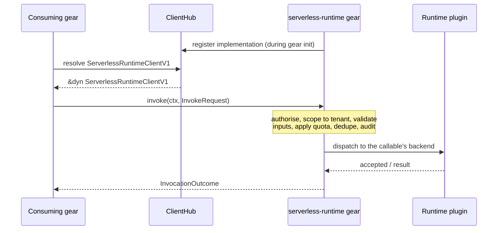

<!--
Created: 2026-07-30 by Constructor Tech
Updated: 2026-07-30 by Constructor Tech
-->

# Technical Design — CF/Gears Serverless Runtime SDK

<!-- toc -->

- [1. Architecture Overview](#1-architecture-overview)
  - [1.1 Architectural Vision](#11-architectural-vision)
  - [1.2 Architecture Drivers](#12-architecture-drivers)
  - [1.3 Architecture Layers](#13-architecture-layers)
- [2. Principles & Constraints](#2-principles--constraints)
  - [2.1 Design Principles](#21-design-principles)
  - [2.2 Constraints](#22-constraints)
- [3. Technical Architecture](#3-technical-architecture)
  - [3.1 Domain Model](#31-domain-model)
  - [3.2 Component Model](#32-component-model)
  - [3.3 API Contracts](#33-api-contracts)
  - [3.4 Internal Dependencies](#34-internal-dependencies)
  - [3.5 External Dependencies](#35-external-dependencies)
  - [3.6 Interactions & Sequences](#36-interactions--sequences)
  - [3.7 Database schemas & tables](#37-database-schemas--tables)
- [4. Additional context](#4-additional-context)
- [5. Traceability](#5-traceability)

<!-- /toc -->

<!--
=============================================================================
TECHNICAL DESIGN DOCUMENT
=============================================================================
PURPOSE: Define HOW the system is built — architecture, components, contracts.

NOT IN THIS DOCUMENT (see other templates):
  ✗ Business requirements, FR/NFR statements → PRD.md
  ✗ Why a specific technical approach was chosen → ADR/
  ✗ Detailed implementation flows, algorithms → features/

STANDARDS ALIGNMENT:
  - IEEE 1016-2009 (Software Design Description)
  - IEEE 42010 (Architecture Description)
  - ISO/IEC 15288 / 12207 (Architecture & Design Definition)
=============================================================================
-->

> **Status: draft.** Sections that do not apply to a library with no I/O, no persistence and no
> deployment footprint of its own say so explicitly rather than being omitted.
>
> The contract described here **is not final**. Four unresolved questions in the
> `serverless-runtime` gear's own documentation reach into it — G-01, G-02, G-05 and G-06 in
> [`NEXT_ADR_SCOPE.md`](../../docs/NEXT_ADR_SCOPE.md) §3. Each either leaves a stated requirement
> partially unmet or leaves an operation's semantics undecided, so the surface below can still
> change in ways that break callers. See §4 for what each one blocks.

## 1. Architecture Overview

### 1.1 Architectural Vision

`serverless-runtime-sdk` is a contract crate: types and one trait, no behaviour. It exists so
that a gear needing to run automation depends on a compile-time contract rather than on the
`serverless-runtime` gear itself, and so that the same gear is unaffected when execution
backends change.

Everything the crate contains is reachable from one trait, `ServerlessRuntimeClientV1`. The
crate performs no I/O, holds no state, spawns no tasks, and has no initialisation. At runtime
the `serverless-runtime` gear registers its implementation and consumers resolve it by trait
type through `ClientHub`; this crate contributes no code to that path.

### 1.2 Architecture Drivers

#### Functional Drivers

| PRD Requirement | Design Response |
|---|---|
| `cpt-cf-serverless-runtime-sdk-fr-invoke` | One `dyn`-dispatched trait resolved through `ClientHub`; no transport types in the crate. `InvokeRequest` carries an opaque `callable_id`, so functions and workflows take one path with no caller-side branch |
| `cpt-cf-serverless-runtime-sdk-fr-sync-result` | `InvocationOutcome` carries the result payload alongside the summary, populated on the waiting path |
| `cpt-cf-serverless-runtime-sdk-fr-dry-run` | `InvokeRequest.dry_run` plus the `dry_run` flag on the outcome, so a synthetic result is never mistaken for a recorded run |
| `cpt-cf-serverless-runtime-sdk-fr-idempotency` | `InvokeRequest.idempotency_key` plus the `cached` flag on the outcome (partial — see §4) |
| `cpt-cf-serverless-runtime-sdk-fr-read-run`, `…-fr-query-runs` | Both return `InvocationSummary`, the gear's index row, so no read can imply a plugin round-trip |
| `cpt-cf-serverless-runtime-sdk-fr-run-states` | `InvocationStatus` adopted verbatim from the gear's schema (partial — see §4) |
| `cpt-cf-serverless-runtime-sdk-fr-control`, `…-fr-replay` | `ControlAction` for in-place interventions; `replay_invocation` separate because it mints a new identifier |
| `cpt-cf-serverless-runtime-sdk-fr-refusal-reasons`, `…-fr-refusal-parity` | A dedicated error enum whose variants map one-to-one onto the gear's RFC 9457 problem types (§3.3) |
| `cpt-cf-serverless-runtime-sdk-fr-failure-vs-refusal` | `Err` reserved for refusals; a callable that ran and failed returns `Ok` (§2.1) |
| `cpt-cf-serverless-runtime-sdk-fr-test-double` | Substitute implementation behind the `test-util` feature (§4) |

#### NFR Allocation

| PRD NFR | Realised by |
|---|---|
| `cpt-cf-serverless-runtime-sdk-nfr-engine-neutrality` | Dependency set restricted to platform crates and a small set of ubiquitous data crates; no engine, backend or cloud SDK (§2.2, §3.4) |
| `cpt-cf-serverless-runtime-sdk-nfr-read-locality` | Reads return only the gear's index row, so the surface offers nothing a plugin round-trip would be needed for (§3.1) |
| `cpt-cf-serverless-runtime-sdk-nfr-no-unsafe` | Workspace lint `unsafe_code = "forbid"` (§2.2) |
| `cpt-cf-serverless-runtime-sdk-nfr-api-docs` | Documentation lint enforced in CI on the public surface |

#### Key ADRs

| ADR | Decision |
|---|---|
| host `cpt-cf-serverless-runtime-adr-thin-host` | The gear indexes runs; backends own full detail. Fixes reads to the index row and keeps execution mechanics out of this crate. |
| host `cpt-cf-serverless-runtime-adr-callable-type-hierarchy` | Functions and workflows are sibling types, and the SDK field is named `callable_id` rather than `function_id`. |

### 1.3 Architecture Layers

The crate has no layers. It is a single flat contract module set, deliberately: introducing a
domain or infrastructure layer inside a crate with no behaviour would add indirection with
nothing behind it.

| Concern | Location |
|---|---|
| The consumer trait | `src/api.rs` |
| Value types the trait exchanges | `src/models.rs` |
| The error type | `src/error.rs` |
| Test double | `src/test_util.rs` (behind the `test-util` feature) |

This is the canonical SDK layout described in
[Gear Layout and SDK Pattern](../../../../docs/toolkit_unified_system/02_gear_layout_and_sdk_pattern.md),
without the plugin-facing module — that surface belongs to a separate plugin-facing SDK, which
is not yet designed.

## 2. Principles & Constraints

### 2.1 Design Principles

#### A refused call and a failed callable are different outcomes

- [ ] `p1` - **ID**: `cpt-cf-serverless-runtime-sdk-principle-refusal-vs-failure`

`Err` means the Serverless Runtime declined to do the work. A callable that ran and then failed
returns `Ok`, carrying a summary whose status is `Failed`. A synchronous caller must be able to
distinguish "the runtime would not start this" from "your automation threw", and collapsing both
into `Err` destroys that distinction precisely where it matters most.

#### The crate never interprets platform identifiers

- [ ] `p1` - **ID**: `cpt-cf-serverless-runtime-sdk-principle-opaque-ids`

Type identifiers are carried as opaque strings and never parsed, split or validated here.
Parsing is owned by the type system and applied by the gear; a second parser in this crate would
be a second thing to keep correct.

#### Minimal surface

- [ ] `p1` - **ID**: `cpt-cf-serverless-runtime-sdk-principle-minimal-surface`

The trait carries only what a consuming gear has been shown to need. Administrative operations
stay on the HTTP surface. Methods are added when a real caller needs them, not in anticipation.

### 2.2 Constraints

#### No execution-technology dependencies

- [ ] `p1` - **ID**: `cpt-cf-serverless-runtime-sdk-constraint-no-engine-deps`

No dependency on any execution engine, backend or cloud provider — no Temporal client, no
Starlark, no cloud SDK. Permitted are the platform's own crates and the workspace's ubiquitous
data and error crates, enumerated in §3.4. Stated as a prohibition rather than an allow-list, so
adopting a further platform crate needs no amendment; what binds is that nothing tying the crate
to one execution technology may enter.

#### No unsafe code

- [ ] `p1` - **ID**: `cpt-cf-serverless-runtime-sdk-constraint-no-unsafe`

Enforced by the workspace lint `unsafe_code = "forbid"` (root `Cargo.toml`).

#### Dependency direction

- [ ] `p1` - **ID**: `cpt-cf-serverless-runtime-sdk-constraint-dep-direction`

No dependency on the `serverless-runtime` gear crate, on any runtime plugin crate, or on the
plugin-facing SDK. Arrows point only towards this crate.

## 3. Technical Architecture

### 3.1 Domain Model

**Technology**: Rust structs and enums; no `serde` derive requirement beyond what consumers
need for their own boundaries.

**Core Entities**

- [ ] `p1` - **ID**: `cpt-cf-serverless-runtime-sdk-entity-invocation`

| Entity | Description |
|---|---|
| `InvokeRequest` | What to run and how: `callable_id`, `mode`, `params`, `dry_run`, `idempotency_key`. |
| `InvocationMode` | `Sync` or `Async`. Adopted from the gear's model unchanged. |
| `InvocationSummary` | One row of the gear's invocation index — see below. |
| `InvocationOutcome` | What starting or replaying a run returns — see below. |
| `InvocationStatus` | The nine run states, adopted verbatim from the gear's `gts.cf.core.sless.status.v1~` schema: `Queued`, `Running`, `Suspended`, `Succeeded`, `Failed`, `Canceled`, `Compensating`, `Compensated`, `DeadLettered`. |
| `ControlAction` | `Cancel`, `Suspend`, `Resume`, `Retry` — the in-place interventions. |
| `InvocationId` | Identity assigned by the gear. |

**`InvocationSummary`** is exactly the gear's index row (host
`cpt-cf-serverless-runtime-adr-thin-host`), not a trimmed `InvocationRecord`: invocation id,
callable id, the backend that ran it, tenant, owner, status, timestamps (created, started,
suspended, finished), and an error summary populated only in failure states. The full record —
inputs, results, observability, step history — exists only with the executing backend and is
not reachable through this crate.

**`InvocationOutcome`** wraps the summary and adds what a caller cannot otherwise learn:

| Field | Meaning |
|---|---|
| `result` | The callable's output. Present for a synchronous run that succeeded; absent otherwise. |
| `cached` | The result was served from the response cache without re-executing. Requires an idempotency key plus a callable declaring itself idempotent with a non-zero cache age; only successful results are ever cached. |
| `dry_run` | The request was validated but nothing ran. The summary is synthetic and was not persisted, so it cannot be read back by id afterwards. |

`cached` and `dry_run` are mutually exclusive: a dry run neither reads nor writes the cache, and
does not evaluate the idempotency key at all.

**Payload handling.** `params` and `result` are `serde_json::Value` and are treated as opaque: no
code here reads into them, transforms them, retains a copy, or writes them anywhere. Validation is
the gear's, against the callable's declared schema.

That extends to `Debug`. Types carrying a payload implement it by hand and render the payload as a
placeholder rather than deriving it, because a derived `Debug` is how payloads leak in practice —
some consumer eventually logs a whole request while diagnosing something unrelated, and it is
precisely then that nobody is thinking about what the payload contains. The rest of each type's
fields print normally, so the redaction costs no diagnostic value that matters.

Opacity is not confidentiality. Both payloads are visible to the gear and to the executing
backend, and the backend records them as part of the run's history, where anyone permitted to
inspect that run can read them afterwards. The runtime has no secret-reference type, no
sensitive-field annotation, and no masking rules for execution history, so there is nothing this
crate can offer a caller that needs to pass a credential — see §4 and PRD §13.

**Lifetime.** An `InvocationSummary` exists only while the gear retains the run, which the tenant's
retention policy governs. Past that point a query returns nothing and `get_invocation` reports the
run as unknown; a run that aged out is indistinguishable from one that never existed. This crate
neither defines nor extends the retention period, and holds no cache that would outlive it.

### 3.2 Component Model

One component. A contract crate has no internal structure worth modelling, and a component
diagram of a single node communicates nothing.

#### Consumer contract

- [ ] `p1` - **ID**: `cpt-cf-serverless-runtime-sdk-component-api`

##### Why this component exists

To give consuming gears a compile-time contract for running automation, so that no consumer
depends on the `serverless-runtime` gear directly and none is coupled to an execution backend.

##### Responsibility scope

Declares `ServerlessRuntimeClientV1`, the value types its methods exchange, the error type they
raise, and a test double behind the `test-util` feature.

##### Responsibility boundaries

Implements nothing. Validates nothing. Performs no I/O. Does not declare the plugin contract,
the channel backends use to report progress, or anything else plugin-facing — those live in the
plugin-facing SDK.

### 3.3 API Contracts

- [ ] `p1` - **ID**: `cpt-cf-serverless-runtime-sdk-interface-client-v1`

- **Technology**: Rust trait, `async-trait`, `dyn`-dispatched via `ClientHub`
- **Stability**: unstable until 1.0 (PRD §3.1)
- **Location**: `src/api.rs`

**Operations**

Every method takes `&SecurityContext` as its first argument, per platform convention.

| Operation | Input | Returns |
|---|---|---|
| `invoke` | `InvokeRequest` | `InvocationOutcome` |
| `get_invocation` | `&InvocationId` | `InvocationSummary` |
| `list_invocations` | `&ODataQuery` | `Page<InvocationSummary>` |
| `control_invocation` | `&InvocationId`, `ControlAction` | `()` |
| `replay_invocation` | `&InvocationId` | `InvocationOutcome` |

`replay_invocation` is a distinct operation rather than a `ControlAction` because it produces a
new invocation id, which a caller has no other way to obtain; the four control actions all act
on the invocation they are given, so returning nothing is sufficient.

`list_invocations` takes `&ODataQuery` and returns `Page<T>` from `toolkit-odata`, the platform's
standard filtering, sorting and cursor-paging model
([OData, Pagination, Select, Filter](../../../../docs/toolkit_unified_system/07_odata_pagination_select_filter.md)).
A tenant's invocation history grows without bound, so an unpaged list is not a viable surface;
adopting the platform model rather than a local one also means the in-process query semantics are
the same ones the gear's HTTP surface already exposes.

**Error contract**

- [ ] `p1` - **ID**: `cpt-cf-serverless-runtime-sdk-interface-error`

One enum, `ServerlessRuntimeError`. Each variant corresponds to exactly one problem type and
HTTP status on the gear's REST surface, so in-process and over-HTTP behaviour agree. Gear error
types below are relative to `gts.cf.core.sless.err.v1~cf.core.sless.err.…`.

| Variant | Gear error type | HTTP | Source |
|---|---|---|---|
| `NotFound` | `not_found.v1~` | 404 | host DESIGN §Dry-Run validations |
| `NotActive` | `not_active.v1~` | 409 | callable is draft, disabled or archived |
| `InvalidInput` | `validation.v1~` | 422 | inputs fail the callable's schema |
| `QuotaExceeded` | `quota_exceeded.v1~` | 429 | tenant concurrency exhausted |
| `SyncSuspension` | `sync_suspension.v1~` | 409 | a synchronous run reached a suspension point |
| `AccessDenied` | — † | 403 | caller not permitted |
| `UnsupportedControl` | — † | 409 | action invalid for the run's current state |
| `NoPluginAvailable` | — † | 503 | no backend registered for the callable |
| `ServiceUnavailable { retry_after }` | — † | 503 | backend registered but not accepting work |
| `Internal` | — | 500 | unclassified |

† Not enumerated by the gear's design. Tracked as gap G-01 in
[`NEXT_ADR_SCOPE.md`](../../docs/NEXT_ADR_SCOPE.md) §3. Until it is closed, agreement between
the in-process and HTTP paths is asserted for the first five variants only.

Per `cpt-cf-serverless-runtime-sdk-principle-refusal-vs-failure`, a callable that ran and failed
is not represented here: it returns `Ok` with `status: Failed`.

### 3.4 Internal Dependencies

The complete set. Every entry is an existing workspace dependency, and each is here because the
contract cannot express something without it — not for convenience.

| Dependency | Provides | Why not avoidable |
|---|---|---|
| `toolkit-security` | `SecurityContext` | Caller identity must cross the boundary as the platform's own type; a local copy would not interoperate. |
| `toolkit-odata` | `ODataQuery`, `Page<T>` | The platform's filtering, sorting and cursor-paging model. A tenant's invocation history is unbounded, so listing requires paging. |
| `async-trait` | `async fn` in a `dyn`-dispatched trait | Required while the trait is object-safe and `dyn`-dispatched. |
| `serde_json` | The `params` and `result` payloads | A callable's inputs and outputs are arbitrary JSON, validated by the gear against the callable's schema. The SDK carries them opaquely and cannot narrow the type. |
| `time` | Timestamps on `InvocationSummary` | Matches the gear's own `OffsetDateTime` timestamps; converting to a local representation would lose the platform's offset handling. |
| `serde` | Derives on the value types | Consumers serialise these types at their own boundaries (their REST responses, their stored state). Requiring each to write conversions would defeat the purpose of a shared contract. |
| `thiserror` | The error type's `std::error::Error` implementation | Consumers propagate this error through their own error types, which requires a `source` chain and a `Display` implementation. |

None of these ties the crate to an execution technology, so
`cpt-cf-serverless-runtime-sdk-nfr-engine-neutrality` holds. There is no dependency on the
`serverless-runtime` gear, on any runtime plugin, or on the plugin-facing SDK.

### 3.5 External Dependencies

None. The crate reaches no database, service, queue or external system. Everything it declares
is resolved in-process.

### 3.6 Interactions & Sequences

The crate contributes no runtime behaviour, so there is nothing to sequence inside it. The one
interaction worth recording is how a consumer reaches the implementation, because it is the
reason the crate exists: the dependency is on the contract, never on the gear.

#### Starting a callable from a consuming gear

- [ ] `p1` - **ID**: `cpt-cf-serverless-runtime-sdk-seq-invoke`

Note that this crate appears nowhere in the call path — it supplies the type `C` names and the
type `G` implements, and nothing else. A refusal at the `Note over G` step returns
`ServerlessRuntimeError` and never reaches the plugin.

### 3.7 Database schemas & tables

None. The crate owns no persistence and defines no schema. Runs are recorded by the
`serverless-runtime` gear in its invocation index, and full execution state belongs to the
executing backend; both are outside this crate
(host `cpt-cf-serverless-runtime-adr-thin-host`).

## 4. Additional context

**Test double.** The `test-util` feature exposes an implementation of the trait that a consuming
gear can drive from its own unit tests without a Serverless Runtime present. It is gated behind a
feature so that it is absent from production builds and costs nothing for consumers that do not
enable it. `test-util` is the crate's only feature: with nothing plugin-facing left in the crate,
there is no audience left to gate.

**Naming.** `callable_id`, not `function_id` — mandated for the SDK models by host
`cpt-cf-serverless-runtime-adr-callable-type-hierarchy` because the field accepts workflows too.

**Open, inherited from the gear.** Four questions in the `serverless-runtime` gear's own
documentation reach into this contract. All are tracked in
[`NEXT_ADR_SCOPE.md`](../../docs/NEXT_ADR_SCOPE.md) §3. This SDK forwards the gear's behaviour and
does not invent answers, so each leaves something here provisional:

| Gap | What it blocks here |
|---|---|
| G-01 | Four error variants — `AccessDenied`, `UnsupportedControl`, `NoPluginAvailable`, `ServiceUnavailable` — have no gear error type to map onto, so refusal parity (§3.3) is proven for the other five only. |
| G-02 | Whether `Retry` mints a new invocation id. If it does, it is not an in-place intervention: it leaves `ControlAction` and joins `replay_invocation`, changing the trait's shape. |
| G-05 | A deduplicated request cannot be distinguished from a freshly started one. `InvocationOutcome.cached` covers the response-cache path only; the gear specifies no response shape for deduplication. Adding that distinction later means adding a field or replacing `cached` with an origin discriminator. |
| G-06 | Whether `Failed` and `Canceled` mean the run has finished. Seven of the nine states can be classified; these two are contradicted between the gear's state machine and its prose, so no terminal/success classification is published here yet. |

Until all four close, the surface in §3.3 is a draft and can still change in ways that break
callers. `InvocationOutcome` and `ControlAction` are the two types most likely to move.

**Deliberate omissions.** Design concerns the project's review covers but this document does not
address, each for a stated reason rather than by oversight:

| Concern | Why absent |
|---|---|
| Performance and scaling design | No runtime behaviour to tune. The crate adds nothing to a call path (§3.6); throughput and concurrency are bounded by the gear's tenant quotas. |
| Caching design | Deliberately none. The gear owns response caching; a cache here would be a second source of truth for run state, and would outlive the retention window the gear enforces (§3.1). |
| Resilience design — retry, timeout, circuit breaking, bulkheads | Would be meaningless: a call is an in-process function call, so there is no channel to fail. Retry of a *callable* is the backend's, and this crate deliberately does not drive it (PRD §4.2). |
| Concurrency and state management | The crate holds no state, spawns no task and owns no lock. Thread-safety is expressed by the trait's `Send + Sync` bound and nothing more. |
| Persistence, schema and migration design | Owns no persistence (§3.7). |
| Deployment topology, configuration and rollout | Compiled into its consumers; there is no deployable unit, no configuration surface and no independent release to roll out beyond crate versioning (§3.3). |
| Observability design — logging, metrics, tracing | Emits none, by design: as a contract compiled into every consumer, anything it emitted would appear in whichever gear's telemetry the caller owns. Correlation and trace propagation are carried in `SecurityContext` and handled by the gear. |
| Authentication and authorization design | Neither is decided here. The crate transports an established identity; the gear authorises each request and this crate reports the refusal (§3.3). |
| GTS design | Introduces no GTS identifier, schema, well-known instance, trait or registry entry. Type identifiers are carried as opaque strings (§2.1) and every schema they name belongs to the gear. `guidelines/GTS.md` therefore does not apply. |
| Multi-tenancy design | Tenant scoping is applied by the gear. The crate carries the tenant in `SecurityContext` and surfaces it on `InvocationSummary`; it makes no isolation decision. |
| Internationalisation, accessibility, user interface | No human interface (PRD §6.2). |

## 5. Traceability

- **Requirements**: [PRD.md](./PRD.md)
- **ADRs**: none of this crate's own yet; host ADRs are referenced inline above
- **Features**: not yet written
- **Gear design**: [`../../docs/DESIGN.md`](../../docs/DESIGN.md),
  [`../../docs/DESIGN_RUST_TYPES.md`](../../docs/DESIGN_RUST_TYPES.md)
- **Plugin contract**: owned by a separate plugin-facing SDK, not yet designed. Intentionally
  not linked from here: nothing about its shape is settled, so a reference would imply a contract
  that does not exist.
