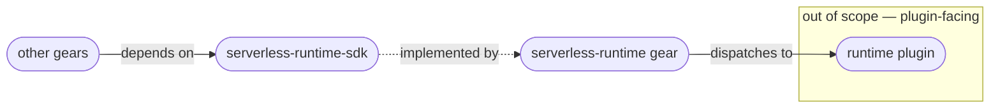

<!--
Created: 2026-07-29 by Constructor Tech
Updated: 2026-07-30 by Constructor Tech
-->

# PRD — CF/Gears Serverless Runtime SDK

<!-- toc -->

- [1. Overview](#1-overview)
  - [1.1 Purpose](#11-purpose)
  - [1.2 Background / Problem Statement](#12-background--problem-statement)
  - [1.3 Goals (Business Outcomes)](#13-goals-business-outcomes)
  - [1.4 Glossary](#14-glossary)
- [2. Actors](#2-actors)
  - [2.1 Human Actors](#21-human-actors)
  - [2.2 System Actors](#22-system-actors)
- [3. Operational Concept & Environment](#3-operational-concept--environment)
  - [3.1 Gear-Specific Environment Constraints](#31-gear-specific-environment-constraints)
- [4. Scope](#4-scope)
  - [4.1 In Scope](#41-in-scope)
  - [4.2 Out of Scope](#42-out-of-scope)
- [5. Functional Requirements](#5-functional-requirements)
  - [5.1 Running a Callable](#51-running-a-callable)
  - [5.2 Observing Runs](#52-observing-runs)
  - [5.3 Intervening in Runs](#53-intervening-in-runs)
  - [5.4 Failure Reporting](#54-failure-reporting)
  - [5.5 Testing Support](#55-testing-support)
  - [5.6 Handling of Caller Data](#56-handling-of-caller-data)
- [6. Non-Functional Requirements](#6-non-functional-requirements)
  - [6.1 Gear-Specific NFRs](#61-gear-specific-nfrs)
  - [6.2 NFR Exclusions](#62-nfr-exclusions)
- [7. Public Library Interfaces](#7-public-library-interfaces)
  - [7.1 Public API Surface](#71-public-api-surface)
  - [7.2 External Integration Contracts](#72-external-integration-contracts)
- [8. Use Cases](#8-use-cases)
- [9. Acceptance Criteria](#9-acceptance-criteria)
- [10. Dependencies](#10-dependencies)
- [11. Assumptions](#11-assumptions)
- [12. Risks](#12-risks)
- [13. Open Questions](#13-open-questions)
- [14. Traceability](#14-traceability)

<!-- /toc -->

<!--
=============================================================================
PRODUCT REQUIREMENTS DOCUMENT (PRD)
=============================================================================
PURPOSE: Define WHAT the system must do and WHY — business requirements,
functional capabilities, and quality attributes.

SCOPE:
  ✓ Business goals and success criteria
  ✓ Actors (users, systems) that interact with this gear
  ✓ Functional requirements (WHAT, not HOW)
  ✓ Non-functional requirements (quality attributes, SLOs)
  ✓ Scope boundaries (in/out of scope)
  ✓ Assumptions, dependencies, risks

NOT IN THIS DOCUMENT (see other templates):
  ✗ Stakeholder needs (managed at project/task level by steering committee)
  ✗ Technical architecture, design decisions → DESIGN.md
  ✗ Why a specific technical approach was chosen → ADR/
  ✗ Detailed implementation flows, algorithms → features/

STANDARDS ALIGNMENT:
  - IEEE 830 / ISO/IEC/IEEE 29148:2018 (requirements specification)
  - IEEE 1233 (system requirements)
  - ISO/IEC 15288 / 12207 (requirements definition)

REQUIREMENT LANGUAGE:
  - Use "MUST" or "SHALL" for mandatory requirements (implicit default)
  - Do not use "SHOULD" or "MAY" — use priority p2/p3 instead
  - Be specific and clear; no fluff, bloat, duplication, or emoji
=============================================================================
-->
## 1. Overview

### 1.1 Purpose

The Serverless Runtime SDK is the contract library that other gears use to run automation in
the Serverless Runtime and follow it through to completion, without going over the network. It
gives a consuming gear one way to start a registered function or workflow, find out what
happened to it, look through past runs, and intervene in one that is still going.

The contract is declared here and implemented by the `serverless-runtime` gear. Because both
are compiled into the same platform process, a consumer calls the runtime directly rather than
through a transport.

**Scope boundary.** This SDK does not describe the contract between the `serverless-runtime`
gear and the runtime plugins that execute callables. Everything plugin-facing — the plugin
contract itself, authoring a callable's body, the execution context available to it,
instrumentation, and the plugin conformance suite — belongs to a separate plugin-facing SDK
with its own PRD. That SDK is not yet designed, so this document deliberately does not name it or
describe its shape; it names only the boundary. A consuming gear never sees any of it.

### 1.2 Background / Problem Statement

The Serverless Runtime exists so that automation can be registered and executed at runtime
(host `cpt-cf-serverless-runtime-fr-runtime-authoring`). Much of that automation is started
not by a person or an external client, but by another gear in the same platform — a billing
gear starting an invoicing workflow, an onboarding gear starting a provisioning saga, a policy
gear reacting to configuration drift.

Without an in-process contract, each of those gears has to reach the Serverless Runtime the
same way an outside caller would: over HTTP, against its own process. Every consumer then
restates the same request and response shapes, re-implements the translation of error
documents into something it can act on, and re-establishes how caller identity is carried
across the boundary. That work is duplicated per consumer, is slower at run time, and each
restatement is a place where a consumer's understanding of the contract can silently drift
from the runtime's.

The platform already has an established answer to this shape of problem: a gear publishes a
typed client contract, and other gears obtain it by asking for that contract rather than by
addressing the gear over a network. This SDK is the Serverless Runtime's instance of that
pattern.

### 1.3 Goals (Business Outcomes)

_Baseline: the SDK is new. All targets apply at the first published release (v0.1.0); the
contract itself is not stable until 1.0 (§3.1)._

- **Automation is startable from another gear without network access.** A consuming gear can
  start a callable and obtain its outcome using this contract alone.
  _Target: a consuming gear requires no HTTP client and no restatement of the runtime's
  request or response shapes; verified by an integration test that starts a callable through
  the published contract only._
- **Functions and workflows are started the same way.** A caller does not branch on which kind
  of callable it is starting.
  _Target: one operation accepts both kinds; no caller-side discrimination is required._
- **Failures are distinguishable without parsing text.** A caller can tell apart the reasons a
  request was refused — unknown callable, callable not accepting work, invalid input, not
  permitted, quota exhausted, runtime unavailable — and react differently to each.
  _Target: every refusal reason a caller can act on is separately identifiable, and each
  corresponds to exactly one documented refusal the runtime's HTTP surface reports for the
  same condition, so behaviour agrees across both paths._
- **Observing a run is cheap.** Reading the state of a run, or listing runs, never requires the
  runtime to consult the backend that executed it.
  _Target: all read operations are answerable from the runtime's own record of runs._
- **Consumers are unaffected by which backend executes their automation.** Adding, removing or
  changing an execution backend requires no change in any consuming gear.
  _Target: this SDK carries no dependency on any execution technology, enforced on every CI
  run._

### 1.4 Glossary

| Term | Definition |
|------|------------|
| **Callable** | A registered function or workflow, addressed by its type identifier. Functions and workflows are siblings — neither is a kind of the other — and this SDK treats both through one surface. |
| **Invocation** | One run of a callable, identified by an invocation identifier the executing backend assigns and the `serverless-runtime` gear records. |
| **Recorded run** | What the `serverless-runtime` gear itself retains about an invocation: which callable, which backend, tenant, owner, current state, timings, and a summary of the failure if there was one. Built from what the executing backend reports. Everything beyond it — the inputs and outputs, and the step-by-step history — stays with the backend that ran the callable. |
| **Control action** | An intervention applied to an existing run that is still in progress — cancelling, suspending or resuming it, or asking for a failed one to be tried again. |
| **Replay** | Running a finished invocation again as a **new** invocation with the same inputs, producing a new invocation identifier. Distinct from a control action for that reason. |
| **Consuming gear** | Any gear that uses this SDK to run automation. The primary audience. |
| **`serverless-runtime` gear** | The gear that implements this contract. It owns the registry of callables, tenant policy, validation, audit, the HTTP surface, dispatch to backends, and the record it keeps of every run. |
| **Runtime plugin** | A backend that actually executes callables (Temporal, Starlark, cloud functions). Out of scope for this SDK — named here only to place the boundary. |
| **Dry run** | Validating that a request would be accepted, without executing anything and without recording a run. |

---

## 2. Actors

### 2.1 Human Actors

#### Consuming Gear Developer

**ID**: `cpt-cf-serverless-runtime-sdk-actor-consumer-dev`

- **Role**: A platform developer building a gear that needs to run automation in the Serverless
  Runtime — starting a workflow, checking whether it finished, cancelling one that is no longer
  wanted. They use this SDK and never learn which backend executed the callable.
- **Needs**: One way to start both functions and workflows; refusal reasons they can act on
  individually; a documented set of run states so they know when a run is finished and whether
  it succeeded; and a way to test their own gear without a running Serverless Runtime.

### 2.2 System Actors

#### `serverless-runtime` gear

**ID**: `cpt-cf-serverless-runtime-sdk-actor-runtime-gear`

- **Role**: Implements this contract and publishes it for other gears to obtain during its own
  startup. On each request it applies the concerns it owns — authorisation, tenant scoping,
  validation of the callable and its inputs, tenant policy and quota, suppression of duplicate
  requests, and audit — before dispatching to a backend, and answers all read requests from what
  it has itself recorded about each run.

---

## 3. Operational Concept & Environment

> Runtime, operating system, and lifecycle policy are defined once at the repository level; see
> the [architecture manifest](../../../../docs/ARCHITECTURE_MANIFEST.md) and
> [guidelines/](../../../../guidelines/). Only deviations specific to this SDK appear below.

This SDK is a library. It holds no state, performs no input or output of its own, and owns no
stored data. It is compiled into the same process as its consumers and as the
`serverless-runtime` gear.

### 3.1 Gear-Specific Environment Constraints

- It MUST contain no unsafe code.
- It MUST NOT depend on any execution technology, backend, or cloud provider — so that a
  consuming gear is unaffected by which backend the platform uses. Platform-wide libraries are
  permitted. This is stated as a prohibition rather than as a list of allowed dependencies, so
  that adopting a further platform-wide library does not require amending this document.
- It MUST NOT depend on the `serverless-runtime` gear, on any runtime plugin, or on the
  plugin-facing SDK. Dependencies point only towards this SDK.
- Compatibility: before version 1.0 the published contract is unstable — breaking changes are
  permitted between minor releases. Stability is targeted at 1.0 and gated on at least one
  consuming gear in production.

---

## 4. Scope

### 4.1 In Scope

- Starting a run of a registered function or workflow, either waiting for its result or
  leaving it to proceed in the background.
- Validating a request without executing it, so a caller can check acceptance before
  committing to the work.
- Suppressing duplicate runs, so that a caller retrying a request it is unsure about does not
  cause the work to happen twice.
- Reading the current state of a single run, including whether it finished and whether it
  succeeded.
- Querying past runs with filtering, sorting and paging.
- Intervening in a run that is in progress — cancelling, suspending or resuming it, or asking
  for a failed one to be tried again.
- Re-running a finished run with the same inputs as a new run.
- Distinguishing the reasons a request was refused, individually and without inspecting
  message text, in agreement with what the runtime's HTTP surface reports for the same
  condition.
- Testing a consuming gear against this contract with no Serverless Runtime present.

### 4.2 Out of Scope

- **Managing the callables themselves** — registering, validating, versioning, publishing,
  disabling or deleting them. These are administrative operations whose callers are people or
  external clients, and the runtime's HTTP surface serves them. No consuming gear has asked to
  do this in process, and the project treats YAGNI as binding.
- **Managing schedules, event triggers, webhooks and tenant policy** — same reasoning.
- **Any transport surface.** HTTP, JSON-RPC and MCP access to the Serverless Runtime belongs to
  the `serverless-runtime` gear. This SDK is the
  in-process path only.
- **Validating callables and inputs against the platform type system** — owned by the type
  system and applied by the `serverless-runtime` gear.
- **Following a run's progress as it happens.** The runtime's streaming mode is defined in
  terms of a long-lived HTTP response. An in-process equivalent is a separate design problem
  and is deferred; consumers needing live progress use the HTTP surface.
- **How execution actually happens** — retrying, compensating, checkpointing and scheduling are
  performed by the executing backend using its own facilities. A caller observes the result;
  it does not configure or drive the mechanism here. Asking for a failed run to be tried again
  forwards that request to the runtime; it does not define retry policy.
- **The full detail of a run** — complete records, step-by-step history, stored inputs and
  outputs, and debugging views. These stay with the backend that executed the run and are
  reached through the runtime's observability endpoints.
- **Everything plugin-facing** — the plugin contract, authoring a callable's body, its
  execution context, instrumentation, the conformance suite, and the channel backends use to
  report progress. These belong to the plugin-facing SDK.

---

## 5. Functional Requirements

> **Testing strategy**: All requirements verified via automated tests (unit, integration, e2e).
> Coverage follows the repository default — an 80% line-coverage threshold, enforced by
> `tools/scripts/coverage.py`, with 85% required on lines changed in a pull request
> (`.codecov.yml`). See [`docs/TESTING.md`](../../../../docs/TESTING.md) §2. This SDK claims no
> stricter target: it is a contract crate whose surface is types and one trait, so a coverage
> figure above the project default would measure the test double more than the contract.

All requirements below are satisfied by the `serverless-runtime` gear
(`cpt-cf-serverless-runtime-sdk-actor-runtime-gear`) and exercised by a consuming gear
(`cpt-cf-serverless-runtime-sdk-actor-consumer-dev`). Where a requirement states that the
runtime applies a check, this SDK's obligation is to expose the outcome of that check
faithfully, not to perform it.

### 5.1 Running a Callable

#### Start a callable

- [ ] `p1` - **ID**: `cpt-cf-serverless-runtime-sdk-fr-invoke`

The system **MUST** allow a consuming gear to start a registered function or workflow by
identifier, supplying its inputs, and to choose whether to wait for the result or to leave the
run to proceed in the background. The same operation **MUST** accept both functions and
workflows without the caller distinguishing between them.

- **Rationale**: This is the SDK's reason to exist. Treating both kinds of callable through one
  operation follows the runtime's own model, in which functions and workflows are siblings, and
  spares every consumer a branch that would otherwise be duplicated per call site.
- **Actors**: `cpt-cf-serverless-runtime-sdk-actor-consumer-dev`

#### Return the result of a completed run

- [ ] `p1` - **ID**: `cpt-cf-serverless-runtime-sdk-fr-sync-result`

When a caller chose to wait, the system **MUST** return the callable's output together with the
run's final state. When a caller chose not to wait, the system **MUST** return the run's
identity and initial state so the caller can follow it later.

- **Rationale**: Without the output on the waiting path, every caller would have to poll for a
  result it already waited for.
- **Actors**: `cpt-cf-serverless-runtime-sdk-actor-consumer-dev`

#### Validate a request without running it

- [ ] `p1` - **ID**: `cpt-cf-serverless-runtime-sdk-fr-dry-run`

The system **MUST** allow a caller to submit a request for validation only. Nothing **SHALL**
execute, no run **SHALL** be recorded, and the caller **MUST** be able to tell from the response
that this was a validation and not a real run.

- **Rationale**: Callers that assemble automation from configuration need to catch a malformed or
  unusable request before committing to side effects. Because a validated request leaves no
  record, the response must say so — otherwise a caller could try to look the run up afterwards
  and be told it does not exist.
- **Actors**: `cpt-cf-serverless-runtime-sdk-actor-consumer-dev`
- **Limits — a passing dry run is not an acceptance guarantee**: it rules out `NotFound`,
  `NotActive`, `InvalidInput` and `QuotaExceeded`, and nothing more. The same request can still be
  refused with `UnsupportedMode`, `NoPluginAvailable`, `ServiceUnavailable` or a rate limit, and a
  dry run says nothing about authorisation. Stated because "validate the request" naturally reads
  as pre-flight approval, and a caller who takes it that way will omit handling for refusals that
  stay reachable.

#### Suppress duplicate runs

- [ ] `p1` - **ID**: `cpt-cf-serverless-runtime-sdk-fr-idempotency`

The system **MUST** allow a caller to mark a request with a key identifying the work it
represents, so that repeating the request does not run the callable a second time. When a stored
successful result is returned instead of new execution, the caller **MUST** be able to tell that
this happened.

- **Rationale**: A gear that is unsure whether its request arrived — after a restart, or a
  timeout — must be able to retry without risking duplicate invoicing, duplicate provisioning,
  or duplicate charges. Distinguishing a reused result from a fresh one matters because the two
  have different timing and side-effect implications for the caller.
- **Actors**: `cpt-cf-serverless-runtime-sdk-actor-consumer-dev`
- **The runtime defines the key's scope**: this SDK carries the key opaquely and does not
  determine what makes two requests "the same". Whether a key is distinct per tenant, per subject
  or per callable is the runtime's to specify, and it has not — so a caller cannot currently tell
  whether reusing one key across two different callables collides. Tracked as gap G-05 (§13).
- **Blocked, partially**: the runtime operates two distinct mechanisms — preventing a duplicate
  start, and returning a cached successful result — and specifies a response shape only for the
  second. Until the first is specified, a request that was deduplicated rather than cached
  cannot be reported distinguishably, so this requirement is met for cached results only.
  Tracked as gap G-05 (§13).

### 5.2 Observing Runs

#### Read a single run

- [ ] `p1` - **ID**: `cpt-cf-serverless-runtime-sdk-fr-read-run`

The system **MUST** allow a caller holding a run's identifier to retrieve what the runtime has
recorded about it: which callable, which backend, tenant, owner, current state, timings, and a
summary of the failure when it failed.

- **Rationale**: A caller that started work in the background needs to learn how it ended.
- **Actors**: `cpt-cf-serverless-runtime-sdk-actor-consumer-dev`

#### Query past runs

- [ ] `p1` - **ID**: `cpt-cf-serverless-runtime-sdk-fr-query-runs`

The system **MUST** allow a caller to query recorded runs with filtering, sorting and paging,
using the platform's standard query conventions.

- **Rationale**: Callers reconcile their own state against the runtime's — "what did we start
  for this tenant today, and did any of it fail?". Paging is required because a tenant's history
  is large. Using the platform's standard query conventions means a consuming developer does not
  learn a query dialect specific to this SDK.
- **Actors**: `cpt-cf-serverless-runtime-sdk-actor-consumer-dev`
- **Bounded by the runtime's retention policy**: the runtime keeps a run's record only for the
  period its tenant policy specifies, so a query reaches back that far and no further. This SDK
  neither defines nor extends that period, and a run that has aged out is indistinguishable from
  one that never existed. A consuming gear that must retain a record of its own work for longer
  than the tenant's retention window **MUST** keep it itself rather than relying on this query.

  Stated because it is easy to miss and expensive to discover late: a reconciliation process built
  on this operation silently stops seeing older work once retention elapses, and reads as data loss
  rather than as policy.

#### Report run state from a documented set

- [ ] `p1` - **ID**: `cpt-cf-serverless-runtime-sdk-fr-run-states`

The system **MUST** report a run's state using the runtime's documented set of states, and the
set **MUST** be documented so a caller can tell, for any state, whether the run has finished and
whether it succeeded.

- **Rationale**: A caller's central question is "is it done, and did it work?". Reusing the
  runtime's own state set rather than a simplified projection keeps in-process and HTTP
  observers agreeing about the same run.
- **Actors**: `cpt-cf-serverless-runtime-sdk-actor-consumer-dev`
- **Blocked, partially**: the runtime's own documentation is inconsistent about whether a failed
  or cancelled run has finished — its state machine transitions out of both when a compensation
  handler is configured, while its prose calls both terminal. Seven of the nine states can be
  classified today; these two cannot, and this SDK will not guess. Tracked as gap G-06 (§13).

### 5.3 Intervening in Runs

#### Intervene in a run in progress

- [ ] `p1` - **ID**: `cpt-cf-serverless-runtime-sdk-fr-control`

The system **MUST** allow a caller to cancel, suspend or resume a run that is in progress, and
to ask for a failed run to be tried again. Where the runtime rejects an intervention because the
run's state does not permit it, that rejection **MUST** be distinguishable from other refusals.

- **Rationale**: Automation started in response to a business event frequently needs stopping
  when that event is superseded. A rejected intervention is usually a race — the run finished
  first — which a caller handles differently from a genuine error.
- **Actors**: `cpt-cf-serverless-runtime-sdk-actor-consumer-dev`

#### Re-run a finished run

- [ ] `p1` - **ID**: `cpt-cf-serverless-runtime-sdk-fr-replay`

The system **MUST** allow a caller to run a finished run again with the same inputs. This
**SHALL** produce a new run with its own identifier, and that identifier **MUST** be returned to
the caller.

- **Rationale**: Re-running after a transient outage is a routine recovery step. It is a
  distinct operation from the interventions above because it creates a new run rather than
  changing the existing one, and the caller has no other way to learn the new identifier.
- **Actors**: `cpt-cf-serverless-runtime-sdk-actor-consumer-dev`

### 5.4 Failure Reporting

#### Distinguish refusal reasons

- [ ] `p1` - **ID**: `cpt-cf-serverless-runtime-sdk-fr-refusal-reasons`

When the runtime refuses a request, the system **MUST** report the reason in a form the caller
can act on directly, without inspecting message text. The reasons **MUST** separately cover: the
callable is unknown; the callable is not currently accepting work; the callable does not support
the requested invocation mode; the inputs are invalid; the caller is not permitted; the tenant's
quota is exhausted; the requested intervention does not apply to this invocation; and the runtime
or its backend is unavailable.

- **Rationale**: These reasons demand different responses — correct the input, wait and retry,
  escalate a permission problem, or fail the caller's own operation. Message text is not a
  contract and changes without notice, so branching on it is unsafe.
- **Actors**: `cpt-cf-serverless-runtime-sdk-actor-consumer-dev`

#### Report a failed callable as a completed run

- [ ] `p1` - **ID**: `cpt-cf-serverless-runtime-sdk-fr-failure-vs-refusal`

A callable that ran and then failed **MUST** be reported as a completed request whose run
finished in a failure state — not as a refusal. A refusal **SHALL** mean that no result was
delivered: either the runtime declined the request, or it started the run and could not complete
it synchronously.

- **Rationale**: "The runtime would not start this" and "your automation ran and threw" call for
  entirely different handling, and a caller waiting on a result must be able to tell them apart.
  Collapsing them loses that distinction exactly where it matters most.
- **Actors**: `cpt-cf-serverless-runtime-sdk-actor-consumer-dev`
- **The one case that is neither**: a synchronous call whose run reaches a suspension point. The
  runtime accepted it and it is still going, but no result can be returned on that call, so it is
  reported as a refusal and **MUST** carry the invocation's identity. The run remains suspended —
  resumable, cancellable, and subject to the runtime's suspension timeout — so the caller can
  continue with it asynchronously rather than losing the work it just started.

#### Agree with the runtime's HTTP surface

- [ ] `p1` - **ID**: `cpt-cf-serverless-runtime-sdk-fr-refusal-parity`

Each refusal reason **MUST** correspond to exactly one refusal the runtime's HTTP surface
reports for the same condition, and the correspondence **MUST** be documented.

- **Rationale**: The same runtime is reachable both ways. If the two paths disagree about what a
  condition means, behaviour changes when a caller migrates between them, and operators
  correlating in-process failures with HTTP telemetry are misled.
- **Actors**: `cpt-cf-serverless-runtime-sdk-actor-consumer-dev`

### 5.5 Testing Support

#### Test without a running Serverless Runtime

- [ ] `p1` - **ID**: `cpt-cf-serverless-runtime-sdk-fr-test-double`

The system **MUST** provide a substitute implementation of the contract that a consuming gear
can use in its own automated tests, with no Serverless Runtime present, and **MUST** let those
tests choose the outcomes it returns.

- **Rationale**: Without this, any gear that starts automation needs a live runtime and a live
  backend to test its own logic, which pushes unit-level tests into integration suites and makes
  failure paths — quota exhausted, callable failed — impractical to cover at all.
- **Actors**: `cpt-cf-serverless-runtime-sdk-actor-consumer-dev`

### 5.6 Handling of Caller Data

#### Carry inputs and outputs without inspecting them

- [ ] `p1` - **ID**: `cpt-cf-serverless-runtime-sdk-fr-payload-opacity`

A callable's inputs and outputs **MUST** be carried as opaque data. This SDK **MUST NOT** inspect,
transform, validate, cache, log or emit them in any form.

- **Rationale**: Validation belongs to the runtime, which checks inputs against the callable's
  declared schema. A second interpretation here would be a second thing to keep correct. The
  prohibition on logging matters more: this SDK is compiled into every consuming gear, so anything
  it wrote out would multiply across the platform and would do so in whichever gear's log stream
  the caller happens to own.
- **Actors**: `cpt-cf-serverless-runtime-sdk-actor-consumer-dev`

#### State who can see a caller's inputs and outputs

- [ ] `p1` - **ID**: `cpt-cf-serverless-runtime-sdk-fr-payload-exposure`

The SDK **MUST** document, for the benefit of a consuming developer deciding what to put in a
request, that a callable's inputs and outputs are visible to the `serverless-runtime` gear and to
the backend that executes the callable, are recorded by that backend as part of the run's history,
and are readable afterwards by anyone permitted to inspect that run.

- **Rationale**: A consuming developer choosing what to pass cannot make a safe decision without
  knowing where it ends up. Because a callable's inputs are arbitrary data, the natural mistake is
  to pass a credential or personal data directly, which then persists in execution history outside
  this SDK's control and outside the caller's.
- **Actors**: `cpt-cf-serverless-runtime-sdk-actor-consumer-dev`
- **Constraint on callers, not yet resolvable**: the runtime currently offers no safer alternative.
  It has no secret-reference type or secret-binding model, no sensitive-field annotation or data
  classification model, and no defined masking rules for execution history — all three are recorded
  as unaddressed P0 requirements in the runtime's own register (BR-025, BR-017, BR-130). Until at
  least a secret-reference model exists, a caller needing to give a callable access to a credential
  has no mechanism this SDK can offer, and this requirement can only warn rather than mitigate.
  See §13.

## 6. Non-Functional Requirements

> **Global baselines**: Project-wide NFRs are defined at repository level; see the
> [architecture manifest](../../../../docs/ARCHITECTURE_MANIFEST.md) and
> [guidelines/](../../../../guidelines/). Only SDK-specific NFRs appear here.

### 6.1 Gear-Specific NFRs

#### Independence from execution technology

- [ ] `p1` - **ID**: `cpt-cf-serverless-runtime-sdk-nfr-engine-neutrality`

The system **MUST NOT** depend on any execution engine, backend or cloud provider.

- **Threshold**: Zero such dependencies, direct or transitive, verified on every CI run.
- **Rationale**: Consuming gears must be unaffected when the platform adds, removes or replaces
  an execution backend. A single such dependency would propagate into every consumer and make
  backend choice a repository-wide concern.
- **Verification Method**: Dependency-graph inspection in CI.
- **Architecture Allocation**: See [DESIGN.md](./DESIGN.md) §2.2.

#### Reads never reach the execution backend

- [ ] `p1` - **ID**: `cpt-cf-serverless-runtime-sdk-nfr-read-locality`

Retrieving a run or querying runs **MUST** be answerable from what the runtime has itself
recorded, without contacting the backend that executed the callable.

- **Threshold**: Zero backend round-trips for read operations.
- **Rationale**: The runtime deliberately records only a summary of each run so that queries stay
  fast and available even when a backend is degraded. Exposing anything a caller could only obtain
  from the backend would silently reintroduce that dependency on every read.
- **Architecture Allocation**: See [DESIGN.md](./DESIGN.md) §3.1.

#### No unsafe code

- [ ] `p1` - **ID**: `cpt-cf-serverless-runtime-sdk-nfr-no-unsafe`

The system **MUST** contain no unsafe code.

- **Threshold**: Zero occurrences, enforced at compile time.
- **Rationale**: This contract is compiled into every consuming gear, so any memory-safety defect
  here is a defect in all of them. The SDK declares types and a contract, so there is no
  performance argument that would justify an exception.
- **Architecture Allocation**: See [DESIGN.md](./DESIGN.md) §2.2.

#### Documented public surface

- [ ] `p2` - **ID**: `cpt-cf-serverless-runtime-sdk-nfr-api-docs`

Every publicly exposed element **MUST** carry documentation stating what it does and, where
behaviour is not obvious from the name, what a caller must do about it.

- **Threshold**: 100% of public items documented; enforced in CI.
- **Rationale**: This is a contract crate whose entire value is being understood without reading
  the runtime's implementation.

### 6.2 NFR Exclusions

Every quality area the project's PRD review covers is listed below, so that an omission can be
told apart from an oversight. Each entry is excluded for a stated reason, not left silent.

**Excluded because this SDK is a library with no runtime behaviour of its own.** It declares types
and one trait; it starts no process, opens no socket, serves no request and stores nothing. The
corresponding obligations belong to the `serverless-runtime` gear and are stated in its PRD.

| Area | Reason for exclusion |
|------|----------------------|
| Availability and uptime targets | Nothing to be available. A consumer's call is a function call into the same process. |
| Response time and latency targets | The SDK adds no processing to a call. Latency is the gear's, and is bounded by its own NFRs. |
| Throughput and capacity targets | The SDK imposes no limit and holds no queue; concurrency is bounded by the gear's tenant quotas. |
| Recovery, backup and disaster recovery | No state to recover. A consuming gear restarting simply resolves the contract again. |
| Deployment, scaling and topology | Compiled into its consumers; it has no deployable unit, no configuration and no scaling dimension. |
| Monitoring, alerting and operational runbooks | Emits no telemetry and has no operational state to observe. Invocation observability belongs to the gear. |
| Data at rest, encryption and residency | Stores nothing and persists nothing. |
| Data quality and validation rules | Inputs are validated by the gear against the callable's declared schema (`cpt-cf-serverless-runtime-sdk-fr-payload-opacity`). |
| Data retention | Set by the runtime's tenant policy, not by this SDK (`cpt-cf-serverless-runtime-sdk-fr-query-runs`). |

**Excluded because there is no human interface.** The only audience is a developer writing Rust
against a trait. There is no rendered output, no input surface and no locale-dependent content.

| Area | Reason for exclusion |
|------|----------------------|
| User experience goals | No user interface of any kind. |
| Accessibility (WCAG and equivalents) | Nothing rendered or interacted with. Developer-facing quality is covered by `cpt-cf-serverless-runtime-sdk-nfr-api-docs`. |
| Internationalisation and localisation | No user-facing text. Failure reasons are machine-identifiable values, not display strings (`cpt-cf-serverless-runtime-sdk-fr-refusal-reasons`). |
| Device and platform support, offline capability | Runs wherever the platform process runs; it has no independent platform surface. |
| Inclusivity | Follows from having no human interface and no user-facing content. |

**Excluded because the SDK neither performs nor decides the things these areas govern.**

| Area | Reason for exclusion |
|------|----------------------|
| Authentication | The SDK carries an already-established caller identity; it never authenticates. Establishing identity happens before a consuming gear calls. |
| Authorization | Decided and enforced by the gear on every request. The SDK's obligation is to report a refusal distinguishably (`cpt-cf-serverless-runtime-sdk-fr-refusal-reasons`), not to make the decision. |
| Audit | Recorded by the gear as part of handling a request. The SDK writes nothing. |
| Operational safety and hazard prevention | Pure information system with no physical actuation. What a *callable* does may matter, but that is the callable author's concern, not this contract's. |
| Regulatory, legal and industry-specific compliance | Carries no regulated data category of its own; it transports whatever a caller supplies. Obligations attach to the caller and to the gear that persists it (`cpt-cf-serverless-runtime-sdk-fr-payload-exposure`). |
| Privacy by design | Same reasoning. The SDK cannot classify what it is not permitted to inspect; the runtime's absent data-classification model is recorded in §13. |
| Support, escalation and SLAs | Organisational, not a property of a contract crate. |

**Not excluded — deliberately narrower than the project default.** Test coverage follows the
repository's 80% threshold rather than a stricter figure, for the reason given in §5.

## 7. Public Library Interfaces

### 7.1 Public API Surface

#### Serverless Runtime client contract

- [ ] `p1` - **ID**: `cpt-cf-serverless-runtime-sdk-interface-client`

- **Type**: Rust trait (`ServerlessRuntimeClientV1`), obtained by consuming gears through the
  platform's client registry
- **Stability**: unstable until 1.0
- **Description**: The single contract this SDK publishes. Covers starting a callable, reading a
  run, querying runs, intervening in a run, and re-running a finished one, together with the
  value types those operations exchange and the refusal reasons they report.
- **Breaking Change Policy**: Before 1.0, breaking changes are permitted between minor releases.
  From 1.0, removing an operation, narrowing an input, or adding a refusal reason a caller must
  handle requires a major version. The contract is versioned in its own name, so a future
  revision is published alongside this one rather than replacing it in place.

#### Test double

- [ ] `p1` - **ID**: `cpt-cf-serverless-runtime-sdk-interface-test-double`

- **Type**: Rust struct, behind an opt-in build feature
- **Stability**: unstable
- **Description**: A substitute implementation of the client contract for use in consuming gears'
  automated tests, with configurable outcomes.
- **Breaking Change Policy**: Follows the client contract. Being opt-in, it is absent from
  production builds and carries no runtime cost for consumers that do not enable it.

### 7.2 External Integration Contracts

#### Refusal-reason parity with the HTTP surface

- [ ] `p1` - **ID**: `cpt-cf-serverless-runtime-sdk-contract-refusal-parity`

- **Direction**: required from the `serverless-runtime` gear
- **Protocol/Format**: the gear's documented error types and their RFC 9457 problem responses
- **Compatibility**: Each refusal reason this SDK reports corresponds to exactly one condition
  the HTTP surface reports. A new refusal condition added to the runtime requires a matching
  reason here; adding one on only one side breaks parity
  (`cpt-cf-serverless-runtime-sdk-fr-refusal-parity`).

#### Run states

- [ ] `p1` - **ID**: `cpt-cf-serverless-runtime-sdk-contract-run-states`

- **Direction**: required from the `serverless-runtime` gear
- **Protocol/Format**: the gear's documented invocation status type
- **Compatibility**: Adopted as the runtime defines it. A new state added by the runtime is a
  breaking change for callers that exhaustively handle states, and is released as such.

## 8. Use Cases

#### Start a workflow and continue without waiting

- [ ] `p1` - **ID**: `cpt-cf-serverless-runtime-sdk-usecase-start-async`

**Actor**: `cpt-cf-serverless-runtime-sdk-actor-consumer-dev`

**Preconditions**:
- The callable is registered and accepting work.
- The caller's security context permits invoking it.

**Main Flow**:
1. The consuming gear obtains the client contract from the platform's client registry.
2. It starts the callable, supplying inputs and choosing not to wait, marking the request with a
   key identifying the work.
3. The runtime accepts the request and returns the new run's identity and initial state.
4. The consuming gear stores that identity against its own record of the work.

**Postconditions**:
- A run exists and is progressing; the caller can retrieve it by identifier.

**Alternative Flows**:
- **The same key was used before**: the runtime returns the previous run instead of starting a
  second one, indicating that it did so.
- **The tenant's quota is exhausted**: the request is refused with that reason; the caller
  retries later rather than treating it as a permanent failure.

#### Find out how a background run ended

- [ ] `p1` - **ID**: `cpt-cf-serverless-runtime-sdk-usecase-check-outcome`

**Actor**: `cpt-cf-serverless-runtime-sdk-actor-consumer-dev`

**Preconditions**:
- The caller holds a run identifier from an earlier start.

**Main Flow**:
1. The consuming gear retrieves the run by identifier.
2. It reads the run's state and determines whether the run has finished.
3. If the run finished in a failure state, it reads the failure summary and applies its own
   handling.

**Postconditions**:
- The caller knows whether the work finished and whether it succeeded.

**Alternative Flows**:
- **The run is still in progress**: the caller checks again later.
- **The identifier came from a validation-only request**: no such run exists, and the caller is
  told the run is unknown.

#### Cancel work that is no longer wanted

- [ ] `p2` - **ID**: `cpt-cf-serverless-runtime-sdk-usecase-cancel`

**Actor**: `cpt-cf-serverless-runtime-sdk-actor-consumer-dev`

**Preconditions**:
- A run is in progress and the business event that caused it has been superseded.

**Main Flow**:
1. The consuming gear asks the runtime to cancel the run.
2. The runtime accepts the request. Acceptance means the request was taken, not that the run has
   stopped.
3. The consuming gear re-reads the run until it reports a cancelled state. Backends generally
   cancel cooperatively, so a run winds down rather than stopping at once.

**Postconditions**:
- The run reaches a cancelled state and is no longer progressing.

**Alternative Flows**:
- **The run already finished**: the intervention is refused as not valid for the run's state, and
  the caller treats this as a benign race rather than an error.

## 9. Acceptance Criteria

- [ ] A gear can start a callable and obtain its outcome using only this SDK — with no HTTP
      client, and without restating any of the runtime's request or response shapes.
- [ ] The same operation starts both a function and a workflow, with no caller-side branch on
      which kind it is.
- [ ] Each refusal reason in §5.4 is separately identifiable by a caller without inspecting
      message text, and each is documented against the corresponding condition on the runtime's
      HTTP surface.
- [ ] A callable that runs and fails is reported as a completed request finishing in a failure
      state, and is distinguishable from a refused request.
- [ ] Retrieving and querying runs completes without any call to an execution backend.
- [ ] A validation-only request executes nothing, records nothing, and is identifiable as such
      in the response.
- [ ] Repeating a request marked with the same key does not run the callable twice, and a result
      served from cache is identifiable as such. _Full coverage — telling a deduplicated request
      apart from a cached one — is blocked on gap G-05._
- [ ] For every run state, a caller can determine whether the run has finished and whether it
      succeeded. _Blocked on gap G-06 for the failed and cancelled states._
- [ ] Re-running a finished run returns a new run identifier distinct from the original.
- [ ] A consuming gear's test suite covers its success and failure paths against the substitute
      implementation, with no Serverless Runtime running.
- [ ] The published contract carries no dependency on any execution engine, backend or cloud
      provider, and contains no unsafe code.

## 10. Dependencies

| Dependency | Description | Criticality |
|------------|-------------|-------------|
| `serverless-runtime` gear | Implements this contract and publishes it for consuming gears. Without it the contract has no implementation at runtime. | p1 |
| Platform client registry | Lets a consuming gear obtain the implementation by contract rather than by depending on the gear. | p1 |
| Platform security context | Carries caller identity and tenant scope across the call, so the runtime can authorise and scope each request. | p1 |
| Platform query and paging conventions | Supplies the filtering, sorting and paging model used for querying runs (`cpt-cf-serverless-runtime-sdk-fr-query-runs`). | p1 |
| At least one runtime plugin | Executes callables. Not a build-time dependency of this SDK, but no invocation succeeds without one registered for the callable's backend. | p1 |
| `serverless-runtime` gear's documented error types and run states | Source of the refusal reasons and states this SDK re-publishes (§7.2). | p2 |

## 11. Assumptions

- The consuming gear, this SDK, and the `serverless-runtime` gear are compiled into and run
  within the same platform process. If the Serverless Runtime were ever deployed as a separate
  service, this in-process contract would not apply and consumers would use the HTTP surface.
- Callables are registered before they are invoked. Registration is administrative and out of
  scope here (§4.2), so this SDK assumes rather than establishes it.
- Caller identity and tenant scope are already established by the time a consuming gear calls,
  and are propagated rather than derived here.
- The runtime's record of a run is sufficient for a consuming gear's decisions. Consumers needing
  step-level history use the runtime's observability endpoints instead.
- A run's record is queryable only for as long as the tenant's retention policy keeps it. Consuming
  gears needing a longer record keep their own.
- A callable's inputs and outputs are not confidential to the caller: the gear and the executing
  backend both see them, and the backend records them. Consumers are assumed to pass no credential
  or personal data in them — an assumption the SDK states but cannot enforce, and for which the
  runtime offers no safer alternative today (§13).
- Consuming gears tolerate the pre-1.0 instability of this contract, since none is in production
  yet.

## 12. Risks

| Risk | Impact | Mitigation |
|------|--------|------------|
| The runtime adds a refusal condition without a matching reason here | Callers cannot distinguish it and fall back to generic handling; in-process and HTTP behaviour silently diverge | Parity is a stated requirement (`cpt-cf-serverless-runtime-sdk-fr-refusal-parity`) with a documented mapping in DESIGN §3.3, so a gap is visible on review |
| Four refusal reasons have no corresponding runtime error type yet | Parity is asserted but unverifiable for those four, including "not permitted" | Recorded as gap G-01 in the runtime's own open-items register; closed when the runtime enumerates them |
| The meaning of asking for a failed run to be tried again is unsettled | If it produces a new run rather than resuming the existing one, it is not an intervention and the contract shape changes | Recorded as gap G-02; §5.3 deliberately does not state which it is, so no consumer depends on the wrong reading |
| Consumers press for definition, schedule and trigger management in process | The contract grows into a mirror of the HTTP surface, and the boundary the thin-host decision established erodes | Exclusions and their reasoning are stated in §4.2; additions require a real caller, not anticipation |
| The contract stabilises before any gear uses it in production | Mistakes are frozen into a 1.0 that consumers then depend on | Stability is explicitly gated on at least one production consuming gear (§3.1) |
| No streamed progress in process | Consumers needing live progress must use HTTP, splitting how one gear talks to the runtime | Deferred deliberately (§4.2) rather than half-designed; revisited when a consumer needs it |

## 13. Open Questions

- Does asking for a failed run to be tried again resume that run or create a new one? The
  runtime's state model does not currently say. If it creates a new one, it belongs with
  re-running rather than with the interventions in §5.3. Tracked as gap G-02.
- Which error type will the runtime use for "not permitted"? It asserts authorisation throughout
  but enumerates no such type, along with three other conditions this SDK must report. Tracked
  as gap G-01.
- When a consumer needs streamed progress in process, what does that contract look like? Deferred
  in §4.2; the runtime's streaming mode is defined in terms of a long-lived HTTP response, which
  does not transfer directly.
- Should the crate directory be renamed to match the crate name? The docs tree is `serverless-sdk`
  while every document names the crate `serverless-runtime-sdk`. Tracked as gap G-03.
- What does the runtime return when a request is deduplicated rather than served from cache, and
  what is the deduplication key's scope? The two are separate mechanisms and only the caching one
  has a specified response, so a caller cannot currently tell a deduplicated request from a
  freshly started one. Nor is it defined what makes two requests "the same" — per tenant, per
  subject, per callable — so a caller cannot tell whether one key reused across two callables
  collides. Tracked as gap G-05.
- Has a failed or cancelled run finished? The runtime's state machine transitions out of both when
  compensation is configured, while its prose calls both terminal. Tracked as gap G-06.
- How is a caller meant to give a callable access to a credential? Today there is no answer: the
  runtime has no secret-reference type or secret-binding model (BR-025), no sensitive-field
  annotation or data classification model (BR-017), and no defined masking rules for execution
  history (BR-130) — all three recorded as unaddressed P0 requirements in the runtime's own
  register. Until at least the first exists, the only mechanism available is to place the
  credential in the request payload, where it is visible to the gear and the backend and is
  persisted in the run's history. This SDK documents that exposure
  (`cpt-cf-serverless-runtime-sdk-fr-payload-exposure`) rather than pretending a safe path exists.
  This is the most consequential of the open questions here, because a consumer can act on the
  others incorrectly and recover, whereas a credential written into execution history cannot be
  un-written.

- Who assigns the invocation identifier, and does duplicate suppression actually work? The runtime
  suppresses duplicates before the identifier exists, so two concurrent requests carrying the same
  key can each start a run — the outcome the key exists to prevent. Tracked as gap G-07, which
  proposes the runtime assign the identifier itself.
- Can a run be read immediately after being started in the background? Nothing requires the
  runtime's record to exist before the call returns. Tracked as gap G-08.
- Is what a read returns current? Status notifications from the backend carry no ordering or
  identity and are retried on timeout, so a run can appear to move backwards, and a lost
  notification leaves the record wrong with no way to repair it. Every read in this SDK is served
  from that record. Tracked as gap G-09.

Until G-01, G-02 and G-05 to G-09 are closed, the published contract is a draft: each one either
leaves a stated requirement partially unmet or leaves an operation's semantics undecided. The
contract **SHALL NOT** be declared final while any remains open.

## 14. Traceability

- **Design**: [DESIGN.md](./DESIGN.md)
- **ADRs**: none of this SDK's own yet; host ADRs are referenced inline
- **Features**: not yet written
- **Runtime gear**: [`../../docs/PRD.md`](../../docs/PRD.md),
  [`../../docs/DESIGN.md`](../../docs/DESIGN.md)
- **Open host-side gaps** (G-01 – G-09):
  [`../../docs/NEXT_ADR_SCOPE.md`](../../docs/NEXT_ADR_SCOPE.md) §3. Of these, **G-01, G-02,
  G-05 to G-09 block declaring this contract final** (§13); G-03 and G-04 are naming and
  filename inconsistencies that do not.

---
