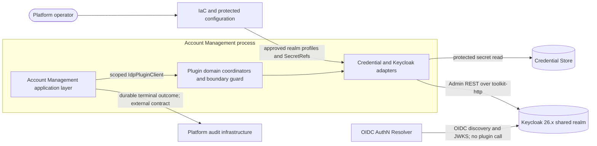
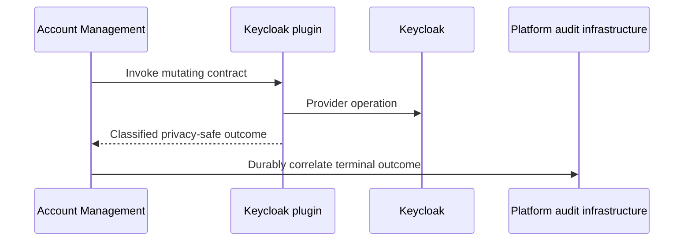

---
refs:
  - PRD.md
  - ../../../docs/DESIGN.md
  - ../../../docs/ADR/0001-cpt-cf-account-management-adr-idp-contract-separation.md
  - ../../../docs/ADR/0005-cpt-cf-account-management-adr-idp-user-identity-source-of-truth.md
  - ../../../docs/ADR/0006-cpt-cf-account-management-adr-idp-user-tenant-binding.md
  - ../../../docs/ADR/0008-cpt-cf-account-management-adr-user-attribute-update.md
---

# Technical Design — Keycloak IdP Plugin

- [ ] `p3` - **ID**: `cpt-cf-keycloak-idp-plugin-design-keycloak-idp-plugin`

**Owners:** @platform-iam-team  
**Scope:** Overall architecture for the priority-1 (V1) shared-realm plugin. In this document, **P2 means priority 2/deferred**, not version 2.

<!-- toc -->

- [1. Architecture Overview](#1-architecture-overview)
  - [1.1 Architectural Vision](#11-architectural-vision)
  - [1.2 Architecture Drivers](#12-architecture-drivers)
  - [1.3 Architecture Layers](#13-architecture-layers)
- [2. Principles & Constraints](#2-principles--constraints)
  - [2.1 Design Principles](#21-design-principles)
  - [2.2 Constraints](#22-constraints)
  - [2.3 Applicability Matrix](#23-applicability-matrix)
- [3. Technical Architecture](#3-technical-architecture)
  - [3.1 Domain Model](#31-domain-model)
  - [3.2 Component Model](#32-component-model)
  - [3.3 API Contracts](#33-api-contracts)
  - [3.4 Internal Dependencies](#34-internal-dependencies)
  - [3.5 External Dependencies](#35-external-dependencies)
  - [3.6 Interactions & Sequences](#36-interactions--sequences)
  - [3.7 Database schemas & tables](#37-database-schemas--tables)
- [4. Additional context](#4-additional-context)
  - [4.1 Security and Data Protection](#41-security-and-data-protection)
  - [4.2 Verification Architecture](#42-verification-architecture)
  - [4.3 Risks and Enablement Gates](#43-risks-and-enablement-gates)
- [5. Traceability](#5-traceability)
  - [5.1 Authoritative Contracts](#51-authoritative-contracts)
  - [5.2 P1 Requirement Allocation](#52-p1-requirement-allocation)

<!-- /toc -->

The adjacent [PRD](./PRD.md) is authoritative for WHAT, WHY, release priority, actors, and acceptance criteria. The Account Management SDK is authoritative for request, result, failure, filtering, ordering, and cursor contracts. Durable audit delivery is an external production prerequisite allocated to Account Management and the platform audit owner in §§3.5–3.6 and 4.3. This document defines only the V1 architecture and its safety invariants.

## 1. Architecture Overview

### 1.1 Architectural Vision

The Keycloak IdP plugin is a provider adapter inside Account Management. It implements the provider-neutral `IdpPluginClient` boundary and administers tenant-scoped identity resources in an operator-approved shared Keycloak realm. Account Management owns authorization, tenant lifecycle orchestration, and persistence of opaque provider metadata; Keycloak remains the user source of truth.

V1 does not adopt or create realms, write administrator secrets, manage service principals, expose public REST endpoints, or participate in token validation. Requests for deferred `adopted` or `created` modes are rejected as unsupported before any provider or Credential Store mutation. Those modes require a separate future DESIGN and approval.

### 1.2 Architecture Drivers

| Driver | Design allocation |
|---|---|
| Provider-neutral publication and operation-based readiness | GTS-scoped ClientHub publication, coordinated Account Management selection, and per-operation dependency classification |
| Shared-realm tenant isolation | Versioned routing metadata, a provider-owned tenant group, an immutable tenant marker, and mandatory boundary checks before reads or mutations |
| Safe external mutation | Tenant clean/ambiguous classification, replay-safe user operations, bounded retries, and operator reconciliation evidence |
| Hard access termination | Session revocation and identity deletion precede tenant-group deletion; unproven cleanup is terminal |
| Provider compatibility | Keycloak 26.x startup compatibility check plus a read-only realm authentication-profile verifier |
| Protected administration | Least-privileged per-realm administrator, Credential Store SecretRefs, shared ToolKit HTTP/auth, and no V1 master-realm administrator |
| Audit completeness | Account Management and the platform audit owner guarantee one durable terminal outcome per supported mutation call |
| User query correctness | SDK filter/order semantics, `CursorV1`, global deterministic sorting, and no stable-order claim based on Keycloak offset pages |
| Lifecycle safety | ToolKit cancellation and bounded drain; the plugin owns no periodic or audit-delivery task |

#### NFR Allocation

| NFR | Architectural response | Release verification |
|---|---|---|
| Tenant isolation | `TenantBoundaryGuard` validates both group membership and immutable tenant marker | Negative-isolation contract and real-Keycloak tests |
| Secret non-disclosure | Secret wrappers, allowlisted diagnostics, protected SecretRefs, and output scanning | Logs, metrics, audit, errors, and debug output contain no injected secret |
| Lifecycle latency | Shared HTTP pooling, bounded calls, point-lookup optimization, and measured full-group query scans | PRD qualification profile: 20 concurrent operations and stated p95 limits |
| Failure classification | Current SDK enums are the only failure vocabulary | Exhaustive enum mapping and failure injection |
| Audit completeness | The plugin returns a classified privacy-safe outcome; durable correlation and delivery are owned by Account Management and the platform audit contract | One terminal event per mutating call across cross-system contract tests |
| Provider compatibility | Startup version gate and release compatibility matrix | Supported 26.x matrix passes; unsupported major fails deterministically |
| Personal-data lifecycle | No local user directory; hard deletion removes identities and sessions | Hard-delete and output-minimization verification |
| Availability recovery | Dependency state is evaluated per affected operation after startup | Dependency loss/recovery tests without fallback or default realm |

#### Decision Provenance

V1 introduces no approved exception to the repository architecture. Its significant decisions inherit these accepted records and standards:

- [Separate Account Management from the IdP provider](../../../docs/ADR/0001-cpt-cf-account-management-adr-idp-contract-separation.md).
- [Keep the IdP as user source of truth](../../../docs/ADR/0005-cpt-cf-account-management-adr-idp-user-identity-source-of-truth.md).
- [Use provider-enforced tenant binding](../../../docs/ADR/0006-cpt-cf-account-management-adr-idp-user-tenant-binding.md).
- [Preserve provider-backed partial user updates](../../../docs/ADR/0008-cpt-cf-account-management-adr-user-attribute-update.md).
- [Use the first-party ToolKit HTTP client](../../../../../../docs/adrs/toolkit/0001-toolkit-hyper-tower-http-client.md).
- Follow [ClientHub and plugin scoping](../../../../../../docs/toolkit_unified_system/03_clienthub_and_plugins.md), [lifecycle rules](../../../../../../docs/toolkit_unified_system/08_lifecycle_stateful_tasks.md), the [Architecture Manifest](../../../../../../docs/ARCHITECTURE_MANIFEST.md), and [Security Guidelines](../../../../../../guidelines/SECURITY.md).

A proposal to add a master-realm administrator, direct `reqwest`, direct OpenBao mutation, unscoped publication, or plugin-owned user storage is a material deviation and requires a new accepted ADR before this DESIGN can change.

Durable audit delivery requires accepted Account Management and platform audit designs. This plugin design does not define their persistence, recovery, relay, sink, or retention mechanisms. The existing Account Management structured-log stand-in is suitable only for development.

### 1.3 Architecture Layers

| Layer | Responsibility |
|---|---|
| Account Management application | Public authorization, tenant saga orchestration, opaque metadata persistence, scoped provider selection, and audit orchestration defined by the parent AM design |
| Plugin domain | Tenant/user lifecycle, boundary enforcement, replay safety, error classification, and privacy-preserving outcomes |
| Plugin infrastructure | ToolKit HTTP/auth, Credential Store resolution, Keycloak representation mapping, and telemetry transport |
| Platform dependencies | Keycloak identity state, Credential Store secrets, platform audit infrastructure, and operator-owned realm configuration |

## 2. Principles & Constraints

### 2.1 Design Principles

#### Explicit provider intent

- [ ] `p3` - **ID**: `cpt-cf-keycloak-idp-plugin-principle-explicit-provider-intent`

Never infer a default realm or mode from missing metadata.

#### Two-factor tenant binding

- [ ] `p3` - **ID**: `cpt-cf-keycloak-idp-plugin-principle-two-factor-tenant-binding`

A shared realm is routing context, not tenant authorization; tenant marker and group membership must agree.

#### Operator-owned realm

- [ ] `p3` - **ID**: `cpt-cf-keycloak-idp-plugin-principle-operator-owned-realm`

V1 may create and delete plugin-owned tenant groups and users, but never the shared realm or realm-level authentication configuration.

#### Correctness before retry

- [ ] `p3` - **ID**: `cpt-cf-keycloak-idp-plugin-principle-correctness-before-retry`

Retry only reads and operations proven replay-safe; never convert uncertain tenant mutation into a clean failure.

#### SDK authority

- [ ] `p3` - **ID**: `cpt-cf-keycloak-idp-plugin-principle-sdk-authority`

Duplicate local DTO, cursor, and failure specifications are prohibited.

#### No silent success

- [ ] `p3` - **ID**: `cpt-cf-keycloak-idp-plugin-principle-no-silent-success`

Unsupported mutation and unproven cleanup produce typed failures.

#### Least privilege

- [ ] `p3` - **ID**: `cpt-cf-keycloak-idp-plugin-principle-least-privilege`

Use one approved realm-administrator profile per shared realm; V1 has no master-realm credential.

#### Privacy-preserving evidence

- [ ] `p3` - **ID**: `cpt-cf-keycloak-idp-plugin-principle-privacy-preserving-evidence`

Operation outcomes are observable without credentials or user profile values.

#### Durable intent before mutation

- [ ] `p3` - **ID**: `cpt-cf-keycloak-idp-plugin-principle-durable-audit-intent`

Account Management and the platform audit contract must durably correlate each mutating plugin call with one terminal outcome. The mechanism is outside this plugin design.

### 2.2 Constraints

#### Shared-realm-only V1

- [ ] `p3` - **ID**: `cpt-cf-keycloak-idp-plugin-constraint-shared-realm-only-v1`

V1 supports only `mode = shared` against an operator-approved Keycloak 26.x realm.

#### External consistency boundaries

- [ ] `p3` - **ID**: `cpt-cf-keycloak-idp-plugin-constraint-external-consistency-boundaries`

Keycloak, Credential Store, and the platform audit sink are external consistency boundaries. Plugin calls occur outside Account Management database transactions, so the architecture does not claim atomic commit or transport-level exactly-once behavior across those systems.

#### External durable audit prerequisite

- [ ] `p3` - **ID**: `cpt-cf-keycloak-idp-plugin-constraint-durable-audit-wrapper`

The plugin owns no audit table, recovery worker, relay, or sink integration. Production requires the parent Account Management design and platform audit contract to guarantee durable one-to-one call/outcome correlation across process failure and redelivery.

#### Opaque metadata replay

- [ ] `p3` - **ID**: `cpt-cf-keycloak-idp-plugin-constraint-opaque-metadata-replay`

Account Management persists plugin metadata as opaque JSON and replays it on later calls.

#### No plugin persistence

- [ ] `p3` - **ID**: `cpt-cf-keycloak-idp-plugin-constraint-no-plugin-persistence`

The plugin owns no database table and no persistent user cache.

#### Scoped provider selection

- [ ] `p3` - **ID**: `cpt-cf-keycloak-idp-plugin-constraint-scoped-provider-selection`

Account Management requires a coordinated change to select a GTS-scoped provider instance; no unscoped compatibility fallback is allowed.

#### Bounded offline-token exposure

- [ ] `p3` - **ID**: `cpt-cf-keycloak-idp-plugin-constraint-bounded-offline-token-exposure`

A previously issued access JWT can remain valid until `exp`; the approved realm profile caps V1 access-token lifetime at 15 minutes.

#### Correct global query ordering

- [ ] `p3` - **ID**: `cpt-cf-keycloak-idp-plugin-constraint-correct-global-query-ordering`

Query correctness requires a global view of the tenant group because Keycloak does not guarantee stable ordering across offset pages. V1 accepts linear provider-read cost and must prove the PRD latency target on the release qualification population.

### 2.3 Applicability Matrix

| Checklist domain | Disposition |
|---|---|
| Architecture and semantic alignment | Applicable; addressed in §§1–3 and §5. |
| Performance and capacity | Applicable; query complexity and release gates are addressed in §§1.2, 2.2, 3.6, and 4.3. |
| Security and compliance controls | Applicable; trust boundaries and controls are addressed in §4.1. No plugin-specific regulatory regime is added because the PRD and platform security baseline own regulatory classification. |
| Reliability | Applicable; mutation uncertainty, replay, cancellation, and recovery are addressed in §3.6. |
| Data | Applicable only to ownership and lifecycle because the plugin owns no database; addressed in §§3.1, 3.7, and 4.1. |
| Integration | Applicable; Account Management, Keycloak, Credential Store, audit, and ClientHub boundaries are addressed in §§3.2–3.6. |
| Operations | Applicable; deployment, observability, compatibility, and enablement gates are addressed in §§3.2, 3.6, and 4.3. |
| Maintainability | Applicable; SDK authority, component boundaries, and decision provenance are addressed in §§1.2, 2.1, and 3.2–3.4. |
| Testing | Applicable; verification architecture is addressed in §4.2. |
| Usability | Not applicable because the plugin exposes no human interface; Account Management owns public API usability. |
| Accessibility | Not applicable because the plugin exposes no visual or interactive user interface. |
| Business and time-to-market | Not applicable because prioritization, business outcomes, and delivery timing are owned by the adjacent PRD and planning artifacts. |
| Plugin-specific cost budget | Not applicable because V1 adds no independently deployed service or plugin-owned store. Audit infrastructure cost belongs to its external owners. |
| Documentation quality | Applicable; authoritative references and bidirectional traceability are provided in §5. |

## 3. Technical Architecture

### 3.1 Domain Model

The provider metadata is a versioned, non-secret routing envelope owned by the plugin and persisted opaquely by Account Management. It identifies the shared realm, provider-owned tenant group, immutable tenant identity, and a non-secret administrator-profile reference. Exact serialization belongs to the implementation specification; compatibility rules are architectural:

- all versions in the declared rolling-upgrade window can read and safely deprovision metadata written by one another;
- malformed or unknown newer-major metadata fails closed without provider mutation;
- metadata never contains administrator secrets, tokens, passwords, or user profile values;
- realm and tenant identifiers come from replayed metadata, not caller-controlled defaults on later operations.

Provider ownership is split as follows:

| Resource | Owner | Plugin authority |
|---|---|---|
| Shared realm and authentication profile | Platform operator | Read and verify only |
| Realm-administrator client and secret | Platform operator | Authenticate with least privilege; never create or disclose |
| Tenant group and immutable tenant marker | Plugin | Create, inspect, and delete for the owning tenant |
| Human identity and sessions in the tenant boundary | Plugin through Account Management | Create, update, query, revoke, and delete after boundary verification |
| Opaque provider metadata row | Account Management | Persist/replay only; plugin owns interpretation |
| Durable audit record and delivery | Account Management and platform audit owner | Defined outside this plugin; must correlate one terminal outcome to each mutating call |
| Access-token validation | OIDC AuthN Resolver | No call to this plugin |

### 3.2 Component Model

#### Keycloak IdP plugin

- [ ] `p3` - **ID**: `cpt-cf-keycloak-idp-plugin-component-keycloak-idp-plugin`

The plugin is one logical architecture component. The following entries are responsibility partitions inside that component, not independently deployed services.

| Responsibility partition | Architectural responsibility |
|---|---|
| Plugin module | Configuration, startup compatibility, lifecycle, and GTS-scoped ClientHub publication |
| Approved realm registry | Maps explicit shared-realm intent to operator-approved realm and non-secret credential profile |
| Realm profile verifier | Read-only verification of Keycloak version, issuer, clients, scopes, protocol mappers, claims, signing, session/token policy, password/login policy, and required administration privileges |
| Metadata codec | Versioned opaque metadata compatibility and fail-closed decoding |
| Tenant lifecycle coordinator | Tenant-boundary provisioning, hard-deletion ordering, uncertainty classification, and reconciliation evidence |
| Tenant boundary guard | Verifies tenant marker and group membership before every user read or mutation |
| User lifecycle coordinator | Replay-safe user create/update/delete and provider projection |
| User query adapter | Tenant-scoped filtering, ordering, point existence, global sorting, and `CursorV1` generation |
| Keycloak adapter | ToolKit HTTP/auth integration, bounded provider calls, response classification, and allowlisted diagnostics |
| Credential resolver | Protected SecretRef resolution under a least-privileged plugin system actor, including ownership validation and rotation refresh |
| Terminal outcome producer | Returns one classified, privacy-preserving outcome to the AM caller and records bounded-cardinality metrics separately |

#### Deployment, Publication, and Readiness

The plugin is an in-process ModKit module in each Account Management replica. It opens no listener and owns no independent deployment or database.

Each instance publishes `IdpPluginClient` with `ClientScope::gts_id(instance_id)`. Account Management must select the configured provider instance through scoped ClientHub resolution. This coordinated consumer change is a V1 implementation prerequisite; ambiguous selection or unscoped fallback fails closed.

Initialization validates configuration, approved realm profiles, SecretRef syntax, TLS policy, and GTS identity; resolves standard ClientHub dependencies; resolves the selected realm administrator through Credential Store; and proves the provider reports a supported Keycloak 26.x major. `provision_tenant` remains the operation-based provider readiness signal. Audit infrastructure does not add a plugin dependency.

No V1 initialization path resolves P2 OpenBao mutation APIs or a master-realm bootstrap administrator. After successful publication, dependency loss is classified on the operation that needs it; the module remains registered so recovery does not require process restart.

### 3.3 API Contracts

The current [`idp.rs`](../../../account-management-sdk/src/idp.rs) and [`idp_user.rs`](../../../account-management-sdk/src/idp_user.rs) contracts are authoritative. This design does not add audit parameters to `IdpPluginClient`. Any future propagation required by the Account Management or platform audit contract must follow normal SDK compatibility rules.

Architectural contract invariants are:

- malformed shared-realm intent uses `IdpProvisionFailure::InvalidInput` before provider mutation;
- deferred modes use `UnsupportedOperation` before provider or Credential Store mutation;
- only pre-provision failures proven to retain no provider state use `CleanFailure`;
- uncertain tenant provisioning preserves `Ambiguous`;
- duplicate users, password-policy rejection, absent update targets, and unavailability use their current classified user variants;
- `Rejected` is reserved for provider rejection that cannot be classified further;
- already-absent deprovisioning follows the SDK's success-equivalent semantics;
- deprovisioning is `Retryable` only when no attempted mutation has an unknown outcome; any mutation request that may have reached Keycloak without a provable result is `Terminal`, regardless of whether the immediate error appears transient;
- typed filter/order and `CursorV1` are used without a plugin-specific parallel contract;
- every mutating return is classifiable and contains enough non-sensitive context for the external audit owner to construct its terminal outcome.

The plugin emits no public HTTP API. Account Management owns public status, validation-envelope, and redaction mapping.

### 3.4 Internal Dependencies

Domain components depend on plugin-owned ports rather than transport types. Direct `reqwest`, raw `hyper`, `tonic`, or Credential Store implementation types do not cross into the domain layer.

| Internal dependency | Purpose |
|---|---|
| Account Management SDK | Provider-neutral trait, DTO, failure, and pagination authority |
| ModKit and ClientHub | Module initialization, lifecycle context, GTS-scoped publication and dependency resolution |
| `toolkit-http` | Shared TLS, redirects, timeout, retry, concurrency, body-limit, and telemetry policy |
| `toolkit-auth` | Supported OAuth client-credential integration and token refresh |
| `toolkit-odata` | Typed filter/order interpretation and `CursorV1` compatibility |
| Credential Store SDK | Protected SecretRef reads without implementation coupling |

### 3.5 External Dependencies

| Dependency | Contract and failure boundary |
|---|---|
| Account Management | Authorizes calls, selects the scoped plugin, persists/replays opaque metadata, consumes typed outcomes, and owns audit orchestration defined by its parent design |
| Keycloak 26.x | User/session/group source of truth and Admin REST provider; another major is unsupported until compatibility approval |
| Credential Store | Protects operator-created realm-administrator secrets; ownership or availability failure blocks only dependent administration |
| Platform audit infrastructure | Owns the sink and delivery contract consumed by Account Management; not defined by this plugin |
| Operator IaC | Creates the shared realm, realm-local administrator, required authentication profile, SecretRefs, and approved realm registry |
| OIDC AuthN Resolver | Independently validates tokens; the two plugins do not call each other |

### 3.6 Interactions & Sequences

#### Realm Admissibility and Tenant Provisioning

**ID**: `cpt-cf-keycloak-idp-plugin-seq-tenant-provisioning`

A realm is admissible only when explicit `mode = shared` intent names an operator-approved realm and the read-only verifier proves the supported provider version plus the complete platform authentication profile. The profile includes trusted issuer/discovery, required clients, scopes, protocol mappers and claims, signing policy, session/token limits, password/login controls, and least-privileged administration. A mismatch is a pre-mutation failure; the plugin never repairs operator-owned realm configuration.

After admissibility succeeds, the tenant lifecycle coordinator creates or reconciles the plugin-owned tenant group with its immutable marker and returns provider metadata only after the boundary is usable. The verifier and lifecycle coordinator use the least-privileged administrator for the target realm; V1 has no master-realm administrator.

#### User Mutation Safety

**ID**: `cpt-cf-keycloak-idp-plugin-seq-user-mutation`

Every user operation resolves realm and tenant group from replayed provider metadata. Before reading, updating, revoking, or deleting a user, `TenantBoundaryGuard` requires membership in the resolved tenant group and an immutable tenant marker equal to the target tenant. A mismatch performs no mutation, follows the operation's non-disclosing absence semantics, and emits a security-classified terminal outcome without profile values.

User provisioning is a recoverable unit even though provider creation and tenant binding are separate effects. The created representation carries the immutable tenant marker, and replay uses the stable `(tenant_id, username)` identity key to distinguish a matching partial creation from another tenant's uniqueness collision. Matching partial work is completed; a conflicting identity uses `DuplicateUser`. User operations do not invent an ambiguity variant outside the SDK.

#### Hard Tenant Deprovisioning

**ID**: `cpt-cf-keycloak-idp-plugin-seq-hard-tenant-deprovisioning`

Hard deprovisioning proves access termination before boundary deletion. It obtains a complete tenant-group membership view, verifies each tenant marker, revokes sessions, deletes every tenant identity, verifies cleanup, and only then deletes the plugin-owned group. The shared realm and unrelated identities are never deleted.

Already-absent plugin-owned resources are success-equivalent. `Retryable` is limited to failures for which the plugin proves that no deprovisioning mutation has an unknown outcome: no mutating request may have reached Keycloak, or all completed partial work is proven replay-safe and no attempted stage remains uncertain. If a session-revocation, identity-removal, or group-removal request may have reached Keycloak and its result cannot be proven, the outcome is `Terminal` for operator action even when the immediate cause is a timeout or transient transport failure. Ownership mismatch, incomplete enumeration, and any inability to prove safe continuation are also terminal. The process blocks refresh and new sessions but does not claim immediate invalidation of an already-issued JWT; exposure is bounded by the 15-minute profile limit.

#### User Query Architecture

**ID**: `cpt-cf-keycloak-idp-plugin-seq-user-query`

`IdpListUsersRequest` is authoritative. Because Keycloak 26.x does not document stable global order for group-member offset pages, V1 obtains a complete per-request tenant-group view, verifies tenant binding, applies supported SDK filter/order, and globally sorts with a unique provider-ID tiebreaker. The continuation token is a valid `CursorV1` that pins filter, order, tenant context, and the last emitted key tuple.

This is a correctness-first linear scan, not an `O(page)` claim. Point existence may use a direct provider lookup followed by the same boundary guard. No persistent local index or user cache is introduced. Release qualification must prove the PRD 100-user-page latency target at the declared tenant population; failure requires an upstream capacity or contract decision rather than per-page sorting over unstable offsets.

#### Failure, Retry, and Reconciliation

**ID**: `cpt-cf-keycloak-idp-plugin-seq-reconciliation`

Retries are bounded and limited to idempotent reads, token refresh, or operations whose replay contract proves safety. For tenant deprovisioning, a pre-send dependency failure or proven replay-safe partial state may return `Retryable`; a timeout or disconnect after a mutating request may have reached Keycloak returns `Terminal` unless the result is independently proven. A provider mutation is never blindly retried merely because transport failed. Circuit breaking is dependency-specific and never selects a default realm or stale user projection.

Ambiguous tenant provisioning remains operator-owned in V1. Terminal outcomes provide non-secret stage and ownership evidence. Production enablement requires a reconciliation runbook whose resolution ends as compensated, accepted complete, blocked for investigation, or escalated for controlled cleanup.

#### HTTP, Credentials, and Rotation

**ID**: `cpt-cf-keycloak-idp-plugin-seq-credential-resolution`

All Keycloak OAuth and Admin REST traffic uses `toolkit-http` and the supported `toolkit-auth` integration. Direct `reqwest` is prohibited. Administrator credentials are operator-created SecretRefs read through the canonical Credential Store client under a stable plugin system actor restricted to configured references. The resolver validates returned ownership/sharing metadata and rejects inherited or cross-tenant material inconsistent with the approved platform credential profile.

Credential values remain protected secret types and never enter metadata, errors, events, metrics, or debug formatting. Provider authentication rejection invalidates cached material, re-resolves the SecretRef, and permits one replay through the shared auth layer. V1 uses reactive refresh and has no scheduled credential-refresh task.

#### Durable Mutation Audit Boundary

**ID**: `cpt-cf-keycloak-idp-plugin-seq-terminal-outcome`

The plugin produces the classified provider outcome and privacy-safe evidence needed by its caller. It does not persist audit records, call the platform audit sink, or own delivery/recovery tasks.

Account Management and the platform audit owner must guarantee one durable terminal outcome per mutating contract call, including process failure after a possible provider effect and duplicate delivery. Their chosen persistence, idempotency key, recovery, replay, acknowledgement, and retention semantics belong to their own authoritative designs and contracts.

Until those owners approve and implement that guarantee, this plugin may use the existing structured-log stand-in for development but is not production-enabled. Audit payloads prohibit usernames, emails, display names, passwords, tokens, administrator secrets, raw provider bodies, and request payloads.

#### Lifecycle and Shutdown

**ID**: `cpt-cf-keycloak-idp-plugin-seq-lifecycle-shutdown`

The module receives a ToolKit `CancellationToken`. Shutdown stops new work, cancels idle provider activity, and drains in-flight mutations for a bounded interval before connection teardown. Mutation coordinators preserve their normal replay/reconciliation evidence if the timeout expires. The plugin owns no periodic, detached, or audit-delivery task.

### 3.7 Database schemas & tables

Not applicable because the plugin owns no database schema, table, migration, audit store, or persistent user index. Account Management owns its opaque provider-metadata row, and Keycloak owns provider identity state. Any audit persistence belongs to the parent Account Management design or platform audit owner and is intentionally not specified here.

## 4. Additional context

### 4.1 Security and Data Protection

#### Trust Boundaries

| Boundary | Control |
|---|---|
| Account Management caller to plugin | AM authorizes; forwarded `SecurityContext` identifies the actor but never substitutes for provider tenant checks |
| Plugin to Credential Store | Dedicated system actor, configured SecretRef allowlist, response ownership validation, and no caller-tenant credential ownership |
| Plugin to Keycloak | Least-privileged realm administrator, TLS verification, ToolKit HTTP policy, and provider-version/profile checks |
| Tenant A to tenant B in one realm | Mandatory group-plus-marker guard on every read and mutation |
| Account Management to platform audit infrastructure | External contract; the plugin supplies only classified privacy-safe outcomes |
| Plugin to metrics | Bounded-cardinality labels and no profile or credential values |

The V1 administrator has only realm-local permissions needed to inspect the authentication profile and administer users, sessions, and the configured tenant-group subtree. It cannot create/delete realms, administer another realm, read client secrets, or alter operator-owned authentication configuration.

Missing, malformed, contradictory, unknown-major, or deferred-mode metadata causes no provider mutation. A realm outside the approved registry is rejected even if reachable. Tenant marker and group disagreement blocks access. Credential or TLS failure never falls back to plaintext, another realm, or cached user data.

Keycloak is the sole user directory. The plugin holds request data only for the operation lifetime and stores no local profile. Provider metadata contains routing identifiers rather than profile data. Hard deprovisioning removes identities and sessions before the group; failed proof is terminal. Plugin-provided audit evidence and metrics use provider IDs only where operationally necessary and contain no profile or credential values.

### 4.2 Verification Architecture

Verification is split by boundary rather than duplicated as method-level test cases in this overall DESIGN:

| Level | Purpose |
|---|---|
| Unit | Metadata compatibility, boundary predicates, cursor construction, error classification, redaction, and privacy-safe outcome construction |
| SDK contract | Conformance to the existing `IdpPluginClient`, failure enums, typed filter/order, and `CursorV1` |
| Real-Keycloak integration | Supported-version/profile checks, least privilege, user replay, cross-tenant denial, complete hard deletion, pre-send retryable versus post-send unproven terminal classification, provider failures, and global query behavior |
| Credential Store integration | SecretRef ownership, rotation refresh, authorization denial, and non-disclosure |
| Cross-system audit contract | Account Management and the platform audit owner prove one durable terminal event per mutating call across crash and redelivery; this is an external production gate |
| Lifecycle integration | Cancellation during provider stages, bounded drain, replay/reconciliation evidence, and absence of plugin-owned detached tasks |
| End to end | Account Management scoped selection, tenant/user lifecycle, audit correlation, reconciliation evidence, and PRD latency profile |

Tests that claim provider semantics use a supported real Keycloak 26.x instance. Test doubles are limited to deterministic local classification and failure injection; they do not establish Keycloak compatibility, tenant isolation, TLS, credential authorization, or latency.

Crash and redelivery verification for durable audit is owned by the parent Account Management and platform audit designs. The plugin contract suite verifies that every returned outcome is classified, correlatable, and free of prohibited profile or credential values.

### 4.3 Risks and Enablement Gates

| Gate | Required resolution before V1 production enablement |
|---|---|
| Scoped provider selection | Account Management resolves the configured GTS instance; two-instance selection passes; no unscoped fallback remains |
| Realm profile | Operator-approved profile is versioned and every required property is verified before tenant mutation |
| Query capacity | Correct full-group scan meets PRD latency at the declared release population; otherwise upstream capacity/contract is revised |
| User replay | Failure injection after each provider effect converges to one correctly bound identity |
| Hard deletion | Two-tenant integration proves sessions and identities for the retiring tenant are removed without touching the active tenant |
| Audit ownership | Parent Account Management and platform audit designs assign persistence, recovery, delivery, sink, and retention ownership; the plugin owns none of them |
| Audit completeness | Cross-system tests prove one durable terminal outcome per mutating call across process failure and redelivery; the structured-log stand-in is not a production substitute |
| Reconciliation | Operator runbook exists and consumes emitted evidence without secret inspection |
| Compatibility | Supported Keycloak 26.x matrix passes and representative unsupported majors fail startup |
| Lifecycle | Cancellation and rolling-restart tests prove bounded shutdown and replay safety |

Deferred adopted realms, plugin-created realms, OpenBao secret mutation, and service-principal lifecycle are not designed here. Each requires its own upstream contract, security review, DESIGN, ADRs where decisions depart from accepted standards, and release gates.

## 5. Traceability

### 5.1 Authoritative Contracts

- [Adjacent PRD](./PRD.md)
- [Account Management DESIGN](../../../docs/DESIGN.md)
- [`IdpPluginClient` tenant contract](../../../account-management-sdk/src/idp.rs)
- [`IdpPluginClient` user contract](../../../account-management-sdk/src/idp_user.rs)
- [Unified ToolKit architecture](../../../../../../docs/toolkit_unified_system/README.md)

### 5.2 P1 Requirement Allocation

| PRD requirement IDs | Design sections |
|---|---|
| `cpt-cf-keycloak-idp-plugin-fr-provider-publication`, `cpt-cf-keycloak-idp-plugin-fr-readiness`, `cpt-cf-keycloak-idp-plugin-interface-provider-instance` | §§3.2, 3.6, 4.3 |
| `cpt-cf-keycloak-idp-plugin-fr-tenant-realm-binding`, `cpt-cf-keycloak-idp-plugin-fr-shared-realm-admissibility`, `cpt-cf-keycloak-idp-plugin-fr-tenant-provision`, `cpt-cf-keycloak-idp-plugin-usecase-bind-shared-tenant` | §§3.1, 3.6 |
| `cpt-cf-keycloak-idp-plugin-fr-realm-authentication-profile`, `cpt-cf-keycloak-idp-plugin-nfr-provider-compatibility`, `cpt-cf-keycloak-idp-plugin-contract-keycloak-admin` | §§3.2, 3.6, 4.3 |
| `cpt-cf-keycloak-idp-plugin-fr-provider-metadata` | §§3.1, 3.3 |
| `cpt-cf-keycloak-idp-plugin-fr-tenant-deprovision`, `cpt-cf-keycloak-idp-plugin-fr-tenant-user-access-termination`, `cpt-cf-keycloak-idp-plugin-usecase-retire-tenant` | §§3.6, 4.1 |
| `cpt-cf-keycloak-idp-plugin-fr-tenant-failure-contract`, `cpt-cf-keycloak-idp-plugin-fr-external-mutation-resilience`, `cpt-cf-keycloak-idp-plugin-nfr-failure-classification` | §§3.3, 3.6 |
| `cpt-cf-keycloak-idp-plugin-fr-user-provision`, `cpt-cf-keycloak-idp-plugin-fr-user-update`, `cpt-cf-keycloak-idp-plugin-fr-user-update-outcomes`, `cpt-cf-keycloak-idp-plugin-fr-user-deprovision`, `cpt-cf-keycloak-idp-plugin-usecase-update-user` | §3.6 |
| `cpt-cf-keycloak-idp-plugin-fr-user-query` | §3.6 |
| `cpt-cf-keycloak-idp-plugin-fr-user-source-of-truth` | §§3.1, 4.1 |
| `cpt-cf-keycloak-idp-plugin-fr-administrator-credentials`, `cpt-cf-keycloak-idp-plugin-contract-credstore` | §§3.5–3.6, 4.1 |
| `cpt-cf-keycloak-idp-plugin-fr-operator-reconciliation`, `cpt-cf-keycloak-idp-plugin-usecase-reconcile-ambiguous-mutation` | §§3.6, 4.3 |
| `cpt-cf-keycloak-idp-plugin-fr-offline-token-lifetime` | §§2.2, 3.6 |
| `cpt-cf-keycloak-idp-plugin-fr-audit-metrics`, `cpt-cf-keycloak-idp-plugin-nfr-audit-completeness` | §§3.3, 3.5–3.6, 4.1–4.3 |
| `cpt-cf-keycloak-idp-plugin-nfr-tenant-isolation` | §§3.6, 4.1 |
| `cpt-cf-keycloak-idp-plugin-nfr-secret-nondisclosure` | §§3.6, 4.1 |
| `cpt-cf-keycloak-idp-plugin-nfr-lifecycle-latency` | §§1.2, 2.2, 3.6, 4.3 |
| `cpt-cf-keycloak-idp-plugin-nfr-personal-data-lifecycle` | §4.1 |
| `cpt-cf-keycloak-idp-plugin-nfr-availability-recovery` | §§3.2, 3.6 |
| `cpt-cf-keycloak-idp-plugin-interface-idp-plugin-client`, `cpt-cf-keycloak-idp-plugin-contract-account-management` | §§1.1, 2.1, 3.2–3.3 |

P2 requirements remain traceable in the PRD but are intentionally not allocated to V1 implementation components in this DESIGN.
