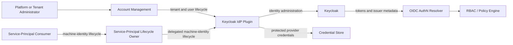

# PRD — Keycloak IdP Plugin

<!-- toc -->

- [1. Overview](#1-overview)
  - [1.1 Purpose](#11-purpose)
  - [1.2 Background / Problem Statement](#12-background--problem-statement)
  - [1.3 Goals (Business Outcomes)](#13-goals-business-outcomes)
  - [1.4 Glossary](#14-glossary)
- [2. Actors](#2-actors)
  - [2.1 Human Actors](#21-human-actors)
  - [2.2 System Actors](#22-system-actors)
- [3. Operational Concept & Environment](#3-operational-concept--environment)
  - [3.1 Gear-Specific Environment Constraints](#31-gear-specific-environment-constraints)
- [4. Scope](#4-scope)
  - [4.1 In Scope](#41-in-scope)
  - [4.2 Out of Scope](#42-out-of-scope)
- [5. Functional Requirements](#5-functional-requirements)
  - [5.1 Plugin Availability and Selection](#51-plugin-availability-and-selection)
  - [5.2 Tenant Lifecycle](#52-tenant-lifecycle)
  - [5.3 User Lifecycle](#53-user-lifecycle)
  - [5.4 Service-Principal Lifecycle](#54-service-principal-lifecycle)
  - [5.5 Provider Administration and Operations](#55-provider-administration-and-operations)
- [6. Non-Functional Requirements](#6-non-functional-requirements)
  - [6.1 Gear-Specific NFRs](#61-gear-specific-nfrs)
  - [6.2 NFR Exclusions](#62-nfr-exclusions)
- [7. Public Library Interfaces](#7-public-library-interfaces)
  - [7.1 Public API Surface](#71-public-api-surface)
  - [7.2 External Integration Contracts](#72-external-integration-contracts)
- [8. Use Cases](#8-use-cases)
- [9. Acceptance Criteria](#9-acceptance-criteria)
  - [V1 Acceptance](#v1-acceptance)
  - [P2 Promotion Acceptance](#p2-promotion-acceptance)
- [10. Dependencies](#10-dependencies)
- [11. Assumptions](#11-assumptions)
- [12. Risks](#12-risks)
- [13. Open Questions](#13-open-questions)
- [14. Traceability](#14-traceability)

<!-- /toc -->

## 1. Overview

### 1.1 Purpose

The Keycloak IdP Plugin is a provider plugin for Account Management. In v1, it translates tenant and user lifecycle requests into administrative operations against Keycloak. A future p2 extension can add machine-identity lifecycle behavior through a platform owner outside Account Management. The plugin gives deployments a production provider while keeping Account Management independent of provider-specific behavior.

The plugin runs as a Gear in the host process. Account Management remains the public control-plane boundary. The plugin exposes no public REST API and does not authenticate requests, issue tokens, validate tokens, or make authorization decisions.

### 1.2 Background / Problem Statement

Account Management defines stable provider contracts for tenant and user identity lifecycle operations. A deployment still needs a provider that can apply those requests to its selected identity system without placing Keycloak-specific concepts in Account Management.

An identity-management platform also needs tenant isolation, clear realm ownership, and safe external-mutation handling. The shared realm is the only v1 realm strategy. Adopted and plugin-created realms are p2 compatibility modes and cannot be enabled through the v1 contract. Machine-identity lifecycle behavior is also p2 because Account Management does not own that public capability. Without one defined product contract, provider behavior can drift across tenant provisioning, user administration, retries, and operational signals.

The Keycloak IdP Plugin solves this gap for Keycloak. It owns the provider-facing lifecycle behavior while preserving the boundaries of Account Management, the OIDC authentication resolver, Keycloak, CredStore, and the platform Policy Engine.

### 1.3 Goals (Business Outcomes)

- Pass 100% of the Account Management `IdpPluginClient` contract suite for every v1 release.
- Produce zero successful cross-tenant reads or mutations across the automated negative-isolation suite.
- Produce expected SDK outcomes for 100% of failure-injection cases, with zero ambiguous tenant-provisioning outcomes classified as clean failures.
- Expose zero administrator secrets, user passwords, or profile values across automated log, metric, audit, and debug-output scans.
- Pass the complete compatibility suite against every supported Keycloak 26.x release before publishing the plugin release.
- Meet the v1 lifecycle latency budgets in §6.1 on the release qualification profile.

### 1.4 Glossary

| Term | Definition |
|------|------------|
| Account Management (AM) | The system gear that owns public tenant and user operations and delegates provider-specific identity work. |
| IdP | Identity provider; Keycloak is the provider targeted by this plugin. |
| Realm | A Keycloak isolation and administration boundary containing identities and related configuration. |
| Shared realm | An operator-owned realm that contains more than one tenant. |
| Adopted realm | An existing operator-owned realm selected for a tenant without transferring realm ownership to the plugin. |
| Created realm | A realm created and lifecycle-managed by the plugin. |
| Service principal | A tenant-owned machine identity used for service-to-service authentication. |
| Platform authentication profile | The product-level issuer, claim, client, signing, session, and login requirements that make a Keycloak realm usable by platform authentication consumers. |
| Ambiguous outcome | A failed or lost response where an external mutation might have completed and reconciliation is required before retry. |
| OIDC AuthN Resolver Plugin | The separate runtime component that validates incoming OIDC tokens offline; v1 does not require it to check per-identity revocation state. |

## 2. Actors

### 2.1 Human Actors

#### Platform Operator

**ID**: `cpt-cf-keycloak-idp-plugin-actor-platform-operator`

- **Role**: Configures and operates the plugin, Keycloak administration access, realm ownership, and provider dependencies.
- **Needs**: Predictable startup, least-privilege administration, safe reconciliation, and actionable operational signals.

#### Tenant Administrator

**ID**: `cpt-cf-keycloak-idp-plugin-actor-tenant-admin`

- **Role**: Manages tenant users through Account Management and, if p2 is promoted, machine identities through a platform owner outside Account Management.
- **Needs**: Complete identity lifecycle operations that remain inside the authorized tenant boundary.

### 2.2 System Actors

#### Account Management

**ID**: `cpt-cf-keycloak-idp-plugin-actor-account-management`

- **Role**: Authorizes and orchestrates identity-lifecycle requests, selects the active provider, supplies resolved tenant context, and delegates provider-specific work.

#### Service-Principal Consumer

**ID**: `cpt-cf-keycloak-idp-plugin-actor-service-principal-consumer`

- **Role**: In p2, requests tenant-scoped machine-identity lifecycle behavior through a platform owner outside Account Management and does not consume the provider plugin directly.

#### Keycloak

**ID**: `cpt-cf-keycloak-idp-plugin-actor-keycloak`

- **Role**: Stores and administers identity boundaries, human and machine identities, sessions, and provider credentials.

#### Credential Store

**ID**: `cpt-cf-keycloak-idp-plugin-actor-credstore`

- **Role**: Protects provider administrator credentials and other configured secret material. Consumers may use it for durable custody of one-time service-principal credentials; the owning platform service and this plugin do not retain those returned credentials.

#### OIDC AuthN Resolver Plugin

**ID**: `cpt-cf-keycloak-idp-plugin-actor-authn-resolver`

- **Role**: Validates issued tokens offline before producing an authenticated security context. In v1, it does not manage sessions or check per-identity revocation state.

## 3. Operational Concept & Environment

The plugin follows the repository-wide architecture and security baselines in [Architecture Manifest](../../../../../../docs/ARCHITECTURE_MANIFEST.md) and [Security Guidelines](../../../../../../guidelines/SECURITY.md). Its parent product contract is [Account Management PRD](../../../docs/PRD.md).

The plugin adds a provider-specific boundary beneath Account Management. It does not change the platform-owned authentication, authorization, REST, or tenant-resolution paths.

### 3.1 Gear-Specific Environment Constraints

- The deployment must provide a supported Keycloak administration surface; each lifecycle call reports whether the dependencies required by that operation are usable, without adding a separate Account Management availability probe.
- Account Management must provide the tenant context and provider-owned metadata required to route existing-tenant operations.
- Credential Store must be available for operations that require dynamic provider credentials.
- The deployment must select one unambiguous active provider for each supported identity-lifecycle capability.

## 4. Scope

### 4.1 In Scope

- Selectable Keycloak provider registration for Account Management.
- Explicit tenant binding to an operator-approved shared Keycloak realm.
- Tenant identity-boundary creation, binding, and cleanup within the shared realm.
- Tenant-scoped user creation, partial update, deletion, provider-session revocation, listing, filtering, and ordering.
- Protected provider-administrator credential use and dynamic provider-administrator secret lifecycle.
- Deterministic failure classification, retry safety, and ambiguous-outcome reconciliation signals.
- Provider-specific audit events, metrics, readiness, and dependency-health signals.

### 4.2 Out of Scope

The adopted-realm, created-realm, and service-principal bullets below are out of v1 scope but retained as p2 requirements. All other bullets are product-level exclusions.

- Starting, deploying, upgrading, backing up, or scaling Keycloak.
- Running code inside Keycloak or packaging Keycloak server extensions.
- Issuing access or refresh tokens; Keycloak owns token issuance.
- Validating incoming JWTs; the OIDC AuthN Resolver Plugin owns validation.
- Making authorization decisions; RBAC and the Policy Engine own authorization.
- Exposing public REST endpoints; Account Management and other owning gears expose public APIs.
- Moving a user between tenants or changing a user's tenant binding through profile update.
- Cross-realm browser SSO between shared, adopted, and created realms unless a separate federation product establishes it.
- Persisting a local user directory or a local copy of Keycloak credentials.
- Adopted and plugin-created realm modes; these are p2 capabilities that require an expanded Account Management provider contract.
- Service-principal creation, rotation, revocation, listing, and tenant-retirement cleanup; these are p2 capabilities owned outside Account Management.
- Real-time or per-identity rejection of already-issued JWTs; v1 relies on provider-session revocation and access-token expiry within 15 minutes.
- Managing external identity-provider federation, login themes, or end-user self-service portals.
- Fine-grained resource authorization, tenant hierarchy policy, or Account Management data ownership.

## 5. Functional Requirements

> **Testing strategy**: All requirements are verified through automated unit, contract, integration, and end-to-end tests unless a requirement states another method.

### 5.1 Plugin Availability and Selection

#### Provider Instance Publication

- [ ] `p1` - **ID**: `cpt-cf-keycloak-idp-plugin-fr-provider-publication`

The plugin **MUST** be selectable by Account Management without requiring Account Management or its consumers to depend on the plugin implementation.

- **Rationale**: Provider-neutral selection permits replacement without changing consumers.
- **Actors**: `cpt-cf-keycloak-idp-plugin-actor-account-management`

#### Operation-Based Readiness

- [ ] `p1` - **ID**: `cpt-cf-keycloak-idp-plugin-fr-readiness`

The plugin **MUST NOT** require a separate Account Management availability probe. `provision_tenant` **MUST** remain the bootstrap readiness signal and **MUST** classify a pre-mutation dependency failure as clean only when no provider state was retained. Dependency loss **MUST** block only the realm modes and lifecycle operations that require that dependency; unaffected operations **MUST** remain available.

- **Rationale**: Account Management already defines operation-based readiness, and a capability-specific dependency such as Credential Store must not disable unrelated shared-realm work.
- **Actors**: `cpt-cf-keycloak-idp-plugin-actor-account-management`, `cpt-cf-keycloak-idp-plugin-actor-platform-operator`, `cpt-cf-keycloak-idp-plugin-actor-keycloak`, `cpt-cf-keycloak-idp-plugin-actor-credstore`

### 5.2 Tenant Lifecycle

#### Explicit Realm Binding

- [ ] `p1` - **ID**: `cpt-cf-keycloak-idp-plugin-fr-tenant-realm-binding`

Every v1 provisioning request **MUST** identify `shared` mode and its target realm through the `IdpProvisionTenantRequest.metadata` value forwarded from `TenantCreateRequest.provisioning_metadata`. The metadata **MUST** contain a non-empty `realm_name` and `mode = "shared"`. The plugin **MUST** reject missing, malformed, disabled, unsupported, or contradictory intent without silently choosing a realm. Requests for the p2 `adopted` or `created` modes **MUST** return unsupported without provider mutation.

- **Rationale**: Explicit intent prevents the plugin from inferring a realm or accepting a capability outside the stable v1 contract.
- **Actors**: `cpt-cf-keycloak-idp-plugin-actor-account-management`, `cpt-cf-keycloak-idp-plugin-actor-platform-operator`

#### Shared Realm Admissibility

- [ ] `p1` - **ID**: `cpt-cf-keycloak-idp-plugin-fr-shared-realm-admissibility`

The target realm **MUST** already exist and be operator-approved for multi-tenant use. A failed existence or approval check **MUST** produce a no-side-effect outcome.

- **Rationale**: The plugin must not claim an unknown realm or make an unapproved realm multi-tenant.
- **Actors**: `cpt-cf-keycloak-idp-plugin-actor-account-management`, `cpt-cf-keycloak-idp-plugin-actor-platform-operator`

#### Adopted Realm Admissibility

- [ ] `p2` - **ID**: `cpt-cf-keycloak-idp-plugin-fr-adopted-realm-admissibility`

When the Account Management provider contract is extended to support `adopted` mode, the target realm **MUST** already exist, contain no existing tenant boundary or unrelated human identity, and provide operator-owned administration and authentication configuration. During root bootstrap only, the realm can contain the operator-declared initial platform administrator and provider-required system identities. A rejected precondition **MUST** produce a no-side-effect outcome.

- **Rationale**: Explicit admissibility rules prevent the plugin from claiming unrelated resources.
- **Actors**: `cpt-cf-keycloak-idp-plugin-actor-account-management`, `cpt-cf-keycloak-idp-plugin-actor-platform-operator`

#### Created Realm Admissibility

- [ ] `p2` - **ID**: `cpt-cf-keycloak-idp-plugin-fr-created-realm-admissibility`

When the Account Management provider contract is extended to support `created` mode, the target realm **MUST** be absent before mutation. An existing target **MUST** be rejected without provider mutation.

- **Rationale**: The plugin must not overwrite or assume ownership of an existing realm.
- **Actors**: `cpt-cf-keycloak-idp-plugin-actor-account-management`, `cpt-cf-keycloak-idp-plugin-actor-platform-operator`

#### Tenant Identity Boundary Provisioning

- [ ] `p1` - **ID**: `cpt-cf-keycloak-idp-plugin-fr-tenant-provision`

The plugin **MUST** establish a stable, isolated provider-side identity boundary for each successfully provisioned v1 tenant in an approved shared realm. The reported ownership state **MUST** reflect only completed provider work. The p2 `adopted` and `created` modes **MUST NOT** be reported as provisioned through the v1 contract.

- **Rationale**: Every identity operation needs a stable and isolated provider-side tenant boundary with unambiguous ownership.
- **Actors**: `cpt-cf-keycloak-idp-plugin-actor-account-management`, `cpt-cf-keycloak-idp-plugin-actor-keycloak`

#### Realm Authentication Compatibility

- [ ] `p1` - **ID**: `cpt-cf-keycloak-idp-plugin-fr-realm-authentication-profile`

A tenant realm binding **MUST NOT** report success until the shared realm satisfies the platform authentication profile needed by its intended users. The profile **MUST** provide a trusted discoverable issuer, platform-required clients and scopes, required tenant and identity claims, compatible signing and session policy, and the applicable login and password controls. Browser SSO is guaranteed only within one realm unless a separate federation product provides cross-realm SSO.

- **Rationale**: A realm that stores users but cannot issue platform-accepted tokens is not a successfully provisioned identity boundary.
- **Actors**: `cpt-cf-keycloak-idp-plugin-actor-account-management`, `cpt-cf-keycloak-idp-plugin-actor-keycloak`, `cpt-cf-keycloak-idp-plugin-actor-platform-operator`

#### Provider Metadata Continuity

- [ ] `p1` - **ID**: `cpt-cf-keycloak-idp-plugin-fr-provider-metadata`

The plugin **MUST** return versioned, provider-owned tenant metadata after provisioning and **MUST** use replayed metadata as the authoritative routing context for later tenant and user operations. Every supported plugin upgrade **MUST** read metadata written by all versions in its declared compatibility window, including metadata needed to deprovision an existing tenant. Unknown newer major versions and malformed metadata **MUST** fail closed without provider mutation. Rolling upgrade and rollback support **MUST NOT** rewrite metadata into a form unreadable by another simultaneously supported version.

- **Rationale**: Account Management remains provider-neutral while the plugin preserves safe lifecycle continuity across upgrades and rollback.
- **Actors**: `cpt-cf-keycloak-idp-plugin-actor-account-management`, `cpt-cf-keycloak-idp-plugin-actor-platform-operator`

#### Ownership-Preserving Tenant Deprovisioning

- [ ] `p1` - **ID**: `cpt-cf-keycloak-idp-plugin-fr-tenant-deprovision`

The plugin **MUST** remove the tenant's provider-owned identity resources during hard deprovisioning. It **MUST NOT** delete the operator-owned shared realm.

- **Rationale**: Cleanup must remove retired tenant access without destroying operator-owned or other-tenant resources.
- **Actors**: `cpt-cf-keycloak-idp-plugin-actor-account-management`, `cpt-cf-keycloak-idp-plugin-actor-platform-operator`

#### Service-Principal Cleanup Ordering

- [ ] `p2` - **ID**: `cpt-cf-keycloak-idp-plugin-fr-tenant-service-principal-cleanup`

Before p2 service-principal support is promoted, its owner and Account Management **MUST** define a hard-deletion barrier that prevents tenant identity-boundary removal while an active tenant-owned service principal remains. Account Management **MUST NOT** invoke this plugin directly for service-principal cleanup through `IdpPluginClient`.

- **Rationale**: No live machine credential can survive its tenant, but Account Management cannot own an operation absent from its provider contract.
- **Actors**: `cpt-cf-keycloak-idp-plugin-actor-account-management`, `cpt-cf-keycloak-idp-plugin-actor-service-principal-consumer`

#### Tenant User Access Termination

- [ ] `p1` - **ID**: `cpt-cf-keycloak-idp-plugin-fr-tenant-user-access-termination`

Account Management does not invoke this plugin for tenant suspension or soft deletion, so those transitions **MUST NOT** be presented as plugin-enforced access termination. During hard deprovisioning, the plugin **MUST** revoke provider sessions and delete every human identity bound to the retiring tenant. It **MUST NOT** delete identities or memberships belonging to another active tenant. `IdpDeprovisionFailure::Retryable` applies only when the plugin proves that no deprovisioning mutation has an unknown outcome: either no mutating request may have reached Keycloak, or completed partial work is proven replay-safe and no attempted stage remains uncertain. Once a session-revocation, identity-removal, or boundary-removal request may have reached Keycloak and its result cannot be proven, the plugin **MUST** return `IdpDeprovisionFailure::Terminal` for operator action; a timeout or transient transport label does not override that boundary. An access JWT issued before hard deprovisioning can remain valid until its `exp`, which **MUST NOT** exceed 15 minutes in the v1 authentication profile.

- **Rationale**: This contract matches Account Management's hard-deletion hook and the OIDC resolver's offline JWT model without promising an unavailable suspension or real-time revocation path.
- **Actors**: `cpt-cf-keycloak-idp-plugin-actor-account-management`, `cpt-cf-keycloak-idp-plugin-actor-keycloak`, `cpt-cf-keycloak-idp-plugin-actor-platform-operator`

#### Tenant Lifecycle Failure Contract

- [ ] `p1` - **ID**: `cpt-cf-keycloak-idp-plugin-fr-tenant-failure-contract`

The plugin **MUST** distinguish invalid pre-mutation requests, unsupported operations, retryable deprovisioning failures, terminal deprovisioning failures, already-absent resources, and ambiguous provisioning outcomes. It **MUST** treat already-absent tenant resources as success-equivalent during deprovisioning and **MUST NOT** invite blind retry after ambiguous provisioning.

- **Rationale**: External administration can fail after side effects, so callers need deterministic recovery behavior.
- **Actors**: `cpt-cf-keycloak-idp-plugin-actor-account-management`, `cpt-cf-keycloak-idp-plugin-actor-platform-operator`

### 5.3 User Lifecycle

#### Tenant-Scoped User Provisioning

- [ ] `p1` - **ID**: `cpt-cf-keycloak-idp-plugin-fr-user-provision`

The plugin **MUST** create a user inside the resolved tenant identity boundary, preserve the required tenant association, and return the provider-issued user projection.

- **Rationale**: Account Management needs a provider-neutral way to create identities while Keycloak remains the identity source of truth.
- **Actors**: `cpt-cf-keycloak-idp-plugin-actor-tenant-admin`, `cpt-cf-keycloak-idp-plugin-actor-account-management`

#### Tenant-Scoped User Update

- [ ] `p1` - **ID**: `cpt-cf-keycloak-idp-plugin-fr-user-update`

The plugin **MUST** apply partial updates to `username`, `email`, `display_name`, `first_name`, `last_name`, and `password` within the existing tenant binding. Omitted fields **MUST** remain unchanged; nullable profile fields **MUST** support clearing. The user identifier and tenant binding **MUST** remain immutable.

- **Rationale**: A production provider needs a complete administrative user lifecycle without turning profile editing into unsafe tenant reassignment.
- **Actors**: `cpt-cf-keycloak-idp-plugin-actor-tenant-admin`, `cpt-cf-keycloak-idp-plugin-actor-account-management`

#### User Update Outcome Classification

- [ ] `p1` - **ID**: `cpt-cf-keycloak-idp-plugin-fr-user-update-outcomes`

The plugin **MUST** distinguish an absent user, duplicate username or email, password-policy rejection, unsupported behavior, invalid input, and provider unavailability when updating a user. A missing user **MUST NOT** be treated as a successful update.

- **Rationale**: Tenant administrators need actionable and stable outcomes for corrective action.
- **Actors**: `cpt-cf-keycloak-idp-plugin-actor-tenant-admin`, `cpt-cf-keycloak-idp-plugin-actor-account-management`

#### Tenant-Scoped User Deprovisioning

- [ ] `p1` - **ID**: `cpt-cf-keycloak-idp-plugin-fr-user-deprovision`

User deprovisioning **MUST** revoke provider sessions and remove the user from the resolved tenant binding. An already-absent provider identity **MUST** produce a success-equivalent outcome. The plugin **MUST NOT** claim that it invalidates a previously issued access JWT; such a token can remain valid until its `exp`, which **MUST NOT** exceed 15 minutes in the v1 authentication profile.

- **Rationale**: Deprovisioning blocks refresh and new provider sessions while matching the OIDC resolver's offline JWT contract.
- **Actors**: `cpt-cf-keycloak-idp-plugin-actor-tenant-admin`, `cpt-cf-keycloak-idp-plugin-actor-account-management`

#### Tenant-Scoped User Query

- [ ] `p1` - **ID**: `cpt-cf-keycloak-idp-plugin-fr-user-query`

The plugin **MUST** list only users belonging to the resolved tenant binding and **MUST** support the filtering, ordering, point-existence, and cursor pagination behavior required by the Account Management provider contract.

- **Rationale**: Tenant administration and downstream membership checks need stable queries without cross-tenant disclosure.
- **Actors**: `cpt-cf-keycloak-idp-plugin-actor-tenant-admin`, `cpt-cf-keycloak-idp-plugin-actor-account-management`

#### Keycloak as User Source of Truth

- [ ] `p1` - **ID**: `cpt-cf-keycloak-idp-plugin-fr-user-source-of-truth`

The plugin **MUST** read and mutate user state in Keycloak and **MUST NOT** maintain a separate persistent user directory.

- **Rationale**: One identity source avoids stale projections and conflicting lifecycle outcomes.
- **Actors**: `cpt-cf-keycloak-idp-plugin-actor-account-management`, `cpt-cf-keycloak-idp-plugin-actor-keycloak`

### 5.4 Service-Principal Lifecycle

Service-principal lifecycle support is a p2 extension. Account Management does not own this capability, and the current `IdpPluginClient` does not expose it. No requirement in this section is part of v1 release acceptance.

#### Complete Service-Principal Operations

- [ ] `p2` - **ID**: `cpt-cf-keycloak-idp-plugin-fr-service-principal-lifecycle`

Before implementation, the platform **MUST** select a consumer-facing lifecycle owner outside Account Management. That owner **MUST** publish a versioned provider contract for creation, credential rotation, revocation, and listing. Regular consumers **MUST** use the selected owner and **MUST NOT** depend directly on this plugin.

- **Rationale**: Explicit upstream ownership prevents machine identities, authorization, and secret custody from being added to Account Management by implication.
- **Actors**: `cpt-cf-keycloak-idp-plugin-actor-service-principal-consumer`, `cpt-cf-keycloak-idp-plugin-actor-keycloak`

#### Service-Principal Identity and State

- [ ] `p2` - **ID**: `cpt-cf-keycloak-idp-plugin-fr-service-principal-state`

A service-principal name **MUST** be unique within its tenant while active. Successful creation **MUST** return a stable principal identifier, tenant association, accepted scopes, authentication endpoint information, and a one-time credential. A duplicate active name **MUST** be rejected without side effects. After successful revocation, the principal **MUST** disappear from active listings; reusing the same name **MUST** create a distinct provider identity with a new credential.

- **Rationale**: Stable identity and explicit lifecycle outcomes prevent duplicate or accidentally resurrected machine credentials.
- **Actors**: `cpt-cf-keycloak-idp-plugin-actor-service-principal-consumer`

#### Service-Principal Tenant and Scope Safeguards

- [ ] `p2` - **ID**: `cpt-cf-keycloak-idp-plugin-fr-service-principal-safeguards`

Every service principal **MUST** be associated with exactly one tenant and **MUST** authenticate through the same trusted issuer used by that tenant's human identities. Issued tokens **MUST** identify the principal and owning tenant, distinguish the subject as a service principal, target an accepted audience, and grant no scope beyond the accepted scope set. The owning contract **MUST** define scope restrictions and a per-tenant quota before this capability is promoted to a release baseline.

- **Rationale**: Explicit tenant ownership and authentication compatibility prevent cross-tenant machine access.
- **Actors**: `cpt-cf-keycloak-idp-plugin-actor-service-principal-consumer`, `cpt-cf-keycloak-idp-plugin-actor-platform-operator`, `cpt-cf-keycloak-idp-plugin-actor-keycloak`

#### Secret Rotation and Token Consequences

- [ ] `p2` - **ID**: `cpt-cf-keycloak-idp-plugin-fr-service-principal-rotation`

Successful rotation **MUST** preserve the principal identity, tenant association, and accepted scopes. It **MUST** disclose the replacement credential once and prevent the old credential from obtaining new tokens. Successful revocation **MUST** prevent new token issuance and further credential mutation. Tokens issued before rotation or revocation can remain valid until their configured expiry and **MUST NOT** exceed the platform maximum access-token lifetime.

- **Rationale**: The credential cutover contract must match offline JWT validation rather than promise real-time token revocation.
- **Actors**: `cpt-cf-keycloak-idp-plugin-actor-service-principal-consumer`, `cpt-cf-keycloak-idp-plugin-actor-keycloak`

#### Service-Principal Listing

- [ ] `p2` - **ID**: `cpt-cf-keycloak-idp-plugin-fr-service-principal-list`

Listing **MUST** return only active principals owned by the requested tenant and **MUST** omit credentials. The owning contract **MUST** define cursor pagination, deterministic ordering, and default and maximum page sizes before implementation.

- **Rationale**: A bounded query contract prevents cross-tenant disclosure and unstable continuation behavior.
- **Actors**: `cpt-cf-keycloak-idp-plugin-actor-service-principal-consumer`

#### Service-Principal Mutation Safety

- [ ] `p2` - **ID**: `cpt-cf-keycloak-idp-plugin-fr-service-principal-mutation-safety`

Repeating an equivalent mutation **MUST NOT** apply a second provider mutation or disclose another credential. A stale request **MUST NOT** overwrite newer credential state. Concurrent rotations **MUST** leave at most one current credential. A rotation racing with completed revocation **MUST NOT** restore token issuance. An outcome whose winner cannot be proven **MUST** require reconciliation and **MUST NOT** invite blind retry.

- **Rationale**: Concurrency-safe outcomes prevent duplicate identities and credential resurrection.
- **Actors**: `cpt-cf-keycloak-idp-plugin-actor-service-principal-consumer`, `cpt-cf-keycloak-idp-plugin-actor-platform-operator`

#### One-Time Secret Disclosure

- [ ] `p2` - **ID**: `cpt-cf-keycloak-idp-plugin-fr-service-principal-secret-disclosure`

A service-principal credential **MUST** be disclosed only in a successful creation or rotation result. The lifecycle owner and plugin **MUST NOT** persist, cache, log, audit, or otherwise retain the plaintext credential. Listing, later reads, reconciliation evidence, and repeated requests **MUST NOT** return it. The consumer owns durable custody. An unproven delivery outcome **MUST** require reconciliation and **MUST NOT** trigger automatic credential recovery, regeneration, or rotation.

- **Rationale**: Limiting plaintext exposure reduces credential leakage risk.
- **Actors**: `cpt-cf-keycloak-idp-plugin-actor-service-principal-consumer`

#### Service-Principal Recovery

- [ ] `p2` - **ID**: `cpt-cf-keycloak-idp-plugin-fr-service-principal-recovery`

After reconciliation confirms provider state, an absent identity **MUST** permit a new creation attempt. A valid identity with an undelivered credential **MUST** require explicitly authorized rotation. An incomplete identity **MUST** require controlled cleanup before another creation attempt. An unresolved state **MUST** remain blocked for operator action.

- **Rationale**: Recovery must follow observed provider state without redisclosing or guessing a credential.
- **Actors**: `cpt-cf-keycloak-idp-plugin-actor-service-principal-consumer`, `cpt-cf-keycloak-idp-plugin-actor-platform-operator`

#### Service-Principal Failure Contract

- [ ] `p2` - **ID**: `cpt-cf-keycloak-idp-plugin-fr-service-principal-failure-contract`

The plugin **MUST** report uncertain creation, rotation, revocation, or concurrent mutation as ambiguous. It **MUST** report missing principals for operations that require an existing identity and treat revocation of an already-absent principal as success-equivalent. An ambiguous result **MUST NOT** contain a credential and **MUST** block blind retry until the external outcome is resolved.

- **Rationale**: Credential mutation requires clear retry and recovery behavior.
- **Actors**: `cpt-cf-keycloak-idp-plugin-actor-service-principal-consumer`, `cpt-cf-keycloak-idp-plugin-actor-platform-operator`

### 5.5 Provider Administration and Operations

#### Protected Administrator Credentials

- [ ] `p1` - **ID**: `cpt-cf-keycloak-idp-plugin-fr-administrator-credentials`

The plugin **MUST** use protected, operator-supplied administrator credentials with the least privilege needed for each realm lifecycle. It **MUST** support credential rotation without exposing credential values in product outputs or operational signals.

- **Rationale**: Provider administrator compromise can affect every identity in the authorized realm.
- **Actors**: `cpt-cf-keycloak-idp-plugin-actor-platform-operator`, `cpt-cf-keycloak-idp-plugin-actor-credstore`

#### External Mutation Resilience

- [ ] `p1` - **ID**: `cpt-cf-keycloak-idp-plugin-fr-external-mutation-resilience`

Tenant provisioning **MUST** preserve the SDK distinction between clean and ambiguous outcomes and **MUST** stop automatic retry after an ambiguous result. User operations **MUST** return only outcomes exposed by `IdpUserOperationFailure`; the plugin **MUST NOT** invent an ambiguity variant. Repeated user deprovisioning and equivalent user updates **MUST** remain idempotent, and provider diagnostics **MUST NOT** expose sensitive values.

- **Rationale**: Unbounded or unsafe retry can duplicate resources, leak realms, or invalidate credentials.
- **Actors**: `cpt-cf-keycloak-idp-plugin-actor-platform-operator`, `cpt-cf-keycloak-idp-plugin-actor-keycloak`, `cpt-cf-keycloak-idp-plugin-actor-credstore`

#### Operator-Owned Reconciliation

- [ ] `p1` - **ID**: `cpt-cf-keycloak-idp-plugin-fr-operator-reconciliation`

For v1, ambiguous-state reconciliation **MUST** be an operator-owned workflow rather than a public mutation API. The plugin **MUST** provide sufficient non-secret evidence to determine resource ownership and whether the mutation completed. The workflow **MUST** end in one audited outcome: compensated and safe to retry, accepted as complete, still blocked for further investigation, or escalated for controlled cleanup. Production enablement **MUST** include a reconciliation runbook.

- **Rationale**: Operators need a safe resolution path even where current contracts cannot automatically distinguish an orphan from an already-clean resource.
- **Actors**: `cpt-cf-keycloak-idp-plugin-actor-platform-operator`, `cpt-cf-keycloak-idp-plugin-actor-account-management`, `cpt-cf-keycloak-idp-plugin-actor-keycloak`, `cpt-cf-keycloak-idp-plugin-actor-credstore`

#### Offline Token Lifetime Alignment

- [ ] `p1` - **ID**: `cpt-cf-keycloak-idp-plugin-fr-offline-token-lifetime`

The v1 realm authentication profile **MUST** limit access-token lifetime to 15 minutes. User or tenant hard deprovisioning **MUST** revoke Keycloak sessions to block refresh and new session use. The plugin **MUST NOT** claim immediate rejection of an access JWT issued before deprovisioning. The OIDC AuthN Resolver can accept that token until `exp` when its signature and claims remain valid.

- **Rationale**: This bounded exposure matches the OIDC resolver's offline JWT validation contract and its explicit exclusion of session and revocation management.
- **Actors**: `cpt-cf-keycloak-idp-plugin-actor-account-management`, `cpt-cf-keycloak-idp-plugin-actor-authn-resolver`, `cpt-cf-keycloak-idp-plugin-actor-keycloak`

#### Audit and Metrics

- [ ] `p1` - **ID**: `cpt-cf-keycloak-idp-plugin-fr-audit-metrics`

The plugin **MUST** emit structured audit outcomes and metrics for every supported tenant, user, provider-request, credential, reconciliation, and failure lifecycle. When the p2 service-principal contract is implemented, the same requirement **MUST** cover its lifecycle. Signals **MUST** support correlation to the initiating platform actor without containing secrets or user profile values such as username, email, or display name.

- **Rationale**: Operators need privacy-preserving evidence for security review, incident response, performance, and reconciliation.
- **Actors**: `cpt-cf-keycloak-idp-plugin-actor-platform-operator`

## 6. Non-Functional Requirements

Global reliability, security, and observability baselines come from the [Architecture Manifest](../../../../../../docs/ARCHITECTURE_MANIFEST.md), [Security Guidelines](../../../../../../guidelines/SECURITY.md), and [Account Management PRD](../../../docs/PRD.md). This section defines stricter plugin-specific targets.

### 6.1 Gear-Specific NFRs

#### Tenant Isolation Integrity

- [ ] `p1` - **ID**: `cpt-cf-keycloak-idp-plugin-nfr-tenant-isolation`

The plugin **MUST** prevent an operation resolved for one tenant from reading or mutating identities bound to another tenant.

- **Threshold**: Zero successful cross-tenant operations across the automated negative-isolation suite.
- **Rationale**: Identity administration is a security boundary for every tenant.
- **Architecture Allocation**: See future DESIGN.md § Security and AuthZ.

#### Secret Non-Disclosure

- [ ] `p1` - **ID**: `cpt-cf-keycloak-idp-plugin-nfr-secret-nondisclosure`

The plugin **MUST** prevent administrator tokens, administrator secrets, user passwords, and service-principal secrets from appearing in logs, metrics, audit events, list responses, or debug output.

- **Threshold**: Zero secret values detected by automated redaction tests and security scanning across all named output surfaces.
- **Rationale**: These credentials can grant user or machine access across a tenant or realm.
- **Architecture Allocation**: See future DESIGN.md § Credential Management.

#### Lifecycle Latency

- [ ] `p1` - **ID**: `cpt-cf-keycloak-idp-plugin-nfr-lifecycle-latency`

On the release qualification profile, shared-realm tenant provisioning **MUST** complete within 5 seconds at p95. User creation, update, deprovisioning, and a 100-user query page **MUST** each complete within 1 second at p95. Measurements **MUST** use 20 concurrent operations against a supported Keycloak 26.x deployment, exclude caller network time, and include plugin processing plus Keycloak administration round trips.

- **Threshold**: Tenant provisioning p95 ≤ 5 seconds; each named user operation p95 ≤ 1 second; 20 concurrent operations.
- **Rationale**: Concrete budgets make interactive control-plane behavior release-testable without applying request-path latency assumptions.
- **Architecture Allocation**: See future DESIGN.md § NFR Allocation.

#### Deterministic Failure Classification

- [ ] `p1` - **ID**: `cpt-cf-keycloak-idp-plugin-nfr-failure-classification`

The plugin **MUST** classify every failed supported lifecycle call into an outcome exposed by the applicable SDK contract. Tenant provisioning **MUST** preserve `Ambiguous` whenever retained external state cannot be ruled out. User operations **MUST** use the available `IdpUserOperationFailure` variants and rely on idempotent replay where that contract has no ambiguity variant.

- **Threshold**: 100% of automated failure-injection cases produce an expected SDK category; zero ambiguous tenant-provisioning cases are classified as clean failures.
- **Rationale**: Correct recovery depends on the difference between safe retry and reconciliation.
- **Architecture Allocation**: See future DESIGN.md § Error Mapping.

#### Audit Completeness

- [ ] `p1` - **ID**: `cpt-cf-keycloak-idp-plugin-nfr-audit-completeness`

The plugin **MUST** produce an auditable terminal outcome for every successful or failed supported mutating tenant and user call. The same obligation **MUST** apply to service-principal calls if the p2 contract is implemented.

- **Threshold**: 100% correlation between mutating contract-test calls and one terminal audit outcome, excluding calls rejected before actor context exists.
- **Rationale**: Identity and credential mutations require traceable accountability.
- **Architecture Allocation**: See future DESIGN.md § Audit and Observability.

#### Provider Compatibility

- [ ] `p1` - **ID**: `cpt-cf-keycloak-idp-plugin-nfr-provider-compatibility`

V1 **MUST** support Keycloak 26.x. The plugin **MUST** reject startup for another major version, and expansion to another major version **MUST** require a versioned compatibility update.

- **Threshold**: Every supported Keycloak 26.x release in the release matrix passes the provider contract suite; representative unsupported major versions fail readiness deterministically.
- **Rationale**: An explicit compatibility window gives operators predictable installation, upgrade, and rollback support.
- **Architecture Allocation**: See future DESIGN.md § Compatibility.

#### Personal Data Minimization and Lifecycle

- [ ] `p1` - **ID**: `cpt-cf-keycloak-idp-plugin-nfr-personal-data-lifecycle`

The plugin **MUST** process only identity attributes required by its contracts, **MUST NOT** retain a separate persistent copy of user PII, and **MUST** keep usernames, email addresses, display names, and other profile values out of logs, metrics, and audit events. Audit signals **MUST** use provider-issued identity references. Keycloak user records remain governed by Account Management's soft-delete window and **MUST** be removed when hard deprovisioning is invoked. The plugin **MUST NOT** create a separate audit store; the platform audit sink **MUST** enforce a finite, operator-configured retention period documented before production enablement, with longer preservation permitted only under an approved legal hold or security-investigation policy.

- **Threshold**: Zero profile values detected across logs, metrics, audit events, debug output, and retained plugin state; 100% of hard-deletion cases produce a classified identity-deletion outcome; production configuration contains a finite audit-retention period.
- **Rationale**: User identity administration processes personal data even though the plugin owns no local directory.
- **Architecture Allocation**: See future DESIGN.md § Data Protection.

#### Availability and Recovery

- [ ] `p1` - **ID**: `cpt-cf-keycloak-idp-plugin-nfr-availability-recovery`

When required dependencies meet their objectives, the plugin **MUST** support the parent Account Management target of 99.9% monthly availability for provider-dependent lifecycle operations. Each call **MUST** fail closed when its own critical dependency is unavailable while leaving operations with unaffected dependencies usable. Unambiguous operations **MUST** recover within the inherited 15-minute recovery objective after dependencies are restored. Because the plugin owns no local identity database, a local recovery-point objective is not applicable. Ambiguous tenant provisioning **MUST** be reconciled before provisioning resumes for the affected tenant.

- **Threshold**: Dependency-failure tests prove capability-specific availability and fail-closed mutations; recovery tests restore unambiguous operations within 15 minutes and keep uncertain resources reconciliation-blocked.
- **Rationale**: Per-call errors alone do not define safe degraded operation or restoration.
- **Architecture Allocation**: See future DESIGN.md § Availability and Recovery.

### 6.2 NFR Exclusions

| Quality category | Disposition | Product rationale or obligation |
|------------------|-------------|---------------------------------|
| Performance and capacity | Required here | V1 lifecycle latency is defined in §6.1. Service-principal capacity and pagination limits remain p2 obligations of its future owning contract; owning gears carry public REST latency. |
| Reliability and availability | Required here | Failure classification, audit completeness, and availability recovery are defined in §6.1. |
| Security and privacy | Required here and inherited | Tenant isolation, secret protection, and PII minimization are defined here; platform controls come from the Security Guidelines. |
| Observability and operations | Required here | Releases must provide readiness, dependency-health, ambiguous-outcome, and terminal audit signals plus operator alert guidance and a reconciliation runbook. |
| Deployment and upgrade | Partly required | Keycloak deployment is out of scope; plugin releases must document supported provider versions, metadata compatibility, upgrade checks, and rollback constraints. |
| Documentation and support | Required here | Production enablement requires configuration, least-privilege credentials, secret rotation, failure classification, reconciliation, and troubleshooting guidance. |
| UX, accessibility, and internationalization | Not applicable | The plugin exposes no end-user UI or human-language interface. Owning product surfaces carry these obligations. |
| Regulatory and geographic controls | Inherited | The plugin introduces no placement decision; platform security, audit, privacy, and deployment policies control residency and regulatory obligations. |
| Physical safety | Not applicable | This administrative software controls identities and has no physical actuation or safety-critical function. |
| Offline behavior | Not applicable | Supported lifecycle operations require live Account Management context and provider dependencies. |
| Public REST latency | Not applicable | The plugin exposes no public REST endpoint; owning gears carry public API SLOs. |
| JWT validation and token issuance | Not applicable | The OIDC AuthN Resolver validates incoming tokens, and Keycloak owns token and session availability. |
| Persistent database durability | Not applicable | The plugin owns no local identity database. |

## 7. Public Library Interfaces

### 7.1 Public API Surface

#### Identity Provider Plugin Contract

- [ ] `p1` - **ID**: `cpt-cf-keycloak-idp-plugin-interface-idp-plugin-client`

- **Type**: Rust SDK trait (`IdpPluginClient`)
- **Stability**: stable
- **Description**: Provides tenant provisioning, tenant deprovisioning, user provisioning, user update, user deprovisioning, and user query behavior to Account Management.
- **Breaking Change Policy**: Incompatible request, result, or failure changes require a versioned contract and coordinated Account Management migration.

#### Service-Principal Lifecycle Contract

- [ ] `p2` - **ID**: `cpt-cf-keycloak-idp-plugin-interface-service-principal-client`

- **Type**: Future platform-owned lifecycle contract outside Account Management
- **Stability**: planned; not part of v1
- **Description**: After a platform owner publishes the upstream contract, it provides tenant-scoped creation, rotation, revocation, and listing of machine identities. The plugin fulfills provider-specific behavior without becoming a direct dependency of regular gears.
- **Breaking Change Policy**: After stabilization, incompatible behavior or data changes require a versioned contract and a consumer migration path.

#### Provider Instance Contract

- [ ] `p1` - **ID**: `cpt-cf-keycloak-idp-plugin-interface-provider-instance`

- **Type**: Selectable provider contract
- **Stability**: stable
- **Description**: Makes the Keycloak provider selectable by Account Management without exposing plugin implementation details to consumers.
- **Breaking Change Policy**: Provider identity and selection semantics remain backward-compatible within a major contract version.

### 7.2 External Integration Contracts

#### Account Management Contract

- [ ] `p1` - **ID**: `cpt-cf-keycloak-idp-plugin-contract-account-management`

- **Direction**: required from client
- **Protocol/Format**: Versioned Account Management provider contract
- **Compatibility**: The plugin follows Account Management's tenant and user request, result, failure, idempotency, tenant-context, and provider-metadata semantics.

#### Keycloak Administration Contract

- [ ] `p1` - **ID**: `cpt-cf-keycloak-idp-plugin-contract-keycloak-admin`

- **Direction**: required from external provider
- **Protocol/Format**: Supported Keycloak administration and OAuth interfaces
- **Compatibility**: V1 supports Keycloak 26.x; another major version requires a versioned compatibility update and is rejected until approved.

#### Credential Store Contract

- [ ] `p1` - **ID**: `cpt-cf-keycloak-idp-plugin-contract-credstore`

- **Direction**: required from client
- **Protocol/Format**: Protected secret-storage contract
- **Compatibility**: Secret references remain stable across credential rotation; secret values are never part of provider metadata.

## 8. Use Cases

#### Bind a Tenant to a Shared Realm

- [ ] `p1` - **ID**: `cpt-cf-keycloak-idp-plugin-usecase-bind-shared-tenant`

**Actor**: `cpt-cf-keycloak-idp-plugin-actor-account-management`

**Preconditions**:
- The shared realm is operator-approved for multi-tenant use and required administration access exists.
- The realm satisfies the platform authentication profile.
- Account Management supplies valid `shared` provisioning intent.

**Main Flow**:
1. Account Management requests tenant provisioning with the resolved tenant identity and shared-realm intent.
2. The plugin verifies shared-realm approval, administration access, and authentication compatibility.
3. The plugin establishes the tenant identity boundary and returns the provider context required for later lifecycle operations.

**Postconditions**:
- The tenant has an isolated identity boundary in the shared realm.
- Later tenant and user operations can use the returned provider context.

**Alternative Flows**:
- **Realm unavailable**: The plugin returns a classified failure without reporting successful binding.
- **Uncertain mutation**: The plugin returns an ambiguous outcome for reconciliation.

#### Adopt an Existing Tenant Realm

- [ ] `p2` - **ID**: `cpt-cf-keycloak-idp-plugin-usecase-adopt-tenant-realm`

**Actor**: `cpt-cf-keycloak-idp-plugin-actor-account-management`

**Preconditions**:
- The operator-owned realm exists, contains no tenant boundary or unrelated human identity, and has the required administration and authentication configuration.
- During root bootstrap, any existing human identity is limited to the operator-declared initial platform administrator; provider-required system identities are also permitted.
- Account Management supplies valid, explicitly enabled `adopted` provisioning intent.

**Main Flow**:
1. Account Management requests tenant provisioning with adopted-realm intent.
2. The plugin verifies admissibility, administration access, and platform authentication compatibility without changing realm ownership.
3. The plugin establishes the tenant identity boundary and returns provider context that preserves operator ownership.

**Postconditions**:
- The tenant is the only tenant boundary in the adopted realm.
- The operator retains realm and administrator-credential ownership.

**Alternative Flows**:
- **Realm contains an unrelated human identity or tenant boundary**: The plugin rejects adoption without mutation.
- **Root-bootstrap declaration does not match observed identities**: The plugin rejects the controlled exception without mutation.
- **Required access or authentication configuration is missing**: The plugin rejects adoption without claiming ownership.
- **Uncertain provider mutation**: The plugin returns an ambiguous outcome for reconciliation.

#### Provision a Plugin-Owned Tenant Realm

- [ ] `p2` - **ID**: `cpt-cf-keycloak-idp-plugin-usecase-create-tenant-realm`

**Actor**: `cpt-cf-keycloak-idp-plugin-actor-account-management`

**Preconditions**:
- Account Management supplies valid `created` provisioning intent for an absent realm target.
- The plugin has the required provider and Credential Store access.

**Main Flow**:
1. Account Management requests tenant provisioning with created-realm intent.
2. The plugin verifies the request and establishes a plugin-owned tenant identity boundary that satisfies the platform authentication profile.
3. The plugin returns provider context sufficient for safe lifecycle management and cleanup.

**Postconditions**:
- The tenant has a plugin-owned realm capable of issuing platform-compatible identity tokens.
- Ownership metadata supports safe future cleanup.

**Alternative Flows**:
- **Existing conflicting realm**: The plugin rejects the request before claiming ownership.
- **Uncertain provider or credential mutation**: The plugin returns an ambiguous outcome.

#### Update a Tenant User

- [ ] `p1` - **ID**: `cpt-cf-keycloak-idp-plugin-usecase-update-user`

**Actor**: `cpt-cf-keycloak-idp-plugin-actor-tenant-admin`

**Preconditions**:
- Account Management has authorized the request and resolved an active tenant.
- The user exists within the tenant binding.

**Main Flow**:
1. Account Management sends the tenant context, user identifier, and partial update.
2. The plugin applies only the supplied mutable fields within the resolved tenant binding.
3. The plugin returns the updated provider projection.

**Postconditions**:
- Supplied fields reflect the accepted values.
- Omitted fields, user identity, and tenant binding remain unchanged.

**Alternative Flows**:
- **User absent**: The plugin returns not found.
- **Duplicate attribute**: The plugin returns a duplicate-user outcome.
- **Password rejected**: The plugin returns a password-policy outcome.

#### Create and Rotate a Service Principal

- [ ] `p2` - **ID**: `cpt-cf-keycloak-idp-plugin-usecase-service-principal-credentials`

**Actor**: `cpt-cf-keycloak-idp-plugin-actor-service-principal-consumer`

**Preconditions**:
- The selected service-principal lifecycle owner provides an authorized request and resolved tenant context.
- The requested name is available, requested scopes are allowed, and the tenant capacity limit is not exhausted.

**Main Flow**:
1. The consumer requests a tenant-owned service principal through the selected lifecycle owner.
2. The plugin creates the principal and returns its identity, accepted scopes, authentication information, and one-time credential.
3. The consumer later requests credential rotation through the selected lifecycle owner.
4. The plugin preserves the principal identity and permissions and returns the replacement credential once.

**Postconditions**:
- Only the current credential can obtain new tokens.
- Issued tokens identify the correct principal and owning tenant and satisfy the platform authentication profile.
- Tokens issued before rotation remain valid only until their configured expiry.
- Listing exposes active tenant-owned metadata but no credential.
- The selected lifecycle owner and the plugin retain no plaintext service-principal credential.

**Alternative Flows**:
- **Quota or scope rejected**: The plugin returns a deterministic input or capacity failure.
- **Duplicate, stale, or conflicting request**: The request causes no unsafe second mutation.
- **Uncertain creation, delivery, or rotation**: The plugin returns an ambiguous outcome, blocks blind retry, and exposes no credential.

#### List and Revoke Service Principals

- [ ] `p2` - **ID**: `cpt-cf-keycloak-idp-plugin-usecase-list-revoke-service-principals`

**Actor**: `cpt-cf-keycloak-idp-plugin-actor-service-principal-consumer`

**Preconditions**:
- The selected service-principal lifecycle owner provides an authorized request and resolved tenant context.
- One or more service principals may exist for the resolved tenant.

**Main Flow**:
1. The consumer requests a page of service principals through the selected lifecycle owner.
2. The plugin returns only active principals owned by the tenant in deterministic order, omits every credential, and returns continuation information when another page exists.
3. The consumer requests revocation through the selected lifecycle owner.
4. The plugin prevents new token issuance and removes the principal from later active listings.

**Postconditions**:
- The revoked credential cannot obtain a new token.
- Previously issued tokens for the revoked principal can remain valid until their configured expiry.
- The revoked name can be recreated only as a new provider identity.

**Alternative Flows**:
- **Principal already absent**: Revocation succeeds equivalently without disclosing prior state.
- **Duplicate, stale, or conflicting request**: The request causes no unsafe second mutation.
- **Principal belongs to another tenant**: The plugin exposes no cross-tenant identity and performs no mutation.
- **Concurrent rotation or uncertain revocation**: The plugin returns a reconciliation-required outcome when the winner cannot be proven and prohibits blind retry.

#### Retire a Tenant Identity Boundary

- [ ] `p1` - **ID**: `cpt-cf-keycloak-idp-plugin-usecase-retire-tenant`

**Actor**: `cpt-cf-keycloak-idp-plugin-actor-account-management`

**Preconditions**:
- Account Management starts hard tenant deprovisioning with replayed provider metadata.

**Main Flow**:
1. The plugin revokes tenant-bound human sessions.
2. The plugin removes tenant-bound human identities.
3. The plugin removes provider-owned tenant resources while preserving the shared realm and other-tenant resources.
4. The plugin reports a terminal result only when the retired tenant no longer has provider-managed human access.

**Postconditions**:
- No tenant-owned human identity can refresh a session or obtain a new token through the retired tenant binding.
- An access JWT issued before retirement can remain valid until its `exp`.
- If p2 service-principal support is promoted, its separate upstream cleanup barrier completes before this use case starts.
- No other tenant or operator-owned realm resource is removed.

**Alternative Flows**:
- **Resources already absent**: The plugin returns a success-equivalent outcome.
- **Proven safe retry**: A dependency failure occurs before any mutation may have reached Keycloak, or after only proven replay-safe partial work with no uncertain attempted stage; the plugin returns retryable.
- **Attempted mutation with unproven result**: A session-revocation, identity-removal, or boundary-removal request may have reached Keycloak but its result cannot be proven; the plugin returns terminal for operator action even when the immediate cause is a timeout or transient transport failure.
- **Unsafe or unrecoverable state**: Ownership, complete enumeration, or safe continuation cannot be proven; the plugin returns terminal for operator action.

#### Reconcile an Ambiguous Provider Mutation

- [ ] `p1` - **ID**: `cpt-cf-keycloak-idp-plugin-usecase-reconcile-ambiguous-mutation`

**Actor**: `cpt-cf-keycloak-idp-plugin-actor-platform-operator`

**Preconditions**:
- Tenant provisioning ended with an `Ambiguous` outcome.
- Automatic retries for the affected tenant are blocked.

**Main Flow**:
1. The operator follows the tenant-provisioning reconciliation runbook.
2. The operator reviews non-secret evidence to determine tenant-boundary and ownership state.
3. The operator applies an approved resolution and records the terminal outcome.

**Postconditions**:
- An absent tenant boundary is safe for a new provisioning attempt.
- A complete tenant boundary is accepted with the provider metadata needed for later operations.
- An incomplete tenant boundary is cleaned up before another provisioning attempt.
- An unresolved state remains blocked and escalated.
- The resolution has one correlated audit outcome and exposes no credential or user profile value.

**Alternative Flows**:
- **Ownership cannot be proven**: Cleanup is prohibited and the case remains blocked for escalation.
- **Dependency remains unavailable**: Reconciliation pauses without mutating uncertain state.

## 9. Acceptance Criteria

### V1 Acceptance

- [ ] Account Management can select the Keycloak IdP Plugin by its published provider instance.
- [ ] Every v1 provisioning request explicitly identifies `shared` mode and an operator-approved existing realm; missing intent and `adopted` or `created` requests fail without provider mutation.
- [ ] The shared realm issues tokens accepted by the OIDC AuthN Resolver with required tenant and identity claims and a maximum access-token lifetime of 15 minutes.
- [ ] Metadata from every version in the supported upgrade and rollback window remains readable for normal operations and safe hard deprovisioning.
- [ ] Account Management invokes the plugin for hard deprovisioning, not tenant suspension or soft deletion.
- [ ] Hard deprovisioning revokes provider sessions and removes tenant-bound human identities without deleting the shared realm or another tenant's identities or memberships.
- [ ] Deprovisioning documentation and tests show that an already-issued access JWT can remain valid until `exp`; no test requires real-time revocation from the OIDC AuthN Resolver.
- [ ] User creation, partial update, deletion, and tenant-scoped query pass the Account Management provider contract suite.
- [ ] User updates distinguish not found, duplicate identity attributes, password-policy rejection, unsupported behavior, invalid input, and provider unavailability.
- [ ] Cross-tenant negative tests produce zero successful reads or mutations.
- [ ] Failure injection proves that ambiguous tenant provisioning is never reported as clean, while each user failure maps to an `IdpUserOperationFailure` outcome and equivalent replay remains idempotent.
- [ ] Every mutating contract-test call and reconciliation resolution has one correlated terminal audit outcome containing no user profile value; calls rejected before actor context exists are excluded, matching `cpt-cf-keycloak-idp-plugin-nfr-audit-completeness`.
- [ ] Secret scanning finds no credential values in logs, metrics, audit events, listings, or debug output.
- [ ] Every supported Keycloak 26.x release in the release matrix passes the provider contract suite, and representative unsupported major versions fail readiness.
- [ ] Shared-realm tenant provisioning meets p95 ≤ 5 seconds; each named user operation meets p95 ≤ 1 second under the §6.1 qualification profile.
- [ ] The plugin exposes no public REST routes and performs no JWT validation or authorization decisions.

### P2 Promotion Acceptance

- [ ] The Account Management provider contract is extended before `adopted` or `created` realm modes are enabled.
- [ ] Adopted and created realm modes pass their ownership and no-side-effect admissibility tests before promotion.
- [ ] A platform component outside Account Management owns and versions the consumer-facing service-principal lifecycle before implementation begins.
- [ ] The service-principal owner defines provider delegation, authorization, secret custody, page sizes, quota, and concurrency outcomes.
- [ ] Service-principal creation, rotation, revocation, recreation, listing, and recovery pass the owning contract's test suites.
- [ ] Plaintext service-principal credentials appear only in successful creation and rotation results and are never persisted, cached, logged, audited, or redisclosed.
- [ ] Service-principal tests permit already-issued tokens to remain valid until expiry unless a separate future revocation-enforcement contract is approved.

## 10. Dependencies

| Dependency | Description | Criticality |
|------------|-------------|-------------|
| Account Management provider contract | Defines v1 tenant and user lifecycle requests, outcomes, failure semantics, and provider context. It has no service-principal or tenant-suspension plugin hook. | p1 |
| Account Management orchestration | Provides authorization, tenant resolution, provider selection, hard-deprovision invocation, and reconciliation behavior. | p1 |
| Keycloak 26.x | Provides shared-realm identity-boundary, human-identity, session, and credential administration capabilities. | p1 |
| Credential Store | Protects provider administrator credentials and other configured secret material. | p1 |
| OIDC AuthN Resolver Plugin | Validates Keycloak-issued tokens offline and enforces one issuer per tenant. It does not manage sessions or check per-identity revocation state. | p1 |
| Service-principal capability ownership | A future platform owner outside Account Management must publish machine-identity lifecycle, provider delegation, secret custody, mutation safety, pagination, and quota contracts before p2 implementation. | p2 |
| RBAC / Policy Engine | Makes authorization decisions outside this plugin. | p1 |

## 11. Assumptions

- Keycloak is the identity provider implemented by this plugin, and v1 targets Keycloak 26.x.
- Account Management authorizes public user and tenant operations before invoking the plugin.
- Account Management supplies an active resolved tenant context for existing-tenant operations.
- Operators provision the v1 shared realm and provider credentials they own.
- Provider-owned metadata is persisted and replayed opaquely by Account Management.
- V1 Keycloak access tokens expire within 15 minutes.
- The OIDC AuthN Resolver validates access tokens offline and does not depend on current per-identity revocation state.
- If p2 adopted-realm support is promoted, root bootstrap permits only the declared initial platform administrator, provider-required system identities, and no unrelated tenant boundary.
- If p2 service-principal support is promoted, consumers use a platform owner outside Account Management and take immediate custody of one-time credentials.

## 12. Risks

| Risk | Impact | Mitigation |
|------|--------|------------|
| An external mutation completes after the caller loses the response. | Duplicate or orphaned identity resources or credentials. | Preserve ambiguous outcomes, stop blind retry, and provide reconciliation signals. |
| Administrator credentials grant broader access than required. | Compromise can affect unrelated tenants or realms. | Require least privilege, protected storage, rotation, and secret non-disclosure tests. |
| Provider metadata becomes unreadable after upgrade or rollback. | Existing tenants cannot be administered or retired safely. | Require versioned metadata and compatibility coverage for supported upgrade paths. |
| Shared-realm routing or tenant association drifts. | Cross-tenant identity exposure. | Treat replayed binding metadata as authoritative and run negative-isolation contract tests. |
| A future p2 service principal survives tenant retirement. | Machine access remains active after tenant deletion. | Require the owning platform contract to complete a cleanup barrier before Account Management invokes hard deprovisioning. |
| Human identities or sessions survive tenant retirement. | Retired users retain authentication or tenant access. | Revoke sessions, delete tenant-bound identities, prove absence of the retired binding, and block completion when reconciliation is required. |
| Keycloak 26.x administration behavior changes across releases. | Lifecycle operations fail or produce different outcomes. | Test every supported 26.x release before plugin publication and reject unsupported major versions. |
| Credential Store is unavailable during a future p2 dynamic credential operation. | Dedicated-realm lifecycle work cannot complete safely. | Return a classified failure and preserve ambiguous state when external completion is uncertain. |
| An access JWT remains valid after user or tenant hard deprovisioning. | Access can continue until token expiry. | Limit v1 access-token lifetime to 15 minutes, revoke provider sessions, block refresh, and document the bounded exposure. |

## 13. Open Questions

No open question blocks v1 DESIGN. V1 uses shared realms, Keycloak 26.x, the latency profile in §6.1, and offline JWT validation with a 15-minute maximum access-token lifetime.

The following questions gate only p2 promotion:

| # | Question | Impact | Owner | Target Date |
|---|----------|--------|-------|-------------|
| 1 | Will Account Management add provider intent and metadata semantics for `adopted` and `created` realm modes? | Determines whether dedicated-realm modes can move from p2 to a release baseline. | Account Management Owner and Platform Architect | Before dedicated-realm DESIGN |
| 2 | Which platform component outside Account Management owns the consumer-facing service-principal lifecycle? | Determines authorization, provider delegation, secret custody, and public contracts. | Product Owner and Platform Architect | Before service-principal DESIGN |
| 3 | What default and maximum page sizes and per-tenant quota apply to service principals? | Determines p2 listing, capacity, and performance tests. | Service-Principal Owner and Performance Architect | Before service-principal DESIGN |
| 4 | Will a future authentication component enforce real-time token revocation? | Determines whether any future release can promise rejection before JWT expiry. | Security Architect and AuthN Owner | Before real-time revocation requirements are added |

## 14. Traceability

- **Parent PRD**: [Account Management PRD](../../../docs/PRD.md)
- **Identity Provider SDK**: [`idp.rs`](../../../account-management-sdk/src/idp.rs) and [`idp_user.rs`](../../../account-management-sdk/src/idp_user.rs)
- **OIDC AuthN contract**: [OIDC AuthN Resolver Plugin PRD](../../../../authn-resolver/plugins/oidc-authn-plugin/docs/PRD.md)
- **Realm-strategy relationship**: V1 supports only explicit `shared` provisioning intent. The p2 `adopted` and `created` modes require an expanded Account Management provider contract before promotion.
- **Migration requirements**: Tenant hard deprovisioning requires session revocation and deletion of tenant-bound users, and audit events use provider-issued identity references rather than usernames or profile values.
- **Service-principal allocation**: Account Management does not own service-principal lifecycle. A future platform owner must publish lifecycle, secret-custody, mutation-safety, pagination, quota, and authentication contracts before p2 implementation.
- **AuthN allocation**: V1 follows the OIDC AuthN Resolver's offline JWT model. Keycloak sessions are revoked, but an already-issued access token can remain valid until its `exp`, bounded by the 15-minute profile maximum.
- **Future Design**: `DESIGN.md` in this directory
- **Future ADRs**: `ADR/` in this directory
- **Future Features**: `features/` in this directory
- **UPSTREAM_REQS coverage**: Not applicable because this child plugin has no `UPSTREAM_REQS.md`; parent contract requirements are linked above.
