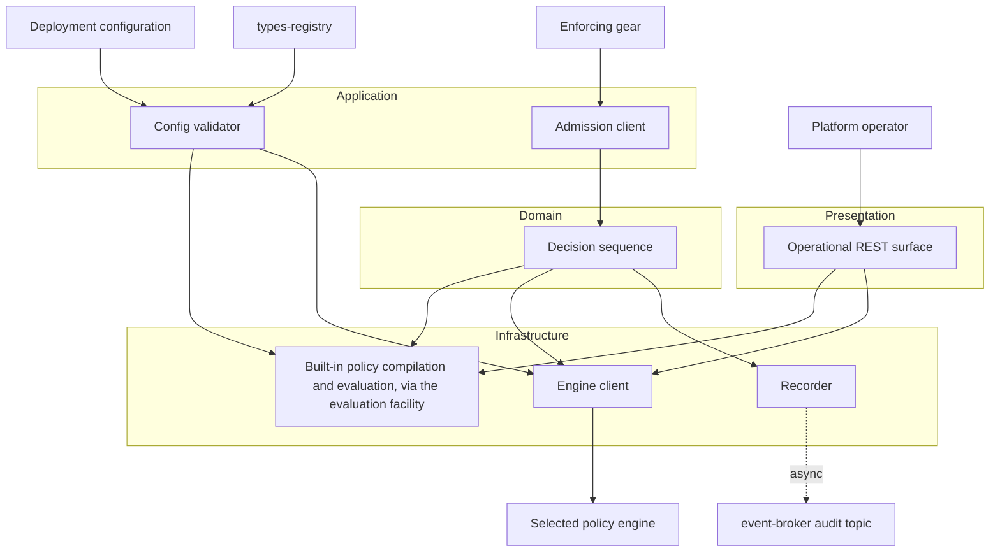
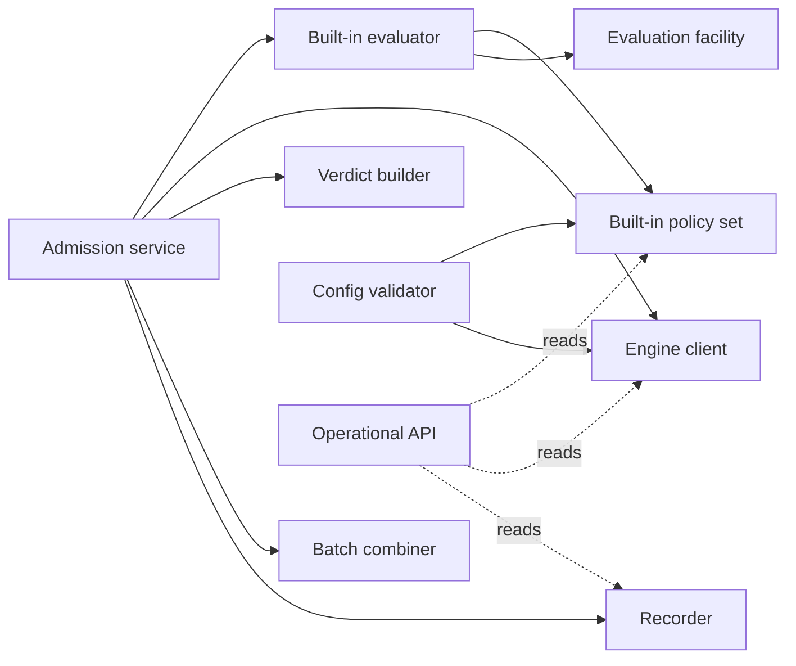
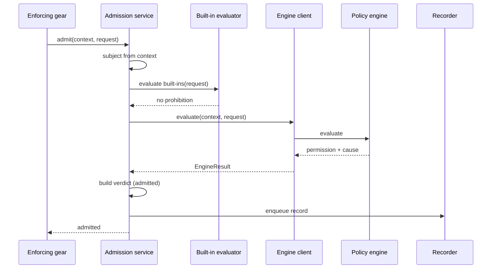
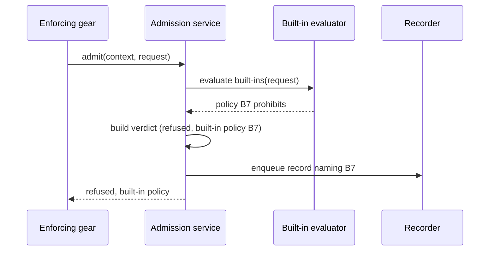
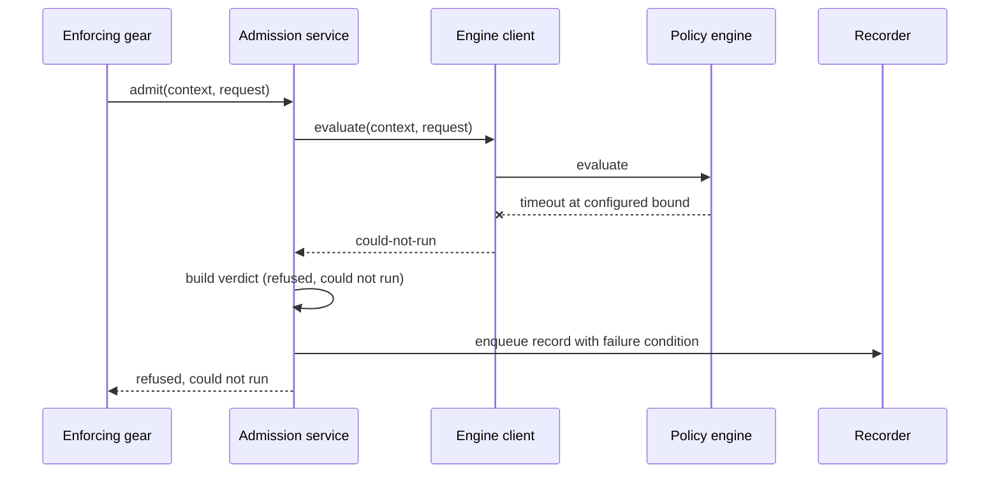
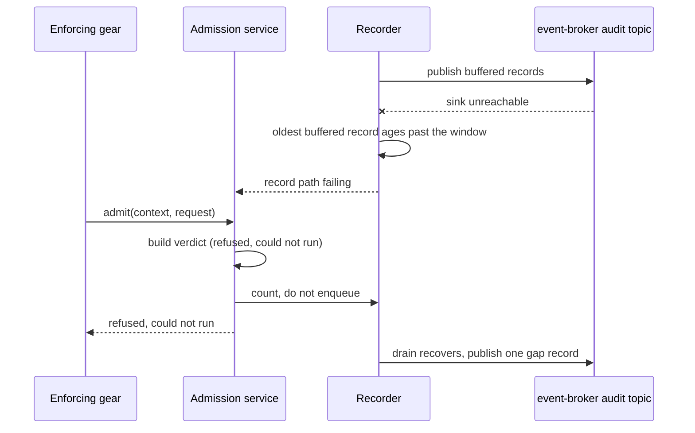
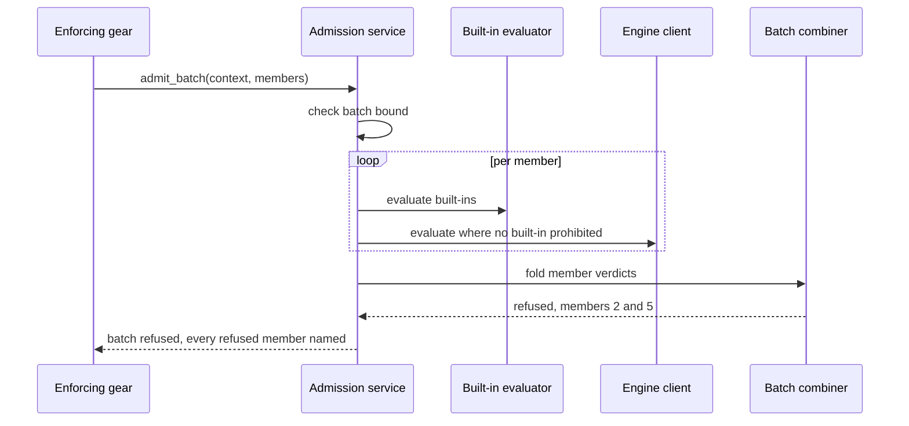
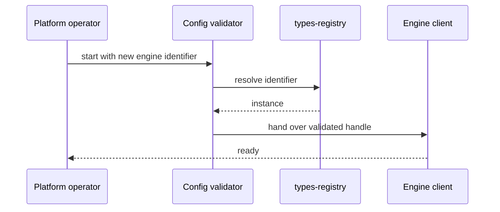

# Technical Design — Admission Control

<!-- toc -->

- [1. Architecture Overview](#1-architecture-overview)
  - [1.1 Architectural Vision](#11-architectural-vision)
  - [1.2 Architecture Drivers](#12-architecture-drivers)
  - [1.3 Architecture Layers](#13-architecture-layers)
- [2. Principles & Constraints](#2-principles--constraints)
  - [2.1 Design Principles](#21-design-principles)
  - [2.2 Constraints](#22-constraints)
- [3. Technical Architecture](#3-technical-architecture)
  - [3.1 Domain Model](#31-domain-model)
  - [3.2 Component Model](#32-component-model)
  - [3.3 API Contracts](#33-api-contracts)
  - [3.4 Internal Dependencies](#34-internal-dependencies)
  - [3.5 External Dependencies](#35-external-dependencies)
  - [3.6 Interactions & Sequences](#36-interactions--sequences)
  - [3.7 Database schemas & tables](#37-database-schemas--tables)
  - [3.8 Deployment Topology](#38-deployment-topology)
- [4. Additional context](#4-additional-context)
  - [4.1 Telemetry surface](#41-telemetry-surface)
  - [4.2 Security boundaries and threat model](#42-security-boundaries-and-threat-model)
  - [4.3 Testability and test strategy](#43-testability-and-test-strategy)
  - [4.4 Known design risks](#44-known-design-risks)
  - [4.5 Areas recorded as not applicable](#45-areas-recorded-as-not-applicable)
- [5. Traceability](#5-traceability)

<!-- /toc -->

- [ ] `p1` - **ID**: `cpt-cf-admission-control-design-admission-control`
## 1. Architecture Overview

### 1.1 Architectural Vision

The gate is an evaluator and a router, not a service with state. Its decision path holds two stages: evaluation of the built-in policies compiled from configuration at startup, and one call to the selected policy engine. There is no store, no cache with an invalidation problem, and nothing on the path that can change between two requests except the engine's answer. That is what makes a 5 ms overhead budget an allocation rather than an aspiration: the only work the gate does for itself is bounded evaluation of a small set of already-compiled content, and the bound is what holds the figure rather than the set being cheap.

Everything else in the design is failure handling. Because the gate fails closed, the interesting behaviour is not what happens when the engine answers but what happens when it does not, and the design converges every such path — unreachable, timed out, errored, unmappable, absent, backing off — on one refusal constructor that stamps the could-not-run cause. That constructor is the only way to build a refusal from a failure, which makes the property in `cpt-cf-admission-control-nfr-fail-closed` structural rather than a matter of remembering to handle each case.

That thinness raises a fair question the documents should answer rather than imply: why a gear at all, when the caller-side helper pattern — `PolicyEnforcer` in `authz-resolver-sdk` — already exists for reaching a pluggable decision point from a domain gear. Three reasons. A library cannot be deployed out-of-process, and this component is one a deployment may want to run, scale, and secure separately. A library cannot serve the operational surface an operator needs to see which built-in policies loaded and which engine resolved. And the platform already has this exact shape as a gear: `authz-resolver` is a few hundred lines that select a plugin and route to it, with its caller-side helper in the SDK beside it — which is the arrangement here, and the precedent for it.

The third shaping force is what the gate refuses to do. It never modifies a request, so the request value it receives is passed to the engine and dropped; nothing in the design writes to it, and the response type carries no field through which a modification could travel. It never stores policy content, so built-in policies arrive as configuration and are compiled once. Both are absences rather than mechanisms, and both are what keep this gear from becoming the second policy engine its own risk register warns about.

### 1.2 Architecture Drivers

Requirements that significantly influence architecture decisions.

#### Functional Drivers

| Requirement | Design Response |
|-------------|------------------|
| `cpt-cf-admission-control-fr-admission-interface` | `cpt-cf-admission-control-component-admission-service` exposes one method pair, single and batch; the response type has no field capable of carrying a modified request, and one collection that carries obligations through from the engine untouched. |
| `cpt-cf-admission-control-fr-request-authenticity` | The security context is a required parameter of the admission trait rather than an ambient value, and `AdmissionRequest` has no subject or subject-tenant field, so identity has one source by construction and a mismatch is unexpressible rather than detected. `cpt-cf-admission-control-component-admission-service` reads the subject from the context; `cpt-cf-admission-control-component-engine-client` forwards the same context and has no path that constructs one, so the identity the engine derives is the one the caller presented. |
| `cpt-cf-admission-control-fr-decision-order` | The service runs `cpt-cf-admission-control-component-builtin-evaluator` before `cpt-cf-admission-control-component-engine-client`, and returns on the first built-in-policy prohibition without constructing an engine request. |
| `cpt-cf-admission-control-fr-refusal-cause` | `cpt-cf-admission-control-component-verdict-builder` is the sole constructor of a refusal, and takes the cause as a required argument rather than defaulting it. |
| `cpt-cf-admission-control-fr-deferral-relay` | The engine result type carries a deferral variant from the first version, and the verdict reserves a third value that no code path constructs yet; `cpt-cf-admission-control-component-engine-client` maps a deferral as a **result**, not through the failure funnel, so it never reaches the could-not-run constructor, and `cpt-cf-admission-control-component-verdict-builder` stamps the awaiting-approval cause instead. |
| `cpt-cf-admission-control-fr-batch-admission` | `cpt-cf-admission-control-component-batch-combiner` folds member verdicts under an absorbing refusal, collecting every refused member rather than short-circuiting. |
| `cpt-cf-admission-control-fr-deferral-verdict` | The reserved third value becomes constructible in `cpt-cf-admission-control-component-verdict-builder`, and `cpt-cf-admission-control-component-batch-combiner` gains one ordering rule — refusal absorbs, then deferral, then admission — leaving the fold order-independent. No component gains state, because nothing here holds a deferred operation open. |
| `cpt-cf-admission-control-fr-remote-decision-surface` | The admission client is a trait over a service that holds no in-process assumption, so the remote projection is an added transport binding rather than a second implementation; `cpt-cf-admission-control-component-admission-service` is unchanged by it. |
| `cpt-cf-admission-control-fr-builtin-policy-form` | `cpt-cf-admission-control-component-policy-set` compiles each configured policy through the evaluation facility at startup; `cpt-cf-admission-control-component-builtin-evaluator` evaluates the compiled set and maps anything that is not a prohibition to "fall through to the engine". |
| `cpt-cf-admission-control-fr-builtin-policy-precedence` | Built-in policies are evaluated before the engine and a prohibition returns immediately; no code path lets an engine result overturn one. |
| `cpt-cf-admission-control-fr-builtin-policy-independence` | The built-in policy set is built from configuration and the types registry only, with no reference to the engine; it is populated even when engine resolution fails. The named reserved-name-prefix fixture is what makes that observable: the conformance suite runs it against two stub engines and against an engine-less deployment, so the property fails a test rather than going unchallenged. |
| `cpt-cf-admission-control-fr-builtin-evaluation-bounds` | `cpt-cf-admission-control-component-builtin-evaluator` wraps each policy evaluation in its configured bound and the set in a total bound; it constructs the evaluation context from the request and a gate-supplied timestamp, passing no handle of any kind. Where the backend's bound is cooperative it also sets the check interval rather than inheriting a default, since the overrun is one work unit wide and is spent from the gate's own overhead. Determinism is not enforced here but at startup, by `cpt-cf-admission-control-component-config-validator`. |
| `cpt-cf-admission-control-fr-engine-selection` | `cpt-cf-admission-control-component-engine-client` resolves one GTS instance at startup and holds it; no per-request resolution and no second candidate is retained. |
| `cpt-cf-admission-control-fr-absent-engine` | No engine configured starts the gear in a degraded state reported by `cpt-cf-admission-control-component-operational-api`, refusing with could-not-run on every request that no built-in policy already prohibits; a configured identifier that will not resolve fails startup in the config validator instead. Degraded rather than unready, because in-process the host is shared with the gears being gated. |
| `cpt-cf-admission-control-fr-engine-result` | The engine's permission cause is copied into the record and never read by the verdict builder, so no branch on it exists to be added by accident. |
| `cpt-cf-admission-control-fr-fail-closed` | Every engine-facing error converges on the refusal constructor; the configuration type has no field that could express an admit-on-failure setting. |
| `cpt-cf-admission-control-fr-engine-bound` | The engine call is wrapped in a configured timeout; expiry is one of the conditions the refusal constructor accepts. |
| `cpt-cf-admission-control-fr-engine-backoff` | A back-off signal opens a gate-side window during which calls are throttled and requests refuse without reaching the engine. |
| `cpt-cf-admission-control-fr-admission-records` | `cpt-cf-admission-control-component-recorder` owns the field set and its single builder; every other component contributes fields through it. |
| `cpt-cf-admission-control-fr-record-path-failure` | `cpt-cf-admission-control-component-recorder` owns the condition, because buffer age is its own signal: on sink unreachability, an aged oldest record, or a full buffer it reports and the admission service refuses from then on. The decision order is unchanged by the condition: built-in policies still run and still refuse with their own cause, and only what survives them is refused as could-not-run. Those refusals are counted per cause rather than buffered — enqueueing them would need the capacity whose exhaustion caused them — and one gap record naming the interval and the count of each cause is published when the drain recovers. No component holds a path that drops, samples, or truncates a record to relieve pressure. |
| `cpt-cf-admission-control-fr-record-confidentiality` | The record type carries property names as a collection of strings and has no field of a type that could hold a value, so exclusion is structural. |
| `cpt-cf-admission-control-fr-subject-data-handling` | The record type carries the subject as the opaque reference the security context supplies and has no field able to hold a profile attribute. `cpt-cf-admission-control-component-recorder` exposes no delete, rewrite, or resolve path, and needs none: erasure belongs to the identity provider, and nothing in a published record changes when it happens. |
| `cpt-cf-admission-control-fr-operational-surface` | `cpt-cf-admission-control-component-operational-api` reads the built-in policy set and the engine handle directly; it holds no state of its own and registers no route that mutates either. Refusal counts come from bounded in-memory counters over a recent window, kept by the same component that constructs a refusal, so no path writes them twice and none of them is durable state — the durable evidence is the admission record on the audit topic. |
| `cpt-cf-admission-control-fr-metrics` | Telemetry surface in Section 4.1, emitted by the component owning each measurement. |
| `cpt-cf-admission-control-fr-configuration-validation` | Configuration is a deny-unknown-fields structure validated during the init phase, including syntax validation of every built-in policy through the evaluation facility, resolution of every resource type those policies name, resolution of the engine identifier, uniqueness of every built-in policy's stable identity, and a screen of each policy's parsed form for builtins denylisted for the backend build in use. |

#### NFR Allocation

This table maps non-functional requirements from PRD to specific design/architecture responses.

| NFR ID | NFR Summary | Allocated To | Design Response | Verification Approach |
|--------|-------------|--------------|-----------------|----------------------|
| `cpt-cf-admission-control-nfr-overhead` | p95 5 ms, p99 10 ms excluding engine time | `cpt-cf-admission-control-component-policy-set`, `-builtin-evaluator` | Content compiled once at startup, so no request parses anything; selection is a hash lookup plus a pattern check with no I/O. Evaluation of the selected policies is the dominant term in the figure, which is why the per-policy and total bounds of `cpt-cf-admission-control-fr-builtin-evaluation-bounds` are what keep it inside budget rather than the selection cost | Benchmark at the gate boundary with engine time subtracted; per-stage timing histograms separating selection from evaluation |
| `cpt-cf-admission-control-nfr-fail-closed` | Zero admissions on any failure | `cpt-cf-admission-control-component-verdict-builder` | One refusal constructor; admission is reachable only from an engine permission, never from an error branch and never from a built-in policy | Fault injection across the enumerated conditions |
| `cpt-cf-admission-control-nfr-non-modification` | Request unchanged after the call | `cpt-cf-admission-control-component-admission-service` | The request is taken by shared reference and never cloned into the response; the response type has no request-shaped field | Conformance test comparing the caller's request before and after, on both verdicts |
| `cpt-cf-admission-control-nfr-availability` | No host impact in-process; 99.95 percent out-of-process | `cpt-cf-admission-control-topology-in-process` | Nothing on the decision path runs in the background, holds an unbounded queue, or holds a lock across an await. One background task exists off that path — the recorder's drain in `cpt-cf-admission-control-component-recorder` — and it is bounded by the buffer it drains, with its failures caught at the task boundary so a drain panic degrades the record path per `cpt-cf-admission-control-fr-record-path-failure` rather than reaching the host. The one resource that could otherwise grow without bound is that record buffer, which is bounded | Fault injection asserting zero host-fatal outcomes, including a panic injected into the drain task; availability measurement in the out-of-process shape |
| `cpt-cf-admission-control-nfr-record-completeness` | One record per decision, ≤5 s awaiting durability, with one accounted exception | `cpt-cf-admission-control-component-recorder` | Records appended to a bounded in-memory buffer on the decision path and drained by a separate task; buffer age and occupancy exported. The exception is the serving condition of `cpt-cf-admission-control-fr-record-path-failure`: rather than sampling or dropping under sink failure, the gate refuses and accounts for the interval with one gap record, so every decision is either recorded or inside a stated gap | Throughput test asserting record count equals decision count; fault-injected sink outage and buffer saturation asserting refusal rather than admission, no dropped record, and exactly one gap record on recovery |

#### Key ADRs

None. The architecture decisions this design takes are stated, with their rationale, as the principles and constraints of Section 2, and no separate decision records are planned for this gear. The table the template provides is therefore intentionally empty.

### 1.3 Architecture Layers

Nodes inside the layer boxes are this gear's own code and the libraries it links, the evaluation facility among them. Nodes outside are separate gears and external systems, reached rather than linked — and there is no store among them, which is the gear's defining property.

- [ ] `p1` - **ID**: `cpt-cf-admission-control-tech-stack`

| Layer | Responsibility | Technology |
|-------|---------------|------------|
| Presentation | A read-only operational surface — readiness, selected engine, loaded built-in policies and match counts — present in both deployment shapes. The decision surface is projected here only in the out-of-process shape | `toolkit-http`, `toolkit-canonical-errors` |
| Application | The admission client registered in ClientHub, the engine plugin contract, gear lifecycle, configuration | ToolKit gear capabilities, ClientHub |
| Domain | Built-in policy selection, verdict and cause construction, batch combination, record construction | Rust, `#[domain_model]` types |
| Infrastructure | Built-in policy compilation and evaluation, engine resolution and invocation, types-registry resolution, record emission | Evaluation facility, ClientHub scoped resolution, `toolkit-gts`, `toolkit-canonical-errors` |

## 2. Principles & Constraints

### 2.1 Design Principles

#### Decide Nothing That Can Be Delegated

- [ ] `p1` - **ID**: `cpt-cf-admission-control-principle-thin`

The gate answers one question and owns only what that question needs: the interface, the ordering, the failure semantics, and the built-in policies. Policy semantics belong to the engine, request enrichment belongs to the calling gear, and content lifecycle belongs to neither. Every capability this gear does not have is load-bearing — the split that created it exists because a gateway that manages policy is a policy engine with a different name.

#### Compiled at Startup, Evaluated at Request Time

- [ ] `p1` - **ID**: `cpt-cf-admission-control-principle-compile-at-startup`

Built-in policies arrive as configuration, are validated and compiled at startup through the evaluation facility, and are evaluated at request time against the request context. Compiling once is what keeps parsing off the decision path; the cost that remains is evaluation itself, bounded per policy and in total. The gate holds the same isolation obligation the engine does — the backend receives the context, the content, and a supplied timestamp, and no capability.

#### One Way to Refuse From a Failure

- [ ] `p1` - **ID**: `cpt-cf-admission-control-principle-single-refusal`

Every path that cannot obtain an answer — no engine, unreachable engine, timeout, error, unmappable result, active back-off — converges on a single constructor that stamps the could-not-run cause. Admission is reachable only from an engine permission. Making this structural rather than conventional is what stops a new failure path from silently defaulting to admit, which is the one defect in this gear that would be invisible in production.

#### The Request Belongs to the Caller

- [ ] `p1` - **ID**: `cpt-cf-admission-control-principle-no-modification`

The gate borrows the request, reads it, and returns a verdict. It does not clone it into the response, and the response type has no field shaped to carry one back. A caller's validation of its own request is therefore never conditional on what the gate did with it.

#### Nothing on the Decision Path Changes Between Requests

- [ ] `p2` - **ID**: `cpt-cf-admission-control-principle-stateless-path`

After startup, the built-in policy set and the engine handle are immutable for the life of the process. The decision path performs no read that could return different data to two concurrent requests, which is what makes the gate's contribution to latency flat and its behaviour reproducible from configuration alone.

### 2.2 Constraints

#### No Management API for Built-in Policies

- [ ] `p1` - **ID**: `cpt-cf-admission-control-constraint-no-builtin-policy-api`

Built-in policies are supplied by deployment configuration and change with the deployment. The gear exposes no endpoint and no client method that creates, modifies, or withdraws one. This is the boundary the gear exists to hold: a runtime-authorable built-in policy set here would duplicate the policy engine's lifecycle, versioning, and audit with a second model.

#### Exactly One Engine

- [ ] `p1` - **ID**: `cpt-cf-admission-control-constraint-single-engine`

One policy engine is resolved at startup and held. The design carries no verdict-combination model, no engine ordering, and no per-engine failure policy, because none is reachable with a single engine. Adding a second engine later is a change to this constraint and to the requirements that rest on it, not a configuration change.

#### The Evaluation Facility Is a Hard Dependency

- [ ] `p1` - **ID**: `cpt-cf-admission-control-constraint-evaluation-facility`

The gate links the platform's evaluation facility, which does not yet exist. It shares that exposure with the policy engine rather than avoiding it: built-in policies are real policy content, and evaluating them is what makes them independent of the selected engine. What the gate does not take on is content **management** — no store, no lifecycle, no authoring surface — which is the boundary that matters, and it is unaffected by the dependency.

The audit of the first candidate backend settled two things the gate must therefore build for. Its cost bound is cooperative, so a per-policy limit overruns by up to one unit of work, spent from the gate's own overhead rather than the engine's. And it declares no sandbox posture of its own while registering builtins that read a clock or generate random values, none of which can be removed or shadowed — so determinism is a startup-time content check here, not a runtime guarantee obtained from the facility.

#### The Overhead Budget Is Borrowed

- [ ] `p2` - **ID**: `cpt-cf-admission-control-constraint-borrowed-budget`

The gate's 5 ms is a slice of the enforcing gear's own budget, taken alongside the engine's 25 ms. Any design change that adds a synchronous dependency to the decision path spends the caller's budget, which is why the path admits exactly two things: in-process evaluation of the compiled built-in set, under its own bounds, and one engine call.

#### In-Process at First Release

- [ ] `p2` - **ID**: `cpt-cf-admission-control-constraint-in-process`

The gate, its enforcing gears, and the selected engine share one process. The contracts are transport-agnostic, so an out-of-process deployment needs no contract change — but it needs the overhead and availability figures revisited, since neither contains an allowance for a transport hop.

## 3. Technical Architecture

### 3.1 Domain Model

**Technology**: Rust domain types under `#[domain_model]`; GTS identifiers for resource types, engine instances, and error families

**Location**: `gears/system/admission-control/admission-control/src/domain/`

**Core Entities**:

- [ ] `p1` - **ID**: `cpt-cf-admission-control-entity-admission-request`
- [ ] `p1` - **ID**: `cpt-cf-admission-control-entity-gated-operation`
- [ ] `p1` - **ID**: `cpt-cf-admission-control-entity-verdict`
- [ ] `p1` - **ID**: `cpt-cf-admission-control-entity-builtin-policy`
- [ ] `p1` - **ID**: `cpt-cf-admission-control-entity-policy-set`
- [ ] `p1` - **ID**: `cpt-cf-admission-control-entity-admission-record`
- [ ] `p1` - **ID**: `cpt-cf-admission-control-entity-engine-result`

| Entity | Description | Schema |
|--------|-------------|--------|
| AdmissionRequest | What an enforcing gear submits: action, resource type and optional identifier, tenant context, and caller-supplied operation properties, alongside the caller's propagated security context. Carries no subject and no subject tenant — per `cpt-cf-admission-control-fr-request-authenticity` those come from the context alone, and the type has no field able to hold them. Borrowed by the gate, never retained. Carries no correlation identifier — the gate mints that itself. | Value type |
| GatedOperation | The gate's own view of one admission: the request plus the correlation identifier minted for it, and the batch identifier where it belongs to a batch. Created at entry, carried to the engine, and consumed by the record. | Value type |
| Verdict | Admitted or refused, with a cause on a refusal, and on an admission the engine's permission cause plus any obligations it attached. Carries a reserved third value for a deferral, which no code path constructs until `cpt-cf-admission-control-fr-deferral-verdict` ships. The gate's whole answer. | Value type |
| BuiltinPolicy | One of the platform's own policies as configuration supplies it: a stable identity the refusal names, the resource types and operations it applies to, and policy content in a language a backend of the evaluation facility accepts. Yields a prohibition or nothing. | Configuration |
| BuiltinPolicySet | The compiled, immutable set built at startup — each policy's compiled content and a digest over its source as configured, plus a selection index keyed for constant-time lookup on the common path. The set also carries the identity and version of the backend build that compiled it, so a built-in refusal can be recorded against the exact content and interpreter that produced it rather than against a stable identity whose content may since have changed. | In-memory |
| EngineResult | What the engine returns: a permission with its cause and obligations, a prohibition with a reason, or a deferral. The plugin call returns a two-level shape: a `Result` whose success is this three-variant `EngineResult`, and whose error is an `EngineFailure` carrying the failure condition and an optional back-off interval. A back-off request is therefore not a fourth variant — it is an optional field on the failure arm only, and the failure it accompanies is the engine's own transient one, which the gate maps to could-not-run with a back-off condition while `cpt-cf-admission-control-fr-engine-backoff` opens the window. Because the field exists only on the failure arm there is no precedence to define: a success cannot carry one. The interval is validated on receipt — zero or absent opens no window, and anything above the configured maximum is clamped to it. Modelling it as a variant would make it a result the gate has to map, and the only mapping available would be the failure funnel, which is where it already lands by the shorter route. Mapped to a Verdict, never surfaced raw — but obligations are copied across untouched. The deferral variant exists from the first version even though no engine emits one, which is what keeps it out of the unmappable-result path. | Value type |
| AdmissionRecord | The durable projection of a decision, carrying the field set of `cpt-cf-admission-control-fr-admission-records`. Two further shapes share the topic as their own event types and are not decisions. The gap record of `cpt-cf-admission-control-fr-record-path-failure` names an interval and a count, by cause, of refusals the gate could not record individually. The startup record of `cpt-cf-admission-control-nfr-record-completeness` carries the instance identity and the start time, and is the crash-loss boundary: a consumer bounds what one instance may have lost to the interval between the newest admission record carrying that instance's identity and its next startup record, and reads a startup record with no preceding gap record as a restart rather than a quiet period. Every admission record therefore carries the emitting instance's identity, so the join is by instance and not by position on the topic. | Published to the `event-broker` audit topic |

**Relationships**:
- AdmissionRequest → GatedOperation: each request becomes exactly one gated operation at entry, which is where the correlation identifier is minted.
- AdmissionRequest → Verdict: each request yields exactly one verdict, and a batch yields one verdict per member plus one combined.
- BuiltinPolicy → BuiltinPolicySet: the set is compiled from configuration once; a built-in policy has no existence at request time outside it.
- EngineResult → Verdict: mapped, never passed through, so no engine-specific shape reaches a caller.
- Verdict → AdmissionRecord: each verdict yields exactly one record.

### 3.2 Component Model

The gear is two crates: `admission-control-sdk`, carrying the admission client, the engine plugin contract, the shared models, and the error family; and `admission-control`, carrying the gate itself. Components below are modules, not processes.

Solid edges are calls on the decision or startup path; the dashed edges are the Operational API's reads, drawn differently because it sits on neither — it observes state the other components own and calls none of them.

#### Admission Service

- [ ] `p1` - **ID**: `cpt-cf-admission-control-component-admission-service`

##### Why this component exists

Enforcing gears need one call. This is that call, and the only component they link.

##### Responsibility scope

Owns the decision sequence and its ordering: context presence check, then the request-size check of `cpt-cf-admission-control-fr-configuration-validation`, then built-in evaluation, then engine call, then verdict, then record. The size check sits before built-in evaluation because an oversized context costs on every subsequent step and the cheapest place to refuse it is before any of them. The subject and its tenant are read from the context and from nowhere else — the request has no field for them — so the only identity check is that a context was supplied at all. Implements `cpt-cf-admission-control-interface-admission-client` for single and batch requests. Holds the request by shared reference for the duration of the call and returns without retaining it.

##### Responsibility boundaries

Evaluates no policy, stores no content, and constructs no refusal itself — it delegates that to the verdict builder so that every refusal has one origin. Does not enforce its own verdict and has no way to observe whether a caller did.

##### Related components (by ID)

- `cpt-cf-admission-control-component-builtin-evaluator` — calls
- `cpt-cf-admission-control-component-engine-client` — calls
- `cpt-cf-admission-control-component-verdict-builder` — calls
- `cpt-cf-admission-control-component-batch-combiner` — calls
- `cpt-cf-admission-control-component-recorder` — publishes to

#### Built-in Policy Set

- [ ] `p1` - **ID**: `cpt-cf-admission-control-component-policy-set`

##### Why this component exists

Built-in policies must be applied on every gated operation without parsing content per request, without a selection cost that grows with the size of the set, and without touching anything outside the process.

##### Responsibility scope

Compiles each configured built-in policy through the evaluation facility at startup, holding the compiled forms in an immutable set alongside a selection index keyed by resource type, with namespace-wildcard entries held separately and checked only when the exact key misses. Resolves every concrete resource type through the types registry during compilation, so an unresolvable type fails startup rather than producing a policy that never fires.

##### Responsibility boundaries

Holds no request state and is never rebuilt after startup. Compilation and syntax failures surface at startup, so content that will not compile never reaches a request. It does not evaluate: a failure while evaluating compiled content at request time belongs to `cpt-cf-admission-control-component-builtin-evaluator` and refuses there.

##### Related components (by ID)

- `cpt-cf-admission-control-component-config-validator` — built by
- `cpt-cf-admission-control-component-builtin-evaluator` — owns data for

#### Built-in Evaluator

- [ ] `p1` - **ID**: `cpt-cf-admission-control-component-builtin-evaluator`

##### Why this component exists

It is the platform's own check, and the only part of the verdict the gate decides itself.

##### Responsibility scope

Selects the built-in policies applicable to a request from the index by resource type and operation. **Both lanes are always consulted and their matches merged**: the exact lane is keyed by the request's resource type and the wildcard lane by the namespaces that cover it, and the selected set is their union, never one lane in place of the other. Two lanes exist only because they are looked up differently, and a request whose type matches an exact policy can also match a wildcard policy, so stopping at the exact lane would leave a wildcard guardrail unevaluated and let the operation reach the engine that may permit it. The merged set is then evaluated in configuration order, regardless of which lane matched a policy, so two policies that both match the same operation are tried in the order the operator listed them and the first to prohibit is the one the refusal names. Evaluates each selected policy through the evaluation facility under its configured per-policy bound and the whole selection under the total bound. Where the backend checks that bound cooperatively it sets the check interval explicitly, because the overrun is one work unit wide and is charged to the gate's overhead figure rather than the engine's. Constructs the evaluation context from the request and a gate-supplied timestamp, and passes no client, connection, handle, or clock. Returns the identity of the first policy that prohibits, or nothing. Deterministic in configuration order, so two policies prohibiting the same operation always name the same one, across restarts and across instances built from the same configuration.

##### Responsibility boundaries

Cannot admit. A selection that produces no prohibition yields no verdict at all, which the service reads as "proceed to the engine" rather than as a permission — the distinction that keeps built-in policies from becoming an admission path. Compiles nothing: it evaluates what `cpt-cf-admission-control-component-policy-set` compiled at startup. An exceeded bound or a backend failure is not a non-match — both converge on the refusal constructor with the could-not-run cause, because a policy that could not be evaluated is one whose prohibition cannot be ruled out.

##### Related components (by ID)

- `cpt-cf-admission-control-component-policy-set` — depends on
- `cpt-cf-admission-control-component-admission-service` — called by
- `cpt-cf-admission-control-component-verdict-builder` — refuses through, on a bound exceedance or a backend failure

#### Engine Client

- [ ] `p1` - **ID**: `cpt-cf-admission-control-component-engine-client`

##### Why this component exists

The engine is a remote-shaped dependency even when it is in-process, and every call to it needs a bound, a failure mapping, and a back-off state.

##### Responsibility scope

Resolves the configured engine's GTS instance from ClientHub once at startup and holds the handle. Forwards the caller's security context unchanged on every call, and has no path that constructs one, so the identity the engine derives is the identity the caller presented. Wraps each call in the configured timeout, maps every failure mode onto the could-not-run condition, and owns the back-off window a back-off signal opens — during which it refuses without calling, stamping could-not-run with a back-off condition so the window is visible in the metrics as throttling rather than as an outage or a policy change. Reads the interval only from the failure arm of the plugin result, clamps it to the configured maximum, and counts a signal that arrives on a success arm as a contract violation rather than honouring it.

##### Responsibility boundaries

Interprets no result beyond mapping it to an `EngineResult`; an engine answer it cannot map is a failure, not a guess. A deferral is mappable and is mapped, which is the point of carrying the variant before any engine emits one — an outcome the type cannot name would land in the failure funnel and be reported as an outage. Obligations pass through the mapping unexamined — the gate holds no registry of obligation identifiers and needs none, because recognising them is the enforcing gear's duty. Never retries within a request: a retry inside the caller's budget spends the caller's budget. Stamps every evaluation request with the deadline computed from the engine bound at the moment of the call, so the engine sees the same instant the gate's timeout fires at; an answer arriving after it is dropped unread, because the verdict has already been built. The deadline's representation depends on the shape, and the contract fixes both. In-process the two components share one clock, so it travels as an absolute instant on that clock and needs no conversion. Over the platform transport it travels as a **remaining duration**, computed at send and converted back to an instant against the receiver's own clock on arrival, because the two processes' wall clocks are not assumed to agree and a transmitted absolute instant would be wrong by the skew between them. A remaining duration is computed at send, not when the timeout clock started, so scheduling delay, a back-off window, or contention can consume the budget before serialisation. The value is therefore **clamped at zero**, and zero is not "no deadline" but the reserved encoding for **already expired**: the engine treats it as a deadline that has passed, does nothing, and returns the superseded-by-deadline outcome without evaluating. Absence of the field is the only encoding that means no deadline, and the gate never sends that. Encoding a negative duration, or letting zero read as unbounded, would hand an already-expired call to the engine as an unlimited one — and it would do so for exactly the requests closest to their bound, which is where the fail-closed property matters most. The consequence of the conversion itself is deliberate and stated rather than hidden: the engine's deadline is later than the gate's by the one-way transport delay, so the gate may abandon a call the engine still believes is inside its bound. That is the safe direction — the gate refuses, and the engine's late answer is discarded and recorded as superseded — and the conformance suite covers it with an injected transport delay and an injected clock skew, asserting that both sides stop on the same bound in the in-process shape and that neither admits an operation in the remote one.

##### Related components (by ID)

- `cpt-cf-admission-control-component-verdict-builder` — calls
- `cpt-cf-admission-control-component-config-validator` — configured by

#### Verdict Builder

- [ ] `p1` - **ID**: `cpt-cf-admission-control-component-verdict-builder`

##### Why this component exists

The fail-closed property is worth having as a structural guarantee rather than as a convention observed at each call site.

##### Responsibility scope

The sole constructor of a Verdict. Takes a cause as a required argument for every refusal, and constructs an admission only from an engine permission. An engine deferral is constructed as a refusal carrying the awaiting-approval cause, from its own arm rather than from the failure arm, so the two can never be confused by a later edit; the reserved third value has no constructor at all until `cpt-cf-admission-control-fr-deferral-verdict` ships. Carries the engine's permission cause and its obligations onto the verdict without reading either. Obligations are copied by the same move that copies the cause, so there is no branch that could inspect one and no path that could drop one.

##### Responsibility boundaries

Performs no I/O and makes no decision of its own — it records the decision another component reached, in a form the caller can branch on. Its exclusivity is the invariant: no other module may construct a Verdict.

##### Related components (by ID)

- `cpt-cf-admission-control-component-admission-service` — called by

#### Batch Combiner

- [ ] `p1` - **ID**: `cpt-cf-admission-control-component-batch-combiner`

##### Why this component exists

A caller admitting a plan needs one answer plus enough detail to report every fault at once.

##### Responsibility scope

Folds member verdicts under an absorbing refusal and collects every refused member with its cause. Enforces the configured batch bound before any member is evaluated. The fold takes one further precedence once `cpt-cf-admission-control-fr-deferral-verdict` ships — refusal absorbs, then deferral, then admission — which keeps it order-independent and matches the engine's own combination.

##### Responsibility boundaries

A pure fold with no I/O, so batch semantics are testable without an engine. Does not short-circuit on the first refusal, because the caller needs the complete list — the cost of continuing is bounded by the batch limit.

##### Related components (by ID)

- `cpt-cf-admission-control-component-admission-service` — called by

#### Recorder

- [ ] `p1` - **ID**: `cpt-cf-admission-control-component-recorder`

##### Why this component exists

Every decision must leave evidence, and writing it synchronously would spend the overhead budget it is measured against.

##### Responsibility scope

Owns the record field set and its single builder. Appends to a bounded in-memory buffer on the decision path and drains it from a separate task, publishing to the `event-broker` audit topic. Exports buffer age and occupancy so the loss window is observable. The buffer is the only place a record is unpublished, so its occupancy is the whole of what a crash would lose — the gate holds no store behind it to recover from.

Registers the gear's three event types — admission record, gap record, startup record — with the broker through its SDK during the gear's init phase, since the broker accepts type and topic registration only in-process and rejects an event of an unregistered type. A failure there splits the same way `cpt-cf-admission-control-fr-absent-engine` splits its two cases, and for the same reason. A registration the broker **rejects** — a schema the topic will not accept, a type that conflicts with one already registered — is a deployment that is wrong, cannot become right by waiting, and **fails startup**, like an unresolvable engine identifier. A registration that cannot be **attempted** because the broker is unreachable is a dependency outage, not a wrong deployment: the gear starts, reports degraded, enters the record-path condition of `cpt-cf-admission-control-fr-record-path-failure` from boot — so it refuses what built-in policies do not already refuse rather than admitting what it cannot record — and retries registration in the background until it succeeds, at which point the condition clears without a restart. Failing startup on that case instead would crash-loop the whole host binary, with its enforcing gears, over a transient hiccup in a dependency only this gear needs. The drain publishes in batches and honours the broker's hard limit of 100 events and 1 MiB per batch, with every event in a batch sharing one topic and one partition: it groups buffered records by partition key and splits each group into compliant chunks, so a burst never produces a rejected oversize write. A crash discards whatever the buffer holds, bounded by the window; the recorder cannot count what it lost, so instead it publishes a startup record on every start, which is what lets a reader bound the loss to the interval between this instance's last record and its restart. Owns shutdown too: on the gear's stop signal it refuses new appends, signals the drain task, joins it, and flushes the remaining buffer within a bounded deadline; a residue the deadline leaves unpublished is counted and reported on the operational surface, so a clean stop either publishes everything or says what it did not. The deadline defaults to 5 seconds and is operator-configurable between 1 and 30 seconds. The default is the durability window of `cpt-cf-admission-control-nfr-record-completeness`, since that window is by definition the most the buffer should be holding, so a healthy instance drains well inside it. Because this deadline runs after the stop signal, **the deployment's termination grace period must exceed it**, with margin for the rest of the gear's shutdown; an orchestrator that kills the process first turns a clean stop into the crash case, losing records that the gap accounting would otherwise have published. That relationship is operator guidance the host's deployment documentation carries, and the upper limit exists so the figure stays inside a grace period anyone would plausibly configure.

Owns the serving condition of `cpt-cf-admission-control-fr-record-path-failure` and the counters behind it. When the sink is unreachable, the oldest buffered record ages past the window, or the buffer fills, it reports the condition and the admission service refuses from then on; the refusals that condition produces are counted rather than buffered, because buffering them would need the capacity whose absence caused them. When the drain recovers, the recorder publishes one gap record naming the interval and the count. That record is the only thing it emits which is not a decision, and it exists so the hole is stated by the stream rather than inferred from a thinning of it.

Does not mint the correlation identifier. `cpt-cf-admission-control-component-admission-service` mints it at entry when it constructs the `GatedOperation`, before any built-in policy is evaluated and before the engine request is built, which is what lets the engine request carry it; the recorder receives it on the record it is handed and records it unchanged. The distinction matters because minting at record construction would be too late for the engine request to carry the join key, and an implementation that read the minting as the recorder's would produce engine requests without one. What the recorder owns is that the identifier reaches the record on every path that can produce one — including the two paths on which no engine record will ever exist: a refusal by built-in policy, and a could-not-run refusal.

##### Responsibility boundaries

Does not decide, does not filter which decisions are recorded, and never writes a credential or a caller-supplied property value — the record type carries property names only, so exclusion is a property of the type rather than of a filtering step. Offers no path that deletes or rewrites a published record, and needs none: per `cpt-cf-admission-control-fr-subject-data-handling` the subject is written as the opaque identity-provider reference the context carries, and erasure happens at that provider without any record changing. A gear with no store can hold that position precisely because it makes no claim to rewrite anything.

##### Related components (by ID)

- `cpt-cf-admission-control-component-admission-service` — called by

#### Operational API

- [ ] `p1` - **ID**: `cpt-cf-admission-control-component-operational-api`

##### Why this component exists

Every other component here produces a decision whose inputs an operator cannot see. A built-in policy that never fires and an engine that resolved to something unexpected are both silent failures, and this is the only place they become visible.

##### Responsibility scope

Registers the gear's read-only routes and its readiness check — the latter matters structurally, because the platform hangs `healthcheck` off the same capability as route registration, so a gear with no routes has no way to report readiness at all. Every route but the readiness probe is gated through the platform enforcement helper on one operational-read capability held by platform operators; a tenant-scoped context is refused, and no response is tenant-filtered because nothing here is tenant data. That gating is structural, on the same terms as the verdict builder's exclusivity, because a per-route convention is one forgotten line away from an unauthenticated administrative surface. The component exposes **one private registration function**, which applies the enforcement helper and then attaches the handler; the router itself is never handed to anything else, so there is no second path by which a route could reach it. A handler is therefore authorised by construction rather than by remembering, and adding a route cannot omit the check without changing this component. The readiness probe is the single exception, registered through its own named function so that the exception is one deliberate call rather than an argument any caller could pass. Reports the selected engine's identity, the loaded built-in policies with their identities and match counts, the degraded state when no engine is configured, and the record-path condition of `cpt-cf-admission-control-fr-record-path-failure` together with the refusals it has produced — which is the only place those are visible, since they are the refusals deliberately kept out of the record stream.

##### Responsibility boundaries

Reads the built-in policy set and the engine handle and holds no state of its own. Registers no route that mutates either, which is what keeps `cpt-cf-admission-control-constraint-no-builtin-policy-api` true in the presence of a REST surface. Reports content identities and counts, never content bodies, so the surface cannot become a way to read what the platform's own policies say. Exposes no admission decision: in the in-process shape the decision surface is a typed client, and in the out-of-process shape it is projected separately over the platform transport.

##### Related components (by ID)

- `cpt-cf-admission-control-component-policy-set` — reads
- `cpt-cf-admission-control-component-engine-client` — reads

#### Config Validator

- [ ] `p1` - **ID**: `cpt-cf-admission-control-component-config-validator`

##### Why this component exists

Every setting here changes what the platform refuses, and a setting that silently does nothing is the failure an operator cannot detect.

##### Responsibility scope

Runs during the gear's init phase. Rejects unknown keys, resolves the engine identifier and every resource type a built-in policy names through the types registry, validates each built-in policy's syntax through the evaluation facility independently of evaluating it, screens the parsed form for denylisted builtins, rejects two built-in policies that share a stable identity — that identity is the sole key by which refusals, the operational surface, and per-policy telemetry attribute an outcome, so a duplicate would merge two unrelated policies into one audit trail — checks that bounds are present and positive and validates them as a set — the request-size and property-count bounds and the batch member bound present and positive, per-policy bound not above the total, total plus the work-unit allowance not above the p95 overhead target so the cooperative overrun is inside the figure rather than on top of it, allowance consistent with the backend build's declared check interval where it declares one, engine bound inside its documented range, back-off maximum present, all in milliseconds — and fails startup on any of them. The denylist screen belongs here rather than at evaluation because a builtin can be neither removed from the backend nor shadowed by anything registered over its name, so startup is the last point at which the content can still be refused.

##### Responsibility boundaries

Does not construct the running components, only validates and hands over the validated values, so a partially valid configuration cannot produce a partially built gate.

##### Related components (by ID)

- `cpt-cf-admission-control-component-policy-set` — builds
- `cpt-cf-admission-control-component-engine-client` — configures

### 3.3 API Contracts

#### Admission Client

- **Realizes PRD interface**: `cpt-cf-admission-control-interface-admission-client`
- **Contracts**: `cpt-cf-admission-control-contract-admission-record`
- **Technology**: Rust async trait registered in ClientHub without scope
- **Location**: `gears/system/admission-control/admission-control-sdk/src/api.rs`

The surface enforcing gears link. Takes the caller's security context and the request by shared reference, returns a verdict by value. The context is a parameter rather than an ambient value precisely so that a call site cannot omit it and so that the subject cannot be read from anywhere else. This trait is the canonical contract in both deployment shapes. In-process, the shape of first release, it is the only surface and there is no REST projection, because a hop would spend the caller's budget. Out-of-process, per `cpt-cf-admission-control-fr-remote-decision-surface`, the same trait is projected over the platform's remote transport as a transport binding rather than a second contract: the security context travels as the transport's propagated context, the batch method maps one-to-one, the refusal causes are the same canonical error family, and the caller's deadline is bounded by the same engine bound plus the gate's overhead. Anything the binding cannot carry unchanged is a defect in the binding, not a variant of the contract.

**Endpoints Overview**:

| Method | Path | Description | Stability |
|--------|------|-------------|-----------|
| `n/a` | `admit` | One security context and one intended operation, one verdict, with obligations relayed on an admission | stable |
| `n/a` | `admit_batch` | Several members, one combined verdict plus per-member verdicts | stable |

#### Operational REST API

- **Realizes PRD interface**: `cpt-cf-admission-control-interface-operational-api`
- **Technology**: REST over the platform API prefix, RFC 9457 problem responses
- **Location**: `gears/system/admission-control/admission-control/src/api/rest/`

Read-only. Registering it is also what gives the gear a readiness carrier, since the platform hangs `healthcheck` off the same capability as route registration.

**Endpoints Overview**:

| Method | Path | Description | Stability |
|--------|------|-------------|-----------|
| `GET` | `/admission-control/v1/status` | Selected engine identity and degraded state | stable |
| `GET` | `/admission-control/v1/builtin-policies` | Loaded built-in policies with identities and match counts | stable |
| `GET` | `/admission-control/v1/refusals` | Recent-window refusal counts by built-in policy identity and by could-not-run failure condition, reported separately from engine-decided refusals; includes the refusals produced while the record path was failing, which are counted here because they are deliberately not recorded individually | stable |

#### Policy Engine Plugin Contract

- **Realizes PRD interface**: `cpt-cf-admission-control-interface-engine-plugin`
- **Contracts**: `cpt-cf-admission-control-contract-gts`
- **Technology**: Rust async trait registered in ClientHub under a GTS instance scope
- **Location**: `gears/system/admission-control/admission-control-sdk/src/plugin_api.rs`

The contract an engine implements to be selectable. The gate owns it; the [Policy Engine](../../policy-engine/docs/PRD.md) is its first implementation.

**Endpoints Overview**:

| Method | Path | Description | Stability |
|--------|------|-------------|-----------|
| `n/a` | `evaluate` | One forwarded security context and one request, the latter carrying the correlation identifier minted here and the deadline at which the gate stops waiting; a permission with cause and obligations, a prohibition with reason, or a deferral | unstable |
| `n/a` | `evaluate_batch` | Several requests, per-member results | unstable |

### 3.4 Internal Dependencies

| Dependency Gear | Interface Used | Purpose |
|-------------------|----------------|----------|
| Selected policy engine | Plugin contract via scoped ClientHub | Evaluating tenant-authored policy; the only component that does |
| `types-registry` | SDK client and GTS inventory | Resolving the engine identifier and every resource type a built-in policy names, at startup; registering the plugin specification and error family |
| `toolkit-canonical-errors` | Library | The gear's error family and the five refusal causes of `cpt-cf-admission-control-fr-refusal-cause`: refused by a built-in policy, refused by policy, awaiting approval, request too large, and could-not-run |
| `toolkit-security` | Library | Security context propagation from the enforcing gear to the engine, and the source of the subject identity the gate derives rather than believes |
| `event-broker` | Publish to the audit topic | Durability, retention, and export of admission records; the gate holds no store, so publication is where a record becomes durable |

**Dependency Rules** (per project conventions):
- No circular dependencies
- Always use sdk modules for inter-gear communication
- No cross-category sideways deps except through contracts
- Only integration/adapter gears talk to external systems
- `SecurityContext` must be propagated across all in-process calls

**Shared type ownership.** Two schemas cross this gear's boundary, and each has a named owner.

The **obligation base type** is this gear's. It is defined in `admission-control-sdk` beside the plugin contract whose `EngineResult` carries obligations, and registered in the types registry under this gear's namespace as part of `cpt-cf-admission-control-contract-gts`. An obligation exists only because of admission: an engine attaches it, the gate relays it, an enforcing gear honours it, and every one of those parties already links this SDK — engines to implement the plugin contract, enforcing gears to call `admit` — so owning the base type here adds no dependency that does not exist. It cannot belong to a replaceable engine, because a type the platform depends on must outlive any one engine. It does not need to be a platform-wide base type in `libs/toolkit-gts` the way the authorization permission is, because permissions are consumed by every gear's own authorization checks with no central path, while obligations have exactly one. Should authorization ever want obligations on its own decisions, that is a different concept attached to a different decision and honoured at a different point, and it would define its own base type rather than derive from this one. Individual obligation instances stay with the gears that define them.

The **backend build declaration** — the syntax-validation and imposed-cost-bound guarantees Section 2.2 depends on, plus the sandbox-and-determinism claim the gate refuses to run without — belongs to the evaluation facility's SDK, which is the only component that knows which features a build enables and which builtins it registers. Both this gear and the policy engine read it and refuse an undeclared build, so neither may own it. The facility does not exist yet, and the policy engine's PRD Section 13 carries the one remaining question about this declaration: what its field set must contain so a stale one can be detected.

### 3.5 External Dependencies

The gate owns no database, reads no file after startup, and links the evaluation facility as an in-process library rather than reaching a service for it. It has one external system: `event-broker`, which receives every admission record. That dependency is not incidental. Because the gate stores nothing itself, publication is the point at which a record becomes durable, so the broker's acceptance — not a local write — is what `cpt-cf-admission-control-nfr-record-completeness` measures. The gate publishes asynchronously and the broker acknowledges once the record is durable in its ingest outbox, which is what lets a gear with no store of its own still hold a bounded loss window.

That absence is the design's main lever on `cpt-cf-admission-control-nfr-overhead` and `cpt-cf-admission-control-nfr-availability`: a component with no external dependency cannot be slowed or stopped by one, so its own contribution to latency and to failure is bounded by its code rather than by anything it waits on. The one thing it does wait on — the engine — is a gear, not an external system, and is bounded by `cpt-cf-admission-control-fr-engine-bound`.

It also has a cost, and the cost is the serving condition. Because the topic is the durability point, a broker outage is not a logging problem here as it is for the policy engine, which still has its own table to fall back on. The gate has nothing behind the buffer, so the three properties of `cpt-cf-admission-control-fr-record-path-failure` — no sampling, a bounded window, and no blocking on the decision path — stop being jointly satisfiable the moment the sink is unreachable, and the design resolves that by refusing rather than by dropping. Two consequences follow for the components. The recorder owns the condition, because buffer age is the signal and it is the only component holding it; and the refusals the condition produces are counted rather than buffered, since enqueueing them would need the capacity whose exhaustion caused them. The gap record published on recovery is what keeps the resulting hole in the stream stated rather than silent, and it is the one payload here that does not describe a single decision.

### 3.6 Interactions & Sequences

#### Gate an operation

**ID**: `cpt-cf-admission-control-seq-gate-operation`

**Use cases**: `cpt-cf-admission-control-usecase-gate-operation`

**Actors**: `cpt-cf-admission-control-actor-enforcing-gear`, `cpt-cf-admission-control-actor-policy-engine`

**Description**: The common path. The subject is taken from the propagated context, which is the only place it exists. Built-in evaluation is in-process over compiled content and bounded in time, the engine call is the only wait, and the record is enqueued rather than written so that durability does not extend the measured overhead.

#### Refuse by built-in policy

**ID**: `cpt-cf-admission-control-seq-builtin-refusal`

**Use cases**: `cpt-cf-admission-control-usecase-gate-operation`

**Actors**: `cpt-cf-admission-control-actor-enforcing-gear`, `cpt-cf-admission-control-actor-platform-operator`

**Description**: The engine is never called. The policy's identity travels to the caller and into the record, because a refusal an operator cannot attribute to a specific built-in policy is one they cannot change.

#### Refuse because the engine could not answer

**ID**: `cpt-cf-admission-control-seq-engine-failure`

**Use cases**: `cpt-cf-admission-control-usecase-gate-operation`

**Actors**: `cpt-cf-admission-control-actor-enforcing-gear`, `cpt-cf-admission-control-actor-policy-engine`

**Description**: The same shape covers an unreachable engine, an error, an unmappable result, an absent engine, and an active back-off window. The caller can distinguish this from a policy refusal and retry it as transient, which is what `cpt-cf-admission-control-fr-refusal-cause` exists to make possible. A deferral does **not** take this shape: it is a result the engine returned, so it is mapped rather than funnelled, and it refuses with the awaiting-approval cause — a refusal no retry resolves, and therefore the one it matters most not to label transient.

#### Refuse because the decision could not be recorded

**ID**: `cpt-cf-admission-control-seq-record-path-failure`

**Use cases**: `cpt-cf-admission-control-usecase-gate-operation`

**Actors**: `cpt-cf-admission-control-actor-platform-operator`, `cpt-cf-admission-control-actor-audit-sink`

**Description**: The gate holds no store, so the topic is where a record becomes durable and an unreachable sink is a serving condition rather than a logging problem. Refusing is what keeps `cpt-cf-admission-control-nfr-record-completeness` true instead of quietly redefining it, and the refusals produced here are counted rather than buffered because the buffer is precisely what is exhausted. Built-in policies keep applying throughout — a refusal one of them reaches is unaffected by the state of the record path — but nothing is enqueued while the condition holds, so those refusals are counted too and are named separately in the gap record. That single record on recovery is the difference between a stated hole in the audit stream and a thin patch nobody can account for.

#### Gate a multi-type change

**ID**: `cpt-cf-admission-control-seq-gate-batch`

**Use cases**: `cpt-cf-admission-control-usecase-gate-batch`

**Actors**: `cpt-cf-admission-control-actor-enforcing-gear`

**Description**: Built-in evaluation runs per member, and only members it does not prohibit reach the engine. It is not free — a batch multiplies built-in evaluation cost by its member count, which is why the total bound of `cpt-cf-admission-control-fr-builtin-evaluation-bounds` is applied per member rather than per batch and why the batch bound caps the whole. The fold does not short-circuit, since the caller needs the complete fault list. Aggregate batch latency has no independent ceiling: its worst case is the member count multiplied by one member's total built-in bound plus the engine bound, and the design accepts that deliberately rather than adding a batch-wide deadline that would refuse late members for reasons unrelated to them. The batch bound is therefore the only lever on aggregate latency, and `cpt-cf-admission-control-nfr-overhead` states the gate's own share of it — no more than 10 ms at p95 beyond the sum of the members' engine time — rather than a wall-clock figure for the whole call.

#### Substitute the engine

**ID**: `cpt-cf-admission-control-seq-substitute-engine`

**Use cases**: `cpt-cf-admission-control-usecase-substitute-engine`

**Actors**: `cpt-cf-admission-control-actor-platform-operator`, `cpt-cf-admission-control-actor-types-registry`

**Description**: Substitution is a restart with a different identifier. Built-in policies are compiled from configuration, through the evaluation facility and the registry, with no reference to the engine at all, so they are unaffected — which is the mechanism behind `cpt-cf-admission-control-fr-builtin-policy-independence`. An identifier that does not resolve fails startup rather than yielding a gate with no engine.

### 3.7 Database schemas & tables

- [ ] `p1` - **ID**: `cpt-cf-admission-control-db-none`

**The gear owns no database objects.** It declares no schema, contributes no migrations, and holds no persistent state. Built-in policies live in deployment configuration and are compiled at startup; admission records are published to the `event-broker` audit topic rather than stored here, and the storage backend bound to that topic owns their retention and deletion; the engine owns everything about policy content.

This is stated rather than omitted because it is a design property with consequences, not an oversight. A gate with a table would need a namespace, migrations, a backup story, and a restore-consistency argument, and it would put a store on the path of every gated operation in the platform. The absence is what makes `cpt-cf-admission-control-nfr-overhead` reachable and `cpt-cf-admission-control-constraint-no-builtin-policy-api` enforceable — there is nowhere for a runtime-authored built-in policy to be written even if someone added the endpoint.

### 3.8 Deployment Topology

- [ ] `p1` - **ID**: `cpt-cf-admission-control-topology-in-process`

Two shapes are supported, and the gear's contracts are identical in both because they are transport-agnostic.

**In-process**, the shape of first release: the gate is linked into a host binary alongside its enforcing gears and the selected engine, reached through ClientHub. Every instance holds its own built-in policy set and engine handle, built independently from the same configuration, so instances need no coordination and the gate adds no cross-instance traffic. Readiness is reported as degraded rather than unready when the engine is missing, because the host is shared with the gears being gated.

**Out-of-process**, required at `p3` by `cpt-cf-admission-control-fr-remote-decision-surface`: the gate runs as its own service over the platform transport, becoming independently deployable, scalable, separately securable, and independently measurable — which is the shape the availability threshold's out-of-process clause is written for. The design admits it without change because the admission client is a trait over a service that holds no in-process assumption; what a remote deployment adds is a transport binding, not a second implementation.

Two costs come with it, and both are why it is `p3` rather than `p1`. Every gated operation crosses the network twice over, once into the gate and once onward to the engine if that is also remote, and no budget here or in the consuming gear accounts for either. And the readiness semantics invert: unreadiness is unsafe in-process, where it would evict the gears being gated, and safe once the gate is separately deployed. A design that picked one would be wrong in the other shape, so this one states both and ties each to the tier that requires it.

## 4. Additional context

### 4.1 Telemetry surface

| Signal | Type | Owner | Purpose |
|---|---|---|---|
| Admission latency excluding engine time | Histogram | Admission service | The measured surface of `cpt-cf-admission-control-nfr-overhead`, attributable to the gate rather than to the engine |
| Engine call latency and failures by condition | Histogram, counter | Engine client | Separates a slow gate from a slow engine, and an engine outage from a tightened policy |
| Verdicts by cause | Counter | Verdict builder | Distinguishes admissions and every refusal cause of `cpt-cf-admission-control-fr-refusal-cause` in aggregate: built-in-policy, policy, awaiting-approval, request-too-large, and could-not-run. Awaiting-approval is its own label so a deferral is never counted as an outage, and request-too-large is its own so a caller sending oversized contexts is visible as a caller defect rather than as load |
| Ungoverned share of admissions | Counter | Recorder | How much of the estate policy is silent about; this gear sees every gated operation, so the figure is complete here and nowhere else |
| Back-off windows entered and their duration | Counter, gauge | Engine client | Makes engine-requested throttling visible rather than appearing as unexplained refusals |
| Record buffer age and occupancy | Gauge | Recorder | Makes the bounded loss window observable, and is the control input for the serving condition rather than telemetry alone |
| Refusals produced while the record path was failing, and gap records published | Counter | Recorder | These refusals are deliberately not recorded individually, so the counter is the only per-decision account of them; the gap-record counter is what an auditor reconciles a thin interval against |
| Built-in policies loaded, and matches per policy | Gauge, counter | Built-in policy set, built-in evaluator | A built-in policy with zero matches over a long window is either dead configuration or a guardrail nobody is testing. Also readable per policy on the operational surface, since the operator asking the question usually wants it for one policy rather than as a time series |
| Built-in evaluation duration and bound exceedances, per policy | Histogram, counter | Built-in evaluator | Built-in evaluation is the dominant term in `cpt-cf-admission-control-nfr-overhead`, so the gate's own overhead has to be attributable to the policy that spent it; exceedances are separated because they present as could-not-run refusals rather than as errors |

### 4.2 Security boundaries and threat model

**Trust boundaries.** Three. The enforcing gear and its `SecurityContext` are trusted — the gate forwards identity rather than establishing it. Built-in policy content is operator-supplied and therefore more trusted than a tenant's, but it is still content the gate executes rather than data it reads, so the evaluation backend that runs it is a boundary regardless of who wrote it. The caller-supplied operation context is untrusted input, judged by built-in policies, forwarded to the engine, and never interpreted by the gate itself.

| Threat | Vector | Mitigation |
|---|---|---|
| Enforcement bypass through a failure path | A new error branch defaults to admit | Single refusal constructor; admission unreachable from any error path |
| Subject spoofing by a calling gear | A caller names a subject, or a subject tenant, that its own context does not carry — obtaining a verdict for an identity that never asked, leaving an admission record that preserves the fiction, and choosing a tenant that widens what the engine's reachability check allows | `cpt-cf-admission-control-fr-request-authenticity`: the request has no field for a subject or a subject tenant, so the assertion cannot be made; the context is a required parameter and the only source of identity, and the same context is forwarded to the engine unchanged so the gate cannot substitute an identity even by accident |
| An audit gap that reads as a quiet period | The sink fails, records are dropped to keep serving, and the stream simply thins — so the interval with no evidence is indistinguishable from an interval with nothing to record | `cpt-cf-admission-control-fr-record-path-failure`: the gate refuses rather than admitting what it cannot record, counts those refusals, and publishes one gap record naming the interval and the count when the drain recovers |
| Enforcement bypass through configuration | An operator disables the gate or sets admit-on-failure | No such setting exists in the configuration type; the absent-engine case refuses rather than passes through |
| Built-in policy silently never fires | A built-in policy names a resource type that does not resolve, or content that will not compile | Resolution and syntax validation at startup, failing startup rather than loading a dead policy; per-policy match counters expose the rest |
| Configuration as an execution surface | A built-in policy's content reaches the network or the filesystem, making deployment configuration a remote-execution vector on the path of every gated operation | `cpt-cf-admission-control-fr-builtin-evaluation-bounds`: no capability is passed into evaluation — the backend receives the request context, the content, and a gate-supplied timestamp only. Reaching outward additionally requires an I/O builtin, so the backend build's registered builtin set is part of this boundary and is audited with it |
| A guardrail that does not decide the same way twice | A built-in policy reads a clock or a random generator, so the platform's own rule is not reproducible and a refusal cannot be defended | Denylisted at startup by `cpt-cf-admission-control-component-config-validator`, over the parsed form; the gate supplies the evaluation timestamp so that content has no reason to read a clock |
| Denial of service through a built-in policy | Content whose evaluation cost is unbounded, spent on every gated operation across every calling gear | Operator-configurable per-policy and total bounds, with an exceedance refusing rather than continuing; per-policy duration exported so the cost is attributable |
| Records as a leak channel | Caller-supplied property values reach a widely readable record | The record type carries names only and has no field able to hold a value |
| A compromised engine admits everything | The selected engine is malicious or defective | Built-in policies are applied before the engine and cannot be overridden by it, which bounds what a bad engine can permit |
| A compromised engine exfiltrates what it is shown | The selected engine reads the subject, resource, and operation context of every gated operation across every tenant, and copies them out. Substitution is a supported operation, so this actor is reachable by configuration rather than by compromise alone, and the blast radius is wider than over-admission: an over-admitting engine is bounded by the built-in policies, a reading engine is bounded by nothing the gate does | Accepted as a property of the plugin boundary, and named rather than mitigated here. Minimising what the engine sees is not available: the gate has no schema for the operation context and no way to know which properties a tenant's policy will judge, so it cannot forward a subset without deciding policy relevance — which is the engine's job, not the gate's. What bounds the risk instead is that selection is deployment configuration, not a tenant-facing setting: the engine is chosen by the same principal who chooses the built-in policies and the store, and it is inside the platform's own trust boundary rather than a third-party extension point. A deployment substituting a vendor engine is therefore extending that trust deliberately, and the vetting bar is the platform's to set. The consequence worth stating plainly is that the confidentiality of the operation context is the selected engine's to keep, and no gate-side control substitutes for choosing a trustworthy one |
| Operational telemetry as a reconnaissance aid | A holder of the operational-read capability watches per-policy match and refusal counts on `/refusals` and `/builtin-policies` and infers which platform control fires for which traffic pattern, then probes around it | Accepted, and bounded rather than mitigated further. The surface already requires the platform-operator capability, which is the most trusted principal the platform has for this gear; a principal who holds it can read the built-in policy configuration itself, so the counts reveal nothing the configuration does not. What the counts add is timing, and that is the operator's diagnostic signal by design. Two limits keep it narrow: counts are aggregate over a bounded window and are never broken down by tenant, subject, or resource, and the surface exposes identities and counts but never policy content. Narrowing the capability further would take the signal from the people it exists for |

The gate opens no listener of its own in either shape. Its operational REST surface is exposed through the platform ingress, which terminates transport security and owns network segmentation and firewalling, and every route but the readiness probe requires an authenticated platform-operator context per `cpt-cf-admission-control-component-operational-api`. In the out-of-process shape the decision surface is projected over the platform's remote transport and inherits that transport's service authentication and channel security; the binding-specific controls are specified with `cpt-cf-admission-control-fr-remote-decision-surface` when it is implemented, not assumed absent here. CORS is not applicable in either shape: no browser calls this gear.

### 4.3 Testability and test strategy

The decision sequence is testable without an engine, because the engine is a trait resolved through ClientHub. The built-in evaluator is not a pure function — it calls the evaluation facility — so the facility is injected too, and selection is separable from evaluation and tested on its own.

| Level | Coverage |
|---|---|
| Unit | Built-in policy selection covering exact and wildcard matches, asserting that the selected set is evaluated in configuration order whichever lane matched a policy and that no lane carries precedence; batch folding; cause construction; configuration validation |
| Integration | Startup cases, one per documented outcome: a rejected event-type registration fails startup, an unreachable broker starts degraded and refuses under the record-path condition then clears it when a background retry succeeds, and an unresolvable engine identifier fails startup; full sequence against a stub engine covering permission, prohibition, back-off, and each failure condition; built-in evaluation against a real backend covering prohibition, fall-through, per-policy bound exceedance, and total bound exceedance |
| Fault injection | The failure set enumerated by `cpt-cf-admission-control-nfr-fail-closed`; this is that requirement's named verification method. Includes a per-policy bound exceedance, a total bound exceedance, and a backend failure during built-in evaluation as distinct conditions — the only three in the set that arise in this gear's own code, and the ones the stall clause of `cpt-cf-admission-control-nfr-availability` is measured against, since a cooperative bound is what makes a stall conceivable at all. Includes the audit sink unreachable and the record buffer saturated as distinct conditions, each asserting refusal rather than admission, no record dropped or sampled, and exactly one gap record once the drain recovers |
| Security | An identity test asserting that the record and the forwarded engine request both name the identity the propagated context carried, and that a call without a context is refused — run against an authenticated deployment and against an auth-disabled one whose context carries the platform default subject; a compile-fail case asserting `AdmissionRequest` has no subject or subject-tenant field, so the assertion path cannot be reintroduced by a later edit; a determinism test admitting the same request twice under one fixed gate-supplied evaluation timestamp and asserting identical verdicts — the timestamp is pinned because it is an input to built-in evaluation, and the test also asserts that each record carries the timestamp the evaluator received; a test enumerating the backend build's registered builtins that fails when one is absent from the denylist, so an upgrade adding a non-deterministic builtin breaks the build rather than a guardrail |
| Conformance | Request-unchanged assertion on both verdicts, which is the measurable form of `cpt-cf-admission-control-nfr-non-modification` |
| Performance | Gate-boundary latency with engine time subtracted, separating selection from evaluation; built-in evaluation cost against set size and against content complexity; achieved versus configured per-policy bound, since a cooperative check overruns and `cpt-cf-admission-control-nfr-overhead` is measured on what happened |
| Contract | The engine plugin trait exercised through a second stub implementation, which is also the test that `cpt-cf-admission-control-usecase-substitute-engine` describes; includes a stub returning a deferral, asserting the awaiting-approval cause rather than could-not-run, and an assertion that the context the stub receives is the one the caller presented |
| Conformance, built-in independence | The reserved-name-prefix fixture of `cpt-cf-admission-control-fr-builtin-policy-independence` run against two stub engines and against a deployment with no engine, asserting the same refusal in all three; this is what keeps the property falsifiable while the shipped built-in set is still an open question |

Compile-fail coverage applies to two invariants, both cases where a property the design calls structural would decay into a convention if nothing enforced it. The first is the verdict builder's exclusivity: if another module can construct a Verdict, the fail-closed property is convention rather than structure, and a trybuild case asserting that it cannot is the only way to keep that true as the gear grows. The second is the operational API's route registration: a trybuild case asserts that a handler cannot be attached to the surface's router except through the component's own registration function, which is what makes the capability check unforgettable rather than remembered. Behind it, an integration test enumerates every registered route and asserts that each one except the readiness probe refuses both an unauthenticated context and a tenant-scoped one — so a route added through the right path but wired to the wrong capability fails too, which the compile-fail case alone would not catch.

### 4.4 Known design risks

| Risk | Consequence | Response |
|---|---|---|
| A backend build registers a non-deterministic builtin the denylist does not name | A platform guardrail decides differently on two identical requests. Built-in refusals are the ones an operator trusts most, so the inconsistency is attributed anywhere but to the rule | Bind the denylist to the audited build; enumerate the backend's registered builtins in a test rather than maintaining the list by hand; re-audit on upgrade. One audit serves this gear and the policy engine |
| The cooperative evaluation bound overruns the gate's overhead budget | `nfr-overhead` is measured at p95 5 ms with built-in evaluation as its dominant term, and a bound checked between work units can overshoot by a whole unit | Set the check interval explicitly rather than inheriting it, keep the per-policy bound well inside the total, and measure the achieved figure rather than asserting the configured one |
| Built-in evaluation cost exceeds its share of the borrowed budget | The gate's own overhead breaches `cpt-cf-admission-control-nfr-overhead` even while the engine is fast, and the breach is attributed to the gear rather than to the configuration that caused it | Keep the built-in set small, hold the per-policy bound well inside the total, and export duration per policy so the cost names its own source |
| The built-in set grows until it needs a lifecycle | Versioning, review, and tenant scoping are wanted for built-in policies, and the gate becomes a second policy engine with a second content model | The boundary is management, not expressiveness: content may say anything the facility can express, and arrives only as deployment configuration. Treat a request to author one at runtime as a request for content in the engine |
| Fail-closed makes the engine a platform-wide single point of failure | Every engine incident stops all gated operations, and pressure builds for a bypass | Keep the engine bound tight so an outage is detected quickly; keep the could-not-run cause retryable so callers degrade rather than fail permanently |
| The gate is specified before either component it sits between | Its interface is settled against assumptions rather than a consumer, and defects surface at integration | Exercise the interface against Infrastructure Resource Manager's stated admission requirements and against the policy engine's decision surface, both of which are specified even though neither is built |
| A new engine outcome falls into the failure funnel | The design converges every unmapped result on the could-not-run constructor, which is what makes fail-closed structural — and also what would silently report a deferral, or any later outcome, as an outage | Name every outcome in the engine result type before an engine emits it, deferral included from the first version; assert in the contract test that a deferral produces the awaiting-approval cause and not the could-not-run one |
| Obligations are dropped or reordered in the relay | A conditional permission becomes an unconditional one, silently, and the enforcing gear proceeds without the condition policy attached | Copy obligations by the same move that copies the permission cause, so no branch exists that could inspect or discard one; assert relay fidelity in the contract test against a stub engine that emits them |
| Record volume equals total gated operation volume | The audit topic becomes the platform's highest-volume stream — carrying this gear's records and the engine's — and buffer pressure appears as refusals under the serving condition | Keep the record projection small — names not values, no request copy — and export buffer age as a first-class signal rather than as a debug metric |

### 4.5 Areas recorded as not applicable

Stated so that absence is distinguishable from oversight. **Data storage, migrations, and backup**: the gear owns none, per Section 3.7. **Caching**: nothing on the decision path is cached, because nothing on it is fetched. **Rate limiting**: the gate performs no work proportional to request size and is bounded by the engine behind it; the platform ingress owns inbound limiting. **Infrastructure-as-code and release strategy**: host concerns, and a mixed-version fleet is safe because each instance compiles its own built-in policy set from the same configuration. **An external decision API**: not offered in the in-process shape, where the decision surface is a typed client; the out-of-process shape projects it over the platform transport, and the latency consequence is recorded as an open question rather than absorbed silently. **Event architecture**: the gate publishes admission records to the `event-broker` audit topic and nothing else — no domain events announcing its own state changes, and no subscriptions. **Advisory output**: the gate relays obligations, which arise from the policy evaluation it mediates, and carries no warning channel — consumption diagnostics and threshold crossings come from the quota path, which an enforcing gear calls itself and which this gate does not sit on. **User-experience architecture**: no end-user interface. **Cost budgets**: not modelled per gear in this repository.

## 5. Traceability

- **PRD**: [PRD.md](./PRD.md)
- **Features**: `features/` — not yet created
- **Policy engine**: [Policy Engine](../../policy-engine/docs/PRD.md) and its [DESIGN](../../policy-engine/docs/DESIGN.md), the first implementation of the plugin contract
- **First enforcing gear**: [Infrastructure Resource Manager](../../../infrastructure-resource-manager/docs/PRD.md)
- **Platform architecture**: [ARCHITECTURE_MANIFEST.md](../../../../docs/ARCHITECTURE_MANIFEST.md)
