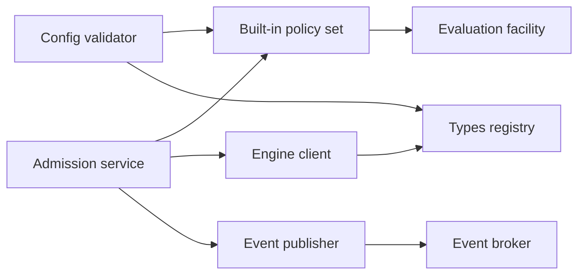
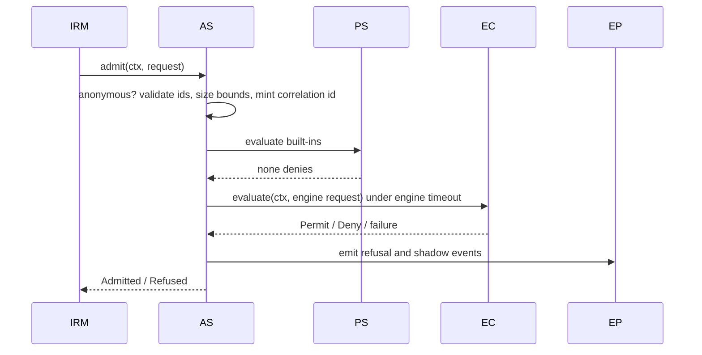

<!-- cpt:
version: 1.0.0
status: draft
module: admission-control
system: cf
-->

# Technical Design — Admission Control

<!-- toc -->

- [1. Architecture Overview](#1-architecture-overview)
  - [1.1 Architectural Vision](#11-architectural-vision)
  - [1.2 Architecture Drivers](#12-architecture-drivers)
  - [1.3 Architecture Layers](#13-architecture-layers)
- [2. Principles & Constraints](#2-principles--constraints)
  - [2.1 Design Principles](#21-design-principles)
  - [2.2 Constraints](#22-constraints)
- [3. Technical Architecture](#3-technical-architecture)
  - [3.1 Domain Model](#31-domain-model)
  - [3.2 Component Model](#32-component-model)
  - [3.3 API Contracts](#33-api-contracts)
  - [3.4 Internal Dependencies](#34-internal-dependencies)
  - [3.5 External Dependencies](#35-external-dependencies)
  - [3.6 Interactions & Sequences](#36-interactions--sequences)
  - [3.7 Database schemas & tables](#37-database-schemas--tables)
  - [3.8 Deployment Topology](#38-deployment-topology)
- [4. Additional context](#4-additional-context)
- [5. Traceability](#5-traceability)

<!-- /toc -->

- [ ] `p1` - **ID**: `cpt-cf-admission-control-design-admission-control`

## 1. Architecture Overview

### 1.1 Architectural Vision

Admission Control is a thin, stateless, in-process gate. Enforcing gears (the Infrastructure Resource Manager first)
call `AdmissionClientV1::admit`; the gate validates the call, evaluates configured built-in Rego policies, then consults
at most one engine plugin (the `policy-engine` gear by default) under a timeout, and returns admitted or refused.
Identity comes only from the `SecurityContext`. Anything that cannot be decided is refused. Refusals and shadow
denials are published as events through a bounded queue that can never block or alter a verdict. The gate has two
crates: `admission-control-sdk` (client, plugin contract, models, GTS types) and `admission-control` (the gate).

### 1.2 Architecture Drivers

#### Functional Drivers

| Requirement                                           | Design Response                                                                                        |
|-------------------------------------------------------|--------------------------------------------------------------------------------------------------------|
| `cpt-cf-admission-control-fr-admission-interface`     | Single `admit` on `AdmissionClientV1` (§3.3); `cpt-cf-admission-control-component-admission-service`.   |
| `cpt-cf-admission-control-fr-request-authenticity`    | `AdmissionRequest` has no subject fields; the service reads `SecurityContext` and rejects anonymous.    |
| `cpt-cf-admission-control-fr-identifier-validation`   | `validate_identifier` / `validate_resource_type` in the SDK, called first in `admit` (§3.6).            |
| `cpt-cf-admission-control-fr-request-bounds`          | Property-count check and a byte-budgeted serialization of `properties` (§3.2 Admission Service).        |
| `cpt-cf-admission-control-fr-decision-order`          | Fixed sequence in `cpt-cf-admission-control-seq-gate-operation`: built-ins then engine.                 |
| `cpt-cf-admission-control-fr-refusal-cause`           | `RefusalCause` enum and `Verdict` (§3.1); engine denial and engine failure are separate variants.       |
| `cpt-cf-admission-control-fr-builtin-policy-form`     | `cpt-cf-admission-control-component-policy-set`: compiled deny-only Rego selected by type and action.   |
| `cpt-cf-admission-control-fr-engine-selection`        | `cpt-cf-admission-control-component-engine-client` resolves one plugin by vendor / instance.            |
| `cpt-cf-admission-control-fr-fail-closed`             | `tokio::time::timeout` around the engine call; no engine or any failure maps to `CouldNotRun`.          |
| `cpt-cf-admission-control-fr-refusal-events`          | `cpt-cf-admission-control-component-event-publisher`: bounded queue, background broker publisher.       |
| `cpt-cf-admission-control-fr-configuration-validation`| `cpt-cf-admission-control-component-config-validator`: strict config, compile and registry checks at init. |

#### NFR Allocation

| NFR ID                                   | NFR Summary                    | Allocated To                                        | Design Response                                                                                   |
|------------------------------------------|--------------------------------|-----------------------------------------------------|---------------------------------------------------------------------------------------------------|
| `cpt-cf-admission-control-nfr-fail-closed` | No admission on any failure  | Admission service, policy set, engine client        | Every failure path yields a `CouldNotRun` refusal; the event path is off the decision path.        |
| `cpt-cf-admission-control-nfr-overhead`  | 5 ms p95 gate overhead         | Admission service, policy set                       | Built-ins are precompiled, run under `builtin_timeout_ms`; no I/O before the engine call.          |

### 1.3 Architecture Layers

- [ ] `p1` - **ID**: `cpt-cf-admission-control-tech-stack`

| Layer          | Responsibility                                               | Technology                                   |
|----------------|--------------------------------------------------------------|----------------------------------------------|
| Contract (SDK) | Client and plugin traits, models, errors, GTS types          | Rust, ToolKit SDK, GTS                       |
| Domain         | `admit` sequence, built-in policy set, local client          | Rust, `#[domain_model]`                      |
| Infrastructure | Engine resolution, event publisher, metrics                  | ClientHub, types-registry, event-broker, OTel |
| Evaluation     | Rego compile, guards, bounded evaluation                     | `toolkit-policy-evaluation` (regorus)        |

## 2. Principles & Constraints

### 2.1 Design Principles

#### Decide Nothing That Can Be Delegated

- [ ] `p1` - **ID**: `cpt-cf-admission-control-principle-thin`

The gate orders checks and maps results; tenant policy, tenancy and storage belong to the engine.

#### Compiled at Startup, Evaluated at Request Time

- [ ] `p1` - **ID**: `cpt-cf-admission-control-principle-compile-at-startup`

Built-in policies are validated and compiled once at init; a bad policy fails startup, never a request.

#### One Way to Refuse From a Failure

- [ ] `p1` - **ID**: `cpt-cf-admission-control-principle-single-refusal`

Every failure is a `CouldNotRun` refusal with a `FailureCondition`; there is no path from a failure to an admission.

#### The Request Belongs to the Caller

- [ ] `p1` - **ID**: `cpt-cf-admission-control-principle-no-modification`

The gate never changes the request and never returns anything beyond the verdict and correlation id.

### 2.2 Constraints

#### No Management API for Built-in Policies

- [ ] `p1` - **ID**: `cpt-cf-admission-control-constraint-no-builtin-policy-api`

Built-in policies exist only in gate configuration; there is no runtime API to add or change them.

#### Exactly One Engine

- [ ] `p1` - **ID**: `cpt-cf-admission-control-constraint-single-engine`

At most one engine is resolved at startup; results of several engines are never combined.

#### The Evaluation Facility Is a Hard Dependency

- [ ] `p1` - **ID**: `cpt-cf-admission-control-constraint-evaluation-facility`

Built-ins use `toolkit-policy-evaluation` (same guards and denylists as the engine), with entrypoint `deny`.

#### In-Process

- [ ] `p2` - **ID**: `cpt-cf-admission-control-constraint-in-process`

The gate is reached only through ClientHub; it exposes no REST or remote surface.

## 3. Technical Architecture

### 3.1 Domain Model

**Technology**: Rust types in `admission-control-sdk/src/models.rs`; domain structs use `#[domain_model]`.

- [ ] `p1` - **ID**: `cpt-cf-admission-control-entity-admission-request`
- [ ] `p1` - **ID**: `cpt-cf-admission-control-entity-verdict`
- [ ] `p1` - **ID**: `cpt-cf-admission-control-entity-builtin-policy`
- [ ] `p1` - **ID**: `cpt-cf-admission-control-entity-engine-result`
- [ ] `p1` - **ID**: `cpt-cf-admission-control-entity-refusal-event`

| Entity           | Description                                                                                                                          |
|------------------|--------------------------------------------------------------------------------------------------------------------------------------|
| AdmissionRequest | `enforcing_gear`, `action`, `resource_type`, `resource_id?`, `resource_tenant_id`, `properties` (JSON map). No subject fields.        |
| Verdict          | `Admitted { correlation_id }` or `Refused { cause, correlation_id }`.                                                                 |
| RefusalCause     | `BuiltinPolicy { policy_id }`, `Policy { reason_code, denials }`, `RequestTooLarge { bound }`, `CouldNotRun { condition }`.           |
| SizeBound        | `PropertyCount`, `ContextBytes`.                                                                                                      |
| FailureCondition | `NoEngine`, `EngineUnavailable`, `EngineTimeout`, `EngineError`, `BuiltinPolicyFailure`, `Internal`.                                  |
| BuiltinPolicy    | `id`, `resource_types` (GTS patterns), `actions`, compiled `deny` document; held in an immutable, ordered set.                        |
| EngineRequest    | Admission request fields plus the correlation id.                                                                                     |
| EngineResult     | `Permit { shadow_denials }` or `Deny { reason_code, denials, shadow_denials }`; failure is `EngineFailure { condition, detail }`.     |
| PolicyReference  | `bundle_id`, `version_id`, `document_id`, `document_name`.                                                                            |
| RefusalEvent     | Event payload (§3.3): one per (operation, policy) pair, `enforced` false for shadow denials.                                          |

Each request yields exactly one verdict; an engine result is mapped, never passed through.

### 3.2 Component Model

```mermaid
graph LR
    AS[Admission service] --> PS[Built-in policy set]
    AS --> EC[Engine client]
    AS --> EP[Event publisher]
    PS --> EF[Evaluation facility]
    CV[Config validator] --> PS
    CV --> TR[Types registry]
    EC --> TR
    EP --> EB[Event broker]
```

#### Admission Service

- [ ] `p1` - **ID**: `cpt-cf-admission-control-component-admission-service`

Owns the `admit` sequence (§3.6): context check, identifier validation, size bounds, correlation id, built-ins, engine
call under `engine_timeout_ms`, result mapping, event emission and verdict. Registered in ClientHub through the local
client.

#### Built-in Policy Set

- [ ] `p1` - **ID**: `cpt-cf-admission-control-component-policy-set`

The compiled, ordered, immutable policy set. Selects policies by GTS pattern match on the resource type and by action,
evaluates each under `builtin_timeout_ms` with input `{ enforcing_gear, action, resource: { type, id, tenant_id },
properties, subject: { id, tenant_id } }`, and returns the first denial, none, or a failure.

#### Engine Client

- [ ] `p1` - **ID**: `cpt-cf-admission-control-component-engine-client`

Resolves the configured engine once in the serve phase: lists engine plugin instances in types-registry, applies the
pinned `instance_id` or picks the vendor's lowest-priority instance, and takes its scoped client from ClientHub. A
configured engine that cannot be resolved fails startup; with none configured the gate serves with no engine.

#### Event Publisher

- [ ] `p1` - **ID**: `cpt-cf-admission-control-component-event-publisher`

A bounded in-memory queue (`event_queue_capacity`) and one background task publishing to `EventBrokerApi` under the gate
identity. A full queue drops the event and increments the dropped-events metric; an absent or failing broker logs and
drops. The event type is registered at init; if the registry is unreachable, registration retries in the background.

#### Config Validator

- [ ] `p1` - **ID**: `cpt-cf-admission-control-component-config-validator`

Parses the strict configuration (unknown keys rejected), compiles built-ins (syntax, `deny` entrypoint, denylist screen,
unique non-blank ids, non-empty `resource_types`), and checks that each concrete resource type resolves in
types-registry. Any failure aborts init.

### 3.3 API Contracts

**Admission client** (`cpt-cf-admission-control-interface-admission-client`): `AdmissionClientV1::admit(ctx, &AdmissionRequest) -> Result<Verdict, AdmissionError>`. `Err` is only for an anonymous
context (unauthenticated) or an invalid identifier (invalid argument, value never echoed). Everything decided or failed is
an `Ok(Verdict)`. The SDK also defines stable reason codes for the four causes (`BUILTIN_POLICY_REFUSED`,
`POLICY_REFUSED`, `REQUEST_TOO_LARGE`, `COULD_NOT_RUN`).

**Engine plugin** (`cpt-cf-admission-control-interface-engine-plugin`): `AdmissionEnginePluginClientV1::evaluate(ctx, &EngineRequest) -> Result<EngineResult, EngineFailure>`, scoped by the
engine's GTS instance of `gts.cf.toolkit.plugins.plugin.v1~cf.core.admission_control.engine.v1~`. `EngineFailure`
conditions: unavailable, timeout, internal, invalid-request. The gate enforces its own timeout.

**GTS types** (`cpt-cf-admission-control-contract-gts`): the engine plugin spec above, the error resource `gts.cf.core.admission_control.admission.v1~`, and the
refusal event type `gts.cf.core.events.event.v1~cf.core.admission_control.refusal.v1~` on topic
`gts.cf.core.events.topic.v1~cf.core.admission_control.audit.v1`.

**Refusal event** (`cpt-cf-admission-control-contract-refusal-event`) payload: `correlation_id`, `occurred_at`, `enforcing_gear`, `action`, `resource_type`, `resource_id?`,
`resource_tenant_id`, `subject_id`, `subject_tenant_id`, `enforced`, `cause` (`builtin_policy`, `policy`,
`request_too_large`, `could_not_run`), `builtin_policy_id?`, `condition?`, `policy?`, `property_names` (names only).
Counts: policy denial with N denials gives N events; built-in, too-large and could-not-run give 1; each shadow denial
gives 1 with `enforced: false`; admissions give none.

Configuration (`gears.admission-control.config`, unknown keys rejected): `engine { vendor, instance_id? }`,
`engine_timeout_ms` (100), `builtin_timeout_ms` (3), `max_properties` (256), `max_context_bytes` (65536),
`event_queue_capacity` (1024), `builtin_policies [{ id, description?, resource_types, actions, content }]`.

### 3.4 Internal Dependencies

| Dependency Module | Interface Used                                   | Purpose                                                   |
|-------------------|--------------------------------------------------|-----------------------------------------------------------|
| `types-registry`  | `TypesRegistryClient`                            | Engine discovery, resource type checks, event registration |
| `event-broker`    | `EventBrokerApi` (optional, via ClientHub)       | Publish refusal events                                    |
| Engine plugin     | `AdmissionEnginePluginClientV1` (scoped)         | Evaluate tenant policy (`policy-engine` by default)       |

### 3.5 External Dependencies

None. `toolkit-policy-evaluation` (regorus) is an in-process library.

### 3.6 Interactions & Sequences

#### Gate an Operation

**ID**: `cpt-cf-admission-control-seq-gate-operation`

```mermaid
sequenceDiagram
    IRM->>AS: admit(ctx, request)
    AS->>AS: anonymous? validate ids, size bounds, mint correlation id
    AS->>PS: evaluate built-ins
    PS-->>AS: none denies
    AS->>EC: evaluate(ctx, engine request) under engine timeout
    EC-->>AS: Permit / Deny / failure
    AS->>EP: emit refusal and shadow events
    AS-->>IRM: Admitted / Refused
```

#### Refuse by Built-in Policy

**ID**: `cpt-cf-admission-control-seq-builtin-refusal`

The first denying built-in yields `Refused(BuiltinPolicy)`; the engine is not called; one event is emitted.

#### Refuse Because the Engine Could Not Answer

**ID**: `cpt-cf-admission-control-seq-engine-failure`

No engine, engine unavailable, error or timeout yields `Refused(CouldNotRun { condition })`; one event is emitted and
the failure is logged with the engine id.

### 3.7 Database schemas & tables

- [ ] `p1` - **ID**: `cpt-cf-admission-control-db-none`

Not applicable: the gate is stateless and persists nothing.

### 3.8 Deployment Topology

- [ ] `p1` - **ID**: `cpt-cf-admission-control-topology-in-process`

The gate runs in-process with its enforcing gears; the engine plugin may be co-located or linked separately.

## 4. Additional context

**Telemetry**: `admission_control_verdicts_total{cause}` (admitted or refusal cause),
`admission_control_engine_call_seconds` and `admission_control_events_dropped_total`. Labels come from closed sets.

**Identity and readiness**: events are published under the gate's fixed `GATE_SUBJECT_ID`. The gate is ready once
serving, with the engine resolved or explicitly absent.

**Security**: the request is untrusted input. Identifiers are validated before use and never echoed; events carry
property names, never values; built-in Rego is screened by the determinism and resource denylists.

## 5. Traceability

- **PRD**: [PRD.md](./PRD.md)
