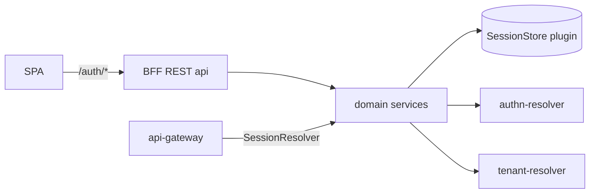

# DESIGN — BFF (Backend-for-Frontend) Gear

<!-- toc -->

- [1. Architecture Overview](#1-architecture-overview)
  - [1.1 Architectural Vision](#11-architectural-vision)
  - [1.2 Architecture Drivers](#12-architecture-drivers)
  - [1.3 Architecture Layers](#13-architecture-layers)
- [2. Principles & Constraints](#2-principles--constraints)
  - [2.1 Design Principles](#21-design-principles)
  - [2.2 Constraints](#22-constraints)
- [3. Technical Architecture](#3-technical-architecture)
  - [3.1 Domain Model](#31-domain-model)
  - [3.2 Component Model](#32-component-model)
  - [3.3 API Contracts](#33-api-contracts)
  - [3.4 Internal Dependencies](#34-internal-dependencies)
  - [3.5 External Dependencies](#35-external-dependencies)
  - [3.6 Interactions & Sequences](#36-interactions--sequences)
  - [3.7 Database schemas & tables](#37-database-schemas--tables)
  - [3.8 Deployment Topology](#38-deployment-topology)
- [4. Additional context](#4-additional-context)
- [5. Traceability](#5-traceability)

<!-- /toc -->

<!--
Technical Design (IEEE 1016 / 42010). Defines HOW the BFF gear realizes the PRD.
Decisions with meaningful trade-offs are captured as ADRs under ./ADR and linked here.
Traces to gears/system/bff/docs/PRD.md.
-->

## 1. Architecture Overview

### 1.1 Architectural Vision

The BFF gear is a **stateless, reusable authentication-session layer** for browser
SPAs, packaged as a CF/Gears gear. It runs the OIDC Authorization Code + PKCE flow
server-side, persists session state in a **swappable session-store plugin**, and
hands the browser only an opaque, hardened cookie (`__Host-sid`). It exposes an HTTP
`/auth/*` surface for the SPA and an in-process `SessionResolver` trait (via
`ClientHub`) so a co-hosted gateway (`api-gateway`) can turn a session cookie into a
`SecurityContext`. It reuses `authn-resolver` for ID-token validation and
`tenant-resolver` for tenant association, and depends on no relational database.

Sessions are **opaque server-side records**; the gear mints **no JWT** in v1.
Minting/serving downstream gateway-JWTs (the "Router" role) is out of scope per
PRD §4.2, which removes any signing-algorithm/FIPS decision from v1.

### 1.2 Architecture Drivers

#### Functional Drivers

| Requirement | Design Response |
|-------------|-----------------|
| `cpt-cf-bff-fr-login` / `cpt-cf-bff-fr-callback` | `OidcLoginService`: PKCE start + state/nonce in `LoginState`; code exchange; ID-token validation via `authn-resolver`; session creation |
| `cpt-cf-bff-fr-cookie` | single cookie constructor enforcing `__Host-`/`HttpOnly`/`Secure`/`SameSite=Strict`/`Path=/`, no Domain |
| `cpt-cf-bff-fr-resolve` | `SessionResolver` trait in `ClientHub`; one read-only store lookup, no IdP I/O |
| `cpt-cf-bff-fr-refresh` / `cpt-cf-bff-fr-refresh-timing` | rotate-with-grace algorithm (§3.6); server-supplied jittered `refresh_at` |
| `cpt-cf-bff-fr-logout` / `cpt-cf-bff-fr-backchannel-logout` | `LogoutService`: local revoke + RP redirect; back-channel receiver with `(iss,jti)` replay guard |
| `cpt-cf-bff-fr-session-list` / `cpt-cf-bff-fr-session-revoke` | per-user index in `SessionStore`; revoke deletes record + index entry |
| `cpt-cf-bff-fr-csrf` | double-submit token bound to session + Origin allowlist (§3.2) |
| `cpt-cf-bff-fr-housekeeping` | background janitor, single runner via store lock |
| `cpt-cf-bff-fr-pluggable-store` | `SessionStore` plugin trait + types-registry discovery (§3.3) |
| `cpt-cf-bff-fr-pluggable-idp` | delegation to `authn-resolver` (§3.4) |
| `cpt-cf-bff-fr-audit` | lifecycle events emitted to the audit sink (§3.5) |

#### NFR Allocation

| NFR ID | NFR Summary | Allocated To | Design Response | Verification Approach |
|--------|-------------|--------------|-----------------|-----------------------|
| `cpt-cf-bff-nfr-latency` | ≤15 ms p95 added | `SessionResolver` | single store round-trip, no IdP I/O on resolve | benchmark |
| `cpt-cf-bff-nfr-cookie-attrs` | hardened cookie 100% | cookie constructor | one builder, no other Set-Cookie path | snapshot unit test |
| `cpt-cf-bff-nfr-fail-closed` | deny on store outage | gear init + resolve | no in-process authority; store error → 401/503; readiness gated on `ping` | integration test |
| `cpt-cf-bff-nfr-stateless` | survive replica loss | whole gear | all state in store plugin | e2e kill-a-replica |
| `cpt-cf-bff-nfr-session-ttl` | bounded TTL + cap | `SessionService` | configurable TTL + absolute cap; short defaults | unit test |
| `cpt-cf-bff-nfr-secret-confidentiality` | no secret leakage | logging + DTOs | tokens/sid/csrf never logged or returned client-readable | unit + review |
| `cpt-cf-bff-nfr-rate-limit` | abuse resistance | `api-gateway` middleware | per-client limit on `/auth/*` + concurrent-login cap | integration test |

#### Key ADRs

| ADR ID | Decision Summary |
|--------|------------------|
| `cpt-cf-bff-adr-session-store` | Session storage is a swappable plugin, not a gear dependency. See [ADR/0001](./ADR/0001-cpt-cf-bff-adr-session-store-plugin.md). |
| `cpt-cf-bff-adr-opaque-sessions-no-jwt` | Opaque server-side sessions; no JWT minted in v1. See [ADR/0002](./ADR/0002-cpt-cf-bff-adr-opaque-sessions-no-jwt.md). |

### 1.3 Architecture Layers

| Layer | Responsibility | Technology |
|-------|----------------|------------|
| Presentation | `/auth/*` REST handlers + DTOs | `axum` (via api-gateway host), `OperationBuilder` |
| Application | `SessionService`, `OidcLoginService`, `CsrfService`, `LogoutService`, janitor | Rust, store-agnostic |
| Domain | session/identity model, refresh-rotation rules | Rust, `#[domain_model]` |
| Infrastructure | cookie builder, OIDC code-exchange client, `ClientHub` dep wiring | `axum-extra`, reused `oidc-authn-plugin` infra |

Dependency direction: `api → domain → infra`; `domain` depends only on the SDK
`SessionStore` trait, never on a concrete backend. The `bff-sdk` crate publishes the
`SessionResolver` (consumer) and `SessionStore` (plugin) contracts.

## 2. Principles & Constraints

### 2.1 Design Principles

#### Opaque sessions, server-side tokens

- [ ] `p1` - **ID**: `cpt-cf-bff-principle-opaque-sessions`

The browser never receives an IdP token or client-readable identity — only an opaque
session reference.

**ADRs**: `cpt-cf-bff-adr-opaque-sessions-no-jwt`

#### Storage is a plugin

- [ ] `p1` - **ID**: `cpt-cf-bff-principle-store-plugin`

The gear is backend-agnostic; Redis is a reference plugin, not a dependency of the
gear crate.

**ADRs**: `cpt-cf-bff-adr-session-store`

#### Fail closed

- [ ] `p1` - **ID**: `cpt-cf-bff-principle-fail-closed`

No degraded read-only auth path; the store is the single source of truth.

#### Reuse, don't reimplement

- [ ] `p2` - **ID**: `cpt-cf-bff-principle-reuse`

IdP validation via `authn-resolver`; tenant via `tenant-resolver`;
rate-limit/CORS/error-mapping via `api-gateway` middleware.

### 2.2 Constraints

#### No relational storage

- [ ] `p2` - **ID**: `cpt-cf-bff-constraint-no-relational`

Session state is ephemeral and lives in the `SessionStore` plugin; `DatabaseCapability`
is not implemented.

#### Store and TLS required

- [ ] `p1` - **ID**: `cpt-cf-bff-constraint-store-tls`

The gear refuses to start without a `SessionStore` plugin (fail-closed); hardened
cookies require TLS at the browser edge and a same-site SPA/gateway deployment
(`SameSite=Strict`).

## 3. Technical Architecture

### 3.1 Domain Model

**Technology**: Rust structs in `bff-sdk` (`#[domain_model]` where applicable), shared
by consumers and plugins.

**Core Entities**:

| Entity | Description | Schema |
|--------|-------------|--------|
| `SessionId` | opaque 256-bit CSPRNG value (base64url); the cookie value; never logged | `bff-sdk` |
| `Session` | `user_id`, `tenant_id`, `idp_iss`, `idp_sub`, `idp_sid?`, `id_token`, `created_at`, `expires_at`, `absolute_expires_at`, `last_used_at`, `csrf_token`, `user_agent?`, `ip?` | `bff-sdk`; `user_agent`/`ip`/`last_used_at` power device inventory |
| `LoginState` | `pkce_verifier`, `nonce`, `return_to`, `created_at` (one-shot, short TTL) | `bff-sdk` |
| `IdentitySnapshot` | `user_id`, `tenant_id`, `expires_at`, `refresh_at` (resolver + `/auth/me` output) | `bff-sdk` |
| `RefreshOutcome` | `new_session_id`, `expires_at`, `refresh_at` | `bff-sdk` |

**Relationships**:
- `Session` → `SessionId`: referenced by the cookie value.
- `Session` → user index: a user has many sessions (per-user index in the store).

### 3.2 Component Model



- **`BffGear`** (`gear.rs`) — `#[toolkit::gear(name="bff", deps=["authn-resolver","tenant-resolver","types-registry"], capabilities=[system], lifecycle(entry="janitor", await_ready))]`. On `init`: load config; resolve `SessionStore` (scoped client) + `AuthNResolverClient` + `TenantResolverClient` from `ClientHub`; build services; register `SessionResolver` in `ClientHub`.
- **`OidcLoginService`** — builds the authorization URL (PKCE challenge, state, nonce), stores `LoginState`; on callback validates state, exchanges code, validates the ID token via `authn-resolver`, resolves tenant, creates the `Session`.
- **`SessionService`** — create / resolve / refresh(rotate) / revoke / list against the `SessionStore` trait.
- **`CsrfService`** — issues a token stored on the `Session`, mirrored to a readable `__Host-csrf` cookie; verifies the `X-CSRF-Token` header (double-submit) plus an `Origin` allowlist on state-changing calls.
- **`LogoutService`** — local revoke + RP-initiated redirect URL; back-channel `logout_token` validation + `(iss,jti)` replay guard.
- **Janitor** — `lifecycle` task trimming expired index entries; single active runner via a store lock.

Component IDs:

- [ ] `p2` - **ID**: `cpt-cf-bff-component-gear`
- [ ] `p2` - **ID**: `cpt-cf-bff-component-oidc-login`
- [ ] `p2` - **ID**: `cpt-cf-bff-component-session`
- [ ] `p2` - **ID**: `cpt-cf-bff-component-csrf`
- [ ] `p2` - **ID**: `cpt-cf-bff-component-logout`
- [ ] `p2` - **ID**: `cpt-cf-bff-component-janitor`

**Cookie handling**: a single constructor emits `__Host-sid` with `HttpOnly`,
`Secure`, `SameSite=Strict`, `Path=/`, no `Domain`; logout sets `Max-Age=0`. No other
code path sets the session cookie (guarantees `cpt-cf-bff-nfr-cookie-attrs`).

### 3.3 API Contracts

Two published contracts in `bff-sdk` plus the `/auth/*` HTTP surface.

`SessionResolver` (consumer trait — one store round-trip; on success it pipelines a
**coalesced** `last_used_at` touch (at most once per configurable interval, **never**
sliding the TTL — explicit-refresh-only stands); satisfies `cpt-cf-bff-fr-resolve`):

```rust
#[async_trait]
pub trait SessionResolver: Send + Sync {
    /// Ok(None) for absent/expired/revoked sessions (never errors on "not found").
    async fn resolve(&self, session_id: &SessionId) -> Result<Option<IdentitySnapshot>, BffError>;
}
```

`SessionStore` (plugin trait — the reusability boundary; plugins register a
`PluginV1<SessionStoreSpecV1>` in types-registry + a scoped `ClientHub` client, same
mechanics as `credstore` / `oidc-authn-plugin`; satisfies `cpt-cf-bff-fr-pluggable-store`).
No session/KV/state-store trait exists in the workspace today, so this trait is new:

```rust
#[async_trait]
pub trait SessionStore: Send + Sync {
    async fn put_login_state(&self, state: &str, v: &LoginState, ttl: Duration) -> Result<(), StoreError>;
    async fn take_login_state(&self, state: &str) -> Result<Option<LoginState>, StoreError>; // one-shot

    async fn create_session(&self, id: &SessionId, s: &Session) -> Result<(), StoreError>;
    async fn get_session(&self, id: &SessionId) -> Result<Option<Session>, StoreError>;

    /// Atomic rotate: rename old->new, update expiry/index, write swap(old->new, grace_ttl).
    async fn rotate_session(&self, old: &SessionId, new: &SessionId, s: &Session, grace: Duration) -> Result<(), StoreError>;
    async fn resolve_swap(&self, old: &SessionId) -> Result<Option<SessionId>, StoreError>;

    async fn revoke_session(&self, id: &SessionId) -> Result<(), StoreError>;
    async fn revoke_all_for_user(&self, user_id: &UserId) -> Result<u64, StoreError>;
    async fn list_for_user(&self, user_id: &UserId) -> Result<Vec<SessionSummary>, StoreError>;

    async fn sessions_by_idp_sid(&self, iss: &str, sid: &str) -> Result<Vec<SessionId>, StoreError>;
    async fn mark_logout_jti(&self, iss: &str, jti: &str, ttl: Duration) -> Result<bool, StoreError>; // false = replay

    async fn janitor_sweep(&self, now: i64) -> Result<u64, StoreError>;
    async fn try_lock(&self, key: &str, ttl: Duration) -> Result<bool, StoreError>;
    async fn ping(&self) -> Result<(), StoreError>; // readiness
}
```

**Endpoints Overview** (`cpt-cf-bff-interface-auth-api`):

| Method | Path | Description | Stability |
|--------|------|-------------|-----------|
| `GET` | `/auth/login` | start code+PKCE, 302 to IdP | stable |
| `GET` | `/auth/callback` | finish flow, create session, set cookie | stable |
| `GET` | `/auth/me` | current identity + refresh timing | stable |
| `POST` | `/auth/refresh` | rotate + extend (CSRF) | stable |
| `POST` | `/auth/logout` | revoke + RP-logout URL (CSRF) | stable |
| `GET` | `/auth/sessions` | list user sessions | stable |
| `DELETE` | `/auth/sessions/{id}` | revoke one (CSRF) | stable |
| `DELETE` | `/auth/sessions` | revoke all (CSRF) | stable |
| `GET` | `/auth/csrf` | issue CSRF token | stable |
| `POST` | `/auth/oidc/back-channel-logout` | IdP-driven revoke (auth via `logout_token`) | stable |

Errors use RFC 9457 problem+json via `toolkit-canonical-errors`, namespace `gts.cf.bff.*`.

### 3.4 Internal Dependencies

| Dependency Gear | Interface Used | Purpose |
|-----------------|----------------|---------|
| `authn-resolver` | SDK client | validate IdP ID token → identity (`SecurityContext`) |
| `tenant-resolver` | SDK client | resolve/validate the session tenant |
| `types-registry` | SDK client | discover the selected `SessionStore` plugin instance |
| session-store plugin | `SessionStore` plugin trait (scoped client) | persist/expire/index sessions |
| `oidc-authn-plugin` | reused infra (`infra/oidc.rs`, `infra/token_client.rs`) | OIDC discovery + token-endpoint exchange |

**Dependency Rules**: no circular deps; inter-gear calls via SDK/plugin contracts
only; `SecurityContext` propagated across in-process calls.

### 3.5 External Dependencies

#### OIDC Identity Provider

OpenID Connect: discovery, Authorization Code + PKCE, RP-initiated logout, and
Back-Channel Logout (where enabled). Reached through `authn-resolver` / reused OIDC infra.

#### Session-store backend

Whatever the chosen plugin wraps (Redis for the reference plugin; none for in-memory).
The gear talks to it only through the `SessionStore` trait. The in-memory plugin is
**process-local** — fine for dev/test/single-instance, but it does **not** satisfy
`cpt-cf-bff-nfr-stateless`; multi-replica production needs a shared/distributed plugin. The workspace has no Redis
client today (no `redis`/`fred`/`deadpool` in any `Cargo.toml`), so
`redis-session-store-plugin` introduces the first one — confined to that plugin crate,
gated by dependency sign-off (`guidelines/DEPENDENCIES.md`), and never compiled by
consumers that pick another backend. See [ADR/0001](./ADR/0001-cpt-cf-bff-adr-session-store-plugin.md).

#### CredStore (optional) and Audit sink

`credstore` custody of the OIDC client secret; audit sink receives login / logout /
refresh / revoke / back-channel events.

### 3.6 Interactions & Sequences

#### Login (code + PKCE)

- [ ] `p1` - **ID**: `cpt-cf-bff-seq-login`

```mermaid
sequenceDiagram
  participant SPA
  participant BFF
  participant IdP
  participant Store
  participant AuthN as authn-resolver
  SPA->>BFF: GET /auth/login
  BFF->>Store: put_login_state(state,{pkce,nonce,return_to})
  BFF-->>SPA: 302 IdP authorize(code_challenge,state,nonce)
  SPA->>IdP: authenticate
  IdP-->>SPA: 302 /auth/callback?code&state
  SPA->>BFF: GET /auth/callback?code&state
  BFF->>Store: take_login_state(state)
  BFF->>IdP: token exchange(code,pkce_verifier)
  BFF->>AuthN: authenticate(id_token)
  AuthN-->>BFF: SecurityContext(user,tenant)
  BFF->>Store: create_session(sid,Session)
  BFF-->>SPA: Set-Cookie __Host-sid; 302 return_to
```

#### Refresh-rotation with grace (key algorithm)

- [ ] `p1` - **ID**: `cpt-cf-bff-seq-refresh`

```
POST /auth/refresh (cookie=old_sid, X-CSRF-Token):
  s = store.get_session(old_sid)            ; if None: 401 + clear cookie
  verify_csrf(s, header)                     ; if bad: 403
  new_sid = csprng()
  new_exp = min(now + ttl, s.absolute_expires_at)
  store.rotate_session(old_sid, new_sid, s{expires_at=new_exp}, grace)  ; atomic
  Set-Cookie(new_sid); return {expires_at:new_exp, refresh_at: new_exp - margin ± jitter}

Stale old_sid within grace: resolve_swap(old_sid) -> new_sid ⇒ treat as valid.
Past grace: 401 + clear cookie ⇒ SPA redirects to /auth/login.
```

`rotate_session` is atomic in the plugin (Redis: `MULTI/EXEC` rename + index update +
`SET swap PX grace`). Defaults: TTL 120 s, absolute cap 8 h, grace 250 ms, margin 30 s,
jitter ±5 s — all configurable.

### 3.7 Database schemas & tables

No relational schema. The Redis reference plugin uses these keys (abstracted behind
`SessionStore`; other plugins may differ):

| Key | Type | Contents | TTL |
|-----|------|----------|-----|
| `bff:session:{sid}` | HASH | `Session` fields | = expires_at |
| `bff:user_sessions:{user_id}` | ZSET | member=sid, score=expires_at | — |
| `bff:sid_index:{iss}:{idp_sid}` | SET | sids (back-channel lookup) | — |
| `bff:login_state:{state}` | HASH | `LoginState` | 5 min |
| `bff:swap:{old_sid}` | STRING | new_sid (refresh grace) | grace (250 ms) |
| `bff:logout_jti:{iss}:{jti}` | STRING | replay guard | iat+skew+grace |
| `bff:lock:janitor` | STRING | single-runner lock | janitor interval |

ZSET (not SET) for the user index → `ZREMRANGEBYSCORE 0 now` janitor sweep.

### 3.8 Deployment Topology

The gear is linked into the gateway app binary (single process, single pod); the
session store is the only external stateful dependency. Stack: `axum` (via
api-gateway host), `axum-extra` cookies, `getrandom`/`rand` for session ids,
`oauth2`/`openidconnect` (or reused `oidc-authn-plugin` infra) for the code flow;
Redis plugin uses `fred`. No JWT-signing crate in v1.

Configuration (under `gears.bff.config`):

```yaml
oidc:    { issuer, client_id, client_secret_ref, scopes, redirect_uri }
session: { ttl: 120s, absolute_cap: 8h, refresh_grace: 250ms,
           refresh_margin: 30s, refresh_jitter: 5s }
csrf:    { origin_allowlist: [...] }
janitor: { interval: 30s }
store:   { vendor: redis }   # selects the SessionStore plugin instance
```

## 4. Additional context

- **Dev/local**: compose the in-memory session-store plugin + a dev/fake IdP from
  test infra; the real BFF code path runs unchanged (no `/auth/login` short-circuit).
- **Testing**: isolated rotate/grace tests against the in-memory store before wiring;
  e2e against Redis + fake IdP; cookie-attribute and fail-closed assertions per NFR.
- **Migration path to Router**: if downstream-JWT mint is later adopted, it consumes
  `SessionResolver` and adds signing — the algorithm/FIPS ADR is written then, not now.
- **Open questions (design-level)**:
  - OQ-1: make the OIDC code↔token exchange a shared helper extracted from
    `oidc-authn-plugin`, or a small BFF-local client reusing its discovery cache?
  - OQ-2: does `authn-resolver.authenticate` accept an OIDC ID token as-is, or does
    the code-flow need a small extension vs. its current bearer-validation path?
  - OQ-3: back-channel `logout_token` validation — reuse `authn-resolver` JWKS
    validation (preferred) or validate in the BFF?

## 5. Traceability

- **PRD**: [PRD.md](./PRD.md)
- **ADRs**: [ADR/0001 — session-store as plugin](./ADR/0001-cpt-cf-bff-adr-session-store-plugin.md) (`cpt-cf-bff-adr-session-store`), [ADR/0002 — opaque sessions, no JWT in v1](./ADR/0002-cpt-cf-bff-adr-opaque-sessions-no-jwt.md) (`cpt-cf-bff-adr-opaque-sessions-no-jwt`)
- **Upstream inputs**: Insight `api-gateway/bff` PRD & DESIGN (DD-BFF-01..10), `BFF.md`.
- **Reused code**: `oidc-authn-plugin` (`infra/oidc.rs`, `infra/token_client.rs`), `authn-resolver`, `tenant-resolver`.
