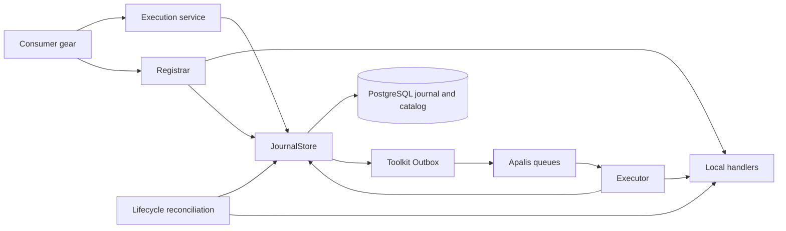

# Technical Design: Durable execution


<!-- toc -->

- [1. Architecture Overview](#1-architecture-overview)
  - [1.1 Architectural Vision](#11-architectural-vision)
  - [1.2 Architecture Drivers](#12-architecture-drivers)
  - [1.3 Architecture Layers](#13-architecture-layers)
- [2. Principles & Constraints](#2-principles--constraints)
  - [2.1 Design Principles](#21-design-principles)
  - [2.2 Constraints](#22-constraints)
- [3. Technical Architecture](#3-technical-architecture)
  - [3.1 Domain Model](#31-domain-model)
  - [3.2 Component Model](#32-component-model)
  - [3.3 API Contracts](#33-api-contracts)
  - [3.4 Internal Dependencies](#34-internal-dependencies)
  - [3.5 External Dependencies](#35-external-dependencies)
  - [3.6 Interactions & Sequences](#36-interactions--sequences)
  - [3.7 Database schemas & tables](#37-database-schemas--tables)
  - [3.8 Deployment Topology](#38-deployment-topology)
- [4. Additional context](#4-additional-context)
- [5. Traceability](#5-traceability)

<!-- /toc -->

Current implementation of the shared workflow runner described in [PRD](PRD.md).

- [ ] `p3` - **ID**: `cpt-cf-durable-execution-design-runner`

## 1. Architecture Overview

### 1.1 Architectural Vision

The gear owns durable workflow state and lifecycle. Consumer gears supply local
Rust handlers through `cf-gears-durable-execution-sdk`. The journal decides what
can run; Apalis transports serialized delivery identifiers and supplies workers.
Toolkit Outbox bridges journal commits to enqueue without a shared SQLx transaction.

PostgreSQL holds the shared catalog and journal. Local registries hold `Arc` handler
bindings. Database state survives restart; applications reconstruct handlers.

### 1.2 Architecture Drivers

#### Functional Drivers

| Requirement | Implementation |
|---|---|
| `cpt-cf-durable-execution-fr-admission` | Scoped transaction commits journal, delivery intent and framework Outbox command together. |
| `cpt-cf-durable-execution-fr-progress` | Journal/StageJournal transitions and normalized activity checkpoints. |
| `cpt-cf-durable-execution-fr-continuation` | Journal retry policy, epoch validation, pinned fingerprint and deferred delivery for missing handlers. |
| `cpt-cf-durable-execution-fr-cancellation` | Persisted cancellation, handler token, bounded stop and retained claims when termination is unconfirmed. |
| `cpt-cf-durable-execution-fr-registration` | Shared definition catalog, revision checks, registration generations and lifecycle reconciliation. |
| `cpt-cf-durable-execution-fr-queues` | Exact-name routing and one Apalis worker pool per configured queue. |
| `cpt-cf-durable-execution-fr-coalescing` | Scoped slot with one active run and one parked successor, separated by registration generation. |
| `cpt-cf-durable-execution-fr-inspection` | Scoped SDK reads and progress projections that omit payloads and checkpoints. |

#### NFR Allocation

| NFR | Allocation and mechanism | Verification |
|---|---|---|
| `cpt-cf-durable-execution-nfr-fencing` | Executor heartbeat; journal claim checks; catalog locks and run revision CAS. | Lease, stale claim, epoch and revocation tests. |
| `cpt-cf-durable-execution-nfr-delivery` | Transactional Outbox, delivery generations and periodic reconciliation. | Commit/enqueue/ack faults and subprocess recovery. |
| `cpt-cf-durable-execution-nfr-authorization` | PolicyEnforcer and scoped toolkit-db operations; fresh service authorization. | Tenant isolation, partial-scope rejection and policy outage/revocation tests. |
| `cpt-cf-durable-execution-nfr-lifecycle` | Host cancellation, readiness guard and bounded control-plane retries. | Real lifecycle start/stop/failure and shutdown tests. |

#### Key ADRs

| Decision record | Decision |
|---|---|
| [ADR 0001](adrs/0001-apalis-with-transactional-outbox.md) | Atomic journal/publication intent; separate Apalis enqueue. |
| [ADR 0002](adrs/0002-task-execution-framework-selection.md) | Retain Apalis as the integrated PostgreSQL worker runtime. |
| [ADR 0003](adrs/0003-typed-sdk-and-journal-boundary.md) | Separate typed authoring and observation from persisted journal records. |

### 1.3 Architecture Layers

| Layer | Responsibility |
|---|---|
| SDK | Typed workflow builder and activities, serializable contracts, progress/history models and three object-safe capabilities. |
| Domain | `Journal`, `StageJournal`, definition lifecycle, registry invariants and progress projections. |
| Infrastructure | Authorized services, scoped storage, migrations, Outbox, Apalis and executor. |
| Composition root | `DurableExecutionGear`: ClientHub publication, configuration, startup validation, readiness and managed shutdown. |

## 2. Principles & Constraints

### 2.1 Design Principles

- [ ] `p1` - **ID**: `cpt-cf-durable-execution-principle-journal-authority`

The journal owns business retries, checkpoints and eligibility. Queue delivery
can repeat. Each mutation validates persisted ownership and commits through a
short transaction; no database transaction spans handler execution.

**ADRs**: [ADR 0001](adrs/0001-apalis-with-transactional-outbox.md)

### 2.2 Constraints

- [ ] `p1` - **ID**: `cpt-cf-durable-execution-constraint-runtime-boundary`

Full runtime requires PostgreSQL. SQLite supports journal tests. Rust handlers
execute locally; transport carries run ID, activity ID and delivery generation.
Journal/catalog access uses scoped toolkit-db operations. The direct SQLx exception
covers only the official adapter's `apalis` schema, using workspace SQLx/TLS settings.
Fixed table names and coordinated queue names define the shared deployment namespace.

**ADRs**: [ADR 0001](adrs/0001-apalis-with-transactional-outbox.md),
[ADR 0002](adrs/0002-task-execution-framework-selection.md)

## 3. Technical Architecture

### 3.1 Domain Model

[Domain source](../durable-execution/src/domain/) contains execution transitions;
[SDK models](../durable-execution-sdk/src/) define consumer-visible data.

| Model | Responsibility |
|---|---|
| `Journal` | Input, fingerprint, owner, run state, revision, cancellation and delivery generation. |
| `StageJournal` | Parallel-stage eligibility, per-step attempts, results and claim ownership. |
| `Definition` | Shared contract, Active/Retired/Stopping/Released state, revision, generation and revoked boundary. |
| `Registry` | Local contracts and generation-tagged handler bindings; duplicate binding preserves originals. |

Persisted run, activity, attempt and epoch records live in the internal domain/storage
layer. Legacy contracts without input-source metadata retain their original
fingerprint. New contracts include a versioned flow representation; incompatible
contracts under an existing name are rejected. New terminal transitions record
confirmed completion times without inferring them from `updated_at`.

Run revision serializes aggregate updates. Claim fences reject stale owners.
Execution epoch advances on Retry/Resume; registration generation changes after
release and reactivation. Delivery generation invalidates older queue messages.
These counters serve different purposes and are checked independently.

### 3.2 Component Model



#### SDK services

- [ ] `p1` - **ID**: `cpt-cf-durable-execution-component-services`

`Service` implements the SDK trait `DurableExecution`, authorizes caller operations
and builds domain transitions. `Registrar` implements `WorkflowRegistry` and uses
service authorization to persist contracts and bind handlers. Both delegate
persistence to `JournalStore`; neither executes activities in a transaction.
Binding triggers a delivery refresh for that definition. A failed refresh leaves
registration intact and periodic reconciliation can retry it.

#### Journal storage

- [ ] `p1` - **ID**: `cpt-cf-durable-execution-component-storage`

`JournalStore` owns scoped CRUD, normalized hydration, CAS, catalog locks, start
keys and coalescing. It records Outbox commands in the same transaction as journal
changes. Post-commit Wake reduces latency; periodic scans recover missed signals.
PostgreSQL shared catalog locks order admission/claim/checkpoint operations against
exclusive unregister/activate/release locks.

#### Execution and lifecycle

- [ ] `p1` - **ID**: `cpt-cf-durable-execution-component-runtime`

`Runtime` owns named queues, Outbox handoff and dispatch. `Executor` claims work,
invokes local handlers and persists results. Monitoring checks authorization,
revocation, cancellation and ownership, renews leases and observes the activity
contract's independent timeout. Heartbeat ticks use `Delay` to avoid catch-up bursts.

Lifecycle reconciliation recovers expired claims, refreshes delivery and completes
pending definition release. Metadata-only hosts also reconcile definitions.
Shutdown cancels workers and starts one shared monotonic budget from
`shutdown_timeout_secs`. For total `T`, reserve `R = min(5 seconds, T / 6)`:
handler cleanup ends by `T - 2R`, runtime draining by `T - R`, and lifecycle waiting
by `T`. Cleanup is also capped by the confirmed lease. Authorization and database
I/O during shutdown use the remaining runtime budget. Unconfirmed termination or
an ambiguous release leaves the claim for lease recovery; shutdown does not request
business cancellation or discard completed checkpoints.

The lifecycle timeout provider reads initialized gear configuration at stop.
The host's independent `RunOptions.shutdown_deadline` can cut this budget short;
it defaults to 35 seconds and must exceed the gear budget. Readiness follows
serving lifetime and does not report policy availability. Aborting async tasks
cannot confirm that consumer-owned subprocesses, threads or external effects stopped.

### 3.3 API Contracts

The [SDK traits](../durable-execution-sdk/src/api.rs) are resolved through ClientHub:

| Interface | Methods | Contract |
|---|---|---|
| `DurableExecution` | `start`, `get`, `events`, `result`, `history`, `cancel`, `retry`, `resume` | Caller context, fresh PDP authorization and canonical errors. |
| `WorkflowRegistry` | `register`, `register_contract`, `registration`, `unregister`, `activate` | Trusted embedded management; service scopes, generations and revision checks. |
| `ExecutionInspector` | `inspect`, `list` | Separately authorized administrative progress, without result payloads. |

`DurableExecutionClient` wraps the object-safe execution trait with typed start,
workflow-result and checkpoint-result methods. It resolves through ClientHub and
pins the workflow fingerprint on submission. The prelude contains normal authoring
and execution types; contracts, registration and observation have separate modules.

`WorkflowBuilder<Input, Output>` composes sequential stages with `.then` and
parallel stages with `.parallel`. Tuple branches can have different output types;
a dynamic list has one output type. Both join in declaration order. `Step` wraps
an async function/closure or an `Activity` with associated input/output types.
Every step declares a timeout. Type mismatches fail compilation; `.build()` rejects
duplicate IDs, invalid policies and references outside earlier completed stages.
There is no arbitrary DAG or nested workflow runtime.

The serializable contract records versioned input sources: root input, checkpoint,
tuple or list. Declared additional dependencies and the final output source are
included in its fingerprint. `StepRef<T>` is local to the builder and must be
listed with `.uses` before a handler reads it. Runtime adapters deserialize the
selected checkpoint inputs and serialize the result. Functions and Rust type names
are not persisted schema identifiers. Payload or handler semantics changes require
a new versioned definition name.

`get` projects one journal revision into `RunProgress` and its cursor, replacing
the former snapshot call. Events are paged notifications, not a journal replay API.
Results and epoch/attempt history are separate reads. Administrative observation
never implies result access. Status filters are enums.

Run and step states carry their error/reason and confirmed timestamps. `Failing`
means a permanent failure exists while other work in the stage can still run;
`Failed` is final. Completed attempts carry an outcome and finish time; lease loss
or shutdown interruption is distinct from success and business cancellation.
Legacy missing timestamps remain `Unknown`; unknown checkpoint origins remain
absent. Retained checkpoints report their
origin epoch rather than appearing to execute again. Internal journal formats,
claim fences and retry budgets are not public observation models.

`register_contract` supports hosts without handlers. Existing identical registration
does not reactivate a version. After `Released`, binding prepares the next generation;
`activate` opens it explicitly. During `Stopping`, activation and new bindings fail.
No user-facing REST/gRPC execution or registration binding is installed.

### 3.4 Internal Dependencies

| Dependency | Interface | Use |
|---|---|---|
| AuthN resolver | `AuthNResolverClient::exchange_client_credentials` | Service identity from configured client ID, secret environment reference and scopes. |
| AuthZ resolver | `PolicyEnforcer` | Run/definition action authorization and compiled scopes. |
| toolkit-db | `DBProvider`, secure CRUD and Outbox | Scoped transactions, persistence and publication. |
| ToolKit host | Gear capabilities, ClientHub and lifecycle | Migrations, dependency order, configuration and managed serving. |

Run rows retain the submitting owner. Worker identity authorizes execution but
never replaces ownership. The catalog is shared across tenants; `CancelAndRelease`
requires an unconstrained `durable_execution.run / cancel_definition` scope before
revocation. AuthN/PDP failure pauses processing without a business error or
premature handler release.

### 3.5 External Dependencies

The journal and official adapter use the same PostgreSQL database through separate
pools. Named queues share the adapter pool, currently limited to four connections.
Apalis tasks use one transport attempt; journal reconciliation owns redelivery and
business retries. Due timestamps round upward to adapter seconds.

Apalis worker heartbeat/orphan recovery complements the journal's renewable claims;
it does not establish workflow ownership. Adapter and RC-version trade-offs are
recorded in ADR 0002.

### 3.6 Interactions & Sequences

#### Submit and execute

**ID**: `cpt-cf-durable-execution-seq-submit`

**Use cases**: `cpt-cf-durable-execution-usecase-background-work`

```mermaid
sequenceDiagram
    participant C as Consumer
    participant S as Service / JournalStore
    participant D as PostgreSQL
    participant O as Outbox
    participant A as Apalis / Executor
    C->>S: start(context, definition, input, options)
    S->>S: Authorize caller
    S->>D: Replay key or admit under catalog lock
    S->>D: Commit journal + intent + Outbox command
    S-->>C: Run ID
    O->>D: Read intent under dispatch scope
    O->>A: Enqueue serialized delivery at due time
    O->>D: Mark intent delivered; acknowledge command
    A->>D: Authorize; validate generation; CAS claim
    A->>A: Execute local handler; monitor and heartbeat
    A->>D: Fenced result + next intent in one transaction
```

Failure before enqueue leaves the command pending. Failure after enqueue but
before acknowledgment can enqueue again. Delivery generation and claim checks
reject obsolete work; completed checkpoints survive both paths. An external effect
before checkpoint commit can repeat and requires consumer deduplication.

#### Recover a lost worker

**ID**: `cpt-cf-durable-execution-seq-recovery`

**Use cases**: `cpt-cf-durable-execution-usecase-worker-recovery`

Recovery pages expired claims under fresh scopes, checks registration generations
and applies journal recovery. Runnable work gets a new delivery intent; completed
checkpoints remain intact. Missing catalog entries defer recovery; missing local
bindings defer execution without consuming attempts. Contract mismatches block.

#### Revoke and release

**ID**: `cpt-cf-durable-execution-seq-release`

**Use cases**: `cpt-cf-durable-execution-usecase-retire-definition`

Unregister takes an exclusive catalog lock and validates revision and cancellation
permission. `Retain` closes admission but allows existing runs. `CancelAndRelease`
records `Stopping` and the revoked generation boundary. Reconciliation requests
cancellation and recovers expired claims, then rechecks remaining runs and claims
under the exclusive lock before recording `Released`.

Hosts evict local bindings after authorized observation. Restart resumes `Stopping`
from persisted state. An unavailable host cannot have its `Arc` objects freed remotely.

### 3.7 Database schemas & tables

The [migration source](../durable-execution/src/infra/storage/migrations/) defines
columns, foreign keys and indexes. The table summary describes current storage
without duplicating that DDL.

| Table | Keys and contents |
|---|---|
| `durable_runs` | UUID PK; tenant/owner, definition, revision, registration generation, status, journal header, storage version and due/owner indexes. |
| `durable_activities` | UUID PK; run FK; unique run/activity and run/position; checkpoint state, epoch, fence, scheduling fields and lease index. |
| `durable_attempts` | UUID PK; run FK; unique run/activity/attempt number; serialized attempt state, updated until completion and immutable afterward. |
| `durable_epochs` | UUID PK; run FK; unique run/epoch; archived execution state. |
| `durable_events` | UUID PK; run FK; ordered run event history. |
| `durable_start_keys` | UUID PK; scoped definition/key hash uniqueness; input hash and original run reference. |
| `durable_coalescing` | UUID PK; scoped definition/key hash uniqueness; revision, active and successor run references. |
| `durable_outbox` | UUID PK; unique run/delivery generation; due/delivered timestamps. Intent index retained for reconciliation and legacy forwarding. |
| `durable_definitions` | UUID PK; unique name, revision and serialized contract/lifecycle state. No tenant or owner columns. |
| `durable_delivery_outbox_*` | Toolkit-managed publication and leased delivery tables. |
| `apalis.*` | Official adapter schema; no journal/catalog queries through SQLx. |

Normalized storage keeps activity checkpoints and attempt/epoch history outside
the run header. Hydration verifies consistency; legacy blob journals remain readable.
Migrations are forward-only, with stable IDs from `migration` through
`migration_000005_definition_registry`. Existing runs default to registration
generation 0. The catalog persists across restarts; applications restore local
handler bindings. Legacy runs without catalog entries require the application
to register their matching contracts.

### 3.8 Deployment Topology

`execute_activities=true` starts activity workers and the delivery runtime,
regardless of `delivery_enabled`. With execution disabled, `delivery_enabled=true`
starts delivery without activity workers. With both flags disabled, the host runs
catalog reconciliation only; new runnable submissions fail atomically because no
Outbox publisher is installed. Enable the runtime on a host that submits such work.

Each process hosts one shared gear instance and may bind only the definitions it
executes. Cooperating hosts use the same journal and coordinated queue names.
Concurrency is independent per queue within each host; adding worker hosts adds
worker slots. Active catalog state does not imply handler readiness on every host.

## 4. Additional context

Control-plane database failures use exponential backoff from the dispatch interval,
capped at `max(dispatch_interval_secs, 60s)`, until `control_plane_failure_limit`.
A successful pass resets failures; shutdown interrupts waiting. Authorization
failures pause separately. Outbox diagnostics record allowlisted identifiers,
phase and error category rather than backend error text or payloads.

[README](../README.md) links to runnable scenarios and [configuration](configuration.md).
[Testing](testing.md) documents regression suites and shared coverage collection.

## 5. Traceability

- [PRD](PRD.md): requirements and use cases mapped above.
- [ADR 0001](adrs/0001-apalis-with-transactional-outbox.md): publication transaction boundary.
- [ADR 0002](adrs/0002-task-execution-framework-selection.md): runtime selection and trade-offs.
- [ADR 0003](adrs/0003-typed-sdk-and-journal-boundary.md): public SDK and persisted models.
- [Composition root](../durable-execution/src/gear.rs), [executor](../durable-execution/src/infra/executor.rs) and [storage](../durable-execution/src/infra/storage/): implementation anchors.
