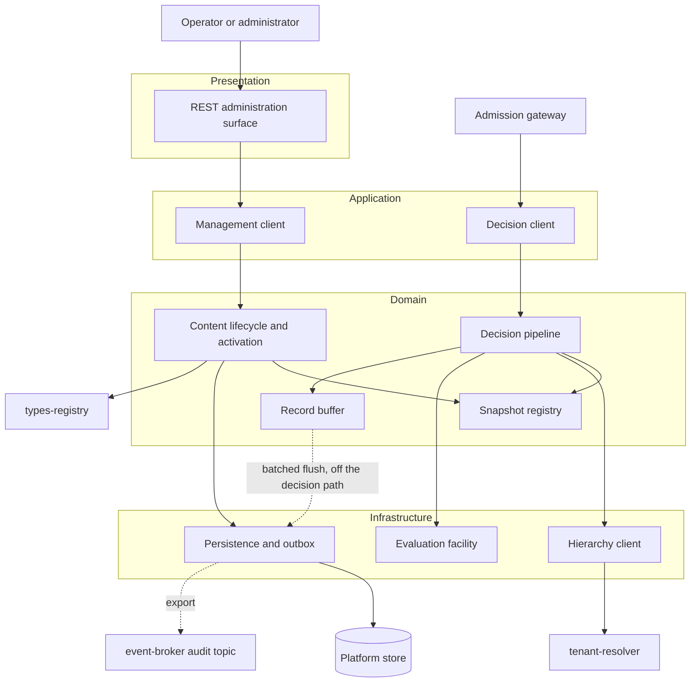
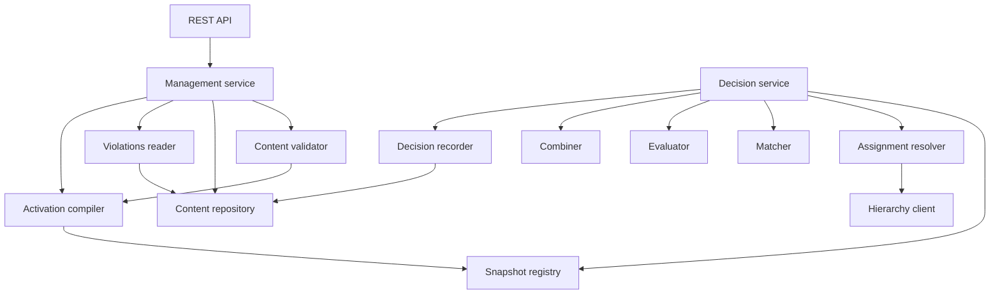
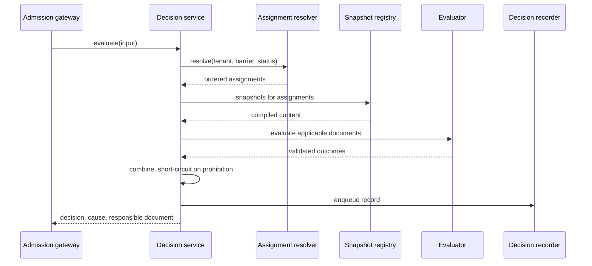
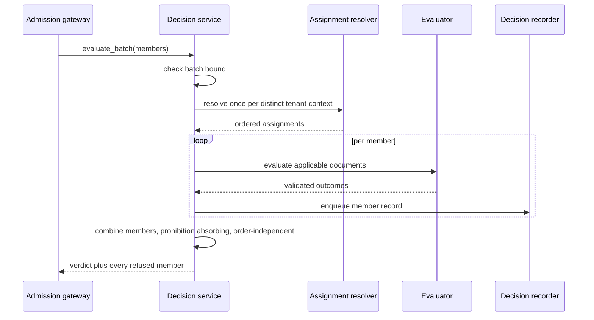
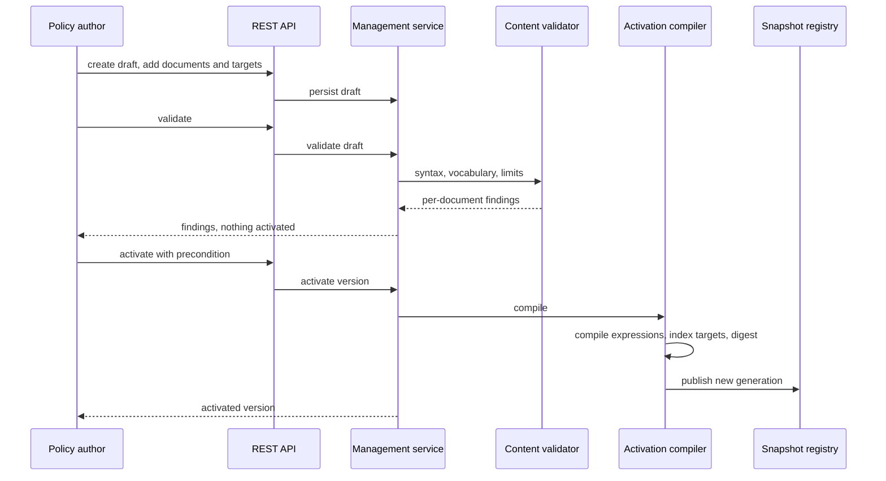
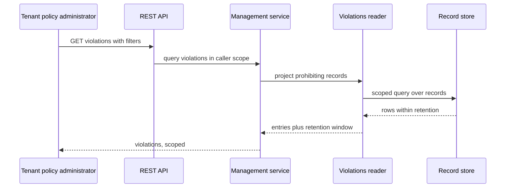
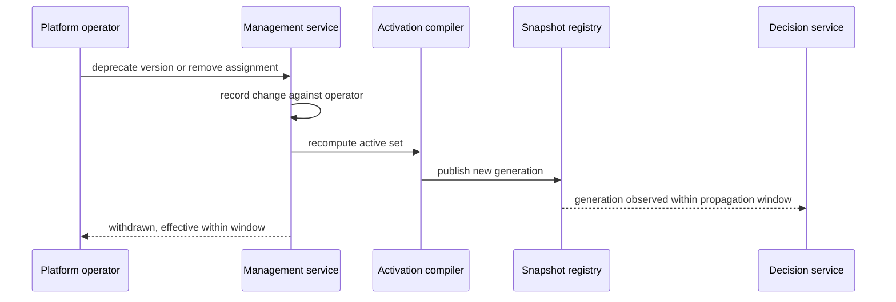
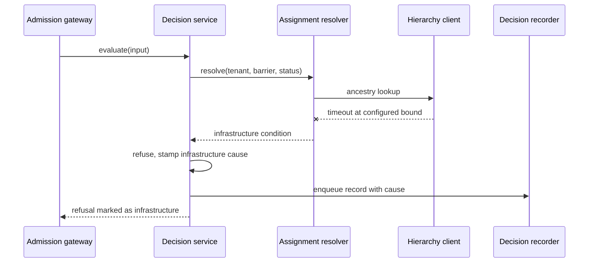

# Technical Design — Policy Engine

<!-- toc -->

- [1. Architecture Overview](#1-architecture-overview)
  - [1.1 Architectural Vision](#11-architectural-vision)
  - [1.2 Architecture Drivers](#12-architecture-drivers)
  - [1.3 Architecture Layers](#13-architecture-layers)
- [2. Principles & Constraints](#2-principles--constraints)
  - [2.1 Design Principles](#21-design-principles)
  - [2.2 Constraints](#22-constraints)
- [3. Technical Architecture](#3-technical-architecture)
  - [3.1 Domain Model](#31-domain-model)
  - [3.2 Component Model](#32-component-model)
  - [3.3 API Contracts](#33-api-contracts)
  - [3.4 Internal Dependencies](#34-internal-dependencies)
  - [3.5 External Dependencies](#35-external-dependencies)
  - [3.6 Interactions & Sequences](#36-interactions--sequences)
  - [3.7 Database schemas & tables](#37-database-schemas--tables)
  - [3.8 Deployment Topology](#38-deployment-topology)
- [4. Additional context](#4-additional-context)
  - [4.1 Telemetry surface](#41-telemetry-surface)
  - [4.2 Capacity envelope](#42-capacity-envelope)
  - [4.3 Deferred items](#43-deferred-items)
  - [4.4 Known design risks](#44-known-design-risks)
  - [4.5 Reliability, error handling, and consistency](#45-reliability-error-handling-and-consistency)
  - [4.6 Security boundaries and threat model](#46-security-boundaries-and-threat-model)
  - [4.7 Testability and test strategy](#47-testability-and-test-strategy)
  - [4.8 Compliance and privacy posture](#48-compliance-and-privacy-posture)
  - [4.9 Deviations from platform baselines](#49-deviations-from-platform-baselines)
  - [4.10 Migration, deprecation, and technical debt](#410-migration-deprecation-and-technical-debt)
  - [4.11 Areas recorded as not applicable](#411-areas-recorded-as-not-applicable)
- [5. Traceability](#5-traceability)

<!-- /toc -->

- [ ] `p1` - **ID**: `cpt-cf-policy-engine-design-policy-engine`
## 1. Architecture Overview

### 1.1 Architectural Vision

The gear is built around one asymmetry: policy content changes rarely and is read on every gated operation. The design exploits that by moving all interpretation of content to activation time. When a bundle is activated, an activation compiler validates it, resolves its targets, compiles each document through the backend its declared language names, computes a content digest, and publishes an immutable snapshot. Evaluation then reads only that snapshot. No decision path issues a content query, parses an expression, or observes a partially applied write, which is what makes the latency budget in `cpt-cf-policy-engine-nfr-decision-latency` an allocation the gear can hold rather than a hope about database behaviour.

The gear separates two surfaces that have nothing in common except the content they share. The management surface is a conventional CRUD-and-lifecycle service over a relational store, transactional, tenant-scoped, and reachable over REST. The decision surface is a synchronous in-process call that touches the snapshot, the tenant hierarchy cache, and nothing else. They are separate components with separate clients, so a consumer on the admission path never links the administration contract, and administration load cannot displace decision latency.

Fail-closed behaviour is structural rather than defensive. Every path that cannot produce a well-founded outcome — an absent snapshot, a digest mismatch, an expression that exceeds its cost bound, an unreachable hierarchy provider, a tenant context that will not resolve — converges on a single refusal constructor that stamps a distinct cause. That constructor is the only way to build a negative decision from an error condition, and it marks the result so that `cpt-cf-policy-engine-fr-denial-versus-failure` can report the refusal as infrastructure rather than policy. Refusing and reporting honestly are separate obligations, and the design keeps them separately testable.

### 1.2 Architecture Drivers

Requirements that significantly influence architecture decisions.

#### Functional Drivers

| Requirement | Design Response |
|-------------|------------------|
| `cpt-cf-policy-engine-fr-bundle-composition` | `cpt-cf-policy-engine-entity-bundle`, `-document`, and `-target` model the content tree; the bundle version is the unit of digest, snapshot, and assignment. |
| `cpt-cf-policy-engine-fr-document-kinds` | Kind is a closed enum on the document entity; the evaluator dispatches on it and rejects unknown kinds at validation rather than at evaluation. |
| `cpt-cf-policy-engine-fr-target-binding` | `cpt-cf-policy-engine-component-matcher` indexes targets by trigger, phase, and resource type at compile time, so matching is a lookup rather than a scan. |
| `cpt-cf-policy-engine-fr-content-validation` | `cpt-cf-policy-engine-component-validator` runs the same checks the activation compiler runs, against a draft, without publishing a snapshot. |
| `cpt-cf-policy-engine-fr-lifecycle-states` | State lives on the version row, not the bundle; the four transitions are enforced in `cpt-cf-policy-engine-component-management` with conditional updates, and the at-most-one-active invariant is a partial unique index rather than an application check. |
| `cpt-cf-policy-engine-fr-administration-audit` | `cpt-cf-policy-engine-component-management` writes an administration event in the same transaction as the change it describes, into `policy_engine__admin_event`; retention is independent of the decision-record sweep. |
| `cpt-cf-policy-engine-fr-content-integrity` | Digest computed by the activation compiler, stored on the version row, verified at activation and whenever a generation is built or reloaded — never per evaluation, which the latency budget could not absorb. |
| `cpt-cf-policy-engine-fr-optimistic-concurrency` | `etag` column on every mutable row, surfaced as an HTTP precondition and as an explicit parameter on the management client. |
| `cpt-cf-policy-engine-fr-version-history` | Versions are immutable rows under a stable bundle identity; reverting activates a retained version rather than rewriting content. |
| `cpt-cf-policy-engine-fr-deprecation` | Deprecation is a version-state transition that triggers snapshot republication, bounded by `cpt-cf-policy-engine-nfr-activation-propagation`. |
| `cpt-cf-policy-engine-fr-version-comparison` | `cpt-cf-policy-engine-component-management` compares two retained versions structurally; the widening flag is computed from the compiled target index and outcome directives of each side, so it needs no evaluation and no sample traffic. |
| `cpt-cf-policy-engine-fr-non-enforcing-assignment` | An enforcing flag on the assignment row travels into the snapshot, and `cpt-cf-policy-engine-component-combiner` folds outcomes from non-enforcing assignments into the trace and the record but not into the result. |
| `cpt-cf-policy-engine-fr-effective-windows` | Window columns on the assignment row, evaluated by the assignment resolver against the evaluation timestamp. |
| `cpt-cf-policy-engine-fr-tenant-assignment` | `cpt-cf-policy-engine-entity-assignment` binds a bundle to a tenant with a priority; the snapshot is keyed by assignment and resolves the bundle's active version when a generation is built, so activation, withdrawal, and amendment all republish a generation by the same path and none of them rewrites an assignment row. |
| `cpt-cf-policy-engine-fr-nearest-tenant` | `cpt-cf-policy-engine-component-assignment-resolver` orders the ancestry chain nearest-first and applies priority within a tenant. |
| `cpt-cf-policy-engine-fr-inheritance-barriers` | Barrier handling is read from the request and passed through to the hierarchy client; the resolver holds no default of its own. |
| `cpt-cf-policy-engine-fr-applicable-set` | Matcher intersects the compiled target index with the resolved assignment set, bounded by the applicable-set limit. |
| `cpt-cf-policy-engine-fr-deterministic-ordering` | Ordering key is (proximity, priority descending, assignment identifier), applied as a total order before evaluation begins. |
| `cpt-cf-policy-engine-fr-evaluation-phases` | Phase is part of the target index; the after-phase path discards the outcome's effect on the verdict while still recording it. |
| `cpt-cf-policy-engine-fr-permit-provenance` | `cpt-cf-policy-engine-component-combiner` initialises the accumulator to an ungoverned permit, which a permitting outcome upgrades to governed and any prohibit overrides; no error path reaches the combiner at all, so no failure can produce a permission of either cause. The ungoverned share is exported as a metric. |
| `cpt-cf-policy-engine-fr-denial-precedence` | Combiner treats a prohibition as absorbing; no later permit can clear it, and no earlier one pre-empts it, which is what makes the fold order-independent. |
| `cpt-cf-policy-engine-fr-outcome-combination` | Combination rules are a single pure function over the outcome sequence, unit-testable independently of evaluation. |
| `cpt-cf-policy-engine-fr-short-circuit` | Combiner reports saturation to the evaluation loop; matched and evaluated counts are carried into the record. |
| `cpt-cf-policy-engine-fr-denial-reason` | Refusal carries a canonical error identity plus the document identifier that produced it; detail is recorded and stripped from the response projection. |
| `cpt-cf-policy-engine-fr-denial-versus-failure` | Single refusal constructor stamps an infrastructure cause distinct from every policy cause; the decision client surfaces the distinction to the caller. |
| `cpt-cf-policy-engine-fr-deferral-outcome` | Deferral is a distinct variant in the outcome enum, in the decision projection, and in the decision client's result type, carried end to end even though no consumer routes it yet — reserved on the client specifically so the gateway can map it rather than funnel it as an unmappable result. |
| `cpt-cf-policy-engine-fr-emergency-access` | Emergency entitlement is resolved from the security context alone, before the snapshot is consulted, so it survives a broken snapshot. |
| `cpt-cf-policy-engine-fr-authorization-boundary` | `cpt-cf-policy-engine-entity-evaluation-input` has no field able to hold an entitlement, so content has nothing to decide access by and the exclusion is a property of the type rather than a check; no component resolves an entitlement during evaluation, and the emergency entitlement is resolved by `cpt-cf-policy-engine-component-decision` from the security context before the snapshot is consulted rather than passed into the evaluation context; `cpt-cf-policy-engine-component-combiner` yields a two-valued result carrying a cause and no grant. |
| `cpt-cf-policy-engine-fr-evaluation-input` | Evaluation input is a value type carrying subject identity, action, resource, tenant context, and caller-supplied properties; no component fetches consumer state. |
| `cpt-cf-policy-engine-fr-batch-evaluation` | Batch is evaluated member-by-member over one snapshot read and one hierarchy resolution, then combined by the same absorbing rule. |
| `cpt-cf-policy-engine-fr-obligations` | Obligations ride on the permitting decision as typed identifiers; the client documents the unrecognised-identifier obligation on the caller. |
| `cpt-cf-policy-engine-fr-expression-evaluation` | `cpt-cf-policy-engine-component-evaluator` is the only component that links the evaluation facility, and routes each document to the backend its declared GTS identifier resolves to. |
| `cpt-cf-policy-engine-fr-evaluation-isolation` | Evaluation receives a constructed context value and a gear-supplied timestamp and nothing else; no ambient capability is reachable from the call. `cpt-cf-policy-engine-component-evaluator` refuses to select a backend build whose GTS registration carries no sandbox-and-determinism declaration, and `cpt-cf-policy-engine-component-activation-compiler` refuses content referencing a denylisted builtin — the only enforcement point available, since builtins can be neither removed nor shadowed at call time. |
| `cpt-cf-policy-engine-fr-evaluation-cost-bounds` | Per-document and per-evaluation bounds are enforced by the evaluator around each library call and across the loop, using the backend's own caller-set wall-clock limit where it offers one. That limit is cooperative — checked between work units rather than preemptively — so the configured figure is an upper bound plus one work unit, and the check interval is a tuning input the evaluator sets rather than a constant it inherits. |
| `cpt-cf-policy-engine-fr-dependency-timeouts` | Hierarchy client calls are wrapped in a configured timeout that converts expiry into an infrastructure refusal. |
| `cpt-cf-policy-engine-fr-responsibility-boundary` | Evaluator validates every returned outcome against the closed outcome set before it reaches the combiner. |
| `cpt-cf-policy-engine-fr-content-isolation` | All management repository access goes through the secure data layer with the caller's scope; absent and forbidden collapse to the same result. |
| `cpt-cf-policy-engine-fr-cross-tenant` | Resolver checks resource tenant against the reachable subtree before matching, and stamps its own refusal cause. |
| `cpt-cf-policy-engine-fr-admin-authorization` | Management operations are gated per capability through the platform enforcement helper; the four capabilities are distinct actions on the gear's own resource types. |
| `cpt-cf-policy-engine-fr-bootstrap` | A configured bootstrap principal is authorised for management actions while no assignment exists, and the condition is observable. |
| `cpt-cf-policy-engine-fr-decision-records` | `cpt-cf-policy-engine-component-recorder` owns the field set; every other component contributes fields through one builder. |
| `cpt-cf-policy-engine-fr-violations` | `cpt-cf-policy-engine-component-violations` reads the record table with a prohibiting-outcome predicate; no violation table exists. |
| `cpt-cf-policy-engine-fr-record-confidentiality` | The record row has no credential column and stores context property **names** only, never values, so exclusion is structural rather than a filtering step that can be misconfigured. |
| `cpt-cf-policy-engine-fr-subject-data-handling` | Subject identifier columns are the only personal-data columns; pseudonymisation is an update over those columns alone, leaving counts, causes, and policy references intact. |
| `cpt-cf-policy-engine-fr-record-retention` | Retention sweep over the record table, with window and volume exported as metrics. |
| `cpt-cf-policy-engine-fr-metrics` | Telemetry surface in Section 4.1, emitted from the components that own each measurement. |
| `cpt-cf-policy-engine-fr-explanation` | Explanation is the evaluation trace the combiner already builds, returned instead of discarded. |
| `cpt-cf-policy-engine-fr-dry-run` | Dry-run compiles a draft into a throwaway snapshot and evaluates against it without publication. |
| `cpt-cf-policy-engine-fr-operational-limits` | Limits are validated at activation and re-checked at evaluation, so content that grew past a lowered bound fails closed. |
| `cpt-cf-policy-engine-fr-configuration-validation` | Configuration is a deny-unknown-fields structure with documented defaults, rejected at startup. |

#### NFR Allocation

This table maps non-functional requirements from PRD to specific design/architecture responses, demonstrating how quality attributes are realized.

| NFR ID | NFR Summary | Allocated To | Design Response | Verification Approach |
|--------|-------------|--------------|-----------------|----------------------|
| `cpt-cf-policy-engine-nfr-decision-latency` | p95 25 ms, p99 50 ms per evaluation, miss path included | `cpt-cf-policy-engine-component-snapshot`, `-matcher`, `-evaluator` | Activation-time compilation removes parsing and content I/O from the hot path entirely — content is served from the published generation, never read from storage during a decision, which is what leaves the ~5 ms remaining beside a 20 ms hierarchy miss. Matching is an index lookup | Benchmark at the gear boundary measured over all evaluations including forced cache misses; per-stage timing histograms |
| `cpt-cf-policy-engine-nfr-fail-closed` | No permit on any error path | `cpt-cf-policy-engine-component-combiner` | Single refusal constructor; no configuration path constructs a permit from an error; accumulator starts at refusal | Fault injection across the enumerated conditions |
| `cpt-cf-policy-engine-nfr-availability` | Host-impact in-process; 99.95 percent per surface out-of-process, decision-surface maintenance capped at 30 min/month | `cpt-cf-policy-engine-topology-in-process` | In-process, the target is that no gear failure mode is host-fatal: every error path converges on a refusal rather than a panic, snapshot memory is bounded by the content limits, and evaluation is bounded in time. Out-of-process, the gear becomes independently addressable and the per-surface figure applies; the stateless decision path over process-resident content is what makes it reachable, since a store outage degrades management first and reaches decisions only once the record backlog ages past its window | Fault injection asserting zero host-fatal outcomes; per-surface availability measurement and store-outage drill in the out-of-process shape |
| `cpt-cf-policy-engine-nfr-tenant-isolation` | Zero cross-tenant reads, writes, influences | `cpt-cf-policy-engine-component-repository`, `-violations` | Secure data layer scoping on every query. Content scopes on `owner_tenant_id`; records scope on `resource_tenant_id`, and the two differ whenever an ancestor's bundle refuses an operation in a descendant. The violations reader therefore scopes over the requesting context's reachable subtree of `resource_tenant_id`, not over content ownership | Isolation suite including barrier boundaries, plus an ancestor querying a descendant's refusals |
| `cpt-cf-policy-engine-nfr-decision-record` | One record per evaluation, no sampling | `cpt-cf-policy-engine-component-recorder` | Records enqueued to a transactional outbox and drained asynchronously; queue depth and loss window exported | Throughput test asserting record count equals evaluation count |
| `cpt-cf-policy-engine-nfr-cache-safety` | Cached entries do not outlive their authority | `cpt-cf-policy-engine-component-snapshot` | Snapshot generation is part of every cache key; publication of a new generation invalidates the previous; error results are never cached | Cache-key property tests; revocation timing test |
| `cpt-cf-policy-engine-nfr-activation-propagation` | Effective within 60 seconds | `cpt-cf-policy-engine-component-activation-compiler` | Generation counter polled by every instance at a configured interval bounded well inside the window | Measured propagation across a multi-instance deployment |
| `cpt-cf-policy-engine-nfr-hierarchy-latency` | p95 2 ms on hit, 90 percent hit rate | `cpt-cf-policy-engine-component-assignment-resolver` | Ancestry cache keyed by tenant and barrier mode, with a bounded time to live | Hit-rate and latency metrics under steady load |
| `cpt-cf-policy-engine-nfr-scalability` | Tenfold load, 1,000 concurrent | `cpt-cf-policy-engine-topology-in-process` | Read-only hot path over immutable state; no shared mutable structure on the decision path | Load and concurrency test asserting no contention failures |
| `cpt-cf-policy-engine-nfr-durability` | Recovery point and time within 1 hour | `cpt-cf-policy-engine-db-policy-engine` | Content and versions in the platform store under its backup regime; records excluded and governed by retention | Restore exercise into a clean deployment |

#### Key ADRs

No decision record exists for this gear yet. The decisions below are the ones this design takes that warrant one, listed so that the ADRs can be written against a stated position rather than reconstructed from the design. The template's `ADR ID` column is replaced by a plain name here because allocating `cpt-cf-policy-engine-adr-*` identifiers before the records exist produces dangling references that the repository's deterministic validation rejects; the column returns, populated, as each record is written. PRD Section 13 gates the first four.

| Planned decision | Decision Summary |
|--------|-----------------|
| Evaluation facility dependency | Link the platform's shared evaluation facility directly rather than building a gear-level engine registry, on the grounds that the facility already carries the backend contract; record why delegating pluggability downward is preferable to the local registries `quota-enforcement` and `event-broker` each built. |
| Activation snapshot | Compile content into an immutable published snapshot at activation, rather than evaluating from the store, and accept a bounded propagation window as the cost. |
| Violations as projection | Derive violations from decision records rather than maintaining standing violation state, and accept the retention window as the projection's horizon. |
| Batch verdict | Evaluate a batch as members over one snapshot read with one absorbing combination, rather than as an independent request per member. |

### 1.3 Architecture Layers

Nodes inside the layer boxes are this gear's own code and the libraries it links, the evaluation facility among them. Nodes outside are separate gears and external systems, reached rather than linked.

- [ ] `p1` - **ID**: `cpt-cf-policy-engine-tech-stack`

| Layer | Responsibility | Technology |
|-------|---------------|------------|
| Presentation | Versioned REST administration surface, problem-shaped errors, precondition headers, OData listing and cursor pagination | `toolkit-http`, `toolkit-odata`, `toolkit-canonical-errors` |
| Application | Decision and management clients registered in ClientHub, gear lifecycle, configuration | ToolKit gear capabilities, ClientHub |
| Domain | Content model, activation compilation, assignment resolution, matching, outcome combination, record construction | Rust, `#[domain_model]` types |
| Infrastructure | Content and record persistence, tenant hierarchy client, policy evaluation, GTS registration | `toolkit-db` secure data layer, `tenant-resolver` SDK, evaluation facility, `toolkit-gts` |

## 2. Principles & Constraints

### 2.1 Design Principles

#### Interpretation Happens at Activation

- [ ] `p1` - **ID**: `cpt-cf-policy-engine-principle-compile-at-activation`

Everything that can be decided from content alone is decided when the content is activated, not when a decision is requested: syntax, target vocabularies, limits, digest, target indexing, and expression compilation. The decision path consumes only compiled artefacts. This is what makes evaluation cost a function of the applicable set rather than of stored policy volume, and it moves authoring mistakes to the author instead of to the operation that trips over them.

**Planned decision record**: Activation snapshot

#### Content Is Immutable Once Active

- [ ] `p1` - **ID**: `cpt-cf-policy-engine-principle-immutable-content`

An activated bundle version is never modified. Changes create a new version, and withdrawal is a state transition that leaves the version intact. Immutability is what allows a decision record to name a version and mean something, allows a snapshot to be cached without invalidation logic beyond generation replacement, and allows reverting to be an activation rather than a reconstruction.

**Planned decision record**: Activation snapshot

#### The Caller Supplies the Facts

- [ ] `p1` - **ID**: `cpt-cf-policy-engine-principle-caller-supplied-context`

The gear judges what it is told. It holds no copy of the resources policy governs and retrieves none during evaluation. Policy commonly judges a resource that does not exist yet, so there is nothing to retrieve; and a gear that fetched consumer state would need the resource synchronisation the platform rejected, plus a fetch inside the latency budget. The cost of this principle is stated as an assumption in the PRD: a property the caller omits evaluates as absent.

#### Semantics in the Gear, Language in the Library

- [ ] `p1` - **ID**: `cpt-cf-policy-engine-principle-semantics-in-gear`

The evaluation facility answers one question: what outcome does this document produce over this context. Everything else — which documents apply, in what order, how outcomes combine, what a refusal means, what gets recorded — belongs to the gear. The gear does not parse document content; it resolves the backend identifier the document declares, routes the content there, and reads only the outcome that comes back. Because a policy language can return an arbitrary shape rather than a boolean, the evaluator validates every result against the closed outcome set before it reaches the combiner, so a backend defect degrades to a refusal rather than becoming a policy bypass.

**Planned decision record**: Evaluation facility dependency

#### Records Are the Only Decision State

- [ ] `p1` - **ID**: `cpt-cf-policy-engine-principle-records-only`

The decision record is the single durable artefact an evaluation produces. Violations are a query over records, explanation is the trace the combiner already built, and metrics are aggregates. Nothing derived from a decision is separately stored, so nothing derived can disagree with the record it came from.

**Planned decision record**: Violations as projection

#### Management and Decision Do Not Share a Path

- [ ] `p2` - **ID**: `cpt-cf-policy-engine-principle-surface-separation`

The two surfaces share the content model and nothing else: separate clients, separate components, separate error surfaces, and no synchronous call from decision into management. A consumer on the admission path links only the decision contract. Administration traffic reaches the store; decision traffic reaches memory.

### 2.2 Constraints

#### The Expression Library Is a Hard Dependency

- [ ] `p1` - **ID**: `cpt-cf-policy-engine-constraint-expression-library`

There is no evaluation path without the shared evaluation facility, and no fallback interpreter in the gear. Two properties are required of every backend the facility carries, not of the facility in the abstract: syntax validation exposed separately from evaluation, and acceptance of an externally imposed per-document cost bound. Without both, `cpt-cf-policy-engine-fr-content-validation` and `cpt-cf-policy-engine-fr-evaluation-cost-bounds` have no implementation. Both are present in the first candidate audited, and the audit also settled what is **not** available and therefore has to be built here: a backend does not declare its own sandbox posture, its determinism depends on which builtins its build registers, and it offers no way to remove or shadow one. Isolation is consequently split — capabilities are withheld at the call, and determinism is enforced by refusing content at activation. The facility itself is still unwritten, which keeps its surface the gear's largest external risk.

**Planned decision record**: Evaluation facility dependency

#### Tenant Hierarchy Is Owned Elsewhere

- [ ] `p1` - **ID**: `cpt-cf-policy-engine-constraint-hierarchy-external`

Ancestry, descendants, barrier state, and tenant status come from `tenant-resolver`. The gear caches them and reinterprets none of them. Barrier handling arrives on the request and is passed through unchanged, because the platform's position is that the caller decides per resource type.

#### Evaluation Is In-Process and Capability-Free

- [ ] `p1` - **ID**: `cpt-cf-policy-engine-constraint-in-process-evaluation`

Expression evaluation runs in the gear's process, inside the caller's task, with no handle to the network, the filesystem, the clock, or the database. The only ambient value is a gear-supplied evaluation timestamp. Co-location bounds the failure modes but does not remove them, so the cost bound applies regardless.

#### Database Objects Carry the Gear Namespace

- [ ] `p2` - **ID**: `cpt-cf-policy-engine-constraint-db-namespace`

The gear declares `policy_engine` as its stable database namespace and names every object it creates accordingly. The platform's namespacing decision names `policies` specifically as the kind of generic table name that has already produced a collision, so this gear cannot use unprefixed names for its content tables.

#### The Latency Budget Is Borrowed

- [ ] `p2` - **ID**: `cpt-cf-policy-engine-constraint-latency-budget`

The decision latency target is a fraction of a consumer's own budget, not an independent figure. Any design change that adds a synchronous dependency to the decision path spends the consumer's budget, so the hot path admits exactly two: the snapshot registry, in memory, and the hierarchy cache, which is required to hit.

#### The Gateway Is the Only Path, and It Does Not Exist Yet

- [ ] `p2` - **ID**: `cpt-cf-policy-engine-constraint-no-gateway`

Every evaluation reaches this gear through `admission-control`, which is unspecified and unbuilt. Two things follow. The decision surface is specified independently of any gateway contract, so conforming to that contract later is an added implementation of a foreign trait over the same service rather than a change to how decisions are reached. And until the gateway exists the gear can only be exercised through a harness standing in for it, so every integration property — context completeness, batch shape, refusal propagation — is verified against an assumption rather than a consumer.

## 3. Technical Architecture

### 3.1 Domain Model

**Technology**: Rust domain types under `#[domain_model]`, GTS identifiers for resource types and error families

**Location**: `gears/system/policy-engine/policy-engine/src/domain/`

**Core Entities**:

- [ ] `p1` - **ID**: `cpt-cf-policy-engine-entity-bundle`
- [ ] `p1` - **ID**: `cpt-cf-policy-engine-entity-bundle-version`
- [ ] `p1` - **ID**: `cpt-cf-policy-engine-entity-document`
- [ ] `p1` - **ID**: `cpt-cf-policy-engine-entity-target`
- [ ] `p1` - **ID**: `cpt-cf-policy-engine-entity-assignment`
- [ ] `p1` - **ID**: `cpt-cf-policy-engine-entity-evaluation-input`
- [ ] `p1` - **ID**: `cpt-cf-policy-engine-entity-decision`
- [ ] `p1` - **ID**: `cpt-cf-policy-engine-entity-decision-record`
- [ ] `p1` - **ID**: `cpt-cf-policy-engine-entity-snapshot`
- [ ] `p3` - **ID**: `cpt-cf-policy-engine-entity-obligation`

| Entity | Description | Schema |
|--------|-------------|--------|
| PolicyBundle | Stable identity and ownership of a named body of policy within a tenant. Carries no content. | `policy_engine__bundle` |
| PolicyBundleVersion | An immutable-once-activated revision of a bundle: lifecycle state, content digest, authorship, activation timestamp. The unit of versioning and integrity. | `policy_engine__bundle_version` |
| PolicyDocument | One rule within a version: kind, the GTS identifier of the evaluation backend its content is written for, the content itself as source that backend interprets, and the outcome directive the gear applies to what it returns. | `policy_engine__document` |
| PolicyTarget | The binding that decides when a document is evaluated: trigger, phase, resource type or pattern, and conjunctive attribute filters. | `policy_engine__target` |
| PolicyAssignment | Binds a bundle to a tenant with a policy priority, an optional effective window, and a barrier-reach declaration. Resolves to the bundle's active version at generation build, so it survives activation unchanged. | `policy_engine__assignment` |
| EvaluationInput | Caller-supplied request value: subject identifier and subject tenant, action, resource type and optional identifier, tenant context, and operation properties. Carries no entitlement of the subject and has no field shaped to hold one, per `cpt-cf-policy-engine-fr-authorization-boundary`. Not persisted. | Value type |
| Decision | The combined result: outcome, cause, responsible document, obligations, matched and evaluated counts, elapsed time. Not persisted directly. | Value type |
| DecisionRecord | The durable projection of a Decision together with its request identity, written asynchronously and read by the violations projection. | `policy_engine__decision_record` |
| PolicySnapshot | The compiled, digest-verified, immutable evaluation artefact for one activated version: compiled expressions plus the target index. Process-resident. | In-memory |
| Obligation | A typed identifier attached to a permitting decision that the caller must honour or else refuse. | Embedded in Decision |

**Relationships**:
- PolicyBundle → PolicyBundleVersion: one bundle owns an ordered history of versions; exactly one is active at a time.
- PolicyBundleVersion → PolicyDocument: a version owns its documents; documents do not exist outside a version.
- PolicyDocument → PolicyTarget: a document declares one or more targets; a document with no target is never evaluated and fails validation.
- PolicyBundle → PolicyAssignment: a bundle is assigned to zero or more tenants, and each assignment governs through whichever of that bundle's versions is active.
- PolicyBundleVersion → PolicySnapshot: activation compiles exactly one snapshot per version; the snapshot is discarded when the version leaves the active set.
- EvaluationInput → Decision → DecisionRecord: each input yields one decision, which yields exactly one record.

### 3.2 Component Model

The gear is two crates: `policy-engine-sdk`, carrying the client traits, models, error types, and GTS schemas that consumers link; and `policy-engine`, carrying the gear itself in the platform's domain, API, and infrastructure layering. Components below are modules within those crates, not separate processes.

#### Decision Service

- [ ] `p1` - **ID**: `cpt-cf-policy-engine-component-decision`

##### Why this component exists

Consumers need one call that turns an intended operation into a verdict they can enforce. This component is that call, and it is the only component a consumer on the admission path depends on.

##### Responsibility scope

Owns the decision pipeline and its ordering: emergency-entitlement check, tenant reachability check, assignment resolution, matching, evaluation, combination, record construction. Owns the fail-closed constructor that every error path converges on, and the timeout wrappers around external calls. Implements `cpt-cf-policy-engine-interface-decision-client` for both single and batch requests.

##### Responsibility boundaries

Does not read or write policy content, does not interpret expressions, and does not resolve tenant hierarchy itself. Does not enforce its own decisions, and has no way to observe whether a caller honoured one.

##### Related components (by ID)

- `cpt-cf-policy-engine-component-snapshot` — depends on, for the compiled content of each applicable assignment
- `cpt-cf-policy-engine-component-assignment-resolver` — calls
- `cpt-cf-policy-engine-component-matcher` — calls
- `cpt-cf-policy-engine-component-evaluator` — calls
- `cpt-cf-policy-engine-component-combiner` — calls
- `cpt-cf-policy-engine-component-recorder` — publishes to

#### Snapshot Registry

- [ ] `p1` - **ID**: `cpt-cf-policy-engine-component-snapshot`

##### Why this component exists

The decision path must not query the store or parse content. The registry is the process-resident, immutable, generation-stamped view of every currently active assignment and the compiled content behind it.

##### Responsibility scope

Holds compiled snapshots keyed by assignment, together with a monotonic generation counter. Resolves each assignment's bundle to that bundle's active version while building a generation — the join that makes an activation take effect everywhere without an assignment row being touched, and the reason a snapshot is keyed by assignment rather than by version. Verifies the content digest when a snapshot is built and whenever it is reloaded. Publishes a new generation atomically, so a reader observes either the whole previous generation or the whole next one. Polls for generation changes at a configured interval bounded inside the activation propagation window, which is how a change made on one instance reaches the others.

An assignment whose bundle has no active version — every version still a draft, or the last one deprecated without a successor — contributes nothing to the generation and is not an error. Its tenant is then governed by whatever other assignments reach it, and by nothing if there are none, which `cpt-cf-policy-engine-fr-permit-provenance` reports as an ungoverned permit rather than disguising as a refusal.

##### Responsibility boundaries

Does not compile content, does not decide what is active, and never serves a partially built generation. Holds nothing derived from a request, so it is not a decision cache and carries no request-scoped keys.

##### Related components (by ID)

- `cpt-cf-policy-engine-component-activation-compiler` — subscribes to
- `cpt-cf-policy-engine-component-decision` — owns data for

#### Activation Compiler

- [ ] `p1` - **ID**: `cpt-cf-policy-engine-component-activation-compiler`

##### Why this component exists

Activation is the moment when content stops being text and becomes an evaluation artefact. Concentrating that transformation in one place is what keeps the decision path free of parsing and the validator honest about what activation will do.

##### Responsibility scope

Resolves each document's declared backend identifier through the types registry, compiles the document through the instance that resolves, builds the target index used by matching, computes and records the content digest, enforces the content limits, screens the compiled form for builtins denylisted for that backend build, and publishes the resulting snapshot as a new generation. A document whose backend identifier does not resolve, whose target names a resource type that does not, or which references a denylisted builtin, fails compilation here rather than at evaluation. The screen runs over the parsed form rather than over the source text, because a substring search for a builtin name is defeated by anything the language allows in its place. Runs the identical pipeline for dry-run against a draft, publishing nothing.

##### Responsibility boundaries

Does not decide lifecycle state transitions, does not write content, and does not evaluate. A compilation failure aborts activation and leaves the version in draft; it never produces a partial snapshot.

##### Related components (by ID)

- `cpt-cf-policy-engine-component-validator` — shares model with
- `cpt-cf-policy-engine-component-snapshot` — publishes to
- `cpt-cf-policy-engine-component-management` — subscribes to

#### Content Validator

- [ ] `p1` - **ID**: `cpt-cf-policy-engine-component-validator`

##### Why this component exists

An author needs the answer to "will this activate" before activating, and the answer has to be the same one activation would give.

##### Responsibility scope

Runs backend and resource-type identifier resolution against the types registry, content syntax validation through the resolved backend, target vocabulary checks, the denylisted-builtin screen over the parsed form, and limit checks against a draft version, and reports every failure against the document that caused it rather than stopping at the first. The screen set is shared with `cpt-cf-policy-engine-component-activation-compiler` rather than reimplemented, because the promise that a draft which validates is a draft which activates is only true while the two run the same checks — and a denylist enforced at activation but not at validation would break it in the one direction that matters, by passing validation and then failing the activation an author has already been told will succeed.

##### Responsibility boundaries

Does not publish, does not mutate state, and does not answer whether a policy is correct — only whether it is well-formed and within bounds.

##### Related components (by ID)

- `cpt-cf-policy-engine-component-activation-compiler` — shares model with
- `cpt-cf-policy-engine-component-management` — called by

#### Assignment Resolver

- [ ] `p1` - **ID**: `cpt-cf-policy-engine-component-assignment-resolver`

##### Why this component exists

Which policy applies is a question about the tenant tree, and answering it on every evaluation without a cache would put a remote call inside the latency budget.

##### Responsibility scope

Resolves the resource tenant's ancestry under the requested barrier mode and status filter, checks that the resource tenant lies within the reachable subtree, collects the assignments visible along the chain, applies effective windows, and orders the result by proximity, then priority, then assignment identifier. Caches ancestry keyed by tenant and barrier mode with a bounded lifetime.

##### Responsibility boundaries

Does not own hierarchy, does not apply a barrier default of its own, and does not evaluate. Converts a hierarchy timeout or outage into an infrastructure refusal rather than a narrowed or widened set.

##### Related components (by ID)

- `cpt-cf-policy-engine-component-hierarchy-client` — depends on
- `cpt-cf-policy-engine-component-decision` — called by

#### Matcher

- [ ] `p1` - **ID**: `cpt-cf-policy-engine-component-matcher`

##### Why this component exists

Evaluating every document on every operation would make cost scale with stored policy rather than with relevant policy.

##### Responsibility scope

Intersects the compiled target index of each ordered assignment with the request's trigger, phase, resource type, and attribute filters, producing the applicable set in evaluation order and the matched count. Enforces the applicable-set bound.

##### Responsibility boundaries

Performs no expression evaluation — attribute filters use the closed operator set and are structural, which is why they can run before the evaluator and cheaply exclude most content.

##### Related components (by ID)

- `cpt-cf-policy-engine-component-snapshot` — depends on
- `cpt-cf-policy-engine-component-evaluator` — calls

#### Evaluator

- [ ] `p1` - **ID**: `cpt-cf-policy-engine-component-evaluator`

##### Why this component exists

It is the boundary with the evaluation facility, and the place where an untrusted result becomes a trusted one.

##### Responsibility scope

Builds the evaluation context from the request and a gear-supplied timestamp, invokes the compiled expression under the per-document cost bound, enforces the per-evaluation bound across the loop, and validates every returned outcome against the closed outcome set before passing it on. The per-document bound is set on the backend and is cooperative: it is checked between work units, so it overruns by at most one work unit, and the evaluator sets the check interval rather than accepting a default. The per-evaluation bound is the evaluator's own, measured across the loop, because no backend can see a budget that spans several of its invocations.

##### Responsibility boundaries

The only component that links the evaluation facility, and it evaluates through the backend instance the activation compiler already resolved rather than resolving one per request. It cannot enforce determinism at this point and does not try: builtins resolve inside the backend ahead of anything registered over the same name, so content that reached evaluation carrying a clock read or a random generator would be evaluated. That is why the denylist is the activation compiler's obligation and not this component's — by the time an expression is invoked here, the only remaining defence is the cost bound. Does not combine outcomes, does not record, and does not decide what to evaluate. Converts any backend failure, unavailable backend, or bound exceedance into an infrastructure refusal rather than a prohibition.

##### Related components (by ID)

- `cpt-cf-policy-engine-component-combiner` — calls
- `cpt-cf-policy-engine-component-matcher` — called by

#### Combiner

- [ ] `p1` - **ID**: `cpt-cf-policy-engine-component-combiner`

##### Why this component exists

Consumers need one answer. The rules that produce it are a product decision and belong in one auditable place.

##### Responsibility scope

Folds the document-outcome sequence into a single two-valued result — permit or prohibit — under the absorbing-prohibition rule, starting from an ungoverned permit. A permitting outcome moves the cause to governed; a prohibit overrides both. The cause travels with the result rather than as a third variant, so a caller branching only on permit or prohibit is correct without knowing the cause exists. Reports saturation so the caller can stop early, accumulates the evaluation trace used by explanation, and carries matched and evaluated counts. Combines batch members under the same rule and collects every refused member.

##### Responsibility boundaries

A pure, order-independent fold over outcomes, with no I/O and no knowledge of where they came from. Order-independence is a property worth testing directly: the same applicable set in any permutation must produce the same result, which is what keeps the ordering in `cpt-cf-policy-engine-fr-deterministic-ordering` a reporting concern rather than a semantic one.

##### Related components (by ID)

- `cpt-cf-policy-engine-component-decision` — called by

#### Decision Recorder

- [ ] `p1` - **ID**: `cpt-cf-policy-engine-component-recorder`

##### Why this component exists

Every evaluation must leave evidence, and writing that evidence synchronously would consume the latency budget it is measured against.

##### Responsibility scope

Owns the record field set and its single builder, and stages records in two stages so that durability never touches the decision path. On the decision path it appends the built record to a bounded in-memory buffer, which performs no I/O. Off it, a flusher periodically drains the buffer and, in one transaction, inserts the batch into `policy_engine__decision_record` and enqueues the same records for export on the `toolkit-db` outbox. Exports buffer age, buffer occupancy, and outbox depth, the first of which is the control input for the serving condition. Applies the retention sweep.

##### Responsibility boundaries

Does not decide, does not filter which evaluations are recorded, and does not project records into violations. Never writes a credential, and stores operation context only as a redacted projection.

##### Related components (by ID)

- `cpt-cf-policy-engine-component-repository` — depends on
- `cpt-cf-policy-engine-component-violations` — owns data for

#### Violations Reader

- [ ] `p1` - **ID**: `cpt-cf-policy-engine-component-violations`

##### Why this component exists

An administrator needs to see what policy has refused within the retention window without reading gear logs, and that view must not be a second source of truth.

##### Responsibility scope

Queries the decision record table under a prohibiting-outcome predicate, filtered by tenant, document, resource type, and time range, under the caller's scope. Reports the retention window in force alongside the result, since the window is the projection's horizon.

##### Responsibility boundaries

Stores nothing, evaluates nothing, and never inspects resources. A refusal that has aged out of retention is simply absent. Nor does it reach beyond this gear's own records: a gateway's built-in refusal and a gateway's could-not-run refusal produced no evaluation here and therefore no row to project, and the surface states that boundary rather than letting an absence read as an all-clear.

##### Related components (by ID)

- `cpt-cf-policy-engine-component-repository` — depends on
- `cpt-cf-policy-engine-component-management` — called by

#### Management Service

- [ ] `p1` - **ID**: `cpt-cf-policy-engine-component-management`

##### Why this component exists

Policy content needs an owner with a lifecycle, and the gear's own administration surface is a security boundary in its own right.

##### Responsibility scope

Owns bundle, version, document, target, and assignment lifecycle; enforces state transitions and preconditions; authorises each management capability separately against the caller's context; and exposes validation, dry-run, decision queries, and violation queries. Implements `cpt-cf-policy-engine-interface-management-client`.

##### Responsibility boundaries

Never evaluates policy for a consumer, and never grants an entitlement the caller does not itself hold. Bootstrap authorisation is confined here and is observable while it applies.

##### Related components (by ID)

- `cpt-cf-policy-engine-component-repository` — depends on
- `cpt-cf-policy-engine-component-validator` — calls
- `cpt-cf-policy-engine-component-activation-compiler` — calls
- `cpt-cf-policy-engine-component-violations` — calls

#### Content Repository

- [ ] `p1` - **ID**: `cpt-cf-policy-engine-component-repository`

##### Why this component exists

All persistence is confined to one layer so that tenant scoping is applied in one place rather than at every call site.

##### Responsibility scope

Owns the gear's schema and migrations, and executes every query through the secure data layer with the caller's scope. Provides the transactional boundary that makes activation and its outbox enqueue atomic.

##### Responsibility boundaries

Holds no domain rules. Returns absent for content the caller is not entitled to, so forbidden and non-existent are indistinguishable above this layer.

##### Related components (by ID)

- `cpt-cf-policy-engine-component-management` — owns data for
- `cpt-cf-policy-engine-component-recorder` — owns data for

#### Hierarchy Client

- [ ] `p1` - **ID**: `cpt-cf-policy-engine-component-hierarchy-client`

##### Why this component exists

Tenant ancestry comes from another gear, and every remote call on the decision path needs a bound and a cache.

##### Responsibility scope

Wraps the `tenant-resolver` client with the configured timeout and the ancestry cache, and passes barrier mode and status filter through unchanged.

##### Responsibility boundaries

Interprets nothing. On timeout or failure it reports an infrastructure condition and never substitutes a default subtree.

##### Related components (by ID)

- `cpt-cf-policy-engine-component-assignment-resolver` — called by

#### REST API

- [ ] `p1` - **ID**: `cpt-cf-policy-engine-component-rest`

##### Why this component exists

The gear must be operable by people and by tooling outside the process, and administration is the surface that needs to be reachable without a consuming gear.

##### Responsibility scope

Registers versioned operations through the platform's operation builder, maps management results into canonical problem responses, binds preconditions to the entity tag, and applies the platform's OData filtering and cursor pagination on list surfaces.

##### Responsibility boundaries

Contains no domain logic and exposes no decision endpoint: the decision surface is in-process only, because a network hop would spend a budget borrowed from the consumer.

##### Related components (by ID)

- `cpt-cf-policy-engine-component-management` — calls

### 3.3 API Contracts

#### Policy Decision Client

- **Realizes PRD interface**: `cpt-cf-policy-engine-interface-decision-client`
- **Contracts**: none at first release. `cpt-cf-policy-engine-contract-admission-engine` is a future conformance of this surface, not a dependency of it, and is not applicable until the gateway exists
- **Technology**: Rust async trait registered in ClientHub without scope
- **Location**: `gears/system/policy-engine/policy-engine-sdk/src/api.rs`

Accepts an evaluation input, or a batch of them, and returns a decision carrying outcome, cause, responsible document, obligations, and counts. The trait documents that any error result is a refusal for the caller. There is no REST projection of this surface.

**Endpoints Overview**:

| Method | Path | Description | Stability |
|--------|------|-------------|-----------|
| `n/a` | `evaluate` | Single evaluation over one operation | stable |
| `n/a` | `evaluate_batch` | One verdict over several members, refusing whole | stable |

#### Policy Management Client

- **Realizes PRD interface**: `cpt-cf-policy-engine-interface-management-client`
- **Contracts**: `cpt-cf-policy-engine-contract-decision-record` — the management client is where record and violation consumers read that contract
- **Technology**: Rust async trait registered in ClientHub without scope
- **Location**: `gears/system/policy-engine/policy-engine-sdk/src/api.rs`

Content lifecycle, assignment, validation, dry-run, decision queries, and the violations projection. Consumed in-process by tooling and by the REST layer.

**Endpoints Overview**:

| Method | Path | Description | Stability |
|--------|------|-------------|-----------|
| `n/a` | `bundle lifecycle` | Create, read, list, update draft, delete draft | stable |
| `n/a` | `version lifecycle` | Draft, validate, activate, deprecate, revert | stable |
| `n/a` | `assignment lifecycle` | Assign, unassign, list by tenant | stable |
| `n/a` | `queries` | Decisions and violations, filtered and paginated | stable |

#### Policy Administration REST API

- **Realizes PRD interface**: `cpt-cf-policy-engine-interface-rest-api`
- **Contracts**: none. `cpt-cf-policy-engine-contract-gts` is a link-time registration to the types registry, realized by the gear's GTS inventory rather than by this REST surface
- **Technology**: REST over the platform API prefix, OpenAPI-described, RFC 9457 problem responses
- **Location**: `gears/system/policy-engine/policy-engine/src/api/rest/`

Mutating operations require the entity tag as a precondition and reject a stale one as a conflict. List operations accept the platform's OData filter and order options with opaque cursor pagination. Error responses carry the gear's canonical error family; refusal detail from an evaluation is never exposed here.

**Endpoints Overview**:

| Method | Path | Description | Stability |
|--------|------|-------------|-----------|
| `POST` | `/policy-engine/v1/bundles` | Create a bundle | stable |
| `GET` | `/policy-engine/v1/bundles` | List bundles for the scoped tenant | stable |
| `GET` | `/policy-engine/v1/bundles/{id}` | Read a bundle | stable |
| `POST` | `/policy-engine/v1/bundles/{id}/versions` | Create a draft version | stable |
| `PUT` | `/policy-engine/v1/bundles/{id}/versions/{version}` | Replace draft content | stable |
| `POST` | `/policy-engine/v1/bundles/{id}/versions/{version}/validate` | Validate without activating | stable |
| `POST` | `/policy-engine/v1/bundles/{id}/versions/{version}/activate` | Activate a validated draft | stable |
| `POST` | `/policy-engine/v1/bundles/{id}/versions/{version}/deprecate` | Withdraw an active version | stable |
| `POST` | `/policy-engine/v1/assignments` | Assign a bundle to a tenant | stable |
| `DELETE` | `/policy-engine/v1/assignments/{id}` | Remove an assignment | stable |
| `GET` | `/policy-engine/v1/decisions` | Query decision records | stable |
| `GET` | `/policy-engine/v1/violations` | Query the violations projection | stable |

#### Consumed contracts

The gear consumes one contract it does not define: `cpt-cf-policy-engine-contract-hierarchy-read`, the `tenant-resolver` read surface described in Section 3.4. It is consumed by `cpt-cf-policy-engine-component-hierarchy-client` and is the only external contract on the decision path.

### 3.4 Internal Dependencies

| Dependency Gear | Interface Used | Purpose |
|-------------------|----------------|----------|
| `tenant-resolver` | SDK client | Ancestry, descendants, barrier and status handling for assignment resolution |
| `types-registry` | SDK client and GTS inventory | Registering the gear's resource types and error family; resolving the backend identifier each document declares, the concrete resource types its targets name, and the obligation identifiers its decisions carry |
| `toolkit-db` | Library | Schema ownership, migrations, and tenant-scoped access through the secure data layer; also provides the transactional outbox used for record export, under this gear's own table prefix |
| `toolkit-http` | Library | REST operation registration, precondition headers, problem responses |
| `toolkit-odata` | Library | Filtering, ordering, and cursor pagination on list surfaces |
| `toolkit-canonical-errors` | Library | The gear's error family and its RFC 9457 projection |
| `authz-resolver` | SDK client, via the enforcement helper | Authorizing this gear's own management operations, one access request per management capability. Consumed by `cpt-cf-policy-engine-component-management` only; the decision path never calls it |
| `toolkit-security` | Library | Security context propagation and management capability enforcement |
| Evaluation facility | Library | Carries the evaluation backends; compilation, syntax validation, and bounded evaluation of document content in the language each document declares |

**Dependency Rules** (per project conventions):
- No circular dependencies
- Always use sdk modules for inter-gear communication
- No cross-category sideways deps except through contracts
- Only integration/adapter gears talk to external systems
- `SecurityContext` must be propagated across all in-process calls

### 3.5 External Dependencies

#### Platform relational store

- **Contract**: `cpt-cf-policy-engine-contract-decision-record`

The gear has two external systems, and only the first is on any critical path. The relational store reached through `toolkit-db` holds content, assignments, and decision records. It is not on the read path of a decision: a store outage stops activation, administration, and record durability, while evaluation itself continues from the published snapshot. The second is `event-broker`, which receives decision records from the outbox for retention and export; it is downstream of the evidence store, so a broker outage delays export without affecting durability, evaluation, or the violations projection, all three of which read the gear's own table.

That asymmetry is bounded, and the bound is the record window rather than the outage itself. Evaluation continues from the published snapshot while the outbox still absorbs records inside the 5-second window of `cpt-cf-policy-engine-nfr-decision-record`. Once the oldest unflushed record ages past that window, the decision service stops returning permits and refuses with a distinct infrastructure cause until the drain recovers. The trigger is the age of the unflushed backlog, not store reachability: a brief outage the outbox absorbs changes nothing, and a slow drain under load trips the same condition a total outage would, which is correct — both mean a new decision cannot be shown to have been recorded.

| Dependency Gear | Interface Used | Purpose |
|-------------------|---------------|---------|
| `toolkit-db` | Secure data layer | Content, assignment, and decision-record persistence with tenant scoping |
| `event-broker` | Publish to the audit topic | Retention and export of decision records beyond this gear's own window, on the topic shared with `admission-control` |

**Dependency Rules** (per project conventions):
- No circular dependencies
- Always use SDK modules for inter-gear communication
- No cross-category sideways deps except through contracts
- Only integration/adapter gears talk to external systems
- `SecurityContext` must be propagated across all in-process calls

### 3.6 Interactions & Sequences

#### Admit a single operation

**ID**: `cpt-cf-policy-engine-seq-admit-operation`

**Use cases**: `cpt-cf-policy-engine-usecase-admit-operation`

**Actors**: `cpt-cf-policy-engine-actor-admission-gateway`

**Description**: The hot path. Hierarchy resolution is a cache hit in the common case, snapshot access is in-memory, and evaluation stops as soon as no remaining outcome can change the verdict. The record is enqueued, not written, so its durability does not extend the measured latency.

#### Admit a multi-type change

**ID**: `cpt-cf-policy-engine-seq-admit-batch`

**Use cases**: `cpt-cf-policy-engine-usecase-admit-batch`

**Actors**: `cpt-cf-policy-engine-actor-admission-gateway`

**Description**: One hierarchy resolution and one snapshot read serve every member, which is what keeps a plan-wide admission inside the consumer's preview and apply budgets. Members are recorded individually so that a batch refusal remains attributable per resource type.

#### Author, validate, and activate

**ID**: `cpt-cf-policy-engine-seq-activate-bundle`

**Use cases**: `cpt-cf-policy-engine-usecase-activate-bundle`

**Actors**: `cpt-cf-policy-engine-actor-policy-author`

**Description**: Validation and activation run the same pipeline, so a draft that validates is a draft that activates. Publication of a generation is the only step that changes what decisions see, and it is atomic.

#### Review current violations

**ID**: `cpt-cf-policy-engine-seq-review-violations`

**Use cases**: `cpt-cf-policy-engine-usecase-review-violations`

**Actors**: `cpt-cf-policy-engine-actor-tenant-policy-admin`

**Description**: The projection reads the same records an auditor reads, under the caller's scope. Nothing is computed against live resources, and the retention window is returned so an empty result is distinguishable from an aged-out one.

#### Withdraw an active bundle

**ID**: `cpt-cf-policy-engine-seq-withdraw-bundle`

**Use cases**: `cpt-cf-policy-engine-usecase-withdraw-bundle`

**Actors**: `cpt-cf-policy-engine-actor-platform-operator`

**Description**: Withdrawal is a generation change like activation. Every instance observes it by polling the generation counter, which is what bounds the propagation window rather than relying on a broadcast that can be missed.

#### Fail closed on an unreachable dependency

**ID**: `cpt-cf-policy-engine-seq-fail-closed`

**Use cases**: `cpt-cf-policy-engine-usecase-admit-operation`

**Actors**: `cpt-cf-policy-engine-actor-admission-gateway`, `cpt-cf-policy-engine-actor-hierarchy-provider`

**Description**: The operation is refused, and the refusal is labelled so the consumer can retry it as transient rather than report a policy denial to its user. The same shape covers snapshot absence, digest mismatch, and cost-bound exceedance, each with its own cause.

### 3.7 Database schemas & tables

- [ ] `p1` - **ID**: `cpt-cf-policy-engine-db-policy-engine`

The gear declares `policy_engine` as its stable database namespace. Every object below carries that prefix per the platform's object-namespacing convention. All access is through the secure data layer; the scope column that carries tenant identity is named on each table.

#### Table: policy_engine__bundle

**ID**: `cpt-cf-policy-engine-dbtable-bundle`

**Schema**:

| Column | Type | Description |
|--------|------|-------------|
| id | uuid | Bundle identity, stable across versions |
| owner_tenant_id | uuid | Owning tenant; the scope column |
| name | text | Bundle name, unique within the owning tenant |
| description | text | What this bundle governs |
| etag | uuid | Precondition token for concurrency control |
| created_at | timestamptz | Creation time |
| created_by | uuid | Author identity |
| updated_at | timestamptz | Last modification time |

**PK**: id

**Constraints**: `owner_tenant_id` and `name` unique together; `name` not null

**Additional info**: Indexed on `owner_tenant_id` for scoped listing.

#### Table: policy_engine__bundle_version

**ID**: `cpt-cf-policy-engine-dbtable-bundle-version`

**Schema**:

| Column | Type | Description |
|--------|------|-------------|
| id | uuid | Version identity, referenced by decision records |
| bundle_id | uuid | Owning bundle |
| owner_tenant_id | uuid | Owning tenant; the scope column |
| ordinal | integer | Monotonic version number within the bundle |
| state | smallint | Draft, active, or deprecated |
| content_digest | bytea | Digest over the version's documents and targets |
| etag | uuid | Precondition token |
| activated_at | timestamptz | Activation time, null while draft |
| activated_by | uuid | Activating identity, null while draft |

**PK**: id

**Constraints**: `bundle_id` and `ordinal` unique together; at most one active version per bundle; `content_digest` not null once active

**Additional info**: Rows are immutable once state leaves draft, except for the transition to deprecated.

#### Table: policy_engine__document

**ID**: `cpt-cf-policy-engine-dbtable-document`

**Schema**:

| Column | Type | Description |
|--------|------|-------------|
| id | uuid | Document identity, named in refusals and records |
| version_id | uuid | Owning version |
| owner_tenant_id | uuid | Owning tenant; the scope column |
| name | text | Author-facing name |
| kind | smallint | Document kind from the closed set of `cpt-cf-policy-engine-fr-document-kinds`, which has one member at first release: guardrail. Stored as an integer so that adding a member is a versioned widening rather than a schema change |
| backend | text | GTS identifier of the evaluation backend this document's content is written for; resolved through the types registry |
| content | text | Document source, opaque to the gear and interpreted by the declared backend |
| outcome | smallint | Outcome directive the gear applies to what the backend returns |

**PK**: id

**Constraints**: `version_id` and `name` unique together; `content` and `backend` not null for the guardrail kind; `backend` validated as a resolvable GTS identifier at activation, not at insert

**Additional info**: Cascades with its version. Never updated after the version leaves draft.

#### Table: policy_engine__target

**ID**: `cpt-cf-policy-engine-dbtable-target`

**Schema**:

| Column | Type | Description |
|--------|------|-------------|
| id | uuid | Target identity |
| document_id | uuid | Owning document |
| owner_tenant_id | uuid | Owning tenant; the scope column |
| trigger_kind | smallint | Operation or event |
| phase | smallint | Before or after |
| resource_type | text | Concrete GTS identifier or namespace wildcard |
| filters | jsonb | Conjunctive attribute filters over the closed operator set, each carrying whether the attribute is required |

**PK**: id

**Constraints**: `resource_type` not null; a document must have at least one target before its version can activate

**Additional info**: Indexed on `document_id`; the evaluation-time index is built in memory by the activation compiler, not by the database.

#### Table: policy_engine__assignment

**ID**: `cpt-cf-policy-engine-dbtable-assignment`

**Schema**:

| Column | Type | Description |
|--------|------|-------------|
| id | uuid | Assignment identity; the final ordering key |
| bundle_id | uuid | Assigned bundle; the active version is resolved when a generation is built, never stored here |
| tenant_id | uuid | Tenant the assignment attaches to |
| owner_tenant_id | uuid | Owning tenant of the assigning administrator; the scope column |
| priority | integer | Policy priority, higher wins within a tenant |
| reaches_barriers | boolean | Whether the assignment may reach through barriers when the caller permits |
| enforcing | boolean | Whether this assignment's outcomes contribute to the result, or are evaluated and recorded only |
| effective_from | timestamptz | Window start, null for unbounded |
| effective_to | timestamptz | Window end, null for unbounded |
| etag | uuid | Precondition token |

**PK**: id

**Constraints**: `bundle_id` and `tenant_id` unique together; `effective_from` before `effective_to` when both present

**Additional info**: Indexed on `tenant_id` for resolution and on `bundle_id` for withdrawal. There is no version column by design: `cpt-cf-policy-engine-fr-lifecycle-states` permits at most one active version per bundle, so an assigned version would be derived state that goes stale at the next activation, orphaning the assignment and silently ungoverning its tenant.

#### Table: policy_engine__decision_record

**ID**: `cpt-cf-policy-engine-dbtable-decision-record`

**Schema**:

| Column | Type | Description |
|--------|------|-------------|
| id | uuid | Record identity |
| evaluation_id | uuid | Identity of the evaluation this record describes; the idempotency key for outbox redelivery |
| correlation_id | uuid | Correlation identifier as supplied by the caller; never generated here, and the key that joins this row to the gateway's admission record on the shared audit topic |
| batch_id | uuid | Batch correlation as supplied by the caller, null for single evaluations |
| subject_id | uuid | Evaluated subject |
| subject_tenant_id | uuid | Subject's tenant |
| resource_tenant_id | uuid | Resource's tenant; the scope column |
| action | text | Requested action |
| resource_type | text | Resource type identifier |
| resource_id | uuid | Resource identity where the evaluation named one |
| outcome | smallint | Evaluation result: permit or prohibit, and deferral once that requirement ships |
| permit_cause | smallint | For a permission, whether it was governed or ungoverned; null for a prohibition |
| cause | text | Canonical cause identity, present on a negative outcome |
| responsible_document_id | uuid | Document that produced a prohibition |
| version_id | uuid | Version that determined the outcome |
| participating_versions | jsonb | Identity and version of every bundle that took part, including the determining one |
| backend_version | text | Identity and version of the evaluation backend that interpreted the content |
| matched_count | integer | Documents that matched |
| evaluated_count | integer | Documents actually evaluated |
| emergency | boolean | Whether the decision used the emergency path |
| elapsed_micros | integer | Measured evaluation time |
| context_keys | jsonb | Names of the operation-context properties the evaluation read; never their values, which is also why a recorded decision cannot be replayed against a candidate version |
| evaluated_at | timestamptz | Timestamp supplied to the backend; an input to the decision, required to reproduce one that turned on time |
| created_at | timestamptz | Evaluation time; the retention key |

**PK**: id

**Constraints**: `uq_policy_engine__decision_record__evaluation` unique over `evaluation_id`, which is what makes at-least-once outbox delivery produce exactly one row and keeps `cpt-cf-policy-engine-nfr-decision-record`'s count-equality assertion true; no credential column exists by construction; `outcome` not null

**Additional info**: Indexed on `resource_tenant_id` with `created_at` for the refusals projection and the retention sweep, and on `responsible_document_id` for per-policy queries. This is the only table whose row count grows with request rate rather than with policy volume, so it is range-partitioned by `created_at`: retention drops whole partitions instead of issuing bulk deletes against a table under continuous write, and the projection's tenant-and-time predicate prunes to a partition subset. Partition width is an operational setting; the retention window must be a whole multiple of it.

#### Table: policy_engine__admin_event

**ID**: `cpt-cf-policy-engine-dbtable-admin-event`

**Schema**:

| Column | Type | Description |
|--------|------|-------------|
| id | uuid | Event identity |
| owner_tenant_id | uuid | Owning tenant of the content changed; the scope column |
| actor_id | uuid | Subject that made the change |
| actor_tenant_id | uuid | That subject's tenant |
| operation | smallint | Which transition or assignment change occurred |
| bundle_id | uuid | Bundle affected |
| version_id | uuid | Version affected, null for assignment-only changes |
| assignment_id | uuid | Assignment affected, null for content changes |
| etag_supplied | uuid | Precondition the caller presented, null where none was required |
| occurred_at | timestamptz | Change time |

**PK**: id

**Constraints**: `actor_id` and `operation` not null; rows are insert-only, with no update or delete path in the schema

**Additional info**: Written in the same transaction as the change it describes, so an applied change without its event is not reachable. Retained at least as long as the versions it references, and deliberately **not** covered by the decision-record retention sweep — the question it answers outlives every decision the content produced.

#### Record staging: `toolkit-db` outbox

The gear defines no staging or dead-letter tables of its own. Record export runs on the `toolkit-db` transactional outbox under the table prefix `policy_engine_outbox`, which creates its own independent family — body, partitions, incoming, outgoing, and dead letters — validated and migrated by the facility. Adopting it rather than hand-rolling a queue is what keeps retry, per-partition ordering, dead-lettering, batch enqueue, and vacuum out of this gear entirely.

Two consequences shape how the gear uses it. The facility enqueues **inside the caller's transaction**, which suits activation and does not suit evaluation: an evaluation is a pure read with a latency budget that has no room for a database write, so records reach the outbox through the batched flush described in `cpt-cf-policy-engine-component-recorder` rather than one enqueue per decision. And the facility's dead-letter rows are generic — payload plus delivery metadata, with no tenant column — so the obligation falls on the gear to enqueue a payload that is already the redacted projection of `cpt-cf-policy-engine-fr-record-confidentiality`. A dead-lettered entry must be safe to hold in an untenanted table, because that is where it will sit.

Export runs in leased mode, and its destination is the `event-broker` audit topic the gear shares with `admission-control`. At-least-once delivery there is acceptable because the topic is downstream of the evidence store: the record table, not the topic, is where a decision becomes durable, so a redelivery duplicates a published event rather than a decision. Exactly-once inside the gear comes from the record table's own unique constraint, not from the outbox, and the consumer is expected to be idempotent on the evaluation identifier — which is what `event-broker` asks of an audit-pipeline consumer in any case. Records are published under the resource tenant of `cpt-cf-policy-engine-fr-decision-records` rather than the subject's, so the topic partitions on the tenant the record is scoped and filtered by.

### 3.8 Deployment Topology

- [ ] `p1` - **ID**: `cpt-cf-policy-engine-topology-in-process`

First release composes the gear in-process, the platform's default mode: it is linked into a host binary alongside its consumers and reached through ClientHub, with the evaluation facility in the same process. The platform also supports out-of-process execution over gRPC, and the gear's contracts are transport-agnostic, so that shape needs no contract change. It does need two numbers revisited: the decision latency budget contains no allowance for a transport hop, and the availability target only becomes independently measurable once the gear can fail separately from its consumers. Every instance holds its own snapshot registry and hierarchy cache, and instances coordinate only through the store's generation counter, so the decision path scales horizontally with the host and adds no coordination traffic. The REST administration surface is exposed through the platform ingress like any other gear surface; the decision surface is not exposed over the network in any deployment shape.

## 4. Additional context

### 4.1 Telemetry surface

Metrics are emitted by the component that owns each measurement, per `cpt-cf-policy-engine-fr-metrics`.

| Signal | Type | Owner | Purpose |
|---|---|---|---|
| Decision latency by outcome | Histogram | Decision service | The measured surface of `cpt-cf-policy-engine-nfr-decision-latency` |
| Decisions by outcome and cause | Counter | Combiner | Separates policy refusal from infrastructure refusal, and governed permits from ungoverned ones — the latter is how an operator sees what share of the estate policy is silent about |
| Fail-closed refusals by cause | Counter | Decision service | Distinguishes an outage from a policy change, per the fail-closed requirement |
| Expression evaluation duration and bound exceedances | Histogram, counter | Evaluator | Detects the authored expression that is degrading admission |
| Applicable-set size, matched versus evaluated | Histogram | Matcher, combiner | Surfaces policy that never matches, and the effect of short-circuiting |
| Hierarchy cache hit rate and lookup latency | Gauge, histogram | Hierarchy client | The measured surface of `cpt-cf-policy-engine-nfr-hierarchy-latency` |
| Snapshot generation age and propagation delay | Gauge | Snapshot registry | The measured surface of `cpt-cf-policy-engine-nfr-activation-propagation` |
| Record queue depth and unflushed window | Gauge | Decision recorder | Makes the bounded window observable, and is the control input for the serving condition in Section 4.5 rather than telemetry alone |
| Bootstrap authorisation in effect | Gauge | Management service | Ensures the cold-start path is visible while it applies |

### 4.2 Capacity envelope

The limits in `cpt-cf-policy-engine-fr-operational-limits` are the inputs that keep the latency target reachable, and their numeric values are an open question in the PRD rather than a design decision. The design constrains them in shape: content size and document count per version bound snapshot memory and activation cost; applicable-set size bounds per-evaluation cost together with the per-document cost bound; batch size multiplies a request's cost by its member count and therefore needs its own bound rather than inheriting the single-evaluation one. Limits are checked both at activation and at evaluation, so lowering a limit takes effect against content that already exceeds it by refusing rather than by silently continuing.

### 4.3 Deferred items

Six of the PRD's seven p3 requirements are carried in the design as extension points rather than implemented shapes. The seventh, `cpt-cf-policy-engine-fr-effective-windows`, is not deferred at all: it has dedicated columns on the assignment table and is applied by the assignment resolver, because a window is a predicate on an existing lookup rather than a new mechanism. The deferred six are: the after-the-operation phase, which the target index already carries but the decision service discards; the deferral outcome, which is a variant in the outcome enum with no routing behind it; obligations, which the decision value carries with no consumer that honours them; emergency access, which needs a platform entitlement that does not yet exist; explanation and dry-run, which reuse the combiner trace and the activation compiler respectively and add no new mechanism. Keeping them as variants and unused paths rather than as absent concepts is deliberate: each one changes a shared value type, and adding a variant later is a breaking change to a stable contract.

### 4.4 Known design risks

| Risk | Consequence | Response |
|---|---|---|
| A backend build registers a non-deterministic builtin the denylist does not name | Two evaluations of one input disagree while policy, version and digest all match, which is the least attributable defect this gear can produce | Bind the denylist to the audited build, re-audit the builtin set on every upgrade, and refuse to select a build that carries no declaration. Assert the denylist in a test that enumerates the backend's registered builtins rather than one that checks a hand-written list |
| Evaluation memory is unbounded except by content size | A large intermediate value inside a small document exhausts the host, which the in-process availability clause is written to prevent | Bound content size, document count and applicable-set size, and measure snapshot and evaluation footprint in the scalability test; treat an allocator-level cap as unavailable until a facility build offers one that does not conflict with the host allocator |
| Snapshot memory grows with tenant count times content size | Instance memory becomes the scaling limit before latency does | Bound content per version and measure snapshot footprint against tenant count in the scalability test, not only request rate |
| Generation polling interval competes with the propagation window | Either propagation exceeds 60 seconds or polling load grows with instance count | Derive the interval from the window with margin; export propagation delay so drift is observed rather than assumed |
| Outbox drain falls behind sustained evaluation rate | The bounded loss window is exceeded silently | Export queue depth and unflushed window as first-class signals; alert on the window rather than on the queue |

### 4.5 Reliability, error handling, and consistency

**Failure isolation.** The decision path has no shared single point of failure: every instance holds its own snapshot registry and hierarchy cache, and instances coordinate only through a generation counter. The store is a single point of failure for administration, activation, and record durability, but not for decisions already served by a published snapshot. Decision readiness is gated on the snapshot registry having completed its initial load, not on that load being non-empty: a deployment with no activated content is ready and refuses by default, which is correct behaviour rather than a fault. Management readiness is independent of it, because gating the management surface on compiled content would make the first bundle uncreatable and defeat `cpt-cf-policy-engine-fr-bootstrap`. An instance whose initial load has not completed reports unready rather than refusing every operation while appearing healthy.

**Timeouts and retries.** The hierarchy read carries a configured timeout; expression evaluation carries per-document and per-evaluation cost bounds. The decision path performs no retries of its own. A retry would be spent from a latency budget borrowed from the consumer, and the consumer is the party that knows whether the operation is still worth attempting — which is exactly what Infrastructure Resource Manager's transient-retry requirement expects of it. Circuit breakers and bulkheads are deliberately absent: the gear has one bounded in-process dependency and one bounded remote read, and a breaker would convert a bounded refusal into a sustained one while `cpt-cf-policy-engine-nfr-cache-safety` forbids caching the error that opened it.

**Error classification and propagation.** Errors fall into two disjoint classes carried by the gear's canonical error family: policy causes, which are correct outcomes, and infrastructure causes, which are incidents. Both converge on the single refusal constructor, and both reach the caller as a refusal — the class is what differs, and it is what the caller branches on. Graceful degradation is not available and not intended: a gear that degrades toward permitting is a gear that fails open.

**Serving condition.** The gear stops returning permits when it cannot show that a new decision will be recorded — specifically when the oldest record still in the in-memory buffer exceeds the record window, or the buffer is full. The trigger is buffer age rather than outbox depth, because the buffer is the only stage where a record is not yet durable: once the flush transaction commits, the record survives process loss and a backlog further downstream delays export without risking evidence. This is a refusal, not a shutdown: evaluations return an infrastructure cause the caller can distinguish, carrying a retry-after signal so the gateway backs off rather than retrying immediately — otherwise consumer retries amplify load on the storage already failing. The management surface is unaffected, because it writes synchronously and fails on its own terms. In-process the condition is reported as a gear-level degraded signal and **does not** fail the host readiness probe, since doing so would take co-located consumers out of rotation over a dependency only this gear needs. Out-of-process the same condition may fail the gear's own readiness, because there the blast radius is the gear alone.

**Queue handling.** Two queues exist and they answer different questions. The in-memory buffer is the gear's own and is what the loss window measures. Beyond it, delivery to the `event-broker` audit topic is the `toolkit-db` outbox's concern: retry budgets, dead-lettering, and per-partition ordering are the facility's, and a poison record lands in its dead-letter family rather than stalling the drain. Because a dead-lettered payload sits in a generic, untenanted table, the gear enqueues only the redacted projection — the confidentiality obligation is discharged before the record leaves the gear, not by the queue holding it.

**Consistency.** Content is strongly consistent within the store and eventually consistent at the point of evaluation, bounded by `cpt-cf-policy-engine-nfr-activation-propagation`. Activation and its outbox enqueue share one transaction. Evaluation records do not: an evaluation is a pure read and joins no transaction, so its record reaches durability in the flusher's batch transaction instead, which is what makes the loss window buffer residency rather than zero. There are no distributed transactions and no sagas, because the gear writes to exactly one store. Activation is idempotent on version identity, evaluation is a pure read over immutable state, and record insertion is keyed by evaluation identity so an outbox redelivery cannot duplicate a record.

**Recovery.** Content, versions, and assignments are restored under the platform backup regime to meet `cpt-cf-policy-engine-nfr-durability`; decision records are governed by retention and are not restore-critical. After a restore, each instance rebuilds its snapshot registry from restored content on the next generation poll, so recovery needs no separate cache-warming procedure.

### 4.6 Security boundaries and threat model

**Trust boundaries.** Three, in decreasing trust: the host process and its `SecurityContext`, which is trusted; policy content, which is tenant-authored and therefore semi-trusted — structurally valid but adversarially authored; and the caller-supplied operation context, which is untrusted input judged rather than believed. The evaluation backend that runs the content is the sandbox boundary between the second and the first.

| Threat | Vector | Mitigation |
|---|---|---|
| Policy content as an execution vector | A tenant administrator authors an expression that reaches the network or filesystem | `cpt-cf-policy-engine-fr-evaluation-isolation`: no capability is passed into the library; the only ambient value is a gear-supplied timestamp. Reaching outward also requires a builtin that performs I/O, so the backend build's registered builtin set is part of this boundary and is audited with it |
| Non-determinism as an audit-evasion vector | Content reads a clock or a random generator, so the same input yields different decisions and a recorded decision cannot be reproduced or disputed | The denylist of `cpt-cf-policy-engine-fr-evaluation-isolation`, enforced at activation over the parsed form. Determinism cannot be enforced at call time, because builtins resolve inside the backend ahead of any extension over the same name |
| Denial of service through authored content | An expression whose cost is unbounded, evaluated on every gated operation | Per-document and per-evaluation cost bounds, applicable-set and batch bounds, all operator-configurable |
| Cross-tenant policy influence | A decision for one tenant shaped by content the requester cannot reach | Reachability check before matching, scoped content reads, generation-and-tenant cache keys |
| Privilege escalation through authoring | An administrator grants, via policy, an entitlement they do not hold | `cpt-cf-policy-engine-fr-admin-authorization`: four separated capabilities and an explicit no-self-grant rule |
| Admission policy used as an access-control path | An author writes rules over roles or permissions, putting a second answer to "who may do what" outside `authz-resolver`, with its own lifecycle and no obligation to agree | `cpt-cf-policy-engine-fr-authorization-boundary`: the evaluation input has no entitlement field, so content has nothing to decide access by, and a decision carries no grant and cannot widen access |
| Audit trail as a leak channel | Records read widely, carrying credentials or full resource payloads | No credential column exists by construction; context stored only as a redacted projection |
| Stale policy after withdrawal | A withdrawn bundle keeps refusing or keeps permitting | Generation-keyed snapshot and cache entries; propagation window measured, not assumed |

**Data protection.** Confidentiality at rest and in transit is inherited, not implemented here, and the inheritance is worth stating because both data sets warrant it: policy content is a security control, and records carry subject identifiers. Content, records, outbox, and dead-letter rows sit in the platform relational store and take its at-rest encryption and its key management; the gear introduces no second store, no file spill, and no cache that outlives the process. In transit, the decision surface makes no network hop at all — it is an in-process call — and the management surface is exposed through the platform ingress, which terminates transport security. The gear holds no key material and performs no cryptography beyond the content digest of `cpt-cf-policy-engine-fr-content-integrity`, which is an integrity check and not a confidentiality one. Secure disposal follows the retention sweep and the partition drops described in Section 3.7.

**Assumptions.** Subjects arrive authenticated, `SecurityContext` is propagated on every in-process call, and the host process is not itself hostile. **Supply chain**: the evaluation facility, and specifically the backend that runs tenant-authored content, is the one substantial dependency this gear adds, so it carries more review weight than any other dependency here.

Network segmentation, DMZ placement, firewall rules, and CORS are not applicable: the gear opens no listener of its own, and its REST surface is exposed through the platform ingress, which owns those concerns.

### 4.7 Testability and test strategy

The component boundaries are drawn so that the decision pipeline is testable without a store, a tenant resolver, or an expression engine. The combiner is a pure function over an outcome sequence. The evaluator, hierarchy client, and repository are injected as traits, so each has a substitution point.

| Level | Coverage |
|---|---|
| Unit | Outcome combination and precedence, deterministic ordering, target matching and filters, limit enforcement, refusal-cause construction |
| Integration | Activation to snapshot to decision against a real store; inheritance and precedence across a constructed tenant hierarchy; optimistic-concurrency conflicts |
| Fault injection | The failure set enumerated by `cpt-cf-policy-engine-nfr-fail-closed`; this is that requirement's named verification method |
| Performance | Gear-boundary latency with warm caches, batch latency at the configured bound, snapshot memory against tenant and content count |
| Security | Isolation tests asserting no capability is reachable from content; a determinism test evaluating identical input twice and asserting identical outcomes; a test that enumerates the backend build's registered builtins and fails when one is absent from the denylist, so an upgrade that adds a non-deterministic builtin breaks the build rather than the audit trail; the cross-tenant suite including barrier boundaries and the violations projection |
| Contract | Decision and management client traits exercised through the SDK surface a consumer actually links |

Compile-fail coverage is narrow but not absent. The gear exposes no macro diagnostics and no generated-code contract, so those cases do not apply. One invariant does qualify: Section 1.1 states that the refusal constructor is the only way to build a negative decision from an error condition, and an exclusivity invariant enforced only by convention is one new code path away from a refusal that never receives its infrastructure cause. A compile-fail case asserting the constructor cannot be bypassed covers it, which is the class the repository's testing rule names when it asks for compile-fail suites over security invariants.

### 4.8 Compliance and privacy posture

The decision record is the audit-trail architecture: append-only by construction, with no update path except the pseudonymisation operation of `cpt-cf-policy-engine-fr-subject-data-handling`. Evidence for any past decision is the record together with the retained version it names, which is why version history is durability-critical while records are not. Privacy is structural rather than procedural — personal data is confined to the subject columns, minimised by the closed record field set, and erased by irreversible pseudonymisation that preserves the audit chain.

Consent management, data-subject access, and portability are not implemented here: subject identity is owned upstream, and this gear holds identifiers rather than profiles. Cross-border transfer controls are determined by where the deployment places its store, not by this gear.

### 4.9 Deviations from platform baselines

| Deviation | Rationale | Review owner |
|---|---|---|
| No gear-level engine registry, unlike the gear-plus-plugin idiom `credstore`, `quota-enforcement`, `event-broker`, and `usage-collector` each built | The evaluation facility already carries a backend contract, so a second registry here would duplicate it and bind a deployment's language choice to a gear rather than to the platform. Pluggability is delegated one layer down, not removed; the gear routes on a declared, registry-resolved backend identifier and a new backend reaches every consumer at once | Steering committee, through the planned evaluation-facility decision record |
| Gear placed under `gears/system/` while being a management-layer component | The infrastructure-management grouping does not exist yet, and inventing a directory tier inside this design would pre-empt a cross-team decision | Platform architecture, through the placement question in PRD Section 13 |
| Decision surface is in-process only, with no REST projection, unlike gears that project their public client | The latency budget is borrowed from the consumer, and a network hop would spend it; the management surface carries the external contract instead | Gear owner |

### 4.10 Migration, deprecation, and technical debt

The gear is new: there is no data to migrate, no schema to evolve, and no existing consumer to move. The debt here is sequencing rather than code: the gear is specified ahead of both components above it, so its integration surface is settled against a gateway contract nobody has written. That is recorded as a risk rather than resolved, because the alternative — waiting for the gateway before specifying the engine — leaves the gateway with no engine to attach. The deferred items in Section 4.3 are the rest of the register, each held as an unused variant on a shared value type precisely so that adding it later is not a breaking change.

Documentation for the gear is this design, the PRD beside it, the decision records listed in Section 1.2 once written, and the generated OpenAPI document for the administration surface. Operational runbooks belong to the deployment that composes the gear, not to the gear.

### 4.11 Areas recorded as not applicable

Stated explicitly so that absence is distinguishable from oversight.

Five areas are the responsibility of something other than this gear, and are recorded rather than inferred. **Vendor and licensing constraints**: none for this gear, but not none for the platform. Every dependency here is in-tree or a platform library, and the evaluation facility is first-party — yet the facility carries a third-party policy-language implementation, so the licence, provenance and upgrade cadence of that crate are the facility's to own rather than absent. This gear inherits them, and the sandbox declaration of `cpt-cf-policy-engine-fr-evaluation-isolation` is where that inheritance becomes visible: it is a claim about a specific third-party build. **Secret management**: not applicable — the gear holds no credential, no key, and no connection string of its own; the store handle arrives from the runtime, which is also what `cpt-cf-policy-engine-fr-record-confidentiality` relies on when it says no credential column exists by construction. **Feature-flag strategy**: not used — the five deferred variants in Section 4.3 are inert by construction rather than gated at runtime, and introducing a flag to enable one would put an untested path one configuration change away from the admission path. **Alerting thresholds and error budgets**: deliberately not fixed here — the signals in Section 4.1 are specified, but their thresholds depend on the reference load that PRD Section 13 has not yet ratified, and a threshold set against a provisional load figure would be re-tuned before it ever fired. **Data catalog and master-data management**: not applicable — the gear is not a system of record for any entity another system would catalog; content belongs to its tenant and records are evidence, not master data.

The remainder are host or repository concerns: infrastructure-as-code and deployment automation belong to the host binary and its chart, not to a linked gear; canary and blue-green deployment are host-level release strategies, and the gear's contribution is that a mixed-generation fleet remains correct because every instance fails closed on content it has not yet compiled; cost budgets are not modelled per gear in this repository; user-experience architecture is not applicable, as the gear exposes no end-user interface; and event architecture is narrow rather than absent: the gear publishes decision records to the `event-broker` audit topic described in Section 3.5, publishes no domain events announcing its own state changes, and subscribes to nothing.

## 5. Traceability

- **PRD**: [PRD.md](./PRD.md)
- **ADRs**: `ADR/` — not yet created; the decisions listed in Section 1.2 land here once written
- **Features**: `features/` — not yet created
- **First-release consumer**: [Infrastructure Resource Manager](../../../infrastructure-resource-manager/docs/PRD.md)
- **Platform architecture**: [ARCHITECTURE_MANIFEST.md](../../../../docs/ARCHITECTURE_MANIFEST.md)
- **Database object naming**: [ADR-0001 object namespacing](../../../../docs/arch/database/ADR/0001-cpt-cf-database-adr-object-namespacing.md)
