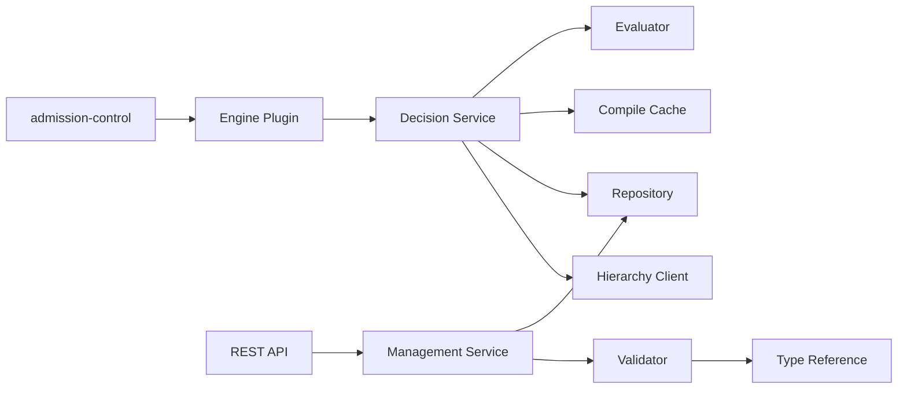
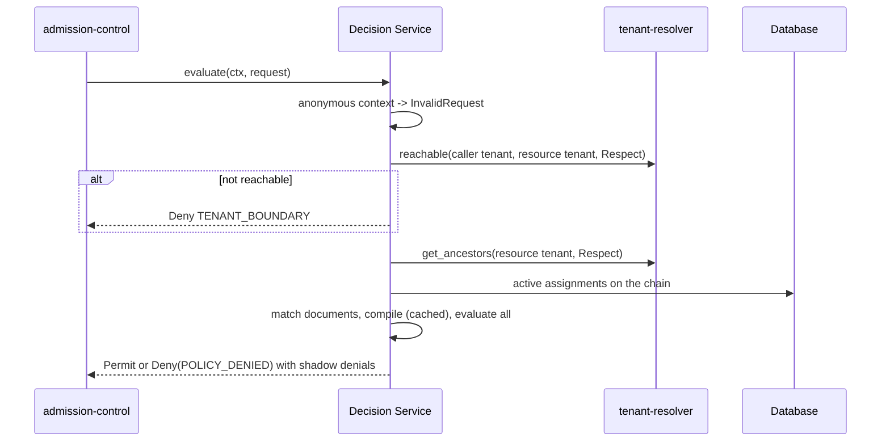
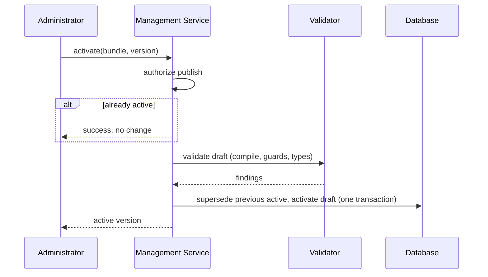

<!-- cpt:
version: 1.0.0
status: draft
module: policy-engine
system: cf
-->

# Technical Design — Policy Engine

<!-- toc -->

- [1. Architecture Overview](#1-architecture-overview)
  - [1.1 Architectural Vision](#11-architectural-vision)
  - [1.2 Architecture Drivers](#12-architecture-drivers)
  - [1.3 Architecture Layers](#13-architecture-layers)
- [2. Principles & Constraints](#2-principles--constraints)
  - [2.1 Design Principles](#21-design-principles)
  - [2.2 Constraints](#22-constraints)
- [3. Technical Architecture](#3-technical-architecture)
  - [3.1 Domain Model](#31-domain-model)
  - [3.2 Component Model](#32-component-model)
  - [3.3 API Contracts](#33-api-contracts)
  - [3.4 Internal Dependencies](#34-internal-dependencies)
  - [3.5 External Dependencies](#35-external-dependencies)
  - [3.6 Interactions & Sequences](#36-interactions--sequences)
  - [3.7 Database schemas & tables](#37-database-schemas--tables)
  - [3.8 Deployment Topology](#38-deployment-topology)
- [4. Additional context](#4-additional-context)
- [5. Traceability](#5-traceability)

<!-- /toc -->

- [ ] `p1` - **ID**: `cpt-cf-policy-engine-design-policy-engine`

## 1. Architecture Overview

### 1.1 Architectural Vision

Policy Engine is a stateless evaluator over a small relational store. Policy content (bundles, versions, documents,
assignments) is written through a management service and read back on every decision; nothing about a decision is
stored. The gear has two surfaces that share only the content: the management API (`PolicyManagementClientV1` in
ClientHub plus REST) and the `admission-control` engine plugin, which is the only decision surface.

A decision resolves the tenant chain through `tenant-resolver` (barriers always respected), loads the active
assignments along it in one indexed query, keeps the documents that match the request's resource type and action,
evaluates all of them on the shared Rego facility under one wall-clock budget, and returns a permit or a denial.
Every error path is a failure, never a permit.

### 1.2 Architecture Drivers

#### Functional Drivers

| Requirement | Design Response |
|-------------|-----------------|
| `cpt-cf-policy-engine-fr-lifecycle-states` | `bundle_version.state` with partial unique indexes `one_active` and `one_draft`; `cpt-cf-policy-engine-component-management` enforces draft-only writes. |
| `cpt-cf-policy-engine-fr-bundle-composition` | `cpt-cf-policy-engine-entity-document`; `deny` entrypoint constant in the SDK; unique `(version_id, name)`. |
| `cpt-cf-policy-engine-fr-content-validation` | `cpt-cf-policy-engine-component-validator`, shared by validate and activate, using `cpt-cf-policy-engine-component-type-reference`. |
| `cpt-cf-policy-engine-fr-tenant-assignment` | `cpt-cf-policy-engine-entity-assignment`; unique `(bundle_id, tenant_id)`; chain query over assignment, bundle and active version. |
| `cpt-cf-policy-engine-fr-inheritance-barriers` | `cpt-cf-policy-engine-component-hierarchy-client` always requests the default `Respect` barrier mode; there is no setting to change it. |
| `cpt-cf-policy-engine-fr-non-enforcing-assignment` | `assignment.enforce` (default true), changed by `update_assignment`. |
| `cpt-cf-policy-engine-fr-admission-engine` | `cpt-cf-policy-engine-component-engine-plugin` registers a GTS plugin instance; no other decision client exists. |
| `cpt-cf-policy-engine-fr-cross-tenant` | `cpt-cf-policy-engine-component-decision` checks reachability of the resource tenant from the caller's tenant first. |
| `cpt-cf-policy-engine-fr-applicable-set` | `cpt-cf-policy-engine-component-matcher` (`GtsId::matches_pattern` plus action list) over the loaded documents. |
| `cpt-cf-policy-engine-fr-active-content-loading` | `BindingSource` reads per request; `cpt-cf-policy-engine-component-compile-cache` keyed by version id. |
| `cpt-cf-policy-engine-fr-evaluation-input` | `cpt-cf-policy-engine-entity-evaluation-input` built from the request and the `SecurityContext`. |
| `cpt-cf-policy-engine-fr-denial-precedence` | `cpt-cf-policy-engine-component-combiner`: denials of enforcing assignments decide; no ordering. |
| `cpt-cf-policy-engine-fr-denial-reason` | `cpt-cf-policy-engine-entity-decision` carries `POLICY_DENIED` and one reference per denying document. |
| `cpt-cf-policy-engine-fr-shadow-denials` | The combiner separates shadow denials; both verdicts carry them through the plugin. |
| `cpt-cf-policy-engine-fr-evaluation-isolation` | `cpt-cf-policy-engine-component-evaluator` on a blocking task under `evaluation_timeout_ms`; shared library guards and denylists; hierarchy and registry calls bounded. |
| `cpt-cf-policy-engine-fr-denial-versus-failure` | `cpt-cf-policy-engine-seq-fail-closed`: `DecisionFailure` maps to `EngineFailure`, distinct from `Deny`. |
| `cpt-cf-policy-engine-fr-admin-authorization` | `cpt-cf-policy-engine-component-management` asks the platform enforcer for one of three permissions per call. |
| `cpt-cf-policy-engine-fr-idempotent-management` | Unique and partial unique indexes turn retries into conflicts; activate and unassign are no-ops when already done. |

#### NFR Allocation

| NFR | Allocated To | Design Response |
|-----|--------------|-----------------|
| `cpt-cf-policy-engine-nfr-fail-closed` | Decision service, plugin | All failures are `EngineFailure`; the gate refuses on any of them; no permissive setting exists. |
| `cpt-cf-policy-engine-nfr-tenant-isolation` | Decision service, management | Reachability check before evaluation; chain limited by barriers; management scoped by the enforcer's constraints. |
| `cpt-cf-policy-engine-nfr-decision-latency` | Decision service | One indexed query, compile cache, default 5 ms evaluation and 20 ms per hierarchy call. |
| `cpt-cf-policy-engine-nfr-availability` | Evaluator | Blocking task with timeout and panic containment; no background tasks. |

#### Key ADRs

None recorded; decisions live in this document.

### 1.3 Architecture Layers

| Layer | Responsibility | Technology |
|-------|----------------|------------|
| API | REST handlers, DTOs, error mapping (`api/rest`) | axum, `OperationBuilder` |
| Domain | Management service, decision service, matching, combining, validation, compile cache | Rust |
| Infrastructure | Repositories and migration, tenant-resolver and types-registry adapters, metrics | `toolkit-db` (SecureORM), OpenTelemetry |
| SDK | Management client, models, reason codes, GTS ids and permissions | `policy-engine-sdk` |

- [ ] `p2` - **ID**: `cpt-cf-policy-engine-tech-stack`

Policy language and compile, guards, denylists and timeout come from `toolkit-policy-evaluation` (regorus, pinned).

## 2. Principles & Constraints

### 2.1 Design Principles

#### Content Is Immutable Once Active

- [ ] `p1` - **ID**: `cpt-cf-policy-engine-principle-immutable-content`

Only drafts change, so a compiled version can be cached by id forever.

#### The Caller Supplies the Facts

- [ ] `p1` - **ID**: `cpt-cf-policy-engine-principle-caller-supplied-context`

Policy sees the request's properties and the `SecurityContext` subject; the gear fetches nothing else.

#### Semantics in the Gear, Language in the Library

- [ ] `p1` - **ID**: `cpt-cf-policy-engine-principle-semantics-in-gear`

The shared library compiles and runs Rego; assignment, matching, enforcement and combining belong to this gear.

#### Management and Decision Do Not Share a Path

- [ ] `p2` - **ID**: `cpt-cf-policy-engine-principle-surface-separation`

Management is authorized by permissions and transactional; decisions are authorized by the gateway's trust and read only.

#### Fail Closed

- [ ] `p1` - **ID**: `cpt-cf-policy-engine-principle-fail-closed`

No well-founded answer means a failure, which the gate turns into a refusal.

### 2.2 Constraints

#### The Expression Library Is a Hard Dependency

- [ ] `p1` - **ID**: `cpt-cf-policy-engine-constraint-expression-library`

All compilation and evaluation go through `toolkit-policy-evaluation`; the regorus version stays pinned exactly.

#### Tenant Hierarchy Is Owned Elsewhere

- [ ] `p1` - **ID**: `cpt-cf-policy-engine-constraint-hierarchy-external`

Ancestry and reachability come from `tenant-resolver` on every request; there is no hierarchy cache.

#### Evaluation Is In-Process and Capability-Free

- [ ] `p1` - **ID**: `cpt-cf-policy-engine-constraint-in-process-evaluation`

Rego sees `input` and a timestamp only: no network, file, environment or randomness builtins.

#### Database Objects Carry the Gear Namespace

- [ ] `p2` - **ID**: `cpt-cf-policy-engine-constraint-db-namespace`

Tables and indexes are prefixed `policy_engine__`; Postgres and SQLite are supported, MySQL is refused.

## 3. Technical Architecture

### 3.1 Domain Model

| Entity | Fields |
|--------|--------|
| Bundle | id, owner_tenant_id, name, description, created_at, created_by, updated_at, active_version_id |
| Version | id, bundle_id, ordinal, state (draft, active, superseded), created_at, activated_at, activated_by, documents |
| Document | id, name, content, resource_types, actions |
| Assignment | id, bundle_id, tenant_id, owner_tenant_id, enforce, created_at, updated_at |

- [ ] `p1` - **ID**: `cpt-cf-policy-engine-entity-bundle`
- [ ] `p1` - **ID**: `cpt-cf-policy-engine-entity-bundle-version`
- [ ] `p1` - **ID**: `cpt-cf-policy-engine-entity-document`
- [ ] `p1` - **ID**: `cpt-cf-policy-engine-entity-assignment`
- [ ] `p1` - **ID**: `cpt-cf-policy-engine-entity-evaluation-input`
- [ ] `p1` - **ID**: `cpt-cf-policy-engine-entity-decision`

Relations: a bundle has many versions (one open draft and one active at most) and many assignments; a version has many
documents. The owner tenant of a bundle defaults to the caller's tenant.

Evaluation input is `{ action, resource: { type, id, tenant_id }, properties, subject: { id, tenant_id } }`. A document
defines `deny`; `true` denies, `false` or undefined does not, anything else is an error.

The decision is a permit or a denial, each with shadow denials. A denial has reason `POLICY_DENIED` and one reference
(bundle id, version id, document id, document name) per denying document, or reason `TENANT_BOUNDARY` and no references.

### 3.2 Component Model

```mermaid
flowchart LR
    GW[admission-control] --> PL[Engine Plugin]
    PL --> DS[Decision Service]
    DS --> HC[Hierarchy Client]
    DS --> RP[Repository]
    DS --> CC[Compile Cache]
    DS --> EV[Evaluator]
    REST[REST API] --> MG[Management Service]
    MG --> VA[Validator]
    VA --> TR[Type Reference]
    MG --> RP
```

#### Engine Plugin

- [ ] `p1` - **ID**: `cpt-cf-policy-engine-component-engine-plugin`

Implements `AdmissionEnginePluginClientV1` over the decision service and registers the GTS plugin instance (vendor and
priority from config). Maps a permit, a denial and each failure kind to the SDK types; failure details are fixed strings.

#### Decision Service

- [ ] `p1` - **ID**: `cpt-cf-policy-engine-component-decision`

Runs the decision path of 3.6. Holds no state beyond the compile cache; reports evaluation count, latency and cache hits as metrics.

#### Matcher

- [ ] `p1` - **ID**: `cpt-cf-policy-engine-component-matcher`

Decides whether a document applies: its `resource_types` pattern matches the request type and `actions` is empty or contains the action.

#### Evaluator

- [ ] `p1` - **ID**: `cpt-cf-policy-engine-component-evaluator`

Evaluates every applicable document on a blocking task under the evaluation timeout; any error fails the whole request.

#### Combiner

- [ ] `p1` - **ID**: `cpt-cf-policy-engine-component-combiner`

Sorts document results into denials (enforcing assignments) and shadow denials (non-enforcing); any denial denies.

#### Compile Cache

- [ ] `p2` - **ID**: `cpt-cf-policy-engine-component-compile-cache`

Bounded in-memory map from version id to compiled documents; the oldest entry leaves when full; never invalidated.

#### Validator

- [ ] `p1` - **ID**: `cpt-cf-policy-engine-component-validator`

Shared by validate and activate: content limits, unique names, compile and guards, denylist screen, pattern syntax and
known concrete types. Every finding names its document; no check stops the others.

#### Type Reference Resolver

- [ ] `p2` - **ID**: `cpt-cf-policy-engine-component-type-reference`

Answers which concrete type ids exist in `types-registry` under `registry_timeout_ms`; an outage fails the call and is never read as absence.

#### Management Service

- [ ] `p1` - **ID**: `cpt-cf-policy-engine-component-management`

Bundle, version and assignment operations, each authorized for one of three permissions, run in a transaction.
Enforces draft-only writes, limits, and the barrier-respecting reachability of an assignment's target tenant.
Creating a draft may seed its documents from an existing version of the same bundle.

#### Content Repository

- [ ] `p1` - **ID**: `cpt-cf-policy-engine-component-repository`

`SecureConn` and `AccessScope` access to the four tables; also serves the decision path's active-assignments read, one
indexed query per request on a fresh connection.

#### Hierarchy Client

- [ ] `p1` - **ID**: `cpt-cf-policy-engine-component-hierarchy-client`

Adapter over `tenant-resolver` for `get_ancestors` and reachability, always with barrier mode `Respect` for decisions and
assignments; each call bounded by `hierarchy_timeout_ms`.

#### REST API

- [ ] `p1` - **ID**: `cpt-cf-policy-engine-component-rest`

`OperationBuilder` routes, all authenticated with standard errors; DTOs kept apart from SDK models; RFC 9457 problems.

### 3.3 API Contracts

#### Policy Management Client

Realizes `cpt-cf-policy-engine-interface-management-client`.

`PolicyManagementClientV1`: create, get, list and update bundle; create draft, get, list, replace, delete, validate and
activate version; assign, get, update (`enforce` only) and unassign assignment. Errors are canonical errors with
reason codes `VERSION_NOT_DRAFT`, `CONCURRENT_CHANGE`, `VALIDATION_FAILED`, `BUNDLE_NAME_TAKEN`, `DRAFT_EXISTS`,
`ASSIGNMENT_EXISTS`, `SEED_NOT_IN_BUNDLE`, `CONTENT_LIMIT_EXCEEDED`, `CAPABILITY_DENIED`, `TENANT_BOUNDARY`.

Permissions `gts.cf.toolkit.authz.permission.v1~cf.core.policy_engine.{read,author,publish}.v1`: `read` reads content;
`author` creates and updates bundles and creates, replaces, deletes and validates drafts; `publish` activates, assigns, updates
assignments and unassigns.

#### Policy Administration REST API

Realizes `cpt-cf-policy-engine-interface-rest-api`.

| Method | Path | Operation |
|--------|------|-----------|
| POST, GET | `/policy-engine/v1/bundles` | create, list bundle |
| GET, PATCH | `/policy-engine/v1/bundles/{id}` | get, update bundle |
| POST, GET | `/policy-engine/v1/bundles/{id}/versions` | create draft, list versions |
| GET, PUT, DELETE | `/policy-engine/v1/bundles/{id}/versions/{version}` | get, replace draft, delete draft |
| POST | `.../versions/{version}/validate`, `.../activate` | validate, activate |
| POST | `/policy-engine/v1/assignments` | assign |
| GET, PATCH, DELETE | `/policy-engine/v1/assignments/{id}` | get, update `enforce`, unassign |

List endpoints use standard toolkit OData paging only. No decision endpoint exists.

#### Provided and consumed contracts

Provided: `AdmissionEnginePluginClientV1::evaluate`, scoped to the GTS instance
`gts.cf.toolkit.plugins.plugin.v1~cf.core.admission_control.engine.v1~cf.core.policy_engine.engine.v1`; resource types
`cf.core.policy_engine.{bundle,bundle_version,assignment}.v1~`; the three permission instances. Consumed: tenant-resolver
ancestry and reachability.

### 3.4 Internal Dependencies

| Dependency | Use |
|------------|-----|
| `admission-control-sdk` | Plugin trait, `EngineRequest`, `EngineResult`, `EngineFailure`, `PolicyReference` |
| `toolkit-policy-evaluation` | Rego compile, guards, denylists, timeout |
| `policy-engine-sdk` | Management client, models, GTS ids, reason codes |

### 3.5 External Dependencies

| Dependency | Use |
|------------|-----|
| `tenant-resolver` | Ancestor chain and reachability (`Respect`) |
| `types-registry` | Concrete type id existence at validate and activate |
| `authz-resolver` | Management permission decisions |
| `toolkit-db` | Postgres or SQLite |

### 3.6 Interactions & Sequences

#### Evaluate a Request

**ID**: `cpt-cf-policy-engine-seq-admit-operation`

**Use cases**: `cpt-cf-policy-engine-usecase-admit-operation`

**Actors**: `cpt-cf-policy-engine-actor-admission-gateway`, `cpt-cf-policy-engine-actor-hierarchy-provider`

```mermaid
sequenceDiagram
    participant G as admission-control
    participant P as Decision Service
    participant H as tenant-resolver
    participant D as Database
    G ->> P: evaluate(ctx, request)
    P ->> P: anonymous context -> InvalidRequest
    P ->> H: reachable(caller tenant, resource tenant, Respect)
    alt not reachable
        P -->> G: Deny TENANT_BOUNDARY
    end
    P ->> H: get_ancestors(resource tenant, Respect)
    P ->> D: active assignments on the chain
    P ->> P: match documents, compile (cached), evaluate all
    P -->> G: Permit or Deny(POLICY_DENIED) with shadow denials
```

**Description**: The caller's tenant must be the resource tenant or an ancestor of it. The chain is the resource tenant
and its ancestors up to the first barrier, all tenant statuses included. Documents of the active versions of assigned
bundles that match the type and action are evaluated on a blocking task. A denial of an enforcing assignment denies;
a denial of a non-enforcing one is a shadow denial. Any evaluation error is a failure.

#### Activate a Bundle Version

**ID**: `cpt-cf-policy-engine-seq-activate-bundle`

**Use cases**: `cpt-cf-policy-engine-usecase-activate-bundle`

**Actors**: `cpt-cf-policy-engine-actor-policy-author`, `cpt-cf-policy-engine-actor-tenant-policy-admin`

```mermaid
sequenceDiagram
    participant A as Administrator
    participant M as Management Service
    participant V as Validator
    participant D as Database
    A ->> M: activate(bundle, version)
    M ->> M: authorize publish
    alt already active
        M -->> A: success, no change
    end
    M ->> V: validate draft (compile, guards, types)
    V -->> M: findings
    M ->> D: supersede previous active, activate draft (one transaction)
    M -->> A: active version
```

**Description**: Activation re-runs validation; findings refuse it with `VALIDATION_FAILED`. The swap is one transaction,
so `one_active` holds.

#### Fail-Closed Handling

**ID**: `cpt-cf-policy-engine-seq-fail-closed`

**Actors**: `cpt-cf-policy-engine-actor-admission-gateway`

**Description**: Hierarchy or database unavailability is `Unavailable`; a hierarchy timeout or an evaluation timeout is
`Timeout`; a version that does not compile, a failed evaluation task or a rule result that is not boolean is `Internal`;
an anonymous context is `InvalidRequest`. None is returned as a permit; the gateway refuses.

### 3.7 Database schemas & tables

- [ ] `p1` - **ID**: `cpt-cf-policy-engine-db-policy-engine`

One migration (`m20260923_000001_initial`) creates four tables, all prefixed `policy_engine__`.

#### Table: bundle

**ID**: `cpt-cf-policy-engine-dbtable-bundle`

| Column | Type |
|--------|------|
| id | uuid, pk |
| owner_tenant_id | uuid |
| name | text |
| description | text, nullable |
| created_at, updated_at | timestamptz |
| created_by | uuid |

Unique `(owner_tenant_id, name)`.

#### Table: bundle_version

**ID**: `cpt-cf-policy-engine-dbtable-bundle-version`

| Column | Type |
|--------|------|
| id | uuid, pk |
| bundle_id | uuid, fk bundle (restrict) |
| owner_tenant_id | uuid |
| ordinal | integer |
| state | smallint (draft, active, superseded) |
| created_at | timestamptz |
| activated_at | timestamptz, nullable |
| activated_by | uuid, nullable |

Unique `(bundle_id, ordinal)`; partial unique on `bundle_id` where state is active (`one_active`) and where state is draft (`one_draft`).

#### Table: document

**ID**: `cpt-cf-policy-engine-dbtable-document`

| Column | Type |
|--------|------|
| id | uuid, pk |
| version_id | uuid, fk bundle_version (cascade) |
| owner_tenant_id | uuid |
| name | text |
| content | text |
| resource_types | json |
| actions | json |

Unique `(version_id, name)`.

#### Table: assignment

**ID**: `cpt-cf-policy-engine-dbtable-assignment`

| Column | Type |
|--------|------|
| id | uuid, pk |
| bundle_id | uuid, fk bundle (restrict) |
| tenant_id | uuid |
| owner_tenant_id | uuid |
| enforce | boolean |
| created_at, updated_at | timestamptz |

Unique `(bundle_id, tenant_id)`; indexes on `tenant_id` and on `bundle_id`.

### 3.8 Deployment Topology

- [ ] `p2` - **ID**: `cpt-cf-policy-engine-topology-in-process`

In-process with `admission-control`, sharing one runtime and calling through ClientHub. Enable with the `policy-engine`
feature; wiring it into the gate also needs the gate's `engine` selection with the same vendor.

## 4. Additional context

Configuration (`deny_unknown_fields`, defaults): `engine_plugin { vendor "constructorfabric", priority 100 }`,
`evaluation_timeout_ms` 5, `hierarchy_timeout_ms` 20, `registry_timeout_ms` 500, `compile_cache_capacity` 256,
`max_documents_per_version` 256, `max_document_bytes` 65536, plus the database section. Zero values and a blank vendor
fail startup. Metrics: evaluations by outcome, evaluation latency, compile-cache hits and misses. The gear is ready once
initialised and runs no background tasks. Denied, failed and invalid are distinct at the plugin boundary; refusal
events are published by `admission-control`, not here.

## 5. Traceability

- **PRD**: [PRD.md](./PRD.md)
