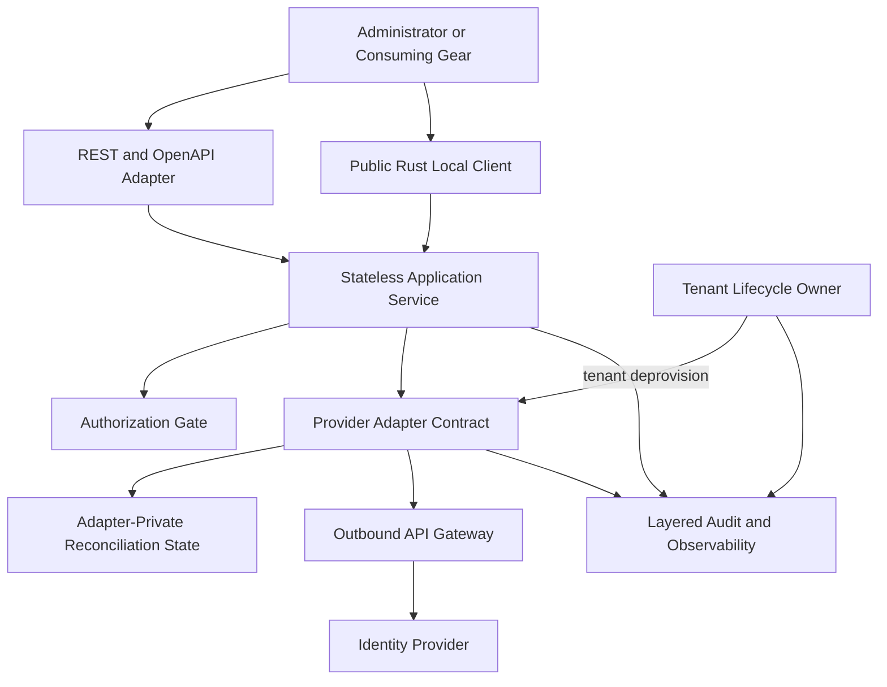
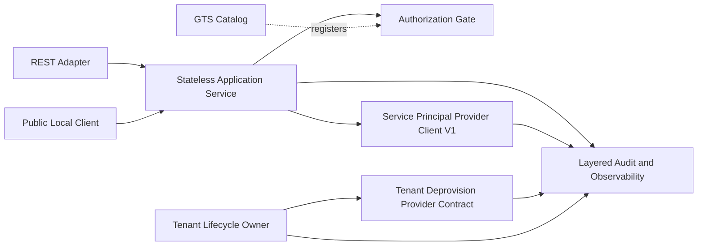
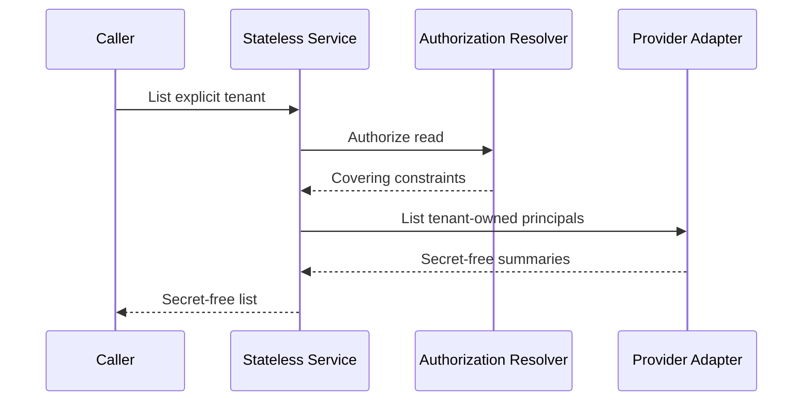
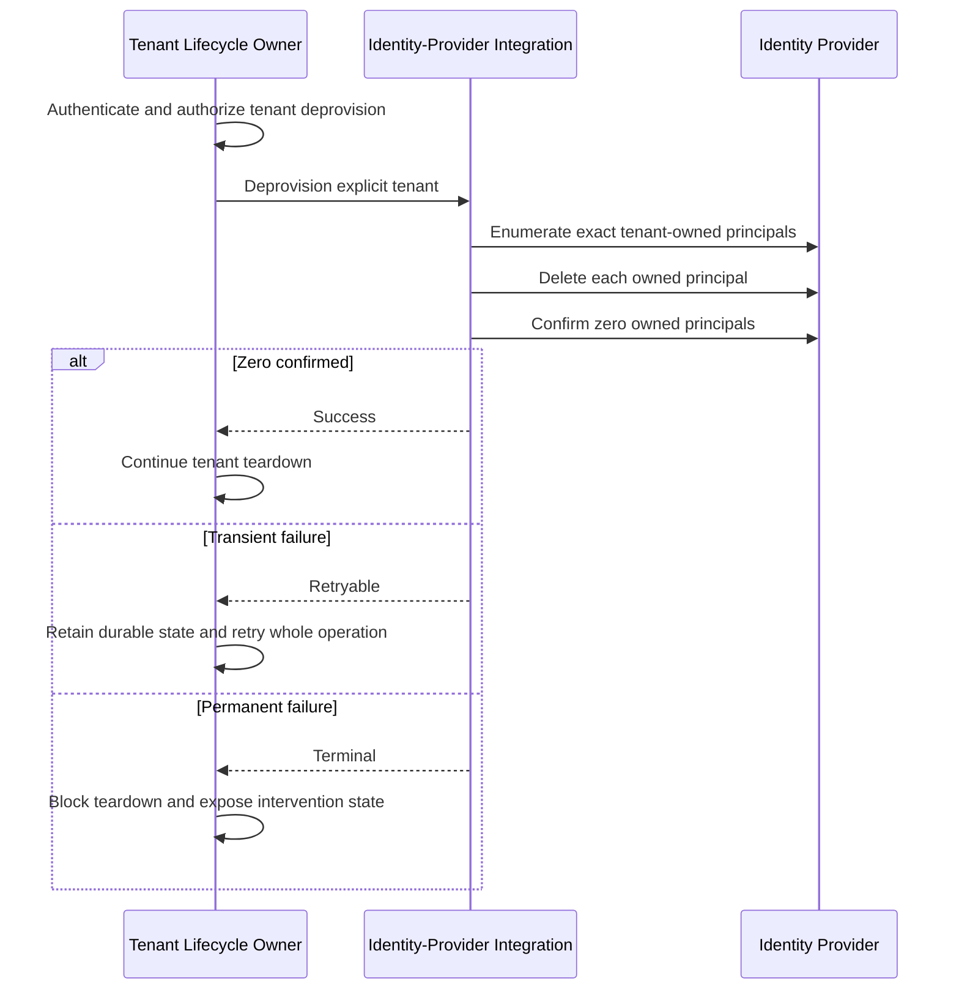
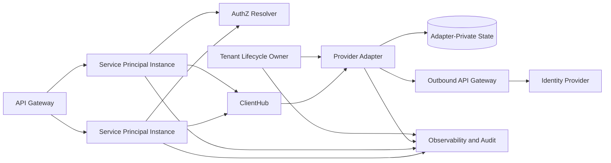

Created: 2026-08-07 by Constructor Studio

# Technical Design — Service Principal

<!-- toc -->

- [1. Architecture Overview](#1-architecture-overview)
  - [1.1 Architectural Vision](#11-architectural-vision)
  - [1.2 Architecture Drivers](#12-architecture-drivers)
  - [1.3 Architecture Layers](#13-architecture-layers)
- [2. Principles & Constraints](#2-principles--constraints)
  - [2.1 Design Principles](#21-design-principles)
  - [2.2 Constraints](#22-constraints)
- [3. Technical Architecture](#3-technical-architecture)
  - [3.1 Domain Model](#31-domain-model)
  - [3.2 Component Model](#32-component-model)
  - [3.3 API Contracts](#33-api-contracts)
  - [3.4 Internal Dependencies](#34-internal-dependencies)
  - [3.5 External Dependencies](#35-external-dependencies)
  - [3.6 Interactions & Sequences](#36-interactions--sequences)
  - [3.7 Database Schemas & Tables](#37-database-schemas--tables)
  - [3.8 Deployment Topology](#38-deployment-topology)
- [4. Additional Context](#4-additional-context)
  - [4.1 Failure Taxonomy and Wire Safety](#41-failure-taxonomy-and-wire-safety)
  - [4.2 Operation-Key Reconciliation](#42-operation-key-reconciliation)
  - [4.3 Configuration](#43-configuration)
  - [4.4 Security and Data Protection](#44-security-and-data-protection)
  - [4.5 Auditability and Observability](#45-auditability-and-observability)
  - [4.6 Fault Tolerance](#46-fault-tolerance)
  - [4.7 Testability and Verification](#47-testability-and-verification)
  - [4.8 Compliance and Privacy Posture](#48-compliance-and-privacy-posture)
  - [4.9 Migration Impact](#49-migration-impact)
  - [4.10 Assumptions and Baseline Deviations](#410-assumptions-and-baseline-deviations)
  - [4.11 Explicit Non-Applicability](#411-explicit-non-applicability)
- [5. Traceability](#5-traceability)
  - [Requirement Allocation Summary](#requirement-allocation-summary)

<!-- /toc -->

- [ ] `p1` - **ID**: `cpt-cf-service-principal-design-provider-neutral-lifecycle`

## 1. Architecture Overview

### 1.1 Architectural Vision

Service Principal is a stateless system gear for managing tenant-owned machine identities. It exposes stable REST and Rust contracts for create, list, rotate, and revoke. It authenticates and authorizes every request for an explicit tenant, applies provider-neutral policy, delegates to one configured identity-provider adapter, and maps the result to safe public responses.

The identity provider remains authoritative for principals, credentials, verifier material, and token issuance. The adapter owns any durable state needed to reconcile create or rotation after an uncertain provider result. Service Principal owns no principal database, operation repository, cleanup record, lease, retry scheduler, or background worker.

Create and rotate require a caller-generated operation key. Service Principal validates and forwards the opaque key and canonical request identity. A repeated identical request with the same key is the only public reconciliation path. There is no recovery-status API, server-generated operation identifier, or public reconciliation handle. Plaintext credentials are returned only by a confirmed create or rotation response and are never persisted or replayed.

Tenant cleanup is part of the identity-provider tenant-deprovision contract, not the Service Principal API. The tenant lifecycle owner retains durable deprovision state and retries the whole operation after transient failure. The provider adapter deletes only principals authoritatively owned by the target tenant and returns success only after confirming that none remain.

This multi-owner design is shown explicitly in the component and sequence diagrams. The diagrams are warranted because request authorization, provider reconciliation, and tenant cleanup have different state and retry owners.

### 1.2 Architecture Drivers

#### Functional Drivers

| Requirement | Design Response |
|-------------|-----------------|
| `cpt-cf-service-principal-fr-create` | The application service authorizes the explicit tenant and delegates a keyed create to the provider adapter. |
| `cpt-cf-service-principal-fr-client-credentials-only` | The provider contract accepts only confidential `client_credentials` identity requests. |
| `cpt-cf-service-principal-fr-identity-context` | Provider conformance verifies tenant, subject, and service identity in issued tokens. |
| `cpt-cf-service-principal-fr-name-policy` | Typed configuration supplies bounded name rules checked before provider invocation. |
| `cpt-cf-service-principal-fr-scope-allowlist` | The application service rejects scopes outside the deployment allowlist. |
| `cpt-cf-service-principal-fr-tenant-quota` | Provider-owned inventory supplies the observed count for best-effort quota checks. |
| `cpt-cf-service-principal-fr-create-collision` | A collision is invalid input; create never adopts or modifies the occupied principal. |
| `cpt-cf-service-principal-fr-list` | Listing delegates after tenant authorization and returns provider-authoritative summaries. |
| `cpt-cf-service-principal-fr-secret-free-listing` | Summary models have no secret field and are distinct from credential models. |
| `cpt-cf-service-principal-fr-ownership-addressing` | Item operations use `(tenant_id, client_id)` and do not distinguish foreign from absent principals publicly. |
| `cpt-cf-service-principal-fr-rotate-secret` | Keyed rotation returns one transient credential result after confirmed invalidation. |
| `cpt-cf-service-principal-fr-rotate-complete-state` | The adapter verifies tenant ownership and managed state before rotation. |
| `cpt-cf-service-principal-fr-revoke` | Revocation uses a tenant-qualified provider address and confirms deletion or absence. |
| `cpt-cf-service-principal-fr-revoke-idempotent` | Provider not-found is success-equivalent for revoke. |
| `cpt-cf-service-principal-fr-authenticated-management` | REST routes are authenticated and Rust operations require `SecurityContext`. |
| `cpt-cf-service-principal-fr-independent-permissions` | GTS permissions define create, read, rotate-secret, and revoke independently. |
| `cpt-cf-service-principal-fr-tenant-authorization` | `PolicyEnforcer` evaluates the target tenant and the service verifies covering constraints. |
| `cpt-cf-service-principal-fr-authz-fail-closed` | Missing identity, denial, evaluation failure, or mismatched constraints prevents provider access. |
| `cpt-cf-service-principal-fr-provider-delegation` | A major-versioned provider SDK isolates provider-specific behavior. |
| `cpt-cf-service-principal-fr-provider-required` | Missing provider registration maps to provider unavailable; success is never simulated. |
| `cpt-cf-service-principal-fr-failure-categories` | Adapter outcomes map to the closed public taxonomy and canonical errors. |
| `cpt-cf-service-principal-fr-ambiguous-create-recovery` | Same-key create retries reconcile in the adapter before any further mutation. |
| `cpt-cf-service-principal-fr-ambiguous-rotate-recovery` | Same-key rotation retries reconcile; lost credentials are replaced by a new confirmed rotation. |
| `cpt-cf-service-principal-fr-ambiguous-revoke-recovery` | Revoke remains safely repeatable until deletion or absence is confirmed. |
| `cpt-cf-service-principal-fr-tenant-cleanup` | The identity-provider tenant-deprovision path performs cleanup while the lifecycle owner retains retry state. |

#### NFR Allocation

| NFR ID | Allocated To | Design Response | Verification Approach |
|--------|--------------|-----------------|----------------------|
| `cpt-cf-service-principal-nfr-secret-confidentiality` | Credential models, REST adapter, logging policy | Credential responses are non-cacheable and secret values are absent from all other contracts. | Secret-negative unit, route, conformance, and E2E tests |
| `cpt-cf-service-principal-nfr-data-classification` | SDK models, adapter contract, audit boundary | Contract fields are classified; human profile fields are excluded. | Contract inspection and security review |
| `cpt-cf-service-principal-nfr-no-secret-persistence` | Stateless service and adapter conformance | Service Principal persists nothing; adapters never retain credential responses for replay. | State-boundary inspection and secret-negative tests |
| `cpt-cf-service-principal-nfr-tenant-isolation` | Authorization gate and provider adapter | PDP constraints cover the target tenant and provider addressing is tenant-qualified. | Cross-tenant security suite |
| `cpt-cf-service-principal-nfr-credential-invalidation` | Provider adapter | Rotation and revoke success require superseded credentials to stop working. | Provider conformance and E2E tests |
| `cpt-cf-service-principal-nfr-provider-conformance` | Provider SDK and conformance harness | Every adapter runs common lifecycle, ownership, reconciliation, and credential checks. | Mandatory adapter suite |
| `cpt-cf-service-principal-nfr-contract-compatibility` | REST V1 and Rust V1 contracts | Breaking route, model, identifier, or category changes require a new major version. | API and SDK compatibility checks |
| `cpt-cf-service-principal-nfr-auditability` | Service, adapter, and tenant lifecycle owner | Each layer records the facts it owns under shared correlation and tenant identity. | Layered audit-completeness tests |
| `cpt-cf-service-principal-nfr-observability` | Service, adapter, and tenant lifecycle owner | API, reconciliation, and cleanup signals remain separated and correlatable. | Telemetry integration tests |
| `cpt-cf-service-principal-nfr-stateless-recovery` | Provider adapter contract | Adapter reconciliation survives restart; Service Principal owns no durable state. | Restart and same-key retry tests |
| `cpt-cf-service-principal-nfr-cleanup-reliability` | Tenant lifecycle owner and identity-provider integration | Lifecycle state survives restart and teardown remains blocked until zero principals are confirmed. | Deprovision retry and terminal-failure tests |
| `cpt-cf-service-principal-nfr-performance-baseline` | Benchmark harness | Release evidence supplies measured objectives instead of invented values. | Versioned benchmark report |
| `cpt-cf-service-principal-nfr-operational-documentation` | OpenAPI and operator guidance | Guidance covers secret handoff, same-key retry, rotation recovery, cleanup ownership, and alerts. | Release-readiness inspection |

### 1.3 Architecture Layers



- [ ] `p1` - **ID**: `cpt-cf-service-principal-tech-layered-control-plane`

| Layer | Responsibility | Technology |
|-------|----------------|------------|
| Presentation | Authenticated routing, DTO conversion, `Idempotency-Key`, non-cacheable credential responses, canonical errors | Axum, `OperationBuilder`, OpenAPI |
| Application | Validation, explicit-tenant authorization, provider delegation, public outcome mapping | Rust domain service, `PolicyEnforcer`, ClientHub |
| Domain | Stable lifecycle models, operation-key binding, failure semantics | Rust SDK and domain models |
| Provider integration | Provider protocol, authoritative state access, restart-safe reconciliation, tenant purge implementation | Provider adapter, adapter-private state, OAGW |
| Tenant lifecycle | Durable deprovision operation, cleanup retry scheduling, terminal disposition | Tenant lifecycle contract and owner |

## 2. Principles & Constraints

### 2.1 Design Principles

#### Provider Authority

- [ ] `p1` - **ID**: `cpt-cf-service-principal-principle-provider-authority`

The identity provider is the sole authority for principal existence, credentials, verifier material, and token behavior. Service Principal does not copy provider inventory or retain reconciliation state.

#### One-Time Secret Boundary

- [ ] `p1` - **ID**: `cpt-cf-service-principal-principle-one-time-secret`

Plaintext credentials cross the public boundary only after confirmed create or rotation. Lost credentials are replaced through a new rotation and are never retrieved or replayed.

#### Authorize the Explicit Tenant

- [ ] `p1` - **ID**: `cpt-cf-service-principal-principle-explicit-tenant-authorization`

Every public request and same-key retry re-authenticates and authorizes its explicit target tenant before provider access. Prior authorization stored by another component never substitutes for the current decision.

#### Stateless Recovery Boundary

- [ ] `p1` - **ID**: `cpt-cf-service-principal-principle-safe-recovery`

Service Principal forwards operation identity but owns no recovery execution. The adapter reconciles create and rotation before mutation. Revoke converges through repeated tenant-qualified deletion. Tenant cleanup converges through lifecycle-owned deprovision retries.

#### Stable Contracts, Replaceable Providers

- [ ] `p1` - **ID**: `cpt-cf-service-principal-principle-versioned-contracts`

Public and provider contracts are major-versioned and provider-neutral. Unknown result categories are always non-success and behave as ambiguous when mutation cannot be ruled out.

### 2.2 Constraints

#### One Provider per Deployment

- [ ] `p1` - **ID**: `cpt-cf-service-principal-constraint-single-provider`

The initial design resolves one provider adapter for the deployment. Selection does not vary by tenant or request. Missing registration is an explicit provider-unavailable failure.

#### No Distributed Transaction

- [ ] `p1` - **ID**: `cpt-cf-service-principal-constraint-no-distributed-transaction`

Service Principal and the external identity provider do not share a transaction. Mutation uncertainty is represented by the adapter outcome and reconciled under the same operation key.

#### Provider Capability Floor

- [ ] `p1` - **ID**: `cpt-cf-service-principal-constraint-provider-capabilities`

A conforming adapter supports confidential client credentials, tenant-qualified ownership, immediate invalidation, collision detection, restart-safe keyed reconciliation, safe failure classification, and authoritative tenant-principal cleanup through the tenant-deprovision integration.

#### Bounded Administrative Workload

- [ ] `p2` - **ID**: `cpt-cf-service-principal-constraint-bounded-workload`

Lifecycle calls are low-frequency administrative operations. Initial listing is unpaginated and bounded by the configured tenant quota. Pagination and strong quota serialization require measured evidence and a compatible contract extension.

## 3. Technical Architecture

### 3.1 Domain Model

**Technology**: GTS identifiers and transport-neutral Rust models

**Location**: `gears/system/service-principal/service-principal-sdk/src/`

- [ ] `p1` - **ID**: `cpt-cf-service-principal-entity-lifecycle-model`

| Entity | Description | Security Classification |
|--------|-------------|-------------------------|
| Create Request | Explicit tenant, bounded name, allowed scopes, and `OperationKey` | Security-sensitive control-plane metadata |
| Rotate Request | Tenant-qualified principal and `OperationKey` | Security-sensitive control-plane metadata |
| Service Principal Credentials | Client ID, one-time secret, token endpoint, stable subject ID | Secret is restricted; other fields are security-sensitive |
| Service Principal Summary | Client ID, enabled state, scopes, stable subject when supported | Security-sensitive; never contains a secret |
| Canonical Request Identity | Versioned identity of tenant, operation, and normalized non-secret input | Security-sensitive reconciliation metadata |
| Provider Outcome | Stable category, mutation certainty, safe remediation, and optional confirmed principal identity | Security-sensitive operational metadata |
| Provider Proof Classification | Adapter-private `exact_binding`, `authoritative_absence`, or `inconclusive` result | Security-sensitive adapter metadata; not public wire data |
| Audit Fact | Actor, tenant, action, time, correlation, and outcome | Security-sensitive audit metadata |

Relationships are bounded as follows:

- An operation key is bound to one tenant, operation kind, and canonical request identity.
- Credential models are returned only by confirmed create and rotation.
- Provider proof classification maps to a public category and remediation without exposing provider evidence.
- Service Principal retains none of these entities after request completion.

### 3.2 Component Model



#### REST and OpenAPI Adapter

- [ ] `p1` - **ID**: `cpt-cf-service-principal-component-rest-adapter`

**Purpose**: Expose the stable HTTP contract while keeping HTTP types outside domain and SDK layers.

**Responsibilities**:

- Register the four routes with `OperationBuilder`.
- Require authentication and standard errors.
- Require `Idempotency-Key` for create and rotate.
- Convert DTOs and apply `Location` and `Cache-Control: no-store` where required.
- Render canonical RFC-9457 Problems without provider diagnostics.

**Boundaries**: It does not authorize, call the provider directly, persist state, expose status endpoints, or log credential-bearing bodies.

#### Public Rust Local Client

- [ ] `p1` - **ID**: `cpt-cf-service-principal-component-public-client`

**Purpose**: Give trusted gears the same four operations without REST coupling.

**Responsibilities**: Propagate `SecurityContext`, explicit tenant identity, and `OperationKey` for create and rotate; delegate to the application service; map domain failures to the closed public taxonomy.

**Boundaries**: It exposes no provider client, cleanup method, recovery lookup, retry scheduler, or provider proof model.

#### Application Service

- [ ] `p1` - **ID**: `cpt-cf-service-principal-component-application-service`

**Purpose**: Enforce public lifecycle policy before provider access.

**Responsibilities**:

- Validate names, scopes, quota policy, operation keys, and tenant-qualified addresses.
- Authenticate and authorize the explicit tenant for every call, including same-key retries.
- Derive the versioned canonical non-secret request identity.
- Delegate lifecycle operations and map provider outcomes.
- Return one-time credentials only on confirmed synchronous success.
- Emit request-level audit and telemetry facts.

**Boundaries**: It has no database, durable operation model, cleanup method, worker, provider protocol, or plaintext-secret store.

#### Authorization Gate

- [ ] `p1` - **ID**: `cpt-cf-service-principal-component-authorization-gate`

**Purpose**: Enforce tenant object-level authorization for high-impact machine identities.

**Responsibilities**: Use `PolicyEnforcer` with `owner_tenant_id`, require constraints, and verify that `AccessScope` covers the explicit tenant for `create`, `read`, `rotate_secret`, or `revoke`.

**Boundaries**: It does not authorize tenant deprovisioning, infer tenant ownership from client identifiers, author policy, or expose PDP diagnostics.

#### Provider Boundary

- [ ] `p1` - **ID**: `cpt-cf-service-principal-component-provider-boundary`

**Purpose**: Isolate provider protocol, authoritative state, and reconciliation behavior.

**Responsibilities**:

- Implement create, list, rotate, and revoke for tenant-qualified requests.
- Bind create and rotate operation keys to canonical request identity.
- Reconcile an identical same-key retry before any further mutation.
- Preserve unresolved reconciliation across adapter restart.
- Return stable provider outcomes and safe non-secret remediation data.
- Keep proof evidence, provider identifiers, and private state behind the adapter boundary.

**Boundaries**: It does not make Service Principal authorization decisions, return raw provider diagnostics, expose credential verifier material, or persist plaintext credential responses for replay.

#### Tenant Lifecycle Cleanup Integration

- [ ] `p1` - **ID**: `cpt-cf-service-principal-component-tenant-lifecycle-cleanup`

**Purpose**: Remove tenant-owned principals as part of authoritative tenant deprovisioning.

**Responsibilities**:

- The tenant lifecycle owner authenticates and authorizes deprovisioning and retains durable retry state.
- The identity-provider integration enumerates and deletes only exact tenant-owned principals.
- Already-absent principals are success-equivalent.
- Retryable and terminal failures block subsequent tenant teardown.
- Success requires a final authoritative zero-principal confirmation.

**Boundaries**: Service Principal is not invoked and owns no cleanup API, permission, record, schedule, or status.

#### GTS Resource and Permission Catalog

- [ ] `p1` - **ID**: `cpt-cf-service-principal-component-gts-catalog`

The catalog defines the final managed-resource type `gts.cf.core.service_principal.service_principal.v1~` and final subject classification `gts.cf.core.security.subject_service.v1~`. Both are generated from Rust, registered through Types Registry inventory, and treated as closed V1 classifications.

Permissions are well-known instances of `gts.cf.toolkit.authz.permission.v1~`:

| Permission Instance ID | Action |
|------------------------|--------|
| `gts.cf.toolkit.authz.permission.v1~cf.service_principal._.service_principal_create.v1` | `create` |
| `gts.cf.toolkit.authz.permission.v1~cf.service_principal._.service_principal_read.v1` | `read` |
| `gts.cf.toolkit.authz.permission.v1~cf.service_principal._.service_principal_rotate_secret.v1` | `rotate_secret` |
| `gts.cf.toolkit.authz.permission.v1~cf.service_principal._.service_principal_revoke.v1` | `revoke` |

The catalog defines identifiers, not grants or role assignments. Tenant deprovision authorization belongs to the tenant lifecycle contract and is not a Service Principal permission.

#### Audit and Observability

- [ ] `p1` - **ID**: `cpt-cf-service-principal-component-audit-observability`

**Purpose**: Provide incident-ready attribution and operational signals without secret leakage.

**Responsibilities**: Service Principal emits authorization and public operation outcomes. The adapter emits provider mutation and reconciliation outcomes. The tenant lifecycle owner emits cleanup retries and final tenant disposition. All layers propagate correlation and explicit tenant identity.

**Boundaries**: No layer records plaintext credentials, bearer tokens, raw provider responses, raw operation keys, or tenant/client identifiers as metric labels. Operation-key correlation uses a non-reversible fingerprint.

### 3.3 API Contracts

#### Service Principal REST V1

- [ ] `p1` - **ID**: `cpt-cf-service-principal-interface-rest-v1`

- **Contracts**: `cpt-cf-service-principal-interface-rest`, `cpt-cf-service-principal-contract-authorization`
- **Technology**: REST, JSON, OpenAPI, RFC-9457 Problem Details
- **Location**: Generated from `OperationBuilder` registrations

| Method | Path | Request Requirement | Success |
|--------|------|---------------------|---------|
| `POST` | `/service-principal/v1/tenants/{tenant_id}/service-principals` | `Idempotency-Key` | `201 Created`, `Location`, `Cache-Control: no-store` |
| `GET` | `/service-principal/v1/tenants/{tenant_id}/service-principals` | None beyond authenticated tenant request | `200 OK` |
| `POST` | `/service-principal/v1/tenants/{tenant_id}/service-principals/{client_id}/rotate-secret` | `Idempotency-Key` | `200 OK`, `Cache-Control: no-store` |
| `DELETE` | `/service-principal/v1/tenants/{tenant_id}/service-principals/{client_id}` | None beyond authenticated tenant request | `204 No Content` |

No operation-status, recovery-retry, or tenant-cleanup endpoint is registered. No server operation identifier or reconciliation handle is returned. Platform trace context remains available through canonical errors and response tracing.

A create or rotate retry must repeat the identical request with the same key. Key reuse with another tenant, operation kind, or canonical request identity is invalid input. When reconciliation confirms that the original mutation succeeded but its credential response was lost, the response is a `credentials_unavailable` failed precondition. It contains only safe confirmed identity and remediation and never claims a credential-bearing success.

All routes use `.authenticated()`, explicit license posture, typed schemas, and registered standard errors. Gateway-owned CORS, timeout, compression, tracing, and body-limit middleware are not duplicated.

#### Service Principal Rust SDK V1

- [ ] `p1` - **ID**: `cpt-cf-service-principal-interface-rust-v1`

- **Contracts**: `cpt-cf-service-principal-interface-rust-sdk`
- **Technology**: Async transport-neutral Rust trait registered in ClientHub
- **Location**: `service-principal-sdk`

The public client provides create, list, rotate-secret, and revoke. Every operation accepts `SecurityContext` and an explicit tenant. Create and rotate carry a validated `OperationKey` newtype. The SDK exposes no cleanup, recovery lookup, operation status, or explicit retry method; retry uses the original create or rotate method.

Credential models use redacting secret wrappers and do not support general serialization. Public failures carry one of the six stable categories plus stable safe reason and remediation fields. `credentials_unavailable` is a reason under invalid input/failed precondition, not a seventh category. Unknown wire categories remain non-success and behave as ambiguous when mutation certainty is unavailable.

#### Provider Adapter V1

- [ ] `p1` - **ID**: `cpt-cf-service-principal-interface-provider-v1`

- **Contracts**: `cpt-cf-service-principal-contract-provider-adapter`
- **Technology**: Async transport-neutral Rust provider trait registered in ClientHub
- **Location**: `service-principal-sdk`

The provider client defines create, list, rotate, and revoke. Create and rotate receive the opaque operation key and versioned canonical request identity. Provider outcomes use invalid input, not found, clean failure, or ambiguous outcome; authorization failure and provider unavailability are added by the public service boundary.

The adapter classifies reconciliation evidence internally as `exact_binding`, `authoritative_absence`, or `inconclusive`. Public contracts receive only stable category, reason, safe remediation, and confirmed non-secret identity when applicable. Provider proof material and provider-specific diagnostics never cross the boundary.

#### Tenant Deprovision Contract

- [ ] `p1` - **ID**: `cpt-cf-service-principal-interface-tenant-deprovision`

- **Contracts**: `cpt-cf-service-principal-contract-tenant-cleanup`
- **Technology**: Tenant lifecycle to identity-provider integration contract

The lifecycle owner supplies a validated security context and explicit tenant to the identity-provider tenant-deprovision contract. The integration returns success, success-equivalent absence, retryable failure, or terminal failure. Retry state and scheduling remain in the lifecycle owner. This contract is separate from Provider Adapter V1 and is not exposed through Service Principal REST or Rust APIs.

#### Managed Resource and Permissions

- [ ] `p1` - **ID**: `cpt-cf-service-principal-interface-managed-resource-v1`

| Action | Purpose |
|--------|---------|
| `create` | Mint a tenant-owned machine identity |
| `read` | List tenant-owned principals |
| `rotate_secret` | Replace an existing principal secret |
| `revoke` | Remove a principal or confirm absence |

Boundary identifiers use typed GTS IDs. Types Registry resolves and validates them before authorization or processing; SQL string matching and handler branching on raw GTS strings are prohibited.

### 3.4 Internal Dependencies

| Dependency | Interface Used | Purpose |
|------------|----------------|---------|
| AuthZ Resolver | `PolicyEnforcer` and resolver SDK | Evaluate independent actions and compile tenant constraints |
| Types Registry | GTS inventory registration | Register resource, subject, and permission instances |
| Tenant contracts | Canonical `TenantId` and hierarchy semantics | Preserve tenant identity across boundaries |
| ToolKit runtime | Gear, REST, ClientHub, lifecycle registration | Register routes and public/provider clients |
| Canonical errors | Canonical categories and Problem rendering | Produce safe public errors |
| API Gateway | Authenticated route policy and OpenAPI registry | Authenticate and publish REST contracts |
| Outbound API Gateway | OAGW upstream and route contracts | Apply egress policy and credential isolation to provider HTTP calls |
| Platform observability | Tracing, metrics, and audit delivery | Collect layered correlation and outcomes |

Service Principal has no ToolKit database, migration, Secure ORM, task lease, or stateful-worker dependency. SDK contracts never depend on implementation types. Provider adapters are resolved through ClientHub and are not direct dependencies of consuming gears.

### 3.5 External Dependencies

#### Identity Provider

- **Contract**: `cpt-cf-service-principal-contract-provider-adapter`

Only the adapter translates provider-neutral operations to provider administration calls. All provider HTTP or HTTPS traffic, including token-conformance requests, traverses OAGW with declared upstreams, routes, TLS policy, bounded timeouts, and credential references. A non-HTTP transport requires a separately approved boundary with equivalent controls.

The adapter classifies uncertainty honestly. Timeout after request transmission is ambiguous unless non-mutation is established. The provider owns principal backup, residency, and credential-verifier storage. Adapter qualification is required before a supported release enables it.

#### Tenant Lifecycle Owner

- **Contract**: `cpt-cf-service-principal-contract-tenant-cleanup`

The lifecycle owner owns durable deprovision state, retry scheduling, terminal parking, and final tenant disposition. Its identity-provider integration owns authoritative principal purge behavior. Service Principal has no dependency edge in this path.

### 3.6 Interactions & Sequences

#### Create Workload Identity

**ID**: `cpt-cf-service-principal-seq-create`

```mermaid
sequenceDiagram
    participant C as Caller
    participant S as Stateless Service
    participant Z as Authorization Resolver
    participant P as Provider Adapter

    C->>S: Create tenant, request, Idempotency-Key
    S->>Z: Authorize create for tenant
    Z-->>S: Decision and covering constraints
    S->>P: Create with key and canonical request identity
    alt Confirmed new success
        P-->>S: One-time credentials and subject
        S-->>C: 201, Location, no-store
    else Confirmed prior success, response lost
        P-->>S: Safe confirmed identity, no credential
        S-->>C: credentials_unavailable failed precondition
    else Authoritative absence
        P-->>S: Safe fresh-attempt guidance
        S-->>C: Non-success; new key permitted
    else Inconclusive
        P-->>S: Ambiguous outcome
        S-->>C: Ambiguous; identical same-key retry only
    end
```

The service holds only request-local state. Every retry re-authenticates and re-authorizes before adapter reconciliation. No credential or operation record is written by the gear.

#### Inventory Tenant Principals

**ID**: `cpt-cf-service-principal-seq-list`



#### Rotate Credential

**ID**: `cpt-cf-service-principal-seq-rotate`

```mermaid
sequenceDiagram
    participant C as Caller
    participant S as Stateless Service
    participant Z as Authorization Resolver
    participant P as Provider Adapter

    C->>S: Rotate tenant principal, Idempotency-Key
    S->>Z: Authorize rotate_secret
    Z-->>S: Covering constraints
    S->>P: Rotate with key and canonical request identity
    alt Confirmed new success
        P-->>S: Replacement secret and invalidation confirmation
        S-->>C: Replacement once, no-store
    else Confirmed prior success, response lost
        P-->>S: Safe confirmed identity, no credential
        S-->>C: credentials_unavailable; rotate with new key
    else Inconclusive
        P-->>S: Credential state uncertain
        S-->>C: Ambiguous; identical same-key retry only
    end
```

A caller adopts only credentials received by a confirmed rotation response. The service never delivers a secret asynchronously.

#### Revoke Workload Identity

**ID**: `cpt-cf-service-principal-seq-revoke`

```mermaid
sequenceDiagram
    participant C as Caller
    participant S as Stateless Service
    participant Z as Authorization Resolver
    participant P as Provider Adapter

    C->>S: Revoke tenant-qualified principal
    S->>Z: Authorize revoke
    Z-->>S: Covering constraints
    S->>P: Delete tenant-owned principal
    alt Deleted or absent
        P-->>S: Confirmed success or not found
        S-->>C: 204 No Content
    else Ambiguous
        P-->>S: Mutation uncertain
        S-->>C: Ambiguous; repeat normal revoke
    end
```

Revoke requires no operation key. The caller repeats the tenant-qualified operation until deletion or absence is confirmed.

#### Tenant Deprovision Cleanup

**ID**: `cpt-cf-service-principal-seq-tenant-cleanup`



Service Principal is absent from this sequence. Cleanup and its retries share the durable tenant-deprovision lifecycle.

### 3.7 Database Schemas & Tables

- [ ] `p1` - **ID**: `cpt-cf-service-principal-db-state-ownership`

| State | Durable Owner | Service Principal Access |
|-------|---------------|--------------------------|
| Principal, credential, verifier, token behavior | Identity provider | Through provider adapter only |
| Create/rotation reconciliation binding and outcome | Provider adapter or its provider-native facility | Forward key and canonical request identity; receive safe outcome |
| Tenant-deprovision retry and terminal disposition | Tenant lifecycle owner | None |
| Audit and telemetry retention | Platform observability and owning emitting layer | Emit through platform interfaces |
| Plaintext credential response | No platform persistence owner | Request-local delivery only |

Service Principal declares no schema or table and runs no migration. It does not lease work, retain resolved operations, restore state after restart, or define adapter-private retention. An adapter may use provider-native or private durable storage, but that storage is outside the gear boundary and must satisfy conformance without containing replayable plaintext credential responses.

### 3.8 Deployment Topology

- [ ] `p2` - **ID**: `cpt-cf-service-principal-topology-deployment-neutral`



Instances are horizontally scalable and interchangeable. They require authorization, GTS, ClientHub, canonical error, gateway, and observability wiring. They do not require a database, migration, work lease, or worker readiness probe. Provider availability is reported separately so an outage produces an explicit failure rather than simulated success. Adapter-private reconciliation infrastructure is deployed and operated with the adapter, outside the Service Principal lifecycle.

## 4. Additional Context

### 4.1 Failure Taxonomy and Wire Safety

- [ ] `p1` - **ID**: `cpt-cf-service-principal-design-failure-taxonomy`

| Public Category | Source | Mutation Semantics | Retry Guidance | Canonical Mapping |
|-----------------|--------|--------------------|----------------|-------------------|
| Invalid input | Validation, provider, key mismatch, or `credentials_unavailable` | Current request retains no new state | Change invalid input; use a new rotation key after lost credential response | `InvalidArgument`, HTTP 400; failed precondition reason for `credentials_unavailable` |
| Not found | Provider ownership lookup | No addressed tenant-owned principal | Revoke treats as success-equivalent | `NotFound`, HTTP 404; revoke returns 204 |
| Clean failure | Provider | Provider confirms no new state | Follow safe remediation; a fresh mutation uses a new key | `ServiceUnavailable`, HTTP 503 |
| Ambiguous outcome | Provider after possible mutation | State may have changed | Repeat only the identical request with the same key for create/rotate; repeat revoke normally | `Aborted`, HTTP 409 |
| Authorization failure | Authentication or policy boundary | Provider not invoked | Retry only after identity or authorization changes | Canonical 401, 403, or fail-closed internal error |
| Provider unavailable | Missing adapter or known pre-mutation outage | No provider mutation | Retry according to safe availability guidance | `ServiceUnavailable`, HTTP 503 |

`credentials_unavailable` is a stable reason under invalid input/failed precondition, not a seventh category. It may contain confirmed non-secret principal identity and rotation guidance. It never contains a credential, raw operation key, adapter proof, or provider diagnostic.

Unknown categories remain non-success. If mutation certainty is unavailable, compatibility handling is ambiguous. Provider detail is sanitized before logging and never placed on the public wire.

Tenant cleanup uses the tenant-lifecycle contract's success, success-equivalent absence, retryable, and terminal outcomes. Those outcomes do not extend the Service Principal taxonomy.

### 4.2 Operation-Key Reconciliation

- [ ] `p1` - **ID**: `cpt-cf-service-principal-design-reconciliation`

Create and rotation use these contract rules:

1. The caller supplies `Idempotency-Key` or the Rust `OperationKey` equivalent.
2. Service Principal validates the key, authenticates and authorizes the current caller, derives a canonical non-secret request identity, and forwards both values.
3. The adapter binds the key to tenant, operation kind, and request identity and retains only a non-reversible key fingerprint plus private binding and outcome metadata.
4. An identical same-key retry reconciles before any mutation. A changed tenant, operation, or request identity is invalid input.
5. `exact_binding` maps to safe confirmed identity. If the one-time response was lost, the public result is `credentials_unavailable` and the caller performs a new rotation with a new key.
6. `authoritative_absence` permits a fresh operation with a new key.
7. `inconclusive` remains ambiguous and blocks conflicting mutation.

The adapter's execution mechanism is private. Reconciliation may occur during the repeated request or through adapter-owned background execution. In both cases unresolved behavior survives adapter restart and Service Principal schedules nothing.

No public status lookup exists. No server-generated operation ID or provider proof handle is returned. Platform correlation identifiers continue to correlate request, adapter, and audit records; operation-key telemetry uses only a non-reversible fingerprint.

### 4.3 Configuration

- [ ] `p2` - **ID**: `cpt-cf-service-principal-design-configuration`

Typed Service Principal configuration contains:

- principal name length and accepted character policy;
- allowed client scopes;
- best-effort maximum principals per tenant;
- provider request timeout;
- benchmark-approved deployment envelope once established.

Configuration is explicit under `gears.service-principal.config`. Secrets, provider administrator credentials, worker settings, lease periods, retry schedules, database settings, and reconciliation retention are absent. Provider-adapter and tenant-lifecycle configuration remain owned by those components.

### 4.4 Security and Data Protection

- [ ] `p1` - **ID**: `cpt-cf-service-principal-design-security-boundaries`

Security boundaries are:

1. API Gateway authenticates REST callers and injects `SecurityContext`.
2. Service Principal authorizes the explicit tenant for every public call and retry.
3. The provider adapter accepts only the provider-neutral contract and enforces tenant-qualified ownership against authoritative provider state.
4. The tenant lifecycle owner authorizes deprovisioning; the provider integration deletes only exact tenant-owned principals.
5. The identity provider owns credentials, verifier material, and token issuance.
6. Adapter-private reconciliation contains no plaintext credential response and exposes no provider proof publicly.

Credential values use redacting wrappers until final response conversion. Create and rotation bodies are excluded from logging and tracing. Panic, debug, and error formatting cannot expose secret fields. Credential responses use `Cache-Control: no-store`, and upstream proxies must not cache them. Transport security follows platform TLS and FIPS posture without gear-specific cryptography.

### 4.5 Auditability and Observability

- [ ] `p1` - **ID**: `cpt-cf-service-principal-design-operational-signals`

Audit ownership is layered:

| Layer | Audit and Signal Ownership |
|-------|----------------------------|
| Service Principal | Current caller, target tenant, public action, authorization result, correlation ID, provider invocation status, and public outcome |
| Provider adapter | Provider mutation, reconciliation classification, provider availability, and adapter-private retry state |
| Tenant lifecycle owner | Cleanup attempt, retryable or terminal disposition, initiating/system actor, and final tenant disposition |

Every layer propagates platform correlation and explicit tenant identity. Raw operation keys are excluded; a non-reversible fingerprint may correlate adapter records. Audit content excludes plaintext credentials, bearer tokens, full credential-bearing request bodies, and raw provider responses.

Service Principal metrics include operation latency and count by action and stable public outcome plus provider availability. Adapter metrics include ambiguity, reconciliation age, and adapter execution health. Tenant lifecycle metrics include cleanup retries, terminal failures, and blocked deprovisioning. Service Principal exposes no recovery backlog, cleanup backlog, lease, or worker-health metric. Tenant and principal identifiers are never metric labels.

### 4.6 Fault Tolerance

- [ ] `p1` - **ID**: `cpt-cf-service-principal-design-fault-tolerance`

Service Principal fails closed before provider invocation when authentication, authorization, configuration, or required client resolution fails. A provider result that cannot exclude mutation is ambiguous. Restart loses only transient request context; a caller may reach any instance and repeat the identical keyed request.

The adapter guarantees restart-safe reconciliation and prevents duplicate logical create or rotation mutation under concurrent or repeated same-key requests. Revoke converges through repeated deletion and success-equivalent absence.

Tenant cleanup failure blocks tenant teardown. A retryable result keeps the lifecycle-owned operation eligible for retry after restart. A terminal result parks the lifecycle operation for intervention. No component reports deprovision success before authoritative zero-principal confirmation.

### 4.7 Testability and Verification

- [ ] `p1` - **ID**: `cpt-cf-service-principal-design-test-strategy`

Verification follows the repository test split:

- Unit tests cover policy validation, canonical request identity, operation-key validation, secret redaction, DTO conversion, failure mapping, and permission identifiers.
- Service tests verify authorize-before-provider ordering, re-authorization on retry, tenant-scope mismatch denial, provider absence, idempotent revoke, and absence of persistence or worker dependencies.
- Router tests verify four operations, `Idempotency-Key` on create/rotate, OpenAPI metadata, `Location`, `no-store`, `credentials_unavailable`, RFC-9457 shape, and absence of recovery/status/cleanup routes.
- Shared adapter conformance verifies same-key concurrency, post-restart resumption, tenant/request binding, four provider outcomes, all three proof classifications, no duplicate logical mutation, no secret replay, ownership, invalidation, and OAGW-mediated HTTP transport.
- Tenant-lifecycle integration tests verify exact-owner purge, foreign-principal exclusion, success-equivalent absence, retryable failure, terminal failure, restart-safe lifecycle retry, and zero-principal confirmation before teardown.
- Security tests attempt cross-tenant addressing, operation-key substitution, foreign-principal probing, scope escalation, cache disclosure, and log/telemetry disclosure.
- E2E tests cover real REST/Rust wiring, real authorization, adapter restart seams, lost credential responses, provider integration, secret-negative surfaces, and tenant deprovisioning.
- Benchmarks establish the PRD-required scale, latency, throughput, unavailable-provider behavior, and availability objectives before GA.

### 4.8 Compliance and Privacy Posture

- [ ] `p2` - **ID**: `cpt-cf-service-principal-design-compliance-posture`

The gear models machine identities and intentionally collects no human profile attributes. Subject, tenant, client, scope, operation-key fingerprint, and audit identifiers remain security-sensitive and may be personal data where they identify natural persons.

The provider owns principal-record residency and backup. Adapter operators own private reconciliation retention and residency. The tenant lifecycle owner owns deprovision-operation retention. Platform observability owns telemetry and audit retention. Service Principal owns no durable data set. No gear-specific regulatory claim is made; deployment-specific privacy and industry controls remain applicable.

### 4.9 Migration Impact

- [ ] `p2` - **ID**: `cpt-cf-service-principal-design-migration-impact`

No Service Principal data migration is required because the recovery schema, worker, cleanup API, and operation-status API described by the earlier design were not implemented. The revision removes planned components rather than migrating stored records.

The four lifecycle paths and operations remain. Create and rotation gain required operation-key inputs before the V1 contract is declared production-stable. Introducing that requirement after V1 stabilization would require a compatible transition or a new major version. Existing one-time credential handoff remains unchanged.

Each provider adapter owns migration of any private reconciliation state and must pass the revised conformance suite before qualification. Tenant lifecycle integration owns any migration of its deprovision state. No plaintext credential data is migrated.

### 4.10 Assumptions and Baseline Deviations

- [ ] `p2` - **ID**: `cpt-cf-service-principal-design-assumptions-deviations`

Assumptions:

- One conforming provider adapter is configured per deployment.
- The adapter can bind keyed create and rotation to authoritative provider evidence and preserve unresolved reconciliation across restart.
- The identity provider can immediately invalidate superseded credentials and confirm tenant-owned principal absence.
- The tenant lifecycle owner supplies durable deprovision retry state.
- Production objectives are supplied by the benchmark release gate.

Local architecture allocations:

- Service Principal is a stateless authorization and provider-delegation boundary.
- The adapter owns create and rotation reconciliation semantics and private state.
- The tenant lifecycle owner and identity-provider integration own tenant cleanup durability and execution.
- Service Principal emits public lifecycle audit facts in addition to platform request and authorization records.

There are no approved deviations from SDK-first contracts, authenticated `OperationBuilder` routes, canonical RFC-9457 errors, OAGW-mediated HTTP egress, or fail-closed authorization.

### 4.11 Explicit Non-Applicability

- Frontend state, responsive design, accessibility, internationalization, and offline UI support are not applicable because the capability has no user interface.
- Browser sessions, gear-owned MFA, and gear-owned SSO are not applicable because platform authentication owns management-call identity.
- CDN and edge caching are not applicable; credential responses are explicitly non-cacheable.
- Service Principal event sourcing, public lifecycle streaming, event replay, and broker dead-letter queues are not applicable.
- Service Principal databases, schemas, migrations, Secure ORM repositories, task leases, retry workers, and recovery queues are not applicable.
- Gear-owned Terraform, container manifests, service-mesh policy, canary logic, and blue/green orchestration are not applicable because the gear is deployment-neutral.
- Provider-principal sharding, replication, backup, and point-in-time recovery are not applicable because the identity provider owns authoritative principal data.
- A currency-denominated gear cost budget is not applicable; quotas and benchmark-approved deployment envelopes provide capacity inputs.
- Industry-specific certification and consent-management workflows are not applicable because the capability introduces no human profile collection.

## 5. Traceability

- **PRD**: [PRD.md](./PRD.md)
- **UPSTREAM_REQS**: No upstream requirements artifact exists for this gear.
- **ADRs**: None. This DESIGN states architecture without embedding decision debates.
- **Features**: No feature artifact exists for this gear.
- **Implementation allocation**: Feature decomposition and code traceability are downstream work.

### Requirement Allocation Summary

| Design Area | PRD Coverage |
|-------------|--------------|
| Stateless architecture and provider boundary | `cpt-cf-service-principal-fr-provider-delegation`, `cpt-cf-service-principal-fr-provider-required`, `cpt-cf-service-principal-interface-rust-sdk`, `cpt-cf-service-principal-contract-provider-adapter`, `cpt-cf-service-principal-nfr-stateless-recovery` |
| REST and public SDK contracts | `cpt-cf-service-principal-fr-create`, `cpt-cf-service-principal-fr-list`, `cpt-cf-service-principal-fr-rotate-secret`, `cpt-cf-service-principal-fr-revoke`, `cpt-cf-service-principal-interface-rest`, `cpt-cf-service-principal-interface-rust-sdk` |
| Authorization and GTS catalog | `cpt-cf-service-principal-fr-authenticated-management`, `cpt-cf-service-principal-fr-independent-permissions`, `cpt-cf-service-principal-fr-tenant-authorization`, `cpt-cf-service-principal-fr-authz-fail-closed`, `cpt-cf-service-principal-interface-managed-resource`, `cpt-cf-service-principal-contract-authorization` |
| Secret safety and invalidation | `cpt-cf-service-principal-fr-client-credentials-only`, `cpt-cf-service-principal-fr-identity-context`, `cpt-cf-service-principal-fr-secret-free-listing`, `cpt-cf-service-principal-nfr-secret-confidentiality`, `cpt-cf-service-principal-nfr-no-secret-persistence`, `cpt-cf-service-principal-nfr-credential-invalidation` |
| Input, quota, collision, and ownership | `cpt-cf-service-principal-fr-name-policy`, `cpt-cf-service-principal-fr-scope-allowlist`, `cpt-cf-service-principal-fr-tenant-quota`, `cpt-cf-service-principal-fr-create-collision`, `cpt-cf-service-principal-fr-ownership-addressing`, `cpt-cf-service-principal-fr-rotate-complete-state` |
| Failure and operation-key reconciliation | `cpt-cf-service-principal-fr-failure-categories`, `cpt-cf-service-principal-fr-ambiguous-create-recovery`, `cpt-cf-service-principal-fr-ambiguous-rotate-recovery`, `cpt-cf-service-principal-fr-ambiguous-revoke-recovery` |
| Tenant lifecycle cleanup | `cpt-cf-service-principal-fr-revoke-idempotent`, `cpt-cf-service-principal-fr-tenant-cleanup`, `cpt-cf-service-principal-contract-tenant-cleanup`, `cpt-cf-service-principal-nfr-cleanup-reliability` |
| Security, audit, and operations | `cpt-cf-service-principal-nfr-data-classification`, `cpt-cf-service-principal-nfr-tenant-isolation`, `cpt-cf-service-principal-nfr-auditability`, `cpt-cf-service-principal-nfr-observability` |
| Conformance and release qualification | `cpt-cf-service-principal-nfr-provider-conformance`, `cpt-cf-service-principal-nfr-contract-compatibility`, `cpt-cf-service-principal-nfr-performance-baseline`, `cpt-cf-service-principal-nfr-operational-documentation` |
