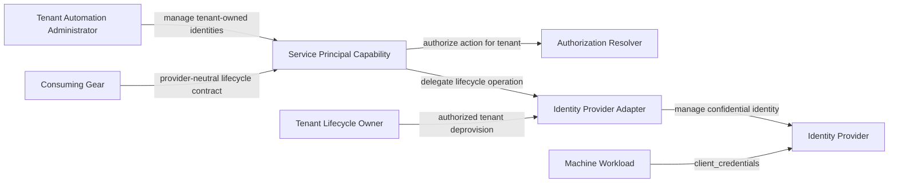

Created: 2026-08-06 by Constructor Studio

# PRD — Service Principal

<!-- toc -->

- [1. Overview](#1-overview)
  - [1.1 Purpose](#11-purpose)
  - [1.2 Background / Problem Statement](#12-background--problem-statement)
  - [1.3 Goals (Business Outcomes)](#13-goals-business-outcomes)
  - [1.4 Glossary](#14-glossary)
- [2. Actors](#2-actors)
  - [2.1 Human Actors](#21-human-actors)
  - [2.2 System Actors](#22-system-actors)
- [3. Operational Concept & Environment](#3-operational-concept--environment)
  - [3.1 Gear-Specific Environment Constraints](#31-gear-specific-environment-constraints)
- [4. Scope](#4-scope)
  - [4.1 In Scope](#41-in-scope)
  - [4.2 Out of Scope](#42-out-of-scope)
- [5. Functional Requirements](#5-functional-requirements)
  - [5.1 Principal Creation](#51-principal-creation)
  - [5.2 Principal Discovery](#52-principal-discovery)
  - [5.3 Credential Rotation and Revocation](#53-credential-rotation-and-revocation)
  - [5.4 Authentication and Authorization](#54-authentication-and-authorization)
  - [5.5 Provider Contract and Recovery](#55-provider-contract-and-recovery)
- [6. Non-Functional Requirements](#6-non-functional-requirements)
  - [6.1 Gear-Specific NFRs](#61-gear-specific-nfrs)
  - [6.2 NFR Exclusions](#62-nfr-exclusions)
- [7. Public Library Interfaces](#7-public-library-interfaces)
  - [7.1 Public API Surface](#71-public-api-surface)
  - [7.2 External Integration Contracts](#72-external-integration-contracts)
- [8. Use Cases](#8-use-cases)
  - [8.1 Create Workload Identity](#81-create-workload-identity)
  - [8.2 Inventory Tenant Principals](#82-inventory-tenant-principals)
  - [8.3 Rotate Compromised or Expiring Credential](#83-rotate-compromised-or-expiring-credential)
  - [8.4 Revoke Workload Identity](#84-revoke-workload-identity)
  - [8.5 Deprovision Tenant Principals](#85-deprovision-tenant-principals)
- [9. Acceptance Criteria](#9-acceptance-criteria)
- [10. Dependencies](#10-dependencies)
- [11. Assumptions](#11-assumptions)
- [12. Risks](#12-risks)
- [13. Open Questions](#13-open-questions)
- [14. Traceability](#14-traceability)

<!-- /toc -->

## 1. Overview

### 1.1 Purpose

Service Principal provides tenant-scoped machine identities for workloads that need to authenticate without using human credentials. It gives authorized administrators one provider-neutral contract to create, inspect, rotate, and revoke confidential OAuth 2.0 `client_credentials` identities.

The capability separates machine-identity management from human-user management. It also separates the stable Gears contract from identity-provider-specific behavior. Each principal belongs to one tenant, receives independently grantable management permissions, and exposes its secret only after creation or rotation.

### 1.2 Background / Problem Statement

Platform workloads need identities for service-to-service access, automation, and unattended jobs. Reusing human accounts weakens accountability, complicates credential rotation, and ties workload availability to a person's lifecycle. Direct identity-provider administration also gives every consumer a different integration surface and error model.

A shared Gears capability is needed to manage machine identities consistently across tenants and provider implementations. It must protect high-value client secrets, prevent cross-tenant access, distinguish safe failures from uncertain provider outcomes, and remove credentials when their owning tenant is deprovisioned.

### 1.3 Goals (Business Outcomes)

- Give authorized tenant administrators a complete machine-identity lifecycle without direct provider administration.
- Prevent workloads from relying on shared or human credentials.
- Provide one provider-neutral REST and Rust contract for machine-identity management.
- Enforce tenant isolation and least-privilege permissions for every management operation.
- Make credential rotation, revocation, uncertain outcomes, and tenant cleanup observable and testable.

**Success criteria:**

| Measure | Baseline | Initial target | Timeframe |
|---|---:|---:|---|
| Required lifecycle workflows passing provider conformance tests | No accepted Gears implementation | 100% | Before initial GA |
| Unauthorized cross-tenant management operations succeeding in security tests | No accepted Gears implementation | 0 | Before initial GA |
| Successful rotations that invalidate the superseded secret | No accepted Gears implementation | 100% | Before initial GA |
| Successful revocations that prevent subsequent token acquisition | No accepted Gears implementation | 100% | Before initial GA |
| Secret disclosures through list, log, diagnostic, telemetry, or cacheable-response checks | No accepted Gears implementation | 0 | Before initial GA |
| Conforming identity-provider adapters | 0 accepted | At least 1 | Before initial GA |
| Tenant deprovisioning scenarios leaving live owned principals | No accepted Gears implementation | 0 | Before initial GA |

### 1.4 Glossary

| Term | Definition |
|---|---|
| Service Principal | A tenant-owned, non-human identity used by a workload. |
| Machine Workload | A service, job, agent, or automation process that authenticates without a human user. |
| Client Credentials | OAuth 2.0 grant in which a confidential client authenticates with its client identifier and secret. |
| Provider Adapter | A conforming implementation that maps provider-neutral lifecycle operations to an identity provider and owns any durable reconciliation state required by those operations. |
| Owning Tenant | The tenant that controls a service principal and defines its authorization boundary. |
| Subject ID | Stable identifier represented by the authenticated principal's subject claim. |
| Clean Failure | A known failure in which the provider retained no new state from the operation. |
| Ambiguous Outcome | A failure where provider state may have changed, so success cannot be claimed and reconciliation is required. |
| One-Time Disclosure | Plaintext secret exposure through the Service Principal public contract only after successful creation or rotation. |
| Reconciliation | A follow-up action that establishes a known principal or credential state after an ambiguous outcome. |

## 2. Actors

### 2.1 Human Actors

#### Tenant Automation Administrator

**ID**: `cpt-cf-service-principal-actor-tenant-automation-admin`

- **Role**: An authorized operator who manages machine identities within an allowed tenant scope.
- **Needs**: Create workload identities, inspect their non-secret state, rotate credentials, revoke access, and recover safely from uncertain outcomes.

A platform administrator can perform the same workflow across broader tenant scopes when platform policy grants that access. This is not a separate product workflow.

### 2.2 System Actors

#### Machine Workload

**ID**: `cpt-cf-service-principal-actor-machine-workload`

- **Role**: Uses issued credentials to request access tokens through the OAuth 2.0 `client_credentials` grant.
- **Needs**: A stable tenant-scoped identity, valid credentials, and immediate invalidation of superseded or revoked credentials.

#### Authorization Resolver

**ID**: `cpt-cf-service-principal-actor-authz-resolver`

- **Role**: Decides whether a caller may perform a specific Service Principal action for the target tenant.

#### Identity Provider Adapter

**ID**: `cpt-cf-service-principal-actor-provider-adapter`

- **Role**: Implements the provider-neutral lifecycle contract, owns restart-safe create and rotation reconciliation, and reports clean or ambiguous outcomes accurately.

#### Consuming Gear

**ID**: `cpt-cf-service-principal-actor-consuming-gear`

- **Role**: Uses the public Rust interface to manage service principals as part of a wider platform workflow.

#### Tenant Lifecycle Owner

**ID**: `cpt-cf-service-principal-actor-tenant-lifecycle-owner`

- **Role**: Owns durable tenant-deprovision state, invokes the identity-provider tenant-deprovision contract, and requires all machine identities owned by that tenant to be removed.

#### Types and Permission Registry

**ID**: `cpt-cf-service-principal-actor-types-registry`

- **Role**: Registers the managed-resource type, service-subject classification, and independently grantable actions.

## 3. Operational Concept & Environment

Service Principal follows the project-wide Gears and ToolKit baselines in [ToolKit Architecture & Developer Guide](../../../../docs/toolkit_unified_system/README.md). This PRD records only capability-specific constraints.

The capability is an administrative control-plane surface. It does not participate in request-path token validation. Its provider-neutral contract is separate from the provider adapter that owns identity-provider state.

The diagram is warranted because the capability coordinates several independent actors and trust boundaries.

### 3.1 Gear-Specific Environment Constraints

- A deployment must provide one conforming identity-provider adapter before lifecycle operations can succeed.
- The identity provider must support confidential `client_credentials` identities and immediate credential invalidation.
- Callers must have approved credential storage because the capability does not retain plaintext secrets for later retrieval.
- Lifecycle operations are low-frequency administrative operations, not high-volume request-path operations.

## 4. Scope

### 4.1 In Scope

- Tenant-scoped service-principal creation.
- Secret-free listing by owning tenant.
- Secret rotation and superseded-secret invalidation.
- Idempotent revocation and credential invalidation.
- Independent authorization for create, read, rotate-secret, and revoke actions.
- Provider-neutral REST and Rust interfaces.
- Provider conformance and failure classification.
- Configurable name, scope, and per-tenant quota policy.
- Tenant-deprovision cleanup through the identity-provider tenant-lifecycle contract.
- Lifecycle latency and categorized failure telemetry.
- Stable managed-resource, subject, and permission identifiers.

### 4.2 Out of Scope

- Human-user identity, password, session, MFA, or interactive-login management.
- Authorization policy authoring, role assignment, or policy evaluation implementation.
- Long-term credential storage, secret distribution, or workload injection.
- Retrieval of an existing plaintext client secret.
- Access-token validation, token exchange, refresh tokens, or authorization-code flows.
- Workload-side token acquisition or token caching.
- Get-by-ID, principal updates, enable/disable, search, filtering, sorting, or pagination.
- Bulk lifecycle operations.
- Multi-provider selection per tenant or request.
- Provider migration or credential portability.
- A dedicated CLI or graphical management interface.
- A Service Principal-owned principal database, provider-state replica, recovery repository, retry worker, or cleanup coordinator.
- Distributed transactions across the capability, provider, credential store, and workload.
- Automatic repair of every ambiguous provider outcome.
- Offline lifecycle mutations while the provider is unavailable.
- Strongly serialized quota enforcement across concurrent requests.
- Lifecycle event streaming in the initial version.
- Provider-specific realm, mapper, account, or administration behavior.

## 5. Functional Requirements

> **Testing strategy**: Functional requirements are verified through automated unit, contract, integration, security, and end-to-end tests unless a requirement states otherwise.

### 5.1 Principal Creation

#### Create Tenant-Owned Service Principal

- [ ] `p1` - **ID**: `cpt-cf-service-principal-fr-create`

The system **MUST** allow an authorized administrator to create a confidential service principal owned by an explicit target tenant. A successful operation **MUST** return a client identifier, plaintext client secret, token endpoint, and stable subject identifier.

- **Rationale**: Workloads need dedicated non-human credentials and stable identity for policy bindings.
- **Actors**: `cpt-cf-service-principal-actor-tenant-automation-admin`, `cpt-cf-service-principal-actor-machine-workload`

#### Client Credentials Only

- [ ] `p1` - **ID**: `cpt-cf-service-principal-fr-client-credentials-only`

The system **MUST** create service principals that authenticate as confidential OAuth 2.0 `client_credentials` identities and **MUST NOT** enable interactive human authentication flows through this capability.

- **Rationale**: Machine identities must remain separate from human login and session semantics.
- **Actors**: `cpt-cf-service-principal-actor-machine-workload`

#### Tenant and Subject Classification

- [ ] `p1` - **ID**: `cpt-cf-service-principal-fr-identity-context`

The system **MUST** ensure that an access token obtained through `client_credentials` using credentials returned by successful creation contains the target tenant, a subject exactly equal to the creation response's `Subject`, and `client_credentials` identity context. Every supported provider adapter **MUST** prove this credential-to-token binding through conformance tests.

- **Rationale**: Downstream authorization needs an unambiguous tenant and non-human subject classification.
- **Actors**: `cpt-cf-service-principal-actor-machine-workload`, `cpt-cf-service-principal-actor-provider-adapter`

#### Name Policy

- [ ] `p1` - **ID**: `cpt-cf-service-principal-fr-name-policy`

The system **MUST** validate caller-selected principal names against a bounded deployment policy before requesting provider mutation.

- **Rationale**: Safe, bounded names prevent invalid provider resources and inconsistent public identifiers.
- **Actors**: `cpt-cf-service-principal-actor-tenant-automation-admin`

#### Scope Allowlist

- [ ] `p1` - **ID**: `cpt-cf-service-principal-fr-scope-allowlist`

The system **MUST** reject any requested client scope that is not present in the deployment-controlled allowlist.

- **Rationale**: Callers must not escalate workload privileges by requesting arbitrary provider scopes.
- **Actors**: `cpt-cf-service-principal-actor-tenant-automation-admin`, `cpt-cf-service-principal-actor-provider-adapter`

#### Configurable Tenant Quota

- [ ] `p2` - **ID**: `cpt-cf-service-principal-fr-tenant-quota`

The system **MUST** support a configurable maximum number of service principals per tenant and reject creation when the observed count reaches that maximum. The quota is best-effort under concurrent creation and **MUST NOT** be presented as a security boundary.

- **Rationale**: A bounded initial collection limits accidental growth while preserving honest concurrency semantics.
- **Actors**: `cpt-cf-service-principal-actor-tenant-automation-admin`, `cpt-cf-service-principal-actor-provider-adapter`

#### Creation Collision Safety

- [ ] `p1` - **ID**: `cpt-cf-service-principal-fr-create-collision`

The system **MUST** reject a creation request when its provider-side identifier is already occupied and **MUST NOT** resume, reveal, or modify the existing principal as part of that request.

- **Rationale**: Reusing an existing identity could disclose credentials or attach privileges to the wrong workload.
- **Actors**: `cpt-cf-service-principal-actor-provider-adapter`

### 5.2 Principal Discovery

#### List Tenant Service Principals

- [ ] `p1` - **ID**: `cpt-cf-service-principal-fr-list`

The system **MUST** list service principals owned by an authorized target tenant and return each principal's non-secret management state.

- **Rationale**: Administrators need inventory for audit, rotation, and revocation workflows.
- **Actors**: `cpt-cf-service-principal-actor-tenant-automation-admin`

#### Secret-Free Discovery

- [ ] `p1` - **ID**: `cpt-cf-service-principal-fr-secret-free-listing`

The system **MUST NOT** expose client secrets through list or future read operations.

- **Rationale**: Inventory access must not grant credential access.
- **Actors**: `cpt-cf-service-principal-actor-tenant-automation-admin`

#### Ownership-Checked Addressing

- [ ] `p1` - **ID**: `cpt-cf-service-principal-fr-ownership-addressing`

The system **MUST** treat a principal as addressable only when it belongs to the explicit target tenant. A missing or foreign principal **MUST NOT** disclose foreign ownership details.

- **Rationale**: Tenant-qualified addressing prevents cross-tenant object access and information leakage.
- **Actors**: `cpt-cf-service-principal-actor-tenant-automation-admin`, `cpt-cf-service-principal-actor-provider-adapter`

### 5.3 Credential Rotation and Revocation

#### Rotate Secret

- [ ] `p1` - **ID**: `cpt-cf-service-principal-fr-rotate-secret`

The system **MUST** allow an authorized administrator to rotate a tenant-owned principal's secret. A successful rotation **MUST** return the new secret and invalidate the superseded secret.

- **Rationale**: Workloads need regular and incident-driven credential replacement without replacing their identity.
- **Actors**: `cpt-cf-service-principal-actor-tenant-automation-admin`, `cpt-cf-service-principal-actor-machine-workload`

#### Reject Incomplete Principal Rotation

- [ ] `p1` - **ID**: `cpt-cf-service-principal-fr-rotate-complete-state`

The system **MUST** reject rotation when the provider cannot confirm the principal's ownership and required managed identity state.

- **Rationale**: Rotation must not issue a credential for a foreign, incomplete, or corrupted identity.
- **Actors**: `cpt-cf-service-principal-actor-provider-adapter`

#### Revoke Principal

- [ ] `p1` - **ID**: `cpt-cf-service-principal-fr-revoke`

The system **MUST** allow an authorized administrator to revoke a tenant-owned service principal. Successful revocation **MUST** prevent subsequent token acquisition by that principal.

- **Rationale**: Administrators need an immediate way to terminate workload access.
- **Actors**: `cpt-cf-service-principal-actor-tenant-automation-admin`, `cpt-cf-service-principal-actor-machine-workload`

#### Idempotent Revocation

- [ ] `p1` - **ID**: `cpt-cf-service-principal-fr-revoke-idempotent`

The system **MUST** treat revocation of an already-absent principal as success-equivalent.

- **Rationale**: Cleanup and reconciliation must converge without requiring callers to distinguish concurrent deletion from prior success.
- **Actors**: `cpt-cf-service-principal-actor-tenant-automation-admin`, `cpt-cf-service-principal-actor-tenant-lifecycle-owner`

### 5.4 Authentication and Authorization

#### Authenticated Management

- [ ] `p1` - **ID**: `cpt-cf-service-principal-fr-authenticated-management`

The system **MUST** require a validated platform security context for every public management operation.

- **Rationale**: Anonymous callers must never manage machine credentials.
- **Actors**: `cpt-cf-service-principal-actor-tenant-automation-admin`, `cpt-cf-service-principal-actor-authz-resolver`

#### Independent Management Permissions

- [ ] `p1` - **ID**: `cpt-cf-service-principal-fr-independent-permissions`

The system **MUST** authorize create, read, rotate-secret, and revoke as independently grantable actions.

- **Rationale**: Credential minting and revocation require narrower delegation than general inventory access.
- **Actors**: `cpt-cf-service-principal-actor-tenant-automation-admin`, `cpt-cf-service-principal-actor-authz-resolver`

#### Explicit Tenant Authorization

- [ ] `p1` - **ID**: `cpt-cf-service-principal-fr-tenant-authorization`

The system **MUST** authorize each operation against the explicit owning tenant and verify that returned tenant constraints cover that target. Authorization for one tenant or subtree **MUST NOT** authorize an unrelated tenant.

- **Rationale**: A broad or mismatched policy decision must not create a broken object-level authorization path.
- **Actors**: `cpt-cf-service-principal-actor-authz-resolver`

#### Fail-Closed Authorization

- [ ] `p1` - **ID**: `cpt-cf-service-principal-fr-authz-fail-closed`

The system **MUST** deny the operation when caller identity, policy evaluation, or required tenant constraints cannot be established.

- **Rationale**: Security dependency failures must not widen access.
- **Actors**: `cpt-cf-service-principal-actor-authz-resolver`

### 5.5 Provider Contract and Recovery

#### Provider-Neutral Delegation

- [ ] `p1` - **ID**: `cpt-cf-service-principal-fr-provider-delegation`

The system **MUST** delegate principal lifecycle operations through a versioned provider-neutral contract so conforming adapters can be substituted without changing callers.

- **Rationale**: The Gears capability must not bind consumers to one identity provider.
- **Actors**: `cpt-cf-service-principal-actor-provider-adapter`, `cpt-cf-service-principal-actor-consuming-gear`

#### Provider Absence

- [ ] `p1` - **ID**: `cpt-cf-service-principal-fr-provider-required`

The system **MUST** fail explicitly and without simulated success when no conforming provider adapter is available.

- **Rationale**: Provider absence means authoritative identity state cannot be created or changed safely.
- **Actors**: `cpt-cf-service-principal-actor-provider-adapter`

#### Stable Failure Categories

- [ ] `p1` - **ID**: `cpt-cf-service-principal-fr-failure-categories`

The system **MUST** define one six-category failure taxonomy for end-to-end classification of provider outcomes, REST responses, and Rust SDK errors: invalid input, not found, clean failure, ambiguous outcome, authorization failure, and provider unavailability. The provider contract's four outcomes **MUST** map directly to the first four categories. Authorization failure **MUST** identify failure to establish caller identity, policy approval, or matching tenant constraints before provider invocation. Provider unavailability **MUST** identify provider absence or an availability failure known to prevent mutation; if a provider request may have mutated state, the outcome **MUST** instead be ambiguous and **MUST NOT** be reported as success. REST and Rust consumers **MUST** receive the same category and retry or reconciliation semantics. Adding, renaming, or splitting a Rust SDK or provider category **MUST** require a new major contract version with migration guidance; older consumers encountering an unknown category **MUST** treat it as failure and as ambiguous whenever mutation cannot be ruled out.

- **Rationale**: Callers need deterministic retry and reconciliation behavior.
- **Actors**: `cpt-cf-service-principal-actor-provider-adapter`, `cpt-cf-service-principal-actor-consuming-gear`

#### Ambiguous Creation Recovery

- [ ] `p1` - **ID**: `cpt-cf-service-principal-fr-ambiguous-create-recovery`

Every create attempt **MUST** carry a caller-generated operation key bound to the explicit tenant and canonical request identity. After an ambiguous result, the caller **MUST** reconcile by repeating the identical request with the same key. The adapter **MUST** reconcile before further mutation and classify provider evidence as `exact_binding`, `authoritative_absence`, or `inconclusive`. `exact_binding` **MUST** return a non-secret `credentials_unavailable` failed-precondition result with the confirmed principal identity and rotation guidance. `authoritative_absence` **MAY** permit a fresh create with a new key. `inconclusive` **MUST** remain ambiguous and block conflicting mutation. Reusing a key for another tenant, operation, or request identity **MUST** be invalid input.

- **Rationale**: Ambiguous creation must not justify destructive action against a tenant principal whose relationship to the uncertain request is unproven.
- **Actors**: `cpt-cf-service-principal-actor-tenant-automation-admin`, `cpt-cf-service-principal-actor-provider-adapter`

#### Ambiguous Rotation Recovery

- [ ] `p1` - **ID**: `cpt-cf-service-principal-fr-ambiguous-rotate-recovery`

Every rotation **MUST** carry a caller-generated operation key. After an ambiguous result, the caller **MUST** repeat only the identical request with the same key. The adapter **MUST** reconcile before further mutation. A confirmed prior rotation whose secret response was lost **MUST** return `credentials_unavailable`; the caller **MUST** use a new operation key for a subsequently confirmed rotation before adopting replacement credentials. Plaintext credentials **MUST NOT** be persisted or replayed.

- **Rationale**: An uncertain rotation cannot establish which credential is safe to use.
- **Actors**: `cpt-cf-service-principal-actor-tenant-automation-admin`, `cpt-cf-service-principal-actor-machine-workload`

#### Ambiguous Revocation Recovery

- [ ] `p1` - **ID**: `cpt-cf-service-principal-fr-ambiguous-revoke-recovery`

When revocation has an ambiguous outcome, the system **MUST** allow repeated revocation until the principal is confirmed revoked or already absent.

- **Rationale**: Repeated deletion is the safe convergence path after transport uncertainty.
- **Actors**: `cpt-cf-service-principal-actor-tenant-automation-admin`, `cpt-cf-service-principal-actor-provider-adapter`

#### Tenant Deprovision Cleanup

- [ ] `p1` - **ID**: `cpt-cf-service-principal-fr-tenant-cleanup`

The tenant lifecycle owner **MUST** authenticate and authorize tenant deprovisioning for an explicit target tenant, durably retain retryable lifecycle state, and invoke the identity-provider tenant-deprovision contract. The provider adapter **MUST** delete only principals authoritatively owned by that tenant and **MUST** confirm that no live owned principal remains before returning success. Already-absent principals are success-equivalent. A transient cleanup failure **MUST** block teardown and remain retryable through the tenant-lifecycle operation; a permanent failure **MUST** block teardown and remain operator-visible. Service Principal **MUST NOT** own cleanup state, scheduling, or a cleanup API.

- **Rationale**: A machine credential must not outlive its authorization boundary, and cleanup must preserve the same tenant isolation and accountability as other lifecycle operations.
- **Actors**: `cpt-cf-service-principal-actor-tenant-lifecycle-owner`, `cpt-cf-service-principal-actor-provider-adapter`

## 6. Non-Functional Requirements

Architecture and engineering conventions are inherited from the [ToolKit Architecture & Developer Guide](../../../../docs/toolkit_unified_system/README.md) and [project guidelines](../../../../guidelines/README.md). The requirements below define Service Principal-specific obligations. Where a quantitative target still requires production evidence, this section defines an explicit release gate rather than assuming an undocumented baseline.

### 6.1 Gear-Specific NFRs

#### Secret Confidentiality

- [ ] `p1` - **ID**: `cpt-cf-service-principal-nfr-secret-confidentiality`

The system **MUST** prevent plaintext client secrets from appearing in list responses, logs, debug output, diagnostics, telemetry, and cacheable responses. Credential-bearing responses **MUST** be non-cacheable.

- **Threshold**: Zero secret disclosures across automated negative checks for these surfaces.
- **Rationale**: A leaked client secret grants workload identity until rotation or revocation.
- **Architecture Allocation**: [DESIGN NFR Allocation](./DESIGN.md#nfr-allocation), [REST V1 contract](./DESIGN.md#service-principal-rest-v1), and [Security and Data Protection](./DESIGN.md#44-security-and-data-protection).

#### Data Classification and Privacy

- [ ] `p1` - **ID**: `cpt-cf-service-principal-nfr-data-classification`

The system **MUST** treat plaintext client secrets and provider verifier material as restricted authentication credentials. It **MUST** treat client identifiers, subject identifiers, tenant ownership, scopes, operation keys and fingerprints, and lifecycle outcomes as security-sensitive control-plane metadata. The capability **MUST NOT** intentionally collect human profile attributes or unrelated personal data.

- **Threshold**: Every field in the public and provider contracts has an approved security classification before release, and conformance checks find zero human profile attributes or unrelated personal data.
- **Rationale**: Explicit classification keeps credential controls, telemetry, retention, and privacy treatment aligned with actual data sensitivity.
- **Architecture Allocation**: [DESIGN NFR Allocation](./DESIGN.md#nfr-allocation), [Security and Data Protection](./DESIGN.md#44-security-and-data-protection), and [Compliance and Privacy Posture](./DESIGN.md#48-compliance-and-privacy-posture).

#### No Plaintext Secret Persistence

- [ ] `p1` - **ID**: `cpt-cf-service-principal-nfr-no-secret-persistence`

The Service Principal capability **MUST NOT** persist plaintext client secrets or operation-reconciliation state. A provider adapter **MUST NOT** persist or replay plaintext credential responses as part of reconciliation. The identity provider may retain verifier material according to its security contract.

- **Threshold**: Zero Service Principal-owned plaintext secret records and zero adapter reconciliation records containing a plaintext or replayable credential response.
- **Rationale**: The capability is a lifecycle facade, not a credential store.
- **Architecture Allocation**: [DESIGN NFR Allocation](./DESIGN.md#nfr-allocation), [Database Schemas and Tables](./DESIGN.md#37-database-schemas--tables), and [Security and Data Protection](./DESIGN.md#44-security-and-data-protection).

#### Tenant Isolation

- [ ] `p1` - **ID**: `cpt-cf-service-principal-nfr-tenant-isolation`

The system **MUST** prevent management operations from crossing unauthorized tenant boundaries.

- **Threshold**: Zero unauthorized successes in the cross-tenant security suite.
- **Rationale**: Machine credentials are high-impact tenant resources.
- **Architecture Allocation**: [DESIGN NFR Allocation](./DESIGN.md#nfr-allocation), [Authorization Gate](./DESIGN.md#authorization-gate), and [Provider Boundary](./DESIGN.md#provider-boundary).

#### Credential Invalidation

- [ ] `p1` - **ID**: `cpt-cf-service-principal-nfr-credential-invalidation`

Successful rotation and revocation **MUST** make superseded credentials unusable without an additional grace period.

- **Threshold**: 100% of successful rotation and revocation conformance scenarios reject superseded credentials.
- **Rationale**: Security response depends on immediate credential termination.
- **Architecture Allocation**: [DESIGN NFR Allocation](./DESIGN.md#nfr-allocation), [Provider Boundary](./DESIGN.md#provider-boundary), and [Interactions and Sequences](./DESIGN.md#36-interactions--sequences).

#### Provider Conformance

- [ ] `p1` - **ID**: `cpt-cf-service-principal-nfr-provider-conformance`

Every supported identity-provider integration **MUST** pass the common conformance suite. Its Service Principal adapter coverage **MUST** include lifecycle, ownership, operation-key reconciliation, failure classification, and credential security. Its tenant-deprovision coverage **MUST** include exact-owner cleanup, retryable and terminal failures, and authoritative zero-principal confirmation.

- **Threshold**: 100% of mandatory Service Principal adapter and tenant-deprovision scenarios pass for each supported identity-provider integration.
- **Rationale**: Provider substitution is safe only when contract behavior is equivalent.
- **Architecture Allocation**: [DESIGN NFR Allocation](./DESIGN.md#nfr-allocation), [Provider Adapter V1](./DESIGN.md#provider-adapter-v1), and [Testability and Verification](./DESIGN.md#47-testability-and-verification).

#### Contract Compatibility

- [ ] `p1` - **ID**: `cpt-cf-service-principal-nfr-contract-compatibility`

REST and Rust contract changes within a major version **MUST** remain backward-compatible and additive. Breaking changes **MUST** use a new major contract version with migration guidance.

- **Threshold**: Zero unversioned breaking changes in compatibility checks.
- **Rationale**: Callers must remain independent of provider and implementation release cadence.
- **Architecture Allocation**: [DESIGN NFR Allocation](./DESIGN.md#nfr-allocation), [API Contracts](./DESIGN.md#33-api-contracts), and [Failure Taxonomy and Wire Safety](./DESIGN.md#41-failure-taxonomy-and-wire-safety).

#### Security Auditability

- [ ] `p1` - **ID**: `cpt-cf-service-principal-nfr-auditability`

Every management decision and lifecycle operation **MUST** produce an auditable record attributable to the validated initiating caller or approved system actor, target tenant, action, timestamp, correlation identifier, and terminal outcome without recording a plaintext client secret.

- **Threshold**: 100% of lifecycle and authorization conformance scenarios produce complete attributable records, with zero plaintext client secrets in audit data.
- **Rationale**: Credential administration must support incident investigation and accountability regardless of whether the platform or the gear emits the final audit record.
- **Architecture Allocation**: [DESIGN NFR Allocation](./DESIGN.md#nfr-allocation), [Audit and Observability component](./DESIGN.md#audit-and-observability), and [Auditability and Observability](./DESIGN.md#45-auditability-and-observability).

#### Operational Observability

- [ ] `p1` - **ID**: `cpt-cf-service-principal-nfr-observability`

The system **MUST** record latency and a stable outcome category for every Service Principal lifecycle operation. Operators **MUST** be able to distinguish invalid input, not found, clean failure, ambiguous outcome, authorization failure, and provider unavailability. Service Principal ambiguous outcomes and provider unavailability **MUST** produce adapter-correlated signals suitable for platform alerting. The tenant lifecycle owner **MUST** provide cleanup retry and terminal-failure signals.

- **Threshold**: 100% of Service Principal lifecycle calls emit one latency observation and one public outcome category; 100% of tenant-cleanup attempts emit a lifecycle-native outcome; conformance tests demonstrate an alertable signal for each specified operational condition.
- **Rationale**: Operators need to detect provider degradation and unresolved credential state.
- **Architecture Allocation**: [DESIGN NFR Allocation](./DESIGN.md#nfr-allocation), [Audit and Observability component](./DESIGN.md#audit-and-observability), and [Auditability and Observability](./DESIGN.md#45-auditability-and-observability).

#### Stateless Recovery

- [ ] `p1` - **ID**: `cpt-cf-service-principal-nfr-stateless-recovery`

Service Principal restart **MUST** lose no authoritative principal or recovery state because the gear owns neither. Create and rotation operation keys **MUST** be forwarded to an adapter that provides restart-safe, tenant-bound reconciliation. The adapter may reconcile during a repeated request or through adapter-private execution, but Service Principal **MUST NOT** schedule or persist that work.

- **Threshold**: Restart tests prove that Service Principal requires no database restoration and that every supported adapter deterministically resumes an unresolved same-key create or rotation without duplicate logical mutation.
- **Rationale**: The gear remains a stateless authorization and provider-delegation boundary while the integration closest to provider behavior owns reconciliation correctness.
- **Architecture Allocation**: [Provider Boundary](./DESIGN.md#provider-boundary), [Database Schemas and Tables](./DESIGN.md#37-database-schemas--tables), and [Operation-Key Reconciliation](./DESIGN.md#42-operation-key-reconciliation).

#### Cleanup Reliability

- [ ] `p1` - **ID**: `cpt-cf-service-principal-nfr-cleanup-reliability`

Tenant-deprovision cleanup failures **MUST** remain durably visible and retryable in the tenant lifecycle owner's deprovision operation until the provider adapter confirms no live owned principal remains. Service Principal **MUST NOT** retain cleanup records or run cleanup retries.

- **Threshold**: Zero cleanup failures are silently discarded; every retryable tenant-deprovision operation survives lifecycle-owner restart; permanent failures remain operator-visible; successful deprovisioning leaves zero live owned principals.
- **Rationale**: Credential survival after tenant removal is a security incident, while retry durability belongs with the lifecycle operation that gates tenant removal.
- **Architecture Allocation**: [Tenant Lifecycle Cleanup Integration](./DESIGN.md#tenant-lifecycle-cleanup-integration), [Auditability and Observability](./DESIGN.md#45-auditability-and-observability), and [Fault Tolerance](./DESIGN.md#46-fault-tolerance).

#### Performance and Availability Qualification

- [ ] `p2` - **ID**: `cpt-cf-service-principal-nfr-performance-baseline`

Initial GA approval **MUST** be blocked until representative provider benchmarks establish and approve the supported tenant and principal envelope, p95 lifecycle latency, sustained administrative request rate, provider-unavailable behavior, and availability objective. Published service objectives **MUST** then be used as release-conformance thresholds.

- **Threshold**: Before GA, a versioned benchmark report records approved values for all five dimensions; each subsequent supported release satisfies the published objectives or documents an approved revision.
- **Rationale**: Provider latency dominates operations, so targets must be measurable without inventing unsupported values.
- **Architecture Allocation**: [DESIGN NFR Allocation](./DESIGN.md#nfr-allocation), [Configuration](./DESIGN.md#43-configuration), [Fault Tolerance](./DESIGN.md#46-fault-tolerance), and [Testability and Verification](./DESIGN.md#47-testability-and-verification).

#### Operational Readiness Documentation

- [ ] `p2` - **ID**: `cpt-cf-service-principal-nfr-operational-documentation`

Each supported release **MUST** publish API and operator guidance covering one-time secret handling, approved credential-store handoff, stable outcome categories, ambiguous-outcome reconciliation, tenant-cleanup retry, alert interpretation, and troubleshooting without plaintext secrets.

- **Threshold**: Release readiness evidence verifies that all seven topics are present and that documentation examples contain zero plaintext production credentials.
- **Rationale**: Operators and API consumers need safe recovery instructions for credential-bearing and uncertain provider operations.
- **Architecture Allocation**: [DESIGN NFR Allocation](./DESIGN.md#nfr-allocation), [API Contracts](./DESIGN.md#33-api-contracts), [Auditability and Observability](./DESIGN.md#45-auditability-and-observability), and [Testability and Verification](./DESIGN.md#47-testability-and-verification).

### 6.2 NFR Exclusions

- **Authoritative principal-data RPO and backup**: Not applicable because the provider owns principal records and Service Principal owns no principal database, reconciliation repository, or plaintext secret store.
- **Offline mutation availability**: Not applicable because authoritative lifecycle changes require a reachable provider.
- **Physical safety**: Not applicable because this is an information-system control plane with no direct physical actuation.
- **End-user accessibility and internationalization**: Not applicable to the initial server/API-only capability; future user interfaces must define their own requirements.
- **Gear-specific disaster recovery**: No Service Principal data restoration is required. Authoritative principal recovery and adapter-private reconciliation durability remain provider-integration obligations; tenant-cleanup retry durability remains a tenant-lifecycle obligation.
- **Personal-data privacy**: No gear-specific privacy regime applies because the capability intentionally processes machine identities rather than human profiles. This exclusion ceases to apply in deployments where tenant or account identifiers can identify natural persons.
- **Industry-specific regulation**: No regulation is introduced by this provider-neutral capability. Deployment-specific regulatory controls remain mandatory where the platform, provider, tenant, or workload is subject to them.
- **Data retention and residency**: The identity provider owns principal-record retention and residency, adapters own any private reconciliation-record policy, tenant lifecycle owns deprovision-operation retention, and platform observability owns telemetry retention and residency. Service Principal owns none of these durable records.
- **Dedicated deployment and release process**: Not applicable; the capability uses the project-wide release process, with the additional benchmark and documentation gates defined above.

## 7. Public Library Interfaces

### 7.1 Public API Surface

#### Service Principal REST Interface

- [ ] `p1` - **ID**: `cpt-cf-service-principal-interface-rest`

- **Type**: Versioned authenticated REST API.
- **Stability**: Stable within a major version.
- **Description**: Provides create, list, rotate-secret, and revoke operations for an explicit owning tenant. Create and rotate require the standard `Idempotency-Key` request header. Credential-bearing operations disclose plaintext secrets once and mark responses as non-cacheable; no recovery-status surface exists.
- **Breaking Change Policy**: A breaking change requires a new major API version and migration guidance.

#### Service Principal Rust Interface

- [ ] `p1` - **ID**: `cpt-cf-service-principal-interface-rust-sdk`

- **Type**: Transport-neutral Rust SDK and service-provider contract.
- **Stability**: Stable within a major version.
- **Description**: Provides the same four lifecycle operations, validated `OperationKey` values for create and rotate, one-time credentials, secret-free summaries, tenant identity, and a major-versioned failure taxonomy with non-success handling for unknown categories.
- **Breaking Change Policy**: A breaking change requires a new major SDK contract version and migration guidance.

#### Service Principal Managed Resource

- [ ] `p1` - **ID**: `cpt-cf-service-principal-interface-managed-resource`

- **Type**: GTS managed-resource and permission catalog.
- **Stability**: Stable within a major version.
- **Description**: Defines Service Principal as a resource distinct from human users and exposes create, read, rotate-secret, and revoke permissions.
- **Breaking Change Policy**: Resource and action identifiers cannot change within a major version.

### 7.2 External Integration Contracts

#### Identity Provider Adapter Contract

- [ ] `p1` - **ID**: `cpt-cf-service-principal-contract-provider-adapter`

- **Direction**: Required from provider implementations.
- **Protocol/Format**: Versioned provider-neutral Rust contract.
- **Compatibility**: Adapters must preserve lifecycle, ownership, operation-key reconciliation, one-time disclosure, invalidation, and failure semantics for the contract version they implement.

#### Authorization Contract

- [ ] `p1` - **ID**: `cpt-cf-service-principal-contract-authorization`

- **Direction**: Required from the platform Authorization Resolver.
- **Protocol/Format**: Authenticated action request with explicit tenant resource attributes and tenant constraints.
- **Compatibility**: Decisions must support the stable managed-resource and action identifiers for the active major version.

#### Tenant Lifecycle Cleanup Contract

- [ ] `p1` - **ID**: `cpt-cf-service-principal-contract-tenant-cleanup`

- **Direction**: Required from the identity-provider integration by the tenant lifecycle owner; Service Principal does not provide or proxy this contract.
- **Protocol/Format**: Versioned authenticated tenant-deprovision request with a validated platform security context, explicit target tenant, and lifecycle-native success-equivalent, retryable, or terminal outcome.
- **Compatibility**: The tenant lifecycle owner **MUST** retain retryable state and block teardown after retryable or terminal failure. The adapter **MUST** enforce exact tenant ownership, treat already-absent principals as success-equivalent, and return success only after confirming removal or absence of every live principal owned by the target tenant.

## 8. Use Cases

### 8.1 Create Workload Identity

- [ ] `p1` - **ID**: `cpt-cf-service-principal-usecase-create`

**Actor**: `cpt-cf-service-principal-actor-tenant-automation-admin`

**Preconditions**:
- The caller is authenticated and authorized for the target tenant and create action.
- A conforming provider adapter is available.
- The request carries a new caller-generated operation key.
- The requested name, scopes, and tenant quota satisfy deployment policy.

**Main Flow**:
1. The administrator requests a tenant-owned service principal.
2. The system creates the provider identity.
3. The system returns its client identifier, one-time secret, token endpoint, and subject identifier.
4. The administrator stores the secret in approved credential storage.

**Postconditions**:
- The principal can authenticate as a service subject owned by the target tenant.

**Alternative Flows**:
- **Invalid policy input**: The request is rejected without new provider state.
- **Ambiguous provider outcome**: The caller repeats only the identical request with the same operation key. The adapter reconciles before mutation. Confirmed prior creation returns `credentials_unavailable` with non-secret identity and rotation guidance; authoritative absence permits a fresh create with a new key; inconclusive evidence remains ambiguous and blocks conflicting mutation.

### 8.2 Inventory Tenant Principals

- [ ] `p1` - **ID**: `cpt-cf-service-principal-usecase-list`

**Actor**: `cpt-cf-service-principal-actor-tenant-automation-admin`

**Preconditions**:
- The caller is authenticated and authorized for the target tenant and read action.

**Main Flow**:
1. The administrator requests the tenant's service-principal inventory.
2. The system returns only principals owned by that tenant.
3. The response contains no client secrets.

**Postconditions**:
- The administrator has current non-secret state for audit and lifecycle management.

### 8.3 Rotate Compromised or Expiring Credential

- [ ] `p1` - **ID**: `cpt-cf-service-principal-usecase-rotate`

**Actor**: `cpt-cf-service-principal-actor-tenant-automation-admin`

**Preconditions**:
- The caller is authorized for the target tenant and rotate-secret action.
- The provider confirms the principal's ownership and managed identity state.
- The request carries a new caller-generated operation key.

**Main Flow**:
1. The administrator requests secret rotation.
2. The system invalidates the superseded secret.
3. The system returns the new secret through a non-cacheable response.
4. The administrator updates approved credential storage.

**Postconditions**:
- The new secret authenticates and the superseded secret does not.

**Alternative Flows**:
- **Ambiguous rotation**: The caller repeats only the identical request with the same operation key. A confirmed prior rotation whose response was lost returns `credentials_unavailable`; the caller performs a new rotation with a new key and adopts only its confirmed response.

### 8.4 Revoke Workload Identity

- [ ] `p1` - **ID**: `cpt-cf-service-principal-usecase-revoke`

**Actor**: `cpt-cf-service-principal-actor-tenant-automation-admin`

**Preconditions**:
- The caller is authorized for the target tenant and revoke action.

**Main Flow**:
1. The administrator requests revocation.
2. The system removes or confirms absence of the tenant-owned principal.
3. Subsequent token acquisition fails.

**Postconditions**:
- The addressed principal no longer grants workload access.

**Alternative Flows**:
- **Already absent**: The operation is success-equivalent.
- **Ambiguous revocation**: The administrator repeats revocation until success or confirmed absence.

### 8.5 Deprovision Tenant Principals

- [ ] `p1` - **ID**: `cpt-cf-service-principal-usecase-tenant-cleanup`

**Actor**: `cpt-cf-service-principal-actor-tenant-lifecycle-owner`

**Preconditions**:
- The tenant lifecycle owner has authenticated and authorized tenant deprovisioning for the explicit target tenant.
- The tenant lifecycle operation has durable retry state.
- A conforming identity-provider integration is available.

**Main Flow**:
1. The tenant lifecycle owner invokes the identity-provider tenant-deprovision contract.
2. The provider adapter selects only principals authoritatively owned by the explicit tenant.
3. The adapter removes each owned principal, treating already-absent principals as success-equivalent.
4. The adapter confirms that no live owned principal remains.
5. The tenant lifecycle owner records final disposition and completes tenant deprovisioning.

**Postconditions**:
- Successful tenant deprovisioning leaves no live principal owned by that tenant.
- Service Principal has stored no cleanup state and has not participated in the call.

**Alternative Flows**:
- **Transient provider failure**: The adapter returns retryable, teardown remains blocked, and the tenant lifecycle owner retries the whole deprovision operation from durable state.
- **Permanent or configuration failure**: The adapter returns terminal, teardown remains blocked, and the tenant lifecycle owner keeps the operation visible for intervention.

## 9. Acceptance Criteria

- [ ] An authorized administrator can complete create, list, rotate, and revoke through the public contract without provider-specific administration.
- [ ] Every supported provider adapter passes conformance tests proving that an access token obtained through `client_credentials` using credentials returned by successful creation contains the target tenant, a subject exactly equal to the creation response's `Subject`, and `client_credentials` identity context.
- [ ] Unauthorized and cross-tenant management operations have zero successful outcomes in the security suite.
- [ ] Credential-bearing responses are non-cacheable, and secret-negative checks find zero disclosures on prohibited surfaces.
- [ ] Every successful rotation test rejects the superseded secret and accepts the confirmed replacement.
- [ ] Every successful revocation test prevents later token acquisition.
- [ ] Every supported provider adapter passes all mandatory conformance scenarios.
- [ ] Conformance tests exercise all six Service Principal failure categories and verify consistent classification across applicable provider, REST, and Rust surfaces, including major-version compatibility and non-success handling for unknown or mutation-uncertain outcomes.
- [ ] Concurrent and post-restart same-key create and rotation retries produce at most one logical mutation, reject cross-tenant or changed-request key reuse, and never persist or replay a plaintext credential.
- [ ] `exact_binding`, `authoritative_absence`, and `inconclusive` adapter scenarios produce the required safe retry behavior without exposing provider proof material publicly.
- [ ] Tenant cleanup deletes only principals authoritatively owned by the target tenant and never deletes foreign principals.
- [ ] Transient tenant-cleanup failures block teardown and survive tenant-lifecycle restart; terminal failures remain operator-visible; successful tenant deprovisioning leaves zero live service principals owned by that tenant.
- [ ] A security review classifies every public and provider-contract field and confirms that no human profile attributes or unrelated personal data are collected.
- [ ] Every lifecycle and authorization scenario produces a complete attributable audit record with no plaintext client secret.
- [ ] Initial GA evidence includes approved benchmark values for the supported scale envelope, p95 lifecycle latency, sustained request rate, provider-unavailable behavior, and availability objective.
- [ ] API and operator documentation covers every required readiness topic without exposing plaintext production credentials.
- [ ] REST, Rust SDK, GTS registration, authorization, provider conformance, security, and end-to-end evidence exist within the Gears artifact and implementation chain before completion is claimed.

## 10. Dependencies

| Dependency | Description | Criticality |
|---|---|---|
| Gears ToolKit runtime | Hosts the gear and its authenticated public capability. | p1 |
| Platform client registry | Resolves the configured provider-neutral adapter for trusted callers. | p1 |
| Authorization Resolver | Supplies action decisions and tenant-scoped constraints. | p1 |
| Tenant model and resolver contracts | Supply canonical tenant identity and hierarchy semantics. | p1 |
| Types and Permission Registry | Registers resource, subject, and permission identifiers. | p1 |
| Canonical error framework | Supplies standardized public error categories. | p1 |
| API Gateway and OpenAPI registry | Routes and documents the versioned REST interface. | p1 |
| Identity Provider Adapter | Owns authoritative principal state and implements lifecycle operations. | p1 |
| Approved Credential Store | Retains one-time disclosed credentials for consuming workloads. | p1 |
| Platform observability | Collects lifecycle latency, outcomes, logs, and alerts. | p2 |

## 11. Assumptions

- The platform provides stable tenant identifiers and tenant hierarchy semantics.
- The platform authenticates public API callers before Service Principal authorization.
- Consuming workloads can protect credentials and perform OAuth 2.0 `client_credentials` requests.
- One conforming provider adapter is configured for the initial deployment.
- Identity-provider state is authoritative; Service Principal owns no principal database, recovery repository, cleanup state, or retry scheduler.
- Administrators choose names and scopes according to deployment policy.
- Lifecycle operations are low-frequency administrative operations.
- The initial capability is server/API-facing and has no dedicated user interface.

## 12. Risks

| Risk | Impact | Mitigation |
|---|---|---|
| Only one provider initially proves the contract | Hidden provider assumptions may limit future portability. | Keep contracts provider-neutral and require the same conformance suite for every adapter. |
| Caller loses the one-time secret | The workload cannot authenticate. | Require immediate approved storage and recover through rotation. |
| Secret leaks through diagnostics or caching | An attacker can impersonate a workload. | Enforce redaction, non-cacheability, and secret-negative tests. |
| Cross-tenant object access | A caller can manage another tenant's credentials. | Authorize the explicit tenant and verify returned tenant constraints. |
| Over-privileged administrators | Credential minting is delegated too broadly. | Keep lifecycle actions independently grantable. |
| Scope escalation | A workload receives unintended privileges. | Restrict requested scopes to a deployment-controlled allowlist. |
| Ambiguous provider mutation | Caller and provider disagree about principal or credential state. | Use stable ambiguity reporting and operation-specific reconciliation. |
| Concurrent creation exceeds quota | Tenant count briefly exceeds the configured cap. | Document best-effort semantics, monitor counts, and reassess strong enforcement from measured need. |
| Tenant cleanup fails | Credentials survive their tenant boundary. | Keep the tenant-lifecycle operation durable and visible, retry the whole deprovision workflow after transient failure, and block successful deprovisioning until the adapter confirms zero owned principals. |
| Unpaginated listing grows too large | Administrative latency and payload size increase. | Start with bounded tenant quotas and define a measured trigger for pagination. |
| Resource or permission identifiers drift | Authorization grants no longer match enforcement. | Pin identifiers and validate registry-to-enforcement consistency. |

## 13. Open Questions

1. **What production scale and lifecycle latency targets should the gear support?**
   - **Owner**: Platform Performance and Operations.
   - **Resolution target**: Before initial GA benchmark approval.

2. **When is a second provider adapter required to substantiate portability?**
   - **Owner**: Product and Gears Architecture.
   - **Resolution target**: Before claiming multi-provider production support.

3. **What measured tenant volume triggers pagination or strongly enforced quota semantics?**
   - **Owner**: Product and Capacity Engineering.
   - **Resolution target**: Before raising the initial supported tenant limit.

4. **Should adapter incompatibility fail registration or the first lifecycle operation?**
   - **Owner**: Gears Architecture and Provider Integration Owners.
   - **Resolution target**: Before provider-adapter contract freeze.

5. **What retention policy applies to adapter-private reconciliation records?**
   - **Owner**: Security, Operations, and Provider Integration Owners.
   - **Resolution target**: Before initial adapter production qualification.

Resolved during design: audit and operational signals use layered ownership. Service Principal records authorization and public lifecycle outcomes, provider adapters record provider mutation and reconciliation outcomes, and the tenant lifecycle owner records cleanup retries and final tenant disposition. The allocation is defined in [DESIGN §4.5](./DESIGN.md#45-auditability-and-observability).

## 14. Traceability

- **System slug**: `service-principal`
- **ID prefix**: `cpt-cf-service-principal-*`
- **UPSTREAM_REQS**: No upstream requirements artifact exists for this gear.
- **DESIGN**: [DESIGN.md](./DESIGN.md) allocates every FR and NFR and defines the implementation boundaries.
- **ADRs**: None. This artifact records requirements; DESIGN records the resulting architecture without embedding decision debates. Explicit-tenant authorization follows the shared platform PDP/PEP baseline.
- **DECOMPOSITION**: Not yet authored.
- **FEATURES**: Not yet authored.
- **CODE**: No Gears implementation is registered for this artifact yet. Implementation traceability begins when FEATURE and CODE artifacts are added.
