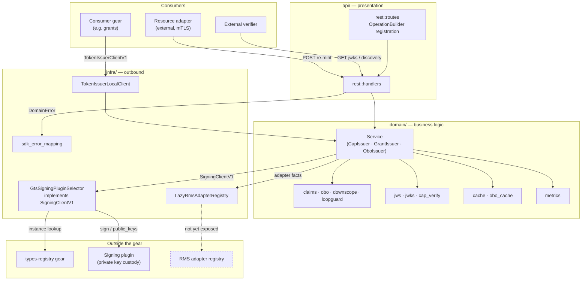
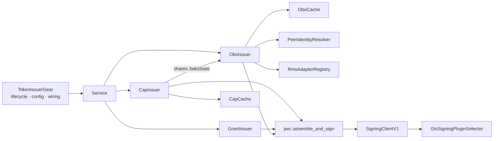
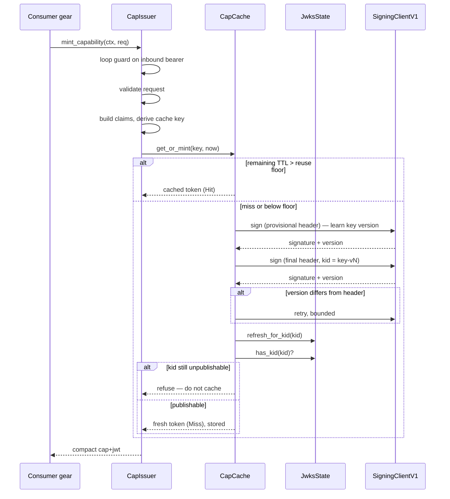
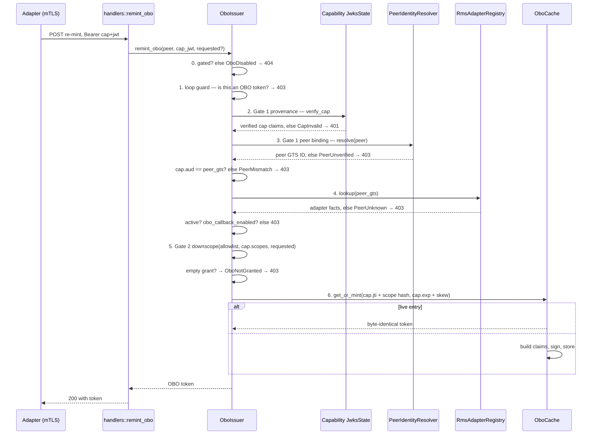
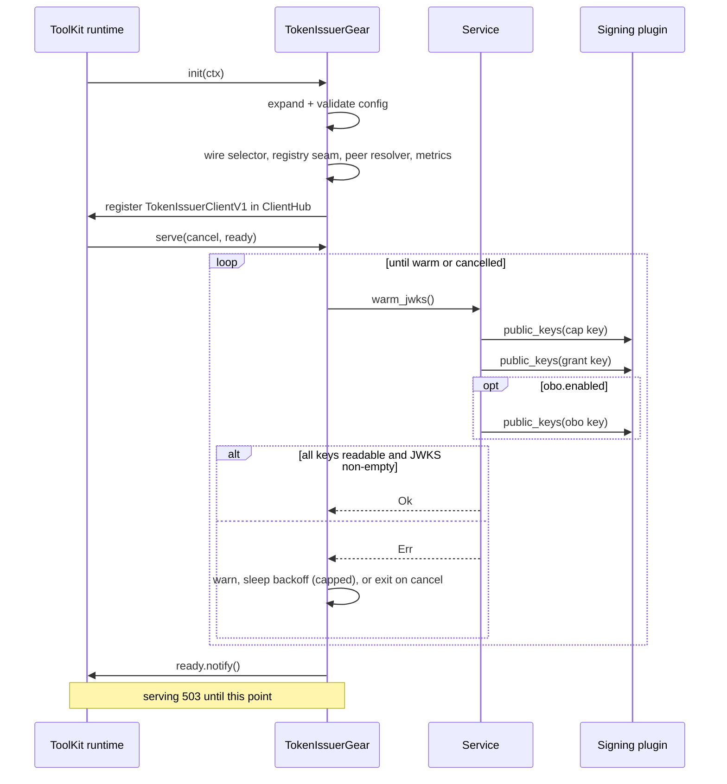

# Technical Design — Token Issuer

<!-- toc -->

- [1. Architecture Overview](#1-architecture-overview)
  - [1.1 Architectural Vision](#11-architectural-vision)
  - [1.2 Architecture Drivers](#12-architecture-drivers)
  - [1.3 Architecture Layers](#13-architecture-layers)
- [2. Principles & Constraints](#2-principles--constraints)
  - [2.1 Design Principles](#21-design-principles)
  - [2.2 Constraints](#22-constraints)
- [3. Technical Architecture](#3-technical-architecture)
  - [3.1 Domain Model](#31-domain-model)
  - [3.2 Component Model](#32-component-model)
  - [3.3 API Contracts](#33-api-contracts)
  - [3.4 Internal Dependencies](#34-internal-dependencies)
  - [3.5 External Dependencies](#35-external-dependencies)
  - [3.6 Interactions & Sequences](#36-interactions--sequences)
  - [3.7 Database schemas & tables](#37-database-schemas--tables)
  - [3.8 Deployment Topology](#38-deployment-topology)
- [4. Additional context](#4-additional-context)
  - [4.1 Deferred integration seams](#41-deferred-integration-seams)
  - [4.2 Configuration reference](#42-configuration-reference)
  - [4.3 Decisions that warrant an ADR](#43-decisions-that-warrant-an-adr)
  - [4.4 Observability](#44-observability)
- [5. Traceability](#5-traceability)

<!-- /toc -->

## 1. Architecture Overview

### 1.1 Architectural Vision

The Token Issuer is built around one structural decision: **the gear that decides what a token says is
not the component that can sign it.** All signing goes through the `SigningClientV1` port, implemented
by a plugin discovered at runtime through the GTS types-registry. The issuer holds key *names*, never
key *bytes*. This keeps private key custody in whatever backend the deployment chose and makes the
issuer's own compromise materially less valuable than it would be if it held keys locally.

The second decision is **one token class, one signing key, one issuer identifier.** Capability, grant,
and OBO tokens are minted by three sibling domain services, each with a disjoint Transit key and a
distinct `iss`. Cross-class confusion is therefore not a check that a verifier might forget to perform
— it is cryptographically unavailable, because the key that signed a grant token never appears in the
capability JWKS. The only intentional coupling is one-directional: the OBO issuer reads the capability
issuer's JWKS, because re-minting requires verifying the capability token it was handed.

The third is **fail closed everywhere, gated on readiness.** The signing backend may register after
boot, the JWKS may be unwarmable, a key may rotate mid-mint, the peer certificate may be absent, the
adapter registry may be unreachable. Every one of these resolves to a refusal rather than to a token.
The gear stays not-ready — serving 503 — until it can actually publish keys that make its own tokens
verifiable, retrying with capped backoff rather than giving up, because a one-shot warm would brick the
issuer permanently on a startup race.

Everything is in-memory. The gear declares no `db` capability, owns no tables, and writes nothing.
Both caches are optimizations whose loss costs signing calls, never correctness.

### 1.2 Architecture Drivers

#### Functional Drivers

| Requirement | Design Response |
|-------------|------------------|
| `cpt-cf-token-issuer-fr-mint-cap` | `CapIssuer` assembles claims from `SecurityContext` + request, signs via the port, caches by canonical claim key |
| `cpt-cf-token-issuer-fr-cap-reuse` | `CapCache::get_or_mint` compares remaining TTL against the configured reuse floor |
| `cpt-cf-token-issuer-fr-cap-cache-key` | `cache_key_for(&claims)` over canonicalized, de-duplicated, order-stable scopes |
| `cpt-cf-token-issuer-fr-cap-loop-guard` | `is_obo_reentry` on the inbound bearer before any claim assembly |
| `cpt-cf-token-issuer-fr-mint-grant` | `GrantIssuer` with its own key and issuer; returns `GrantToken { token, expires_at }` |
| `cpt-cf-token-issuer-fr-grant-no-reuse` | `GrantIssuer` deliberately has no cache field — every mint signs fresh |
| `cpt-cf-token-issuer-fr-obo-gate` | `OboIssuer::enabled` short-circuits re-mint; `register_obo_routes` is not called when unset |
| `cpt-cf-token-issuer-fr-obo-provenance` | `verify_cap` against the shared capability `JwksState` |
| `cpt-cf-token-issuer-fr-obo-peer-binding` | `PeerIdentityResolver::resolve` then `cap.aud == peer_gts` |
| `cpt-cf-token-issuer-fr-obo-downscope` | `downscope(allowlist, cap_scopes, requested)` — intersection, wildcard expansion, subset check |
| `cpt-cf-token-issuer-fr-obo-idempotency` | `OboCache` keyed on `(cap jti, canonical scope hash)`, retained to `cap.exp + clock_skew_secs` |
| `cpt-cf-token-issuer-fr-stable-kid` | Two-phase sign in `assemble_and_sign` with bounded version-stabilization retry |
| `cpt-cf-token-issuer-fr-jwks-refresh-on-rotation` | `JwksState::refresh_for_kid` on all three classes, plus a publishability check that refuses the mint on the capability and grant paths |
| `cpt-cf-token-issuer-fr-readiness-gate` | `warm_jwks_until_ready` in the gear's `serve` entry point, gating `ReadySignal` |
| `cpt-cf-token-issuer-fr-plugin-selection` | `GtsSigningPluginSelector` implements the port itself and resolves the scoped client lazily |
| `cpt-cf-token-issuer-fr-error-mapping` | `From<DomainError> for CanonicalError` collapsing all authorization refusals |
| `cpt-cf-token-issuer-fr-class-key-isolation` | Three independent `JwksState` instances, one `SigningKeyRef` each |

#### NFR Allocation

| NFR ID | NFR Summary | Allocated To | Design Response | Verification Approach |
|--------|-------------|--------------|-----------------|----------------------|
| `cpt-cf-token-issuer-nfr-no-key-custody` | No private key material in process | `SigningClientV1` port; `infra::plugin_select` | The gear only ever holds a `SigningKeyRef` (a validated name) and reads `PublicKeyVersion` PEMs. No signing primitive is called locally on the production path. | Inspection of the dependency surface; the gear's non-dev dependencies include no private-key API |
| `cpt-cf-token-issuer-nfr-fail-closed` | Refuse rather than issue on any ambiguity | Every gate in `domain::service`; `LazyRmsAdapterRegistry`; `RegistryPeerIdentityResolver`; `JwksState::document` | Unwarmed JWKS → `NotReady`; unresolved plugin → `Signing`; absent cert → `PeerUnverified`; unreachable registry → `None` → `PeerUnknown`; unstable key version → retryable failure. No branch returns a token. | `warm_jwks_fails_closed_*`, `sign_errors_when_*`, `fails_closed_without_certificate`, `lookup_is_fail_closed_none` |
| `cpt-cf-token-issuer-nfr-class-isolation` | Cross-class forgery resistance | `CapIssuer` / `GrantIssuer` / `OboIssuer`, each owning a `SigningKeyRef` and `JwksState` | Disjoint Transit keys mean no `kid` is shared, so a grant token's key is absent from the capability JWKS and vice versa. `typ` is checked too, but is not the load-bearing control. | `grant_kid_is_isolated_from_the_cap_jwks`, `obo_remint_rejects_grant_jwt_cross_class` |
| `cpt-cf-token-issuer-nfr-bounded-signing` | Bounded signing amplification | `domain::jws::assemble_and_sign`; `CapCache` | Cache hit → zero signs. Miss → two signs (learn version, then final with `kid`). Rotation race → bounded retry, then a retryable failure. | `kid_matches_stable_signing_version`, `re_signs_when_version_rotates_once`, `fails_closed_when_version_never_stabilizes` |
| `cpt-cf-token-issuer-nfr-opaque-denials` | Non-enumerable authorization failures | `infra::sdk_error_mapping` | Six distinct `DomainError` variants collapse to one `permission_denied` with a single fixed reason, discarding the variant. | `maps_obo_remint_variants_to_expected_status` |
| `cpt-cf-token-issuer-nfr-idempotent-retry` | Idempotent retry under skew | `domain::obo_cache::OboCache` | Entry lifetime is the capability token's Gate-1 acceptance horizon (`exp + clock_skew_secs`), not bare `exp`, so retries in the skew window still hit. | `reuses_entry_within_cap_skew_window`, `remint_idempotent_within_cap_skew_window` |

#### Key ADRs

No ADRs are recorded for this gear yet. Decisions that warrant one are listed in § 4.3.

### 1.3 Architecture Layers



- [ ] `p3` - **ID**: `cpt-cf-token-issuer-tech-layers`

| Layer | Responsibility | Technology |
|-------|---------------|------------|
| Presentation | Public route registration, request extraction, `DomainError` → HTTP | `axum`, `OperationBuilder`, `utoipa` |
| Application | Gear lifecycle, config expansion and validation, `ClientHub` registration, readiness gating | `toolkit::Gear`, `toolkit-macros` |
| Domain | Claim assembly, scope canonicalization and down-scoping, JWS assembly, JWKS construction, capability verification, both caches, loop guard, metrics | Pure Rust, `p256`, `jsonwebtoken`, `base64`, `sha2` |
| Infrastructure | Signing-plugin selection and delegation, local client registration, adapter-registry seam, canonical error mapping | `types-registry-sdk`, `toolkit::ClientHub`, `toolkit-canonical-errors` |

## 2. Principles & Constraints

### 2.1 Design Principles

#### The issuer never holds a private key

- [ ] `p1` - **ID**: `cpt-cf-token-issuer-principle-no-key-custody`

Signing is a port, not a capability of this gear. The domain layer is handed an
`Arc<dyn SigningClientV1>` and knows only a validated key *name*. Everything that could forge a token
lives behind that boundary, in a plugin the deployment chose. This is why the gear can be a
control-plane component with a public HTTP surface without that surface being a forgery risk.

#### One class, one key, one issuer

- [ ] `p1` - **ID**: `cpt-cf-token-issuer-principle-class-isolation`

Each token class gets its own Transit key and its own `iss`. Nothing is shared. A verifier that
neglects to check `typ` still cannot accept a grant token where a capability token is required, because
the signing key is simply not in the JWKS it fetched. Claim-level checks are defence in depth on top of
this, not the mechanism.

#### An OBO token carries identity and scope, never a verdict

- [ ] `p1` - **ID**: `cpt-cf-token-issuer-principle-identity-not-authority`

The OBO token says *who is calling and within what narrowed scope set* — it is not an authorization
decision, and the policy decision point re-checks live authority when the token is used. This is why
the OBO lifetime is decoupled from the presented capability token's remaining lifetime: a re-mint
moments before the capability token lapses still yields a full-lifetime OBO token, and that is safe
precisely because the token grants nothing on its own.

#### Attenuation is monotonic

- [ ] `p1` - **ID**: `cpt-cf-token-issuer-principle-monotonic-attenuation`

Authority only ever narrows across a hop. The down-scope is the intersection of the operator's
allowlist with the presented token's own scopes, and a caller-requested subset can narrow it further
but never widen it. The wildcard is expanded on input and never emitted on output, so a downstream
reader cannot mistake an attenuated grant for an unbounded one. The loop guard closes the remaining
path to re-widening: without it, OBO → capability → OBO could launder a narrowed credential back to
full authority.

#### Refusals must not be an enumeration oracle

- [ ] `p1` - **ID**: `cpt-cf-token-issuer-principle-opaque-denials`

Peer mismatch, unknown peer, inactive adapter, ungranted adapter, empty intersection, and loop guard
all surface as the same 403 with the same reason. Distinguishing them would let a caller enumerate
which adapters exist, which are active, and which hold OBO grants — a map of the platform's trust
relationships obtained purely from error codes.

#### Fail closed, and stay closed until provably ready

- [ ] `p1` - **ID**: `cpt-cf-token-issuer-principle-fail-closed`

The gear does not serve until it can publish keys that make its own tokens verifiable. Every
dependency failure is a refusal. The one nuance worth stating: a *transient* failure must not be
permanent. Warming retries with capped backoff, because the signing backend legitimately may not exist
yet at boot.

### 2.2 Constraints

#### `kid` is inside the signed header

- [ ] `p1` - **ID**: `cpt-cf-token-issuer-constraint-kid-in-header`

The key version that signs a token cannot be known before signing it, yet `kid` must name that version
and lives inside the signed material. This forces the two-phase sign described in § 3.6 and makes a
single-signature mint impossible. It is the source of the gear's only unavoidable signing
amplification.

#### The signing backend may rotate at any instant

- [ ] `p1` - **ID**: `cpt-cf-token-issuer-constraint-rotation-races`

Rotation is outside the gear's control and can land between the two signatures of one mint, or between
a mint and the JWKS build. Every path that produces or publishes a `kid` must therefore tolerate
discovering an unseen key version, and must prefer refusing a mint over emitting a token whose key is
unpublishable.

#### Peer identity is supplied by an external mTLS layer

- [ ] `p1` - **ID**: `cpt-cf-token-issuer-constraint-external-mtls`

The gear cannot itself establish that a caller is a particular adapter; it depends on a terminator to
supply a verified client-certificate subject. Until that layer is wired, peer resolution fails closed
and the whole OBO surface is expected to stay disabled. See § 4.1.

#### Adapter facts are not yet retrievable

- [ ] `p2` - **ID**: `cpt-cf-token-issuer-constraint-registry-seam`

The RMS adapter registry does not yet expose a client for adapter status, OBO grant, and scope
allowlist. The seam exists and returns nothing, which fails the OBO path closed. See § 4.1.

#### Issuer paths are identity, not API

- [ ] `p2` - **ID**: `cpt-cf-token-issuer-constraint-unversioned-paths`

The `iss` claim of every already-minted token embeds its issuer path. Versioning those paths would
orphan tokens in flight. They are therefore stable unversioned identifier surfaces, which conflicts
with the repository's endpoint-versioning lint and requires an explicit suppression. See § 3.3.

## 3. Technical Architecture

### 3.1 Domain Model

**Technology**: Rust structs; GTS for the plugin specification.

**Location**: [`token-issuer-sdk/src/models.rs`](../token-issuer-sdk/src/models.rs),
[`token-issuer/src/domain/obo.rs`](../token-issuer/src/domain/obo.rs),
[`token-issuer-sdk/src/gts.rs`](../token-issuer-sdk/src/gts.rs)

**Core Entities**:

- [ ] `p2` - **ID**: `cpt-cf-token-issuer-entity-tokens`

| Entity | Description | Schema |
|--------|-------------|--------|
| `CapabilityClaims` | Claim set of a `cap+jwt` | [models.rs](../token-issuer-sdk/src/models.rs) |
| `GrantClaims` | Claim set of a `grant+jwt` | [models.rs](../token-issuer-sdk/src/models.rs) |
| `OboClaims` | Claim set of an OBO token | [domain/obo.rs](../token-issuer/src/domain/obo.rs) |
| `MintCapabilityRequest` | Capability mint input | [models.rs](../token-issuer-sdk/src/models.rs) |
| `MintGrantRequest` | Grant mint input | [models.rs](../token-issuer-sdk/src/models.rs) |
| `GrantToken` | Minted grant plus absolute expiry | [api.rs](../token-issuer-sdk/src/api.rs) |
| `SigningKeyRef` | Validated key name, `[a-z0-9-]{1,64}` | [models.rs](../token-issuer-sdk/src/models.rs) |
| `PublicKeyVersion` | Versioned public key PEM for JWKS construction | [models.rs](../token-issuer-sdk/src/models.rs) |
| `SigningPluginSpecV1` | GTS type a signing plugin registers under | [gts.rs](../token-issuer-sdk/src/gts.rs) |

**Token classes.** Three classes, disjoint by construction:

| | Capability | Grant | OBO |
|---|---|---|---|
| `typ` | `cap+jwt` | `grant+jwt` | `obo+jwt` |
| `iss` | `{base}/issuers/cap` | `{base}/issuers/grant` | `{base}/issuers/obo` |
| Transit key | `cap_key_name` | `grant_key_name` | `obo_key_name` |
| `aud` | caller-supplied audience | exactly one adapter GTS ID | configured `obo_audience` |
| Default lifetime | `cap_ttl_secs` (300s) | `grant_ttl_secs` (300s) | `obo_ttl_secs` (60s, ≤ 60) |
| Reuse | get-or-mint above reuse floor | none — always fresh | idempotency cache only |
| Minted by | `CapIssuer` | `GrantIssuer` | `OboIssuer` (gated) |
| Verified by | this gear, on the OBO path | adapters, offline | the policy decision point |

**Claim notes that carry weight:**

- A capability token's `scopes` are inherited from the caller's own token scopes in the
  `SecurityContext` and canonicalized — never supplied by the mint request. The whole attenuation
  chain rests on this: the Gate-2 down-scope in § 3.6 intersects against these scopes, so a
  capability token cannot convey authority its caller did not already hold.
- `subject_tenant` is the caller's home tenant; `context_tenant` is the tenant that owns the resource
  and is the authorization anchor. They differ under cross-tenant delegation, and conflating them
  would be an authorization bug.
- An OBO token uses a different tenant field again: `tenant_id`, copied from the capability token's
  `subject_tenant`. It also carries `act` (the acting adapter's GTS ID) and `scope` (space-joined),
  rather than the capability set's `scopes`.
- `project_id` on a grant is **attribution only** and must never be an authorization input.
- An OBO token's `exp` is `now + obo_ttl_secs`, deliberately independent of the presented capability
  token's `exp` — see § 2.1, *An OBO token carries identity and scope, never a verdict*.
- OBO scopes are space-joined and never contain the wildcard.
- A grant's `operations` is a closed list; each id is itself the RBAC action the adapter enforces.

**Relationships**:
- `CapabilityClaims` → `OboClaims`: an OBO token is re-minted from a verified capability token; `jti`
  of the capability token becomes part of the OBO idempotency key.
- `MintGrantRequest` → `GrantClaims`: the consuming gear resolves resource identity and clamps the
  lifetime before the mint; the issuer does not re-derive them.

### 3.2 Component Model



#### `TokenIssuerGear`

- [ ] `p2` - **ID**: `cpt-cf-token-issuer-component-gear`

##### Why this component exists

The ToolKit runtime needs one type to own the gear's lifecycle: config expansion and validation,
dependency wiring, `ClientHub` registration, REST registration, and the readiness gate.

##### Responsibility scope

Expands and validates `TokenIssuerConfig`; constructs the signing selector, the adapter-registry seam,
the peer resolver, metrics, and the `Service`; registers `TokenIssuerClientV1` in the `ClientHub`;
registers REST routes; runs `serve`, which gates `ReadySignal` on a successful JWKS warm with capped
backoff and then waits for cancellation.

##### Responsibility boundaries

Holds no issuance logic. Does not verify tokens, assemble claims, or talk to a signing backend
directly. `deps = [types_registry]` is the only declared gear dependency — the signing plugin and the
adapter registry are reached lazily through the `ClientHub`, deliberately, to avoid an initialization
cycle.

##### Related components (by ID)

- `cpt-cf-token-issuer-component-service` — owns and initializes
- `cpt-cf-token-issuer-component-plugin-selector` — constructs and injects as the signing port

#### `Service`

- [ ] `p2` - **ID**: `cpt-cf-token-issuer-component-service`

##### Why this component exists

A single façade over the three issuers, so the REST layer and the local client have one thing to hold.

##### Responsibility scope

Composes `CapIssuer`, `GrantIssuer`, and `OboIssuer`; exposes mint, re-mint, per-class JWKS and
discovery, `obo_enabled`, and `warm_jwks`.

##### Responsibility boundaries

Delegates all claim assembly, signing, caching, and gating to the three issuers. Owns no keys itself.

##### Related components (by ID)

- `cpt-cf-token-issuer-component-cap-issuer`, `-grant-issuer`, `-obo-issuer` — composes

#### `CapIssuer`

- [ ] `p2` - **ID**: `cpt-cf-token-issuer-component-cap-issuer`

##### Why this component exists

Capability minting is the hot path. It needs a reuse cache, and it owns the JWKS that the OBO path
verifies against.

##### Responsibility scope

Loop-guards the inbound bearer; validates the request; assembles claims; get-or-mints through
`CapCache`; ensures the minted `kid` is publishable *before* the cache stores the token; publishes the
capability JWKS and discovery; records cache and signing metrics.

##### Responsibility boundaries

Does not verify capability tokens — that is the OBO path's Gate 1, which borrows this component's
`JwksState`. Knows the OBO issuer string only to run its loop guard.

##### Related components (by ID)

- `cpt-cf-token-issuer-component-obo-issuer` — shares `JwksState` with (one-directional)

#### `GrantIssuer`

- [ ] `p2` - **ID**: `cpt-cf-token-issuer-component-grant-issuer`

##### Why this component exists

Data-plane grants are verified offline by adapters, so they need their own key, issuer, and published
JWKS — isolated from the capability class.

##### Responsibility scope

Validates the operation set is non-empty; assembles grant claims from the caller's `SecurityContext`
and the resolved resource identity; signs; returns the token with its absolute expiry; publishes the
grant JWKS and discovery.

##### Responsibility boundaries

No reuse cache by design — every grant is unique to a resource and operation set, so a cache could only
return a token asserting the wrong scope. Does not resolve resource identity or clamp lifetime; the
consuming gear does both.

#### `OboIssuer`

- [ ] `p2` - **ID**: `cpt-cf-token-issuer-component-obo-issuer`

##### Why this component exists

Adapter callbacks need a credential attenuated below the one the adapter holds, obtained without the
platform handing over the caller's original authority.

##### Responsibility scope

Runs the full gate sequence of § 3.6; computes the down-scope; mints idempotently; publishes the OBO
JWKS and discovery. Entirely inert unless `obo.enabled`.

##### Responsibility boundaries

Does not authenticate the peer — it consumes a resolved peer identity. Does not own adapter facts.
Reads, but never writes, the capability `JwksState`.

##### Related components (by ID)

- `cpt-cf-token-issuer-component-cap-issuer` — reads `JwksState` from, for Gate 1 provenance

#### `GtsSigningPluginSelector`

- [ ] `p2` - **ID**: `cpt-cf-token-issuer-component-plugin-selector`

##### Why this component exists

The issuer must bind to a signing backend by GTS type and vendor rather than by compile-time
dependency, and must not require the plugin to exist at the moment the gear initializes.

##### Responsibility scope

Resolves the `SigningPluginSpecV1` instance matching the configured vendor via the types-registry,
resolves the scoped plugin client from the `ClientHub` lazily on first use, and *itself implements*
`SigningClientV1` so it can be injected directly as the domain layer's signer.

##### Responsibility boundaries

Adds no signing logic and no fallback. Every failure to resolve is an error, never a degraded local
signature.

### 3.3 API Contracts

- [ ] `p2` - **ID**: `cpt-cf-token-issuer-interface-rest`

- **Contracts**: `cpt-cf-token-issuer-contract-jwks`, `cpt-cf-token-issuer-contract-obo-remint`
- **Technology**: REST / OpenAPI, registered through `OperationBuilder`
- **Location**: [`token-issuer/src/api/rest/routes.rs`](../token-issuer/src/api/rest/routes.rs)

**Endpoints Overview**:

| Method | Path | Description | Stability |
|--------|------|-------------|-----------|
| `GET` | `/issuers/cap/jwks.json` | Capability-token JWKS | stable |
| `GET` | `/issuers/cap/.well-known/openid-configuration` | Capability issuer discovery | stable |
| `GET` | `/issuers/grant/jwks.json` | Grant-token JWKS | stable |
| `GET` | `/issuers/grant/.well-known/openid-configuration` | Grant issuer discovery | stable |
| `GET` | `/issuers/obo/jwks.json` | OBO-token JWKS — registered only when `obo.enabled` | stable |
| `GET` | `/issuers/obo/.well-known/openid-configuration` | OBO issuer discovery — registered only when `obo.enabled` | stable |
| `POST` | `/internal/v1/issuers/obo/tokens` | Re-mint a capability token into a down-scoped OBO token — registered only when `obo.enabled` | unstable |

**Why the issuer paths are unversioned.** Every minted token embeds its issuer path in `iss`, and
verifiers resolve keys by following it. Versioning the path would orphan every token already in flight
and force a coordinated flag day across all external verifiers. These are therefore stable identifier
surfaces in the same category as `/livez` and `/readyz` — not versioned APIs. The repository's
endpoint-versioning lint is suppressed at both registration sites with this rationale.

**Why every route is public.** JWKS and discovery must be fetchable without a credential, or
verification becomes circular: you would need a token to obtain the keys that verify tokens. The
re-mint endpoint is also registered `public()`, but is not unauthenticated — its authentication is the
presented capability token plus the mTLS peer identity, both verified in-handler and in-domain rather
than by a bearer middleware. There is no user bearer token on that path to authenticate against.

**Error responses.** Per `cpt-cf-token-issuer-fr-error-mapping`: 400 invalid request; 401 capability-token
provenance or expiry failure; 403 any peer, adapter, or loop-guard refusal, indistinguishable; 404 OBO
disabled; 500 internal; 503 signing failure or not-ready.

### 3.4 Internal Dependencies

| Dependency Gear | Interface Used | Purpose |
|-------------------|----------------|----------|
| `types_registry` | SDK client (`types-registry-sdk`) | Resolve the signing-plugin instance by GTS type chain and configured vendor |
| Signing plugin (any vendor) | `SigningClientV1` via scoped `ClientHub` client | Produce every signature; enumerate public key versions |
| RMS adapter registry | `RmsAdapterRegistry` seam over `ClientHub` | Adapter status, OBO grant, scope allowlist — not yet exposed; fails closed |

**Dependency Rules** (per project conventions):
- No circular dependencies. `deps = [types_registry]` is the only declared gear dependency; the signing
  plugin and adapter registry are resolved lazily through the `ClientHub` specifically to avoid an
  init cycle with RMS.
- All inter-gear communication goes through SDK traits, never internal types.
- `SecurityContext` is propagated into every signing call; the OBO mint path uses a system context
  because there is no user principal on an adapter callback.

### 3.5 External Dependencies

#### Signing backend (via plugin)

- **Contract**: `cpt-cf-token-issuer-interface-signing-port`

The gear never speaks to the backend directly. The plugin owns the protocol, the credentials, and the
`transit_mount` path; the gear supplies a key name and signing input and receives a signature plus the
key version used.

#### mTLS terminator

- **Contract**: `cpt-cf-token-issuer-contract-obo-remint`

Supplies the verified client-certificate subject on the re-mint path. External to the gear and not yet
wired — see § 4.1.

**Dependency Rules** (per project conventions):
- Only integration/adapter components talk to external systems; this gear reaches the signing backend
  exclusively through the plugin port.

### 3.6 Interactions & Sequences

#### Capability mint with two-phase signing

**ID**: `cpt-cf-token-issuer-seq-cap-mint`

**Use cases**: `cpt-cf-token-issuer-usecase-mint-verify`, `cpt-cf-token-issuer-usecase-cache-reuse`,
`cpt-cf-token-issuer-usecase-rotation`

**Actors**: `cpt-cf-token-issuer-actor-consumer-gear`, `cpt-cf-token-issuer-actor-signing-plugin`



**Description**: `kid` must name the key version that actually signed, and it lives inside the signed
header — so the version cannot be known before the first signature. Hence two signs on a miss. If the
backend rotates between them, the header would name a stale version and the token would be
unverifiable, so the final sign retries until the version is stable and fails closed if it never is.

The publishability check runs **before** the cache stores the token, and this ordering is the point: a
cached token whose `kid` is absent from the JWKS would be rejected by every verifier for the entire
reuse window. Refusing one mint is strictly cheaper than poisoning the cache.

The three classes are deliberately not symmetric here. The **capability** and **grant** paths both
refuse the mint if the `kid` is still unpublishable after the rebuild. The **OBO** re-mint path
refreshes its JWKS on an unseen `kid` but does **not** refuse — so an OBO token can be returned whose
key is momentarily absent from the OBO JWKS. That is a narrower risk than it looks (the surface is
gated off by default, and the presenting adapter re-fetches the JWKS), but it is an asymmetry to be
aware of rather than an oversight to rely on.

#### OBO re-mint gate pipeline

**ID**: `cpt-cf-token-issuer-seq-obo-remint`

**Use cases**: `cpt-cf-token-issuer-usecase-obo-remint`

**Actors**: `cpt-cf-token-issuer-actor-adapter`, `cpt-cf-token-issuer-actor-rms-registry`



**Description**: Six gates, ordered cheapest-first and all fail-closed. Gate 1 is two distinct checks
— cryptographic provenance against the capability JWKS, then binding that token to the *verified peer*
by requiring `cap.aud == peer GTS ID`. Audience is deliberately **not** validated inside `verify_cap`:
the capability `aud` is the calling adapter's GTS ID, and binding it to the peer is orchestration, not
a JWT audience match. Gate 2 intersects the operator's allowlist with the token's own scopes, so
authority narrows monotonically.

Every 403 in this diagram is the same 403 externally — see § 2.1, *Refusals must not be an enumeration
oracle*.

#### OBO idempotency cache

**ID**: `cpt-cf-token-issuer-seq-obo-idempotency`

**Use cases**: `cpt-cf-token-issuer-usecase-obo-remint`

**Description**: Keyed on `(capability jti, canonical granted scope set)`. A retried adapter callback
with the same capability token and the same computed grant returns the **byte-identical** token, so a
retry storm does not mint a fresh live credential per attempt.

The entry's retention horizon is `cap.exp + clock_skew_secs` — the capability token's **Gate-1
acceptance horizon**, not its bare `exp`. This is the subtle part: Gate 1 still accepts the capability
token throughout the skew window, so if the cache expired at bare `exp`, a retry inside that window
would pass the gates and mint a *different* token, breaking the byte-identical guarantee exactly where
retries concentrate. If the cached OBO token has itself expired while its capability token remains
acceptable, the entry is re-minted in place.

#### JWKS warm and readiness gate

**ID**: `cpt-cf-token-issuer-seq-readiness`

**Use cases**: `cpt-cf-token-issuer-usecase-delayed-backend`

**Actors**: `cpt-cf-token-issuer-actor-operator`, `cpt-cf-token-issuer-actor-signing-plugin`



**Description**: Readiness requires that the signing keys are readable and that a non-empty JWKS is
buildable — for the **capability and grant** classes always, and for OBO additionally when
`obo.enabled`. Worth stating plainly for operators: a deployment whose `cap-token-sign` key is fine
but whose `grant-token-sign` key is missing will never become ready, because the `grants` gear depends
on the grant class and so its key is treated as equally load-bearing. An empty or invalid JWKS is never published: fail closed and keep serving 503. The retry
uses capped exponential backoff rather than a one-shot warm, because the signing backend may register
asynchronously after boot — a single attempt would brick the issuer permanently on that race. The sleep
races cancellation so shutdown is prompt.

### 3.7 Database schemas & tables

Not applicable. The gear declares `capabilities = [rest, stateful]` — `stateful` refers to its
lifecycle entry point, not to persistence. No `db` capability, no entities, no migrations.

All state is in-memory and per-process:

| Store | Key | Retention | Loss impact |
|---|---|---|---|
| `CapCache` | canonicalized capability claim set | while remaining TTL exceeds `cap_reuse_floor_secs` | Extra signing calls only |
| `OboCache` | `(capability jti, canonical scope hash)` | until `cap.exp + clock_skew_secs` | A retry mints a distinct token instead of returning the identical one |
| `JwksState` × 3 | per class | rebuilt on an unseen `kid`, and on warm | Not-ready until rebuilt |

Neither cache is currently bounded in entry count — see the open questions in the PRD.

### 3.8 Deployment Topology

- [ ] `p3` - **ID**: `cpt-cf-token-issuer-topology`

An in-process system gear inside the Platform Host, initialized after `types_registry`. Horizontally
scalable with a caveat worth stating plainly: both caches are per-process, so N replicas mean up to N
distinct cached capability tokens for the same context, and OBO idempotency holds **per replica** — a
retry routed to a different replica will receive a different (still correctly scoped) token. Nothing
is incorrect, but the byte-identical guarantee is not cluster-wide.

The published JWKS surfaces are read-only and identical across replicas once each has warmed, so they
can sit behind any load balancer.

## 4. Additional context

### 4.1 Deferred integration seams

Two seams are present in the code, deliberately inert, and both fail closed. They are the reason the
OBO surface ships disabled by default.

**mTLS peer identity.** `RegistryPeerIdentityResolver` maps a verified client-certificate subject to
an adapter GTS ID. The certificate must come from an external mTLS terminator that is not yet wired,
so today the subject is absent and resolution returns `PeerUnverified` — a 403. There is a security
constraint on wiring it: `client_cert_subject` must be sourced from the terminator's verified
certificate, never from a client-supplied header, or peer binding becomes trivially spoofable and Gate
1's second half is worthless.

**RMS adapter registry.** `LazyRmsAdapterRegistry` will read adapter facts — status, OBO callback
grant, scope allowlist — over the RMS client once RMS exposes lookup by GTS ID and a
cert-subject → GTS-ID mapping. Until then every lookup returns nothing, which surfaces as
`PeerUnknown` (403). The `hub()` accessor is retained as the resolution seam and is currently
dead code.

### 4.2 Configuration reference

```yaml
token-issuer:
  issuer_base_url: "https://core.example.com"   # required, non-blank, ${VAR}-expanded
  vendor: constructorfabric                     # selects the signing plugin instance
  cap_ttl_secs: 300
  cap_reuse_floor_secs: 150
  obo_ttl_secs: 60
  clock_skew_secs: 30
  cap_key_name: cap-token-sign
  obo_key_name: obo-token-sign
  obo_audience: public-api
  grant_ttl_secs: 300
  grant_key_name: grant-token-sign
  transit_mount: transit
  obo:
    enabled: false
```

Unknown keys are rejected (`deny_unknown_fields`) so a typo fails startup instead of silently taking a
default. Validated invariants:

- `issuer_base_url` non-blank — it becomes `iss` and the discovery URL.
- `clock_skew_secs <= cap_reuse_floor_secs < cap_ttl_secs` — a reuse floor below the skew allowance
  would hand out tokens a verifier may already consider expired.
- `0 < obo_ttl_secs <= 60` and `clock_skew_secs < obo_ttl_secs` — an OBO token must outlive the skew
  window it is checked within.
- `grant_ttl_secs > 0`.

Issuer identifiers derive as `{issuer_base_url}/issuers/{cap|grant|obo}`, tolerating a trailing slash,
so the `iss` claim and the discovery path cannot disagree.

One caveat on `transit_mount`: it is accepted and validated as configuration, but **no code in this
gear reads it** — the signing plugin owns the mount path. It is carried here for operator-facing
completeness, and changing it has no effect on the issuer's own behaviour.

### 4.3 Decisions that warrant an ADR

Not yet written up; recorded here so they are not lost:

- Two-phase signing with bounded key-version stabilization retry, as the consequence of `kid` living
  inside the signed header.
- Per-class key and issuer isolation as the mechanism for cross-class forgery resistance, rather than
  `typ` inspection.
- Retaining OBO idempotency entries to the capability token's skew-extended acceptance horizon rather
  than its bare expiry.
- Registering the re-mint endpoint as `public()` with in-handler capability-token and mTLS-peer
  authentication instead of bearer middleware.
- Decoupling OBO lifetime from the presented capability token's remaining lifetime.

### 4.4 Observability

Meter name `token-issuer`. Instrument names are literal Prometheus form:

| Instrument | Type | Labels | Signal |
|---|---|---|---|
| `token_issuer_cache_hits_total` | counter | — | Capability reuse effectiveness |
| `token_issuer_cache_misses_total` | counter | — | Signing pressure from cache misses |
| `token_issuer_sign_total` | counter | `key` = token class | Signing volume per class |
| `token_issuer_sign_errors_total` | counter | — | Degrading signing backend |
| `token_issuer_mint_duration_seconds` | histogram | `class` = token class | Mint latency per class |

Note the two label names differ: `sign_total` carries the class under the key `key`, while
`mint_duration_seconds` carries it under `class`. Queries must use the right one.

Tracing targets: `token_issuer.lifecycle` for readiness and shutdown, `token_issuer.warm` for
public-key read failures during a JWKS rebuild, and `token_issuer.jwks` for best-effort
refresh-on-unknown-kid failures.

## 5. Traceability

- **PRD**: [PRD.md](./PRD.md)
