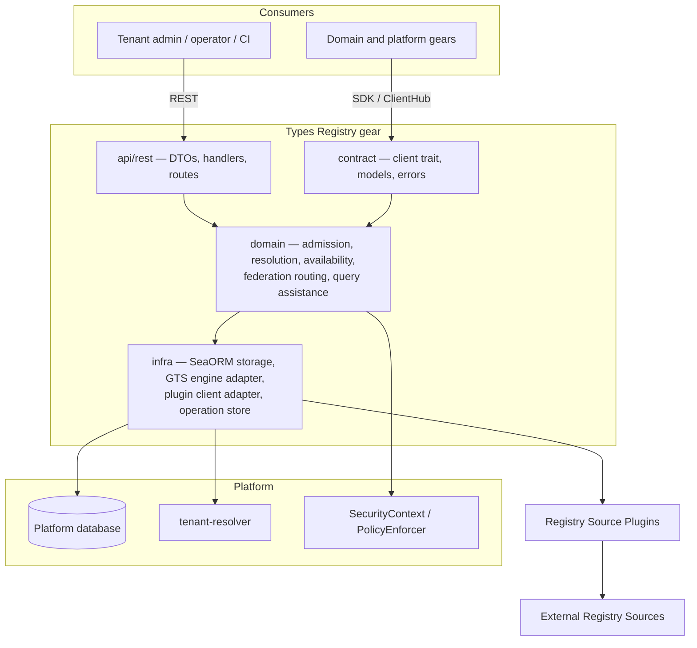
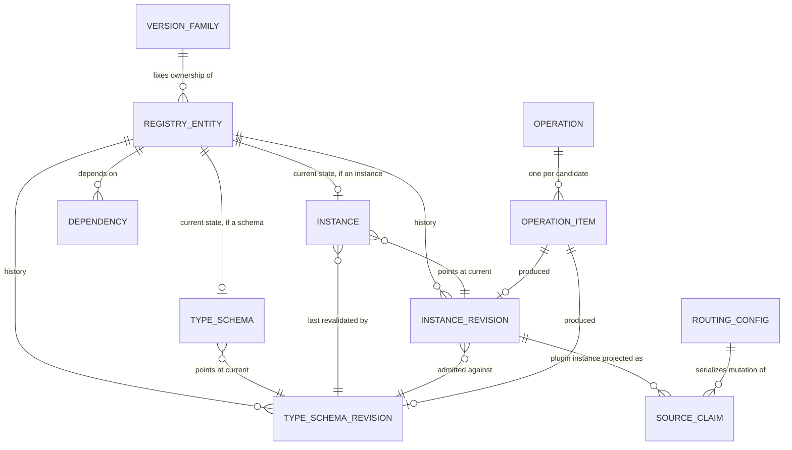
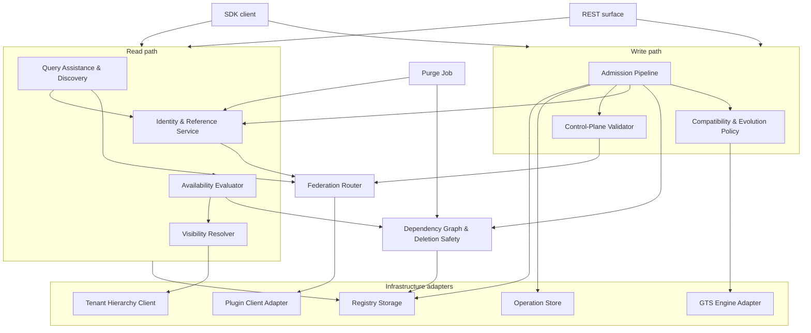

# Technical Design — Types Registry

- [ ] `p1` - **ID**: `cpt-cf-types-registry-design-types-registry`

## Table of Contents

<!-- toc -->

- [1. Architecture Overview](#1-architecture-overview)
  - [1.1 Architectural Vision](#11-architectural-vision)
  - [1.2 Architecture Drivers](#12-architecture-drivers)
  - [1.3 Architecture Layers](#13-architecture-layers)
- [2. Principles & Constraints](#2-principles--constraints)
  - [2.1 Design Principles](#21-design-principles)
  - [2.2 Constraints](#22-constraints)
- [3. Technical Architecture](#3-technical-architecture)
  - [3.1 Domain Model](#31-domain-model)
  - [3.2 Component Model](#32-component-model)
  - [3.3 API Contracts](#33-api-contracts)
  - [3.4 Internal Dependencies](#34-internal-dependencies)
  - [3.5 External Dependencies](#35-external-dependencies)
  - [3.6 Interactions & Sequences](#36-interactions--sequences)
  - [3.7 Database schemas & tables](#37-database-schemas--tables)
  - [3.8 Deployment Topology](#38-deployment-topology)
- [4. Additional context](#4-additional-context)
  - [Open questions](#open-questions)
  - [Benchmark profile](#benchmark-profile)
  - [Implementation prerequisites](#implementation-prerequisites)
- [5. Traceability](#5-traceability)

<!-- /toc -->

## 1. Architecture Overview

### 1.1 Architectural Vision

Types Registry is a control plane for type contracts. It owns the identity, definition, evolution, and platform-facing usability of GTS Type Schemas and registered GTS Instances, and it owns none of the runtime objects that conform to them. Every other gear reaches it through one SDK and one REST surface, whether the entity it asks about is stored here or lives in a vendor's own registry.

Four decisions give the architecture its shape. First, **identity is derived rather than allocated**: a Registry Reference is a deterministic UUID computed from the canonical GTS Identifier, so the same contract carries the same reference in every installation with no allocation state to transport, and domain gears persist that UUID instead of an identifier string (ADR-0001). Second, **a managed identifier is a mutable logical entity with an immutable revision history**: the major-only GTS Identifier names a channel, not a snapshot, and successive definitions are internal revisions admitted under one enforced backward-compatibility mode — with one exemption, major 0, which marks a contract still being designed and is quarantined so the exemption cannot reach anything else (ADR-0003, ADR-0004, ADR-0005, ADR-0006, ADR-0015). This buys stability of stored references at the cost of making every resolution result something that has to be validated rather than assumed current. Third, **every actual mutation is an asynchronous operation guarded by optimistic concurrency**: a caller reads the current entities, omits authored content that is already equal, and submits the remaining candidates with an entity-level precondition. The API durably binds the `Idempotency-Key` to the request fingerprint on the operation row itself, persists the operation and its candidates, atomically enqueues the operation through the ToolKit transactional outbox, and returns the operation UUID. Acceptance has exactly one successful shape: there is no synchronous path, because a batch that equals current state is unreachable for a caller honouring its own preconditions, and a caller that has reconciled sends no request at all. A worker performs dependency-aware partial admission and records an independent outcome for every candidate GTS Identifier. Fourth, **federation is live delegation across a closed boundary**: external definitions are never projected into local storage, and the managed and externally managed identifier spaces are disjoint — no reference or derivation crosses in either direction. Every guarantee the platform offers for a managed entity is therefore enforceable from local state alone, without a plugin call on the managed read path and without depending on data a plugin chose to supply (ADR-0002, ADR-0007, ADR-0011).

The performance shape follows from a property of GTS itself: the derivation chain of a type is encoded in its identifier. `GtsId::chain_ids()` reconstructs every base from the string alone, so hierarchy questions need no graph traversal, and a pattern compiles to a bounded range predicate over the canonical identifier — an index range scan whose candidates the GTS matcher then confirms, since matching is segment-wise and field-wise rather than character-wise. What is not identifier-derivable — `$ref` and `x-gts-ref` targets — is kept as a flat edge set between managed entities, used for deletion safety and impact analysis, off the read path.

A revision and a current-state projection hold different facts rather than two copies of one. The revision is the immutable admission snapshot: the authored document, its hash, and the specification and implementation versions the verdict was computed under. It retains neither the effective artifacts nor the dependency revisions they were resolved against, because nothing reads the admission-time resolution — compatibility compares a candidate against the current revision, and the one backward-looking operation, the repair that follows a semantic change of the compatibility relation, resolves both sides against the dependencies current at repair time (ADR-0003, ADR-0005). The current-state projection holds what the revision cannot: for a Type Schema, the effective schema, traits, and trait schema resolved against the dependencies that are current now, recomputed when a floating dependency advances without producing a new authored revision here; for an Instance, the Type Schema revision that most recently revalidated its unchanged value. That divergence is what makes the projection a distinct fact rather than a cache of the revision. An ordinary read therefore joins the identity row to the appropriate current-state projection and, for the authored document or Instance value, to the revision it points at; revision tables are otherwise reserved for admission, history, diagnostics, and purge.

### 1.2 Architecture Drivers

#### Functional Drivers

| Requirement | Design Response |
|-------------|------------------|
| `cpt-cf-types-registry-fr-id-resolution` | Deterministic derivation of the Registry Reference from the canonical identifier; durable forward/reverse mapping with tombstones for Managed Entities; ordered plugin chain for references not resolved locally. |
| `cpt-cf-types-registry-fr-register-schemas`, `cpt-cf-types-registry-fr-register-instances` | Read/reconcile/conditional-write over an entity `resource_version`; one acceptance shape, always an asynchronous operation carrying its own request-key idempotency, with durable per-candidate state and dependency-aware partial admission. The no-op fast path lives in the caller, which sends no request when nothing differs. |
| `cpt-cf-types-registry-fr-dry-run` | A boolean mode on the operation, orthogonal to its kind and part of the request fingerprint; the admission pipeline runs its whole check sequence and suppresses the commit, so the checks cannot drift from the ones admission applies. Same acceptance shape, so P2 hooks do not withdraw it. |
| `cpt-cf-types-registry-fr-validate-schema-compat` | Backward-only enforcement against the current revision, computed on the resolved effective schema and recorded with the specification and implementation versions used, so a semantic change to the relation can be detected and the affected chain frozen. The relation is well-posed because one dialect governs every revision of an entity. Major 0 is exempt from the check and quarantined from every entity that is not, by one comparison over the same closure the dialect check reads. |
| `cpt-cf-types-registry-fr-validate-type-derivation` | Derivation chain taken from the identifier and validated against every base in it; derivation from an externally managed base rejected; one dialect across the resolution closure, so no base is reinterpreted under a dialect other than the one it was authored in. |
| `cpt-cf-types-registry-fr-gts-validation` | All GTS semantics reached through the engine adapter; managed content profile narrowed to Draft-07 with the dialect pinned at initial admission, checked synchronously on the submitted document and never persisted; no dialect check on the federation path. |
| `cpt-cf-types-registry-fr-ref-tracking` | Flat dependency edge set between managed entities covering `$ref`, `x-gts-ref`, and Instance-to-schema; authoritative for deletion safety, evaluated without contacting any plugin and without consuming plugin-supplied data. Admission additionally refuses an edge from a stable subject to an unstable target, so the quarantine of ADR-0015 is a property of which edges may be written rather than a filter applied when they are read. |
| `cpt-cf-types-registry-fr-type-query-assistance` | Pattern compiled to a range predicate over the canonical identifier, post-filtered by the GTS matcher, expanded source-major, and returned as one complete bounded set of Registry References or a structured limit failure. |
| `cpt-cf-types-registry-fr-tenant-ownership` | Ownership scope stored on every Managed Entity; visibility evaluated as the directed descendant relation using the tenant ancestor chain, with disclosure bounded to name availability on the registration surface. |
| `cpt-cf-types-registry-fr-registration-authority` | Global writes accepted only on the platform plane under `PlatformSecurityContext`; tenant writes authorized by the PDP against the candidate's GTS Identifier as a resource property, evaluated before identifier availability so the bounded name-availability disclosure cannot become a namespace probe. |
| `cpt-cf-types-registry-fr-tenant-availability` | Verdict computed by the registry from the entity's own state and the requesting tenant's ancestor chain, as one SQL predicate; never recomputed by consumers. In P1 no dependency can make a visible entity unavailable, so no closure is traversed. |
| `cpt-cf-types-registry-fr-lifecycle` | `ACTIVE` and `DELETED` for Managed Entities; no newest-member statement, with exact family enumeration offered as a discovery filter instead; deletion blocked from local state while any registered dependent exists. |
| `cpt-cf-types-registry-fr-externally-managed-entities` | No row, column, or projection of an external entity anywhere in §3.7; results enter live, are checked against the platform invariants of §3.2 — identifier integrity, derived reference equality, claim conformance, entity kind, ownership scope, revision and hash consistency — and leave. The managed-only tail of the read result sits in an `Origin` variant rather than in nullable fields, so a write precondition on an external entity does not compile. Returned content is never parsed, so the external half of the boundary rule is declared and not enforced. |
| `cpt-cf-types-registry-fr-registry-federation`, `cpt-cf-types-registry-fr-registry-source-routing` | Managed storage consulted first, then non-overlapping Source Claims in deterministic priority order; claims are rooted single-segment patterns, so an identifier's owning source follows from its first segment, an external entity's whole derivation chain sits in one claim, and the two identifier spaces stay disjoint; capability profile enforced at claim activation, with no write path granted to a plugin. |
| `cpt-cf-types-registry-fr-cache-freshness-metadata` | Every read carries an opaque composite validator, computed per request and never stored, published atomically with the mutation that invalidates it. Its components differ by origin: a managed one digests entity revision, closure fingerprint, tenant ancestor-chain version, and the normalized projection, while an external one additionally carries the source's revision and hash verbatim, because the registry keeps no copy to compare against. |
| `cpt-cf-types-registry-fr-client-cache` | One SDK store per client instance, keyed by entity key, Context Tenant, and normalized projection because the validator digests the last two; bounded staleness whose safe direction comes from ADR-0003, with unstable entities excluded from it; revalidation coalesced onto the caller's own batch read rather than scheduled; fail-closed on revalidation failure. |
| `cpt-cf-types-registry-fr-two-phase-init` | One plane per batch, dependency-aware partial admission with atomic cyclic dependency groups, no global startup barrier, and readiness gated by each registrant on its own required candidate outcomes. |

#### NFR Allocation

| NFR ID | NFR Summary | Allocated To | Design Response | Verification Approach |
|--------|-------------|--------------|-----------------|----------------------|
| `cpt-cf-types-registry-nfr-lookup-latency` | Exact lookup p95 < 10 ms | Resolution path: identity mapping, current-state read, availability evaluation | Reference derived in-process rather than looked up; effective content read from the current-state row and authored content from the single revision it points at, both keyed on the entity with no history scan; availability decided in SQL from the entity's own state plus a cached tenant ancestor chain, with no dependency traversal; no plugin call can occur on a managed path because ADR-0011 admits no edge across the boundary in either direction. | Automated benchmark against the profile in §4, *Benchmark profile*. |
| `cpt-cf-types-registry-nfr-query-latency` | Bounded search p95 < 100 ms (P2) | Discovery and query assistance | Pattern compiled to an index range predicate over the canonical identifier; over-returned candidates filtered in memory by the GTS matcher; federated expansion source-major with bounded internal paging. | Automated benchmark against the profile in §4, *Benchmark profile*. |
| `cpt-cf-types-registry-nfr-multi-pod-correctness` | Committed mutations visible on every pod's first post-commit read | Storage, outbox worker, and caching layers | The platform database is the only authoritative store; the leased ToolKit outbox excludes concurrent claims while idempotent admission commits remain safe after lease expiry or duplicate delivery; every state transition and its validator metadata commit in one transaction; process-local state is confined to derived caches that are validated against a committed token before use and never consulted as authority. | Integration tests exercising duplicate delivery, lease expiry, concurrent first-family admission, and commit-then-read across pods. |
| `cpt-cf-types-registry-nfr-cache-correctness` | No invalidated result accepted as current | SDK client cache | Opaque composite validator returned with every result and required on revalidation; past its freshness window an entry is served only if the registry confirms it, a failed revalidation is not served at all, and a successful mutation drops its own keys. §3.3, *The client-side cache*. | Integration tests covering mutation, revalidation, stale-entry rejection, and the unstable-entity carve-out. |

#### Key ADRs

| ADR ID | Decision Summary |
|--------|-----------------|
| `cpt-cf-types-registry-adr-storage-identity-query-model` | Domain gears persist an opaque Registry Reference UUID derived deterministically from the exact client-supplied GTS Identifier. |
| `cpt-cf-types-registry-adr-external-source-live-delegation` | Externally managed definitions and tenant state are delegated live to the owning Registry Source Plugin, never projected. |
| `cpt-cf-types-registry-adr-type-schema-evolution-compatibility` | Managed Type Schemas evolve under `BACKWARD` compatibility, compared against the current revision only. |
| `cpt-cf-types-registry-adr-gts-minor-version-identity-evolution` | Managed identifiers carry no minor version and name a mutable logical entity within one major. |
| `cpt-cf-types-registry-adr-type-schema-revisions` | Every admitted Type Schema definition is an immutable retained revision with optimistic concurrency on the logical entity. |
| `cpt-cf-types-registry-adr-registered-instance-revisions` | A registered Instance is a mutable logical entity whose every admitted value is an immutable revision bound to the Type Schema revision that validated it. |
| `cpt-cf-types-registry-adr-federated-source-routing-query` | Ordered resolver chain over non-overlapping Source Claims, managed storage first, source-major federated traversal. |
| `cpt-cf-types-registry-adr-managed-version-family-lifecycle` | Several majors of a family may be `ACTIVE`; the registry names no newest member, and managed deprecation is deferred past P1. |
| `cpt-cf-types-registry-adr-tenant-ownership-visibility-authority` | Two ownership scopes; tenant-owned entities visible down the tenant subtree; visibility never implies authority. |
| `cpt-cf-types-registry-adr-tenant-availability-evaluation` | Availability follows the live semantic dependency closure, independently of whether effective artifacts are materialized, and propagates transitively along outgoing edges only. |
| `cpt-cf-types-registry-adr-managed-external-boundary` | The managed–external boundary is closed in both directions; Source Claims are rooted single-segment patterns, plugins are read-only, and a retired Source Claim reserves its space until the plugin is purged. |
| `cpt-cf-types-registry-adr-write-path-admission-protocol` | Read/reconcile/conditional-write, one always-asynchronous acceptance shape, immutable request-key replay on the operation itself, per-candidate optimistic preconditions and outcomes, dependency-aware partial admission, and control-plane records with built-in validators. |
| `cpt-cf-types-registry-adr-platform-purge-of-deleted-entities` | Physical removal exists only as one explicit operator-invoked purge, which releases the GTS Identifier and is disabled by default. |
| `cpt-cf-types-registry-adr-managed-type-schema-dialect-profile` | Managed Type Schemas declare Draft-07 in P1, the dialect is pinned at initial admission, and P2 widening is governed by dialect uniformity across the resolution closure. |
| `cpt-cf-types-registry-adr-major-zero-unstable-profile` | Major 0 marks a Type Schema whose evolution is unenforced; nothing outside the profile may depend on one, and graduation is an ordinary registration of v1. |

### 1.3 Architecture Layers

- [ ] `p2` - **ID**: `cpt-cf-types-registry-tech-layering`



| Layer | Responsibility | Technology |
|-------|---------------|------------|
| Presentation (`api/rest/`) | Authenticated REST surface for management, discovery, resolution, validation, and operations; DTOs with OpenAPI schemas | Axum via ToolKit `OperationBuilder`, utoipa, RFC-9457 problem details |
| Contract (`contract/`) | Transport-agnostic client trait and models used by other gears through the typed ClientHub | Rust traits, plain domain models, no serde or HTTP types |
| Domain (`domain/`) | Admission and compatibility, revision and concurrency control, identity and reference resolution, dependency and deletion safety, availability evaluation, federation routing, query assistance, built-in control-plane validators | Rust, `gts-rust` for all GTS semantics |
| Infrastructure (`infra/`) | Authoritative persistence, operation and idempotency store, GTS engine adapter, tenant hierarchy client, Registry Source Plugin clients | SeaORM over SQLite / PostgreSQL / MySQL, ToolKit scoped ClientHub, `tenant-resolver` SDK |

Two rules constrain the layering beyond the standard gear structure. All GTS semantics — parsing, canonicalization, pattern matching, reference extraction, resolution, compatibility, content-model classification — are reached only through the infrastructure adapter over `gts-rust`; the domain layer never reimplements or approximates them. And no authoritative decision is ever taken from process-local state: caches exist, but each is a derived projection validated against a committed token before use.

## 2. Principles & Constraints

### 2.1 Design Principles

#### Authority is local

- [ ] `p2` - **ID**: `cpt-cf-types-registry-principle-local-authority`

Every guarantee Types Registry offers for a Managed Entity must be decidable from state Types Registry owns. No authoritative decision — admission, deletion, availability, routing activation — may depend on the uptime, latency, honesty, or diligence of a component the platform does not operate.

This is what closes the managed–external boundary in both directions and splits plugin capabilities into authoritative and advisory. An advisory output may degrade with a stated warning; an authoritative one may not degrade at all.

The last word in that list is the one that decided the boundary. Data a counterparty supplies makes a decision independent of its *uptime* while leaving it dependent on its *diligence*, and the second is not observable: a plugin that never registers a dependency is indistinguishable from one that has none, so the registry would believe a managed type unreferenced and permit a deletion that breaks a consumer. Closing the boundary removes the class rather than mitigating it — there is nothing to register because nothing can depend across.

**ADRs**: `cpt-cf-types-registry-adr-managed-external-boundary`, `cpt-cf-types-registry-adr-external-source-live-delegation`, `cpt-cf-types-registry-adr-federated-source-routing-query`

#### Derive facts, materialize computations

- [ ] `p2` - **ID**: `cpt-cf-types-registry-principle-derive-not-store`

A fact that can be computed from state already held is computed at request time, not stored. Stored copies of derivable facts need invariants to keep them truthful, serialization points to keep them consistent, and repair paths for when they drift. The derivation chain of a type and the Registry Reference of an identifier are derived for this reason.

The principle has a second edge that is easy to miss: a fact already present in what the caller receives should not be recomputed on the caller's behalf either. Version ordering within a family is the worked example — it is carried by the members' identifiers, so the registry neither stores which member is newest nor computes it, and offers exact family enumeration instead.

The principle bounds itself rather than excluding denormalization. What may be materialized is the *result of an expensive computation over transactionally known inputs* — a resolved effective schema, a dependency closure — where the set of events that change the inputs is closed and every one of them already runs in a transaction. What may not be materialized is a fact whose truth depends on state the registry does not control, because that produces a second authority.

**ADRs**: `cpt-cf-types-registry-adr-managed-version-family-lifecycle`, `cpt-cf-types-registry-adr-storage-identity-query-model`, `cpt-cf-types-registry-adr-tenant-availability-evaluation`

#### Fail closed on incomplete information

- [ ] `p2` - **ID**: `cpt-cf-types-registry-principle-fail-closed`

Absence of evidence is never evidence of absence. A source that cannot answer is not a `NOT_FOUND`; a compatibility check the implementation cannot decide is a rejection, not a pass; external state that cannot be confirmed is never `AVAILABLE`; a query whose completeness cannot be established returns a failure rather than a partial result.

The single exception is output explicitly labelled advisory — a reverse dependency-impact report — which degrades with a stated source-unavailable warning precisely because no authoritative decision reads it.

**ADRs**: `cpt-cf-types-registry-adr-external-source-live-delegation`, `cpt-cf-types-registry-adr-type-schema-evolution-compatibility`, `cpt-cf-types-registry-adr-tenant-availability-evaluation`, `cpt-cf-types-registry-adr-managed-external-boundary`

#### Identity is permanent

- [ ] `p2` - **ID**: `cpt-cf-types-registry-principle-permanent-identity`

An admitted GTS Identifier never comes to name a different logical entity. Deletion is logical and terminal, the identifier stays reserved by a tombstone, previously issued Registry References keep reverse-resolving, and a retired Source Claim remains a reservation over its identifier space.

Because references are derived rather than allocated, releasing an identifier is a data-corruption primitive rather than a storage optimization: the reused identifier reproduces the same reference and silently rebinds any domain row still holding it. Purge is the single named exception, disabled by default and guarded by deployment policy rather than by a check.

**ADRs**: `cpt-cf-types-registry-adr-storage-identity-query-model`, `cpt-cf-types-registry-adr-platform-purge-of-deleted-entities`, `cpt-cf-types-registry-adr-managed-external-boundary`

#### One public vocabulary per concept

- [ ] `p2` - **ID**: `cpt-cf-types-registry-principle-single-vocabulary`

Where two vocabularies describe one client-visible concept, only one is public. The operation resource is the sole mutation-progress contract: it exposes one operation status plus one candidate status keyed by each exact GTS Identifier. There is no second Admission Status resource, no pending logical entity, and no second acceptance shape — a redundant batch is reported as an operation whose candidates terminate `unchanged`, not as an inline receipt. The principle also decided the storage: request identity has no record of its own, because the operation already is that record. Lifecycle Status, Tenant Enablement State, and Tenant Availability State remain three distinct dimensions and are never collapsed into a single field, because each has a different owner and a different reason to change.

**ADRs**: `cpt-cf-types-registry-adr-write-path-admission-protocol`, `cpt-cf-types-registry-adr-tenant-availability-evaluation`

#### The registry governs contracts, not objects

- [ ] `p2` - **ID**: `cpt-cf-types-registry-principle-contract-not-object`

Types Registry decides what a type contract is, who may see it, and whether a tenant may use it. It never deletes, hides, or rewrites data owned by another gear on the strength of that verdict. An owning gear defines what happens to its runtime objects whose referenced entity became unavailable, and Types Registry supplies only the verdict it needs to decide.

**ADRs**: `cpt-cf-types-registry-adr-tenant-availability-evaluation`, `cpt-cf-types-registry-adr-storage-identity-query-model`

### 2.2 Constraints

#### GTS semantics belong to the platform implementation

- [ ] `p2` - **ID**: `cpt-cf-types-registry-constraint-gts-implementation`

Types Registry does not implement GTS. Parsing, canonicalization, chain derivation, pattern matching and coverage, reference extraction, schema resolution, trait merging, content-model classification, compatibility, and casting all come from `gts-rust`. Any behaviour the registry needs and the implementation lacks is a change request against `gts-rust`, not a local approximation.

The compatibility model rests on the implementation following the **GTS 0.13 semantics**, and not merely on it offering a compatibility check. Earlier specification rules report some incompatible pairs as compatible, and ADR-0003's candidate-versus-current baseline is sound only under 0.13, so the registry needs five capabilities from the implementation and cannot substitute for any of them:

- the tri-state verdict of OP#8 — compatible, incompatible, and **undecided as a distinct third answer**, since `cpt-cf-types-registry-principle-fail-closed` rejects a candidate whose compatibility cannot be established and cannot do so if undecided is reported as either of the other two;
- per-level classification of the resolved effective schema as open, closed, or partially open, which ADR-0003 makes load-bearing and requires to be computed after reference resolution rather than read off an authored keyword;
- a partially open level reported as such rather than forced into a verdict;
- property addition and removal discriminated per content model in each direction, which is where the 0.13 correction actually bites;
- the specification and implementation versions of the checker, exposed so that every admitted revision can record which rules produced its verdict.

A document-level comparison entry point is also needed, and it must **resolve both sides and fail rather than compare unresolved documents** — comparing unresolved documents would silently answer a different question from the one asked.

No library version is named here, deliberately: a pinned version would date faster than this document and would say nothing a reader could act on. What the registry depends on is the behaviour above. Whether the pinned implementation provides it is an implementation prerequisite, recorded with the others in §4.

One obligation stands regardless of which implementation satisfies it: because a checker upgrade can change the verdict for an unchanged pair of schemas, every admitted revision records the specification and implementation versions used, and ADR-0003's freeze state machine exists to handle a semantic change of the relation when it comes.

Source Claim matching needs no anchoring workaround from the registry, though it looks at first as if it might. The matcher gives a bare type-id pattern implicit coverage of the chains derived from it, which would be the opposite of what claim matching requires if a claim could slice into a chain. Under ADR-0011's closed boundary it cannot, so that implicit coverage is exactly what a claim needs; and under the rooted single-segment grammar, anchoring reduces to a grammar check — the pattern has one segment — rather than a matching concern. What the overlap test does need from the implementation is a pattern-containment primitive — does one pattern cover another — which is the sixth capability the constraint above depends on.

What the registry does owe the matcher is a post-filter, not an anchoring workaround. Pattern matching is segment-wise and field-wise rather than character-wise, and a pattern with no minor version accepts any minor, so a string range over the canonical identifier is a candidate pre-filter whose result the matcher must confirm. Managed identifiers carry no minor version under ADR-0004, so the range is exact for a managed-only scan; claim matching runs against external identifiers, which ADR-0004 permits to carry minors, so there the post-filter is load-bearing.

**ADRs**: `cpt-cf-types-registry-adr-type-schema-evolution-compatibility`, `cpt-cf-types-registry-adr-managed-external-boundary`

#### Managed Type Schemas are Draft-07 in P1

- [ ] `p2` - **ID**: `cpt-cf-types-registry-constraint-schema-dialect`

A managed Type Schema declares JSON Schema Draft-07 and nothing else in P1, and the dialect a logical entity is admitted under never changes. This is a third narrowing of the managed profile alongside ADR-0004's prohibition on minor versions and ADR-0001's on an explicit UUID tail, and it exists for the same reason: to keep a platform guarantee decidable.

Both relations the registry enforces are set inclusions over accepted instances, and a set is only defined once a dialect is fixed. GTS makes the dialect a per-document property (§11.0) while defining every verdict relative to the declaring document's dialect (§4.3), and says nothing about a closure whose members disagree. The platform implementation does resolve that case, but not in a way an authoritative decision can rest on: `resolve_schema_refs` strips `$id` and `$schema` from every fragment it inlines at a non-root position, and the effective traits schema is composed under the **leaf** document's dialect with each ancestor's stripped. The referring document's dialect therefore governs the whole resolved closure, and because JSON Schema ignores keywords it does not recognize, a mismatch deletes constraints instead of failing — a base closed by `unevaluatedProperties: false` reads as open to a Draft-07 dependent, and a Draft-07 base using tuple `items` loses its positional constraint under a Draft 2020-12 dependent.

Pinning the dialect also keeps the freeze state machine on one axis. A dialect change would break the transitivity that makes candidate-versus-current sufficient, in exactly the way a semantic change of the compatibility relation does, but per-entity and author-initiated rather than platform-wide — and the repair pass that restores the guarantee would itself be ill-posed, because it would compare two retained revisions whose accepted-instance sets are defined under different validation semantics.

The check is one comparison over the submitted document, so it belongs with the synchronous envelope validation rather than in the worker, and the value is not stored: it is a top-level key of a document the registry retains in full, and admission already loads every closure member to resolve references. When P2 widens the admissible set, the rule is dialect uniformity across the resolution closure — the `$id` chain plus `$ref` targets including those inside `x-gts-traits-schema`, but not `x-gts-ref` targets, which are never inlined. P1 is that rule's degenerate case, so widening is additive.

Externally Managed Entities are out of scope, and safely so only because ADR-0011 closes the boundary: no external document can enter a managed resolution closure, so its dialect can never reach a managed verdict. Reading `$schema` from returned external content is prohibited for the same reasons ADR-0011 permanently rejected content parsing on the federation read path.

**ADRs**: `cpt-cf-types-registry-adr-managed-type-schema-dialect-profile`, `cpt-cf-types-registry-adr-type-schema-evolution-compatibility`, `cpt-cf-types-registry-adr-managed-external-boundary`

#### One authoritative database per installation

- [ ] `p2` - **ID**: `cpt-cf-types-registry-constraint-single-installation`

An installation of Types Registry has exactly one authoritative database, served by many pods. Every guarantee in this document is a guarantee about that database.

Deterministic reference derivation is a portability property rather than a coordination mechanism: two installations that admit the same GTS Identifier produce the same Registry Reference, so domain data, fixtures, and exported contracts mean the same thing in both without any mapping being transported. Nothing requires them to hold the same entities. Compatibility fixtures pin representative `GTS Identifier → UUID` mappings so that an implementation or `gts-rust` upgrade cannot silently change persisted identities.

**ADRs**: `cpt-cf-types-registry-adr-storage-identity-query-model`, `cpt-cf-types-registry-adr-platform-purge-of-deleted-entities`

#### Three database backends

- [ ] `p2` - **ID**: `cpt-cf-types-registry-constraint-multi-backend`

Storage must behave identically on SQLite, PostgreSQL, and MySQL. Identifier range predicates are expressed as explicit bounds rather than pattern operators, so the index is used the same way on all three. UUIDs use a native column type where one exists and a consistent 16-byte representation where it does not. Any set-membership constraint large enough to meet a backend parameter limit is chunked by a shared repository helper rather than by each call site. Compare-and-swap is expressed once in the repository layer and never leaks into the domain.

Transitive dependency questions are answered by a **recursive CTE** over `dependency`, and no transitive closure is materialized. All three backends support one — PostgreSQL since 8.4, SQLite since 3.8.3, MySQL since 8.0.1, and MySQL 8.0 is already the floor because the `toolkit-db` outbox needs `FOR UPDATE SKIP LOCKED` from the same release. This is the most backend-divergent construct in the design and therefore the one most tightly constrained: the traversal uses `UNION` and never `UNION ALL`, because the graph can contain cycles and the resulting non-termination would fail differently on each backend rather than uniformly; the recursive term carries no depth or other per-row accumulator, which would defeat the deduplication that `UNION` is there to provide; and the query is written once in the repository, since the self-reference-once restriction that shapes it is a storage fact the domain must not have to know. `database.sql` states each of these beside the table they constrain, and §4 records both the unverified `sea-query` expression of a parameterised recursive CTE and the remedy if MySQL — whose implementation materializes the working set into an unindexed temporary table — does not hold up.

**ADRs**: `cpt-cf-types-registry-adr-storage-identity-query-model`

#### Types Registry is on every gear's boot path

- [ ] `p2` - **ID**: `cpt-cf-types-registry-constraint-boot-path`

Because every other gear may depend on it, anything Types Registry waits for during startup is something the platform waits for. It publishes ready when its own storage is ready, has no notion of an expected registration set, and never blocks on a registrant. Registrants retry and gate their own readiness.

**ADRs**: `cpt-cf-types-registry-adr-write-path-admission-protocol`

#### The tenant hierarchy is a read-path dependency

- [ ] `p2` - **ID**: `cpt-cf-types-registry-constraint-tenant-hierarchy`

Visibility of a tenant-owned entity is the directed descendant relation, so the ancestor chain of the requesting tenant is an input to almost every read. It is obtained from `tenant-resolver` with barrier traversal disabled, because contract visibility flows from ancestor to descendant and is orthogonal to the barriers that protect descendant data from ancestor access. Since it sits inside the 10 ms budget, the chain is cached per tenant and its version participates in the resolution validator.

**ADRs**: `cpt-cf-types-registry-adr-tenant-ownership-visibility-authority`, `cpt-cf-types-registry-adr-tenant-availability-evaluation`

#### Registry content carries no secrets and no personal data

- [ ] `p2` - **ID**: `cpt-cf-types-registry-constraint-no-sensitive-content`

Schema documents, Instance values, and revision metadata must not contain secrets, credentials, keys, tokens, or personal data.

Retention is unbounded by policy: no time-to-live and no background sweep ever removes an admitted revision, and the one operation that removes anything physically also releases the GTS Identifier and is therefore disabled in production. Admitted content in a production deployment is consequently unremovable.

That makes this prohibition the only control rather than one of several, which is why it is a constraint and not a guideline. ADR-0013 records why no erasure mechanism is offered instead: the registry stores contracts authored about contracts, and a mechanism that reached only the live dataset, only deleted entities, and never identifiers would invite reliance it could not support.

**ADRs**: `cpt-cf-types-registry-adr-registered-instance-revisions`, `cpt-cf-types-registry-adr-type-schema-revisions`, `cpt-cf-types-registry-adr-platform-purge-of-deleted-entities`

## 3. Technical Architecture

### 3.1 Domain Model

**Technology**: GTS identity and schema semantics through `gts-rust`; plain Rust domain types; SeaORM entities in `infra/storage`.

**Location**: persisted half in [database.sql](./database.sql); the Rust types do not exist yet.

The model has an unusual shape for a registry, and the shape is the decision rather than a detail of it. A managed GTS Identifier names a **mutable logical entity** whose content history is **immutable** (ADR-0004, ADR-0005, ADR-0006), so identity, current state, and history are three different things about one entity rather than one record with a version column. Layered on that, a large part of what the gear returns is **not stored at all**: the Registry Reference is derived from the identifier, availability and the freshness validator are computed per request, and an Externally Managed Entity is never persisted in any form.

#### Core entities

- [ ] `p2` - **ID**: `cpt-cf-types-registry-entity-model`

| Entity | Description | Schema |
|---|---|---|
| Registry Entity | One admitted managed GTS Identifier, of kind Type Schema or registered Instance. Carries identity, ownership, the owning gear, lifecycle, and the `resource_version` that write preconditions test. Survives deletion as the tombstone that keeps a previously issued reference resolvable | `entity`, plus the kind-specific current-state row `type_schema` or `instance` |
| Revision | One immutable admitted definition or value, with the content hash and the specification and implementation versions its verdict was computed under | `type_schema_revision`, `instance_revision` |
| Version Family | The set of Version Successors of one another, named by the family key of ADR-0004. Holds an ownership scope and nothing else | `version_family` |
| Dependency | A direct edge between two Registry Entities: `$ref`, `x-gts-ref`, immediate derivation base, or Instance conformance. Nothing transitive is stored | `dependency` |
| Operation | One accepted mutation: its scoped request identity, its client-visible progress, and one durable outcome per candidate identifier | `operation`, `operation_item` |
| Registry Source | Where an identifier is authoritative — managed storage, or an External Registry Source behind a claim. Managed storage is implicit; a claim is a projection of a plugin's registered Instance and outlives it as a reservation | `source_claim`, `routing_config` |

#### Current state is not a cache of the revision

The distinction is load-bearing and is the reason `type_schema` exists beside `type_schema_revision` rather than being a view over it. A revision holds what was *authored* and admitted. The current-state row holds what the authored content *resolves to* against the dependencies that are current now — and that changes when a floating dependency advances, with no new revision here and no `resource_version` movement. §1.1 sets out why neither the effective artifacts nor the dependency revisions are retained on the revision itself.

For a registered Instance the divergence is smaller but the same in kind: the current row records which Type Schema revision most recently revalidated an unchanged value, which the revision cannot know.

#### Values that are computed, never stored

| Value | Computed from | Why not stored |
|---|---|---|
| Registry Reference (`gts_uuid`) | the canonical identifier, deterministically | A stored copy would be a second authority over a derived fact. It is nevertheless a column, because a hash is not invertible and reverse resolution needs an index over it — and its uniqueness constraint is ADR-0001's collision detector |
| Tenant Availability State | lifecycle, visibility, the requesting tenant's ancestor chain, and live source state where applicable | It is per-tenant, so there is no single value to store, and ADR-0010 requires it to follow the live semantic closure rather than an admission snapshot |
| Freshness validator | for a Managed Entity, `resource_version`, `resolution_fingerprint`, the tenant ancestor-chain version and the normalized projection; for an external one, the source's revision and hash plus the routing generation | It is per-projection and per-tenant, so there is no single value to store, and a stored table of issued tokens would grow with readers rather than entities. For an external entity it also cannot be digested, so the source's token is carried inside it (§3.3) |
| Per-level content model and evolvability | the resolved effective schema | A pure function of a column in the same row, wanted off the hot path, and returned by a compatibility check as a by-product anyway |
| Derivation chain | the identifier, through `chain_ids()` | GTS encodes it in the string; storing it would need an invariant to keep it true. The one exception is the immediate base, stored as a dependency edge so that one recursive query can span every edge kind |
| Whether an entity is unstable | the major version of the last segment of the identifier | A substring of a column the registry already holds. ADR-0015 keeps it there rather than in a `stability` column for the same reason ADR-0014 keeps the dialect out of one, and with a second benefit: because an identifier never changes, a closure that satisfied the quarantine rule at admission satisfies it forever |

#### Externally Managed Entities are not in this model

They have no representation here — no row, no projection, no cached identifier. They enter as a live result, are validated against platform invariants, and leave. ADR-0011 closes the boundary in both directions, so no dependency edge, no derivation, and no availability-blocking relationship crosses it, and the model above is complete for everything the registry decides from its own state.

What the two share is the read contract: §3.3 gives them the same result shape, with the managed-only tail — `resource_version` and the timestamps — carried in a variant rather than as nullable fields.

#### Relationships



Four of these carry an invariant worth stating outright, because none of them is enforced by the relationship alone.

**A Version Family fixes ownership before any member exists.** That ordering is the whole reason the row exists: two concurrent first registrations must not be able to create one family under two owners. The entity's own owner columns are a copy kept for SecureORM scoping, and admission maintains the agreement under the family row's lock rather than a constraint — a composite foreign key would silently skip the global case, where the tenant column is null. `owning_gear` is not part of that agreement and is deliberately not held by the family: it is per-entity attribution that may be restated on any admission, while family ownership is write-once and decides visibility.

**An Instance is pinned to the exact Type Schema revision that validated it,** and separately records the revision that most recently revalidated it. Neither is exposed: §3.3 removed revision numbers from the contract, and the second would invite the false inference that a value is stale, which ADR-0005 forbids by refusing to make a schema revision current while an affected Instance would cease to be valid.

**Every dependency edge has a Managed Entity at both ends,** which is what makes deletion safety decidable with every plugin unreachable. Deletion reads only the direct edges; a transitive-only dependent must not block, since it would vanish with the intermediate entity.

**A Source Claim outlives the plugin Instance it projects.** Deleting the Instance retires the claim into a reservation over the same identifier space, and only the purge of ADR-0013 removes it — because releasing that space would let a managed registration reproduce a reference that domain rows already hold.

### 3.2 Component Model

The components below are internal modules of one gear with distinct responsibilities, not deployable units — the gear itself runs as its own process and is horizontally scaled, as §3.8 describes. Of everything inside that process, Registry Source Plugins are the only part that may later move out; they are compiled into the same binary in P1, and the federation contract is written for a remote counterparty either way, so that move would change transport and deployment rather than semantics.



#### Admission Pipeline

- [ ] `p2` - **ID**: `cpt-cf-types-registry-component-admission-pipeline`

##### Why this component exists

Every mutation of registry state — initial admission, content revision, lifecycle transition, control-plane write, purge — must pass the same ordered set of checks. A batch is one durable client-visible operation, but its candidates have independent outcomes unless their dependency relation requires them to commit together. Spreading that order, partial-admission rules, or concurrency protocol across handlers would let one path skip a check another enforces.

##### Responsibility scope

Owns the candidate lifecycle and the single write contract: the dry-run mode and the suppression of the commit under it, request-identity resolution against a stored fingerprint, the synchronous whole-batch no-op proof and receipt, operation and candidate creation when work remains, dependency ordering, content-equality no-op detection inside an operation, the ordered validation sequence, optimistic concurrency against the caller-observed entity resource version and the dependency freshness used during validation, allocation of the next revision number on success, and durable status and diagnostics for every asynchronous candidate GTS Identifier. It is the only component that writes entity state.

It also owns the position of the authorization check in that order, which is load-bearing rather than incidental. **Authorization runs first, before identifier availability is evaluated at all.** The reverse order would let an unauthorized caller distinguish a free identifier from a taken one by attempting a registration, converting the deliberate name-availability disclosure of ADR-0009 into an unauthenticated probe of the whole namespace. The plane is decided by the context type rather than by the endpoint: a candidate whose requested owner is global is admissible only under `PlatformSecurityContext`, and a tenant-scoped candidate is authorized by the platform PDP for the requesting subject, the action, and the candidate's canonical GTS Identifier supplied as a resource property.

##### Read, reconcile, and conditionally register

The POST endpoint has exactly one successful response shape: `202 Accepted` with an operation UUID. The request does not wait for validation or commit, and never returns an inline admission result — not because validation finished quickly, and not because the batch turned out to change nothing. P2 semantic hooks therefore cannot change the response shape of any request.

The no-op fast path is the caller's, not the server's. A caller that reconciles before writing sends no request at all, which is strictly cheaper than any inline response the server could produce. ADR-0012 offers no server-side synchronous `unchanged` acceptance, because it would optimize a state no correct caller reaches: an absent `expected_resource_version` yields `precondition_failed` once the entity exists, and a present one fails once the content the caller read has moved. A whole batch can only be `unchanged` if the caller read current state, compared it, found equality, and submitted anyway.

The normal caller workflow is read-before-write. It batch-reads the exact identifiers it owns, compares the returned canonical authored content with the desired definitions, and does not POST candidates that are already equal. A missing candidate is submitted with no `expected_resource_version`; an existing but different one carries the `resource_version` the read returned. The tenant REST plane derives the owner from `SecurityContext`; ownership is not caller-controlled request data. Platform gears use the SDK platform plane and `PlatformSecurityContext` for global definitions.

Before accepting, the API validates the request envelope, batch size against the 100-candidate bound, uniqueness and canonical form of candidate GTS Identifiers, the declared JSON Schema Dialect of every Type Schema candidate, one common ownership and authorization scope, and registration authority for every candidate. Authorization still precedes every existence lookup. The dialect check is synchronous because it is a static property of the submitted document that needs no registry state: accepting a candidate only to fail it as an asynchronous item would defer a verdict the API already holds. It rejects an absent top-level `$schema`, a value outside the accepted Draft-07 spellings, and a `$schema` below the document root that differs from it.

The quarantine rule of ADR-0015 is checked in the same place and for the same reason, and it is cheaper than its statement suggests. The rule reads as a property of the resolution closure — the set of *documents* inlined to produce an effective schema, which is neither the dependency rows of §3.7 nor anything stored — but it needs only the **direct** references of the candidate: if every admitted entity satisfies it, no stable entity holds a direct edge to an unstable one, so no stable entity can reach one transitively either. The closure property follows by induction from the direct check, exactly as ADR-0003's whole-history guarantee follows from candidate-versus-current, and the base case is free because every entity admitted before ADR-0015 has a major of at least 1. The direct references are the derivation chain of the candidate's own identifier plus the `$ref` and `x-gts-ref` targets in the submitted document, and a major is readable from each — so the check loads no registry state and belongs with the envelope validation rather than in the worker. The API canonicalizes each authored schema or Instance value through `gts-rust`, computes a request fingerprint over the canonical body, operation kind, authorization scope, owner, and all optimistic preconditions, and resolves the mandatory `Idempotency-Key`.

The key identifies a request, not a desired state, and it is scoped to the authorization scope, the owning tenant, and the requesting principal. The principal participates so that one subject's key cannot hand another subject's response — and with it another subject's Registry References and resource versions — to a caller inside the same tenant. A matching replay returns the stored operation without consulting current entity state: `202` with the same operation while it is `pending` or `running`, `200` with the stored terminal operation afterwards. The same key with a different fingerprint returns `409 Conflict`. Consequently a later update of one of the entities cannot change the meaning of a completed request. A caller that wants to reconcile again performs a new read and uses a new key.

A dry run travels this same path. The pipeline runs every check and stops before the commit transaction, so the mode is one branch at the end rather than a parallel implementation — which is what keeps a pre-deployment verdict from drifting away from what admission will actually do. The mode is part of the fingerprint, so a dry run and the real submission that follows it are distinct requests under one key; without that the second would replay the first and never execute. It is stored on the operation and copied onto each candidate row, because `ck_tr_operation_item_state` has to require the absence of a resulting revision for a dry-run item and a CHECK cannot read another table. The per-candidate vocabulary is unchanged: a dry-run candidate that passed everything terminates `succeeded` with no revision and no resource version.

The acceptance transaction inserts the operation and all candidate rows and enqueues a ToolKit outbox message whose payload contains only the operation UUID. Request identity lives on the operation row, so acceptance is one insert into one table rather than a receipt and an operation linked one-to-one. Candidate schemas and values never enter outbox payloads or dead-letter rows. The outbox enqueue uses the same database transaction, so neither an undispatchable operation nor a message without its operation can commit. Concurrent acceptance under the same scoped idempotency key is resolved by the uniqueness constraint over `(idempotency_scope_hash, idempotency_key)`; the loser returns the winner's operation after verifying the fingerprint.

No committed, row-locked snapshot is read on the acceptance path. The content-equality rule the withdrawn synchronous predicate needed still exists, but only once, in the worker, and per candidate: a content hash is a lookup prefilter rather than the final equality proof, and effective resolved artifacts are deliberately not compared, because they are a projection of the same authored content against current dependencies and may change without an authored revision.

The outbox owns worker claiming, multi-pod exclusion, lease expiry, retry, and dead-letter infrastructure. Types Registry uses the leased, at-least-once processing mode because GTS resolution and compatibility work must not hold a database transaction open. Delivery duplication is expected: a worker may commit registry state and fail before acknowledging the outbox message. Every admission-unit commit is therefore idempotent and guarded by operation-item identity, content equality, unique revision constraints, and compare-and-swap on the current projection. Outbox lease columns are not duplicated in the operation table.

The current ToolKit API is gated by the experimental `toolkit-db/preview-outbox` feature. P1 enables that feature and treats stabilizing or explicitly accepting this dependency as an implementation prerequisite; Types Registry does not introduce a parallel lease implementation while the ToolKit facility provides the required semantics.

The end-to-end flow this pipeline drives — read, reconcile, submit, dispatch, admit, poll — is `cpt-cf-types-registry-seq-batch-admission` in §3.6.

An expected domain outcome is not an outbox processing failure. A completed operation with rejected candidates acknowledges its outbox message successfully. A transient database or infrastructure failure returns `Retry`; `Reject` is reserved for an invalid internal outbox message or another permanent dispatcher defect. P2 semantic hooks must not hold one lease while waiting indefinitely: long-running hook workflows split into bounded durable stages or admission units, each dispatched by an outbox message.

An operation has one status: `pending`, `running`, `succeeded`, `unchanged`, `partially_succeeded`, or `failed`. Progress and outcome are one field rather than two, because an outcome only ever existed under one progress value — splitting a tagged union across two columns made illegal pairs representable and needed a constraint to forbid them. Each candidate independently exposes `pending`, `running`, `succeeded`, `unchanged`, or `failed`, keyed by its exact GTS Identifier.

One rule decides what earns a status of its own: **a status distinguishes outcomes that differ in effect, and a reason distinguishes causes.** `succeeded` and `unchanged` stay apart because they differ in whether a revision now exists. Everything that produced nothing is `failed`, whatever produced it, with the cause in the structured reason.

Three values that vocabularies of this shape usually carry are deliberately absent. **There is no cancellation**: no requirement, actor, or use case asks to abandon a mutation in flight, and when P2 hooks make an operation's duration genuinely unbounded the question becomes real and can be answered then without disturbing anything decided here. **There is no expiry**: an operation whose worker dies is not stranded, because the outbox reclaims the lease and redelivers and commits are idempotent, so terminality arrives only once retries are exhausted — and by then `partially_succeeded` or `failed` already states the outcome while the per-item `error_payload` states the cause. A stalled operation past its timeout is failed for the same reason. **And there is no per-candidate `blocked`**: a candidate not evaluated to completion, because an in-batch dependency or its atomic dependency group failed, is `failed` under a `blocked_by_dependency` reason. That distinction is worth carrying — a rejected candidate needs fixing, while a blocked one may pass unchanged once the other is fixed — but it is a difference in cause, not in effect, since neither creates an entity, a revision, or a resource-version increment.

`unchanged` is preferred over `not_modified` and `already_registered`: it covers both create and update requests and does not overload HTTP `304 Not Modified`. It means the worker proved, under the supplied precondition, that this candidate already equals the current authored state and created no revision or resource-version increment. It is a guarantee about redundant submissions rather than a path a correct caller traverses, since a caller that reconciled would not have submitted the candidate and either precondition fails once the content has moved.

Aggregation follows from the two-value split: an operation whose items are all `succeeded` or `unchanged` is `succeeded`, one whose items are all `failed` is `failed`, and any mixture is `partially_succeeded`.

##### Operation retention

- [ ] `p1` - **ID**: `cpt-cf-types-registry-tech-operation-retention`

A terminal operation is removed once it is older than a configured retention window, defaulting to **30 days** — but only if nothing points at it, which in practice sharply narrows what the sweep reaches.

A successful operation is pinned by every revision it produced: `type_schema_revision.operation_item_id` and `instance_revision.operation_item_id` are `NOT NULL` with `ON DELETE RESTRICT`, and that is deliberate — it is why neither revision table duplicates the admitting principal, since the operation carrying it is always reachable. Those operations therefore live exactly as long as their revisions, which is until purge.

What the sweep removes is the unpinned remainder: **dry runs**, which produce no revision by construction, and **operations in which no candidate succeeded**. Deleting one cascades to its items and releases its `(idempotency_scope_hash, idempotency_key)` pair, so a replay presented after the window executes afresh rather than returning the stored result. That is a behaviour change and not a correctness hazard: re-running a dry run has no effect by definition, and re-running an operation that admitted nothing either fails again or succeeds because the world has since changed, which is what the caller wanted either way.

**This does not weaken ADR-0013**, though it needs saying, because that ADR bars every scheduled removal of registry state and this is a scheduled removal. What ADR-0013 protects is admitted content and identity — revisions, entities, tombstones, and the identifiers whose release would silently rebind a stored Registry Reference. An unpinned operation holds none of those, so nothing it leaves behind can rebind anything. The wording in both documents is narrowed accordingly.

Extending the sweep to reach revisions, and the operations that produced them, is D4 in §4.

##### Bounded inputs

- [ ] `p1` - **ID**: `cpt-cf-types-registry-tech-input-bounds`

Three admission inputs are unbounded unless bounded deliberately, and each lands in storage that is retained until purge.

| Bound | Value | Why this one |
|---|---|---|
| Authored document | 256 KB | The largest JSON Schema document in the repository is 14 KB and the typical one is 3–7 KB, so this is roughly seventeen times the observed maximum |
| Resolved document | 1 MB | A separate bound is required rather than convenient: derivation multiplies, so capping the authored form does not cap what the chain inlines into `resolved_schema` |
| Resolution closure | 64 documents | Bounds the work admission does — the documents it must load to resolve references and compose the effective form |

The closure bound is also the derivation-depth bound, which is why there is no second number for depth: a chain contributes one document per level, so depth can never exceed closure size. One value covers both it and `$ref` breadth, and the identifier's own 1024-character ceiling already makes an absurdly deep chain unspellable.

**Two things are deliberately not bounded, and saying so is part of the answer.**

*The number of dependents an entity has* is uncapped. A bound on it is a rule that refuses to let anything new depend on a widely used base — and the platform base types are widely depended upon by design, so the bound would bite exactly where the platform needs it not to. The work it would have limited, revalidating dependents when a target admits a revision, is already off the request path: the worker performs it outside a transaction, over a recursive CTE.

*The number of retained revisions* is uncapped, and this was already decided elsewhere rather than left open. ADR-0005 and ADR-0006 retain every admitted revision until the purge of ADR-0013, and ADR-0003 establishes that admission compares against the current revision only, so admission cost does not grow with history and no cap is needed to keep it bounded.

Entities per tenant is a quota rather than a guard — abuse control and billing, not correctness — and is not set here.

##### Dependency-aware partial admission

The P1 batch mode is **dependency-aware partial admission**, not best effort. Its result is deterministic for one committed baseline:

* independent candidates that pass every check commit even when another branch fails;
* when a candidate in the batch references another candidate, resolution selects the candidate overlay and never silently falls back to the previously committed revision of that identifier;
* if the selected dependency fails, the dependent fails with a `blocked_by_dependency` reason;
* the candidate graph is condensed into strongly connected components and processed in topological order;
* one acyclic candidate is one admission unit; every cyclic component is one atomic admission unit because its members cannot be admitted separately;
* failure of one member fails or blocks the rest of that atomic component, while unrelated components continue.

Each admission unit performs expensive parsing, resolution, compatibility, derivation, reference, and dependent-revalidation checks through `gts-rust` outside a long-lived database transaction. Validation records the current revision of the target and a revision vector for every correctness-relevant dependency. A short commit transaction first enforces the caller precondition: creation succeeds only while the exact GTS Identifier is absent, and update succeeds only while `entity.resource_version` still equals `expected_resource_version`. A target mismatch is a terminal per-item `precondition_failed`; the server does not silently rebase the caller's update. If the target still matches but an internal dependency revision changed during validation, the worker reloads and revalidates the admission unit within a bounded retry policy. Once both baselines hold, the transaction locks or creates the version-family row, inserts the immutable revision, replaces the current-state projection, replaces the entity's dependency edges, refreshes affected current effective schemas, increments `resource_version`, and records the candidate outcome and resulting version.

The version-family row is the single ownership authority. Its canonical family key is unique. Creation uses a backend-specific insert-if-absent followed by a locked read; the requested owner must equal the stored owner before any family member is admitted. The entity copy of the owner exists for SecureORM visibility and is updated only while holding the family row. Consequently concurrent registration can create at most one global or tenant-owned family, never one family for two owners.

##### Registration authority is a grant over an identifier region

- [ ] `p1` - **ID**: `cpt-cf-types-registry-tech-registration-authority`

Authority over part of the GTS namespace is granted, never acquired by registering first. The platform's canonical permission GTS Type already carries what is needed: its `resource_type` field accepts a GTS wildcard pattern, and matching follows GTS §3.6. A grant covering `gts.<vendor>.<package>.*` therefore authorizes registration inside that region and nothing outside it, with no new authorization primitive.

Two properties of the write path make this cheap. The candidate's identifier is fully known before the check, so there is no result set to filter and the decision is boolean — `require_constraints: false` under the PEP fail-closed rules, which is the "non-resource decision" case. And because the identifier is the resource property, the PDP needs no knowledge of registry storage.

The read path deliberately does not acquire the same filter. Narrowing discovery by granted pattern would need a prefix-capable predicate, and the five standard predicate types have none — it would mean registering a custom predicate type and a SQL compilation handler, which would compile to exactly the range scan §3.7 already indexes. P1 does not do this: what a caller may *see* stays the directed descendant relation of ADR-0009, and what a caller may *write* is the grant. Visibility and authority remain separate, as ADR-0009 requires.

**The region is a GTS pattern in the resource expression, matched against the candidate's canonical GTS Identifier.** The alternative — a Types-Registry resource type carrying the identifier as an attribute — is rejected: GTS §3.3 predicates express equality, so it would need a new predicate type and a compilation handler for it, and it would buy nothing, because the write-path decision is boolean over an identifier that is already fully known. Nor is the pattern form the overload it first appears to be. GTS §3.5 describes access control in exactly this shape, and for a Type Schema the entity *is* a type, so `gts.acme.crm.*` reads literally rather than by analogy.

**Where that pattern is stored is not this gear's to decide.** If it sat in the `resource_type` of a permission Instance, every grantable vendor prefix would need its own Instance, and Types Registry cannot know vendor prefixes in advance — so the region has to arrive from the identity-to-permission binding, whose data model [`PERMISSION_GTS_TYPE.md`](../../../../docs/arch/authorization/PERMISSION_GTS_TYPE.md) places out of scope for a future design. Nothing here is blocked by that: Types Registry supplies the subject, the action, and the candidate's canonical identifier as a resource property, and consumes a boolean. How a grant is stored belongs to the authorization model.

**The action vocabulary is `register`, `delete`, and `purge`.** These are what Types Registry contributes; whether they surface as three permission Instances carrying a region in `resource_type` or as three actions a binding parameterizes with one follows from the binding model above.

`register` covers initial admission **and** content revision, and that is a constraint rather than a simplification. `cpt-cf-types-registry-fr-registration-authority` requires authorization to run *before* identifier availability is evaluated, so at decision time it is not known whether the candidate exists — and therefore not known whether the act is a creation or a revision. There is nothing to select an action on. Should the split ever be wanted, the lever is the caller's **declared** precondition rather than an existence lookup: an absent `expected_resource_version` declares a creation and a present one declares a revision, both available before any read, and a false declaration fails at the commit precondition rather than at authorization.

`purge` is separate from `delete` because it is the more destructive of the two and releases the identifier (ADR-0013). A grant to retire a contract must not imply a grant to release its name.

A Dry Run carries **no action of its own** and is authorized as the operation it rehearses. ADR-0012 makes the mode "orthogonal to the mutation kind rather than a member of it", and giving it an action would make it a member.

There is **no read action**. The read path is not grant-filtered, for the reason given above.

##### Responsibility boundaries

It sequences checks; it does not implement them. Compatibility verdicts come from the Compatibility policy, GTS validity from the engine adapter, dependency safety from the dependency graph, control-plane invariants from the built-in validator, and authorization from the platform enforcer. It never rewrites a dependent's `$ref` or synthesises a derived type.

##### Related components (by ID)

- `cpt-cf-types-registry-component-compatibility-policy` — calls
- `cpt-cf-types-registry-component-dependency-graph` — calls, and writes edges through
- `cpt-cf-types-registry-component-identity-service` — calls for identifier profile and reference allocation
- `cpt-cf-types-registry-component-control-plane-validator` — calls for platform-defined types
- `cpt-cf-types-registry-component-operation-store` — owns data for

#### Compatibility & Evolution Policy

- [ ] `p2` - **ID**: `cpt-cf-types-registry-component-compatibility-policy`

##### Why this component exists

The enforced compatibility mode is policy, not computation. Which baseline a candidate is compared against, what happens when the meaning of the relation itself changes, and how a verdict is reported are decisions the registry owns even though the verdict is produced elsewhere.

##### Responsibility scope

Selects the current revision as the comparison baseline, invokes the document-level compatibility entry point on the resolved effective schemas, rejects any candidate whose compatibility cannot be established, records the specification and implementation versions used for each admitted revision, and owns the freeze state machine: a logical entity whose revision chain spans a semantic change of the relation admits no new content revision until the affected edges are revalidated, stays fully resolvable while frozen, and reports the unproven-chain state alongside any candidate verdict. It also owns per-level content-model classification and its exposure as evolvability metadata.

It owns the one exemption as well. A candidate whose own last identifier segment carries major 0 is unstable under ADR-0015: no baseline is selected, no verdict is computed, and the result reports an unenforced mode and an unenforced chain state rather than a pass. The freeze machine does not reach such an entity — there is no whole-history guarantee to protect — so the revalidation pass that follows a semantic change of the relation skips it, which also bounds the work that pass has to do. Per-level content-model classification is still computed and still exposed, because it describes the schema rather than a guarantee about it, and an author reshaping an unstable type is exactly who wants to know which levels can gain properties once it graduates.

##### Responsibility boundaries

It does not decide Type Derivation Compatibility, which is a property of the chain validated during admission, and it does not compute set inclusion itself. It makes no claim about producer conventions, reader tolerance, casting, or default materialization, and never reports one as a compatibility result.

##### Related components (by ID)

- `cpt-cf-types-registry-component-gts-engine-adapter` — depends on
- `cpt-cf-types-registry-component-admission-pipeline` — called by

#### Identity & Reference Service

- [ ] `p2` - **ID**: `cpt-cf-types-registry-component-identity-service`

##### Why this component exists

The Registry Reference is the one value other gears persist. Its derivation, its uniqueness, and its behaviour after deletion are the contract that makes stored domain data meaningful, and they must be enforced in exactly one place.

##### Responsibility scope

Derives the reference from the canonical identifier, enforces the managed identity profile — no minor version, no explicit UUID tail — maintains the durable forward and reverse mapping and its tombstones, detects and rejects identity collisions rather than selecting a winner, and performs forward and reverse resolution: locally for Managed Entities, then through the federation router in deterministic order for references it does not hold.

##### Responsibility boundaries

It resolves identity, not content or usability: the revision returned and the verdict attached to it come from storage and the availability evaluator. It does not decide whether the caller may see the result — it reports what exists, and the visibility resolver decides what may be said about it.

##### Related components (by ID)

- `cpt-cf-types-registry-component-federation-router` — delegates to
- `cpt-cf-types-registry-component-visibility-resolver` — results filtered by
- `cpt-cf-types-registry-component-gts-engine-adapter` — depends on

#### Visibility Resolver

- [ ] `p2` - **ID**: `cpt-cf-types-registry-component-visibility-resolver`

##### Why this component exists

Two rules that are easy to violate independently must hold together: a tenant-owned entity is visible only down its owner's subtree, and nothing outside a caller's visible scope may be disclosed — not existence, not metadata, not a distinguishable error.

##### Responsibility scope

Evaluates the directed descendant relation from the requesting tenant's ancestor chain, filters every read, discovery, and resolution result by it, and owns the shape of the responses that touch the disclosure boundary: an out-of-scope reverse resolution indistinguishable from an unissued reference, a registration conflict that reveals only that the name is unavailable, and a blocked deletion that reports a count without identities.

##### Responsibility boundaries

Visibility is not authority. It decides what a caller may learn, never what a caller may do; operation authorization stays with the platform enforcer. It also does not decide usability — a visible entity may still be unavailable.

##### Related components (by ID)

- `cpt-cf-types-registry-component-tenant-hierarchy-client` — depends on
- `cpt-cf-types-registry-component-availability-evaluator` — supplies visibility input to

#### Availability Evaluator

- [ ] `p2` - **ID**: `cpt-cf-types-registry-component-availability-evaluator`

##### Why this component exists

Consumers need one authoritative answer to "can this tenant use this entity now" instead of independently recombining lifecycle, tenancy, dependency, and source rules. Any consumer that recombines them will diverge from the registry the first time a rule changes.

##### Responsibility scope

Computes the verdict for one entity and one tenant from the entity's own state and the requesting tenant's ancestor chain; for an Externally Managed Entity, from the live assertions of the owning plugin alone, since no blocking edge crosses the boundary. Owns the reason vocabulary and the rule that identifies the nearest blocking target only when the caller may see it.

##### Responsibility boundaries

It computes and returns; it does not act. It never mutates an entity, never filters gear-owned data, and never treats an unconfirmed external state as available. Maintaining the closure as edges change belongs to the dependency graph; this component reads it.

##### Related components (by ID)

- `cpt-cf-types-registry-component-dependency-graph` — reads dependency edges from
- `cpt-cf-types-registry-component-visibility-resolver` — depends on
- `cpt-cf-types-registry-component-federation-router` — depends on for external entities

#### Dependency Graph & Deletion Safety

- [ ] `p2` - **ID**: `cpt-cf-types-registry-component-dependency-graph`

##### Why this component exists

Deleting a contract that something still depends on is the one registry mistake nothing can repair. The decision must be reachable from local state, with every plugin unreachable, and it must over-block rather than under-block.

##### Responsibility scope

Maintains one dependency relation holding every direct managed-to-managed dependency: `$ref` targets, `x-gts-ref` targets, an Instance's conforming Type Schema, and an entity's immediate derivation base. An `x-gts-ref` contributes an edge to the entity it **names** — the identifier itself when exact, otherwise the longest prefix of the pattern that is a valid identifier, and nothing at all when the pattern names nothing valid — so no dependency is ever on the open set a pattern matches, and registering a new entity under an existing pattern requires no re-expansion. Every dependency has a Managed Entity at both ends, so the set is complete by construction rather than by a counterparty's cooperation. Decides deletion admissibility from the direct rows alone, and answers transitive questions — the reverse impact set when a target advances a revision — with a recursive CTE over the same rows, followed by a second read of the edges among the affected set for the strongly-connected-component condensation and topological sort the worker already performs for a candidate batch. It exposes none of this as a client operation: what a caller wants to know — whether a deletion or a revision would be refused, and by what — is answered by the Dry Run of that mutation, which runs the same dependent revalidation.

##### Responsibility boundaries

It materializes no transitive relation. Derivation and Instance conformance are stored as direct edges despite following from the identifier, because a recursive CTE may reference itself only once on all three backends, so a second branch joining identifiers by prefix range is not expressible and the relation has to be uniform. That materialization is safe where a closure would not be: one edge to the immediate base, written once at admission, never updated, because an identifier never changes. It owns no plugin write path, because there is none. Advisory impact reports are labelled as such and never gate an authoritative decision.

##### Related components (by ID)

- `cpt-cf-types-registry-component-availability-evaluator` — owns data for
- `cpt-cf-types-registry-component-admission-pipeline` — called by
- `cpt-cf-types-registry-component-federation-router` — may request a source's own advisory reverse-impact report through, for diagnostics that inform no decision

#### Federation Router

- [ ] `p2` - **ID**: `cpt-cf-types-registry-component-federation-router`

##### Why this component exists

Several registry sources must appear as one contract without a projection of external state, which means routing, response conformance, and failure semantics all have to be correct at request time rather than at import time.

##### Responsibility scope

Matches a canonical identifier against active Source Claims by its first segment, orders plugins deterministically, selects at most one source for an exact identifier and every intersecting source for a pattern, fans out batch resolution so each plugin is called at most once, validates every response against the platform boundary — identifier integrity, derived reference equality, claim conformance, entity kind, revision and hash consistency — mints and validates federation cursors bound to the plugin configuration revision, and maps source outcomes onto the platform failure vocabulary without ever converting unavailability into absence.

##### Responsibility boundaries

It never persists external definitions, revisions, hashes, mappings, tombstones, or tenant state. It does not validate external content under source-owned rules, which remain the source's responsibility, and it **does not parse returned content at all** — in particular it does not extract GTS references from an external document in order to detect a reference across the managed–external boundary. That check was considered and permanently rejected in ADR-0011: it would put parsing on the live read path, make the platform read source-owned content to enforce a platform rule, and turn a documented limitation into a hard integration barrier. The consequence is that the external half of the boundary rule is declared and not enforced, and the guarantees Types Registry withholds for such a reference are enumerated in `cpt-cf-types-registry-fr-externally-managed-entities`. It does not decide whether a claim may be activated — that is the control-plane validator — and it is never reachable from a managed resolution path.

##### Related components (by ID)

- `cpt-cf-types-registry-component-plugin-client-adapter` — depends on
- `cpt-cf-types-registry-component-identity-service` — called by
- `cpt-cf-types-registry-component-control-plane-validator` — routing configuration validated by

#### Query Assistance & Discovery

- [ ] `p2` - **ID**: `cpt-cf-types-registry-component-query-assistance`

##### Why this component exists

Domain gears store references, so a user-facing type filter has to become a set of references before it can be applied to gear-owned data — and it has to be complete, because a partial set silently returns wrong rows.

##### Responsibility scope

Compiles a validated pattern into a bounded range predicate over the canonical identifier, post-filters candidates through the GTS matcher, expands compatible-version and derivation-hierarchy constraints from the identifier chain, traverses sources source-major, and returns one complete deduplicated set of Registry References — or `QUERY_EXPANSION_LIMIT_EXCEEDED`, or a failure when completeness cannot be established. Paginated discovery shares the routing and matching but exposes cursors, which query assistance never does.

##### Responsibility boundaries

It returns concrete references, never a normalized predicate or an executable plan, and never a truncated or paginated constraint. It does not apply the result to any gear's storage, and it does not decide what a gear does with references whose entities are unavailable.

##### Related components (by ID)

- `cpt-cf-types-registry-component-federation-router` — depends on
- `cpt-cf-types-registry-component-visibility-resolver` — filtered by
- `cpt-cf-types-registry-component-gts-engine-adapter` — depends on

#### Control-Plane Validator

- [ ] `p2` - **ID**: `cpt-cf-types-registry-component-control-plane-validator`

##### Why this component exists

A Registry Source Plugin registers itself as a registered Instance, and its invariants — claim non-overlap with other claims, with the managed identifier space, and with retired reservations — are statements about registry state that can only be checked against it at write time. Without an in-process validator, the routing authority of the federation subsystem would be mutable with no invariant check at all, and making it a P2 hook would require the hook system to validate itself.

##### Responsibility scope

A closed, hand-written set of validators for platform-defined control-plane types. Enforces Source Claim invariants and the capability profile required for a claim and entity kind to activate, rejects tenant-scoped registration of any control-plane type or instance, and rejects without exception any claim that overlaps a retired reservation, since ADR-0011 offers no runtime path to transfer one.

##### Responsibility boundaries

Not extensible and not registered: it is not the P2 Validation Hook mechanism and must never grow into one. It validates only types the platform itself defines — the validators are compiled in and keyed by type identifier, while the schemas they validate against are admitted through the ordinary path along with everything else, so the validator set never depends on a user-registered definition.

##### Related components (by ID)

- `cpt-cf-types-registry-component-admission-pipeline` — called by
- `cpt-cf-types-registry-component-federation-router` — governs configuration of

#### Registry Source Plugin registration

- [ ] `p2` - **ID**: `cpt-cf-types-registry-tech-source-plugin-registration`

A Registry Source Plugin does not appear in a configuration file. It registers itself the way every ToolKit plugin does — as a well-known GTS Instance of a Type Schema derived from `gts.cf.toolkit.plugins.plugin.v1~` — which means Types Registry has to define that derived type. It declares it with the `toolkit-gts` macros and reconciles it through the ordinary admission path like any other definition (§3.3, *Where the desired definitions come from*); it is a type this gear owns, not a privileged insert.

The base type already supplies most of the shape: `id` as the plugin's own GTS Instance Identifier, `vendor`, `priority` where lower wins, and a generic `properties` carrying the plugin-kind-specific spec. Types Registry's derived type puts three things in `properties` — the Source Claims the plugin asserts, the entity kinds it serves for each, and the capability declarations ADR-0007 requires before a claim may activate. Nothing about routing is invented here: `source_claim.priority` and `source_claim.plugin_entity_gts_id` are projections of the base type's `priority` and `id`.

Registration is an ordinary Instance admission on the platform plane, through the write path of ADR-0012 with its operation, idempotency key, and audit record. There is deliberately no separate plugin-registration API: routing authority is registry state, so it is governed by the mechanism that governs registry state.

The Control-Plane Validator runs before the commit and checks what only registry state can answer — that no asserted claim overlaps an active claim, a retired reservation, or the managed identifier space, the last being a prefix range scan over `entity.gts_id` — and that the declared capabilities satisfy the mandatory profile for every claimed entity kind.

The commit transaction then does three things together: it admits the Instance, writes the `source_claim` projection, and bumps `routing_config.generation` while holding that row's lock. The lock is what makes the overlap verdict sound, because validation ran outside the transaction and overlap is not expressible as a constraint — `gts.acme.*` and `gts.acme.foo.*` are distinct strings. The generation is what makes federated cursors and the in-memory claim set notice.

In P1 the plugin is compiled into the same binary. The contract is nonetheless shaped for a remote counterparty — batch calls, explicit timeouts, `SOURCE_UNAVAILABLE` distinct from `NOT_FOUND` — so moving a plugin out of process later changes transport and deployment rather than semantics. It also does not disturb why ADR-0011 closed the managed–external boundary: that argument rests on a plugin's diligence, which is a property of code the platform did not write, in-process or not.

Retirement is a governance act and never an observation of liveness. An unreachable plugin keeps its claims and a request needing it fails closed. Tying retirement to a health signal would let the claimed identifier space flicker, and not flickering is the entire purpose of a Source Claim.

**A retired reservation is not transferable at runtime.** ADR-0011 leaves no takeover operation: a claim overlapping a retired reservation is rejected, and no declared intent makes it succeed. The reason is that the assertion such an operation would carry — *I serve the same logical entities my predecessor served* — has nothing to be checked against, since the persistence rule leaves the registry holding no identifier, revision, or hash of what the predecessor served. Accepting it through an API would look like a check and be a formality.

Ordinary plugin replacement is unaffected and does not reach this rule. A plugin is a registered Instance, so replacing the implementation behind a claim is a new content revision of the same Instance: the projection is rewritten, the generation is bumped, and no reservation is involved. Only a change of the plugin's own GTS Identity leaves a reservation behind.

For that case the two paths are the purge of ADR-0013, which releases the space to whoever asks next, and a migration shipped with Types Registry, which retargets the claim rows to a named successor and leaves the space reserved throughout. The migration is the narrower act and the one to prefer; whoever writes it owes two things the ordinary write path would have done for them:

- **bump `routing_config.generation` under that row's lock.** Without it the in-memory claim set does not reload and live federated cursors do not go stale, so pods keep routing to a plugin that no longer owns the space. It is also what invalidates every previously issued freshness validator, since the routing generation is one of the validator's components — which is what stops a conditional read from being answered `unchanged` against a source that has changed identity;
- **leave the successor's Instance document and the `source_claim` projection in agreement.** The projection is derived from the document, and the Control-Plane Validator re-derives it on the next ordinary revision of that Instance. A row the document does not declare reads to that validator as a withdrawn claim, so a later routine plugin upgrade would silently undo the migration.

This settles which platform-defined control-plane type the federation subsystem needs. The P2 Validation Hook declaration is the other half and is not decided here; it is D1 in §4.

#### Supporting components

These are thin adapters and one maintenance job. They hold no policy.

**The table below is where these six component IDs are defined**, in place of the six four-heading blocks the template asks for. That is deliberate: "why this component exists" and "related components" carry no information for a repository wrapper or a scoped-ClientHub adapter, and twenty-four headings of boilerplate would bury the nine components that do hold responsibilities. The IDs are referenced from the *Related components* lists above and resolve here.

| Component | ID | Responsibility | Boundary |
|---|---|---|---|
| GTS Engine Adapter | `cpt-cf-types-registry-component-gts-engine-adapter` | Sole access to `gts-rust`: parsing, canonicalization, chain derivation, pattern matching and coverage with registry-side anchoring, reference extraction, schema resolution and trait merging, content-model classification, compatibility, casting | Holds no registry state and no policy; wraps behaviour the library lacks rather than reimplementing behaviour it has |
| Registry Storage | `cpt-cf-types-registry-component-registry-storage` | SeaORM repositories over the authoritative database; owns backend-portable range predicates, UUID representation, set-membership chunking, and compare-and-swap | Contains no domain rules; never consulted as a cache |
| Operation Store | `cpt-cf-types-registry-component-operation-store` | Public asynchronous operation resources carrying their own scoped request key and fingerprint, per-GTS-ID candidate preconditions, state, results and diagnostics, and atomic enqueue of operation UUIDs through a dedicated `toolkit-db` outbox table family. Fails a stalled operation once its timeout passes, and sweeps unpinned terminal operations past the retention window | Request identity has no record of its own; the operation is the receipt. Outbox tables own dispatch leases, attempts, retry, and dead letters; registry operation tables own only client-visible workflow state. Outbox payloads contain no candidate content. The sweep reaches no admitted content and no identity, so it is not the purge of ADR-0013 in miniature |
| Tenant Hierarchy Client | `cpt-cf-types-registry-component-tenant-hierarchy-client` | Ancestor chain of a tenant from `tenant-resolver` with barrier traversal disabled, cached with a version participating in the resolution validator | Does not interpret tenancy semantics; supplies the chain only |
| Plugin Client Adapter | `cpt-cf-types-registry-component-plugin-client-adapter` | Scoped ClientHub access to Registry Source Plugins, timeouts, concurrency limits, and per-source failure classification | Applies no platform policy to responses; conformance validation belongs to the federation router |
| Purge Job | `cpt-cf-types-registry-component-purge-job` | Operator-invoked purge over a GTS pattern, with dry run, on the platform plane; removes entity records, revisions, an emptied version family, and the operation items naming the purged identifiers, Instances before Type Schemas | Never scheduled, never automatic; disabled by default; re-evaluates deletion preconditions at execution time and writes through the ordinary write path |

### 3.3 API Contracts

- [ ] `p1` - **ID**: `cpt-cf-types-registry-interface-registration`

- **Contracts**: `cpt-cf-types-registry-interface-rest`, `cpt-cf-types-registry-interface-sdk`
- **Technology**: REST/OpenAPI over Axum through the ToolKit `OperationBuilder`; transport-agnostic Rust SDK trait resolved through the typed ClientHub
- **Location**: generated from the route registrations; no checked-in API specification file yet

This section covers the whole surface: registration, deletion, purge, the read and discovery operations, type filter expansion, and operation polling. Deletion and purge are mutations like any other and go through the write path of ADR-0012, producing an operation and carrying an `Idempotency-Key`; purge is platform-plane only, and only where deployment policy enables it.

#### Tenant REST contract

The routes below are the **tenant** surface, served on the business listener. The handler receives `SecurityContext`; `owner_tenant_id` is taken from that context and is never accepted in a request body. Registration authority is checked for every canonical GTS Identifier before any availability lookup. Nothing here can produce a global entity — that is a platform-plane operation, reached on the separate listener described under the SDK contract, and not a payload field a tenant caller can set.

**Endpoints Overview**:

| Method | Path | Description | Success | Stability |
|---|---|---|---|---|
| `GET` | `/types-registry/v1/entities/{entity_key}` | Read one visible current entity | `200` with the selected fields, or the default set; `404` when not visible or absent | unstable |
| `GET` | `/types-registry/v1/entities` | Discover visible entities by pattern and filters | `200` with one page and a cursor | unstable |
| `POST` | `/types-registry/v1/entities:batchGet` | Read an exact bounded set without GET-body or URL-length ambiguity | `200` with one result per requested key, keyed by that key | unstable |
| `POST` | `/types-registry/v1/entities` | Submit one tenant-owned registration batch with required `Idempotency-Key` | `202` with the operation, always; `200` only when replaying a key whose operation is already terminal | unstable |
| `POST` | `/types-registry/v1/entities:delete` | Submit one deletion batch, each item carrying its precondition | `202` with the operation | unstable |
| `GET` | `/types-registry/v1/operations/{operation_id}` | Poll an operation in the same authorization scope | `200` with progress and all per-GTS-ID results known so far | unstable |

**Type filter expansion is not a separate route.** A tenant user asking a domain gear for *everything of type `gts.acme.crm.*`* leaves that gear holding a pattern and a table keyed by `gts_uuid`, which a pattern cannot be matched against. What it needs is the matching references, and that is `GET /entities` with `$select=gts_uuid` and `availability=available` — paged, with the SDK's `expand_type_filter` accumulating the pages behind one call.

A dedicated complete-or-fail route was the alternative, and pagination wins on memory: producing a deduplicated set means holding it, so an unpaged operation holds the whole expansion server-side while a paged one holds a page. What it costs is atomicity. A set assembled across pages is complete with respect to the traversal rather than to an instant, because entities can be registered and deleted between the first page and the last. That is an accepted trade rather than an oversight, and `cpt-cf-types-registry-fr-type-query-assistance` and ADR-0001 were amended so that neither promises more than it delivers.

The expansion maximum is **1000 references**, and it stays **server-enforced** rather than becoming a client convention. The cursor carries the running count already served, and the page that would take the total past the maximum returns `QUERY_EXPANSION_LIMIT_EXCEEDED` instead. No up-front count is needed, which matters because counting a federated expansion would need a plugin capability the profile does not include. The refusal arrives at page `ceil(1000 / limit)` rather than before the first — but it arrives from the registry, not from whichever SDK the caller happens to be running.

Unlike the batch bound, this one is not derived from anything observable: it bounds how many types match one user-facing filter, which depends on what tenants create through the API and cannot be read off the repository. It is chosen rather than measured, and chosen from the consumer side — a thousand references is roughly 36 KB of JSON, comfortable to transfer and to chunk into a gear's own `IN` predicate, and a filter matching more than a thousand types is one whose author should narrow it. `cpt-cf-types-registry-fr-type-query-assistance` and ADR-0001 both already say that narrowing is the caller's answer to a refusal.

**The set carries no staleness contract, and that is a decision rather than an omission.** It is valid for the request that obtained it and must not be cached. It is already not a snapshot — pages are traversed over time and entities are registered and deleted between the first and the last. Attaching a validator would suggest it can be held and revalidated, which is precisely what it cannot usefully be: ADR-0010 lets an availability verdict change with **no mutation to any entity in the set**, so a validator would have to cover the availability inputs of every member for the Context Tenant, and recomputing that costs what recomputing the set costs. The consumer applies it as a query constraint inside the request it is already serving, so there is nowhere for it to be held in the first place.

One consequence to state rather than leave to be discovered: the completeness contract now lives in the SDK. A caller that goes to REST directly receives pages and accumulates them itself.

Deletion is a custom action rather than `DELETE /entities/{entity_key}` because its precondition cannot be carried by `If-Match` — see the parameter table for that operation. Once the precondition is in the body, deletion is shaped like registration in every other respect: batch, asynchronous, one durable outcome per identifier, an `Idempotency-Key`.

**There is no operation for enumerating what depends on an entity,** and the Dry Run is why. A caller asking *what breaks if I change or remove this* is asking whether the mutation would be refused and by what — which the Dry Run of that very mutation answers, running the same dependent revalidation admission runs and committing nothing. The operator path ADR-0009 promises for a deletion blocked by dependents a tenant cannot see is a Dry Run deletion on the platform plane, where the disclosure boundary does not apply. What a separate query would add beyond that is the list of dependents that would *not* break, and no requirement, actor, or use case asks for it.

`GET /entities` is discovery, filtered on what the identifier and the entity's own state can answer without touching content. Every parameter is in its own table below.

**There are no separate `/type-schemas` and `/instances` collections.** The kind is already carried by the identifier's trailing `~`, so kind-specific paths would add nothing a caller does not have and would introduce one error class that the single collection does not have — a path that disagrees with the identifier in it. Callers that want one kind filter for it. The SDK does expose kind-narrowed reads, but as convenience over the same operation rather than as a second surface.

##### Conditional reads

`cpt-cf-types-registry-fr-cache-freshness-metadata` makes conditional reads P1, and the wire mechanics differ between the two read shapes because HTTP's own mechanism does not reach a batch.

A single read uses it directly. The response carries the validator as an `ETag`; a caller returns it as `If-None-Match` and receives `304 Not Modified` with no body when it still matches. The `ETag` value and the SDK's `Validator` are the same opaque bytes, so a caller can hold one and use it through either surface.

A batch cannot: `If-None-Match` is one header for one request, and a batch needs one validator per key. The validators therefore travel in the request body alongside the keys, and each result reports `unchanged` in place of a payload. When every key is unchanged the response is still `200` with a body of `unchanged` results rather than a whole-request `304` — the body is a few bytes either way, and one shape means a caller never has to distinguish *everything is current* from *this server does not support the mechanism*.

Both surfaces obey the same scoping rule: a validator is only meaningful under the projection it was issued for, and the server detects a mismatch by recomputing rather than by recording which projection that was. A caller polling under a different `$select` than it read under simply gets a full result.

##### What a validator is made of

- [ ] `p1` - **ID**: `cpt-cf-types-registry-tech-freshness-validator`

The validator is **computed per request and never stored**, which is `cpt-cf-types-registry-principle-derive-not-store` applied rather than a decision taken here. Nothing records which tokens were issued: the server recomputes the value for the entity, the tenant, and the projection in hand, and compares it with what the caller presented. A stored table of issued validators would grow with readers rather than with entities — its cardinality is entities times tenants times projections — and it would make the registry hold state about who read what.

**Its inputs differ by origin, and one of them is not a free choice.** For a Managed Entity every component is recomputable from local state, so the token can be a digest. For an Externally Managed Entity it cannot: ADR-0002 forbids persisting an `external_revision`, so when a caller presents a validator the only place the source's token can come from is inside it. The external variant therefore carries it **verbatim and recoverably** rather than hashed — the registry decomposes the presented token, hands the plugin its own, and either reports unchanged or reassembles a fresh token around what came back.

| | Managed | Externally managed |
|---|---|---|
| `entity.resource_version` | ✓ | — |
| `type_schema.resolution_fingerprint` | ✓, Type Schemas only | — |
| tenant ancestor-chain version | ✓ | ✓ |
| routing generation | — | ✓ |
| `external_revision`, `content_hash` | — | ✓, verbatim |
| normalized projection | ✓ | ✓ |

Two rows are worth reading twice. **The routing generation belongs only to the external variant.** ADR-0011 admits no edge across the boundary, so a managed result cannot depend on any plugin and a claim change cannot alter it — including the generation in a managed validator would invalidate every managed consumer's cache for an event that provably did not reach it. On the external side it is load-bearing, because it is what makes a claim change or a retargeted reservation invalidate tokens minted against the previous source. And **`resolution_fingerprint` exists only for Type Schemas**: a registered Instance has no derived form to drift, so `resource_version` and the ancestor-chain version are a complete validator for it, which is what the `instance` table comment already says.

##### Why the projection is an input

A digest over entity state alone is blind to `$select`. The same entity read under `$select=gts_id` and under `$select=authored` has identical state, so a state-only digest matches across both — and a caller that read narrowly and then asked for the document would be told `unchanged` and never receive the document it asked for. That is the false unchanged `cpt-cf-types-registry-fr-cache-freshness-metadata` forbids, and the projection being an input is the only way to detect it, precisely because the server deliberately does not record which projection issued a token.

[RFC 9110 §8.8.3](https://www.rfc-editor.org/rfc/rfc9110#name-etag) says the same thing from the HTTP side: an entity-tag identifies **one selected representation**, and `$select` selects a different representation. One tag serving two different responses would be a conformance defect, not a local shortcut.

What enters the digest is the **normalized set of fields**, never the `$select` string. Otherwise `$select=a,b` and `$select=b,a` produce different validators for byte-identical responses and the caller pays for a full result it did not need. Normalization also maps an absent `$select` and an explicit enumeration of exactly the default set onto one value, since they are the same representation.

##### Wire form

A validator is **base64url of a small JSON object**, in the `ETag` header and in the batch body alike — the same bytes either way, which is what lets a caller hold one and use it through either surface.

JSON rather than a packed binary encoding for three reasons: the format version is a field instead of a hand-rolled leading byte, the variable-length external revision needs no length framing, and an operator debugging a stale-cache report can decode the token and see what it covers. It costs roughly twice the bytes of a packed layout — a typical managed validator is 48 characters against 24 — which is not worth a bespoke framing format on a value that is already an order of magnitude smaller than the snapshot it accompanies.

| | Typical length |
|---|---|
| Managed, 128-bit digest | 48 characters |
| Externally managed, ~32-character source revision | 152 characters |
| Externally managed, source revision at its cap | 792 characters |

A 128-bit digest is ample. A collision produces a false `unchanged`, which leaves the caller holding data it already had rather than disclosing anything, and the birthday bound of 2⁶⁴ distinct states is unreachable for a registry.

Four rules complete the form:

- **Comparison is on decoded fields, never on the encoded string.** Comparing strings would require canonical JSON serialization, and any difference in key order or spacing would produce a spurious full result. Comparing a digest against a digest removes the canonicalization requirement and the class of bugs that comes with it.
- **An unrecognized or superseded token yields a full result, never an error.** Returning the whole thing is always safe; failing the request turns a stale cache into an outage.
- **The token is not authenticated, and it does not need to be.** Forging one gains a caller nothing it cannot already have: visibility and availability are decided before the comparison, so the best outcome of a forgery is being told that data the forger already holds is current. The external variant does have one consequence — the registry hands the decoded source token to a plugin — so the plugin contract must treat it as untrusted input.
- **`external_revision` is capped** by the plugin contract. It is an opaque source-supplied string, and without a bound the validator has no bound either.

Nothing about this shape is contractual. There is no published schema, equality is the only defined operation, and the version field exists so that a token minted by an earlier shape is recognized as superseded and answered with a full result.

##### Why `batchGet` is a separate operation

It is a read-only custom action rather than a filter on the collection, and three properties separate it from `GET /entities`. They are not equally decisive, and the ranking matters when someone later proposes merging them.

**The conditional read is the one that admits no workaround.** A filter has nowhere to put N validators, and HTTP allows one `If-None-Match` per request. There is no formulation of `GET /entities?id.in=…` that carries per-key freshness, so a caller polling a set of definitions it holds would have to issue one request per definition — which is the shape the whole mechanism exists to avoid.

**An answer per key is the semantic difference.** A page cannot say *you asked about X and there is no X*, because absence from a page is bounded by pagination as well as by the filter. This one could be worked around — by declaring that `id.in` disables paging and that absence means not found — but the workaround is a second operation wearing the first one's name.

**The failure rules are opposite.** A batch reports source unavailability against the affected key and answers the rest; `cpt-cf-types-registry-fr-registry-source-routing` forbids a list from returning a partial page at all. Completeness is a property of a set, and only one of the two returns a set.

Transport is a consequence rather than a fourth reason: identifiers run to 1024 characters, a bounded batch of them does not fit a query string, and a body on `GET` is not portable — so the operation that needs a body gets `POST`. It is named `batchGet` rather than `search` because every requested key receives an explicit result.

The registration request carries an optional `dry_run` flag, defaulting to false. It changes nothing about the response shape — `202` with an operation, polled the same way — and everything about what the worker does at the end. It is not a way to ask a cheaper question: the run costs what admission costs, because it *is* admission up to the commit.

The registration request contains a non-empty `items` array of **at most 100** candidates, rejected synchronously above that before anything is stored. The largest gear in the platform today declares 26 definitions, so the bound is roughly four times the observed maximum rather than a number chosen to be round.

Splitting a batch to get under the bound is legitimate but not free, and one case cannot be split at all. A reference from one candidate to another resolves against the submitted candidate, so members separated into different batches lose that: an acyclic group still succeeds, because a candidate whose dependency is not yet registered fails retryably and succeeds on the next cycle, which `cpt-cf-types-registry-fr-two-phase-init` requires. A **dependency cycle** cannot survive the split at all — its members are admissible only together — so the bound is also the largest cycle the platform can admit. A hundred mutually referencing definitions is not a shape any real contract set has, and if one ever appears the bound is a configuration value. Each item is the authored GTS JSON and one optional `expected_resource_version`: present, the entity must still be at that version; absent, it must not exist. A literal `0` is rejected — absence already carries that meaning, and no entity ever holds version `0`, so a zero can only be caller confusion.

Registration returns one model rather than a discriminated union, because acceptance has one shape:

```text
RegistrationOperation {
    operation_id: UUID,
    status: pending | running | succeeded | unchanged
          | partially_succeeded | failed,
    items: [RegistrationItemResult]
}

RegistrationItemResult {
    gts_id,
    status: pending | running | succeeded | unchanged | failed,
    gts_uuid?,
    resource_version?,
    error?                 // structured canonical error, including precondition_failed
}
```

The response preserves request order and also carries `gts_id`; position is not the identity mechanism. `succeeded` and `unchanged` results contain the resulting `gts_uuid` and the entity `resource_version`. They do not carry a revision number: nothing in the P1 contract accepts one, and the caller's next write is preconditioned on `resource_version`. Errors use the canonical/RFC-9457 vocabulary and stable machine-readable reasons. A target optimistic-lock failure is an asynchronous item failure, not an HTTP `412`, because it is discovered after the batch has been accepted. Envelope, authorization, malformed-precondition, batch-limit, and idempotency-key failures remain synchronous HTTP errors. In particular, the same scoped key with another fingerprint returns `409 Conflict`.

The `Location` header on `202` points to the operation resource. `Retry-After` is a polling hint. A same-key replay returns the immutable stored operation: `202` while it is non-terminal and `200` after it is terminal; it never asks whether the originally submitted content still equals today's state. The key is scoped to the authorization scope, the owning tenant, and the requesting principal, so two principals in one tenant can use the same key value without one receiving the other's operation.

#### Platform REST contract

Served on the platform listener under [`cpt-cf-adr-platform-plane-auth`](../../../../docs/arch/toolkit-oop/ADR/0006-cpt-cf-adr-platform-plane-auth.md), with `PlatformIdentity` in place of a tenant token. Its callers are gears in other processes and maintenance jobs — there is no human actor here, so nothing on this surface is shaped for interactive use.

| Method | Path | Description | Success | Stability |
|---|---|---|---|---|
| `GET` | `/types-registry/v1/entities/{entity_key}` | Read one entity, any owner | `200`; `404` only when genuinely absent | unstable |
| `GET` | `/types-registry/v1/entities` | Discover across every tenant, filtered by owner | `200` with one page and a cursor | unstable |
| `POST` | `/types-registry/v1/entities:batchGet` | Cross-tenant batch read | `200` with one result per requested key | unstable |
| `POST` | `/types-registry/v1/entities` | Submit one **global** registration batch | `202` with the operation | unstable |
| `POST` | `/types-registry/v1/entities:delete` | Submit one global deletion batch | `202` with the operation | unstable |
| `POST` | `/types-registry/v1/entities:purge` | Purge over a GTS pattern, `dry_run` by default | `202` with the operation | unstable |
| `GET` | `/types-registry/v1/operations/{operation_id}` | Poll an operation | `200` | unstable |

**The paths are the same and the semantics are not.** Separation is by listener and credential, not by prefix: a request reaching the platform listener carries a workload identity that no tenant token can produce, and one reaching the business listener carries a tenant token that no gear presents. Misrouting therefore fails at authentication rather than silently returning the wrong plane's answer, which is what makes a shared path shape safe. Each listener publishes its own OpenAPI document; they are not one document with two security schemes.

Four differences run through the surface, and each comes from a decision recorded elsewhere:

- **Reads span every tenant and are not visibility-filtered.** There is no requesting tenant, so the descendant relation has no left-hand side. `404` therefore means genuinely absent, not out of scope.
- **A tenant may be named explicitly**, as `?tenant=` on a read or a body field on a batch, and the Tenant Availability verdict is returned exactly when it is. Naming one is how a job answers *why can this tenant not use this type*.
- **Ownership drops out of the result.** `owned_by_caller` compares against a caller tenant, and there is none here, so the field is simply absent. Where an owning tenant genuinely has to be named — the purge dry run, which ADR-0013 requires to be broken down by owner — the purge report carries it, rather than every entity read carrying it for one operation's sake.
- **Writes are global-only.** Ownership is derived from the requesting context and this plane has none, so a tenant-owned entity cannot be authored here. Purge is the single cross-tenant mutation, and it is destructive maintenance rather than authoring.

**Purge** takes a GTS pattern rather than a list of identifiers, and that is a correctness property rather than an ergonomic one: a registered Instance's identifier begins with the identifier of the Type Schema it conforms to, so any prefix pattern selecting a schema necessarily selects every Instance that could pin one of its revisions, and the job can remove Instances before Type Schemas without a foreign key obstructing it. `dry_run` defaults to true here — the one place in the contract where it does — because the report it produces is the point of the operation and the alternative is an operator who meant to look and instead released a namespace.

#### Parameters

One table per operation, because the parameter sets barely overlap and a combined table hides which endpoint actually accepts what. Where an operation exists on both planes, the plane-specific rows are marked; a parameter offered on one plane is **rejected** on the other rather than ignored, since silently dropping a scoping parameter is how a caller comes to believe a filter was applied.

Two things are common to every mutation and stated once: `Idempotency-Key` is a mandatory request header, scoped to plane, tenant, and principal and bound to the request fingerprint — a replay returns the stored operation, and a reuse with a different fingerprint is `409`; and every `202` carries `Location` pointing at the operation resource and `Retry-After` as a polling hint rather than a contract.

##### `GET /entities/{entity_key}`

| Parameter | Where | Meaning |
|---|---|---|
| `$select` | query | Exactly what to return; absent, the default set |
| `tenant_id` | query | The Context Tenant the availability verdict is evaluated for. On the tenant plane it defaults to the subject's own tenant and may name a descendant; on the platform plane there is no default, and omitting it leaves the verdict absent — there is no not-evaluated value |
| `If-None-Match` | request header | The validator from an earlier read. `304` with no body while it still matches |
| `ETag` | response header | The validator for this result |

##### `POST /entities:batchGet`

| Parameter | Where | Meaning |
|---|---|---|
| `keys[]` | body | Each an `EntityKey` — a GTS Identifier or a `gts_uuid` — with an optional validator that makes that one key's read conditional. Non-empty, at most 500. That exceeds the 100-candidate registration bound, which it must: reconciliation reads every identifier it might write before deciding which to submit. It is also the batch size this section keeps using as its worked example, and deliberately so |
| `$select` | body | As above, applied to every key in the batch |
| `tenant_id` | body | The Context Tenant, as above |

`If-None-Match` is deliberately unavailable here: one header cannot carry one validator per key, which is why they travel in the body and each result reports `unchanged` individually.

##### `GET /entities`

| Parameter | Where | Meaning |
|---|---|---|
| `pattern` | query | A GTS wildcard pattern. Compiles to a range predicate over the canonical identifier, which the GTS matcher then confirms |
| `depth` | query | Maximum chain length. A GTS wildcard is greedy across `~`, so a pattern alone cannot exclude types derived from what it matches; pattern plus depth is also how a version family is enumerated exactly, which is what ADR-0008 asks of discovery |
| `kind` | query | `type_schema` or `instance` |
| `origin` | query | `managed` or `external`. Restricting to `managed` selects no Registry Source, so that view survives a plugin outage which `cpt-cf-types-registry-fr-registry-source-routing` would otherwise fail closed on |
| `availability` | query | `available` or `unavailable`, evaluated for the Context Tenant. An enum rather than an available-only flag, so the vocabulary can grow with the verdict rather than being re-cut when it does. Type filter expansion sets it to `available`, since a reference the tenant cannot use has no business in a query constraint |
| `scope` | query | *Tenant plane only.* `mine` or `all`. Never a tenant identifier — accepting one would let a caller find its ancestors by observing whether a filtered result is empty |
| `tenant_id` | query | The Context Tenant, as above |
| `$select` | query | As above, applied to every item on the page |
| `limit`, `cursor` | query | Page size and position. `limit` defaults to 100 and may not exceed 1000 — the same value as the expansion maximum, so a full type filter expansion can complete in a single page, which is the case it is sized for since `$select=gts_uuid` makes each item a few dozen bytes. A caller selecting documents on a thousand-item page is asking for a very large response and should page smaller; the bound is on items, not on bytes. The cursor binds the query, the routing generation, and the per-source position, so it goes stale when routing changes rather than silently skipping a source. It also carries the running count of items served, which is how the expansion maximum stays server-enforced across a paged accumulation |

Deleted entities never appear. Ordering is by canonical identifier. Unstable Type Schemas do appear and cannot be filtered out: a GTS wildcard has no negation and there is no stability parameter, so a catalogue view that wants published contracts only cannot express it. That gap is D3 in §4, and closing it is additive.

`fr-type-query-assistance` names four kinds of user-facing filter — exact identifiers, compatible versions, derivation hierarchy constraints, and wildcard patterns — and they land on two parameters rather than four, which is worth spelling out so the shortfall is not rediscovered as a gap.

A **derivation hierarchy constraint** is `pattern` with `depth`: under GTS §3.6 a bare type identifier implicitly covers what is derived from it, and depth bounds how far. The other direction — *give me this type's bases* — is not a query at all, since the chain is encoded in the identifier and `chain_ids()` reconstructs it in the caller.

A **compatible-version constraint** is nearly empty under our own version model and is otherwise the same two parameters. ADR-0004 leaves managed identifiers with majors only, and ADR-0003 defines compatibility *within* one major's revision chain — a new major being precisely how an incompatible change is published. So "versions compatible with X" is either X itself or nothing. What a caller usually means is *all members of the version family*, which is again pattern plus depth. Minor versions exist only on the external side, where a pattern without a minor already matches any minor by GTS §10, and where ADR-0004 forbids us from interpreting a source's version ordering — so a minor range is not ours to offer.

**Exact identifiers** are the one kind that does not land here. There is no filter by exact identifier, and a pattern is not a substitute for one: under GTS §3.6 a bare type identifier used as a pattern implicitly covers the chains derived from it, so it selects a subtree rather than a single entity. Exact keys belong to `:batchGet`, which takes an arbitrary list, answers per key, and does not paginate — strictly better for the purpose than a filter would be, and the only shape that fits, since a repeatable query parameter cannot carry identifiers of up to 1024 characters. A caller wanting a pattern *and* a few named extras issues both and unions the results, which for sets costs nothing.

##### `POST /entities`

| Parameter | Where | Meaning |
|---|---|---|
| `items[]` | body | Each the authored GTS JSON plus an optional `expected_resource_version`: present, the entity must still be at that version; absent, it must not exist. `0` is rejected. Non-empty, at most 100 |
| `dry_run` | body | Runs the whole check sequence and commits nothing. Defaults to false |

On the tenant plane the owner is derived from the `SecurityContext` and is never a body field; on the platform plane every candidate is global, because there is no tenant context to derive an owner from.

##### `POST /entities:delete`

| Parameter | Where | Meaning |
|---|---|---|
| `items[]` | body | Each a GTS Identifier plus an optional `expected_resource_version`, read the same way as on registration |
| `dry_run` | body | As above. Defaults to false |

There is no `If-Match`. It would carry the read validator, which covers more than the entity's writable state and which `resolution_fingerprint` is explicitly excluded from optimistic concurrency for; using it as a write precondition would conflate two values kept apart on purpose. The precondition therefore travels in the body, as it does for registration.

##### `POST /entities:purge`

| Parameter | Where | Meaning |
|---|---|---|
| `pattern` | body | A GTS pattern. Selecting a Type Schema necessarily selects every Instance conforming to it, since an Instance identifier begins with its schema's — which is what lets the job remove Instances first without a foreign key obstructing it |
| `dry_run` | body | **Defaults to true**, the one place in the contract where it does: the report is the point of the operation, and the alternative is an operator who meant to look and instead released a namespace |

Platform plane only, and only where deployment policy enables purge at all.

##### `GET /operations/{operation_id}`

No parameters. The operation is returned with every per-candidate result known so far.

#### Rust SDK contract

The SDK is the transport-agnostic contract crate. It exposes plain Rust models and canonical errors, contains no Axum, HTTP status, or REST DTO types, and keeps the security context as the first argument. Tenant and platform authority remain distinct at the type level:

```rust
#[async_trait]
pub trait TypesRegistryClient: Send + Sync {
    /// The one required read. Single and kind-narrowed reads are provided
    /// methods over it, so the trait stays object-safe for `ClientHub`.
    /// `tenant_id` is the Context Tenant the availability verdict is
    /// evaluated for; `None` means the subject's own tenant. Naming a
    /// descendant is legitimate and authorized by the platform PDP.
    async fn batch_get_entities(
        &self,
        ctx: &SecurityContext,
        tenant_id: Option<TenantId>,
        request: BatchGet,
    ) -> Result<EntityLookups, CanonicalError>;

    async fn list_entities(
        &self,
        ctx: &SecurityContext,
        tenant_id: Option<TenantId>,
        query: EntityQuery,
    ) -> Result<EntityPage, CanonicalError>;

    /// Provided, not required: pages `list_entities` under `$select=gts_uuid`
    /// and `availability=available`, accumulating until the traversal ends or
    /// the registry refuses with `QUERY_EXPANSION_LIMIT_EXCEEDED`. The result
    /// is complete with respect to the traversal, not to an instant.
    async fn expand_type_filter(
        &self,
        ctx: &SecurityContext,
        tenant_id: Option<TenantId>,
        filter: EntityFilter,
    ) -> Result<ConcreteReferenceSet, CanonicalError> { /* … */ }

    async fn register_entities(
        &self,
        ctx: &SecurityContext,
        key: IdempotencyKey,
        request: RegisterEntities,
    ) -> Result<RegistrationOperation, CanonicalError>;

    async fn delete_entities(
        &self,
        ctx: &SecurityContext,
        key: IdempotencyKey,
        request: DeleteEntities,
    ) -> Result<RegistrationOperation, CanonicalError>;

    async fn get_operation(
        &self,
        ctx: &SecurityContext,
        operation_id: Uuid,
    ) -> Result<RegistrationOperation, CanonicalError>;
}

#[async_trait]
pub trait PlatformTypesRegistryClient: Send + Sync {
    // Reads span every tenant. `tenant_id` names the Context Tenant an
    // availability verdict is evaluated for; there is no default here.
    async fn batch_get_entities(
        &self,
        ctx: &PlatformSecurityContext,
        tenant_id: Option<TenantId>,
        request: BatchGet,
    ) -> Result<EntityLookups, CanonicalError>;

    async fn list_entities(
        &self,
        ctx: &PlatformSecurityContext,
        tenant_id: Option<TenantId>,
        query: EntityQuery,
    ) -> Result<EntityPage, CanonicalError>;

    // Creates global entities only — a consequence of the plane, not a
    // separate rule, so the name does not repeat it.
    async fn register_entities(
        &self,
        ctx: &PlatformSecurityContext,
        key: IdempotencyKey,
        request: RegisterEntities,
    ) -> Result<RegistrationOperation, CanonicalError>;

    async fn delete_entities(
        &self,
        ctx: &PlatformSecurityContext,
        key: IdempotencyKey,
        request: DeleteEntities,
    ) -> Result<RegistrationOperation, CanonicalError>;

    /// Pattern-scoped, `dry_run` defaulting to true. Available only where
    /// deployment policy enables it (ADR-0013).
    async fn purge(
        &self,
        ctx: &PlatformSecurityContext,
        key: IdempotencyKey,
        request: Purge,
    ) -> Result<RegistrationOperation, CanonicalError>;

    async fn get_operation(
        &self,
        ctx: &PlatformSecurityContext,
        operation_id: Uuid,
    ) -> Result<RegistrationOperation, CanonicalError>;
}
```

##### Models

```rust
// ---- keys and selection -------------------------------------------------

pub enum EntityKey { GtsId(GtsId), GtsUuid(Uuid) }

pub struct BatchGet {
    /// A validator makes the read conditional for that key alone.
    pub keys: Vec<(EntityKey, Option<Validator>)>,
    pub projection: Projection,
    /// Bypasses the SDK cache's freshness window for this call, revalidating
    /// every key rather than serving any from the store. An SDK-side field with
    /// no wire counterpart — the registry holds no cache — which is why no
    /// parameter table above lists it. See §3.3, *The client-side cache*.
    pub fresh: bool,
}

/// `Projection::default()` requests nothing explicitly and yields the default
/// field set; anything else yields exactly what it names.
pub enum Projection {
    Default,
    Select(FieldSelection),
}

// ---- results ------------------------------------------------------------

pub struct EntityLookups(pub HashMap<EntityKey, EntityLookup>);

pub enum EntityLookup {
    /// The validator sits beside the snapshot, not inside it: it describes the
    /// read, is owed on every result by `fr-cache-freshness-metadata`, and is
    /// therefore out of reach of `$select`.
    Found { snapshot: Box<EntitySnapshot>, validator: Validator },
    /// Validator matched; nothing transferred.
    Unchanged,
    /// Absent, or outside the caller's visible scope — indistinguishably.
    NotFound,
    /// A source could not answer. Never collapsed into `NotFound`.
    Failed(CanonicalError),
}

/// Every field is optional because `$select` means what OData means: absent it,
/// the default set below is populated; present, exactly what was named is.
pub struct EntitySnapshot {
    // The default set.
    pub gts_id: Option<GtsId>,
    pub gts_uuid: Option<Uuid>,
    pub kind: Option<EntityKind>,
    pub origin: Option<Origin>,
    pub lifecycle_status: Option<LifecycleStatus>,
    pub availability: Option<Availability>,
    /// Whether the Context Tenant owns it. Never who does — and absent on the
    /// platform plane, where there is no tenant to compare against.
    pub owned_by_caller: Option<bool>,
    pub content_hash: Option<ContentHash>,

    // Groups — selected explicitly, and absent where they do not apply to the
    // entity's kind.
    pub authored: Option<AuthoredContent>,
    pub effective: Option<EffectiveArtifacts>,
    pub compatibility: Option<CompatibilityInfo>,
    pub provenance: Option<Provenance>,
}

pub enum EntityKind { TypeSchema, Instance }

pub enum Origin {
    /// The managed-only tail. In a variant rather than as `Option` fields, so
    /// that reaching for a write precondition on an external entity does not
    /// compile.
    Managed { resource_version: u64, created_at: Timestamp, updated_at: Timestamp },
    External { source: GtsId },
}

pub enum LifecycleStatus { Active, Deleted }

pub struct Availability { pub state: AvailabilityState, pub reason: Option<UnavailableReason> }

pub enum AvailabilityState { Available, Unavailable }

/// Opaque. Equality is the only operation; it carries no order.
pub struct Validator(Vec<u8>);

// ---- selectable groups --------------------------------------------------

pub enum AuthoredContent { TypeSchema(JsonDocument), InstanceValue(JsonDocument) }

/// Type Schemas only. Absent for an Instance, which has no derived form.
pub struct EffectiveArtifacts {
    pub resolved_schema: JsonDocument,
    pub effective_traits: JsonDocument,
    pub effective_traits_schema: JsonDocument,
}

pub struct CompatibilityInfo {
    pub enforced_mode: CompatibilityMode,
    pub evolvability: Vec<LevelContentModel>,
    pub chain_state: ChainState,
}

/// `Unenforced` is an unstable Type Schema under ADR-0015. It is a distinct
/// value rather than an absent field, so that a reader is told no mode applies
/// instead of being left to infer it from a missing one.
pub enum CompatibilityMode { Backward, Unenforced }

pub enum ChainState { Proven, Frozen { since_spec_version: String }, Unenforced }

/// `owning_gear` is present for a global entity, optional for a tenant-owned
/// one, and absent for an externally managed one. It names who to ask about the
/// contract and confers nothing — see §3.3, *A gear submits what it owns*.
pub struct Provenance {
    pub gts_spec_version: String,
    pub gts_impl_version: String,
    pub owning_gear: Option<String>,
}

// ---- discovery ----------------------------------------------------------

/// One filter model. Discovery composes it with a projection and a page;
/// expansion uses it alone. Keeping two parallel filter types in step by hand
/// is what this avoids — they would have to grow together, starting with the
/// compatible-version and derivation-hierarchy constraints still missing below.
pub struct EntityFilter {
    pub pattern: Option<GtsIdPattern>,
    pub max_chain_depth: Option<u8>,
    pub kind: Option<EntityKind>,
    pub origin: Option<OriginFilter>,        // Managed | External
    pub availability: Option<AvailabilityState>,
    pub scope: OwnershipScopeFilter,         // Mine | All
  }

pub struct EntityQuery {
    pub filter: EntityFilter,
    pub projection: Projection,
    pub page: PageRequest,
}

pub struct EntityPage { pub items: Vec<EntitySnapshot>, pub next: Option<Cursor> }

/// Deduplicated and semantically unordered, even though the traversal that
/// produced it is deterministic. No cursor — the SDK has already exhausted it.
/// At most 1000 references; beyond that the registry refuses rather than
/// truncating. No validator: the set is valid for the request that obtained it
/// and must not be cached.
pub struct ConcreteReferenceSet { pub references: Vec<Uuid> }

// ---- write path ---------------------------------------------------------

pub struct RegisterEntities { pub items: Vec<RegisterItem>, pub dry_run: bool }

pub struct DeleteEntities {
    pub items: Vec<(GtsId, Option<u64>)>,
    pub dry_run: bool,
}

pub struct Purge {
    pub pattern: GtsIdPattern,
    /// Defaults to true — the only place in the contract where it does.
    pub dry_run: bool,
}

pub struct RegisterItem {
    pub authored: JsonDocument,
    /// `Some(v)`: the entity must still be at `v`. `None`: it must not exist.
    /// One optional field rather than a two-variant enum, because splitting it
    /// makes "must not exist, at version 7" representable and then forbidden.
    pub expected_resource_version: Option<u64>,
}

pub struct RegistrationOperation {
    pub operation_id: Uuid,
    pub status: OperationStatus,
    pub items: Vec<RegistrationItemResult>,
}

pub struct RegistrationItemResult {
    pub gts_id: GtsId,
    pub status: CandidateStatus,
    pub gts_uuid: Option<Uuid>,
    pub resource_version: Option<u64>,
    pub error: Option<CanonicalError>,
}
```

One shape in there is load-bearing rather than incidental: `Origin` is a variant and not a pair of `Option` fields, so that asking an externally managed entity for a write precondition fails to compile instead of yielding a `None` a caller talks itself into treating as `1`.

One asymmetry between the traits is deliberate rather than an omission: `expand_type_filter` exists only on the tenant trait. Type filter expansion is a tenant-plane operation under `cpt-cf-types-registry-fr-type-query-assistance` — it narrows the set to what is available to the requesting tenant, and the platform plane has no requesting tenant to narrow against. A platform caller that wants references pages `list_entities` itself.

There is no method for enumerating what depends on an entity, on either trait, and none is coming. The operator path ADR-0009 promises for a deletion blocked by invisible dependents is a Dry Run deletion on the platform plane, which runs the same dependent revalidation and commits nothing.

##### The two planes are not mirrors

The platform trait is not the tenant one with a different context type. It is broader in what it reads and narrower in what it writes, and both follow from decisions taken elsewhere.

**Platform reads span every tenant.** They are not narrowed to global entities. ADR-0013 requires the purge dry run to report what would be released "broken down by owner, since one pattern can cross tenant boundaries", and ADR-0009 keeps "an authorized path to enumerate the dependents" of a blocked deletion — dependents that are by construction invisible to the tenant whose deletion they blocked. Neither is expressible against a global-only read. Visibility is not filtered on this plane because there is nothing to filter against: no requesting tenant, therefore no descendant relation. Authorization still applies through the PDP; only the tenancy relation drops out. One consequence worth stating: the rule that an invisible entity is indistinguishable from a missing one does not hold here, and must not, or the plane cannot serve diagnostics.

**Platform writes are global-only, and that is a consequence rather than a restriction.** `cpt-cf-types-registry-fr-registration-authority` forbids ownership from being request data, and this plane carries no tenant context — so there is nothing an owning tenant could be derived from, and a tenant-owned entity simply cannot be authored here. Purge is the single cross-tenant mutation, and it is deliberately of a different character: destructive maintenance under an operator, not authoring.

**One entity model serves both planes.** Nothing in a read result varies by plane: `owned_by_caller` is present where there is a Context Tenant to compare against and absent where there is not, which is the same rule that governs every other field now that selection is standard. An owning tenant identifier appears nowhere in an entity read, on either plane — the one operation that must name owners, the purge dry run of ADR-0013, carries them in its own report.

**Tenant Availability needs a Context Tenant, and this plane has no default one.** The verdict is per-tenant, so it is present exactly when `tenant_id` was supplied and absent otherwise. That is the diagnostic the plane exists for — *why can tenant X not use this type* is answered by naming X — and it is the same shape the Registry Source Plugin call takes, where the tenant is optional for the same reason. The tenant plane takes the same parameter and merely defaults it to the subject's own tenant.

**The two planes are two surfaces, separated by listener rather than by path.** `cpt-cf-types-registry-fr-registration-authority` requires the platform plane to be unreachable from the tenant-facing REST surface, and the platform already prescribes how: `cpt-cf-adr-platform-plane-auth` serves the platform plane on a listener separate from business endpoints, authenticated by `InternalCredential` resolving to a `PlatformIdentity` — a Kubernetes service-account token in the first phase, mTLS with SPIFFE identity after. A path prefix on the tenant listener would satisfy the requirement only on paper, leaving a surface that can author global contracts and read across every tenant one routing mistake away from tenant reach.

This is not deferred work. `cpt-cf-types-registry-nfr-multi-pod-correctness` makes horizontal scaling a P1 property, so the ordinary production deployment is several Types Registry replicas with other gears in their own processes, and a platform gear registering its global definitions is making a cross-process system call from the first release. Only the embedded profile has no transport at all.

The SDK trait and the transport are different things, and the trait is the contract. `PlatformTypesRegistryClient` is an in-process call when embedded and a platform-plane call otherwise, with the same signature either way: the platform ADR requires that no gear source code touch credentials or auth headers for system calls, so the profile is a deployment property rather than something a caller codes against. What Types Registry contributes is handlers on that listener, not a mechanism of its own.

**Every caller on this plane is a gear or a maintenance job**, authenticated as a workload. There is no human actor and no platform counterpart to the Tenant Administrator: a person acts here by invoking a job, never by holding a credential. Purge is such a job under ADR-0013, and so are the two other operational needs — the cross-tenant read with an explicit tenant that answers *why can this tenant not use this type*, and the enumeration of a blocked deletion's dependents that ADR-0009 promises. Global entities are authored by the gears that own them, which is what makes the startup reconciliation of `cpt-cf-types-registry-fr-two-phase-init` the whole of the authoring story rather than one path among several.

##### Read results

- [ ] `p1` - **ID**: `cpt-cf-types-registry-tech-read-result`

A read is keyed by an `EntityKey`, which is either a canonical GTS Identifier or a `gts_uuid`. The two are one parameter rather than two methods because forward and reverse resolution are one question under `cpt-cf-types-registry-fr-id-resolution`, and because a caller reconciling stored rows against authored definitions holds both kinds. A batch may mix them; the grammar keeps them apart with no ambiguity, since a GTS Identifier begins with `gts.` and can never be mistaken for a UUID.

**Every result echoes the key it was asked about, and there are four outcomes.**

Beyond `found` and `not_found`, two more are needed. A `failed` outcome exists because ADR-0002 forbids converting source unavailability into `NOT_FOUND`: a plugin that cannot answer has not told us the entity is absent, and a gear that reads absence will apply its unavailable-entity policy to a problem that does not exist. It carries the failure against the one key it affected. An `unchanged` outcome carries a conditional read whose validator still matches, transferring nothing.

Failing the whole batch instead would be the wrong reading of fail-closed. A batch read asks **N independent questions**; a list asks one question whose answer is a set. Completeness is a property of a set, which is why `cpt-cf-types-registry-fr-registry-source-routing` forbids a partial result page — and why it does not apply here, where nothing claims to be a set and one unanswerable key leaves the other answers untouched.

**The response is a map keyed by the requested key.** Duplicates in the request collapse, which costs nothing and is what a caller asking twice deserves. Order is deliberately not part of the contract: it matters where the answer is an ordered set, and a batch read's answer is not one. Callers look results up by the key they hold, which is the access pattern reconciliation already has.

That gives three read operations with three different completeness contracts, and the differences are structural rather than stylistic:

| Operation | Input | What completeness means | Response |
|---|---|---|---|
| Batch read | exact keys, each with an optional validator | an answer for every key asked | map |
| Discovery | pattern and filters | a page, plus a cursor for the rest | ordered page |
| Query assistance | a type filter | the whole set or a structured failure, never a page | complete reference set |

They are not one operation with modes. A filter cannot carry a per-key validator, so the conditional read of `cpt-cf-types-registry-fr-cache-freshness-metadata` is expressible only in a batch body; absence from a page is not an answer about a key, because a page is bounded by pagination as well as by the filter; and the two have opposite failure rules, one degrading per key and the other forbidden to return a partial page. They do share the resource — `/types-registry/v1/entities` — because they are operations on it rather than different things.

**A deleted entity is returned, marked deleted and unavailable, whichever key was used.** Returning it for a reference but not for an identifier would make its behaviour depend on which key the caller happened to hold, which is not a distinction a caller can predict or act on. Two fields of the default set make the uniform answer legible: `lifecycle_status` is there so a tombstone can be read, and `availability` so *may I use this* has one answer. A `404` in its place would conflate *deleted* with *never existed*, which is the distinction a gear holding a stored reference most needs. Discovery, search, and query assistance still exclude deleted entities entirely — there the exclusion is uncontroversial, because none of them is answering about a key the caller named.

Visibility is applied before all of this, so none of it widens disclosure: an entity outside the caller's scope is `not_found` exactly as an identifier that was never registered.

##### Field selection

- [ ] `p1` - **ID**: `cpt-cf-types-registry-tech-field-projection`

`$select` means what OData means by it: the response carries the fields named and nothing else.

**The default**, when no `$select` is given, is `gts_id`, `gts_uuid`, `kind`, `origin`, `lifecycle_status`, `availability` with its reason, the ownership view, `content_hash`, and — for a Managed Entity, carried by `origin` — `resource_version` and the timestamps. No documents. OData leaves the default set to the service, and the usual convention of *every structural property* would be the wrong choice for this one: a read of five hundred entities would ship five hundred resolved schemas to a caller who wanted five hundred identifiers.

Narrowing below the default is the point rather than an edge case. A gear holding stored references and asking *which of these may my tenant still use* selects `availability` and nothing else, and pays tens of bytes an entity instead of hundreds. That case is named in ADR-0001's own usage table, and it is common enough that making it pay for the whole default would be the wrong trade.

**Selectable fields are grouped**, four groups cut by consumer rather than by data type:

| Group | Contents | Asked for by |
|---|---|---|
| `authored` | the authored document: a schema, or an Instance value | startup reconciliation |
| `effective` | `resolved_schema`, `effective_traits`, `effective_traits_schema` | validating data against the type |
| `compatibility` | enforced mode, per-level evolvability, chain state | an owner or a CI check |
| `provenance` | `gts_spec_version`, `gts_impl_version`, `owning_gear` | diagnostics, and a catalogue view asking who owns a contract |

Grouping is not only brevity in the query string. `$select=authored`, `$select=effective`, and `$select=compatibility` are the three things anyone actually asks for, so the vocabulary matches the use rather than the storage. Per-field granularity survives where someone needs it, since OData addresses inside a group as `$select=effective/resolved_schema`.

Two boundaries inside that are deliberate. **`authored` and `effective` are not one `content` group**: reconciliation wants the authored document *without* the resolved artifacts — that is what makes the hash comparison below worth anything — and validation wants the resolved artifacts without the authored document. Merging them destroys both economies. And **group names do not vary by kind.** A mixed batch selects once; `kind` decides what a group contains, so `authored` is a schema document for one entity and a value for another, and `effective` is simply absent for an Instance, which has no derived form.

**The freshness validator is exempt, because it is not a field of the entity.** `cpt-cf-types-registry-fr-cache-freshness-metadata` obliges the registry to return it with every result, and that obligation is not a caller's to waive. It is metadata about the read rather than about the thing read, and it is carried as such: the `ETag` header on a single read, and the per-key envelope around each batch result. Selection therefore never reaches it, and no floor has to exist to protect it.

**One caveat, stated rather than enforced.** `kind` is recoverable from the identifier's trailing `~`, so dropping it costs a caller nothing it cannot reconstruct. `origin` is not recoverable from anything. A caller that selects `effective` without it receives a resolved schema and no way to tell whether the platform's guarantees stand behind it — Draft-07 throughout, derivation checked, chain backward compatible — or whether an external source computed it under rules we validate none of. Select both together; the registry does not refuse the request, because a caller may have other grounds for knowing.

**`content_hash` in the default set costs one join, and that join pays for itself.** `content_hash` lives on the revision row rather than the current-state row, so returning it always makes the join to `type_schema_revision` unconditional where §1.1 previously reached for it only to fetch a document. It is keyed on `(entity_id, revision_no)`, which is that table's primary key, so it fits the lookup budget.

What it buys is reconciliation without documents. A registrant can canonicalize its desired definition through `gts-rust`, compare hashes, and fetch the authored document only where they differ — so a gear whose definitions are current transfers no schema content at startup at all. Version skew between the caller's `gts-rust` and the registry's would make hashes disagree spuriously, and the resulting failure is benign: the caller submits, the worker finds the content equal, and the candidate terminates `unchanged`.

**Selection is typed in the SDK.** `toolkit-odata` already keys selection on schema field constants rather than strings, and the same applies here — but the projection is a value rather than a type parameter, because a generic method would make the trait not object-safe and `hub.get::<dyn TypesRegistryClient>()` is how every consumer reaches it. A field enum with a projection type offering `light()`, `with(&[…])`, and `full()` covers it.

**A validator mismatch needs no marker.** The validator covers exactly the fields that were returned, so it must be compared under the projection it was issued for — and the server does not have to record which that was. It recomputes the validator for the projection of the request in hand and compares; a caller that polls under a different `$select` than it read under simply gets a value that does not match, and therefore a full result. The rule enforces itself.

**A field that does not apply to an entity's kind is absent, not marked.** Selecting `resolved_schema` in a batch spanning both kinds is not a request error — batches mix by design — and an Instance simply carries no such field. No "not applicable" marker is needed because `kind` is in the result and the absence is not ambiguous. The equivalent question for origin disappeared when plugins became obliged to produce resolved artifacts.

##### Resolution and availability are the same read

Two questions come up often enough that a reader looks for an operation named after each, and finds none. Both are answered by the read above, and stating that here is the point of this subsection.

**Resolving an identifier to a reference, or a reference back to an identifier, is a batch read.** `EntityKey` accepts either kind and the result carries both, so the direction is a property of what the caller supplies rather than of which method it calls. `cpt-cf-types-registry-fr-id-resolution` treats them as one requirement for the same reason.

A dedicated, narrower resolve operation is not offered, and field selection is why. The case that would motivate one — a gear rendering rows for five hundred stored references, wanting identifiers and nothing more — is expressed as `$select=gts_id`, or as `$select=gts_id,availability` for the pairing ADR-0001's usage table actually describes, where the gear must also decide what to do with a row whose type is no longer usable. A separate operation would be a second way to ask a question `$select` already answers.

Two behaviours are worth knowing before relying on it. Reverse resolution of a deleted entity succeeds and reports it deleted — that is what the tombstone is for. Reverse resolution of a reference outside the caller's visible scope is `not_found`, indistinguishable from a reference that was never issued, per ADR-0009. And because a reference encodes no source, an unresolved one walks the ordered plugin chain, batched so that each plugin is called at most once. ADR-0007 adds no memo and no circuit breaker over that walk: the expensive case is a reference held by no source, which must reach the last plugin and cannot be memoized, and under fail-closed a breaker yields the same source failure a timeout does.

**Checking whether a tenant may use an entity is also just a read.** `availability` is in the default set, so an ordinary result already carries the verdict and its reason, for one entity or five hundred, with no second call. A caller that wants only that selects it alone and pays tens of bytes an entity.

The verdict is evaluated for the **Context Tenant** — the platform's term for the tenant scope root of an operation, which may differ from the subject's own. On the tenant plane `tenant_id` names it and defaults to the subject's tenant; a reseller serving a request on behalf of a sub-tenant names that sub-tenant, and the platform PDP checks that the subject's tenant is its ancestor. On the platform plane there is no default, so the verdict appears only when a tenant is named.

Two tenants therefore act on one read, and keeping them apart is a disclosure requirement rather than a nicety. **Visibility is evaluated for the subject; availability for the Context Tenant.** Their visible sets are not nested — an entity owned by a sub-tenant is visible to that sub-tenant and its descendants, and *not* to its parent — so filtering visibility by the Context Tenant instead would let a reseller read its sub-tenant's private contracts merely by naming it. The subject decides what may be seen; the Context Tenant decides for whom usability is computed.

##### Typed reads are convenience over one required method

 `batch_get_entities` is the only method the trait demands; single reads and the kind-narrowed `get_type_schema` / `get_instance` are provided methods over it. That keeps the trait object-safe, which is not optional — `hub.get::<dyn TypesRegistryClient>()` is how every consumer reaches it.

Kind narrowing costs no round trip: the kind is the trailing `~` of the identifier, so `get_type_schema` given an Instance identifier fails locally before a request is made. Even reaching the server would find nothing, since ADR-0004's kind-exclusive family key means the two spellings cannot both be registered.

Callers compare only canonical authored content when deciding whether a definition needs registration; dependency-derived effective content is not part of content equality.

##### The client-side cache

- [ ] `p1` - **ID**: `cpt-cf-types-registry-tech-sdk-cache`

`cpt-cf-types-registry-fr-client-cache` makes SDK caching P1. It is not what makes resolution correct — the validator and the conditional read above are — and it does not run inside this gear: it lives in the consumer's process, which is why no component of §3.2 owns it and why the layering rule that no authoritative decision is taken from process-local state (§1.3) does not reach it. That rule governs decisions *Types Registry* takes. A consumer's cache is the consumer's trade, and what this design owes is that the trade be bounded and stated rather than reinvented per gear.

**One store per client instance, keyed by the representation.** A key is `(EntityKey, Context Tenant, normalized projection)`; an entry holds the snapshot, its validator, and the instant the validator was last confirmed.

The three components are structural rather than chosen. A validator digests the tenant ancestor-chain version and the normalized projection (§3.3, *What a validator is made of*), so an entry obtained under one tenant or one projection can never be revalidated on behalf of another — presenting it would yield a full result rather than a false `unchanged`, so the failure is benign, but the entry would be permanently unhittable and the store would fill with keys that can only miss. Two components a reader may expect are deliberately absent. The **plane** is implicit, because each client instance carries one context and owns its own store. The **requesting principal** is absent because the read path is not grant-filtered (§3.2, *Registration authority is a grant over an identifier region*) and visibility is the tenant descendant relation, so two subjects in one tenant are owed the same result; keying on the principal would partition the store for no disclosure it prevents.

**An entry is indexed under both of its keys.** A read by GTS Identifier returns `gts_uuid` and a read by `gts_uuid` returns `gts_id`, so one fetch already answers both directions. Indexing both costs a second map entry and removes the case where a gear that stores references and renders identifiers misses on every row it displays.

##### Bounded staleness, and the one direction in which it is safe

Within a freshness window an entry is served without contacting the registry. Past the window it is revalidated by a conditional read and served only if the registry confirms it.

This is what `cpt-cf-types-registry-nfr-cache-correctness` requires and not less than it: the threshold is that no invalidated result is accepted as current **after the relevant mutation is observed by the client**, and inside the window nothing has been observed. What the NFR forbids is continuing to serve an entry the client has been told is stale, which is a property of the eviction rule below rather than of the window.

The window is defensible for content because of ADR-0003, and only there. Under enforced backward compatibility `Valid(current) ⊆ Valid(candidate)`, so a cached Type Schema that has since been superseded accepts a **subset** of what the current revision accepts. Validating against it can therefore reject an instance the registry would now admit, and can never admit one it would now reject. Staleness fails in the conservative direction, which is why a window is acceptable at all rather than merely convenient.

Two cases escape that argument and are handled explicitly.

**An unstable Type Schema is never served from cache.** ADR-0015 enforces no compatibility mode on a major-0 entity, so a superseded revision of one may accept anything, and the conservative direction is lost. The check needs no lookup and no stored flag: the major is a field of the identifier the SDK already holds, exactly as admission reads it. Such an entity is fetched on every read.

**The availability verdict tolerates less staleness than content does.** ADR-0010 lets a verdict change with no mutation to the entity, and the sharp case is deletion: within the window a consumer can act on `AVAILABLE` for a contract that has been retired. The window is short for that reason rather than for content's. A caller that cannot accept it has two exits: the per-call `fresh` flag below, or a window of zero, which reduces the cache to payload suppression — every read revalidates, and an unchanged result transfers no document. Both are supported settings rather than degraded modes.

##### Configuration

| Knob | Default | Why this value |
|---|---|---|
| Freshness window | 30 s | Bounds how long a retired contract can be served as available, while letting a hot path serving hundreds of requests a second revalidate a given entity twice a minute rather than on every call. `0` is meaningful and supported |
| Store bound | 64 MB of cached snapshots, evicted least-recently-used | §3.2, *Bounded inputs*, caps one resolved document at 1 MB, so an entry-count bound would bound memory to nothing useful — sixty-four entries could be 64 KB or 64 MB |
| `fresh` on a read | false | Bypasses the window for one call and revalidates unconditionally. One boolean, and it is what makes the cache safe to leave enabled for a caller that occasionally needs an authoritative verdict |

##### What is not cached

Four results are deliberately excluded, each for its own reason.

- **`NotFound`.** Registration is followed by a read often enough — the reconciliation workflow below does exactly that — that caching absence would make a newly admitted entity invisible for the length of the window. Negative caching buys a round trip on a path nobody is on.
- **`Failed`.** A source that could not answer said nothing about the entity. Retaining that as knowledge is the conversion of unavailability into absence that ADR-0002 forbids the registry to make; the SDK does not make it either.
- **A `ConcreteReferenceSet`.** §3.3 already states that it carries no staleness contract and must not be cached: it is not a snapshot, and a validator over it would have to cover the availability inputs of every member.
- **A discovery page.** `list_entities` answers one question whose answer is a set, bounded by pagination as well as by the filter, and its members change independently of any one of them. A validator is issued per entity, so there is nothing to revalidate a page against; the individual entities on a page are also not stored, because a page is not an answer about a key. A caller wanting cached entities reads them by key.
- **An operation resource.** `get_operation` reads progress that changes precisely because it is being polled.

##### Revalidation is coalesced onto the caller's own batch, not scheduled

There is no background task and no timer. An entry past its window is revalidated when it is next read, and a batch read is where that pays: for a caller presenting 500 keys of which 300 are expired, the SDK serves 200 from the store and issues **one** conditional `batchGet` carrying 300 validators. This is what `cpt-cf-types-registry-fr-client-cache` means by batch poll scheduling — it is coalesced onto work the caller was already doing rather than scheduled against a clock, which is why `POST /entities:batchGet` carries a validator per key at all.

A background refresher was the alternative and is not built. It would put a lifecycle-managed task in every consumer process, and it would poll entities on behalf of a caller that may never read them again — the cost falls on the idle case and the benefit on the first read after expiry, which pays one round trip and no payload. If measurement shows that first read matters, a refresher is additive and reads the same store.

**Revalidation failure is not an extension of the window.** An expired entry whose conditional read fails is not served; the SDK propagates the error. A cache that falls back to stale content when the registry is unreachable converts an outage into silently stale type authority, which is the failure `cpt-cf-types-registry-principle-fail-closed` exists to refuse and the one ADR-0001 names as belonging to the consumer's reliability policy.

**A successful mutation invalidates its own keys.** `register_entities` and `delete_entities` return `gts_id` and `gts_uuid` per item, so the SDK drops exactly the affected entries when an operation terminates. Without it a gear that reconciles at startup and immediately reads would serve itself the value it just replaced.

##### The ceiling this leaves

Documents duplicate across tenants. The Context Tenant is in the key, so a multi-tenant consumer holding `$select=effective` for one hundred types across one thousand tenants stores one hundred thousand copies of content that is byte-identical in every one of them — only `availability` and `owned_by_caller` differ by tenant at all.

The store bound turns that into eviction rather than exhaustion, so it is a hit-rate ceiling and not a correctness one. Two upgrades are available when it binds, and both are cheap because the projection is already part of the key: a shorter window for the default set than for `authored` and `effective`, which is the split the staleness argument above already implies; and a content-addressed layer under the key map, so that entries agreeing on `content_hash` share one copy of the document. Neither is built, because a consumer's tenant fan-out is not something this design can measure from here.

##### Verification

`cpt-cf-types-registry-nfr-cache-correctness` is verified by integration tests over a real client and registry:

- a mutation followed by a read inside the window serves the previous snapshot, and the same read after the window serves the new one;
- the same read with `fresh` serves the new one immediately, and with a window of zero every read revalidates and an unchanged result transfers no document;
- a deleted entity is not served as available past the window;
- an expired entry whose revalidation fails is not served at all;
- an unstable Type Schema is fetched on every read regardless of the window;
- a terminal `register_entities` or `delete_entities` drops the affected entries, so the next read reflects the mutation with no window elapsing;
- a batch read of cached and expired keys issues exactly one conditional `batchGet`, carrying validators only for the expired ones;
- a validator obtained under one projection or one Context Tenant is never presented under another.

##### Where the desired definitions come from

- [ ] `p2` - **ID**: `cpt-cf-types-registry-tech-inventory-registration`

A gear declares its Type Schemas and well-known Instances with the `toolkit-gts` macros — `#[gts_type_schema(...)]` and `gts_instance!` — which submit link-time `inventory` records. That inventory is the input to the reconciliation workflow below. There is no separate bridge component and no registration code per gear: the SDK reads the collectors, narrows them by the rule in the next subsection, and reconciles.

This replaces the mechanism the current implementation uses, and the replacement is a change of direction rather than a port. Today Types Registry **pulls**: its `init()` reads the whole process-wide inventory and registers it through the internal service, bypassing the client entirely. That only works while everything shares a process, and §3.8 makes the ordinary deployment several Types Registry replicas with other gears in their own processes, where their inventory is unreachable. Registration therefore becomes a **push** by each gear through the SDK.

**Types Registry is not special.** Its own control-plane types reach storage the same way every other gear's do, through the ordinary admission path — there is no seeding mechanism, no migration, and no privileged insert. When Types Registry runs in the process it reconciles against itself through `PlatformTypesRegistryClient`, which is an in-process call under the embedded profile and a platform-plane call otherwise.

##### A gear submits what it owns, and `owning_gear` is what says so

**One rule governs submission: a gear submits the inventory records it owns, and nothing else.** The collectors are process-global and hold a record for every crate the binary links, while `cpt-cf-types-registry-fr-registration-authority` authorizes each candidate against the requesting subject's grants — so submitting everything a process happens to link means submitting candidates the caller has no authority to name. Every process links `toolkit-gts` and therefore carries the platform base types in its inventory whether or not it may register them.

Each inventory record consequently carries an **`owning_gear`**: the gear name from `#[toolkit::gear(name = …)]`, already available as the generated `MODULE_NAME` constant, so nothing new has to be plumbed to produce it. It is the value the SDK filters on, and it is persisted on the entity.

**The platform base types declared in `toolkit-gts` are owned by `types-registry`.** They are declared in a crate rather than by a gear, so they have no natural owner, and naming the registry keeps the submission rule single: Types Registry submits them because they are its own records, not through a second rule about owner-less definitions. It also needs them present regardless — its federation control-plane type derives from `gts.cf.toolkit.plugins.plugin.v1~`, which must be admitted before the derived type can be. Both go in one batch and dependency-aware admission orders them.

This is a default rather than a claim of authorship, and it is safe because the field is **mutable across revisions**: a base type that later acquires a real owning gear carries that gear's name from its next admission onward. No correction operation is needed, and none of ADR-0009's argument against correcting ownership applies — that argument is about changing who can *see* a contract, and this field changes nothing about visibility.

**`owning_gear` is attribution, never authority.** It answers *who do I ask about this contract* — which a global entity otherwise cannot answer at all, since ADR-0009 gives it no owning tenant and the identifier's vendor segments are a naming convention rather than a statement of ownership. It is declared by the caller and cannot be verified: in a single-process deployment every gear shares the process workload identity, so the platform cannot tell which gear inside it is registering. Nothing authorizes on it, no visibility rule reads it, and it is not a second ownership axis beside `ownership_scope` — which stays write-once and keeps deciding who may see and who may change.

It is mandatory for a global entity and optional for a tenant-owned one, whose owner is already a tenant and whose registrant is usually an administrator rather than a gear. An Externally Managed Entity has none, like every other stored field.

The SDK also provides a convenience reconciliation workflow for gear startup:

1. batch-get every desired exact identifier;
2. omit authored content equal to the corresponding current snapshot;
3. leave `expected_resource_version` unset for missing entities and set it from the read for differing ones;
4. return `UpToDate` without a POST when no candidates remain — this, and not a server-side inline response, is where the no-op is handled;
5. otherwise submit once with one idempotency key, poll the operation, and return the terminal per-GTS-ID result.

The helper reuses one generated key across transport retries and polling during that invocation. A caller that must resume the same request after process loss persists and supplies the key explicitly. A new reconciliation cycle performs a fresh read and uses a new key. A domain gear gates only its own readiness on the required outcomes; Types Registry has no global registration barrier.

The vNext contract replaces the current `register(Vec<Value>) -> Vec<RegisterResult>` API. Backward compatibility adapters, the synchronous sequential local-client loop, and kind-specific registration duplicates are intentionally out of scope.

Two things go with it. The gear's link-time seeding of the process inventory through the internal service is removed, for the reason above. So is **ready mode** — the `post_init` hook that waits for every gear's `init()` to finish and only then validates and opens the registry. That is precisely the global startup barrier `cpt-cf-types-registry-fr-two-phase-init` forbids and `cpt-cf-types-registry-constraint-boot-path` rules out: readiness follows this gear's own storage, each registrant retries and gates itself, and validation happens per admission unit rather than in one pass over everything the process happened to declare. Neither is ported; both are deleted.

#### Registry Source Plugin contract

- [ ] `p1` - **ID**: `cpt-cf-types-registry-interface-source-plugin`

- **Contracts**: `cpt-cf-types-registry-contract-toolkit-plugins`
- **Technology**: ToolKit plugin trait resolved through the scoped ClientHub
- **Location**: to be published as a versioned SDK crate alongside the consumer SDK

This is the one contract Types Registry defines rather than consumes. It is written for a remote counterparty — batch calls, explicit deadlines, `SOURCE_UNAVAILABLE` distinct from `NOT_FOUND` — even though P1 compiles plugins into the same binary, so moving one out of process later changes transport and deployment rather than semantics.

##### Operations

Each is required for every entity kind a plugin claims, and absence of any of them blocks Source Claim activation.

| Operation | Shape | Notes |
|---|---|---|
| Forward resolve | identifiers → results | Batch. One call per plugin per request, never one per identifier |
| Reverse resolve | `gts_uuid`s → results | Batch. Must keep answering after the source deletes an entity, since a domain row may still hold the reference |
| Candidate query | pattern + source cursor → page + next cursor | Complete for the pattern, no false negatives. The plugin may over-return for Types Registry to filter |
| Tenant state | tenant + identifiers → enablement | May instead be folded into the entity results of the calls above |
| Reverse dependency impact | identifier → dependents | **Optional and near-empty.** The closed boundary means it can only report external dependents of an externally managed entity, never anything about a Managed Entity, so no platform decision reads it. Its absence blocks nothing and costs nothing |

##### What a call carries

The `SecurityContext`, per the platform rule for in-process calls; the tenant the question concerns, **optional** because a platform-plane read has no tenant and asks no tenant-specific question; a deadline; and, for a conditional read, the source's own freshness token.

##### What a result carries

| | Source | Notes |
|---|---|---|
| Canonical identifier | plugin | Must derive to the requested `gts_uuid` and fall inside the plugin's Source Claim; both are checked |
| Entity kind | plugin | |
| `ownership_scope` + `owner_tenant_id` | plugin | Mandatory. A flat fact; Types Registry expands it into the descendant relation. Absent, or naming an unknown tenant, is `INVALID_SOURCE_RESPONSE` |
| Lifecycle assertion | plugin | Maps onto `ACTIVE` or `DELETED`. A deprecation assertion is accepted and exposed as `ACTIVE`; P1 does not relay it (ADR-0008) |
| Tenant enablement state | plugin | When the operation needs a tenant-specific answer |
| Authored document | plugin | The same slot a Managed Entity's authored document occupies |
| Resolved effective schema, effective traits, effective traits schema | plugin | Mandatory for a claimed Type Schema kind. Types Registry never resolves source-owned content, so a consumer has no other way to obtain them |
| `external_revision` + `content_hash` | plugin | Equal revisions must identify equal content. Not exposed as fields; they are carried verbatim inside the validator, so the revision is length-capped |

##### What the plugin does not decide

It supplies inputs; the verdicts are platform-side. It does not compute Tenant Availability State, which Types Registry composes from the lifecycle assertion, enablement, visibility, and authorization. It does not decide the descendant relation authoritatively — it may pre-filter by visibility as an optimization, and taking its own `tenant-resolver` dependency to do so is fine, but it must still return the owner so the authoritative check stays here. Its own checks **may only deny**: hiding an entity is narrowing, and the worst outcome is indistinguishable from absence, whereas revealing one the platform refused would place an access decision outside the platform.

It supplies no `resource_version`. That value is the precondition of a write, PRD §4.2 keeps authoritative management of external sources out of scope, and a constant standing in for it would look like concurrency control while detecting no conflict.

Per-level evolvability and the frozen-chain state are likewise not asked for: they describe compliance with a compatibility mode the platform does not enforce on the external side.

##### Conditional reads decompose the validator

A caller's validator is opaque to the caller and composite to us. For an externally managed entity it must additionally be **recoverable**, not merely comparable, and that is a constraint rather than a preference: Types Registry holds no copy of an `external_revision`, so when a caller presents a validator the only place the source's token can come from is inside it. A digest would make the token unrecoverable and leave conditional reads on external entities unimplementable without persisting external state, which ADR-0002 forbids.

The flow is therefore: decompose the caller's validator, hand the plugin its own token, and either report unchanged or reassemble a fresh validator around what came back. The validator is uniform in use and not in construction — for a Managed Entity the components are recomputable from local state, for an externally managed one they are carried. Its concrete form is in §3.3, *What a validator is made of*.

Two obligations fall on the plugin side of that flow. The token handed to a plugin **is untrusted input**: validators are not authenticated, so a plugin receives whatever bytes a caller supplied and must not assume it minted them. And `external_revision` **is capped in length**, because the validator carries it verbatim and an unbounded source string is an unbounded validator.

##### Open questions

*One remains, and it is recorded in the PRD.*

*Observability of a fail-closed federated control plane is PRD open question 2.*

### 3.4 Internal Dependencies

Every internal dependency sits on a read or write path rather than on startup. `cpt-cf-types-registry-constraint-boot-path` forbids Types Registry from waiting for any registrant, and `cpt-cf-types-registry-constraint-tenant-hierarchy` puts the tenant ancestor chain inside the 10 ms lookup budget.

| Dependency Gear | Interface Used | Purpose |
|---|---|---|
| `tenant-resolver` | SDK client | Ancestor chain of the requesting tenant, with barrier traversal disabled, for the directed descendant visibility relation of ADR-0009. Cached per tenant, with its version participating in the resolution validator |
| `api-gateway` | Axum router registration | Hosts the authenticated tenant-plane REST surface of §3.3 |
| Registry Source Plugins | ToolKit scoped ClientHub | Live delegation to External Registry Sources. Read-only with respect to Types Registry state under ADR-0011, and compiled into the same binary in P1 |

Consuming gears depend on Types Registry the same way, through `cpt-cf-types-registry-interface-sdk` over the typed ClientHub. No ordinary gear reaches a Registry Source Plugin directly.

**Dependency Rules** (per project conventions):
- No circular dependencies
- Always use sdk modules for inter-gear communication
- No cross-category sideways deps except through contracts
- Only integration/adapter gears talk to external systems
- `SecurityContext` must be propagated across all in-process calls

### 3.5 External Dependencies

#### GTS implementation

- **Contract**: `cpt-cf-types-registry-contract-gts-rust`

`gts-rust` supplies every GTS semantic the registry uses: parsing, canonicalization, chain derivation, pattern matching and coverage, reference extraction, schema resolution and trait merging, content-model classification, compatibility, and casting. It is reached only through the GTS Engine Adapter, and `cpt-cf-types-registry-constraint-gts-implementation` forbids local approximation of anything it lacks. The compatibility model requires the implementation to follow the GTS 0.13 semantics, in the capabilities §2.2 enumerates; the specification and implementation versions it reports are recorded on every admitted revision so a later semantic change to the relation can be scoped to the chains admitted under superseded rules.

#### Platform AuthN/AuthZ

- **Contract**: `cpt-cf-types-registry-contract-platform-auth`

`SecurityContext` and `PlatformSecurityContext` carry the plane and the requesting subject; the platform PDP authorizes tenant-plane registration against the candidate's canonical GTS Identifier as a resource property. The PEP fails closed on a negative or absent decision, an unreachable PDP, or a returned constraint the registry cannot enforce.

#### ToolKit plugin architecture

- **Contract**: `cpt-cf-types-registry-contract-toolkit-plugins`

Registry Source Plugins are registered as well-known GTS Instances and resolved through the scoped ClientHub. The federation contract is written for a remote counterparty — batch calls, explicit timeouts, `SOURCE_UNAVAILABLE` distinct from `NOT_FOUND` — so moving a plugin out of process changes transport and deployment rather than semantics.

#### Platform database

The single authoritative store of §3.7, served by many pods, on SQLite, PostgreSQL, or MySQL. Durable dispatch uses the `toolkit-db` outbox with the `types_registry_outbox` table prefix, currently gated by the experimental `toolkit-db/preview-outbox` feature. `cpt-cf-types-registry-constraint-multi-backend` governs how portability is preserved across the three backends.

#### External Registry Sources

Vendor registries outside the platform ownership boundary. Types Registry never contacts one directly: every interaction is delegated through the owning Registry Source Plugin, and nothing about an external entity is persisted. The managed–external boundary is closed in both directions under ADR-0011, so no external system appears on a managed read or write path.

### 3.6 Interactions & Sequences

#### Batch admission

- [ ] `p2` - **ID**: `cpt-cf-types-registry-seq-batch-admission`

**Use cases**: `cpt-cf-types-registry-usecase-register-type-schema`

**Actors**: `cpt-cf-types-registry-actor-platform-gear`, `cpt-cf-types-registry-actor-gears-developer`, `cpt-cf-types-registry-actor-tenant-admin`

```mermaid
sequenceDiagram
    participant C as Client
    participant A as Types Registry API
    participant D as Database
    participant O as toolkit-db outbox
    participant W as Admission worker
    participant G as gts-rust

    C->>A: Batch-get exact GTS IDs
    A->>D: Read identity + current projections
    A-->>C: Current authored content + resource_version
    C->>C: Drop equal entities; attach per-item preconditions
    opt nothing differs
        C->>C: Report UpToDate; send no request
    end
    C->>A: Register remaining batch + idempotency key
    A->>G: Canonicalize authored content
    A->>D: Insert operation (carrying the key) and candidate rows
    A->>O: Enqueue operation UUID in the same transaction
    A-->>C: 202 Accepted + operation UUID
    O->>W: Leased at-least-once delivery
    W->>D: Load candidates, current projections, reverse dependents
    W->>G: Resolve and validate admission units
    W->>D: Short idempotent commits per admission unit
    W-->>O: Ok / Retry / Reject
    C->>A: Poll operation UUID
    A->>D: Read operation and per-GTS-ID outcomes
    A-->>C: Progress or terminal result
```

**Description**: The read/reconcile/conditional-write protocol of ADR-0012 end to end. The caller reconciles before writing and sends no request when nothing differs, so the no-op costs one batch read. Acceptance has exactly one successful shape — `202` with an operation UUID — and the operation row carries the scoped `Idempotency-Key`, so a replay returns the stored operation without consulting current entity state. The worker performs dependency-aware partial admission outside a long transaction and commits each admission unit in a short one.

#### Federated resolution

- [ ] `p2` - **ID**: `cpt-cf-types-registry-seq-federated-resolution`

**Use cases**: `cpt-cf-types-registry-usecase-use-externally-managed-entity`

**Actors**: `cpt-cf-types-registry-actor-domain-gear`, `cpt-cf-types-registry-actor-platform-gear`, `cpt-cf-types-registry-actor-registry-source-plugin`

```mermaid
sequenceDiagram
    participant C as Client (SDK)
    participant A as Types Registry read path
    participant G as gts-rust
    participant D as Database
    participant T as tenant-resolver
    participant R as Federation router
    participant P as Registry Source Plugin

    C->>A: batch_get_entities(keys, $select, per-key validators)
    A->>G: Canonicalize; derive gts_uuid for every GTS Identifier key
    A->>T: Ancestor chain of the subject tenant (cached)
    A->>D: One keyed read per entity, no history scan
    Note over A,D: Visibility and availability decided in SQL from the<br/>entity's own state plus the ancestor chain
    opt keys not held locally
        A->>R: Unresolved keys
        alt key is a GTS Identifier
            R->>R: Match its first segment against active Source Claims
            Note over R: At most one owning claim.<br/>No match is authoritative NOT_FOUND
        else key is a gts_uuid
            R->>R: Order plugins by (priority, plugin Instance identifier)
            Note over R: A reference encodes no source, so the chain is walked<br/>until one answers or all answer NOT_FOUND
        end
        R->>P: One batch call per plugin, never one per key
        P-->>R: Authored + effective content, ownership scope,<br/>lifecycle, external_revision, content hash
        R->>G: Derive gts_uuid from the returned identifier
        R->>R: Validate reference equality, claim conformance, entity kind,<br/>ownership scope, revision/hash consistency
        alt SOURCE_UNAVAILABLE or INVALID_SOURCE_RESPONSE
            R-->>A: Failure bound to that key alone
            Note over R,A: Never converted into not_found
        else
            R-->>A: Live result, nothing persisted
        end
    end
    A-->>C: found / unchanged / not_found / failed per key, each with a validator
```

**Description**: One read answers forward and reverse resolution, because `EntityKey` accepts either kind. Managed storage is consulted first and answers without any plugin call — ADR-0011 admits no edge across the boundary, so a managed key can never reach a plugin, which is what keeps the 10 ms budget free of plugin latency. Only unresolved keys reach the router, and the two key kinds route differently: an identifier selects one owning claim from its first segment, while a reference encodes no source and walks the ordered chain. Every plugin response is checked against platform invariants before it is exposed, and a source that cannot answer degrades exactly one key rather than the batch.

#### Type filter expansion

- [ ] `p2` - **ID**: `cpt-cf-types-registry-seq-type-filter-expansion`

**Use cases**: `cpt-cf-types-registry-usecase-resolve-type-filter`

**Actors**: `cpt-cf-types-registry-actor-domain-gear`

```mermaid
sequenceDiagram
    participant DG as Domain gear
    participant S as Types Registry SDK
    participant A as Types Registry read path
    participant G as gts-rust
    participant D as Database
    participant R as Federation router
    participant P as Registry Source Plugin

    DG->>S: expand_type_filter(pattern, depth, kind, origin)
    loop until the traversal ends or the registry refuses
        S->>A: GET /entities, $select=gts_uuid, availability=available, cursor
        A->>G: Compile the pattern to explicit identifier bounds
        A->>D: Index range scan; visibility and availability in one predicate
        A->>G: Confirm each candidate with the GTS matcher
        Note over A,G: The range is a pre-filter — matching is segment-wise,<br/>so the matcher decides
        opt managed rows exhausted and a claim intersects the pattern
            A->>R: Continue source-major, next plugin in priority order
            R->>P: Candidate query (pattern, source cursor)
            P-->>R: Bounded page, next source cursor, explicit exhaustion
            R->>R: Validate and re-filter under platform semantics
        end
        alt this page would take the running total past the maximum
            A-->>S: QUERY_EXPANSION_LIMIT_EXCEEDED
        else a selected source cannot establish its contribution
            A-->>S: Source failure and no page at all
        else
            A-->>S: Page + cursor binding query, routing generation,<br/>current source, source cursor, running count
        end
    end
    S->>S: Accumulate and deduplicate
    S-->>DG: ConcreteReferenceSet
    DG->>DG: Apply as a chunked gts_uuid set against its own storage
```

**Description**: The expansion is a paged traversal that the SDK accumulates, not one operation that returns a set — pagination is what keeps a deduplicated set from having to be held whole server-side, and the atomicity given up for that is the trade `cpt-cf-types-registry-fr-type-query-assistance` and ADR-0001 were amended to stop promising. Two properties are load-bearing and neither is visible from the loop alone. The maximum stays server-enforced, because the cursor carries the running count and the page that would exceed it fails rather than truncating. And completeness is all-or-nothing per traversal: a source that cannot answer fails the operation instead of contributing a short page, since a partial set applied as a query constraint silently returns wrong rows.

### 3.7 Database schemas & tables

- [ ] `p1` - **ID**: `cpt-cf-types-registry-db-requirements`

**Location**: [database.sql](./database.sql)

The P1 reference schema is a PostgreSQL document, not a migration; backend migrations map identity, UUID, binary, timestamp, and binary-collation types to the SQLite, PostgreSQL, and MySQL representation. It holds 11 tables and 5 indexes and stores nothing about an Externally Managed Entity. ToolKit outbox tables are created by outbox migrations and are deliberately not duplicated there.

| Table | Holds |
|---|---|
| `version_family` | Family key bound to one ownership scope; the single ownership authority |
| `operation` | Request identity and client-visible workflow state as one record |
| `operation_item` | One durable candidate and public result per exact GTS Identifier |
| `entity` | The logical registry entity, and the tombstone of a deleted identifier |
| `type_schema_revision` | Immutable admission snapshot of an authored Type Schema |
| `instance_revision` | Immutable admission snapshot of one registered Instance value |
| `type_schema` | Current Type Schema state: artifacts resolved against dependencies current now |
| `instance` | Current Instance state: the Type Schema revision that last revalidated the value |
| `dependency` | The single direct dependency relation between Managed Entities |
| `routing_config` | Singleton row serializing claim mutation and carrying the routing generation |
| `source_claim` | Active claims and permanent retired reservations |

**`database.sql` is the normative schema, and this section deliberately does not restate it.** The DESIGN template asks for a `#### Table: {name}` block per table carrying columns, types, PK, constraints, and indexes. Reproducing that here would duplicate a file that is already the source the migrations are written from, in a form that cannot be diffed against it and would diverge at the first column change — and the invariants a reader would otherwise violate live in that file's comments beside the columns they constrain, not in a column list. The deviation from the template is the whole of it: the inventory above says what each table is for, and `database.sql` says what it holds.

#### Persistence alignment

The reference schema supports the write protocol without reading revision history on the normal reconciliation path:

| Protocol need | Authoritative storage |
|---|---|
| Immutable scoped request key and fingerprint, plus asynchronous progress and aggregate result | `operation`, with `UNIQUE (idempotency_scope_hash, idempotency_key)` |
| Per-GTS-ID authored candidate, optimistic precondition, result, and diagnostics | `operation_item` |
| Logical-entity compare-and-swap token | `entity.resource_version` |
| Exact current Type Schema read, including the authored document and the resolved/effective artifacts | `entity` joined to `type_schema`, and through it to `type_schema_revision` on `(entity_id, revision_no)` for the authored document and its hash |
| Exact current Instance read | `entity` joined to `instance`, and through it to `instance_revision` on `(entity_id, revision_no)` for the canonical value and its hash |
| Immutable audit and compatibility baseline | `type_schema_revision`, `instance_revision` |
| Reverse impact set for target-schema update checks | recursive CTE over `dependency`, reverse index `(to_entity_id, from_entity_id)` |
| Single owner for every version family under concurrent first admission | unique `version_family.family_key` plus locked ownership check |
| Durable at-least-once dispatch and multi-pod lease | ToolKit outbox tables, linked by an operation-UUID-only message |

The application commit predicate for an update is `entity.resource_version = expected_resource_version`; success increments it in the same transaction that inserts the revision, replaces the current projection, refreshes dependency state, and completes the operation item. A create uses the unique canonical GTS Identifier plus an absent `expected_resource_version`. The database constraints prevent malformed precondition/result combinations, while backend-specific repository code implements the compare-and-swap and family-row locking consistently for SQLite, PostgreSQL, and MySQL.

### 3.8 Deployment Topology

- [ ] `p2` - **ID**: `cpt-cf-types-registry-topology-single-installation`

Types Registry is one gear, horizontally scaled as many identical replicas over one authoritative database per installation (`cpt-cf-types-registry-constraint-single-installation`). The components of §3.2 are internal modules, not deployable units, and no replica holds authoritative state: process-local caches are derived projections validated against a committed token before use.

Each replica exposes two surfaces on two listeners. The business listener carries the tenant REST contract of §3.3 under tenant authentication. The platform listener carries the platform plane under `cpt-cf-adr-platform-plane-auth` — service-account tokens in the first phase, mTLS with SPIFFE identity after — and is where a gear in another process registers its global definitions. The separation is by listener because that is what makes `cpt-cf-types-registry-fr-registration-authority`'s unreachability requirement structural rather than a routing rule.

Admission work is dispatched through the leased ToolKit outbox, which supplies multi-pod exclusion, so any pod may run the worker and no pod is elected. `cpt-cf-types-registry-nfr-multi-pod-correctness` requires every committed mutation to be visible on every pod's first post-commit read, which follows from the database being the only authority.

Registry Source Plugins are compiled into the same binary in P1. Moving one out of process is a transport and deployment change rather than a semantic one, because the federation contract is already written for a remote counterparty, and it does not disturb ADR-0011: the closed boundary rests on a plugin's diligence being unobservable, which is a property of code the platform did not write, in-process or not.

## 4. Additional context

### Open questions

Design decisions this document deliberately leaves unmade. Two rules govern the list.

**Everything here is P2.** A design question that P1 depends on is a blocker rather than a note, and belongs in the body of this document with an answer. If a question lands here and turns out to gate P1, that is a signal to answer it, not to record it more carefully.

**These are questions about *how*.** Unresolved requirements — scope, policy, what the product owes — stay in the PRD's own table, which is what a reader of the PRD alone consults. A question moves here when what remains of it is a construction decision.

| # | Question | Affects |
|---|----------|---------|
| D1 | The GTS Type that declares a P2 owning-gear Validation Hook: what a binding selects on, and what the built-in validator enforces about it. It cannot be settled ahead of the hook mechanism itself, since the declaration's shape follows from binding, execution, authentication, timeout, and failure policy — which `cpt-cf-types-registry-fr-validation-hooks` leaves to P2 and the PRD lists as a risk to close before implementation. The federation half of the same question is settled in §3.2 | `cpt-cf-types-registry-component-control-plane-validator` |
| D2 | What an Alias resolution returns. An Alias is a Managed Entity with its own Registry Reference (ADR-0001) and `cpt-cf-types-registry-fr-id-resolution` already requires reverse resolution to preserve the exact client-supplied Alias identifier while exposing target metadata separately, so the P1 reference contract does not change. What is undecided is the projection: whether a read of an Alias carries the target's authored and effective documents inline, a reference to them, or neither, and whether `$select` addresses the Alias or the target when the two differ. Whether an Alias may target another Alias, and whether its target may be retargeted after admission, are requirement questions and are PRD open question 6 | `cpt-cf-types-registry-fr-aliasing` |
| D3 | How discovery excludes contracts an owner does not want adopted. A GTS wildcard has no negation and `GET /entities` has no stability parameter, so a catalogue view that wants published contracts only cannot express it (ADR-0015). The answer must decide whether it is a new parameter or a value of an existing one, and whether it reaches Externally Managed Entities, whose majors the platform does not interpret. It should be shaped to carry deprecation too if that is ever introduced, rather than becoming the first of two adjacent booleans | `cpt-cf-types-registry-fr-type-query-assistance` |
| D4 | Whether retention should eventually reach **admitted revisions**, and with them the operations that produced them. P1 sweeps only unpinned operations (§3.2, *Operation retention*) and keeps every revision until purge, which is right while the registry holds contracts rather than volume. Three things have to be settled before it could reach further: what a revision is retained *for* once ADR-0003 has established that admission never reads history, so that a rule can say which revisions are no longer needed; where the admitting principal lives once an operation may outlive nothing, since both revision tables deliberately do not duplicate it and reach it through `operation_item_id` instead; and how any such sweep is reconciled with ADR-0013, which reserves the removal of admitted content to one operator-invoked act precisely so that no background process can do it | `cpt-cf-types-registry-component-operation-store`, ADR-0005, ADR-0006, ADR-0013 |

### Benchmark profile

*Pending — the production benchmark profile that `cpt-cf-types-registry-nfr-lookup-latency` and `cpt-cf-types-registry-nfr-query-latency` are verified against. It must be versioned and must fix entity counts by kind and ownership scope, derivation chain depth, dependency fan-out, tenant hierarchy depth, revision history length, and the backend under test, so that a threshold means the same thing across runs. It must also fix the number of active Registry Source Plugins and the share of references not resolved locally, since ADR-0007 declines a memo and a circuit breaker over the ordered reverse-resolution walk and names measurement against this profile as what would reopen that.*

### Implementation prerequisites

Three items are external to this design and block implementation rather than design.

The platform GTS implementation must be **confirmed to provide the capabilities `cpt-cf-types-registry-constraint-gts-implementation` enumerates** — the tri-state verdict with a distinct undecided answer, per-level content-model classification on the resolved effective schema, partially open levels reported as such, property addition and removal discriminated per content model in each direction, the checker's own specification and implementation versions, a document-level comparison that resolves both sides, and pattern containment for Source Claim overlap. This is listed as a prerequisite rather than asserted as a fact, because the design must not turn on the state of one pinned release: what the registry depends on is the behaviour, and confirming it belongs to the implementation that picks the version. If a capability is absent the answer is a change request against the implementation, never a local approximation — and the tri-state verdict in particular cannot be approximated at all, since collapsing undecided into either neighbour breaks `cpt-cf-types-registry-principle-fail-closed` in one direction or rejects valid evolution in the other. The `toolkit-db/preview-outbox` feature must be stabilized or its experimental status explicitly accepted, since P1 depends on the leased outbox and will not introduce a parallel lease implementation. And `sea-query` must be shown to express a parameterised recursive CTE cleanly, because `cpt-cf-types-registry-component-dependency-graph` answers transitive questions that way and `cpt-cf-types-registry-constraint-multi-backend` requires the query to be written once in the repository layer without leaking into the domain. MySQL's recursive-CTE implementation is the weakest of the three; if measurement on a realistic graph shows it does not hold up, the recorded remedy is a transitive closure reintroduced as a cache over the same rows, never as a replacement for them.

## 5. Traceability

- **PRD**: [PRD.md](./PRD.md)
- **ADRs**: [ADR/](./ADR/)
- **Database reference schema**: [database.sql](./database.sql)

Features are not yet decomposed; there is no `features/` directory for this gear.
