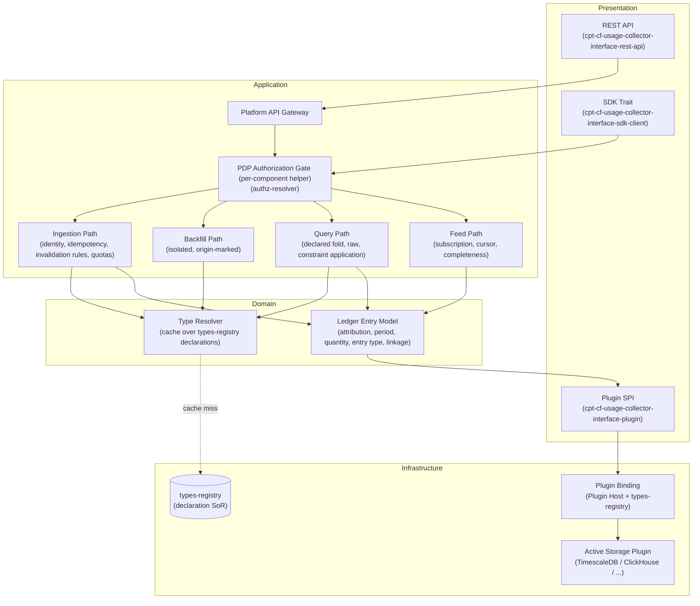
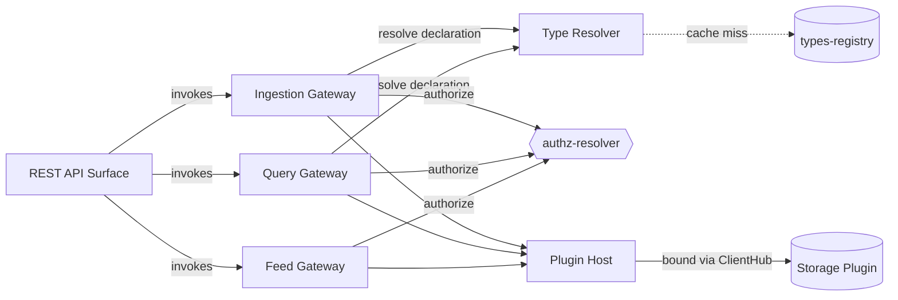
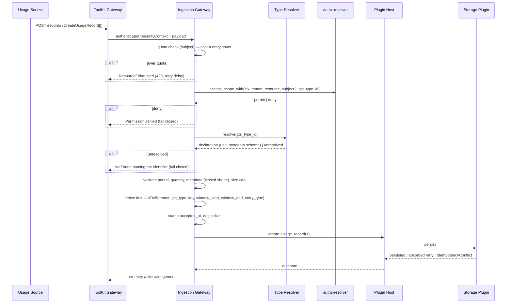
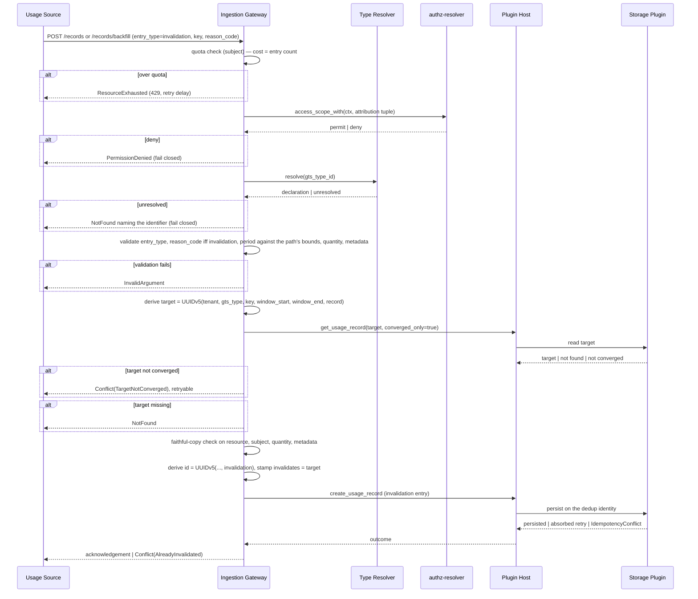
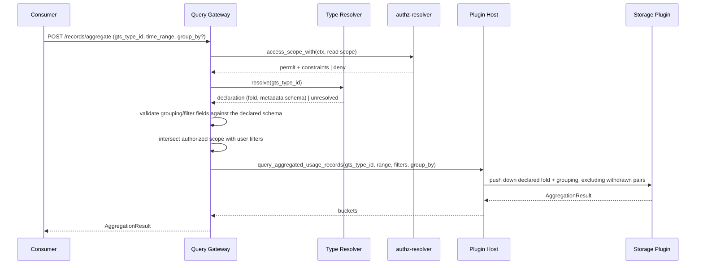
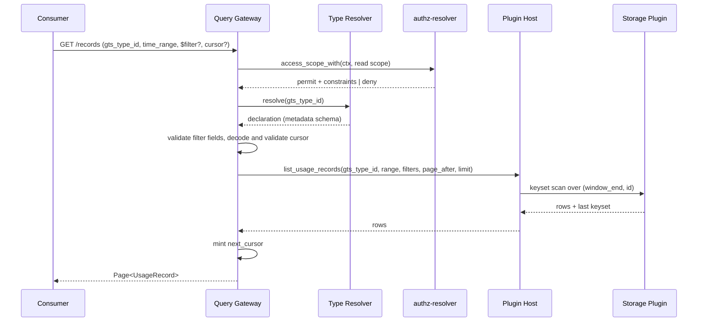
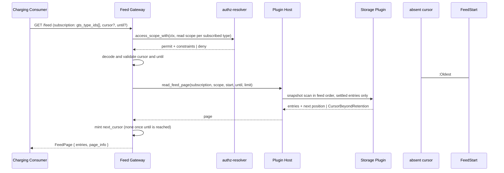
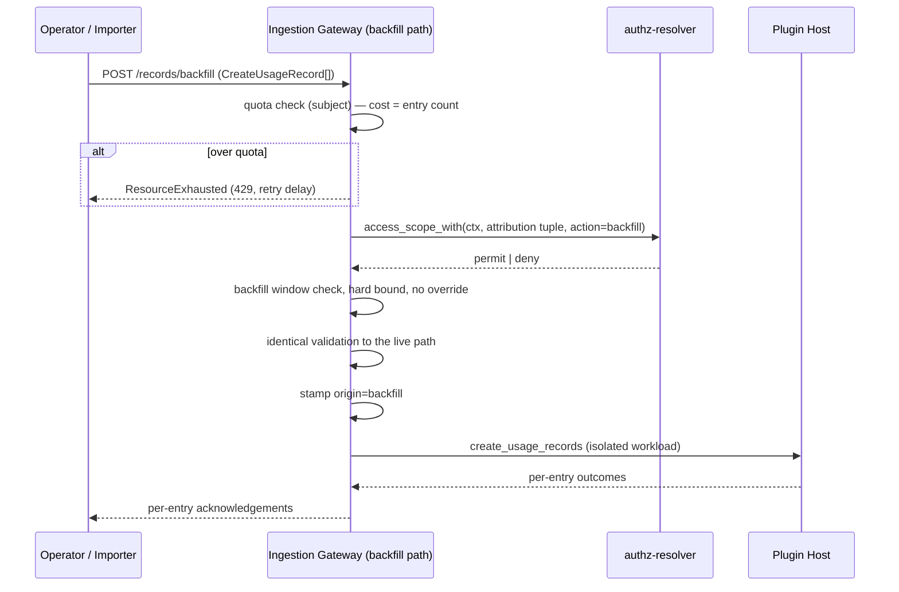

Created:  2026-02-25 by Virtuozzo International GmbH
Updated:  2026-09-17 by Virtuozzo International GmbH

# Usage Collector — DESIGN

<!-- toc -->

- [1. Architecture Overview](#1-architecture-overview)
  - [1.1 Architectural Vision](#11-architectural-vision)
  - [1.2 Architecture Drivers](#12-architecture-drivers)
  - [1.3 Architecture Layers](#13-architecture-layers)
- [2. Principles & Constraints](#2-principles--constraints)
  - [2.1 Design Principles](#21-design-principles)
  - [2.2 Constraints](#22-constraints)
- [3. Technical Architecture](#3-technical-architecture)
  - [3.1 Domain Model](#31-domain-model)
  - [3.2 Component Model](#32-component-model)
  - [3.3 API Contracts](#33-api-contracts)
  - [3.4 Internal Dependencies](#34-internal-dependencies)
  - [3.5 External Dependencies](#35-external-dependencies)
  - [3.6 Interactions & Sequences](#36-interactions--sequences)
  - [3.7 Database schemas & tables](#37-database-schemas--tables)
  - [3.8 Deployment Topology](#38-deployment-topology)
  - [3.9 Security Architecture](#39-security-architecture)
  - [3.10 Consistency Contract](#310-consistency-contract)
  - [3.11 Performance and Operations Architecture](#311-performance-and-operations-architecture)
  - [3.12 Maintainability, Testing, UX, and Integration Architecture](#312-maintainability-testing-ux-and-integration-architecture)
- [4. Additional context](#4-additional-context)
- [5. Traceability](#5-traceability)

<!-- /toc -->

- [ ] `p1` - **ID**: `cpt-cf-usage-collector-design-overview`

## 1. Architecture Overview

### 1.1 Architectural Vision

The Usage Collector is the platform's **append-only metering ledger**. It accepts attributed measurements over covered periods and never rewrites
one. It serves them back on three surfaces. These are an in-process SDK trait, a
Plugin SPI for storage backends, and a REST API for remote callers.

Three properties shape everything below. **The ledger is append-only.** A correction is an appended invalidation entry,
not an edit or a status flip. No read path can therefore observe a delivered
entry change. **Typing is not owned here.** GTS type declarations live in `types-registry`.
This gear resolves and validates against them through a local cache, and holds
no catalog of its own.
**The fold is declared, not chosen.** Each meter's aggregation is a property
of its declaration. One period therefore yields one number per meter, and the
aggregate request carries no aggregation parameter.

The architecture is contract-first and fail-closed. Authentication is owned by
the ToolKit gateway upstream. Authorization is anchored at the platform PDP
(`authz-resolver`). Persistence is reached only through the Plugin SPI. No
business logic — pricing, rating, billing, quota decisions — lives inside the
collector.

### 1.2 Architecture Drivers

#### Functional Drivers

| Requirement | Design Response |
| --- | --- |
| `cpt-cf-usage-collector-fr-ingestion` | REST, SDK, and backfill entry points funnel into one Ingestion Gateway. The gateway authenticates upstream and authorizes at the PDP before dispatch. |
| `cpt-cf-usage-collector-fr-idempotency` | Every entry has a caller-supplied idempotency key, and an invalidation repeats its target's. The dedup identity is the 6-tuple `(tenant, gts_type, key, window_start, window_end, entry_type)`. Exact-equality retries are absorbed, divergent writes against a converged entry are a fail-closed conflict, and races resolve at a plugin-declared dedup level. The horizon is the type's retention policy, measured from `window_end`. |
| `cpt-cf-usage-collector-fr-record-identity` | `id` is a deterministic UUIDv5 over the same 6-tuple, so it is stable, server-derived, and reproducible offline by the emitter before submission. A record and its invalidation differ only in `entry_type`, so an emitter reproduces both identifiers from the record's own fields. |
| `cpt-cf-usage-collector-fr-usage-windows` | The covered period `[window_start, window_end)` is the only emitter-supplied time attribution. The gear stamps `accepted_at`, and no caller can set it. Query selection reads the period end — `from <= window_end < to` — on every path, so no entry needs a shape-dependent case. |
| `cpt-cf-usage-collector-fr-live-future-time-bound` | The live path bounds the covered period on both sides. It rejects a period that ends further into the future than a tolerance, 5 minutes by default. It also rejects one that ends further into the past than a second tolerance, 48 hours by default and configurable. Anything older must use the dedicated backfill route, which the rejection names. Both bounds govern every entry the path admits, an invalidation included, over the period it copies. The backfill path carries its own window. All of these are configuration, enforced in the Ingestion Gateway before dispatch. |
| `cpt-cf-usage-collector-fr-record-quantity` | A finite signed decimal carried as `rust_decimal::Decimal`, wire-encoded as a JSON string, persisted in an exact decimal type. The published range and precision are declared in the OpenAPI contract. The SPI obliges every plugin to round-trip both halves without loss. |
| `cpt-cf-usage-collector-fr-quantity-semantics` | The relation between quantity and period is carried by the declared fold and resolved per read. The gear never integrates, differentiates, interpolates, re-windows, or synthesizes samples. |
| `cpt-cf-usage-collector-fr-aggregation-fold` | The fold is read from the resolved declaration, never inferred from the identifier and never accepted as a request parameter. The Query Gateway serves the declared fold and no other. |
| `cpt-cf-usage-collector-fr-metering-unit-binding` | The unit is a declaration property resolved through the type reference. A declaration binding no unit, or one outside the canonical list, is refused at registration, so ingestion meets no such meter. Never carried per entry. |
| `cpt-cf-usage-collector-fr-canonical-units` | The canonical list is published in the base type's trait schema, which every declaration draws its unit from. The gear reads it and restates it nowhere. No path converts, scales, or rounds a quantity. |
| `cpt-cf-usage-collector-fr-record-metadata` | Closed-shape validation against the declaration's schema at the gateway, with a configurable size cap. Declared properties are exactly the groupable and filterable dimensions, computed per request. |
| `cpt-cf-usage-collector-fr-record-invalidation` | Invalidation rides the ordinary ingestion path as a faithful copy of its target with two caller-supplied departures, `entry_type` and a reason code. The Ingestion Gateway derives the target's identifier from the entry's own fields, resolves the target, and enforces the copy before persistence. No invalidation of an invalidation and at most one per record both follow from the dedup identity. The copied period is bounded by the path, not by the entry kind. |
| `cpt-cf-usage-collector-fr-invalidation-reason-code` | A non-empty reason code is mandatory on an invalidation and forbidden on an ordinary record. Returned on every read path exposing the correction. |
| `cpt-cf-usage-collector-fr-usage-type-declaration` | No Usage Collector surface carries a type operation, read or write. Declaration is a `types-registry` operation. |
| `cpt-cf-usage-collector-fr-usage-type-resolution` | A dedicated Type Resolver component resolves declarations from `types-registry` through a local cache, fail-closed, on both write and read paths. Cached declarations stay usable during a registry outage. A declaration the registry has lost is restored from the mirror table of [§3.7](#37-database-schemas--tables), where a row exists and the registry returns a definite not-found answer. |
| `cpt-cf-usage-collector-fr-tenant-attribution` | Tenant is mandatory and caller-supplied. The gateway performs a defence-in-depth check. The PDP authorizes the caller against the supplied tenant before dispatch. |
| `cpt-cf-usage-collector-fr-resource-attribution` | `resource_id` and `resource_type` are mandatory, structurally validated, and part of the PDP attribution tuple. |
| `cpt-cf-usage-collector-fr-subject-attribution` | Subject is optional and caller-supplied. When present the PDP authorizes against it. The core never derives subject identity from `SecurityContext`. |
| `cpt-cf-usage-collector-fr-tenant-isolation` | Enforced through the PDP-returned scope on every read and write. The core checks each write's attribution against that scope. It applies the same scope as a filter to each query, before dispatch. |
| `cpt-cf-usage-collector-fr-ingestion-authorization` | Every entry is authorized against its full attribution tuple, and its type is resolved, both before any plugin write. Failures fail closed immediately. |
| `cpt-cf-usage-collector-fr-pluggable-storage` | A dedicated Plugin SPI covers persistence, query, and feed reads. The active backend is resolved lazily via Plugin Host and `types-registry`. `gears.usage-collector.config.vendor` selects the plugin identity at `Gear::init`. |
| `cpt-cf-usage-collector-fr-query-aggregation` | The Query Gateway enforces the mandatory single-type and time-range filters, runs PDP authorization, and pushes the declared fold and grouping to the plugin. Withdrawn pairs are excluded from the selected set. |
| `cpt-cf-usage-collector-fr-query-raw` | Raw query reuses the same authorization and constraint-application pattern and returns cursor-paginated pages. Withdrawn pairs are returned **as persisted**, the invalidation naming its target. |
| `cpt-cf-usage-collector-fr-billing-usage-feed` | A dedicated Feed Gateway serves per-subscription, cursor-paginated, snapshot-consistent pages in a deterministic order the storage plugin realises, each carrying a cursor behind which the subscription is complete. |
| `cpt-cf-usage-collector-fr-billing-fields-on-read` | Raw query, point lookup and the feed return the identifier, type reference, covered period, acceptance instant, idempotency key, declared metadata, signed quantity, entry type, the withdrawn-record reference `invalidates` with its reason code on an invalidation, and origin marker — unstripped. The aggregate and reconciliation paths return folds, counters and watermarks rather than entries, and carry no part of this set; their shapes are `AggregationResult` and `ReconciliationMetadata` ([§3.1](#31-domain-model)). The key does not distinguish a record from its invalidation; `entry_type` does, and consumers deduplicate on the identifier. |
| `cpt-cf-usage-collector-fr-billing-retention-floor` | Retention is declared per type, and the plugin reads it from `types-registry` itself. No gear surface carries it. The floor — backfill window plus one replay horizon — is a plugin-readiness condition surfaced at review, not a gear-side sweep. |
| `cpt-cf-usage-collector-fr-backfill` | A dedicated import path, workload-isolated from live ingestion, applying identical validation and stamping `origin = backfill`. The configured window is a hard bound and no surface reaches past it. It takes **Usage Records** and invalidation entries alike, on REST and on the SDK trait. |
| `cpt-cf-usage-collector-fr-rate-limiting` | One token bucket per calling subject, charged the submitted entry count after the entry cap and before the PDP call, on every ingestion path and on both the batch and single-entry service entry points. Over-quota submissions are rejected whole with `ResourceExhausted` at 429 carrying a retry delay. State is per-replica, so the effective limit scales with replica count ([§3.2](#32-component-model)). |
| `cpt-cf-usage-collector-fr-reconciliation-metadata` | Per-scope counters and two watermarks — acceptance instant and covered-period end — exposed on REST at the (tenant, GTS type) granularity, one scope per call. The gear evaluates none of them. Two limits are known and unaddressed in v1. Both watermarks are computed over retained entries, so neither is monotonic: a retention sweep that drops the chunk holding a scope's most recently accepted entry lowers the acceptance watermark, and a later read can return a value below an earlier one. And a backfill run advances the acceptance watermark while leaving the covered-period watermark where it is, whenever the imported periods end no later than it already does — the usual case for a stopped emitter, and a false negative: acceptance looks fresh while live emission has stopped. Neither the pairing of a watermark with a declared cadence nor a tolerance for it is specified anywhere — stall detection remains consumer-side and uncontracted. |
| `cpt-cf-usage-collector-fr-reconciliation-caller-scopes` | Deferred beyond v1: the tenant plane carries no calling-gear identity, so no counter can be grouped by caller. See [§4](#4-additional-context). |
| `cpt-cf-usage-collector-fr-data-classification` | Opaque identifiers, operational telemetry, and caller-supplied metadata are the three classes. The gear interprets none of them and hosts no PII resolution. |

#### NFR Allocation

| NFR ID | NFR Summary | Allocated To | Design Response | Verification |
| --- | --- | --- | --- | --- |
| `cpt-cf-usage-collector-nfr-ingestion-latency` | p95 ≤ 200 ms | Ingestion Gateway, Type Resolver, Plugin Host | One PDP decision and one cached type resolution cover each entry. No registry round-trip in the steady state. Budget split in [§3.11.2](#3112-latency-budgets-perf-design-003). | Load test at the throughput-profile envelope. |
| `cpt-cf-usage-collector-nfr-throughput` | ≥ 10,000 entries/sec | Ingestion Gateway, Plugin SPI | Batch ingestion is a first-class SPI method so each plugin drives its native bulk-write path. | Sustained-rate load test. |
| `cpt-cf-usage-collector-nfr-throughput-profile` | Sustained / burst / concurrency envelope | whole gear | Stateless gear replicas behind the platform gateway. Capacity is plugin-bound. | Envelope load test. |
| `cpt-cf-usage-collector-nfr-query-latency` | p95 ≤ 500 ms | Query Gateway, Plugin SPI | Fold and grouping are pushed down. The gear never iterates rows. | Aggregated-query load test. |
| `cpt-cf-usage-collector-nfr-workload-isolation` | Query load must not degrade ingestion | Plugin SPI, active plugin | Isolated backend pools are a plugin-deployment obligation. Backfill's isolation from live ingestion is `cpt-cf-usage-collector-fr-backfill`'s, carried at the gear, not this NFR's. | Concurrent load test. |
| `cpt-cf-usage-collector-nfr-availability` | 99.95% monthly | whole gear | Stateless replicas. Fail-closed on dependency loss rather than degraded acceptance. | Availability budget burn. |
| `cpt-cf-usage-collector-nfr-query-freshness` | Floor-and-ceiling consistency contract | [§3.10](#310-consistency-contract) | Gear publishes the floor. Each plugin publishes its ceiling. Type declarations are explicitly **outside** the floor — their propagation is a property of the resolver cache. | Review of this design and the SPI consistency profile. |
| `cpt-cf-usage-collector-nfr-aggregate-freshness` | Plugin readiness gate, p95 ≤ 5 min where acted on | active plugin | The aggregate path is a derived view, so materialisation is legitimate. The plugin publishes its lag **and** its invalidation-propagation bound separately. | Plugin release-readiness review. |
| `cpt-cf-usage-collector-nfr-billing-feed-freshness` | Plugin readiness gate, p95 ≤ 5 min acceptance → feed | Feed Gateway, active plugin | A deployment whose plugin publishes no qualifying ceiling must not feed a charging consumer. | Plugin release-readiness review. |
| `cpt-cf-usage-collector-nfr-replay-throughput` | 24 h backlog cleared within 6 h | Feed Gateway, active plugin | Subscription scoping bounds the obligation to the meters a consumer actually reads. Required read rate ≥ subscribed arrival rate × (1 + backlog age / recovery time). | Recovery test against the subscription under test. |
| `cpt-cf-usage-collector-nfr-plugin-contract-stability` | Major-version stability per surface, from 1.0 onward | all three surfaces | Independent versioning, additive-only within a major, one prior major supported. | Contract diff gate, from 1.0 onward. |
| `cpt-cf-usage-collector-nfr-operational-visibility` | Dashboards and alert routing | [§3.11.5](#3115-operational-metric-inventory-ops-design-002) | Instrument inventory covers ingestion, query, PDP, plugin readiness, **and type-resolution failure and cache staleness**. | Dashboard and alert review. |

#### Key ADRs

| ADR ID | Decision Summary | Status against this design |
| --- | --- | --- |
| `cpt-cf-usage-collector-adr-pdp-centric-authorization` | Every operation is authorized at the platform PDP. The gear keeps no access table and no decision cache. | Current. |
| `cpt-cf-usage-collector-adr-pluggable-storage` | Persistence and query are reached only through the Plugin SPI. The operator selects the backend, and the host binds it lazily. | Current. |
| `cpt-cf-usage-collector-adr-caller-supplied-attribution` | Attribution is caller-supplied and PDP-authorized. The gear never derives tenant, resource, or subject from the caller's identity. | Current. |
| `cpt-cf-usage-collector-adr-mandatory-idempotency` | Every entry carries a caller-supplied idempotency key, and an invalidation repeats its target's. The gear absorbs an exact-equality retry and rejects any divergent canonical field fail-closed. Races resolve at a plugin-declared dedup level. | Current. |
| `cpt-cf-usage-collector-adr-contract-stability` | REST, SDK, and Plugin SPI version independently. From 1.0 onward, only additive changes ship within a major, and one prior major stays supported. | Current. |
| `cpt-cf-usage-collector-adr-consistency-contract` | Floor-and-ceiling split. The gear publishes an eventual floor with no upper bound, and each plugin publishes its own ceiling. | Current. |
| `cpt-cf-usage-collector-adr-record-identity-derivation` | The identifier is a UUIDv5 over the dedup identity, which is tenant, type, key, both covered-period bounds, and entry type. | Current. |
| `cpt-cf-usage-collector-adr-registry-owned-typing` | `types-registry` owns every type declaration. The gear resolves through a cache, holds no catalog, and fails closed on an unresolvable reference. | Current, amended by `cpt-cf-usage-collector-adr-declaration-rehydration` for the recovery mirror. |
| `cpt-cf-usage-collector-adr-declared-fold` | Each type declares one immutable fold from `SUM`, `COUNT`, `MAX`, `MIN`, `LATEST`. The aggregate request carries no aggregation parameter. | Current. |
| `cpt-cf-usage-collector-adr-append-only-invalidation` | Invalidation is the single correction primitive. A faithful-copy invalidation entry travels the ordinary ingestion path and withdraws exactly one entry. | Current. |
| `cpt-cf-usage-collector-adr-feed-aggregate-split` | A charging consumer reads the entry feed. The aggregate path is a derived view a plugin may materialise. | Current. |
| `cpt-cf-usage-collector-adr-backfill-isolation` | Historical import runs on a dedicated origin-marked route, isolated from live ingestion. The path bounds the covered period, so a withdrawal of closed history travels the same route as an import. | Current. |
| `cpt-cf-usage-collector-adr-quantity-precision` | A quantity is an exact signed decimal in a published range. Every plugin round-trips that full range, including its negative half. | Current. |
| `cpt-cf-usage-collector-adr-window-end-selection` | A time range selects an entry by the end of its covered period. One predicate replaces interval overlap and its point-event case. | Current. |
| `cpt-cf-usage-collector-adr-declaration-rehydration` | The gateway mirrors each declaration it resolves and restores one the registry has lost. The plugin reads declared retention from `types-registry` itself. | Current. The mirror and the restore are **temporary** and retire when persistent storage reaches this gear's resolution path. The retention rule is permanent. |

### 1.3 Architecture Layers



- [ ] `p3` - **ID**: `cpt-cf-usage-collector-tech-stack`

| Layer | Responsibility | Technology | Maintainability |
| --- | --- | --- | --- |
| Presentation | REST, SDK, and SPI surfaces for ingestion, query, feed, and reconciliation. | Axum + ToolKit `OperationBuilder` (OpenAPI in `usage-collector-v1.yaml`). Rust async traits in ClientHub. | Gear team. OpenAPI + trait diff gates. |
| Application | PDP authorization, identity derivation, idempotency, invalidation rules, quotas, and orchestration of ingest / query / feed / backfill. | ToolKit gateway (upstream AuthN + `SecurityContext`). `authz-resolver` PDP. In-process Rust orchestration. | Co-owned with platform identity-services. Contract-test gate on `authz-resolver`. |
| Domain | Ledger entry model and the resolved-declaration cache. The fold, unit, metadata surface, and retention are read from declarations, never stored per entry. | In-process Rust domain types. Declaration cache over `types-registry`. | Gear team. Declaration SoR lives in `types-registry`. |
| Infrastructure | Persists and queries entries via the Plugin SPI. Backend bound lazily via Plugin Host. | Plugin Host binding. Pluggable backends selected by `gears.usage-collector.config.vendor` at `Gear::init`. | Co-owned by gear team (SPI) and each plugin's team. SPI major-version policy. |

## 2. Principles & Constraints

### 2.1 Design Principles

#### Append-only ledger

- [ ] `p1` - **ID**: `cpt-cf-usage-collector-principle-append-only-ledger`

An accepted entry is never rewritten, retired, or altered, and no operation on
any surface mutates one. There is no status field and no lifecycle flag. A correction is an appended invalidation entry. It is a faithful copy of its
target, with two caller-supplied departures: the entry type and a reason code.
The gear resolves the target from the copied identity fields and records it on
the entry as a read-only reference no caller sets. The entry type is required
with no default, so an invalidation cannot silently arrive as a retry of its
target. Withdrawal takes effect **in the fold**. Aggregations exclude both entries of
the pair. Ledger read paths return both as persisted, with linkage in both
directions.

This is what keeps the feed's snapshot guarantee intact. A status flip on a
delivered row would be a mutation a paginated scan could observe. An appended
entry arriving at its own feed position cannot be.

**ADRs**: `cpt-cf-usage-collector-adr-append-only-invalidation`

#### Registry-owned typing

- [ ] `p1` - **ID**: `cpt-cf-usage-collector-principle-registry-owned-typing`

GTS type declarations are held by `types-registry`. The Usage Collector mints
none, exposes no type surface of its own, and maintains no second catalog that
would have to be kept in step. It resolves declarations through a local cache and validates entries against
them, fail-closed. An unresolvable reference is rejected rather than admitted
unvalidated. A registry outage degrades the introduction of new types rather
than the ingestion of existing ones.

Three attributes give a persisted entry its meaning: fold, unit, and metadata
surface. All three are immutable in the declaration. That immutability makes
read-time resolution safe, so the gear need not pin them at acceptance.

**ADRs**: `cpt-cf-usage-collector-adr-registry-owned-typing`

#### Declared fold

- [ ] `p1` - **ID**: `cpt-cf-usage-collector-principle-declared-fold`

Each meter declares exactly one aggregation fold, and the aggregate path serves
that fold and no other. A caller cannot choose one. The aggregate request therefore carries no
aggregation parameter, and no class of request is well-formed and semantically
wrong. The ingestion path never consults the fold:
no ingestion invariant depends on it, and the sign of a quantity is never
constrained.

**ADRs**: `cpt-cf-usage-collector-adr-declared-fold`

#### PDP-centric authorization

- [ ] `p1` - **ID**: `cpt-cf-usage-collector-principle-pdp-centric-authorization`

All read and write operations are authorized through the platform PDP
(`authz-resolver`). The check runs against the caller's `SecurityContext`, which names the caller
by subject identifier and tenant and carries no calling-gear identity, and
against the operation's full attribution tuple (tenant, resource, GTS type, and
optionally subject). The gear neither caches PDP
decisions nor maintains its own access table. The PDP-returned scope defines the
authorization boundary. On a write, the gear checks the entry's attribution
against that scope. On a query, the same scope becomes a filter, applied before
any user-supplied filter narrows the result set.

**ADRs**: `cpt-cf-usage-collector-adr-pdp-centric-authorization`,
`cpt-cf-usage-collector-adr-caller-supplied-attribution`

#### Fail-closed behavior

- [ ] `p1` - **ID**: `cpt-cf-usage-collector-principle-fail-closed`

Every missing-`SecurityContext`, authorization, type-resolution, validation, and
entry-persistence failure resolves to immediate rejection with a deterministic
error. There is no anonymous bypass, no cached PDP decision, no synthesized
identity, no invented storage binding, and no silent discard of denied
emissions. One write stands outside the rule: the declaration mirror is
best-effort, so a failed mirror write is counted and does not reject the entry,
while a failed restore rejects fail-closed like any unresolved type
([§3.2](#32-component-model)). The gear must not relax validation to protect
ingestion availability. That would convert an availability incident into silent
data corruption, which surfaces on an invoice weeks later.

**ADRs**: `cpt-cf-usage-collector-adr-pdp-centric-authorization`

#### Idempotency-by-key

- [ ] `p1` - **ID**: `cpt-cf-usage-collector-principle-idempotency-by-key`

Every entry is deduplicated on `(tenant, gts_type, key, window_start,
window_end, entry_type)`. Every entry carries a client-provided key, and an
invalidation repeats its target's, so the two differ in identity by entry type
alone. An exact-equality retry is silently
absorbed. Any divergent caller-supplied field, metadata alone included, is a
fail-closed conflict rather than a silent drop. Because the period is part of
the identity, an emitter does not encode it into the key, but the key must
distinguish what the identity omits — resource, subject, and a second entry in
one period — and a retry must repeat it exactly.

The guarantee is an outcome, not a uniqueness constraint: one identity yields
one entry on every read, and a race before convergence resolves at the
plugin's declared dedup level. The horizon is **per-meter and bounded** by the
type's retention. A charging consumer's exactly-once property rests on its own
deduplication by entry identifier. The rules are the §3.1 invariants from
Dedup identity through Idempotency horizon.

**ADRs**: `cpt-cf-usage-collector-adr-mandatory-idempotency`,
`cpt-cf-usage-collector-adr-record-identity-derivation`

#### Pluggable storage

- [ ] `p1` - **ID**: `cpt-cf-usage-collector-principle-pluggable-storage`

Persistence and query are reached exclusively through the Plugin SPI. The
active backend is resolved lazily on the first dispatch after `types-registry`
is consistent. `gears.usage-collector.config.vendor`, read once at
`Gear::init`, selects the plugin identity. The core couples to no backend SQL dialect,
schema, or client library.

**ADRs**: `cpt-cf-usage-collector-adr-pluggable-storage`

#### Plugin resolution via ClientHub

- [ ] `p1` - **ID**: `cpt-cf-usage-collector-principle-plugin-resolution-via-client-hub`

Storage-plugin binding is resolved through the platform's `PluginV1<P>` GTS base
type, `types-registry`, and `ClientHub` scoped registration. Each plugin's
`init()` publishes a `PluginV1<UsageCollectorPluginSpecV1>` instance and
registers a scoped `dyn UsageCollectorPluginV1` client. The host's
`GtsPluginSelector` resolves the bound instance by schema id plus configured
vendor (lowest priority wins) and caches it for the `Service`'s lifetime.
Plugins are compiled in at the workspace level. The host crate has no
compile-time dependency on any concrete plugin crate. The trait shape is in
[§3.3](#33-api-contracts).

**ADRs**: `cpt-cf-usage-collector-adr-pluggable-storage`

#### Contract stability

- [ ] `p2` - **ID**: `cpt-cf-usage-collector-principle-contract-stability`

The three public surfaces version independently under a major-version
stability contract. The contract starts at the 1.0 release of each surface.
From then on, only additive changes ship within a major, and at most one prior
major stays supported. Plugin authors, in-process consumers, and remote callers
therefore migrate on independent schedules.

**ADRs**: `cpt-cf-usage-collector-adr-contract-stability`

#### Cursor gateway ownership

- [ ] `p1` - **ID**: `cpt-cf-usage-collector-principle-cursor-gateway-ownership`

The gateway owns, issues, decodes, and validates every opaque continuation token
(`toolkit_odata::CursorV1`), on both the raw-query and feed paths. Plugins never
mint, encode, or interpret a wire cursor: they receive a structured keyset on
the raw path and their own opaque `FeedPosition` on the feed path, and return
rows plus the position to continue from. This keeps cursor versioning, signing posture,
and validation at one platform-owned location.

**ADRs**: `cpt-cf-usage-collector-adr-feed-aggregate-split`

#### Canonical error envelope

- [ ] `p1` - **ID**: `cpt-cf-usage-collector-principle-canonical-errors`

The REST surface emits errors using `toolkit_canonical_errors::Problem` plus the
platform's registered standard-errors set. The gear defines no bespoke `Problem`
schema. `Problem.context` is a GTS-typed payload discriminated by a typed
`reason` sub-enum per category, carried where the canonical envelope carries it:
`context.reason` on `Aborted`, `PermissionDenied` and `Unauthenticated`, and a
`field_violations` entry's `reason` on `InvalidArgument`
([§3.3](#33-api-contracts) Error Contract).

#### Canonical page envelope

- [ ] `p1` - **ID**: `cpt-cf-usage-collector-principle-canonical-page`

Raw-read and feed responses use the canonical `toolkit_odata::Page` envelope. The gear defines no bespoke paging schema. Aggregated reads return a
non-paginated typed body.

#### Aggregate asymmetry

- [ ] `p1` - **ID**: `cpt-cf-usage-collector-principle-aggregate-asymmetry`

The collector exposes read shapes that intentionally differ. Raw and feed reads
are cursor-paginated list endpoints. The aggregate is a body-shaped RPC
returning a non-paginated result set. Toolkit's OData layer does not expose `$apply`. The aggregate response is
bounded by `group_by` cardinality rather than row volume. Pagination would
therefore add complexity without recovering safety.

**ADRs**: `cpt-cf-usage-collector-adr-feed-aggregate-split`

#### OTLP push emission

- [ ] `p1` - **ID**: `cpt-cf-usage-collector-principle-otlp-push-emission`

Operational telemetry is pushed via OTLP from ToolKit's global
`SdkMeterProvider`. Instruments are constructed via
`opentelemetry::global::meter_with_scope("usage_collector", …)` at bootstrap.

### 2.2 Constraints

#### Plugin contract stability (major-version)

- [ ] `p1` - **ID**: `cpt-cf-usage-collector-constraint-plugin-contract-stability`

From the 1.0 release of the Plugin SPI onward, a plugin built against version
`N` must keep working unchanged across every `N.x` release. A breaking change
ships as a new major that coexists with the prior major for one migration
window. This constrains plugin-facing type evolution to additive changes within
a major.

The three public surfaces — REST, SDK trait, and Plugin SPI — version
independently. Each Rust trait encodes its major version in the `V1` name
suffix. **Additive** means a new method carrying a default implementation, a
new optional input field, or a new non-required output variant. Removing or
renaming anything, narrowing accepted values, changing semantics, adding a
required input, or dropping a `default` implementation is **breaking**. Adding
an aggregation fold is additive. Removing one is breaking. A plugin that meets
a fold it does not implement returns `Internal(detail)` rather than
substituting another. Anything scheduled for removal is marked `deprecated` in
the rustdoc at least one minor release before the major bump. These rules bind
from 1.0, which no surface has reached: until then a breaking change ships in
place.

**ADRs**: `cpt-cf-usage-collector-adr-pluggable-storage`,
`cpt-cf-usage-collector-adr-contract-stability`

#### No business logic in collector

- [ ] `p1` - **ID**: `cpt-cf-usage-collector-constraint-no-business-logic`

Pricing, rating, billing rules, invoice generation, and quota decisions are out
of scope. The gear persists and serves usage only. Commercial identity is not carried. It covers subscription, SKU, and the payer
and seller axes. An emitter cannot know it, and downstream consumers resolve
it from tenant and resource attribution.

#### No type catalog in collector

- [ ] `p1` - **ID**: `cpt-cf-usage-collector-constraint-no-type-catalog`

The gear must not hold a GTS type catalog, expose a type surface of any kind,
or persist declaration attributes onto entries. Denormalizing fold, unit, or
metadata surface onto a high-rate stream would create a second place the same
fact can be read and disagree. This constrains the wire contract (no type
endpoints at all, read or write), the SPI (no catalog methods), and the entity
model (declaration attributes resolved, never stored).

**ADRs**: `cpt-cf-usage-collector-adr-registry-owned-typing`

#### NFR thresholds (from PRD §6)

- [ ] `p2` - **ID**: `cpt-cf-usage-collector-constraint-nfr-thresholds`

The architecture must meet four PRD §6 thresholds at the same time, against
the throughput-profile envelope:

- ingestion p95 ≤ 200 ms at ≥ 10,000 entries/sec sustained
- aggregation p95 ≤ 500 ms over a 30-day single-tenant range
- ingestion p95 unaffected by concurrent query load
- 99.95% monthly availability

These constrain plugin selection, workload isolation, and capacity planning at
every deployment.

#### PII handled by identity layer (not collector)

- [ ] `p1` - **ID**: `cpt-cf-usage-collector-constraint-pii-identity-layer`

Subject and tenant identifiers are opaque platform identifiers. PII management
belongs to the platform identity layer. The gear does not interpret, redact, or
classify them.

Per-bullet applicability for downstream privacy controls:

- **Consent management**: not applicable — platform identity layer.
- **Data-subject requests (DSR / GDPR / CCPA)**: not applicable — platform
  identity and legal/governance layers, and the active plugin's purge
  mechanism. **Invalidation is not an erasure path**: it withdraws a
  measurement from the fold while both entries stay persisted and readable.
- **Privacy Impact Assessment**: not applicable given the
  opaque-identifier-only data model.
- **Cross-border data transfer**: follows the bound plugin's deployment region.

**ADRs**: `cpt-cf-usage-collector-adr-caller-supplied-attribution`

#### Vendor and licensing pluggability

- [ ] `p1` - **ID**: `cpt-cf-usage-collector-constraint-vendor-pluggable`

No storage-vendor lock-in inside the gear. Persistence and query must be reached
exclusively through the Plugin SPI. The core must contain no backend-specific
SQL, schema, client libraries, or licensing assumptions. Any change introducing
a vendor-specific dependency requires a Plugin SPI major-version revision.

## 3. Technical Architecture

### 3.1 Domain Model

**Technology**: Rust types in `usage-collector-sdk/src/models.rs`. A
`gts_type_id` references a type declaration that `types-registry` owns.

**Location**:

- wire shapes — [`usage-collector-v1.yaml`](usage-collector-v1.yaml)
- GTS base type every meter derives from —
  [`schemas/usage_record.v1.schema.json`](schemas/usage_record.v1.schema.json)
- worked derivation —
  [`schemas/example.stored_volume.v1.schema.json`](schemas/example.stored_volume.v1.schema.json)

#### Modeling conventions

- Field names are snake_case. A Rust implementation can wrap a field in a
  newtype or an enum. It MUST keep the semantics stated here.
- `tenant_id`, `resource_id`, `subject_id`, and `gts_type_id` are opaque
  platform identifiers. The gear stores and compares them. It does not parse
  them or derive identity from them.
- All timestamps are UTC instants. A timestamp with no offset is rejected. A
  non-UTC offset is normalized to UTC.
- A quantity is a measurement, not money
  (§2.2 `cpt-cf-usage-collector-constraint-no-business-logic`).
- The ledger holds **entries**. An entry whose `entry_type` is `invalidation`
  is an *invalidation entry*. One whose `entry_type` is `record` is a *usage
  record*. Both use the one persisted shape below.

**Core Entities**:

- [ ] `p1` - **ID**: `cpt-cf-usage-collector-entity-model`

| Entity | Description |
| --- | --- |
| `UsageRecord` | One accepted entry on the append-only ledger. It carries the attribution tuple, the covered period, a signed quantity, the dedup key, the acceptance instant, the origin, and optional metadata. An invalidation entry adds a reason code and the server-derived target reference. No operation rewrites an accepted entry. |
| `CreateUsageRecord` | The identity-free ingestion shape that both entry types share. It is the only input shape on every ingestion path, live and backfill. Its required `entry_type` alone decides the kind. |
| `EntryType` | Closed discriminator, `record` or `invalidation`. Required on every submission, with no default, and a component of the dedup identity. Never inferred from other fields, and never read from the value or sign of a quantity. |
| `RecordOrigin` | Closed marker, `live` or `backfill`. The Ingestion Gateway stamps it from the path the entry arrived on. It applies to invalidation entries too. An absorbed retry keeps the stored origin, whichever path it arrived on. |
| `ResourceRef` | Caller-supplied `(resource_id, resource_type)`. Both leaves are mandatory on every entry. The gear validates presence and shape only. Ownership is a PDP decision. |
| `SubjectRef` | Caller-supplied `(subject_id, optional subject_type)`. Absent for system-level consumption. `subject_type` cannot appear without `subject_id`. |
| `AggregationFold` | Closed set — `SUM`, `COUNT`, `MAX`, `MIN`, `LATEST`. Declared per GTS type, immutable, and read on the aggregate path only. `SUM` is the only fold that yields a chargeable period quantity. |
| `IdempotencyKey` | Opaque string, one component of the six-part dedup identity. Caller-supplied on every entry. An invalidation repeats its target's, which is how the target is found (see Target resolution). No prefix is reserved. |
| `RecordMetadata` | Closed-shape key/value map. The GTS type declares the admissible keys. Values are strings in v1. The size cap is per deployment. |
| `SecurityContext` | `toolkit_security::SecurityContext`, the platform-authenticated caller context. Declared in `libs/toolkit-security`, which is the only normative statement of its shape. Input to authorization only. |
| `UsageRecordFilterField` | The admissible `$filter` field set, on the aggregate and the raw read path alike: `tenant_id`, `resource_id`, `resource_type`, `subject_id`, `subject_type`, `entry_type`, `origin`, and `invalidates`. Fixed, not resolved per request. Declared metadata keys are **not** operands here — the `toolkit-odata` grammar does not express filters over JSON map keys, so a metadata predicate arrives on the `MetadataFilter` side channel ([§3.3](#33-api-contracts)) and is AND-ed with this one. The covered period is a typed parameter, never a conjunct. |
| `AggregationDimension` | The admissible `group_by` set, aggregate path only: one of the fixed dimensions `tenant_id`, `resource_id`, `resource_type`, `subject_id`, `subject_type`, or one declared metadata key of the queried type, resolved per request. Narrower than the `$filter` set above by three fields, deliberately. `entry_type` and `invalidates` are degenerate on a path where neither an invalidation entry nor the record it withdraws contributes to a fold: every contributing entry reads `record` and names no target, so a grouping on `entry_type` yields the single `record` bucket and one on `invalidates` yields no bucket at all, its value being absent on every entry that survives the fold. `origin` is filterable but not groupable in v1 — a caller that wants imported history apart from live consumption issues one aggregation per `origin` value. An entry carrying no value at a selected dimension is excluded from the grouping rather than bucketed under an absent value. A request names any combination of the admissible dimensions, in any order, each at most once, so grouping **arity** is bounded by that set — the five fixed dimensions plus the queried type's declared properties — and never by a fixed ceiling on how many a request may carry. What bounds the *result* is the aggregation result limit, and the mandatory time range. |
| `Keyset` | The typed last-row sort tuple behind an opaque cursor. Raw reads use `(window_end, id)`, which a caller `$orderby` prefixes rather than replaces. Feed reads carry a `FeedPosition` instead. |
| `FeedPosition` | A point in the feed's order, issued and interpreted by the storage plugin alone. It is opaque to the gateway and never appears on the wire. Its **age** is the acceptance instant of the oldest entry of a subscribed GTS type after it — whether or not the reader's authorization scope admits that entry — and a position with no such entry after it is current. That age is a progress measure, not the retention refusal's input (§3.2). How a plugin assigns it is plugin-internal, provided the Feed order invariant below holds. Its structure is likewise plugin-internal, but its **encoded size** is not: the gateway carries it inside a length-bounded wire cursor ([§3.3](#33-api-contracts)) whose size may not grow with a subscription's breadth. A position keyed per tenant does not meet that bound, so a plugin needs a key it can compare across a whole subscription — which key that is stays its own choice. |
| `FeedStart` | Where a feed read begins, **named** rather than inferred from an absent position: `Oldest` is the oldest entry the subscription retains, `After(position)` continues from a position the feed issued. Both Rust surfaces take it, over the position each speaks — the wire cursor on the SDK trait, `FeedPosition` on the SPI. It is `#[non_exhaustive]`, so a start mode admitted later is a variant rather than a further argument. v1 admits these two, and neither begins at the head ([§3.2](#32-component-model)). |
| `AggregationResult` | Grouped buckets. Each carries the dimension values in `group_by` order and the folded quantity as `bigdecimal::BigDecimal` — unbounded, and deliberately not the per-entry `rust_decimal::Decimal`, because a fold is not bounded by the per-entry ceiling. `null` where no entry matched. Neither the fold nor the queried type rides the result: both are inputs to the call. |
| `FeedSubscription` | The set of GTS types one consumer reads. It bounds that consumer's pages and cursor. |
| `FeedPage` | Settled entries in feed order and an opaque cursor holding a `FeedPosition`. Everything before the cursor is delivered and final under the compiled scope the read ran under; the scope-change contract is in [§3.3](#33-api-contracts), Cursor & Pagination. |
| `ReconciliationMetadata` | Accepted count, a fold-appropriate quantity summary, and two watermarks — acceptance instant and covered-period end — for one `(tenant, gts_type)` scope. Both watermarks are optional: absent when the scope holds no entries. |
| `ReconciliationScope` | The reporting granularity, a REST-level concept only. v1 admits `(tenant, gts_type)` alone, carried as the required `tenant_id` and `gts_type_id` query parameters, so no SPI type corresponds to it. The two caller scopes are reserved — see [§4](#4-additional-context). |
| *(GTS type declaration)* | **Not an entity of this gear**, and given no shape here. A meter *is* a derived GTS type of `gts.cf.core.uc.usage_record.v1~`, whose trait schema is the only normative statement of what a declaration carries. The gear resolves a declaration. It never owns, mints, or stores one. |

**Field ownership.** Who sets each field is load-bearing: a caller cannot forge
identity, acceptance instant, or the withdrawn-record reference.

| Group | Fields | Set by |
| --- | --- | --- |
| Caller-supplied | `tenant_id`, `resource_ref`, `subject_ref`, `gts_type_id`, `quantity`, `window_start`, `window_end`, `idempotency_key`, `entry_type`, `reason_code` (invalidation only), `metadata` | the emitter, on `CreateUsageRecord` |
| Server-assigned | `id`, `accepted_at`, `origin`, and `invalidates` on an invalidation | the Ingestion Gateway, at the single choke point |

**Relationships**:

- `UsageRecord` → GTS type: references a registry-owned declaration by
  `gts_type_id`. The fold, the unit, the metadata surface, and the retention
  resolve through it and are never copied onto the entry.
- `UsageRecord` → `UsageRecord`: an invalidation entry withdraws exactly one
  record, which the gateway resolves from the entry's own fields and records
  as `invalidates`, so a consumer pairs the two without repeating the
  derivation. That reference is the only linkage. No read
  path carries a reverse one.
- `UsageRecord` → `ResourceRef` / `SubjectRef` / `RecordMetadata`: the
  attribution composites and the per-type extension surface.
- `FeedSubscription` → `FeedPage`: bounds which entries and cursor
  one consumer receives.

#### Value Objects and Invariants

Read attributes of a resolved declaration — `aggregation_fold`,
`canonical_unit`, `metadata_schema`, `retention`, and
`nominal_sampling_interval` — are defined by the base type's trait schema. The
gear reads them and does not restate their admissible values. It MUST NOT act
on `nominal_sampling_interval`.

| Value object / Invariant | Definition | Enforced by |
| --- | --- | --- |
| `MeterTypeId` | A GTS identifier derived from the base `gts.cf.core.uc.usage_record.v1~`. An identifier outside that base is rejected. | Type Resolver |
| Dedup identity | `(tenant_id, gts_type_id, idempotency_key, window_start, window_end, entry_type)`. A record and its invalidation share the first five components and differ in `entry_type`, so the key alone does not tell them apart. `resource_ref` and `subject_ref` are compared on a collision but are not part of it. One key shared across two resources over one period is therefore a conflict. One identity yields at most one entry on every read path, fold, reconciliation figure, and materialised aggregate. | plugin, at its declared dedup level |
| Target resolution | An invalidation names its target through its own fields. The gateway derives the target's identifier as the `id` of `(tenant_id, gts_type_id, idempotency_key, window_start, window_end, record)` and looks it up converged-only, under the PDP permit scope. Nothing found is `NotFound`, whose message says the target is identified by tenant, GTS type, idempotency key, and covered period, since a typo in any of them surfaces there rather than as a field mismatch. A target not yet converged, one submitted in the same request included, is `Conflict(TargetNotConverged)`. The resolved identifier is stamped on the entry as `invalidates`. | Ingestion Gateway |
| Identity derivation | `id` is the UUIDv5 over the dedup identity: all six components in order, joined by `0x1F`, with `entry_type` as its lowercase wire literal, `record` or `invalidation`. Every entry supplies all six. `invalidates` is not an input. An emitter reproduces a record's `id` and its invalidation's offline from the record's own fields. | Ingestion Gateway |
| Collision resolution | A collision on the full identity, `entry_type` included, resolves by exact equality of the caller-supplied fields. All equal, the entry is absorbed. Any field differing, metadata alone included, is `IdempotencyConflict` once the identity has converged (see Dedup level). `invalidates` is derived from the identity and is not compared. Two entries in one request sharing the full identity resolve the same way at the gateway, the later against the earlier. On an invalidation the conflict is reported as `AlreadyInvalidated`, since the faithful copy leaves only the reason code to differ. | Ingestion Gateway + plugin |
| Dedup level | Races under one identity resolve by the store's **commit order** — the order the plugin's own state makes writes durable in, never a gateway timestamp. The first write in commit order is the **survivor**, and every read path, fold, reconciliation figure, materialised aggregate, and the feed show it and nothing else; a read before convergence may show a write that proves not to be first, never two. An identity **converges** once no earlier write can still become visible, the survivor is visible to every dedup check the plugin runs, and no persist call that missed it is still to return; the plugin establishes this from its commit or replication state, never from elapsed time, within a declared **convergence bound**; converging later is a conformance defect. From then until retention frees the identity, no later write displaces the survivor and no outcome returned accepts divergent content: an identical write is absorbed, a divergent one is `IdempotencyConflict`. A write whose caller was already answered, such as a timed-out insert that commits late, is discarded, counted when divergent. Before convergence the declared level applies. `linearizable`: the bound is zero, and every write is decided as it commits. `eventual`: a write can be acknowledged and then discarded, each divergent discard counted; the feed never returns it, and an aggregate or reconciliation figure that counted it recomputes. Such an acknowledgement disagrees with later reads in `accepted_at` and `origin`, and a divergent one in content, whose later retry is a conflict — the one silent drop the gear admits, reachable only by a caller reusing a key with different content. The level, bound, and metrics are published per §3.10. No meter is gated on the level. | plugin (§3.3 contract test) |
| Idempotency horizon | A dedup identity stays visible for at least the declared retention of its type, measured from the entry's `window_end`. Ingestion cannot reach past it: retention is at least the backfill window plus one replay horizon, so an over-aged covered period is refused on the window bound before deduplication is consulted. | plugin retention (§3.10) + backfill window bound (§3.2) |
| Append-only invariant | No surface modifies an accepted entry. A correction is an appended invalidation entry. There is no status column, no lifecycle flag, and no row to rewrite. | absence of a mutation operation on REST, SDK, and SPI |
| Point-event invariant | `window_start <= window_end`. Equal bounds mark a point event, not an error. | Ingestion Gateway |
| Period-end selection | Every range selects an entry when `from <= window_end < to`, whatever the length of the period. No path matches by overlap or by containment, and no path reads `window_start` to select. | Query Gateway + every plugin (§3.3 contract test) |
| Quantity fidelity | A quantity read back equals the quantity submitted, digit for digit, across the full published range of `UsageQuantity` in `usage-collector-v1.yaml`, negative half included. No conversion, scaling, rounding, or truncation on any path. Wire-encoded as a JSON string, never a float, because a `SUM` fold MUST be bit-exact. | plugin exact-decimal storage (§3.3 contract test) |
| Server-assigned field fidelity | `id`, `accepted_at`, `origin`, and an invalidation's `invalidates` are stamped once by the Ingestion Gateway (Field ownership above). A plugin persists the values it was handed on the entry it stores, and every read path returns those. It does not re-derive, default, or refresh one — `accepted_at` in particular is not the store's own insert time. Which entry survives a race is settled by Dedup level above; fidelity binds whichever one did. | plugin (§3.3 contract test) |
| Faithful copy | An invalidation entry repeats its target's tenant, GTS type, resource, subject, covered period, quantity, metadata, and idempotency key, and departs in exactly two caller-supplied fields: `entry_type` and `reason_code`. Tenant, type, key, and period locate the target (see Target resolution), so they cannot mismatch. Resource, subject, quantity, and metadata are compared against the target found. For `subject_ref`, presence against absence is a mismatch. A rejection names the field that differs. | Ingestion Gateway |
| Echo, not compensation | The copied quantity restates what is withdrawn. It is never negated or adjusted, and no signed compensating entry exists on any surface. | Ingestion Gateway |
| Entry type and reason code | `entry_type` is required on every entry and has no default: an invalidation that omitted it would arrive as an exact copy of its target and be absorbed as a retry, withdrawing nothing. `reason_code` is required when `entry_type` is `invalidation` and MUST NOT appear on a `record`. | wire schema + Ingestion Gateway |
| At most one invalidation | A record carries at most one accepted invalidation, as a consequence of Dedup identity: every invalidation of one record carries the record's five shared components and `entry_type = invalidation`, so all of them share one identity. A second one under the same reason code is absorbed, under a different one is `AlreadyInvalidated`, and concurrent ones resolve at the dedup level. No store-side rule exists beyond the dedup identity. | plugin (dedup identity) |
| No invalidation of an invalidation | The target is always a record. Target resolution derives its identifier with `entry_type = record`, so no identifier an invalidation resolves belongs to an invalidation. The property holds by construction and needs no check of its own. | Ingestion Gateway (target resolution) |
| Permanence | An accepted invalidation has no reversal. A correction to a mis-measured quantity is an invalidation, then a fresh emission under a new key with the same attribution and period. | absence of a reversal operation |
| Withdrawal exclusion | Inside any fold, a withdrawn record and its invalidation each contribute nothing. Both carry one period end, so no range selects one without the other. Ledger read paths return both, as persisted. | Query Gateway + every plugin (§3.3 contract test) |
| Recomputation | A materialised aggregate MUST recompute over the affected range, after an accepted invalidation and after a dedup identity converges on one of several acknowledged writes. A further term cannot reverse `MAX`, `MIN`, or `LATEST`. Append-only is a property of the ledger, not of a derived view. | plugin |
| `COUNT` quantity | Under `COUNT` the quantity means nothing: one record is one event. An emitter sends `1`. Ingestion does not enforce this, because it never consults the fold. | consumer contract |
| `COUNT` exclusion | `COUNT` counts the records in range that no accepted invalidation withdraws. It counts no invalidation entry and no withdrawn record, so a withdrawn pair counts none. | Query Gateway + every plugin (§3.3 contract test) |
| `LATEST` tie-break | Greatest `window_end`, then greatest `accepted_at`, then greatest `id` in byte order. `id` is unique, so the order is total, and all three keys compare across tenants and types, so it also holds for a group spanning tenants. `MAX` and `MIN` need no such rule. | plugin (§3.3 contract test) |
| Feed order | One deterministic order over a subscription, realised by the plugin through `FeedPosition`. No other ordering is claimed, acceptance-instant order included. **Completeness**: a page carries only settled entries — converged, with nothing more able to become visible before them — so no entry the read's compiled scope admits ever becomes visible behind a returned cursor, whatever the concurrency or commit order. Completeness binds the scope each read ran under; what a changed scope admits or excludes is the §3.3 cursor contract, not an ordering matter. A page reaching the settled head returns its cursor at the head, so a cursor's age reflects its consumer's progress, not the last arrival. **Correction order**: an invalidation follows its target. | plugin (§3.3 contract test) |
| Declaration immutability | The fold, the canonical unit, and the metadata surface are immutable for the life of a GTS type. A meter that must change one is a new type. A persisted quantity carries neither unit nor fold of its own, so an edit in place would silently restate every entry already accepted. | `types-registry` |
| Fail-closed resolution | An entry whose `gts_type_id` resolves nowhere is rejected and not persisted. The gear never substitutes a default for a declared attribute, and never relaxes validation to protect ingestion availability. Steady-state resolution is served from a local cache, so a registry outage degrades new-type introduction rather than ingestion. A declaration the registry has lost is restored from the mirror table (§3.7), where a row exists and the registry returns a definite not-found answer. | Type Resolver |
| Closed metadata shape | An undeclared key is rejected before persistence. There is no free-form remainder and no open-extras escape hatch. Admissibility is recomputed per request, so a freshly declared property is usable on the next request. | Ingestion Gateway + Query Gateway |
| Filter-surface reservation | `gts_type_id` is reserved: it travels as a typed parameter, and any predicate touching it is rejected. The covered period is likewise not filterable — the time range is a first-class parameter. Fixed-field identifiers accept `eq` and `in` only. | Query Gateway |
| Order admissibility | A caller order on the raw path uses one sort direction and only the keys `RecordOrderKey` names in `usage-collector-v1.yaml`, the single fail-closed definition of the set, which carries its own exclusions. The gateway appends `(window_end, id)` in the caller's direction before dispatch, so the plugin always receives a gap-free, uniform-direction, never-null keyset. Absent `$orderby` that pair is the whole order. The feed admits no caller order. | Query Gateway |
| Attribution independence | The gear never derives `tenant_id`, `resource_ref`, or `subject_ref` from `SecurityContext`. `SecurityContext.subject_id` describes the **caller**. `SubjectRef.subject_id` describes the **attributed subject**. The two names collide and the values are unrelated. | §3.9.6 |
| Scope intersection | The compiled PDP scope bounds a read. User filters narrow inside it and never widen it. | §3.9.6 |
| Plugin-owned lifecycle | Retention, backup, archival, purging, and query acceleration are plugin-owned. Two obligations bind them: the retention floor, which every GTS type carries whatever consumes it, and that a purge never frees a dedup identity earlier than its horizon. A purge later than the horizon is permitted, which is why the horizon is a floor rather than an exact boundary. | plugin deployment guide (§3.10) |
| Additive schema evolution | REST, SDK, and Plugin SPI shapes can add optional fields within a major version, and an open enum such as `FeedStart` can add a variant on the same terms. Removing a field or a variant, or changing semantics, requires a major-version break. | §2.2 `constraint-plugin-contract-stability` |

### 3.2 Component Model

The Usage Collector runs in a single process. That process holds a REST
surface, four domain components (Ingestion Gateway, Query Gateway, Feed
Gateway, Type Resolver), and a Plugin Host that lazily binds the active
backend. Boundaries
are drawn by responsibility, not deployment artifact. PDP enforcement is
cross-cutting — see [PDP Authorization Posture](#pdp-authorization-posture-cross-cutting-no-separate-component).

There is **no deactivation handler** and **no usage-type catalog component**:
invalidation rides the Ingestion Gateway, and typing is resolved from
`types-registry` by the Type Resolver.



#### Ingestion Gateway

- [ ] `p1` - **ID**: `cpt-cf-usage-collector-component-ingestion-gateway`

##### Why this component exists

Centralizes the synchronous write path. Every submission flows through one
place, whether it arrives on REST or the SDK, live or backfill, single or
batched, record or invalidation. That place validates attribution, authorizes
the caller, and validates against the resolved declaration. It then derives
identity, enforces the invalidation rules, and dispatches to the active
plugin.

##### Responsibility scope

- Enforces the per-request entry cap. The cap is operator configuration,
  100 by default, and bounds what one caller sends, not what one backend write
  holds. An empty or over-cap submission is rejected whole, before any entry
  is validated.
- Validates the structural attribution tuple (tenant, resource, optional
  subject, `gts_type_id`).
- Requires the caller key and `entry_type` on every entry, then derives `id`
  (§3.1 Identity derivation) and, on an invalidation, the target's identifier
  (§3.1 Target resolution).
- Validates the covered period: `window_start <= window_end`, UTC normalization,
  rejection of offset-less timestamps, and the live path's two-sided time bound.
  That bound rejects a period ending further into the future than the configured
  future tolerance. It also rejects one ending further into the past than the
  configured past tolerance, and that rejection names the backfill route. Both
  bounds apply to every entry, an invalidation included, over the period it
  copies.
- Validates the quantity against the published range and precision.
- Resolves the declaration through the Type Resolver and validates the metadata
  against its closed schema and the configurable size cap. Rejects an entry
  whose type binds no unit.
- **Enforces the §3.1 invalidation rules**: target resolution, faithful copy,
  and the entry-type and reason-code rule. The target is looked up
  converged-only, so a copy is never checked against a write the plugin later
  discards. No invalidation of an invalidation and at most one invalidation per
  record need no check of their own, and the copied period is bounded by period
  validation above.
- Charges the ingestion quota bucket for the calling subject the submitted entry
  count, after the entry cap and before the PDP call. A submission exceeding the
  allowance is rejected whole with an actionable throttle error carrying a retry
  delay, and no entry of it is accepted (Ingestion Admission Control below).
- Stamps `accepted_at` and `origin`, plus `invalidates` on an invalidation, and surfaces deterministic per-entry
  acknowledgements.

##### Ingestion Admission Control

- [ ] `p2` - **ID**: `cpt-cf-usage-collector-design-ingestion-admission-control`

Every submission is charged against one token bucket, keyed on `subject_id` from
the ingestion security context — the calling subject's total across all tenants.

**There is deliberately no per-tenant tier.** Bounding what one tenant's traffic
may take from a caller's allowance needs the *attributed* tenant, which travels
per entry in the request body, not in the security context. `subject_tenant_id`
is the caller's own home tenant and is constant per subject, so a bucket keyed on
it would be 1:1 with the per-subject bucket ([§3.1](#31-domain-model),
Attribution independence). Keying on the attributed tenant would move the charge
after structural decode and require a rule for what a tenant-spanning batch
costs; that is deferred ([§4](#4-additional-context)). The accepted consequence
is that one tenant's traffic can consume a caller's whole allowance.

A subject is not a calling gear. One gear may present several subjects, and one
subject may serve several gears, so this quota is caller-scoped and cannot be
read as gear-scoped. Per-gear quotas need an identity plane carrying both the
gear name and the tenant, which is the blocker that also defers
`cpt-cf-usage-collector-fr-reconciliation-caller-scopes`.

**Cost is the submitted entry count**, charged after the entry cap and before the
PDP call. A per-request cost of one would let a caller take `max_batch_records`
times its budget by batching, and the requirement protects an entries-per-second
envelope (`cpt-cf-usage-collector-nfr-throughput-profile`).

The cap runs first, and that order is load-bearing: it bounds the cost at
`max_batch_records`, so a submission can never cost more than the bucket is able
to hold. That is what keeps the retry delay computable and what makes the
`burst_entries >= max_batch_records` startup rule coherent, and it disposes of
the empty submission, which would otherwise cost nothing. Charging before PDP means
charging on submitted entries, before it is known how many are valid,
authorized, or collapsed by intra-batch dedup. That is deliberate: the flood
being bounded is submitted volume, and a caller cannot escape the charge by
submitting entries that fail later.

**Both service ingestion paths carry the check** — the batch path that live
ingestion and backfill share, charged the entry count, and the single-entry
in-process path, charged one. The check sits in the domain service rather than
the REST handlers, because a handler-side check would miss every in-process
caller. Since REST is batch-only, a REST-only test suite passes with the
single-entry path unthrottled; the test plan covers it explicitly.

**State is per-replica and in memory.** The effective limit for an `N`-replica
deployment is `N` times the configured value; operators apportion accordingly,
and the limit is approximate. Distributed rate limiting is not yet a platform
primitive. One consequence is worth stating as a benefit: the limiter has no
external dependency, so it has no failure mode and no fail-open or fail-closed
question. Idle buckets are evicted after `ingestion_quota.idle_eviction_secs`,
and only when fully refilled — evicting a partially drained bucket would return
free allowance.

**An over-quota submission is rejected whole**, before any entry is validated,
as the entry cap already is. The per-entry outcome model does not apply: the
rejection is request-wide, and `uc_ingestion_requests_total` cannot express a
partially quota-rejected batch in any case.

Backfill draws the same allowance as live emission
(`cpt-cf-usage-collector-adr-backfill-isolation`). Workload isolation, not a
separate budget, is what distinguishes the routes.

##### Responsibility boundaries

Does NOT persist directly — delegates to the Plugin Host. Does NOT consult the
declared fold: no ingestion invariant depends on it. Does NOT register, amend,
or withdraw declarations. Does NOT interpret metadata content. Does NOT define
authorization policy or authenticate callers. Does NOT mutate any accepted
entry. Fails closed on any dependency unavailability.

The backfill path is the same component under workload isolation: identical
validation, its own hard window bound in place of the live past tolerance, and
`origin = backfill`. No surface reaches past that window. It takes invalidation
entries as well as **Usage Records**, and is reachable on REST and on the SDK
trait.

##### Related components (by ID)

- `cpt-cf-usage-collector-contract-authz-resolver` — per-entry PDP
  authorization. Covers `fr-ingestion-authorization`, `fr-tenant-attribution`,
  `fr-resource-attribution`, `fr-subject-attribution`.
- `cpt-cf-usage-collector-component-type-resolver` — resolves the declaration
  per entry. Covers `fr-usage-type-resolution`, `fr-metering-unit-binding`,
  `fr-record-metadata`.
- `cpt-cf-usage-collector-component-plugin-host` — dispatches each accepted
  entry. Covers `fr-ingestion`, `fr-idempotency`, `fr-record-invalidation`,
  `fr-backfill`.

#### Type Resolver

- [ ] `p1` - **ID**: `cpt-cf-usage-collector-component-type-resolver`

##### Why this component exists

Resolution sits on the ingestion hot path, and `types-registry` publishes no
latency obligation of its own. A per-entry registry call would make this gear's
ingestion NFRs contingent on a second gear's availability and latency. A local cache of resolved declarations keeps those obligations self-contained.
For that reason it is a design-level component rather than an implementation
detail.

##### Responsibility scope

- Resolves a `gts_type_id` to its registered declaration, serving the steady
  state from cache.
- Exposes the declaration's fold, canonical unit, metadata schema, and nominal
  sampling interval to the write and read paths. It does not serve the declared
  retention. The storage plugin reads that from `types-registry` itself
  ([§3.3](#33-api-contracts)).
- Maintains the cache: population on miss, refresh, and staleness accounting.
  Because declarations are immutable in fold, unit, and metadata surface, a
  cached entry cannot silently change meaning. Only additions and withdrawals
  propagate.
- Mirrors each declaration it resolves, and restores one that `types-registry`
  has lost. On a cache miss, and on each `type_cache_ttl_secs` refresh, the
  registry answers and the resolver rewrites the row and serves, so the row
  tracks the registry rather than freezing at first resolution. Where the registry answers not found and a row exists, the
  resolver registers the stored document back and serves. Where neither has it,
  resolution fails closed as before. A failed mirror write is counted and does
  not reject the entry; a failed restore rejects it, fail-closed.
  The restore needs a definite not-found answer. Where
  the registry answers with an error instead, the resolver cannot tell a
  forgotten declaration from an unavailable one, and a cold cache fails closed
  although the row exists. `cpt-cf-usage-collector-fr-usage-type-resolution`
  carries that case, and the failed-mirror-write case, as stated limits on its
  guarantee. Temporary, per
  `cpt-cf-usage-collector-adr-declaration-rehydration`.
- The restore applies no lifecycle test, because a not-found answer here cannot
  be a withdrawal: the `types-registry` client carries no removal operation and
  no lifecycle status, so withdrawal reaches this path only when the
  database-backed surface is promoted onto it — the event that retires the
  mirror, and which MUST NOT land ahead of that retirement. Statements 3 and 7
  of `cpt-cf-usage-collector-adr-declaration-rehydration`.

##### Responsibility boundaries

Does NOT mint, amend, or withdraw declarations — those are `types-registry`
operations. A restore re-registers the same document the registry accepted
before, so it introduces no declaration the platform has not already seen.
Does NOT substitute a default for any declared attribute. Does NOT relax validation to protect availability. An unresolvable reference
is rejected fail-closed. Where a declaration no longer resolves, and either no
mirror row holds it or the registry gave no definite not-found answer, every
operation that depends on resolving it is rejected. The rejection lasts for as
long as the
identifier does not resolve. Entries already accepted under that
declaration remain persisted and unmodified.

##### Related components (by ID)

- `cpt-cf-usage-collector-contract-types-registry` — the declaration system of
  record. Consulted on cache miss.
- `cpt-cf-usage-collector-component-ingestion-gateway`,
  `cpt-cf-usage-collector-component-query-gateway` — consume resolved
  declarations.

#### Query Gateway

- [ ] `p1` - **ID**: `cpt-cf-usage-collector-component-query-gateway`

##### Why this component exists

Serves the read side — aggregated, raw, point lookup, and the operator-only
reconciliation read — through one component owning read authorization, filter
composition, and dispatch. Centralizing it keeps PDP constraint application
uniform across SDK and REST and prevents user filters from widening the
authorized scope.

##### Responsibility scope

- **Aggregation**: mandatory time range and single type. Optional attribution
  filters and grouping. Serves the **declared fold** resolved from the
  declaration, pushed down to the plugin. Excludes every withdrawn pair from
  the selected set.
- **Raw**: mandatory time range and single type. Optional filters. Cursor-paginated over `(window_end, id)`, which a caller `$orderby` prefixes rather than replaces. Returns withdrawn pairs **as
  persisted**, the invalidation naming its target.
- **Point lookup** by entry identifier, returning the exact persisted fact.
- **Reconciliation**: per-scope counters and watermarks for one
  `(tenant, GTS type)` scope per call, REST-only and operator-only
  ([§3.3](#33-api-contracts)). It carries no filters, no grouping and no paging:
  the scope parameters and the time range are the whole request.

Every path runs PDP authorization, composes the returned constraints with any
user filters so the result can only narrow, and dispatches through the Plugin
Host — that much is what makes them one component. The rest varies with the
path. Aggregation, raw query and reconciliation select on the period end, while
the point lookup takes no time range at all
(`cpt-cf-usage-collector-adr-window-end-selection`). Aggregation and raw query
validate every name the caller supplies against the surface it arrived on: a
`$filter` operand is a fixed field of `UsageRecordFilterField`, a metadata
predicate's key is a property the resolved schema declares, and a grouping
dimension is one of the five fixed dimensions `AggregationDimension` admits or,
again, a declared property ([§3.1](#31-domain-model)). The other two paths name
none.

##### Responsibility boundaries

Does NOT accept an aggregation parameter. Does NOT apply a fold on the raw path.
Does NOT mint or interpret storage-level cursors beyond the gateway-owned
envelope. Does NOT evaluate watermarks or raise stall signals.

#### Feed Gateway

- [ ] `p1` - **ID**: `cpt-cf-usage-collector-component-feed-gateway`

##### Why this component exists

A charging consumer's inbound path must be replay-safe under concurrent ingest —
a consumer outage beyond its buffer, a region loss, a bounded re-rating. Without
snapshot-consistent cursors a scan is silently incomplete or silently
duplicated. The feed is a distinct component from the Query Gateway for two reasons. It
serves its own feed order rather than covered-period order. Its snapshot and completeness
obligations also have no analogue on the query paths.

##### Responsibility scope

- Accepts a subscription declaring the GTS types a consumer reads, and excludes
  everything else from the pages and the cursor.
- Filters every page by the caller's compiled scope, evaluated per request and
  never bound into the cursor. A widened scope therefore admits entries behind
  a consumer's cursor, which this gateway neither delivers nor signals:
  bootstrapping the newly admitted scope is the consumer's obligation
  (`cpt-cf-usage-collector-fr-billing-usage-feed`). A narrowed scope takes
  effect the same way: entries the caller may no longer read are skipped as
  the cursor advances, with no error raised, because serving them would carry
  out a read the scope no longer permits. A later re-grant is a widening like
  any other, recovered by the same bootstrap within the retention floor. The
  gap an unintended narrowing leaves is reconciliation's to detect
  (`cpt-cf-usage-collector-fr-reconciliation-metadata`), on an operator
  surface the consumer's scope does not bound — never the cursor's.
- Serves cursor-paginated pages in feed order (§3.1): the same cursor yields
  the same continuation, extended only by entries settled since, and a replay
  bounded by a later cursor (`until`) is identical, entry for entry.
- Returns a next cursor with every page of a live read, short pages included,
  and none once a bounded replay reaches `until`. The feed reads forward only.
- Begins a request carrying no cursor at the oldest position the subscription
  serves, compiling it to `FeedStart::Oldest` rather than passing an absent
  position down. There is no head-start option: the feed serves charging
  consumers, for which skipping retained history is never a correct start.
- Surfaces the plugin's refusal of a cursor after which retention has already
  removed an entry of a subscribed GTS type as an actionable error, rather than
  serving a silently truncated range. The plugin decides it from what it still holds rather than
  from the cursor's age, which a sweep clamps to the retention boundary. The
  refusal reads a caller-supplied cursor only, the implicit start position
  being by construction the oldest one served.
- Serves corrections as ordinary entries. No feed entry represents a change
  to an already-delivered entry.

##### Responsibility boundaries

Does NOT apply a fold, filter withdrawn pairs, or remove either entry of a pair
from the stream. Does NOT push — the feed is pull-only. Does NOT evaluate
consumer progress or hold a stall threshold.

#### Plugin Host (ClientHub-bound)

- [ ] `p1` - **ID**: `cpt-cf-usage-collector-component-plugin-host`

##### Why this component exists

Concentrates backend binding and dispatch so no domain component couples to a
concrete plugin. Binding is a runtime concern resolved through `types-registry`
and `ClientHub`. The host crate has no compile-time dependency on any plugin
crate.

##### Responsibility scope

Resolves the bound plugin instance lazily on first dispatch, through
`GtsPluginSelector`. It caches the resolved `GtsInstanceId` for the
`Service`'s lifetime, and performs a `ClientHub::try_get_scoped` lookup per
call.
Dispatches persistence, query, and feed operations, and classifies plugin errors
into the gear's error taxonomy.

##### Responsibility boundaries

Does NOT authorize, validate, or interpret domain content. Does NOT invent a
fallback binding or retain a prior one: `None` from `try_get_scoped` lifts to a
per-call unavailability error, carrying `unavailable_retry_after_secs` because
no plugin was reached to supply a delay (§3.3 Error Contract). Does NOT keep a parallel local persistence path
for use when no plugin is bound.

##### Binding invariants

- Exactly one active storage binding exists per configured GTS instance scope.
- The binding is not modelled as a state machine. It is recomputed on each call
  from two structural facts — the cached `GtsInstanceId` and the scoped
  `ClientHub` lookup — so there is no bound/unbound state to keep consistent.
- The SPI major version is encoded structurally in the `gts_type_id` path
  suffix rather than carried as a runtime field. There is no version
  negotiation at dispatch.

#### PDP Authorization Posture (cross-cutting, no separate component)

PDP enforcement is not a component. Each domain component calls a shared
`access_scope_with` helper — a thin wrapper over
`PolicyEnforcer::access_scope_with` — inline, not as Tower or `OperationBuilder`
middleware. `OperationBuilder::authenticated()` performs bearer-auth resolution
and injects the `SecurityContext` extractor. Nothing beyond that runs at the
framework layer. REST handlers are thin pass-throughs. This keeps in-process and
REST callers on one authorization path.

A PDP permit is not the whole decision. The PDP returns the scope the caller may
act in. Each component then checks its operation's attribution against that
scope and denies anything outside it. This post-permit check is part of the
authorization, not an extra safeguard.

Ingestion uses two actions. The live path authorizes `create`. The backfill path
authorizes `backfill`, declared as the GTS permission instance
`cf.toolkit.authz.permission.v1~cf.core.uc.usage_record_backfill.v1` and grantable
independently of `create` (`cpt-cf-usage-collector-fr-backfill`). The action
follows the route, never the entry's covered period or kind.

### 3.3 API Contracts

The Usage Collector exposes three public surfaces, each versioned
independently. `usage-collector-v1.yaml` is the authoritative machine-readable
REST contract. The two Rust surfaces are declared below and are canonical in
`usage-collector-sdk/src/` once implemented.

**No surface carries a GTS type operation, read or write.** Declaring,
amending, withdrawing, and reading declarations are `types-registry` surfaces
(`cpt-cf-usage-collector-fr-usage-type-declaration`).

Rules that hold on both Rust surfaces:

1. The trait implementation — not the REST handler, not middleware — is the
   single site for authorization, validation, and dispatch. Each method runs, in
   order: the PDP call, composition of the compiled scope against caller
   filters, GTS type resolution where the method carries a type, plugin
   dispatch, then the plugin-error lift. An ingestion method runs the
   per-request entry cap and the quota charge ahead of that sequence, so an
   over-cap or over-quota submission is rejected before the PDP call
   (`cpt-cf-usage-collector-fr-rate-limiting`, [§3.2](#32-component-model)).
   The point lookup carries neither a type nor a caller filter, so its
   compiled scope is the whole filter.
2. The fold is never a parameter. A caller cannot select one.
3. Neither surface exposes a catalog operation or a mutation operation. Both
   absences are load-bearing: see §2.2 `constraint-no-type-catalog` and the §3.1
   append-only invariant.
4. Cursors are opaque. The gateway mints, decodes, and validates
   `toolkit_odata::CursorV1`. A caller threads back what it read.
5. `AggregationQuery` and `RawQuery` are parameter tuples, not structs. The
   time range is a typed parameter and never a `$filter` conjunct.
6. `MetadataFilter` is the dynamic-key side channel, because the
   `toolkit-odata` grammar does not express filters over JSON map keys. AND
   across distinct keys, OR within one key's values, empty slice means no
   metadata filter.

#### SDK Trait — `cpt-cf-usage-collector-interface-sdk-client`

- **Contracts**: `cpt-cf-usage-collector-contract-downstream-usage-reader`
- **Technology**: In-process async Rust trait, registered in ClientHub without scope
- **Location**: `usage-collector-sdk/src/api.rs`
- **Allocated To**: `cpt-cf-usage-collector-component-ingestion-gateway`, `cpt-cf-usage-collector-component-query-gateway`, `cpt-cf-usage-collector-component-feed-gateway`

Covers ingestion of both entry types on the live and the backfill path
(`fr-ingestion`, `fr-idempotency`, `fr-record-invalidation`, `fr-backfill`),
raw query (`fr-query-raw`), aggregated query (`fr-query-aggregation`), point
lookup (`fr-record-identity`), and the usage feed (`fr-billing-usage-feed`).
Backfill is on the trait because it is the only route reaching past the live
past tolerance, and because operator tooling may run in-process. It is the one
operator operation that is not REST-only: its gate is a distinct permission
rather than surface absence (`cpt-cf-usage-collector-adr-backfill-isolation`).
Reconciliation metadata stays REST-only. Ingestion quotas are not an operator
operation: they are deployment configuration
([§3.8](#38-deployment-topology)) and appear on no surface.

```rust
#[async_trait]
pub trait UsageCollectorClientV1: Send + Sync + 'static {
    /// Ingest one ledger entry — a measurement or an invalidation.
    ///
    /// `id` and an invalidation's `invalidates` are derived, never supplied. An
    /// absorbed retry returns the persisted entry. Dedup outcomes follow
    /// §3.1 and surface as the `Conflict` reasons of the error contract.
    async fn create_usage_record(
        &self,
        ctx: &SecurityContext,
        record: CreateUsageRecord,
    ) -> Result<UsageRecord, UsageCollectorError>;

    /// Ingest a batch. Per-entry outcomes align with input order.
    async fn create_usage_records(
        &self,
        ctx: &SecurityContext,
        records: Vec<CreateUsageRecord>,
    ) -> Result<Vec<Result<UsageRecord, UsageCollectorError>>, UsageCollectorError>;

    /// Bulk historical import, isolated from live ingestion.
    ///
    /// Stamps `origin = backfill` and admits any period inside the backfill
    /// window, in place of the live past tolerance. Validation is otherwise
    /// identical.
    async fn backfill_usage_records(
        &self,
        ctx: &SecurityContext,
        records: Vec<CreateUsageRecord>,
    ) -> Result<Vec<Result<UsageRecord, UsageCollectorError>>, UsageCollectorError>;

    /// Point lookup, returning the exact persisted fact.
    ///
    /// The read runs under the compiled scope, so an entry outside it is
    /// `NotFound`. This surface is not an existence oracle.
    async fn get_usage_record(
        &self,
        ctx: &SecurityContext,
        id: Uuid,
    ) -> Result<UsageRecord, UsageCollectorError>;

    /// Aggregated query over one meter and one range.
    ///
    /// Carries no aggregation parameter: the fold is resolved from the
    /// queried type. A withdrawn record and its invalidation each
    /// contribute nothing.
    async fn query_aggregated_usage_records(
        &self,
        ctx: &SecurityContext,
        gts_type_id: MeterTypeId,
        time_range: TimeRange,
        query: &ODataQuery,
        metadata_filter: &[MetadataFilter],
        group_by: &[AggregationDimension],
    ) -> Result<AggregationResult, UsageCollectorError>;

    /// Keyset-paginated ledger read over `(window_end, id)`.
    ///
    /// Returns withdrawn pairs as persisted: this is a ledger path, not a
    /// derived view. Excluding them from a locally computed fold is the
    /// reader's obligation.
    async fn list_usage_records(
        &self,
        ctx: &SecurityContext,
        gts_type_id: MeterTypeId,
        time_range: TimeRange,
        query: &ODataQuery,
        metadata_filter: &[MetadataFilter],
    ) -> Result<ODataPage<UsageRecord>, UsageCollectorError>;

    /// Replay-safe feed page in feed order (§3.1).
    ///
    /// Snapshot-consistent, unlike the query paths (§3.10): a consumer that
    /// must not miss entries reads this and not `list_usage_records`.
    /// `start` names where the read begins: `FeedStart::Oldest` for a first
    /// connect, which is the oldest entry the subscription retains, and
    /// `FeedStart::After(cursor)` to resume. `until`, a later cursor, bounds
    /// a replay.
    async fn read_usage_feed(
        &self,
        ctx: &SecurityContext,
        subscription: &FeedSubscription,
        start: FeedStart<&CursorV1>,
        until: Option<&CursorV1>,
        limit: Option<u64>,
    ) -> Result<FeedPage, UsageCollectorError>;
}
```

The crate also ships typed identity helpers, so an emitter never derives the
wrong kind: one computing a record's `id`, one computing the `id` of that
record's invalidation, and one building an invalidation request from a record,
copying its fields and setting `entry_type` and the reason code.

#### Plugin SPI — `cpt-cf-usage-collector-interface-plugin`

- **Contracts**: `cpt-cf-usage-collector-contract-storage-plugin`
- **Technology**: Async Rust SPI trait, registered in ClientHub with GTS instance scope
- **Location**: `usage-collector-sdk/src/plugin_api.rs`
- **Allocated To**: `cpt-cf-usage-collector-component-plugin-host`

One `usage-collector-plugin-<backend>` crate per backend implements this trait
under `plugins/<backend>/`. Each depends on `usage-collector-sdk` only, never
on the host crate. Registration, discovery, and vendor selection follow the
platform pattern in [TOOLKIT_PLUGINS.md](../../../../docs/TOOLKIT_PLUGINS.md).
The GTS spec is `usage-collector-sdk/src/gts.rs`. There is no readiness probe
and no flush. Availability is the conjunction of a cached selector and a
resolvable scoped client. A plugin that buffers writes drains them on its own
`Gear::shutdown`.

```rust
#[async_trait]
pub trait UsageCollectorPluginV1: Send + Sync + 'static {
    /// Persist one ledger entry (record or invalidation).
    async fn create_usage_record(
        &self,
        record: UsageRecord,
    ) -> Result<UsageRecord, UsageCollectorPluginError>;

    /// Persist a batch. Outcomes align with input order.
    async fn create_usage_records(
        &self,
        records: Vec<UsageRecord>,
    ) -> Result<Vec<Result<UsageRecord, UsageCollectorPluginError>>, UsageCollectorPluginError>;

    /// Read one entry by identifier, with its correction linkage.
    ///
    /// `scope` is the compiled PDP scope, projected into a `toolkit_odata`
    /// filter. A row outside it is absent. The gateway sets `converged_only`
    /// when resolving an invalidation target (see the obligations below).
    async fn get_usage_record(
        &self,
        id: Uuid,
        scope: &ast::Expr,
        converged_only: bool,
    ) -> Result<UsageRecord, UsageCollectorPluginError>;

    /// Compute the given fold over the authorized scope.
    ///
    /// The fold arrives as a parameter: declarations never reach the SPI.
    async fn query_aggregated_usage_records(
        &self,
        gts_type_id: MeterTypeId,
        time_range: TimeRange,
        fold: AggregationFold,
        query: &ODataQuery,
        metadata_filter: &[MetadataFilter],
        group_by: &[AggregationDimension],
    ) -> Result<AggregationResult, UsageCollectorPluginError>;

    /// Keyset-paginated ledger read over `(window_end, id)`.
    async fn list_usage_records(
        &self,
        gts_type_id: MeterTypeId,
        time_range: TimeRange,
        query: &ODataQuery,
        metadata_filter: &[MetadataFilter],
    ) -> Result<ODataPage<UsageRecord>, UsageCollectorPluginError>;

    /// Snapshot-consistent feed page in feed order (§3.1).
    ///
    /// `start` names where the page begins. `FeedStart::After(position)` and
    /// `until` carry back positions this plugin issued; `FeedStart::Oldest`
    /// means the oldest position this plugin still serves for `subscription`
    /// under `scope` — never the head. `FeedStart` is open, so a plugin
    /// matches it with a wildcard arm and returns `Internal(detail)` there.
    /// `scope` is the compiled PDP scope. An entry outside it is absent.
    async fn read_feed_page(
        &self,
        subscription: &[MeterTypeId],
        scope: &ast::Expr,
        start: FeedStart<FeedPosition>,
        until: Option<FeedPosition>,
        limit: u64,
    ) -> Result<FeedPage, UsageCollectorPluginError>;

    /// Per-scope ingestion counters and watermarks.
    ///
    /// The counters cover the range; the watermarks do not.
    async fn get_reconciliation_metadata(
        &self,
        tenant_id: Uuid,
        gts_type_id: MeterTypeId,
        time_range: TimeRange,
        fold: AggregationFold,
        scope: &ast::Expr,
    ) -> Result<ReconciliationMetadata, UsageCollectorPluginError>;
}
```

**Plugin obligations.** These sit on top of the §3.1 invariants a plugin
enforces (period-end selection, quantity fidelity, dedup identity and level,
feed order, `LATEST` tie-break, recomputation):

- **Do not re-validate.** The gateway enforces PDP attribution, type
  resolution, declaration validation, metadata shape, quantity range, period
  ordering, quotas, and every invalidation rule before dispatch. A malformed
  call that reaches the SPI is a host-contract breach and returns
  `Internal(detail)`.
- **Treat every filter as authoritative.** PDP constraints are already
  intersected with user filters. A plugin MUST NOT widen a result set.
- **Do not read a declaration.** Retention is the one permitted registry read,
  because the plugin applies it. Metadata filters lower to the backend's
  JSON-path facility and are ANDed onto the OData-derived `WHERE`.
- **No business logic.** A plugin stores signed quantities and reports folds.
  A negative `SUM` is an ordinary outcome.
- **An empty selection still answers.** `SUM` and `COUNT` are defined over an
  empty selection and report `0`; `MAX`, `MIN` and `LATEST` are not and report
  absent. This reaches the ungrouped bucket of a query matching no entry, and
  the ungrouped bucket of a range whose every entry is a withdrawn pair — the
  fold excludes the pair, which empties the selection rather than removing the
  bucket. A grouped query yields no bucket for a group nothing survives in.
- **Offset/limit scans are forbidden** on both paginated paths.
- **Reconciliation answers one scope.** `get_reconciliation_metadata` reports
  the single `(tenant_id, gts_type_id)` scope it is given and never a page.
  `accepted_count` counts every accepted entry the range selects,
  invalidations included, because it reports ingestion activity rather than
  aggregating the meter; the quantity summary excludes withdrawn pairs. Both
  watermarks are the scope's `max(accepted_at)` and `max(window_end)`,
  unbounded by the range and absent when the scope holds no entries. The
  compiled scope applies first, so a tenant outside it answers exactly as one
  holding no entries.
- **Trace context is ambient.** Continue the Plugin Host's span over the
  backend dispatch.
- **Acknowledge only what is durable.** A plugin may buffer ingestion calls
  and coalesce them into larger backend writes. It returns from a persist call
  only after every entry it reports accepted is durable, so a buffer holds only
  unacknowledged entries. A crash loses no acknowledged entry, and the caller's
  retry lands on the dedup identity.
- **Enforce the six-part identity, `entry_type` included.** A plugin that
  deduplicates on the other five components alone treats every invalidation as
  a collision with its target. Everything keyed on identity — a unique
  constraint or conflict target, the read-back of a conflicting entry, an
  in-batch dedup map — includes `entry_type` or keys on `id`, which covers all
  six inputs. A plugin may store `invalidates` as the gateway supplies it on
  the dispatched entry, or derive it. Withdrawal exclusion may pair an
  invalidation with its record on `invalidates = id`, or on the five shared
  components plus `entry_type`.
- **Declare a dedup level and meet it** (§3.1 Dedup level, published per
  §3.10). A second invalidation is an ordinary collision with no check of its
  own.
- **Decide converged-only lookups.** A lookup with `converged_only` applies
  `scope` first. It returns the survivor once converged, never reports an
  acknowledged, retained entry missing, and answers `UsageRecordNotConverged`
  only until it can decide: within the convergence bound plus the published
  query-path lag bound it returns the survivor or `UsageRecordNotFound`.
- **Latency**: plan against §3.11.2.
- **`AggregationBucket.key` encoding**: `tenant_id` as `Uuid::to_string()`
  (lowercase, hyphenated), every other dimension verbatim.

**Plugin contract tests.** Every conforming plugin MUST pass the suite in
`usage-collector-sdk`. The tests are behavioural and MUST pass on any backend.

| Test | Asserts |
| --- | --- |
| `window-end-selection` | A range selects by period end, exclusive at the upper bound. A point event needs no special case. An entry wider than the range is still selected when that range holds its period end. |
| `invalidation-excluded-from-fold` | A withdrawn pair folds to nothing while both entries stay readable. Excluding only the record double-counts the withdrawn measurement. An ungrouped range holding nothing but a withdrawn pair reports `0` under `SUM` and `COUNT` and absent under `MAX`, `MIN` and `LATEST`; a group nothing survives in yields no bucket. |
| `at-most-one-invalidation` | At the SPI, a second invalidation of one record under the same reason code returns the stored invalidation, and under a different one is `IdempotencyConflict` whose `existing` is that invalidation, never the record. Concurrent submissions follow the declared dedup level. |
| `record-and-invalidation-distinct-identity` | A record, then its invalidation under the same key and period, then a retry of the record: all accepted, the retry absorbed, and a read returns exactly two entries. |
| `converged-target-lookup` | The converged-only lookup obligation, including a lagging read pool straight after acknowledgement, an identifier that never existed, and an out-of-scope entry, which answers as an absent one. |
| `dedup-identity-over-window` | Both period bounds are part of the identity, so a same-key submission over a different period is a distinct entry. |
| `dedup-floor` | One identity reads, folds, and counts at most once. Against a converged entry a retry returns the stored entry and a divergent submission is `IdempotencyConflict`. Two same-identity entries in one batch call resolve the later against the earlier on the same terms: absorbed when identical, `IdempotencyConflict` when divergent. |
| `dedup-concurrent` | Identical and divergent pairs on one identity, driven through several gateway replicas before convergence. `linearizable`: the identical pair is absorbed, and the divergent pair yields one acceptance and one `IdempotencyConflict`. `eventual`: only the first write in commit order ever shows on any read, figure, or feed page, and the divergent pair counts one collision. At either level, an insert reported `Transient` that commits after convergence on a divergent retry, despite an earlier `accepted_at`, changes nothing. |
| `quantity-round-trip` | The full published range round-trips digit for digit, negative half included. |
| `server-field-round-trip` | `id`, `accepted_at`, `origin`, and `invalidates` read back on every path exactly as they were handed to the plugin, including through an absorbed idempotent retry, which returns the stored entry's values rather than the retry's. |
| `feed-snapshot-and-replay` | A paginated scan observes no entry appearing, disappearing, or changing, except arrivals ahead of the cursor. Replay from one cursor yields the same entries in the same order, extended only by entries settled since, and replay bounded by `until` is identical — including over a subscription spanning many tenants, some never written. |
| `feed-completeness` | The Feed order invariant under concurrent ingestion of records and invalidations through several gateway replicas, including a subscription that stays quiet while its consumer keeps reading, which is never refused. |
| `feed-bootstrap-position` | `FeedStart::Oldest` begins at the oldest entry the subscription retains, never at the head, and is never refused on the retention floor. A subscription retaining no entries returns an empty page carrying a head cursor. |
| `feed-retention-refusal` | A cursor after which retention has removed an entry of a subscribed GTS type is refused rather than served as a short page, whatever that cursor's own age and whether or not the caller's scope admitted that entry. A cursor whose continuation is intact is served, including one older than the floor where the plugin retains longer than it. |
| `feed-position-bounded` | A position issued for a subscription spanning many tenants encodes to the same size as one spanning few, so the wire cursor holding it stays inside its bound (§3.3). |
| `latest-tie-break` | The §3.1 order, including two entries sharing a period and an aggregate spanning tenants. |

#### REST API — `cpt-cf-usage-collector-interface-rest-api`

- **Contracts**: `cpt-cf-usage-collector-contract-downstream-usage-reader`
- **Technology**: HTTP REST + OpenAPI 3 (major version in the URL prefix)
- **Location**: [`usage-collector-v1.yaml`](usage-collector-v1.yaml)
- **Allocated To**: all four domain components

The full product operation surface, served behind the platform API gateway.
Authentication is owned by the ToolKit gateway upstream. PDP authorization is
on the critical path of every operation, with no anonymous bypass and no cached
decisions. The production OAS is emitted at runtime by `OpenApiRegistryImpl`,
and `openapi_contract_tests` diffs it against `usage-collector-v1.yaml`. The
checks that compare the document against the registered routes are deferred
while the document runs ahead of its Phase 2 routes; the YAML-internal checks,
the registry-internal checks, and both surface counts run on every PR
([§3.12.2](#3122-known-technical-debt-and-runbook-maint-design-002-maint-design-003)).

#### Endpoints Overview

| Path | Method | OperationId | Tag |
| --- | --- | --- | --- |
| `/usage-collector/v1/records` | `POST` | `usage_collector.create_usage_records` | `Usage Records` |
| `/usage-collector/v1/records` | `GET` | `usage_collector.list_usage_records` | `Usage Records` |
| `/usage-collector/v1/records/{id}` | `GET` | `usage_collector.get_usage_record` | `Usage Records` |
| `/usage-collector/v1/records/aggregate` | `POST` | `usage_collector.query_aggregated_usage_records` | `Usage Records` |
| `/usage-collector/v1/records/backfill` | `POST` | `usage_collector.backfill_usage_records` | `Backfill` |
| `/usage-collector/v1/feed` | `GET` | `usage_collector.read_usage_feed` | `Usage Feed` |
| `/usage-collector/v1/reconciliation` | `GET` | `usage_collector.get_reconciliation_metadata` | `Reconciliation` |

All data paths sit under `/usage-collector/v1/`. **OperationIds are
`usage_collector.<operation name>`**, and where an operation also exists on the
SDK trait the two names are identical — so a drift between the emitted OAS and
the trait is a one-token diff. The reconciliation endpoint is operator-only: it
has no trait counterpart and follows the same pattern. Single-entry ingestion
has no endpoint of its own. REST ingests through the batch route. Tags are
Title Case, drawn from `Usage Records`, `Backfill`, `Usage Feed`, and
`Reconciliation`. Liveness and readiness probes are handled by the ToolKit host
outside this gear. Request and response schemas, parameters, and capacity caps
are defined in `usage-collector-v1.yaml`.

**This gear exposes no usage-type endpoint at all.** Declarations are owned,
served, and listed by `types-registry`. The Type Resolver reads them for the
write and read paths and mirrors none of that onto this contract, per
`cpt-cf-usage-collector-constraint-no-type-catalog`.

**One ingestion path for both entry types.** `POST /records` accepts ordinary
records and invalidation entries alike, discriminated by the required `entry_type`
the entry carries. There is no dedicated correction endpoint, SDK
method, or SPI call, and no endpoint modifies an accepted entry.
`POST /records/backfill` is the same contract under workload isolation,
stamping `origin = backfill`. The two are not exclusive: the live path refuses
a period ending further into the past than its past tolerance and names
backfill, while backfill admits any period inside its own window — one the live
path would also have taken included. The caller picks, and `origin` records the
route an entry arrived on rather than its age. An invalidation copies the period
it withdraws and is bound by the route it travels, per
`cpt-cf-usage-collector-adr-backfill-isolation`.

#### Cursor & Pagination

Per `cpt-cf-usage-collector-principle-cursor-gateway-ownership`, the gateway
owns `toolkit_odata::CursorV1` on both paginated paths. The SPI never sees the
wire token. The two paths anchor differently. Raw query uses the keyset
`(window_end, id)`, ordering the ledger by the column selection reads. That
tuple is unique within its scope, so successive page boundaries neither skip
nor repeat rows within a stable filter scope. The feed anchors on the plugin's
`FeedPosition`, and the Feed order invariant (§3.1) gives the same property.
An absent wire cursor compiles to `FeedStart::Oldest` rather than travelling
down as an absent position (§3.1). The wire cursor is length-bounded — `Cursor`
in `usage-collector-v1.yaml` — and that bound covers the plugin's encoded
position, which may not grow with the breadth of the subscription it positions
(`cpt-cf-usage-collector-fr-billing-usage-feed`). §3.10 has each plugin show how
its position stays inside it.
The cursor binds the order and a hash of the
filter it was minted under, so that stability is enforced and not trusted. A
malformed token, a changed filter, or an order supplied alongside a cursor is
rejected as `InvalidArgument` with a `cursor` field violation —
`INVALID_CURSOR`, `FILTER_MISMATCH`, `ORDER_WITH_CURSOR`, and, in process only
where a caller can set both at once, `ORDER_MISMATCH`.

A feed cursor binds the subscription as a raw cursor binds its filter: each
mismatch guard holds a caller to its own inputs. Neither cursor binds the
compiled PDP scope, which is platform state both paths evaluate per request
(§3.9.6), so a policy edit invalidates no cursor and a scope change is never
a `FILTER_MISMATCH`. Both directions of change are defined. Entries a widened
scope admits behind the cursor are not delivered, and the consumer obligation
that follows is stated in `cpt-cf-usage-collector-fr-billing-usage-feed`.
Entries a narrowed scope excludes are skipped as the cursor advances, with no
error raised; a later re-grant is a widening, recovered by the same
obligation, and an unintended narrowing is detected by reconciliation rather
than by the cursor (§3.2, Feed Gateway). The
optional `until` bound is a cursor too, validated on the same terms and
rejected with an `until` field violation. It is not part of the bound scope:
adding or dropping `until` alongside a resent cursor is not a
`FILTER_MISMATCH`.

#### Error Contract

Both Rust surfaces return a flat `thiserror::Error` enum declared in
`usage-collector-sdk/src/error.rs`. The SDK crate does **not** depend on
`toolkit-canonical-errors`: consumers pattern-match variants directly, as they
do with `account-management-sdk`, `credstore-sdk`, and `authz-resolver-sdk`.
The host lifts `UsageCollectorError` onto
`toolkit_canonical_errors::CanonicalError` in
`usage-collector/src/infra/sdk_error_mapping.rs`, and `CanonicalError`'s
`IntoResponse` produces the RFC-9457 `Problem` envelope. The gear defines no
private HTTP-status table.

`UsageCollectorError` — the public consumer taxonomy. Discrimination inside a
category is a typed `reason` sub-enum, so a consumer matches the category, then
the reason. The reason vocabularies are declared in
`usage-collector-sdk/src/reason.rs` and carried on the wire in
`usage-collector-v1.yaml`. They are additive within a major version.

| Variant | AIP-193 category | HTTP | Raised for |
| --- | --- | --- | --- |
| `PermissionDenied` | `PermissionDenied` | 403 | PDP denial. The by-id surface reads under the scope, so it reports `NotFound`. |
| `InvalidArgument` | `InvalidArgument` | 400 | Structural and semantic validation. `reason: ValidationReason` rides `field_violations[0].reason`. |
| `NotFound` | `NotFound` | 404 | An unresolvable GTS type, a missing entry, an invalidation target that resolves to nothing (§3.1 Target resolution), or an entry outside the caller's scope. |
| `Conflict` | `Aborted` | 409 | `reason: ConflictReason` rides `context.reason`. |
| `ResourceExhausted` | `ResourceExhausted` | 429 | Ingestion quota exceeded. The retry delay rides `context.violations[0].retry_after_seconds` and, set explicitly by the gear, the `Retry-After` header. The submission is rejected whole; entries are never silently dropped. |
| `ServiceUnavailable` | `Unavailable` | 503 | Transient infrastructure failure. The only infrastructure-retryable class. |
| `Internal` | `Internal` | 500 | Unclassified. `detail` MUST be DSN-free and redacted at the construction site. |

`is_infrastructure_retryable()` is true for `ServiceUnavailable` alone, and is
not the complete retry decision. `retry_after() -> Option<Duration>` is: it is
`Some` for each of the three retryable outcomes — `ServiceUnavailable`,
`ResourceExhausted` and `Conflict(TargetNotConverged)` — and `None` for every
other, so a caller retries on it rather than on the category.
`ServiceUnavailable` carries the delay the plugin supplied on its `Transient`,
and `unavailable_retry_after_secs` ([§3.8](#38-deployment-topology)) where none
was — a hintless `Transient` and a `try_get_scoped` miss (§3.2 Plugin Host)
both reach it — so a 503 always carries one for the envelope's `Retry-After`.
`ResourceExhausted` is
retryable after the delay carried in `context.violations[0].retry_after_seconds`
— the time until the exhausted bucket holds the submission's cost — and is
reported separately, so a caller can tell backpressure from infrastructure
failure. The violation's `subject` is a fixed value naming the ingestion quota.
The SDK variant carries `retry_after_seconds` in its own payload: the SDK enum
does not depend on `toolkit-canonical-errors`, so an in-process caller has no
other carrier for the delay. The canonical
envelope derives a `Retry-After` header for `ServiceUnavailable` only, so the
gear sets that header itself on a 429. `Conflict(TargetNotConverged)` is
retryable (`context.retryable = true`) and clears within the active plugin's
convergence bound plus its query-path lag bound. Neither reaches a runtime
surface — the profile is documentation-only (§3.10) and
`UsageRecordNotConverged` carries no delay — so the gear stamps
`target_not_converged_retry_after_secs` ([§3.8](#38-deployment-topology)),
which a deployment sets from that published sum. Every other `Conflict` reason
is final.

`UsageCollectorPluginError` — the SPI taxonomy, translated at the dispatch
boundary in `usage-collector/src/domain/service.rs`:

| `UsageCollectorPluginError` | Lifts to |
| --- | --- |
| `Transient { detail, retry_after_seconds }` | `ServiceUnavailable`, carrying the plugin's `retry_after_seconds` where it supplied one and `unavailable_retry_after_secs` otherwise |
| `Internal(detail)` | `Internal` |
| `IdempotencyConflict { idempotency_key, existing }` | `Conflict(IdempotencyConflict)` naming `existing.id`, or, when the dispatched entry is an invalidation, `Conflict(AlreadyInvalidated)` naming the target, `existing.id` as `invalidated_by`, and `existing.reason_code`. An `existing` whose `entry_type` differs from the dispatched entry's is a plugin contract breach and lifts to `Internal`, not to `AlreadyInvalidated`. |
| `UsageRecordNotFound { id }` | `NotFound` |
| `UsageRecordNotConverged { id }` | `Conflict(TargetNotConverged)`, retryable |
| `CursorBeyondRetention` | `InvalidArgument(CursorBeyondRetention)` |

Six variants, deliberately. Type resolution, faithful-copy and reason-code
checks, metadata shape and size, quantity range, cursor decoding, and
authorization are all gateway-side. The SPI therefore carves no variant for any
of them, and a plugin that observes a violation of one has observed a
host-contract breach and returns `Internal(detail)`. There is no `Unready` variant.

**Saturation does not get a variant of its own either.** A plugin that is merely
busy — its connection pool full, its backend healthy — returns `Transient` with
`retry_after_seconds` set. That lifts to `ServiceUnavailable`, the one canonical
category whose `Retry-After` header the envelope derives automatically, so the
hint reaches the caller with no further work. `ResourceExhausted` is deliberately
not reachable from the SPI: 429 states that the caller exceeded *its own* quota,
which is the gear's ingestion quota and is attributable to a subject, whereas a
saturated backend is attributable to no caller. Giving a plugin that variant
would conflate backend capacity with caller quota in the one place both now
exist. A plugin can add per-variant context fields as long as the classification
and the `error_category` metric mapping (§3.11.5) hold.

#### Lazy plugin binding

The host binds to a concrete plugin on the first dispatch, through
`types-registry` and ClientHub, then caches the resolved instance for the
`Service` lifetime — the instance identifier, not the client handle. No
`types-registry` query runs at `Gear::init`. Selection is exact on the
configured `gears.usage-collector.config.vendor`, and the lowest
`PluginV1.priority` wins among that vendor's instances. Two instances sharing
a vendor and a priority are left unordered: the registry's listing order
decides, and nothing pins it. Configuration changes take effect at gear
restart. There is no parallel cache and no retain-prior fallback, and a failed
resolution is not cached either — the next dispatch retries it. The host does
`try_get_scoped` per call. A miss lifts to a per-call plugin-unavailable
error, never to a substituted prior binding. Plugins are workspace members
linked at build time. The host crate has no compile-time dependency on any of
them, and no dynamic loading is involved.

### 3.4 Internal Dependencies

In-process platform gears consumed via SDK clients on ClientHub. Integration
detail lives in [§3.5](#35-external-dependencies). Call sites are visible in the
[§3.6](#36-interactions--sequences) sequences.

| Dependency Gear | Interface Used | Purpose |
| --- | --- | --- |
| `authz-resolver` | SDK client (`PolicyEnforcer`) via ClientHub, realising `cpt-cf-usage-collector-contract-authz-resolver` | PDP permit/deny plus the constraint set it compiles into an `AccessScope`, for every ingestion, query, and feed operation. |
| `types-registry` | SDK client (`TypesRegistryClient`) via ClientHub, realising `cpt-cf-usage-collector-contract-types-registry` | **Two distinct uses**: resolving GTS type *declarations* on the ingestion and query paths, and resolving the configured GTS selector to the bound storage-plugin *instance*. |

The double role of `types-registry` is deliberate and worth naming. A
declaration outage degrades the introduction of new meters. A plugin-instance
outage degrades binding on the first dispatch that needs it. The two failure
modes have different blast radii and different mitigations (declaration cache
versus cached binding).

### 3.5 External Dependencies

#### Platform PDP

- **Contract**: `cpt-cf-usage-collector-contract-authz-resolver`
- **Consumed by**: ingestion-gateway, query-gateway, feed-gateway (each via the shared per-component helper. No centralized adapter). The `reconciliation` operation is the query-gateway's, as its fourth read path ([§3.2](#32-component-model))

| Aspect | Detail |
| --- | --- |
| Direction | Consumed (Usage Collector → PDP) |
| Driver | `PolicyEnforcer::access_scope_with(ctx, …)` from `authz-resolver-sdk` |
| Data | `SecurityContext` plus attribution tuple (tenant, resource, optional subject, `gts_type_id`). Returns permit/deny plus the constraint set compiled into an `AccessScope` |
| Availability | Critical-path. Fail-closed on unreachable. No cached decisions, no permissive fallback. |
| Compatibility | Platform authorization protocol. Breaking changes require coordinated release |

#### Types Registry

- **Contract**: `cpt-cf-usage-collector-contract-types-registry`
- **Consumed by**: `cpt-cf-usage-collector-component-type-resolver` (declarations), `cpt-cf-usage-collector-component-plugin-host` (plugin instance)

| Aspect | Detail |
| --- | --- |
| Direction | Consumed (declaration resolution and plugin identity resolution). One write: the restore registers a lost declaration back, carrying no principal and replaying only a document the registry returned earlier (statement 1 of `cpt-cf-usage-collector-adr-declaration-rehydration`) |
| Driver | `TypesRegistryClient`. Declarations by `gts_type_id`, plugin instances by `UsageCollectorPluginSpecV1::gts_type_id()` plus configured vendor (lowest `PluginV1.priority` wins) |
| Data | GTS type declarations (fold, unit, metadata schema, retention, optional sampling interval). GTS instance identifiers |
| Availability | **Declarations**: steady state served from the resolver cache. Cached declarations remain usable while the registry is unreachable, so an outage degrades the introduction of new types rather than ingestion of existing ones. An unresolvable reference is rejected fail-closed. **Plugin instance**: resolved and cached per [§3.3](#33-api-contracts) Lazy plugin binding, so no registry round-trip runs per call and a later registry outage does not disturb dispatch. A call that reaches no plugin is answered `ServiceUnavailable` ([§3.3](#33-api-contracts) Error Contract). |
| Compatibility | Declaration shape and selector identifiers follow platform GTS protocol. Breaking changes require coordinated release |

#### Storage Plugin SPI

- **Contract**: `cpt-cf-usage-collector-contract-storage-plugin`
- **Interface**: `cpt-cf-usage-collector-interface-plugin`
- **Dispatched by**: `cpt-cf-usage-collector-component-plugin-host` on behalf of all domain components

| Aspect | Detail |
| --- | --- |
| Direction | Provided (library SPI). Plugins ship on independent release schedules |
| Driver | Trait dispatch via `ClientHub::try_get_scoped::<dyn UsageCollectorPluginV1>` keyed by `ClientScope::gts_id(&instance_id)` |
| Data | Seven method contracts — persistence, point lookup, aggregated and raw query, feed page reads, and per-scope reconciliation metadata — are declared in [§3.3](#33-api-contracts). Reconciliation is REST-only for consumers but needs an SPI method because the gear is stateless: the counters and watermarks live in the plugin. |
| Availability | Plugin owns its SLO. Gateway dispatches per call — no parallel cache, no invented binding |
| Compatibility | Stable across minor/patch within a major. Breaking changes ship as a new major coexisting with the prior during a migration window |

#### Downstream Usage Reader

- **Contract**: `cpt-cf-usage-collector-contract-downstream-usage-reader`
- **Served by**: query-gateway (record reads) and feed-gateway (feed reads)

| Aspect | Detail |
| --- | --- |
| Direction | Provided (read-only). **Pull-only by design** — no push/subscribe surface. |
| Driver | REST plus in-process SDK. Wire contract: §3.3 plus `usage-collector-v1.yaml`. |
| Data | Raw reads, aggregated reads, point lookups, and feed pages with their cursor. Business logic must not run inside the Usage Collector. |
| Availability | `nfr-query-latency` plus `nfr-availability`. Feed freshness and replay throughput are plugin-readiness gates. PDP fail-closed. Readers must not invent usage state when UC is unreachable. |
| Compatibility | From 1.0 onward, at most one prior major of REST and SDK supported concurrently. |

**Dependency Rules** (per project conventions):

- No circular dependencies
- Always use SDK gears for inter-gear communication
- No cross-category sideways deps except through contracts
- Only integration/adapter gears talk to external systems
- `SecurityContext` must be propagated across all in-process calls

### 3.6 Interactions & Sequences

Every sequence below is synchronous request/response. `SecurityContext` is
resolved upstream by the ToolKit gateway and propagated on every in-process
call.

#### Emit Usage Record

- [ ] `p1` - **ID**: `cpt-cf-usage-collector-seq-emit-usage`



The fold is **not** consulted anywhere on this path. Batch submissions apply the
same steps per entry, with per-entry outcomes returned in input order.

#### Invalidate Usage Record

- [ ] `p1` - **ID**: `cpt-cf-usage-collector-seq-invalidate-record`



The entry travels the ordinary ingestion path — same PDP attribution, dedup
identity, quotas, and covered-period bounds — under its target's key and
period with `entry_type = invalidation`, so a second invalidation of one record
is an ordinary collision. The
period is the target's, so a withdrawal reaching past the live past tolerance
belongs on `/records/backfill`, which the rejection names.

#### Query Aggregated Usage

- [ ] `p1` - **ID**: `cpt-cf-usage-collector-seq-query-aggregated`



The request carries **no aggregation parameter** — the fold comes from the
declaration. Time selection reads the period end.

#### Query Raw Usage Records

- [ ] `p1` - **ID**: `cpt-cf-usage-collector-seq-query-raw`



Withdrawn pairs are returned as persisted. The path applies no fold, so it has
none to correct.

#### Read Usage Feed

- [ ] `p1` - **ID**: `cpt-cf-usage-collector-seq-read-feed`



Corrections arrive as ordinary entries at their own feed position, after the entry they withdraw. An accepted invalidation removes no entry from the feed. A replay from a
cursor within the retention floor therefore observes the same entries the
original scan observed.

#### Backfill Import

- [ ] `p2` - **ID**: `cpt-cf-usage-collector-seq-backfill-import`



Validation is identical to the live path. What differs is the permission it
requires, the window rule, the origin marker, and the workload isolation. The
ingestion quota is not among the differences: backfill draws the same
allowance as live emission
(`cpt-cf-usage-collector-adr-backfill-isolation`), and workload isolation
rather than a separate budget is what separates the routes. The route takes invalidation entries
alongside **Usage Records**, under the same per-entry rules.

### 3.7 Database schemas & tables

The Usage Collector gateway owns one durable table, and it is temporary. The
single logical persistence anchor — the entry ledger — is wholly plugin-owned
and reached exclusively through `cpt-cf-usage-collector-interface-plugin`.

**There is no usage-type catalog table.** Declarations live in
`types-registry`, and the gear serves resolution from an in-memory cache that
is derived state with no durability obligation.

**There is a declaration mirror table**, holding one row per resolved GTS type:
the type identifier, the declaration document as registered, and first-seen and
last-seen timestamps. Declarations are platform-global, so it is not
tenant-scoped, and it holds one row per meter rather than per entry. Only the
Type Resolver reads it, only on the restore path. No entry references it and it
enforces no referential integrity. It exists because `types-registry` stores
declarations in memory, and it is dropped when that changes
(`cpt-cf-usage-collector-adr-declaration-rehydration`).

Concrete table shapes are plugin-internal per `DATA-DESIGN-NO-001`, and each
plugin's own DESIGN document owns them. These shapes cover column types,
primary keys, indexes, partitioning, retention, materialised views, and
acceleration structures. Two obligations bind them from here: the dedup
identity meets §3.1 at the declared level and is preserved for the retention
horizon, and the feed order meets §3.1. Neither prescribes a mechanism.

### 3.8 Deployment Topology

- [ ] `p3` - **ID**: `cpt-cf-usage-collector-topology-gear-runtime`

The gear runs behind the platform API gateway, horizontally scalable by replica
count. Entry state lives in the active storage plugin's backend, and
declaration state lives in `types-registry`. A replica holds its
resolved-declaration cache and its cached plugin binding, both reconstructible
on restart. The one durable table the gear owns is the declaration mirror of
[§3.7](#37-database-schemas--tables), shared across replicas, so a restore by
one replica serves all of them. Multi-region deployment is not a v1 capability.

#### Gear configuration

- [ ] `p1` - **ID**: `cpt-cf-usage-collector-topology-deployment-config`

Per-deployment values live in the gear's typed configuration at the ToolKit
path `gears.<name>.config`, the registered name being `usage-collector`:

```yaml
gears:
  usage-collector:
    config:
      vendor: constructorfabric
      type_cache_ttl_secs: 300
      type_cache_capacity: 10000
      metadata_size_cap_bytes: 8192
      live_future_tolerance_secs: 300
      live_past_tolerance_secs: 172800
      backfill_window_secs: 7776000
      max_batch_records: 100
      ingestion_quota:
        sustained_entries_per_sec: 2000
        burst_entries: 4000
        idle_eviction_secs: 900
      unavailable_retry_after_secs: 1
      target_not_converged_retry_after_secs: 1
      metrics:
        prefix: uc
```

`ctx.config_or_default()` makes absent configuration and `config: {}` equivalent
to these defaults.

| Value | Type | Default | Governs |
| --- | --- | --- | --- |
| `vendor` | string | `constructorfabric` | Plugin identity, selected at `Gear::init` ([§3.3](#33-api-contracts)) |
| `type_cache_ttl_secs` | seconds | `300` | How long a resolved declaration is served before refresh. Bounds how long a withdrawn declaration keeps resolving, bounds how far the declaration mirror trails the registry (`cpt-cf-usage-collector-adr-declaration-rehydration`), and is the interval the cache-staleness alert reads ([§3.11](#311-performance-and-operations-architecture)) |
| `type_cache_capacity` | count | `10000` | Ceiling on cached declarations — one entry per meter, not per entry |
| `metadata_size_cap_bytes` | bytes | `8192` | Per-entry serialized metadata cap ([§3.1](#31-domain-model)), enforced alongside the declared-shape check rather than instead of it |
| `live_future_tolerance_secs` | seconds | `300` | How far ahead a covered period may end. Governs both routes; backfill lifts the past bound only (`cpt-cf-usage-collector-fr-live-future-time-bound`) |
| `live_past_tolerance_secs` | seconds | `172800` (48h) | How far back a covered period may end on the live path. Beyond it the rejection names the backfill route |
| `backfill_window_secs` | seconds | `7776000` (90d) | How far back the backfill route reaches. A hard bound with no override (`cpt-cf-usage-collector-fr-backfill`) |
| `max_batch_records` | count | `100` | Per-request entry cap on both routes. An over-cap submission is rejected whole, before any entry is validated |
| `ingestion_quota.sustained_entries_per_sec` | count/sec | `2000` | Token refill rate for the calling subject across all tenants ([§3.2](#32-component-model)) |
| `ingestion_quota.burst_entries` | count | `4000` | Bucket capacity for the calling subject across all tenants |
| `ingestion_quota.idle_eviction_secs` | seconds | `900` | How long a fully refilled bucket is retained before eviction. A partially drained bucket is never evicted |
| `unavailable_retry_after_secs` | seconds | `1` | The retry delay a `ServiceUnavailable` carries where nothing else supplied one — a plugin `Transient` without a hint, or a dispatch that reached no plugin at all. A plugin-supplied hint wins ([§3.3](#33-api-contracts) Error Contract). The default stops a caller hot-looping without implying a precision the gear does not have |
| `target_not_converged_retry_after_secs` | seconds | `1` | The delay a `Conflict(TargetNotConverged)` carries ([§3.3](#33-api-contracts) Error Contract). A deployment sets it from the active plugin's published convergence bound plus query-path lag bound, which reach no runtime surface (§3.10), so the sum is stated twice and the two copies can drift. Both terms must be zero to foreclose the outcome: the dedup level fixes the convergence term alone, and a plugin deciding writes `linearizable` still answers not-converged while a lagging read pool cannot rule the target out (`cpt-cf-usage-collector-adr-append-only-invalidation`). The value is inert only where the deployment serves the converged-only lookup with no query-path lag |
| `metrics.prefix` | string | `uc` | Instrument-name prefix ([§3.11](#311-performance-and-operations-architecture)). The exporter and cardinality limit stay ToolKit-owned under `[opentelemetry]` |

Configuration is read once at `Gear::init` and requires restart to change.
Validation runs before anything is wired and fails startup naming the key: every
duration and count above is positive, each duration fits the enforcement type,
`metrics.prefix` matches `[A-Za-z_][A-Za-z0-9_]*`, `backfill_window_secs` is
at least `live_past_tolerance_secs` — otherwise the live path's rejection would
name a route that refuses the same entry — and `burst_entries` is at least
`max_batch_records`, otherwise a maximal batch could never
be admitted and the entry cap would name a limit no submission can satisfy.

**The replay horizon is a deployment parameter the gear does not read.** The
retention floor of `cpt-cf-usage-collector-fr-billing-retention-floor` — the
backfill window plus one operational replay horizon, 125 days at these defaults
with the 35-day launch horizon — is a plugin-readiness condition surfaced at
review, not a gear-side sweep ([§1.2](#12-architecture-drivers)). The active
plugin carries the horizon in its own configuration, so a deployment states it
twice and the two copies can drift.

**Open.** Three configuration questions are unsettled: whether the replay
horizon should reach the plugin over the SPI instead of being configured on both
sides; whether the convergence and query-path lag bounds should reach the gear
over the SPI rather than being restated as
`target_not_converged_retry_after_secs`, which the deferred typed
`consistency_profile()` would settle (§3.10); and the value and config surface of
the aggregation result limit, which
the PRD delegates here and which the contract currently fixes at 100,000 buckets
([§3.3](#33-api-contracts)).

### 3.9 Security Architecture

#### 3.9.1 Authentication Architecture (SEC-DESIGN-001)

Authentication is owned by the ToolKit gateway upstream of the gear, which
resolves and injects `SecurityContext`. The collector never resolves
credentials, never synthesizes an identity, and exposes no anonymous path.

#### 3.9.2 Data Protection (SEC-DESIGN-003)

The gear persists opaque platform identifiers, operational telemetry, and
caller-supplied metadata only. At-rest encryption, key management, masking, and
disposal are plugin-owned. Callers are contractually forbidden from placing PII,
payment data, regulated health data, or credentials into metadata.

#### 3.9.3 Security Boundaries (SEC-DESIGN-004)

Three boundaries: the platform gateway (authentication), the per-component PDP
call (authorization), and the Plugin SPI (persistence). No domain component
reaches a backend directly, and no surface admits an unauthorized entry.

#### 3.9.4 Threat Modeling (SEC-DESIGN-005)

| Threat | Mitigation |
| --- | --- |
| Cross-tenant attribution by an authorized caller | The PDP returns the caller's scope. The post-permit gate denies any entry whose attribution falls outside that scope. |
| Forged correction — withdrawing another caller's measurement | The invalidation carries the target's full attribution, and the same PDP check applies. A faithful-copy mismatch is rejected naming the field. |
| Quantity poisoning via non-finite or out-of-range values | Ingestion rejects absent, non-numeric, non-finite, or out-of-range quantities before persistence. |
| Existence oracle via point lookup | The by-id read carries the compiled scope, so an entry outside it is indistinguishable from a missing one. |
| Ingestion flood from a misbehaving emitter | One token bucket per calling subject, charged the submitted entry count after the entry cap and before authorization runs. An over-quota submission is rejected whole with an actionable throttle error rather than dropped silently ([§3.2](#32-component-model), Ingestion Admission Control). Per-replica state bounds a flood per replica, not cluster-wide. |
| Duplicate charges from an overlapping feed replay | The feed refuses a cursor whose continuation retention has truncated, and delivery is at-least-once, so consumers deduplicate by entry identifier. Ingestion adds no such case: the backfill window bound keeps every admissible submission inside its idempotency horizon. |
| Silent under-billing from an authorization scope narrowed mid-consumption | Scope is evaluated per request and never bound into the feed cursor (§3.3), so a narrowing skips entries the caller may no longer read, and no feed error marks the skip. Detection is reconciliation's: comparing accepted totals against consumer-processed totals per (tenant, GTS type) on the operator surface (`cpt-cf-usage-collector-fr-reconciliation-metadata`). Recovery on re-grant is the widening bootstrap, within the retention floor (`cpt-cf-usage-collector-fr-billing-usage-feed`). |
| Supply-chain risk in a storage plugin | Plugins are workspace members reviewed under the gear's provenance checks. Binding is operator-configured, not caller-influenced. |

#### 3.9.5 Audit Architecture (SEC-DESIGN-006)

The v1 access trail is composed at the platform gateway and at the per-component
PDP decision points, correlated by the `correlation_id` the gear propagates
unchanged. The gear hosts no audit log of its own. Gear-side audit emission for
operator-write paths is deferred ([§3.12.2](#3122-known-technical-debt-and-runbook-maint-design-002-maint-design-003)).

#### 3.9.6 Authorization Architecture (SEC-DESIGN-002)

Every operation is authorized at the platform PDP against the caller's
`SecurityContext` and the operation's attribution tuple. Read decisions return
constraint filters that define the authorization boundary and are intersected
with user filters before dispatch, so a user filter can only narrow. No decision
is cached, and there is no gear-local access table.

The decision and constraint types are platform-owned: `authz-resolver` returns
`EvaluationResponse`, which the gear compiles into a
`toolkit_security::AccessScope` through `PolicyEnforcer::access_scope_with`.
What is domain-local is **which dimensions of an entry can be scoped at all**.
A PDP predicate addresses a column by property name, and the gear advertises
the names it can compile in the `supported_properties` of its `ResourceType`.
A constraint naming an unadvertised property fails to compile, and a read whose
constraints all fail to compile fails closed. Every advertised property maps to
a fixed field of `UsageRecordFilterField` (§3.1):

| PDP property | Filter field | Scope it authorizes |
| --- | --- | --- |
| `owner_tenant_id` | `tenant_id` | The tenant an entry is attributed to. Carries `InTenantSubtree`, so nested tenants authorize a subtree rather than an enumerated set. |
| `resource_id`, `resource_type` | same | The attributed resource. |
| `subject_id`, `subject_type` | same | The attributed subject, where one is present. |
| `gts_type_id` | *(reserved)* | The meter. Scopable even though it is not user-filterable: the typed parameter stays the caller's only way to name a type, and PDP narrows independently of it. |

Deny decisions reject the operation before any state change or plugin read. A
read requires a permit **and** a non-empty compiled scope: an empty constraint
set is a fail-closed condition, not an unrestricted grant. A write requires a
permit **and** a returned scope that admits the full attribution tuple —
tenant, resource, referenced GTS type, and subject where supplied. An empty
constraint set fails closed on the write path too.

### 3.10 Consistency Contract

- [ ] `p1` - **ID**: `cpt-cf-usage-collector-design-consistency-contract`

This section publishes the single plugin-agnostic consistency contract SDK,
REST, and feature consumers code against. It exists because `cpt-cf-usage-collector-nfr-workload-isolation` routes
ingestion and query to isolated backend pools. That isolation creates
queryability lag between the synchronous ack path and the subsequent read
paths. The decision is recorded in
`cpt-cf-usage-collector-adr-consistency-contract` and follows a
**floor-and-ceiling split**.

**Floor (gear-level, normative).**

- **Ingestion ack** — after an ingestion call returns the persisted entry, that
entry is durable. Its dedup identity stays visible to subsequent ingestion
attempts for as long as the referenced type's retention policy keeps it. The dedup
  window is therefore **per-meter and bounded**, not unbounded. Under
  `eventual` an acknowledged entry can still lose a race before convergence
  (§3.1 Dedup level).
- **Read paths (raw, aggregate, point lookup, feed)** — **eventually consistent
  with no upper bound** relative to a same-tenant ingestion ack. The window is
  driven by the active plugin's replication topology, not by Usage Collector.
  **No monotonic-reads guarantee at the floor.** The floor is per
  `(tenant_id, gts_type_id)`. The floor claims no ordering of entries.
- **Type declarations are outside this floor.** They are resolved from `types-registry` through the Type Resolver cache. Their
propagation delay is therefore a property of that resolution path rather than
of the storage plugin.

**Consumer rules (normative consequence).**

- **Read-after-write flows must not be designed on the query paths.** Admission
  control, post-emit summary, and immediate-readback dashboards must consume the
  ingestion ack, which is the only surface the floor binds for write-derived
  state.
- **Near-real-time observers poll within the query-latency NFR and tolerate
  lag.**
- **Defend against observed-then-disappeared** on the query paths: an entry seen
  in one page may be missing from a later page read against a different replica.
- **Raw tailing is best-effort, not a change feed.** `window_end` is
  emitter-supplied event time, and the live path accepts it back to the
  configured past tolerance while backfill accepts its whole window. An entry may
  therefore be inserted at a position a forward `(window_end, id)` cursor has
  already passed. This is orthogonal to replica lag — it occurs even on a
  fully-converged single node. **A consumer that must not miss entries reads the feed.** The feed's
  completeness rule closes that hole. Such a consumer can
  also re-aggregate over a closed window.

**The feed is the exception, and deliberately so.** Unlike the query paths, the feed guarantees a **consistent snapshot**. A
paginated scan does not observe entries appearing, disappearing, or changing
mid-scan. The one exception is append-only arrivals, which always land ahead of
the cursor, because a page carries only settled entries. The append-only ledger purchases that guarantee. No entry is ever mutated, and
a correction arrives as a later entry rather than a change to a delivered one.
A scan therefore has nothing to observe changing. Feed *freshness* remains a
plugin-readiness gate (`nfr-billing-feed-freshness`). Feed *consistency* is a
gear-level guarantee.

**Plugin SPI floor parity.** The same floor binds the SPI. Nothing a plugin
does relaxes or strengthens it. Each plugin crate's deployment guide MUST
publish that plugin's actual consistency profile. A consumer needing a tighter
bound can then opt in by coupling to it. Every guide MUST state:

1. whether ingestion and query land on the same backend pool or on isolated
   pools, and the published upper bound on query-path lag
2. **acceptance → feed visibility, p95.** A deployment whose plugin publishes
   no qualifying ceiling here MUST NOT feed a charging consumer
   (`nfr-billing-feed-freshness`, ≤ 5 minutes p95)
3. **how it realises the feed's order**: how it assigns positions,
   and how it keeps every page to settled entries under concurrent writers and
   out-of-order commits. Feed order MUST NOT rest on gateway-stamped
   `accepted_at` alone: replica clock skew can stamp an invalidation earlier than
   its target. Also **how its position stays inside the cursor bound however
   wide a subscription grows** (§3.3): a position keyed per tenant does not, so
   this is where a plugin shows the key it orders by compares across a whole
   subscription
4. **acceptance → aggregate visibility**, where the aggregate is materialised,
   **and separately how an accepted invalidation reaches it**. Withdrawal
   obliges recomputation, so a single number for both overstates one of them
   (`nfr-aggregate-freshness`). Under `eventual`, also how a converged dedup
   identity reaches it
5. whether monotonic reads per `(tenant_id, gts_type_id)` hold by default, and
   which knobs preserve them
6. the retention it enforces per GTS type, and how it decides that retention
   has truncated a cursor's continuation, which is the condition it refuses a
   cursor on. The floor is the backfill window plus one replay horizon, and
   the retention must meet it for every GTS type, whatever consumes it: the
   floor admits no exemption, because no declared attribute records whether a
   charging consumer reads a meter (`fr-billing-retention-floor`)
7. the sustained bulk read rate it can serve the feed at, against
   `nfr-replay-throughput`, and the procedure for deploying outside the
   documented posture
8. **its ingestion batching**: whether it coalesces concurrent persist calls,
   its target batch size and longest wait, and the measured persist and
   aggregate p95 that result
9. **its dedup level**, `linearizable` or `eventual`, its **convergence bound**
   (zero for `linearizable`), the commit order it resolves races by, the commit
   or replication state it establishes convergence from, and the metric that
   counts a late convergence. For `eventual`, also the metric that counts
   divergent discards.

A consumer depending on a tighter bound than the gear floor couples itself to
one plugin's ceiling. That coupling MUST be recorded in the consumer's own
design document, so a plugin substitution surfaces as a known impact rather
than a latent regression. Weakening a published bound is a breaking change for
every coupled consumer. Profile discovery is documentation-only in v1: there is
no typed `consistency_profile()` method, so the one bound the gear itself needs —
the converged-retry delay — is restated to it as configuration
([§3.8](#38-deployment-topology)).

### 3.11 Performance and Operations Architecture

#### 3.11.1 Performance Patterns (PERF-DESIGN-001)

Three patterns carry the budgets. **Aggregation pushdown**: the fold and every
grouping dimension execute in the plugin's native acceleration structures. The
gear never iterates rows. **Declaration caching**: steady-state type resolution
is an in-memory lookup, so ingestion does not pay a registry round-trip.
**Batch ingestion**: a first-class SPI method so each plugin drives its native
bulk-write path. A backend write's size is the plugin's choice, independent of
the per-request cap, and a plugin may coalesce concurrent calls.

#### 3.11.2 Latency Budgets (PERF-DESIGN-003)

Canonical NFR p95 budgets:

| Operation | NFR ID | Total p95 |
| --- | --- | --- |
| Ingestion | `cpt-cf-usage-collector-nfr-ingestion-latency` | 200 ms |
| Aggregated query (30-day single-tenant) | `cpt-cf-usage-collector-nfr-query-latency` | 500 ms |

Default SPI planning values: **75 ms** of the ingestion budget and **425 ms**
of the aggregated-query budget. The totals above are the conformance bounds,
and these values are not. A plugin may spend more of a budget where its
end-to-end p95 still meets the NFR. Per-component PDP enforcement dominates ingestion
latency. Aggregation pushdown dominates query latency. Type resolution adds no
round-trip in the steady state — a cache miss is a cold-path cost, not a budget
line. DESIGN carves no sub-allocation for batched ingestion, raw paging, or feed
reads. For those, plugins **SHOULD** reserve ≥ 25 ms of the end-to-end envelope for
gateway, PDP, and core overhead. Measured SPI-internal p95 is published per
§3.10.

#### 3.11.3 Resource Efficiency (PERF-DESIGN-004)

The gear holds no entry state and two bounded caches: resolved declarations
(bounded by the number of registered types) and the plugin binding (a single
identifier). Memory growth is therefore driven by in-flight request
concurrency, not by data volume. Storage growth is plugin-owned. The dominant
driver is per-entry metadata, bounded by the configurable size cap.

#### 3.11.4 Observability Architecture Applicability (OPS-DESIGN-002)

Instruments are constructed via `opentelemetry::global::meter_with_scope` at
bootstrap and exported through ToolKit's `SdkMeterProvider` over OTLP. W3C trace context (`traceparent` required, `tracestate` optional) propagates
on the ambient span. The Plugin Host opens that span around each dispatch, so
end-to-end traces span gateway → core → plugin → backend. Every accepted and rejected operation
emits a structured log entry carrying the propagated `correlation_id`.

#### 3.11.5 Operational Metric Inventory (OPS-DESIGN-002)

Instrument names are the full literal Prometheus names under a substitutable
`uc_` prefix. Histogram bucket layouts bracket the
[§3.11.2](#3112-latency-budgets-perf-design-003) budgets. Names, buckets, and
label vocabularies are part of the architectural contract.

##### Counters

| Instrument | Labels | Emitting component | Emitted when |
| --- | --- | --- | --- |
| `uc_ingestion_requests_total` | `outcome` (`accepted`, `partial`, `rejected`), `error_category` (`none`, `missing_security_context`, `authz`, `unresolved_type`, `validation`, `metadata_size`, `quota`, `plugin_error`) | ingestion-gateway | Every submission request completes. `error_category` carries the request-wide reason and is `none` for `accepted`/`partial`. |
| `uc_ingestion_records_total` | `outcome` (`accepted`, `duplicate`, `rejected`), `entry_type` (`record`, `invalidation`), `origin` (`live`, `backfill`), `error_category` (`none`, `authz`, `unresolved_type`, `validation`, `idempotency_conflict`, `invalidation_rule`, `plugin_error`) | ingestion-gateway | One increment per entry. **This carries the throughput NFR** — the profile is stated in entries, not requests — plus the correction and backfill shares. A period-bound rejection is `validation` for either `entry_type`, since the bound belongs to the path; `invalidation_rule` covers the target-resolution and copy rules alone, a target not yet converged included. A second invalidation rejected as already invalidated is `idempotency_conflict`, like any dedup conflict. A missing `entry_type`, or a `reason_code` missing on an invalidation or present on a record, is `validation`. A quota rejection does not increment this counter: the charge happens before `entry_type` is validated, so the label would be unknown. Throttled volume is carried by `uc_ingestion_quota_rejections_total`. |
| `uc_query_requests_total` | `query_kind` (`aggregated`, `raw`, `point`, `reconciliation`), `outcome` (`success`, `denied`, `error`), `error_category` (`none`, `missing_security_context`, `authz`, `unresolved_type`, `cursor_decode`, `undeclared_field`, `missing_time_range`, `query_budget`, `plugin_error`) | query-gateway | Every query attempt completes. |
| `uc_feed_requests_total` | `outcome` (`success`, `denied`, `error`), `error_category` (`none`, `authz`, `cursor_decode`, `cursor_beyond_retention`, `plugin_error`) | feed-gateway | Every feed page request completes. `cursor_beyond_retention` is the replay-refusal signal. |
| `uc_type_resolution_total` | `result` (`cache_hit`, `cache_miss`, `restored`, `unresolved`, `registry_error`) | type-resolver | Every declaration resolution. The `cache_hit` share is the signal that the ingestion budget assumption holds. A sustained `restored` rate means `types-registry` is losing declarations. A `restored` observation is also the signal to revalidate that meter's retention (`cpt-cf-usage-collector-adr-declaration-rehydration`). |
| `uc_ingestion_quota_rejections_total` | — | ingestion-gateway | Incremented by the submitted entry count when a submission is rejected for exceeding its allowance. This carries throttled volume: `uc_ingestion_records_total` cannot, because its required `entry_type` label is caller-supplied and not yet validated at the charge point. |
| `uc_declaration_mirror_write_failures_total` | — | type-resolver | A declaration resolved but not mirrored. Each one is a type that a later registry restart will not restore. Ingestion is unaffected. |
| `uc_pdp_failures_total` | `operation` (`ingest`, `backfill`, `query_raw`, `query_aggregated`, `get_record`, `read_feed`, `reconciliation`), `cause` (`unreachable`, `timeout`) | any component performing PDP enforcement | PDP call fails or times out. Denials are not failures. `cause="timeout"` is reserved until a host-side PDP deadline exists. |
| `uc_authz_decisions_total` | `operation` (same set), `decision` (`permit`, `deny`) | any component performing PDP enforcement | Every completed authorization records the **effective gear decision**: `permit` only when the PDP permits *and* the post-permit gate admits. Exactly one decision or one failure per authorization. |
| `uc_plugin_accept_errors_total` | `operation` (SPI method name), `error_category` (`unready`, `backend_error`, `timeout`) | plugin-host | A plugin dispatch fails: a structural-unready short-circuit with no plugin handle resolved, a plugin backend error, or a timeout. |

##### Histograms

| Instrument | Unit | Labels | Buckets | Emitting component |
| --- | --- | --- | --- | --- |
| `uc_ingestion_duration_seconds` | seconds | `origin` (`live`, `backfill`) | 0.01, 0.025, 0.05, 0.1, 0.15, 0.2, 0.3, 0.5, 1.0 | ingestion-gateway |
| `uc_query_duration_seconds` | seconds | `query_kind` (`aggregated`, `raw`, `point`) | 0.05, 0.1, 0.25, 0.5, 0.75, 1.0, 2.0, 5.0 | query-gateway |
| `uc_feed_page_duration_seconds` | seconds | — | 0.05, 0.1, 0.25, 0.5, 1.0, 2.0, 5.0, 10.0 | feed-gateway |
| `uc_plugin_call_duration_seconds` | seconds | `operation` (SPI method name) | 0.005, 0.01, 0.025, 0.05, 0.1, 0.25, 0.5, 1.0, 2.0, 5.0 | plugin-host |
| `uc_pdp_duration_seconds` | seconds | `operation` (same set as `uc_pdp_failures_total`) | 0.001, 0.0025, 0.005, 0.01, 0.025, 0.05, 0.1, 0.25, 0.5 | any PDP-enforcing component |
| `uc_type_resolution_duration_seconds` | seconds | `result` (`cache_hit`, `cache_miss`) | 0.0001, 0.001, 0.005, 0.01, 0.05, 0.1, 0.5 | type-resolver |
| `uc_ingestion_batch_size` | entries/request | — | 1, 2, 5, 10, 20, 50, 100, then the configured cap where it exceeds 100 | ingestion-gateway |
| `uc_record_metadata_bytes` | bytes | — | 256, 512, 1024, 2048, 4096, 8192 | ingestion-gateway |
| `uc_query_result_rows` | rows/response | `query_kind` (`aggregated`, `raw`) | 1, 10, 50, 100, 500, 1000, 10000, 100000 | query-gateway |
| `uc_feed_page_entries` | entries/page | — | 1, 10, 50, 100, 500, 1000, 5000 | feed-gateway |

##### Gauges

| Instrument | Labels | Emitting component | Update trigger |
| --- | --- | --- | --- |
| `uc_plugin_ready` | — | plugin-host | `1` iff the selector has cached an instance id AND `try_get_scoped` returns `Some`. A structural check, not a plugin probe — the SPI exposes no `ready()`. |
| `uc_pdp_ready` | — | any PDP-enforcing component | `1` while the `authz-resolver` client is bound in the bootstrap-constructed `PolicyEnforcer`. A structural bootstrap fact. |
| `uc_query_inflight` | `query_kind` (`aggregated`, `raw`) | query-gateway | Incremented on entry once authorization composes. Feeds the workload-isolation alert. |
| `uc_resolved_types` | — | type-resolver | Current entry count of the resolved-declaration cache. **Per-instance** — aggregate with `max` or `last`, never `sum`. |
| `uc_declaration_cache_age_seconds` | — | type-resolver | Age of the oldest cached declaration since its last successful refresh. Backs the cache-staleness signal mandated by `nfr-operational-visibility`. |
| `uc_ingestion_quota_buckets_active` | — | ingestion-gateway | Live quota buckets, one per recently-active calling subject. Watches map growth and confirms idle eviction is keeping up. Unlabelled. |

##### Label cardinality

All labels are bounded to the enumerated sets above. Unbounded identifiers —
`tenant_id`, `resource_id`, `subject_id`, `gts_type_id`, `request_id`,
`trace_id`, idempotency keys — **must not** be used as metric labels. They
belong in structured logs and traces. `MetricsConfig.cardinality_limit` in the
`[opentelemetry]` block is the SDK-level safety net.

This rule has one consequence worth stating for the ingestion quota: because
`subject_id` and `tenant_id` cannot be labels, per-caller quota utilisation
cannot be exposed as a metric. `uc_ingestion_quota_rejections_total` carries the
tier alone, and the structured log emitted at each rejection carries the subject
and tenant. Identifying which caller is being throttled is a logging concern,
deliberately, not a gap.

Plugins may expose backend-internal metrics under their own prefix. Those series
are owned by the plugin's deployment guide.

#### 3.11.6 Alerting and Error-Budget Architecture (OPS-DESIGN-004)

| Signal | NFR / Principle | Threshold | Backing metric(s) |
| --- | --- | --- | --- |
| Ingestion-latency breach | `nfr-ingestion-latency` | p95 > 200 ms over 5 min | `uc_ingestion_duration_seconds{origin="live"}` |
| Throughput cliff | `nfr-throughput-profile` | sustained drop ≥ 50% from trailing 1-hour baseline | rate(`uc_ingestion_records_total{outcome="accepted"}`) |
| Availability-budget burn | `nfr-availability` | ≥ 25% of monthly budget in any 24-hour window | `uc_plugin_ready` AND rate(`uc_plugin_accept_errors_total`) |
| Query-latency breach | `nfr-query-latency` | p95 > 500 ms over 15 min | `uc_query_duration_seconds{query_kind="aggregated"}` |
| Plugin-unready | `nfr-availability` | structural readiness fails ≥ 1 min | `uc_plugin_ready` |
| Workload-isolation breach | `nfr-workload-isolation` | ingestion p95 > 200 ms over ≥ 5 min while ≥ 100 aggregation queries are in flight | `uc_ingestion_duration_seconds` AND `uc_query_inflight{query_kind="aggregated"}` |
| PDP unavailability | `principle-fail-closed` | > 1% PDP failures over 5 min | rate(`uc_pdp_failures_total`) over total requests. Corroborated by `uc_pdp_ready` |
| **Type-resolution failure** | `fr-usage-type-resolution`, `nfr-operational-visibility` | `unresolved` + `registry_error` share > 1% over 5 min | rate(`uc_type_resolution_total{result=~"unresolved\|registry_error"}`) |
| **Declaration-cache staleness** | `nfr-operational-visibility` | oldest cached declaration exceeds the configured refresh interval by ≥ 2× | `uc_declaration_cache_age_seconds` |
| **Feed replay refusal** | `fr-billing-usage-feed` | any sustained occurrence over 15 min | rate(`uc_feed_requests_total{error_category="cursor_beyond_retention"}`) — a consumer is falling behind the retention floor |
| **Ingestion throttling** | `fr-rate-limiting` | any sustained occurrence over 15 min | rate(`uc_ingestion_quota_rejections_total`) — an emitter is exceeding its allowance, or the allowance is set below legitimate load |
| AuthZ deny-rate anomaly | `principle-fail-closed` | per-operation deny share ≥ 3× trailing 24-hour baseline over 15 min | `uc_authz_decisions_total{decision="deny"}` over total, per `operation` |

Error-budget governance: the 99.95% monthly availability budget yields ~21.6
minutes per month. Burn-rate alerting is realized over the OTLP-exported
metrics. Threshold tuning is owned by the platform observability and on-call
rotation.

### 3.12 Maintainability, Testing, UX, and Integration Architecture

- [ ] `p2` - **ID**: `cpt-cf-usage-collector-design-maintainability-testing-ux-integration`

#### 3.12.1 Testing (TEST-DESIGN-001, TEST-DESIGN-002)

The Plugin SPI is the canonical testability seam: the core ingestion, query, and
feed paths run unchanged against an in-memory test plugin. The Type Resolver is the second seam. A fixture declaration set replaces
`types-registry`. That fixture makes fold, unit, and metadata-surface
behaviour testable without a live registry. The per-component PDP helper is the third. The quota limiter's clock is the
fourth: admission control is gateway-internal in-memory state that no other seam
reaches, so the clock is injectable and bucket behaviour is tested without
real time passing. Test doubles are injected via ClientHub and tests construct
fixture `SecurityContext` values directly.

| Category | Scope | Environment / Tooling |
| --- | --- | --- |
| Unit | Identity derivation, idempotency, invalidation rules, period validation, constraint application, fold selection. Quota bucket arithmetic on the injected clock, cost accounting over batches, the entry cap running before the charge, and the `burst_entries` against `max_batch_records` config rule. | `cargo test`. Mock PDP, fixture declarations, in-memory plugin. |
| Integration | End-to-end through REST and SDK against an in-memory plugin, including feed pagination and replay. Over-quota submissions return 429 with the retry delay in both body and header; the in-process single-entry path is throttled too, which a REST-only suite cannot reach since REST is batch-only; a backfill batch draws the same bucket as live emission. | Integration target in the gear crate. |
| E2E | Cross-gear: caller-gear → gateway → usage-collector → consumer, with a live `types-registry`. | `testing/e2e/`. |
| Performance | Sustained throughput, p95 latency, and the feed recovery objective. | Load generator. Representative active plugin. |
| Security | Unauthenticated calls, cross-tenant attribution, forged corrections, existence-oracle probes, ingestion flood from a single subject. | CI security gate plus review against [§3.9.4](#394-threat-modeling-sec-design-005). |
| Contract | OpenAPI diff (REST), Rust trait diff (SDK), SPI compatibility, and the SPI contract-test suite in [§3.3](#33-api-contracts). | Diff-on-PR gate. |

#### 3.12.2 Known Technical Debt and Runbook (MAINT-DESIGN-002, MAINT-DESIGN-003)

| Debt entry | Why deferred | Owner | Remediation target |
| --- | --- | --- | --- |
| **The implementation predates this design.** The gear, the SDK crate and the TimescaleDB plugin still implement the superseded model throughout — its entry shape, its correction mechanism, its dedup identity and its type catalog. No list of the differences is kept here: the whole surface is superseded, and a partial list would read as if the rest agreed. This document is normative, and the code is not a second source for any of it. Part of the divergence reaches public SDK API, so an emitter coding against this document does not match the shipped crate until the change lands. | This revision is docs-first by decision. The specs drive the code change rather than describing it. | usage-collector gear team | Next implementation cycle, as one model change rather than a sequence of reconciliations. |
| **The REST contract is published ahead of its routes.** `usage-collector-v1.yaml` describes the Phase 2 surface, carries `x-contract-status: unreleased`, and the six `openapi_contract_tests` checks that diff it against the registered routes are `#[ignore]`d, so nothing verifies document against runtime for this cycle. | Same docs-first decision. Diffing a Phase 2 document against Phase 1 routes reports the intended change as a defect, and the two surfaces differ in operation set and in the shape of the operations they share, so no subset of the comparison can stay live. The YAML-internal checks, the registry-internal checks, and both operation counts remain enforced. | usage-collector gear team | Next implementation cycle. The marker and those checks are retired in one change. |
| DECOMPOSITION and the feature specifications still describe the superseded model. | Quarantined in `artifacts.toml` pending this rewrite. | usage-collector gear team | After this design settles. |
| Gear-emitted audit events for operator-write paths. | v1 access trail is composed at the gateway and the PDP call. | usage-collector gear team | Once platform audit infrastructure stabilizes a gear-side contract. |
| Multi-region deployment story. | Not a v1 capability. Depends on platform topology. | platform-topology team | After the platform multi-region milestone. |
| Bulk and range invalidation. | v1 withdraws one entry per invalidation entry. A predicate-shaped bulk operation interacts with quotas, recomputation scope, and the feed contract (PRD §13). | usage-collector gear team | When an emitter-defect scenario forces it. |
| Gear-specific runbook. | v1 on-call procedures follow the active plugin's deployment guide. | usage-collector gear team | Before v1 GA. |

Owners are roles, not individuals. Remediation targets are release-bound.

#### 3.12.3 Event Architecture and User Experience (INT-DESIGN-003, UX-DESIGN-001)

Event architecture is **not applicable in v1**: every public surface is
synchronous request/response, and the usage feed is deliberately **pull-based**
rather than a push channel. Pull over the existing reader contract reuses a
surface that is already built, and with consumer-side deduplication by entry
identifier an overlapping replay is harmless. A push surface would also couple
downstream outages into ingestion. Near-real-time observers poll within
`nfr-query-latency`, subject to the floor and consumer rules in
[§3.10](#310-consistency-contract). The gear emits operational telemetry but
publishes to no business event bus. User experience is not applicable: the gear
exposes REST, SDK, and SPI surfaces only and has no end-user UI.

#### 3.12.4 Versioning and Deprecation Policy (INT-DESIGN-004)

Each public surface versions independently under
`cpt-cf-usage-collector-adr-contract-stability`. The contract starts at the 1.0
release of each surface. From then on, only additive changes ship within a
major, a breaking change needs a new major, and at most one prior major stays
supported. Deprecation flow: mark the element `deprecated` in OpenAPI or Rust
trait docs at least one minor release before the next major, then remove.
Compatibility tests gate every PR per surface.

No surface has reached 1.0 yet. Until each one does, a breaking change ships in
place and that surface's compatibility gate stays off.

## 4. Additional context

The Usage Collector is scoped as a metering substrate. The table below names v1 deferrals. Each one is anchored to a PRD-acknowledged
out-of-scope item and carries a future-additive hook. Later work therefore
fits inside `cpt-cf-usage-collector-adr-contract-stability` without a major-
version bump.

| Topic | v1 stance | Additive hook |
| --- | --- | --- |
| **Caller-scoped reconciliation** | Not served. Reconciliation reports the `(tenant, gts_type)` scope only, because the tenant plane carries no calling-gear identity. | Widening the `scope` enum is additive for a request parameter. A caller field on the SPI record is additive too. |
| **Per-tenant ingestion quota** | Not served. One bucket per calling subject, so one tenant's traffic can consume a caller's whole allowance — the relay case, where one subject reports for many tenants, is the one this under-serves. The attributed tenant travels per entry rather than in the security context, so keying on it moves the charge after structural decode and needs a rule for what a tenant-spanning batch costs ([§3.2](#32-component-model)). | A second bucket is additive: no surface changes, and the config block gains keys whose defaults preserve today's behaviour. |
| **Cluster-wide rate limiting** | Not served. Quota state is per-replica and in memory, so the effective limit is the configured value times the replica count, and operators apportion accordingly (`cpt-cf-usage-collector-fr-rate-limiting`, [§3.2](#32-component-model)). | A shared counter store is additive behind the same config keys, once the platform offers the coordination primitive. |
| **Retention mechanics** | Declared per GTS type, enforced by the plugin. The gear holds the floor as a plugin-readiness condition, not a gear-side sweep. | Plugin-internal — no gear-surface change. |
| **Multi-region deployment** | Not a v1 capability. Cross-region durability, read locality, and conflict resolution are platform-topology concerns. | The stateless, plugin-backed shape layers a multi-region story without contract breaks. |
| **Audit events for operator-write paths** | Not emitted. Gateway-level access logging covers the trail. | Dedicated audit emission added later, additive on SDK and REST. |
| **Push / subscribe surface** | Pull-only by design. Reserved-not-built: a push surface must not couple downstream outages into ingestion, and the pluggable-storage ADR admits backends with no native change feed. | SSE on REST plus a `Stream`-returning SDK method, once a concrete consumer requirement and fan-out design land together. |
| **Bulk and range invalidation** | One entry per invalidation entry. The under-served case — an emitter defect producing many wrong entries — interacts with quotas, recomputation scope, and the feed contract, since a consumer cannot deduplicate a predicate by entry identifier. | A predicate-shaped operation, additive on REST and SDK. |
| **Import beyond the backfill window** | Not served. The configured window is a hard bound on REST and on the SDK trait, so usage older than it can be neither imported nor withdrawn. An override reaching past it was reserved in earlier revisions and is withdrawn: it carried no permission, no error and no bound of its own, and it was the only construct able to place a submission outside its own idempotency horizon. | A distinct elevated operation, additive on REST and SDK, once its permission, its own bound, and the treatment of already-charged history are settled together. |
| **A cumulative fold** | The fold set admits accrued amounts and single observations only. An emitter able to report only a running total must difference its own readings before submission. | Adding a fold is additive. It would require relaxing the prohibition on differentiating and taking on reset detection. |
| **Typed metadata values** | All values are strings on the wire and at rest, irrespective of richer typing the schema can express. | Widening is additive once a consumer needs typed grouping or filtering. |
| **Entry amendment** | Intentionally omitted. The ledger is append-only: the only correction is an appended invalidation, and correcting a quantity is an invalidation followed by a fresh emission under a new key. | Future work refines corrections and consumers, never stored-entry mutation. |

**Open item.** Whether `pep_properties::RESOURCE_ID` binds to a ledger entry's
own `id` or to `resource_ref.resource_id` is not settled (§3.9.6). The two
differ: the first authorizes individual entries, the second authorizes
everything measured about a resource. Settle it before the PEP is written,
because `supported_properties` is a wire-visible contract with the PDP.

## 5. Traceability

- **PRD**: [PRD.md](./PRD.md)
- **Authoritative REST contract**: [usage-collector-v1.yaml](./usage-collector-v1.yaml)
- **GTS base type**: [schemas/usage_record.v1.schema.json](./schemas/usage_record.v1.schema.json)
- **ADRs**: [ADR/](./ADR/) — the ADR inventory in [§1.2](#12-architecture-drivers) indexes all fifteen. Every one is current against this design.
