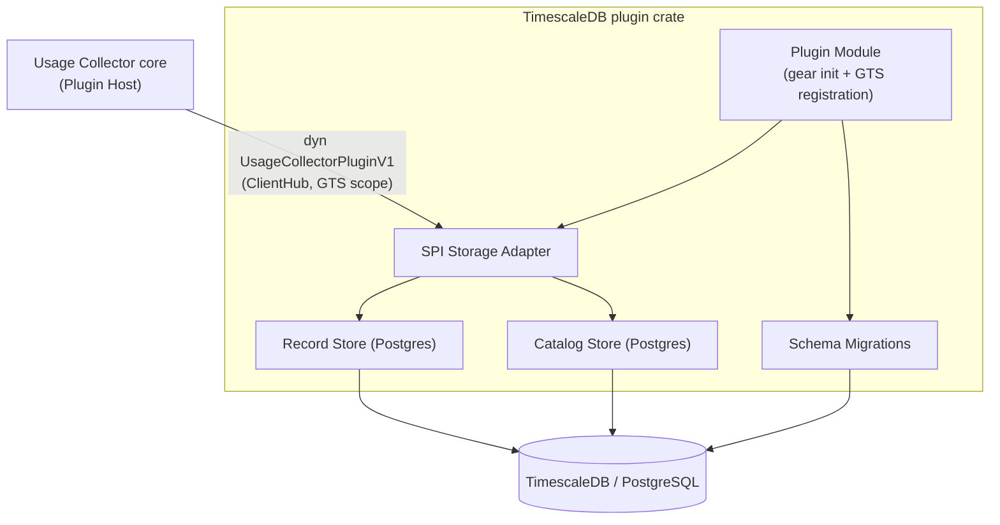
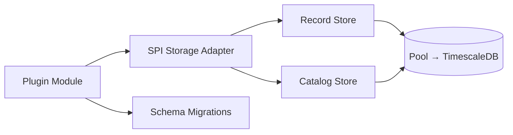
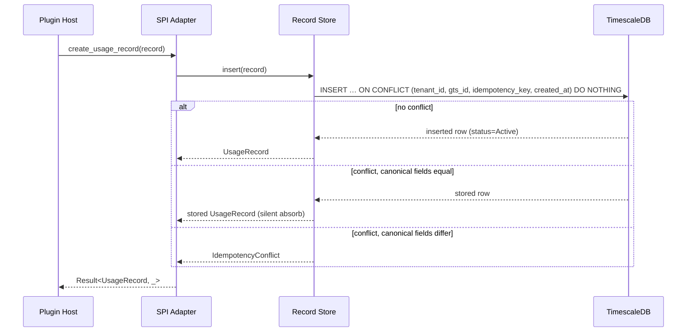
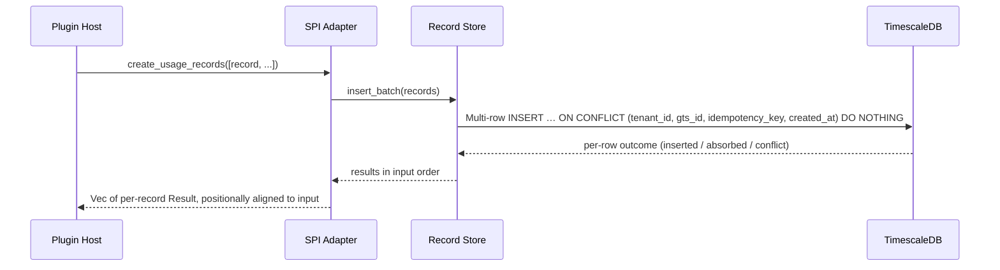
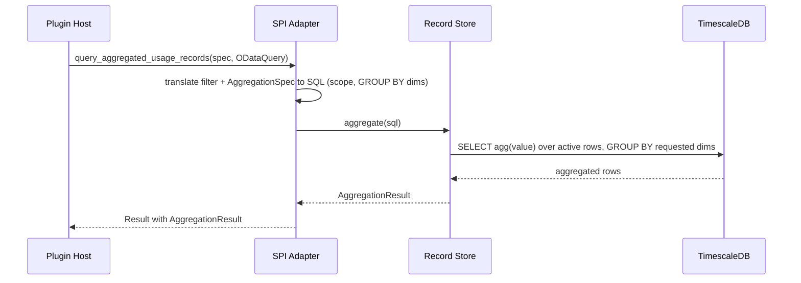
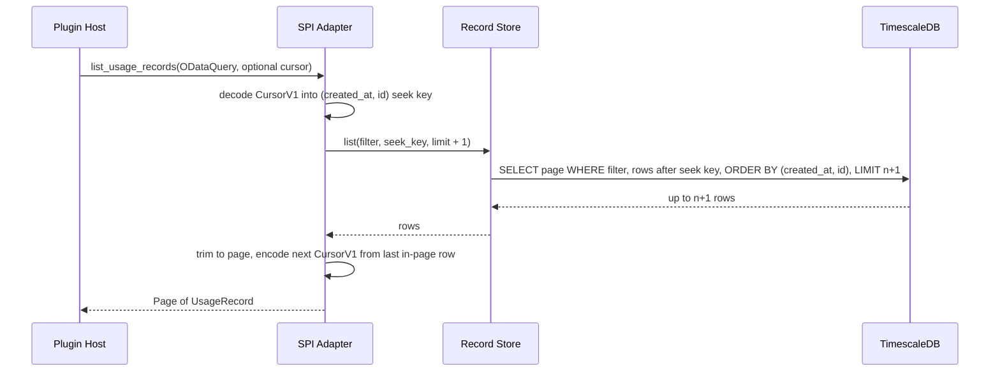
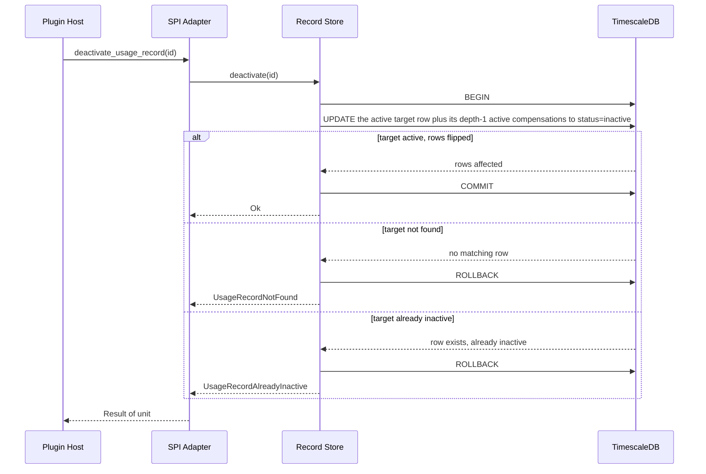
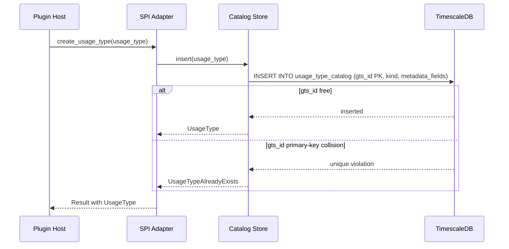
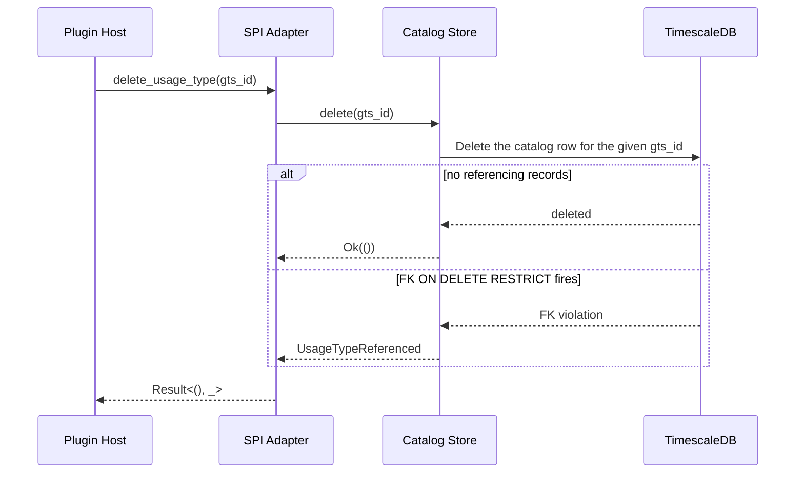

# Technical Design — TimescaleDB Usage Collector Storage Plugin

<!-- toc -->

- [1. Architecture Overview](#1-architecture-overview)
  - [1.1 Architectural Vision](#11-architectural-vision)
  - [1.2 Architecture Drivers](#12-architecture-drivers)
  - [1.3 Architecture Layers](#13-architecture-layers)
- [2. Principles & Constraints](#2-principles--constraints)
  - [2.1 Design Principles](#21-design-principles)
  - [2.2 Constraints](#22-constraints)
- [3. Technical Architecture](#3-technical-architecture)
  - [3.1 Domain Model](#31-domain-model)
  - [3.2 Component Model](#32-component-model)
  - [3.3 API Contracts](#33-api-contracts)
  - [3.4 Internal Dependencies](#34-internal-dependencies)
  - [3.5 External Dependencies](#35-external-dependencies)
  - [3.6 Interactions & Sequences](#36-interactions--sequences)
  - [3.7 Database schemas & tables](#37-database-schemas--tables)
- [4. Additional context](#4-additional-context)
  - [Non-Applicable Design Domains](#non-applicable-design-domains)
  - [Observability](#observability)
  - [Deferred (post-v1)](#deferred-post-v1)
  - [Testing Architecture](#testing-architecture)
- [5. Traceability](#5-traceability)

<!-- /toc -->

- [ ] `p3` - **ID**: `cpt-cf-uc-plugin-design-timescaledb`

## 1. Architecture Overview

### 1.1 Architectural Vision

The TimescaleDB Usage Collector Storage Plugin is a vendor-specific backend that implements the Usage Collector's storage Service Provider Interface (`UsageCollectorPluginV1`, declared in [`usage-collector-sdk/src/plugin_api.rs`](../../../usage-collector-sdk/src/plugin_api.rs)) on top of PostgreSQL with the TimescaleDB extension. It is the durable system of record for both `usage_records` and the usage-type catalog. The plugin follows the gear + plugin pattern: the Usage Collector core owns authentication, PDP authorization, attribution and shape validation, idempotency-key presence, and counter/gauge semantics; the plugin is pure persistence and query. Every SPI call arrives already authorized and structurally validated.

The design realizes three responsibilities. First, **record persistence**: single and batched inserts with `(tenant_id, gts_id, idempotency_key, created_at)` deduplication, append-only compensation rows (`corrects_id`), and a one-way depth-1 deactivation cascade. Second, **query execution**: keyset-paginated raw reads and server-side aggregation (SUM / COUNT / MIN / MAX / AVG with grouping) pushed into SQL so the backend's native acceleration is used. Third, **catalog management**: usage-type create / get / list / delete, with an in-database `ON DELETE RESTRICT` foreign key from `usage_records.gts_id` to `usage_type_catalog.gts_id` so a referenced usage type cannot be deleted.

TimescaleDB is chosen because the workload is append-heavy time-series ingestion with time-windowed analytical reads. The `usage_records` table is a hypertable partitioned on `created_at`, which keeps inserts and time-range scans efficient at the gear's throughput envelope. The plugin is statically linked as a workspace member, binds at runtime through `types-registry` + `ClientHub` GTS instance scope, and carries no compile-time dependency on the host gear.

### 1.2 Architecture Drivers

#### Functional Drivers

The plugin realizes the persistence and query side of the gear's functional requirements. The authoritative requirement statements live in the gear PRD ([`PRD.md`](../../../docs/PRD.md)) and the SPI reference ([`plugin-spi.md`](../../../docs/plugin-spi.md)).

| Capability              | PRD Requirement                                                                                                                                                      | Design Response                                                                                                                                                                                                                                                                                                                                                                                                                    |
| ----------------------- | -------------------------------------------------------------------------------------------------------------------------------------------------------------------- | ---------------------------------------------------------------------------------------------------------------------------------------------------------------------------------------------------------------------------------------------------------------------------------------------------------------------------------------------------------------------------------------------------------------------------------- |
| Pluggable storage       | `cpt-cf-usage-collector-fr-pluggable-storage`                                                                                                                        | Implements the full `UsageCollectorPluginV1` SPI; no gear code reaches PostgreSQL directly.                                                                                                                                                                                                                                                                                                                                        |
| Ingestion + idempotency | `cpt-cf-usage-collector-fr-ingestion`, `cpt-cf-usage-collector-fr-idempotency`                                                                                       | `INSERT … ON CONFLICT DO NOTHING` with dedup on the `usage_records` `(tenant_id, gts_id, idempotency_key, created_at)` UNIQUE; exact-equality retry returns the stored row, canonical-field mismatch surfaces `IdempotencyConflict`. Dedup identity is the 4-tuple including `created_at` — the canonical identity per ADR-0014, not a divergence; the plugin's remaining divergence is retention-bounded key preservation (§2.2). |
| Batch ingestion         | `cpt-cf-usage-collector-fr-ingestion`                                                                                                                                | A single multi-row write path returns per-record results in input order.                                                                                                                                                                                                                                                                                                                                                           |
| Compensation            | `cpt-cf-usage-collector-fr-usage-compensation`                                                                                                                       | Caller-supplied signed `value` plus optional `corrects_id` persisted verbatim on the same insert path; no dedicated compensate call.                                                                                                                                                                                                                                                                                               |
| Event deactivation      | `cpt-cf-usage-collector-fr-event-deactivation`                                                                                                                       | Status-only update with a depth-1 atomic set flip of an ordinary row plus its active compensations.                                                                                                                                                                                                                                                                                                                                |
| Raw query               | `cpt-cf-usage-collector-fr-query-raw`                                                                                                                                | Keyset pagination over `(created_at, id)` honoring the gateway-supplied `ODataQuery` order and cursor.                                                                                                                                                                                                                                                                                                                             |
| Aggregated query        | `cpt-cf-usage-collector-fr-query-aggregation`                                                                                                                        | Pushed-down SQL aggregation and `GROUP BY` over the requested dimensions.                                                                                                                                                                                                                                                                                                                                                          |
| Usage-type catalog      | `cpt-cf-usage-collector-fr-usage-type-registration`, `cpt-cf-usage-collector-fr-usage-type-deletion`, `cpt-cf-usage-collector-fr-usage-type-existence-and-semantics` | `usage_type_catalog` table with `gts_id` PK; the `usage_records` FK enforces referential integrity at delete time.                                                                                                                                                                                                                                                                                                                 |

#### NFR Allocation

| NFR Summary                     | PRD NFR                                                | Allocated To         | Design Response                                                                           | Verification                                                    |
| ------------------------------- | ------------------------------------------------------ | -------------------- | ----------------------------------------------------------------------------------------- | --------------------------------------------------------------- |
| Query latency (aggregation p95) | `cpt-cf-usage-collector-nfr-query-latency`             | Postgres Query Port  | Server-side aggregation + time-bucketed indexes on the hypertable.                        | Load test 30-day single-tenant range against the bound backend. |
| Throughput (bulk ingestion)     | `cpt-cf-usage-collector-nfr-throughput`                | Postgres Insert Port | Multi-row batch write path drives the native bulk insert.                                 | Sustained load test at the gear's records/sec envelope.         |
| Plugin contract stability       | `cpt-cf-usage-collector-nfr-plugin-contract-stability` | SPI adapter          | Implements `UsageCollectorPluginV1` as-is; additive-only within the major version.        | Compile-time conformance against the SDK trait.                 |
| Operational visibility          | `cpt-cf-usage-collector-nfr-operational-visibility`    | OTel metrics         | Push-based counters/histograms for ingestion, dedup, query latency, and plugin readiness. | Dashboard review against the emitted signal set.                |

#### Plugin PRD Requirement Traceability

The capabilities and NFRs above realize plugin-scoped requirements defined in the plugin PRD ([`PRD.md`](./PRD.md)), each of which maps up to the gear PRD requirement shown. This is the bidirectional PRD↔DESIGN linkage for the plugin scope.

| Plugin PRD requirement                         | Realized by (this design)                                                     | Maps to gear PRD                                                                                                    |
| ---------------------------------------------- | ----------------------------------------------------------------------------- | ------------------------------------------------------------------------------------------------------------------- |
| `cpt-cf-uc-plugin-fr-record-persistence`       | Record Store single/batch insert (§3.2, §3.6)                                 | `cpt-cf-usage-collector-fr-ingestion`, `cpt-cf-usage-collector-fr-record-metadata`                                  |
| `cpt-cf-uc-plugin-fr-idempotent-dedup`         | 4-tuple `ON CONFLICT` dedup authority (§2.2, §3.6)                            | `cpt-cf-usage-collector-fr-idempotency`                                                                             |
| `cpt-cf-uc-plugin-fr-compensation-persistence` | Signed `value` + `corrects_id` on the insert path (§3.1)                      | `cpt-cf-usage-collector-fr-usage-compensation`                                                                      |
| `cpt-cf-uc-plugin-fr-deactivation`             | Depth-1 atomic set flip (§3.6 deactivate-cascade)                             | `cpt-cf-usage-collector-fr-event-deactivation`                                                                      |
| `cpt-cf-uc-plugin-fr-raw-query`                | Keyset-paginated list over `(created_at, id)` (§3.6 list-keyset)              | `cpt-cf-usage-collector-fr-query-raw`                                                                               |
| `cpt-cf-uc-plugin-fr-aggregated-query`         | Pushed-down SQL aggregation (§3.6 query-aggregated)                           | `cpt-cf-usage-collector-fr-query-aggregation`                                                                       |
| `cpt-cf-uc-plugin-fr-usage-type-catalog`       | Catalog Store create/get/list (§3.2, §3.6 create-type)                        | `cpt-cf-usage-collector-fr-usage-type-registration`, `cpt-cf-usage-collector-fr-usage-type-existence-and-semantics` |
| `cpt-cf-uc-plugin-fr-referential-integrity`    | Catalog delete with in-DB FK rejection lift (§2.2, §3.6 delete-type-fk, §3.7) | `cpt-cf-usage-collector-fr-usage-type-deletion`, `cpt-cf-usage-collector-fr-usage-type-existence-and-semantics`     |
| `cpt-cf-uc-plugin-fr-retention`                | Declarative TimescaleDB retention policy (§2.2 Data Retention, §3.7)          | storage-tier realization of the gear's data-lifecycle envelope                                                      |
| `cpt-cf-uc-plugin-fr-schema-provisioning`      | Idempotent Schema Migrations at `init` (§3.2, §3.7)                           | `cpt-cf-usage-collector-fr-pluggable-storage`                                                                       |
| `cpt-cf-uc-plugin-fr-registration`             | Plugin Module GTS + ClientHub handshake (§3.2)                                | `cpt-cf-usage-collector-fr-pluggable-storage`                                                                       |
| `cpt-cf-uc-plugin-fr-error-classification`     | SPI Adapter error mapping (§2.1 SPI Conformance, §3.2)                        | `cpt-cf-usage-collector-nfr-plugin-contract-stability`                                                              |
| `cpt-cf-uc-plugin-nfr-query-latency`           | Postgres Query Port (NFR Allocation, above)                                   | `cpt-cf-usage-collector-nfr-query-latency`                                                                          |
| `cpt-cf-uc-plugin-nfr-ingestion-throughput`    | Postgres Insert Port (NFR Allocation, above)                                  | `cpt-cf-usage-collector-nfr-throughput`                                                                             |
| `cpt-cf-uc-plugin-nfr-spi-stability`           | SPI adapter compile-time conformance (NFR Allocation, above)                  | `cpt-cf-usage-collector-nfr-plugin-contract-stability`                                                              |
| `cpt-cf-uc-plugin-nfr-transport-security`      | TLS-required secret-wrapped DSN + injection-safe translation (§2.2, §4)       | plugin-specific (gear owns request-path security)                                                                   |
| `cpt-cf-uc-plugin-nfr-consistency-profile`     | Single-node read-after-write ceiling; per-topology profile (§4, ADR-0011)     | `cpt-cf-usage-collector-nfr-query-freshness`                                                                        |
| `cpt-cf-uc-plugin-nfr-operational-visibility`  | OTel `uc_timescaledb_*` metric inventory (§4 Observability)                   | `cpt-cf-usage-collector-nfr-operational-visibility`                                                                 |

#### Key ADRs (gear-level, referenced)

| ADR                                                                                                                         | Decision Summary                                                                                        |
| --------------------------------------------------------------------------------------------------------------------------- | ------------------------------------------------------------------------------------------------------- |
| [`0002-pluggable-storage`](../../../docs/ADR/0002-pluggable-storage.md)                                                     | All persistence/query reached through the Plugin SPI; operator config binds the active backend.         |
| [`0004-mandatory-idempotency`](../../../docs/ADR/0004-mandatory-idempotency.md)                                             | Every record carries a client idempotency key; dedup is the plugin's responsibility.                    |
| [`0005-monotonic-deactivation`](../../../docs/ADR/0005-monotonic-deactivation.md)                                           | Deactivation is a one-way `active → inactive` transition; no reactivation, no other field mutation.     |
| [`0012-unified-plugin-catalog-and-gts-id-reference`](../../../docs/ADR/0012-unified-plugin-catalog-and-gts-id-reference.md) | The plugin DB holds the sole usage-type catalog; records reference types by `gts_id` under an in-DB FK. |

### 1.3 Architecture Layers

- [ ] `p3` - **ID**: `cpt-cf-uc-plugin-tech-stack`

| Layer          | Responsibility                                                                                | Technology                                                |
| -------------- | --------------------------------------------------------------------------------------------- | --------------------------------------------------------- |
| Wiring         | Gear `init`, config load, pool creation, migrations, GTS + ClientHub registration             | `toolkit::gear`, `types-registry-sdk`                     |
| Domain         | SPI adapter; record and catalog ports; backend-error classification; scope/filter translation | Rust traits, `usage-collector-sdk` types                  |
| Infrastructure | SQL execution against TimescaleDB; connection pool; OTel metric emission                      | `sqlx` (postgres), TimescaleDB extension, `opentelemetry` |

## 2. Principles & Constraints

### 2.1 Design Principles

#### Pure Persistence

- [ ] `p2` - **ID**: `cpt-cf-uc-plugin-principle-pure-persistence`

The plugin performs no authentication, PDP authorization, attribution validation, idempotency-key presence enforcement, closed-shape metadata validation, or counter/gauge semantics decisions — all enforced upstream by the core. A malformed or unauthorized call reaching the SPI is a host-contract breach surfaced as `Internal`. The plugin stores caller-supplied data and reports aggregates; it never computes business deltas.

#### SPI Conformance

- [ ] `p2` - **ID**: `cpt-cf-uc-plugin-principle-spi-conformance`

The plugin implements `UsageCollectorPluginV1` exactly as declared in the SDK, returning the SDK's `UsageCollectorPluginError` vocabulary. Backend errors are classified into `Transient` (retryable) vs `Internal` (non-retryable) plus the typed domain variants; the host applies retry / fail-closed behavior without backend-specific parsing.

### 2.2 Constraints

#### Dedup-Key Identity & Retention-Bounded Preservation

- [ ] `p2` - **ID**: `cpt-cf-uc-plugin-constraint-dedup-key-preservation`

Deduplication is enforced by the `usage_records` hypertable's own `UNIQUE (tenant_id, gts_id, idempotency_key, created_at)` (`usage_records_dedup_uniq`) via `INSERT … ON CONFLICT … DO NOTHING` (§3.6). The dedup index therefore rides the hypertable's chunk lifecycle (chunking → retention → future compression); there is no separate dedup table and no cleanup job. The 4-tuple uniqueness is preserved for as long as the record's chunk exists — at least the configured retention window (Data Retention below; §3.5, §3.7), chunk-granular. Within that window the key is never reusable: a same-4-tuple replay resolves to a silently-absorbed exact-equality retry or an `IdempotencyConflict`, never a fresh insert. Once the chunk is dropped by retention its unique entries go with it, and a replay of the (now-recordless) 4-tuple is accepted as a fresh insert. Operators MUST size the retention window to exceed the maximum client replay and backfill horizon.

**Dedup identity = the 4-tuple (ADR-0014).** A TimescaleDB hypertable `UNIQUE`
must include the partition column (`created_at`), so a time-independent 3-tuple
uniqueness is not expressible on the hypertable. [`0014-created-at-in-dedup-identity`](../../../docs/ADR/0014-created-at-in-dedup-identity.md)
adopts the 4-tuple `(tenant_id, gts_id, idempotency_key, created_at)` as the
canonical dedup identity and folds `created_at` into the derived record `id`
(`id = UUIDv5(4-tuple)`), so this plugin's dedup matches the identity contract
exactly. The consequences:

- **Same key, same `created_at`** (a normal at-least-once retry): deduped as
  specified — silent absorb on an identical payload, `IdempotencyConflict` on
  any canonical-field mismatch.
- **Same key, different `created_at`**: a distinct 4-tuple → **two distinct
  records with distinct ids** (ADR-0014). Because `id` now derives from the full
  4-tuple, `get_usage_record` and `deactivate_usage_record` each address exactly
  one row — the former by-`id` non-uniqueness is closed.

**Retention-bounded preservation (still a divergence).** [`plugin-spi.md`](../../../docs/plugin-spi.md)
§"Cross-entity invariants" and [`0004-mandatory-idempotency`](../../../docs/ADR/0004-mandatory-idempotency.md)
require the dedup key be preserved permanently (retention MUST NOT free a key).
Here, as the opening paragraph describes, the dedup index rides the hypertable's
chunk lifecycle, so preservation is retention-bounded (chunk-granular), not
permanent. This narrowing needs upstream reconciliation with `plugin-spi.md` /
`0004-mandatory-idempotency` / `0011-consistency-contract` and the SPI
conformance test — tracked, not done here.

#### Data Retention

- [ ] `p2` - **ID**: `cpt-cf-uc-plugin-constraint-retention`

`usage_records` is bounded by a declarative TimescaleDB retention policy that drops every chunk whose `created_at` window lies wholly outside the configured retention period (§3.5 `retention_period`, default 365 days). The policy is registered idempotently at startup (§3.2, §3.7) and runs as a backend background job; the plugin issues no row-level delete for expiry. Retention is keyed on event time (`created_at`), so a row's eligibility follows its event timestamp independent of `ingested_at`, and backfilled rows older than the window are short-lived. `usage_type_catalog` is reference data and is not retained. Columnar compression and continuous-aggregate rollups remain deferred (§4).

#### In-Database Referential Integrity

- [ ] `p2` - **ID**: `cpt-cf-uc-plugin-constraint-fk-referential-integrity`

`usage_records.gts_id → usage_type_catalog.gts_id` is enforced by a real `ON DELETE RESTRICT` foreign key. Both tables live in the same database so FK rejection is atomic with the delete attempt. `delete_usage_type` attempts the delete and lifts an FK violation to the `UsageTypeReferenced` error; orphaned records are structurally impossible.

#### Injection-Safe Query Translation

- [ ] `p2` - **ID**: `cpt-cf-uc-plugin-constraint-injection-safe-translation`

Filter, aggregation, and pagination translation (§3.1, §3.6) builds SQL without interpolating any caller-supplied string into the query text. Two mechanisms cover the whole surface. **Values are bound parameters** — every comparison value from the gateway-supplied `ODataQuery` (the scope/tenant predicate, time bounds, the cursor seek key) is passed as a `sqlx` bind parameter, never concatenated. **Identifiers are allowlisted** — anything that must appear as a SQL identifier (a top-level filterable or orderable column, or a `GROUP BY` over a fixed column) is mapped through a closed allowlist of `usage_records` columns (§3.7); an unrecognized identifier is rejected as `Internal` rather than emitted.

Metadata filtering does not need an allowlist because a `metadata` key is a value, not an identifier: a metadata predicate compiles to `metadata ->> $key <op> $value`, with both the JSONB key and the compared value bound as parameters, and a metadata group-by dimension is likewise `metadata ->> $key`. The open-ended `metadata` namespace is therefore injection-safe without enumerating keys. The plugin does not validate the supplied key against the usage type's `metadata_fields` — closed-shape validation stays upstream (Pure Persistence, §2.1); it only parameterizes whatever key the caller supplies.

#### Vendor Isolation

- [ ] `p2` - **ID**: `cpt-cf-uc-plugin-constraint-vendor-isolation`

Backend-specific SQL, schema, and the TimescaleDB client dependency live only in this crate. The crate depends on `usage-collector-sdk` and `types-registry-sdk`, never on the host `usage-collector` crate. TimescaleDB ships under its own license on an independent release schedule.

## 3. Technical Architecture

### 3.1 Domain Model

**Technology**: Rust structs from `usage-collector-sdk` (transport-agnostic), plus plugin-local types.

**Location**: [`domain-model.md`](../../../docs/domain-model.md), [`usage-collector-sdk/src/models.rs`](../../../usage-collector-sdk/src/models.rs)

**Core Entities (reused from the SDK)**:

| Entity                              | Description                                                                                                                                                                                                                                                         | Schema                                                    |
| ----------------------------------- | ------------------------------------------------------------------------------------------------------------------------------------------------------------------------------------------------------------------------------------------------------------------- | --------------------------------------------------------- |
| UsageRecord                         | Persisted usage sample: deterministic gateway-derived `id` (`UUIDv5` of the full 4-tuple dedup key including `created_at`, ADR-0013/ADR-0014), `tenant_id`, `gts_id`, signed `value`, `created_at`, attribution refs, optional `corrects_id`, `metadata`, `status`. | [`models.rs`](../../../usage-collector-sdk/src/models.rs) |
| UsageType                           | Catalog row: `gts_id` (PK), `kind` (counter/gauge), `metadata_fields`.                                                                                                                                                                                              | [`models.rs`](../../../usage-collector-sdk/src/models.rs) |
| AggregationSpec / AggregationResult | Aggregation operation + ordered group-by; bucketed result.                                                                                                                                                                                                          | [`models.rs`](../../../usage-collector-sdk/src/models.rs) |
| ODataQuery / CursorV1 / Page        | Gateway-parsed filter, decoded cursor, paginated envelope.                                                                                                                                                                                                          | `toolkit-odata`                                           |

**Plugin-local types** (not in the SPI surface): the connection-pool handle, the typed configuration struct (§3.5), SQL row-mapping structs, and a scope/filter-to-SQL translation helper (injection-safe per §2.2 Injection-Safe Query Translation). `SecurityContext` is not passed to the plugin.

**Relationships**:

- UsageRecord → UsageType: many-to-one by `gts_id`, enforced by the `ON DELETE RESTRICT` FK.
- UsageRecord → UsageRecord: a compensation row references the ordinary row it offsets via `corrects_id` (depth-1).

### 3.2 Component Model

#### Plugin Module

- [ ] `p2` - **ID**: `cpt-cf-uc-plugin-component-module`

##### Why this component exists

Bootstraps the plugin as a ToolKit gear and makes the backend discoverable by the host.

##### Responsibility scope

`#[toolkit::gear]` `init`: load and validate config, create the connection pool, run schema migrations, then perform the GTS handshake — `PluginV1::<UsageCollectorPluginSpecV1>::build_registration(...)`, publish to `types-registry`, and `ClientHub::register_scoped::<dyn UsageCollectorPluginV1>` under `ClientScope::gts_id(&instance_id)`. Carries the configured `vendor` and `priority`. Mirrors the noop plugin's wiring.

##### Responsibility boundaries

Does not resolve which plugin the host binds (vendor/priority selection is host-side). Does not implement SPI methods — delegates to the SPI Storage Adapter. Does not own DDL content (delegated to Schema Migrations).

##### Related components (by ID)

- `cpt-cf-uc-plugin-component-adapter` — registers it as the scoped SPI client.
- `cpt-cf-uc-plugin-component-migrations` — invokes it during `init`.

#### SPI Storage Adapter

- [ ] `p2` - **ID**: `cpt-cf-uc-plugin-component-adapter`

##### Why this component exists

The single implementation of `UsageCollectorPluginV1`; the host's only entry point into the backend.

##### Responsibility scope

Implements all SPI methods, routing record operations to the Record Store and catalog operations to the Catalog Store. Owns translation of backend/SQL errors into `UsageCollectorPluginError` (`Transient`, `Internal`, `IdempotencyConflict`, `UsageRecordNotFound`, `UsageRecordAlreadyInactive`, `UsageTypeNotFound`, `UsageTypeAlreadyExists`, `UsageTypeReferenced`). Runs inside the host's ambient tracing span.

##### Responsibility boundaries

Holds no business logic and no authorization. Does not validate the value-sign matrix as policy — enforces it only as a structural precondition (rejects violations as `Internal`). Does not mint `id` — the gateway derives it deterministically from the full 4-tuple dedup key (`UUIDv5(tenant_id, gts_id, idempotency_key, created_at)`, ADR-0013/ADR-0014) and the plugin stores it verbatim — but is the authority for keyset ordering and cursor encoding.

##### Related components (by ID)

- `cpt-cf-uc-plugin-component-record-store` — delegates record persistence/query.
- `cpt-cf-uc-plugin-component-catalog-store` — delegates catalog operations.

#### Record Store

- [ ] `p2` - **ID**: `cpt-cf-uc-plugin-component-record-store`

##### Why this component exists

Encapsulates all `usage_records` SQL behind the adapter.

##### Responsibility scope

Single/batch insert with `(tenant_id, gts_id, idempotency_key, created_at)` dedup (exact-equality canonical-field comparison on conflict), `metadata` persisted byte-for-byte, `status = Active` on first accept; `get_usage_record` by `id`; keyset-paginated raw list honoring the supplied order and cursor; pushed-down aggregation; and the depth-1 atomic deactivation set flip in a single transaction.

##### Responsibility boundaries

Does not interpret `gts_id`, classify counter/gauge, or validate metadata-key membership. Does not delete usage types. Does not widen any PDP-constrained filter handed down by the gateway.

##### Related components (by ID)

- `cpt-cf-uc-plugin-component-adapter` — its sole caller.

#### Catalog Store

- [ ] `p2` - **ID**: `cpt-cf-uc-plugin-component-catalog-store`

##### Why this component exists

Encapsulates all `usage_type_catalog` SQL behind the adapter.

##### Responsibility scope

`create_usage_type` (insert; collision → `UsageTypeAlreadyExists`), `get_usage_type`, keyset-paginated `list_usage_types` ordered by `gts_id`, and `delete_usage_type` — which attempts the delete and lifts the `usage_records` FK rejection to `UsageTypeReferenced`.

##### Responsibility boundaries

Stores `kind` and `metadata_fields` verbatim; does not validate metadata-key well-formedness or membership. Does not derive counter/gauge from `gts_id`.

##### Related components (by ID)

- `cpt-cf-uc-plugin-component-adapter` — its sole caller.

#### Schema Migrations

- [ ] `p2` - **ID**: `cpt-cf-uc-plugin-component-migrations`

##### Why this component exists

Establishes and evolves the database schema idempotently at startup.

##### Responsibility scope

Creates the `timescaledb` extension, the `usage_type_catalog` table, the `usage_records` hypertable (partitioned on `created_at`) with its `UNIQUE (tenant_id, gts_id, idempotency_key, created_at)` constraint — the dedup authority (§2.2, §3.6) — the `gts_id` FK (`ON DELETE RESTRICT`), the query-supporting indexes, and the `usage_records` retention policy (§3.7). Runs once during module `init` before registration; all DDL and policy registration are idempotent, so a restart re-runs them as no-ops.

##### Responsibility boundaries

Does not own runtime queries, and performs no per-row expiry deletes — chunk expiry is the backend's job once the policy is registered. Continuous aggregates (hourly rollups) and columnar compression policies remain deferred (§4) and are not part of the v1 schema.

##### Related components (by ID)

- `cpt-cf-uc-plugin-component-module` — invokes it during `init`.

### 3.3 API Contracts

The plugin exposes one inbound contract: the storage SPI, consumed in-process by the Plugin Host via `ClientHub`. There is no REST or network-exposed surface.

- [ ] `p2` - **ID**: `cpt-cf-uc-plugin-interface-spi`

- **Technology**: in-process async Rust trait object (`async_trait`, `Send + Sync + 'static`)
- **Realizes**: `UsageCollectorPluginV1`
- **Location**: [`usage-collector-sdk/src/plugin_api.rs`](../../../usage-collector-sdk/src/plugin_api.rs); full contracts in [`plugin-spi.md`](../../../docs/plugin-spi.md)

**SPI Methods**:

| Method                           | Group   | Description                                         | Stability |
| -------------------------------- | ------- | --------------------------------------------------- | --------- |
| `create_usage_record`            | record  | Persist one record; dedup or `IdempotencyConflict`. | stable    |
| `create_usage_records`           | record  | Batch persist; per-record results in input order.   | stable    |
| `get_usage_record`               | record  | Fetch one record by `id`.                           | stable    |
| `query_aggregated_usage_records` | record  | Pushed-down SUM/COUNT/MIN/MAX/AVG + group-by.       | stable    |
| `list_usage_records`             | record  | Keyset-paginated raw page.                          | stable    |
| `deactivate_usage_record`        | record  | Depth-1 atomic `active → inactive` set flip.        | stable    |
| `create_usage_type`              | catalog | Insert catalog row.                                 | stable    |
| `get_usage_type`                 | catalog | Fetch catalog row by `gts_id`.                      | stable    |
| `list_usage_types`               | catalog | Keyset-paginated catalog page.                      | stable    |
| `delete_usage_type`              | catalog | Delete; FK rejection → `UsageTypeReferenced`.       | stable    |

### 3.4 Internal Dependencies

| Dependency          | Interface Used                                 | Purpose                                                                         |
| ------------------- | ---------------------------------------------- | ------------------------------------------------------------------------------- |
| usage-collector-sdk | SPI trait, domain models, error enum, GTS spec | Contract the plugin implements; shared types.                                   |
| types-registry      | `TypesRegistryClient`                          | Publish the `PluginV1<UsageCollectorPluginSpecV1>` instance for host discovery. |

**Dependency Rules**: no compile-time dependency on the host `usage-collector` crate; binding is runtime via `types-registry` + `ClientHub`; no circular dependencies.

### 3.5 External Dependencies

#### TimescaleDB / PostgreSQL

The system of record for all plugin data. Reached via a `sqlx` PostgreSQL connection pool over a TLS-required DSN.

**Configuration** (typed config struct loaded in `init`):

| Field                             | Purpose                                                                                          | Default              |
| --------------------------------- | ------------------------------------------------------------------------------------------------ | -------------------- |
| `database_url`                    | Postgres DSN; TLS required                                                                       | — (required)         |
| `pool_size_min` / `pool_size_max` | Connection pool bounds                                                                           | 2 / 16               |
| `connection_timeout`              | Acquire timeout                                                                                  | 10s                  |
| `retention_period`                | `usage_records` retention window; chunks older than this are dropped (§3.7, §2.2 Data Retention) | 365 days             |
| `vendor` / `priority`             | GTS instance selection metadata                                                                  | vendor required / 10 |

### 3.6 Interactions & Sequences

These flows cover every SPI operation declared in §3.3. The record group: ingest dedup, batch ingest, aggregated query, keyset raw list, and deactivation cascade. The catalog group: create type, keyset list (shares the raw-list pattern), and delete with FK rejection. The two point reads — `get_usage_record` (by `id`) and `get_usage_type` (by `gts_id`) — return the row or `UsageRecordNotFound` / `UsageTypeNotFound` respectively, and need no dedicated diagram. `get_usage_type` is a true primary-key lookup; `get_usage_record` matches on `id` alone, which is the **leading** column of the `(id, created_at)` PK (§3.7), not the whole key — it resolves a single row by the gateway-derived-`id`-is-unique contract (`id` is a `UUIDv5` of the full 4-tuple dedup key `(tenant_id, gts_id, idempotency_key, created_at)`, ADR-0013 as amended by ADR-0014) rather than by a schema constraint, since a hypertable `UNIQUE` must include the `created_at` partition column. Folding `created_at` into `id` (ADR-0014) is exactly what makes that uniqueness hold for every stored row (§2.2).

#### Ingest with idempotency dedup

**ID**: `cpt-cf-uc-plugin-seq-ingest-dedup`

**Description**: the `usage_records` `(tenant_id, gts_id, idempotency_key, created_at)` UNIQUE is the atomic serialization authority that decides insert vs absorb vs conflict. Ingest runs one `INSERT … ON CONFLICT … DO NOTHING RETURNING`: a returned row is a fresh insert; no returned row means the 4-tuple already exists. `ON CONFLICT DO NOTHING` blocks a concurrent same-4-tuple insert on the in-progress speculative tuple until the winner commits, then the loser reads the committed row and resolves absorb-vs-conflict. That resolution compares the canonical fields `value`, `resource_ref`, `subject_ref`, `corrects_id`, and `metadata` (`created_at` and the dedup-key fields are excluded — already matched by the conflict; `status` / `ingested_at` are server-managed) — all equal → silent absorb (return the stored row), any differ → `IdempotencyConflict`. **Because `created_at` is part of the dedup key (not a compared canonical field), a same-key request carrying a different `created_at` is a distinct 4-tuple → a fresh insert — two distinct records with distinct ids, the expected 4-tuple-identity behavior per ADR-0014 (§2.2).** The record `id` is also ANDed into the comparison, but only as a **defensive tautology, not a divergence**: [`0013-deterministic-usage-record-id`](../../../docs/ADR/0013-deterministic-usage-record-id.md) (as amended by ADR-0014) makes `id` a deterministic `UUIDv5(tenant_id, gts_id, idempotency_key, created_at)` derived by the gateway, so once the dedup key has matched the stored and incoming `id` are equal by construction and the term can never flip the result for a well-formed request. [`plugin-spi.md`](../../../docs/plugin-spi.md) and [`0004-mandatory-idempotency`](../../../docs/ADR/0004-mandatory-idempotency.md) list `id` as server-owned and exclude it from the canonical comparison; the plugin keeps the term purely so a corrupted stored row or a future non-deterministic-id path still surfaces as an `IdempotencyConflict` rather than a silent absorb (`record_store.rs` `canonical_equal`). A retryable `Transient` is returned only in the near-impossible race where the conflicting row's chunk is dropped by retention between the conflicting insert and the read-back.

#### Batch ingest with per-record results

**ID**: `cpt-cf-uc-plugin-seq-ingest-batch`

**Description**: a single multi-row write returns one outcome per input record in input order; a conflict on one record does not fail the others.

#### Aggregated query (pushed-down)

**ID**: `cpt-cf-uc-plugin-seq-query-aggregated`

**Description**: SUM/COUNT/MIN/MAX/AVG and grouping are pushed into SQL so TimescaleDB's native acceleration does the work; the adapter only translates the spec and maps rows.

#### Keyset-paginated raw list

**ID**: `cpt-cf-uc-plugin-seq-list-keyset`

**Description**: keyset (seek) pagination over the `(created_at, id)` order; fetching `limit + 1` detects whether a next page exists and the last in-page row seeds the next cursor. `list_usage_types` follows this identical pattern against the Catalog Store, keyed on `gts_id`. The seek predicate is a row-value tuple comparison (`(c1, …) > ($…)`), which is only sound over `NOT NULL` columns — a NULL leading key compares as NULL and silently drops the row. The gateway enforces this by rejecting a caller `$orderby` on a domain-optional field (`subject_id` / `subject_type` / `corrects_id`) with `400`; `keyset_predicate` re-checks it fail-closed via `usage_collector_sdk::is_keyset_safe_record_field` (and `…_type_field` for the catalog) so a crafted cursor or future in-process caller cannot smuggle a nullable ordering key past the SQL boundary. The effective `LIMIT` is floored to 1 (`effective_page_size`) so a `$top=0` that slips the gateway cannot produce the `LIMIT 0+1` / `truncate(0)` look-ahead underflow.

#### Deactivation cascade (depth-1, atomic)

**ID**: `cpt-cf-uc-plugin-seq-deactivate-cascade`

**Description**: one transaction flips the target row and its depth-1 active compensations from active to inactive; the transition is one-way (ADR-0005) and mutates no other field. A missing target yields `UsageRecordNotFound`, an already-inactive target yields `UsageRecordAlreadyInactive`.

#### Create usage type

**ID**: `cpt-cf-uc-plugin-seq-create-type`

**Description**: catalog insert keyed on the `gts_id` primary key; `kind` and `metadata_fields` are stored verbatim and a collision surfaces as `UsageTypeAlreadyExists`.

#### Delete usage type referenced by records

**ID**: `cpt-cf-uc-plugin-seq-delete-type-fk`

**Description**: referential integrity is enforced by the database, not by a gear-side read.

### 3.7 Database schemas & tables

- [ ] `p3` - **ID**: `cpt-cf-uc-plugin-db-schema`

#### Table: usage_type_catalog

**ID**: `cpt-cf-uc-plugin-dbtable-usage-type-catalog`

| Column          | Type   | Description                                           |
| --------------- | ------ | ----------------------------------------------------- |
| gts_id          | text   | GTS usage-type identifier; primary key and FK target. |
| kind            | text   | `counter` or `gauge`.                                 |
| metadata_fields | text[] | Closed list of allowed metadata key names.            |

**PK**: `gts_id`

**Constraints**: `kind` NOT NULL; referenced by `usage_records.gts_id` (`ON DELETE RESTRICT`).

#### Table: usage_records (hypertable)

**ID**: `cpt-cf-uc-plugin-dbtable-usage-records`

| Column                      | Type        | Description                                                                                                                                     |
| --------------------------- | ----------- | ----------------------------------------------------------------------------------------------------------------------------------------------- |
| id                          | uuid        | Deterministic gateway-derived record id (`UUIDv5` of the full 4-tuple dedup key including `created_at`, ADR-0013/ADR-0014); persisted verbatim. |
| tenant_id                   | uuid        | Owning tenant.                                                                                                                                  |
| gts_id                      | text        | Usage type; FK to `usage_type_catalog`.                                                                                                         |
| value                       | numeric     | Signed delta (`rust_decimal::Decimal`).                                                                                                         |
| created_at                  | timestamptz | Event time; hypertable partition key.                                                                                                           |
| resource_id / resource_type | uuid / text | Resource attribution.                                                                                                                           |
| subject_id / subject_type   | uuid / text | Optional subject attribution.                                                                                                                   |
| idempotency_key             | text        | Caller idempotency key.                                                                                                                         |
| corrects_id                 | uuid        | Set on a compensation row; references the offset row.                                                                                           |
| status                      | text        | `active` / `inactive`.                                                                                                                          |
| metadata                    | jsonb       | Caller metadata, stored byte-for-byte.                                                                                                          |
| ingested_at                 | timestamptz | Server insert time.                                                                                                                             |

**PK**: `(id, created_at)` (hypertable requires the partition key in the PK)

**Constraints**: hypertable on `created_at`; `UNIQUE (tenant_id, gts_id, idempotency_key, created_at)` (`usage_records_dedup_uniq`, 4-tuple — partition column required in hypertable unique keys) is the **dedup authority**, reached via `INSERT … ON CONFLICT … DO NOTHING` (§3.6); FK `gts_id → usage_type_catalog.gts_id` `ON DELETE RESTRICT`. Dedup identity is the 4-tuple including `created_at` — the canonical identity per ADR-0014 (§2.2); the plugin's remaining divergence is retention-bounded (not permanent) key preservation.

**Additional info**: indexes supporting time-windowed reads and aggregation — `(tenant_id, gts_id, created_at)` and `(tenant_id, created_at)`; status used to filter active rows.

#### Retention policy

The `usage_records` hypertable carries a declarative TimescaleDB retention policy that drops every chunk lying wholly outside the configured `retention_period` (§3.5, default 365 days), evaluated against the `created_at` partition column. Schema Migrations registers it idempotently at `init`; thereafter chunk expiry runs as a backend background job, so the plugin issues no row-level delete. Dropping a chunk also drops that chunk's entries in the `usage_records_dedup_uniq` index, so a record's dedup key is reclaimed together with the record — which is why the idempotency guarantee is bounded by `retention_period` (§2.2). There is no separate dedup table or cleanup job. `usage_type_catalog` holds reference data and is not retained. Compression of aging chunks and continuous-aggregate rollups remain deferred (§4).

## 4. Additional context

### Non-Applicable Design Domains

- **Security Architecture**: Not applicable as a plugin concern — authentication, PDP authorization, and attribution validation are enforced upstream by the gear core; the plugin receives only authorized, validated calls. The plugin's security obligations are limited to a TLS-required DSN (§3.5, held as a secret-wrapped string so `Debug`/log surfaces never leak the embedded Postgres password) and injection-safe query translation (§2.2 Injection-Safe Query Translation).
- **Deployment Topology**: Not detailed here — the plugin is statically linked into the gear process; database deployment (HA, sizing, region) follows the operator's TimescaleDB deployment guide.

### Observability

- [ ] `p3` - **ID**: `cpt-cf-uc-plugin-design-metric-inventory`

The plugin emits OpenTelemetry push metrics under the `uc_timescaledb_` sub-namespace, exported via OTLP. This follows the parent gear's plugin-metric convention (gear [`DESIGN.md`](../../../docs/DESIGN.md) §3.11.5): the gear owns the request-path `usage_collector.*` signals, and an active plugin owns its backend-internal series under its own sub-namespace (here `uc_timescaledb_`, abbreviating the collector namespace for brevity), not part of the gear's contract. Instrument names are the **full literal** Prometheus names (snake_case, `_total` on counters, `_seconds` on duration histograms) with **no** `with_unit(...)` hint, so the rendered series name is identical whether the downstream collector runs with `add_metric_suffixes` on or off — matching the parent gateway and the wider application-gear house style. Histogram bucket layouts bracket the NFR p95 budgets in §1.2 and are part of the contract. Metrics are grouped below by the architecture-driver vector they serve, realizing `cpt-cf-usage-collector-nfr-operational-visibility`.

#### Performance Metrics

| Metric                                         | Type      | Labels                             | Target                                                                                                |
| ---------------------------------------------- | --------- | ---------------------------------- | ----------------------------------------------------------------------------------------------------- |
| `uc_timescaledb_insert_duration_seconds`       | Histogram | `mode` (`single`, `batch`)         | brackets the bulk-ingestion envelope (`cpt-cf-usage-collector-nfr-throughput`)                        |
| `uc_timescaledb_query_duration_seconds`        | Histogram | `query_kind` (`aggregated`, `raw`) | aggregated p95 ≤ 500ms over a 30-day single-tenant range (`cpt-cf-usage-collector-nfr-query-latency`) |
| `uc_timescaledb_deactivate_duration_seconds`   | Histogram | —                                  | —                                                                                                     |
| `uc_timescaledb_pool_acquire_duration_seconds` | Histogram | —                                  | bounded by `connection_timeout` (10s, §3.5)                                                           |

#### Efficiency Metrics

| Metric                                   | Type      | Labels | Target                       |
| ---------------------------------------- | --------- | ------ | ---------------------------- |
| `uc_timescaledb_pool_connections_active` | Gauge     | —      | ≤ `pool_size_max` (16, §3.5) |
| `uc_timescaledb_pool_connections_idle`   | Gauge     | —      | —                            |
| `uc_timescaledb_dedup_absorbed_total`    | Counter   | —      | —                            |
| `uc_timescaledb_dedup_stale_total`       | Counter   | —      | —                            |
| `uc_timescaledb_batch_rows`              | Histogram | —      | —                            |

> `uc_timescaledb_dedup_absorbed_total` increments on exact-equality retries silently absorbed on the 4-tuple `ON CONFLICT` path (§3.6, ingest-dedup); `uc_timescaledb_dedup_stale_total` increments in the near-impossible race where a conflicting row's chunk is dropped by retention between the conflicting insert and the read-back, causing ingest to return a retryable `Transient` (§3.6); `uc_timescaledb_batch_rows` records the row count per `create_usage_records` write so write amortization is observable.

#### Reliability Metrics

| Metric                                       | Type    | Labels                                     | Target |
| -------------------------------------------- | ------- | ------------------------------------------ | ------ |
| `uc_timescaledb_backend_errors_total`        | Counter | `error_category` (`transient`, `internal`) | —      |
| `uc_timescaledb_batch_retries_total`         | Counter | —                                          | —      |
| `uc_timescaledb_idempotency_conflicts_total` | Counter | —                                          | —      |
| `uc_timescaledb_usage_type_referenced_total` | Counter | —                                          | —      |
| `uc_timescaledb_migration_failures_total`    | Counter | —                                          | 0      |
| `uc_timescaledb_ready`                       | Gauge   | —                                          | 1      |

> `uc_timescaledb_backend_errors_total` is keyed by the SPI's `Transient`/`Internal` classification via the `error_category` label (§2.1, SPI Conformance); `uc_timescaledb_batch_retries_total` increments once per bounded in-process `create_batch` retry after a transient backend error (deadlock-victim self-heal, §3.6), so a retried-and-recovered write is distinguishable from a `Transient` bubbled to the host; `uc_timescaledb_idempotency_conflicts_total` counts canonical-field-mismatch `IdempotencyConflict` results; `uc_timescaledb_usage_type_referenced_total` counts FK `ON DELETE RESTRICT` rejections surfaced as `UsageTypeReferenced`.
>
> `uc_timescaledb_ready` is a plugin-local backend-health gauge — set to 1 after a successful pool build + migration, cleared on a pool-acquire failure and re-armed on the next successful acquire. It is **distinct** from the host-computed structural `usage_collector.plugin.ready` gauge in the gear (§3.11.5) and is **not** a background probe.

#### Security Metrics

| Metric                                        | Type    | Labels | Target |
| --------------------------------------------- | ------- | ------ | ------ |
| `uc_timescaledb_tls_handshake_failures_total` | Counter | —      | 0      |

> The plugin performs no authentication or authorization (Pure Persistence, §2.1; Non-Applicable Security Architecture, above), so request-path security signals are owned by the gear core. The plugin's only metered security surface is the TLS-required DSN (§3.5) — injection-safe query translation (§2.2) is a construction-time invariant with no runtime signal — hence the single transport-level counter.

#### Catalog & Workload Metrics

| Metric                                   | Type    | Labels                             | Target |
| ---------------------------------------- | ------- | ---------------------------------- | ------ |
| `uc_timescaledb_usage_type_catalog_size` | Gauge   | —                                  | —      |
| `uc_timescaledb_compensations_total`     | Counter | —                                  | —      |
| `uc_timescaledb_query_requests_total`    | Counter | `query_kind` (`aggregated`, `raw`) | —      |

> `uc_timescaledb_usage_type_catalog_size` is refreshed after every successful `create_usage_type` / `delete_usage_type`; `uc_timescaledb_compensations_total` increments on inserts carrying `corrects_id`; `uc_timescaledb_query_requests_total` exposes the aggregated-vs-raw workload mix.

#### SLO Summary

| SLO Target                   | SLI Metric                                                           | Alert Threshold                                                                |
| ---------------------------- | -------------------------------------------------------------------- | ------------------------------------------------------------------------------ |
| Aggregated query p95 ≤ 500ms | `uc_timescaledb_query_duration_seconds{query_kind="aggregated"}` p95 | > 500ms over 15m                                                               |
| Bulk-ingestion throughput    | rate of `uc_timescaledb_insert_duration_seconds` count               | sustained drop ≥ 50% from trailing 1h baseline                                 |
| Backend readiness            | `uc_timescaledb_ready`                                               | 0 for > 1m                                                                     |
| Connection-pool saturation   | `uc_timescaledb_pool_connections_active` vs `pool_size_max`          | == max for > 5m with rising `uc_timescaledb_pool_acquire_duration_seconds` p95 |
| Backend error rate           | rate of `uc_timescaledb_backend_errors_total`                        | error ratio > 1% over 5m                                                       |

#### Label cardinality

All labels are bounded to the enumerated value sets above. Unbounded identifiers — `tenant_id`, `gts_id`, `id`, `idempotency_key`, `corrects_id`, `request_id`, `trace_id` — MUST NOT be used as metric labels; they belong in structured logs and distributed traces, not in metric dimensions.

**Distributed tracing**: each SPI dispatch runs inside the ambient tracing span opened by the host; the plugin opens no root span and records its SQL work under that span, so backend latency is attributable end-to-end through the host's `trace_id`.

### Deferred (post-v1)

Continuous aggregates (hourly rollups) and columnar compression policies are deferred. The v1 scope is the SPI methods, the base schema, and the `usage_records` retention policy (§3.7, §2.2 Data Retention); these remaining features are additive and do not change the SPI surface.

### Testing Architecture

Integration tests run against a real TimescaleDB via `testcontainers`, covering dedup outcomes, compensation persistence, the deactivation cascade, FK-rejected deletes, keyset pagination, and aggregation correctness. The crate compiles against the SDK trait, giving compile-time SPI conformance.

## 5. Traceability

- **PRD**: [`PRD.md`](../../../docs/PRD.md)
- **Gear DESIGN**: [`DESIGN.md`](../../../docs/DESIGN.md)
- **Plugin SPI reference**: [`plugin-spi.md`](../../../docs/plugin-spi.md)
- **Domain model**: [`domain-model.md`](../../../docs/domain-model.md)
- **SPI trait**: [`usage-collector-sdk/src/plugin_api.rs`](../../../usage-collector-sdk/src/plugin_api.rs)
- **Reference wiring**: [`plugins/noop-usage-collector-plugin/src/module.rs`](../../../plugins/noop-usage-collector-plugin/src/module.rs)
- **ADRs**: [`0002-pluggable-storage`](../../../docs/ADR/0002-pluggable-storage.md), [`0004-mandatory-idempotency`](../../../docs/ADR/0004-mandatory-idempotency.md), [`0005-monotonic-deactivation`](../../../docs/ADR/0005-monotonic-deactivation.md), [`0012-unified-plugin-catalog-and-gts-id-reference`](../../../docs/ADR/0012-unified-plugin-catalog-and-gts-id-reference.md)
