Created:  2026-07-20 by Virtuozzo International GmbH
Updated:  2026-09-16 by Virtuozzo International GmbH

# Technical Design — TimescaleDB Usage Collector Storage Plugin

<!-- toc -->

- [1. Architecture Overview](#1-architecture-overview)
  - [1.1 Architectural Vision](#11-architectural-vision)
  - [1.2 Architecture Drivers](#12-architecture-drivers)
  - [1.3 Architecture Layers](#13-architecture-layers)
- [2. Principles & Constraints](#2-principles--constraints)
  - [2.1 Design Principles](#21-design-principles)
  - [2.2 Constraints](#22-constraints)
- [3. Technical Architecture](#3-technical-architecture)
  - [3.1 Domain Model](#31-domain-model)
  - [3.2 Component Model](#32-component-model)
  - [3.3 API Contracts](#33-api-contracts)
  - [3.4 Internal Dependencies](#34-internal-dependencies)
  - [3.5 External Dependencies](#35-external-dependencies)
  - [3.6 Interactions & Sequences](#36-interactions--sequences)
  - [3.7 Database schemas & tables](#37-database-schemas--tables)
- [4. Additional context](#4-additional-context)
  - [4.1 Consistency Profile](#41-consistency-profile)
  - [4.2 Published Limits](#42-published-limits)
  - [4.3 Metric Inventory](#43-metric-inventory)
  - [4.4 Non-Applicable Design Domains](#44-non-applicable-design-domains)
  - [4.5 Deferred and Known Technical Debt](#45-deferred-and-known-technical-debt)
  - [4.6 Testing Architecture](#46-testing-architecture)
- [5. Traceability](#5-traceability)

<!-- /toc -->

- [ ] `p3` - **ID**: `cpt-cf-uc-plugin-design-timescaledb`

## 1. Architecture Overview

### 1.1 Architectural Vision

The TimescaleDB Usage Collector Storage Plugin implements the Usage Collector's storage Service Provider Interface (`UsageCollectorPluginV1`, as gear DESIGN §3.3 declares it) on PostgreSQL with the TimescaleDB extension. It is the durable system of record for usage entries only — this design gives the crate no usage-type catalog: declaration and resolution, including the declared fold, are owned by `types-registry` (ADR-0008) and never reach the SPI. The plugin is pure persistence and query (§2.1); every call arrives already authorized and structurally validated.

It has four responsibilities: **record persistence** — single and batch inserts deduplicated on the gear's 6-tuple identity (§2.2) and append-only invalidation (§3.1); **query execution** — keyset raw reads and pushed-down SUM / COUNT / MIN / MAX / LATEST aggregation, from the hourly rollup where eligible and an exact scan otherwise; **the usage feed and reconciliation** — snapshot-consistent pages in inserting-transaction order below the instance-wide settled horizon, and per-scope counters and watermarks; and **data lifecycle** — a per-GTS-type retention sweep driven by each type's current declared retention.

TimescaleDB fits append-heavy time-series ingestion with time-windowed analytical reads, and its partitioning lets the plugin run a per-type retention sweep and an hourly continuous aggregate natively: `usage_records` is a hypertable partitioned on `window_end` and a per-type integer `type_key`, so a chunk drops by the retention of the types it holds. The plugin is statically linked, binds at runtime through `types-registry` + `ClientHub` GTS instance scope, and has no compile-time dependency on the host gear.

**This design is normative for the gear's target SPI.** This branch's plugin code predates it, down to its SPI shape, and the file, module, function and test names in this design are the target layout (§4.5).

### 1.2 Architecture Drivers

#### Functional Drivers

The plugin realizes the persistence and query side of the gear's functional requirements through the plugin PRD ([`PRD.md`](./PRD.md)) requirements below; the authoritative gear statements live in the gear PRD ([`PRD.md`](../../../docs/PRD.md)). This table is the bidirectional PRD↔DESIGN linkage for the plugin's functional scope; the NFR Allocation table below is the same for its NFRs.

| Capability | Plugin PRD requirement | Gear PRD requirement | Design response |
| --- | --- | --- | --- |
| Registration and schema | `cpt-cf-uc-plugin-fr-registration`, `cpt-cf-uc-plugin-fr-schema-provisioning` | `cpt-cf-usage-collector-fr-pluggable-storage` | Full `UsageCollectorPluginV1`; idempotent migrations, then GTS + ClientHub registration at `init` (§3.2, §3.7). |
| Ingestion and idempotency | `cpt-cf-uc-plugin-fr-record-persistence`, `cpt-cf-uc-plugin-fr-idempotent-dedup` | `cpt-cf-usage-collector-fr-ingestion`, `cpt-cf-usage-collector-fr-record-metadata`, `cpt-cf-usage-collector-fr-idempotency` | `ON CONFLICT … DO NOTHING` on the 6-tuple UNIQUE, `entry_type` included; exact-equality absorb or `IdempotencyConflict`; one multi-row write per batch, results in input order (§2.2, §3.6 `cpt-cf-uc-plugin-seq-ingest-dedup`, `cpt-cf-uc-plugin-seq-ingest-batch`). |
| Invalidation | `cpt-cf-uc-plugin-fr-invalidation-persistence` | `cpt-cf-usage-collector-fr-record-invalidation` | Appended withdrawal entry; at most one per target through the dedup identity, which every withdrawal of one target shares (§3.1, §3.7). |
| Dedup level | `cpt-cf-uc-plugin-fr-dedup-level` | `cpt-cf-usage-collector-fr-idempotency` | `linearizable`, bound zero, commit order (§4.1 item 9). |
| Durable acknowledgement | `cpt-cf-uc-plugin-fr-durable-ack` | `cpt-cf-usage-collector-fr-ingestion` | `SET LOCAL synchronous_commit = on`; `fsync`/`full_page_writes` startup checks (§3.5). |
| Quantity fidelity | `cpt-cf-uc-plugin-fr-quantity-fidelity` | `cpt-cf-usage-collector-fr-record-quantity` | `numeric` without a typmod (§3.7). |
| Aggregated query | `cpt-cf-uc-plugin-fr-aggregated-query`, `cpt-cf-uc-plugin-fr-rollup-aggregation` | `cpt-cf-usage-collector-fr-query-aggregation`, `cpt-cf-usage-collector-nfr-aggregate-freshness` | Pushed-down SQL; `usage_rollup_1h` where eligible, exact scan otherwise (§3.6 `cpt-cf-uc-plugin-seq-query-aggregated`, §3.7). |
| Raw query | `cpt-cf-uc-plugin-fr-raw-query` | `cpt-cf-usage-collector-fr-query-raw` | Keyset seek from the gateway-decoded keyset, over the effective order the host supplies; no wire cursor (§2.2, §3.6 `cpt-cf-uc-plugin-seq-list-keyset`). |
| Converged-only lookup | `cpt-cf-uc-plugin-fr-converged-lookup` | `cpt-cf-usage-collector-fr-record-invalidation` | Scoped point read (§3.6 `cpt-cf-uc-plugin-seq-converged-lookup`). |
| Usage feed and retention refusal | `cpt-cf-uc-plugin-fr-usage-feed` | `cpt-cf-usage-collector-fr-billing-usage-feed`, `cpt-cf-usage-collector-fr-billing-retention-floor` | `(xact_id, id)` order below the settled horizon; `CursorBeyondRetention` past `feed_retention_floor_secs` or a per-type retention mark (§3.6 `cpt-cf-uc-plugin-seq-feed-page`, §4.1 items 2, 3, 6, 7). |
| Reconciliation | `cpt-cf-uc-plugin-fr-reconciliation-metadata` | `cpt-cf-usage-collector-fr-reconciliation-metadata` | Per-scope ledger read (§3.6 `cpt-cf-uc-plugin-seq-reconciliation`). |
| Per-type retention | `cpt-cf-uc-plugin-fr-per-type-retention` | `cpt-cf-usage-collector-fr-billing-retention-floor` | Registry-driven chunk sweep (§2.2, §3.6 `cpt-cf-uc-plugin-seq-retention-sweep`). |
| Error classification | `cpt-cf-uc-plugin-fr-error-classification` | `cpt-cf-usage-collector-nfr-plugin-contract-stability` | Six-variant vocabulary (§2.1, §3.3). |

#### NFR Allocation

| NFR Summary | PRD NFR (plugin → gear) | Allocated To | Design Response | Verification |
| --- | --- | --- | --- | --- |
| Aggregation query latency | `cpt-cf-uc-plugin-nfr-query-latency` → `cpt-cf-usage-collector-nfr-query-latency` | Query / Record Store aggregate path | Pushed-down SQL aggregation, with an hourly rollup-backed fast path for eligible SUM/COUNT queries (§3.2, §3.6). | Unmeasured; load test in §4.1 item 8. |
| Ingestion throughput | `cpt-cf-uc-plugin-nfr-ingestion-throughput` → `cpt-cf-usage-collector-nfr-throughput` | Record Store insert path | Multi-row `INSERT … UNNEST … ON CONFLICT` batch write drives the native bulk insert (§3.6); burst ≥ 30,000/s for ≤ 5 min per hour is a target, and SPI persist p95 ≤ 75ms is a planning share (gear DESIGN §3.11.2, not a gate). | Unmeasured; load test in §4.1 item 8. |
| Plugin contract stability | `cpt-cf-uc-plugin-nfr-spi-stability` → `cpt-cf-usage-collector-nfr-plugin-contract-stability` | SPI Storage Adapter | Implements `UsageCollectorPluginV1` as-is; additive-only within the major version. | Compile-time conformance plus a green full contract suite (§3.3). |
| Transport & query security | `cpt-cf-uc-plugin-nfr-transport-security` → plugin-specific (no single gear-level counterpart; the plugin is the sole credential holder and query translator in the gear + plugin split) | Connection pool + Query | TLS-by-default DSN held in a `Debug`-redacted secret wrapper; injection-safe translation — bound values, allowlisted identifiers (§2.2, §3.5). | Config validation rejects an empty DSN; SSL-mode resolution and the translation allowlist are unit-tested. |
| Backend consistency profile | `cpt-cf-uc-plugin-nfr-consistency-profile` → `cpt-cf-usage-collector-nfr-query-freshness` | Whole plugin | All nine gear DESIGN §3.10 items, dedup level `linearizable`, query-path lag bound zero on a single primary (§4.1). | Documented per §4; no dedicated test. |
| Operational visibility | `cpt-cf-uc-plugin-nfr-operational-visibility` → `cpt-cf-usage-collector-nfr-operational-visibility` | OTel metrics | Push-based counters/histograms/gauges under `uc_timescaledb_*` (§4). | Dashboard/alert review against the emitted signal set. |
| Feed freshness | `cpt-cf-uc-plugin-nfr-feed-freshness` → `cpt-cf-usage-collector-nfr-billing-feed-freshness` | Record Store feed read + all write transactions | Visibility bounded by the oldest running write transaction; request path and retention drops capped by `transaction_timeout_secs`, refreshes committed in batches (§4.1 item 2). | Derived, conditional (§4.1 item 2); unmeasured. |
| Replay throughput | `cpt-cf-uc-plugin-nfr-replay-throughput` → `cpt-cf-usage-collector-nfr-replay-throughput` | Record Store feed read | Index-ordered merge on `usage_records_feed_idx` across chunks, with the compiled scope applied as a filter (§3.7, §4.1 item 7). | Unmeasured; load test in §4.1 item 7. |
| Aggregate freshness | `cpt-cf-uc-plugin-nfr-aggregate-freshness` → `cpt-cf-usage-collector-nfr-aggregate-freshness` | Rollup | Refresh-policy bounds published separately for acceptance and invalidation (§4.1 item 4). | Derived; load test in §4.1 item 4. |

#### Key ADRs (gear-level, referenced)

| ADR | Decision Summary |
| --- | --- |
| [`0002-pluggable-storage`](../../../docs/ADR/0002-cpt-cf-usage-collector-adr-pluggable-storage.md) | All persistence/query reached through the Plugin SPI; operator config binds the active backend. |
| [`0004-mandatory-idempotency`](../../../docs/ADR/0004-cpt-cf-usage-collector-adr-mandatory-idempotency.md) | Every record carries a client idempotency key; dedup is the plugin's responsibility. |
| [`0008-registry-owned-typing`](../../../docs/ADR/0008-cpt-cf-usage-collector-adr-registry-owned-typing.md) | Type declarations are owned by `types-registry`, resolved and cached by the gear; the plugin never owns a catalog. |
| [`0009-declared-fold`](../../../docs/ADR/0009-cpt-cf-usage-collector-adr-declared-fold.md) | The aggregation fold is declared on the type, not chosen per query. |
| [`0010-append-only-invalidation`](../../../docs/ADR/0010-cpt-cf-usage-collector-adr-append-only-invalidation.md) | Invalidation is the single correction primitive on an append-only ledger; a withdrawal is an appended entry, never a rewrite. |
| [`0014-window-end-selection`](../../../docs/ADR/0014-cpt-cf-usage-collector-adr-window-end-selection.md) | Entries are selected by the end of their covered period (`window_end`), never by containment or overlap. |
| [`0006-consistency-contract`](../../../docs/ADR/0006-cpt-cf-usage-collector-adr-consistency-contract.md) | Floor-and-ceiling consistency; each plugin publishes its ceiling, dedup level and convergence bound. |
| [`0011-feed-aggregate-split`](../../../docs/ADR/0011-cpt-cf-usage-collector-adr-feed-aggregate-split.md) | A charging consumer reads the entry feed; the aggregate is a derived view a plugin may materialise. |

### 1.3 Architecture Layers

- [ ] `p1` - **ID**: `cpt-cf-uc-plugin-tech-stack`

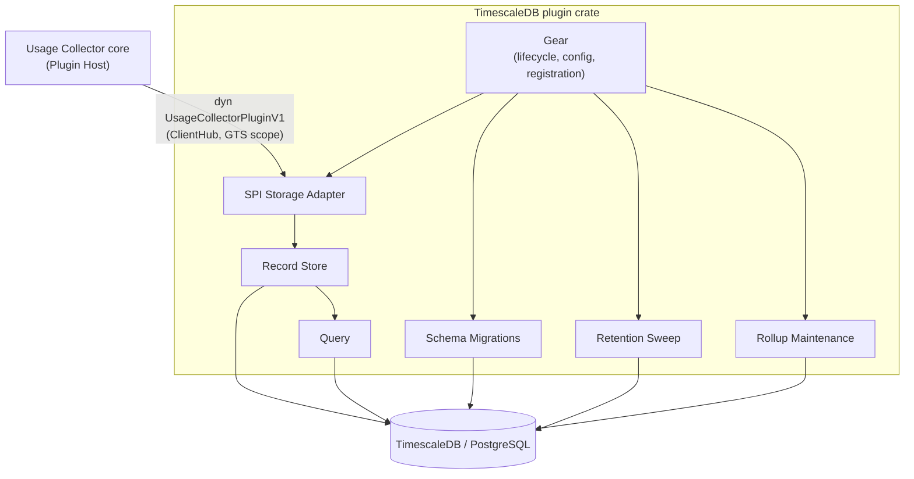
```mermaid
graph TD
    Host["Usage Collector core<br/>(Plugin Host)"] -->|"dyn UsageCollectorPluginV1<br/>(ClientHub, GTS scope)"| Adapter
    subgraph Plugin["TimescaleDB plugin crate"]
        Gear["Gear<br/>(lifecycle, config, registration)"] --> Adapter["SPI Storage Adapter"]
        Adapter --> Record["Record Store"]
        Record --> Query["Query"]
        Gear --> Migrations["Schema Migrations"]
        Gear --> Retention["Retention Sweep"]
        Gear --> Rollup["Rollup Maintenance"]
    end
    Record --> DB[("TimescaleDB / PostgreSQL")]
    Query --> DB
    Migrations --> DB
    Retention --> DB
    Rollup --> DB
```

| Layer | Responsibility | Technology |
| --- | --- | --- |
| Wiring | Gear `init`/`start`/`stop`, config load, pool creation, migrations, GTS + ClientHub registration, retention-sweep, rollup-monitor and feed-horizon-sampler background task | `toolkit::gear`, `types-registry-sdk` |
| Domain | SPI adapter; record-store and retention-source ports; backend-error classification; scope/filter translation | Rust traits, `usage-collector-sdk` types |
| Infrastructure | SQL execution against TimescaleDB; connection pool; retention sweep; rollup refresh-policy maintenance; OTel metric emission; feed and reconciliation reads | `sqlx` (postgres), TimescaleDB extension, `opentelemetry` |

## 2. Principles & Constraints

### 2.1 Design Principles

#### Pure Persistence

- [ ] `p1` - **ID**: `cpt-cf-uc-plugin-principle-pure-persistence`

The plugin performs no authentication, PDP authorization, attribution validation, idempotency-key presence enforcement, closed-shape metadata validation, or usage-type resolution — including selecting the declared aggregation fold — all enforced or resolved upstream by the core. A malformed or unauthorized call reaching the SPI is a host-contract breach surfaced as `Internal`. The plugin stores caller-supplied data verbatim and folds it by whichever `AggregationFold` the host hands it; it never resolves a type or chooses a fold itself. It never encodes, decodes or interprets a wire cursor (§2.2 Gateway-Owned Cursors).

#### SPI Conformance

- [ ] `p1` - **ID**: `cpt-cf-uc-plugin-principle-spi-conformance`

The plugin implements the gear's `UsageCollectorPluginV1` — seven methods — exactly as declared, returning the six-variant `UsageCollectorPluginError` vocabulary (`Transient`, `IdempotencyConflict`, `UsageRecordNotFound`, `UsageRecordNotConverged`, `CursorBeyondRetention`, `Internal`). Backend errors are classified into `Transient` (retryable) vs `Internal` (non-retryable) plus the typed domain variants; the host applies retry / fail-closed behavior without backend-specific parsing. Conformance is a green run of the gear's full contract suite, not compilation alone (§3.3).

### 2.2 Constraints

#### Dedup-Key Identity & Retention-Bounded Preservation

- [ ] `p1` - **ID**: `cpt-cf-uc-plugin-constraint-dedup-key-preservation`

Deduplication is enforced by the `usage_records` hypertable's `UNIQUE (tenant_id, gts_type_id, idempotency_key, window_start, window_end, entry_type, type_key)` (`usage_records_dedup_uniq`) via `INSERT … ON CONFLICT … DO NOTHING RETURNING` (§3.6), whose conflict target names the same seven columns. The identity is the gear's DESIGN §3.1 6-tuple `(tenant_id, gts_type_id, idempotency_key, window_start, window_end, entry_type)` **verbatim**: `type_key` is in the `UNIQUE` only because a hypertable `UNIQUE` must contain every partition column, and a type's key never changes, so the seventh column is not an identity input and not a divergence. `entry_type` must be in it: a record and its invalidation share tenant, type, key and covered period, so a constraint on the first five would treat every invalidation as a collision with its target. Every other place keyed on identity — the read-back of a conflicting row, the join between a write's input and its inserted rows, the in-batch comparison — keys on `id`, which covers all six inputs, or on the 6-tuple, never on the first five alone. The dedup index rides the chunk lifecycle — no separate dedup table, no cleanup job — so uniqueness is preserved for as long as the record's chunk exists: at least the referenced type's currently declared retention (Data Retention below), chunk-granular. Within that window a same-identity replay is a silent absorb (`UsageRecord::caller_supplied_eq`) or an `IdempotencyConflict`, never a fresh insert; once retention drops the chunk, a replay is accepted as a fresh insert. One stable per-meter `idempotency_key` therefore covers many covered periods: a replay over a *different* `(window_start, window_end)` is a distinct identity by design, and a record and its invalidation are two distinct identities.

**Bounded preservation is the gear floor, not a narrowing of it**: gear DESIGN §3.10 keeps the dedup identity visible "for as long as the referenced type's retention policy keeps it". The retention each type must declare is §4.1 item 6.

#### Data Retention

- [ ] `p1` - **ID**: `cpt-cf-uc-plugin-constraint-retention`

`usage_records` retention is enforced **per GTS type** by the plugin's own background retention sweep (§3.4, §3.6 `cpt-cf-uc-plugin-seq-retention-sweep`), not by a table-wide declarative TimescaleDB retention policy — none is registered, and startup removes one if an earlier build left it. The sweep runs every `retention_sweep_interval_secs` (§3.5) and, for each ledger chunk, resolves the current declared `retention` trait (§3.4, read from `types-registry`) of every GTS type in the chunk's `type_key` range; the chunk is dropped only once every one of those types' retention has elapsed, measured from the chunk's `window_end` upper bound. A type whose retention cannot be resolved — the registry is unreachable, the type is not registered, or its `retention` trait is missing or invalid — never causes a drop: the chunk holding it is kept and counted under `uc_timescaledb_retention_chunks_kept_unresolved_total{reason}`.

**Two permitted over-retention effects; under-retention is never permitted.** (1) Whole-chunk granularity — a chunk drops as a unit, so an entry can be held up to one `chunk_time_interval_secs` past its own retention. (2) With `type_key_slice_width` (§3.5) above 1, multiple types share one chunk slice, and a shared chunk is held to the **longest** retention among the types sharing it. Neither effect drops an entry early (`domain::retention::drop_decision`).

#### Injection-Safe Query Translation

- [ ] `p1` - **ID**: `cpt-cf-uc-plugin-constraint-injection-safe-translation`

Filter, aggregation, and pagination translation (`src/infra/storage/query/{translate,bind}.rs`; §3.1, §3.6) builds SQL without interpolating any caller-supplied string into the query text. Two mechanisms cover the whole surface. **Values are bound parameters** — every comparison value from the gateway-supplied `ODataQuery` (the scope/tenant predicate, the covered-period range, the cursor seek key) is converted to a storage-typed `SqlBind` and passed as a `sqlx` bind parameter, never concatenated. **Identifiers are allowlisted** — anything that must appear as a SQL identifier (a filterable or orderable column) is mapped through a closed allowlist of `usage_records` columns (`record_column`, §3.7); an unrecognized identifier is rejected as `Internal` rather than emitted.

Metadata filtering does not need an allowlist because a `metadata` key is a value, not an identifier: a metadata predicate compiles to `metadata ->> $key <op> $value`, with both the JSONB key and the compared value bound as parameters. The plugin does not validate the supplied key against the usage type's declared metadata fields — closed-shape validation stays upstream (Pure Persistence, §2.1); it only parameterizes whatever key the caller supplies.

#### Gateway-Owned Cursors

- [ ] `p1` - **ID**: `cpt-cf-uc-plugin-constraint-gateway-owned-cursors`

The gateway owns every wire cursor (`toolkit_odata::CursorV1`) on both paginated paths (gear DESIGN §2.1 *Cursor gateway ownership*). On the raw list the plugin receives the structured `(window_end, id)`-suffixed keyset the gateway decoded and returns the page's rows with the keyset of its last row. On the feed it issues and receives only its own opaque `FeedPosition`. It never encodes, decodes, signs or validates a `CursorV1`, and uses no offset-based scan on either path. The gear's SPI trait returns an `ODataPage` from the raw list while its raw-query sequence returns a keyset; this design follows the principle, and the trait's return type is an open question for the gateway.

#### Vendor Isolation

- [ ] `p1` - **ID**: `cpt-cf-uc-plugin-constraint-vendor-isolation`

Backend-specific SQL, schema, and the TimescaleDB client dependency live only in this crate. The crate depends on `usage-collector-sdk` and `types-registry-sdk`, never on the host `usage-collector` crate. TimescaleDB ships under its own license on an independent release schedule.

#### Rollup/Ledger Coupling

- [ ] `p2` - **ID**: `cpt-cf-uc-plugin-constraint-rollup-ledger-coupling`

A chunk drop and the deletion of the `usage_rollup_1h` rows it fed happen in **one transaction** (`retention_sweep::drop_chunk_and_rollup_rows`, §3.6 `cpt-cf-uc-plugin-seq-retention-sweep`), so the materialised aggregate never states more than the ledger entries that remain after retention. If the rollup's materialisation table cannot be found, the sweep drops nothing that cycle rather than dropping a chunk whose rollup rows it has no table to cut.

## 3. Technical Architecture

### 3.1 Domain Model

**Technology**: Rust structs from `usage-collector-sdk` (transport-agnostic), plus plugin-local types.

**Location**: [`usage-collector-sdk/src/models.rs`](../../../usage-collector-sdk/src/models.rs)

**Core Entities (reused from the SDK)**:

| Entity | Description | Schema |
| --- | --- | --- |
| UsageRecord | The single ledger entry. Carries a deterministic gateway-derived `id` (`UUIDv5` of the 6-tuple dedup identity `(tenant_id, gts_type_id, idempotency_key, window_start, window_end, entry_type)`, [`0007-record-identity-derivation`](../../../docs/ADR/0007-cpt-cf-usage-collector-adr-record-identity-derivation.md)), `tenant_id`, `gts_type_id`, signed `quantity`, the covered period (`window_start`, `window_end`), attribution refs, `idempotency_key`, `entry_type`, `origin`, `accepted_at`, `metadata`, and an optional `invalidation`. A correction is a distinct appended entry, never a mutation of an existing one. | [`models.rs`](../../../usage-collector-sdk/src/models.rs) |
| Invalidation | A withdrawal, carried on the `UsageRecord` it belongs to rather than persisted as a separate entity: `target` (the entry it withdraws, derived by the gateway) and `reason` (a `ReasonCode`, supplied by the caller). The entry declares its kind in `entry_type`, and the invalidation is present exactly when `entry_type = invalidation`; an ordinary measurement carries `None`. | [`models.rs`](../../../usage-collector-sdk/src/models.rs) |
| AggregationSpec / AggregationResult | The declared aggregation fold (`AggregationFold`: `Sum` \| `Count` \| `Max` \| `Min` \| `Latest` — there is no `Avg`) plus ordered group-by; bucketed result. | [`models.rs`](../../../usage-collector-sdk/src/models.rs) |
| ODataQuery / CursorV1 / Page | Gateway-parsed filter and the structured keyset decoded from a cursor; the page envelope. The plugin never handles the wire cursor (§2.2). | `toolkit-odata` |
| FeedPosition | A point in feed order: `{xact_id, id}`. Issued and interpreted by this plugin alone; opaque to the gateway. | [`models.rs`](../../../usage-collector-sdk/src/models.rs) |
| FeedPage | Entries in feed order and the next `FeedPosition` (none once a bounded replay is reached). | [`models.rs`](../../../usage-collector-sdk/src/models.rs) |
| ReconciliationMetadata | Per `(tenant_id, gts_type_id)`: accepted count, fold-appropriate summary, acceptance and covered-period-end watermarks. | [`models.rs`](../../../usage-collector-sdk/src/models.rs) |

**Plugin-local types** (not in the SPI surface): the connection-pool handle, the typed configuration struct (`TimescaleDbPluginConfig`, §3.5), SQL row-mapping structs (`UsageRecordRow`), the process-wide type-key cache (`TypeKeyCache`, §3.2 Record Store), and a scope/filter-to-SQL translation helper (injection-safe per §2.2 Injection-Safe Query Translation). `SecurityContext` is not passed to the plugin.

**Transaction id, feed position and type key** — plugin-assigned values:

- **Transaction id** (`usage_records.xact_id`, §3.7): the `xid8` of the transaction that inserted the entry, stamped by the database default `pg_current_xact_id()` and never set by the Record Store. Every entry of one batch shares it. Transaction ids are assigned in increasing order when a transaction first writes, so an invalidation carries a larger one than its target (§3.6 Correction order).
- **Feed position** (`FeedPosition`): `{xact_id, id}`. Its age, as the gateway defines it (gear DESIGN §3.1 `FeedPosition`), is the acceptance instant of the oldest entry after it, and a position with nothing after it is current. A head position has nothing settled after it, so it is current when issued. The position stores no age: the plugin reads it when the position is presented (§3.6 `cpt-cf-uc-plugin-seq-feed-page`, Retention refusal). It never travels through the SPI except as the opaque value this plugin issued.
- **Type key** (`usage_type_key`, §3.7, `TypeKeyCache`): a small integer assigned once per `gts_type_id` on its first write and never changed; the hypertable's type partition dimension (§3.7 `usage_type_key`).

**Relationships**:

- **No catalog aggregate.** There is no `UsageType` entity and no in-database foreign key: usage-type declaration and resolution are entirely owned by `types-registry` (ADR-0008) and never reach the storage SPI.
- UsageRecord → UsageRecord (withdrawal): a withdrawal names the entry it withdraws via `invalidation.target`, never rewriting it. At most one withdrawal per target follows from the dedup identity, not from a store-side rule: every withdrawal of one target carries the target's tenant, type, idempotency key and covered period with `entry_type = invalidation`, so a second one collides with the first (ADR-0010). A withdrawal of a withdrawal cannot arise, since the gateway resolves every target as an entry with `entry_type = record`.

### 3.2 Component Model

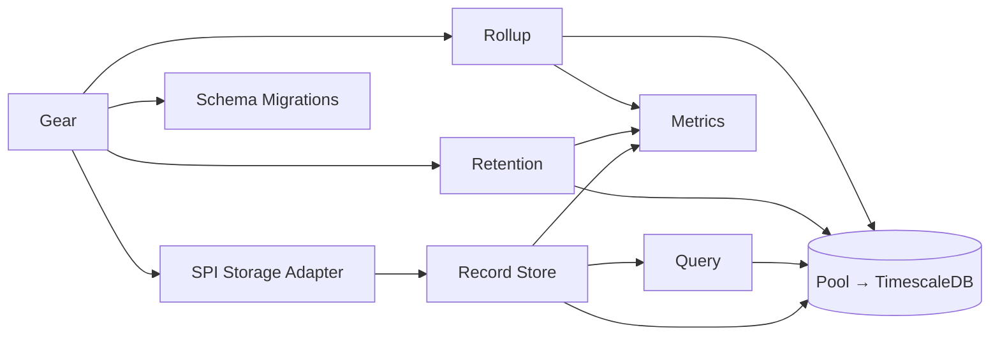
```mermaid
graph LR
    Gear["Gear"] --> Adapter["SPI Storage Adapter"]
    Adapter --> Record["Record Store"]
    Record --> Query["Query"]
    Gear --> Migrations["Schema Migrations"]
    Gear --> Retention["Retention"]
    Gear --> Rollup["Rollup"]
    Record --> Pool[("Pool → TimescaleDB")]
    Query --> Pool
    Retention --> Pool
    Rollup --> Pool
    Record --> Metrics["Metrics"]
    Retention --> Metrics
    Rollup --> Metrics
```

#### Gear

- [ ] `p2` - **ID**: `cpt-cf-uc-plugin-component-gear`

##### Why this component exists

Bootstraps the plugin as a ToolKit gear, makes the backend discoverable by the host, and owns the plugin's one background task.

##### Responsibility scope

`#[toolkit::gear]` `init` (`src/gear.rs`): load and validate config (`TimescaleDbPluginConfig`, `src/config.rs`, §3.5), including the required `feed_replay_horizon_secs` and `feed_retention_floor_secs`, create the connection pool, run schema migrations, apply post-migration partitioning and rollup-policy setup, then perform the GTS handshake — `PluginV1::<UsageCollectorPluginSpecV1>::build_registration(...)`, publish to `types-registry`, and `ClientHub::register_scoped::<dyn UsageCollectorPluginV1>` under `ClientScope::gts_id(&instance_id)`. Carries the configured `vendor` and `priority`. `start`/`stop` (`RunnableCapability`) run and cancel the background loop that sweeps retention, samples rollup health and samples the feed's settled-horizon lag (§3.6 `cpt-cf-uc-plugin-seq-retention-sweep`, `cpt-cf-uc-plugin-seq-rollup-refresh`).

##### Responsibility boundaries

Does not resolve which plugin the host binds (vendor/priority selection is host-side). Does not implement SPI methods — delegates to the SPI Storage Adapter. Does not own DDL content (delegated to Schema Migrations) or sweep/refresh logic (delegated to Retention and Rollup).

##### Related components (by ID)

- `cpt-cf-uc-plugin-component-adapter` — registered as the scoped SPI client during `init`.
- `cpt-cf-uc-plugin-component-migrations` — invoked during `init`.
- `cpt-cf-uc-plugin-component-retention` — started and stopped by `start`/`stop`.
- `cpt-cf-uc-plugin-component-rollup` — its refresh-policy monitor started and stopped alongside Retention.

#### SPI Storage Adapter

- [ ] `p1` - **ID**: `cpt-cf-uc-plugin-component-adapter`

##### Why this component exists

The single implementation of `UsageCollectorPluginV1` (`src/domain/adapter.rs`, `src/domain/ports.rs`); the host's only entry point into the backend.

##### Responsibility scope

Implements all SPI methods, delegating every one to the Record Store. Owns translation of backend/SQL errors into `UsageCollectorPluginError` (the six variants of §2.1). Runs inside the host's ambient tracing span.

##### Responsibility boundaries

Holds no business logic and no authorization. Does not resolve a usage type or choose an aggregation fold — both arrive as typed parameters from the host. Does not mint `id` — the gateway derives it deterministically from the 6-tuple dedup identity and the plugin stores it verbatim.

##### Related components (by ID)

- `cpt-cf-uc-plugin-component-record-store` — delegates every SPI method.

#### Record Store

- [ ] `p1` - **ID**: `cpt-cf-uc-plugin-component-record-store`

##### Why this component exists

Encapsulates all `usage_records` SQL behind the adapter (`src/infra/storage/record_store.rs`, `entity.rs`, `mapper.rs`, `error.rs`) — the single write and read path over the ledger.

##### Responsibility scope

Single/batch insert with 6-tuple dedup (exact-equality canonical-field comparison via `UsageRecord::caller_supplied_eq` on conflict), under `SET LOCAL synchronous_commit = on`, resolving each entry's type key before the write transaction; `metadata` persisted as semantic JSON (§3.7 `usage_records`); point `get` by `id` intersected with the caller's compiled PDP scope; keyset seek for the raw list from the gateway-decoded keyset; pushed-down aggregation, routed to the Query component's rollup or scan statement builder; feed pages bounded by the settled horizon under the compiled scope, with `CursorBeyondRetention` refusal; per-scope reconciliation reads.

##### Responsibility boundaries

Does not resolve `gts_type_id` declarations or choose an aggregation fold, and does not validate metadata-key membership. Does not delete or mutate a stored entry — a correction arrives only as a new insert carrying `invalidation`. Does not widen any PDP-constrained filter handed down by the gateway.

##### Related components (by ID)

- `cpt-cf-uc-plugin-component-adapter` — its sole caller.
- `cpt-cf-uc-plugin-component-query` — supplies the SQL the Record Store executes for list/aggregate.

#### Query

- [ ] `p1` - **ID**: `cpt-cf-uc-plugin-component-query`

##### Why this component exists

Builds every SQL statement and bind list the Record Store executes for list and aggregate (`src/infra/storage/query/{translate,bind,keyset,aggregate,rollup}.rs`), so injection-safe translation and rollup-eligibility logic live in one place.

##### Responsibility scope

Translates the gateway's `ODataQuery`/`ast::Expr` into parameterized SQL through the closed column allowlist (`record_column`) and bound values (`SqlBind`); renders keyset seek predicates from the gateway-decoded keyset (`keyset`); builds the exact-scan aggregate statement (`aggregate`) and, where eligible, the rollup-backed statement (`rollup`) per the five conditions in §3.6; builds the feed-page and reconciliation statements.

##### Responsibility boundaries

Never interpolates a caller-supplied string into SQL text. Does not execute a statement or acquire a connection — purely a builder, tested without a database.

##### Related components (by ID)

- `cpt-cf-uc-plugin-component-record-store` — its sole caller.

#### Retention

- [ ] `p1` - **ID**: `cpt-cf-uc-plugin-component-retention`

##### Why this component exists

Enforces per-GTS-type retention (`src/domain/retention.rs`, `src/infra/registry_retention.rs`, `src/infra/storage/{retention_sweep,type_key}.rs`), which no TimescaleDB policy can express because the retention trait lives in `types-registry`, not the database.

##### Responsibility scope

Runs the periodic sweep (`PgRetentionSweeper`): lists every ledger chunk with its `window_end` and `type_key` ranges, resolves the current declared retention of each type in a chunk's key range through `RetentionSource` (`registry_retention.rs`), decides the chunk via the pure `drop_decision` (`domain/retention.rs`), and drops an expired chunk together with the rollup rows it fed in one transaction (§2.2 Rollup/Ledger Coupling). Assigns and caches each type's `type_key` (`type_key.rs`) on its first write.

##### Responsibility boundaries

Never drops a chunk holding a type whose retention could not be resolved — it is kept and counted instead. Does not read or write `usage_rollup_1h`'s content itself, only deletes the rows a dropped chunk fed. Takes an advisory lock so only one replica sweeps at a time.

##### Related components (by ID)

- `cpt-cf-uc-plugin-component-gear` — starts and stops it as a background task.
- `cpt-cf-uc-plugin-component-rollup` — its chunk drop deletes that component's materialised rows.

#### Rollup

- [ ] `p1` - **ID**: `cpt-cf-uc-plugin-component-rollup`

##### Why this component exists

Maintains `usage_rollup_1h`'s refresh policies and publishes its health (`src/infra/storage/rollup_maintenance.rs`), so the aggregate path can be evaluated against continuous-aggregate freshness by the deployment guide (§4).

##### Responsibility scope

Applies the live and history continuous-aggregate refresh policies at startup with a bounded `buckets_per_batch` (§3.6 `cpt-cf-uc-plugin-seq-rollup-refresh`, `apply_rollup_policies`), idempotently; resolves the rollup's materialisation hypertable name for Retention's chunk-drop cut (`materialization_table`); samples each refresh policy's last-run status and age since success, publishing them on the metric inventory (`RollupMonitor`).

##### Responsibility boundaries

Does not decide whether a query is rollup-eligible (Query) or execute the aggregate read (Record Store). Does not itself drop rollup rows — Retention does, using the table name this component resolves.

##### Related components (by ID)

- `cpt-cf-uc-plugin-component-gear` — starts its monitor loop alongside Retention.
- `cpt-cf-uc-plugin-component-retention` — reads this component's materialisation-table lookup during a chunk drop.

#### Schema Migrations

- [ ] `p1` - **ID**: `cpt-cf-uc-plugin-component-migrations`

##### Why this component exists

Establishes and evolves the database schema idempotently at startup. Target: SQL migrations under `migrations/` that build the §3.7 ledger schema and the `usage_rollup_1h` continuous aggregate, and a migration probe under `src/infra/storage/`. The gear is unreleased, so the existing `migrations/0001_init.sql` is edited in place to the target schema rather than followed by a new migration.

##### Responsibility scope

Runs the migrations via the `sqlx` migrator, then applies configuration-driven post-migration setup: the hypertable's chunk time interval and type-key slice width, and the rollup's refresh policies (delegated to Rollup). Runs once during `init` before registration; all DDL is idempotent, so a restart re-runs it as a no-op.

##### Responsibility boundaries

Does not own runtime queries or retention decisions. Performs no per-row expiry delete — chunk expiry is Retention's job, not a database policy.

##### Related components (by ID)

- `cpt-cf-uc-plugin-component-gear` — invokes it during `init`.

#### Metrics

- [ ] `p1` - **ID**: `cpt-cf-uc-plugin-component-metrics`

##### Why this component exists

One OpenTelemetry instrument inventory (`src/infra/metrics.rs`) shared by every other component, under the plugin's own `uc_timescaledb_*` sub-namespace (§4).

##### Responsibility scope

Defines and records every push-based counter, gauge, and histogram the plugin emits — insertion, dedup, query, retention-sweep, rollup-refresh, pool, and readiness signals, feed and reconciliation.

##### Responsibility boundaries

Records what it is told; does not decide when a metric fires — that is each calling component's responsibility.

##### Related components (by ID)

- `cpt-cf-uc-plugin-component-record-store`, `cpt-cf-uc-plugin-component-retention`, `cpt-cf-uc-plugin-component-rollup` — every one records through it.

### 3.3 API Contracts

The plugin exposes one inbound contract: the storage SPI, consumed in-process by the Plugin Host (`cpt-cf-uc-plugin-actor-plugin-host`) via `ClientHub`. There is no REST or network-exposed surface.

- [ ] `p1` - **ID**: `cpt-cf-uc-plugin-interface-spi`

- **Technology**: in-process async Rust trait object (`async_trait`, `Send + Sync + 'static`)
- **Realizes**: `UsageCollectorPluginV1` (plugin PRD `cpt-cf-uc-plugin-interface-storage-spi`)
- **Location**: [`usage-collector-sdk/src/plugin_api.rs`](../../../usage-collector-sdk/src/plugin_api.rs)

**SPI Methods**:

| Method | Description | Stability |
| --- | --- | --- |
| `create_usage_record` | Persist one entry durably; dedup on the 6-tuple, or `IdempotencyConflict`. | stable |
| `create_usage_records` | Batch persist; per-record results in input order. | stable |
| `get_usage_record` | Fetch one entry by `id` under the compiled scope; `converged_only` changes nothing at this plugin's level (§3.6). | stable |
| `query_aggregated_usage_records` | Pushed-down SUM/COUNT/MIN/MAX/LATEST + group-by, from the rollup or the ledger. | stable |
| `list_usage_records` | Keyset seek from the gateway-decoded keyset; rows plus the last row's keyset. | stable |
| `read_feed_page` | Settled, in-scope entries of the subscribed types after a `FeedPosition`, in `(xact_id, id)` order, optionally bounded by `until`. | stable |
| `get_reconciliation_metadata` | Accepted count, fold-appropriate summary and watermarks for one (tenant, GTS type) scope. | stable |

**Error variants**: `Transient`, `Internal`, `IdempotencyConflict`, `UsageRecordNotFound`, `UsageRecordNotConverged` (declared unreachable for this plugin, §3.6 `cpt-cf-uc-plugin-seq-converged-lookup`), `CursorBeyondRetention` (raised by `read_feed_page` alone). A `Transient` raised because the pool was saturated carries `retry_after_seconds`; the plugin cannot know when a connection frees, so it reports a fixed 1 second, enough to stop a caller hot-looping without implying a precision it does not have. A `Transient` from any other cause leaves the hint unset.

**Signature.** `get_reconciliation_metadata` takes `(tenant_id, gts_type_id, time_range, fold, scope)` and returns one `ReconciliationMetadata`, matching the gear's SPI as declared. The gear narrowed the endpoint to one `(tenant, gts_type)` scope per call, which removed the paging parameters this design previously assumed. `read_feed_page` takes the compiled scope as the gear declares it: `read_feed_page(subscription, scope, page_after, until, limit)`, where an entry outside `scope` is absent (§3.6 `cpt-cf-uc-plugin-seq-feed-page`, Scope).

**Contract suite**:

> A conformance test runs the gear's SPI contract suite against a live container. Conformance requires every check the gear DESIGN §3.3 lists to be implemented and green — including `feed-snapshot-and-replay`, `feed-completeness`, `converged-target-lookup`, `dedup-concurrent` and `latest-tie-break`. A blocked or unimplemented check is a release blocker, not an accepted gap. Which checks run is read off the suite itself, not off a number written here. This branch's SDK carries no contract suite yet (§4.5).

### 3.4 Internal Dependencies

| Dependency | Interface Used | Purpose |
| --- | --- | --- |
| usage-collector-sdk | SPI trait, domain models, error enum, GTS spec, `AggregationFold` | Contract the plugin implements; shared types. |
| types-registry | `TypesRegistryClient` (via `ClientHub`) | Two roles: (1) publish the `PluginV1<UsageCollectorPluginSpecV1>` instance for host discovery at `init` (`cpt-cf-uc-plugin-contract-gts-registration`); (2) read each GTS type's current declared `retention` trait on every retention sweep (`cpt-cf-uc-plugin-component-retention`) — never cached across sweeps, because retention is mutable. |

**Dependency Rules**: no compile-time dependency on the host `usage-collector` crate; binding is runtime via `types-registry` + `ClientHub`; no circular dependencies.

### 3.5 External Dependencies

#### TimescaleDB / PostgreSQL

The system of record for all plugin data (`cpt-cf-uc-plugin-contract-timescaledb`). Reached via a `sqlx` PostgreSQL connection pool over a TLS-by-default DSN, held in a `Debug`-redacted secret wrapper (`SecretFromEnv`) so it never appears in logs or panic output. `connect_options` resolves the SSL mode rather than trusting operator convention: the silent fallback modes — an unspecified `sslmode`, `prefer`, or `allow` — are raised to `require`, `verify-ca` and `verify-full` are preserved, and an explicit `sslmode=disable` is honoured as a deliberate non-production opt-out with a warning emitted once per pool build.

**Configuration** (`TimescaleDbPluginConfig`, `src/config.rs`; durations are whole seconds):

| Field | Purpose | Default |
| --- | --- | --- |
| `database_url` | Postgres DSN; TLS by default — silent fallback modes raised to `require`, explicit `sslmode=disable` honoured with a warning | — (required) |
| `pool_size_min` / `pool_size_max` | Connection pool bounds (`max` must be ≥ 2) | 2 / 16 |
| `connection_timeout_secs` | Connection acquire timeout | 10 |
| `statement_timeout_secs` | Per-statement timeout on every request-path connection | 30 |
| `transaction_timeout_secs` | Postgres `transaction_timeout` on every pool connection and on the retention sweep's detached connection; bounds a whole transaction, not just one statement (§3.6, §4.1 item 2). MUST be greater than `statement_timeout_secs`; config load rejects a value that is not | 60 |
| `feed_acceptance_slack_secs` | A predicate inside every write path's INSERT statement refuses, as `Transient`, a row whose `accepted_at` differs from that statement's own `statement_timestamp()` by more than this, in either direction (§3.6 `cpt-cf-uc-plugin-seq-ingest-dedup`); counted by `uc_timescaledb_stale_acceptance_rejections_total`. Enters the acceptance-order slack (§3.6 `cpt-cf-uc-plugin-seq-feed-page`) | 120 |
| `chunk_time_interval_secs` | Time width of new ledger chunks; a multiple of 3600; applies to chunks created afterwards | 604800 (7d) |
| `type_key_slice_width` | How many type keys share one chunk slice (§2.2 Data Retention); applies to chunks created afterwards | 1 |
| `retention_sweep_interval_secs` | Seconds between retention sweeps | 3600 (1h) |
| `feed_replay_horizon_secs` | The deployment's operational replay horizon H; every feed position no older than this is served. The retention it requires of every GTS type is §4.1 item 6 | — (required) |
| `feed_retention_floor_secs` | The deployment's retention floor F, its backfill window plus H; a feed position older than this is refused `CursorBeyondRetention` (§3.6 `cpt-cf-uc-plugin-seq-feed-page`, Retention refusal). Config load rejects a value unless it is greater than `feed_replay_horizon_secs` + 2 × `feed_acceptance_slack_secs` + `statement_timeout_secs` | — (required) |
| `rollup_materialization_lag_secs` | Buckets newer than this are answered from the ledger rather than materialised | 7200 (2h) |
| `rollup_live_window_secs` | Reach of the frequent (live) refresh policy | 259200 (3d) |
| `rollup_refresh_interval_secs` | Seconds between live refresh-policy runs | 120 |
| `rollup_history_refresh_interval_secs` | Seconds between history refresh-policy runs; see §4.1 item 4 for acting consumers | 3600 (1h) |
| `vendor` / `priority` | GTS instance selection metadata | constructorfabric / 10 |

**Durability.** Every write transaction runs `SET LOCAL synchronous_commit = on`, so an operator-level `synchronous_commit` of `off` or `local` cannot weaken an acknowledgement. Unlike `synchronous_commit`, `fsync` and `full_page_writes` are server-wide and cannot be forced per transaction, and either one off can lose a committed write on a crash. At `init`, the plugin therefore verifies `current_setting('fsync') = 'on'` and `current_setting('full_page_writes') = 'on'` and fails startup otherwise (`cpt-cf-uc-plugin-fr-durable-ack`). With synchronous standbys, `remote_write` or stronger is the operator's choice and is recorded in the deployment's consistency profile (§4.1).

### 3.6 Interactions & Sequences

These flows cover every SPI operation in §3.3 and the plugin's two background processes. They realize the plugin PRD use cases `cpt-cf-uc-plugin-usecase-ingest-dedup` (`cpt-cf-uc-plugin-seq-ingest-dedup`), `cpt-cf-uc-plugin-usecase-read-feed-page` and `cpt-cf-uc-plugin-usecase-refuse-stale-cursor` (`cpt-cf-uc-plugin-seq-feed-page`); `cpt-cf-uc-plugin-usecase-bind-startup` is the Gear component's `init` (§3.2).

#### Ingest with idempotency dedup

**ID**: `cpt-cf-uc-plugin-seq-ingest-dedup`

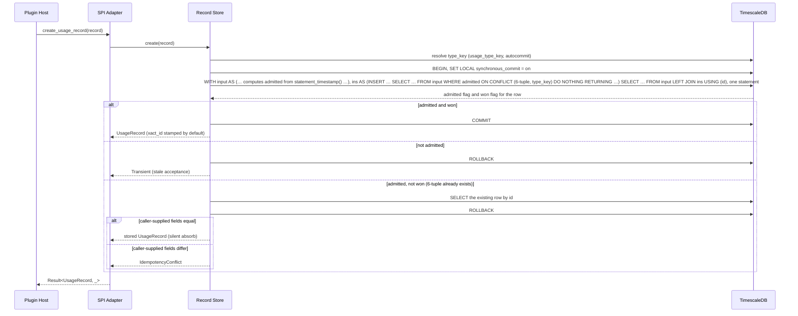
```mermaid
sequenceDiagram
    participant Host as Plugin Host
    participant Adapter as SPI Adapter
    participant Rec as Record Store
    participant DB as TimescaleDB
    Host->>Adapter: create_usage_record(record)
    Adapter->>Rec: create(record)
    Rec->>DB: resolve type_key (usage_type_key, autocommit)
    Rec->>DB: BEGIN, SET LOCAL synchronous_commit = on
    Rec->>DB: WITH input AS (… computes admitted from statement_timestamp() …), ins AS (INSERT … SELECT … FROM input WHERE admitted ON CONFLICT (6-tuple, type_key) DO NOTHING RETURNING …) SELECT … FROM input LEFT JOIN ins USING (id), one statement
    DB-->>Rec: admitted flag and won flag for the row
    alt admitted and won
        Rec->>DB: COMMIT
        Rec-->>Adapter: UsageRecord (xact_id stamped by default)
    else not admitted
        Rec->>DB: ROLLBACK
        Rec-->>Adapter: Transient (stale acceptance)
    else admitted, not won (6-tuple already exists)
        Rec->>DB: SELECT the existing row by id
        Rec->>DB: ROLLBACK
        alt caller-supplied fields equal
            Rec-->>Adapter: stored UsageRecord (silent absorb)
        else caller-supplied fields differ
            Rec-->>Adapter: IdempotencyConflict
        end
    end
    Adapter-->>Host: Result<UsageRecord, _>
```

**Description**: the entry's `type_key` is resolved (assigned on first write, cached thereafter — §3.1) before the write transaction opens, so the INSERT is that transaction's first write (the Precondition in `cpt-cf-uc-plugin-seq-feed-page` relies on this). The write is **one statement** that carries its own guard verdict out, shaped `WITH input AS (…computes admitted…), ins AS (INSERT … SELECT … FROM input WHERE admitted ON CONFLICT (6-tuple, type_key) DO NOTHING RETURNING …) SELECT … FROM input LEFT JOIN ins USING (id)`: `input` computes `admitted` — `accepted_at` within `feed_acceptance_slack_secs` (§3.5) of that statement's own `statement_timestamp()`, in either direction; `ins` inserts only an admitted row; the outer select returns `admitted` and whether the row won. Nothing before or after the statement computes the guard, since a later statement would run under a later `statement_timestamp()`. A won row is a fresh insert, its `xact_id` stamped by the column default. **The guard's verdict takes precedence**: a row not admitted is `Transient` (counted by `uc_timescaledb_stale_acceptance_rejections_total`, §4.3; the host lifts it to a retryable error so the retry is stamped afresh) even when its identity exists; this is what enforces the acceptance-order slack. `SET LOCAL synchronous_commit = on` makes a returned `COMMIT` durable (`cpt-cf-uc-plugin-fr-durable-ack`). An admitted row that did not win is read back by `id` and resolved via `UsageRecord::caller_supplied_eq`: equal canonical fields is a silent absorb returning the stored entry. `metadata` compares as a **parsed JSON document**, not as text: two submissions whose metadata differs only in key order, in insignificant whitespace, or in a duplicate key's earlier occurrence are equal, because `jsonb` retains none of those distinctions and a byte comparison would therefore report a conflict the store cannot substantiate on read-back. Every other canonical field compares by value. `origin` and `accepted_at` are server-assigned and take no part in the comparison, so a retry absorbed from the other ingestion path returns the stored entry with its stored `origin`. Any difference is `IdempotencyConflict`, carrying the idempotency key and the stored entry (`existing`), which the host needs to report an already-invalidated target. The read-back keys on `id`, never on `(tenant_id, gts_type_id, idempotency_key, window_start, window_end)`: once a record is invalidated two rows share those five columns, so a read by them could return the invalidation for a record retry or the record for an invalidation retry. A same-key request naming a different covered period, or the invalidation of a stored record, is a distinct identity, hence a fresh insert. The first write to commit is the survivor; late commits and abandoned calls are §4.1 item 9. If retention drops the conflicting row's chunk between the conflicting insert and the read-back, the call returns a retryable `Transient`.

#### Batch ingest with per-record results

**ID**: `cpt-cf-uc-plugin-seq-ingest-batch`

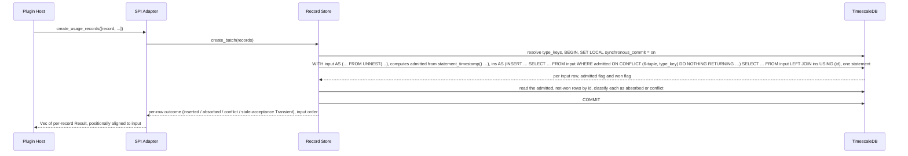
```mermaid
sequenceDiagram
    participant Host as Plugin Host
    participant Adapter as SPI Adapter
    participant Rec as Record Store
    participant DB as TimescaleDB
    Host->>Adapter: create_usage_records([record, ...])
    Adapter->>Rec: create_batch(records)
    Rec->>DB: resolve type_keys, BEGIN, SET LOCAL synchronous_commit = on
    Rec->>DB: WITH input AS (… FROM UNNEST(…), computes admitted from statement_timestamp() …), ins AS (INSERT … SELECT … FROM input WHERE admitted ON CONFLICT (6-tuple, type_key) DO NOTHING RETURNING …) SELECT … FROM input LEFT JOIN ins USING (id), one statement
    DB-->>Rec: per input row, admitted flag and won flag
    Rec->>DB: read the admitted, not-won rows by id, classify each as absorbed or conflict
    Rec->>DB: COMMIT
    Rec-->>Adapter: per-row outcome (inserted / absorbed / conflict / stale-acceptance Transient), input order
    Adapter-->>Host: Vec of per-record Result, positionally aligned to input
```

**Description**: the same guarded single statement as `cpt-cf-uc-plugin-seq-ingest-dedup`, over an `input` CTE built from `UNNEST(…)`: `admitted` is computed per input row, only admitted rows are inserted, and the outer select returns each row's `admitted` and won flags. Type keys are resolved before `BEGIN` for the same reason. The guard's verdict takes precedence per row: a row not admitted is a stale-acceptance `Transient` even when its identity exists. The outer select joins input to inserted rows on `id`, and only the admitted, not-won rows are read back, by `id`, in one statement, and each is classified a silent absorb or an `IdempotencyConflict` carrying its key and `existing`. Two same-identity entries inside one batch, recognised by equal `id` and hence equal six inputs, resolve the later against the earlier — absorbed when identical, `IdempotencyConflict` when divergent. A record and its invalidation in one batch are two identities and are resolved each against its own row. A conflict or rejection on one record never fails the others. The whole call is wrapped in a bounded retry (`MAX_BATCH_ATTEMPTS`) on an outer `Transient` (a deadlock-victim abort or a serialization failure); each attempt takes a fresh connection and transaction, so a rolled-back attempt leaves nothing behind and a re-run is safe because the write is idempotent. Per-record `Transient` outcomes inside a successful batch are the host's to handle and are never retried in-process. Every entry of one batch shares the batch's `xact_id`; feed order within it falls back to `id`.

#### Aggregated query (rollup or exact scan)

**ID**: `cpt-cf-uc-plugin-seq-query-aggregated`

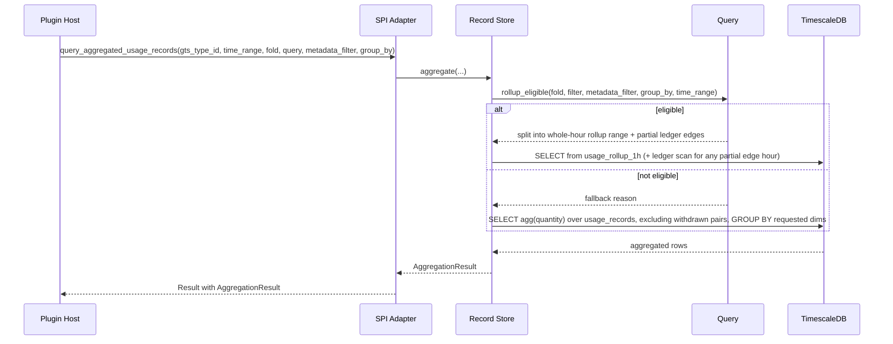
```mermaid
sequenceDiagram
    participant Host as Plugin Host
    participant Adapter as SPI Adapter
    participant Rec as Record Store
    participant Q as Query
    participant DB as TimescaleDB
    Host->>Adapter: query_aggregated_usage_records(gts_type_id, time_range, fold, query, metadata_filter, group_by)
    Adapter->>Rec: aggregate(...)
    Rec->>Q: rollup_eligible(fold, filter, metadata_filter, group_by, time_range)
    alt eligible
        Q-->>Rec: split into whole-hour rollup range + partial ledger edges
        Rec->>DB: SELECT from usage_rollup_1h (+ ledger scan for any partial edge hour)
    else not eligible
        Q-->>Rec: fallback reason
        Rec->>DB: SELECT agg(quantity) over usage_records, excluding withdrawn pairs, GROUP BY requested dims
    end
    DB-->>Rec: aggregated rows
    Rec-->>Adapter: AggregationResult
    Adapter-->>Host: Result with AggregationResult
```

**Description**: five conditions gate rollup eligibility, all required — the fold is `SUM` or `COUNT`; there is no metadata filter; `group_by` is empty or `tenant_id` alone; the composed filter (caller filter plus PDP scope) names only `tenant_id`; and the range covers at least one whole UTC hour. When eligible, whole UTC hours are read from `usage_rollup_1h` and the partial hours at either end from the ledger, in one statement (§3.7 `usage_rollup_1h`); `uc_timescaledb_aggregate_path_total{path,reason}` records which path served the query and, on a fallback, why. Every other query — `MIN`/`MAX`/`LATEST`, any metadata filter, any non-`tenant_id` grouping or filter field, or a sub-hour range — takes the exact ledger scan, which excludes a withdrawn entry and the invalidation that withdrew it from every fold (ADR-0010). The rollup path's result is numerically identical to the scan's, up to the rollup's refresh watermark (§3.6 `cpt-cf-uc-plugin-seq-rollup-refresh`), fully withdrawn groups included (§3.7 `usage_rollup_1h`). `LATEST` orders by `window_end DESC, accepted_at DESC, id DESC`, a total order across tenants. A metadata filter ORs one key's values and ANDs distinct keys onto the OData-derived `WHERE`. A `tenant_id` bucket key is rendered `Uuid::to_string()`; every other dimension verbatim. Grouping on `subject_id` or `subject_type` excludes entries without a subject, so no bucket carries a null key. A bucket whose selection is empty — including the single empty-key bucket of an ungrouped query over no entries — carries `value = null` for every fold, `COUNT` included, per the wire contract (`AggregationBucket.value`). A fold the plugin does not implement is `Internal`, never a substitute.

#### Keyset-paginated raw list

**ID**: `cpt-cf-uc-plugin-seq-list-keyset`

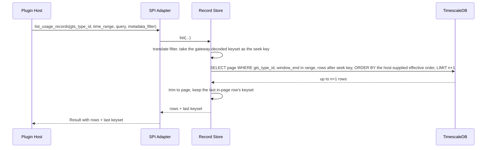
```mermaid
sequenceDiagram
    participant Host as Plugin Host
    participant Adapter as SPI Adapter
    participant Rec as Record Store
    participant DB as TimescaleDB
    Host->>Adapter: list_usage_records(gts_type_id, time_range, query, metadata_filter)
    Adapter->>Rec: list(...)
    Rec->>Rec: translate filter, take the gateway-decoded keyset as the seek key
    Rec->>DB: SELECT page WHERE gts_type_id, window_end in range, rows after seek key, ORDER BY the host-supplied effective order, LIMIT n+1
    DB-->>Rec: up to n+1 rows
    Rec->>Rec: trim to page, keep the last in-page row's keyset
    Rec-->>Adapter: rows + last keyset
    Adapter-->>Host: Result with rows + last keyset
```

**Description**: keyset (seek) pagination over the effective order the host supplies in `query`, selecting `from <= window_end < to` over the typed `time_range` (ADR-0014) within the typed `gts_type_id`. The gateway validates that order and appends `(window_end, id)` where a caller `$orderby` does not already name them, so absent `$orderby` the order is that pair and `$orderby=tenant_id` makes it `(tenant_id, window_end, id)`. Both the seek predicate and the `ORDER BY` read the order from `query` rather than assume a position for either key. Entries are returned as persisted — a withdrawn record and the invalidation that withdrew it both appear, because this is the ledger itself, not a derived view; the pair shares a `window_end` but not an `id`, so it is not guaranteed to land on one page. Fetching `limit + 1` (`effective_page_size`, floored to 1) detects whether a next page exists, and the last in-page row's keyset is returned for the gateway to mint the next cursor from (§2.2 Gateway-Owned Cursors). The seek predicate is a row-value comparison, sound only over `NOT NULL` columns, so an order key on a domain-optional field (`subject_id`/`subject_type`) reaching the plugin is a host-contract breach answered `Internal`. No offset is ever used.

#### Converged-only lookup

**ID**: `cpt-cf-uc-plugin-seq-converged-lookup`

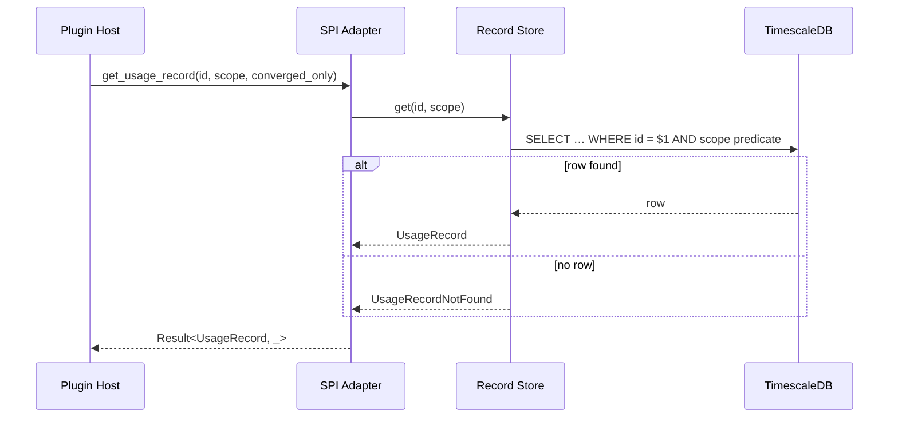
```mermaid
sequenceDiagram
    participant Host as Plugin Host
    participant Adapter as SPI Adapter
    participant Rec as Record Store
    participant DB as TimescaleDB
    Host->>Adapter: get_usage_record(id, scope, converged_only)
    Adapter->>Rec: get(id, scope)
    Rec->>DB: SELECT … WHERE id = $1 AND scope predicate
    alt row found
        DB-->>Rec: row
        Rec-->>Adapter: UsageRecord
    else no row
        Rec-->>Adapter: UsageRecordNotFound
    end
    Adapter-->>Host: Result<UsageRecord, _>
```

**Description**: `scope` is applied in the same predicate as `id`, so an out-of-scope entry answers exactly as an absent one. `WHERE id = $1` resolves at most one row because `id` is a `UUIDv5` of the 6-tuple dedup identity ([`0007-record-identity-derivation`](../../../docs/ADR/0007-cpt-cf-usage-collector-adr-record-identity-derivation.md)). `converged_only` changes nothing: on a single `linearizable` primary every visible entry has converged, the convergence bound and the query-path lag bound are both zero, and the answer is immediate. `UsageRecordNotConverged` is never returned. A deployment that routes this read to a replica is outside the supported posture and must republish both bounds first (§4.1 item 1).

#### Feed page

**ID**: `cpt-cf-uc-plugin-seq-feed-page`

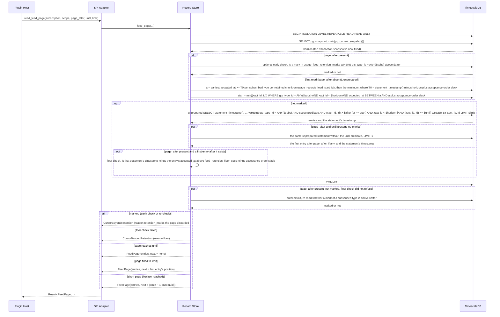
```mermaid
sequenceDiagram
    participant Host as Plugin Host
    participant Adapter as SPI Adapter
    participant Rec as Record Store
    participant DB as TimescaleDB
    Host->>Adapter: read_feed_page(subscription, scope, page_after, until, limit)
    Adapter->>Rec: feed_page(...)
    Rec->>DB: BEGIN ISOLATION LEVEL REPEATABLE READ READ ONLY
    Rec->>DB: SELECT pg_snapshot_xmin(pg_current_snapshot())
    DB-->>Rec: horizon (the transaction snapshot is now fixed)
    alt page_after present
        Rec->>DB: optional early check, is a mark in usage_feed_retention_marks WHERE gts_type_id = ANY($subs) above $after
        DB-->>Rec: marked or not
    else first read (page_after absent), unprepared
        Rec->>DB: a = earliest accepted_at >= T0 per subscribed type per retained chunk on usage_records_feed_start_idx, then the minimum, where T0 = statement_timestamp() minus horizon plus acceptance-order slack
        Rec->>DB: start = min((xact_id, id)) WHERE gts_type_id = ANY($subs) AND xact_id < $horizon AND accepted_at BETWEEN a AND a plus acceptance-order slack
    end
    opt not marked
        Rec->>DB: unprepared SELECT statement_timestamp(), … WHERE gts_type_id = ANY($subs) AND scope predicate AND (xact_id, id) > $after (or >= start) AND xact_id < $horizon [AND (xact_id, id) <= $until] ORDER BY xact_id, id LIMIT $limit
        DB-->>Rec: entries and the statement's timestamp
        opt page_after and until present, no entries
            Rec->>DB: the same unprepared statement without the until predicate, LIMIT 1
            DB-->>Rec: the first entry after page_after, if any, and the statement's timestamp
        end
        opt page_after present and a first entry after it exists
            Rec->>Rec: floor check, is that statement's timestamp minus the entry's accepted_at above feed_retention_floor_secs minus acceptance-order slack
        end
    end
    Rec->>DB: COMMIT
    opt page_after present, not marked, floor check did not refuse
        Rec->>DB: autocommit, re-read whether a mark of a subscribed type is above $after
        DB-->>Rec: marked or not
    end
    alt marked (early check or re-check)
        Rec-->>Adapter: CursorBeyondRetention (reason retention_mark), the page discarded
    else floor check failed
        Rec-->>Adapter: CursorBeyondRetention (reason floor)
    else page reaches until
        Rec-->>Adapter: FeedPage(entries, next = none)
    else page filled to limit
        Rec-->>Adapter: FeedPage(entries, next = last entry's position)
    else short page (horizon reached)
        Rec-->>Adapter: FeedPage(entries, next = {xmin − 1, max uuid})
    end
    Adapter-->>Host: Result<FeedPage, _>
```

**Description**: feed order is `(xact_id, id)` over the subscribed types, served from `usage_records_feed_idx` (§3.7). The page statement applies the compiled scope as a bound predicate, so an out-of-scope entry is absent. Write H for `feed_replay_horizon_secs`, F for `feed_retention_floor_secs`, S for the acceptance-order slack (Acceptance-order slack, below), and pos(e) for an entry's `(xact_id, id)`. A page runs as seven steps: (1) `BEGIN ISOLATION LEVEL REPEATABLE READ READ ONLY`; (2) `SELECT pg_snapshot_xmin(pg_current_snapshot())`, which fixes the transaction snapshot and returns the settled horizon `$horizon`; (3) with `page_after` present, an optional early mark check, a fast path only; (4) the page statement with `xact_id < $horizon` and the scope predicate, preceded on a first read by the start lookup below; (5) with `page_after` present, the floor check on the first entry after it; (6) `COMMIT`; (7) with `page_after` present, the authoritative mark re-check in autocommit, then return the page or the refusal. Steps (1) and (2) establish the horizon. The start lookup, the page statement and the floor check's `LIMIT 1` read are sent **unprepared**. **Why.** TimescaleDB excludes chunks at plan time against the catalog it then sees. Under `REPEATABLE READ`, `$horizon` is the xmin of the snapshot step (2) fixed, so every entry below it — and the chunk holding it — was committed before that snapshot. A statement planned after step (2) sees a catalog no older than the snapshot, so its plan includes every such chunk that has not been dropped (Retention refusal, Mark check). Reading the horizon in the scan statement itself, or reusing a generic plan cached on the pooled connection before a chunk existed, could plan against an older chunk set and silently skip that chunk's rows.

- **Completeness.** Every transaction whose id is below the horizon has finished, and the page statement's plan includes every chunk holding one of their entries that retention has not dropped (step 2 before step 4, above), so no entry can later become visible at or before a returned position, whatever the concurrency, commit order or number of gateway replicas. A dropped chunk is Retention refusal's concern. This holds for an unchanged compiled scope: entries a widened scope admits behind a returned position are not delivered.
- **Snapshot and replay.** Positions are immutable and entries are never mutated, so a scan observes only arrivals ahead of it, and a replay bounded by `until` returns the same entries in the same order.
- **Correction order.** The gateway accepts an invalidation only after its target has converged; the invalidation's transaction is therefore assigned its id after the target's committed, and `xact_id(invalidation) > xact_id(target)`.
- **Head position.** A page shorter than `limit` has read every settled, in-scope entry after `page_after`, or at or after the first-read start. Its next position is `{xmin − 1, max uuid}`, where `xmin` is `$horizon`. Every settled position is at or below `xmin − 1`, and a transaction at exactly `xmin` lands strictly after it. Nothing settled follows a head position, so it is current when issued and the page reads no age for it. Entries that settle after it are judged when the position is presented again (Retention refusal).
- **Precondition.** The write-time check (`cpt-cf-uc-plugin-seq-ingest-dedup`) bounds `accepted_at` against its INSERT's `statement_timestamp()`. That INSERT is its transaction's first write (type keys resolve in autocommit before `BEGIN`), and the id is assigned while it runs, which `statement_timeout_secs` bounds, so `statement_timestamp() ≤ assign ≤ statement_timestamp() + statement_timeout_secs` — assignment can lag, for example, across an `ON CONFLICT` wait on a concurrent inserter. Hence `assign(entry) − statement_timeout_secs − feed_acceptance_slack_secs ≤ accepted_at ≤ assign(entry) + feed_acceptance_slack_secs`.
- **First read.** `page_after` absent starts at the **oldest guaranteed position**, not at the oldest retained entry. The threshold is `T0 = t0 − H + S`, where t0 is `statement_timestamp()` of the start lookup's step (a). After step (2) and before the page statement, a **bounded start lookup** runs in two steps on `usage_records_feed_start_idx (gts_type_id, accepted_at) INCLUDE (xact_id, id)` (§3.7): (a) `a` = the earliest `accepted_at ≥ T0` among entries of the subscribed types visible to the snapshot; (b) `start` = the minimum pos among entries of the subscribed types with `xact_id < $horizon` and `a ≤ accepted_at ≤ a + S`, an index-only range scan. The page then reads `(xact_id, id) ≥ start`. If no entry has `accepted_at ≥ T0`, or the band holds no settled entry, no settled entry accepted at or after T0 exists and the first read starts at the settled head: it reads nothing and returns the head position. Entries accepted before T0 are reachable through the raw query path, not the feed. Taking `start` below `$horizon` keeps completeness: an unsettled entry has an id no smaller than `$horizon`, so it lands after `start`. **Why the band is enough.** By the ordering bound (Acceptance-order slack, below), if pos(e2) ≥ pos(e1) then `accepted_at(e2) ≥ accepted_at(e1) − S`, so an entry accepted after `accepted_at(e1) + S` sorts strictly after e1. Every settled entry is visible to the snapshot, so none is accepted in `[T0, a)`. Let e_a be an entry accepted at `a`. If e_a is settled, an entry accepted after `a + S` sorts after it and cannot be the minimum. If e_a is not settled, every entry sorting after it has an id no smaller than e_a's, so none of them is settled either, so no settled entry is accepted after `a + S`. Either way the minimum over settled entries accepted at or after T0 is the minimum over `[a, a + S]`. **Cost.** Neither step can exclude a chunk: the statements filter on `gts_type_id`, not the `type_key` partition dimension; `accepted_at` does not partition; and the plugin does not know the backfill window, so it adds no `window_end` predicate. Step (a) is one index probe per subscribed type per retained chunk; step (b) a per-chunk band scan of one slack's worth of the subscription's entries — about 750,000 at 10,000,000 entries/hour with the default S of 270 s; *unmeasured*, and §4.1 item 7's confirming test measures it. **Why this start.** Every entry at or after `start` sorts at or after the start entry, which was accepted at or after T0, so by the ordering bound it was accepted at or after `T0 − S = t0 − H`: the position just below `start` is no older than H at t0. A first read has no position, so it runs neither check of Retention refusal. It needs none in a conforming deployment: an entry retention deleted was accepted at least H + S before its drop (Retention refusal), so none sorts at or after `start`. **Continuation.** Every position a first read or its continuations issue is at or after `start` — a head position included, since `start` is below `$horizon` — so the first entry e1 after it was accepted at or after `t0 − H`. At a later page whose floor check reads e1 at instant t, `t − accepted_at(e1) ≤ (t − t0) + H`, so a continuation presented within `F − S − H` of the first read is never refused on the floor; the §3.5 config-load check keeps `F − S − H` positive. A first read that finds no start returns a head position, which Retention refusal judges like any other. The cost is that a new consumer's feed starts up to S short of the replay horizon; starting there rather than at the oldest retained entry is a plugin assumption, since the gear states no first-read start.
- **Retention refusal.** The gateway defines a position's age as the acceptance instant of the oldest entry after it, and a position with nothing after it is current (gear DESIGN §3.1 `FeedPosition`). A cursor no older than H is served; a cursor older than the retention floor is refused, and so is a cursor after which retention has already removed an entry; between the two ages service is plugin-dependent (ADR-0011 Three zones, `cpt-cf-usage-collector-fr-billing-retention-floor`). The age of a scoped cursor is read over the entries its scope admits. The plugin runs two checks and refuses `CursorBeyondRetention` on either, counted by `uc_timescaledb_feed_cursor_refusals_total` under `reason` (§4.3).
  - **Mark check, steps (3) and (7)** (`reason` = `retention_mark`). `usage_feed_retention_marks` (§3.7) holds, per GTS type, the highest position retention has deleted. The retention sweep raises a type's marks in the transaction that drops the chunk, and nothing can insert into the chunk between the sweep's read of its highest positions and the drop (`cpt-cf-uc-plugin-seq-retention-sweep`). A page refuses when any subscribed type's mark is greater than `page_after`. Step (3) reads the marks under the page's snapshot, which can miss a drop that commits after step (2), so it is only a fast path. Step (7) reads them again in autocommit after `COMMIT` and is authoritative: when it finds a mark above `page_after`, the page already read is discarded. **Argument.** A mark above `page_after` names a deleted entry after it, so the range after `page_after` may be incomplete, and refusing it is the gateway's rule. Conversely, suppose step (7) finds no mark above `page_after`. The page statement takes a lock on every chunk it plans and holds it until `COMMIT`, and a chunk drop needs `ACCESS EXCLUSIVE`, so no chunk the page read is dropped before `COMMIT`. A chunk the plan lacks because its drop committed before planning raised its marks in that same transaction, so step (7) sees them. A chunk excluded at plan time holds no row the page's predicate admits, so its drop removes nothing the page could read (at most a spurious mark refusal, shortfall 1). A chunk whose drop commits while the planner waits for its lock is either skipped, the case just covered, or raises an error surfaced as `Transient`, which serves no page. So every deleted entry of a subscribed type that the page could have read would have left a mark above `page_after`, and none did: the page is complete. A drop that commits between `COMMIT` and step (7) can refuse a complete page, but only a position after which retention has removed an entry. **Cost.** One extra small autocommit query per page, and a page refused at step (7) is read for nothing. **Positions within H.** In a conforming deployment (§4.1 item 6) an entry retention deletes was accepted at least H + S before its drop: its `window_end` is no earlier than `accepted_at` less the backfill window, and its chunk drops no earlier than that `window_end` plus the type's retention. A position with a deleted in-scope entry after it is therefore at least H + S old at the re-check, so a mark never refuses a position within H on account of the position's own scope.
  - **Floor check, step (5)** (`reason` = `floor`). Let e1 be the first entry after `page_after` that the page statement reads, and t the `statement_timestamp()` of the statement that read it. If `t − accepted_at(e1) > F − S`, the page refuses. **Argument.** e1 is the first settled, in-scope entry after `page_after`. A later settled entry sorts after e1, so by the ordering bound its `accepted_at ≥ accepted_at(e1) − S`. An entry after `page_after` that is not settled at step (2), written yet or not, has an id no smaller than `$horizon`, so it sorts after e1 too and the same bound holds. So the position's age at t lies in `[t − accepted_at(e1), t − accepted_at(e1) + S]`. A position older than F has `t − accepted_at(e1) > F − S` and is refused. A position no older than H has `t − accepted_at(e1) ≤ H`, which the §3.5 config-load check keeps below `F − S`, so it is never refused on the floor. A page bounded by `until` that returns no entries reads e1 with the same statement without the `until` predicate and `LIMIT 1`, because e1 can lie beyond `until`.
  - **Nothing after the position.** When no e1 exists, no settled, in-scope entry follows `page_after`. The position is served, the page returns the head position, and it is never refused on the floor. Only a mark above it can refuse it.
  - **Between H and F.** A served position older than H is never a silently truncated range: had retention deleted an entry after it, a mark would refuse it.
  - **Known shortfall 1, scope.** The mark is per type and ignores the compiled scope, so it can refuse a cursor whose own scope lost nothing, including one the gateway calls current because nothing in its scope follows it, and one no older than H. Only a cursor whose position precedes an entry retention has since deleted is affected. A consumer that keeps polling at the head is not, except under shortfall 2: its position is a recent head position, and a deleted entry was accepted at least H + S before its drop.
  - **Known shortfall 2, long transactions.** Both checks read settled entries only, and a transaction that holds an id keeps every entry with a larger id unsettled, whoever wrote it. While it stays open, those entries age unseen. A position a consumer polled at the head can then be refused, by a mark once retention deletes one of them, or on the floor once they settle. A position older than F whose later in-scope entries are all still unsettled is served an empty page. **That departs from the gateway MUST that a cursor older than the retention floor is refused.** Nothing is silently truncated, because a mark still refuses the position after any deletion. **Bound.** Let t be the instant a page fixed its snapshot: the page that issued or last served the position for the two refusals, the serving page itself for the empty page. Let t′ be the instant of the check that acts (step 7 for a mark, the floor check's statement for the floor, that page's statement for the empty page), and d = t′ − t. An unsettled entry e after the position has an id no smaller than the `$horizon` of the page at t. If no transaction held an id at t, e was assigned its id after t and, by the Precondition, accepted after `t − S`. Otherwise the transaction holding the `$horizon` id was running at t and was assigned its id no later than e, so no later than `accepted_at(e) + S` (Precondition). A mark refusal needs `accepted_at(e) ≤ t′ − H − S`, a floor refusal `accepted_at(e) < t′ − F + S`, and the empty page `accepted_at(e) < t′ − F`. So, with no transaction holding an id at t, the cases need d > H, d > F − 2S and d > F − S respectively. Otherwise they need that transaction to have been open at t for at least H − d, more than F − 2S − d, and more than F − S − d respectively. For the empty page, d is part of one page transaction, which `transaction_timeout_secs` bounds. The best-effort horizon-lag gauge (§4.3) surfaces such a transaction, and its alert fires at 240 s (§4.1 item 2).
- **Acceptance-order slack S = `2 × feed_acceptance_slack_secs + statement_timeout_secs`.** If pos(e2) ≥ pos(e1), e2's id is no smaller than e1's, so `assign(e2) ≥ assign(e1)`. By the Precondition above, `accepted_at(e1) ≤ assign(e1) + feed_acceptance_slack_secs` and `accepted_at(e2) ≥ assign(e2) − statement_timeout_secs − feed_acceptance_slack_secs`, so `accepted_at(e2) ≥ accepted_at(e1) − S`. This **ordering bound** is what First read and Retention refusal rest on. `feed_acceptance_slack_secs` is enforced at write time, not merely budgeted.
- **Scope.** The compiled PDP scope is translated like every other host filter (§2.2 Injection-Safe Query Translation) and ANDed onto the page statement, so an entry outside it is absent. It filters rows and never changes the order, the horizon, the start lookup or the marks, so the arguments above are unchanged: the floor check reads the first in-scope entry, which is how a scoped cursor is aged, and the marks ignoring scope is Retention refusal's shortfall 1. Completeness, snapshot and replay hold for an unchanged scope. Entries that a widened scope admits behind a returned position are not delivered (gear DESIGN §3.3 Cursor & Pagination).

#### Reconciliation

**ID**: `cpt-cf-uc-plugin-seq-reconciliation`

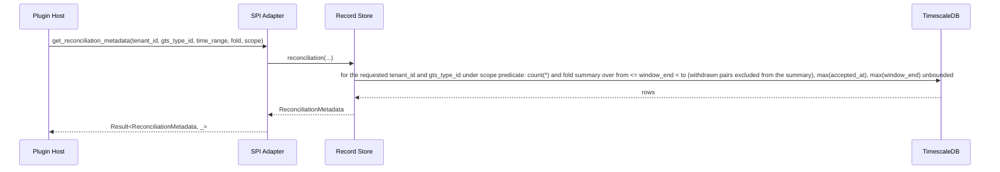
```mermaid
sequenceDiagram
    participant Host as Plugin Host
    participant Adapter as SPI Adapter
    participant Rec as Record Store
    participant DB as TimescaleDB
    Host->>Adapter: get_reconciliation_metadata(tenant_id, gts_type_id, time_range, fold, scope)
    Adapter->>Rec: reconciliation(...)
    Rec->>DB: for the requested tenant_id and gts_type_id under scope predicate: count(*) and fold summary over from <= window_end < to (withdrawn pairs excluded from the summary), max(accepted_at), max(window_end) unbounded
    DB-->>Rec: rows
    Rec-->>Adapter: ReconciliationMetadata
    Adapter-->>Host: Result<ReconciliationMetadata, _>
```

**Description**: `scope` (the compiled PDP scope) is applied as a predicate alongside `gts_type_id`, restricting whether the requested tenant's entries are visible at all. One row for the requested `(tenant_id, gts_type_id)` scope, with no paging: the gear serves one scope per call. A scope with entries of the type but none in range reports a zero `accepted_count` and an empty-selection summary (`accrued_sum` = 0, or `observation_count` = 0 with `latest_observation` absent), and its watermarks are unaffected, since both are unbounded by the range. A scope holding no entries at all reports both watermarks absent. The REST schema renders `latest_observation` and both watermarks as `null`. `accrued_sum` stays `0` rather than `null`, because an accrual over an empty set is defined while an observation over one is not. `accepted_count` counts every accepted entry in range — records and invalidations — because it reports ingestion activity. The summary follows the fold the host passes: `SUM` → `accrued_sum`, the same exact-scan fold as the aggregate path with withdrawn pairs excluded (never the rollup); any other fold → `observation_count` of non-withdrawn records and `latest_observation` by the `LATEST` total order. The watermarks read `max(accepted_at)` through `usage_records_watermark_idx` and `max(window_end)` through `usage_records_tenant_type_window_idx`, regardless of range. One entry per dedup identity holds trivially at the `linearizable` level. The signature and the treatment of withdrawn pairs are settled by the gear: the SPI declares the parameters this design takes, and `accepted_count` counts every accepted entry the range selects, invalidations included, while the summary excludes withdrawn pairs (§3.3 Signature).

#### Retention sweep

**ID**: `cpt-cf-uc-plugin-seq-retention-sweep`

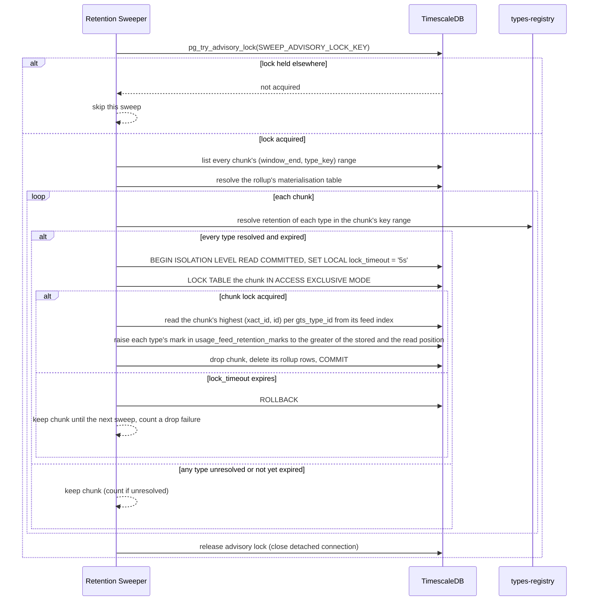
```mermaid
sequenceDiagram
    participant Sweeper as Retention Sweeper
    participant DB as TimescaleDB
    participant Registry as types-registry
    Sweeper->>DB: pg_try_advisory_lock(SWEEP_ADVISORY_LOCK_KEY)
    alt lock held elsewhere
        DB-->>Sweeper: not acquired
        Sweeper-->>Sweeper: skip this sweep
    else lock acquired
        Sweeper->>DB: list every chunk's (window_end, type_key) range
        Sweeper->>DB: resolve the rollup's materialisation table
        loop each chunk
            Sweeper->>Registry: resolve retention of each type in the chunk's key range
            alt every type resolved and expired
                Sweeper->>DB: BEGIN ISOLATION LEVEL READ COMMITTED, SET LOCAL lock_timeout = '5s'
                Sweeper->>DB: LOCK TABLE the chunk IN ACCESS EXCLUSIVE MODE
                alt chunk lock acquired
                    Sweeper->>DB: read the chunk's highest (xact_id, id) per gts_type_id from its feed index
                    Sweeper->>DB: raise each type's mark in usage_feed_retention_marks to the greater of the stored and the read position
                    Sweeper->>DB: drop chunk, delete its rollup rows, COMMIT
                else lock_timeout expires
                    Sweeper->>DB: ROLLBACK
                    Sweeper-->>Sweeper: keep chunk until the next sweep, count a drop failure
                end
            else any type unresolved or not yet expired
                Sweeper-->>Sweeper: keep chunk (count if unresolved)
            end
        end
        Sweeper->>DB: release advisory lock (close detached connection)
    end
```

**Description**: one advisory lock admits one sweeper at a time across replicas, held on a detached connection so it releases on close whatever the outcome. Each chunk is decided by the §2.2 Data Retention rule against every type in its `type_key` range, resolved from `types-registry` on every sweep — never cached, since retention is mutable; an unresolved type keeps the chunk and is counted. A drop takes the chunk's rollup rows in one transaction, and nothing drops when the materialisation table is missing (§2.2 Rollup/Ledger Coupling). The drop transaction runs at `READ COMMITTED` in six steps: (1) `SET LOCAL lock_timeout` to 5 s, a fixed design choice rather than configuration, which bounds every lock wait in the drop transaction, not only the chunk lock, so a sweep waiting for a busy chunk does not hold feed pages and other reads queued behind its lock request for long; (2) lock the chunk `IN ACCESS EXCLUSIVE MODE`; (3) read the highest `(xact_id, id)` of each GTS type in the chunk from the chunk's `usage_records_feed_idx`; (4) raise each type's mark in `usage_feed_retention_marks` (§3.7) to the greater of the stored and the read position; (5) drop the chunk and delete its rollup rows; (6) `COMMIT`. A transaction writing into the chunk holds a lock on it until it ends, so once step (2) returns, no such transaction is running and none can start. Step (3) takes its own snapshot after that, so it sees every row step (5) removes, and a mark commits exactly when the entries it covers are gone. If any lock wait times out, or the transaction is aborted as a deadlock victim, it rolls back, the chunk is kept until the next sweep, and the failure is counted under `uc_timescaledb_retention_drop_failures_total` (§4.3), which already means an expired chunk the next sweep retries. Why the feed page needs the mark is §3.6 `cpt-cf-uc-plugin-seq-feed-page`, Retention refusal.

#### Rollup refresh

**ID**: `cpt-cf-uc-plugin-seq-rollup-refresh`

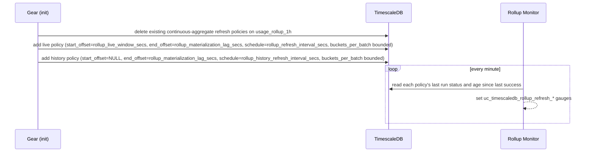
```mermaid
sequenceDiagram
    participant Gear as Gear (init)
    participant DB as TimescaleDB
    participant Monitor as Rollup Monitor
    Gear->>DB: delete existing continuous-aggregate refresh policies on usage_rollup_1h
    Gear->>DB: add live policy (start_offset=rollup_live_window_secs, end_offset=rollup_materialization_lag_secs, schedule=rollup_refresh_interval_secs, buckets_per_batch bounded)
    Gear->>DB: add history policy (start_offset=NULL, end_offset=rollup_materialization_lag_secs, schedule=rollup_history_refresh_interval_secs, buckets_per_batch bounded)
    loop every minute
        Monitor->>DB: read each policy's last run status and age since last success
        Monitor-->>Monitor: set uc_timescaledb_rollup_refresh_* gauges
    end
```

**Description**: two TimescaleDB continuous-aggregate refresh policies are (re-)applied idempotently at startup — a live policy refreshing the last `rollup_live_window_secs` every `rollup_refresh_interval_secs`, and a history policy refreshing everything older every `rollup_history_refresh_interval_secs`. Both leave a materialisation lag of `rollup_materialization_lag_secs`: buckets newer than the lag are never materialised, so the aggregate read path (§3.6 `cpt-cf-uc-plugin-seq-query-aggregated`) answers them by real-time aggregation directly over the ledger rather than waiting on a refresh. `RollupMonitor` samples each policy's last-run status and age-since-success once a minute and publishes them as gauges. Each run commits bucket-batch by bucket-batch, so no refresh holds the feed's settled horizon for longer than one batch (§4.1 item 2).

### 3.7 Database schemas & tables

- [ ] `p1` - **ID**: `cpt-cf-uc-plugin-db-schema`

This section is the **target** schema; the migrations on this branch predate it (§4.5).

#### Table: usage_records (hypertable)

**ID**: `cpt-cf-uc-plugin-dbtable-usage-records`

| Column | Type | Description |
| --- | --- | --- |
| id | uuid | Deterministic gateway-derived entry identity (`UUIDv5` of the 6-tuple dedup identity, ADR-0007); persisted verbatim. |
| tenant_id | uuid | Owning tenant. |
| gts_type_id | text | The meter this entry was submitted against; typed and resolved entirely by `types-registry` — no FK, no catalog row here. |
| type_key | int | Plugin-internal partitioning key of `gts_type_id` (`usage_type_key`); the hypertable's second partition dimension. |
| quantity | numeric | Signed quantity; `numeric` with no typmod, so the submitted digits and scale round-trip verbatim across the published range, negative half included; never sign-constrained. |
| window_start | timestamptz | Inclusive start of the covered period. |
| window_end | timestamptz | Exclusive end of the covered period; the hypertable's primary partition dimension and the sole column every read-path range predicate selects on (ADR-0014). |
| resource_id / resource_type | text / text | Resource attribution (mandatory). |
| subject_id / subject_type | text / text | Optional subject attribution. |
| idempotency_key | text | Caller-supplied dedup key; an invalidation carries its target's key. |
| invalidates | uuid | Set on a withdrawal to the `id` of the entry it withdraws, as the gateway supplies it on the dispatched entry. `NULL` on an ordinary measurement. |
| reason_code | text | Set exactly when `invalidates` is; why the withdrawal was issued. |
| origin | text | `live` or `backfill` — the ingestion path that admitted the entry. |
| entry_type | usage_entry_type | Enum `('record', 'invalidation')`, 4 bytes rather than a variable-length string, written from the dispatched entry's declared kind and never derived from another column. A dedup identity column in `usage_records_dedup_uniq`; `$filter=entry_type eq 'invalidation'` compares against it directly, the literal casting to the enum. |
| accepted_at | timestamptz | Gear-assigned acceptance instant, stamped by the Ingestion Gateway. |
| xact_id | xid8 | Id of the inserting transaction; default `pg_current_xact_id()`, never set by the Record Store. The feed order's first key (§3.6 `cpt-cf-uc-plugin-seq-feed-page`). |
| metadata | jsonb | Caller metadata, stored as **semantic JSON, not as the submitted bytes**. `jsonb` holds a parsed document: it drops insignificant whitespace, does not preserve object-key order, and keeps only the last of duplicate keys. Values, their types and the document structure round-trip; the byte sequence does not. The type is load-bearing — the metadata predicate compiles to `metadata ->> $key` (§2.2), which `json` cannot serve — and no surface promises the bytes: a read returns the declared metadata *values* (`cpt-cf-usage-collector-fr-record-metadata`), and the collision comparison is over parsed documents (`caller_supplied_eq`, §3.6 `cpt-cf-uc-plugin-seq-ingest-dedup`). |

**PK**: `(id, window_end, type_key)` (a hypertable's PRIMARY KEY must contain every partition column).

**Constraints**: hypertable on `window_end` and on `type_key`; `UNIQUE (tenant_id, gts_type_id, idempotency_key, window_start, window_end, entry_type, type_key)` (`usage_records_dedup_uniq`) is the **dedup authority**, reached via `INSERT … ON CONFLICT … DO NOTHING RETURNING` (§3.6) with the same seven columns as its conflict target — the gear's 6-tuple; `type_key` is carried only as a partition column (§2.2, `usage_type_key` below). `usage_records_window_ordered` (`window_start <= window_end`); `usage_records_invalidation_pairing` (`entry_type = 'invalidation'` exactly when `invalidates` and `reason_code` are both set; an ordinary measurement carries neither), which keeps the declared kind and the withdrawal fields from disagreeing in storage; `usage_records_subject_pairing` (`subject_type` requires `subject_id`).

**Additional info**: `usage_records_invalidates_idx (invalidates, window_end, type_key) WHERE invalidates IS NOT NULL` is a lookup index for the aggregate fold's withdrawal-exclusion rule, not a constraint (at most one invalidation per target follows from the dedup identity: §3.1). `usage_records_tenant_type_window_idx (tenant_id, gts_type_id, window_end DESC)` and `usage_records_tenant_window_idx (tenant_id, window_end DESC)` support time-windowed reads; `usage_records_feed_idx (gts_type_id, xact_id, id)` serves the feed order, with the scope predicate applied as a filter (§4.1 item 7), and gives the retention sweep each type's highest position in a chunk (§3.6 `cpt-cf-uc-plugin-seq-retention-sweep`); `usage_records_feed_start_idx (gts_type_id, accepted_at) INCLUDE (xact_id, id)` serves a first read's bounded start lookup, the band scan index-only (§3.6 `cpt-cf-uc-plugin-seq-feed-page`); `usage_records_watermark_idx (gts_type_id, tenant_id, accepted_at DESC)` serves the reconciliation acceptance watermark.

#### Table: usage_type_key

**ID**: `cpt-cf-uc-plugin-dbtable-usage-type-key`

| Column | Type | Description |
| --- | --- | --- |
| gts_type_id | text | The GTS type this key names. |
| type_key | int | Assigned once per `gts_type_id` (`GENERATED ALWAYS AS IDENTITY`); never changes once assigned. |

**PK**: `gts_type_id`

**Constraints**: `type_key` is `UNIQUE`.

**Why this table exists.** One row per GTS type this plugin has written, mapping the type to the small integer `usage_records.type_key` and `usage_rollup_1h.type_key` carry — the hypertable's second partitioning dimension, needed because `by_range` refuses a text column. A key is assigned by the first write of its type (`TypeKeyCache`, §3.2 Record Store) and never changes thereafter, which is what lets it sit inside the ledger's unique constraints. It stores no declared attribute and is not a type catalog; nothing outside the ledger's own uniqueness constraints references it.

#### Table: usage_feed_retention_marks

**ID**: `cpt-cf-uc-plugin-dbtable-usage-feed-retention-marks`

| Column | Type | Description |
| --- | --- | --- |
| gts_type_id | text | The GTS type whose deleted entries this mark covers. |
| xact_id | xid8 | With `id`, the highest feed position among the entries of this type that retention has deleted. |
| id | uuid | Tie-breaker within `xact_id`, as in feed order. |

**PK**: `gts_type_id`

**Constraints**: `xact_id` and `id` are `NOT NULL`.

**Why this table exists.** A feed page refuses a position after which retention has deleted an entry of a subscribed type (§3.6 `cpt-cf-uc-plugin-seq-feed-page`, Retention refusal). One row per GTS type that has lost an entry to retention. The retention sweep raises a row, never lowers it, in the transaction that drops the chunk (§3.6 `cpt-cf-uc-plugin-seq-retention-sweep`).

#### Table: usage_rollup_1h

**ID**: `cpt-cf-uc-plugin-dbtable-usage-rollup-1h`

An hourly TimescaleDB continuous aggregate over `usage_records`, materialised real-time (`timescaledb.materialized_only = false`).

| Column | Type | Description |
| --- | --- | --- |
| bucket | timestamptz | `time_bucket(INTERVAL '1 hour', window_end)`. |
| tenant_id | uuid | Grain leaf. |
| gts_type_id | text | Grain leaf. |
| type_key | int | Grain leaf; adds no rows (a function of `gts_type_id`) but lets reads and the retention sweep's rollup cut prune by type. |
| sum_value | numeric | Signed sum: `+quantity` for a record, `-quantity` for its invalidation. |
| count_value | bigint | Signed count: `+1` for a record, `-1` for its invalidation. |

**Keyed on**: `(bucket, tenant_id, gts_type_id, type_key)`.

**Constraints**: none of its own — it is a materialised `GROUP BY` over `usage_records`, not a base table.

**Why the signed netting is exact.** An invalidation copies its target's `window_end`, `tenant_id` and type, so both land in one grain row; a record carries at most one invalidation, because every invalidation of it shares one dedup identity (§3.1); and the pair shares a chunk, so retention drops it together (§2.2 Rollup/Ledger Coupling). A filter on `origin`, `entry_type` or `invalidates` can select one entry of a pair and not the other — which is why such a query takes the exact scan instead (§3.6 `cpt-cf-uc-plugin-seq-query-aggregated`). A grain row whose net `count_value` is 0 holds only withdrawn pairs in a conforming deployment (§4.1 item 4), and the rollup-backed statement drops it: a group whose entries are all withdrawn pairs therefore yields no bucket when grouped, and `null` in the single empty-key bucket when ungrouped, exactly as the exact scan does, so both paths stay numerically identical.

**Refresh policies**: applied from configuration at startup by `cpt-cf-uc-plugin-component-migrations` (§3.6 `cpt-cf-uc-plugin-seq-rollup-refresh`), not by the migration.

## 4. Additional context

### 4.1 Consistency Profile

Gear [`DESIGN.md`](../../../docs/DESIGN.md) §3.10 Consistency Contract obliges every plugin's deployment guide to publish nine things about its actual consistency profile, on top of the gear's floor-and-ceiling contract. This subsection is that guide, and is what `cpt-cf-uc-plugin-nfr-consistency-profile` points at. Every item is stated as design. Statements carry one of three labels where a number appears: **target** (a gate value from the gear), **derived** (implied by the configuration in §3.5), or **measured**. No latency, freshness or throughput figure in this subsection is measured: no load test exists in this repository, and each item names the test that would produce one. **The supported posture** is a single Postgres primary serving every ingestion, query, feed and reconciliation call; a deployment outside it republishes items 1, 2, 5 and 7 before serving traffic.

#### 1. Pools and query-path lag

One `sqlx` connection pool (§3.5, `pool_size_min`/`pool_size_max`) serves every ingestion, query, feed and reconciliation call; the paths are **not** isolated onto separate pools, so `cpt-cf-usage-collector-nfr-workload-isolation` is not realised by this backend — a query-path burst can starve an ingestion call for a pool connection, and vice versa. The gear allocates isolated backend pools to the plugin deployment, so this is a known shortfall against that NFR, published here. **Query-path lag bound: zero.** On the supported single primary every ledger read path — raw list, point lookup, reconciliation — sees a committed entry as soon as its transaction commits; the feed's lag is item 2's horizon bound, not this zero bound. Item 4 publishes the separate, weaker bound for the materialised aggregate. Read replicas are outside the supported posture. The retention sweep holds one extra detached connection for its advisory lock while it runs, so operators MUST budget Postgres `max_connections` for `pool_size_max + 1` per replica, not `pool_size_max` alone.

#### 2. Acceptance → feed visibility, p95

The feed serves an entry once its transaction id falls below the settled horizon `pg_snapshot_xmin(pg_current_snapshot())`, read inside each page's own `REPEATABLE READ READ ONLY` transaction before the page statement — sent unprepared — is planned (§3.6 `cpt-cf-uc-plugin-seq-feed-page`). Transaction ids and the snapshot `xmin` span the whole PostgreSQL instance, so acceptance → feed visibility is bounded by **the longest-running write transaction in the PostgreSQL instance**, not by a refresh schedule:

| Source of a write transaction | Bound on its duration |
| --- | --- |
| Request-path ingest | `transaction_timeout_secs` (default 60) |
| Retention drop | `transaction_timeout_secs` |
| Rollup refresh | One `buckets_per_batch` batch of one refresh run — **not bounded by configuration** (`buckets_per_batch` counts buckets, not seconds); runtime unmeasured (§3.5, §3.6 `cpt-cf-uc-plugin-seq-rollup-refresh`) |
| Anything else in the PostgreSQL instance | **Not bounded by the plugin** — see the deployment rule below |

**Derived bound, conditional**: p95 ≤ max(`transaction_timeout_secs`, the refresh-batch runtime), well inside the **target** of p95 ≤ 5 minutes (`cpt-cf-usage-collector-nfr-billing-feed-freshness`, `cpt-cf-uc-plugin-nfr-feed-freshness`) **only if** that maximum stays well under 300 s — the refresh-batch runtime is unmeasured, so this is a condition, not a guarantee. **Deployment rule**: the PostgreSQL instance hosts no long-running write transaction outside the plugin's own, because the horizon is cluster-wide. `uc_timescaledb_feed_horizon_lag_seconds` (§4.3), sampled by the Gear component's background loop (§3.2), exposes a violation on a best-effort basis: it sees only the sessions the plugin role can see. **Alert threshold: 240 s, 80% of the 5-minute target, so an alert fires before the target is breached.** The measurement that would confirm the bound is a load test driving the throughput-profile envelope while a consumer polls the feed and records acceptance-to-delivery lag. The release-readiness review of `cpt-cf-usage-collector-nfr-billing-feed-freshness` must see that measurement before this deployment feeds a charging consumer.

#### 3. Feed order

**Positions.** Feed order is `(xact_id, id)` over the subscribed types, filtered by the compiled scope (§3.1, §3.7): the inserting transaction's `xid8`, stamped by the column default, then `id`, which breaks ties inside one transaction. **Settled pages.** Each page reads the settled horizon inside its own `REPEATABLE READ READ ONLY` transaction and then runs an unprepared page statement below it, so every transaction that could still add an entry at or before a returned position has finished, whatever the number of writers or gateway replicas and whatever their commit order (§3.6 `cpt-cf-uc-plugin-seq-feed-page`, Completeness). A short page returns a head position, which is current: nothing settled follows it (§3.6 Head position). **Not `accepted_at`.** Replica clock skew can stamp an invalidation earlier than its target; transaction ids cannot misorder them (§3.6 Correction order).

#### 4. Acceptance → aggregate visibility, and invalidation propagation

*Derived bounds, not measurements.* `usage_rollup_1h`'s two refresh policies (§3.5, §3.6 `cpt-cf-uc-plugin-seq-rollup-refresh`) bound how soon an accepted entry, and separately an accepted invalidation, reaches the materialised aggregate.

| Entry's `window_end` | Acceptance → aggregate visibility | Invalidation propagation |
| --- | --- | --- |
| Within `rollup_materialization_lag_secs` of now | Immediate | Immediate |
| Older, within `rollup_live_window_secs` | ≤ `rollup_refresh_interval_secs` + refresh runtime | Same |
| Older than `rollup_live_window_secs` | ≤ `rollup_history_refresh_interval_secs` + refresh runtime | Same |
| Any query that takes the exact scan | Immediate | Immediate |

With the defaults (§3.5), a late live write or a recent withdrawal appears within 2 minutes plus refresh runtime, and a backfilled period within 1 hour plus refresh runtime.

**Deployment rule for acting consumers.** `cpt-cf-usage-collector-nfr-aggregate-freshness` requires ≤ 5 minutes p95 where a consumer acts on the aggregate. The defaults meet it for `window_end` within `rollup_live_window_secs` (≤ 120 s + refresh runtime) but not beyond (≤ 3600 s + refresh runtime). A deployment serving such a consumer over older periods MUST set `rollup_history_refresh_interval_secs` ≤ 300 — necessary, not sufficient, since refresh runtime adds to it. The confirming measurement is a load test driving the throughput-profile envelope (`cpt-cf-usage-collector-nfr-throughput-profile`) with a consumer polling the aggregate path and recording acceptance-to-aggregate and invalidation-to-aggregate lag.

**Imprecisions.** The signed netting is exact (§3.7 `usage_rollup_1h`), with two documented imprecisions that are not defects: (1) a retention sweep that drops an expired target's chunk while an invalidation of that target is still being written can leave an **orphan invalidation** behind — the rollup nets it as `-value`/`-1`, a low or negative `SUM`/`COUNT` until the next sweep drops the invalidation's own chunk in turn. It requires the type's retention below the item 6 readiness rule, so it cannot occur in a conforming deployment; (2) the rollup and the exact-scan path can render the same numeric value at a **different decimal scale** where a withdrawn pair of wider scale shares a bucket with a genuine measurement — `1.500 − 1.500 + 2` renders `2.000` on the rollup path and `2` on the scan. The gear's digit-for-digit guarantee binds entries (`cpt-cf-uc-plugin-fr-quantity-fidelity`), not aggregates, so (2) is not a fidelity defect.

#### 5. Monotonic reads

*Single-node topology.* Monotonic reads per `(tenant_id, gts_type_id)` hold on this deployment because every read and write lands on the same single Postgres node through the one pool (item 1). **Read replicas are what breaks this**: pointing any read path at a replica reintroduces replica lag and the guarantee no longer holds. Nothing in this plugin detects or compensates for that; it is a topology choice the operator makes.

#### 6. Retention per GTS type

Each type's **current** declared `retention` trait, read from `types-registry` and measured from the covered period's `window_end`, is what the retention sweep enforces (§2.2 Data Retention, §3.6 `cpt-cf-uc-plugin-seq-retention-sweep`) — never a table-wide TimescaleDB policy. **The retention floor is the deployer's obligation, not the plugin's.** The plugin does not check a type's declared retention against the rule below.

**Feed readiness.** The gear sets a minimum retention of the backfill window plus one replay horizon (`cpt-cf-usage-collector-fr-billing-retention-floor`). This design extends that gear minimum for the feed with a single rule, which binds every GTS type, whatever consumes it, as the gear floor does: every GTS type MUST declare retention ≥ backfill window + `feed_replay_horizon_secs` + 2 × `feed_acceptance_slack_secs` + `statement_timeout_secs` (§3.6 `cpt-cf-uc-plugin-seq-feed-page`). The rule keeps every entry retention deletes at least `feed_replay_horizon_secs` + the acceptance-order slack past its acceptance, so the feed's retention mark never refuses a position within the horizon on account of its own scope, nor a consumer that keeps polling at the head outside the long-transaction case (§3.6 Retention refusal, shortfall 2). The plugin reads the horizon and the retention floor (`feed_retention_floor_secs`) from configuration because the SPI carries neither, and refuses a position older than that floor, or after which retention has deleted an entry of a subscribed type. **Known shortfall**: the retention mark is kept per GTS type and ignores the compiled scope, so it can refuse a cursor whose own scope lost nothing (§3.6 Retention refusal, shortfall 1; §4.5). This rule, and a first read starting the acceptance-order slack inside the horizon (§3.6 First read), are plugin assumptions.

#### 7. Sustained bulk read rate

The feed reads `usage_records_feed_idx (gts_type_id, xact_id, id)` (§3.7) as an index-ordered merge across the chunks retention keeps. The scope predicate is applied as a filter on the index-ordered merge. A consumer whose scope admits a small share of a subscription reads the whole subscription's index range to fill a page, and the confirming test measures a narrow scope as well as a full one. **Target**: `cpt-cf-usage-collector-nfr-replay-throughput` requires a consumer 24 hours behind to catch up within 6 hours — at the launch planning assumption of ≤ 10,000,000 entries/hour/region for a charging subscription, ≥ 50,000,000 entries/hour/region. **Not measured**: the test that would produce the number replays a 24-hour backlog of a subscription at that arrival rate while ingestion runs at the throughput-profile envelope, and also times a first read's bounded start lookup (§3.6) over that subscription. **Outside the documented posture** — a subscription arriving faster than the planning assumption, a replica read path, or a shared PostgreSQL instance — the deployer republishes items 1, 2, 5 and 7 against a measurement before the deployment feeds a charging consumer.

#### 8. Ingestion batching

*The answer is negative, and nothing here is measured.* The plugin does **not** coalesce concurrent `create_usage_record`/`create_usage_records` calls from separate callers into one backend write. Batching is entirely caller-driven: one multi-row `INSERT … SELECT FROM UNNEST(…) ON CONFLICT … DO NOTHING` per `create_batch` call (§3.6 `cpt-cf-uc-plugin-seq-ingest-batch`), sized by whatever the caller passed in. A target batch size and a longest coalescing wait are therefore **not applicable** to this backend. **Planning shares (gear DESIGN §3.11.2, not a gate)**: persist p95 ≤ 75ms and aggregated-query p95 ≤ 425ms. **Not measured**: a load test driving concurrent `create_usage_record`/`create_usage_records` and `query_aggregated_usage_records` traffic against a sized deployment is what would produce them.

#### 9. Dedup level

`linearizable`. The **convergence bound is zero**: a single Postgres primary decides every write as it commits, so there is no interval during which a write is acknowledged but not yet decided. Races under one dedup identity resolve in Postgres **commit order** through `ON CONFLICT … DO NOTHING` (§2.2 Dedup-Key Identity & Retention-Bounded Preservation, §3.6 `cpt-cf-uc-plugin-seq-ingest-dedup`): the first write to commit is the survivor, and convergence is established at that transaction's own commit — never from elapsed time. `uc_timescaledb_dedup_late_convergence_total` counts a write discarded after its identity converged and stays at **zero** under this level, since nothing here is decided after convergence. No divergent-discard metric is needed or published: that obligation applies to `eventual` only, and this plugin is `linearizable`. **Late-committing writes.** A transaction that exceeds `transaction_timeout_secs` is aborted by Postgres, so nothing commits late. If the host abandons a call after `COMMIT` was sent, the entry persists as the survivor: its identity converged at that commit, so no decision is taken after convergence, and the caller's retry is absorbed when identical and `IdempotencyConflict` when divergent. An insert that reaches the store after another write converged the identity is discarded by `ON CONFLICT … DO NOTHING`. `UsageRecordNotConverged` is never returned (§3.6 `cpt-cf-uc-plugin-seq-converged-lookup`).

### 4.2 Published Limits

This subsection publishes the memory bound on the `LATEST` aggregation fold (§3.1 AggregationSpec/AggregationResult, §3.6 `cpt-cf-uc-plugin-seq-query-aggregated`). It is an analysis, not a measurement: no figure here is measured.

> The `LATEST` fold is `(ARRAY_AGG(r.quantity ORDER BY r.window_end DESC, r.accepted_at DESC, r.id DESC))[1]::numeric`, which materialises a group's values before picking one. Peak memory is therefore **O(largest group)**: it grows with the number of rows in the largest group, not with the number of groups. `aggregate_limit_clause` bounds the number of *groups* (`LIMIT MAX_AGGREGATION_BUCKETS + 1`) and never the rows within one. The only bound on rows in a group is the covered-period window, **which is a request parameter**. `MIN`/`MAX`/`SUM`/`COUNT` carry no such cost.

**Why the alternatives stay out.** `DISTINCT ON` and `ROW_NUMBER() OVER (PARTITION BY …) = 1` need not materialise a whole group, but neither composes as a `SELECT`-list expression beside `SUM`, `COUNT`, `MIN` or `MAX` in one `GROUP BY` statement, and neither can express the **ungrouped** fold, where the SPI owes exactly one empty-keyed bucket over an empty selection: with no group and no `GROUP BY` key, both constructs have nothing to partition or distinguish `ON`.

### 4.3 Metric Inventory

- [ ] `p3` - **ID**: `cpt-cf-uc-plugin-design-metric-inventory`

The plugin emits OpenTelemetry push metrics under the `uc_timescaledb_` sub-namespace, exported via OTLP. Per gear [`DESIGN.md`](../../../docs/DESIGN.md) §3.11.5 the gear owns the request-path `uc_*` signals and an active plugin owns its backend-internal series under its own sub-namespace; this section owns the `uc_timescaledb_*` series, none of which the gear names or obliges. Instrument names are the **full literal** Prometheus names (snake_case, `_total` on counters, `_seconds` on duration histograms) with **no** `with_unit(...)` hint, so the rendered name is the same whether the collector's `add_metric_suffixes` is on or off. Histogram bucket layouts bracket the NFR p95 budgets in §1.2 and are part of the contract. Instruments are grouped by the architecture-driver vector they serve, realizing `cpt-cf-usage-collector-nfr-operational-visibility`.

#### Performance Metrics

| Metric | Type | Labels | Target |
| --- | --- | --- | --- |
| `uc_timescaledb_insert_duration_seconds` | Histogram | `mode` (`single`, `batch`) | brackets the bulk-ingestion envelope (`cpt-cf-usage-collector-nfr-throughput`); `mode="batch"`: † |
| `uc_timescaledb_query_duration_seconds` | Histogram | `query_kind` (`aggregated`, `raw`) | aggregated p95 ≤ 500ms over a 30-day single-tenant range (`cpt-cf-usage-collector-nfr-query-latency`); `query_kind="raw"`: † |
| `uc_timescaledb_pool_acquire_duration_seconds` | Histogram | — | bounded by `connection_timeout_secs` (10s, §3.5) |
| `uc_timescaledb_feed_page_duration_seconds` | Histogram | — | † |
| `uc_timescaledb_reconciliation_duration_seconds` | Histogram | — | — |

> † Reserve ≥ 25ms of the end-to-end envelope for gateway, PDP and core overhead (gear DESIGN §3.11.2).

#### Efficiency Metrics

| Metric | Type | Labels | Target |
| --- | --- | --- | --- |
| `uc_timescaledb_pool_connections_active` | Gauge (observable) | — | ≤ `pool_size_max` (16, §3.5) |
| `uc_timescaledb_pool_connections_idle` | Gauge (observable) | — | — |
| `uc_timescaledb_dedup_absorbed_total` | Counter | — | — |
| `uc_timescaledb_dedup_stale_total` | Counter | — | — |
| `uc_timescaledb_batch_rows` | Histogram | — | — |
| `uc_timescaledb_query_requests_total` | Counter | `query_kind` (`aggregated`, `raw`) | — |

> `uc_timescaledb_pool_connections_active`/`_idle` are read from the pool handle on each collection cycle (callback-based, no DB I/O). `uc_timescaledb_dedup_absorbed_total` increments on exact-equality retries silently absorbed on the 6-tuple `ON CONFLICT` path (§3.6 ingest-dedup); `uc_timescaledb_dedup_stale_total` counts the retention-race `Transient` of §3.6 `cpt-cf-uc-plugin-seq-ingest-dedup`. `uc_timescaledb_batch_rows` records the row count per `create_usage_records` write so write amortization is observable, and its *sum* is the bulk-ingestion throughput SLI below — records per second, the unit `cpt-cf-usage-collector-nfr-throughput` is stated in. The insert histogram's `_count` must not be read as throughput: it observes once per write call, so a one-row write and a ten-thousand-row write are one observation each, and its rate tracks call frequency rather than records — it moves when batch size changes at constant throughput. Read the two together: rows falling while calls hold steady is a shrinking batch, calls falling while rows hold steady is a coarser one, and both falling is a real throughput loss; `uc_timescaledb_query_requests_total` exposes the aggregated-vs-raw workload mix.

#### Reliability Metrics

| Metric | Type | Labels | Target |
| --- | --- | --- | --- |
| `uc_timescaledb_backend_errors_total` | Counter | `error_category` (`transient`, `internal`) | — |
| `uc_timescaledb_batch_retries_total` | Counter | — | — |
| `uc_timescaledb_idempotency_conflicts_total` | Counter | — | — |
| `uc_timescaledb_invalidations_total` | Counter | — | — |
| `uc_timescaledb_dedup_late_convergence_total` | Counter | — | 0 (§4.1 item 9) |
| `uc_timescaledb_migration_failures_total` | Counter | — | 0 |
| `uc_timescaledb_ready` | Gauge | — | 1 |
| `uc_timescaledb_feed_horizon_lag_seconds` | Gauge | — | ≤ 240 (§4.1 item 2) |
| `uc_timescaledb_feed_cursor_refusals_total` | Counter | `reason` (`retention_mark`, `floor`) | — |
| `uc_timescaledb_stale_acceptance_rejections_total` | Counter | — | — |

> `uc_timescaledb_backend_errors_total` is keyed by the SPI's `Transient`/`Internal` classification via the `error_category` label (§2.1 SPI Conformance); `uc_timescaledb_batch_retries_total` increments once per bounded in-process `create_batch` retry after a transient backend error (deadlock-victim self-heal, §3.6), so a retried-and-recovered write is distinguishable from a `Transient` bubbled to the host; `uc_timescaledb_idempotency_conflicts_total` counts canonical-field-mismatch `IdempotencyConflict` results; `uc_timescaledb_invalidations_total` counts accepted withdrawal entries (§3.1 Invalidation). `uc_timescaledb_dedup_late_convergence_total` is recorded once at zero at startup so the series exports even though it never fires under this plugin's `linearizable` level (§4.1 item 9).
>
> `uc_timescaledb_ready` is a plugin-local backend-health gauge — set to 1 after a successful pool build + migration, cleared when the backend is unreachable (a connection cannot be established) and re-armed on the next successful acquire. A pool-acquire timeout while the pool stands at `pool_size_max` is saturation rather than unreachability and leaves the gauge set: it surfaces as `Transient` with a retry hint, and the pool gauges plus the saturation alert below are what make it visible. Clearing readiness for it would flap the gauge under load and fire the readiness alert for a backend that is healthy but busy. It is **distinct** from the host-computed structural `uc_plugin_ready` gauge in the gear (§3.11.5) and is **not** a background probe.
>
> `uc_timescaledb_feed_horizon_lag_seconds` is `now()` minus the earliest `xact_start` among backends in `pg_stat_activity` whose `backend_xid` is not null, as visible to the plugin role — the lag between acceptance and feed visibility the settled horizon imposes (§4.1 item 2) — sampled by the Gear component's background loop (§3.2). It is **best-effort**: it is left unset when the plugin role cannot see other roles' sessions, it misses a prepared transaction, which has no backend, and no startup check backs it. `uc_timescaledb_feed_cursor_refusals_total` counts `CursorBeyondRetention` refusals by `reason` (§3.6 `cpt-cf-uc-plugin-seq-feed-page`, Retention refusal): `floor` when the first entry after the position is past the floor check, where a sustained rate means a consumer is falling behind the retention floor, and `retention_mark` when a retention mark is above the position, where a refusal of a consumer within the replay horizon is a known shortfall (§4.5). `uc_timescaledb_stale_acceptance_rejections_total` counts the write-time slack check's `Transient` rejections (§3.6 `cpt-cf-uc-plugin-seq-ingest-dedup`, `-ingest-batch`); a sustained rate means gateway clock skew, dispatch delay or retry churn exceeds the configured `feed_acceptance_slack_secs`.

#### Security Metrics

| Metric | Type | Labels | Target |
| --- | --- | --- | --- |
| `uc_timescaledb_tls_handshake_failures_total` | Counter | — | 0 |

> The plugin performs no authentication or authorization (§2.1, §4.4), and injection safety (§2.2) is a construction-time invariant with no runtime signal, so the TLS-by-default DSN (§3.5) is the only metered security surface.

#### Retention & Rollup Metrics

| Metric | Type | Labels | Target |
| --- | --- | --- | --- |
| `uc_timescaledb_retention_sweeps_total` | Counter | `outcome` (`completed`, `skipped_locked`, `failed`) | — |
| `uc_timescaledb_retention_sweep_duration_seconds` | Histogram | — | — |
| `uc_timescaledb_retention_chunks_dropped_total` | Counter | — | — |
| `uc_timescaledb_retention_chunks_kept_unresolved_total` | Counter | `reason` | signal to act on (§2.2 Data Retention) |
| `uc_timescaledb_retention_drop_failures_total` | Counter | — | retried next sweep |
| `uc_timescaledb_chunks` | Gauge | — | keep below 10 000 |
| `uc_timescaledb_aggregate_path_total` | Counter | `path` (`rollup`, `scan`), `reason` | shows the rollup-vs-scan split (§3.6 `cpt-cf-uc-plugin-seq-query-aggregated`) |
| `uc_timescaledb_rollup_rows_deleted_total` | Counter | — | — |
| `uc_timescaledb_rollup_refresh_age_seconds` | Gauge | `policy` | unset until the policy's first success |
| `uc_timescaledb_rollup_refresh_job_failing` | Gauge | `policy` | 0 |
| `uc_timescaledb_rollup_refresh_policies` | Gauge | — | 2 (alert below 2) |

> `uc_timescaledb_retention_sweeps_total` and `_retention_sweep_duration_seconds` are recorded once per sweep attempt, whatever its outcome (§3.6 `cpt-cf-uc-plugin-seq-retention-sweep`); `uc_timescaledb_retention_chunks_dropped_total` counts chunks dropped because every type in them had passed its declared retention, and `_retention_chunks_kept_unresolved_total` counts chunks kept because a type in them had no resolvable retention, by `reason` (§2.2 Data Retention). `uc_timescaledb_retention_drop_failures_total` counts an expired chunk whose drop failed, a lock timeout or deadlock abort included; the next sweep retries it. A sustained drop-failure rate signals lock contention on the ledger and is worth an alert. `uc_timescaledb_chunks` is set by whichever replica's sweep last held the retention lock — read the most recent value, not a max across replicas. `uc_timescaledb_aggregate_path_total` and `_rollup_rows_deleted_total` are recorded by the query and retention paths respectively (§3.6 `cpt-cf-uc-plugin-seq-query-aggregated`, `-retention-sweep`). The three rollup-refresh gauges above are sampled once a minute by `RollupMonitor` (§3.2 Rollup, §3.6 `cpt-cf-uc-plugin-seq-rollup-refresh`); an absent age means the policy has never succeeded — for example, with TimescaleDB background workers disabled.

#### SLO Summary

| SLO Target | SLI Metric | Alert Threshold |
| --- | --- | --- |
| Aggregated query p95 ≤ 500ms | `uc_timescaledb_query_duration_seconds{query_kind="aggregated"}` p95 | > 500ms over 15m |
| Bulk-ingestion throughput | rate of `uc_timescaledb_batch_rows` sum — records written per second | sustained drop ≥ 50% from trailing 1h baseline |
| Backend readiness | `uc_timescaledb_ready` | 0 for > 1m |
| Connection-pool saturation | `uc_timescaledb_pool_connections_active` vs `pool_size_max` | == max for > 5m with rising `uc_timescaledb_pool_acquire_duration_seconds` p95 |
| Backend error rate | rate of `uc_timescaledb_backend_errors_total` | error ratio > 1% over 5m |
| Rollup refresh health | `uc_timescaledb_rollup_refresh_policies`, `_rollup_refresh_age_seconds{policy}`, `_rollup_refresh_job_failing{policy}` | policies < 2; age series absent for > 2× its interval; live age > 2× `rollup_refresh_interval_secs`; or either failing gauge is 1 |
| Retention progress | `uc_timescaledb_retention_chunks_kept_unresolved_total{reason}` | sustained growth past the post-restart startup burst (§2.2 Data Retention) |
| Feed freshness p95 ≤ 5 min | `uc_timescaledb_feed_horizon_lag_seconds` | > 240s for 5m |

#### Label cardinality

All labels are bounded to the enumerated value sets above. Unbounded identifiers — `tenant_id`, `gts_type_id`, `id`, `idempotency_key`, `invalidates`, `request_id`, `trace_id` — MUST NOT be used as metric labels; they belong in structured logs and distributed traces, not in metric dimensions.

**Distributed tracing**: each SPI dispatch runs inside the ambient tracing span opened by the host; the plugin opens no root span and records its SQL work under that span, so backend latency is attributable end-to-end through the host's `trace_id`.

### 4.4 Non-Applicable Design Domains

- **Security Architecture**: Not applicable as a plugin concern (Pure Persistence, §2.1). The plugin's security obligations are the TLS-by-default, `Debug`-redacted DSN (§3.5) and injection-safe query translation (§2.2).
- **Data Protection and Disposal**: At-rest encryption, key management and masking are delegated to the operator's PostgreSQL/storage deployment; the plugin adds none of its own. Disposal is the retention sweep's chunk drop (§3.6 `cpt-cf-uc-plugin-seq-retention-sweep`). There is no per-entry purge or erasure beyond it, and a data-subject erasure is an operator database action outside the SPI.
- **Availability**: The plugin's availability is bounded by the operator's PostgreSQL/TimescaleDB HA posture. The plugin publishes no availability SLO of its own beyond the `uc_timescaledb_ready` signal (§4.3).
- **Deployment Topology**: Not detailed here — the plugin is statically linked into the gear process; database deployment (HA, sizing, region) follows the operator's TimescaleDB deployment guide.

### 4.5 Deferred and Known Technical Debt

Columnar compression is deferred; it is additive and does not change the SPI surface.

**This design is normative, and this branch's plugin code predates it**, down to its SPI shape: the code still carries the usage-type catalog and deactivation methods and the superseded schema, the SDK carries no SPI contract suite, and `README.md` still describes the superseded configuration. File, module, function and test names this design gives are the target layout, not a description of this branch. The code slice that implements this design derives its work from the design itself, not from a list kept here.

**To verify when implementing**, on `timescale/timescaledb:2.29.2-pg18`:

- `xid8` as a column on a hypertable, and `pg_snapshot_xmin` as the settled horizon.
- The ordered merge on `usage_records_feed_idx` across chunks, with and without a narrow scope predicate.
- Plan-time chunk exclusion: a chunk committed just before a page's snapshot is in the page statement's plan.
- Cached plans: a prepared plan cached before a chunk was created would skip that chunk, which the unprepared statements avoid.
- The band start lookup returns the same start as the full-horizon minimum on the same data.
- A refresh policy with `buckets_per_batch` commits each batch in its own transaction.
- The `LATEST` memory bound of §4.2.
- A narrow compiled scope over a busy subscription fills a feed page within `statement_timeout_secs` (§4.1 item 7).
- The post-`COMMIT` mark re-check (§3.6 Retention refusal, Mark check): a page statement holds its lock on every chunk it planned until `COMMIT`, so a chunk drop waits for it, and a chunk whose drop commits while the planner waits for its lock is skipped or raises an error surfaced as `Transient`.
- The sweep's `ACCESS EXCLUSIVE` chunk lock under its 5 s `lock_timeout`: no insert into the chunk commits between the highest-position read and the drop, the mark update commits atomically with the drop, and a timeout keeps the chunk and counts a drop failure.
- The floor check on the first page entry, including the `LIMIT 1` read of an empty page bounded by `until`.

**Open in this design**: histogram bucket layouts for `uc_timescaledb_feed_page_duration_seconds` and `uc_timescaledb_reconciliation_duration_seconds` (§4.3), and the load tests §4.1 items 2, 4, 7 and 8 name; every figure those items publish stays unmeasured until its test runs. The per-type retention mark ignores the compiled scope, so it can refuse a cursor whose own scope lost nothing, and a long transaction can get a polled cursor refused: both are known shortfalls against the gateway's cursor zones (§3.6 `cpt-cf-uc-plugin-seq-feed-page`, Retention refusal, shortfalls 1 and 2; plugin PRD §13).

### 4.6 Testing Architecture

This subsection is the **target** test architecture; §4.5 says the code on this branch predates it. Integration tests run against a real TimescaleDB via `testcontainers` (the `timescale/timescaledb` image, pulled on demand), gated behind the `postgres` Cargo feature and requiring Docker:

```sh
cargo test -p cf-gears-timescaledb-usage-collector-plugin --features postgres
```

Without the feature, only unit tests run (no Docker needed). The target suites, under `tests/`:

| Suite | Covers |
| --- | --- |
| Contract conformance | The DESIGN §3.3 SPI contract suite from the SDK — the acceptance criterion for the port; the keyset obligations are covered by the query suite. |
| Record ingest | Ingest: dedup outcomes (absorb / conflict), the write-time acceptance-slack check, `xact_id`/`id` feed-position assignment, at most one invalidation as a dedup outcome, a record and its invalidation with the same key and covered period both persisting, a record retry and an invalidation retry each absorbed against its own row, a batch holding retries of both a stored record and its invalidation resolving each against its own row, and per-row batch outcomes aligned with input order (§3.6 `cpt-cf-uc-plugin-seq-ingest-dedup`, `-ingest-batch`). |
| Record query | List, get and aggregate: the read paths, and the keyset obligations (`$orderby`, gateway-decoded keysets, page boundaries) the contract suite structurally cannot reach (§3.6 `cpt-cf-uc-plugin-seq-list-keyset`, `-query-aggregated`). |
| Feed and reconciliation | Feed pages and reconciliation reads (§3.6 `cpt-cf-uc-plugin-seq-feed-page`, `cpt-cf-uc-plugin-seq-reconciliation`), including that an out-of-scope entry is absent from pages and positions. |
| Rollup aggregate | The rollup read path against the exact scan over the same data, proving the equivalence §4.1 item 4 states (§3.6 `cpt-cf-uc-plugin-seq-query-aggregated`). |
| Retention sweep | The retention sweep against a stub retention source whose values a test can amend between sweeps (§2.2 Data Retention, §3.6 `cpt-cf-uc-plugin-seq-retention-sweep`). |
| Type key | The per-type partitioning key (`usage_type_key`), assigned on first write (§3.1, §3.4). |
| Schema | What the migrations actually built, read back from a live database and compared with the §3.7 schema. |
| Id uniqueness | What the derived entry identity (`UUIDv5` of the 6-tuple, ADR-0007) means for storage — the id-uniqueness consequence, not the derivation itself (§3.1). |
| Partitioning setup | Post-migration partitioning setup: concurrent-replica serialization and the pooled-connection hygiene of its advisory lock (§3.2 Schema Migrations). |

Several suites also drive counter series they assert on by name. Each name is checked against the instrument names the metrics module declares, not hand-copied, so a renamed instrument fails those assertions rather than silently reading back a stale name.

The crate compiles against the SDK trait, which gives compile-time type conformance once the trait carries the target SPI.

## 5. Traceability

- **Plugin PRD**: [`PRD.md`](./PRD.md)
- **Gear PRD**: [`PRD.md`](../../../docs/PRD.md)
- **Gear DESIGN**: [`DESIGN.md`](../../../docs/DESIGN.md) — §2.1 cursor gateway ownership, §3.1 invariants, §3.3 SPI and obligations, §3.7 delegates table shapes here, §3.10 the consistency profile, §3.11 budgets and the metric namespace
- **Operator guide**: [`README.md`](../README.md) — predates §3.5 (§4.5); §3.5 and §4 above are normative
- **SPI trait**: [`usage-collector-sdk/src/plugin_api.rs`](../../../usage-collector-sdk/src/plugin_api.rs) — predates the target SPI (§4.5)
- **Schema on this branch** (predates §3.7, see §4.5): [`migrations/0001_init.sql`](../migrations/0001_init.sql), [`migrations/0002_rename_uuid_to_id.sql`](../migrations/0002_rename_uuid_to_id.sql)
- **Reference wiring**: [`plugins/noop-usage-collector-plugin/src/module.rs`](../../noop-usage-collector-plugin/src/module.rs)
- **ADRs**: [`0002 pluggable storage`](../../../docs/ADR/0002-cpt-cf-usage-collector-adr-pluggable-storage.md), [`0004 mandatory idempotency`](../../../docs/ADR/0004-cpt-cf-usage-collector-adr-mandatory-idempotency.md), [`0006 consistency contract`](../../../docs/ADR/0006-cpt-cf-usage-collector-adr-consistency-contract.md), [`0007 record identity derivation`](../../../docs/ADR/0007-cpt-cf-usage-collector-adr-record-identity-derivation.md), [`0008 registry-owned typing`](../../../docs/ADR/0008-cpt-cf-usage-collector-adr-registry-owned-typing.md), [`0009 declared fold`](../../../docs/ADR/0009-cpt-cf-usage-collector-adr-declared-fold.md), [`0010 append-only invalidation`](../../../docs/ADR/0010-cpt-cf-usage-collector-adr-append-only-invalidation.md), [`0011 feed/aggregate split`](../../../docs/ADR/0011-cpt-cf-usage-collector-adr-feed-aggregate-split.md), [`0014 window-end selection`](../../../docs/ADR/0014-cpt-cf-usage-collector-adr-window-end-selection.md)
- **Gateway assumptions**: §2.2 Gateway-Owned Cursors, §3.6 `cpt-cf-uc-plugin-seq-feed-page` (First read, Head position, Retention refusal) and `cpt-cf-uc-plugin-seq-reconciliation`, and §4.1 items 1 and 6 state the gateway-side assumptions and shortfalls this design relies on; plugin PRD §13 lists the open questions.
