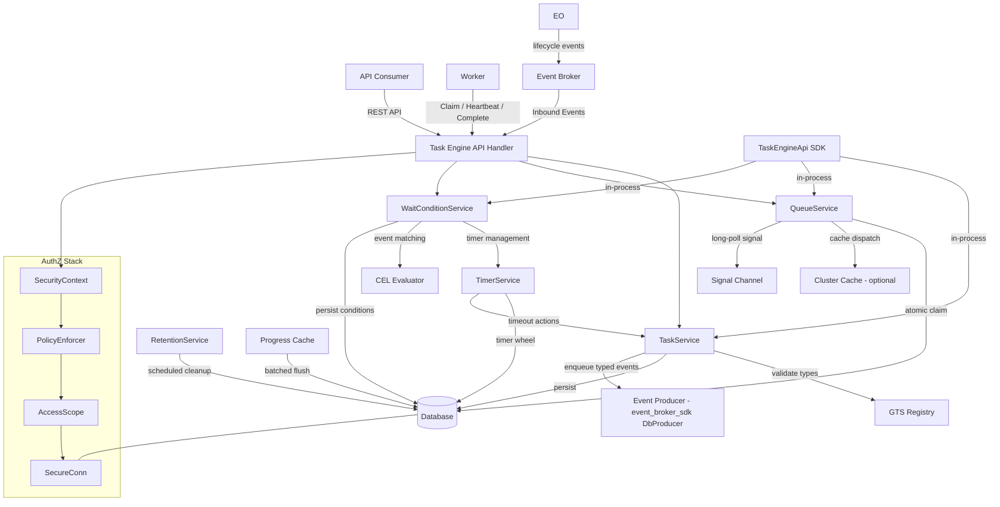
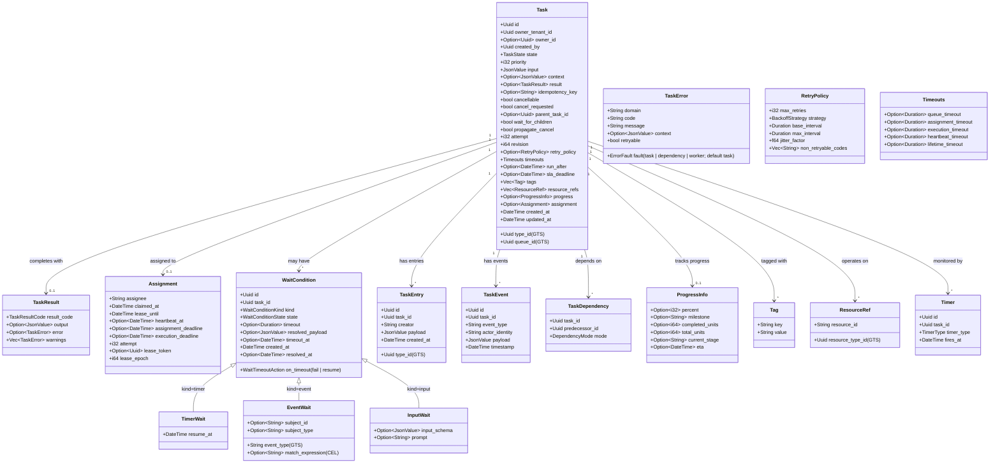
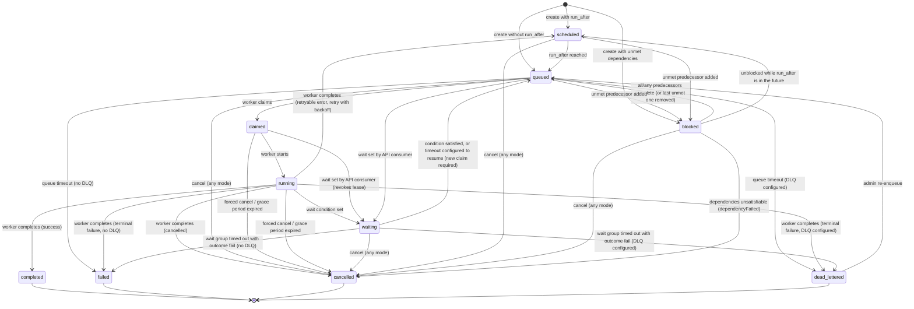

# Technical Design — Task Engine

<!-- toc -->

- [1. Architecture Overview](#1-architecture-overview)
  - [1.1 Architectural Vision](#11-architectural-vision)
  - [1.2 Architecture Drivers](#12-architecture-drivers)
  - [1.3 Architecture Layers](#13-architecture-layers)
  - [1.4 High-Level Architecture Diagram](#14-high-level-architecture-diagram)
- [2. Principles & Constraints](#2-principles--constraints)
  - [2.1 Design Principles](#21-design-principles)
  - [2.2 Constraints](#22-constraints)
- [3. Technical Architecture](#3-technical-architecture)
  - [3.1 Domain Model](#31-domain-model)
  - [3.2 Component Model](#32-component-model)
  - [3.3 API Contracts](#33-api-contracts)
  - [3.4 Internal Dependencies](#34-internal-dependencies)
  - [3.5 External Dependencies](#35-external-dependencies)
  - [3.6 Interactions & Sequences](#36-interactions--sequences)
  - [3.7 Database Schemas & Tables](#37-database-schemas--tables)
  - [3.8 Deployment Topology](#38-deployment-topology)
  - [3.9 Load Management, Admission Control & Backpressure](#39-load-management-admission-control--backpressure)
- [4. Additional Context](#4-additional-context)
  - [4.1 Configuration](#41-configuration)
  - [4.2 Caching Strategy](#42-caching-strategy)
  - [4.3 Metrics and Observability](#43-metrics-and-observability)
  - [4.4 Audit Logging](#44-audit-logging)
  - [4.5 Security Considerations](#45-security-considerations)
  - [4.6 Key Algorithms](#46-key-algorithms)
  - [4.7 Out of Scope](#47-out-of-scope)
  - [4.8 Future Developments](#48-future-developments)
- [5. Traceability](#5-traceability)
  - [5.1 PRD ↔ DESIGN Traceability](#51-prd--design-traceability)
  - [5.2 ADRs](#52-adrs)
  - [5.3 Standards & External References](#53-standards--external-references)
  - [5.4 Companion Documents](#54-companion-documents)

<!-- /toc -->

## 1. Architecture Overview

### 1.1 Architectural Vision

The Task Engine is a distributed, multi-tenant task execution engine implemented as a gear. It manages the full lifecycle of structured work units — creation, queuing, atomic claiming with leases, execution with heartbeat monitoring, durable suspension via wait conditions, retry with backoff, parent/child hierarchies, and structured completion — across a cluster of workers.

The architecture follows a **DDD-Light layered design** (SDK → API/Transport → Domain → Infrastructure) consistent with the ToolKit framework. The system is decomposed into five internal subsystems:

- **Task Service**: Core lifecycle management — creation, validation, state transitions, completion, cancellation, and idempotent deduplication.
- **Queue Service**: Priority-ordered dispatch with multi-dimensional concurrency control (per-queue, per-type, per-tenant), atomic claim with lease semantics, long-poll support, and worker blacklisting.
- **Timer Service**: Multi-type timeout enforcement via a persistent timer wheel — queue, assignment, execution, heartbeat, lifetime, SLA, and scheduled enqueue timers.
- **Wait Condition Service**: Durable suspension management — timer, event, and input wait condition kinds with ALL/ANY semantics, timeout, and resolution.
- **Retention Service**: Background scheduled cleanup of completed tasks, entries, and event history with per-type, per-tenant, and global retention policies.

All five subsystems are implemented as **domain traits within a single `task-engine` crate**, communicating in-process via trait calls. An **SDK crate** (`task-engine-sdk`) exposes the public API surface (client trait, domain models, error types, GTS type definitions) for integration by other gears.

**ID**: `cpt-cf-task-engine-design-execution-backend` — Per [ADR/0001-pluggable-execution-backends.md](ADR/0001-pluggable-execution-backends.md), delivery of runnable work to workers sits behind a narrow, versioned execution-backend interface (dispatch, cancel, inspect, observations, health, worker transport); every semantic above stays in the core and the task-domain database remains the source of truth. This DESIGN specifies the **native database backend** (guarded-update claim, long-poll, signals — §3.2, §4.6) with possible alternative storages in the future (ClickHouse, Elasticsearch). External adapters (Temporal, Hatchet, Conductor OSS) are not planned for now.

### 1.2 Architecture Drivers

**ID**: `cpt-cf-task-engine-design-drivers`

| Driver | Source | Influence |
|---|---|---|
| Distributed task lifecycle | `cpt-cf-task-engine-fr-task-create` | Full state machine with 10 states and 6 timeout types |
| Multi-tenant isolation | `cpt-cf-task-engine-fr-tenant-scoping` | All data tenant-scoped via SecureConn; per-tenant concurrency limits |
| Queue-based dispatch | `cpt-cf-task-engine-fr-priority-dispatch` | Priority-ordered queues with configurable concurrency limits |
| Durable suspension | `cpt-cf-task-engine-fr-wait-conditions` | First-class wait conditions (timer, event, input) with ALL/ANY semantics |
| Atomic claiming | `cpt-cf-task-engine-fr-assignment` | Database-level atomic claim with lease, heartbeat, and long-poll |
| Zombie-worker safety | `cpt-cf-task-engine-fr-lease-fencing` | Per-lease token on every worker write; monotonic lease epoch; at-least-once execution contract |
| GTS extensibility | `cpt-cf-task-engine-fr-gts-task-type` | Task types, queues, and entries as GTS entities; engine-owned finite sets as SDK/domain enums; tags are free-form (non-GTS) |
| Structured retry | `cpt-cf-task-engine-fr-retry` | Configurable policies with backoff strategies and dead-letter queues |
| Cluster-optional caching | `cpt-cf-task-engine-fr-cluster-cache` | Graceful degradation when Cluster gear is unavailable |
| Storage partitioning | `cpt-cf-task-engine-fr-task-domains` | Multi-database routing by GTS task type patterns |
| SDK-first integration | `cpt-cf-task-engine-fr-sdk` | Public SDK crate for type-safe inter-gear communication |

**Architecture Decision Records**:

- `cpt-cf-task-engine-adr-pluggable-execution-backends` — Task Engine core with pluggable execution backends; native database backend by default. See [ADR/0001-pluggable-execution-backends.md](ADR/0001-pluggable-execution-backends.md).
- `cpt-cf-task-engine-adr-state-machine` — Task state machine design with 10 states, terminal/non-terminal classification, and valid transition matrix. See [ADR/0002-task-state-machine.md](ADR/0002-task-state-machine.md).
- `cpt-cf-task-engine-adr-timer-architecture` — Persistent timer wheel with database-backed timers and multi-worker processing. See [ADR/0003-timer-architecture.md](ADR/0003-timer-architecture.md).
- `cpt-cf-task-engine-adr-wait-condition-model` — Wait conditions as fixed domain model elements (not GTS-extensible), with three built-in kinds. See [ADR/0004-wait-condition-model.md](ADR/0004-wait-condition-model.md).
- `cpt-cf-task-engine-adr-concurrency-enforcement` — Multi-dimensional concurrency enforcement via database-level atomic counting (optionally hot-row sharded, ADR-0008); no Cluster dependency (PRD §1.4). See [ADR/0005-concurrency-enforcement.md](ADR/0005-concurrency-enforcement.md).
- `cpt-cf-task-engine-adr-blob-compression` — Transparent JSON blob compression for storage efficiency using S2/Snappy with a magic-header marker. See [ADR/0006-blob-compression.md](ADR/0006-blob-compression.md).
- `cpt-cf-task-engine-adr-event-wait-matching` — CEL-based match expression evaluation for event wait conditions with complexity limits and precompilation. See [ADR/0007-event-wait-matching.md](ADR/0007-event-wait-matching.md).
- `cpt-cf-task-engine-adr-atomic-claim-strategy` — DB-agnostic optimistic guarded-update claim via the ToolKit secure ORM (no `SKIP LOCKED`, no dialect SQL); single-statement conditional slot reservation with optional hot-row sharding. See [ADR/0008-atomic-claim-strategy.md](ADR/0008-atomic-claim-strategy.md).
- `cpt-cf-task-engine-adr-retention-partitioning` — Time-based table partitioning with `DROP PARTITION` retention and SQLite `DELETE` fallback. See [ADR/0009-retention-partitioning.md](ADR/0009-retention-partitioning.md).

> Event delivery is **not** an ADR: reusing the platform Event Broker SDK is a mandated platform standard (all gears publish through `event-broker-sdk`), not a Task-Engine decision. The managed-outbox producer surface, dedup mode, and partitioning are documented as design detail in §3.2 Event Producer.

### 1.3 Architecture Layers

**ID**: `cpt-cf-task-engine-design-layers`

| Layer | Responsibility | Key Components |
|---|---|---|
| **Transport** (`api/rest/`) | HTTP handling, request parsing, response serialization | Axum handlers, DTOs, extractors, OperationBuilder route registration |
| **Domain** (`domain/`) | Business logic, service traits, repository contracts | `TaskService`, `QueueService`, `TimerService`, `WaitConditionService`, `RetentionService`, domain models, repository traits |
| **Infrastructure** (`infra/`) | Persistence, cache integration, GTS provisioning | SeaORM repositories, Cluster cache adapter, timer persistence, type provisioning |
| **SDK** (`task-engine-sdk/`) | Public API for inter-gear communication | `TaskEngineApi` trait (all methods require `&SecurityContext`), SDK models, error types, GTS type definitions |

**ID**: `cpt-cf-task-engine-tech-dependencies`

| Technology | Purpose |
|---|---|
| Rust / Axum | HTTP transport, async runtime (tokio) |
| SeaORM + `toolkit-db` | Database persistence (PostgreSQL, MySQL/MariaDB, SQLite) via `DbManager` + `SecureConn`; all claiming/dialect handling stays in this layer |
| `event-broker-sdk` (`outbox` feature) | `DbProducer` managed outbox for lossless, deduped Event Broker delivery (§3.2 Event Producer); transitively pulls `toolkit-db/preview-outbox` |
| `toolkit-db` advisory locks | Portable leader election for singleton background loops (ADR-0008 §No DB-Specific SQL) |
| `toolkit-security` | Bearer token authentication & authorization |
| `authz-resolver-sdk` | `PolicyEnforcer` for PDP/PEP authorization |
| `types_registry` | GTS schema/instance registration |
| `cluster-sdk` (optional) | Distributed cache for ready-task caching |
| `cel-interpreter` | CEL expression evaluation for event wait condition matching |

### 1.4 High-Level Architecture Diagram

**ID**: `cpt-cf-task-engine-design-overview`



## 2. Principles & Constraints

### 2.1 Design Principles

**ID**: `cpt-cf-task-engine-principle-sdk-first`

**SDK-first public API**: The `task-engine-sdk` crate is the only public API surface. All domain types, client traits, and error types consumed by other gears live in the SDK. The gear crate is private. The SDK trait is **security-equivalent to the REST API** — every method takes `&SecurityContext` as its first parameter, and the local client adapter passes it to the domain services which enforce the same `PolicyEnforcer` → `AccessScope` → `SecureConn` authorization chain as the REST handlers.

**ID**: `cpt-cf-task-engine-principle-secure-by-default`

**Secure-by-default DB access**: All database access uses `SecureConn` with `AccessScope` compiled from PDP constraints. No raw database connections in handler, service, or repository code.

Tenant-owned tables (`te_tasks`, `te_task_state`, `te_task_entries`, `te_wait_conditions`, `te_events`, `te_tags`, `te_resource_refs`, `te_timers`) derive `Scopable` with a `tenant_col` and are always accessed under the PDP-derived tenant scope. **Engine-internal system tables** that hold cross-tenant aggregates or engine-owned coordination state (`te_concurrency_slots`, `te_queue_backlog`, `te_worker_blacklist`, `te_runtime_config`) have no tenant column and are declared `#[secure(unrestricted)]`. Per [`06_authn_authz_secure_orm.md` §Unrestricted entities](../../../docs/toolkit_unified_system/06_authn_authz_secure_orm.md), a scope carrying tenant IDs is *denied* against an `unrestricted` entity, so these tables MUST only be touched on an **engine system code path with `AccessScope::allow_all()`** — never with a subject/tenant scope. This mirrors the platform capability pattern (e.g. `chat-engine` share-token access): when the operation is an engine invariant rather than a subject-authorized row operation, `PolicyEnforcer` is **not** called for that table and the repository reads/writes under an internal `allow_all()`. Authorization for the surrounding action (e.g. `claim`) is still enforced on the tenant-owned task rows in the same transaction.

**ID**: `cpt-cf-task-engine-principle-rfc9457`

**RFC 9457 Problem Details**: All error responses use `application/problem+json` format with GTS type URIs. `Problem` type implements `IntoResponse`.

**ID**: `cpt-cf-task-engine-principle-gts-typed`

**GTS-typed extensibility**: Task types, entry types, and queues are GTS entities. New extensible types are registerable without DDL changes. Engine-owned finite sets such as task states, result codes, wait condition kinds, timer types, timer statuses, dependency modes, and concurrency dimensions are closed SDK/domain enums, not GTS entities. Tags are free-form tenant-scoped strings, not GTS entities (PRD §5.1). Extension data lives in JSONB columns.

**ID**: `cpt-cf-task-engine-principle-tenant-scope`

**Tenant scoping**: Every query is tenant-scoped via `SecureConn` tenant predicates. Tasks have an `owner_tenant_id` isolation boundary. SeaORM entities derive `Scopable` with tenant and resource columns.

**ID**: `cpt-cf-task-engine-principle-operation-builder`

**Type-safe REST**: All endpoints use `OperationBuilder`. Protected routes declare `.authenticated()` followed by a license posture (`.require_license_features::<License>([])` or `.no_license_required()`); unauthenticated routes (health/readiness/metrics) declare `.anonymous()`, which auto-satisfies the license requirement. All routes register `.standard_errors()`.

**ID**: `cpt-cf-task-engine-principle-domain-model`

**Domain model enforcement**: All `struct`/`enum` in `domain/` have `#[domain_model]` (`toolkit_macros::domain_model`). CI lint DE0309 enforces this.

**ID**: `cpt-cf-task-engine-principle-fail-closed`

**Fail-closed authorization**: Denied decisions, unreachable PDP, and missing constraints result in 403 Forbidden. PDP internals are never exposed to clients.

**ID**: `cpt-cf-task-engine-principle-fenced-execution`

**Fenced, at-least-once execution**: Execution is at-least-once (PRD §5.6 Execution Semantics). Task state is fenced by the per-lease `lease_token`: every worker-side write is a single guarded update matching the current token, so a superseded lease can never mutate the task. External systems are fenced by the monotonic `lease_epoch`, which workers pass along. The token is a correctness fence, not a credential — authorization still runs through `PolicyEnforcer` first.

### 2.2 Constraints

**ID**: `cpt-cf-task-engine-constraint-single-binary`

Single-executable deployment via Gears framework. No external broker or cache dependencies required (Cluster cache is optional).

**ID**: `cpt-cf-task-engine-constraint-multi-sql`

Multi-SQL backend portability: PostgreSQL, MariaDB/MySQL, SQLite. `toolkit-db` requirement; backend selection via DSN scheme.

**ID**: `cpt-cf-task-engine-constraint-payload-size`

Per-task payload hard size limit: **64 KiB** total (input + context + output combined), measured as **uncompressed canonical JSON** before compression and enforced on **every payload-changing write** (create, checkpoint/context-update, complete). Per-entry payload limit: **64 KiB**. HTTP request body limit: **1 MiB** (configurable), enforced by `Content-Length` when present and by **streaming byte-count** for chunked/HTTP2 bodies with no usable declared length. Payloads exceeding limits are rejected with `413 Payload Too Large`.

**ID**: `cpt-cf-task-engine-constraint-idempotency-key`

Mandatory caller-supplied idempotency key on every task creation request, except for task types declaring a derived dedup identity (PRD §5.1). Unique within `(owner_tenant_id, created_by)`.

**ID**: `cpt-cf-task-engine-constraint-no-workflow-engine`

The Task Engine provides task lifecycle, declarative relationships (dependencies, parent/child hierarchies), suspension, and schedules — not workflow orchestration: it never executes user-defined orchestration logic (no conditional branches, loops, compensation/saga logic, or arbitrary DAG/workflow definitions; PRD §4.2).
## 3. Technical Architecture

### 3.1 Domain Model

**ID**: `cpt-cf-task-engine-design-domain-model`



#### Task State Machine

**ID**: `cpt-cf-task-engine-design-state-machine`

See [ADR/0002-task-state-machine.md](ADR/0002-task-state-machine.md) for the full rationale.



**Terminal states**: `completed`, `failed`, `cancelled`, `dead_lettered`. Tasks in terminal states do not transition to any other state except `dead_lettered` → `queued` via explicit administrative re-enqueue. Cancellation is a first-class terminal lifecycle state; `cancelled` and `forciblyCancelled` result codes record the cancellation outcome or mode.

**State Transition Table**:

| From | To | Trigger | Timer Action |
|---|---|---|---|
| — | `scheduled` | Create with `run_after` (and no unmet dependencies) | Set scheduled timer; set lifetime timer (and SLA timer if `sla_deadline`) |
| — | `queued` | Create without `run_after` | Set queue timeout timer; set lifetime timer (and SLA timer if `sla_deadline`); emit `newTask` signal |
| — | `blocked` | Create with unmet dependencies (takes precedence over `run_after`) | Set lifetime timer (and SLA timer if `sla_deadline`) |
| `scheduled` | `queued` | Scheduled timer fires | Delete scheduled timer; set queue timeout; emit `newTask` signal |
| `blocked` | `queued` / `scheduled` | Dependencies satisfied, or last unmet predecessor removed; `scheduled` if `run_after` is in the future | `queued`: set queue timeout, emit `newTask` signal; `scheduled`: set scheduled timer |
| `queued` / `scheduled` | `blocked` | Unmet predecessor added (dependency API, PRD §5.9) | Delete queue/scheduled timer; queue-depth admission into `tenant_deferred` (may be refused `429`) |
| `blocked` | `cancelled` | Dependencies unsatisfiable — `ALL`: any predecessor failed; `ANY`: every predecessor failed (`failed`/`cancelled`/`dead_lettered`, PRD §5.9); same transaction as the predecessor's terminal transition, cascading to own successors | Delete all timers; release queue-depth capacity; result code = `dependencyFailed` |
| `queued` | `claimed` | Worker atomic claim | Delete queue timeout; set `lease_until = now + lease duration` (the task's `heartbeat_timeout` if set, else `default_lease_duration_secs`); set `assignment_deadline = now + assignment_timeout` (if configured). Heartbeat, assignment and execution timeouts are enforced by the lease scan (§3.2 TimerService) |
| `claimed` | `running` | Worker start | Keep/extend `lease_until`; clear `assignment_deadline`; set `execution_deadline = now + execution_timeout` (if configured; set again on every start, so time spent `waiting` is never counted) |
| `running` (worker, or API consumer); `claimed` / `queued` (API consumer) | `waiting` | Wait condition set (task is **parked**, PRD §5.4) | Release slots (if leased); clear `lease_token`, `lease_until`, `assignee`, `assignment_deadline`, `execution_deadline`; from `queued`: delete queue timeout and decrement the queued backlog; apply optional checkpoint; set wait condition timeout timer (if configured) |
| `waiting` | `queued` | Condition satisfied, or wait timeout configured to resume | Delete wait timeout; set `resume_pending = true`; set queue timeout; emit `newTask` signal (hand-over, never refused by queue depth) |
| `running` | `completed` | Worker completes successfully | Delete all timers |
| `running` | `cancelled` | Worker completes after graceful cancellation | Delete all timers; result code = `cancelled` |
| `running` | `failed` | Terminal failure, or retries exhausted, and no DLQ configured | Delete all timers; release slots |
| `running` | `dead_lettered` | Terminal failure, or retries exhausted, and DLQ configured | Delete all timers; release slots |
| `running` | `scheduled` | Worker fails with a **retryable** error, attempts remain (retry with backoff) | Delete queue/wait timers and clear lease and execution/assignment deadlines — **keep the lifetime and SLA timers**; release slots; set scheduled timer at `run_after`. `attempt` is **not** incremented here (incremented on next claim) |
| `claimed`/`running` | `scheduled` | **Lease expiry** (missed heartbeat, `lease_until`) or **assignment timeout** (`assignment_deadline`), attempts remain | Release slots; clear lease and deadlines; compute `run_after` from retry-policy backoff; set scheduled timer — **lifetime and SLA timers stay armed**; count one consecutive failure toward blacklist. `attempt` unchanged until next claim |
| `claimed`/`running` | `dead_lettered`/`failed` | Lease expiry or assignment timeout, attempts exhausted | Release slots; delete all timers; terminal routing (DLQ if configured else `failed`) with `timedOut` result |
| `queued` | `dead_lettered`/`failed` | **Queue timeout** (not claimed in time; terminal) | Delete all timers; decrement queued backlog; terminal routing (DLQ if configured else `failed`) with `timedOut` result |
| `running` | `dead_lettered`/`failed` | **Execution timeout** (`execution_deadline` passed; PRD §5.3 — terminal, task-attributed, never retried) | Release slots; delete all timers; terminal routing (DLQ if configured else `failed`) with `timedOut` result; **not** counted toward the worker blacklist |
| Any non-terminal | `dead_lettered`/`failed` | **Lifetime timeout** (terminal; overrides retry/lease handling) | Delete all timers; release slots; force-complete with `timedOut` result; DLQ if configured else `failed` |
| `dead_lettered` | `queued` | Admin re-enqueue | Set `queue_id = dead_lettered_from` and clear it; queue-depth admission; set queue timeout; emit `newTask` signal |
| Any non-terminal | `cancelled` | Forced cancel (overrides `cancellable=false`) | Delete all timers; release slots; result code = `forciblyCancelled`; propagate cancel to children |
| `queued`/`scheduled`/`blocked`/`waiting` | `cancelled` | `requested` or `graceful` cancel — no lease, so nothing to acknowledge | Delete all timers; release queue-depth capacity; result code = `cancelled`; propagate cancel to children |
| `claimed`/`running` | (unchanged) | `requested` / `graceful` cancel | Set `cancel_requested` (worker learns via heartbeat); `graceful` also sets a `cancel_grace` timer at `now + cancel_grace_period_secs`, which on expiry applies the forced-cancel row |
| Any non-terminal | `cancelled` | **Supersession** by a newer submission of the same dedup group (§4.6 Task Creation Admission); `forced` mode, or `graceful` mode on an unleased task (immediate), or `graceful` mode on a `claimed`/`running` task (sets `cancel_requested` + `superseded_by` + `cancel_grace` timer now; terminal when the holder acknowledges or the timer fires) | Delete all timers; release slots and queue-depth capacity; result code = `superseded`; propagate cancel to children; release the dedup identity |

**Timer lifecycle across requeues** (PRD §5.3 *Deadlines survive requeues*): the lifetime and SLA timers are armed at creation and are removed only by a terminal transition. Retry re-enqueue, lease-expiry/assignment-timeout requeue, parking in `waiting`, and resumption never delete them; the state-specific timers (queue timeout, scheduled enqueue, wait timeout) are removed or re-armed on each transition, and the state-specific deadlines (`lease_until`, `assignment_deadline`, `execution_deadline`) are cleared whenever the task leaves `claimed`/`running`.

**Queue-depth accounting** (PRD §5.2 Queue Depth Limits): two disjoint counted sets: **queued** (`queued`) feeds the `queue_global`, `queue_tenant`, `domain_global` dimensions of `te_queue_backlog` (§3.7); **deferred** (`scheduled`, `blocked`) feeds the `tenant_deferred` dimension. Counters change in the same transaction as the state change: **admission** — creation, bulk move, admin re-enqueue (`dead_lettered` → `queued`), recurring spawn, dependency add (`queued`/`scheduled` → `blocked`) — increments the dimensions of the task's initial state with the guarded `used < limit` predicate and **may be refused**; **re-entry** — retry / lease-expiry requeue (`running`/`claimed` → `scheduled`), `waiting` → `queued` — and **hand-over** — `scheduled`/`blocked` → `queued` (decrement deferred, increment queued) — increment unconditionally and are **never refused**; **exit** — claim, any cancel, lifetime/queue timeout, wait set on a `queued` task — decrements whichever set the task was in.

**Lease token / epoch handling** (PRD §5.6 Lease Fencing), applied in the same guarded update as the transition:

| Transition | `lease_token` | `lease_epoch` |
|---|---|---|
| Claim (`queued` → `claimed`); reassignment | New `uuid_v7()` | `+1` |
| `claimed` → `running` | Kept | Kept |
| `running` → `waiting` (task parked; the next claim issues a new token and `+1` epoch) | Cleared (`NULL`) | Kept |
| → `queued` / `scheduled` (lease expiry, retry) | Cleared (`NULL`) | Kept |
| Worker complete/fail → terminal | Kept (enables idempotent completion replay) | Kept |
| Forced cancel, supersession (`forced` mode), lifetime timeout, other non-worker terminal transitions | Cleared | Kept |

#### GTS Base Types

**ID**: `cpt-cf-task-engine-design-gts-types`

Reference schemas for every entity below live under [`schemas/`](./schemas/) (`types/`, `instances/`).

**GTS entities the Task Engine introduces and registers at startup** (owned by this gear):

| GTS entity | Kind | Usage |
|---|---|---|
| `gts.cf.core.tasks.task.v1~` | Base type | Task type base. Concrete task types are **derived at runtime by consuming gears** (not shipped here); determines input/output schemas; may declare concurrency limits, a derived dedup identity (`dedup`) with optional supersession (`supersede`), and progress settings (`progressEvents`: `none`/`milestones`/`all`, `progressFlushIntervalSecs`) via traits. |
| `gts.cf.core.tasks.queue.v1~` | Base type | Queue. Well-known instances (`default`, `system`, `dead_letter`) define concurrency, queue depth limit (`queueMaxQueueDepth`), timeouts, retry, DLQ, worker blacklist (`blacklistFailureThreshold`, `blacklistDurationMinutes`), and optional default progress settings (`progressEvents`, `progressFlushIntervalSecs`). |
| `gts.cf.core.tasks.entry.v1~` | Base type | Task entry type base, with pre-defined derived kinds `entry_work`/`entry_observation`/`entry_issue`/`entry_note`/`entry_measurement`. |
| `gts.cf.core.events.event_type.v1~cf.core.tasks.<event>.v1` | Instances (×22) | Lifecycle event types — instances of the Event Broker event-type resource, each carrying `topic` + `data_schema`. See §3.2 Event Producer. |
| `gts.cf.core.events.topic.v1~cf.core.tasks.task_events.v1` | Instance | Outbound lifecycle-events topic (instance of the Event Broker topic type). |
| `gts.cf.core.events.consumer_group.v1~cf.core.tasks.task_engine.v1` | Instance | Named inbound consumer group for event wait conditions. |
| `gts.cf.toolkit.authz.permission.v1~cf.task_engine._.<name>.v1` | Instances (×7) | Permission instances (`task_create/read/update/delete/claim/cancel`, `tasks_admin`) per [PERMISSION_GTS_TYPE.md](../../../docs/arch/authorization/PERMISSION_GTS_TYPE.md); fields `id`/`resource_type`/`action`/`display_name`. |

**GTS entities reused / derived from other subsystems** (not owned here):

- **Event types, topic, consumer group** derive from the **Event Broker** base types `gts.cf.core.events.{event_type,topic,consumer_group}.v1~` (see `gears/system/event-broker/docs/schemas/`). The Task Engine ships the concrete instances above; it does **not** define its own event/topic/consumer-group base types.
- **Errors** reuse the platform's fixed **canonical error categories** `gts.cf.core.errors.err.v1~cf.core.err.{category}.v1~` (see `docs/arch/errors/`). The Task Engine defines **no** error GTS types; it maps its failure conditions onto canonical categories (§3.3 Error Response Format).
- **Permission base type** `gts.cf.toolkit.authz.permission.v1~` is owned by the ToolKit authz stack; the Task Engine only registers instances.
- **Tags** are **not** GTS entities — task tags are free-form, tenant-scoped key/value strings (PRD §5.1).

#### Hybrid Storage Model (GTS + Engine Enums)

Task types use a **hybrid storage model**: base fields (state, priority, queue, timestamps, owner, assignment) live in indexed relational columns for efficient querying. Type-specific extension data (input, context, output) is stored in JSONB columns. The `type_id` column stores the deterministic UUID derived from the GTS type identifier via `gts_schema_with_refs_as_string()`. This enables new task types to be registered without DDL changes — only GTS type registration is required.

Engine-owned finite sets **MUST** use stable SDK enum discriminants and compact numeric database columns (`u8` in domain models; `TINYINT` where supported, `SMALLINT` for PostgreSQL portability). Hot predicates **MUST NOT** store state, result code, timer type, timer status, wait kind, or dependency mode as strings or GTS UUIDs.

**Enum evolution contract** (PRD §5.12, §7.1): discriminants are **stable and never renumbered/reused**; storage and SDK use the numeric discriminant while the **REST/JSON wire form is the stable lowercase string name** (e.g. `"queued"`, `"timed_out"`) — both map 1:1 to the same variant. SDK/REST decoders that encounter an unrecognized discriminant/name (older client ↔ newer server) **surface an explicit `Unknown` value rather than coercing or panicking**, and a server reading an unknown stored code **fails closed** (treats it as non-actionable). Consequently **adding** a variant (new discriminant) is a **minor/backward-compatible** change given the unknown-value handling, whereas **renumbering/removing/repurposing** a discriminant is **breaking** — this holds across rolling upgrades (mixed nodes) and already-persisted values.

### 3.2 Component Model

**ID**: `cpt-cf-task-engine-component-model`

#### Module Structure

```text
gears/task-engine/
├── task-engine-sdk/              # Public API: traits, models, errors, GTS types, enums
│   └── src/
│       ├── lib.rs                # Re-exports
│       ├── api.rs                # TaskEngineApi trait (async, SecurityContext on every method)
│       ├── models.rs             # SDK domain types and closed enums (TaskState, TaskResultCode, etc.)
│       ├── error.rs              # TaskEngineError with GTS type URIs
│       └── gts.rs                # GTS base type / well-known instance definitions for extensible concepts
│
└── task-engine/                  # Gear crate
    └── src/
        ├── lib.rs                # Public exports
        ├── gear.rs               # Gear wiring, lifecycle, ClientHub registration
        ├── config.rs             # TaskEngineConfig
        ├── api/rest/             # Transport layer
        │   ├── handlers/
        │   │   ├── tasks.rs      # Task CRUD, claim, start, heartbeat, complete, cancel
        │   │   ├── entries.rs    # Task entry create/read/list (immutable)
        │   │   ├── waits.rs      # Wait condition set, query, resolve
        │   │   ├── queues.rs     # Queue introspection
        │   │   ├── deps.rs       # Dependency management
        │   │   ├── search.rs     # Search and filtering
        │   │   ├── bulk.rs       # Bulk operations
        │   │   └── admin.rs      # DLQ inspection, re-enqueue, runtime config
        │   ├── routes.rs         # OperationBuilder route registration
        │   ├── dto.rs            # REST DTOs (serde + utoipa)
        │   ├── error.rs          # Error response mapping
        │   └── extractors.rs     # Custom Axum extractors
        ├── domain/               # Business logic (no infra dependencies)
        │   ├── task_service.rs   # TaskService: creation, completion, cancellation
        │   ├── queue_service.rs  # QueueService: dispatch, claim, concurrency
        │   ├── timer_service.rs  # TimerService: timer wheel, timeout processing
        │   ├── wait_service.rs   # WaitConditionService: set, resolve, timeout
        │   ├── retention_service.rs  # RetentionService: partition maintenance, cleanup, slot reconciliation
        │   ├── event_producer.rs # event_broker_sdk::DbProducer wiring + TypedEvent structs + enqueue
        │   ├── event_consumer.rs # event_broker_sdk::ConsumerBuilder wiring (TxConsumerHandler) for event wait conditions
        │   ├── leader.rs         # advisory-lock (toolkit_db::advisory_locks) singleton coordination
        │   ├── local_client.rs   # TaskEngineApi local adapter (SDK trait → domain services)
        │   ├── progress_cache.rs # In-memory progress batching with periodic flush
        │   ├── signal.rs         # Signal channels (newTask, timer, blacklist)
        │   ├── blacklist.rs      # Per-queue worker blacklist management
        │   ├── model.rs          # Domain entities (#[domain_model])
        │   ├── repo.rs           # Repository traits (TaskRepo, EntryRepo, TimerRepo, etc.)
        │   └── error.rs          # DomainError
        ├── infra/                # Infrastructure implementations
        │   ├── db/               # SeaORM repositories
        │   │   ├── task_repo.rs
        │   │   ├── entry_repo.rs
        │   │   ├── timer_repo.rs
        │   │   ├── wait_repo.rs
        │   │   ├── event_repo.rs
        │   │   ├── dep_repo.rs
        │   │   └── entities/     # SeaORM entity definitions (Scopable derives)
        │   ├── cache/            # Cluster cache adapter
        │   │   └── ready_task_cache.rs
        │   ├── compression.rs    # S2/Snappy blob compression
        │   ├── domain_router.rs  # Task domain → database routing
        │   └── type_provisioning.rs  # GTS type registration at startup
        └── test_support/         # Test utilities
```

**Crate Naming**: Directory names hyphenated (`task-engine-sdk`), package names `cf-gears-` prefixed (`cf-gears-task-engine-sdk`), library names underscored (`task_engine_sdk`).

#### SDK Security Model

**ID**: `cpt-cf-task-engine-design-sdk-security`

The SDK trait (`TaskEngineApi`) and the REST API handler are **security-equivalent**. Both entry points converge on the same domain services, which enforce the full authorization chain. There is no "privileged in-process bypass".

```
REST path:  HTTP Request → AuthN middleware → SecurityContext → Handler → Domain Service → PolicyEnforcer → SecureConn → DB
SDK path:   Caller passes SecurityContext → Local Client Adapter → Domain Service → PolicyEnforcer → SecureConn → DB
```

Every `TaskEngineApi` method requires `&SecurityContext` as its first parameter (per ToolKit SDK-first pattern). The local client adapter (`domain/local_client.rs`) implements the SDK trait and delegates to domain services, passing `SecurityContext` through. Domain services call `PolicyEnforcer` for authorization decisions and `SecureConn` for tenant-scoped DB access — identical to the REST handler path.

Other gears obtain the client via `ClientHub`:
```rust
let te = ctx.client_hub().get::<dyn TaskEngineApi>()?;
let task = te.create_task(&security_ctx, task_def).await?;
```

The caller is responsible for providing a valid `SecurityContext` (typically propagated from its own inbound request). The Task Engine does not trust or skip any security check based on the entry point.

**Worker lease handle** (PRD §5.6 Lease Fencing / Execution Semantics): `claim()` returns the task together with a `Lease { task_id, lease_token, lease_epoch, attempt, deadline, lost: CancellationToken }`. All worker-side SDK methods (`start`, `heartbeat`, `progress`, `checkpoint`, `complete`, `fail`, `set_wait`, worker `create_entry`) take `&Lease`, so the token cannot be omitted. `set_wait` consumes the `Lease` (the task is parked and ownership ends, PRD §5.4); the handler returns after it, and the resumed task arrives later as a fresh claim. The SDK worker runtime runs the heartbeat loop and fires `lease.lost` when any call returns `LEASE_LOST`, or when `deadline` (last successful renewal + lease duration, measured on the local monotonic clock) passes without a successful renewal; task handlers observe `lease.lost` and stop. `lease_epoch` is exposed for fencing writes to external systems. **`LEASE_LOST` is never retried**: the canonical `aborted` category is generally retryable, so the SDK HTTP client and any retry middleware **MUST** exclude `context.reason = "LEASE_LOST"` from automatic retries — the correct "higher-level retry" (gRPC ABORTED semantics) is to abandon the task, not to re-send the call.

#### Internal Services

**ID**: `cpt-cf-task-engine-component-services`

##### TaskService (`domain/task_service.rs`)

Core lifecycle orchestrator. Owns task creation, validation, state transitions, completion, and cancellation.

Responsibilities:
- Accept task definitions, validate against GTS registry, generate IDs, persist
- Record `created_by` = `SecurityContext.subject_id` of the create request (server-set, never caller-supplied)
- Enforce idempotency via the caller-supplied key (REST `Idempotency-Key` header → `idempotency_key`; SDK `CreateTaskRequest.idempotency_key`), unique within `(owner_tenant_id, created_by)`. Missing key → `invalid_argument` with transport override `428`. Duplicate key, equal payload (canonical-JSON compare of type/queue/input/context), task in **any** state → `already_exists` `409` with `context.resource_name` = existing task ID; the SDK surfaces this as `CreateTaskOutcome::Existing(task)`. Same key, **different** payload → `invalid_argument` `400` (field violation on `idempotency_key`). Dedup bounded by retention (§4.5)
- **Derived dedup identity** (types declaring the `dedup` trait): compute the identity from the *validated* input after authorization (§4.6 Task Creation Admission); the `Idempotency-Key` header is not required and, if present, is **ignored** (not stored, not checked; SDKs and gateways attach it automatically). Occupancy lives in `te_dedup` (§3.7); a hit returns `already_exists` `409` + `resource_name`, but only if the caller's `AccessScope` can read the existing task (else `permission_denied` `403`, no identifier)
- **Supersession** (types declaring `supersede`): in the create transaction, compare the order value with `te_supersede_heads`; newer → cancel the group's non-terminal task via the cancel path (PDP `cancel` check on that task with the caller's scope first), equal → dedup, older → `failed_precondition` / `STALE_ORDER` (§4.6). Reject `cancellable=false` on these types
- **Queue-depth admission**: reserve capacity on every applicable `te_queue_backlog` dimension in the same transaction as the insert; full → `resource_exhausted` `429` (`QUEUE_DEPTH_LIMIT`) (§4.6)
- Validate payload size limits on **every payload-changing write** (create, checkpoint/context-update, complete with output, set-wait with checkpoint): aggregate `input + context + output` ≤ 64 KiB measured as **uncompressed canonical JSON** before compression; reject `413` leaving stored payload unchanged. The size check and the payload write are one **revision-guarded** update (`te_task_state.revision`, §4.6 Payload-Changing Writes); a write that loses the guard to a concurrent payload write is rejected `409` `aborted` / `CONCURRENT_MODIFICATION` and may be retried by the caller
- Validate cross-references: parent and dependencies must resolve to the **same task domain** as the task (§3.8); dependency graph acyclic on every mutation (§4.6); reject `invalid_argument` `400` otherwise
- Manage state transitions per the state machine (§3.1); `attempt` is bumped only on claim (not on retry/lease requeue, and not on the claim of a task resumed from `waiting`, marked by `resume_pending`)
- **Fence every worker-side write** (start, progress accept, checkpoint, complete/fail, set wait, worker entries): one guarded `update_many … WHERE task_id = ? AND lease_token = ? AND state_code IN (claimed, running)`; `rows_affected == 0` → `409` `aborted` / `LEASE_LOST` (§3.3 Error Response Format). The state write and its `te_events`/outbox rows share the transaction, so a rejected write leaves no trace
- Handle task completion with structured results (result code, output, error, warnings); terminal routing for failure/timeout is DLQ-if-configured-else-`failed`; a `wait_for_children` parent's successful completion is rejected `CHILDREN_PENDING` while a child is non-terminal. **Idempotent completion replay**: if the fenced update matches nothing but the task is terminal with the same `lease_token` and a canonical-JSON-equal result, return `200` with the stored outcome and the platform `Idempotency-Replayed: true` header (no write); a different result → `failed_precondition` `400`
- **Validate the result on completion** (PRD §5.1 Structured Input/Output: schemas "validated at boundaries"), before the fenced write: (1) `output`, when present, against the task type's registered output schema — resolved from the task's own versioned `type_id`, so a task is always checked against the schema it was created with; (2) `error` and each `warnings` item against the fixed SDK `TaskError` contract (`domain`, `code`, `message` required; `retryable` boolean; `fault` ∈ `task`/`dependency`/`worker`; `context` a JSON object); (3) `result_code` consistent with the payload (`success`/`warning` carry no `error`; failure codes carry one). A failure is rejected `invalid_argument` `400` with field violations and changes nothing: the task stays `running`, the lease stays valid, and the worker can resend a corrected result or report a failure. No output schema registered → only the size limit applies. Compiled schemas are cached per `type_id`
- Process cancellation (requested, graceful, forced): `requested`/`graceful` honor `cancellable=false`, `forced` overrides it; `requested`/`graceful` cancel an unleased task immediately and only flag a leased one (§3.1, graceful escalates via the `cancel_grace` timer); every terminal cancel of a parent with `propagate_cancel` (the "propagate cancel to children" in §3.1) cancels its non-terminal children; a forced parent cancel transitions the parent immediately without waiting for them
- Checkpoint intermediate state (key-level merge into context; revalidated against the aggregate payload limit)
- Publish lifecycle events to the Event Broker via transactional outbox

Key methods:
- `create_task(ctx, def) → Result<Task>`
- `complete_task(ctx, id, result) → Result<Task>`
- `cancel_task(ctx, id, mode) → Result<Task>`
- `checkpoint(ctx, id, data) → Result<Task>`
- `start_task(ctx, id) → Result<Task>`

##### QueueService (`domain/queue_service.rs`)

Dispatch engine. Owns priority-ordered task dispatch, atomic claiming, concurrency enforcement, and long-poll support.

Responsibilities:
- Atomic claim: select the highest-priority eligible task **across all requested queues** — ordered by `(priority, created_at, task_id)`; the order in which the worker lists the queues has no effect (k-way merge of per-queue heads, §4.6 Task Assignment) — atomically assign with lease (state transition + slot reservation in one transaction, in the lock order of §3.7 Lock ordering), return task. Two workers cannot claim the same task. All queues in one claim request **MUST** resolve to a single task domain (§3.8); a multi-domain claim is rejected `invalid_argument` `400` — atomic highest-priority ordering is preserved within one database. `attempt` is incremented here (the single authoritative increment point). The same guarded update sets `lease_token = uuid_v7()` and `lease_epoch = lease_epoch + 1`; the claim response returns both (SDK `Lease`, §3.2 SDK Security Model).
- Resolve and maintain effective queue-depth limits (config override → queue GTS `queueMaxQueueDepth` → config default `queue_max_queue_depth`; `tenant_max_queue_depth`, `tenant_max_deferred_tasks` and `global_max_queue_depth` from config) into `te_queue_backlog.limit_value`, and keep the counters consistent on every pending-set transition (§3.1 Queue-depth accounting); bulk move re-admits against the destination queue per task
- Enforce multi-dimensional concurrency limits: per-queue global, per-queue per-tenant, per-type global, per-type per-tenant — a candidate is assigned only if **every** dimension has capacity. A dimension at capacity blocks only the tasks it governs: the candidate is skipped, the saturated scope is excluded from the rest of the scan, and the claim proceeds to other tenants'/types' tasks (§4.6 Task Assignment). The claim returns `429 CONCURRENCY_LIMIT` only when nothing could be assigned and at least one eligible task was skipped for capacity
- Support long-poll claiming: if no tasks available and timeout specified, park (no DB connection, no admission permit) and retry on a `newTask` or `slotReleased` signal **or** on the node's queue-watcher tick, so wake-up works across nodes (§3.2 Signal System)
- Heartbeat processing: fenced on `lease_token` (mismatch → `409` `LEASE_LOST`); extend lease, update `heartbeat_at`, return control response (cancel flag, current state). Lease expiry (missed heartbeat) requeues via the **same retry-policy backoff** as an explicit failure (transition to `scheduled` with computed `run_after`, not immediate `queued`) — see §4.6 leaseScan
- Worker blacklist management: track consecutive **worker-attributed** failures per (worker, queue) — explicit failures with `error.fault = worker`, lease expiry (missed heartbeat), and assignment timeout each count as **one** failure toward the same threshold (no single-miss blacklist); `fault = task | dependency` failures and execution timeouts neither count nor reset (PRD §5.6); reset on next success; blacklist after threshold and emit `workerBlacklisted`
- Reassignment (`POST /tasks/{id}/reassign`): guarded update sets the new assignee with a fresh `lease_token` and `lease_epoch + 1`, fencing the previous assignee, and returns the new lease to the caller for hand-off
- Queue introspection: depth, executing count, per-state counts

Key methods:
- `claim_task(ctx, queues, timeout) → Result<Option<(Task, Lease)>>`
- `heartbeat(ctx, lease) → Result<HeartbeatResponse>`
- `get_queue_stats(ctx, queue_id) → Result<QueueStats>`

##### TimerService (`domain/timer_service.rs`)

Persistent timer wheel. Owns all timeout enforcement. See [ADR/0003-timer-architecture.md](ADR/0003-timer-architecture.md).

Responsibilities:
- Manage timer lifecycle: create, update, delete, rebuild on restart
- Process expired timers via a multi-worker timer wheel:
  - `tickTimers` loop: sleep until nearest expiry, move expired timers to processing channel
  - `procTimers` workers (×N, configurable): load task, apply timeout action
- Timer type → action mapping (see State Transition Table in §3.1)
- Scheduled enqueue processing (`run_after` timers)
- SLA deadline monitoring with `slaBreached` event publishing

Timer persistence: all timers are stored in the database (`te_timers` table) and rebuilt on process restart by scanning for unexpired timers. This ensures no timers are lost on crash or restart.

**Lease-scan for execution-phase timeouts (write-amplification mitigation)**: Assignment, heartbeat, and execution timeouts are **not** persisted as individual `te_timers` rows. Doing so would make `te_timers` the hottest table in the system, because every claim/start/heartbeat would `DELETE`+`INSERT` a timer row (heartbeats recur every few seconds across up to ~100K running tasks). Instead each is a **persisted deadline column on `te_task_state`**, enforced by a periodic **lease scan**:

| Timeout | Column | Set | Extended by heartbeat? | Cleared |
|---|---|---|---|---|
| Heartbeat | `lease_until` | claim: `now + lease duration` (task `heartbeat_timeout`, else `default_lease_duration_secs`) | **Yes** (each heartbeat) | on leaving `claimed`/`running` |
| Assignment | `assignment_deadline` | claim: `now + assignment_timeout` (if configured) | No | on `start`, or on leaving `claimed` |
| Execution | `execution_deadline` | start: `now + execution_timeout` (if configured) | No | on leaving `running` |

A task is due when any of these holds (each backed by its own partial index, §3.7):

```
state_code IN (claimed, running) AND lease_until < NOW()
state_code = claimed             AND assignment_deadline < NOW()
state_code = running             AND execution_deadline < NOW()
```

Heartbeat is a single fenced `UPDATE te_task_state SET lease_until = NOW() + lease_duration, heartbeat_at = NOW() WHERE task_id = ? AND lease_token = ?` — no timer row churn, and it touches **only** `lease_until`, so it can never push out the assignment or execution deadline. The action depends on the cause (§4.6 leaseScan): a missed heartbeat or assignment timeout is a **liveness failure** (requeue with retry-policy backoff while attempts remain, counts toward the blacklist); an execution timeout is **task-attributed and terminal** (force-complete with `timedOut`, DLQ if configured else `failed`, never retried, not counted toward the blacklist — PRD §5.3). The scan interval is bounded by the timer-accuracy NFR (default ≤ 1s). Only the low-frequency, absolute-deadline timers — `scheduled` (delayed enqueue / retry backoff), `lifetime`, `sla`, and `wait` — remain as durable `te_timers` rows processed by the timer wheel. This preserves crash durability (every deadline is persisted on `te_task_state`) while eliminating the dominant write hotspot.

##### WaitConditionService (`domain/wait_service.rs`)

Durable suspension manager. Owns wait condition lifecycle and resolution. See [ADR/0004-wait-condition-model.md](ADR/0004-wait-condition-model.md).

Responsibilities:
- Set wait conditions on running tasks, or — API consumer only — on `queued`/`claimed` tasks (transitions task to `waiting` and **parks** it: releases slots, clears lease and assignee, applies an optional checkpoint in the same transaction — PRD §5.4)
- Resume by transitioning `waiting` → `queued` with `resume_pending = true`; resolved wait data (event payload, input, timeout indication) is stored on the wait condition and returned with the next claim
- Manage three built-in wait condition kinds:
  - **Timer**: set `resume_at`, auto-satisfy when time reached (via TimerService)
  - **Event**: match incoming events by `event_type`, optional `subject_id`/`subject_type`, optional CEL `match_expression`
  - **Input**: accept structured JSON input validated against declared schema
- Support ALL/ANY semantics for multiple wait conditions on a single task
- Handle wait condition timeouts per member `on_timeout` and the group rule of PRD §5.4: `all` — the first member timeout resolves the group with that member's `on_timeout` and sets the other pending members to `cancelled`; `any` — a timed-out member drops out, and once every member has timed out the group resolves to `fail` if any member says `fail`, else `resume`. `fail` uses terminal routing with `timedOut` (DLQ if configured, else `failed`); `resume` stores a timeout indication in `resolved_payload`
- Evaluate incoming events against active event wait conditions

##### RetentionService (`domain/retention_service.rs`)

Background cleanup. Runs as a `WithLifecycle` stateful task with `CancellationToken`.

On the PostgreSQL/MySQL production profile, retention is realized primarily by **time-based partition maintenance** rather than row deletion. See [ADR/0009-retention-partitioning.md](ADR/0009-retention-partitioning.md).

Maintenance sequence (per domain):
1. Provision ahead: ensure future `created_at` partitions exist before data lands in them
2. System-cancel: force-cancel non-terminal tasks beyond hard retention *before* their partition is dropped
3. Expire: `DROP` partitions of `te_tasks`, `te_task_state`, `te_events`, `te_task_entries` whose entire range is older than the **longest** effective retention configured in the domain (global default, any type or tenant policy), so a drop can never remove data that a longer tenant/type policy (e.g. legal hold) still requires; then delete the dropped tasks' `te_dedup` rows (`created_at` older than the same horizon), since `te_dedup` is not partitioned
4. Per-type / per-tenant policies **shorter** than that horizon are applied by bounded `DELETE` (together with the tasks' `te_dedup` rows)
5. Slot reconciliation: recompute `te_concurrency_slots.used` from the authoritative `claimed`+`running` count and correct drift (see §3.7)

Outbox row pruning is handled by the Event Broker SDK producer / `toolkit_db::outbox` vacuum stage, not the Retention Service. All Retention Service loops run under the advisory-lock leader (§3.8) so only one instance performs maintenance.

On SQLite (dev/test/low-volume) partitioning is unavailable, so retention falls back to batched `DELETE` of terminal tasks, entries, events, and orphaned wait conditions/timers. Each step runs in a loop with configurable batch size and retry logic.

##### Event Producer (`event_broker_sdk::DbProducer`)

Lifecycle events are published via the **Event Broker SDK managed outbox producer** (`event_broker_sdk::DbProducer` + `ProducerOutboxQueue`, `outbox` feature) — the Task Engine does **not** hand-roll an outbox table, a relay, or a broker-delivery handler. Publishing through the Event Broker SDK is a **mandated platform standard** (all gears use it), so there is no ADR for the choice itself; the producer-surface, dedup-mode, and partitioning decisions below are the only Task-Engine-specific detail.

Design:
- Lifecycle events are `TypedEvent` structs covering the full PRD §5.10 event-type set: `TaskCreated`, `TaskQueued`, `TaskClaimed`, `TaskStarted`, `TaskCompleted`, `TaskFailed`, `TaskCancelRequested`, `TaskCancelled`, `TaskCheckpointed`, `TaskProgressed`, `TaskWaiting`, `TaskResumed`, `TaskRetrying`, `TaskReassigned`, `TaskDeadLettered`, `TaskTimedOut`, `SlaBreached`, `WaitConditionSet`, `WaitConditionSatisfied`, `WaitTimedOut`, `WorkerBlacklisted`, `ConfigUpdated`. Each event's `type` is a Task-Engine **event-type instance** of the Event Broker event-type resource — `gts.cf.core.events.event_type.v1~cf.core.tasks.<event>.v1` (e.g. `…cf.core.tasks.task_claimed.v1`) — registered in `types_registry` at startup with its `topic` (`gts.cf.core.events.topic.v1~cf.core.tasks.task_events.v1`) and `data_schema` (payload contract); see [`schemas/instances/`](./schemas/instances/). The Task Engine does **not** define an event/topic base type of its own — these derive from the Event Broker base types. Each emitted event also carries a **stable unique event ID** (the `te_events.id` assigned in the same transaction) and `subject = task_id` (worker/config-scoped events use the relevant worker/queue as subject). `TaskReassigned`, `WorkerBlacklisted`, and `ConfigUpdated` back the "MUST be recorded in the event history" requirements in PRD §5.6 and §5.2. `TaskProgressed` is emitted only by the Progress Cache flush (§3.2 Progress Cache). Task-scoped event payloads carry the task's `resource_refs` (PRD §5.1 Resource References) so consumers can route per resource without a read-back. Consumers dedup on the stable event ID (at-least-once delivery); wait-condition resolution is idempotent so a duplicate event cannot satisfy a wait twice
- At startup, `event_producer.rs` runs the SDK producer-registration migrations + toolkit-db outbox migrations, builds a `DbProducer` (`EventBrokerApi` from `ClientHub`, `DbDeduplication::managed(ProducerMode::Monotonic)`), and binds one `ProducerOutboxQueue` (`register(Outbox::builder(db)).start()` → `bind(&handle)`)
- Domain services **enqueue** each lifecycle event inside the same transaction as the state change: `producer_outbox.enqueue(&txn, TaskClaimed { .. })` — emission is atomic with the state change; the SDK does not call the broker while the txn is open
- The SDK owns delivery, idempotent-producer dedup, `(topic, broker_partition)` → outbox-partition mapping (per-task ordering via subject), leasing, backoff, retries, dead-lettering, and vacuum. All backend-specific claiming (`SKIP LOCKED` / single-writer) lives inside the SDK / `toolkit-db`, not the Task Engine
- The gear owns only the producer/outbox lifecycle (build, register, start, stop) per the SDK contract

##### Event Consumer (`domain/event_consumer.rs`)

Event **wait conditions** (§3.2 WaitConditionService, §3.6 Event Wait sequence) require the Task Engine to **receive** events from the Event Broker, so the gear runs an inbound consumer alongside the outbound producer. This uses the Event Broker SDK **consumer** runtime (`event_broker_sdk::ConsumerBuilder` + consumer group + offset manager) — the Task Engine does not poll the broker or manage subscriptions by hand.

Design:
- At startup, `event_consumer.rs` builds a `ConsumerBuilder` (`EventBrokerApi` from `ClientHub`) bound to a **stable consumer group** (`gts.cf.core.events.consumer_group.v1~cf.core.tasks.task_engine.v1`) so exactly one instance in the cluster processes each partition and offsets survive restarts. Parallelism is configurable (`event_consumer.slots`).
- Subscription interest is **narrow**: it subscribes only to the topics/`event_type_patterns` that active event wait conditions reference. The set is derived at startup from distinct `event_type` values in `te_wait_conditions` (kind = event, state = pending) and refreshed when a new event-wait subscribes to a previously unseen `event_type`. `tenant_depth`/`barrier_mode` follow the wait condition's owning tenant.
- The handler is **transactional** — it implements the SDK `TxConsumerHandler` with the `LocalDbOffsetManager` (`WithTx` mode) so wait-condition resolution and offset commit happen in **one transaction**: match candidates via `ix_te_waits_event_type` on `event_type` **and** `owner_tenant_id` = the event's tenant (an event never satisfies another tenant's wait), evaluate the optional CEL `match_expression` (ADR-0007), set `state_code = satisfied` and `resolved_payload` = the event payload, transition the task (`waiting → queued`, `resume_pending = true`), `producer_outbox.enqueue(WaitConditionSatisfied, TaskResumed)`, commit offset, emit `newTask` signal. This gives exactly-once effect on the engine side even though broker delivery is at-least-once.
- Handler outcomes drive redelivery: transient failures return `Retry` (SDK backoff); a non-matching event advances the offset (`Success`) without side effects.
- The consumer runs under `WithLifecycle` with a `CancellationToken`; on shutdown it stops the `ConsumerHandle` (drain in-flight, commit offsets) before DB pools close.

Consumer-group offset tables are provisioned by the SDK/`toolkit-db` (via `LocalDbOffsetManager`), analogous to the outbox tables in §3.7 — the Task Engine defines no consumer-side DDL of its own.

##### Progress Cache (`domain/progress_cache.rs`)

In-memory progress batching to reduce database write pressure.

Design:
- **Fencing on accept**: the progress endpoint checks `lease_token` with a primary-key read of `te_task_state` and rejects a mismatch with `409` `LEASE_LOST` before buffering
- Progress updates pushed to an incoming channel (latest value wins per task ID); each entry carries its `lease_token`
- **Effective progress settings** (`progressEvents` mode, flush interval) are resolved per task per PRD §5.7 precedence: `progress_policies.per_type` → `progress_policies.per_queue` → task type traits → queue registration → global default (`none`, `progress_flush_interval_secs`). Resolution results are cached per `(type_id, queue_id)` and invalidated on GTS registration or runtime config change. Effective intervals are clamped to `progress_min_flush_interval_secs`
- Each cache entry carries `due_at = first_buffered_at + effective_flush_interval`. Background `commitLoop` ticks every `progress_min_flush_interval_secs` and flushes only due entries (swap-out under the mutex, then write outside it)
- **Flush transaction** (one per batch): read the persisted `te_task_state.progress_json` for the batch's tasks whose mode ≠ `none`; write the new snapshots **guarded by `lease_token = <entry token>`** — a snapshot whose lease was lost after acceptance matches no row and is dropped (with its would-be event) and counted in `te_progress_stale_dropped_total`; for each task whose change satisfies its mode (`milestones`: `milestone` or `current_stage` differs from persisted; `all`: any dimension differs) append a `te_events` row (`taskProgressed`, snapshot as payload) and `producer_outbox.enqueue(TaskProgressed)` subject to `event_policies` — so an event never exists without the persisted progress it describes, and each task yields at most one event per flush
- Terminal transition: a pending cache entry for the task is flushed inside the completion/cancel/fail transaction, before the terminal event, so the final `taskProgressed` (if any) precedes it
- On crash: uncommitted progress updates — and the events they would have produced — are lost (accepted trade-off documented in PRD §12)
- On graceful shutdown: flush (with events) before closing database connections

#### Signal System

**ID**: `cpt-cf-task-engine-component-signals`

| Signal | Purpose | Producer | Consumer |
|---|---|---|---|
| `newTask` | Wake waiting long-poll consumers | TaskService (create), TimerService (scheduled enqueue), WaitConditionService (resume), queue watcher (below) | QueueService (long-poll claim) |
| `slotReleased` | Wake long-poll claims that were refused for capacity | TaskService / QueueService on any transition that releases a concurrency slot | QueueService (long-poll claim) |
| `timer` | Push timer to timer wheel | TaskService, QueueService | TimerService |
| `workerBlacklisted` | Update in-memory blacklist | QueueService (heartbeat timeout, consecutive failures) | QueueService (claim filtering) |

Signals are enqueued into tokio broadcast channels, deduplicated by type, and dispatched by the signal processing loop. **Signals are in-process wake-up hints, never the source of truth**: correctness and the multi-instance default deployment (§3.8) must not depend on them crossing nodes.

**Cross-node wake-up (queue watcher)**: every node runs one *queue watcher*. For each queue that has at least one parked long-poll waiter **on that node**, it issues a single cheap existence probe every `claim_poll_interval_ms` (default 1000, jittered ±20% to avoid synchronized probing) — `SELECT … WHERE queue_id = ? AND state_code = queued LIMIT 1` on `ix_te_task_state_queue_dispatch` (a `queued` task is always past its `run_after`, see §3.7 `te_task_state.run_after`) — and on a hit raises a local `newTask` signal for the queue. Work enqueued, resumed from a wait, or released from `scheduled` on **any** node (timer shards run on whichever node holds them, §3.8) is therefore seen by every node's parked workers within one poll interval, and a queue whose queued tasks are blocked only by capacity keeps matching the probe so its waiters retry each tick. The cost is `queues-with-waiters × nodes ÷ interval` probes — independent of the number of parked workers, so it is compatible with 5,000 parked connections per node (§3.9) and holds no admission permit. Same-node events still wake waiters immediately through the local signals. The Cluster gear is **not** required for this; Cluster pub/sub remains only an optional latency optimization (§4.8).

### 3.3 API Contracts

**ID**: `cpt-cf-task-engine-design-api-contracts`

#### REST API Base Path

All endpoints under `/api/task_engine/v1`.

#### Authentication & Authorization

**ID**: `cpt-cf-task-engine-design-authz`

Authentication follows the Gears PDP/PEP model:

1. API Gateway AuthN middleware validates bearer token via AuthN Resolver → injects `SecurityContext`
2. Task Engine extracts `SecurityContext` via ToolKit `.authenticated()` route policy
3. For each operation, `PolicyEnforcer` from `authz-resolver-sdk` calls the AuthZ Resolver (PDP) with the resource, action, and security context
4. PDP returns access decision with structured constraints (predicates)
5. Task Engine compiles constraints into `AccessScope` and passes to `SecureConn` for SQL-level enforcement

Permission model (GTS Permission types, `task_engine` resource namespace):

| Action | Description | Required for |
|---|---|---|
| `create` | Create tasks, task entries | Task creation, entry creation |
| `read` | Read tasks, entries, events, queues | All GET endpoints |
| `update` | Update tasks (progress, checkpoint), manage dependencies, reassignment | Progress, checkpoint, dependency add/remove, reassignment, wait condition resolve (provide input) |
| `delete` | Reserved for administrative hard-deletion. Task/entry rows are removed **only** by engine-internal retention (§3.2 RetentionService), never by a client verb, so no client endpoint currently maps to `delete`; it is retained in the action set for forward compatibility and PDP policy authoring. | — (no client endpoint) |
| `claim` | Claim tasks from queues and drive the execution path | Worker claim, start, heartbeat, complete |
| `cancel` | Cancel tasks (single and bulk) | `/tasks/{id}/cancel`, `/tasks/bulk/cancel` |
| `admin` | Administrative operations | DLQ management, runtime config, re-enqueue, bulk reprioritize/retry/move |

> **Worker action set**: a worker identity needs both `claim` and `update` — the execution lifecycle (claim/start/heartbeat/complete) is gated by `claim`, while progress and checkpoint writes are gated by `update`. This is called out explicitly so PDP policies for worker principals grant both.

Unauthenticated endpoints (`.anonymous()`, anonymous `SecurityContext`; `.anonymous()` auto-satisfies the license requirement). ToolKit `OperationBuilder` splits *auth* (`.anonymous()`) from *visibility* (`.exposed()`), and the legacy single-axis `.public()` is deprecated — so these routes use the explicit two-axis form:
- `GET /health` — liveness probe — `.anonymous().exposed()` (edge-reachable)
- `GET /ready` — readiness probe — `.anonymous().exposed()` (edge-reachable)
- `GET /metrics` — Prometheus metrics — `.anonymous()` (internal scrape target; not edge-exposed)

All authenticated endpoints below use `.authenticated()` + `.require_license_features::<License>([])` (or `.no_license_required()` where no feature gate applies) + `.standard_errors()` on the `OperationBuilder`.

#### Task Lifecycle Endpoints

| Method | Path | Description | Auth Action |
|---|---|---|---|
| `POST` | `/tasks` | Create task | `create` |
| `GET` | `/tasks/{id}` | Get task by ID | `read` |
| `POST` | `/tasks/claim` | Claim task from queue(s) (long-poll) | `claim` |
| `POST` | `/tasks/{id}/start` | Start claimed task | `claim` |
| `POST` | `/tasks/{id}/heartbeat` | Heartbeat / lease renewal | `claim` |
| `POST` | `/tasks/{id}/progress` | Update progress | `update` |
| `POST` | `/tasks/{id}/checkpoint` | Save checkpoint | `update` |
| `POST` | `/tasks/{id}/complete` | Complete with result | `claim` |
| `POST` | `/tasks/{id}/cancel` | Cancel task | `cancel` |
| `POST` | `/tasks/{id}/reassign` | Hand a `claimed`/`running` task to another assignee: guarded update issues a fresh `lease_token` and `lease_epoch + 1` (fencing the previous holder) and returns the new lease, which the caller hands to the new assignee; state, `attempt`, slots and deadlines are unchanged | `update` |
| `POST` | `/tasks/{id}/dependencies` | Add predecessors (cycle and domain re-validation, §4.6) | `update` |
| `DELETE` | `/tasks/{id}/dependencies/{predecessor_id}` | Remove a predecessor | `update` |

**Idempotent create**: `POST /tasks` requires the platform `Idempotency-Key` header (PRD §5.1; error mapping in §3.3 Error Response Format) — except for task types declaring a derived dedup identity (`dedup` trait), where the header is optional and ignored if present, and the engine computes the identity (PRD §5.1 Derived Dedup Identity; §4.6 Task Creation Admission). `POST /tasks` may return `429` `QUEUE_DEPTH_LIMIT` (PRD §5.2 Queue Depth Limits) or `400` `STALE_ORDER`.

**Lease fencing on worker endpoints** (PRD §5.6): the claim response carries `lease_token`, `lease_epoch`, and `attempt`. `start`, `heartbeat`, `progress`, `checkpoint`, `complete`, worker wait-condition set, and worker-created entries require `lease_token` in the request body; a mismatch returns `409` `aborted` / `LEASE_LOST` (§3.3 Error Response Format). Non-worker operations (create, cancel, reassign, resolve input, API-consumer wait set, bulk/admin) take no token.

#### Task Entry Endpoints

| Method | Path | Description | Auth Action |
|---|---|---|---|
| `POST` | `/tasks/{id}/entries` | Create task entry | `create` |
| `GET` | `/tasks/{id}/entries` | List task entries | `read` |
| `GET` | `/tasks/{id}/entries/{entry_id}` | Get entry by ID | `read` |

#### Wait Condition Endpoints

| Method | Path | Description | Auth Action |
|---|---|---|---|
| `POST` | `/tasks/{id}/wait-conditions` | Set wait conditions — one request carries the whole group (`conditions[]` + `mode` `all`/`any`, optional checkpoint) and parks the task | `claim` (worker, with `lease_token`) or `update` (API consumer, no token; revokes any lease) |
| `GET` | `/tasks/{id}/wait-conditions` | List wait conditions | `read` |
| `POST` | `/wait-conditions/{id}/resolve` | Resolve wait condition (input) | `update` |

#### Search & Query Endpoints

| Method | Path | Description | Auth Action |
|---|---|---|---|
| `GET` | `/tasks` | Search tasks (paginated, filtered, sorted) | `read` |
| `GET` | `/queues` | List queues with stats | `read` |
| `GET` | `/queues/{id}` | Queue detail with depth/counts | `read` |
| `GET` | `/tasks/{id}/events` | Task event history | `read` |

#### Bulk Operation Endpoints

| Method | Path | Description | Auth Action |
|---|---|---|---|
| `POST` | `/tasks/bulk/cancel` | Batch cancel | `cancel` |
| `POST` | `/tasks/bulk/reprioritize` | Batch reprioritize | `admin` |
| `POST` | `/tasks/bulk/retry` | Batch retry (re-enqueue from DLQ) | `admin` |
| `POST` | `/tasks/bulk/move` | Batch move between queues | `admin` |

**Bulk authorization & response shape** (PRD §5.18): bulk operations evaluate authorization **per task** via `PolicyEnforcer`/`AccessScope` (fail-closed per task, not whole-batch) and return a **partial-success** body — a per-task result list `[{ task_id, outcome }]` where `outcome ∈ {succeeded, unauthorized, not_found, invalid_state}`. HTTP status is `207`-style multi-status semantics carried in the body (overall `200` with per-item outcomes). Authorized tasks proceed even when other items in the batch are unauthorized.

**`/tasks/bulk/move` semantics** (PRD §5.18): a moved task immediately adopts the destination queue's retry policy and concurrency limits (authoritative `queue_id`/`priority` live in `te_task_state`, §3.7). Only tasks in `queued`, `scheduled`, or `blocked` may be moved; a task holding an **active lease** (`claimed`/`running`) returns `invalid_state` (no lease invalidation, no mid-flight requeue). Source and destination must be in the same task domain (§3.8).

#### Administrative Endpoints

| Method | Path | Description | Auth Action |
|---|---|---|---|
| `GET` | `/admin/dlq` | List dead-letter queue tasks | `admin` |
| `POST` | `/admin/dlq/{id}/reenqueue` | Re-enqueue DLQ task | `admin` |
| `POST` | `/admin/config` | Update runtime config (emits `configUpdated`). Persisted as versioned rows in `te_runtime_config` (key, value JSON, version) in the default domain's database and overlaid on file config; every node reloads it within `runtime_config_poll_secs`. Changed limits are also written to `te_concurrency_slots` / `te_queue_backlog.limit_value` in the same request, so enforcement changes cluster-wide at once | `admin` |

**DLQ inspection task-domain scope** (PRD §5.8/§5.19): `GET /admin/dlq` is a read/inspection path. Without a task-type/domain filter it **fans out across all task domains** and merges results (same cross-domain fan-out as untyped listing, §4.6); with a type/domain filter it is scoped to that one domain. `configUpdated` (from `/admin/config`) is written to the local event log/outbox like other events.

#### Search Parameters

Search is exposed through the platform **OData** surface (`toolkit_odata_macros::ODataFilterable` derive on the search entity; the handler takes the `OData` extractor and returns a `JsonPage`), per [`07_odata_pagination_select_filter.md`](../../../docs/toolkit_unified_system/07_odata_pagination_select_filter.md). Standard query options map as follows:

**Filtering** (`$filter`): `ODataFilterable` fields on the search entity: `state`, `assignee`, `queue`, `type`, `priority`, `created_at` (age range), plus `tags` (key/value), `resource_refs` (`resource_type` + `resource_id`, backed by `te_resource_refs`), and `dependencies` (unmet / all-met) via dedicated filterable projections. Example: `$filter=state eq 'queued' and priority le 5`.

**Sorting** (`$orderby`): standard OData multi-field ordering, e.g. `$orderby=priority asc,created_at asc`. Nullable fields follow nulls-last for `asc`, nulls-first for `desc`. The engine appends an `id asc` tiebreaker when the client `$orderby` does not end on a unique field (deviation note below).

**Field projection** (`$select`): drives which columns are read/serialized. For ergonomics the engine also accepts named **LOD presets** that expand to a fixed `$select` set (a Task-Engine convenience layered on top of `$select`, not a replacement for it):

| LOD preset | Expands to (`$select`) |
|---|---|
| `tiny` | `id`, `state`, `type` |
| `short` | + `priority`, `queue`, `assignee`, `created_at`, `updated_at` |
| `long` | + `input`, `output`, `context`, `progress`, `tags` |
| `full` | + event history (**capped**, see below), wait conditions, entries, dependencies (expanded relations) |

**Bounded event history at `full`** (PRD §5.17): because the event log is append-only and `full` applies to paginated *bulk* results, the embedded event history per item is capped at the most-recent `search_full_event_cap` events (default **50**), not the complete log. Callers needing the full log use the dedicated `GET /tasks/{id}/events` endpoint. This bounds a `full`-page response to `$top × (fixed base + capped history)`. The `full`/`long` levels decompress blob columns (input/context/output) on read; the search-latency NFR (`cpt-cf-task-engine-nfr-search-latency`) accounts for this decompression cost.

Match-count-only queries use the standard OData `$count`/`$top=0` convention rather than a bespoke `count` LOD.

**Pagination** (`$top` + server-driven `@odata.nextLink`): framework cursor pagination. The `nextLink` skip token is an opaque base64 cursor carrying the `$orderby` field values (§4.6 Multi-Shard Search); clients treat it as opaque and never construct it.

**Deliberate deviations from stock OData** (documented so reviewers don't flag them as accidental): (1) **LOD presets** as a shorthand over `$select`; (2) the **automatic `id` tiebreaker** appended to `$orderby` to guarantee a stable cursor; (3) the **cross-shard cursor decomposition** in §4.6, required only when multi-database task domains are enabled. Everything else uses stock OData `$filter`/`$orderby`/`$select`/`$top`/`nextLink`.

#### Error Response Format

All errors use RFC 9457 `application/problem+json`. The Task Engine defines **no** error GTS types of its own — it emits the platform's **canonical error categories** via `CanonicalError` (`toolkit-errors`), so the `type` URI is always one of the fixed `gts.cf.core.errors.err.v1~cf.core.err.{category}.v1~` values (see `docs/arch/errors/`). The HTTP status is the category's framework-assigned status; a call site MAY attach a transport-specific status override (per the errors DESIGN) without changing the canonical category — e.g. to surface `413` for an oversized payload.

```json
{
  "type": "gts.cf.core.errors.err.v1~cf.core.err.not_found.v1~",
  "title": "Not Found",
  "status": 404,
  "detail": "Task with ID 550e8400-e29b-41d4-a716-446655440000 not found",
  "trace_id": "00-4bf92f3577b34da6a3ce929d0e0e4736-00f067aa0ba902b7-01",
  "context": { "resource_type": "gts.cf.core.tasks.task.v1~", "resource_name": "550e8400-e29b-41d4-a716-446655440000" }
}
```

Mapping of Task-Engine failure conditions to canonical categories (`gts.cf.core.errors.err.v1~cf.core.err.<category>.v1~`):

| Task-Engine condition | Canonical category | Typical HTTP |
|---|---|---|
| Task/entry/wait-condition not found | `not_found` | 404 |
| Idempotent create, duplicate key with equal payload (replay) | `already_exists` (`resource_name` = existing task ID) | 409 |
| Idempotent create, same key + different payload | `invalid_argument` (field violation on `idempotency_key`) | 400 |
| Idempotent create without `Idempotency-Key` | `invalid_argument` (transport override → 428) | 428 |
| Concurrent-claim race / lost guarded update | `aborted` | 409 |
| Payload-changing write lost the optimistic `revision` guard to a concurrent payload write on the same task (`context.reason = "CONCURRENT_MODIFICATION"`; stored payload unchanged, caller may retry) | `aborted` | 409 |
| Stale or unknown lease token on a worker-side write (lease lost) | `aborted` (`context.reason = "LEASE_LOST"`) | 409 |
| Aggregate payload exceeds 64 KiB / body too large | `invalid_argument` (transport override → 413) | 413 |
| Input fails registered JSON Schema validation | `invalid_argument` | 400 |
| Completion result invalid: `output` fails the type's output schema, or `error`/`warnings` break the `TaskError` contract (task unchanged, lease kept) | `invalid_argument` | 400 |
| Task type does not resolve to a registered GTS task type | `invalid_argument` (`context.reason = "UNKNOWN_TASK_TYPE"`) | 400 |
| GTS registry unreachable and the type is not cached | `service_unavailable` | 503 |
| Cross-domain claim / parent-child / dependency; dependency cycle | `invalid_argument` | 400 |
| Claim assigned nothing and ≥ 1 eligible task was skipped because a concurrency dimension was at capacity (`context.reason = "CONCURRENCY_LIMIT"`, `Retry-After`) | `resource_exhausted` | 429 |
| Queue depth limit reached on creation / move / re-enqueue (dimension `queue`, `tenant`, `engine`, or `deferred`; no usage figures disclosed) | `resource_exhausted` (`context.reason = "QUEUE_DEPTH_LIMIT"`, `Retry-After`) | 429 |
| `cancellable=false` on a supersede type; `authz_scope` requested but `AccessScope` not canonicalizable → `internal` | `invalid_argument` | 400 |
| Dedup hit but existing task not readable by caller | `permission_denied` (no task identifier) | 403 |
| Supersede submission with a lower order value than the group's latest | `failed_precondition` (`context.reason = "STALE_ORDER"`) | 400 |
| Caller not authorized to cancel the task it would supersede | `permission_denied` | 403 |
| Rate limit exceeded | `resource_exhausted` (with `Retry-After`) | 429 |
| Successful completion of a `wait_for_children` parent with non-terminal children (`context.reason = "CHILDREN_PENDING"`) | `failed_precondition` | 400 |
| Invalid state transition (incl. repeated complete/fail with a different result on a terminal task); move of a leased task | `failed_precondition` (violation type `STATE`) | 400 |
| Worker blacklisted for the queue | `failed_precondition` (violation type `STATE`) | 400 |
| Bulk per-task authorization denied | `permission_denied` | 403 |

### 3.4 Internal Dependencies

**ID**: `cpt-cf-task-engine-design-internal-deps`

| Dependency | Crate | Purpose |
|---|---|---|
| ToolKit framework | `cf-gears-toolkit` | OperationBuilder, SecureConn, SecurityContext, AccessScope, Scopable, pep_properties, ClientHub, RFC 9457 canonical errors, WithLifecycle, CancellationToken |
| ToolKit DB | `cf-gears-toolkit-db` | DbManager, SecureConn, SeaORM integration, connection pooling, migrations, `outbox` (transactional event delivery), `advisory_locks` (leader election) |
| ToolKit OData macros | `toolkit-odata-macros` | ODataFilterable derive for search entities |
| ToolKit domain macros | `toolkit-macros` | `#[domain_model]` enforcement |
| Event Broker SDK | `cf-gears-event-broker-sdk` (`outbox`, `db` features) | Producer: `EventBrokerApi`, `DbProducer`, `ProducerOutboxQueue`, `TypedEvent`, `ProducerIdentity`, `DbDeduplication`/`ProducerMode` — managed outbox event delivery (§3.2 Event Producer). Consumer: `ConsumerBuilder`, `TxConsumerHandler`, `LocalDbOffsetManager`, `ConsumerHandle` — inbound event delivery for event wait conditions (§3.2 Event Consumer) |
| AuthZ Resolver SDK | `authz-resolver-sdk` | PolicyEnforcer for PDP/PEP authorization |
| Tenant Resolver SDK | `tenant-resolver-sdk` | Tenant hierarchy resolution |
| GTS Registry | `types_registry` | GTS schema/instance registration and resolution |

### 3.5 External Dependencies

**ID**: `cpt-cf-task-engine-design-external-deps`

| Dependency | Purpose | Criticality |
|---|---|---|
| AuthN Resolver gear | Validates bearer tokens, produces SecurityContext | p1 |
| AuthZ Resolver gear | Provides authorization decisions and query constraints (PDP) | p1 |
| Tenant Resolver gear | Provides tenant hierarchy, subtree, barrier semantics | p1 |
| Event Broker gear | Receives task lifecycle events; delivers inbound events for event wait conditions | p1 |
| Cluster gear | Distributed cache for optional ready-task caching | p3 |
| Resource Group Resolver gear | Group-scoped authorization policies | p2 |
| CEL evaluator crate | Evaluates match expressions for event wait conditions | p2 |

### 3.6 Interactions & Sequences

**ID**: `cpt-cf-task-engine-design-sequences`

#### Create → Claim → Execute → Complete

**ID**: `cpt-cf-task-engine-seq-create-claim-execute-complete`

```mermaid
sequenceDiagram
    participant C as API Consumer
    participant TE as Task Engine
    participant DB as Database
    participant W as Worker
    participant EB as Event Broker

    C->>TE: POST /tasks {type, queue, priority, input} + Idempotency-Key header (optional and ignored for derived-dedup types)
    TE->>DB: Validate idempotency key (unique in tenant + creating subject) or derive dedup identity (§4.6)
    TE->>DB: BEGIN; [supersede older task]; reserve queue-depth capacity; INSERT te_tasks + te_task_state (state=queued)
    TE->>DB: INSERT timers (queue_timeout, lifetime, sla if set); producer_outbox.enqueue(TaskCreated); COMMIT
    TE-->>TE: Signal newTask
    TE-->>C: 201 Created {task} (duplicate key → 409 already_exists, resource_name = existing task ID)
    Note over TE,EB: event_broker_sdk DbProducer delivers task_events → EB (at-least-once, deduped)

    W->>TE: POST /tasks/claim {queues, timeout}
    Note over TE: Long-poll: wait on signal if empty
    TE->>DB: Read each queue's head page (priority, created_at, task_id) — no locking; k-way merge across queues (§4.6)
    TE->>DB: BEGIN; update_many te_task_state SET state=claimed,assignee,lease_until,lease_token=new,lease_epoch+1 WHERE state=queued (rows_affected==1 wins)
    TE->>DB: Reserve slots in canonical order: update_many ... used=used+1 WHERE used<limit (guarded; 0 rows → ROLLBACK, next candidate)
    TE->>DB: DELETE queue_timeout; producer_outbox.enqueue(TaskClaimed); COMMIT
    TE-->>W: 200 OK {task, lease_token, lease_epoch, attempt}

    W->>TE: POST /tasks/{id}/start {lease_token}
    TE->>DB: UPDATE state=running WHERE lease_token=?; keep/extend lease_until; producer_outbox.enqueue(TaskStarted)
    TE-->>W: 200 OK

    loop Heartbeat (lease renewal — no timer rows)
        W->>TE: POST /tasks/{id}/heartbeat {lease_token}
        TE->>DB: UPDATE te_task_state SET lease_until=NOW()+lease, heartbeat_at=NOW() WHERE lease_token=?
        TE-->>W: 200 OK {cancel_requested, resolved_waits}
    end
    Note over TE,DB: leaseScan detects lease_until<NOW() → timeout action

    W->>TE: POST /tasks/{id}/progress {lease_token, percent, milestone}
    TE->>DB: PK read: lease_token matches?
    TE-->>TE: Buffer in progress cache (with lease_token)
    TE-->>W: 200 OK

    W->>TE: POST /tasks/{id}/complete {lease_token, result_code, output}
    TE->>DB: UPDATE state=completed, result WHERE lease_token=? AND state=running; release concurrency slots
    TE->>DB: DELETE remaining timers; producer_outbox.enqueue(TaskCompleted); COMMIT
    TE-->>W: 200 OK {task}

    Note over W,TE: Zombie worker (lease expired, task re-claimed by W2 with a new token)
    W->>TE: POST /tasks/{id}/complete {stale lease_token, ...}
    TE->>DB: UPDATE ... WHERE lease_token=? → 0 rows
    TE-->>W: 409 aborted (LEASE_LOST) — task unchanged
```

#### Wait Condition Flow (Event)

**ID**: `cpt-cf-task-engine-seq-event-wait-condition`

```mermaid
sequenceDiagram
    participant W as Worker
    participant TE as Task Engine
    participant DB as Database
    participant EB as Event Broker

    W->>TE: POST /tasks/{id}/wait-conditions {kind=event, event_type, subject_id}
    TE->>DB: INSERT wait_condition
    TE->>DB: UPDATE task state=waiting
    TE->>DB: Release slots; clear lease_token/lease_until/assignee; apply checkpoint (if any); INSERT wait_timeout timer (if configured)
    TE->>DB: producer_outbox.enqueue(WaitConditionSet)
    TE-->>W: 200 OK {wait_condition} (lease ended; worker is free)

    Note over TE,EB: TE Event Consumer joined via stable consumer group (event_broker_sdk::ConsumerBuilder)
    EB->>TE: Deliver event {type, subject} (TxConsumerHandler, at-least-once)
    Note over TE,DB: Single transaction (wait resolution + offset commit)
    TE->>DB: SELECT active event wait conditions matching type/subject
    TE->>TE: Evaluate CEL match_expression (if present)
    TE->>DB: UPDATE wait_condition state=satisfied
    TE->>DB: UPDATE task state=queued, resume_pending=true
    TE->>DB: producer_outbox.enqueue(WaitConditionSatisfied, TaskResumed)
    TE->>DB: commit offset (LocalDbOffsetManager); COMMIT
    TE-->>TE: Signal newTask
    Note over TE,EB: event_broker_sdk DbProducer delivers to EB (at-least-once, deduped)
```

#### Retry with Backoff

**ID**: `cpt-cf-task-engine-seq-retry-with-backoff`

```mermaid
sequenceDiagram
    participant W as Worker
    participant TE as Task Engine
    participant DB as Database

    W->>TE: POST /tasks/{id}/complete {result_code=error, error={retryable, fault}}
    TE->>TE: Classify: retryable iff error.retryable AND code ∉ retry_policy.non_retryable_codes
    TE->>TE: Check attempt < max_retries
    TE->>TE: Compute run_after from backoff(strategy, attempt, base_interval)
    TE->>DB: UPDATE state=scheduled, run_after; release concurrency slots (attempt NOT bumped here — see §5.6)
    TE->>DB: DELETE queue/wait timers (lifetime + SLA kept); clear lease/assignment/execution deadlines; INSERT scheduled_timer; producer_outbox.enqueue(TaskRetrying)
    TE-->>W: 200 OK

    Note over TE: Timer fires at run_after
    TE->>DB: UPDATE state=queued
    TE->>DB: DELETE scheduled_timer; INSERT queue_timeout
    TE-->>TE: Signal newTask
```

### 3.7 Database Schemas & Tables

**ID**: `cpt-cf-task-engine-design-db-schemas`

All tables are prefixed with `te_` to avoid namespace collisions.

#### Portable JSON Storage Contract

The PRD requires JSON payload storage across PostgreSQL, MySQL/MariaDB, and SQLite; this contract pins the logical types, SeaORM mappings, compression representation, and test coverage so the three backends round-trip identically (CR portability finding).

Two distinct storage forms are used, chosen per column by whether the value is a large caller payload or small engine metadata:

| Logical form | Columns | SeaORM mapping | PG / MySQL / SQLite | Rationale |
|---|---|---|---|---|
| **Compressed opaque blob** | `input`, `context`, `output`, `error_json`, `warnings_json`, `te_task_entries.payload`, `te_events.payload`, `te_wait_conditions.resolved_payload` | `ColumnType::Binary` (`Vec<u8>`) | `BYTEA` / `LONGBLOB` / `BLOB` | Payloads are opaque, size-capped, and transparently compressed (ADR-0006); stored as bytes so the DB never parses them and behavior is identical on all backends |
| **Structured JSON (queryable/small)** | `progress_json`, `retry_policy_json`, `timeouts_json`, `te_wait_conditions.input_schema` | `ColumnType::JsonBinary` (`serde_json::Value`) | `jsonb` / `json` / `jsonb_text`* | Small engine-owned metadata that may be read/serialized directly; `JsonBinary` gives PG `jsonb` benefits and degrades to `json`/`jsonb_text` elsewhere |

\* Per SeaORM 1.1, `JsonBinary` → PostgreSQL `jsonb`, MySQL `json`, SQLite `jsonb_text`; `Json` → `json`/`json`/`json_text`. We standardize on **`JsonBinary`** for all structured-JSON columns for consistency.

- **Compression representation**: A compressed blob column stores the ADR-0006 wire format verbatim — a 4-byte little-endian `0xDEADBEEF` magic prefix followed by S2-encoded bytes when the uncompressed value exceeds `compression_threshold_bytes`, or the raw bytes when below threshold. The magic prefix is how the read path decides whether to decompress; this is backend-agnostic since the column is just `Binary`.
- **Size measurement**: The payload size limit (§2.2) is measured on the **uncompressed canonical JSON** form before this compression step, so the limit is independent of compressibility and identical across backends.
- **Migration strategy**: Columns are created via SeaORM migrations using the logical `ColumnType` above; `DbManager` selects the backend from the DSN scheme and SeaORM emits the backend-appropriate DDL. No hand-written per-dialect DDL.
- **Round-trip test coverage**: Repository tests **MUST** run against all three backends (PostgreSQL, MySQL/MariaDB, SQLite) and assert byte-exact round-trip of compressed blobs and value-exact round-trip of structured-JSON columns, including the below-threshold (raw) and above-threshold (compressed) paths and `NULL` handling.

#### Immutable / Mutable Table Split

The task data is split into two tables — **`te_tasks`** (immutable after creation) and **`te_task_state`** (frequently updated during execution). This avoids touching large rows containing compressed JSON payloads (input, context, retry policy) on every heartbeat, progress update, or state transition. The mutable table contains only small, frequently-changed columns (state, assignment, progress, timestamps). The two tables share the same primary key and are joined on read.

**Authoritative home for mutable dispatch columns**: `priority` and `queue_id` are **mutable** — priority aging and `/tasks/bulk/reprioritize` change priority, and `/tasks/bulk/move` changes the queue. Their authoritative copy therefore lives in **`te_task_state`** (which carries the covering claim dispatch index), not in `te_tasks`. `te_tasks.queue_id` is retained only as the immutable *original* queue-at-creation for auditing; dispatch, concurrency, and search always read `te_task_state.queue_id`/`priority`. This avoids the divergence that would occur if a mutable value were duplicated into the immutable table and updated in only one place.

#### `te_tasks` — immutable data (written once at creation, updated rarely)

| Column | Type | Notes |
|---|---|---|
| `id` | UUID (PK) | Generated via UUID v7 (time-ordered) |
| `type_id` | UUID | GTS type deterministic UUID |
| `queue_id` | UUID | GTS queue well-known instance UUID |
| `owner_tenant_id` | UUID | Tenant isolation boundary (Scopable) |
| `owner_id` | UUID (nullable) | Subject scoping for "my tasks" views |
| `created_by` | UUID | Creating subject (`SecurityContext.subject_id`), server-set |
| `idempotency_key` | VARCHAR(256) (nullable) | Caller key, kept for reference; `NULL` for derived-dedup types. Uniqueness within `(owner_tenant_id, created_by)` is enforced in the non-partitioned `te_dedup` table, not here |
| `cancellable` | BOOLEAN | Default true |
| `parent_task_id` | UUID (nullable) | Parent task reference |
| `wait_for_children` | BOOLEAN | Default false; successful completion rejected `CHILDREN_PENDING` while a child (`ix_te_tasks_parent`) is non-terminal |
| `propagate_cancel` | BOOLEAN | Default true; cancelling this task cancels its non-terminal children |
| `input` | BLOB | Compressed JSON (see ADR-0006) |
| `retry_policy_json` | JSON (nullable) | Retry policy serialized |
| `timeouts_json` | JSON (nullable) | Timeout values serialized |
| `sla_deadline` | TIMESTAMP (nullable) | |
| `created_at` | TIMESTAMP | |

**Indexes**:
- No unique index on `idempotency_key`: `te_tasks` is partitioned by `created_at` (ADR-0009), and a unique index on a partitioned table must include the partition key, so it could not guarantee uniqueness across partitions. Idempotency is enforced by the `te_dedup` primary key instead. For the same reason the physical primary keys of `te_tasks`/`te_task_state` include `created_at` on partitioned backends; `id` uniqueness comes from UUID v7 generation
- `ix_te_tasks_parent` — `(parent_task_id)` — parent/child lookups
- `ix_te_tasks_type` — `(type_id)` — type-based queries and concurrency counting

#### `te_task_state` — mutable data (updated on every state transition, heartbeat, progress)

| Column | Type | Notes |
|---|---|---|
| `task_id` | UUID (PK, FK → te_tasks.id) | 1:1 with te_tasks |
| `owner_tenant_id` | UUID | Denormalized from te_tasks (Scopable; required for tenant-scoped indexes) |
| `queue_id` | UUID | **Authoritative** current queue (mutable via `/tasks/bulk/move`); drives claim dispatch index |
| `type_id` | UUID | Denormalized from te_tasks (required for type concurrency checks during claim) |
| `priority` | INT | **Authoritative** current priority (mutable via priority aging / `/tasks/bulk/reprioritize`); lower = higher priority |
| `created_at` | TIMESTAMP | Denormalized from te_tasks for covering claim dispatch order and as partition key (ADR-0009) |
| `state_code` | TINYINT / SMALLINT | Indexed stable `TaskState` enum discriminant; one of the 10 states |
| `cancel_requested` | BOOLEAN | Default false |
| `attempt` | INT | Default 0 |
| `resume_pending` | BOOLEAN | Default false; set on `waiting` → `queued`, cleared by the next claim, which then does **not** increment `attempt` (PRD §5.6) |
| `revision` | BIGINT | Default 0; payload-write version. Incremented by every write that changes `context`/`output` (checkpoint, completion with output, wait with checkpoint) and used as the optimistic guard for them (§4.6 Payload-Changing Writes). Heartbeat, progress and payload-free transitions do **not** touch it, so they never cause conflicts |
| `payload_bytes` | INT | Aggregate uncompressed canonical-JSON size of `input + context + output` (PRD §5.1); initialised at creation, updated together with `revision` |
| `context` | BLOB (nullable) | Compressed JSON (updated by checkpoint) |
| `output` | BLOB (nullable) | Compressed JSON (set at completion) |
| `result_code` | TINYINT / SMALLINT (nullable) | Stable `TaskResultCode` enum discriminant |
| `error_json` | BLOB (nullable) | Compressed JSON error details |
| `warnings_json` | BLOB (nullable) | Compressed JSON warnings list |
| `assignee` | VARCHAR(256) (nullable) | Current worker identity |
| `claimed_at` | TIMESTAMP (nullable) | |
| `lease_until` | TIMESTAMP (nullable) | |
| `lease_token` | UUID (nullable) | Current lease fencing token (§3.1 Lease token / epoch handling); never logged |
| `lease_epoch` | BIGINT | Default 0; `+1` on every lease grant (claim, reassignment); never decreases |
| `heartbeat_at` | TIMESTAMP (nullable) | |
| `assignment_deadline` | TIMESTAMP (nullable) | Absolute deadline for the worker to `start` after a claim; set at claim, cleared at start; never extended by heartbeat |
| `execution_deadline` | TIMESTAMP (nullable) | Absolute deadline for the current claimed run; set at every `start`, cleared on leaving `running`; never extended by heartbeat |
| `superseded_by` | UUID (nullable) | Set in the supersession transaction (PRD §5.1 Task Supersession); when set, the terminal `cancelled` transition stamps `result_code = superseded` regardless of the result a `graceful`-mode worker reports, and the `taskCancelled` event carries `supersededBy` |
| `run_after` | TIMESTAMP (nullable) | Meaningful only in `scheduled`. Invariant: a task enters `queued` only when `run_after` is `NULL` or has passed (§3.1 transition table), so dispatch never filters on it |
| `dead_lettered_from` | UUID (nullable) | Set on every transition to `dead_lettered`, which also sets `queue_id` to the queue's DLQ; admin re-enqueue moves the task back to this queue |
| `progress_json` | JSON (nullable) | |
| `updated_at` | TIMESTAMP | |

**Indexes**:
- `ix_te_task_state_tenant_state` — `(owner_tenant_id, state_code)` — tenant-scoped state queries (no JOIN needed)
- `ix_te_task_state_queue_dispatch` — `(queue_id, state_code, priority, created_at, task_id)` — covering claim dispatch scan without joining `te_tasks` before candidate selection. The column order returns one queue's `queued` tasks already sorted by the claim order `(priority, created_at, task_id)`, so a per-queue head read is a bounded index range scan with no sort, whatever the queue depth (§4.6 Task Assignment). `run_after` is deliberately not in the key: it would sit before `priority` and break that ordering, and it is never needed for `queued` rows (invariant above)
- `ix_te_task_state_lease` — `(lease_until)` WHERE `state_code IN (claimed, running)` — heartbeat timeout scan
- `ix_te_task_state_assignment_deadline` — `(assignment_deadline)` WHERE `state_code = claimed` — assignment timeout scan
- `ix_te_task_state_execution_deadline` — `(execution_deadline)` WHERE `state_code = running` — execution timeout scan
- `ix_te_task_state_run_after` — `(run_after)` WHERE `state_code = scheduled` — scheduled enqueue scan
- `ix_te_task_state_assignee` — `(assignee)` — worker-based queries

#### `te_concurrency_slots`

| Column | Type | Notes |
|---|---|---|
| `dimension_code` | TINYINT / SMALLINT | Stable `ConcurrencyDimension` enum discriminant (`queue_global`, `queue_tenant`, `type_global`, `type_tenant`) |
| `queue_id` | UUID (nullable) | Set for `queue_global` / `queue_tenant` dimensions |
| `type_id` | UUID (nullable) | Set for `type_global` / `type_tenant` dimensions |
| `tenant_id` | UUID (nullable) | Set for `queue_tenant` / `type_tenant` dimensions |
| `shard` | SMALLINT | Hot-row shard index (default 0; see ADR-0008 hot-row sharding) |
| `limit_value` | INT | Effective limit after config/GTS resolution (per-shard when sharded) |
| `used` | INT | Reserved slots consumed by `claimed` or `running` tasks |
| `updated_at` | TIMESTAMP | |

**Indexes**: PK `(dimension_code, queue_id, type_id, tenant_id, shard)`. Typed nullable scope columns replace a stringly-typed composite key so scopes cannot be built inconsistently and can be reasoned about in queries.

**Scoping**: This is a cross-tenant aggregate table (the `queue_global`/`type_global` dimensions count across all tenants) and therefore has **no `owner_tenant_id`** column. The SeaORM entity is `#[secure(unrestricted)]` and slot reservation/release is executed on the engine claim/complete code path with `AccessScope::allow_all()` (§2.1 Secure-by-default). The `tenant_id` column here is the *counting dimension* for per-tenant limits, not a `Scopable` security column. Callers cannot reach this table directly; only the tenant-scoped task-row transitions that wrap the reservation are subject-authorized.

Concurrency enforcement **MUST** reserve slots via a single atomic conditional statement (`UPDATE ... SET used = used + 1 WHERE ... AND used < limit_value`) before moving a task to `claimed`, and **MUST** release slots when a task leaves `claimed` or `running` for a state that no longer consumes execution capacity — including `running` → `waiting` (a parked task holds no slot; PRD §5.4). See [ADR/0008-atomic-claim-strategy.md](ADR/0008-atomic-claim-strategy.md).

**Lock ordering (deadlock freedom)** (`cpt-cf-task-engine-design-lock-order`): every guarded `UPDATE` holds its row lock until commit, so two transactions that lock the same rows in opposite orders can deadlock. All transactions — claim, complete/fail, cancel, timeouts, retry, wait, create, bulk — **MUST** take row locks in this one global order:

1. **`te_task_state` rows** first. When a transaction transitions several tasks it locks them in a deterministic order: ascending `task_id` for bulk operations; for cascades, the task that triggered the cascade before its dependents (predecessor → successors, parent → children), never the reverse.
2. **`te_concurrency_slots` rows** next, sorted by `(dimension_code, queue_id, type_id, tenant_id, shard)`. `dimension_code` follows the enum order `queue_global` → `queue_tenant` → `type_global` → `type_tenant`.
3. **`te_queue_backlog` rows** last, sorted by `(dimension_code, queue_id, tenant_id, shard)` with enum order `queue_global` → `queue_tenant` → `domain_global` → `tenant_deferred`.

A transaction that changes counters for several tasks (bulk cancel, cancel propagation, dependency cascade) **MUST** first sum the deltas per counter row and then apply each row once, in the sorted order above. That rule is what makes the claim do its guarded task `UPDATE` **before** reserving slots (§4.6). The reverse order — slots first — deadlocks against a completion: claim A reserves slot S and then waits for task T's row, which it read as `queued` a moment earlier; meanwhile T was claimed by another worker and its completion B holds T's row and waits to release S.

Safety net: the database may still report a deadlock that this ordering does not cover (PostgreSQL `40P01`, MySQL `1213`, SQLite `SQLITE_BUSY`). The engine rolls back and retries the whole transaction a bounded number of times with jitter. For a claim this counts as a lost race and the scan moves on. Retries are counted in `te_txn_deadlock_retries_total`.

**The configured limit is a hard upper bound, not an approximation** (this reconciles the "no more than the configured N" acceptance criterion, PRD §9, with the sharding and drift-reconciliation mechanisms below):

- **Safety (never exceed N).** The guarded `used < limit_value` predicate is evaluated atomically inside the reservation `UPDATE`; a claim can only proceed if it observes free capacity, so concurrent claims can never collectively push `used` past `limit_value`. The cap is therefore an exact upper bound at all times, on all backends.
- **Sharding preserves the upper bound.** With `concurrency_shards = S > 1` (ADR-0008 hot-row sharding), the configured limit `N` is partitioned into `S` per-shard sub-limits whose **sum is ≤ N** (the remainder `N mod S` is distributed so no rounding pushes the total above `N`). Because a claim reserves against exactly one shard, the cluster-wide maximum concurrent tasks is `Σ per_shard_limit ≤ N`. Sharding trades perfectly-even utilisation (a shard may reject while another has spare capacity, so effective concurrency can dip **below** `N`) for reduced hot-row contention — it never admits **more** than `N`.
- **Drift is always conservative.** A crashed worker or a missed release can only leave `used` **above** the true `claimed + running` count (a slot was reserved but never released), which makes the limiter *stricter* (temporary under-admission), never laxer. Reconciliation only ever corrects `used` **downward** toward truth.

**Drift reconciliation**: A periodic reconciliation job (owned by the Retention/maintenance task) recomputes `used` per scope from the authoritative count of `claimed` + `running` tasks and corrects the conservative drift described above. Reconciliation runs on a configurable interval and on startup; an underflow (`used < 0`) or large positive drift raises a warning metric. Because drift can only over-count, reconciliation restores lost capacity — it is a liveness (utilisation) mechanism, not a safety mechanism, so it can never cause the cap to be exceeded even between runs.

#### `te_queue_backlog`

Queue-depth counters (PRD §5.2 Queue Depth Limits). Same mechanism as `te_concurrency_slots`, separate table because the counted sets (`queued`; deferred = `scheduled` + `blocked`) and the refusal semantics (admission only) differ.

| Column | Type | Notes |
|---|---|---|
| `dimension_code` | TINYINT / SMALLINT | Stable `BacklogDimension` enum discriminant (`queue_global`, `queue_tenant`, `domain_global`, `tenant_deferred`) |
| `queue_id` | UUID (nullable) | Set for `queue_global` / `queue_tenant` |
| `tenant_id` | UUID (nullable) | Set for `queue_tenant` and `tenant_deferred` (the task's `owner_tenant_id`); for `tenant_deferred` `queue_id` is `NULL` (all queues of the domain) |
| `shard` | SMALLINT | Hot-row shard index (default 0; `queue_global` / `domain_global` may be sharded like concurrency slots, ADR-0008; per-shard limits sum to ≤ N) |
| `limit_value` | INT | Effective limit after config/GTS resolution (`0` = unlimited) |
| `used` | INT | `queued` tasks (`tenant_deferred`: `scheduled` + `blocked` tasks) counted against this scope |
| `updated_at` | TIMESTAMP | |

**Indexes**: PK `(dimension_code, queue_id, tenant_id, shard)`. Rows are created lazily on first admission for a scope.

**Scoping**: Cross-tenant aggregate, no `owner_tenant_id` column; `#[secure(unrestricted)]` entity reachable only on engine create/transition paths under `AccessScope::allow_all()` (§2.1 Secure-by-default), exactly like `te_concurrency_slots`. API callers can never read it directly; introspection exposes only values the caller's scope permits.

**Admission** reserves each applicable dimension, in the lock order of `te_concurrency_slots` → Lock ordering (backlog rows are always locked last), with `UPDATE … SET used = used + 1 WHERE … AND (limit_value = 0 OR used < limit_value)` in the create transaction; any `rows_affected == 0` aborts the transaction (rolling back the other dimensions and the insert). **Re-entry** (retry, lease requeue, wait resume) increments unconditionally; **exit** decrements. Because every counter change shares a transaction with the state change, drift can only come from bugs or manual edits and is corrected by the same periodic reconciliation job as concurrency slots (recount of `queued` / deferred tasks per scope; warning metric on non-trivial drift).

**Task-domain scope**: the table lives in each task domain's database (§3.8) and counts only that domain's tasks, so every limit is enforced **per domain** (PRD §5.2 Queue Depth Limits). Because domain routing can be by type pattern, one queue's tasks may land in several domains and its limit then applies independently in each (the same property `te_concurrency_slots` already has). At startup the engine compares configured queue patterns against the domain patterns and logs a warning (and sets a `te_queue_multi_domain` gauge) when a queue can resolve to more than one domain; type-pattern splits cannot be proven statically and remain an operator responsibility.

#### `te_dedup`

Occupied creation identities: derived dedup identities (PRD §5.1 Derived Dedup Identity) **and** caller idempotency keys (PRD §5.1 Idempotent Task Creation), stored as `dedup_key = sha256(len-prefixed(["idempotency-key", created_by, idempotency_key]))`. Not partitioned, so its primary key is a true global uniqueness constraint. Tenant-scoped (`Scopable`, `owner_tenant_id`).

| Column | Type | Notes |
|---|---|---|
| `owner_tenant_id` | UUID | Part of PK; also folded into the identity hash |
| `dedup_key` | BINARY(32) | SHA-256 identity (§4.6) |
| `task_id` | UUID | Holder |
| `window` | TINYINT | `active` / `active_or_succeeded` (snapshot of the type's `window` policy), or `retention` for caller idempotency keys |
| `created_at` | TIMESTAMP | |

**Indexes**: PK `(owner_tenant_id, dedup_key)` — the portable uniqueness constraint (no partial index needed, so it works on PostgreSQL, MariaDB/MySQL, and SQLite); `ix_te_dedup_task` `(task_id)` — release on terminal transition. Insert happens in the create transaction (conflict → replay path); the row is deleted in the same transaction as the holder's transition to a terminal state: under `window = active` on **any** terminal state; under `active_or_succeeded` on every terminal state except `completed` with result code `success` or `warning` (those rows persist until retention removes the task); under `retention` never on a transition — the RetentionService deletes the row together with its task.

#### `te_supersede_heads`

Latest order value per supersede group (PRD §5.1 Task Supersession). Tenant-scoped.

| Column | Type | Notes |
|---|---|---|
| `owner_tenant_id` | UUID | Part of PK |
| `group_key` | BINARY(32) | Identity hash **excluding** the order value |
| `latest_order` | BIGINT | Highest order value admitted |
| `latest_task_id` | UUID | Task that carries it |

**Indexes**: PK `(owner_tenant_id, group_key)`. Removed by retention together with `latest_task_id`'s task, bounding growth.

#### `te_task_entries`

| Column | Type | Notes |
|---|---|---|
| `id` | UUID (PK) | |
| `task_id` | UUID (FK) | Parent task |
| `type_id` | UUID | GTS entry type |
| `creator` | VARCHAR(256) | Worker or user identity |
| `payload` | BLOB | Compressed JSON |
| `owner_tenant_id` | UUID | Inherited from task (Scopable) |
| `created_at` | TIMESTAMP | |

#### `te_wait_conditions`

| Column | Type | Notes |
|---|---|---|
| `id` | UUID (PK) | |
| `task_id` | UUID (FK) | |
| `kind_code` | TINYINT / SMALLINT | Stable `WaitConditionKind` enum discriminant (`timer`, `event`, `input`) |
| `state_code` | TINYINT / SMALLINT | Stable `WaitConditionState` enum discriminant (`pending`, `satisfied`, `timed_out`, `cancelled` — member of an `all` group made unsatisfiable by another member's timeout) |
| `on_timeout_code` | TINYINT / SMALLINT | Stable `WaitTimeoutAction` enum discriminant (`fail`, `resume`) |
| `mode_code` | TINYINT / SMALLINT | Stable `WaitConditionMode` enum discriminant (`all`, `any`). **Task-level** combine mode (see note below), denormalized onto each of a task's pending wait rows |
| `timer_resume_at` | TIMESTAMP (nullable) | Timer kind |
| `event_type` | VARCHAR(512) (nullable) | Event kind |
| `event_subject_id` | VARCHAR(512) (nullable) | Event kind |
| `event_subject_type` | VARCHAR(512) (nullable) | Event kind |
| `event_match_expression` | TEXT (nullable) | Event kind: CEL expression |
| `input_schema` | JSON (nullable) | Input kind |
| `input_prompt` | TEXT (nullable) | Input kind |
| `resolved_payload` | BLOB (nullable) | Compressed resolution data read by the next claim: provided input (input kind), matched event payload (event kind), or timeout indication |
| `timeout_at` | TIMESTAMP (nullable) | |
| `owner_tenant_id` | UUID | Inherited from task (Scopable) |
| `created_at` | TIMESTAMP | |
| `resolved_at` | TIMESTAMP (nullable) | |

**Indexes**:
- `ix_te_waits_task` — `(task_id)` — per-task lookups
- `ix_te_waits_event_type` — `(event_type, owner_tenant_id)` WHERE `kind_code = event AND state_code = pending` — event matching, restricted to the event's tenant
- `ix_te_waits_timeout` — `(timeout_at)` WHERE `state_code = pending` — timeout scan

> **ALL/ANY is a task-level property, not a per-condition one** (PRD §5.4): the `all`/`any` combine mode governs how the **set** of a task's pending wait conditions resolves the task (ALL = every condition must be satisfied; ANY = the first satisfied condition resumes the task). It is therefore a property of the task's wait *group*, and `mode_code` **MUST** be identical across all pending wait rows of a single task. This holds by construction: a task's whole wait group is inserted by one set-wait call, which parks the task, so rows of one task are never added separately. The column is denormalized onto each row (rather than a separate `te_wait_groups` table) purely so the event-matcher can read the mode from the row it already matched without an extra join; it is not an invitation for rows of one task to disagree. The `WaitConditionService` (§3.2) evaluates resolution against the whole pending set for the task, using this shared mode.

#### `te_timers`

| Column | Type | Notes |
|---|---|---|
| `id` | UUID (PK) | |
| `task_id` | UUID (FK) | |
| `owner_tenant_id` | UUID | Inherited from task (Scopable); request-path timer writes are tenant-scoped, leader loop uses a system `allow_all()` scope |
| `timer_type_code` | TINYINT / SMALLINT | Stable `TimerType` enum discriminant (queue, assignment, execution, heartbeat, lifetime, sla, scheduled, wait, cancel_grace). `assignment`/`execution`/`heartbeat` are reserved discriminants only: those timeouts are enforced via the `te_task_state` deadline columns, never as `te_timers` rows |
| `fires_at` | TIMESTAMP | |
| `expected_state_code` | TINYINT / SMALLINT (nullable) | Expected `TaskState` enum discriminant used for stale detection of **state-specific** timers (`queue`, `scheduled`, `wait`, `cancel_grace`); `NULL` for `lifetime` and `sla`, which survive requeues and are stale only once the task is terminal |
| `status_code` | TINYINT / SMALLINT | Stable `TimerStatus` enum discriminant (`pending`, `claimed`, `completed`) |
| `claimed_by` | VARCHAR(128) (nullable) | Processing instance identifier |
| `claim_until` | TIMESTAMP (nullable) | Processing lease deadline |
| `created_at` | TIMESTAMP | |

**Indexes**:
- `ix_te_timers_pending_fires` — `(status_code, fires_at)` — expired pending timer claim scan
- `ix_te_timers_claim_until` — `(claim_until)` WHERE `status_code = claimed` — abandoned claim recovery
- `ix_te_timers_task` — `(task_id)` — per-task timer cleanup

#### `te_events`

| Column | Type | Notes |
|---|---|---|
| `id` | UUID (PK) | **Stable unique event ID** (UUID v7); the same ID travels on the published event so consumers dedup on it |
| `task_id` | UUID (FK, nullable) | `NULL` for engine-scoped events not tied to one task (`configUpdated`, `workerBlacklisted`) |
| `event_type` | VARCHAR(50) | e.g., `taskCreated`, `taskClaimed`, `taskReassigned`, `workerBlacklisted`, `configUpdated` |
| `actor_identity` | VARCHAR(256) | |
| `payload` | BLOB | Compressed JSON event details |
| `owner_tenant_id` | UUID | Inherited from task (Scopable); for engine-scoped events the acting subject's tenant (`configUpdated`: the admin; `workerBlacklisted`: the worker) |
| `timestamp` | TIMESTAMP | |

`te_events` is the **immutable local audit log** and is **always** written (including `taskCreated`) in the same transaction as the state change that produced the event, regardless of the external event-publishing policy (PRD §5.10). The publishing policy (§4.1 `event_policies`, which may be `none`) governs only whether an event is additionally `enqueue`d to the outbox for external delivery — it never suppresses the local log write. `id` is the stable event ID reused by the outbound `TypedEvent` (§3.2 Event Producer), so at-least-once external delivery is safely deduplicated downstream.

#### Event producer/outbox tables — owned by the Event Broker SDK + `toolkit-db`

Lifecycle event delivery does **not** use any Task-Engine-defined table. It reuses the Event Broker SDK managed outbox producer (see §3.2 Event Producer). Two migration sets, run at startup and owned by the platform, provision the schema:

- **SDK producer-registration tables** via `event_broker_sdk::producer_registration_migrations()` (producer identity / dedup bookkeeping).
- **toolkit-db outbox table family** (body, incoming, outgoing, partitions, dead-letters, and backend-specific sequence tables) via the SDK/`toolkit-db` outbox migrations under the configured queue prefix.

Schema, indexes, claiming, dedup, leasing, and vacuum are owned by the Event Broker SDK and `toolkit-db`. The Task Engine defines no outbox/producer DDL of its own; it only declares `TypedEvent` structs and enqueues them in the state-change transaction.

#### `te_dependencies`

| Column | Type | Notes |
|---|---|---|
| `task_id` | UUID (FK) | The dependent task |
| `predecessor_id` | UUID (FK) | The prerequisite task |
| `mode_code` | TINYINT / SMALLINT | Stable dependency mode enum discriminant (`all`, `any`) |
| `satisfied` | BOOLEAN | Whether this dep is met |

**Indexes**: PK `(task_id, predecessor_id)`; `ix_te_deps_predecessor` on `(predecessor_id)`

#### `te_tags`

| Column | Type | Notes |
|---|---|---|
| `task_id` | UUID (FK) | |
| `key` | VARCHAR(128) | Free-form, tenant-scoped tag key (not GTS-typed) |
| `value` | VARCHAR(256) | |
| `owner_tenant_id` | UUID | Inherited (Scopable) |

**Indexes**: PK `(task_id, key)`; `ix_te_tags_key_value` on `(owner_tenant_id, key, value)` — tenant-scoped tag filtering

#### `te_resource_refs`

Written once at task creation (immutable, like `te_tasks`).

| Column | Type | Notes |
|---|---|---|
| `task_id` | UUID (FK) | |
| `resource_type_id` | UUID | Deterministic UUID of the resource's GTS type identifier |
| `resource_id` | VARCHAR(256) | Resource identifier within its type |
| `owner_tenant_id` | UUID | Inherited (Scopable) |

**Indexes**: PK `(task_id, resource_type_id, resource_id)`; `ix_te_resource_refs_lookup` on `(owner_tenant_id, resource_type_id, resource_id)` — tenant-scoped "all tasks touching this resource" filtering. Max rows per task: `max_resource_refs_per_task` (§4.1); excess rejected with `invalid_argument` `400`.

#### `te_worker_blacklist`

| Column | Type | Notes |
|---|---|---|
| `worker_id` | VARCHAR(256) | |
| `queue_id` | UUID | |
| `consecutive_failures` | INT | |
| `blacklisted_until` | TIMESTAMP (nullable) | |
| `created_at` | TIMESTAMP | |
| `updated_at` | TIMESTAMP | |

**Scoping**: Worker blacklisting is a cross-tenant engine invariant keyed by `(worker_id, queue_id)` — a worker identity is not tenant-owned — so this table has no `owner_tenant_id`. The entity is `#[secure(unrestricted)]` and is only read/written on the engine claim/heartbeat code path with `AccessScope::allow_all()` (§2.1 Secure-by-default), never with a subject/tenant scope.

### 3.8 Deployment Topology

**ID**: `cpt-cf-task-engine-design-deployment`

The Task Engine runs as a single-binary Gears gear. In the default deployment:

- One or more Task Engine instances behind a load balancer
- Shared database (PostgreSQL recommended for production)
- Optional Cluster gear integration for distributed ready-task cache

Multiple instances share the database and coordinate **without any DB-specific SQL in the Task Engine** (see [ADR/0008-atomic-claim-strategy.md](ADR/0008-atomic-claim-strategy.md)):
- **Atomic claim**: lock-free optimistic concurrency via the secure ORM — a plain scoped `SELECT` of candidates plus a guarded conditional `UPDATE ... WHERE state_code = queued` where exactly one racing worker observes `rows_affected == 1`. No `SKIP LOCKED`, no dialect branching; behaves identically on all backends. This is not only a portability choice: the ToolKit **secure ORM surface (`SecureSelect`) does not expose row-locking clauses** (`FOR UPDATE` / `SKIP LOCKED`) at all — only advisory locks are forwarded (`Db::lock`/`try_lock`). `SKIP LOCKED` *does* exist inside `toolkit-db`, but exclusively within the Event Broker outbox internals (`toolkit-db/src/outbox/*`, PG/MySQL only, disabled on SQLite); it is not available to a gear performing tenant-scoped claims. The optimistic guarded-update is therefore the only strategy that is simultaneously portable, SQLite-safe, and expressible through the secure ORM.
- **Event delivery**: the Event Broker SDK `DbProducer` managed outbox (over `toolkit_db::outbox`) owns cross-instance message claiming, delivery, and idempotent-producer dedup; the Task Engine only defines typed events and enqueues them in the state-change transaction (see §3.2 Event Producer).
- **Sharded background loops** (timer wheel, lease scan): to avoid a single-leader throughput ceiling (see below), the hot control-plane loops are **partitioned into `bg_shards` shards** rather than run on one global leader. Each shard `i ∈ 0..bg_shards` is guarded by its own advisory lock (`toolkit_db::advisory_locks`, key `te-bg-shard-{i}`); an instance runs the loop for every shard whose lock it currently holds, and a shard owns exactly the tasks/timers where `hash(task_id) % bg_shards == i`. Every scan (timer claim, lease scan) adds the shard predicate to its `WHERE` clause. With `N` instances and `S = bg_shards ≥ N`, timer/lease processing scales horizontally to `N` nodes; if an instance dies, its shard locks release and surviving instances re-acquire them (crash-safety still backed by per-row guarded updates + `claim_until`). Per-row guarded updates mean no cross-instance `SKIP LOCKED` is needed even within a shard.
- **Low-frequency singleton loops** (retention/partition maintenance, slot reconciliation): these are cheap and idempotent, so they remain a **single** global leader (advisory lock `te-maintenance`) — sharding them would add coordination cost for no throughput benefit.
- Signal propagation: in-process tokio channels give immediate same-node wake-ups; cross-node wake-up for long-poll claims is provided by the per-node queue watcher (§3.2 Signal System), which needs no Cluster dependency, so multi-instance deployments claim new work within `claim_poll_interval_ms` of it becoming claimable.

**Timer / lease-scan scaling ceiling** (`cpt-cf-task-engine-design-bg-scaling`): the §6.1 profile targets up to **100K active tasks** with **≤ 1s** timer accuracy. A single leader bounds all timer + lease work to one node, which becomes the ceiling as active-task count grows. Sharding removes this: at `bg_shards = S` the per-shard hot set is `≈ 100K / S`, and both the per-shard lease scan (`lease_scan_limit` rows per interval) and the per-shard timer claim batch scale down proportionally. Sizing rule: choose `bg_shards ≥ node_count` and large enough that `active_tasks / bg_shards` comfortably fits within `lease_scan_limit` per `lease_scan_interval_ms` — i.e. `lease_scan_limit ≥ (active_tasks / bg_shards) × (lease_scan_interval_ms / lease_ttl_ms)` so a full lease TTL always contains at least one complete scan of the shard. The heartbeat write path (one `UPDATE te_task_state` per heartbeat, up to ~10K writes/s at 100K running tasks with a ~10s cadence) is **not** leader-gated — it runs on whichever node serves the worker's HTTP request — and is bounded by the split hot/cold table (§3.7) plus the `ix_te_task_state_lease` index; it does not flow through the sharded loops.

**Backend suitability**: PostgreSQL is the recommended production backend. MySQL/MariaDB 8.0+ is fully supported. **SQLite is supported for development, testing, and low-volume single-node embedded use only** — its single-writer model serializes writes and it lacks native partitioning. This is a `toolkit-db` framework property, not a consequence of any Task-Engine-specific SQL. Consistent with ADR-0008 and ADR-0009.

**Task Domains**: When configured, different task type groups are routed to different databases. Each domain has its own connection pool, migrations, and retention schedule. A `default` domain catches unmatched types.

**Deterministic routing (`infra/domain_router.rs`)**: A task resolves to exactly one domain via a single **config-order first-match** rule — domain patterns (type or queue) are evaluated top-to-bottom and the first match wins; `default` is the terminal fallback. This one resolver is used identically by create, claim, search, retention, and the ready-task cache, so a task never maps to two databases across operations. Because a queue's registered task types and a domain's patterns are known at config time, queue→domain and type→domain resolution must agree, and a queue and its DLQ must resolve to the same domain; a contradictory config is **rejected at startup** (PRD §5.8, §5.19).

**Routing changes** (PRD §5.19): a routing change applies only to newly created tasks; rows never move between databases. At startup `domain_router` checks, per domain, the distinct task types and queues of non-terminal tasks; if any now resolves to a different domain, startup fails naming the affected types/queues and domains. Re-routing a live type or queue requires draining it first.

**Single-domain operation boundary** (independent databases cannot be joined or transactionally spanned):

- **Claim**: all queues in one claim request must resolve to one domain (rejected `invalid_argument` `400` otherwise) — the atomic guarded-update claim and highest-priority ordering run within one DB. A worker consuming from queues in different domains issues one claim per domain.
- **Parent/child** and **predecessor/successor dependencies**: both endpoints must reside in the same domain (rejected `invalid_argument` `400` at creation otherwise). Child-completion tracking, cancellation propagation, cycle validation, and `ALL`/`ANY` unblocking therefore never cross a database boundary.
- **Cross-domain fan-out** applies only to non-atomic **read** paths (untyped list/search §4.6, DLQ inspection §3.3), never to claim/dependency/parent-child.

### 3.9 Load Management, Admission Control & Backpressure

**ID**: `cpt-cf-task-engine-design-load-management`

The §6.1 capacity profile targets **up to 5,000 parallel client connections** per the reference deployment while a single node's database connection pool is necessarily one to two orders of magnitude smaller. Inbound connection count therefore **MUST NOT** map 1:1 to database connections, and the engine **MUST** shed load deterministically (with `429`/`503` + `Retry-After`) rather than letting requests pile up on a saturated pool or a falling-behind control plane. This section defines that mapping and the admission-control layers.

#### Connection → DB-connection mapping (`cpt-cf-task-engine-design-conn-mapping`)

Three independent concurrency limits sit between a client socket and a database row:

1. **HTTP accept concurrency** — the Axum/hyper server accepts up to `max_client_connections` sockets (target: 5,000/node). Most of these are **idle long-poll claims** parked on the `newTask` signal channel (§3.2 Signal System). A parked long-poll **holds no database connection and no admission permit** — it only touches the DB during a short claim attempt, then releases everything and re-parks. This is what makes 5,000 connections viable on a ~32-connection pool: connection count is decoupled from DB concurrency by design.
2. **Admission permits (per node)** — every **DB-bound** request section acquires one permit from a bounded in-process semaphore (`admission.max_inflight_db_requests`, default 512) before it may touch a domain pool. Acquisition is bounded by `admission.acquire_timeout_ms` (default 100 ms); on timeout the request is shed with `429 Too Many Requests` (`resource_exhausted`) + `Retry-After`. This caps the number of requests that can *compete* for DB connections and provides fast, fair back-pressure well before the pool itself is exhausted.
3. **DB connection pool (per domain, per node)** — `DbManager` sizes each domain pool to `db_pools.per_domain_max_conns` (default 32) with a short `db_pools.acquire_timeout_ms` (default 250 ms). A pool-acquire timeout is treated as an overload signal and mapped to `503 Service Unavailable` + `Retry-After` (fail fast, do not queue unboundedly inside SeaORM).

Because `max_inflight_db_requests` (512) > `per_domain_max_conns × domains`, the admission semaphore is the *primary* shedding point and the pool timeout is the *safety net*; both are far below the 5,000 accepted connections. The permit is scoped to the DB-bound section only — long-poll wait, request parsing, and response serialization run outside it.

#### Admission control on create / write (`cpt-cf-task-engine-design-admission`)

Concurrency limits (§5.2) and rate limits (§5.21) push back on the *claim/execution* side and on *per-tenant fairness*; neither protects the system when the **write path** (create, checkpoint, complete) outruns the database or the control plane. Admission control adds that system-wide safety layer:

- **Priority of shedding.** When the node is under pressure, the engine sheds in this order so in-flight work can drain: **new `create`** first, then non-critical reads (search), while the **execution path (`heartbeat`, `complete`, `cancel`) is shed last** — dropping heartbeats would spuriously expire leases and amplify load. Each protected route declares a shed-priority class; the admission layer rejects lower classes first.
- **High-water guardrails.** Beyond the permit/pool limits above, `create` is rejected with `429` (`resource_exhausted`) when any of these operator-tunable high-water marks is breached: outbox backlog `te_outbox_pending > admission.outbox_high_water` (the outbox is the durability path for every state change — if it cannot keep up, admitting more writes only deepens the backlog), or per-domain queue depth `> admission.queue_depth_high_water`. (The **hard**, per-queue / per-tenant / engine-wide queue depth limits of PRD §5.2 Queue Depth Limits are enforced separately and atomically in the create transaction, §4.6; this high-water mark is an earlier, node-local, soft signal.) These are **soft** back-pressure signals sampled from the metrics in §4.3, evaluated cheaply (cached gauges), not a query per request.
- **Fail-open vs fail-closed.** Admission is a *liveness/overload* control and **fails open** (if a gauge is unavailable, do not block) — the opposite of the *authorization* control (§2.1), which fails closed. Overload shedding never bypasses authorization, tenant scoping, or payload validation; those run first and independently.
- **Client contract.** All shed responses use RFC 9457 (`resource_exhausted` → `429`, or `503` for pool exhaustion) with a `Retry-After` header so well-behaved clients back off. This is the same canonical mapping already defined in §3.3 Error Response Format.

#### Graceful degradation ordering

Under sustained overload the node degrades in this order, each step observable via §4.3 metrics: (1) ready-task cache miss → DB-only dispatch (§4.2, already NFR-bounded); (2) admission-permit shedding of `create`; (3) rate-limit `429`s per tenant/queue; (4) pool-acquire `503`s as the final safety net. Heartbeat/complete are preserved throughout so that admitted work completes and releases capacity rather than timing out and retrying.

## 4. Additional Context

### 4.1 Configuration

**ID**: `cpt-cf-task-engine-design-config`

```yaml
gears:
  task_engine:
    config:
      timer_workers: 4
      timer_channel_size: 10000
      progress_flush_interval_secs: 5     # global default flush interval (PRD §5.7)
      progress_min_flush_interval_secs: 1 # floor for any effective interval; also the commitLoop tick
      progress_policies:                  # overrides GTS traits / queue registration (PRD §5.7 Progress Events)
        default_events: none              # none | milestones | all
        per_type:
          - pattern: "gts.cf.core.tasks.task.v1~cf.ops.*"
            events: milestones
            flush_interval_secs: 2
        per_queue:
          - pattern: "gts.cf.core.tasks.queue.v1~cf.system.*"
            events: none
      max_resource_refs_per_task: 16
      signal_channel_size: 1000

      lease_scan_interval_ms: 1000        # assignment/heartbeat/execution timeout enforcement
      lease_scan_limit: 1000              # max expired tasks handled per scan
      default_lease_duration_secs: 30     # lease duration when the task sets no heartbeat_timeout; renewed on each heartbeat

      event_producer:                     # event_broker_sdk::DbProducer (feature: outbox → toolkit-db/preview-outbox)
        topic: "gts.cf.core.events.topic.v1~cf.core.tasks.task_events.v1"
        dedup_mode: monotonic             # monotonic | stateless
        outbox_queue: task-engine-events
        partitions: 16                    # producer outbox partitions; drives delivery parallelism
        lease_duration_secs: 30
        lease_headroom_secs: 2

      event_consumer:                     # event_broker_sdk::ConsumerBuilder (features: db; TxConsumerHandler)
        consumer_group: "gts.cf.core.events.consumer_group.v1~cf.core.tasks.task_engine.v1"
        slots: 2                          # consumer parallelism (subscription slots)
        session_timeout_secs: 60
        retry_base_secs: 1
        retry_max_secs: 60

      claim_scan_limit: 32                # page size of each per-queue head read in the claim merge (§4.6, ADR-0008)
      claim_max_queues: 16                # max distinct queues in one claim request (more → 400 invalid_argument); bounds the k-way merge (§4.6)
      claim_candidate_budget: 256         # max candidates attempted per claim pass across all queues (lost races + capacity skips) (§4.6)
      claim_poll_interval_ms: 1000        # cross-node long-poll wake-up: per-node queue-watcher probe interval, jittered ±20% (§3.2 Signal System)
      concurrency_shards: 1               # >1 shards hot slot rows (queue_global/type_global) per ADR-0008
      slot_reconcile_interval_secs: 300   # recompute te_concurrency_slots.used from claimed+running

      max_payload_size_bytes: 65536       # 64 KiB per task/entry (uncompressed canonical JSON, aggregate input+context+output)
      max_request_body_bytes: 1048576     # 1 MiB HTTP body (streaming-counted for chunked/HTTP2 bodies)
      request_body_warn_bytes: 262144     # 256 KiB warning threshold
      compression_threshold_bytes: 1024   # Compress blobs > 1 KiB
      search_full_event_cap: 50           # max events embedded per item at `full` search LOD (§3.3)
      shutdown_deadline_secs: 30
      runtime_config_poll_secs: 5         # reload interval for te_runtime_config and te_worker_blacklist (§3.3 Admin, §4.2)
      cancel_grace_period_secs: 60        # graceful cancel / graceful supersession escalates to forced after this

      blacklist_failure_threshold: 10     # defaults; per queue via the queue GTS registration
      blacklist_duration_minutes: 60

      retention:
        global_retention_days: 100
        cleanup_time: "02:00"
        cleanup_batch_size: 1000
        hard_retention_days: 365
        per_type:
          - pattern: "gts.cf.core.tasks.task.v1~cf.system.*"
            retention_days: 7
        per_tenant: {}

      queue_depth:                        # PRD §5.2 Queue Depth Limits; 0 = unlimited
        queue_max_queue_depth: 1000000            # per queue, when its GTS registration omits queueMaxQueueDepth
        tenant_max_queue_depth: 10000             # `queued` tasks per queue, per tenant
        global_max_queue_depth: 5000000           # `queued` tasks across all queues, per task domain
        tenant_max_deferred_tasks: 100000         # `scheduled` + `blocked` tasks per tenant, per task domain
        retry_after_secs: 30                      # base Retry-After on QUEUE_DEPTH_LIMIT (jittered)
        overrides:                                # most specific pattern wins; overrides GTS registration; runtime-updatable (admin)
          - pattern: "gts.cf.core.tasks.queue.v1~cf.system.*"
            queue_max_queue_depth: 100000
            tenant_max_queue_depth: 1000

      dedup:                                # PRD §5.1 Derived Dedup Identity / Task Supersession
        max_key_fields: 16
        max_key_value_bytes: 4096

      concurrency_overrides:
        - pattern: "gts.cf.core.tasks.queue.v1~cf.system.*"
          global_concurrency_limit: 100
          per_tenant_concurrency_limit: 20

      event_policies:
        default: all
        per_type:
          - pattern: "gts.cf.core.tasks.task.v1~cf.system.*"
            events: [taskCompleted, taskFailed]

      task_domains:
        - name: system
          patterns: ["gts.cf.core.tasks.task.v1~cf.system.*"]
          dsn: "postgresql://localhost/te_system"
        - name: default
          patterns: ["*"]
          dsn: "postgresql://localhost/te_default"

      cluster_cache:
        enabled: false
        cache_ttl_secs: 300

      rate_limiting:
        enabled: false
        per_tenant_create_rps: 100
        per_tenant_claim_rps: 50
        per_queue_create_rps: 500
        per_queue_claim_rps: 250             # all limits are per node (PRD §5.21); no cluster-wide global limit

      priority_aging:
        enabled: false
        threshold_minutes: 60
        boost_amount: 1
```

### 4.2 Caching Strategy

**ID**: `cpt-cf-task-engine-design-caching`

**Progress data**: Cached in-memory with periodic flush (§3.2 Progress Cache). Latest value wins per task ID.

**GTS type metadata**: Task types, queue definitions, and entry types are resolved from `types_registry` on first use and cached in-memory keyed by type id + registry version, re-resolved (and `dedup`/`supersede` traits re-validated, §4.5) when the registry version changes — consuming gears register types at runtime, so nothing is fixed at startup. An unknown type is rejected `invalid_argument` (`UNKNOWN_TASK_TYPE`); if the registry is unreachable and the type is not cached, creation fails closed with `service_unavailable` `503` (PRD §5.1). Tags are free-form strings and are not loaded from GTS. Engine-owned enum mappings are compiled into the SDK and must not be loaded from GTS.

**Ready-task cache** (optional, via Cluster gear): Priority-ordered entries with multi-dimensional routing keys `(tenant, queue, priority)`. Three-state availability model: `Unavailable → NotReady → Ready`. Enqueues accepted in `NotReady` (during warm-up from DB); claims require `Ready`. Graceful degradation to database-only dispatch when unavailable. See [ADR/0005-concurrency-enforcement.md](ADR/0005-concurrency-enforcement.md).

**Worker blacklist**: In-memory with database persistence. Loaded on startup, updated on heartbeat timeout / consecutive failures, expired entries cleaned by background task. Each node re-reads `te_worker_blacklist` every `runtime_config_poll_secs`, so a blacklisting recorded on another node takes effect within that interval.

**Concurrency slots**: Stored in `te_concurrency_slots` and updated atomically during claim and release paths. `claimed` and `running` tasks consume slots. Slots never use the Cluster cache (PRD §1.4 limits Cluster to ready-task caching).

### 4.3 Metrics and Observability

**ID**: `cpt-cf-task-engine-design-metrics`

| Metric | Type | Labels | Description |
|---|---|---|---|
| `te_tasks_created_total` | Counter | `queue`, `type` | Tasks created |
| `te_tasks_claimed_total` | Counter | `queue` | Tasks claimed |
| `te_tasks_completed_total` | Counter | `queue`, `result_code` | Tasks completed |
| `te_tasks_failed_total` | Counter | `queue` | Tasks failed |
| `te_tasks_cancelled_total` | Counter | `queue` | Tasks cancelled |
| `te_tasks_retried_total` | Counter | `queue` | Tasks retried |
| `te_tasks_dead_lettered_total` | Counter | `queue` | Tasks moved to DLQ |
| `te_claim_duration_seconds` | Histogram | — | Claim latency (excl. long-poll wait) |
| `te_queue_depth` | Gauge | `queue` | Queued tasks per queue |
| `te_queue_executing` | Gauge | `queue` | Running tasks per queue |
| `te_queue_depth_rejections_total` | Counter | `queue`, `dimension` | Admissions refused with `QUEUE_DEPTH_LIMIT` (`dimension` = `queue`/`tenant`/`engine`/`deferred`; no tenant label — bounded cardinality) |
| `te_queue_depth_limit` | Gauge | `queue` | Effective per-queue `queue_max_queue_depth` (alerting on `te_queue_depth / te_queue_depth_limit`) |
| `te_dedup_hits_total` | Counter | `type` | Creations answered by an existing derived identity |
| `te_tasks_superseded_total` | Counter | `type`, `mode` | Tasks cancelled by supersession |
| `te_supersede_stale_rejections_total` | Counter | `type` | Submissions rejected `STALE_ORDER` |
| `te_wait_conditions_active` | Gauge | `kind` | Active wait conditions by kind |
| `te_sla_breached_total` | Counter | `queue` | SLA deadline breaches |
| `te_timer_channel_size` | Gauge | — | Pending timers in channel |
| `te_signal_channel_size` | Gauge | `type` | Pending signals per type |
| `te_dlq_size` | Gauge | `queue` | Dead-letter queue depth |
| `te_outbox_pending` | Gauge | — | Undelivered outbox messages (from `toolkit_db::outbox`) |
| `te_outbox_dead_letters` | Gauge | — | Outbox messages in the dead-letter table |
| `te_is_leader` | Gauge | — | 1 if this instance holds the advisory-lock leader for background loops |
| `te_lease_expired_total` | Counter | `cause` | Tasks reclaimed by lease scan (`cause` = `heartbeat` / `assignment` / `execution`) |
| `te_claim_capacity_skipped_total` | Counter | `queue`, `dimension` | Claim candidates skipped because a concurrency dimension was at capacity (§4.6 Task Assignment) |
| `te_slot_drift_corrected_total` | Counter | `dimension` | Concurrency-slot reconciliation corrections |
| `te_txn_deadlock_retries_total` | Counter | `op` | Transactions rolled back and retried after a database-reported deadlock (§3.7 Lock ordering) |
| `te_progress_flush_duration` | Histogram | — | Progress cache flush time |
| `te_blob_compression_ratio` | Histogram | — | Compression ratio |
| `te_db_pool_active` | Gauge | `domain` | Active DB connections per domain |
| `te_request_duration_seconds` | Histogram | `method`, `path`, `status` | HTTP request latency |
| `te_blacklisted_workers` | Gauge | `queue` | Blacklisted workers per queue |
| `te_lease_fencing_rejections_total` | Counter | `op` | Worker-side writes rejected as `LEASE_LOST` (zombie-worker indicator) |
| `te_progress_stale_dropped_total` | Counter | — | Buffered progress snapshots dropped at flush because their lease was lost |

### 4.4 Audit Logging

Structured JSON to stdout, ingested by centralized logging system.

**Logged events**:
- Task created (INFO): task_id, type, queue, tenant_id, idempotency_key
- Task claimed (INFO): task_id, queue, assignee, tenant_id, lease_epoch
- Lease-lost rejection (WARN): task_id, op, assignee, presented lease_epoch vs current
- Task completed (INFO): task_id, result_code, tenant_id, duration
- Task cancelled (INFO): task_id, cancel_mode, tenant_id
- Task retried (INFO): task_id, attempt, backoff_delay, tenant_id
- Task dead-lettered (WARN): task_id, queue, reason, tenant_id
- Wait condition set/resolved (INFO): task_id, condition_id, kind
- SLA breached (WARN): task_id, sla_deadline, tenant_id
- Concurrency limit reached (WARN): queue/type, limit, current_count
- Worker blacklisted (WARN): worker_id, queue, reason, duration
- Runtime config changed (INFO): changed_keys, actor_identity
- Retention cleanup (INFO): domain, deleted_count, duration
- Large request body (WARN): path, body_size (> warning threshold)

**Not logged**: Task payloads (input, context, output), task entry payloads — caller-controlled opaque JSON. Lease tokens — only `lease_epoch` is logged.

### 4.5 Security Considerations

**Tenant isolation**: All tenant-owned database queries are tenant-scoped via `SecureConn` with `AccessScope` compiled from PDP constraints. `owner_tenant_id` is the isolation boundary on every tenant-owned entity, and those SeaORM entities derive `Scopable` with a `tenant_col`. The two engine-internal system tables (`te_concurrency_slots`, `te_worker_blacklist`) hold cross-tenant aggregates/coordination state, are declared `#[secure(unrestricted)]`, and are reachable only on engine code paths under `AccessScope::allow_all()` — never via a subject/tenant scope (§2.1 Secure-by-default, aligned with [`06_authn_authz_secure_orm.md` §Unrestricted entities](../../../docs/toolkit_unified_system/06_authn_authz_secure_orm.md)).

**Authorization enforcement**: All authorization decisions via `PolicyEnforcer` (fail-closed). No raw database access outside migrations. Token scopes act as a capability ceiling. Queue-level access can be restricted via resource-path access constraint predicates from the PDP.

**Input validation**: GTS type identifiers validated on all inputs. Task input validated against the registered input schema on create, and completion results validated against the registered output schema plus the fixed `TaskError` contract (§3.2 TaskService), in both cases when a schema exists. Payload size limits enforced before processing. Dependency graphs validated for cycles at creation time.

**Payload opacity**: Task payloads (input, context, output) and entry payloads are caller-controlled opaque JSON. The Task Engine does not inspect, index, or log payload contents. Callers are responsible for PII management. Compression is transparent and does not alter the logical content.

**Compressed-blob redaction limitation**: Because payloads are stored as compressed `BLOB`/`BYTEA` (ADR-0006), there is no server-side SQL path to inspect or field-level-redact payload contents. Right-to-erasure / GDPR redaction of a specific field inside a stored payload is only possible by rewriting the whole blob (read → decompress → modify → recompress → write) at the application layer, or by deleting the entire task. Callers requiring field-level erasure must model erasable data outside opaque payloads.

**Idempotency scope**: Uniqueness is keyed on `(owner_tenant_id, created_by, idempotency_key)` (as a `te_dedup` row, §3.7), where `created_by` is server-set from `SecurityContext.subject_id`. Producers (vendors) sharing a tenant therefore cannot squat on, collide with, or read each other's tasks through chosen keys (e.g., a reused artificial UUID); a cross-subject key reuse simply creates an independent task. Keys are held in `te_dedup`, which is not partitioned, so uniqueness spans all `te_tasks` partitions.

**Idempotency window**: Per the platform's permanent (uniqueness-constraint) idempotency tier, the `te_dedup` row for `(owner_tenant_id, created_by, idempotency_key)` deduplicates task creation only while the original task exists (retention deletes both together). After a task is removed by retention (partition drop or delete), a replayed idempotency key will create a new task — idempotency is therefore bounded by the retention horizon, not permanent. Callers must not rely on dedup beyond retention.

**Queue-depth admission security**: Counters are keyed by the task's `owner_tenant_id`, so tenants cannot consume each other's capacity; `te_queue_backlog` is an engine-internal unrestricted table (like `te_concurrency_slots`) never reachable through a subject scope. The `429` response names only the full dimension and never returns other tenants' or global usage (side-channel). Checks run authorization → validation → dedup/replay → depth, so an unauthorized caller cannot probe capacity and a replay never consumes it. Limit changes (config override, runtime update) require the `admin` action and emit `configUpdated`; queue GTS registrations that raise `queueMaxQueueDepth` are bounded by the engine-wide `global_max_queue_depth`, which only config can change. Capacity is shared among a tenant's subjects (no per-subject sub-limit); a hostile subject can exhaust its tenant's allowance but never another tenant's — isolate subjects with separate queues/PDP queue constraints where needed.

**Derived dedup / supersession security**: (1) The identity follows the caller's *effective access*: if a policy change alters the compiled scope, the identity and supersede group change too, so duplicates can briefly coexist across the change (a missed dedup, never a disclosure — differing scopes never merge). The `authz_scope` canonical form is engine-defined (JCS over the normalized compiled constraints) and depends on `AccessScope` exposing a stable serialization (PRD §11 Assumptions); until confirmed, only `subject`/`tenant` are accepted and a type declaring `authz_scope` is non-creatable. The identity hash folds in the type's GTS id (contract version), `owner_tenant_id` (the *target* tenant, not necessarily the caller's), and the scope component — `created_by` (`subject`, default), a digest of the PDP-compiled `AccessScope` canonicalized (sorted, normalized; `authz_scope`), or nothing (`tenant`, only when the registrant opts in). The identity is not a credential. (2) The engine is not in the type-registration path (consuming gears register in the GTS registry directly), so it validates `dedup`/`supersede` traits against the type's input schema (required pointers, integer `orderField`, field-count/size caps) the first time it resolves the type, caches the verdict keyed by type id + registry version, and treats an invalid trait as a non-creatable type (fail closed, `invalid_argument` on create); who may register types is governed by the GTS registry authorization. (3) Identity is computed only from schema-validated input after `PolicyEnforcer` allowed `create`; a hit returns the existing task only if `SecureConn` can read it, else `403` without an identifier. This cannot occur under `subject`/`authz_scope` (scope is in the hash); under the opt-in `tenant` scope the residual disclosure (an identical task exists in the target tenant) is accepted. (4) Supersession additionally requires PDP `cancel` on the superseded task with the caller's scope, evaluated inside the create transaction so a denial leaves no change. (5) Fencing interplay: supersession is an ordinary guarded cancel transition (`WHERE state_code IN non-terminal`): `forced` clears the lease token so the holder's next write is `LEASE_LOST`; `graceful` sets `cancel_requested` and the holder's writes stay fenced by its still-valid token until it acknowledges. The `lease_epoch` is not bumped (no new lease is granted). A race with the holder's completion resolves by the guarded update — whichever transition commits first wins; if the holder wins there is simply nothing to supersede. (6) The cancellation is attributed in `te_events` to the creating subject with `supersededBy`.

**CEL expression safety**: Event wait condition match expressions are parsed and validated at creation time. Evaluation is time-bounded (configurable timeout, default 10ms). Expression AST complexity is limited (max nodes, max depth). See [ADR/0007-event-wait-matching.md](ADR/0007-event-wait-matching.md).

### 4.6 Key Algorithms

#### Task Assignment (Long-Poll Claim)

```
parse ClaimRequest (queues[], timeout)
authenticate + authorize (claim action)
deadline = now + timeout
loop:
  (task, skipped_for_capacity) = try_claim_once(queues)
  if task: return 200 {task, lease}
  if timeout == 0 or now >= deadline: break
  # park: holds no DB connection and no admission permit (§3.9). Wake on a local newTask / slotReleased
  # signal for these queues, or on the node's queue-watcher tick (§3.2 Signal System) so work enqueued
  # or capacity freed on ANOTHER node is seen within claim_poll_interval_ms. Signals are hints only;
  # a lost or spurious wake-up costs one extra try_claim_once.
  wait until (signal for queues | watcher tick | deadline | ctx.Done())
if skipped_for_capacity: return 429 resource_exhausted CONCURRENCY_LIMIT + Retry-After   # PRD §5.2
return 204 No Content                                                                    # nothing eligible

try_claim_once(queues):
  # All statements use the secure ORM (SecureConn + SeaORM). No FOR UPDATE, no SKIP LOCKED, no dialect SQL —
  # claim is lock-free optimistic concurrency (ADR-0008). Ordering is GLOBAL across the requested queues:
  # (priority ASC, created_at ASC, task_id ASC); the order in which the worker lists queues is irrelevant.
  queues = dedupe(queues) minus queues this worker is blacklisted on    # ≤ claim_max_queues (checked at parse: 400)
  skipped_for_capacity = false
  ex = Exclusions{}            # scopes found saturated during THIS claim, all keyed so they apply across queues:
                               #   queues{q} · queue_tenants{(q, tenant)} · types{type} · type_tenants{(tenant, type)}

  # 1. One ordered stream per queue. A stream reads its queue's head in pages of claim_scan_limit with
  #    keyset pagination on ix_te_task_state_queue_dispatch (rows come out pre-sorted, no DB sort).
  stream(q).next_page():
    TaskState::find()
      .filter(queue_id = q AND state_code = Queued
              AND (priority, created_at, task_id) > stream.cursor            # expanded to OR/AND for portability
              AND NOT ex.blocks_in_query(q))                                 # tenant / type exclusions known so far
      .order_by_asc(priority).order_by_asc(created_at).order_by_asc(task_id)
      .limit(claim_scan_limit)
      .secure().scope_with(scope)                                            # plain read, no locking clause

  # 2. K-way merge: a min-heap holds the current head of every stream.
  heap = min-heap by (priority, created_at, task_id)
  for q in queues: push stream(q).head() into heap                           # one indexed range read per queue
  attempts = 0
  while heap not empty and attempts < claim_candidate_budget:
    c = heap.pop(); push stream(c.queue_id).head() into heap                 # next page fetched lazily when needed
    if ex.blocks(c): continue                                                # local check, no DB round trip
    attempts += 1

    # 3. One short transaction per candidate, locks taken in the global order of §3.7 Lock ordering:
    #    task row → concurrency slots (canonical order) → backlog counters.
    BEGIN
      r = TaskState::update_many()                                           # guarded claim FIRST
        .col_expr(state_code, Claimed).col_expr(assignee, ?).col_expr(claimed_at, now)
        .col_expr(lease_until, now + lease_duration)
        .col_expr(assignment_deadline, now + assignment_timeout)             # NULL when not configured
        .col_expr(attempt, attempt + if resume_pending {0} else {1}).col_expr(resume_pending, false)
        .col_expr(lease_token, uuid_v7()).col_expr(lease_epoch, lease_epoch + 1)
        .filter(task_id = c.task_id AND state_code = Queued)
        .secure().scope_with(scope).exec()
      if r.rows_affected == 0: ROLLBACK; continue                            # lost race: someone else claimed c
      for dim in canonical_order(applicable_dimensions(c)):                  # queue_global, queue_tenant, type_global, type_tenant
        r = ConcurrencySlot::update_many().col_expr(used, used + 1)
              .filter(dimension_code = dim AND <typed scope cols> AND shard = pick_shard() AND used < limit_value)
              .exec()
        if r.rows_affected == 0:                                             # at capacity → skip THIS candidate only
          ROLLBACK                                                           # undoes the claim and earlier reservations
          skipped_for_capacity = true; metric te_claim_capacity_skipped_total{queue, dim}
          match dim:                                                         # remember the saturated scope
            queue_global → ex.queues       += c.queue_id                     # drops the whole stream from the merge
            queue_tenant → ex.queue_tenants += (c.queue_id, c.owner_tenant_id)
            type_global  → ex.types        += c.type_id                      # applies to every queue
            type_tenant  → ex.type_tenants += (c.owner_tenant_id, c.type_id)
          continue outer loop
      decrement queue-depth counters of the `queued` set (canonical order)   # exit, §3.1 Queue-depth accounting
      delete queue_timeout timer
      producer_outbox.enqueue(&txn, TaskClaimed { task_id, .. })
    COMMIT; return (c, skipped_for_capacity)
  return (none, skipped_for_capacity)
```

**Why this algorithm** (PRD §5.6: the highest-priority eligible task **across all requested queues**):

- **Exact global order.** Each stream yields one queue's `queued` tasks in claim order straight from `ix_te_task_state_queue_dispatch`. Merging the stream heads with a min-heap therefore produces the requested queues' tasks in exact `(priority, created_at, task_id)` order. Equal priorities are served FIFO by `created_at` whatever queue they are in, and `task_id` (UUIDv7) breaks the last ties deterministically. The order is evaluated on what the claim reads; a higher-priority task committed a moment later is picked up by the next claim, which is all a non-blocking dispatcher can promise.
- **Cost independent of queue depth.** The first attempt costs one bounded index range read per requested queue (`claim_scan_limit` rows each) plus the guarded updates. Further pages are read only for a stream that runs out while candidates are being skipped. Total work per claim is bounded by `claim_candidate_budget` attempts and `claim_max_queues` streams, not by queue length.
- **Capacity skips stay local.** A full dimension removes exactly the tasks it governs from the merge — the whole stream for `queue_global`, one (queue, tenant) pair for `queue_tenant`, one type in every queue for `type_global`. Already-fetched rows are dropped locally and later page reads exclude the scope in the query. One tenant at its cap can never block the others.
- **Short locks, no deadlocks.** Each candidate gets its own transaction. A lost race or a full dimension is a plain `ROLLBACK`, with no compensating decrements. Taking the task row before the counters follows the global lock order (§3.7 Lock ordering). As a side effect, two workers racing for the same task serialize on that task's row, and the loser sees `rows_affected = 0` before it ever touches the hot counter rows.
- **Fairness.** Priority is strict across queues, so a stream of high-priority work can starve lower-priority tasks in other queues. Remedies are priority aging (PRD §5.2, P3), or separate claim requests per queue for workers that need a fixed split. The optional ready-task cache (§4.2, P2) **MUST** serve claims in the same merged order.

**Alternatives considered**:

| Option | Why not |
|---|---|
| Try queues in the order the worker lists them, return the first hit (previous DESIGN) | Violates PRD §5.6: a low-priority task in the first queue wins over a high-priority task in the second |
| One query `WHERE queue_id IN (…) ORDER BY priority, created_at LIMIT k` | Simplest to write, but no index returns rows sorted by `priority` across several `queue_id` values, so the database collects and sorts every `queued` row of those queues — O(queue depth) per claim, unusable for queues with millions of tasks |
| A dispatch index keyed on `(state_code, priority, created_at)` without `queue_id` | Global order comes for free, but the index scan then has to skip the queued tasks of every other queue on the way |
| Per-queue heads + k-way merge (chosen) | Exact order, cost bounded by `claim_max_queues × claim_scan_limit`, portable through the secure ORM |

#### Task Creation Admission (Dedup, Supersession, Queue Depth)

```
authenticate; authorize(create) via PolicyEnforcer -> AccessScope        # fail-closed, always first
validate type + input against GTS schema; validate payload size; validate cross-refs
type = registry.get(task.type)

# 1. Identity
if type.dedup:
  ignore Idempotency-Key header if present                               # not stored, not checked
  reject if type.supersede and task.cancellable == false                 # 400 invalid_argument
  scope_c = match type.dedup.scope:
              subject     -> ctx.subject_id
              authz_scope -> sha256(jcs(normalize(AccessScope)))           # sorted, deduped; non-canonicalizable => fail closed (internal)
              tenant      -> ""                                           # explicit registrant opt-in only
  comps = [type.id, owner_tenant_id, scope_c, jcs(input[p]) for p in keyFields]
  group_key = sha256(len-prefixed(comps))
  if type.supersede:
    O = input[orderField]                                                 # required non-negative integer
    dedup_key = sha256(len-prefixed(comps + [O]))
  else: dedup_key = group_key
else:
  dedup_key = sha256(len-prefixed(["idempotency-key", created_by, Idempotency-Key]))   # 428 if missing; window = retention

BEGIN
  # 2. Supersession check (only when type.supersede) — reads and cancels, does NOT write the head yet
  head = SupersedeHead::find(owner_tenant_id, group_key).secure()
  if head and O < head.latest_order:  ROLLBACK; return 400 failed_precondition STALE_ORDER
  if head and O > head.latest_order:
      old = TaskState::find(head.latest_task_id)
      if old.state non-terminal:
          authorize(cancel, old) with caller AccessScope                  # else ROLLBACK, 403
          cancel(old, mode=type.supersede.mode, superseded_by=new_id)     # result stamped `superseded` at the terminal transition
              # guarded update WHERE state_code IN non-terminal; 0 rows => already terminal, continue
              # releases concurrency slots + backlog capacity + dedup row; propagates to children
  # (O == head.latest_order: ordinary dedup in step 3)

  # 3. Dedup / idempotency (uniqueness via the te_dedup PK, for derived identities and caller keys alike).
  # Use INSERT … ON CONFLICT DO NOTHING (SeaORM on_conflict().do_nothing(); MariaDB/SQLite equivalents),
  # never a bare INSERT: on PostgreSQL a unique violation aborts the whole transaction.
  r = INSERT te_dedup (owner_tenant_id, dedup_key, task_id) ON CONFLICT DO NOTHING
  if r.rows_affected == 0:                                                # identity already held
      holder = TaskState::find(existing.task_id).secure().scope_with(scope)
      ROLLBACK; return 409 already_exists(holder.id)  or 403 if not readable   # head and cancels roll back too
      # caller key: 400 invalid_argument instead if holder's type/queue/input/context differ (canonical JSON)

  # 3b. Record the group's newest task (every admission, including an equal-order recreate after the
  #     previous holder failed — otherwise a later supersede would target the dead task, not the live one)
  if type.supersede:
      if head is None:
          r = INSERT te_supersede_heads (owner_tenant_id, group_key, O, new_id) ON CONFLICT DO NOTHING
      else:
          r = UPDATE te_supersede_heads SET latest_order=O, latest_task_id=new_id
                WHERE owner_tenant_id=? AND group_key=? AND latest_order <= O
      if r.rows_affected == 0: ROLLBACK; retry from the top            # lost race to a concurrent submission

  # 4. Queue-depth admission (after replay/supersede so neither is penalized)
  #    queued initial state   -> [queue_global, queue_tenant, domain_global]
  #    scheduled / blocked    -> [tenant_deferred]
  for dim in dims_for(initial_state):
      r = QueueBacklog::update_many().col_expr(used, used + 1)
            .filter(dimension_code = dim AND <typed scope cols> AND shard = pick_shard()
                    AND (limit_value = 0 OR used < limit_value)).exec()
      if r.rows_affected == 0: ROLLBACK; return 429 resource_exhausted QUEUE_DEPTH_LIMIT(dim), Retry-After
  INSERT te_tasks + te_task_state (queued | scheduled | blocked); timers; outbox events (TaskCreated, TaskCancelled{supersededBy})
COMMIT
```

Lost-race handling rolls back (undoing any cancel and dedup row) and re-runs the transaction (bounded retries, then `409` `aborted`), so concurrent submissions of the same group always converge on the highest order value, and `latest_task_id` always names the group's newest admitted task. Cancelling the superseded task *before* the depth reservation means a replacement is not rejected for capacity its own predecessor was holding: an unleased predecessor is cancelled immediately in either mode, and a leased (`graceful`) one holds no queue-depth capacity — only concurrency slots, released when it acknowledges or its `cancel_grace` timer fires.

#### Payload-Changing Writes (Checkpoint, Complete with Output, Set-Wait with Checkpoint)

Implements the PRD §5.1 *Payload size enforcement* guarantee: the aggregate limit is checked against the **currently stored** payload and persisted in the **same guarded update**, so concurrent payload writes on one task can neither jointly exceed the limit nor silently overwrite each other.

```
write_payload(task_id, change, lease_token?):          # lease_token present for worker-side writes
  BEGIN
    s = TaskState PK read (secure scope): revision r, payload_bytes P, context, output
    if complete: validate result (output schema of s.type_id, TaskError contract, result_code consistency)   # §3.2 TaskService
      on failure: ROLLBACK; return 400 invalid_argument (task and lease unchanged)
    apply change:  checkpoint → key-level merge into context;  complete → output = result.output;  set-wait → optional checkpoint merge
    P' = P - size(replaced part) + size(new part)       # uncompressed canonical JSON bytes
    if P' > max_payload_size_bytes: ROLLBACK; return 413 (stored payload unchanged)
    r2 = TaskState::update_many()
      .col_expr(context | output, compress(new)).col_expr(payload_bytes, P').col_expr(revision, r + 1)
      .col_expr(<the transition's other columns, e.g. state_code, result_code>)
      .filter(task_id = ? AND revision = r
              [AND lease_token = ? AND state_code IN (claimed, running)])   # fence for worker-side writes
      .secure().scope_with(scope).exec()
    if r2.rows_affected == 0:
      s2 = re-read task
      if s2 absent:                                                   ROLLBACK; 404
      elif worker-side AND (lease_token mismatch OR state not in (claimed, running)):
                                                                      ROLLBACK; idempotent-completion replay check, else 409 LEASE_LOST
      else:                                                           ROLLBACK; 409 aborted CONCURRENT_MODIFICATION   # lost to another payload write
    te_events row + producer_outbox.enqueue(...) in the same transaction
  COMMIT
```

`revision` is bumped **only** by writes that change `context`/`output`; heartbeat, progress, and payload-free transitions neither read nor bump it, so they never cause spurious conflicts. A completion with no `output` changes no payload and is guarded by the lease fence alone. The lease check always wins the classification: a zombie worker gets `LEASE_LOST`, never `CONCURRENT_MODIFICATION`, and `LEASE_LOST` is final while `CONCURRENT_MODIFICATION` is retryable.

#### Timer Wheel

```
# Timer wheel and lease scan run under SHARDED advisory-lock leadership (§3.8):
# each of bg_shards shards has its own lock (te-bg-shard-{i}); an instance scans
# only the shards it holds, and every scan carries the shard predicate
# `hash(task_id) % bg_shards == i`. This scales timer/lease work across nodes
# instead of pinning it to one leader. No cross-instance FOR UPDATE / SKIP LOCKED
# is needed (per-row guarded updates). If a shard-holder dies, its lock releases
# and another instance re-acquires it; claim_until still guards a stalled holder.
# Scans and updates use the secure ORM — no dialect SQL.

tickTimers (per shard held by this instance):
  loop:
    # claim a bounded batch of due timers with a guarded update_many + unique token
    token = new_uuid()
    TimerRow::update_many()
      .col_expr(status_code, Claimed).col_expr(claimed_by, token)
      .col_expr(claim_until, now + timer_claim_lease)
      .filter(status_code = Pending AND fires_at <= now
              AND hash(task_id) % bg_shards = shard)        # shard predicate (§3.8)
      .exec()
    claimed = TimerRow::find().filter(claimed_by = token).all()
    push claimed timers to local expired channel
    sleep until next poll interval or timer notification

procTimers (×N workers, per shard held by this instance):
  loop:
    pop claimed timer from expired channel
    begin transaction:
      reload timer; verify claimed_by = token and claim_until not expired
      load task (across domains if needed)
      if task is terminal, or timer.expected_state_code is set and differs from task state_code → mark timer completed and skip
      match timer.timer_type_code:                 # only durable absolute-deadline timers live here
        queue_timeout    → force-complete with timedOut result; decrement the queued backlog (a queued task holds no slots);
                           route to dead_lettered if queue has DLQ, else failed
        lifetime_timeout → TERMINAL, overrides retry/lease: force-complete with timedOut result;
                           release slots; route to dead_lettered if queue has DLQ, else failed;
                           if DLQ → outbox.enqueue(taskDeadLettered)
        sla_deadline     → outbox.enqueue(slaBreached) (task continues; non-terminal)
        scheduled        → transition from scheduled to queued, emit newTask signal
        wait_timeout     → mark member timed_out; resolve the group per WaitConditionService (§3.2) — fail, resume, or keep waiting (`any` with members left)
        cancel_grace     → forced cancel (result `forciblyCancelled`, or `superseded` when `superseded_by` is set)
      mark timer completed or delete timer
      commit

leaseScan (per shard held by this instance; replaces per-heartbeat timers — see §3.2 TimerService):
  loop every lease_scan_interval (default ≤ 1s):
    expired = TaskState::find()
      .filter(( (state_code IN (claimed, running) AND lease_until < now)
             OR (state_code = claimed            AND assignment_deadline < now)
             OR (state_code = running            AND execution_deadline < now) )
              AND hash(task_id) % bg_shards = shard)  # shard predicate (§3.8)
      .limit(lease_scan_limit).all()               # plain ORM SELECT, no locking
    for each expired task t:
      # cause precedence: an execution timeout is task-attributed and terminal, so it wins over liveness
      cause = execution if (t.state == running AND t.execution_deadline < now) else liveness  # missed heartbeat / assignment timeout
      # ONE guarded update per transition: repeats the cause's own predicate AND the observed lease_token,
      # so a concurrent heartbeat that renewed the lease, or a completion that won the race, matches 0 rows.
      guard = filter(task_id = ? AND lease_token = t.lease_token AND state_code IN (claimed, running)
                     AND <predicate of cause>)
      if cause == liveness AND attempt < max_retries:
        # requeue uses the SAME retry-policy backoff as an explicit failure (§3.2 Heartbeat): scheduled, NOT immediate queued
        run_after = now + compute_backoff(retry_policy, attempt, ...)
        r = TaskState::update_many()
          .col_expr(state_code, Scheduled).col_expr(run_after, run_after)
          .col_expr(lease_token, NULL).col_expr(lease_until, NULL)
          .col_expr(assignment_deadline, NULL).col_expr(execution_deadline, NULL)
          .filter(guard).exec()
        if r.rows_affected == 0: continue           # lease was renewed / task moved on concurrently
        release slots
        delete queue/wait timers; set scheduled timer at run_after   # lifetime + SLA timers are KEPT (PRD §5.3)
        # attempt NOT incremented (bumped on next claim)
        record consecutive failure (worker, queue); if threshold reached → blacklist + outbox.enqueue(workerBlacklisted)
      else:
        # execution timeout (never retried), or liveness failure with attempts exhausted → terminal routing
        r = TaskState::update_many()
          .col_expr(state_code, DeadLettered_or_Failed).col_expr(result_code, TimedOut)
          .col_expr(lease_token, NULL).col_expr(lease_until, NULL)
          .col_expr(assignment_deadline, NULL).col_expr(execution_deadline, NULL)
          .filter(guard).exec()
        if r.rows_affected == 0: continue
        release slots; delete all timers
        if DLQ configured: outbox.enqueue(taskDeadLettered) else outbox.enqueue(taskFailed)
        # a liveness failure still counts toward the blacklist; an execution timeout is attributed to the task and is not counted
        if cause == liveness: record consecutive failure (worker, queue); if threshold reached → blacklist + outbox.enqueue(workerBlacklisted)
      outbox.enqueue(taskTimedOut)
```

#### Multi-Shard Search (Cursor-Based Pagination)

```
parse OData query ($filter, $orderby, $select|lod-preset, $top, skiptoken from @odata.nextLink)
ensure unique-sort guarantee:
  if $orderby doesn't end on unique field → append `id asc` tiebreaker
if skiptoken present:
  decode cursor from skiptoken
  decompose cursor into lightweight sub-queries:
    e.g., for $orderby (updatedAt asc, id asc) with cursor (T, 42):
      sub-query 1: updatedAt = T AND id > 42
      sub-query 2: updatedAt > T
for each task domain (database):
  execute sub-queries with $filter, tenant scope, $select/LOD field projection
  merge domain results maintaining sort order
if count-only ($count / $top=0):
  return sum of counts
else:
  merge all domain results via k-way merge (min-heap by comparator)
  truncate to $top
  generate skiptoken from last returned row's $orderby field values → @odata.nextLink
  return JsonPage(results, nextLink)
```

#### Backoff Computation

```
compute_backoff(strategy, attempt, base_interval, max_interval, jitter_factor):
  match strategy:
    Fixed       → delay = base_interval
    Linear      → delay = base_interval * attempt
    Exponential → delay = base_interval * 2^(attempt - 1)
  delay = min(delay, max_interval)
  if jitter_factor > 0:
    jitter = delay * jitter_factor * random(0.0, 1.0)
    delay = delay + jitter
  return delay
```

#### Dependency Graph Validation

```
validate_dependencies(task_id, predecessors[]):
  build adjacency list of all dependencies
  run DFS from task_id:
    if visit a node already in current path → cycle detected → reject with `invalid_argument` `400`
  if dependency set already unsatisfiable (ALL: any predecessor failed; ANY: all failed)
    → reject with `failed_precondition` `400`
  return ok

on_predecessor_terminal(pred_id, outcome):            # same transaction as pred's transition
  for each successor s of pred_id in state `blocked`:
    if outcome == completed: mark dep satisfied; if s's set satisfied → blocked → queued
    else (failed / cancelled / dead_lettered):
      if s.mode == ALL or every predecessor of s failed:
        s: blocked → cancelled, result_code = dependencyFailed
        on_predecessor_terminal(s, cancelled)          # cascade
```

#### S2 Blob Compression

See [ADR/0006-blob-compression.md](ADR/0006-blob-compression.md).

```
Write path:
  if blob is nil → nil
  if len(blob) <= compression_threshold → store raw
  else → prepend [0xEF, 0xBE, 0xAD, 0xDE] (LE magic) + s2_encode(blob)

Read path:
  if first 4 bytes == 0xDEADBEEF (LE) → s2_decode(blob[4:])
  else → use raw bytes
```

### 4.7 Out of Scope

Consistent with PRD §4.2:

- **Workflow orchestration** (DAG engine, conditional branching, saga patterns)
- **UI or dashboard**
- **Message broker replacement**
- **File/blob storage** for task artifacts
- **Approval wait condition** (not planned; approval gates compose with `approval-service` via an event wait condition on its approval status-changed event — PRD §4.2)
- **Custom payload search** (searching within task-type-specific JSON payloads)
- **Per-tenant database sharding** (horizontal partitioning by tenant)
- **Cross-tenant administrative queries**
- **Slow-query tracing** (platform-wide concern)

### 4.8 Future Developments

- **Recurring / cron tasks** (p2): Cron-like schedules with overlap policies (skip, enqueue, cancel-previous)
- **Cluster-backed signal propagation**: optional push-based latency optimization on top of the queue watcher (§3.2 Signal System) via Cluster gear pub/sub; would extend the Cluster usage scoped in PRD §1.4, so it requires a PRD change
- **SSE event streaming**: Real-time task lifecycle events via Server-Sent Events
- **Custom payload indexing**: Searchable fields within task-type-specific JSON payloads via GTS-driven index declarations
- **Sticky assignment**: Preferring the same worker for retried tasks
- **Cluster-wide global rate limit** (PRD §5.21): a single cross-node RPS cap; needs a shared distributed counter, so deferred
- **Priority aging**: Automatic priority boosting for starved tasks (p3, infrastructure in place)
- **gRPC worker client** - a streaming worker transport added alongside the REST long-poll claim (§4.6 Task Assignment), which stays the baseline.

## 5. Traceability

### 5.1 PRD ↔ DESIGN Traceability

| PRD Requirement | Realized in DESIGN.md |
|---|---|
| `cpt-cf-task-engine-fr-task-create` | §3.1 Domain Model (Task entity); §3.2 TaskService; §3.6 Create sequence; §3.7 `te_tasks` |
| `cpt-cf-task-engine-fr-structured-io` | §3.1 TaskResult/TaskError; §3.2 TaskService (result validation on completion); §3.3 Error Response Format; §3.7 `te_tasks` (input/output/error columns); §4.6 Payload-Changing Writes |
| `cpt-cf-task-engine-fr-idempotent-create` | §3.2 TaskService (idempotency_key, created_by); §3.7 `te_dedup` (caller keys); §4.5 Idempotency scope/window; §4.6 Task Creation Admission |
| `cpt-cf-task-engine-fr-derived-dedup` | §3.2 TaskService; §3.7 `te_dedup`; §4.1 `dedup`; §4.5 Derived dedup / supersession security; §4.6 Task Creation Admission |
| `cpt-cf-task-engine-fr-task-supersede` | §3.1 State Machine (supersession row); §3.7 `te_supersede_heads`; §4.5; §4.6 Task Creation Admission |
| `cpt-cf-task-engine-fr-task-cancel` | §3.1 State Machine (cancel transitions); §3.2 TaskService |
| `cpt-cf-task-engine-fr-tags` | §3.1 Tag entity; §3.7 `te_tags` table |
| `cpt-cf-task-engine-fr-resource-refs` | §3.1 ResourceRef entity; §3.3 Search Parameters (`resource_refs` filter); §3.7 `te_resource_refs`; §3.2 Event Producer (payload); §4.1 `max_resource_refs_per_task` |
| `cpt-cf-task-engine-fr-task-checkpoint` | §3.2 TaskService (checkpoint); §3.6 Interactions |
| `cpt-cf-task-engine-fr-priority-dispatch` | §3.2 QueueService; §4.6 Task Assignment algorithm |
| `cpt-cf-task-engine-fr-queue-concurrency` | §3.2 QueueService (concurrency enforcement); ADR-0005 |
| `cpt-cf-task-engine-fr-queue-depth` | §3.1 Queue-depth accounting; §3.2 QueueService / TaskService; §3.7 `te_queue_backlog`; §3.9 Admission control; §4.1 `queue_depth`; §4.3 metrics; §4.5 Queue-depth admission security; §4.6 Task Creation Admission |
| `cpt-cf-task-engine-fr-type-concurrency` | §3.2 QueueService; §4.6 Task Assignment (type limit check) |
| `cpt-cf-task-engine-fr-concurrency-overrides` | §4.1 Configuration (concurrency_overrides) |
| `cpt-cf-task-engine-fr-runtime-config` | §3.3 Admin Endpoints; §4.1 Configuration |
| `cpt-cf-task-engine-fr-queue-introspection` | §3.2 QueueService; §3.3 Queue Endpoints |
| `cpt-cf-task-engine-fr-delayed-enqueue` | §3.1 State Machine (scheduled state); §3.2 TimerService |
| `cpt-cf-task-engine-fr-timeouts` | §3.1 State Transition Table; §3.2 TimerService; ADR-0003 |
| `cpt-cf-task-engine-fr-priority-aging` | §4.1 Configuration (priority_aging); §4.8 Future |
| `cpt-cf-task-engine-fr-wait-conditions` | §3.1 WaitCondition entity; §3.2 WaitConditionService; ADR-0004 |
| `cpt-cf-task-engine-fr-wait-timer` | §3.1 TimerWait; §3.2 WaitConditionService |
| `cpt-cf-task-engine-fr-wait-event` | §3.1 EventWait; §3.2 WaitConditionService; §3.6 Event Wait sequence |
| `cpt-cf-task-engine-fr-wait-event-expression` | §3.1 EventWait (match_expression); ADR-0007 |
| `cpt-cf-task-engine-fr-wait-input` | §3.1 InputWait; §3.2 WaitConditionService |
| `cpt-cf-task-engine-fr-task-entries` | §3.1 TaskEntry entity; §3.3 Entry Endpoints; §3.7 `te_task_entries` |
| `cpt-cf-task-engine-fr-assignment` | §3.1 Assignment; §3.2 QueueService; §4.6 Task Assignment algorithm; ADR-0008 |
| `cpt-cf-task-engine-fr-heartbeat` | §3.2 QueueService (heartbeat); §3.3 Heartbeat endpoint |
| `cpt-cf-task-engine-fr-worker-blacklist` | §3.2 QueueService (blacklist); §3.7 `te_worker_blacklist` |
| `cpt-cf-task-engine-fr-reassignment` | §3.3 Task Lifecycle Endpoints; §3.2 QueueService (reassignment re-fences) |
| `cpt-cf-task-engine-fr-lease-fencing` | §2.1 `principle-fenced-execution`; §3.1 Lease token / epoch handling; §3.2 TaskService / QueueService (fenced writes, idempotent completion replay), Progress Cache (fenced accept + flush), SDK Security Model (`Lease`); §3.3 Lease fencing, Error Response Format; §3.6 Create → Claim sequence; §3.7 `te_task_state`; §4.6 Task Assignment / leaseScan |
| `cpt-cf-task-engine-fr-execution-semantics` | §2.1 `principle-fenced-execution`; §3.2 SDK Security Model (`Lease.lost`, `lease_epoch`) |
| `cpt-cf-task-engine-fr-progress` | §3.2 Progress Cache; §3.3 Progress endpoint |
| `cpt-cf-task-engine-fr-progress-events` | §3.1 GTS Base Types (progress traits); §3.2 Progress Cache (settings resolution, flush-time emission); §3.2 Event Producer (`TaskProgressed`); §4.1 `progress_policies` |
| `cpt-cf-task-engine-fr-retry` | §3.1 State Machine (retry transitions); §4.6 Backoff Computation |
| `cpt-cf-task-engine-fr-dead-letter` | §3.1 State Machine (dead_lettered); §3.3 Admin DLQ Endpoints |
| `cpt-cf-task-engine-fr-parent-child` | §3.1 Domain Model (parent_task_id); §3.2 TaskService |
| `cpt-cf-task-engine-fr-dependencies` | §3.1 TaskDependency, State Machine (block/unblock); §3.3 dependency endpoints; §3.7 `te_dependencies`; §4.6 Cycle validation |
| `cpt-cf-task-engine-fr-event-history` | §3.1 TaskEvent; §3.7 `te_events` |
| `cpt-cf-task-engine-fr-event-publishing` | §3.2 Event Producer (`event_broker_sdk::DbProducer`); ADR-0009 |
| `cpt-cf-task-engine-fr-event-publishing-config` | §4.1 Configuration (event_policies) |
| `cpt-cf-task-engine-fr-authn` | §3.3 Authentication & Authorization |
| `cpt-cf-task-engine-fr-authz` | §3.3 Permission model; §2.1 Fail-closed principle |
| `cpt-cf-task-engine-fr-tenant-scoping` | §2.1 Tenant scoping principle; §3.3 AuthZ |
| `cpt-cf-task-engine-fr-resource-path-access` | §3.3 Authentication & Authorization |
| `cpt-cf-task-engine-fr-gts-task-type` | §3.1 GTS Base Types; §3.1 Hybrid Storage Model |
| `cpt-cf-task-engine-fr-gts-queue` | §3.1 GTS Base Types |
| `cpt-cf-task-engine-fr-state-result-enums` | §3.1 State Machine (terminal/non-terminal); §3.7 `te_task_state` compact enum storage |
| `cpt-cf-task-engine-fr-gts-entry-type` | §3.1 GTS Base Types |
| `cpt-cf-task-engine-fr-rest-api` | §3.3 API Contracts (all endpoint tables) |
| `cpt-cf-task-engine-fr-retention` | §3.2 RetentionService (partition maintenance); §4.1 Configuration (retention); ADR-0009 |
| `cpt-cf-task-engine-fr-observability` | §4.3 Metrics and Observability |
| `cpt-cf-task-engine-fr-sdk` | §3.2 Module Structure (task-engine-sdk); §1.3 Architecture Layers |
| `cpt-cf-task-engine-fr-search` | §3.3 Search Parameters; §4.6 Multi-Shard Search algorithm |
| `cpt-cf-task-engine-fr-bulk-ops` | §3.3 Bulk Operation Endpoints |
| `cpt-cf-task-engine-fr-task-domains` | §3.8 Deployment Topology; §4.1 Configuration (task_domains) |
| `cpt-cf-task-engine-fr-cluster-cache` | §4.2 Caching Strategy (Ready-task cache) |
| `cpt-cf-task-engine-fr-rate-limiting` | §4.1 Configuration (rate_limiting) |
| `cpt-cf-task-engine-fr-recurring` | §4.8 Future Developments |

| PRD NFR | Realized in DESIGN.md |
|---|---|
| `cpt-cf-task-engine-nfr-latency` | §4.6 Task Assignment (DB-agnostic optimistic guarded-update claim, single conditional slot update); §4.2 Ready-task cache; ADR-0008 |
| `cpt-cf-task-engine-nfr-throughput` | §3.7 Index design; §4.2 Caching Strategy |
| `cpt-cf-task-engine-nfr-availability` | §4.2 Caching Strategy (graceful degradation) |
| `cpt-cf-task-engine-nfr-timer-accuracy` | §4.6 Timer Wheel algorithm; ADR-0003 |
| `cpt-cf-task-engine-nfr-tenant-isolation` | §2.1 Tenant scoping principle; §4.5 Security |
| `cpt-cf-task-engine-nfr-payload-size` | §2.2 Constraints (payload size); §3.3 Error types |
| `cpt-cf-task-engine-nfr-compression` | §4.6 S2 Blob Compression; §3.7 Portable JSON Storage Contract; ADR-0006 |
| `cpt-cf-task-engine-nfr-search-latency` | §3.3 Search Parameters (bounded `full` history, decompression); §4.6 Multi-Shard Search |
| `cpt-cf-task-engine-nfr-capacity` | §3.7 Index design; §4.1 Configuration; ADR-0009 (partition-based retention) |
| `cpt-cf-task-engine-nfr-graceful-shutdown` | §4.1 Configuration (shutdown_deadline); §3.2 Progress Cache |
| `cpt-cf-task-engine-nfr-security` | §4.5 Security Considerations |
| `cpt-cf-task-engine-nfr-data-protection` | §4.4 Audit Logging (no payloads logged); §4.5 Security (tenant isolation, payload opacity, compressed-blob redaction limitation, idempotency window) |

### 5.2 ADRs

- [ADR/0001-pluggable-execution-backends.md](ADR/0001-pluggable-execution-backends.md) — `cpt-cf-task-engine-adr-pluggable-execution-backends`. Core semantics separated from a narrow execution-backend interface.
- [ADR/0002-task-state-machine.md](ADR/0002-task-state-machine.md) — `cpt-cf-task-engine-adr-state-machine`. 10-state task lifecycle with terminal/non-terminal classification and explicit transition matrix.
- [ADR/0003-timer-architecture.md](ADR/0003-timer-architecture.md) — `cpt-cf-task-engine-adr-timer-architecture`. Persistent timer wheel with database-backed timers and multi-worker processing.
- [ADR/0004-wait-condition-model.md](ADR/0004-wait-condition-model.md) — `cpt-cf-task-engine-adr-wait-condition-model`. Wait conditions as fixed domain model elements with three built-in kinds.
- [ADR/0005-concurrency-enforcement.md](ADR/0005-concurrency-enforcement.md) — `cpt-cf-task-engine-adr-concurrency-enforcement`. Multi-dimensional concurrency enforcement strategy.
- [ADR/0006-blob-compression.md](ADR/0006-blob-compression.md) — `cpt-cf-task-engine-adr-blob-compression`. Transparent JSON blob compression with magic-header marker.
- [ADR/0007-event-wait-matching.md](ADR/0007-event-wait-matching.md) — `cpt-cf-task-engine-adr-event-wait-matching`. CEL-based match expression evaluation with safety constraints.
- [ADR/0008-atomic-claim-strategy.md](ADR/0008-atomic-claim-strategy.md) — `cpt-cf-task-engine-adr-atomic-claim-strategy`. DB-agnostic optimistic guarded-update claim via the ToolKit secure ORM with single-statement conditional slot reservation and optional sharding.
- [ADR/0009-retention-partitioning.md](ADR/0009-retention-partitioning.md) — `cpt-cf-task-engine-adr-retention-partitioning`. Time-based partitioning with `DROP PARTITION` retention.

### 5.3 Standards & External References

- **RFC 2119** — keyword definitions (MUST, SHOULD, MAY): <https://www.rfc-editor.org/rfc/rfc2119>
- **RFC 9457** — Problem Details for HTTP APIs: <https://www.rfc-editor.org/rfc/rfc9457>
- **CEL (Common Expression Language)** — match expression evaluation: <https://github.com/google/cel-spec>
- **S2 compression** — Snappy-compatible fast compression: <https://github.com/klauspost/compress/tree/master/s2>
- **UUID v7** — time-ordered UUIDs for task IDs: <https://www.rfc-editor.org/rfc/rfc9562#section-5.7>

### 5.4 Companion Documents

- [PRD.md](PRD.md) — product requirements, actors, scope, use cases, acceptance criteria
- [ADR/](ADR/) — architecture decision records
