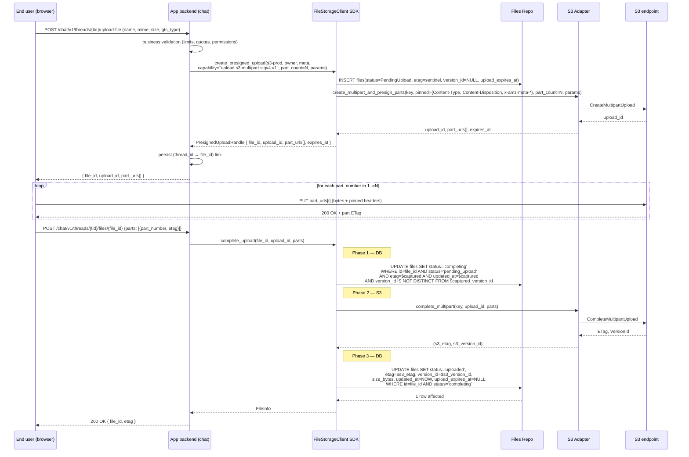
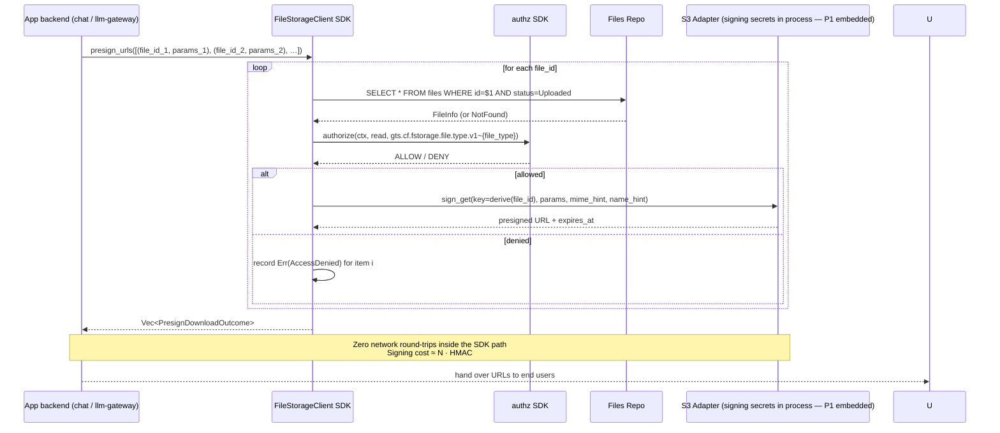
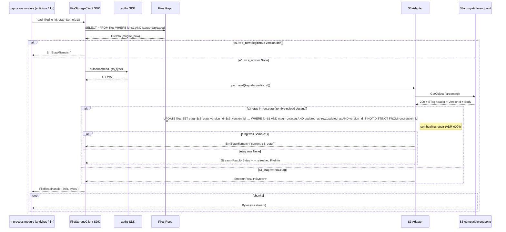

<!-- Created: 2026-04-20 by Constructor Tech -->

# Technical Design — File Storage


<!-- toc -->

- [1. Architecture Overview](#1-architecture-overview)
  - [1.1 Architectural Vision](#11-architectural-vision)
  - [1.2 Architecture Drivers](#12-architecture-drivers)
  - [1.3 Architecture Layers](#13-architecture-layers)
- [2. Principles & Constraints](#2-principles--constraints)
  - [2.1 Design Principles](#21-design-principles)
  - [2.2 Constraints](#22-constraints)
- [3. Technical Architecture](#3-technical-architecture)
  - [3.1 Domain Model](#31-domain-model)
  - [3.2 Component Model](#32-component-model)
  - [3.3 API Contracts](#33-api-contracts)
  - [3.4 Internal Dependencies](#34-internal-dependencies)
  - [3.5 External Dependencies](#35-external-dependencies)
  - [3.6 Interactions & Sequences](#36-interactions--sequences)
  - [3.7 Database schemas & tables](#37-database-schemas--tables)
  - [3.8 Deployment Topology](#38-deployment-topology)
  - [3.9 Concurrency & Race Conditions](#39-concurrency--race-conditions)
- [4. Additional context](#4-additional-context)
  - [Roadmap](#roadmap)
  - [Testing strategy](#testing-strategy)
  - [Non-applicable NFR categories](#non-applicable-nfr-categories)
- [5. Traceability](#5-traceability)

<!-- /toc -->

- [ ] `p3` - **ID**: `cpt-cf-file-storage-design-overview`
## 1. Architecture Overview

### 1.1 Architectural Vision

FileStorage is a tenant-scoped, backend-pluggable file service delivered as a single ModKit module. **In P1 the only access interface is the in-process Rust SDK** (`FileStorageClient` trait, see [`rust-traits.md`](./rust-traits.md)) — every consuming module (chat backend, llm-gateway, antivirus, file-parser, …) lives inside the same monolith process and obtains the SDK handle through ModKit's ClientHub. **A FileStorage-owned REST/HTTP surface is deferred to P2** (`cpt-cf-file-storage-fr-rest-api`); it lands when the platform splits into separately deployable modules and will mirror the SDK trait 1:1. The full P2 REST contract is published in P1 as the design target ([`openapi.yaml`](./openapi.yaml)) so the SDK shape and the future REST shape stay aligned, but nothing in `openapi.yaml` is exposed over the wire in P1.

It is the only module that owns persistent file state in P1; the future `FileShare` service (P3) — public/tenant/hierarchy shareable links, guest URLs with IP/time restrictions, view-counting proxy mode — is deliberately split off and is **not** delivered in P1.

P1 is the **first version of the API surface (SDK trait)**; future phases extend, never replace. The P2 REST surface is a transport-layer addition over the same operation vocabulary, not a redesign.

**Backend uniformity (architectural invariant, every phase).** Every FileStorage backend speaks S3 protocol over HTTP and respects presigned URLs. Concretely the supported set is any S3-class endpoint — AWS S3, MinIO, Ceph RGW, Wasabi, GCS S3-compat, or `s3s-fs` running side-by-side as the local-disk recipe. Native non-S3 transports (POSIX, WebDAV, FTP, NFS, SMB, …) are out-of-scope at the architecture level — not deferred to a later phase, but excluded by design. There is no `BackendKind` discriminator and no `BackendTransport` discriminator: each would only ever hold one value and is therefore not represented. Gateway clients for non-S3 protocols, if anyone needs them, are written as independent modules that consume FileStorage's SDK (P1) or REST API (P2) and presigned URLs as ordinary clients — they are not part of FileStorage's roadmap.

Multiple S3-compatible backend instances can coexist within one deployment; each has a stable `backend_id` (UUID) assigned once in the TOML roster, a per-backend tenant access list, and a list of versioned capability tags (P1 ships 5: `upload.s3.multipart.sigv4.v1`, `download.s3.sigv4.v1`, `download.s3.sigv4.versioned.v1`, `download.s3.public.v1`, `download.s3.public.versioned.v1`). Tags are validated against the SDK's `KNOWN_CAPABILITIES` whitelist at module init — unknown tag → fail-fast boot. Every backend shares one SQL database owned by the FileStorage module ([ADR-0001](./ADR/0001-cpt-cf-file-storage-adr-s3-no-metadata-db.md)). Rows are discriminated by `backend_id`. There is no per-backend database, no per-backend schema, and no operational deployment that runs FileStorage without the module database.

For local-disk deployments where operators do not have an S3-class infrastructure to point at, the recipe is to run **`s3s-fs` (a Rust S3-compatible filesystem-backed server, see DESIGN §4 Testing strategy) as a side-process** and register it in the TOML roster as a regular S3-compatible backend. There is no native POSIX adapter and never will be — that recipe covers the use case end-to-end at the SDK / capability layer with no architecture-level branching (and at the REST layer once P2 lands).

Externally, every file is addressed by an **opaque `file_id` (UUID)** ([ADR-0002](./ADR/0002-cpt-cf-file-storage-adr-opaque-file-ids.md)). The logical `file_path` and the display `name` are metadata fields, not URL components — changing the display name (`meta.name`) keeps the `file_id` and the persistent URL untouched. Cross-module handles (chat backend ↔ FileStorage ↔ antivirus ↔ LLM) are `(file_id, etag)` pairs, where `etag` is the raw S3 ETag (content fingerprint only).

**Identifiers are permanently immutable; files cannot be renamed.** Both `file_id` and `file_path` (the logical path inside the backend's tenant scope, also referred to as "file key" in S3 terms) are captured at `create_presigned_upload` and remain fixed for the file's lifetime. **No SDK or future-REST surface mutates either** — `FileMetaUpdate` does not declare them, no `move` / `rename` operation exists, and no other write path accepts an `update_path` argument. To change the logical address, callers upload a new file at the desired `file_path` and delete the old one. The display label `meta.name` (used for `Content-Disposition` on downloads) IS mutable through `put_file_info` — it is a label, not an identifier; "rename the displayed filename" is a metadata-only operation that does not touch the file_id, file_path, or the S3 object key.

The default — and the **only** external upload path, in every phase — is **presign-multipart-first**: the application's own backend calls `FileStorageClient.create_presigned_upload(...)` (in P1, in-process SDK; in P2, equivalently via `POST /presign-batch`) and gets back `PresignedUploadHandle { file_id, upload_id, part_urls, expires_at }` — FileStorage has registered a `PendingUpload` row and already executed `CreateMultipartUpload` against the backend. The frontend `PUT`s each part directly to its corresponding URL ([ADR-0003](./ADR/0003-cpt-cf-file-storage-adr-presigned-put-sigv4.md)) and the application's backend commits via `FileStorageClient.complete_upload(file_id, upload_id, parts)` (P1 SDK; in P2 also exposed as `POST /files/{file_id}/upload/{upload_id}`). The `complete` handler runs a 3-phase commit: Phase 1 flips `PendingUpload → Completing`, Phase 2 invokes `CompleteMultipartUpload` on the backend and captures the finalized etag/version_id, Phase 3 flips `Completing → Uploaded` with the new `(etag, version_id)`. There is **no separate reconcile primitive** — atomicity of the DB↔S3 commit lives entirely inside `complete`. `gts_file_type` is DB-only and is never written to S3. Bytes never traverse FileStorage on the external upload data plane. Even single-byte files go through the multipart lifecycle (one-part session, last-part rule lets `part_size` be arbitrarily small).

Re-uploading bytes to an existing `file_id` is a `create_presigned_upload(file_id = Some(id), ...)` call; the server pins the row's CURRENT metadata into the part URLs, starts a fresh multipart session against the same backend object key, and the same `complete_upload` SDK call (and P2 REST endpoint) finalizes it (`Uploaded → Completing → Uploaded`). Changing metadata is `put_file_info(...)` (in P1 SDK; in P2 also `PUT /files/{file_id}`): 2-phase commit DB+S3 sync via `CopyObject` self-copy with `MetadataDirective: REPLACE` (`Uploaded → MetaUpdating → Uploaded`).

Authentication and authorization are delegated to the platform's `authn`/`authz` SDKs through ModKit's `SecurityContext`. FileStorage never parses tokens. Every operation requires a `tenant_id + (user_id | app_id)` owner; there are no anonymous or system-wide files.

### 1.2 Architecture Drivers

#### Functional Drivers

| Requirement | Design Response |
|-------------|-----------------|
| `cpt-cf-file-storage-fr-upload-file` | Default flow: `create_presigned_upload` registers a `PendingUpload` row, runs `CreateMultipartUpload` against the backend, returns presigned PUT URLs (one per part). The upload is committed by `POST /files/{file_id}/upload/{upload_id}` — a 3-phase commit (`PendingUpload → Completing → Uploaded`) that runs `CompleteMultipartUpload` itself and writes the finalized etag/version_id atomically. Uniqueness of the logical address is structural: `file_path` is derived from `file_id`, so the PRIMARY KEY on `id` is sufficient — there is no separate path-level uniqueness arbitration. Re-uploading bytes always preserves `file_id` (`create_presigned_upload(file_id = Some(id))`): same `file_id`, same backend object key, fresh multipart session, same `complete_upload` finalize. |
| `cpt-cf-file-storage-fr-download-file` | `read_file` opens a streaming reader (`Stream<Item = Result<Bytes>>`) over the file content for in-process consumers. Optional `range: Option<ByteRange>` parameter requests a partial read (HTTP `Range: bytes=...` to the backend `GetObject`); `FileReadHandle.range` mirrors the backend's `Content-Range`. External callers use `presign_urls` for browser-ready URLs (SigV4-signed via `download.s3.sigv4.v1`; bare-HTTPS via `download.s3.public.v1` on backends declaring that tag) — clients add `Range` header on the GET themselves; presigned URLs do not need to encode the range. |
| `cpt-cf-file-storage-fr-delete-file` | `delete_file(file_id, etag?, version_id?)` runs a 2-phase hard delete: Phase 1 flips the row to the transient `Deleting` status (with optional `etag` / `version_id` CAS pins); Phase 2 deletes the backend object with inline retries; Phase 3 purges the row. P1 is always a hard delete — `cpt-cf-file-storage-constraint-no-soft-delete`. |
| `cpt-cf-file-storage-fr-get-metadata` | `get_file_info(file_id, optional_etag)` returns the FileStorage SQL row as the authoritative metadata view. The backend is **not** consulted on this path (per ADR-0001). |
| `cpt-cf-file-storage-fr-list-files` | `list_files` is served entirely from the FileStorage SQL database, with mandatory owner scoping. P1 exposes only the `owner_id` filter plus cursor pagination; sort order is fixed to `created_at DESC, id ASC`. Other filters (`mime_type`, `gts_file_type`, date range, `backend_id`) are deferred to P2 — see §4 Future deltas. |
| `cpt-cf-file-storage-fr-multipart-upload` | **In P1.** S3 multipart is the only upload path implemented in P1 (alternative upload tags such as `upload.gcs.resumable.v1` or `upload.azure.blocks.sas_user.v1` are reserved by the naming scheme but not implemented in any phase): `create_presigned_upload` runs `CreateMultipartUpload`, presigns N `UploadPart` URLs, returns `PresignedUploadHandle`; the client uploads parts directly to the backend; `POST /files/{file_id}/upload/{upload_id}` runs `CompleteMultipartUpload` and finalizes the row through `Completing → Uploaded`. Single-byte files use a one-part session. The `upload_id` is opaque to FileStorage (returned to the client and round-tripped back through the complete/abort REST endpoints — never persisted in the DB). |
| `cpt-cf-file-storage-fr-content-type-validation` | Direct (presigned) uploads pin `Content-Type` via SigV4 SignedHeaders; the application backend that issued the presigned URL is responsible for trusting its end-client. There is no bytes-through-FileStorage proxy upload path in any phase. |
| `cpt-cf-file-storage-fr-file-ownership` | `OwnerRef { tenant_id, owner_id }` is captured at `create_presigned_upload` and stored on the row. FileStorage does not distinguish user vs app principals — that distinction is owned by the identity / authz subsystem. Transfer is deferred to P2. |
| `cpt-cf-file-storage-fr-authorization` | Every operation calls the `authz` SDK with the file's GTS type as resource context. FileStorage never parses tokens; identity is read from `SecurityContext`. |
| `cpt-cf-file-storage-fr-tenant-boundary` | Every row carries `tenant_id`; mutations require `SecurityContext.tenant_id == row.tenant_id`. The opaque `file_id` URL space is shared across tenants, so a `file_id` from another tenant returns `404 NotFound` (no enumeration oracle) — see ADR-0002. |
| `cpt-cf-file-storage-fr-data-classification` | FileStorage treats content as opaque. |
| `cpt-cf-file-storage-fr-file-type-classification` | GTS file type is mandatory at `create_presigned_upload` (initial upload), immutable thereafter, stored on the row, and injected into every authz request. **DB-only — never mirrored to S3** (`cpt-cf-file-storage-constraint-meta-mirrored-via-put-meta`). Structurally immutable: `FileMetaUpdate` does not declare this field. |
| `cpt-cf-file-storage-fr-signed-urls` | `presign_urls` is the batch entry-point for download URLs (`cpt-cf-file-storage-principle-batch-presigned-urls`). With `capability = "download.s3.sigv4.v1"` it returns a SigV4-signed `GetObject` URL with `response-content-type` and `response-content-disposition` overridden from the DB row. With `capability = "download.s3.public.v1"` (backends declaring that tag, paired with `default_public = true`) it returns an eternal bare-HTTPS URL. |
| `cpt-cf-file-storage-fr-direct-transfer` | `create_presigned_upload` issues SigV4 PUT URLs (one per part of a multipart session). The metadata row is registered first (`PendingUpload`) on initial upload; commit is via `POST /files/{file_id}/upload/{upload_id}`. Single-byte files use a one-part session. |
| `cpt-cf-file-storage-fr-gc-direct-uploads` | The `files` table records `upload_expires_at` for `PendingUpload` rows; an external scheduler (P2) invokes a console command that sweeps expired rows. |
| `cpt-cf-file-storage-fr-metadata-storage` | System-managed fields and custom metadata both live in the FileStorage SQL row; the row is the authoritative source. For S3-compatible backends, a subset (every field except `gts_file_type`) is mirrored as S3 user-metadata, kept in sync via the 2-phase `PUT /files/{file_id}` `CopyObject self-copy` and via `complete_upload`'s HEAD-and-pull at finalize time. |
| `cpt-cf-file-storage-fr-update-metadata` | `put_file_info(file_id, FileMetaUpdate, etag?, version_id?)` replaces `name`, `mime_type`, and `custom_metadata` (omitted fields keep current values) via a 2-phase commit (`Uploaded → MetaUpdating → Uploaded`), atomically synchronizing DB and S3 with `CopyObject` self-copy + `MetadataDirective: REPLACE`. Optional `etag` and `version_id` act as composable CAS pins (the strong-CAS path verifies both against DB and S3); together they make the path ABA-safe. `gts_file_type` is structurally immutable and not declared on `FileMetaUpdate`. |
| `cpt-cf-file-storage-fr-retention-indefinite` | No TTL enforcement in P1; rows live until `delete_file`. |
| `cpt-cf-file-storage-fr-backend-abstraction` | `pub(crate) struct S3Backend` (no trait) sits behind the SDK facade and is reached through the Backend Router; it is the only adapter on the architectural roadmap (S3-only invariant). The earlier `StorageBackend` trait abstraction was removed because there is no second implementation to abstract over — local-disk deployments use `s3s-fs` registered as a regular S3-compatible backend, not a separate kind. Test fakes use `s3s-fs` running as a child process. |
| `cpt-cf-file-storage-fr-backend-capabilities` | Versioned capability tags are declared statically per backend in TOML (P1: `upload.s3.multipart.sigv4.v1`, `download.s3.sigv4.v1`, `download.s3.public.v1`). The SDK validates the list against `KNOWN_CAPABILITIES` at boot — unknown tag → fail-fast init. Presigned URL support is constitutive and is therefore not represented as a separate capability. Mismatches between declared and requested capability fail with `CapabilityUnavailable`. |
| `cpt-cf-file-storage-fr-rest-api` | **Deferred to P2.** P1 ships only the in-process Rust SDK trait `FileStorageClient` (`cpt-cf-file-storage-fr-rust-sdk`); every consumer (chat backend, llm-gateway, antivirus, file-parser, …) runs in the same monolith and obtains the SDK handle through ModKit's ClientHub. The REST surface rooted at `/api/file-storage/v1/` (7 endpoints, fully specified in [`openapi.yaml`](./openapi.yaml)) lands in P2 when modules become separately deployable; it mirrors the SDK trait 1:1. The `openapi.yaml` is published in P1 as the design target so the SDK shape and the future REST shape stay aligned. |
| `cpt-cf-file-storage-fr-rust-sdk` | The single P1 access interface — `FileStorageClient` trait, async, in-process. Every consuming module calls it directly through ClientHub. Presigned upload/download URLs returned by the SDK methods are still client-direct against the S3 backend (zero bytes through FileStorage). |
| `cpt-cf-file-storage-fr-conditional-requests` | The `etag` column on `files` is the raw S3 ETag (content fingerprint only). `put_file_info` and `delete_file` honour an optional `If-Match` for optimistic concurrency; on `put_file_info` it becomes a strong DB+S3 CAS (Phase 1 conditional UPDATE + Phase 2 HEAD with `x-amz-copy-source-if-match`). `complete_upload` does not take `If-Match` — Phase 1's transient `Completing` state plus the conditional UPDATE on `(etag, updated_at, version_id[, xmin])` already guard against concurrent finalize. |

#### NFR Allocation

| NFR ID | NFR Summary | Allocated To | Design Response | Verification Approach |
|--------|-------------|--------------|-----------------|----------------------|
| `cpt-cf-file-storage-nfr-metadata-latency` | Metadata queries ≤25 ms p95 | `cpt-cf-file-storage-component-files-repo` | Indexed SQL lookup keyed on `id` (PK) for `get_file_info`; no backend round-trip on the read path; single authz call. | Load test on `GET /files/{file_id}`; query-planner inspection on the listing index. |
| `cpt-cf-file-storage-nfr-transfer-latency` | Fixed overhead <50 ms p95 on downloads | `cpt-cf-file-storage-component-backend-router`, `cpt-cf-file-storage-component-s3-backend` | Presigned-URL path: zero data plane through FileStorage, only the signing call counts (in-memory in P1 embedded). In-process `read_file` for SDK consumers: streams chunks straight from `aws-sdk-s3 GetObject`; no full-file buffering. | Synthetic latency probe excluding payload transfer time. |
| `cpt-cf-file-storage-nfr-url-availability` | URL stability for the retention window | `cpt-cf-file-storage-component-sdk-facade`, `cpt-cf-file-storage-component-files-repo` (in P1; `component-rest-api` adds the same guarantee at the HTTP layer in P2) | Persistent identifier is `file_id` — independent of backend layout, display name, and logical path. `file_id` and `file_path` are permanently immutable (renaming files is not supported); only the display `meta.name` is mutable, which touches the metadata row alone. | Stability test: change `meta.name` via `put_file_info` and re-fetch by `file_id`. |
| `cpt-cf-file-storage-nfr-durability` | RPO = 0, RTO ≤15 min | `cpt-cf-file-storage-component-sdk-facade` (`complete_upload` method), S3-compatible adapter | `complete_upload` commits `Uploaded` only after `CompleteMultipartUpload` returns success and the row's Phase 3 conditional UPDATE lands; FileStorage uses the etag from S3's response rather than trusting any caller-supplied etag, so the row never claims durability prematurely. Durability is inherited from the S3-class endpoint (AWS S3, MinIO, Ceph RGW, …; for `s3s-fs` the underlying POSIX filesystem). | DR drill: kill the module mid-`complete_upload`, verify a `PendingUpload` / `Completing` row never observes itself as `Uploaded`. |
| `cpt-cf-file-storage-nfr-scalability` | ≥1000 concurrent ops/instance, linear horizontal scaling | All stateless components | No global locks; per-row `etag` provides optimistic concurrency. The module is stateless aside from the SQL connection pool and adapter handles. | Concurrency soak test; stateless-scaling CI check. |
| `cpt-cf-file-storage-nfr-audit-completeness` | 100% write audit coverage (P2) | Deferred — audit sink integration lives in P2 | P1 records no audit events; the REST write-path handlers (`presign-batch`, `complete_upload`, `abort_upload`, `delete`, `put_file_info`) carry documented hook points. | P2 milestone. |

#### Key ADRs

| ADR ID | Decision Summary |
|--------|------------------|
| [ADR-0001](./ADR/0001-cpt-cf-file-storage-adr-s3-no-metadata-db.md) — `cpt-cf-file-storage-adr-s3-no-metadata-db` | The `s3-compatible` adapter shares the FileStorage-owned SQL metadata index alongside S3 bytes. The DB is module-owned, not adapter-owned. |
| [ADR-0002](./ADR/0002-cpt-cf-file-storage-adr-opaque-file-ids.md) — `cpt-cf-file-storage-adr-opaque-file-ids` | External addresses use opaque `file_id` (UUID); display name and `file_path` are metadata. Decouples URLs from filenames and bucket layout, eliminates URL-encoding reconciliation issues across HTTP / S3 / SigV4. |
| [ADR-0003](./ADR/0003-cpt-cf-file-storage-adr-presigned-put-sigv4.md) — `cpt-cf-file-storage-adr-presigned-put-sigv4` | Direct-transfer uploads use presigned PUT with SigV4 header signing (universal S3 compatibility), not POST policy. The metadata row is the authoritative read source. Multipart `UploadPart` URLs follow the same SigV4 pattern. |
| [ADR-0004](./ADR/0004-cpt-cf-file-storage-adr-self-healing-reconciliation.md) — `cpt-cf-file-storage-adr-self-healing-reconciliation` | **Obsolete in this design.** Will be superseded by a new ADR (separate branch) describing the multi-phase commit model: every DB↔S3 mutation is a 3-phase commit (`Uploaded ↔ Completing/MetaUpdating/Deleting`); rows stuck in transient states are recovered in-band by the SDK on the next call (HEAD the backend, pull the authoritative state, finalize the row). There is no separate `reconcile` primitive, no bytes-through-FileStorage proxy upload path, and no separate "physical key" column. |
| [ADR-0005](./ADR/0005-cpt-cf-file-storage-adr-versioning-and-aba.md) — `cpt-cf-file-storage-adr-versioning-and-aba` | Versioning support is declared per-backend via the `*.versioned.*` capability tags (e.g. `download.s3.sigv4.versioned.v1`). The DB `version_id` column is populated from S3 response headers as-is. The strong-CAS variant of `PUT /meta` becomes ABA-safe automatically when S3 returns version IDs (null-safe `(etag, updated_at, version_id[, xmin])` predicate works in both modes). Presign-download items can request historical generations only when the chosen capability is a `*.versioned.*` variant. |

### 1.3 Architecture Layers

```mermaid
graph LR
    Client[Module via ClientHub<br/>(in-process, P1)]
    REST[REST API — axum<br/>P2 only]
    SDK[SDK Facade — FileStorageClient]
    ROUTER[Backend Router]
    REPO[Files Repo]
    S3[S3-Compatible Backend Adapter]
    S3EP[(S3-compatible endpoint<br/>AWS S3 / MinIO / Ceph / s3s-fs)]
    PG[(SQL DB<br/>file_storage schema)]

    Client --> SDK
    REST -. P2 .-> SDK
    SDK --> ROUTER
    ROUTER --> REPO
    ROUTER --> S3
    REPO --> PG
    S3 --> S3EP
```

- [ ] `p3` - **ID**: `cpt-cf-file-storage-tech-layers`

| Layer | Responsibility | Technology |
|-------|----------------|------------|
| Presentation (**P2 only**) | REST handlers, request/response shaping, ETag handling, streaming bodies; lifecycle write paths (`presign-batch`, `complete_upload`, `abort_upload`, `delete`, `put_file_info`). Not delivered in P1. | axum, `tower-http`, `bytes::Bytes` streams |
| Application (**P1 sole entry-point**) | ClientHub SDK facade — `FileStorageClient` trait, in-process, async. | ModKit runtime, `async_trait` |
| Domain | `FileInfo`, `FileMeta`, `Backend`, `OwnerRef`, `FileStatus`, `UrlParams`, `PresignedUploadHandle`, `PresignedDownload` | Pure Rust types (`uuid`, `time`, `bytes`, `serde`) |
| Infrastructure | S3 client, SQL access | `aws-sdk-s3` (or compatible), `sqlx`/`sea-orm` |

## 2. Principles & Constraints

### 2.1 Design Principles

#### File ID is the Canonical Address

- [ ] `p2` - **ID**: `cpt-cf-file-storage-principle-file-id-address`

After upload, every operation addresses the file by an opaque `file_id` (UUID) and an `etag`. `file_path` is derived deterministically from `file_id` at the adapter boundary; it is stored on the row for operability but is not the source of uniqueness — the PRIMARY KEY on `id` is. This is the design's hard-line corollary of [ADR-0002](./ADR/0002-cpt-cf-file-storage-adr-opaque-file-ids.md): URLs, cross-module handles, audit identifiers, and authz subjects all key off one stable, opaque value.

The `file_id` is minted by FileStorage on every initial `create_presigned_url` call. Re-uploading bytes to an existing file is variant B — `create_presigned_url(file_id = Some(id))`: the `file_id` is preserved, the backend object key is the same, the row's metadata is pinned by the server into the new presigned PUT, and `complete_upload` finalizes through `Uploaded → Completing → Uploaded`. There is no supersession-via-fresh-file_id flow: two different files always have different `file_id` values and therefore different backend object keys, so they cannot collide on the logical address.

#### Presign-First, Proxy as Fallback

- [ ] `p2` - **ID**: `cpt-cf-file-storage-principle-presign-first`

The default — and in every phase the **only** — external upload path is **presign-multipart-first**: the application's own backend (chat, llm-gateway, …) calls `create_presigned_upload(... capability: "upload.s3.multipart.sigv4.v1", part_count: N ...)`, hands `PresignedUploadHandle { file_id, upload_id, part_urls[], expires_at }` to its frontend, and the frontend uploads parts directly to the storage backend. FileStorage stays off the data plane on this path. Every backend speaks S3 and respects presigned URLs by definition (§1.1 backend uniformity invariant), so the path is uniformly available everywhere.

- External clients always use `create_presigned_upload` (zero bytes through FileStorage).
- In-process callers may use the SDK's `put_file` direct-adapter path, which compresses the same lifecycle into one async call without the presign roundtrip — still no bytes-through-REST.

After upload, downloads follow the symmetric rule: `presign_urls` for client-side, browser-ready URLs (redirect mode); `read_file` for in-process consumers (streaming via the adapter — used by antivirus, llm-gateway, file-parser). FileShare's "proxy mode for tracked downloads" — public links with view-counting and revocation — is a P3 concern in a separate module and is not a FileStorage feature.

#### Tenant + Owner is Always Three Components

- [ ] `p2` - **ID**: `cpt-cf-file-storage-principle-tenant-owner`

Every file row carries `tenant_id` and exactly one of `(user_id, app_id)`. There is no system-wide / tenant-less file, and there is no anonymous owner. This is the immediate consequence of being a tenant-scoped module: tenant isolation is enforced on every row, and the per-owner break-down lets P2 features (quota, retention, deletion workflows) attach to either a human user or a service / app principal without introducing a third axis.

The `OwnerRef::App` variant is what makes this principle non-trivial: autonomous modules (e.g. a scheduled report generator that produces artifacts on behalf of the tenant rather than on behalf of any one user) need to own files too. Treating "app" as a kind of owner — not as "tenant ownership with a comment" — keeps quota and authz queries uniform.

#### Backend Roster — Module-Hosted, Slug-Addressed, Tenant-Scoped

- [ ] `p2` - **ID**: `cpt-cf-file-storage-principle-modular-backend-roster`

The FileStorage module hosts a dynamic roster of S3-protocol backends (the only kind on the architectural roadmap, §1.1). Multiple instances can coexist in one deployment — five S3 buckets, an `s3s-fs` side-process for local disk — all served by the same SDK and REST API.

Three invariants govern the roster:

1. **Stable `backend_id` (UUID) per backend** — assigned once in the TOML roster and persisted on every `files` row. The UUID is the addressing handle the outside world uses; replacing it is a breaking change for every persisted URL that references it.
2. **Per-backend tenant access list** — every backend declares which tenants may use it. Empty list = "all tenants"; a non-empty list restricts visibility and mutation. Tenants may have access to several backends; a backend may serve several tenants or be tenant-exclusive.
3. **Uniform SDK** — `list_backends(ctx)` returns every backend the caller's tenant can see; all returned backends are reachable through the same `FileStorageClient` trait, and callers select one by `backend_id`. Capability flags are exposed through the declarative `Backend` record, not through specialised traits per kind.

Backends carry up to two **default roles** in P1 — `default_private` and `default_public`. `default_private` selects the backend new private files land in when a caller does not specify `backend_id` (the common case: an S3 bucket with no public-read ACL, presigned downloads only). `default_public` selects the backend new public-read files land in (a bucket / origin combination that issues bare-HTTPS URLs without signing — pairs with the `download.s3.public.v1` capability tag).

At least one backend MUST hold one default role per tenant view. The roles are flagged in the static TOML config in P1; they become per-tenant properties in P2.

Versioning support is declared per-backend through the `*.versioned.*` capability tags (`download.s3.sigv4.versioned.v1`, `download.s3.public.versioned.v1`) — there is no separate `versioning` flag. FileStorage does NOT probe `GetBucketVersioning` at boot; the operator's tag list is the source of truth for "is `version_id` exposed to consumers". The DB `version_id` column is populated from whatever S3 returns in response headers (`x-amz-version-id`), so the column self-organizes regardless of declared tags. ABA-safe content CAS on the strong-CAS variant of `PUT /meta` and historical-version GET via `presign_urls` activate automatically when S3 starts returning version IDs.

A caller that names a slug outside its access list sees `NotFound` with no signal that the slug exists for a different tenant — tenant scoping is enforced without opening an enumeration oracle.

#### Atomic Metadata-Content Coupling via DB+S3 Sync

- [ ] `p2` - **ID**: `cpt-cf-file-storage-principle-atomic-metadata`

Readers never observe content of version N with metadata of version N+1. This is upheld by two complementary mechanisms:

- **`etag` is the raw S3 ETag** (content fingerprint only — `cpt-cf-file-storage-constraint-etag-content-only`). Every content write rotates the etag because the bytes change; bit-identical re-uploads are the ABA corner case ADR-0005 addresses by also tracking `version_id` when S3 returns a `version_id`.
- **Metadata mutations are atomic across DB and S3** through `PUT /files/{file_id}` (`cpt-cf-file-storage-constraint-meta-mirrored-via-put-meta`). The endpoint runs a multi-phase commit (`Uploaded → MetaUpdating → Uploaded`). **Phase 1** flips the row's STATUS only — `name`, `mime_type`, `custom_metadata` columns still hold the OLD values. **Phase 2** issues `CopyObject` self-copy with `MetadataDirective: REPLACE` against the backend (carrying the merged new metadata), which rotates the object's user-metadata at S3 and yields a fresh `s3_etag` and `s3_version_id`. **Phase 3** flips the row back to `Uploaded` AND writes the new `(name, mime_type, custom_metadata, etag, version_id)` in one conditional UPDATE — the metadata columns and the status transition land atomically. A row stuck in `MetaUpdating` (handler crash between Phase 2 and Phase 3) is recovered in-band by the next SDK call: HEAD the backend, pull whatever metadata S3 holds, run Phase 3 with that. The DB never holds new metadata under a "still updating" status — the row is either fully old (status `MetaUpdating`, columns unchanged) or fully new (status `Uploaded` with new metadata).

The single intentional asymmetry: **`gts_file_type` lives only in the DB** and is never written to S3, even though every other meta field is mirrored. This is documented as a specific exception under `cpt-cf-file-storage-constraint-meta-mirrored-via-put-meta` and motivated in ADR-0004.

Consumers that pinned an etag earlier (e.g. the antivirus that scanned `etag = e1`) can verify the file has not changed by re-reading with `etag = Some(e1)` and getting `EtagMismatch` if the bytes changed. Metadata changes do NOT rotate the etag (etag tracks bytes only); callers that need to detect metadata drift compare the full `meta` field.

#### Multi-Phase Commits and In-Band Recovery

- [ ] `p2` - **ID**: `cpt-cf-file-storage-principle-multi-phase-commit`

Atomicity of every DB↔S3 mutation is guaranteed by **multi-phase commits**, not by post-hoc reconciliation. Three transient states correspond to the three write paths:

| Path | State machine | Phase 1 (DB) | Phase 2 (backend) | Phase 3 (DB) |
|------|---------------|--------------|-------------------|--------------|
| Upload commit (initial or re-upload) — `complete_upload` | `PendingUpload`/`Uploaded` → `Completing` → `Uploaded` | conditional UPDATE flipping status to `Completing`, capturing `(etag, updated_at, version_id[, xmin])` | `CompleteMultipartUpload` against the backend, captures finalized etag and `version_id` | conditional UPDATE flipping `Completing → Uploaded`, writing the new `(etag, version_id)` |
| Metadata update — `PUT /files/{file_id}` | `Uploaded` → `MetaUpdating` → `Uploaded` | conditional UPDATE to `MetaUpdating` (with optional `If-Match` for strong CAS) | `CopyObject` self-copy with `MetadataDirective: REPLACE` (and optional `x-amz-copy-source-if-match`), captures new etag and `version_id` | conditional UPDATE flipping `MetaUpdating → Uploaded`, writing the new `(etag, version_id, meta)` |
| Delete — `DELETE /files/{file_id}` | `Uploaded` → `Deleting` → purged | conditional UPDATE to `Deleting` (with optional `If-Match`) | backend `DeleteObject` with up to 3 inline retries | hard-DELETE the row |

**Recovery from a transient state** — when an SDK call (`read_file`, `complete_upload`, `put_file_info`, `delete_file`) encounters a row stuck in `Completing` / `MetaUpdating` / `Deleting`, it triggers in-band recovery: HEAD the backend, pull the authoritative state, finalize the row (or re-execute the pending phase) before serving the original request. **Recovery happens only on the SDK / REST handler path** — direct-to-S3 reads via presigned URLs do not have access to the row state and read whatever bytes are at the backend object regardless of the DB row's transient status. The GC sweep (P2) is the safety net for rows whose owning client crashed mid-flow and never returned.

This replaces the earlier "self-healing reconciliation" model documented in ADR-0004 — there is no longer a separate `reconcile` primitive (the multi-phase commits subsume it). ADR-0004 is marked obsolete; a successor ADR describing the multi-phase commit model lands in a separate branch.

Three properties make recovery well-defined:

1. **Bounded drift surface** — only `(content, etag, version_id, S3-mirrored metadata)` can drift. `gts_file_type` cannot drift because it is DB-only and is never written to S3.
2. **The backend is authoritative for the drifted axes** — every S3-class backend returns `ETag` (and, when the bucket has S3 versioning enabled, `VersionId`) plus the user-visible metadata mirror (`Content-Type`, `Content-Disposition`, every `x-amz-meta-<k>`) on `HeadObject` / `GetObject`. We can always learn the true state with one HEAD or as a side-effect of a GET we'd be doing anyway.
3. **Recovery is a single conditional UPDATE** — given the HEAD response, FileStorage knows exactly what every drifted column should be set to. A retry loop bounded at 3 attempts handles concurrent contention.

#### Etag-Based Optimistic Concurrency

- [ ] `p2` - **ID**: `cpt-cf-file-storage-principle-optimistic-concurrency`

FileStorage takes **no advisory locks, no row-level pessimistic locks, and no global locks** for ordinary file operations. Uniqueness of the logical address is structural: `file_path` is derived deterministically from `file_id` at the adapter boundary, so two distinct files cannot collide on the path — the PRIMARY KEY on `id` is the only uniqueness constraint required. Beyond that, all concurrency control on a single `file_id` is expressed through three composable database-level primitives plus the `(file_id, etag)` contract carried by every consumer:

1. **Race detection on UPDATE via `(etag, updated_at, version_id[, xmin])`.** Every conditional mutation captures the row's current `(etag, updated_at, version_id)` (and on Postgres, `xmin`) at SELECT time and includes them in the UPDATE WHERE clause. `version_id` is included **always** — even when it is `NULL` — through null-safe equality (`IS NOT DISTINCT FROM` on Postgres, `IS` on SQLite, or the portable `(version_id = $captured OR (version_id IS NULL AND $captured IS NULL))` form). When S3 versioning is not enabled both sides are always `NULL` and the predicate is a no-op; when S3 versioning is enabled the column rotates on every backend write (including bit-identical re-uploads where ETag stays the same), which closes the ABA window on content automatically without requiring callers to pass `If-Match`. The number of rows affected is the verdict — `1` is success, `0` is "the row moved underneath you". The coordinator may retry up to 3 times before surfacing `Conflict`. Engines without a transaction-id system column rely on `(etag, updated_at, version_id)` alone; metadata-only mutations under contention then accept the last-write-wins property documented in `cpt-cf-file-storage-constraint-no-meta-cas`.
2. **Optional `If-Match` and `If-Match-VersionId` on writes.** `PUT /files/{file_id}`, `DELETE /files/{id}`, and `GET /files/{file_id}` accept two optional CAS-pin headers — `If-Match` over the row's `etag` (HTTP `If-Match` semantics, RFC 7232 §3.1) and `If-Match-VersionId` over the row's `version_id` (custom FileStorage extension, null-safe via `IS NOT DISTINCT FROM`). The corresponding SDK methods (`put_file_info`, `delete_file`, `get_file_info`, `read_file`, `put_file`, `create_presigned_upload` variant-B) accept the same two pins as `Option<&Etag>` / `Option<&VersionId>` arguments. On `PUT /meta` `If-Match` becomes a strong CAS over S3 (HEAD-then-CopyObject with `x-amz-copy-source-if-match`); when S3 returns a `version_id` `If-Match-VersionId` adds an independent S3-side check against the live `s3_version_id`, closing the ABA window even on bit-identical re-uploads (ADR-0005). When both are omitted, the call is best-effort last-write-wins on metadata; race detection still fires via the `(etag, updated_at, version_id[, xmin])` filter on every conditional UPDATE.
3. **Status state machine.** The `status` column doubles as a coarse-grained lock — `pending_upload`, `completing`, `uploaded`, `meta_updating`, `deleting`. A mutation declares the status it expects to find via `WHERE status = …` and a row engaged in another transition rejects the new mutation by returning `0` rows. Every commit goes through `create_presigned_upload` → external part PUTs → `POST /files/{file_id}/upload/{upload_id}`; the transient states (`Completing`, `MetaUpdating`, `Deleting`) are recovered in-band on the next SDK call or by the GC sweep (P2).

Together these primitives uphold the rule:

> **Every successful read returns `(metadata, content)` from a single committed row; every successful write either updates the row cleanly or fails fast with a deterministic outcome — there is no silent overwrite of content under a stale `If-Match` (the strong-CAS path closes that race for content via S3 preconditions), no observable "old metadata, new bytes" window for callers that go through the proper API surfaces (`complete_upload`, `PUT /files/{file_id}`), and no deadlock.**

The metadata-only weakening — concurrent `PUT /meta` calls without `If-Match` are last-write-wins — is documented as `cpt-cf-file-storage-constraint-no-meta-cas`. It is a deliberate P1 trade-off: the `(etag, updated_at, version_id[, xmin])` race-detection primitive plus a 3-attempt retry loop bounds drift to a small window, and metadata-only mutations are far less common than content writes.

§3.9 walks the lifecycle step by step and shows how the primitives compose for each race the chat-backend ↔ FileStorage ↔ end-client ↔ S3 picture can produce.

This principle also explains why FileStorage exposes the `etag` argument as **optional** on every mutation that touches an existing row (`put_file_info`, `delete_file`) and **optional but recommended** on every read (`get_file_info`, `read_file`, `presign_urls`). Optional on writes because the application contract is best-effort last-write-wins on metadata, with a strong CAS escape hatch when the caller pins; optional on reads because a caller with no pinned etag is, by definition, asking for "whatever is current".

The single exception is **`complete_upload`** — it takes no `If-Match` because Phase 1's transient `Completing` state plus the conditional UPDATE on `(etag, updated_at, version_id[, xmin])` already serialise the finalize. The endpoint backs `POST /files/{file_id}/upload/{upload_id}`; in-band recovery for stuck `Completing` rows runs `HEAD` against the backend and rolls Phase 3 forward without any caller pre-condition.

#### Stream by Default, Buffer by Exception

- [ ] `p2` - **ID**: `cpt-cf-file-storage-principle-stream-by-default`

`read_file` and `put_file` use `Stream<Item = Result<Bytes>>` end-to-end — the same shape that axum, reqwest, and tonic already speak. In-process producers (the SDK `put_file` path) feed bytes straight to the adapter without intermediate buffering; the module never materialises a full file in RAM. There is no bytes-through-REST proxy upload path in any phase — external clients always ship bytes directly to the backend over a presigned URL.

Backends bypass the FileStorage data plane entirely — `create_presigned_url` and `presign_urls` issue URLs the client uses against the backend directly.

#### Batch-First Presigned URL Issuance

- [ ] `p2` - **ID**: `cpt-cf-file-storage-principle-batch-presigned-urls`

The download presign method (`presign_urls`) is batch-first — it accepts a `Vec` of requests and returns a `Vec` of per-item outcomes, even when the caller only needs one URL. The shape is chosen so the SDK stays stable across the two deployment topologies FileStorage supports:

- **P1 — embedded** — the SDK runs in-process alongside the adapter and has direct access to backend signing secrets. Each batch item is signed in memory; the batch collapses to N cheap local operations with zero network round-trips. A one-element batch is indistinguishable from a former singleton API in cost.
- **P3 — remote service** — the SDK in the caller's module has no signing secrets. It reaches the FileStorage service over the wire, and the batch collapses to a single RPC carrying every URL request. One RTT amortises every item; without batching, P3 would pay one RTT per URL.

`create_presigned_url` is intentionally **single-shot** rather than batched, because it is paired with a metadata row registration and a corresponding `sync` per file — batching would entangle authz, idempotency, and partial-failure semantics that are cleaner one-at-a-time. Per-item authorization failures inside `presign_urls` surface inside the batch outcome vector; the outer `Result` fails only for whole-batch transport errors.

### 2.2 Constraints

#### No Ambient Authentication

- [ ] `p2` - **ID**: `cpt-cf-file-storage-constraint-no-ambient-authn`

FileStorage never parses tokens or resolves identity. It consumes a `SecurityContext` produced by ModKit middleware and delegates every access decision to the `authz` SDK. This mirrors the platform convention (see `modules/simple-user-settings/simple-user-settings/src/module.rs` — `ctx.client_hub().get::<dyn AuthZResolverClient>()`).

The one exception envisioned for the future is the P3 `FileShare` module: when it issues a guest URL with IP / time / counter restrictions, **FileShare** validates the URL against its own ledger. FileStorage itself remains a pure authz consumer; FileShare's guest validation lives in FileShare.

#### Static Backend Configuration in P1

- [ ] `p2` - **ID**: `cpt-cf-file-storage-constraint-static-config-p1`

In P1 the backend roster is a static TOML section loaded at module init. Runtime configuration (`cpt-cf-file-storage-fr-runtime-backends`) and tenant-reserved backends are P2 work. This constraint keeps P1 honest: no config-change-on-the-fly, no migration paths, and no durable state in the module beyond the database and adapter handles.

#### Content is Opaque

- [ ] `p2` - **ID**: `cpt-cf-file-storage-constraint-opaque-content`

The module never introspects file content. Classification, transformation, and transcoding are out of scope (PRD §4.2) and would introduce per-backend buffering that breaks the streaming principle. There is no proxy upload path that would benefit from magic-byte MIME validation: presigned PUT pins `Content-Type` via SigV4 SignedHeaders (the application backend that issued the URL is responsible for trusting its end-client), and the in-process `put_file` SDK path trusts the caller-declared `mime_type` because the caller is the FileStorage runtime's tenant code, not an external client.

#### File ID is Generated by FileStorage Only

- [ ] `p2` - **ID**: `cpt-cf-file-storage-constraint-server-minted-file-id`

The `file_id` is minted by FileStorage at `create_presigned_url` time and at `put_file` time for the in-process SDK path. Clients cannot supply their own UUIDs. This keeps the addressing space disjoint by construction (no client-side collisions across tenants) and, combined with deterministic derivation of `file_path` from `file_id`, makes the PRIMARY KEY on `id` sufficient for logical-address uniqueness — no separate path-level index is required.

#### No Migration or Rename Between Backends

- [ ] `p2` - **ID**: `cpt-cf-file-storage-constraint-no-cross-backend-migration`

A file is bound to `(backend_id, file_id)` for life. FileStorage **does not** support migrating a file from one backend to another or moving a file's `file_path` to a different backend. The persistent `file_id` is the only stable handle; if a deployer needs to change backends, they create new files on the new backend and delete the old ones explicitly. Cross-backend migration tooling is explicitly out of scope for P1/P2/P3.

This constraint is what keeps presigned download URLs valid for their full TTL — they can never be invalidated by a "the file moved" event because there is no such event.

#### No Connectivity Validation at Boot

- [ ] `p2` - **ID**: `cpt-cf-file-storage-constraint-no-bootstrap-connectivity-check`

The module starts up without verifying that configured backends are reachable. A misconfigured S3 endpoint, expired credentials, or missing local mount surfaces only when the first request hits that backend, propagated as `BackendFailure` to the caller. This is deliberate — at-boot probing of every backend would slow startup, gate startup on third-party availability, and produce false-negatives during transient backend incidents.

Per-backend health checks and metrics are P2 work (see §4 Roadmap, "Metrics + health endpoints for backends").

#### System-Context Maintenance Operations Bypass Authz

- [ ] `p2` - **ID**: `cpt-cf-file-storage-constraint-system-context-maintenance`

The lazy in-process self-healing UPDATE on `read_file` (per ADR-0004), the future P2 GC sweep, and the future P2 reconciliation worker all run **without a `SecurityContext`** — they are privileged maintenance operations performed on behalf of the FileStorage module itself, not on behalf of any tenant or user. This is an explicit narrow exemption from `cpt-cf-file-storage-constraint-no-ambient-authn`: identity is still never inferred from ambient state, but authz is also not consulted because there is no caller principal to authorize. The eager `POST /files/{file_id}/upload/{upload_id}` endpoint runs under the caller's `SecurityContext` and authz — it is **not** a system-context operation despite touching the same UPDATE shape as the lazy trigger.

Maintenance operations are constrained to:

- Read-only inspection of backend objects (HEAD / GetObject for self-healing).
- etag-conditional UPDATEs on the `files` table that converge a row toward a backend-authoritative truth (never toward an arbitrary value).
- Best-effort backend deletion for orphaned keys that were already enqueued for delete during a normal authz-checked operation.

They do **not** include creating new rows, changing ownership, granting access, or deleting rows whose deletion was not already authorized through the normal API surface.

#### Etag is Content-Only

- [ ] `p2` - **ID**: `cpt-cf-file-storage-constraint-etag-content-only`

The `etag` column on every row is the **raw S3 ETag** (sans surrounding quotes). It tracks bytes, and only bytes — metadata mutations do NOT rotate the etag. Callers that pinned an etag earlier and want to detect metadata drift compare the full `meta` field (or the `updated_at` timestamp) — not the etag.

Rationale: the etag's job is to be the universal content fingerprint that pairs cleanly with HTTP `If-Match` semantics, S3's native `If-Match` / `x-amz-copy-source-if-match` preconditions, and the cross-module `(file_id, etag)` handles antivirus / LLM scanners pin. Adding a metadata-revision component (the previous design's `meta_revision`) would have made the field opaque to S3-side preconditions and forced a server-side recompute on every touch. The trade-off is that metadata changes are not detectable by etag comparison; we accept that in exchange for the simpler, S3-native contract.

#### Metadata Mirrored via PUT /meta

- [ ] `p2` - **ID**: `cpt-cf-file-storage-constraint-meta-mirrored-via-put-meta`

DB.meta and S3 user-metadata are kept in sync atomically through `PUT /files/{file_id}`: the server merges the update, validates the 2 KB user-metadata budget, then issues a `CopyObject` self-copy with `MetadataDirective: REPLACE` to rotate the S3 object's user-metadata in place. The S3 response carries the new ETag (and, when S3 returns a `version_id`, the new VersionId); FileStorage writes those alongside the new metadata in a single conditional UPDATE.

Other paths preserve metadata as pinned by the server: variant-B re-upload pins the row's CURRENT meta into the presigned PUT (so re-uploaded bytes carry whatever metadata the row already had); reconcile pulls metadata FROM S3 (so any drift converges to S3's truth).

**Specific exception: `gts_file_type` is DB-only and is NEVER mirrored to S3.** The presigned PUT does not sign `x-amz-meta-gts-file-type`; the `CopyObject` self-copy on `PUT /meta` does not add it; reconcile preserves the column from the DB and does not pull it from S3 even if `x-amz-meta-gts-file-type` happens to be present (FileStorage never writes it there, so this path should never fire — but the explicit guard rails out the spoof vector). Motivation: `gts_file_type` is the resource type used for authz, and routing it through the user-controllable S3 user-metadata channel would create a privilege-escalation vector. See ADR-0004.

#### No Strong CAS on Metadata-Only Mutations Without If-Match

- [ ] `p2` - **ID**: `cpt-cf-file-storage-constraint-no-meta-cas`

`PUT /files/{file_id}` without `If-Match` is best-effort last-write-wins on metadata. The application contract for concurrent metadata patches is: the LAST patch to land's UPDATE survives; race detection via `(etag, updated_at, version_id[, xmin])` plus a 3-attempt retry loop bounds the contention window.

Callers that need strong CAS pass `If-Match: <etag>`; the strong-CAS path verifies both DB.etag and (via HEAD) S3.etag (and when S3 returns a `version_id`, S3.version_id) before issuing the `CopyObject` with `x-amz-copy-source-if-match`. Mismatch at any checkpoint returns `412 etag_mismatch`.

`reconcile` is not subject to this constraint — it is the explicit reconciliation primitive, not a user-driven metadata patch.

#### Versioning-Aware CAS

- [ ] `p2` - **ID**: `cpt-cf-file-storage-constraint-versioning-aware-cas`

When S3 versioning is enabled, the row's `version_id` column mirrors S3 VersionId; the strong-CAS variant of `PUT /meta` becomes ABA-safe because the server's HEAD verifies both `s3_etag` and `s3_version_id` against the row before issuing `CopyObject`. A bit-identical re-upload would have rotated the version_id even though the etag stayed the same, so the CAS detects the missed generation.

When S3 versioning is not enabled, ABA on content is an accepted P1 risk — bit-identical re-uploads (or restore-after-overwrite patterns) can let a stale `If-Match` succeed even though an intermediate generation existed. The risk is lowest for files with non-trivial size (where bit-identical re-uploads are vanishingly unlikely outside deliberate adversaries) and highest for tiny config-shaped files. See ADR-0005.

#### Presigned Download Headers from DB

- [ ] `p2` - **ID**: `cpt-cf-file-storage-constraint-presigned-download-headers-from-db`

Every presigned download URL FileStorage issues sets `response-content-type` and `response-content-disposition` query params from the DB row's `meta.mime_type` and `meta.name` respectively (the latter as `attachment; filename="<URL-encoded name>"`). This decouples the user-visible download serving from whatever metadata happens to live on the S3 object.

Two consequences: (1) operators can change the display label (`meta.name`) and have it immediately reflected on every newly-issued URL, without re-uploading bytes — note that the `file_id` and `file_path` are permanently immutable, so this is a display-only "rename"; (2) any drift between DB.meta and S3.meta (closed by the next `PUT /files/{file_id}` recovery handler) does NOT bleed into download experience for clients receiving freshly issued URLs.

For `download.s3.public.v1` outcomes (bare HTTPS, no signing), the URL has no query params — the browser sees whatever `Content-Type` and `Content-Disposition` the S3 object has. Operators of public-read backends should ensure those headers are set correctly at upload time (FileStorage pins them via SigV4 SignedHeaders on the presigned PUT) and refrain from changing them out-of-band.

#### No Soft Delete

- [ ] `p2` - **ID**: `cpt-cf-file-storage-constraint-no-soft-delete`

P1 ships hard delete only. The `Deleting` status is a **transient operational state** during the 2-phase delete flow (Phase 1 claim → Phase 2 backend cleanup → Phase 3 row purge), not a tombstone. There is no API to "restore" a deleting row, and a row that survives in `Deleting` due to persistent backend failure is not a recovery surface — it is an operational anomaly that the P2 GC sweep retries until the backend cleanup completes.

Callers needing soft-delete semantics (recoverable trash bins, retention windows) build them on top of FileStorage at the application layer. File versioning (a P3 candidate via the `cpt-cf-file-storage-fr-file-versioning` requirement) will introduce per-version retention but remains separate from the P1 hard-delete contract.

#### Metadata Changes Only via PUT /meta

- [ ] `p2` - **ID**: `cpt-cf-file-storage-constraint-meta-via-put-meta-only`

DB.meta is updated only through `PUT /files/{file_id}` (and through `reconcile`'s pull from S3 — but only when S3 itself has been updated through one of the legitimate paths). Other paths must NOT carry metadata payloads:

- `presign-batch` upload items with `file_id` (variant-B re-upload) **reject** the `meta` field with `400 bad_request`. The server pins the row's CURRENT metadata into the presigned PUT.
- `presign-batch` upload items without `file_id` (initial upload) accept `meta` because they are creating a new row.
- `reconcile` pulls metadata from S3 — it does not accept caller-provided metadata.

This constraint exists to keep DB+S3 sync centralized: every meta change goes through one code path (`PUT /meta`'s `CopyObject` self-copy), which keeps the invariants enforceable in one place.

## 3. Technical Architecture

### 3.1 Domain Model

**Technology**: Rust structs/enums (`uuid::Uuid`, `time::OffsetDateTime`, `bytes::Bytes`, `serde`), `#[domain_model]` per the platform DDD pattern observed in `simple-user-settings-sdk/src/models.rs`.

**Location**: `file-storage-sdk/src/models.rs` (planned; full signature set in [rust-traits.md](./rust-traits.md)).

**Core Entities**:

| Entity | Description | Schema |
|--------|-------------|--------|
| `FileInfo` | Authoritative file view returned by every read and mutation: `file_id`, `backend_id`, `file_path`, `owner`, `meta`, `status`, `etag` (raw S3 ETag), `version_id` (raw S3 VersionId or `None`), `size_bytes`, timestamps, `upload_expires_at`. | [rust-traits.md](./rust-traits.md) |
| `FileMeta` / `FileMetaUpdate` | `FileMeta` is the caller-provided metadata: `name`, `mime_type`, `gts_file_type`, `size_bytes` (optional), `custom_metadata`. `FileMetaUpdate` is the body for `PUT /files/{file_id}`; `Some(v)` replaces, `None` keeps. **`FileMetaUpdate` does NOT declare `gts_file_type`** — it is structurally immutable. | [rust-traits.md](./rust-traits.md) |
| `OwnerRef` | `{ tenant_id, owner_id }`. The `owner_id` is the principal's UUID; FileStorage does not distinguish user vs app — that distinction is owned by the identity / authz subsystem. Immutable after creation (transfer → P2). | [rust-traits.md](./rust-traits.md) |
| `Backend` | Roster entry: `id` (UUID), `default_private`, `default_public`, `capabilities` (versioned `<operation>.<protocol>.<algorithm>.<variant>?.v<n>` tags — P1 ships 5: `upload.s3.multipart.sigv4.v1`, `download.s3.sigv4.v1`, `download.s3.sigv4.versioned.v1`, `download.s3.public.v1`, `download.s3.public.versioned.v1`), `max_file_size_bytes` (optional, defaults to S3 5 TiB cap), `max_metadata_bytes` (optional, defaults to S3 2 KiB user-metadata budget), `max_presign_ttl_seconds` (optional, defaults to AWS SigV4 7-day cap). Versioning support is declared via the `*.versioned.*` capability tags rather than a separate flag. Presigned URL support is constitutive (not a capability); kind/transport are not represented (only one possible value, by architectural decision). Tags are validated at module init against the SDK's `KNOWN_CAPABILITIES` whitelist — unknown tag → fail-fast boot. | [rust-traits.md](./rust-traits.md) |
| `FileStatus` | `PendingUpload` → `Uploaded` → `Deleting`. | [rust-traits.md](./rust-traits.md) |
| `PresignedUploadHandle` | Output of `create_presigned_upload` (both initial-upload and variant-B re-upload via `file_id = Some(id)`): `file_id`, `upload_id` (opaque, round-trips through the caller — not persisted in FileStorage DB), `part_urls[]` (one presigned PUT URL per part), `expires_at`. | [rust-traits.md](./rust-traits.md) |
| `PresignedDownload` | Output of `presign_urls`: `url`, `expires_at`, `is_public`. `is_public = true` for bare-HTTPS URLs from public-read backends; `expires_at` is then a far-future sentinel. | [rust-traits.md](./rust-traits.md) |
| `PresignDownloadItem` | Input to `presign_urls`: `file_id`, `params`, `etag` (optional, fail-fast), `version_id` (optional historical generation, only honoured when the chosen capability is a `*.versioned.*` variant). | [rust-traits.md](./rust-traits.md) |
| `UrlParams` | Knobs applied to a presigned URL: `expires_in_seconds`, `content_disposition`, `content_type_override`, `allowed_client_cidrs`. | [rust-traits.md](./rust-traits.md) |
| `ByteRange` / `ResolvedByteRange` | Byte-range selector for partial `read_file` calls (constitutive S3 feature, no capability tag). `ByteRange` enum: `Inclusive { start, end }`, `From(start)`, `Suffix(n)` — maps 1:1 to HTTP `Range: bytes=...`. `ResolvedByteRange { start, end_inclusive, total }` mirrors the backend's `Content-Range` response and is exposed on `FileReadHandle.range` whenever a range was requested. `FileReadHandle.info` continues to reflect the FULL object metadata; `bytes` carries only the requested diapason. | [rust-traits.md](./rust-traits.md) |

**Relationships**:

- `FileInfo` ↔ `FileMeta`: 1:1, embedded.
- `FileInfo` ↔ `Backend`: N:1 via `backend_id`.
- `FileInfo` ↔ `OwnerRef`: N:1.

### 3.2 Component Model

#### Backend kinds and multiplicity

FileStorage is a single module that hosts many S3-protocol backends. The number of instances is bounded only by configuration. All instances share the FileStorage SDK (and the P2 REST API once it ships) and metadata database (see §3.7). Native non-S3 backend kinds are out-of-scope at the architecture level (§1.1 backend uniformity invariant) — there is no `BackendKind` discriminator, no `BackendTransport` discriminator, and no plan to introduce either.

| Bytes live on | Capabilities |
|---------------|--------------|
| External S3-class endpoint (AWS S3, MinIO, Ceph RGW, Wasabi, GCS S3-compat, or `s3s-fs` running side-by-side as the local-disk recipe; also reachable via S3-compat gateways for WebDAV / FTP / custom non-S3 backends) | Versioned `<operation>.<descriptor>+.v<n>` tags (P1 ships three: `upload.s3.multipart.sigv4.v1`, `download.s3.sigv4.v1`, `download.s3.public.v1`) |

A deployment registers one or more S3-compatible instances (any mix of AWS S3, MinIO, Ceph RGW, Wasabi, GCS S3-compat, and `s3s-fs` side-process for local disks). There is no upper bound encoded in code; practical limits are driven by configuration, credential management, and resource budgets. The roster invariants — stable `backend_id` (UUID), per-backend tenant access list, per-backend capability list (versioning exposed via `*.versioned.*` tags), uniform SDK access — are enforced by the Backend Router (see below) and are documented as a principle in §2.1 (`cpt-cf-file-storage-principle-modular-backend-roster`). There is no native `local` POSIX adapter — every local-disk deployment runs `s3s-fs` and is registered as a regular S3-compatible backend.

##### Capability surface (versioned tags)

Each backend declares a list of versioned **capability tags** in TOML — flat strings of the form `<operation>.<protocol>.<algorithm>.<variant>?.v<n>` (regex `^[a-z][a-z0-9_]+(\.[a-z][a-z0-9_]+){2,4}\.v\d+$`). The leading segment is the SDK operation (`upload` / `download`); the next is the protocol family (e.g. `s3`, `gcs`, `azure`); the next is the signing/auth flavor (`sigv4`, `sigv4a`, `sas_user`, `multipart`, `public` for anonymous bare-HTTPS, …); the optional fourth descriptor is a variant modifier (currently the only one is `versioned`, marking that the tag accepts a `version_id` selector); the trailing segment is the contract version (`v1`, `v2`, …). Presigned URL support is constitutive (a backend that cannot sign URLs is not a backend by definition) and is therefore **not** represented as a separate capability — every signed tag implies its named signing algorithm; `public` denotes the deliberate absence of a signature (anonymous bare-HTTPS, paired with public-read bucket policy).

**Boot-time validation is the sole correctness mechanism.** The SDK ships with `const KNOWN_CAPABILITIES: &[&str] = &[ ... ]`. At module init, every tag in every `Backend.capabilities` is checked against the whitelist; unknown tags fail-fast initialization with `unknown capability "{tag}" on backend {id}`. Runtime code never has to handle "unknown tag" — the impossibility is enforced at boot. New signing strategies or new wire protocols ship as a new entry in `KNOWN_CAPABILITIES` and a new branch in the adapter's `match` — no enum migration, no breaking schema change.

**P1 whitelist (5 tags) — these cover every supported backend in P1, including non-S3 endpoints exposed through S3-compat gateways (WebDAV, FTP, custom storage):**

- `upload.s3.multipart.sigv4.v1` — **the only upload path implemented in P1.** Recommended for any backend that speaks S3 protocol natively (AWS S3, MinIO, Ceph, Wasabi, GCS S3-compat, `s3s-fs`) or via an S3-compat gateway in front of a non-S3 storage (WebDAV, FTP, custom backends). Alternative upload tags (e.g. `upload.gcs.resumable.v1`, `upload.azure.blocks.sas_user.v1`) are reserved by the naming scheme but not implemented in any phase. `create_presigned_upload` runs `CreateMultipartUpload` against the backend, captures the backend's `upload_id`, and presigns N `UploadPart` PUT URLs in one round trip via SigV4. Result: `PresignedUploadHandle { file_id, upload_id, part_urls[], expires_at }`. **`upload_id` is NOT persisted by FileStorage** — the caller MUST keep it for the companion `complete_upload` (3-phase commit; in P2 also `POST /files/{file_id}/upload/{upload_id}`) and `abort_upload` (in P2 also `DELETE /files/{file_id}/upload/{upload_id}`, aborts one session, does NOT delete the row). Single-byte files use a one-part session (last-part rule lets `part_size` be arbitrarily small). Refers specifically to the chunked S3 multipart-upload protocol (`CreateMultipartUpload` + `UploadPart` + `CompleteMultipartUpload`), **not** to the unrelated `multipart/form-data` POST Policy upload (intentionally not supported, see ADR-0003).
- `download.s3.sigv4.v1` — SigV4-signed GET for time-limited private downloads (TTL + optional CIDR allowlist). Rejects `version_id` parameter on `presign_urls` items (use the `versioned` variant for that). Result: `PresignedDownload` (`is_public = false`).
- `download.s3.sigv4.versioned.v1` — version-aware SigV4-signed GET. Identical to `download.s3.sigv4.v1` except it accepts an optional `version_id` on `PresignDownloadItem` and embeds `versionId=<vid>` into the signed URL so the resolved bytes correspond to that historical S3 generation. When `version_id` is omitted, returns the current-version URL (effectively a strict superset of the basic tag). Declared on backends fronting versioning-enabled buckets that wish to expose history to consumers; declaring it implies the bucket has S3 versioning on. Result: `PresignedDownload` (`is_public = false`).
- `download.s3.public.v1` — bare-HTTPS public-read URL with no signature and no expiry; `public` in the algorithm slot denotes the deliberate absence of a signing algorithm. Pairs with `Backend.default_public`; the URL is reusable across viewers and is intended for buckets with public-read ACL or an origin behind a CDN. Rejects `version_id` parameter (use the `versioned` variant). Result: `PresignedDownload` (`is_public = true`).
- `download.s3.public.versioned.v1` — version-aware bare-HTTPS public-read URL. Identical to `download.s3.public.v1` except it accepts `version_id` and emits the URL as `https://<host>/<key>?versionId=<vid>` (no signature, no expiry). Requires the bucket policy to grant `s3:GetObjectVersion` to the anonymous principal in addition to `s3:GetObject` — without it, anonymous requests with `?versionId=` return 403. Operators who declare this tag confirm both bucket-versioning is on AND the anonymous policy grants `s3:GetObjectVersion`. Result: `PresignedDownload` (`is_public = true`).

No P2 or P3 additions are planned for the capability whitelist — the five P1 tags already cover every supported transport. Cloud-native upload protocols are illustrative examples of how the whitelist would extend if a non-S3 adapter were ever added; **none are planned for any phase** and are listed only to demonstrate the naming scheme:

- `upload.gcs.resumable.v1` *(example only, not implemented)* — would correspond to the GCS native resumable-upload session (single session URL, sequential `Content-Range` PUTs, no per-chunk ETag). Currently GCS is supported through its S3-compat XML API and uses `upload.s3.multipart.sigv4.v1` like every other S3-class backend.
- `upload.azure.blocks.sas_user.v1` *(example only, not implemented)* — would correspond to Azure Block Blob (`PutBlock` + `PutBlockList`) with a User-Delegation SAS. Currently Azure is reachable only through an S3-compat gateway in front of Blob Storage.

These tags can be added at any time (P1 / P2 / P3) by appending to `KNOWN_CAPABILITIES` and adding the corresponding adapter branch — schema-compatible, no migration.

**Versioning is declared per backend through the `*.versioned.*` tags, not through a separate flag.** There is no `Backend.versioning: bool` field. The DB `version_id` column is populated from S3 response headers as-is (`x-amz-version-id` on `CompleteMultipartUpload` / `HeadObject` / `CopyObject`) — its presence/absence reflects what S3 actually returned, not what was declared. The `(etag, updated_at, version_id[, xmin])` race-detection predicate is null-safe and works in both modes automatically. Capability dispatch on `presign_urls` validates whether the chosen tag accepts `version_id`: declaring `download.s3.sigv4.versioned.v1` or `download.s3.public.versioned.v1` is the source of truth for "this backend exposes historical versions to consumers". See ADR-0005.

**Operator runbook for multipart:** the bucket / endpoint hosting an S3-compatible backend MUST configure an `AbortIncompleteMultipartUpload` lifecycle rule (e.g. abort uploads older than 7 days). FileStorage does not persist `upload_id`, so it cannot reap abandoned multipart sessions itself — abandoned sessions are eventually reaped by the bucket lifecycle.

There is no `PresignedConditionalPut` capability in P1. Conditional preconditions on the upload presign path (`If-Match` / `If-None-Match: *` pinned via SigV4 SignedHeaders) are deferred — the S3-compat ecosystem is fragmented on conditional-PUT semantics (GCS S3-compat silently ignores the headers, several appliances are inconsistent across versions), and self-healing reconciliation (ADR-0004) provides P1 correctness without them. Note that `PUT /files/{file_id}`'s strong-CAS path DOES use a backend-side precondition (`x-amz-copy-source-if-match` on `CopyObject`); that header is universally honoured by S3 servers for `CopyObject` and does not require a separate capability tag.

```mermaid
graph TD
    subgraph External
      UI[Platform UI / External clients<br/>(P2 only — they reach FileStorage<br/>through their application backend in P1)]
      MOD[CyberFabric modules via ClientHub<br/>(P1 — in-process)]
    end
    REST[cpt-cf-file-storage-component-rest-api<br/>REST API<br/>P2 only]
    SDK[cpt-cf-file-storage-component-sdk-facade<br/>SDK Facade<br/>P1 sole entry-point]
    ROUTER[cpt-cf-file-storage-component-backend-router<br/>Backend Router]
    REPO[cpt-cf-file-storage-component-files-repo<br/>Files Repo]
    S3A[cpt-cf-file-storage-component-s3-backend<br/>S3 Backend Adapter]
    S3[(S3-compatible endpoint<br/>AWS S3 / MinIO / Ceph / s3s-fs)]
    PG[(SQL DB)]
    AUTHZ[authz SDK]

    UI -. HTTPS, P2 .-> REST
    MOD -->|in-process| SDK
    REST -. P2 .-> ROUTER
    SDK --> ROUTER
    ROUTER --> REPO
    ROUTER --> S3A
    REPO --> PG
    S3A --> S3
    REST -. authz, P2 .-> AUTHZ
    SDK -.authz.-> AUTHZ
```

#### REST API (P2 — not delivered in P1)

- [ ] `p2` - **ID**: `cpt-cf-file-storage-component-rest-api`

##### Why this component exists

**Not in P1.** P1 ships only the in-process Rust SDK trait `FileStorageClient` — every consumer (chat backend, llm-gateway, antivirus, file-parser, …) lives in the same monolith and obtains the SDK handle through ClientHub. No HTTP surface is published in P1.

In **P2**, when the platform splits into separately deployable modules, this component lights up: external traffic (platform UI, application backends posting to FileStorage from outside the monolith, browser-direct flows) needs a stable HTTP surface independent of ClientHub. The full P2 contract is specified in [`openapi.yaml`](./openapi.yaml) (published in P1 as the design target so the SDK shape and the future REST shape stay aligned). Streaming `read_file` continues to be SDK-only — external HTTP callers in P2 obtain a presigned GET URL via `POST /presign-batch` and fetch from the backend directly.

##### Responsibility scope

Route HTTP verbs to the SDK facade; validate path/query parameters; translate `FileStorageError` into RFC 7807 `ProblemDetails`; manage `ETag` / `If-Match` / `If-None-Match` headers; propagate `SecurityContext` from ModKit middleware; expose streaming endpoints with axum's `Body` / `bytes::Bytes` shape.

##### Responsibility boundaries

Does NOT parse auth tokens; does NOT persist state; does NOT make authz decisions itself; does NOT negotiate backends — it delegates every decision to the SDK facade / backend router.

##### Related components (by ID)

- `cpt-cf-file-storage-component-sdk-facade` — every REST handler is a thin adapter over a SDK method
- `cpt-cf-file-storage-component-backend-router` — for `list_backends`

#### SDK Facade

- [ ] `p2` - **ID**: `cpt-cf-file-storage-component-sdk-facade`

##### Why this component exists

In-process consumers (`chat-engine`, `llm-gateway`, future `file-parser`) need a low-latency API without the HTTP round-trip. The facade is the canonical ClientHub trait consumers bind to (`dyn FileStorageClient`).

##### Responsibility scope

Present an `async_trait` mirroring the lifecycle described in [rust-traits.md](./rust-traits.md); accept `&SecurityContext` first; orchestrate authz (resource = `gts.cf.fstorage.file.type.v1~{file_type}`) plus the underlying call to the coordinator / repo / adapter; convert internal errors into `FileStorageError`.

##### Presigned URL issuance modes

The SDK facade supports two deployment topologies for presigned-URL issuance, governed by whether the caller's process holds backend signing secrets:

- **P1 — embedded** — FileStorage runs in the same process as the caller. The SDK facade has direct access to the S3 adapter and its signing secrets; `create_presigned_url` and `presign_urls` sign in memory, with zero network I/O. Suitable for the monolith deployment described in §3.8.
- **P3 — remote service** — FileStorage runs as a standalone service; the SDK facade in the caller is an RPC stub with no secrets of its own. `presign_urls` packs the whole batch into one RPC; `create_presigned_url` is one RPC per call. The FileStorage service performs authz + signing on behalf of the caller.

In both modes the same `FileStorageClient` trait is used by consumers; the facade implementation is swapped at wiring time.

##### Responsibility boundaries

Does NOT expose infrastructure types (no axum, no raw S3 client) to consumers; does NOT duplicate REST path parsing — it accepts parsed arguments directly; does NOT promise singleton semantics for download presigning — `presign_urls` is batch by API.

##### Related components (by ID)

- `cpt-cf-file-storage-component-backend-router`
- `cpt-cf-file-storage-component-files-repo`

#### Backend Router

- [ ] `p2` - **ID**: `cpt-cf-file-storage-component-backend-router`

##### Why this component exists

The SDK surface (and the P2 REST surface, when it lands) needs a single place that resolves `backend_id → adapter`, enforces tenant access, applies per-backend size limits, and emits `CapabilityUnavailable` errors consistently.

##### Responsibility scope

Hold the immutable backend registry built from TOML at init; **validate every declared capability tag against `KNOWN_CAPABILITIES` and fail-fast on unknown tags** (capability boot-validation principle); expose `resolve(ctx, backend_id) -> Arc<S3Backend>` with tenant-scoping enforcement (returns `NotFound` when the caller's tenant is not on the backend's access list — see §2.1 `cpt-cf-file-storage-principle-modular-backend-roster`); serve `list_backends(ctx)` filtered by the caller's tenant access; enforce `backend_id` uniqueness across the roster at registry load; check `requires_capability(tag)` (storage declared the tag → `Ok(())`; otherwise `CapabilityUnavailable`); look up per-backend configuration (`max_file_size_bytes`, `max_metadata_bytes`, `max_presign_ttl_seconds` — all optional, defaulting to the S3 5 TiB object cap, 2 KiB user-metadata budget, and AWS SigV4 7-day signing cap respectively; tenant access list; `default_private` flag).

##### Responsibility boundaries

Does NOT know about specific backend protocols (S3 headers, SQL queries) — those live in the adapters; does NOT persist any state of its own; does NOT perform authz on the file (that is the SDK facade path) — only the coarser "is this tenant allowed to see this backend at all" check implied by the access list.

##### Related components (by ID)

- `cpt-cf-file-storage-component-s3-backend`

#### Lifecycle write paths (REST handlers and SDK facade)

There is no separate "Upload Coordinator" component. The lifecycle write paths — `PendingUpload → Uploaded` transitions, etag pinning, conditional UPDATEs, 2-phase delete — live directly inside the relevant entry-points and share the underlying SQL primitives via the Files Repo and the S3 adapter via the Backend Router.

The participating entry-points and their per-call flow:

- **`POST /presign-batch` with `kind: "upload"`, no `file_id`** — initial upload via presigned PUT. INSERT row with `status = PendingUpload`, sentinel `etag`, `upload_expires_at`; ask the adapter for a presigned PUT with `Content-Type` / `Content-Disposition` / `x-amz-meta-<k>` pinned (NOT `x-amz-meta-gts-file-type`).
- **`POST /presign-batch` with `kind: "upload"`, with `file_id`** — variant-B re-upload via presigned PUT. SELECT row, pin its CURRENT meta into a fresh presigned PUT, MAX-merge `upload_expires_at`.
- **`POST /files/{file_id}/upload/{upload_id}`** — commit. HEAD the backend for the authoritative `(s3_etag, s3_version_id, content_type, content_disposition, content_length, x-amz-meta-*)`, run a conditional UPDATE that flips `pending_upload → uploaded` (or drift-resyncs an `uploaded` row in place) and pulls all S3-mirrored metadata fields except `gts_file_type`.
- **SDK `put_file` (in-process, no presign roundtrip)** — same `PendingUpload` row insert; the SDK drives the same `S3Backend` adapter as the presigned path (`create_multipart_and_presign_parts` + per-part `UploadPart` + `complete_multipart`), so even small payloads use a 1-part multipart session — there is no single-shot `PutObject` shortcut. The 3-phase commit (`pending_upload → completing → uploaded`) lives inside the SDK call. On any error between INSERT and the final UPDATE, the SDK best-effort calls `abort_multipart` and runs `DELETE FROM files WHERE id = $file_id AND status = 'pending_upload'` so the call leaves no `PendingUpload` row behind, and lets the P2 GC inverse sweep reclaim any orphan backend object.
- **`PUT /files/{file_id}`** — merge update against current row, validate 2 KB user-metadata budget, optionally HEAD S3 for strong CAS (when `If-Match` supplied), `CopyObject` self-copy with `MetadataDirective: REPLACE` (and optional `x-amz-copy-source-if-match`), conditional UPDATE on the row writing the new `(etag, version_id, meta)`.
- **`DELETE /files/{file_id}`** — 2-phase flow: Phase 1 conditional UPDATE to `Deleting` (with optional `If-Match`), Phase 2 backend DELETE with inline retries, Phase 3 hard-DELETE the row.

These paths share documented hook points for P2 audit / events emission. They do NOT orchestrate authorization (the SDK facade does), do NOT make backend-protocol-specific calls directly (delegate to adapters via the Backend Router), and do NOT run GC (that is a P2 external scheduled command — see §4 Roadmap).

#### Files Repo

- [ ] `p2` - **ID**: `cpt-cf-file-storage-component-files-repo`

##### Why this component exists

Every component that touches metadata — the SDK facade for reads, REST handlers for writes, future P2 workers (audit, GC, quota) — needs a single typed interface to the `file_storage.files` table. Centralising this avoids ad-hoc SQL leaking into the SDK facade, REST handlers, and the adapters.

##### Responsibility scope

CRUD on the `file_storage.files` table; cursor-paginated `list_files`; etag-conditional updates (`UPDATE … WHERE id = $1 AND etag = $2`); status transitions.

##### Responsibility boundaries

Does NOT touch backend bytes; does NOT call authz; does NOT enforce backend capabilities — those live in the router / REST handlers / facade.

##### Related components (by ID)

- `cpt-cf-file-storage-component-rest-api`
- `cpt-cf-file-storage-component-sdk-facade`

#### S3-Compatible Backend Adapter

- [ ] `p2` - **ID**: `cpt-cf-file-storage-component-s3-backend`

##### Why this component exists

Native S3-class backends (AWS S3, MinIO, Ceph RGW, Wasabi) already guarantee object durability and offer presigned URLs. The adapter is implemented as a concrete `pub(crate) struct S3Backend` (no trait — there is only one backend kind on the architectural roadmap; see §1.1 backend uniformity invariant); it confines all S3-specific types (`aws-sdk-s3` clients, ByteStream, request IDs) to one module so the rest of the codebase sees only `bytes::Bytes` and `Result<…, FileStorageError>`.

##### Responsibility scope

`CreateMultipartUpload` / `UploadPart` (via presigned URL) / `CompleteMultipartUpload` / `AbortMultipartUpload` (the upload path implemented in P1; alternative upload tags from the naming scheme are reserved but not implemented), `GetObject` (with optional HTTP `Range: bytes=...` header on `read_file` partial reads — constitutive S3 feature, no capability tag) / `HeadObject` / `DeleteObject` / `CopyObject` (self-copy with `MetadataDirective: REPLACE`) on the bucket configured for this backend, keyed by `file_id` (per ADR-0002); generate presigned URLs for upload (per `UploadPart`) and download via SigV4 PUT / GET (per ADR-0003); for backends declaring the `download.s3.public.v1` capability tag, generate bare-HTTPS download URLs without signing; translate backend errors into `FileStorageError` (including `416 Range Not Satisfiable` → `BadRequest`). **No single-shot `PutObject` path** — small in-process uploads use a 1-part multipart session (last-part rule). The adapter pins user-visible metadata into the S3 object via SigV4 SignedHeaders on every part PUT (`Content-Type`, `Content-Disposition`, every `x-amz-meta-<k>`) and via `MetadataDirective: REPLACE` on every `CopyObject` self-copy. The adapter never writes `x-amz-meta-gts-file-type` — that field is DB-only.

##### Presigned URL issuance modes

The adapter's presigned-URL methods are batch-first on the GET side (`issue_presigned_gets`) and single-shot on the PUT side (`issue_presigned_put`), because the cost profile of issuance depends on where the signing secrets live:

- **P1 — embedded** — the adapter runs in the same process as the SDK facade. Signing secrets are held in adapter memory; signing a URL is a pure CPU+HMAC operation with no I/O. A batch of N items is N signings, all local.
- **P3 — remote service** — the adapter runs inside a standalone FileStorage service process. The caller's SDK has no secrets and reaches the adapter over the wire. The batch-first GET API turns "N network calls for N URLs" into "1 network call for N URLs".

`issue_presigned_put` is single-shot because it is paired with a metadata row registration in the coordinator — there is exactly one PUT URL per `create_presigned_url` call, so batching would not amortise anything in P3.

##### Responsibility boundaries

Does NOT consult the SQL index for reads (the FileStorage core does that); does NOT emit events (P2); does NOT validate magic bytes (no proxy upload path exists in any phase); does NOT use POST-policy uploads (per ADR-0003); does NOT see `gts_file_type` (that field never crosses the adapter boundary).

##### Related components (by ID)

- `cpt-cf-file-storage-component-backend-router`

#### Local-disk recipe (`s3s-fs` side-process)

FileStorage has **no** native POSIX `local` backend adapter and never will — that is the §1.1 backend uniformity invariant applied to local disks. Operators that need local-disk storage run **`s3s-fs`** (an Apache-2.0 Rust S3-compatible filesystem-backed server, see §4 Testing strategy) as a side-process and register it in the static TOML roster as a regular S3-compatible backend. From the FileStorage code path this is indistinguishable from any other S3-compatible endpoint — same SigV4 signing, same presigned URLs, same capability declarations. The recipe is documented in `feature-testkit-and-local-storage-recipe` and is the same fixture used by the e2e test suite.

### 3.3 API Contracts

**P1 — in-process Rust SDK trait** (`cpt-cf-file-storage-fr-rust-sdk`).

- **Technology**: Rust `async_trait` over ClientHub
- **Location**: [rust-traits.md](./rust-traits.md) — full signatures
- **Contracts**: `cpt-cf-file-storage-contract-cf-modules`, `cpt-cf-file-storage-contract-authz`

The SDK trait `FileStorageClient` is the **only** access surface in P1. Every consuming module (chat backend, llm-gateway, antivirus, file-parser, …) calls it directly through ClientHub. Methods: `list_backends`, `list_files`, `get_file_info`, `put_file_info`, `delete_file`, `create_presigned_upload`, `complete_upload`, `abort_upload`, `presign_urls`, `read_file`, `put_file`.

**P2 — REST API mirror** (`cpt-cf-file-storage-fr-rest-api`, `cpt-cf-file-storage-interface-rest-api-v1`).

- [ ] `p2` - **ID**: `cpt-cf-file-storage-interface-rest-api-v1`

- **Technology**: REST / OpenAPI 3.1.0
- **Location**: [openapi.yaml](./openapi.yaml)
- **Status**: Published in P1 as the design target; **not exposed over the wire in P1**. Activated when modules become separately deployable (P2).

The P2 REST surface mirrors the SDK trait 1:1 — same operations, same `(file_id, etag, version_id)` pin model, same error vocabulary. `openapi.yaml` is kept in lock-step with `rust-traits.md` so the SDK shape and the future REST shape stay aligned.

**Endpoints Overview** (full schemas in `openapi.yaml`, **P2 only**) — 7 routes total:

| Method | Path | Description | Stability |
|--------|------|-------------|-----------|
| `GET` | `/storages` | List backends visible to the caller's tenant. | unstable |
| `GET` | `/files` | `list_files` — paginated owner-scoped listing. P1 query parameters: `owner_id?`, `cursor?`, `limit?`. Sort fixed to `created_at DESC, id ASC`. | unstable |
| `GET` | `/files/{file_id}` | `get_file_info` — authoritative metadata view (no bytes). Supports `If-None-Match` → `304 Not Modified`. | unstable |
| `PUT` | `/files/{file_id}` | `put_file_info` — atomic DB+S3 metadata sync via `CopyObject` self-copy with `MetadataDirective: REPLACE`. Body declares `name`, `mime_type`, `custom_metadata` only — `gts_file_type` is structurally immutable. `If-Match` is **optional**; when supplied it becomes a strong CAS over both stores. | unstable |
| `POST` | `/files/{file_id}/upload/{upload_id}` | Explicit HEAD-and-pull reconciliation primitive. **Rejects `If-Match` with 400** (the endpoint always reads S3 first, then writes the row; safe under concurrent writers by construction). Empty body. Response: `ReconcileResponse { info, s3_etag, s3_version_id }`. | unstable |
| `DELETE` | `/files/{file_id}` | `delete_file` — 2-phase hard delete. `If-Match` is **optional**. | unstable |
| `POST` | `/presign-batch` | Batch upload+download presign with `kind: "upload" \| "download"` discriminator per item. Upload items without `file_id` create new rows (initial upload); upload items with `file_id` are variant-B re-uploads and **reject the `meta` field** (server pins current row meta). Used by `create_presigned_url` (both modes) and `presign_urls`. | unstable |

Notes:
- Authentication is handled by ModKit middleware; endpoints declare `bearerAuth` for tooling purposes.
- Endpoints that require a backend capability return `409 CapabilityUnavailable` when the capability is missing.
- The `If-Match` header carries the `etag` for conditional requests on `PUT /files/{file_id}` and `DELETE /files/{file_id}`. The trait-level `etag` argument and the `If-Match` header are equivalent on the wire. Both are optional in P1 (`cpt-cf-file-storage-constraint-no-meta-cas`).
- `POST /files/{file_id}/upload/{upload_id}` is the explicit reconciliation command and rejects any precondition header — its HEAD response IS the conditioning input.
- **Multi-URL `upload_expires_at = MAX` rule**: when a variant-B re-upload presign is issued against a row that already has `upload_expires_at` set (e.g. a prior re-upload presign whose URL has not been used), the server updates the field to `MAX(current, NOW + TTL)`. Multiple outstanding URLs therefore never shorten an already-valid window.
- The (future P2) REST surface uses **only PUT** for metadata writes (no PATCH anywhere). The two PUT-shaped writes a caller actually sees are: (a) `PUT /files/{file_id}` for metadata replacement (atomic DB+S3); (b) the **direct PUT to the storage backend** via the presigned URL handed back by `POST /presign-batch` for content. **There is no proxied content endpoint in any phase** — every external byte transfer is client ↔ storage backend direct, gated by a FileStorage-issued presigned URL (or a bare-HTTPS URL for public-read backends). In-process modules (antivirus, llm-gateway, file-parser) — both in P1 and P2 — consume content via the SDK `read_file` method, which streams through the adapter without ever going through HTTP; `read_file` is also the lazy self-healing trigger.
- **Explicit deviations from PRD**: none in P1 — S3 multipart upload is the only upload path implemented in P1 (`cpt-cf-file-storage-fr-multipart-upload`, P1); alternative upload protocols are reserved by the capability naming scheme but not implemented.
- (P2) endpoints (multipart upload, policies, audit) are deliberately absent from P1.
- A user-self-service endpoint `GET /files/{file_id}/get-presigned-url?…` is on the P2 roadmap as a UX shortcut for end-users to obtain download URLs for files they own without going through an application backend.

### 3.4 Internal Dependencies

| Dependency Module | Interface Used | Purpose |
|-------------------|----------------|---------|
| ModKit runtime | `Module`, `ModuleCtx`, `ClientHub`, `SecurityContext` propagation, `config_or_default`, `DatabaseCapability`, `RestApiCapability` | Module lifecycle, config loading, SDK registration, request-context propagation, DB wiring. |
| `authz-resolver` SDK | `AuthZResolverClient` via `ClientHub` | Access decisions on `gts.cf.fstorage.file.type.v1~` resources (`cpt-cf-file-storage-fr-authorization`). |
| ModKit auth/middleware | `SecurityContext` in every handler | Identity propagation — FileStorage never parses tokens (`cpt-cf-file-storage-constraint-no-ambient-authn`). |

**Dependency Rules** (per project conventions):

- No circular dependencies.
- Always use SDK modules for inter-module communication.
- No cross-category sideways deps except through contracts.
- Only integration/adapter modules talk to external systems.
- `SecurityContext` must be propagated across all in-process calls.

### 3.5 External Dependencies

#### S3-compatible endpoint (per `s3-compatible` backend)

- **Contract**: `cpt-cf-file-storage-contract-cf-modules` (indirect — the adapter satisfies the SDK contract).

| Dependency | Interface Used | Purpose |
|------------|----------------|---------|
| AWS S3 / MinIO / Ceph RGW / Wasabi / GCS (S3-compat) | `CreateMultipartUpload`, `UploadPart` (via presigned URL), `CompleteMultipartUpload`, `AbortMultipartUpload`, `GetObject` (with optional `Range: bytes=...` for partial reads), `HeadObject`, `DeleteObject`, `CopyObject` (self-copy with `MetadataDirective: REPLACE`), presigned URL generation (SigV4 PUT / GET) | File bytes via multipart only; presigned URLs for direct upload (per part) and direct download. Range support on `GetObject` is constitutive (no capability tag); presigned download clients add the `Range` header on their GET themselves. |

#### SQL-compatible database (FileStorage module-owned)

- **Contract**: owned by the FileStorage module; reference DDL in [`migration.sql`](./migration.sql) (portable SQL; deployments dialectize per target engine).

| Dependency | Interface Used | Purpose |
|------------|----------------|---------|
| Any SQL-compatible database supported by ModKit's `DatabaseCapability` (SQLite for local dev/tests, any relational engine in production). UUIDs are generated in the application layer; no engine-specific extensions required. | `sqlx` / `sea-orm` connection pool | Metadata row storage, etag-conditional updates, cursor-paginated listings. |

#### Deferred external dependencies (P2/P3)

- `(P2)` EventBroker — file events (`cpt-cf-file-storage-contract-eventbroker`).
- `(P2)` Usage Collector — storage usage metering (`cpt-cf-file-storage-contract-usage-collector`).
- `(P2)` Quota Enforcement — upload pre-checks (`cpt-cf-file-storage-contract-quota-enforcement`).
- `(P2)` Serverless Runtime — owner-deletion workflows (`cpt-cf-file-storage-contract-serverless-runtime`).
- `(P3)` `FileShare` module — shareable links, guest URL ledger, view-counter proxy mode.

**Dependency Rules** (per project conventions):

- No circular dependencies.
- Always use SDK modules for inter-module communication.
- No cross-category sideways deps except through contracts.
- Only integration/adapter modules talk to external systems.
- `SecurityContext` must be propagated across all in-process calls.

### 3.6 Interactions & Sequences

#### Presign-first upload (S3 happy path)

- [ ] `p2` - **ID**: `cpt-cf-file-storage-seq-presign-upload-s3`

**Use cases**: `cpt-cf-file-storage-usecase-direct-upload`, `cpt-cf-file-storage-usecase-upload-share`.

**Actors**: `cpt-cf-file-storage-actor-platform-user`, `cpt-cf-file-storage-actor-cf-modules`.



**Description**: FileStorage never sees the bytes. The SQL row goes from `pending_upload` through the transient `completing` to `uploaded` inside `complete_upload`'s 3-phase commit. FileStorage uses the etag from S3's `CompleteMultipartUpload` response rather than trusting any caller-supplied value — the row claims durability only after S3 acknowledges the multipart finalize. `gts_file_type` is NOT touched by commit/recovery — the column is preserved as set at `create_presigned_upload`. If the end-client never returns and the application backend never calls `complete_upload`, the row times out at `upload_expires_at` and is harvested by the P2 GC sweep; abandoned multipart sessions on the backend are reaped by the bucket's `AbortIncompleteMultipartUpload` lifecycle rule.

#### Batched presigned downloads (S3 happy path)

- [ ] `p2` - **ID**: `cpt-cf-file-storage-seq-presign-download-s3`

**Use cases**: `cpt-cf-file-storage-usecase-fetch-media`, `cpt-cf-file-storage-usecase-signed-url`.

**Actors**: `cpt-cf-file-storage-actor-cf-modules`, `cpt-cf-file-storage-actor-platform-user`.



**Description**: In the embedded (P1) topology the SDK holds the S3 signing secrets in process; the entire batch is N HMAC signings in memory. Per-item authz failures surface inside the outcome vector; the outer `Result` only fails for whole-batch faults (DB unavailable, etc.). Download URLs are SigV4-signed via `download.s3.sigv4.v1` or bare-HTTPS via `download.s3.public.v1` depending on the per-item capability tag.

#### Streaming in-process read

- [ ] `p2` - **ID**: `cpt-cf-file-storage-seq-proxy-read`

**Use cases**: `cpt-cf-file-storage-usecase-fetch-media`.

**Actors**: `cpt-cf-file-storage-actor-cf-modules`.



**Description**: This path is what antivirus, llm-gateway, and file-parser use to consume file content. The S3 adapter does an internal `GetObject` and chunks the response body. The etag check is optional but recommended — when the caller pinned an etag earlier, they will see `EtagMismatch` if the file has been overwritten since. The same path triggers self-healing reconciliation (ADR-0004): if the S3 response's ETag disagrees with the row, FileStorage repairs the row in a system-context UPDATE before returning to the caller.

### 3.7 Database schemas & tables

- [ ] `p3` - **ID**: `cpt-cf-file-storage-db-file-storage`

**The FileStorage module owns one SQL database** (and one `file_storage` schema within it). Every backend that needs queryable metadata shares this database — the `s3-compatible` backends (per ADR-0001) in P1. Rows are discriminated by `backend_id`; there is no per-backend database and no per-backend schema.

Reference DDL lives in [`migration.sql`](./migration.sql) — portable SQL that deployments dialectize per target engine.

**Consequences of the unified database:**

- **The `status` column is extensible.** The core P1 lifecycle is `PendingUpload → Uploaded → Deleting`; backend-kind-specific or future statuses (e.g. `quarantined`, `archived`, `pending_gc`) are permitted without schema changes. The column is typed as `VARCHAR(16)` with no engine-level CHECK in the reference DDL — each backend adapter is responsible for writing only statuses it understands and for handling unknown statuses returned from the DB with an explicit error rather than silent coercion.
- **Uniqueness of the logical address is structural.** `file_path` is derived deterministically from `id` at the adapter boundary, so the PRIMARY KEY on `id` is sufficient — there is no separate path-level uniqueness arbitration, no partial unique index, and no supersession-via-fresh-file_id flow. Re-uploading bytes always preserves `file_id` (variant B).
- **`file_id` is globally unique by construction** — it is the primary key. Cross-tenant URL probes by `file_id` return `NotFound` because the row's `tenant_id` does not match the caller's `SecurityContext` (the WHERE clause excludes it), not because the UUID is absent — which closes the enumeration oracle without enumerating.

#### Table: `file_storage.files`

- [ ] `p3` - **ID**: `cpt-cf-file-storage-dbtable-files`

**Schema**:

| Column | Type | Description |
|--------|------|-------------|
| `id` | `uuid` | Primary key — the canonical, externally visible `file_id`. UUID generated by the application layer. Stable across overwrites (variant-B re-upload preserves it). |
| `tenant_id` | `uuid` | Owning tenant (NOT NULL). |
| `backend_id` | `uuid` | UUID of the backend instance hosting this file's bytes (NOT NULL). Stable across config reloads; assigned once in the static TOML roster. |
| `file_path` | `text` | S3 object key derived deterministically from `id` at the adapter boundary (NOT NULL). Stored explicitly for operability/debuggability; never the source of uniqueness — that is the PRIMARY KEY on `id`. Not part of the URL surface (per ADR-0002). |
| `owner_id` | `uuid` | UUID of the principal that owns this file. FileStorage does not distinguish user vs app — the kind is tracked in the identity / authz subsystem. |
| `name` | `varchar(512)` | Display name (the file's human filename). Mirrored to S3 as `Content-Disposition: attachment; filename="<name>"`. |
| `gts_file_type` | `varchar(256)` | `gts.cf.fstorage.file.type.v1~…`. Mandatory, immutable. Injected into every authz request as the resource type. **DB-only — never mirrored to S3 (`cpt-cf-file-storage-constraint-meta-mirrored-via-put-meta`).** Structurally immutable: not declared on `FileMetaUpdate`. |
| `mime_type` | `varchar(256)` | Declared MIME. Mirrored to S3 as `Content-Type` (pinned into the SigV4 SignedHeaders of every presigned PUT and synchronized via `CopyObject` self-copy on `PUT /meta`). |
| `size_bytes` | `bigint` | Final file size; `0` while `status = 'pending_upload'`. Pulled from S3 Content-Length on every `reconcile`. |
| `etag` | `varchar(128)` | Raw S3 ETag (sans surrounding quotes) for the current bytes. **Content fingerprint only** (`cpt-cf-file-storage-constraint-etag-content-only`) — does NOT track metadata changes. Rotated by content writes and by `CopyObject` self-copy on `PUT /meta` (which rewrites the object at the S3 level). |
| `version_id` | `varchar(128)` (nullable) | Raw S3 VersionId for the current generation. `NULL` when S3 versioning is not enabled. Used as the ABA-safe extension to etag-CAS on `PUT /meta` and as the historical-version selector on `presign_urls` (see ADR-0005). |
| `status` | `varchar(16)` | Core lifecycle `'pending_upload' \| 'uploaded' \| 'deleting'` for P1. No engine-level CHECK; backend-kind-specific extensions allowed without schema changes. |
| `custom_metadata` | `json` | Default `{}`. Mirrored to S3 as `x-amz-meta-<k>=<v>` headers; aggregate user-metadata size is capped at 2 KB. |
| `upload_expires_at` | `timestamp` (UTC) | Captured at upload-presign time. For variant-B re-upload, updated to `MAX(current, NOW + TTL)`. `reconcile` rejects `pending_upload` rows past this deadline with `UploadExpired`. `NULL` once `uploaded`. |
| `created_at` | `timestamp` (UTC) | Set to `NOW()` at INSERT and immutable thereafter. **DB-managed**: tracks when the DB row was created in FileStorage, NOT when the underlying S3 object was created. S3's `Last-Modified` (or any other S3-side timestamp) is never written into this column. |
| `updated_at` | `timestamp` (UTC) | Refreshed to `NOW()` on every successful UPDATE that touches the row. Serves both as the user-visible "last modified" timestamp returned in `FileInfo` and as a race-detection token used together with `etag`, `version_id` (always — null-safe via `IS NOT DISTINCT FROM`), and optionally `xmin` on Postgres in conditional UPDATE WHERE clauses. **DB-managed**: tracks when the DB row was last touched by FileStorage, NOT when the underlying S3 object was last modified. S3's `Last-Modified` is never written into this column. Follows the workspace convention (resource-group, account-management, mini-chat, oagw — all use `updated_at`). |

**PK**: `id`.

**Constraints**: No engine-level CHECK on `status` — the column is deliberately extensible per backend kind. Logical-address uniqueness is upheld by the PRIMARY KEY on `id` alone: `file_path` is derived deterministically from `id` at the adapter boundary, so two distinct files cannot collide on `file_path`. No partial unique index is required.

**Note on physical S3 keys**: The S3 object key (stored as `file_path`) is derived deterministically from `id` at the adapter boundary (e.g. `f/{id_hex}`); decoupling public file URLs from S3 layout (per ADR-0002) is upheld by the `id` opacity itself.

**Additional indexes (2 in P1)**:
- `files_owner_lookup_idx` on `(tenant_id, owner_id)` — supports `list_files` by owner (the only listing filter exposed in P1).
- `files_created_idx` on `(tenant_id, created_at DESC, id)` — supports `list_files` by recency. The trailing `id` column is the stable cursor-pagination tiebreaker (two rows with the same `created_at` are deterministically ordered by their UUID).

A `(tenant_id, backend_id, owner_id)` index that supported listing within a specific backend was present in earlier drafts; it has been dropped because P1 `list_files` exposes only `owner_id` as a filter, never `backend_id`. It returns as a P2 candidate when backend-scoped listing lands — see §4 Future deltas.

**Example**:

| id | tenant_id | backend_id | file_path | status | owner_id | size_bytes |
|----|-----------|-----------|-----------|--------|----------|------------|
| `f1…` | `9c1…` | `b7e…` | `chat/threads/abc/plan.pdf` | `uploaded` | `4d3…` | `18274` |

#### P2 / P3 deferred tables

The P1 schema deliberately omits these; they will be introduced as additive migrations:

- (No multipart sessions table planned.) An earlier draft proposed `file_storage.file_uploads` and `file_storage.file_upload_parts` to persist S3 `UploadId` and per-part state. The current design (§4 Future deltas, "Multipart upload") removes them entirely: S3 stores the multipart session state itself, and the caller carries `upload_id` between the `upload.s3.multipart.sigv4.v1` presign and `POST/DELETE /files/{file_id}/multipart/{upload_id}`. Abandoned sessions are reaped by the bucket's `AbortIncompleteMultipartUpload` lifecycle rule.
- `file_storage.audit_events` — write-side audit (P2).
- `file_share.*` — the entire FileShare schema (shareable links, guest URL ledger, view counters) — owned by the P3 module, not by FileStorage.

**Note**: P1 already supports historical versions for backends with S3 versioning enabled via the `version_id` column on the main `files` table (per-row, current generation only) and via `PresignDownloadItem.version_id` (caller passes a historical VersionId for download). A separate `file_versions` table that materializes every generation as its own row is a P3 candidate behind `cpt-cf-file-storage-fr-file-versioning` if/when version-aware enumeration is required.

### 3.8 Deployment Topology

- [ ] `p3` - **ID**: `cpt-cf-file-storage-topology-p1`

**P1 — single monolith.** FileStorage ships as a single stateless ModKit module **inside the platform monolith process**, alongside every consuming module (chat backend, llm-gateway, antivirus, file-parser, …). Every consumer obtains its `FileStorageClient` handle through ClientHub and calls FileStorage **in-process**. **No HTTP/REST endpoint of FileStorage's own is published in P1** — the `cpt-cf-file-storage-component-rest-api` component is dormant. External traffic that needs to reach FileStorage in P1 goes through whichever application backend already lives in the monolith (e.g. chat backend), which forwards via the SDK.

Each deployed monolith instance binds to:

- **One SQL-compatible database owned by the FileStorage module**, hosting the shared `file_storage` schema. Every `s3-compatible` backend (per ADR-0001) writes into this single database. Rows are discriminated by `backend_id`.
- **1..N `s3-compatible` backends**, each reaching an S3-class endpoint over HTTPS with its own credentials. The endpoint can be AWS S3, MinIO, Ceph RGW, Wasabi, GCS S3-compat, or `s3s-fs` running side-by-side as the local-disk recipe (see `feature-testkit-and-local-storage-recipe`). Metadata rows live in the shared module database.
- The roster contains only S3-compatible backends, in every phase (§1.1 backend uniformity invariant). There is no native `local` POSIX backend kind on the roadmap — local-disk deployments use `s3s-fs` registered as a regular S3-compatible backend.
- Backends are scoped to tenants per `cpt-cf-file-storage-principle-modular-backend-roster`; all `backend_id` values are stable UUIDs assigned in the static TOML roster.
- At least one backend per tenant view MUST hold `default_private = true`.

There is no module-local mutable state beyond in-memory adapter handles and the SQL connection pool; horizontal scaling adds monolith instances behind the platform load balancer without coordination. No additional external services are required in P1 beyond the SQL database and the configured backends. Metrics endpoints, health checks, and runtime backend configuration are deferred to P2.

**P2 — split into separately deployable modules.** When the platform splits modules out of the monolith (chat backend, llm-gateway, … as standalone services), FileStorage publishes the REST API specified in [`openapi.yaml`](./openapi.yaml). The component model gains the `cpt-cf-file-storage-component-rest-api` axum-based handler tier; remote consumers reach FileStorage over HTTPS instead of in-process ClientHub. The SDK trait stays as the canonical operation vocabulary — the REST handlers are thin adapters over the same SDK methods.

The future `FileShare` service (P3) will be deployed as a separate ModKit module — distinct database, distinct REST surface, distinct authz scope — and will consume FileStorage through the same `FileStorageClient` SDK (P1) or the REST API (P2) that any other module uses.

### 3.9 Concurrency & Race Conditions

- [ ] `p2` - **ID**: `cpt-cf-file-storage-design-concurrency`

This section walks the lifecycle step by step under concurrent load. The goal is to show that the primitives from §2.1 (`cpt-cf-file-storage-principle-optimistic-concurrency`) — race-detection conditional UPDATEs, optional `If-Match` strong CAS, and the status state machine — compose into a complete defence against the race classes that the lifecycle exposes. Logical-address uniqueness is structural (PRIMARY KEY on `id` plus deterministic derivation of `file_path` from `id`) and is therefore not represented as a runtime concurrency primitive. None of the mechanisms below are runtime locks; the design relies on database-level invariants enforced by single SQL statements, plus the S3 backend's atomic-on-ack semantics and self-healing reconciliation (per ADR-0004).

#### End-to-end concurrency invariants

The following invariants hold for every successful operation under arbitrary concurrent load. They are the "ground truth" promises the rest of §3.9 derives from; if any per-step analysis appears to violate them, the analysis is wrong (not the invariant).

| ID | Invariant | Why it holds |
|----|-----------|--------------|
| **I1** | A reader who pins `etag = e` either receives bytes whose S3 ETag is `e`, or receives `EtagMismatch` / `NotFound`. There is no third outcome on content. | `etag` is the raw S3 ETag for the bytes (`cpt-cf-file-storage-constraint-etag-content-only`). Self-healing reconciles the brief `(content, etag)` desync window after an external PUT (per ADR-0004). |
| **I2** | A content-mutating writer (re-upload + reconcile, or `PUT /meta` with strong CAS) either commits cleanly or fails fast with a deterministic outcome (`EtagMismatch` / `Conflict`). | `(etag, updated_at, version_id[, xmin])` race detection on every conditional UPDATE; backend-side `x-amz-copy-source-if-match` precondition on `PUT /meta`'s strong CAS. |
| **I3** | Metadata-only patches without `If-Match` are best-effort last-write-wins (`cpt-cf-file-storage-constraint-no-meta-cas`). With `If-Match`, the strong CAS is enforced over both DB.etag and S3.etag (and S3.version_id when S3 returns a `version_id`). | `(etag, updated_at, version_id[, xmin])` filter on the DB UPDATE; HEAD-then-CopyObject with `x-amz-copy-source-if-match` for the strong-CAS path. |
| **I4** | Each `file_id` corresponds to a unique backend object key — `file_path` is derived deterministically from `file_id`, so two distinct files cannot collide on the logical address. Re-uploading bytes preserves `file_id` (variant B). | PRIMARY KEY on `id` plus the deterministic `file_path` derivation; no supersession-via-fresh-file_id flow exists. |
| **I5** | An in-flight `read_file` stream never observes a partial commit. The reader's bytes correspond to the `(etag, file_id)` pair captured at stream open. | S3 `GetObject` snapshot semantics: a reader who started before a writer's commit sees a coherent view to the end of the stream. |
| **I6** | A presigned download URL issued at `(file_id, etag = e)` either resolves to bytes whose S3 ETag matches `e` (or to a historical version when `version_id` was supplied), or eventually returns `NotFound` after the file is deleted and the orphan-delete grace period expires. Bare-HTTPS URLs from `download.s3.public.v1`-capable backends have no expiry and continue resolving as long as the underlying object exists. | Presigned URLs are signed against the backend object key for a specific `file_id` at signing time. For in-place overwrites (variant-B re-upload) the URL keeps resolving to whatever bytes are at the key — `reconcile` rotates the row's etag to match. |
| **I7** | The system is deadlock-free under concurrent operations. No operation holds a database lock across an external (backend) call. | All SQL is single-statement conditional UPDATEs / DELETEs; no `SELECT … FOR UPDATE` is used on the hot path. The `PUT /meta` strong-CAS path issues HEAD and CopyObject between SELECT and UPDATE without holding a DB lock. |

#### Concurrency primitives in one place

| Primitive | Where it lives | What it guarantees | Failure mode |
|-----------|----------------|--------------------|--------------|
| **Raw-S3-ETag content fingerprint** | `etag` column = raw S3 ETag (sans quotes) for the row's current bytes ([migration.sql](./migration.sql)). | Content writes rotate the etag (because the bytes change at S3). Metadata-only writes do NOT rotate the etag. | A rotated etag invalidates every concurrent caller's pinned token → next content-CAS by them returns `EtagMismatch`. |
| **Race-detection conditional UPDATE** | Single statement targeting `file_storage.files` with WHERE on `id`, captured `etag`, captured `updated_at`, captured `version_id` (always — null-safe via `IS NOT DISTINCT FROM`), and optionally captured `xmin` on Postgres, plus the expected `status`. | Detects the row moving underneath us — including ABA on content via `version_id` rotation when S3 returns a `version_id`. `1` row affected = success; `0` rows = race detected. The coordinator may retry up to 3 times before surfacing `Conflict`. | `0` rows after 3 retries → `Conflict`. |
| **Optional If-Match strong CAS** | `PUT /meta` and `DELETE` accept `If-Match`. On `PUT /meta` the strong CAS verifies DB.etag, S3.etag (HEAD), and S3.version_id (when S3 returns a `version_id`), then issues `CopyObject` with `x-amz-copy-source-if-match`. | Closes the ABA window on metadata patches by checking S3 truth, not just DB truth. | Mismatch at any checkpoint → `412 etag_mismatch`. |
| **Status state machine** | `pending_upload → uploaded → deleting`. | A row engaged in one transition rejects another by status filter. | `0` rows affected → `InvalidStatusTransition`. |
| **Backend atomic write** | S3 `PutObject` (publish-on-ack). | The new bytes become reachable only when the backend acknowledges the PUT. | Backend-specific; surfaces as `BackendFailure`. |
| **GET-in-flight snapshot** | S3 `GetObject` snapshot semantics. | A reader who started before a writer's commit sees a coherent view to the end of the stream. | None — this is what makes "stream while overwriting" safe at all. |
| **`reconcile` HEAD-then-pull** | `POST /files/{file_id}/upload/{upload_id}` runs HEAD against the backend, captures the full S3 metadata mirror, and writes the row through a conditional UPDATE (with retry-loop). | The row converges to the backend's current truth on every drifted axis (etag, version_id, name, mime_type, custom_metadata, size_bytes). `gts_file_type` is preserved from the DB. Concurrent `reconcile` calls converge. | A `Deleting` row rejects `reconcile` with `DeleteInProgress`. A backend HEAD failure surfaces as `BackendFailure`. Three failed retries surface `Conflict`. |

#### Lifecycle step-by-step race analysis

Numbering follows the 12-step flow in the architectural narrative (chat-frontend → chat-backend → FileStorage → S3 → chat-backend → consumers). Steps that do not touch FileStorage state are listed for completeness but not analysed.

**Step 1–2 — End-client requests upload; chat backend validates.**
Pure application-layer activity; FileStorage is not yet involved. No FileStorage state, no FileStorage race.

**Step 3 — Chat backend calls `create_presigned_url(backend, owner, meta, params)` (initial upload) or `create_presigned_url(file_id = Some(id), params)` (variant-B re-upload).**

| Race | Outcome | Why it is safe |
|------|---------|----------------|
| Two concurrent initial `create_presigned_url` calls. | Both succeed. Each gets a fresh `file_id`, and `file_path` is derived from `file_id` — so the two rows are distinct on every axis (id, file_path, backend object key). They never collide. | Server-minted opaque `file_id` (`cpt-cf-file-storage-constraint-server-minted-file-id`); deterministic `file_path` derivation. |
| Two concurrent variant-B re-upload calls for the same `file_id`. | Both succeed; both URLs target the same backend object key with the row's current pinned headers. The row's `upload_expires_at` is `MAX`-merged so neither URL's window is shortened by the other. | Variant-B issues new SigV4-signed URLs against the same key; S3's last-write-wins behaviour resolves the eventual byte content. |
| `create_presigned_url` with parameters that violate per-backend size or capability constraints. | Rejected before any row is inserted. | Pre-INSERT validation. |

Concurrency contract returned to the caller: the `PresignedUploadHandle` carries `file_id`, `upload_id` (opaque, MUST be round-tripped through the caller — not persisted in FileStorage DB), and `part_urls[]`. The caller's subsequent `complete_upload(file_id, upload_id, parts)` is what captures the finalized etag and version_id from S3's `CompleteMultipartUpload` response; FileStorage never trusts the caller for the final etag.

**Step 4 — FS persists the `pending_upload` row.**
Single INSERT. No race; the row's `id` (UUID) is unique by construction (server-minted, per `cpt-cf-file-storage-constraint-server-minted-file-id`).

**Step 5–6 — Frontend receives the handle and PUTs bytes to the storage backend.**
Bytes flow client ↔ S3 directly. For initial uploads, two concurrent PUTs for two distinct presigned URLs target two distinct backend keys (each derived from its own `file_id`) and never alias at the backend. For variant-B re-uploads to the same `file_id`, both PUTs target the same backend key with the same pinned headers — last-write-wins semantics at S3 resolves the bytes. A PUT past `expires_at` is rejected by the backend's signature check (S3 SigV4) — FileStorage does not need to enforce expiration on the data plane.

A subtle case: the frontend retries the same part PUT (network flake). Both PUTs target the same backend key + part-number + SigV4 signature; S3's `UploadPart` is idempotent on `(key, upload_id, part_number)`, and the second PUT either overwrites with identical bytes or arrives after the URL expires. Either way the part's etag (returned from S3) is what the caller passes into `complete_upload` — FileStorage takes the etag from S3's `CompleteMultipartUpload` response, not from the part-PUT response, so even a misreporting client cannot poison the row.

**Step 7 — Frontend reports the upload back to the chat backend.**
Pure application HTTP; no FileStorage state.

**Step 8 — Application backend calls `POST /files/{file_id}/upload/{upload_id}`.**

This is the most concurrency-rich step. Resolution combines all primitives plus the explicit HEAD-first ordering of `reconcile`.

The `reconcile` algorithm (rejects `If-Match` with `400`):

```
0. If If-Match header present → 400 bad_request.

loop up to 3 times:
  1. SELECT row → capture (etag_db, version_id_db, updated_at_db, status_db, meta_db).
     - not found → 404
     - status='deleting' → 409 delete_in_progress
  2. HEAD derive(file_id) on S3.
     - 404 → 502 backend_failure
     - capture (s3_etag, s3_version_id, content_type, content_disposition, content_length, x-amz-meta-*).
  3. Build new_meta_from_s3:
     - name from Content-Disposition (URL-decoded)
     - mime_type from Content-Type
     - custom_metadata from x-amz-meta-* (case-normalized, prefix stripped)
     - gts_file_type KEPT FROM DB (do NOT pull from S3)
     - size_bytes from Content-Length
     NOTE: S3's `Last-Modified` header (and any other S3-side timestamp)
     is NEVER captured into the row. `created_at` and `updated_at` are
     DB-managed timestamps — `created_at` is set once at INSERT and
     never touched again; `updated_at` is rotated to NOW() by the
     UPDATE in step 4. Both columns track DB-row events, never S3 events.
  4. UPDATE row SET status='uploaded', etag=$s3_etag, version_id=$s3_version_id,
                     name=$new.name, mime_type=$new.mime_type,
                     custom_metadata=$new.custom_metadata,
                     size_bytes=$content_length, upload_expires_at=NULL,
                     updated_at=NOW()
       WHERE id=$file_id AND etag=$etag_db AND updated_at=$updated_at_db
         AND version_id IS NOT DISTINCT FROM $version_id_db   -- null-safe; participates always
         [AND xmin=$xmin_db]
     - 0 rows → race detected, retry
     - 1 row → break loop

end loop:
  - 3 unsuccessful attempts → 409 conflict (correlation_id for diagnostics)

Return ReconcileResponse { info, s3_etag, s3_version_id }.
```

| Race | Outcome | Mechanism |
|------|---------|-----------|
| Duplicate `reconcile` retry by the application backend (network flake). | First call writes the row to S3's current state. The second `reconcile` HEADs S3 (gets the same `s3_etag`), runs the conditional UPDATE — sees `0` rows because the row's `(etag, updated_at, version_id[, xmin])` already moved (the first call's commit), retries from a fresh SELECT. The second iteration's SELECT now captures the post-first-call row; the UPDATE either matches a no-op (every SET target equals current value, idempotent) or detects no further drift. Returns the same Ok. **No `EtagMismatch` is surfaced** — convergent idempotency. | Retry loop with race detection on `(etag, updated_at, version_id[, xmin])`. |
| Concurrent `reconcile` and `read_file(etag = None)` after a successful PUT. Both observe a desync; both attempt the same UPDATE shape. | Whichever lands the UPDATE first wins (`1` row). The other sees `0` rows; for `reconcile` the retry loop converges; for `read_file` the lazy repair re-reads, sees the row already converged, returns the bytes transparently. | Race-detection conditional UPDATE; both paths target the same destination state. |
| `reconcile` arrives but the row is gone (GC swept it past `upload_expires_at`). | Returns `NotFound`; the bytes uploaded by the end-client become orphan in the backend. | Status guard plus row presence check. The same GC sweep also reclaims orphan backend objects (see "GC and orphans" below). |
| `reconcile` arrives but the row is in `Deleting` (Phase 1 of `delete_file` claimed it concurrently). | Returns `DeleteInProgress` (HTTP 409). | Status check at step 1. |

**Re-upload (variant B)** is the only "overwrite" flow: the application backend calls `create_presigned_url(file_id = Some(id), params)`, the end-client PUTs new bytes to the same backend object key (derived from `file_id`) with the row's current pinned headers, and `complete_upload` finalizes through `Uploaded → Completing → Uploaded`. The `file_id` is preserved; consumers holding it observe the new bytes after the next finalize (or via the lazy self-heal on `read_file`).

Race window for variant B: between the client's PUT acknowledgment and the matching `complete_upload`, the row's `etag` lags S3. A reader observing during this window sees stale `DB.meta` only on the etag axis (other meta fields did not change — variant B pins them from the row's current state) but receives the new bytes via any presigned download URL (because the backend key is the same). `complete_upload` closes the window by pulling the new etag into the row.

There is **no supersession-via-fresh-file_id flow** — minting a new `file_id` always creates an independent file with its own backend object key; it does not "overwrite" or "supersede" any existing file.

**Step 9 — In-process consumers call `get_file_info` / `read_file` / `put_file_info` / `delete_file`.**

Each operation is analysed below; the underlying primitives are the same. The SDK shapes are documented in [rust-traits.md](./rust-traits.md); the etag-conditional SQL templates the operations rely on live in [feature-files-schema-and-repo](./features/feature-files-schema-and-repo.md) and [feature-read-and-update](./features/feature-read-and-update.md).

##### `get_file_info(file_id, etag = Some(e_pinned))`

| Race | Outcome |
|------|---------|
| Concurrent `put_file_info` overwrites metadata between the caller's previous read and this call. | If `etag = Some(e_pinned)` is passed, comparison fails → `EtagMismatch`. With `etag = None`, the caller receives whatever was committed last. |
| Concurrent `delete_file` removes the row. | `NotFound`. |

##### `read_file(file_id, etag = Some(e_pinned), version_id = ?)`

The read path is split into a synchronous "open" step (DB SELECT + authz + backend stream open) and an asynchronous "drain" step (chunks flow back to the caller). The reader resolves the backend object via `derive(file_id)` at the moment of the SELECT. Both `etag` and `version_id` are optional, with two distinct roles:

- `etag` is a CAS pin against the row's content fingerprint.
- `version_id` is a **historical selector** on backends with S3 versioning enabled — when supplied, the backend `GetObject` embeds `versionId=<vid>` so the bytes streamed back correspond to that exact S3 generation. The returned `FileInfo` still reflects the row's CURRENT metadata (the DB tracks current generation only). Combined with `etag` it doubles as ABA-safe CAS. On backends without S3 versioning `Some(_)` is a null-safe mismatch against the row's `None` and surfaces `EtagMismatch` immediately.

Open step:

| Race | Outcome |
|------|---------|
| `etag` provided and the row's etag has moved. | `EtagMismatch` (no stream opened). |
| `version_id` provided and the row's `version_id` differs (null-safe). | `EtagMismatch`. |
| Row is `pending_upload`. | `NotFound`. Pending rows are not yet committed and are not part of the read surface. |
| Row was deleted between the DB SELECT and the backend `open_read`. | The backend's `open_read` returns `NotFound` (object gone); the SDK forwards `NotFound`. No partial bytes leak. |

Drain step:

| Race | Outcome |
|------|---------|
| `delete_file` removes the file mid-stream. | S3 in-flight GETs complete before the object is removed (orphan delete is queued asynchronously, not synchronous). |
| Backend connection drops. | The stream surfaces an error chunk; the caller's stream loop terminates with `BackendFailure`. |

The read path is therefore **stream-consistent end-to-end**: the caller's pinned etag matches the bytes they receive, with no "old etag, new bytes" or "new etag, partial bytes" intermediate state ever visible. This holds because the row publishes `etag` and the derived backend key as one atomic tuple under read-committed isolation, and `delete_file` queues the previous backend object for orphan-delete with a grace period ≥ `max_signed_url_ttl + safety_margin`.

##### `put_file_info(file_id, update, etag?, version_id?)` — DB+S3 atomic sync via CopyObject

The full algorithm:

```
1. SELECT row → capture (etag_db, version_id_db, updated_at_db, meta_db).
   - status='deleting' → 409 delete_in_progress
2. If client provided If-Match (= E1):
   - DB check: etag_db == E1 → mismatch → 412 etag_mismatch
   - HEAD S3 derive(file_id) → (s3_etag, s3_version_id)
   - S3 check: s3_etag == E1 → mismatch → 412
   - Versioning ON: s3_version_id == version_id_db → mismatch → 412
   If client provided If-Match-VersionId (= V1):
   - DB check: version_id_db IS NOT DISTINCT FROM V1 → mismatch → 412
   - On backends with S3 versioning enabled, HEAD response above is reused:
     s3_version_id == V1 → mismatch → 412
   - On backends without S3 versioning V1 = Some(_) is a null-safe mismatch
     against row's None → 412 immediately
   Both pins compose; passing both gives ABA-safe CAS.
3. Compute new_meta = merge(meta_db, body)
4. Validate aggregate user-metadata size ≤ 2 KB → 413 payload_too_large if exceeded
   (Note: gts_file_type does NOT count toward this budget — not mirrored.)
5. CopyObject self-copy on derive(file_id):
     CopySource: derive(file_id)
     MetadataDirective: REPLACE
     [if If-Match present: x-amz-copy-source-if-match: E1]
     Content-Type: new_meta.mime_type
     Content-Disposition: attachment; filename="<URL-encoded new_meta.name>"
     x-amz-meta-<k>: <v> for each (k, v) in new_meta.custom_metadata
     // NO x-amz-meta-gts-file-type
   → returns (new_etag_from_s3, new_version_id_from_s3)
   - If 412 (precondition) → 412 to client
   - Other failure → 502 backend_failure
6. UPDATE row:
     SET name = $new.name,
         mime_type = $new.mime_type,
         custom_metadata = $new.custom_metadata,
         etag = $new_etag_from_s3,
         version_id = $new_version_id_from_s3,
         updated_at = NOW()
     WHERE id = $file_id
       AND etag = $etag_db
       AND updated_at = $updated_at_db
       AND version_id IS NOT DISTINCT FROM $version_id_db   -- null-safe; participates always
       [AND xmin = $xmin_db on Postgres]
   - 0 rows → race, retry from step 1 up to 3 times
   - 1 row → success
7. Return updated FileInfo (with new etag, new version_id, new meta).
```

Concurrent `put_file_info` without `If-Match`: best-effort last-write-wins (`cpt-cf-file-storage-constraint-no-meta-cas`). The retry loop bounds drift to a small window. Concurrent `put_file_info` with `If-Match`: at most one succeeds; the rest get `412 etag_mismatch` (from DB or S3 or version_id check). Concurrent `put_file_info` and `delete_file`: first to land wins; second gets `409 delete_in_progress` (after status flipped) or `404 not_found` (after row purged).

The `gts_file_type` field is structurally absent from `FileMetaUpdate`; any request body that carries it returns `400 bad_request`. There is no runtime field-validation needed — the type system catches it.

##### `delete_file(file_id, etag?, version_id?)` — 2-phase

**Phase 1 — claim the row.** Conditional UPDATE: `UPDATE files SET status='deleting', updated_at=NOW() WHERE id=$file_id AND status='uploaded' [AND etag=$If-Match] [AND version_id IS NOT DISTINCT FROM $If-Match-VersionId]`. With either pin supplied: `0` rows → `EtagMismatch` (HTTP 412) if pin mismatched, or `NotFound` if row absent. Without either pin: `0` rows → `NotFound`. Both pins compose. A row already in `deleting` returns `DeleteInProgress` (HTTP 409).

**Phase 2 — backend cleanup.** Adapter `delete_object(derive(file_id))`. S3 `DeleteObject` is idempotent (backends with S3 versioning enabled create a delete marker; non-versioning buckets remove the object). On transient failure (5xx, network): inline retry up to 3 attempts with exponential backoff (e.g. 100ms, 500ms, 2s). On persistent failure: leave the row in `deleting`, return `BackendFailure` (HTTP 502). Subsequent reads on the row return `NotFound` (the row is no longer accessible to callers); the P2 GC sweep retries.

**Phase 3 — purge the row.** `DELETE FROM files WHERE id=$file_id AND status='deleting'` (no etag check — Phase 1 owns the row in `deleting`).

| Race | Outcome |
|------|---------|
| Concurrent `delete_file` calls. | One wins Phase 1 (`1` row affected, status flips to `deleting`); the rest see `EtagMismatch` if their `If-Match` mismatched OR `DeleteInProgress` if the row was found in `deleting` OR `NotFound` (no `If-Match`, but the row is gone after another caller's Phase 3). |
| Concurrent `delete_file` and `put_file_info`. | First to land Phase 1 / metadata UPDATE wins. A `put_file_info` arriving after Phase 1 sees `status='deleting'` and returns `DeleteInProgress`. A `delete_file` arriving after a successful `put_file_info` (without re-fetching) and supplying a stale `If-Match` fails with `EtagMismatch`; without `If-Match` it succeeds. |
| Concurrent `delete_file` and `reconcile`. | `reconcile` against a `deleting` row returns `DeleteInProgress`. |
| Concurrent `delete_file` and an active `read_file` stream. | `delete_file` Phase 1 returns success; the in-flight reader continues to receive bytes from its open S3 GET (in-flight snapshot semantics) until Phase 2 actually deletes the backend object. New readers after Phase 1 see `NotFound`. |

**Step 10 — `presign_urls(items)` for downloads.**

The signed URL is bound to the backend object key for this `file_id` at the moment of the SELECT-then-sign. The backend key is derived deterministically from `file_id`, so a URL signed for `file_id` resolves to whatever bytes are currently at that key. Variant-B re-uploads keep the same key (the bytes change, the URL still resolves). `delete_file` queues the key for orphan-delete with a grace period ≥ `max_signed_url_ttl + safety_margin`, so already-issued URLs remain resolvable for their TTL — invariant **I6**.

For backends with S3 versioning enabled, callers passing `version_id` in the request item get a URL that resolves to that exact historical generation; this remains valid until the operator's S3 lifecycle expires the generation (independent of FileStorage).

| Race | Outcome |
|------|---------|
| Caller passed `etag = Some(e_pinned)` and the row's etag has moved between their previous read and this presign call. | Per-item outcome `Err(EtagMismatch)`. No URL is signed. The caller can re-read and decide whether to presign for the new etag. The check is DB-only; no HEAD against S3. |
| File is overwritten via variant-B re-upload between presign and use. | The URL targets the same key the new bytes landed at; subsequent fetches see the new bytes (S3 last-write-wins). The row's etag may briefly disagree with the bytes — the next `reconcile` closes that gap. |
| File is deleted (Phase 1+2) between presign and use. | The URL's target key is queued for orphan delete, with the same grace period. After the grace period expires, the URL returns backend `NotFound`. |
| `presign_urls` is itself batched — partial failures inside the batch (one `file_id` unauthorised, another not found, a third etag-mismatched) do not roll back the rest. | Per-item outcome vector. |
| `is_public` outcome on a public-read backend. | The URL is bare HTTPS with no expiry; resolves to current bytes for the file's lifetime. |

The orphan-delete grace period (config: `orphan_delete_grace_seconds`) MUST be at least `max_signed_url_ttl + safety_margin`, where `max_signed_url_ttl` is the maximum permitted `expires_in_seconds` across all backends. This makes I6 a hard invariant rather than a best-effort property for SigV4-signed URLs. (Bare-HTTPS public-read URLs are not orphan-protected — operators of public-read backends accept that "delete the file" makes the URL eventually 404.)

**Step 11–12 — End-user readonly access (P2) and cross-app access via the application's authz.**

These are read paths over the same primitives as Step 10 — `get_file_info` and `presign_urls`. No new races beyond what is already covered.

#### GC and orphans

The P2 GC sweep is the third party in the concurrency picture. It runs as an external scheduled console command (per `cpt-cf-file-storage-fr-gc-direct-uploads`) and reconciles three orphan classes:

| Orphan class | Detection rule | Reconciliation |
|--------------|----------------|----------------|
| Pending uploads past their deadline | `WHERE status = 'pending_upload' AND upload_expires_at < NOW()` | Best-effort delete of the backend object (key derived from `id` at the adapter); delete the row. Order matters: backend first, row second, so a crash leaves the row but no backend object — next sweep finishes the job. |
| Orphan keys queued by `delete_file` | `backend_orphans` queue (P2) — entries record `(backend_id, file_id, eligible_at)` where `eligible_at = scheduled_at + orphan_delete_grace_seconds`. The adapter derives the S3 key from `file_id`. | Wait until `eligible_at < NOW()`, then issue best-effort backend DELETE. This is what enforces invariant I6 — the grace period MUST be `≥ max_signed_url_ttl + safety_margin` so any presigned URL signed against this key remains valid for its entire TTL. |
| Uploaded rows whose backend object is missing | `WHERE status = 'uploaded'` and `HEAD` against the backend returns 404 | Mark the row as `lost` (P2 status); raise an alert. Indicates operator-side backend deletion. |
| Backend objects without a row (inverse sweep) | List backend keys, check absence in DB and in `backend_orphans` queue. | Best-effort backend delete (idempotent). |

The GC sweep runs **without locks** — every reconciliation step is itself a race-detection conditional UPDATE that no-ops if the row state changed underneath it (e.g. a `reconcile` arrived after the GC's WHERE matched but before its UPDATE landed, and the row is now `uploaded`).

**Configuration invariant** — the deployment MUST set `orphan_delete_grace_seconds ≥ max_signed_url_ttl + signed_url_clock_skew_margin`. The module rejects boot-time configuration that violates this constraint. Without this guarantee, presigned URLs could outlive their target keys; the invariant turns I6 from "best-effort" into "by-construction".

#### Self-healing reconciliation — base correctness for the presign-first lifecycle

Per [ADR-0004](./ADR/0004-cpt-cf-file-storage-adr-self-healing-reconciliation.md) and §2.1 (`cpt-cf-file-storage-principle-self-healing`), the presigned-first lifecycle uses **in-place key reuse** (variant B) plus **explicit reconciliation via `reconcile` (eager)** or **lazy repair on next read** (`read_file`). The row's backend object key does not change on variant-B re-upload — both the old and new content live at the same physical key, with the old version replaced in place by the client's PUT. The row's `etag` (and any other S3-mirrored field that can drift) may briefly disagree with the actual S3 state between successful PUT and the next FileStorage operation that touches both; that operation reconciles the row.

##### The repair primitive

The repair flow:

1. SELECT the row by `file_id` (status = 'pending_upload' or 'uploaded'; 'deleting' rows reject).
2. Issue HEAD against the backend object (key derived from `file_id`); if the object is missing, surface `BackendFailure` (eager) or `NotFound` (lazy); otherwise capture `(s3_etag, s3_version_id, content_type, content_disposition, content_length, x-amz-meta-*)`.
3. Build the new metadata snapshot: `name` from `Content-Disposition`, `mime_type` from `Content-Type`, `custom_metadata` from `x-amz-meta-*` (case-normalized, prefix stripped), `size_bytes` from `Content-Length`. **`gts_file_type` is preserved from the DB row** (specific exception, see ADR-0004).
4. Race-detection conditional UPDATE rotating `etag → s3_etag`, `version_id → s3_version_id`, `name`, `mime_type`, `custom_metadata`, `size_bytes`, optionally `status`. The WHERE clause carries `(etag_db, updated_at_db, version_id_db[, xmin_db])` — `version_id_db` always, null-safe via `IS NOT DISTINCT FROM`; on `0` rows the eager `reconcile` retries from a fresh SELECT (up to 3 attempts), and the lazy `read_file` repair re-reads to confirm convergence.

For the lazy in-process trigger (`read_file`) the UPDATE runs without a `SecurityContext` — it is a system-context maintenance operation per `cpt-cf-file-storage-constraint-system-context-maintenance`. The eager `reconcile` UPDATE runs under the caller's `SecurityContext` and authz.

##### Trigger points

| Trigger | When fires | Caller-visible result |
|---------|------------|-----------------------|
| `POST /files/{file_id}/upload/{upload_id}` (eager, REST) | Always — explicit reconciliation command. After HEAD, pulls all S3-mirrored fields except `gts_file_type` into the row. On `pending_upload` row: commits to `uploaded`. On `uploaded` row: drift correction. | `Ok(ReconcileResponse { info, s3_etag, s3_version_id })` on success; `DeleteInProgress` on `Deleting` row; `BackendFailure` on backend HEAD failure; `Conflict` after 3 unsuccessful retries; `BadRequest` if the request carried an `If-Match` header. |
| `read_file(file_id, etag = Some(e_pinned), version_id = ?)` (lazy, in-process) | After backend GET, when `s3_etag ≠ row.etag` (or, with `version_id` pinned, `s3_version_id ≠ row.version_id`) | `Err(EtagMismatch{ current: s3_etag })` — the row is repaired before returning, so the caller's retry succeeds |
| `read_file(file_id, etag = None, version_id = ?)` (lazy, in-process) | Same condition | `Ok(FileReadHandle { info: refreshed, bytes: stream })` — transparent repair, caller sees no error |
| Optional P2 sweeper | Periodically over `pending_upload` rows whose `upload_expires_at + grace` elapsed | Emits `FileCommitted` event so downstream consumers (antivirus, LLM) wake up |

##### Concurrent `reconcile` is idempotent by construction

Two concurrent `reconcile(file_id)` calls always converge:

1. Both HEAD S3, observe the same `(s3_etag, s3_version_id, …)`.
2. Both attempt the conditional UPDATE with their captured `(etag_db, updated_at_db, version_id_db)` — `version_id_db` null-safe.
3. The first to run the UPDATE wins (1 row affected).
4. The second sees `0` rows affected, retries from a fresh SELECT, observes the row already at the post-reconcile state, attempts the UPDATE → succeeds as a no-op-equivalent (or retries until convergence). Both callers return `Ok(ReconcileResult)` with the same `s3_etag` and `s3_version_id`.

A `Conflict` outcome surfaces from `reconcile` only when contention from a different operation (e.g. `put_file_info`) keeps the retry loop from converging within 3 attempts.

##### Why presigned-first is sufficient in P1

In presigned-first, FileStorage is off the data plane. Two concurrent PUTs against the same backend object key are resolved by S3 itself (last-write-wins on object key). After both PUTs complete, the row's etag may be stale; the next `reconcile` or `read_file` pulls the new state from S3. There is no in-flight reader that could see a half-written object — S3's `PutObject` is publish-on-ack at the key level (in-flight `GetObject` continues serving the previous version).

##### What self-healing does NOT cover

- **A row that no consumer ever reads or reconciles**. Self-healing fires lazily on `read_file` and eagerly on `reconcile`; a presigned upload whose `reconcile` never arrived AND which is never `read_file`'d AND has no P2 sweeper running will keep the row at the stale etag forever. The application backend is responsible for calling `reconcile` after expecting an upload, or relying on the optional P2 sweeper.
- **Backend-side data loss**. If S3 lost the object (key returns 404), `reconcile` surfaces `BackendFailure` and `read_file` surfaces `NotFound`; a separate mechanism (the inverse-sweep GC) flags the row as `lost`. This is a different incident class from desync.
- **Out-of-band `x-amz-meta-*` injection through bucket-policy-allowed paths**. `reconcile` pulls every `x-amz-meta-<k>` header from S3 into `custom_metadata`; therefore unsolicited entries DO reach the row's `custom_metadata` after the next `reconcile`. The mitigation is at the S3-bucket-policy layer, not the FileStorage layer. The single field protected by an explicit guard is `gts_file_type` — never written to S3 by FileStorage, never pulled from S3 by reconcile.

#### What is deliberately not protected against in P1

- **Time-of-check-to-time-of-use during in-flight reads on overwrite.** If a reader passes `etag = Some(e1)`, the SDK validates the etag at stream open. If a concurrent overwrite commits `e2` mid-stream, the reader's bytes are still `e1` (POSIX/S3 snapshot semantics) — but the SDK does not re-verify the etag at stream end. Callers that need end-to-end content-hash verification compute it themselves over the streamed bytes; this is `O(N)` work the SDK should not impose on every reader. (P2 candidate.)
- **Distributed FileStorage instances writing to the same DB.** All concurrency is single-database; horizontal scaling adds stateless application instances behind one database. Multi-database / multi-region replication is a P3 concern.

## 4. Additional context

### Roadmap

The P1 delivery intentionally leaves several concerns to later phases. This note records the planned staging so downstream DECOMPOSITION / FEATURE artifacts can trace future work back to the current design.

**P2 (next phase) — capability and feature deltas vs. P1:**

- **REST API surface activation (`cpt-cf-file-storage-fr-rest-api`).** P1 ships only the in-process Rust SDK trait `FileStorageClient`; the REST endpoints in `openapi.yaml` (rooted at `/api/file-storage/v1/`) are published as a P1 design target but not exposed over the wire. P2 wires them up through axum + tower-http so that modules running outside the monolith process can call FileStorage over HTTPS. The SDK trait stays as the canonical operation vocabulary; the REST handlers are thin adapters.

- **CopyObject ETag rotation on multipart files (theoretical limitation).** S3 multipart-uploaded files have ETags of the form `<hex>-<N>` (where `N` is part count); single-PUT files have `<hex>` of length 32. A `CopyObject` self-copy on a multipart-uploaded file rewrites the bytes as a single PUT (when source size ≤ 5 GB) and consequently rotates the ETag from `<hex>-<N>` format to `<hex>` format. This is a known behavioural quirk; FileStorage handles it transparently because the in-band recovery on the next SDK call always pulls the new ETag from S3.
- **`upload.s3.multipart.sigv4_cond.v1` capability tag (P2)** — opt-in per backend; variant of `upload.s3.multipart.sigv4.v1` that pins `If-Match: "<etag>"` / `If-None-Match: "*"` into SigV4 SignedHeaders so the backend rejects stale upload PUTs at the wire. Requires a boot-time smoke-test to detect mis-declarations (notably GCS S3-compat silently ignores the headers). Hardening layer on top of `reconcile`-driven reconciliation; not a correctness primitive. Lands as a new entry in `KNOWN_CAPABILITIES` and a new branch in the adapter's signing match — no schema change.
- **`GET /files` filters** — `backend_id`, `mime_type`, `gts_file_type`, `created_after`, `created_before` (currently P1 exposes only `owner_id`).
- **`files_tenant_backend_owner_idx` index** — supports `list_files` within a specific backend filtered by owner; lands when `backend_id` filter does.
- Policies (`cpt-cf-file-storage-fr-allowed-types-policy`, `cpt-cf-file-storage-fr-size-limits-policy`, `cpt-cf-file-storage-fr-sharing-restrictions`) — evaluated in the SDK facade before the coordinator is reached.
- File events (`cpt-cf-file-storage-fr-file-events`) and audit trail (`cpt-cf-file-storage-fr-audit-trail`) wired through the lifecycle write paths in REST handlers and the SDK facade.
- Usage reporting + quota enforcement (`cpt-cf-file-storage-fr-usage-reporting`, `cpt-cf-file-storage-fr-storage-quota`) pre-checked before the coordinator accepts a write.
- Retention policies (`cpt-cf-file-storage-fr-retention-policies`), owner deletion workflows (`cpt-cf-file-storage-fr-owner-deletion`), ownership transfer (`cpt-cf-file-storage-fr-ownership-transfer`).
- Custom metadata limits (`cpt-cf-file-storage-fr-metadata-limits`).
- GC sweep — over `file_storage.files WHERE status = 'pending_upload' AND upload_expires_at < NOW()` and over `status = 'deleting'` rows that failed Phase 2 backend cleanup (P1 leaves them stuck; P2 retries until persistent failure escalates to ops).
- End-to-end content-hash verification on `read_file` — re-verifies the etag at stream end (currently the SDK validates only at stream open).
- Runtime backend configuration (`cpt-cf-file-storage-fr-runtime-backends`) and upload idempotency (`cpt-cf-file-storage-fr-upload-idempotency`).
- User self-service download endpoint `GET /files/{file_id}/get-presigned-url` for end users to obtain download URLs for files they own without going through an application backend.
- Metrics + health endpoints for backends.

**P3:**
- File versioning (`cpt-cf-file-storage-fr-file-versioning`) with opaque version identifiers and soft-delete markers.
- Server-side encryption (`cpt-cf-file-storage-fr-file-encryption`) via backend capability.
- Read audit (`cpt-cf-file-storage-fr-read-audit`).
- A separate `FileShare` module providing public/tenant/hierarchy shareable links (`cpt-cf-file-storage-fr-shareable-links`, `cpt-cf-file-storage-fr-link-expiration`, `cpt-cf-file-storage-fr-manage-links`), guest URL ledger with IP / time / view-counter constraints, and a proxy-mode download path for tracked downloads. FileShare consumes FileStorage as an ordinary client (any backend, including S3) — it is not tied to non-S3 transports and does not bridge protocols. It is a separate service motivated by sharing business logic, not by storage backend variety.

### Testing strategy

- [ ] `p3` - **ID**: `cpt-cf-file-storage-design-testing`

#### S3-compatible adapter — `s3s-fs` in-process fixture

For automated tests of the `s3-compatible` adapter (and of the FileStorage core paths that flow through it — presign-first lifecycle, `sync`-driven commit, self-healing reconciliation, 2-phase delete), the project uses **`s3s-fs` embedded in-process** rather than spawning a separate binary, MinIO container, or LocalStack.

The fixture composes `s3s::service::S3ServiceBuilder` over `s3s_fs::FileSystem` rooted at a per-test `tempfile::TempDir`, binds the service to a random TCP port via `hyper`, and tears everything down with RAII. No external process, no Docker, no shared state between parallel tests.

```rust
// Sketch — actual implementation lives in modules/file-storage-testkit/.
use s3s::service::S3ServiceBuilder;
use s3s::auth::SimpleAuth;
use std::net::SocketAddr;
use tempfile::TempDir;
use tokio::net::TcpListener;
use tokio::sync::oneshot;

pub struct LocalS3Fixture {
    pub addr: SocketAddr,
    pub credentials: TestCredentials,
    _dir: TempDir,
    _shutdown: oneshot::Sender<()>,
}

impl LocalS3Fixture {
    pub async fn start() -> anyhow::Result<Self> {
        let dir = TempDir::new()?;
        let fs  = s3s_fs::FileSystem::new(dir.path())?;
        let creds = TestCredentials::random();

        let mut builder = S3ServiceBuilder::new(fs);
        builder.set_auth(SimpleAuth::from_single(&creds.access_key, &creds.secret_key));
        let service = builder.build();

        let listener = TcpListener::bind("127.0.0.1:0").await?;
        let addr = listener.local_addr()?;
        let (tx, rx) = oneshot::channel();
        tokio::spawn(serve_until_shutdown(listener, service, rx));

        Ok(Self { addr, credentials: creds, _dir: dir, _shutdown: tx })
    }
}
```

##### Why this configuration

- **Pure Rust, no Docker, no JVM** — tests fit into `cargo test`; CI does not need an external runtime.
- **Microsecond startup** — every test gets its own fixture; parallel tests are safely isolated by separate `TempDir`s.
- **Deterministic version pinning** — `s3s-fs` lives in `[dev-dependencies]` with an exact pin (see below), so every CI run gets the same behaviour. No drift between developer machines and CI.
- **License compatibility** — `s3s-fs` is Apache-2.0, matching the project's licensing posture.
- **Apache-2.0 + active maintenance** — last release Mar 2026 (v0.13.0); ETag-handling regressions in past versions were patched within weeks.

##### Pinning and upgrade discipline

`s3s-fs` is pinned to an exact version in workspace `[dev-dependencies]`:

```toml
[workspace.dev-dependencies]
s3s    = "=0.13.0"
s3s-fs = "=0.13.0"
```

Reasons for `=` rather than `^`:

- ETag-handling regressions in `s3s-fs` have shipped historically; even minor bumps can shift behaviour relevant to our self-healing tests.
- The lifecycle and self-healing tests in `file-storage-testkit` are the authoritative checklist; on every `s3s-fs` upgrade, re-run them as a regression gate before merging.
- Locking the version makes "test failure caused by `cargo update`" a non-event for the team.

##### Test scope mapping

| Test class | Implementation | Notes |
|------------|----------------|-------|
| Adapter unit tests for `s3-compatible` (PUT / GET / HEAD / DELETE / presigned URL generation) | `LocalS3Fixture` in-process | The bulk of the matrix. |
| Presign-first lifecycle end-to-end (`create_presigned_url` → external PUT → `sync`) | `LocalS3Fixture` in-process; the "external client" is `aws-sdk-s3` configured against the fixture endpoint | The test exercises FileStorage SDK + an AWS-flavoured client, all inside one `cargo test` process. |
| Self-healing reconciliation (out-of-band backend change → `read_file` or `sync` heals DB) | `LocalS3Fixture` in-process; the test mutates files in the fixture's `TempDir` directly to simulate "backend changed under us" | Possible only because we own the underlying filesystem inside the test. |
| 2-phase delete end-to-end (`delete_file` Phase 1 → backend DELETE → Phase 3 row purge) | `LocalS3Fixture` in-process | Includes the concurrent-write scenario: `sync` against a `Deleting` row returns `DeleteInProgress`. |
| Cross-tenant isolation, ownership, GTS authz | `LocalS3Fixture` in-process | Backend is irrelevant — tests touch the FileStorage core, not the S3 wire. |
| Performance / load characterisation | NOT `s3s-fs` | `s3s-fs` is a reference impl, not optimised for throughput. Use a real S3 endpoint or MinIO in load tests. |
| AWS-specific quirks (multipart ETag composition, exact AWS error codes, eventual-consistency edge cases) | NOT `s3s-fs` — needs a real AWS S3 (paid CI tier) or MinIO via testcontainers | Documented as known divergence; tests for these scenarios are tagged and run in the integration-tier pipeline, not in default `cargo test`. |

##### What this fixture is explicitly NOT

- **Not for production** — `s3s-fs` ships with no rate limit, no body-length cap, no back-pressure. The upstream README warns it must not be exposed to the Internet. The fixture is `pub(crate)` to the test harness; downstream consumers cannot accidentally pull it into a runtime configuration.
- **`s3s-fs` IS the local-storage recipe** — there is no native `local` POSIX adapter on the FileStorage roadmap. Operators that need local-disk storage run `s3s-fs` as a side-process and register it as a regular `s3-compatible` backend in the TOML roster. The same fixture serves both the test infrastructure and the production local-disk recipe; FileStorage code paths see only `s3-compatible`.
- **Not used for binary-mode tests** — running `s3s-fs` as a subprocess is technically possible but adds startup cost and process management complexity for no incremental coverage relative to in-process. The decision is "in-process by default, no binary-mode fallback" — if a future need emerges (e.g. polyglot e2e from non-Rust test runners), the fixture can grow a `start_subprocess()` constructor without breaking the existing API.

##### Fixture crate location

The fixture lives in `modules/file-storage/file-storage-testkit/` (a separate crate inside the file-storage module workspace), exported only as a dev-dependency. This keeps `s3s` / `s3s-fs` (and their ~459 KLoC of transitive dependencies) out of the production build graph.

### Non-applicable NFR categories

Per PRD §6.3, Safety, UX, Internationalization, Privacy by Design, Compliance, Operations, and Maintainability are out of scope for this module; the design inherits the platform baseline.

## 5. Traceability

- **PRD**: [PRD.md](./PRD.md)
- **ADRs**: [ADR/](./ADR/) — `0001` shared SQL metadata DB, `0002` opaque file IDs, `0003` presigned PUT (SigV4)
- **Features**: [features/](./features/) (to be authored after DESIGN approval)
- **Companion specs**: [openapi.yaml](./openapi.yaml), [rust-traits.md](./rust-traits.md), [migration.sql](./migration.sql)
