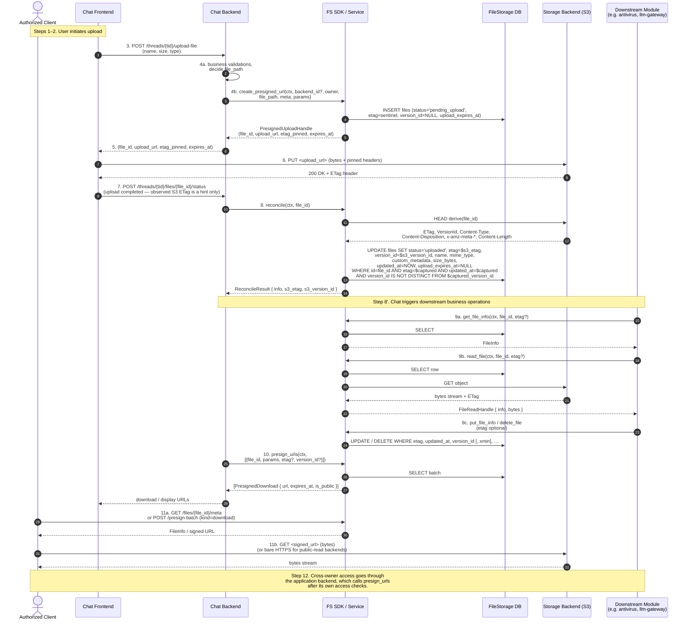
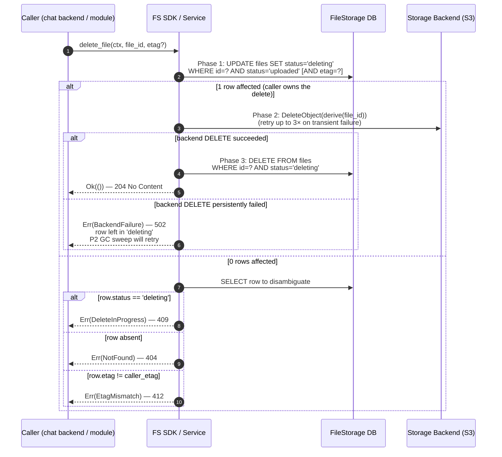
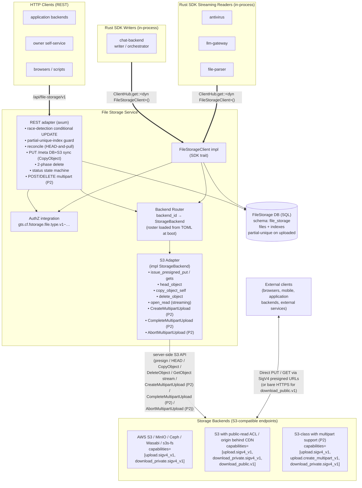

<!-- Created: 2026-04-20 by Constructor Tech -->

## 11.5 What is the file lifecycle?

1. **Authorized Client — intent to upload a file.**

2. **Chat Frontend — user clicks the "Upload" button.**

3. **Chat Frontend → `POST /api/chat/v1/threads/{thread_id}/upload-file`.**
   Passes the file's main parameters (name, size, type), but not its content.

4. **Chat Backend → `FileStorageClient.create_presigned_url(ctx, backend_id?, owner: OwnerRef { tenant_id, owner_id }, meta: FileMeta, params: UrlParams)`.**
   Performs all the application's business validations, checks the limits of its own service, of the given thread, of the user, etc. The `ctx: SecurityContext` carries the caller's tenant; `backend_id` is optional — when omitted, FileStorage falls back to the tenant's `default_private` backend. In response it receives a `PresignedUploadHandle { file_id (uuid), upload_url, etag_pinned, expires_at }`. FS mints a fresh opaque `file_id`, derives the backend object key (`file_path`) deterministically from it, persists the row in `file_storage.files` with `status = 'pending_upload'`, the sentinel pinned `etag`, `version_id = NULL`, and `upload_expires_at` derived from `params.expires_in_seconds` (capped by the backend's max URL TTL). In the future a Garbage Collector can be run that finds expired pending rows for which the file was never actually uploaded. The handler also persists the link to the new `file_id` in its own `threads` table.

5. **Chat Frontend ← `(file_id, upload_url, etag_pinned, expires_at)`.**
   The client cannot modify the parameters in the `upload_url` because they are SigV4-signed (hash of canonical params + backend secret), so any change to the URL makes it invalid. The signed headers include `Content-Type` (from `meta.mime_type`), `Content-Disposition` (from `meta.name`), and every `x-amz-meta-<k>` (from `meta.custom_metadata`). They do NOT include `x-amz-meta-gts-file-type` — that field is DB-only.

6. **Chat Frontend → `PUT <upload_url>` (direct to backend, e.g. S3).**
   Uploads the file content directly to the specific storage backend. P1 ships PUT-SigV4 without any backend-side preconditions on the upload presign — correctness is upheld entirely by FileStorage's own primitives (`reconcile`-driven HEAD-and-pull, `(etag, updated_at, version_id[, xmin])` race-detection on UPDATE — `version_id` participates always, null-safe via `IS NOT DISTINCT FROM`, closing the ABA window on versioning-on backends; `xmin` adds Postgres-only transaction-id race detection — the status state machine, lazy self-healing on `read_file`). Logical-address uniqueness is structural — `file_path` is derived from `file_id`, so collisions are impossible by construction.

7. **Chat Frontend → `POST /api/chat/v1/threads/{thread_id}/files/{file_id}/status`.**
   Signals that the upload completed (success / failure). The frontend MAY include the S3 `ETag` it observed in the PUT response, but FileStorage never plumbs that hint into the row — the value can be stale, wrong, or forged.

8. **Chat Backend → `FileStorageClient.reconcile(ctx, file_id)` (REST: `POST /api/file-storage/v1/files/{file_id}/meta/reconcile`).**
   Commits the upload to FS. **FileStorage does not trust the caller for the new etag** — instead it issues an authoritative `HEAD` against `derive(file_id)` on the storage backend, captures `(s3_etag, s3_version_id, content_type, content_disposition, content_length, x-amz-meta-*)` directly from S3, and writes the row in a single conditional UPDATE with retry. The row's etag becomes the raw S3 ETag; `version_id` becomes the raw S3 VersionId (or `NULL` if the backend has versioning off); `name`, `mime_type`, `custom_metadata`, `size_bytes` are all pulled from the HEAD response. **`gts_file_type` is preserved from the DB row** (specific exception, see ADR-0004). The response is `ReconcileResult { info: FileInfo, s3_etag: String, s3_version_id: Option<String> }`. After the commit, chat performs the business operations required for this service — for example, sends the `file_id` to antivirus or LLM analysis, or somewhere else. From then on, everywhere in the system, all services interact only with `file_id + etag` and never with the real file path.

9. **Downstream Modules (e.g. antivirus) → FS Rust SDK (`get_file_info` / `read_file` / `put_file_info` / `delete_file` / `reconcile`).**
   Having received the `file_id`, other services call the FS Rust SDK on their own:
   - `FileStorageClient.get_file_info(ctx, file_id, etag: Option<&Etag>)` — get all the information about the file (directly from the FileStorage database, without touching the real storage backend such as S3).
   - `FileStorageClient.read_file(ctx, file_id, etag: Option<&Etag>) -> FileReadHandle { info, bytes: Stream<Bytes> }` — stream the file content in the idiomatic Rust async byte-stream mode. `read_file` is also the lazy in-process self-healing trigger that reconciles the row's etag against the backend's `ETag` header (per ADR-0004).
   - `FileStorageClient.put_file_info(ctx, file_id, update: FileMetaUpdate, etag?)` — atomic DB+S3 metadata sync via `CopyObject` self-copy with `MetadataDirective: REPLACE`. The body declares `name`, `mime_type`, `custom_metadata` only — `gts_file_type` is structurally immutable. Optional `If-Match` becomes a strong CAS over both stores.
   - `FileStorageClient.delete_file(ctx, file_id, etag?)` — 2-phase hard delete (Phase 1 `uploaded → deleting`, Phase 2 backend DELETE with retries, Phase 3 hard-DELETE the row). `If-Match` is optional.
   - `FileStorageClient.reconcile(ctx, file_id)` — explicit reconciliation of the row against the backend (e.g. after an out-of-band overwrite the caller knows about). Always safe to invoke.

   **Re-uploading file content** is a single flow — variant B, preserving `file_id`:
   - The application backend calls `FileStorageClient.create_presigned_url(ctx, file_id = Some(id), params)`. The server pins the row's CURRENT metadata into the presigned PUT (the caller MUST NOT supply `meta` on this variant); the end-client `PUT`s new bytes to the same backend object key (deterministically derived from `file_id`); the application calls `complete_upload` (or `reconcile` on the legacy single-PUT path) to refresh the row's `etag` and `version_id`. The `file_id` is preserved; consumers holding the `file_id` see the new bytes after the next finalize (or via the lazy self-heal on `read_file`).
   - There is **no fresh-`file_id` supersession flow**: minting a new `file_id` always creates an independent file with its own backend object key (`file_path` is derived from `file_id`), not an "overwrite" of any existing file. To replace a file in place, use variant B above; to discard the old file and create a new one, call `delete_file` followed by a fresh `create_presigned_url`.

10. **Chat Backend → `FileStorageClient.presign_urls(ctx, items: Vec<PresignDownloadItem { file_id, params: UrlParams, etag: Option<Etag>, version_id: Option<String> }>)`.**
    Obtains URLs to give the frontend for display/download. The method is batch-first by design (one DB SELECT for the whole list, one RTT in a future remote topology), and a single-URL caller simply passes a one-element vector. Per item: when `etag` is present, the server verifies the row's current `etag` matches (DB-only; no HEAD against S3) before signing — mismatch returns `EtagMismatch` for that item. When `version_id` is present and the file's hosting backend has `versioning = true`, the signed URL embeds `versionId=<vid>` so the URL resolves to that historical generation. Every issued URL sets `response-content-type` and `response-content-disposition` query params from the DB row's metadata, so the user-visible download experience tracks DB.meta independent of any S3-side drift. Backends declaring the `download_public.v1` capability tag (typically paired with `default_public = true`) issue bare-HTTPS URLs with no expiry (`is_public = true` on the outcome) when the per-item `capability` is `download_public.v1`.

11. **Authorized Owner → FS REST (`GET /files/{file_id}/meta` / `POST /presign-batch`).**
    By default the File Storage REST API allows readonly access to a user's/owner's files using standard `authn + authz + filestorage` authorization, so an authorized user can request the metadata and a download URL of their own file knowing only the `file_id`:
    - `GET /api/file-storage/v1/files/{file_id}/meta` — returns the authoritative `FileInfo` with `meta`.
    - `POST /api/file-storage/v1/presign-batch` with `{ "items": [{ "kind": "download", "file_id": "...", "params": {...} }] }` — presigned download URL; the user then `GET`s bytes directly from the storage backend (S3) via that URL. FileStorage never proxies file content over its REST surface in P1 — every byte download goes client ↔ S3 directly through a presigned URL (or bare HTTPS for public-read backends).

    This is done for convenience, so the user can easily access their own files from any service. The exact owner-self-service convenience surface is P2 scope; the underlying mechanism is already present in P1 through these endpoints plus the standard authz model on `gts.cf.fstorage.file.type.v1~{type}`.

12. **External Consumer → Application Backend → `FileStorageClient.presign_urls(...)`.**
    To access another user's files you must go through the specific application's API — for example, the chat backend itself must check whether specific users have access rights to specific files, and if access is granted, it must itself call `presign_urls` for the required files and return them to the user. In that case the user will be able to download files uploaded by another user, but only because the chat application allows it.

### Sequence diagram



## 11.6 Desync recovery: self-healing

### 11.6.1 Desync scenario

Initial in-sync state:

- DB: `row(file_id=f1, status=uploaded, etag=e_old, version_id=v_old)`
- S3: `derive(f1)` holds `content_old`, S3-ETag = `e_old`, S3-VersionId = `v_old`.
- DB and S3 fully consistent.

Steps that produce a desync:

1. The frontend asks chat-backend for permission to overwrite `f1` in place.
2. Chat-backend calls `FileStorageClient.create_presigned_url(ctx, file_id = Some(f1), params)` (variant-B re-upload). The row is unaffected at this stage; the server pins the row's current metadata into the presigned PUT.
3. The frontend successfully `PUT`s `content_new` directly to S3 against the same backend object key. S3 acks with `ETag = e_new` (and assigns `VersionId = v_new` on versioning-on backends).
4. **The browser dies / the connection drops / the user closes the tab.**
5. `reconcile(...)` never reaches FileStorage.

Resulting state:

- DB: `row(f1, uploaded, etag=e_old, version_id=v_old)` — DB still believes the key holds `content_old`.
- S3: the key holds `content_new`, S3-ETag = `e_new`, S3-VersionId = `v_new`.
- DB and S3 are out of sync on the `(content, etag, version_id)` axis. Other mirrored fields (`name`, `mime_type`, `custom_metadata`) are untouched (variant B re-upload pins them from the row's current state, so the new bytes carry the same metadata).

### 11.6.2 Self-healing primitive

Since the desync can manifest only on a bounded axis (etag, version_id, possibly other S3-mirrored fields if the operator's bucket policy permits out-of-band header injection), and S3 always provides the authoritative answer through HEAD/GET, FileStorage reconciles the DB against S3 through one of two triggers — explicit `reconcile` (eager) or in-process `read_file` (lazy). No separate infrastructure (sweeper, S3 events, webhooks) is required for correctness.

Base operation:

```text
reconcile_primitive(file_id):
    loop up to 3 times:
        (etag_db, version_id_db, updated_at_db, status_db, meta_db)
            = SELECT * FROM files WHERE id = file_id AND status IN ('pending_upload', 'uploaded')
        if not found: return Err(NotFound)
        if status_db == 'deleting': return Err(DeleteInProgress)

        s3 = HEAD derive(file_id)
        if s3.404: return Err(BackendFailure)
        new_meta = build_from(s3)            # name from Content-Disposition, mime from Content-Type,
                                              # custom_metadata from x-amz-meta-*, size from Content-Length
                                              # gts_file_type kept from meta_db (DB-only)

        UPDATE files
           SET status = 'uploaded',
               etag = s3.etag,
               version_id = s3.version_id,
               name = new_meta.name,
               mime_type = new_meta.mime_type,
               custom_metadata = new_meta.custom_metadata,
               size_bytes = s3.content_length,
               upload_expires_at = NULL,
               updated_at = NOW()
         WHERE id = file_id
           AND etag = etag_db
           AND updated_at = updated_at_db
           AND version_id IS NOT DISTINCT FROM version_id_db   -- null-safe; participates always
           [AND xmin = xmin_db]      -- on Postgres
        if 1 row: return Ok(refreshed_FileInfo)
        # 0 rows: race detected, retry
    return Err(Conflict)  # 3 retries exhausted
```

This primitive runs in two places: triggers A (`reconcile`) and B (`read_file`).

### 11.6.3 Trigger A — `reconcile(file_id)` (explicit reconciliation, REST + SDK)

**Goal**: caller wants the row to converge on whatever is actually at the backend. This is the explicit reconciliation primitive.

The REST counterpart `POST /files/{file_id}/meta/reconcile` rejects `If-Match` with `400`. Algorithm — see DESIGN §3.9 step 8 for the full step-by-step.

**Concurrent `reconcile` calls converge by construction.** Two callers both HEAD S3, observe the same state, attempt the same UPDATE — the loser sees `0` rows but retries from a fresh SELECT, observes the row already converged, and either succeeds as a no-op or retries until convergence within 3 attempts. There is no `EtagMismatch` outcome under pure `reconcile ⇄ reconcile` racing.

### 11.6.4 Trigger B — `read_file(file_id, etag = Some(e_pinned))` / `etag = None`

**Goal**: caller is fetching bytes; if the row's etag has drifted from S3, the SDK reconciles it before returning the stream.

Algorithm:

1. SELECT row → `(etag_db, version_id_db, updated_at_db, …)`.
2. If caller pinned `Some(e_pinned)` and `e_pinned != etag_db` → return `EtagMismatch{ current: etag_db }` (legitimate version drift; no self-heal needed).
3. Open backend GET on `derive(file_id)`. S3 returns ETag, VersionId, body stream.
4. If `s3.etag != etag_db` OR (on versioning-on backends) `s3.version_id != version_id_db` → desync detected. Run system-context UPDATE pulling the same fields the eager `reconcile` pulls (etag, version_id, mirrored metadata, size). The UPDATE WHERE clause carries the captured `(etag_db, updated_at_db, version_id_db)` for race detection (`version_id` null-safe).
5. Branch:
   - If caller pinned `Some(e_pinned)`: return `Err(EtagMismatch{ current: s3.etag })` — DB is now repaired; caller's retry will succeed.
   - If caller pinned `None`: re-SELECT, return `Ok(FileReadHandle { info: refreshed, bytes: stream })` transparently — the caller never learns of the repair.
6. If `s3.etag == etag_db` (in sync): return `Ok(FileReadHandle { info: row, bytes: stream })`.

The repair UPDATE on this trigger runs without a `SecurityContext` (system-context maintenance — `cpt-cf-file-storage-constraint-system-context-maintenance`).

## 11.7 2-Phase Delete

`delete_file(ctx, file_id, etag?)` (REST: `DELETE /api/file-storage/v1/files/{file_id}` with optional `If-Match`) runs a 3-step flow that gives the caller a strong guarantee about row state and a graceful degradation path under backend transient failure.

### 11.7.1 Phase 1 — claim the row

Conditional UPDATE:

```sql
UPDATE files
   SET status = 'deleting', updated_at = NOW()
 WHERE id = $file_id
   AND status = 'uploaded'
   [AND etag = $If-Match]
```

- `0` rows affected → with `If-Match`: either the row's etag rotated under the caller (`EtagMismatch`, HTTP 412) or the row is absent (`NotFound`, HTTP 404). Without `If-Match`: `NotFound`. A row already in `deleting` is reported as `DeleteInProgress` (HTTP 409) — another caller's Phase 1 won.
- `1` row affected → the caller owns the delete. The row is now invisible to readers (`get_file_info`, `read_file`, `presign_urls`, `list_files` filter on `status = 'uploaded'`); concurrent `reconcile` and `put_file_info` against this row return `DeleteInProgress`.

### 11.7.2 Phase 2 — backend cleanup

Adapter `delete_object(derive(file_id))`. S3 `DeleteObject` is idempotent (versioning-on backends create a delete marker).

On transient failure (5xx, network, throttle): inline retry up to 3 attempts with exponential backoff (e.g. 100 ms, 500 ms, 2 s). On persistent failure: leave the row in `deleting`, return `BackendFailure` (HTTP 502). Subsequent reads on the row return `NotFound`; the P2 GC sweep retries.

P1 deliberately accepts that a persistent backend outage can leave the row stuck in `deleting`. This is a bounded incident class — the row is invisible to callers, and when the backend recovers, the GC sweep (P2) reaps it. P1 ships without the GC sweep; until P2 lands, an operator can manually re-drive the delete by calling `delete_file` again with the row's current etag (the Phase 1 status check will accept the `deleting` row only if the operator passes through a special maintenance path — also a P2 candidate).

### 11.7.3 Phase 3 — purge the row

```sql
DELETE FROM files
 WHERE id = $file_id
   AND status = 'deleting';
```

No etag check — Phase 1 owns the row in `deleting`, so the DELETE is unconditional on etag. Phase 3 returns `204 No Content` (REST) / `Ok(())` (SDK) on success.

### 11.7.4 Concurrency analysis

**Concurrent `delete_file` and `read_file`** — `delete_file` Phase 1 returns success; the in-flight reader continues to receive bytes from its open S3 GET (in-flight snapshot semantics) until Phase 2 actually deletes the backend object. New readers after Phase 1 see `NotFound`.

**Concurrent `delete_file` and `put_file_info`** — first to land wins. A `put_file_info` arriving after Phase 1 sees `status='deleting'` and returns `DeleteInProgress`. A `delete_file` arriving after a successful `put_file_info` (with a stale `If-Match`) fails with `EtagMismatch`; without `If-Match` it succeeds.

**Concurrent `delete_file` and `reconcile`** — `reconcile` against a `deleting` row returns `DeleteInProgress`.

**Concurrent `delete_file` and `delete_file`** — Phase 1 admits exactly one. The other sees `EtagMismatch` (their `If-Match` did not match) or `DeleteInProgress` (their `If-Match` was correct but they arrived after the first Phase 1 commit) or `NotFound` (no `If-Match`, but Phase 3 already ran).

### 11.7.5 Sequence diagram



## 11.8 Variant-B re-upload

Re-uploading bytes to an existing `file_id` preserves the file's identity and reuses the backend object key. The flow:

1. Application backend calls `FileStorageClient.create_presigned_url(ctx, file_id = Some(file_id), params)`. **No `meta` argument** on this variant. The server SELECTs the row, pins the current `name`, `mime_type`, `custom_metadata` into a fresh presigned PUT URL, and updates `upload_expires_at` to `MAX(coalesce(current, ε), NOW + TTL)` so multiple outstanding URLs do not shorten the existing window.
2. The end-client `PUT`s the new bytes to the same backend object key with the SigV4-pinned headers.
3. After the PUT completes (or the application backend polls / receives a notification), the application calls `FileStorageClient.reconcile(ctx, file_id)` to refresh the row's `etag` and `version_id` from S3.

**Race window.** Between the client's PUT acknowledgment and `reconcile`, the row's `etag` lags S3 (DB still says `e_old`, S3 holds `e_new`). A reader during this window:

- Observes `DB.meta` as unchanged (variant-B does not change metadata) and `DB.etag = e_old`.
- A presigned download URL the reader is handed targets the same backend object key, so it resolves to the new bytes (`e_new`) — the user-visible content is fresh, but the row's etag claim is stale.

The window closes when `reconcile` lands. A `read_file` against the row during the window also closes the gap (lazy self-heal trigger).

The re-upload presign-batch item with `file_id` rejects the `meta` field with `400 bad_request`. Callers who need to change metadata before re-uploading content do so via `PUT /files/{file_id}/meta` first; the new variant-B presign then pins the updated metadata.

## 11.9 PUT /meta — DB+S3 atomic metadata sync

`put_file_info(ctx, file_id, FileMetaUpdate, etag?)` (REST: `PUT /api/file-storage/v1/files/{file_id}/meta`) keeps DB.meta and S3 user-metadata in sync atomically.

The body declares `name?`, `mime_type?`, `custom_metadata?` only. **`gts_file_type` is structurally absent** — `FileMetaUpdate` does not declare this field, so `PUT /meta` cannot change it. No runtime field-validation needed — the type system catches it.

The flow:

1. SELECT row → capture `(etag_db, version_id_db, updated_at_db, meta_db)`. Reject `Deleting` rows with `DeleteInProgress`.
2. **If `If-Match` supplied** (strong CAS path):
   - Verify `etag_db == If-Match` (DB check). Mismatch → `412`.
   - HEAD S3 → capture `(s3_etag, s3_version_id)`. Verify `s3_etag == If-Match`. On versioning-on backends, also verify `s3_version_id == version_id_db`. Mismatch → `412`.
3. Compute `new_meta = merge(meta_db, body)`. Validate aggregate user-metadata size ≤ 2 KB; oversize → `413 payload_too_large` with the `max_metadata_bytes` extension.
4. Issue `CopyObject` self-copy on the file's backend object:
   - `CopySource: derive(file_id)`
   - `MetadataDirective: REPLACE`
   - `Content-Type: new_meta.mime_type`
   - `Content-Disposition: attachment; filename="<URL-encoded new_meta.name>"`
   - `x-amz-meta-<k>: <v>` for each entry in `new_meta.custom_metadata`
   - **NO `x-amz-meta-gts-file-type`** (specific exception to the meta-mirror rule)
   - When `If-Match` was supplied: `x-amz-copy-source-if-match: <If-Match>`
   - Returns `(new_etag, new_version_id)`. `412` from the precondition → propagate as `412 etag_mismatch`. Other failure → `502 backend_failure`.
5. Conditional UPDATE on the row:
   ```sql
   UPDATE files
      SET name = $new.name, mime_type = $new.mime_type,
          custom_metadata = $new.custom_metadata,
          etag = $new_etag, version_id = $new_version_id,
          updated_at = NOW()
    WHERE id = $file_id
      AND etag = $etag_db
      AND updated_at = $updated_at_db
      AND version_id IS NOT DISTINCT FROM $version_id_db   -- null-safe; participates always
      [AND xmin = $xmin_db]
   ```
   `0` rows → race detected, retry from step 1 up to 3 times. After 3 unsuccessful attempts → `Conflict`.
6. Return updated `FileInfo`.

The strong-CAS variant (with `If-Match`) closes the ABA window on versioning-on backends because the HEAD also verifies `s3_version_id`. On versioning-off backends, ABA on content is an accepted P1 risk (`cpt-cf-file-storage-constraint-versioning-aware-cas`).

The without-`If-Match` variant is best-effort last-write-wins on metadata (`cpt-cf-file-storage-constraint-no-meta-cas`); race detection on the conditional UPDATE plus the 3-attempt retry loop bounds the window.

## 11.10 Historical version GET (versioning-on backends)

When a file's hosting backend has `versioning = true`, callers can fetch historical generations by passing `version_id` on a presign-download item:

```text
files.presign_urls(&ctx, vec![PresignDownloadItem {
    file_id,
    params: UrlParams { expires_in_seconds: 300, … },
    etag: None,
    version_id: Some("v_old".to_string()),
}]).await?;
```

The server includes `versionId=v_old` in the SigV4-signed GET URL. The browser following the URL fetches that exact historical generation, even if newer generations or delete markers exist.

Retention of historical generations is operator-controlled via S3 lifecycle rules. FileStorage does not track historical-version retention; if the operator's lifecycle has expired generation `v_old`, a presigned URL embedding `versionId=v_old` resolves to `404 NotFound` from S3.

When the hosting backend has `versioning = false`, the `version_id` field on the request item is silently ignored — the server issues a current-version URL. Callers that require strict historical-fetch semantics should branch on `Backend.versioning` from `list_backends`.

## 11.11 Component diagram

Two client surfaces (in-process Rust SDK, REST) front the same `File Storage Service`. The service owns its SQL metadata DB and exposes its byte plane through an `S3 Adapter` that talks to one of N **physical S3-compatible endpoints** (the roster of which is loaded from a static TOML configuration at boot — implementation detail, not shown as a separate node). Bytes never proxy through FS — external clients PUT/GET directly against the S3 endpoint using SigV4 presigned URLs (or bare HTTPS for `download_public.v1`-capable endpoints); in-process streaming readers (`read_file`) consume bytes through the adapter without going through a presigned URL.



**Reading the diagram.**

- **Control plane** — every metadata mutation (presign issuance, reconcile, PUT /meta CAS, delete, multipart complete/abort) flows through `REST` or `SDKImpl` → `AUTHZ` + `BR` → `ADAPTER` → `BACKENDS`, with concurrent SQL writes/reads against `DB`.
- **External byte plane** — once `REST` returns a `PresignedUploadHandle` / `PresignedDownload` / `PresignedMultipartHandle`, the URL travels back to whichever HTTP client requested it. The actual bytes flow **directly between the client and the S3 endpoint** (the `EC ↔ BACKENDS` arrow), bypassing the FileStorage service entirely. `download_public.v1` URLs require no signing and have no expiry; everything else is SigV4-signed and TTL-capped.
- **In-process byte plane** — `read_file` for SDK streaming readers (antivirus / llm-gateway / file-parser) does NOT hand back a presigned URL; the byte stream is opened by the adapter (`open_read`) and forwarded back through `SDKImpl` to the caller as a `Stream<Bytes>`. The path is `SDK_R → SDKImpl → BR → ADAPTER → BACKENDS` and bytes return along the same path.
- **`ROSTER`** — not drawn as a separate node. It is a static TOML configuration loaded once at boot; the `BR` reads it to resolve `backend_id` to an `S3 Adapter` instance and to enforce per-backend tenant access lists. The architectural invariant (§1.1) is that every entry declares only versioned capability tags — the SDK's `KNOWN_CAPABILITIES` whitelist validates them at init and fails-fast on unknown tags.

### 11.11.1 `file-storage-sdk` public surface

Consumer-facing trait `FileStorageClient` (registered in `ClientHub`). 11 P1 methods + 3 P2-reserved multipart methods (`unimplemented!()` stubs in P1) = 14 total surface.

**Streaming read**

- `read_file(ctx, file_id, etag?) -> FileReadHandle { info, bytes: Stream<Bytes> }` — lazy in-process self-healing trigger.

**Streaming write** (P1 — Rust SDK only; not exposed via HTTP API in P1)

- `put_file(ctx, file_id?, backend_id?, owner, meta, bytes: Stream<Bytes>, etag?) -> FileInfo` — single-call in-process upload. Drives the S3 adapter directly (`PutObject`); does NOT issue a presigned URL and does NOT reuse the REST `reconcile` endpoint. Internally: INSERT `PendingUpload` row (or SELECT existing on variant-B re-upload) → stream bytes via adapter `PutObject` against the deterministic `derive(file_id)` key (pinning `Content-Type` / `Content-Disposition` / `x-amz-meta-<k>`, never `gts_file_type`) → HEAD-and-pull authoritative `(s3_etag, s3_version_id, mirrored meta)` → conditional UPDATE flips to `Uploaded`. On any error between the INSERT and the final UPDATE the SDK best-effort runs `DELETE FROM files WHERE id = $file_id AND status = 'pending_upload'` so the call leaves no `PendingUpload` row behind; if the failure occurred after `PutObject` succeeded, the orphan backend object is reclaimed by the P2 GC inverse sweep. `file_id = None` is initial upload (fresh server-minted `file_id`); `file_id = Some(id), etag = Some(e)` is variant-B re-upload (same `file_id` and backend object key, mismatch → `EtagMismatch`). There is no bytes-through-FileStorage REST proxy upload in any phase — external clients always go presign-first.

**Presign-first write (bytes flow client ↔ S3 directly, no SDK byte stream)**

- `create_presigned_url(ctx, file_id?, backend_id?, owner, meta, params) -> PresignedUploadHandle` — initial upload (`file_id = None`) or variant-B re-upload (`file_id = Some(id)`, `meta` MUST be omitted)
- `reconcile(ctx, file_id) -> ReconcileResult { info, s3_etag, s3_version_id }` — explicit reconciliation primitive (HEAD + conditional UPDATE)
- `delete_file(ctx, file_id, etag?) -> ()` — 2-phase hard delete

**Presigned downloads (batch)**

- `presign_urls(ctx, items: Vec<PresignDownloadItem>) -> Vec<PresignDownloadOutcome>`

**Metadata**

- `get_file_info(ctx, file_id, etag?) -> FileInfo`
- `put_file_info(ctx, file_id, update, etag?) -> FileInfo` — DB+S3 atomic sync via CopyObject
- `list_files(ctx, query) -> FileList`

**Backends**

- `list_backends(ctx) -> Vec<Backend>`

**Public types**

- IDs: `FileId`, `BackendId`, `Etag`
- File: `FileInfo`, `FileMeta`, `FileMetaUpdate`, `FileStatus` (`PendingUpload | Uploaded | Deleting`), `CustomMetadata`, `FileList`, `ListFilesQuery`, `OwnerRef`
- Backends: `Backend` (with `default_private`, `default_public`, `versioning`, `capabilities: Vec<CapabilityTag>`, `max_file_size_bytes`, `max_metadata_bytes`, `max_presign_ttl_seconds`). `CapabilityTag` is a flat string `<operation>.<version>` (P1: `upload.sigv4_v1`, `download_private.sigv4_v1`, `download_public.v1`; P2 adds `upload.create_multipart_v1`). Validated at boot against the SDK's `KNOWN_CAPABILITIES` whitelist — unknown tag → fail-fast init. Presigned URL support is constitutive; `kind` and `transport` discriminators are not represented (only one possible value each, by architectural decision).
- Presign: `UrlParams`, `PresignedUploadHandle`, `PresignedDownload` (with `is_public`), `PresignDownloadItem` (with optional `version_id`), `PresignDownloadOutcome`
- Reconcile: `ReconcileResult`
- Streaming: `FileByteStream`, `FileReadHandle`
- Errors: `FileStorageError` (`NotFound | AccessDenied | BadRequest | EtagMismatch | DeleteInProgress | CapabilityUnavailable | PayloadTooLarge | UploadExpired | BackendFailure | Internal`)
