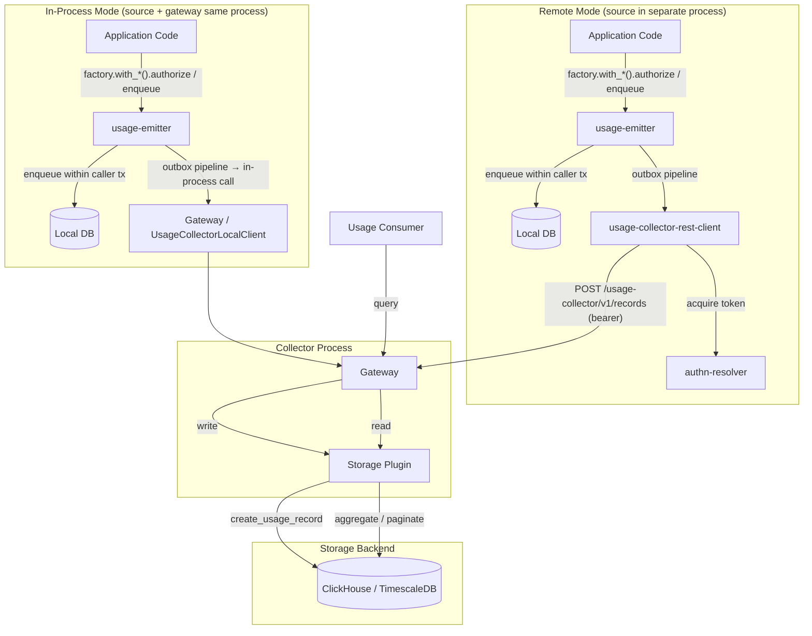
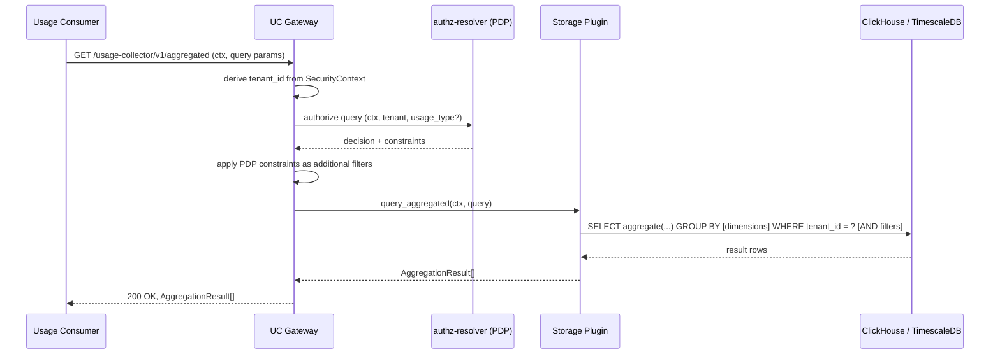
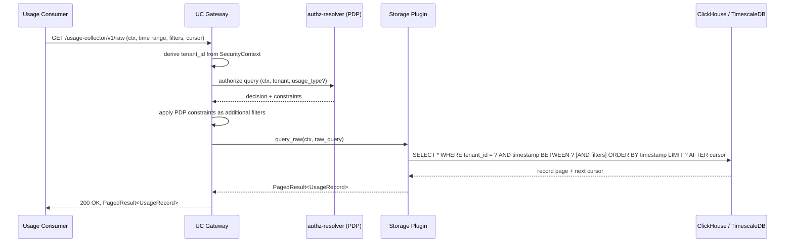
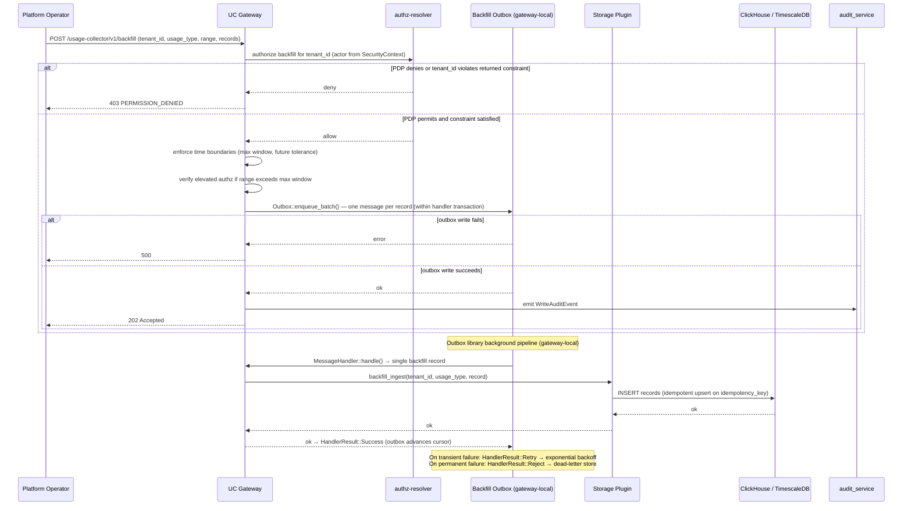
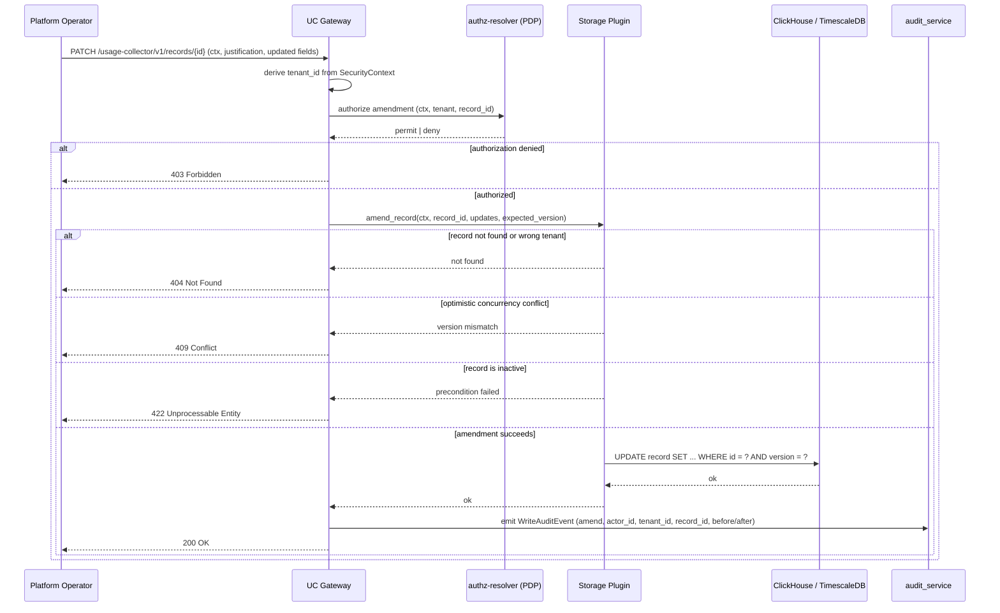
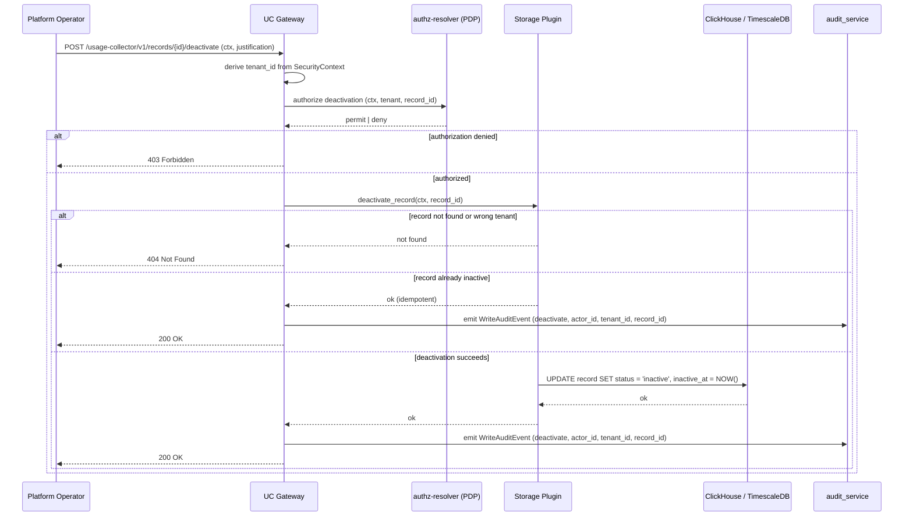

# Technical Design — Usage Collector


<!-- toc -->

- [1. Architecture Overview](#1-architecture-overview)
  - [1.1 Architectural Vision](#11-architectural-vision)
  - [1.2 Architecture Drivers](#12-architecture-drivers)
  - [1.3 Architecture Layers](#13-architecture-layers)
- [2. Principles & Constraints](#2-principles--constraints)
  - [2.1 Design Principles](#21-design-principles)
  - [2.2 Constraints](#22-constraints)
- [3. Technical Architecture](#3-technical-architecture)
  - [3.1 Domain Model](#31-domain-model)
  - [3.2 Component Model](#32-component-model)
  - [3.3 API Contracts](#33-api-contracts)
  - [3.4 Internal Dependencies](#34-internal-dependencies)
  - [3.5 External Dependencies](#35-external-dependencies)
  - [3.6 Interactions & Sequences](#36-interactions--sequences)
  - [3.7 Database schemas & tables](#37-database-schemas--tables)
  - [3.8 Observability](#38-observability)
- [4. Additional context](#4-additional-context)
- [5. Traceability](#5-traceability)

<!-- /toc -->

## 1. Architecture Overview

### 1.1 Architectural Vision

Usage Collector follows the ModKit Gateway + Plugins pattern. The gateway module (`usage-collector`) is the single centralized service that receives usage records, enforces tenant isolation, and delegates all storage operations to the active plugin. Backend-specific persistence and query logic for ClickHouse or TimescaleDB is encapsulated in storage plugins that register via the GTS type system and are selected by operator configuration. The gateway contains no backend-specific logic.

The SDK crate (`usage-collector-sdk`) defines two trait boundaries: `UsageCollectorClientV1` for delivery to the collector gateway (not registered in ClientHub — passing it through the hub would allow any module to push unvalidated records, bypassing authorization), and `UsageCollectorPluginClientV1` for storage backend implementations. The `usage-emitter` crate exposes a three-layer Runtime/Factory/Emitter architecture: `UsageEmitterRuntime` (concrete, implementing the `UsageEmitterRuntimeV1` trait — registered in ClientHub by either the gateway module for in-process delivery or `usage-collector-rest-client` for HTTP delivery to a remote collector) is the process-wide owner of the outbox worker and shared resources; usage sources call `runtime.factory(MODULE_NAME)` once at init to obtain a module-scoped `UsageEmitterFactory`; the factory's `.with_*().authorize(subject)` builder chain produces a per-call `UsageEmitter` after a PDP authorization round-trip. When a usage source emits a record, the per-call `UsageEmitter` persists it to the source's local database within the same transaction as the caller's domain operation (transactional outbox pattern). The outbox background pipeline automatically delivers enqueued records to the collector gateway, providing at-least-once delivery even when the collector is temporarily unavailable.

There are two supported deployment modes, differing only in how the outbox background pipeline delivers records:

- **In-process mode** (`usage-collector` registers `UsageEmitterRuntimeV1`): the background delivery pipeline calls the gateway's `UsageCollectorLocalClient` directly as a Rust function call. Used when the usage source and the collector gateway run in the same process.
- **Remote mode** (`usage-collector-rest-client` registers `UsageEmitterRuntimeV1`): the background delivery pipeline sends an authenticated HTTP POST to the gateway's ingest endpoint (`POST /usage-collector/v1/records`), acquiring a bearer token via the platform AuthN resolver before each request. Used when the usage source runs in a separate process or service binary. The emit path (`factory.with_*().authorize(subject)` → `enqueue(record)`) is identical; only the delivery hop differs.

Once records arrive at the gateway, they are persisted via the active storage plugin and become available for aggregation and raw queries. All query operations are scoped to the authenticated tenant derived from the caller's SecurityContext. For ingest, tenant attribution is PDP-authorized at emit time via the `USAGE_RECORD`/`CREATE` operation — the PDP decision covers both same-tenant and subtenant scenarios; the gateway does not perform a second tenant check on delivery.

### 1.2 Architecture Drivers

#### Functional Drivers

| Requirement | Design Response |
|-------------|-----------------|
| `cpt-cf-usage-collector-fr-ingestion` | SDK `emit()` persists record to local outbox within the caller's transaction; outbox library background pipeline delivers to gateway |
| `cpt-cf-usage-collector-fr-idempotency` | Counter records require a non-null idempotency key; `usage_record_builder(metric, value)?.build()? → enqueue(record)` rejects counter records without one (`UsageEmitterError::InvalidRecord`) before any outbox INSERT; gauge records auto-generate a UUID key when none is supplied; idempotency key is carried in the outbox payload; storage plugin performs idempotent upsert on non-null keys at delivery |
| `cpt-cf-usage-collector-fr-delivery-guarantee` | Transactional outbox in source's local DB; outbox library retries with exponential backoff; messages that exhaust retry budget are moved to the dead-letter store and surfaced via monitoring |
| `cpt-cf-usage-collector-fr-counter-semantics` | `UsageEmitter.enqueue()` (layer 3) rejects counter records with a negative value or a missing idempotency key before inserting the outbox row; delta records are stored per-event; the persistent total for a (tenant, metric) pair is the SUM of all active delta records — see §3.7 Counter Accumulation for the full strategy including plugin-level acceleration options |
| `cpt-cf-usage-collector-fr-gauge-semantics` | Gauge records carry `kind = gauge`; `enqueue()` applies no monotonicity validation; storage plugin stores values as-is |
| `cpt-cf-usage-collector-fr-tenant-attribution` | The caller passes `tenant_id` explicitly via `factory.with_tenant(tenant_id).authorize(...)` (or omits it to default to `ctx.subject_tenant_id()`); the PDP `USAGE_RECORD`/`CREATE` check at that point authorizes the caller to emit for the specified tenant, covering both same-tenant and subtenant cases. The authorized `tenant_id` is bound into the returned `UsageEmitter` and stamped into every outbox row produced by that emitter. The gateway accepts the `tenant_id` from the delivered record without a second PDP check. |
| `cpt-cf-usage-collector-fr-resource-attribution` | `UsageRecord` carries required `resource_id` (UUID) and `resource_type` (string) fields; both are mandatory at emit time; persisted in outbox payload and storage backend; gateway and plugin pass them through without interpretation |
| `cpt-cf-usage-collector-fr-subject-attribution` | Subject attribution is carried on `UsageRecord.subject: Option<Subject>`, where `Subject { id: Uuid, r#type: Option<String> }` lives in `usage-collector-sdk::models`. The Rust type expresses the genuine tri-state — "no subject" (`None`), "id only" (`Some(Subject { id, r#type: None })`), "id + type" (`Some(Subject { id, r#type: Some(_) })`). The previously-typeable fourth state ("type without id") is no longer expressible. Forwarders / REST ingest translate their wire-level subject faithfully: `Some(s)` → `factory.with_subject(s)`, `None` → `factory.without_subject()`. In-process modules call neither setter and `.authorize()` falls back to deriving the subject from `SecurityContext`. The factory stores this three-way intent in a `SubjectChoice` enum (`DefaultFromCtx` / `Explicit(Option<Subject>)`) so that "default from ctx" and "explicit no subject" never collapse into the same state — preventing forwarders from silently substituting their own service identity for an absent caller-supplied subject. PDP authorization always runs against the resolved subject; the platform PDP attribute schema is unchanged (`SUBJECT_ID`/`SUBJECT_TYPE` are passed as separate flat properties at the policy boundary). |
| `cpt-cf-usage-collector-fr-tenant-isolation` | Gateway enforces tenant scoping on all read and write operations; plugins filter by tenant ID; system fails closed on authorization failure |
| `cpt-cf-usage-collector-fr-ingestion-authorization` | `UsageEmitterFactory.with_*().authorize(ctx, resource_id, resource_type)` calls the platform PDP (`USAGE_RECORD`/`CREATE`) before any transaction opens; a denial is surfaced immediately with no record persisted; the returned `UsageEmitter` (layer 3) carries the allowed-metrics list and authorization context evaluated in-memory by `enqueue()` before the outbox INSERT |
| `cpt-cf-usage-collector-fr-pluggable-storage` | Gateway resolves active plugin via GTS; plugin implements write and read traits; operator selects backend via configuration |
| `cpt-cf-usage-collector-fr-query-aggregation` | Gateway enforces PDP decision + constraint on each query; exposes aggregation query API with optional filters (usage type, subject, resource, source) and configurable GROUP BY dimensions (time bucket, usage type, subject, resource, source); delegates to plugin, which pushes aggregation (SUM, COUNT, MIN, MAX, AVG) and grouping down to the storage engine |
| `cpt-cf-usage-collector-fr-query-raw` | Gateway enforces PDP decision + constraint on each query; exposes raw query API with optional filters (usage type, subject, resource) and cursor-based pagination; delegates to plugin |
| `cpt-cf-usage-collector-fr-record-metadata` | Emitter enforces configurable metadata size limit (default 8 KB, upper bound 1 MiB; value 0 disables metadata) before enqueue; limit is published by the collector via `get_module_config` so emitters share the gateway's policy; plugin stores metadata as-is in a dedicated payload column; metadata is returned in query results without interpretation |
| `cpt-cf-usage-collector-fr-retention-policies` | Gateway manages retention policy configuration (global, per-tenant, per-usage-type); plugin enforces retention via storage-native TTL or scheduled deletion |
| `cpt-cf-usage-collector-fr-backfill-api` | Gateway accepts backfill requests and bulk-inserts historical records via the plugin; gateway calls the platform PDP to authorize the caller for the specified `tenant_id` before accepting the request; a PDP denial returns `403 PERMISSION_DENIED` immediately; existing records in the range are not modified; backfill path operates with independent rate limits; gateway emits `WriteAuditEvent` to `audit_service` on completion |
| `cpt-cf-usage-collector-fr-event-amendment` | Gateway exposes amendment and deactivation endpoints for individual events; plugin updates record status fields; gateway emits `WriteAuditEvent` to `audit_service` on each operation |
| `cpt-cf-usage-collector-fr-audit` | Gateway emits a structured `WriteAuditEvent` to platform `audit_service` on every operator-initiated write (backfill, amendment, deactivation); event includes common envelope (operation, actor_id, tenant_id, timestamp, justification) and operation-specific context; no audit data is stored locally |
| `cpt-cf-usage-collector-fr-backfill-boundaries` | Gateway enforces configurable maximum backfill window (default 90 days) and future timestamp tolerance (default 5 minutes); requests beyond the maximum window require elevated authorization verified before any plugin operation |
| `cpt-cf-usage-collector-fr-metadata-exposure` | Gateway exposes a watermark API endpoint; plugin queries per-source and per-tenant event counts and latest ingested timestamps to populate the response |
| `cpt-cf-usage-collector-fr-type-validation` | The factory's `.authorize()` step fetches the registered usage type schema from types-registry; `enqueue()` validates the record against it in-memory before the outbox INSERT, rejecting invalid records immediately; gateway retains schema validation as a defense-in-depth check on delivered records before delegating to the plugin |
| `cpt-cf-usage-collector-fr-custom-units` | Gateway exposes a usage type registration endpoint that delegates to types-registry; operator configures authorization policies per usage type after registration |
| `cpt-cf-usage-collector-fr-rate-limiting` | The factory's `.authorize()` step fetches the current source-level emission quota and window snapshot for the source module before any transaction opens; `enqueue()` evaluates the quota in-memory and rejects the emission before the outbox INSERT if the source quota is exhausted; gateway enforces per-(source, tenant) quota on ingest when `record.tenant_id` is known; rejections are surfaced via operational monitoring; rate limit configuration is managed by the platform operator |

#### NFR Allocation

| NFR ID | NFR Summary | Allocated To | Design Response | Verification Approach |
|--------|-------------|--------------|-----------------|----------------------|
| `cpt-cf-usage-collector-nfr-query-latency` | Aggregation queries over 30-day range complete within 500ms at p95 | Storage Plugin | Aggregation pushed down to storage engine; plugins SHOULD maintain pre-aggregated acceleration structures (ClickHouse `AggregatingMergeTree` view, TimescaleDB continuous aggregate) to meet this threshold at production record volumes — see §3.7 Counter Accumulation for the full strategy and consistency model | Benchmark test with 30-day synthetic dataset at target production record volume at p95 |
| `cpt-cf-usage-collector-nfr-availability` | 99.95% monthly availability for ingestion endpoints | Gateway, SDK | Stateless gateway enables horizontal replication; the SDK's outbox pipeline absorbs temporary gateway unavailability, preserving record capture continuity; liveness probes and graceful shutdown ensure fast instance recovery | SLO tracking on gateway uptime; synthetic availability probes on ingestion endpoint |
| `cpt-cf-usage-collector-nfr-throughput` | ≥ 10,000 records/sec sustained ingestion | Gateway, Storage Plugin | Gateway dispatches records to the storage plugin for batched idempotent upsert; plugin pushes bulk INSERTs to append-optimized storage (ClickHouse column store, TimescaleDB hypertable); stateless gateway scales horizontally | Sustained load test at 10,000 records/sec for 10 minutes; verify no records lost and no latency degradation |
| `cpt-cf-usage-collector-nfr-ingestion-latency` | Ingestion completes within 200ms at p95 | SDK | `authorized.usage_record_builder(...).build() + enqueue(record)` is a local DB INSERT within the caller's transaction — no network I/O on the critical emission path; p95 latency is bounded by local DB write speed, well within the 200ms threshold | Benchmark `authorized.usage_record_builder(...).build() + enqueue(record)` p95 latency under representative concurrent load |
| `cpt-cf-usage-collector-nfr-workload-isolation` | Ingestion p95 ≤ 200ms during concurrent query and retention workloads | Gateway, Storage Plugin | Query and retention workloads run on separate handler paths from the ingest handler; retention enforcement runs as a scheduled background task with lower priority; plugins leverage storage-native query prioritization (ClickHouse query priority classes, TimescaleDB resource groups) to prevent analytical workloads from starving ingest writes | Measure ingest p95 under concurrent aggregation queries and retention enforcement; verify it remains within `cpt-cf-usage-collector-nfr-ingestion-latency` threshold |
| `cpt-cf-usage-collector-nfr-authentication` | Zero unauthenticated API access | Gateway | All gateway endpoints require a valid authenticated SecurityContext; unauthenticated requests are rejected by the ModKit request pipeline before any handler or plugin is invoked | Integration tests verifying all endpoints return a rejection for requests without valid authentication credentials |
| `cpt-cf-usage-collector-nfr-authorization` | Zero unauthorized data access or write | Gateway, Emitter | `UsageEmitterFactory.with_*().authorize(...)` contacts the platform PDP (`USAGE_RECORD`/`CREATE`) before any transaction opens; gateway enforces PDP authorization on all query, backfill, amendment, and deactivation endpoints and applies returned constraints as additional query filters; system fails closed on any authorization failure (`cpt-cf-usage-collector-principle-fail-closed`) | Integration tests verifying unauthorized ingestion, query, backfill, and amendment requests are rejected with no data exposed or modified |
| `cpt-cf-usage-collector-nfr-scalability` | Linear throughput scaling with added instances | Gateway | Gateway is stateless — all per-request state is carried in SecurityContext and request payload; horizontal scaling is achieved by adding gateway instances behind a load balancer with no coordination required | Load test demonstrating linear throughput increase as gateway instance count is increased from 1 to N |
| `cpt-cf-usage-collector-nfr-fault-tolerance` | Zero data loss for durably captured records during storage backend failures | SDK, Gateway | The SDK's outbox pipeline retries failed gateway deliveries with exponential backoff; gateway retries plugin `create_usage_record` calls on transient storage errors; records durably captured in the source outbox are guaranteed to eventually reach the storage backend; messages that exhaust retry budget are moved to the dead-letter store and surfaced via operational monitoring | Chaos test: take storage backend offline, verify outbox rows survive and are delivered on recovery with zero data loss |
| `cpt-cf-usage-collector-nfr-recovery` | RTO ≤ 15 minutes from storage backend recovery | SDK, Gateway | The outbox library resumes delivery automatically once the gateway becomes reachable again; gateway re-establishes plugin connection on storage recovery without restart; the RTO bound is determined by the outbox retry schedule — `backoff_max` MUST be configured below 15 minutes to meet this threshold | Chaos test: restore storage backend after outage, measure elapsed time from backend availability to full outbox drain and query availability; verify elapsed time ≤ 15 minutes |
| `cpt-cf-usage-collector-nfr-retention` | Configurable retention from 7 days to 7 years | Storage Plugin | Retention policy configuration is managed by the gateway; plugin enforces retention via storage-native TTL expressions (ClickHouse) or scheduled deletion (TimescaleDB); policies apply at global, per-tenant, and per-usage-type scope | Test retention enforcement for each plugin: records older than the configured duration are removed within the enforcement window |
| `cpt-cf-usage-collector-nfr-graceful-degradation` | Zero ingestion failures due to downstream consumer unavailability | SDK | `authorized.usage_record_builder(...).build() + enqueue(record)` writes to the source's local database within the caller's transaction — no runtime dependency on the collector or any downstream consumer; the outbox pipeline delivers asynchronously, fully decoupling the source's emission path from collector and consumer uptime | Integration test: take the collector gateway offline; verify sources continue emitting without errors and records are delivered on gateway recovery |
| `cpt-cf-usage-collector-nfr-rpo` | RPO = 0 for all records for which `authorized.usage_record_builder(...).build() + enqueue(record)` returned `Ok` | SDK | `authorized.usage_record_builder(...).build() + enqueue(record)` calls `Outbox::enqueue()` within the caller's DB transaction — a record is durable the moment that transaction commits; no committed record can be lost by a subsequent gateway restart, dispatcher crash, or storage outage, because the outbox row persists independently in the source's local DB until confirmed delivered | Test: call `authorized.usage_record_builder(...).build() + enqueue(record)` successfully, kill the gateway process immediately after commit, restart gateway; verify the record is delivered and queryable with no data loss |

#### Key ADRs

| ADR ID | Decision Summary |
|--------|-----------------|
| `cpt-cf-usage-collector-adr-scoped-emit-source` | `UsageEmitterRuntimeV1.factory(MODULE_NAME)` returns a `UsageEmitterFactory` bound to the source module's authoritative name; the factory stamps source identity on every per-call `UsageEmitter` it produces |
| `cpt-cf-usage-collector-adr-two-phase-emit-authz` | `factory.with_*().authorize(ctx, resource_id, resource_type)` calls the PDP before any DB transaction; `usage_record_builder(metric, value)?.build()? → enqueue(record)` evaluates returned constraints in-memory inside the transaction — no network I/O on the critical emission path |

### 1.3 Architecture Layers

**In-process mode** (source and gateway in the same process):

```text
┌────────────────────────────────────────────────────────────────┐
│  Usage Source (same process as gateway)                        │
├────────────────────────────────────────────────────────────────┤
│  usage-emitter        │  UsageEmitterRuntimeV1 (ClientHub):    │
│                       │  3-layer Runtime/Factory/Emitter —     │
│                       │  factory(MODULE_NAME) → with_*()       │
│                       │  → authorize(subject) → enqueue        │
│                       │  + background outbox delivery          │
├────────────────────────────────────────────────────────────────┤
│  usage-collector-sdk  │  UsageCollectorClientV1 (delivery);    │
│                       │  UsageCollectorPluginClientV1 (plugin) │
├────────────────────────────────────────────────────────────────┤
│  usage-collector      │  Gateway: ingest, query, tenant iso.   │
│                       │  outbox bootstrap + migrations         │
├────────────────────────────────────────────────────────────────┤
│  Plugins              │  Backend-specific storage adapters     │
└────────────────────────────────────────────────────────────────┘
```

**Remote mode** (source and gateway in separate processes):

```text
┌────────────────────────────────────────┐   ┌───────────────────────────────┐
│  Usage Source Process                  │   │  Collector Process            │
│                                        │   │                               │
│  usage-emitter                         │   │  usage-collector (gateway)    │
│  usage-collector-rest-client           │──►│  POST /usage-collector/v1/    │
│  (UsageEmitterRuntimeV1 in ClientHub;  │   │  records (bearer token auth)  │
│   HTTP delivery via authN token)       │   │                               │
└────────────────────────────────────────┘   └───────────────────────────────┘
```

The emitter stack is a 3-layer model — see the research spec
`RESEARCH-emitter-runtime.md` for the authoritative architecture:

- **Layer 1 — `UsageEmitterRuntime`** (concrete) implementing trait `UsageEmitterRuntimeV1`: process-wide; owns the outbox worker, gateway client, PDP resolver, and shared `Arc`s. Registered in ClientHub. `runtime.factory(module_name) -> UsageEmitterFactory` vends module-scoped factories.
- **Layer 2 — `UsageEmitterFactory`**: module-scoped, cheaply cloneable. Module name is immutable at construction (no `with_module(...)` setter). Builder method `with_tenant(Uuid)` applies a per-call tenant override; subject identity is bound via the three-state contract `with_subject(Subject)` (explicit caller-supplied) / `without_subject()` (explicit no subject) / unset (`SubjectChoice::DefaultFromCtx` — fall back to `SecurityContext` at `.authorize()` time) — see `ADR-0002` §Subject handling. The terminal `.authorize(ctx, resource_id, resource_type)` runs the PDP authorization round-trip and produces a `UsageEmitter`.
- **Layer 3 — `UsageEmitter`**: per-call-site, authorized handle. `usage_record_builder(metric, value)?.build()? → enqueue(record)` / `enqueue_in(db, record)` performs in-memory validation and the outbox INSERT inside the caller's DB transaction. No PDP calls on the hot path.

| Layer | Responsibility | Technology |
|-------|---------------|------------|
| Emitter | Source-facing emit API (`UsageEmitterRuntimeV1`); concrete `UsageEmitterRuntime` / `UsageEmitterFactory` / `UsageEmitter` (3-layer Runtime / Factory / Emitter); two-phase auth; outbox enqueue; background delivery pipeline | Rust crate (`usage-emitter`), modkit-db outbox |
| SDK | `UsageCollectorClientV1` delivery trait (not in ClientHub); `UsageCollectorPluginClientV1` plugin trait; shared model types | Rust crate (`usage-collector-sdk`) |
| REST Client | Remote `UsageCollectorClientV1` implementation; registers `UsageEmitterRuntimeV1` in ClientHub for out-of-process sources; acquires bearer token via AuthN resolver and HTTP-POSTs records to the gateway ingest endpoint | Rust crate (`usage-collector-rest-client`) |
| Gateway | Ingest, query, aggregation API; tenant isolation; plugin resolution; outbox queue registration and schema migrations; registers `UsageEmitterRuntimeV1` for in-process sources | Rust crate (`usage-collector`), Axum |
| Plugins | Backend-specific record persistence and aggregation queries | Rust crates, ClickHouse / TimescaleDB drivers |
| External | Durable time-series storage and query execution | ClickHouse or TimescaleDB |

## 2. Principles & Constraints

### 2.1 Design Principles

#### Source-Side Persistence

- [ ] `p1` - **ID**: `cpt-cf-usage-collector-principle-source-side-persistence`

Usage records are persisted in the source's local database at emit time, within the same transaction as the caller's domain operation. This guarantees no record is lost between the source producing it and the collector receiving it. The source never blocks on collector availability.

#### Plugin-Based Storage

- [ ] `p1` - **ID**: `cpt-cf-usage-collector-principle-pluggable-storage`

All storage operations — write, aggregation query, and raw query — are delegated to the active storage plugin. The gateway contains no backend-specific logic. New backends are added by implementing the plugin trait and registering via GTS, without changes to the gateway.

#### PDP-Authorized Tenant Attribution

- [ ] `p1` - **ID**: `cpt-cf-usage-collector-principle-tenant-from-ctx`

Tenant identity for usage attribution is always PDP-authorized — never freely accepted from request payloads. The caller passes the target `tenant_id` to the factory via `factory.with_tenant(tenant_id).authorize(...)` (or omits the `.with_tenant(...)` call to default to `ctx.subject_tenant_id()`); the PDP `USAGE_RECORD`/`CREATE` decision covers both same-tenant and subtenant scenarios. The authorized `tenant_id` is bound into the returned `UsageEmitter` (layer 3) and cannot be changed per-record. The gateway accepts the `tenant_id` from delivered records without re-checking. Queries are always scoped to the authenticated tenant from SecurityContext.

#### Fail-Closed Security

- [ ] `p1` - **ID**: `cpt-cf-usage-collector-principle-fail-closed`

**ADRs**: `cpt-cf-usage-collector-adr-two-phase-emit-authz`

On any authorization failure, the system rejects the request. No fallback to permissive behavior. Queries without a valid authenticated SecurityContext are rejected before reaching the storage plugin.

#### Scoped Source Attribution

- [ ] `p1` - **ID**: `cpt-cf-usage-collector-principle-scoped-source-attribution`

**ADRs**: `cpt-cf-usage-collector-adr-scoped-emit-source`

Each consuming module obtains a `UsageEmitterFactory` by calling `UsageEmitterRuntimeV1::factory()` once at module initialization, passing its compile-time `MODULE_NAME` constant. The factory binds `MODULE_NAME` immutably (layer 2 has no `with_module(...)` builder), and every `UsageEmitter` produced by `.authorize(subject)` stamps that source module identity on every outbox row. Which metrics a source is permitted to emit is governed by authz policy. Source identity is never supplied per-call.

#### Two-Phase Emit

- [ ] `p1` - **ID**: `cpt-cf-usage-collector-principle-two-phase-authz`

**ADRs**: `cpt-cf-usage-collector-adr-two-phase-emit-authz`

Any logic that requires communication with external modules is consolidated in phase 1 (the factory's `.with_*().authorize(ctx, resource_id, resource_type)` chain), called before any DB transaction opens. Phase 1 accumulates all constraints and state into the returned `UsageEmitter` (layer 3). Phase 2 (`usage_record_builder(metric, value)?.build()? → enqueue(record)`) applies every accumulated constraint in-memory inside the caller's DB transaction — no external calls on the critical emission path.

`UsageEmitter` acts as a pre-fetched, in-memory contract for the emission. It currently carries:
- **PDP authorization result**: the platform PDP permit decision for `USAGE_RECORD`/`CREATE` for the specified tenant and resource
- **Allowed metrics list**: the set of metrics the source module is permitted to emit, fetched from the gateway during phase 1
- **Bound context**: the authorized `tenant_id`, `resource_id`, `resource_type`, and `subject: Option<Subject>` — every record produced by this emitter is stamped with the bound subject value. The subject is resolved at `.authorize()` time from either the caller-supplied `with_subject(req.subject)` value or, when absent, derived from `SecurityContext`. `enqueue()` validates `record.subject == self.subject` as a structural equality check; the builder's `usage_record_builder(...)` prefills `record.subject` from the bound subject so this check passes by default.

Any future requirement that depends on external state at emit time MUST be resolved in phase 1 and included in the returned `UsageEmitter`, not deferred to phase 2. A denial, quota exhaustion, or validation failure from `.authorize()` surfaces immediately to the caller as an error before any domain operation is committed.

### 2.2 Constraints

#### Outbox Infrastructure Required

- [ ] `p1` - **ID**: `cpt-cf-usage-collector-constraint-outbox-infra`

The `usage-collector` gateway module registers the outbox queue and applies the modkit-db outbox schema migrations via its `DatabaseCapability::migrations()` implementation. Source modules that emit usage in-process MUST declare `usage-collector` as a ModKit dependency so that the outbox schema is applied automatically as part of the gateway's migration set. Usage sources that do not have a local database managed by modkit-db cannot use the emitter.

#### Single Active Plugin

- [ ] `p1` - **ID**: `cpt-cf-usage-collector-constraint-single-plugin`

Only one storage backend plugin is active at a time, selected by operator configuration. Simultaneous dual-backend writes and online backend migration are not supported in this version.

#### ModKit Architecture Compliance

- [ ] `p1` - **ID**: `cpt-cf-usage-collector-constraint-modkit`

The usage-collector module follows the ModKit module specification: the gateway is a standard ModKit module with its own scoped `ClientHub`, uses `SecureConn` for all storage plugin database access, propagates `SecurityContext` on all inter-module and plugin calls, and follows the `NEW_MODULE` guideline for bootstrapping. Storage plugins register via the GTS type system and are resolved at runtime via the gateway's `ClientHub`. No module-level static globals; no direct database connections outside `SecureConn`.

#### SecurityContext Propagation

- [ ] `p1` - **ID**: `cpt-cf-usage-collector-constraint-security-context`

`SecurityContext` must be propagated on all operations: ingest, query (aggregated and raw), backfill, amendment, deactivation, metadata watermarks, retention configuration, and unit registration. Subject identity is always derived from `SecurityContext`. Tenant ID for usage attribution is always PDP-authorized (see `cpt-cf-usage-collector-principle-tenant-from-ctx`); it is never accepted from request payloads without prior PDP authorization and is never passed as an unvalidated parameter between internal components.

#### Types Registry Delegation

- [ ] `p1` - **ID**: `cpt-cf-usage-collector-constraint-types-registry`

All usage type schema definition and validation is delegated to types-registry. The Usage Collector does not own or define metric type schemas. Custom unit registration routes through the gateway's unit registration endpoint, which delegates entirely to types-registry. Storage plugin discovery uses GTS schemas registered by each plugin implementation.

#### No Business Logic

- [ ] `p1` - **ID**: `cpt-cf-usage-collector-constraint-no-business-logic`

The Usage Collector does not implement pricing, rating, billing rules, invoice generation, quota enforcement, or business-purpose aggregation. Record metadata is stored as opaque JSON without indexing or interpretation. All business decisions are the responsibility of downstream consumers.

#### Encrypted Transport and Storage

- [ ] `p1` - **ID**: `cpt-cf-usage-collector-constraint-encryption`

All plugin connections to ClickHouse and TimescaleDB MUST use TLS; connection parameters are managed via `SecureConn`. Storage backends MUST be configured to reject unencrypted connections. Encryption at rest is mandatory and governed by platform infrastructure policy (ClickHouse native AES-128 encryption or filesystem-level encryption; TimescaleDB encrypted tablespace or OS-level encryption). Encryption key management is the responsibility of the platform secret management system. Record deletion via retention enforcement (`cpt-cf-usage-collector-fr-retention-policies`) constitutes secure disposal; no per-module key rotation is required for non-PII usage data.

## 3. Technical Architecture

### 3.1 Domain Model

**Technology**: Rust structs

**Location**: [`modules/system/usage-collector/usage-collector-sdk/`](../../usage-collector/usage-collector-sdk/)

**Core Entities**:

| Entity | Description | Schema |
|--------|-------------|--------|
| `UsageRecord` | Single measurement of resource consumption: tenant ID, source module (`module` field), metric kind (`kind` field: counter/gauge), metric name, numeric value, timestamp; idempotency key (required for counter metrics, optional for gauge metrics), resource ID and resource type (both required), optional `subject: Option<Subject>`, metadata (opaque JSON); status (`active` \| `inactive`) | [`usage-collector-sdk/src/models.rs`](../../usage-collector/usage-collector-sdk/src/models.rs) |
| `Subject` | Unified subject-identity value: `Subject { id: Uuid, r#type: Option<String> }`. Encodes the legal invariant (id required, type optional). Lives in `usage-collector-sdk::models` for this PR — TODO: consider lifting to `modkit-security` next to `SecurityContext` once a second consumer (`mini-chat`, `credstore`, audit call sites) appears. Not committed in this PR. | [`usage-collector-sdk/src/models.rs`](../../usage-collector/usage-collector-sdk/src/models.rs) |
| `AggregationQuery` | Query parameters: tenant ID (derived from SecurityContext), time range (mandatory), aggregation function (SUM/COUNT/MIN/MAX/AVG); optional filters: usage type, subject (`Option<Subject>`), resource (resource_id, resource_type), source; optional GROUP BY dimensions: time bucket granularity, usage type, subject, resource, source | `AggregationQuery` is not yet present in the SDK (target-state) |
| `AggregationResult` | Result row: aggregation function applied, aggregated numeric value; dimension values present for each active GROUP BY dimension: time bucket start timestamp (when grouped by time), usage type (when grouped by usage type), `Subject` (when grouped by subject), resource ID + resource type (when grouped by resource), source module (when grouped by source); absent dimensions are null | `AggregationResult` is not yet present in the SDK (target-state) |
| `RawQuery` | Raw record query parameters: tenant ID (derived from SecurityContext), time range (mandatory), optional pagination cursor; optional filters: usage type, subject (`Option<Subject>`), resource (resource_id, resource_type) | `RawQuery` is not yet present in the SDK (target-state) |
| `UsageEmitter` | Per-call-site, time-limited authorization handle returned by `UsageEmitterFactory::authorize(...)` (layer 3 of the Runtime / Factory / Emitter model); carries the PDP permit result, the authorized `tenant_id`/`resource_id`/`resource_type`, the bound `subject: Option<Subject>` resolved at authorization time (caller-supplied via `with_subject(...)`, or derived from `SecurityContext` when the in-process default applies), the allowed-metrics list for the source module, and a monotonic issuance timestamp. `enqueue()` verifies the handle has not exceeded its maximum age before proceeding. | `UsageEmitter` is not yet present in the SDK (target-state); see `usage-emitter` crate |
| `RetentionPolicy` | Retention rule: scope (`global` \| `tenant` \| `usage-type`), target identifier, retention duration. The global policy is mandatory and cannot be deleted; it applies when no more-specific policy matches. Precedence: per-usage-type > per-tenant > global. | `RetentionPolicy` is not yet present in the SDK (target-state) |
| `BackfillOperation` | Backfill request: operator identity, target `tenant_id` (PDP-authorized: gateway verifies the caller is permitted to backfill for the specified tenant before accepting the request), usage type, time range, historical records to insert | `BackfillOperation` is not yet present in the SDK (target-state) |
| `WriteAuditEvent` | Structured event emitted to platform `audit_service` for each operator-initiated write: operation type (`backfill` \| `amend` \| `deactivate`), actor_id, tenant_id, timestamp, justification, and a `WriteAuditContext` variant with operation-specific context — backfill: (usage type, time range, records added); amendment: (record ID, changed fields before/after); deactivation: (record ID). Not stored locally. | `WriteAuditEvent` is not yet present in the SDK (target-state) |
| `UsageType` | Registered usage type schema: type identifier, metric kind, unit label, validation rules | types-registry |

**Relationships**:
- `UsageRecord` belongs to exactly one tenant via `tenant_id`
- `UsageRecord` belongs to exactly one resource via `resource_id`/`resource_type` (both required)
- `UsageRecord` optionally belongs to one subject via `subject: Option<Subject>`; the value is bound on the `UsageEmitter` at `.authorize()` time from either the caller-supplied `with_subject(req.subject)` value or, when absent, derived from `SecurityContext`; the bound subject is then stamped onto every record produced by that emitter
- `UsageRecord` carries optional `metadata` (opaque JSON); persisted and returned as-is without interpretation
- `UsageRecord` status is `active` on creation; transitions to `inactive` on operator-initiated deactivation or amendment
- `AggregationResult` carries dimension values only for dimensions active in the originating `AggregationQuery`; a query with no GROUP BY returns a single row with all dimension fields null
- `AggregationQuery` always scopes to exactly one tenant; tenant ID is never supplied by the caller
- `RawQuery` always scopes to exactly one tenant; tenant ID is never supplied by the caller
- `RetentionPolicy` scopes to global, a specific tenant, or a specific usage type; plugin permanently deletes (hard delete) records beyond the retention duration; precedence per-usage-type > per-tenant > global; global policy is mandatory
- `WriteAuditEvent` is emitted to platform `audit_service` for every operator-initiated write (backfill, amendment, deactivation); not stored locally

### 3.2 Component Model



#### Usage Emitter

- [ ] `p1` - **ID**: `cpt-cf-usage-collector-component-emitter`

##### Why this component exists

Provides the source-facing API for emitting usage records. The runtime (layer 1) is registered in `ClientHub` as `UsageEmitterRuntimeV1` by either the gateway module (in-process delivery) or `usage-collector-rest-client` (HTTP delivery to a remote collector). The factory (layer 2) and per-call emitter (layer 3) are concrete sized types returned by trait/inherent methods. Handles two-phase authorization and transactional outbox persistence, decoupling sources from collector availability.

##### Responsibility scope

- Expose `UsageEmitterRuntimeV1::factory(module_name) -> UsageEmitterFactory`; each consuming module retrieves `dyn UsageEmitterRuntimeV1` from `ClientHub` and calls `runtime.factory(...)` once at initialization with its compile-time `MODULE_NAME` constant
- `UsageEmitterFactory::with_tenant(Uuid)`, `with_subject(Subject)`, and `without_subject()` — chainable per-call scope overrides that consume `self` and return `Self`. Subject identity uses the three-state contract — `with_subject(s)` binds an explicit caller-supplied subject, `without_subject()` is the explicit opt-out, and not calling either leaves the factory in `SubjectChoice::DefaultFromCtx` which resolves from `SecurityContext` at `.authorize()` time; see `ADR-0002` §Subject handling. Module is *not* overridable: layer 2 has no `with_module(...)` method
- `UsageEmitterFactory::authorize(ctx, resource_id, resource_type) -> Result<UsageEmitter, UsageEmitterError>` — terminal step of the builder chain; called before any DB transaction opens; calls the platform PDP for `USAGE_RECORD`/`CREATE`, fetches the allowed-metrics configuration for this module from the gateway (`get_module_config()`); returns a `UsageEmitter` (layer 3) on success, or error on PDP denial / module not configured
- `UsageEmitter::usage_record_builder(metric, value)?.build()? → UsageEmitter::enqueue(record)` / `enqueue_in(db, record)` — called inside the caller's DB transaction; first verifies the handle has not exceeded its maximum age (`EmitError::AuthorizationExpired` on expiry); then validates metric semantics (rejects counter records with a negative value or a missing idempotency key), checks `record.subject == self.subject` against the bound `subject: Option<Subject>`, stamps source module identity, then evaluates all `EmitAuthorization` constraints in-memory in order: usage type schema validation, source-level rate limit quota check, PDP constraint satisfaction (including tenant validation: if a tenant `In` constraint is present, `record.tenant_id` must be a member of the allowed set; if no tenant constraint is present, `record.tenant_id` must equal `ctx.subject_tenant_id()`); rejects before the outbox enqueue on any failure; on success stamps the outbox row with `record.tenant_id` and calls `Outbox::enqueue()` within the caller's transaction
- Serialize the usage record (tenant ID, module, kind, idempotency key, resource attribution, subject attribution) to bytes as the outbox payload with `payload_type = "usage-collector.record.v1"`
- Pass optional metadata field through to the payload without interpretation; enforce the configured size limit before enqueuing using `ModuleConfig.max_metadata_bytes` (sourced from `get_module_config` at `.authorize()` time; default 8 KB; a value of `0` disables metadata entirely)
- Internally implement a `MessageHandler` that the outbox library calls for each ready message: deserialize the payload, assemble a gateway ingest request, call `UsageCollectorClientV1::create_usage_record()`, and return `HandlerResult::Success` on confirmation, `HandlerResult::Retry` on transient failure, or `HandlerResult::Reject` on permanent non-retriable failure (e.g. deserialization error, gateway 400); `backoff_max` MUST be configured below 15 minutes to satisfy `cpt-cf-usage-collector-nfr-recovery`

##### Responsibility boundaries

- Does NOT expose the `MessageHandler` implementation as a public API or a separate component
- Does NOT call the PDP inside an open DB transaction
- Does NOT interact with the storage backend directly

##### Related components (by ID)

- `cpt-cf-usage-collector-component-gateway` — delivery target for outbox messages; also constructs and registers `UsageEmitterRuntimeV1` in `ClientHub` during `init()`

---

#### Usage Collector SDK

- [ ] `p1` - **ID**: `cpt-cf-usage-collector-component-sdk`

##### Why this component exists

Defines the shared trait and model boundaries. `UsageCollectorClientV1` is the delivery trait implemented by the gateway's local client and remote REST client; it is **not** registered in `ClientHub` to prevent bypassing the authorized-emitter path. `UsageCollectorPluginClientV1` is the storage plugin trait.

##### Responsibility scope

- Define `UsageCollectorClientV1` with `create_usage_record()` and `get_module_config()` operations
- Define `UsageCollectorPluginClientV1` with storage plugin operations
- Define shared model types (`UsageRecord`, `ModuleConfig`, `AllowedMetric`, `UsageKind`, etc.)
- Define GTS schema for storage plugin registration (`UsageCollectorPluginSpecV1`)

##### Responsibility boundaries

- Does NOT contain emit, authorization, or outbox logic — those are in `cpt-cf-usage-collector-component-emitter`
- Does NOT register anything in `ClientHub`

##### Related components (by ID)

- `cpt-cf-usage-collector-component-emitter` — consumes `UsageCollectorClientV1` for outbox delivery
- `cpt-cf-usage-collector-component-gateway` — implements `UsageCollectorClientV1` via its local client

#### Gateway

- [ ] `p1` - **ID**: `cpt-cf-usage-collector-component-gateway`

##### Why this component exists

The centralized entry point for receiving delivered records and serving aggregation and raw queries. Enforces tenant isolation on all operations and delegates all storage work to the active plugin.

##### Responsibility scope

- Register the `"usage-records"` outbox queue (4 partitions, configurable) and apply outbox schema migrations (`outbox_migrations()` from `modkit_db::outbox`) via `DatabaseCapability::migrations()` during module init; construct and register `UsageEmitterRuntimeV1` in `ClientHub` during `init()`
- Accept ingest requests from the emitter's outbox delivery pipeline
- Derive and enforce tenant ID from SecurityContext on all query operations; on ingest, accept the `tenant_id` from the delivered record without a second PDP check — tenant attribution was authorized at emit time via `USAGE_RECORD`/`CREATE`; enforce per-(source, tenant) rate limits on ingest
- Resolve the active storage plugin via GTS
- Expose aggregation and raw query API to usage consumers
- Authorize each query via the platform PDP: verify the caller is permitted to query; apply PDP-returned constraints as additional query filters before delegating to the plugin
- Delegate all storage reads and writes to the resolved plugin
- Fail closed on authorization failures — no permissive fallback
- Enforce configurable per-call timeout for all plugin operations (default 5 s); if a plugin call does not complete within the timeout, the gateway returns an error and does not retry within the same request — for ingest, retry is handled by the outbox library on the SDK side
- Apply a circuit breaker per storage plugin instance: open the circuit after 5 consecutive plugin call failures within a 10-second window; return `503 Service Unavailable` while the circuit is open; admit exactly one probe call after a configurable half-open interval (default 30 s); all other concurrent requests during the half-open window are rejected until the probe completes
- Publishes the configurable metadata size limit (default 8 KB, upper bound 1 MiB, value 0 disables metadata) to emitters via `get_module_config`; the emitter rejects oversized records before they enter the outbox
- Validate each inbound record against the schema registered in types-registry before delegating to plugin (defense-in-depth; primary validation occurs at SDK `emit()` time before the outbox INSERT)
- Accept operator backfill requests; call the platform PDP to verify the caller is authorized to backfill for the specified `tenant_id` before accepting the request; a PDP denial returns `403 PERMISSION_DENIED` immediately; validate time boundaries and authorization; enqueue each backfill record as a separate outbox message via `Outbox::enqueue_batch()` within the handler transaction; emit `WriteAuditEvent` to `audit_service` once all records are committed to the outbox; respond `202 Accepted` to the caller
- Internally implement a `MessageHandler` for the backfill outbox that the outbox library calls for each individual backfill record: deserialize the payload into a single `UsageRecord`, call `plugin.backfill_ingest()`, and return `HandlerResult::Success` on confirmation, `HandlerResult::Retry` on transient plugin failure, or `HandlerResult::Reject` on permanent failure; `backoff_max` bounds retry duration; delivery throughput to the plugin is naturally rate-limited by the outbox partition count and `msg_batch_size`
- Expose amendment and deactivation endpoints for individual usage records; emit `WriteAuditEvent` to `audit_service` on each operation
- Enforce configurable backfill time boundaries (max window, future tolerance); require elevated authorization for requests beyond the max window
- Manage retention policy configuration (global, per-tenant, per-usage-type) and trigger plugin enforcement
- Expose watermark API endpoint returning per-source and per-tenant event counts and latest timestamps
- Expose unit registration endpoint delegating to types-registry

##### Responsibility boundaries

- Does NOT contain backend-specific storage logic
- Does NOT implement aggregation algorithms — computation is pushed to the plugin and storage engine
- Does NOT persist regular ingest records locally — ingest records arrive pre-persisted from the source's outbox; backfill records are buffered in a gateway-local outbox before plugin delivery

##### Related components (by ID)

- `cpt-cf-usage-collector-component-sdk` — inbound delivery via the SDK's outbox pipeline
- `cpt-cf-usage-collector-component-storage-plugin` — delegates all storage operations to plugin

#### REST Client

- [ ] `p1` - **ID**: `cpt-cf-usage-collector-component-rest-client`

##### Why this component exists

Enables usage sources that run in a separate process or service binary (i.e., out-of-process from the collector gateway) to emit records using the same `UsageEmitterRuntimeV1` API as in-process sources. The source's emit path and outbox persistence are identical; only the delivery hop is different — the outbox background pipeline POSTs each record to the gateway's HTTP ingest endpoint instead of calling it in-process.

##### Responsibility scope

- Register `UsageEmitterRuntimeV1` in `ClientHub` during `init()`, backed by a `UsageCollectorRestClient` as the `UsageCollectorClientV1` implementation
- Implement `UsageCollectorClientV1::create_usage_record()`: acquire a bearer token from the platform AuthN resolver (client credentials flow), then HTTP POST the record to `POST /usage-collector/v1/records`; return `HandlerResult::Retry` on network or transient HTTP errors (5xx, 429); return `HandlerResult::Reject` on permanent errors (4xx excluding 429)
- Implement `UsageCollectorClientV1::get_module_config()`: HTTP GET `GET /usage-collector/v1/modules/{module_name}/config` with bearer token; called by `UsageEmitterFactory::authorize(...)` during phase 1
- Apply outbox schema migrations (same `outbox_migrations()` call as the in-process path) — this module owns the source's outbox, not the gateway

##### Responsibility boundaries

- Does NOT bypass the transactional outbox — `enqueue()` always writes to the source's local DB first; HTTP delivery happens asynchronously via the outbox background pipeline
- Does NOT perform authorization — the factory's `.authorize()` step is still invoked by the source and contacts the PDP directly; this component only handles delivery
- Does NOT implement gateway-side logic — it is a thin HTTP client over `UsageCollectorClientV1`

##### Delivery guarantees

Delivery guarantees are the same as in-process mode: at-least-once via the transactional outbox. The REST client transport adds a bearer token acquisition step and a network hop per delivery attempt. Token acquisition failures are treated as transient and trigger exponential backoff retry. All records durably committed to the source's local outbox are guaranteed to eventually reach the gateway.

##### Related components (by ID)

- `cpt-cf-usage-collector-component-emitter` — consumes this component's `UsageCollectorClientV1` for outbox delivery
- `cpt-cf-usage-collector-component-gateway` — HTTP delivery target; exposes the ingest and module-config endpoints consumed by this component

---

#### Storage Plugin

- [ ] `p1` - **ID**: `cpt-cf-usage-collector-component-storage-plugin`

##### Why this component exists

Provides a backend-specific implementation for persisting and querying usage records. Decouples the gateway from any particular storage technology.

##### Responsibility scope

- Persist usage records with idempotent upsert keyed on idempotency key
- Execute aggregation queries (SUM, COUNT, MIN, MAX, AVG) grouped by time bucket within the storage engine
- Execute raw record queries with cursor-based pagination, filtered by tenant ID and time range
- Enforce tenant ID filtering on all queries
- Persist metadata field as-is alongside the usage record; include in query results without modification
- Bulk-insert historical records from backfill operations with idempotent upsert on `idempotency_key`
- Update individual record status for amendment (property update) and deactivation
- Enforce retention policies via storage-native TTL or scheduled deletion
- Return per-source and per-tenant event counts and latest ingested timestamps (watermarks)
- Filter active-only records by default; expose inactive records only when explicitly requested

##### Responsibility boundaries

- Does NOT enforce authorization — that is the gateway's responsibility
- Does NOT implement delivery logic — records arrive pre-delivered by the SDK's outbox pipeline
- Does NOT contain business logic (pricing, billing, quota decisions)

##### Related components (by ID)

- `cpt-cf-usage-collector-component-gateway` — called by gateway for all storage operations

### 3.3 API Contracts

#### Runtime Trait (`UsageEmitterRuntimeV1`)

- [ ] `p1` - **ID**: `cpt-cf-usage-collector-interface-emitter-trait`

**Technology**: Rust trait in `usage-emitter` crate (layer 1 of the Runtime / Factory / Emitter model); registered in `ClientHub` as `dyn UsageEmitterRuntimeV1` by the gateway module (in-process) or `usage-collector-rest-client` (HTTP). The concrete `UsageEmitterRuntime` owns the outbox worker, gateway client, PDP resolver, and shared `Arc`s.
**Data Format**: Rust types shared with SDK

**Operations**:

| Operation | Caller | Description |
|-----------|--------|-------------|
| `factory(module_name)` | Usage source at init | Returns a `UsageEmitterFactory` bound to the source module's authoritative name. Module name is immutable thereafter (layer 2 has no `with_module(...)`). |

#### Factory (`UsageEmitterFactory`)

- [ ] `p1` - **ID**: `cpt-cf-usage-collector-interface-scoped-emitter`

**Technology**: Concrete Rust struct in `usage-emitter` crate (layer 2 of the Runtime / Factory / Emitter model); obtained exclusively via `UsageEmitterRuntimeV1::factory(module_name)`; cheaply cloneable; modules store one per `MODULE_NAME` at init and clone it per call.
**Data Format**: Rust types shared with SDK

**Operations**:

| Operation | Caller | Description |
|-----------|--------|-------------|
| `with_tenant(tenant_id)` | Usage source (before transaction) | Override the tenant for this call site. Consumes `self`, returns `Self`. When not called, `.authorize()` defaults `tenant` to `ctx.subject_tenant_id()`. |
| `with_subject(subject: Subject)` | Usage source / forwarder / REST ingest (before transaction) | Bind an explicit caller-supplied subject for this call site (`SubjectChoice::Explicit(Some(subject))`). Consumes `self`, returns `Self`. The PDP receives this exact subject; gateways/forwarders MUST use this method (not the ctx-default fallback) so their own service identity is never substituted for the caller's. See `ADR-0002` §Subject handling. |
| `without_subject()` | Usage source / forwarder / REST ingest (before transaction) | Explicitly opt out of any subject identity for this call site (`SubjectChoice::Explicit(None)`). Consumes `self`, returns `Self`. `SUBJECT_ID` / `SUBJECT_TYPE` are omitted from the PDP request and the resulting `UsageEmitter` has `subject = None`. Distinct from the default (neither setter called), which falls back to `SecurityContext`. See `ADR-0002` §Subject handling. |
| _(neither `with_subject` nor `without_subject` called)_ | In-process module whose caller identity *is* the subject | Default behavior — the factory holds `SubjectChoice::DefaultFromCtx` and `.authorize()` resolves the subject from `SecurityContext` at authorize time. Subject identity is end-to-end tri-state ("no subject," "id only," "id + type"), expressed by `Option<Subject>` plus `Subject.r#type: Option<String>` through DTO, factory, `UsageEmitter`, builder, and outbox payload; the "type without id" payload is no longer expressible. |
| `authorize(ctx, resource_id, resource_type)` | Usage source (before transaction) | Terminal step of the builder chain. Calls the platform PDP for `USAGE_RECORD`/`CREATE` with the resolved tenant/subject/resource; fetches allowed metrics for this module from the gateway (`get_module_config()`); returns `UsageEmitter` (layer 3) on success, or `UsageEmitterError` on denial / module not configured; never called inside an open DB transaction. |

#### Authorized Emitter (`UsageEmitter`)

- [ ] `p1` - **ID**: `cpt-cf-usage-collector-interface-authorized-emitter`

**Technology**: Concrete Rust struct in `usage-emitter` crate (layer 3 of the Runtime / Factory / Emitter model); obtained exclusively via `UsageEmitterFactory::authorize(...)`; per-call-site, time-limited handle.

**Operations**:

| Operation | Caller | Description |
|-----------|--------|-------------|
| `usage_record_builder(metric, value)` | Usage source (before opening transaction) | Returns a `UsageRecordBuilder` prefilled from the authorized handle: `module`, `tenant_id`, `resource_id` / `resource_type`, `subject: Option<Subject>`, `metric`, `kind` (resolved from the allowed-metrics list), and `value`. Returns `UsageEmitterError::PermissionDenied` if `metric` is not in the allowed-metrics list — fails before record assembly so callers do not have to round-trip through validation. |
| `UsageRecordBuilder::build()` | Usage source | Assembles a `UsageRecord` from the populated fields. Returns `UsageEmitterError::InvalidArgument` enumerating any missing required field (`module`, `tenant_id`, `metric`, `value`, `resource_id`, `resource_type`). The builder itself performs no PDP / metric / metadata validation — those run at `enqueue` time. |
| `enqueue(record)` / `enqueue_in(db, record)` (on `UsageEmitter`) | Usage source (within transaction for `enqueue_in`) | Validates metric semantics (rejects counter records with a negative value or a missing idempotency key), substitutes a UUID for blank gauge idempotency keys, checks `record.subject == self.subject` (structural equality on `Option<Subject>`), then evaluates all `EmitAuthorization` constraints in-memory: schema validation, source-level rate limit quota, PDP constraint satisfaction including tenant validation (tenant `In` constraint present → `record.tenant_id ∈ allowed set`; no tenant constraint → `record.tenant_id == ctx.subject_tenant_id()`); stamps outbox row with `record.tenant_id` on success; returns `EmitError::MissingIdempotencyKey`, `EmitError::SchemaViolation`, `EmitError::RateLimitExceeded`, or `EmitError::ConstraintViolation` on failure — no outbox INSERT on any error. |

#### Delivery Trait (`UsageCollectorClientV1`)

- [ ] `p1` - **ID**: `cpt-cf-usage-collector-interface-sdk-trait`

**Technology**: Rust trait in `usage-collector-sdk` crate; **not** registered in `ClientHub`; implemented by `UsageCollectorLocalClient` (gateway) and `usage-collector-rest-client`
**Data Format**: Rust types (`UsageRecord`, `ModuleConfig`)

**Operations**:

| Operation | Caller | Description |
|-----------|--------|-------------|
| `create_usage_record(record)` | Emitter (outbox delivery handler) | Delivers one record to the collector gateway per outbox message; idempotent on `idempotency_key` |
| `get_module_config(module_name)` | Emitter (`UsageEmitterFactory::authorize`) | Returns allowed metrics (and future config) for the module; called by the factory's `.authorize()` step during phase 1 authorization |

#### Plugin Trait

- [ ] `p1` - **ID**: `cpt-cf-usage-collector-interface-plugin-trait`

**Technology**: Rust trait in `usage-collector-sdk` crate
**Data Format**: Rust types shared with SDK trait

**Operations**:

| Operation | Description |
|-----------|-------------|
| `create_usage_record(record)` | Stores one usage record with idempotent upsert on `idempotency_key`; for counter metrics, each record's `value` is a non-negative delta — the record is stored as-is alongside other deltas; the persistent total for any `(tenant_id, metric)` pair is the SUM of all active delta records for that key (see §3.7 Counter Accumulation); for gauge metrics, values are stored as-is |
| `query_aggregated(ctx, query)` | Executes aggregation query within the storage engine; applies optional filters (usage type, subject, resource, source) and GROUP BY dimensions from `AggregationQuery`; pushes aggregation and grouping down to the storage engine |
| `query_raw(ctx, query)` | Executes raw record query with cursor-based pagination; applies optional filters (usage type, subject, resource) from `RawQuery`; scoped to tenant |
| `backfill_ingest(ctx, tenant, usage_type, records)` | Bulk-inserts historical records with idempotent upsert on `idempotency_key`; does not modify existing records |
| `amend_record(ctx, record_id, updates)` | Updates mutable fields on an individual active record |
| `deactivate_record(ctx, record_id)` | Sets `status = inactive` on an individual record; retains record for audit |
| `enforce_retention(ctx, policy)` | Permanently deletes (hard delete) records beyond the configured retention duration for the given policy scope |
| `get_watermarks(ctx, tenant)` | Returns per-source event counts and latest ingested timestamps for the tenant |

#### Gateway REST API

- [ ] `p1` - **ID**: `cpt-cf-usage-collector-interface-gateway-rest`

**Technology**: REST/OpenAPI via Axum
**Location**: `modules/system/usage-collector/src/api/`

**Endpoints Overview**:

| Method  | Path                                              | Description                                                                                 | Stability |
| ------- | ------------------------------------------------- | ------------------------------------------------------------------------------------------- | --------- |
| `POST`  | `/usage-collector/v1/records`                     | Create a usage record; accepts payload and delegates storage to the configured plugin       | stable    |
| `GET`   | `/usage-collector/v1/modules/{module_name}/config`| Allowed metrics (and future config) for the specified source module                         | stable    |
| `GET`   | `/usage-collector/v1/aggregated`                  | Query aggregated usage data for the authenticated tenant                                    | stable    |
| `GET`   | `/usage-collector/v1/raw`                         | Query raw usage records with cursor-based pagination for the authenticated tenant           | stable    |
| `POST`  | `/usage-collector/v1/backfill`                    | Operator-initiated bulk insert of historical records for a tenant and usage type time range | stable    |
| `PATCH` | `/usage-collector/v1/records/{id}`                | Amend mutable fields on an individual active record                                         | stable    |
| `POST`  | `/usage-collector/v1/records/{id}/deactivate`     | Deactivate an individual record (marks inactive, retains for audit)                         | stable    |
| `GET`   | `/usage-collector/v1/metadata/watermarks`         | Per-source and per-tenant event counts and latest timestamps                                | stable    |
| `POST`  | `/usage-collector/v1/types`                       | Register a custom usage type (name, metric kind, unit label); delegates to types-registry   | stable    |
| `GET`   | `/usage-collector/v1/retention`                   | List configured retention policies                                                          | stable    |
| `PUT`   | `/usage-collector/v1/retention/{scope}`           | Create or update a retention policy for a scope (global / tenant / usage-type)              | stable    |
| `DELETE`| `/usage-collector/v1/retention/{scope}`           | Delete a non-global retention policy for a scope (tenant / usage-type); the global default policy cannot be deleted | stable |

#### Error Handling

| HTTP | gRPC | Category | Description |
|------|------|----------|-------------|
| 400 | `INVALID_ARGUMENT` | Validation failure | Metadata size limit exceeded (primary gateway check); defense-in-depth schema or metric semantics rejection — should not occur in normal operation, as records must pass these checks at SDK `emit()` time before the outbox INSERT |
| 401 | `UNAUTHENTICATED` | Authentication failure | Request carries no valid SecurityContext; rejected by the ModKit request pipeline before any handler executes |
| 403 | `PERMISSION_DENIED` | Authorization failure | PDP denied the operation, or the caller is not permitted to access the target tenant, usage type, or record |
| 409 | `ALREADY_EXISTS` | Deduplication | Idempotency key already processed for this tenant; response body includes the original record ID |
| 422 | `INVALID_ARGUMENT` | Temporal violation | Backfill range exceeds the configured maximum window without elevated authorization |
| 500 | `INTERNAL` | Storage error | Plugin persistence or query failure not recoverable at the request scope |

#### API Versioning

All endpoints are **stable** (prefixed `/v1/`). Backward compatibility is guaranteed within the v1 major version. Breaking changes require a new major version and a minimum 90-day deprecation window, following the platform-wide API lifecycle convention.

### 3.4 Internal Dependencies

| Dependency Module | Interface Used | Purpose |
|-------------------|----------------|---------|
| modkit-db | `modkit_db::outbox` — `Outbox::enqueue()`, `OutboxHandle`, `outbox_migrations()`, dead-letter API | Durable outbox persistence, automatic background delivery pipeline, and dead-letter management for at-least-once delivery; `outbox_migrations()` is applied by the gateway module (in-process) or the `usage-collector-rest-client` module (remote) |
| types-registry | GTS type system — plugin schema registration and instance resolution; types-registry SDK — usage type schema retrieval | Storage plugin discovery and instantiation at runtime; usage type schema fetching for in-memory validation at emit time (called by `UsageEmitterFactory::authorize(...)`) |
| SecurityContext | Platform security primitive | Tenant identity, subject identity derivation and authorization enforcement on all operations |
| authz-resolver | `authz-resolver-sdk` — `PolicyEnforcer` / `AuthZResolverClient` | Platform PDP for ingestion authorization; called by `UsageEmitterFactory::authorize(...)` to verify the source module is permitted to emit for the target tenant and resource |
| authn-resolver | `authn-resolver-sdk` — `AuthNResolverClient` | Bearer token acquisition (client credentials flow) for HTTP delivery by `usage-collector-rest-client`; used once per delivery attempt by the outbox background pipeline |

**Dependency Rules** (per project conventions):
- No circular dependencies
- Always use SDK modules for inter-module communication
- No cross-category sideways deps except through contracts
- Only integration/adapter modules talk to external systems
- `SecurityContext` must be propagated across all in-process calls

### 3.5 External Dependencies

#### audit_service

| Dependency Module | Interface Used | Purpose |
|-------------------|----------------|---------|
| audit_service (platform) | Event emitter | Receive structured `WriteAuditEvent` payloads for operator-initiated write operations (backfill, amendment, deactivation) |

**Dependency Rules**:
- Gateway emits audit events after each completed operator-initiated write; emission is best-effort and MUST NOT block or roll back the primary operation on failure
- Audit event emission MUST use a network timeout of ≤ 2 s; if `audit_service` does not respond within the timeout, the gateway logs the failure, increments `usage_audit_emit_total{result="failed"}`, and returns a successful response to the caller — the primary operation is not rolled back
- Emission failures MUST be surfaced via operational monitoring
- No audit data is stored locally by the Usage Collector

#### ClickHouse

- **Contract**: `cpt-cf-usage-collector-contract-storage-plugin`

| Dependency Module | Interface Used | Purpose |
|-------------------|---------------|---------|
| clickhouse-plugin | ClickHouse native protocol via Rust driver | Append-optimized time-series storage and native column-store aggregation |

**Dependency Rules** (per project conventions):
- Plugin is versioned with the module major version
- Plugin encapsulates all ClickHouse-specific query syntax and driver usage

#### TimescaleDB

- **Contract**: `cpt-cf-usage-collector-contract-storage-plugin`

| Dependency Module | Interface Used | Purpose |
|-------------------|---------------|---------|
| timescaledb-plugin | PostgreSQL protocol via SeaORM / sqlx | Time-series storage with hypertable partitioning and continuous aggregate support |

**Dependency Rules** (per project conventions):
- Plugin is versioned with the module major version
- Plugin encapsulates all TimescaleDB-specific query syntax and driver usage

### 3.6 Interactions & Sequences

#### Emit Usage Record

**ID**: `cpt-cf-usage-collector-seq-emit`

**Use cases**: `cpt-cf-usage-collector-usecase-emit`

**Actors**: `cpt-cf-usage-collector-actor-usage-source`

```mermaid
sequenceDiagram
    participant App as Usage Source
    participant CH as ClientHub
    participant RT as UsageEmitterRuntimeV1
    participant FAC as UsageEmitterFactory
    participant EM as UsageEmitter
    participant PDP as authz-resolver (PDP)
    participant GW as UC Gateway (UsageCollectorClientV1)
    participant LDB as Local DB
    participant OB as Outbox Pipeline (background)
    participant Plugin as Storage Plugin
    participant DB as ClickHouse / TimescaleDB

    Note over App,RT: Module init (once); gateway init() has registered UsageEmitterRuntimeV1 in ClientHub
    App->>CH: get::<dyn UsageEmitterRuntimeV1>()
    CH-->>App: &UsageEmitterRuntimeV1
    App->>RT: factory(MODULE_NAME)
    RT-->>App: UsageEmitterFactory

    Note over App,LDB: Per-request, before transaction
    App->>FAC: clone().with_*().authorize(ctx, resource_id, resource_type)
    FAC->>PDP: USAGE_RECORD/CREATE (source_module, tenant_id, resource, subject)
    FAC->>GW: get_module_config(module_name) → allowed metrics
    PDP-->>FAC: permit | deny
    GW-->>FAC: ModuleConfig{allowed_metrics}
    FAC-->>App: Ok(UsageEmitter{tenant_id, resource_id, resource_type, subject?}) | Err(UsageEmitterError)

    Note over App,LDB: Inside caller's DB transaction
    App->>EM: usage_record_builder("metric", value)?.build()? → enqueue(record)
    EM->>EM: verify handle freshness
    EM->>EM: validate metric in allowed list
    EM->>EM: validate metric semantics (counter ≥ 0, counter requires idempotency_key)
    EM->>EM: check record.subject == self.subject (structural equality on Option<Subject>)
    EM->>EM: bind subject from authorized UsageEmitter onto the record (set by builder prefill)
    EM->>LDB: Outbox::enqueue(record{tenant_id, resource_id, resource_type}) within caller's tx
    LDB-->>EM: ok
    EM-->>App: Ok | Err(UsageEmitterError)

    Note over OB: Outbox library background pipeline
    OB->>GW: MessageHandler::handle() → create_usage_record(record)
    GW->>GW: validate SecurityContext
    GW->>GW: enforce per-(source, tenant) rate limit
    GW->>Plugin: create_usage_record(record)
    Plugin->>DB: INSERT (idempotent upsert on idempotency_key)
    DB-->>Plugin: ok
    Plugin-->>GW: ok
    GW-->>OB: ok → HandlerResult::Success (outbox advances cursor)
    Note over OB: On transient failure: HandlerResult::Retry → exponential backoff<br/>On permanent failure: HandlerResult::Reject → dead-letter store
```

**Description**: At module initialization, the usage source retrieves `dyn UsageEmitterRuntimeV1` from `ClientHub` (registered by the gateway module during service startup) and calls `runtime.factory(MODULE_NAME)` to obtain a `UsageEmitterFactory` bound to its platform identity. For each request that will emit usage, it clones the factory, applies any per-call overrides via `with_tenant(...)` and the three-state subject contract (the default — neither `.with_subject(...)` nor `.without_subject()` called — leaves the factory in `SubjectChoice::DefaultFromCtx`, which resolves the subject from `SecurityContext` at `.authorize()` time and is suitable for in-process modules whose caller identity *is* the subject; forwarders MUST translate their wire-level `Option<Subject>` faithfully — `Some(s) → .with_subject(s)`, `None → .without_subject()` — so the forwarder's own service identity is never substituted for the original caller's), and runs the terminal `.authorize(ctx, resource_id, resource_type)` before opening any DB transaction — the factory contacts the PDP for `USAGE_RECORD`/`CREATE` with the resolved `tenant_id`, subject, and resource, and fetches the allowed-metrics list from the gateway; it returns a `UsageEmitter` (layer 3) with the authorized `tenant_id`, `resource_id`, `resource_type`, and resolved subject bound in, or an immediate error on PDP denial. Inside the caller's transaction, `usage_record_builder(metric, value)?.build()? → enqueue(record)` validates metric semantics and allowed-list membership, applies the subject fields already bound into the `UsageEmitter` (resolved at `.authorize()` time per the table in §2.1's Two-Phase Emit principle), stamps the bound context, and calls `Outbox::enqueue()`. The outbox library's background pipeline then automatically picks up enqueued messages and invokes the emitter's internal `MessageHandler`, calling `UsageCollectorClientV1::create_usage_record()` on the gateway. The gateway accepts the `tenant_id` from the delivered record without a second PDP check — tenant attribution was authorized at emit time. On `HandlerResult::Success` the outbox advances the partition cursor; on `HandlerResult::Retry` it applies exponential backoff and re-delivers; on `HandlerResult::Reject` it moves the message to the dead-letter store.

#### Emit Usage Record — Remote Delivery (REST Client)

**ID**: `cpt-cf-usage-collector-seq-emit-remote`

**Use cases**: `cpt-cf-usage-collector-usecase-emit` (remote deployment mode)

**Actors**: `cpt-cf-usage-collector-actor-usage-source` (out-of-process)

The emit path (`factory.with_*().authorize(ctx, resource_id, resource_type)` → `usage_record_builder(metric, value)?.build()? → enqueue(record)`) is identical to the in-process sequence. The difference is in the outbox delivery step: the background pipeline calls the REST client's `create_usage_record()`, which acquires a bearer token and HTTP-POSTs to the gateway.

```mermaid
sequenceDiagram
    participant OB as Outbox Pipeline (background)
    participant RC as UsageCollectorRestClient
    participant AuthN as authn-resolver
    participant GW as UC Gateway (HTTP)
    participant Plugin as Storage Plugin
    participant DB as ClickHouse / TimescaleDB

    Note over OB: Outbox library background pipeline (source process)
    OB->>RC: MessageHandler::handle() → create_usage_record(record)
    RC->>AuthN: acquire bearer token (client credentials)
    AuthN-->>RC: Bearer <token>
    RC->>GW: POST /usage-collector/v1/records (Authorization: Bearer <token>, body: UsageRecord)
    alt token invalid or expired
        GW-->>RC: 401 Unauthenticated
        RC-->>OB: HandlerResult::Retry
    else permanent error (4xx except 429)
        GW-->>RC: 4xx
        RC-->>OB: HandlerResult::Reject → dead-letter store
    else transient error (5xx, 429, network)
        GW-->>RC: 5xx / timeout
        RC-->>OB: HandlerResult::Retry → exponential backoff
    else success
        GW->>GW: validate SecurityContext; enforce rate limit
        GW->>Plugin: create_usage_record(record)
        Plugin->>DB: INSERT (idempotent upsert on idempotency_key)
        DB-->>Plugin: ok
        Plugin-->>GW: ok
        GW-->>RC: 204 No Content
        RC-->>OB: HandlerResult::Success (outbox advances cursor)
    end
```

**Description**: The source's outbox background pipeline invokes the REST client's `MessageHandler`. The REST client acquires a bearer token from the platform AuthN resolver (client credentials flow) before each delivery attempt — token acquisition failure is treated as transient and triggers retry. The record is HTTP-POSTed to the gateway's ingest endpoint with the bearer token in the `Authorization` header. The gateway processes the ingest request identically to the in-process path: validates the security context, enforces rate limits, and delegates to the storage plugin. On `204 No Content` the outbox advances the partition cursor. On permanent 4xx (excluding 429) the message is moved to the dead-letter store. All other errors trigger exponential backoff retry. At-least-once delivery is guaranteed for all records durably committed to the source outbox.

#### Query Aggregated Usage

**ID**: `cpt-cf-usage-collector-seq-query-aggregated`

**Use cases**: `cpt-cf-usage-collector-usecase-query-aggregated`

**Actors**: `cpt-cf-usage-collector-actor-usage-consumer`, `cpt-cf-usage-collector-actor-tenant-admin`



**Description**: Usage consumer requests aggregated data. The gateway derives tenant ID from SecurityContext, then authorizes the query via the platform PDP — the PDP decision determines whether the caller is permitted, and any returned constraints are applied as additional query filters. The gateway delegates to the plugin with the full query including optional filters and GROUP BY dimensions. The plugin pushes aggregation and grouping down to the storage engine. An empty time range returns an empty result, not an error.

#### Query Raw Usage

**ID**: `cpt-cf-usage-collector-seq-query-raw`

**Use cases**: Not defined separately in PRD; see `cpt-cf-usage-collector-fr-query-raw`

**Actors**: `cpt-cf-usage-collector-actor-usage-consumer`, `cpt-cf-usage-collector-actor-tenant-admin`



**Description**: Usage consumer requests a page of raw usage records for auditing or detailed analysis. The gateway derives tenant ID from SecurityContext, then authorizes the query via the platform PDP — the PDP decision determines whether the caller is permitted, and any returned constraints are applied as additional query filters. The gateway delegates to the plugin with the full query including optional filters (usage type, subject, resource). The cursor is opaque to the consumer; omitting the cursor returns the first page. An exhausted cursor returns an empty page.

#### Backfill Operation

**ID**: `cpt-cf-usage-collector-seq-backfill`

**Use cases**: See `cpt-cf-usage-collector-fr-backfill-api`

**Actors**: `cpt-cf-usage-collector-actor-platform-operator`



**Description**: Platform operator submits a backfill request specifying `tenant_id`, usage type, time range, and historical records to insert. The gateway first calls the platform PDP to verify the caller is authorized to backfill for the specified `tenant_id`; a PDP denial returns `403 PERMISSION_DENIED` immediately without touching the outbox. After PDP authorization succeeds, the gateway enforces time boundaries and requires elevated authorization for windows exceeding the configured maximum. On successful validation, the gateway enqueues all backfill records to a gateway-local backfill outbox in a single transaction, then emits a `WriteAuditEvent` to `audit_service` and returns `202 Accepted` to the caller. The outbox library's background pipeline then automatically calls the gateway's internal `MessageHandler` for each individual record. The plugin inserts each record using idempotent upsert — existing records are not modified. Real-time ingestion continues uninterrupted throughout the operation.

#### Amend Individual Record

**ID**: `cpt-cf-usage-collector-seq-amend`

**Use cases**: See `cpt-cf-usage-collector-fr-event-amendment`

**Actors**: `cpt-cf-usage-collector-actor-platform-operator`



**Description**: Platform operator submits an amendment for an individual active record, providing a justification and the fields to update. The gateway authorizes via the platform PDP, then delegates to the plugin using optimistic concurrency — the plugin applies the update only if the record's current version matches the caller-supplied expected version. Inactive records cannot be amended. On success, the gateway emits a `WriteAuditEvent` to `audit_service` with the before/after field values and the operator's justification.

#### Deactivate Individual Record

**ID**: `cpt-cf-usage-collector-seq-deactivate`

**Use cases**: See `cpt-cf-usage-collector-fr-event-amendment`

**Actors**: `cpt-cf-usage-collector-actor-platform-operator`



**Description**: Platform operator deactivates an individual record, providing a justification. The record is retained for audit but excluded from active-only queries. The gateway authorizes via the platform PDP, then delegates to the plugin. Deactivation is idempotent — calling it on an already-inactive record returns success and still emits the audit event. The gateway emits a `WriteAuditEvent` to `audit_service` on every successful deactivation (including idempotent re-deactivations).

### 3.7 Database schemas & tables

#### Outbox Queue (source-local)

**ID**: `cpt-cf-usage-collector-dbtable-outbox`

The outbox schema is owned by the `modkit-db` shared infrastructure and installed via `outbox_migrations()` from `modkit_db::outbox` as part of the source module's migration set. The SDK interacts with the outbox exclusively through the public API: `Outbox::enqueue()` to persist a message and `Outbox` dead-letter methods for operational management. Internal table structure is an implementation detail of the outbox library and is not referenced here.

**Queue**: The SDK registers a single queue named `"usage-records"` with `Partitions::of(4)` (configurable). Queue registration is idempotent and runs at SDK initialization time via `Outbox::builder(db).queue("usage-records", Partitions::of(4)).decoupled(delivery_handler).start()`.

**Payload**: Each enqueued message carries `payload_type = "usage-collector.record.v1"` and a binary payload containing the serialized usage record fields:

| Field | Type | Description |
|-------|------|-------------|
| `tenant_id` | UUID | Tenant owning this usage record |
| `module` | TEXT | Source module name from `UsageEmitterFactory` (bound at `runtime.factory(MODULE_NAME)`) |
| `kind` | TEXT | `"counter"` or `"gauge"` |
| `metric` | TEXT | Name of the measured resource metric |
| `value` | NUMERIC | Numeric measurement value |
| `timestamp` | TIMESTAMPTZ | When the measurement occurred |
| `idempotency_key` | TEXT | Client-provided deduplication key; non-null for counter records (enforced by `enqueue()` before outbox INSERT); nullable for gauge records |
| `resource_id` | UUID | Resource instance this record is attributed to (required) |
| `resource_type` | TEXT | Resource type corresponding to `resource_id` (required) |
| `subject` | nested object (optional) | `Option<Subject>`; serialized as `{ "subject": { "id": "...", "type": "..." } }` when `Some`, or the `subject` key is absent when `None`. The inner `type` field is itself optional. The "type without id" payload is no longer expressible. |
| `metadata` | JSON object (nullable) | Optional opaque metadata; size validated by emitter before enqueue using `ModuleConfig.max_metadata_bytes` (default 8 KB; 0 disables metadata) |

**Payload invariants** (enforced by emitter before `Outbox::enqueue()` is called): `tenant_id`, `module`, `kind`, `metric`, `value`, `timestamp`, `resource_id`, `resource_type` are all non-null. `idempotency_key` is non-null for counter records.

**Dead letters**: Messages permanently rejected by the SDK's delivery handler (`HandlerResult::Reject`) are moved to the outbox dead-letter store by the library. Dead-letter management (replay, resolve, discard) is available via the `Outbox` dead-letter API.

#### Storage Backend Tables (plugin-owned)

**ID**: `cpt-cf-usage-collector-dbtable-records`

Storage table schemas are defined and owned by each plugin implementation. The gateway does not define, access, or migrate storage tables directly. Each plugin is responsible for its own schema migration lifecycle.

**Expected columns** (plugin-specific naming and types):

| Column | Purpose |
|--------|---------|
| `tenant_id` | Tenant scoping and isolation; required filter on all queries |
| `module` | Source module identity; enables per-module metric auditing |
| `kind` | `"counter"` or `"gauge"`; governs aggregation semantics |
| `metric` | Name of the measured resource metric |
| `value` | Measured numeric value |
| `timestamp` | Measurement time; primary partitioning and ordering dimension |
| `idempotency_key` | Deduplication key; NOT NULL for counter records, nullable for gauge records; unique constraint or upsert target per plugin for non-null values |
| `resource_id` | Resource instance attribution; NOT NULL (required at emit time) |
| `resource_type` | Resource type attribution; NOT NULL (required at emit time) |
| `subject_id` | Subject attribution from SecurityContext; nullable |
| `subject_type` | Subject type attribution; nullable |
| `ingested_at` | When the collector received and persisted the record |
| `metadata` | Opaque JSON object; persisted as-is without indexing or interpretation; nullable |
| `status` | Record lifecycle state: `active` (default), `inactive` (deactivated by operator-initiated amendment or deactivation) |
| `inactive_at` | Timestamp when the record was deactivated; null for active records |
| `version` | Integer incremented on each mutable field update; used for optimistic concurrency control on `amend_record` — the caller supplies expected version; conflict returned on mismatch; inactive records cannot be amended |

**Required indexes** (plugin implementations MUST provide these; failure to do so violates `cpt-cf-usage-collector-nfr-query-latency`):

| Index | Columns | Purpose |
|-------|---------|---------|
| Primary time-series index | `(tenant_id, timestamp)` | Mandatory filter on all queries; drives time-range scans |
| Metric filter index | `(tenant_id, metric, timestamp)` | Supports `usage_type` filter in aggregation and raw queries |
| Subject filter index | `(tenant_id, subject_id, timestamp)` | Supports `subject` filter in aggregation and raw queries |
| Resource filter index | `(tenant_id, resource_id, timestamp)` | Supports `resource` filter in aggregation and raw queries |
| Idempotency deduplication | `(tenant_id, idempotency_key)` — unique or upsert target | Required for idempotent `create_usage_record()` and `backfill_ingest()` |

Storage-native index types (ClickHouse sorting key, TimescaleDB btree/brin) are at the plugin's discretion, provided they satisfy the query latency NFR.

##### Counter Accumulation

**ID**: `cpt-cf-usage-collector-dbtable-counter-accumulation`

Counter semantics (`cpt-cf-usage-collector-fr-counter-semantics`) define the total for a `(tenant_id, metric)` pair as a monotonically increasing value that grows as non-negative deltas are ingested.

**Source of truth — delta records as the persistent store**: The plugin-owned usage records table is the authoritative record of all submitted deltas. There is no separate totals table in the baseline schema. The persistent total for any `(tenant_id, metric)` pair is computed as `SUM(value)` over all active records matching that key for the desired time range. Because all delta values are non-negative (enforced at emit time by `UsageEmitter.enqueue()`), the cumulative SUM is guaranteed to be monotonically increasing.

**Accumulation key vs. full attribution tuple**: `cpt-cf-usage-collector-fr-counter-semantics` scopes the total to `(tenant_id, metric)`. The full record carries additional attribution dimensions — `source_module`, `resource_id`, `resource_type`, `subject_id`, `subject_type` — that enable GROUP BY breakdowns within `query_aggregated`. The counter total per `(tenant_id, metric)` is the SUM across all attribution dimensions for that pair; narrower totals (e.g., per `resource_id`) are query-time GROUP BY variants of the same underlying delta records.

**Query-time aggregation**: `query_aggregated` satisfies the total-computation requirement by pushing `SUM(value)` down to the storage engine. The 500ms p95 latency NFR (`cpt-cf-usage-collector-nfr-query-latency`) for 30-day ranges is the binding performance constraint; the aggregation strategy chosen by each plugin must satisfy this NFR.

**Plugin-level pre-aggregation (expected optimization)**: A raw `SUM(value) WHERE status = 'active'` scan over millions of delta records per `(tenant_id, metric)` pair becomes expensive as data grows. To meet the query latency NFR at production record volumes, plugins SHOULD maintain pre-aggregated acceleration structures in addition to the delta records table. This is an implementation detail owned entirely by the plugin; the gateway and SDK are unaware of them and the plugin trait boundary does not change. Each plugin that omits pre-aggregation MUST benchmark its storage engine's native aggregation against the 500ms p95 threshold and only omit the acceleration structure if benchmarks confirm the threshold is achievable without it.

Expected acceleration techniques by backend:

| Plugin | Acceleration technique |
|--------|------------------------|
| TimescaleDB | Continuous aggregate (`CREATE MATERIALIZED VIEW ... WITH (timescaledb.continuous)`) over the usage records hypertable, refreshed on a configurable schedule |
| ClickHouse | `AggregatingMergeTree`-backed materialized view or a pre-computed SUM rollup view by time bucket |

**Consistency model**: The delta records table is the authoritative source of truth and provides **strong consistency** — a query served directly from it always reflects the current state of all ingested, non-deactivated records. Pre-aggregated acceleration structures provide **eventual consistency**: their totals may lag behind the latest ingested deltas by up to one refresh cycle. Plugins MUST document the maximum refresh lag as an operational parameter (for example, `continuous_aggregate_refresh_interval` for TimescaleDB). The plugin MAY serve `query_aggregated` requests from the acceleration structure by default and SHOULD fall back to the delta records table when the acceleration structure is unavailable.

Plugins using acceleration structures MUST ensure:

- The acceleration structure excludes inactive records (`status = inactive`) from aggregated totals
- Backfill-inserted records are reflected in the acceleration structure within the next scheduled refresh cycle
- Amendment operations that change the `value` field result in accurate aggregate values after the next refresh cycle (or are applied directly to the acceleration structure if the plugin supports incremental updates)
- The maximum refresh lag is surfaced as a queryable operational parameter and included in plugin documentation

**Backfill and deactivation effects**:

- `backfill_ingest` inserts historical delta records at their original timestamps. The SUM for any time range that includes those timestamps increases accordingly. Plugins with materialized aggregates must reflect backfilled records within the next refresh cycle.
- `deactivate_record` sets `status = inactive` on a record. Inactive records are excluded from all aggregation queries by default. This is the only mechanism by which the effective total for a time range can decrease.
- There is no counter reset primitive. A counter total can only decrease (for a given time range) if records within that range are deactivated.

**Additional plugin-owned tables** (schemas defined and managed by each plugin):

##### Write audit events

Audit events for operator-initiated writes (backfill, amendment, deactivation) are emitted to the platform `audit_service` and are not stored locally. See `cpt-cf-usage-collector-fr-audit` and the `WriteAuditEvent` type in the domain model for the event schema.

##### Retention policy

| Column | Type | Description |
|--------|------|-------------|
| `id` | UUID | Surrogate primary key |
| `scope` | TEXT | `"global"`, `"tenant"`, or `"usage_type"` |
| `target_id` | TEXT (nullable) | Tenant ID or usage type identifier for non-global scopes |
| `retention_duration` | INTERVAL | How long records are retained before deletion or expiry |
| `updated_at` | TIMESTAMPTZ | Last modification timestamp |

### 3.8 Observability

#### Key Metrics

| Metric | Type | Labels | Description |
|--------|------|--------|-------------|
| `usage_ingestion_total` | Counter | `tenant_id`, `usage_type`, `status` | Total ingest attempts at gateway; `status` values: `success`, `validation_error`, `dedup`, `auth_denied` |
| `usage_ingestion_latency_ms` | Histogram | `tenant_id` | Gateway ingest handler latency at p50, p95, p99 |
| `usage_ingestion_batch_size` | Histogram | `source_module` | Records per batch delivered by the SDK outbox pipeline |
| `outbox_pending_rows` | Gauge | `source_module` | Unprocessed outbox messages pending delivery in the source's local DB |
| `outbox_dead_letters_total` | Counter | `source_module` | Messages moved to the dead-letter table after permanent delivery failure (`HandlerResult::Reject`) |
| `outbox_delivery_attempts_total` | Counter | `source_module`, `status` | SDK delivery handler invocations by the outbox pipeline; `status` values: `success`, `failure` |
| `outbox_delivery_latency_ms` | Histogram | `source_module` | Time from outbox row insertion to confirmed gateway delivery |
| `usage_dedup_total` | Counter | `tenant_id` | Records deduplicated by idempotent upsert on `idempotency_key` |
| `usage_schema_validation_errors_total` | Counter | `tenant_id`, `usage_type` | Records rejected by types-registry schema validation at gateway |
| `usage_query_latency_ms` | Histogram | `tenant_id`, `query_type` | Query handler latency; `query_type` values: `aggregated`, `raw` |
| `usage_backfill_operations_total` | Counter | `tenant_id`, `status` | Backfill operations completed; `status` values: `success`, `error` |
| `usage_retention_records_deleted_total` | Counter | `tenant_id`, `usage_type` | Records removed by retention enforcement |
| `usage_audit_emit_total` | Counter | `operation`, `result` | Audit events emitted to `audit_service`; `result` values: `ok`, `failed` |
| `storage_health_status` | Gauge | `plugin` | Storage backend reachability: `1` = healthy, `0` = unreachable |

#### Structured Logging

All log entries carry: correlation ID, `tenant_id`, operation type, and handler latency.

- **Ingest**: batch size, dedup count, validation error count, `source_module`
- **SDK delivery**: outbox message sequence, partition, delivery attempt number, backoff delay
- **Backfill**: time range, records inserted
- **Authorization**: operation type, PDP decision; no permission details in structured fields

Never logged: record metric values, metadata contents, subject or resource identifiers.

#### Health Checks

| Endpoint | Type | Failure Behaviour |
|----------|------|-------------------|
| `/health/live` | Liveness — process is running and accepting connections | Container restart |
| `/health/ready` | Readiness — storage plugin healthy, types-registry reachable, authz-resolver reachable | Load balancer stops routing traffic to the instance |

#### Alert Definitions

| Alert | Condition | Severity |
|-------|-----------|----------|
| Storage backend unreachable | `storage_health_status == 0` for > 30 seconds | Critical |
| Outbox dead letters accumulating | `outbox_dead_letters_total` increasing for any `source_module` | Critical |
| Outbox backlog growing | `outbox_pending_rows` above threshold sustained for 10 minutes | High |
| Ingestion latency degraded | `usage_ingestion_latency_ms` p95 > 200ms sustained for 5 minutes | High |
| Audit emit failures | `usage_audit_emit_total{result="failed"}` > 0 sustained for 5 minutes | High |
| Retention job stalled | Retention enforcement not completed within expected window | Medium |

## 4. Additional context

The outbox pattern implementation relies on the modkit-db outbox infrastructure. Key properties:

- `Outbox::enqueue()` is called within the caller's DB transaction, ensuring no usage record is produced without a durably persisted outbox message
- The outbox library drives the delivery background pipeline automatically once `OutboxHandle` is started; no separate polling loop or lifecycle task is needed in the SDK
- No explicit shutdown coordination is required: the SDK and its outbox pipeline share the process lifetime; when the process exits, tokio drops all background tasks; delivery continuity is guaranteed through the persistent outbox and lease re-claiming on the next startup, not through graceful drain
- The outbox library uses per-partition lease-based claiming (decoupled mode) to prevent concurrent delivery across multiple SDK instances for the same partition; the cancellation token fires at 80% of the lease duration to allow graceful exit before lease expiry
- Retry uses exponential backoff (configurable `backoff_base` and `backoff_max`; default 1s–60s); `backoff_max` MUST be configured below 15 minutes to satisfy `cpt-cf-usage-collector-nfr-recovery`
- Messages permanently rejected by the SDK's delivery handler (`HandlerResult::Reject`) are moved to the dead-letter store by the outbox library; surfaced via `outbox_dead_letters_total` monitoring to satisfy `cpt-cf-usage-collector-fr-delivery-guarantee`
- Idempotent upsert at the storage plugin layer handles duplicate deliveries that arise from at-least-once retry semantics

**Not applicable — UX architecture**: Usage Collector is a headless backend module with no user-facing interface.

**Not applicable — Compliance/Privacy architecture**: No PII is stored. Usage records contain only numeric values, metric names, timestamps, and tenant-scoped identifiers. No consent management, data subject rights, or cross-border transfer controls are required.

#### Security Threat Model

| Threat (STRIDE) | Attack Vector | Mitigation |
|-----------------|---------------|------------|
| **Spoofing** | Unauthenticated request to any endpoint | Rejected by the ModKit request pipeline before any handler executes; `SecurityContext` is mandatory on all operations |
| **Tampering** | Overwriting existing records on delivery | Idempotent upsert prevents silent overwrite; `version` field enforces optimistic concurrency on amendments; all operator-initiated writes produce a `WriteAuditEvent` to `audit_service` |
| **Repudiation** | Operator denies issuing a backfill, amendment, or deactivation | `WriteAuditEvent` emitted to `audit_service` for every operator-initiated write; events are not stored locally to prevent local tampering (`cpt-cf-usage-collector-fr-audit`) |
| **Information Disclosure** | Cross-tenant data access via query API | All queries scoped to the authenticated tenant from `SecurityContext`; PDP constraints applied as additional query filters; system fails closed on any authorization failure (`cpt-cf-usage-collector-principle-fail-closed`) |
| **Denial of Service** | Outbox flooding or backfill saturation by a single source | Rate limiting enforced by the factory's `.authorize()` step before any transaction (`cpt-cf-usage-collector-fr-rate-limiting`); independent rate limits on the backfill outbox pipeline prevent storage saturation; dead-letter state surfaces unhealthy sources via monitoring |
| **Elevation of Privilege** | Accessing oversized backfill windows without elevated authorization | Elevated authorization required for requests exceeding the configured maximum backfill window; all authorization failures result in immediate rejection with no partial operation (`cpt-cf-usage-collector-principle-fail-closed`) |

**Not applicable — Recovery architecture**: Backup strategy, point-in-time recovery, and disaster recovery for ClickHouse and TimescaleDB storage backends are governed by platform infrastructure policy and managed by the platform SRE team; this module's design does not define storage backup topology. The transactional outbox ensures that records durably captured in source outboxes can be re-delivered if storage data is restored from a backup.

**Not applicable — Capacity and cost budgets**: Capacity planning, cost estimation, and budget allocation for storage backends are the responsibility of the platform infrastructure team; they are not defined at the module design level.

**Not applicable — Infrastructure as Code**: Kubernetes manifests, Helm charts, and deployment configuration are maintained in the platform infrastructure repository; they are not defined at the module design level.

**Not applicable — Technical debt management**: This is a new module with no known technical debt at initial design.

**Not applicable — Vendor and licensing constraints**: ClickHouse and TimescaleDB Community Edition are licensed under Apache License 2.0 and impose no licensing constraints on this module's design.

**Not applicable — Data residency and resource constraints**: Data residency requirements for tenant data are enforced at the platform infrastructure level, not at the module design level. Development timeline and team size are tracked in project management tooling, not in design documents.

**Not applicable — Data governance (catalog, lineage, master data)**: Data ownership, data lineage, and data catalog integration are defined at the platform level in PRD §6.2 (Data Governance); no additional module-level data governance architecture is required.

**Not applicable — Deployment topology**: Container strategy, orchestration, and environment promotion follow platform-wide conventions managed in the platform infrastructure repository; no module-specific deployment architecture decisions are required.

**Not applicable — Documentation strategy**: API documentation, runbooks, and knowledge base follow platform-wide conventions defined in `guidelines/NEW_MODULE.md`; no module-specific documentation architecture decisions are required.

**Not applicable — Testing architecture**: Test doubles for storage plugins (injected via plugin trait), `authz-resolver`, and `types-registry` (injected via SDK traits) follow the platform-wide testability pattern defined in `guidelines/NEW_MODULE.md#step-12-testing`; no module-specific testability architecture decisions are required.

## 5. Traceability

- **PRD**: [PRD.md](./PRD.md)
- **ADRs**: [ADR/](./ADR/)
- **Features**: [features/](./features/)
