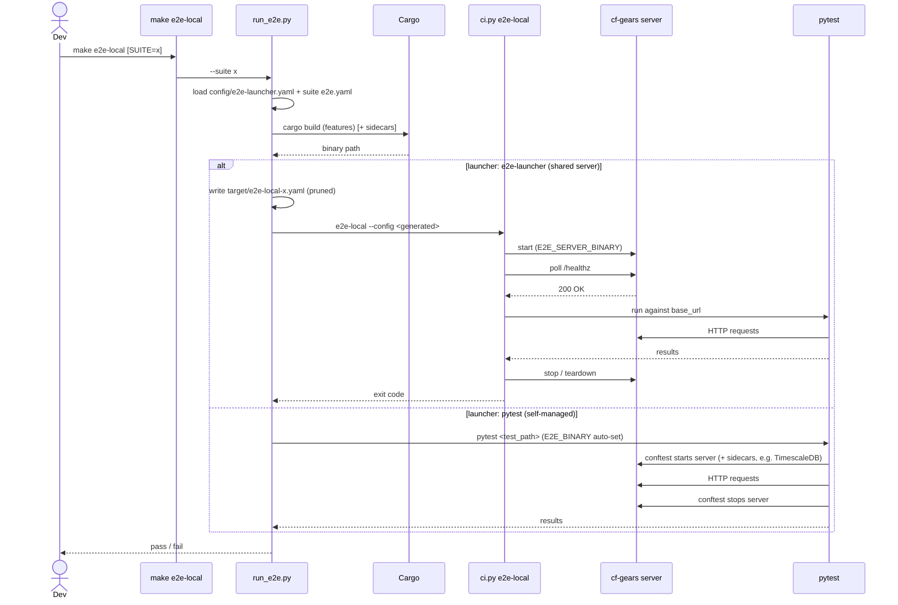

<!-- Updated: 2026-04-07 by Constructor Tech -->

# E2E Testing Guide

This directory contains end-to-end tests for the Gears example server.

## Prerequisites

- Python **3.9+** is required.
- E2E tests must run on Python **3.9 and above**.

Install Python dependencies:

```bash
pip install -r testing/e2e/requirements.txt
```

## Key terms (read this first)

A few words show up everywhere below. Here is what each one means, in plain
language:

- **Suite** — one E2E scenario, living in its own folder under
  `testing/e2e/suites/`. A suite is usually named after a gear (for example
  `file-parser`), but not always (for example `scope-enforcement`).
- **`SUITE=<name>`** — the `make` variable that picks **one** suite to run, e.g.
  `make e2e-local SUITE=file-parser`. Leave it off (`make e2e-local`) to run the
  default set of suites — see ["Running many suites at once"](#running-many-suites-at-once-plain-make-e2e-local).
- **`GEAR=<name>`** — the `make` variable that runs **every** shared-server
  suite whose Cargo `features` (in its `e2e.yaml`, including features pulled in
  via `features_file`) include that gear, e.g. `make e2e-local GEAR=credstore`
  runs the `credstore` and `oagw` suites. `SUITE=` and `GEAR=` are mutually
  exclusive.
- **Shared-server suite** — a suite that can run against **one** normal
  `cf-gears-example-server` process. In its `e2e.yaml` this is written as
  `launcher: e2e-launcher` (the default). These suites are the ones `make
  e2e-local` runs together against a single shared server. Tests just send HTTP
  requests; they don't start or stop the server themselves.
- **Self-managed suite** — a suite that needs its **own** server (different
  build features, ports, or extra infrastructure like a database container), so
  it cannot share the common server. In its `e2e.yaml` this is written as
  `launcher: pytest`, and the suite's own `conftest.py` starts and stops the
  server. These must be run one at a time (e.g. `make e2e-mini-chat`).
- **`launcher`** — the single field in a suite's `e2e.yaml` that says which of
  the two kinds above it is: `e2e-launcher` (shared server) or `pytest`
  (self-managed).

## Running E2E Tests

**`make` is the single entrypoint.** Every command below is a thin wrapper over
`tools/scripts/run_e2e.py` (the runner) and `tools/scripts/ci.py` (the engine) —
you should not need to invoke those directly. There are two modes: **local**
(default for development) and **Docker** (isolated, used in CI).

### Option 1: Docker Mode (isolated, used in CI)

Builds a Docker image and runs the tests inside it:

```bash
make e2e-docker        # all tests
make e2e-docker-smoke  # smoke tests only (@pytest.mark.smoke)
```

### Option 2: Local Mode (faster for development)

Builds the example server and runs the tests against it on your machine. There
are three ways to use it:

1. **Run one suite** — add `SUITE=<name>`. This builds a server with just that
   suite's gears and runs only that suite's tests. Use this while you iterate on
   a single gear.
2. **Run every suite for a gear** — add `GEAR=<name>`. This discovers every
   *shared-server* suite whose `e2e.yaml` `features` (or `features_file`) include
   that gear and runs each as its own focused build+run (details in ["Running
   every suite for a gear"](#running-every-suite-for-a-gear-make-e2e-local-gearname)).
3. **Run many suites at once** — leave `SUITE`/`GEAR` off. This builds one
   server and runs every *shared-server* suite against it (details in ["Running
   many suites at once"](#running-many-suites-at-once-plain-make-e2e-local)).
   *Self-managed* suites are not included here — run those one at a time with
   their own target.

```bash
make e2e-local                     # run many suites: every shared-server suite, one shared server
make e2e-local SUITE=file-parser   # run one suite: build its server + run its tests
make e2e-local GEAR=credstore      # run every shared-server suite that exercises the credstore gear
make e2e-local SUITE=mini-chat     # run one self-managed suite (it starts its own server)
make e2e-local-smoke               # smoke tests only (add SUITE=<name> or GEAR=<name> to focus)
```

## How E2E Is Executed (Architecture)

Local E2E has three cooperating pieces, each with a single responsibility:

- **`Makefile`** — thin, suite-agnostic entrypoints (`e2e-local`, `e2e-local-smoke`).
  They pass `SUITE` and `GEAR` through to the runner and contain no per-suite
  knowledge.
- **`tools/scripts/run_e2e.py`** — the *runner* / front-end. It
  decides **what to build and run** by reading config (see below), builds the
  server with the right Cargo features, builds any sidecars, and then dispatches
  to one of two backends depending on the suite's `launcher`.
- **`tools/scripts/ci.py e2e-local`** — the *orchestration engine*. It starts
  one server from a config file, waits for `/healthz`, runs pytest against the
  live HTTP API, and tears the server down. Docker mode uses the same engine.

Flow:

```
make e2e-local [SUITE=x | GEAR=g]
   └─ tools/scripts/run_e2e.py --suite x | --gear g
        │   (--gear g resolves to every e2e-launcher suite whose features list g,
        │    then runs each suite below in turn)
        ├─ build server (features from config)   [+ sidecars]
        └─ dispatch by launcher:
             ├─ launcher: e2e-launcher → tools/scripts/ci.py e2e-local --config <generated>
             │                           (ci.py starts/stops the server; tests are HTTP clients)
             └─ launcher: pytest       → python -m pytest <test_path> (E2E_BINARY auto-set)
                                        (the suite's own conftest owns the server + sidecars)
```

Sequence diagram:



### Running single e2e test suite

Use `make e2e-local SUITE=` to run all the tests in a single suite:

```bash
make e2e-local SUITE=file-parser
make e2e-local SUITE=credstore
```

Every suite has its own test configuration, see `testing/e2e/suites/{SUITE}/e2e.yaml`.

### Running every suite for a gear (`make e2e-local GEAR=<name>`)

When you run `make e2e-local GEAR=<name>`, the runner scans every
`testing/e2e/suites/<suite>/e2e.yaml`, keeps the *shared-server* suites
(`launcher: e2e-launcher`) whose resolved Cargo features include `<name>`, and
executes each one as its own focused build+run (same as `SUITE=<suite>`, one
after another). It reports a non-zero exit if any suite fails.

```bash
make e2e-local GEAR=credstore   # runs the credstore and oagw suites (both list `credstore` in features)
make e2e-local GEAR=account-management  # runs the account-management and bss-ledger suites
```

Matching is against a suite's `features`, any features pulled in via
`features_file`, and `extra_features` — no separate declaration is needed. For
example the `oagw` suite is picked up by `GEAR=credstore` because it lists
`credstore` among its features:

```yaml
suite: oagw
features:
  - oagw
  - credstore
  - static-tenants
  - static-authn
  - static-authz
```

*Self-managed* suites (`launcher: pytest`, e.g. `mini-chat`, `usage-collector`)
are skipped by `GEAR=` runs because they own their own server lifecycle. `SUITE=`
and `GEAR=` cannot be combined.

### Running many suites at once (plain `make e2e-local`)

When you run `make e2e-local` **without** `SUITE=`, it runs many suites together
in the most efficient way:

1. It builds **one** `cf-gears-example-server` that includes every E2E gear (the
   feature list comes from the `shared:` block in `config/e2e-launcher.yaml`).
2. It starts that single server once (via `ci.py`, using
   `config/e2e-local.yaml`).
3. It then runs the tests of **every shared-server suite** against that one
   server. ("Shared-server suite" = `launcher: e2e-launcher`; the list is found
   automatically by scanning each `testing/e2e/suites/<suite>/e2e.yaml`.)

**Self-managed suites are skipped by `make e2e-local`.** Suites that have
`launcher: pytest` in `testing/e2e/suites/<suite>/e2e.yaml` (`mini-chat` and
`usage-collector`) need their own server — and `usage-collector` also needs a
TimescaleDB container — so they can't use the shared server. Run each of them on
its own instead:

```bash
make e2e-mini-chat                    # or: make e2e-local SUITE=mini-chat
make e2e-usage-collector              # or: make e2e-local SUITE=usage-collector
```

### `launcher: e2e-launcher` vs `launcher: pytest`

The `launcher` field in the test suite config `testing/e2e/suites/{SUITE}/e2e.yaml` says **who owns the server lifecycle**. Two categories:

- **`e2e-launcher` (default, preferred).** The suite fits the shared server
  model: it can run inside one `cf-gears-example-server` process configured by
  `config/e2e-local.yaml`. `run_e2e.py` generates a pruned config
  (`target/e2e-local-<gear>.yaml`) containing only the gears that were built,
  hands it to `ci.py`, and `ci.py` owns the server lifecycle. Tests connect over
  HTTP via the `base_url` fixture. `E2E_SERVER_BINARY` selects the binary.
- **`pytest` (self-managed).** The suite **owns its own server and extra
  infrastructure** and cannot share the common config. Its `conftest.py`
  spawns the server itself (gated on `E2E_BINARY`, which `run_e2e.py` sets
  automatically) — sometimes per test, with different features, ports, or
  containers. Examples:
  - `mini-chat` runs an offline harness (`--mode offline`, its own
    `config/base.yaml`).
  - `usage-collector` starts its own server **and** a TimescaleDB Docker
    container (its storage plugin migrates a real TimescaleDB at init).
  Here `ci.py` is intentionally not involved; `run_e2e.py` only builds the
  binary + sidecars and invokes `pytest` directly.

Rule of thumb: use `e2e-launcher` unless the gear needs a server/sidecar
lifecycle the shared orchestrator can't express — then use `pytest` and own it
in `conftest.py`.

### Configuration Format

Focused-run knowledge is split into a **global** file and **per-suite**
manifests, so nothing is hardcoded in the Makefile or Python.

**Global defaults — `config/e2e-launcher.yaml`:**

```yaml
base_config: config/e2e-local.yaml   # base server config that focused runs prune
base_features:                       # features added to every focused build
  - static-tenants
  - static-authn
  - static-authz
core_config_gears:                   # gear config blocks always kept when pruning
  - api-gateway
  - types-registry
  # ...resolvers + static plugins
generated_config_dir: target         # where target/e2e-local-<gear>.yaml is written

config_prune:                        # declarative seed-data pruning (no literals in code)
  - path: gears.types-registry.config.entities
    match: { id_contains: "gts.cf.core.am." }
    keep_when_config_gears: [account-management]

shared:                              # used by `make e2e-local` with no SUITE=
  features_file: config/e2e-features.txt
  sidecars: [file-storage]
  launcher: e2e-launcher

sidecars:                           # named build+env, referenced by name
  file-storage:
    build: [cargo, build, -p, cf-gears-file-storage, --bin, sidecar]
    env: { FS_SIDECAR_BINARY: target/debug/sidecar }
```

**Per-suite manifest — `testing/e2e/suites/<suite>/e2e.yaml`:**

```yaml
suite: file-parser                   # suite id (canonical, with dashes); often a gear name
features:                            # Cargo features for the focused server build; also what
                                     #   `make e2e-local GEAR=<gear>` matches against
  - file-parser
  - static-tenants
  - static-authn
  - static-authz
launcher: e2e-launcher               # e2e-launcher | pytest  (default: e2e-launcher)
config_gears:                        # (e2e-launcher) gears (crates) whose config blocks to keep
  - file-parser
# binary: cf-gears-example-server    # optional: server bin to build (this is the default)
# test_path: testing/e2e/suites/file_parser  # optional: defaults to this manifest's own dir
# sidecars: [file-storage]           # optional: named sidecars to build
# env: { FOO: bar }                  # optional: extra env ({binary}/{suite} expand). E2E_BINARY
#                                    #   is auto-set for launcher: pytest — no need to declare it.
# pytest_args: [--mode, offline, -vv]  # optional: extra pytest args (both launchers)
# features_file: config/e2e-features.txt  # optional: reuse the shared feature list
# extra_features: [tr-authz]         # optional: add a few features on top of features/features_file
# config_gears: ["*"]                # optional: keep ALL base gear blocks (full-config profiles)
# config_overrides: { gears: {...} } # optional: deep-merge patch onto the (pruned) base config
# config_overlay_file: path/to.yaml  # optional: deep-merge an external overlay file first
# profiles: { <name>: { ...overrides... } }  # optional: named variants, selected with --profile
```

**Profiles (no config cloning).** A variant of a suite is a named entry under
`profiles:` in the *same* `e2e.yaml`, deep-merged over the base manifest and
selected with `--profile <name>`. Live examples:

- `testing/e2e/suites/resource_group/e2e.yaml` → profile `tr-authz` — the RG +
  AuthZ chain: `config_gears: ['*']`, `extra_features: [tr-authz,
  tenant-resolver-rg]`, and a `config_overrides` that flips two plugin
  priorities. Run: `make e2e-tr-authz` (i.e. `run_e2e.py --suite resource-group
  --profile tr-authz`).
- `testing/e2e/suites/scope_enforcement/e2e.yaml` — route-policy enforcement:
  `config_overrides` adds `route_policies` + scoped tokens and `env` sets
  `E2E_SCOPE_ENFORCEMENT=1`. Run: `make e2e-local SUITE=scope-enforcement`.

Suites that own a fully different runtime (different binary, ports, sidecars)
keep a dedicated config next to the suite, e.g.
`testing/e2e/suites/usage_collector/config.yaml`, loaded by that suite's
`conftest.py` (a `launcher: pytest` suite).

Manifest resolution: `run_e2e.py` looks for
`testing/e2e/suites/<suite_with_underscores>/e2e.yaml` first, then falls back to
scanning `**/e2e.yaml` for a matching `suite:` value (so nested paths like
`bss/ledger` are found). If no manifest exists, a sensible default is derived
(`suite` name as feature + `base_features`, `launcher: e2e-launcher`).

#### Advanced Usage

Environment Variables:

- **`E2E_BASE_URL`**: Base URL for the API (default: `http://localhost:8086`) - only used in local mode
- **`E2E_AUTH_TOKEN`**: Optional authentication token for protected endpoints

Why local E2E defaults to `8086`:

- Local E2E uses `config/e2e-local.yaml` and a dedicated E2E-oriented build/run path, which may differ from the usual development default (`8087` via `make quickstart`).
- Keeping a stable, dedicated E2E port makes lifecycle management deterministic: `tools/scripts/ci.py` can reliably start, health-check, and stop the service it launched.
- This also makes it safer to kill/restart only the E2E-owned process during test runs, without interfering with another manually started server.

#### Running individual tests against an already-running server (advanced)

Normally use `make e2e-local SUITE=<suite>` — it builds a server with exactly
the right gears and manages its lifecycle. Only if you already have a server
running (and it includes the gear under test) can you point pytest at it.

`make run` uses `config/quickstart.yaml`, which serves APIs under the `/cf`
prefix and is not the same as the E2E config. Do **not** run a whole E2E suite
against a quickstart server; some tests expect the E2E launcher, E2E config,
server lifecycle, and optional local fixtures. Use this mode only for a small
manual check against a single compatible test:

```bash
# Terminal 1 — start a server (must include the gear you want to test):
make run GEAR=file-parser   # minimal server on :8087 with the quickstart config

# Terminal 2 — run one compatible test against that already-running quickstart server:
E2E_BASE_URL=http://localhost:8087/cf python3 -m pytest testing/e2e/suites/file_parser/test_file_parser_info.py
```

To run the full file-parser E2E suite, let the E2E runner own the server:

```bash
make e2e-local SUITE=file-parser
```

#### Using auth token

```bash
E2E_BASE_URL=http://localhost:8087 E2E_AUTH_TOKEN=your-token python3 -m pytest testing/e2e/
```

### Command Line Options

You normally drive everything via `make` (above). Under the hood the runner
`tools/scripts/run_e2e.py` accepts `--suite`, `--gear` (run every e2e-launcher
suite whose resolved features include it), `--profile`, `--smoke`, and `--dry-run`
(print the build/run plan without executing it), and forwards extra pytest args
after `--`. `--suite` and `--gear` are mutually exclusive. The engine
`tools/scripts/ci.py e2e-local` accepts `--config` (server config file) and
`--smoke`.

## Writing Tests

For philosophy, patterns, anti-flaking practices, and assert guidelines see the unified guide:
[`docs/toolkit_unified_system/13_e2e_testing.md`](../../docs/toolkit_unified_system/13_e2e_testing.md)

Tests are written using pytest and httpx. See `gears/file_parser/test_file_parser_info.py` for an example.

### Add a new E2E suite

1. **Choose the suite name.** Use a dash-separated `suite:` value, for example `todo-manager`. The directory normally uses underscores: `testing/e2e/suites/todo_manager/`.
2. **Create the suite directory.** Add `__init__.py`, one or more `test_*.py` files, and usually an `e2e.yaml` manifest.
3. **Prefer `launcher: e2e-launcher`.** Use the default shared-server model unless the suite must own a custom server lifecycle, unique ports, a different runtime config, or external infrastructure.
4. **Declare the focused build.** In `e2e.yaml`, set `features` to the Cargo features needed by the server and `config_gears` to the gear config blocks that must remain in the generated focused config. `make e2e-local GEAR=<gear>` discovers the suite automatically from these `features`.
5. **Keep overlays small.** Use `config_overrides`, `config_overlay_file`, or `profiles` instead of cloning `config/e2e-local.yaml` for small variants.
6. **Run the focused suite first.** Use `make e2e-local SUITE=<suite>` while iterating, then run `make e2e-local-smoke SUITE=<suite>` if the suite has smoke tests.

Minimal shared-server suite:

```yaml
suite: todo-manager
features:
  - todo-manager
  - static-tenants
  - static-authn
  - static-authz
launcher: e2e-launcher
config_gears:
  - todo-manager
```

Use `launcher: pytest` only when the suite owns its own lifecycle. In that case, `run_e2e.py` builds the requested binary, sets `E2E_BINARY`, and invokes pytest directly; the suite's `conftest.py` must start and stop the server and any sidecars.

### Write the test file

Key fixtures available:

- `base_url`: Returns the base URL from `E2E_BASE_URL` environment variable
- `auth_headers`: Returns authorization headers if `E2E_AUTH_TOKEN` is set
- `local_files_root`: Returns the root directory for local file parsing tests
- `file_http_server`: Starts a local HTTP server serving files from `e2e/testdata`

Example:

```python
import httpx
import pytest

@pytest.mark.smoke
@pytest.mark.asyncio
async def test_my_endpoint(base_url, auth_headers):
    async with httpx.AsyncClient(timeout=10.0) as client:
        response = await client.get(
            f"{base_url}/my-endpoint",
            headers=auth_headers,
        )
        assert response.status_code == 200
```

### E2E test checklist

- **Name tests by behavior.** Prefer `test_creates_task_and_returns_location` over implementation-oriented names.
- **Mark one fast happy path as smoke.** Use `@pytest.mark.smoke` for lightweight PR coverage.
- **Assert the HTTP contract.** Check status codes, response shape, important headers, and error bodies where relevant.
- **Use deterministic data.** Generate unique resource names or IDs per test and avoid relying on test order.
- **Keep shared-server suites passive.** Do not start or stop the server in tests that use `launcher: e2e-launcher`.
- **Keep self-managed lifecycle local.** For `launcher: pytest`, put custom startup, cleanup, and external service handling in the suite's `conftest.py`.
- **Validate the manifest plan.** Use `python3 tools/scripts/run_e2e.py --suite <suite> --dry-run` when changing `e2e.yaml`.

## Quick Reference

| Command                              | Mode   | Description                              |
|--------------------------------------|--------|------------------------------------------|
| `make e2e`                           | Docker | Default: Run tests in Docker              |
| `make e2e-docker`                    | Docker | Run tests in Docker environment          |
| `make e2e-docker-smoke`              | Docker | Run only smoke tests in Docker            |
| `make e2e-local`                     | Local  | Run **many** suites: every shared-server suite against one shared server (self-managed suites skipped) |
| `make e2e-local SUITE=file-parser`   | Local  | Run **one** suite: build its server + run its tests |
| `make e2e-local-smoke`               | Local  | Smoke tests only (add `SUITE=<name>` to focus on one suite)  |
| `make e2e-mini-chat`                 | Local  | Alias for `make e2e-local SUITE=mini-chat` (self-managed, offline) |
| `make e2e-usage-collector`           | Local  | Alias for `make e2e-local SUITE=usage-collector` (self-managed; **requires Docker** for TimescaleDB) |
| `make e2e-tr-authz`                  | Local  | resource-group suite, `tr-authz` profile  |

## Troubleshooting

### Server not responding (Local Mode)

If you see "Server not responding" when running local tests:

1. Check build/startup logs in `logs/cf-gears-e2e.log` and `logs/cf-gears-e2e-error.log`
2. Check that the API is reachable on the configured port (default: 8086)
3. Verify the health endpoint: `curl http://localhost:8086/healthz`
4. Rebuild release artifacts: `make build`
5. Or use Docker mode: `make e2e-docker`

### pytest not found

Install the required dependencies:

```bash
pip install -r testing/e2e/requirements.txt
```

### Docker build fails

Make sure Docker is running and you have sufficient disk space:

```bash
docker system df
docker system prune  # if needed
```
